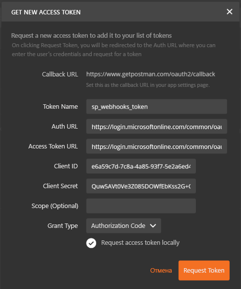

# <a name="get-started-with-sharepoint-webhooks"></a><span data-ttu-id="b1bd5-102">Начало работы с веб-перехватчиками SharePoint</span><span class="sxs-lookup"><span data-stu-id="b1bd5-102">Get started with SharePoint webhooks</span></span>

<span data-ttu-id="b1bd5-103">В этой статье описывается создание приложения, которое добавляет и обрабатывает запросы веб-перехватчиков SharePoint.</span><span class="sxs-lookup"><span data-stu-id="b1bd5-103">This article describes how to build an application that adds and handles SharePoint webhook requests.</span></span> <span data-ttu-id="b1bd5-104">Вы научитесь быстро составлять и выполнять запросы веб-перехватчиков SharePoint с помощью [клиента Postman](https://www.getpostman.com/), используя простой веб-API ASP.NET в качестве приемника веб-перехватчиков.</span><span class="sxs-lookup"><span data-stu-id="b1bd5-104">This article describes how to build an application that adds and handles SharePoint webhook requests. You will learn how to use [Postman client](https://www.getpostman.com/) to construct and execute SharePoint webhook requests quickly while interacting with a simple ASP.NET Web API as the webhook receiver.</span></span>

<span data-ttu-id="b1bd5-105">В этой статье используются простые HTTP-запросы, с помощью которых легко понять принцип работы веб-перехватчиков.</span><span class="sxs-lookup"><span data-stu-id="b1bd5-105">In this article, you will use plain HTTP requests, which is useful for helping you to understand how webhooks work.</span></span>  

## <a name="prerequisites"></a><span data-ttu-id="b1bd5-106">Необходимые компоненты</span><span class="sxs-lookup"><span data-stu-id="b1bd5-106">Prerequisites</span></span>

<span data-ttu-id="b1bd5-107">Чтобы выполнить представленные в этой статье пошаговые инструкции, скачайте и установите следующие средства:</span><span class="sxs-lookup"><span data-stu-id="b1bd5-107">To complete the step-by-step instructions in this article, download and install the following tools:</span></span>

* [<span data-ttu-id="b1bd5-108">Браузер Google Chrome</span><span class="sxs-lookup"><span data-stu-id="b1bd5-108">Google Chrome Browser</span></span>](http://google.com/chrome)
* [<span data-ttu-id="b1bd5-109">Postman</span><span class="sxs-lookup"><span data-stu-id="b1bd5-109">Postman</span></span>](https://www.getpostman.com/)
* [<span data-ttu-id="b1bd5-110">Visual Studio Community Edition</span><span class="sxs-lookup"><span data-stu-id="b1bd5-110">Visual Studio Community Edition</span></span>](https://go.microsoft.com/fwlink/?LinkId=691978&clcid=0x409)
* <span data-ttu-id="b1bd5-111">[ngrok](https://ngrok.com/) (указания по установке см. на странице [загрузки и установки](https://ngrok.com/download)).</span><span class="sxs-lookup"><span data-stu-id="b1bd5-111">[ngrok](https://ngrok.com/) - See [Download and Installation](https://ngrok.com/download) to install ngrok.</span></span>
* <span data-ttu-id="b1bd5-112">Подписка на Office 365 с SharePoint Online.</span><span class="sxs-lookup"><span data-stu-id="b1bd5-112">An Office 365 Subscription with SharePoint Online.</span></span> <span data-ttu-id="b1bd5-113">Если вы впервые используете Office 365, вы также можете [зарегистрировать учетную запись разработчика Office 365](http://dev.office.com/devprogram).</span><span class="sxs-lookup"><span data-stu-id="b1bd5-113">An Office 365 Subscription with SharePoint Online. If you are new to Office 365, you can also [sign up for an Office 365 developer account](http://dev.office.com/devprogram).</span></span>

## <a name="step-1-register-a-microsoft-azure-active-directory-ad-application-for-postman-client"></a><span data-ttu-id="b1bd5-114">Этап 1. Регистрация приложения Microsoft Azure Active Directory (AD) для клиента Postman</span><span class="sxs-lookup"><span data-stu-id="b1bd5-114">Step 1: Register a Microsoft Azure Active Directory (AD) application for Postman client</span></span>

<span data-ttu-id="b1bd5-115">Чтобы клиент Postman мог взаимодействовать с SharePoint, необходимо зарегистрировать приложение Azure AD в клиенте Azure AD, связанном с клиентом Office 365.</span><span class="sxs-lookup"><span data-stu-id="b1bd5-115">In order for the Postman client to communicate with SharePoint, you will need to register an Azure AD app in your Azure AD tenant associated with your Office 365 tenant.</span></span> 

<span data-ttu-id="b1bd5-116">Зарегистрируйте приложение как "Веб-приложение".</span><span class="sxs-lookup"><span data-stu-id="b1bd5-116">Ensure that you register the application as a "Web Application".</span></span>

<span data-ttu-id="b1bd5-117">Для доступа к SharePoint Online важно предоставить приложению Azure AD разрешения на доступ к приложению **Office 365 SharePoint Online** и выбрать разрешение **Чтение и запись элементов и списков во всех семействах веб-сайтов**.</span><span class="sxs-lookup"><span data-stu-id="b1bd5-117">To access SharePoint Online, it's important to grant the Azure AD app permissions to the **Office 365 SharePoint Online** application and select the **read and write items and lists in all site collections** permission.</span></span>

> <span data-ttu-id="b1bd5-118">Дополнительные сведения о добавлении приложения Azure AD и предоставлении разрешений приложениям см. в разделе [Добавление приложения](https://azure.microsoft.com/en-us/documentation/articles/active-directory-integrating-applications/#adding-an-application).</span><span class="sxs-lookup"><span data-stu-id="b1bd5-118">For more information about adding an Azure AD application and granting permissions to applications, see [Adding an application](https://azure.microsoft.com/en-us/documentation/articles/active-directory-integrating-applications/#adding-an-application).</span></span> 

<span data-ttu-id="b1bd5-p103">Введите указанную ниже конечную точку в качестве URL-адреса ответа (перенаправления) для приложения. Это конечная точка, на которую Azure AD будет отправлять ответ на запрос аутентификации, в том числе маркер доступа при успешной аутентификации.</span><span class="sxs-lookup"><span data-stu-id="b1bd5-p103">Enter the following endpoint as the Reply (Redirect) URL for the app. This is the endpoint to which Azure AD will send the authentication response; including the access token if authentication was successful.</span></span>

```html
https://www.getpostman.com/oauth2/callback
```

<span data-ttu-id="b1bd5-121">Также создайте "Ключ", который будет секретом клиента.</span><span class="sxs-lookup"><span data-stu-id="b1bd5-121">Also generate a "Key", which will be the client secret.</span></span>

<span data-ttu-id="b1bd5-122">Указанные ниже свойства пригодятся вам позже, поэтому скопируйте их в безопасное место.</span><span class="sxs-lookup"><span data-stu-id="b1bd5-122">The following properties are required in later steps, so copy them to a safe place:</span></span>

* <span data-ttu-id="b1bd5-123">Идентификатор клиента</span><span class="sxs-lookup"><span data-stu-id="b1bd5-123">Client Id</span></span>
* <span data-ttu-id="b1bd5-124">Client Secret</span><span class="sxs-lookup"><span data-stu-id="b1bd5-124">Client Secret</span></span> 

## <a name="step-2-build-a-webhook-receiver"></a><span data-ttu-id="b1bd5-125">Шаг 2. Создание приемника веб-перехватчиков</span><span class="sxs-lookup"><span data-stu-id="b1bd5-125">Step 2: Build a webhook receiver</span></span>

<span data-ttu-id="b1bd5-126">Чтобы создать для этого проекта приемник веб-перехватчиков, используйте проект веб-API Visual Studio.</span><span class="sxs-lookup"><span data-stu-id="b1bd5-126">For this project, use the Visual Studio Web API project to build the webhook receiver.</span></span>

### <a name="create-a-new-aspnet-web-api-project"></a><span data-ttu-id="b1bd5-127">Создание проекта веб-API ASP.NET</span><span class="sxs-lookup"><span data-stu-id="b1bd5-127">Create a new ASP.NET Web API project</span></span>

* <span data-ttu-id="b1bd5-128">Откройте Visual Studio.</span><span class="sxs-lookup"><span data-stu-id="b1bd5-128">Open Visual Studio.</span></span>
* <span data-ttu-id="b1bd5-129">Выберите команду **Файл > Создать > Проект**.</span><span class="sxs-lookup"><span data-stu-id="b1bd5-129">Choose **File > New > Project**.</span></span>
* <span data-ttu-id="b1bd5-130">В области **Шаблоны** выберите **Установленные шаблоны** и разверните узел **Visual C#**.</span><span class="sxs-lookup"><span data-stu-id="b1bd5-130">In the **Templates** pane, select **Installed Templates** and expand the **Visual C#** node.</span></span> 
* <span data-ttu-id="b1bd5-131">В разделе **Visual C#** выберите **Интернет**.</span><span class="sxs-lookup"><span data-stu-id="b1bd5-131">Under **Visual C#**, select **Web**.</span></span> <span data-ttu-id="b1bd5-132">В списке шаблонов проектов выберите **Веб-приложение ASP.NET**.</span><span class="sxs-lookup"><span data-stu-id="b1bd5-132">In the list of project templates, select **ASP.NET Web Application**.</span></span> 
* <span data-ttu-id="b1bd5-133">Назовите проект **SPWebhooksReceiver** и нажмите кнопку **ОК**.</span><span class="sxs-lookup"><span data-stu-id="b1bd5-133">Name the project **SPWebhooksReceiver** and choose **OK**.</span></span>
* <span data-ttu-id="b1bd5-134">В диалоговом окне **Новый проект ASP.NET** выберите шаблон **Веб-API** в группе **ASP.NET 4.5.\***.</span><span class="sxs-lookup"><span data-stu-id="b1bd5-134">In the **New ASP.NET Project** dialog, select the **Web API** template from the **ASP.NET 4.5.\*** group.</span></span> 
* <span data-ttu-id="b1bd5-135">Нажмите кнопку **Изменить способ проверки подлинности** и выберите **Без проверки подлинности**.</span><span class="sxs-lookup"><span data-stu-id="b1bd5-135">Change the authentication to **No Authentication** by choosing the **Change Authentication** button.</span></span>
* <span data-ttu-id="b1bd5-136">Нажмите кнопку **ОК**, чтобы создать проект веб-API.</span><span class="sxs-lookup"><span data-stu-id="b1bd5-136">Choose **OK** to create the Web API project.</span></span>

> <span data-ttu-id="b1bd5-137">**Примечание.** Вы можете снять флажок **Разместить в облаке**, так как этот проект не будет развертываться в облаке.</span><span class="sxs-lookup"><span data-stu-id="b1bd5-137">**Note:** You can uncheck the **Host in the cloud** option because this project will not be deployed to the cloud.</span></span>

<span data-ttu-id="b1bd5-138">Visual Studio создаст ваш проект.</span><span class="sxs-lookup"><span data-stu-id="b1bd5-138">Visual Studio will create your project.</span></span>

### <a name="webhook-receiver"></a><span data-ttu-id="b1bd5-139">Приемник веб-перехватчиков</span><span class="sxs-lookup"><span data-stu-id="b1bd5-139">Webhook receiver</span></span>

#### <a name="install-nuget-packages"></a><span data-ttu-id="b1bd5-140">Установка пакетов Nuget</span><span class="sxs-lookup"><span data-stu-id="b1bd5-140">Install Nuget packages</span></span>

<span data-ttu-id="b1bd5-p105">Для ведения журнала запросов, поступающих от SharePoint, используется трассировка веб-API ASP.NET. Чтобы установить пакет трассировки, сделайте следующее:</span><span class="sxs-lookup"><span data-stu-id="b1bd5-p105">Use ASP.NET Web API Tracing to log the requests coming from SharePoint. The following steps will install the tracing package:</span></span>

* <span data-ttu-id="b1bd5-143">Откройте **обозреватель решений** в Visual Studio.</span><span class="sxs-lookup"><span data-stu-id="b1bd5-143">Go to the **Solution Explorer** in Visual Studio.</span></span>
* <span data-ttu-id="b1bd5-144">Откройте контекстное меню проекта и выберите пункт **Управление пакетами NuGet…**.</span><span class="sxs-lookup"><span data-stu-id="b1bd5-144">Open the context menu (right-click) for the project and choose **Manage Nuget Packages...**.</span></span>
* <span data-ttu-id="b1bd5-145">В поле поиска введите **Microsoft.AspNet.WebApi.Tracing**.</span><span class="sxs-lookup"><span data-stu-id="b1bd5-145">In the search box, enter **Microsoft.AspNet.WebApi.Tracing**.</span></span> 
* <span data-ttu-id="b1bd5-146">В результатах поиска выберите пакет **Microsoft.AspNet.WebApi.Tracing** и нажмите кнопку **Установить**, чтобы установить пакет.</span><span class="sxs-lookup"><span data-stu-id="b1bd5-146">In the search results, select the **Microsoft.AspNet.WebApi.Tracing** package and choose **Install** to install the package.</span></span>

#### <a name="spwebhooknotification-model"></a><span data-ttu-id="b1bd5-147">Модель SPWebhookNotification</span><span class="sxs-lookup"><span data-stu-id="b1bd5-147">SPWebhookNotification model</span></span>

<span data-ttu-id="b1bd5-148">Каждое уведомление, созданное службой, сериализуется в экземпляр **webhookNotifiation**.</span><span class="sxs-lookup"><span data-stu-id="b1bd5-148">Each notification generated by the service is serialized into a **webhookNotifiation** instance:</span></span> <span data-ttu-id="b1bd5-149">Вам нужно создать простую модель, которая представляет экземпляр уведомления.</span><span class="sxs-lookup"><span data-stu-id="b1bd5-149">Each notification generated by the service is serialized into a webhookNotifiation instance. You need to build a simple model that represents this notification instance.</span></span>

* <span data-ttu-id="b1bd5-150">Откройте **обозреватель решений** в Visual Studio.</span><span class="sxs-lookup"><span data-stu-id="b1bd5-150">Go to **Solution Explorer** in Visual Studio.</span></span>
* <span data-ttu-id="b1bd5-151">Откройте контекстное меню папки **Модели** и выберите пункты **Добавить > Класс**.</span><span class="sxs-lookup"><span data-stu-id="b1bd5-151">Open the context menu (right-click) for the **Models** folder and choose **Add->Class**.</span></span>
* <span data-ttu-id="b1bd5-152">Введите имя класса **SPWebhookNotification** и нажмите кнопку **Добавить**, чтобы добавить класс в проект.</span><span class="sxs-lookup"><span data-stu-id="b1bd5-152">Enter **SPWebhookNotification** as the class name and choose **Add** to add the class to your project.</span></span>
* <span data-ttu-id="b1bd5-153">Добавьте следующий код в текст класса **SPWebhookNotification**:</span><span class="sxs-lookup"><span data-stu-id="b1bd5-153">Add the following code to the body of the **SPWebhookNotification** class:</span></span>

    ```cs
    public string SubscriptionId { get; set; }

    public string ClientState { get; set; }

    public string ExpirationDateTime { get; set; }

    public string Resource { get; set; }

    public string TenantId { get; set; }

    public string SiteUrl { get; set; }

    public string WebId { get; set; }
    ```

#### <a name="spwebhookcontent-model"></a><span data-ttu-id="b1bd5-154">Модель SPWebhookContent</span><span class="sxs-lookup"><span data-stu-id="b1bd5-154">SPWebhookContent model</span></span>

<span data-ttu-id="b1bd5-p107">Так как в одном запросе приемнику веб-перехватчиков могут отправляться несколько уведомлений, они объединяются в объект со значением единого массива. Создайте простую модель, представляющую массив.</span><span class="sxs-lookup"><span data-stu-id="b1bd5-p107">Because multiple notifications can be submitted to your webhook receiver in a single request, they are combined together in an object with a single array value. Build a simple model that represents the array.</span></span>

* <span data-ttu-id="b1bd5-157">Откройте **обозреватель решений** в Visual Studio.</span><span class="sxs-lookup"><span data-stu-id="b1bd5-157">Go to **Solution Explorer** in Visual Studio.</span></span>
* <span data-ttu-id="b1bd5-158">Откройте контекстное меню папки **Модели** и выберите пункты **Добавить > Класс**.</span><span class="sxs-lookup"><span data-stu-id="b1bd5-158">Open the context menu (right-click) for the **Models** folder and choose **Add->Class**.</span></span>
* <span data-ttu-id="b1bd5-159">Введите имя класса **SPWebhookContent** и нажмите кнопку **Добавить**, чтобы добавить класс в проект.</span><span class="sxs-lookup"><span data-stu-id="b1bd5-159">Enter **SPWebhookContent** as the class name and choose **Add** to add the class to your project.</span></span>
* <span data-ttu-id="b1bd5-160">Добавьте следующий код в текст класса **SPWebhookContent**:</span><span class="sxs-lookup"><span data-stu-id="b1bd5-160">Add the following code to the body of the **SPWebhookContent** class:</span></span>

    ```cs
     public List<SPWebhookNotification> Value { get; set; }
    ```

#### <a name="sharepoint-webhook-client-state"></a><span data-ttu-id="b1bd5-161">Состояние клиента веб-перехватчиков SharePoint</span><span class="sxs-lookup"><span data-stu-id="b1bd5-161">SharePoint webhook client state</span></span>

<span data-ttu-id="b1bd5-p108">Веб-перехватчики позволяют использовать необязательное строковое значение, возвращаемое в уведомлении для подписки. С его помощью можно проверить, действительно ли запрос поступает из доверенного источника (в данном случае — SharePoint).</span><span class="sxs-lookup"><span data-stu-id="b1bd5-p108">Webhooks provide the ability to use an optional string value that is passed back in the notification message for your subscription. This can be used to verify that the request is indeed coming from the source you trust, which in this case is SharePoint.</span></span> 

<span data-ttu-id="b1bd5-164">Добавьте значение состояния клиента, с помощью которого приложение может проверять входящие запросы.</span><span class="sxs-lookup"><span data-stu-id="b1bd5-164">Add a client state value with which the application can verify the incoming requests.</span></span>

* <span data-ttu-id="b1bd5-165">Откройте **обозреватель решений** в Visual Studio.</span><span class="sxs-lookup"><span data-stu-id="b1bd5-165">Go to **Solution Explorer** in Visual Studio.</span></span>
* <span data-ttu-id="b1bd5-166">Откройте файл **web.config** и добавьте следующий ключ состояния клиента в раздел `<appSettings>`:</span><span class="sxs-lookup"><span data-stu-id="b1bd5-166">Open the **web.config** file and add the following key as the client state to the `<appSettings>` section:</span></span>

    ```xml
    <add key="webhookclientstate" value="A0A354EC-97D4-4D83-9DDB-144077ADB449"/>
    ```

#### <a name="enable-tracing"></a><span data-ttu-id="b1bd5-167">Включение трассировки</span><span class="sxs-lookup"><span data-stu-id="b1bd5-167">Enable tracing</span></span>

<span data-ttu-id="b1bd5-168">Включите трассировку в файле **web.config**, добавив следующий код в элемент `<system.web>` в разделе `<configuration>`:</span><span class="sxs-lookup"><span data-stu-id="b1bd5-168">In the **web.config** file, enable tracing by adding the following key inside the `<system.web>` element in the `<configuration>` section:</span></span>

```xml
<trace enabled="true"/>
```

<span data-ttu-id="b1bd5-169">Вам потребуется средство записи трассировки, поэтому его следует добавить в конфигурацию контроллера (в данном случае используйте конфигурацию из **System.Diagnostics**).</span><span class="sxs-lookup"><span data-stu-id="b1bd5-169">A trace writer is required, so you must add a trace writer to the controller configuration (in this case use the one from **System.Diagnostics**).</span></span>

* <span data-ttu-id="b1bd5-170">Откройте **обозреватель решений** в Visual Studio.</span><span class="sxs-lookup"><span data-stu-id="b1bd5-170">Go to **Solution Explorer** in Visual Studio.</span></span>
* <span data-ttu-id="b1bd5-171">Откройте файл **WebApiConfig.cs** в папке **App_Start**.</span><span class="sxs-lookup"><span data-stu-id="b1bd5-171">Open **WebApiConfig.cs** in the **App_Start** folder.</span></span>
* <span data-ttu-id="b1bd5-172">Добавьте следующую строку в метод **Register**:</span><span class="sxs-lookup"><span data-stu-id="b1bd5-172">Add the following line inside the **Register** method:</span></span>

    ```cs
    config.EnableSystemDiagnosticsTracing();
    ```

#### <a name="sharepoint-webhook-controller"></a><span data-ttu-id="b1bd5-173">Контроллер веб-перехватчиков SharePoint</span><span class="sxs-lookup"><span data-stu-id="b1bd5-173">SharePoint webhook controller</span></span>

<span data-ttu-id="b1bd5-174">Теперь создайте контроллер приемника веб-перехватчиков, который будет обрабатывать входящие запросы из SharePoint.</span><span class="sxs-lookup"><span data-stu-id="b1bd5-174">Now build the webhook receiver controller that will handle the incoming requests from SharePoint and take action accordingly.</span></span>

* <span data-ttu-id="b1bd5-175">Откройте **обозреватель решений** в Visual Studio.</span><span class="sxs-lookup"><span data-stu-id="b1bd5-175">Go to **Solution Explorer** in Visual Studio.</span></span>
* <span data-ttu-id="b1bd5-176">Откройте контекстное меню папки **Контроллеры** и выберите пункты **Добавить > Контроллер**.</span><span class="sxs-lookup"><span data-stu-id="b1bd5-176">Open the context menu (right-click) for the **Controllers** folder and choose **Add->Controller**.</span></span>
* <span data-ttu-id="b1bd5-177">В диалоговом окне **Добавление шаблона** выберите **Контроллер Web API 2 — пустой**.</span><span class="sxs-lookup"><span data-stu-id="b1bd5-177">In the **Add Scaffold** dialog, select **Web API 2 Controller - Empty**.</span></span>
* <span data-ttu-id="b1bd5-178">Нажмите кнопку **Добавить**.</span><span class="sxs-lookup"><span data-stu-id="b1bd5-178">Choose **Add**.</span></span>
* <span data-ttu-id="b1bd5-179">Назовите контроллер **SPWebhookController** и нажмите кнопку **Добавить**, чтобы добавить контроллер API к проекту.</span><span class="sxs-lookup"><span data-stu-id="b1bd5-179">Name the controller **SPWebhookController** and choose **Add** to add the API controller to your project.</span></span>
* <span data-ttu-id="b1bd5-180">Замените операторы `using` следующим кодом:</span><span class="sxs-lookup"><span data-stu-id="b1bd5-180">Replace the `using` statements with the following code:</span></span>

    ```cs
    using Newtonsoft.Json;
    using SPWebhooksReceiver.Models;
    using System.Collections.Generic;
    using System.Configuration;
    using System.Linq;
    using System.Net;
    using System.Net.Http;
    using System.Threading.Tasks;
    using System.Web;
    using System.Web.Http;
    using System.Web.Http.Tracing;
    ```

* <span data-ttu-id="b1bd5-181">Замените код класса **SPWebhookController** следующим кодом:</span><span class="sxs-lookup"><span data-stu-id="b1bd5-181">Replace the code in the **SPWebhookController** class with the following code:</span></span>

    ```cs
    [HttpPost]
    public HttpResponseMessage HandleRequest()
    {
        HttpResponseMessage httpResponse = new HttpResponseMessage(HttpStatusCode.BadRequest);
        var traceWriter = Configuration.Services.GetTraceWriter();
        string validationToken = string.Empty;
        IEnumerable<string> clientStateHeader = new List<string>();
        string webhookClientState = ConfigurationManager.AppSettings["webhookclientstate"].ToString();

        if (Request.Headers.TryGetValues("ClientState", out clientStateHeader))
        {
            string clientStateHeaderValue = clientStateHeader.FirstOrDefault() ?? string.Empty;

            if (!string.IsNullOrEmpty(clientStateHeaderValue) && clientStateHeaderValue.Equals(webhookClientState))
            {
                traceWriter.Trace(Request, "SPWebhooks", 
                    TraceLevel.Info, 
                    string.Format("Received client state: {0}", clientStateHeaderValue));

                var queryStringParams = HttpUtility.ParseQueryString(Request.RequestUri.Query);

                if (queryStringParams.AllKeys.Contains("validationtoken"))
                {
                    httpResponse = new HttpResponseMessage(HttpStatusCode.OK);
                    validationToken = queryStringParams.GetValues("validationtoken")[0].ToString();
                    httpResponse.Content = new StringContent(validationToken);

                    traceWriter.Trace(Request, "SPWebhooks", 
                        TraceLevel.Info, 
                        string.Format("Received validation token: {0}", validationToken));                        
                    return httpResponse;
                }
                else
                {
                    var requestContent = Request.Content.ReadAsStringAsync().Result;

                    if (!string.IsNullOrEmpty(requestContent))
                    {
                        SPWebhookNotification notification = null;

                        try
                        {
                            var objNotification = JsonConvert.DeserializeObject<SPWebhookContent>(requestContent);
                            notification = objNotification.Value[0];
                        }
                        catch (JsonException ex)
                        {
                            traceWriter.Trace(Request, "SPWebhooks", 
                                TraceLevel.Error, 
                                string.Format("JSON deserialization error: {0}", ex.InnerException));
                            return httpResponse;
                        }

                        if (notification != null)
                        {
                            Task.Factory.StartNew(() =>
                            {
                                 //handle the notification here
                                 //you can send this to an Azure queue to be processed later
                                //for this sample, we just log to the trace

                                traceWriter.Trace(Request, "SPWebhook Notification", 
                                    TraceLevel.Info, string.Format("Resource: {0}", notification.Resource));
                                traceWriter.Trace(Request, "SPWebhook Notification", 
                                    TraceLevel.Info, string.Format("SubscriptionId: {0}", notification.SubscriptionId));
                                traceWriter.Trace(Request, "SPWebhook Notification", 
                                    TraceLevel.Info, string.Format("TenantId: {0}", notification.TenantId));
                                traceWriter.Trace(Request, "SPWebhook Notification", 
                                    TraceLevel.Info, string.Format("SiteUrl: {0}", notification.SiteUrl));
                                traceWriter.Trace(Request, "SPWebhook Notification", 
                                    TraceLevel.Info, string.Format("WebId: {0}", notification.WebId));
                                traceWriter.Trace(Request, "SPWebhook Notification", 
                                    TraceLevel.Info, string.Format("ExpirationDateTime: {0}", notification.ExpirationDateTime));

                            });

                            httpResponse = new HttpResponseMessage(HttpStatusCode.OK);
                        }
                    }
                }
            }
            else
            {
                httpResponse = new HttpResponseMessage(HttpStatusCode.Forbidden);
            }
        }

        return httpResponse;
    }
    ```

* <span data-ttu-id="b1bd5-182">Сохраните файл.</span><span class="sxs-lookup"><span data-stu-id="b1bd5-182">Save the file.</span></span>

## <a name="step-3-debug-the-webhook-receiver"></a><span data-ttu-id="b1bd5-183">Шаг 3. Отладка приемника веб-перехватчиков</span><span class="sxs-lookup"><span data-stu-id="b1bd5-183">Step 3: Debug the webhook receiver</span></span>

* <span data-ttu-id="b1bd5-184">Нажмите клавишу **F5** для отладки приемника веб-перехватчиков.</span><span class="sxs-lookup"><span data-stu-id="b1bd5-184">Choose **F5** to debug the webhook receiver.</span></span>
* <span data-ttu-id="b1bd5-185">Скопируйте номер порта из адресной строки браузера.</span><span class="sxs-lookup"><span data-stu-id="b1bd5-185">When you have the browser open, copy the port number from the address bar. For example: http://localhost:<port-number.</span></span> <span data-ttu-id="b1bd5-186">Пример: **http://localhost:<_номер_порта_>**.</span><span class="sxs-lookup"><span data-stu-id="b1bd5-186">For example: **http://localhost:<_port-number_>**.</span></span>

## <a name="step-4-run-ngrok-proxy"></a><span data-ttu-id="b1bd5-187">Этап 4. Запуск прокси-сервера ngrok</span><span class="sxs-lookup"><span data-stu-id="b1bd5-187">Step 4: Run ngrok proxy</span></span>

* <span data-ttu-id="b1bd5-188">Откройте терминал консоли.</span><span class="sxs-lookup"><span data-stu-id="b1bd5-188">Open a console terminal.</span></span>
* <span data-ttu-id="b1bd5-189">Перейдите к папке, в которую вы распаковали ngrok.</span><span class="sxs-lookup"><span data-stu-id="b1bd5-189">Go to the extracted ngrok folder.</span></span>
* <span data-ttu-id="b1bd5-190">Чтобы запустить ngrok, введите следующую команду с номером порта, скопированным на предыдущем шаге:</span><span class="sxs-lookup"><span data-stu-id="b1bd5-190">Enter the following with the port number URL from the previous step to start ngrok:</span></span>

    ```
    ./ngrok http port-number --host-header=localhost:port-number
    ```

* <span data-ttu-id="b1bd5-191">Должен запуститься ngrok.</span><span class="sxs-lookup"><span data-stu-id="b1bd5-191">You should see ngrok running.</span></span>
* <span data-ttu-id="b1bd5-192">Скопируйте HTTPS-адрес **переадресации**.</span><span class="sxs-lookup"><span data-stu-id="b1bd5-192">Copy the **Forwarding** HTTPS address.</span></span> <span data-ttu-id="b1bd5-193">Этот адрес будет использоваться в качестве прокси-сервера службы для отправки запросов из SharePoint.</span><span class="sxs-lookup"><span data-stu-id="b1bd5-193">Copy the Forwarding HTTPS address. You will use this address as the service proxy for SharePoint to send requests.</span></span> 

## <a name="step-5-add-webhook-subscription-using-postman"></a><span data-ttu-id="b1bd5-194">Этап 5. Добавление подписки на веб-перехватчик с помощью Postman</span><span class="sxs-lookup"><span data-stu-id="b1bd5-194">Step 5: Add webhook subscription using Postman</span></span>

### <a name="get-new-access-token"></a><span data-ttu-id="b1bd5-195">Получение нового маркера доступа</span><span class="sxs-lookup"><span data-stu-id="b1bd5-195">Get new access token</span></span>

<span data-ttu-id="b1bd5-p111">Postman значительно упрощает работу с API. Для начала настройте аутентификацию Postman с помощью Azure AD, чтобы отправлять запросы API в SharePoint. Вы будете использовать приложение Azure AD, зарегистрированное на шаге 1.</span><span class="sxs-lookup"><span data-stu-id="b1bd5-p111">Postman makes it really simple to work with APIs. The first step is to configure Postman to authenticate with Azure AD so you can send API requests to SharePoint. You will use the Azure AD app that you registered in Step 1.</span></span>

* <span data-ttu-id="b1bd5-199">Откройте Postman.</span><span class="sxs-lookup"><span data-stu-id="b1bd5-199">Open Postman.</span></span>
* <span data-ttu-id="b1bd5-200">Вы увидите **боковую панель** и **редактор запросов**.</span><span class="sxs-lookup"><span data-stu-id="b1bd5-200">You will be presented with a **Sidebar** and **Request Editor**.</span></span>
* <span data-ttu-id="b1bd5-201">Выберите вкладку **Authorization** (Авторизация) в **редакторе запросов**.</span><span class="sxs-lookup"><span data-stu-id="b1bd5-201">Choose the **Authorization** tab in the **Request Editor**.</span></span>
* <span data-ttu-id="b1bd5-202">Выберите **OAuth 2.0** в раскрывающемся списке **Type** (Тип).</span><span class="sxs-lookup"><span data-stu-id="b1bd5-202">Choose **OAuth 2.0** in the **Type** dropdown list.</span></span>
* <span data-ttu-id="b1bd5-203">Нажмите кнопку **Get New Access Token** (Получить новый маркер доступа).</span><span class="sxs-lookup"><span data-stu-id="b1bd5-203">Choose the **Get New Access Token** button.</span></span>
* <span data-ttu-id="b1bd5-204">В диалоговом окне введите следующее:</span><span class="sxs-lookup"><span data-stu-id="b1bd5-204">In the dialog window, enter the following:</span></span> 
    * <span data-ttu-id="b1bd5-205">Auth URL:</span><span class="sxs-lookup"><span data-stu-id="b1bd5-205">Auth URL:</span></span> 
       * <span data-ttu-id="b1bd5-206">**https://login.microsoftonline.com/common/oauth2/authorize?resource=https%3A%2F%2F<_your-sharepoint-tenant-url-without-https_>**</span><span class="sxs-lookup"><span data-stu-id="b1bd5-206">**https://login.microsoftonline.com/common/oauth2/authorize?resource=https%3A%2F%2F<_your-sharepoint-tenant-url-without-https_>**</span></span>
       * <span data-ttu-id="b1bd5-207">Замените _your-sharepoint-tenant-url-without-https_ на URL-адрес клиента без префикса **https**.</span><span class="sxs-lookup"><span data-stu-id="b1bd5-207">Replace _your-sharepoint-tenant-url-without-https_ with your tenant url without the **https** prefix.</span></span>
    * <span data-ttu-id="b1bd5-208">Access Token URL:</span><span class="sxs-lookup"><span data-stu-id="b1bd5-208">Access Token URL:</span></span>
        * <span data-ttu-id="b1bd5-209">**https://login.microsoftonline.com/common/oauth2/token**</span><span class="sxs-lookup"><span data-stu-id="b1bd5-209">**https://login.microsoftonline.com/common/oauth2/token**</span></span>
    * <span data-ttu-id="b1bd5-210">Client Id:</span><span class="sxs-lookup"><span data-stu-id="b1bd5-210">Client Id:</span></span> 
        * <span data-ttu-id="b1bd5-211">Идентификатор клиента для приложения, зарегистрированного на шаге 1.</span><span class="sxs-lookup"><span data-stu-id="b1bd5-211">Client Id of the app you registered previously in Step one.</span></span>
    * <span data-ttu-id="b1bd5-212">Client Secret:</span><span class="sxs-lookup"><span data-stu-id="b1bd5-212">Client Secret:</span></span> 
        * <span data-ttu-id="b1bd5-213">Секрет клиента для приложения, зарегистрированного на шаге 1.</span><span class="sxs-lookup"><span data-stu-id="b1bd5-213">Client Secret of the app you registered previously in Step one.</span></span>
    * <span data-ttu-id="b1bd5-214">Token name:</span><span class="sxs-lookup"><span data-stu-id="b1bd5-214">Token name:</span></span>
        * <span data-ttu-id="b1bd5-215">sp_webhooks_token</span><span class="sxs-lookup"><span data-stu-id="b1bd5-215">sp_webhooks_token</span></span>
    * <span data-ttu-id="b1bd5-216">Grant type:</span><span class="sxs-lookup"><span data-stu-id="b1bd5-216">Grant type:</span></span>
        * <span data-ttu-id="b1bd5-217">Authorization Code</span><span class="sxs-lookup"><span data-stu-id="b1bd5-217">Authorization Code</span></span>
* <span data-ttu-id="b1bd5-218">Нажмите **Request Token** (Запросить маркер), чтобы войти, согласиться и получить маркер для сеанса.</span><span class="sxs-lookup"><span data-stu-id="b1bd5-218">Choose the **Request Token** to sign in, consent, and get the token for the session.</span></span>
* <span data-ttu-id="b1bd5-219">После успешного получения маркера на вкладке **Authorization** (Авторизация) должна появиться переменная **access\_token**.</span><span class="sxs-lookup"><span data-stu-id="b1bd5-219">When the token is successfully retrieved, you should see **access\_token** variable added to the **Authorization** tab</span></span>
* <span data-ttu-id="b1bd5-220">Нажмите **Add token to header** (Добавить маркер к заголовку).</span><span class="sxs-lookup"><span data-stu-id="b1bd5-220">Select the option to **Add token to header**.</span></span>
* <span data-ttu-id="b1bd5-221">Дважды щелкните переменную **access\_token**, чтобы добавить маркер к заголовку запроса.</span><span class="sxs-lookup"><span data-stu-id="b1bd5-221">Double-click the **access\_token** variable to add the token to the header for the request.</span></span>



### <a name="get-documents-list-id"></a><span data-ttu-id="b1bd5-223">Получение идентификатора списка документов</span><span class="sxs-lookup"><span data-stu-id="b1bd5-223">Get Documents list Id</span></span>

<span data-ttu-id="b1bd5-224">Вам необходимо управлять веб-перехватчиками для стандартной библиотеки документов **Документы**, подготовленной в семействе веб-сайтов по умолчанию.</span><span class="sxs-lookup"><span data-stu-id="b1bd5-224">You need to manage webhooks for the default document library, which is provisioned in your default site collection under the name Documents. Get the Id of this list by issuing a GET request:</span></span> <span data-ttu-id="b1bd5-225">Чтобы получить идентификатор этого списка, отправьте запрос **GET**:</span><span class="sxs-lookup"><span data-stu-id="b1bd5-225">Get the Id of this list by issuing a **GET** request:</span></span>

* <span data-ttu-id="b1bd5-226">Введите следующий URL-адрес запроса:</span><span class="sxs-lookup"><span data-stu-id="b1bd5-226">Enter the following request URL:</span></span>

    ```
    https://site-collection/_api/web/lists/getbytitle('Documents')?$select=Title,Id
    ```

> <span data-ttu-id="b1bd5-227">Замените _site-collection_ на имя вашего семейства веб-сайтов.</span><span class="sxs-lookup"><span data-stu-id="b1bd5-227">Replace _site-collection_ with your site collection.</span></span>
    
<span data-ttu-id="b1bd5-228">Если запрос будет выполнен, вы увидите результат.</span><span class="sxs-lookup"><span data-stu-id="b1bd5-228">Postman will execute your request and if successful, you should see the result.</span></span>

<span data-ttu-id="b1bd5-229">Скопируйте значение **Id** из результатов.</span><span class="sxs-lookup"><span data-stu-id="b1bd5-229">Copy the **Id** from the results.</span></span> <span data-ttu-id="b1bd5-230">Это значение **Id** потребуется позже для отправки запросов к веб-перехватчикам.</span><span class="sxs-lookup"><span data-stu-id="b1bd5-230">Copy the Id from the results. Later you will use the **Id** to make webhook requests.</span></span>   

### <a name="add-webhook-subscription"></a><span data-ttu-id="b1bd5-231">Добавление подписки на веб-перехватчик</span><span class="sxs-lookup"><span data-stu-id="b1bd5-231">Add webhook subscription</span></span>

<span data-ttu-id="b1bd5-p114">Теперь, когда у вас есть необходимые сведения, составьте запрос на добавление подписки на веб-перехватчик. С помощью редактора запросов сделайте следующее:</span><span class="sxs-lookup"><span data-stu-id="b1bd5-p114">Now that you have the required information, construct the query and the request to add a webhook subscription. Use the request editor for the following steps:</span></span>

* <span data-ttu-id="b1bd5-234">Замените запрос **GET** на запрос **POST**.</span><span class="sxs-lookup"><span data-stu-id="b1bd5-234">Change the request to **POST** from **GET**.</span></span>
* <span data-ttu-id="b1bd5-235">Введите следующий URL-адрес запроса:</span><span class="sxs-lookup"><span data-stu-id="b1bd5-235">Enter the following as the request URL:</span></span>

    ```
    https://site-collection/_api/web/lists('list-id')/subscriptions
    ```

> <span data-ttu-id="b1bd5-236">Замените _site-collection_ на имя вашего семейства веб-сайтов.</span><span class="sxs-lookup"><span data-stu-id="b1bd5-236">Replace _site-collection_ with your site collection.</span></span>

* <span data-ttu-id="b1bd5-237">Перейдите на вкладку **Headers** (Запросы).</span><span class="sxs-lookup"><span data-stu-id="b1bd5-237">Go to the **Headers** tab.</span></span>
* <span data-ttu-id="b1bd5-238">Убедитесь, что у вас по-прежнему есть заголовок **Authorization**.</span><span class="sxs-lookup"><span data-stu-id="b1bd5-238">Make sure you still have the **Authorization** header. If not, you will need to request a new access token.</span></span> <span data-ttu-id="b1bd5-239">В противном случае потребуется запросить новый маркер доступа.</span><span class="sxs-lookup"><span data-stu-id="b1bd5-239">Make sure you still have the Authorization header. If not, you will need to request a new access token.</span></span>
* <span data-ttu-id="b1bd5-240">Добавьте следующие пары **ключ -> значение** для заголовка:</span><span class="sxs-lookup"><span data-stu-id="b1bd5-240">Add the following header **key -> value** pairs:</span></span>
    * <span data-ttu-id="b1bd5-241">Accept -> application/json;odata=nometadata</span><span class="sxs-lookup"><span data-stu-id="b1bd5-241">Accept -> application/json;odata=nometadata</span></span>
    * <span data-ttu-id="b1bd5-242">Content-Type -> application/json</span><span class="sxs-lookup"><span data-stu-id="b1bd5-242">Content-Type -> application/json</span></span>

* <span data-ttu-id="b1bd5-243">Перейдите на вкладку **Body** (Текст) и выберите формат **raw**.</span><span class="sxs-lookup"><span data-stu-id="b1bd5-243">Go to the **Body** tab and select **raw** format.</span></span>
* <span data-ttu-id="b1bd5-244">Вставьте в качестве текста следующий код JSON:</span><span class="sxs-lookup"><span data-stu-id="b1bd5-244">Paste the following JSON as the body:</span></span>

    ```json
    {
      "resource": "https://site-collection/_api/web/lists('list-id')",
      "notificationUrl": "https://ngrok-forwarding-address/api/spwebhook/handlerequest",
      "expirationDateTime": "2016-10-27T16:17:57+00:00",
      "clientState": "A0A354EC-97D4-4D83-9DDB-144077ADB449"
    }
    ```

    

> <span data-ttu-id="b1bd5-246">Убедитесь, что значение **expirationDateTime** превышает текущую дату не более чем на 6 месяцев.</span><span class="sxs-lookup"><span data-stu-id="b1bd5-246">Make sure the **expirationDateTime** is at most 6 months from today.</span></span> 

* <span data-ttu-id="b1bd5-247">Убедитесь, что отладка веб-перехватчика выполняется так же, как на шаге 4.</span><span class="sxs-lookup"><span data-stu-id="b1bd5-247">Make sure you are debugging the webhook receiver as in Step 4.</span></span>
* <span data-ttu-id="b1bd5-248">Нажмите кнопку **Send** (Отправить), чтобы выполнить запрос.</span><span class="sxs-lookup"><span data-stu-id="b1bd5-248">Choose **Send** to execute the request.</span></span>
* <span data-ttu-id="b1bd5-p116">Если запрос будет выполнен, появится ответ от SharePoint со сведениями о подписке. В следующем примере показан ответ для новой подписки:</span><span class="sxs-lookup"><span data-stu-id="b1bd5-p116">If the request is successful, you should see the response from SharePoint that provides the subscription details. The following example shows a response for a newly created subscription:</span></span>

    ```json
    {
      "clientState": "A0A354EC-97D4-4D83-9DDB-144077ADB449",
      "expirationDateTime": "2016-10-27T16:17:57Z",
      "id": "32b95d9-4d20-4a17-bfa3-2957cb38ead8",
      "notificationUrl": "https://85557d4b.ngrok.io/api/spwebhook/handlerequest",
      "resource": "c34420f9-2ad7-4e54-94c9-b67798d2299b"
    }
    ```

* <span data-ttu-id="b1bd5-251">Скопируйте значение **id** подписки. Оно потребуется для следующего набора запросов.</span><span class="sxs-lookup"><span data-stu-id="b1bd5-251">Copy the subscription **id**. You will need it for the next set of requests.</span></span>
* <span data-ttu-id="b1bd5-252">Перейдите к проекту приемника веб-перехватчиков в Visual Studio и просмотрите окно **Вывод**.</span><span class="sxs-lookup"><span data-stu-id="b1bd5-252">Go to the webhook receiver project in Visual Studio and examine the **Output** window. You should see the trace logs that look similar to the following trace, along with other messages:</span></span> <span data-ttu-id="b1bd5-253">В нем (наряду с другими сообщениями) должны отображаться журналы трассировки, подобные следующему:</span><span class="sxs-lookup"><span data-stu-id="b1bd5-253">Go to the webhook receiver project in Visual Studio and examine the Output window. You should see the trace logs that look similar to the following trace, along with other messages:</span></span>

    ```
    iisexpress.exe Information: 0 : Message='Received client state: A0A354EC-97D4-4D83-9DDB-144077ADB449'
    iisexpress.exe Information: 0 : Message='Received validation token: daf2803c-43cf-44c7-8dff-7066eaa40f13'
    ```

<span data-ttu-id="b1bd5-p118">Трассировка указывает, что веб-перехватчик получил запрос на проверку. Изучив этот код, вы заметите, что он сразу возвращает маркер проверки, чтобы SharePoint мог проверить запрос:</span><span class="sxs-lookup"><span data-stu-id="b1bd5-p118">The trace indicates that the webhook received initially received a validation request. If you look at the code, you'll see that it returns the validation token immediately so that SharePoint can validate the request:</span></span>

```cs
if (queryStringParams.AllKeys.Contains("validationtoken"))
{
    httpResponse = new HttpResponseMessage(HttpStatusCode.OK);
    validationToken = queryStringParams.GetValues("validationtoken")[0].ToString();
    httpResponse.Content = new StringContent(validationToken);

    traceWriter.Trace(Request, "SPWebhooks", 
        TraceLevel.Info, 
        string.Format("Received validation token: {0}", validationToken));                        
    return httpResponse;
}
```

## <a name="step-6-get-subscription-details"></a><span data-ttu-id="b1bd5-256">Шаг 6. Получение сведений о подписке</span><span class="sxs-lookup"><span data-stu-id="b1bd5-256">Step 6: Get subscription details</span></span>

<span data-ttu-id="b1bd5-257">Теперь мы выполним запросы на получение сведений о подписке в Postman.</span><span class="sxs-lookup"><span data-stu-id="b1bd5-257">Now you'll run queries in Postman to get the subscription details.</span></span>

* <span data-ttu-id="b1bd5-258">Откройте клиент Postman.</span><span class="sxs-lookup"><span data-stu-id="b1bd5-258">Open the Postman client.</span></span>
* <span data-ttu-id="b1bd5-259">Замените запрос **POST** на запрос **GET**.</span><span class="sxs-lookup"><span data-stu-id="b1bd5-259">Change the request to **GET** from **POST**.</span></span>
* <span data-ttu-id="b1bd5-260">Введите следующий запрос:</span><span class="sxs-lookup"><span data-stu-id="b1bd5-260">Enter the following as the request:</span></span>

    ```
    https://site-collection/_api/web/lists('list-id')/subscriptions
    ```

> <span data-ttu-id="b1bd5-261">Замените _site-collection_ на имя вашего семейства веб-сайтов.</span><span class="sxs-lookup"><span data-stu-id="b1bd5-261">Replace _site-collection_ with your site collection.</span></span>

* <span data-ttu-id="b1bd5-262">Нажмите кнопку **Send** (Отправить), чтобы выполнить запрос.</span><span class="sxs-lookup"><span data-stu-id="b1bd5-262">Choose **Send** to execute the request.</span></span>

<span data-ttu-id="b1bd5-p119">Если запрос будет выполнен, SharePoint вернет подписки для этого ресурса списка. Так как мы только что добавили подписку, должна появиться хотя бы одна подписка. В следующем примере показан ответ с одной подпиской:</span><span class="sxs-lookup"><span data-stu-id="b1bd5-p119">If successful, you should see SharePoint return the subscriptions for this list resource. Because we just added one, you should at least see one subscription returned. The following example shows a response with one subscription:</span></span>

    ```json
    {
      "value": [
        {
          "clientState": "A0A354EC-97D4-4D83-9DDB-144077ADB449",
          "expirationDateTime": "2016-10-27T16:17:57Z",
          "id": "32b95add-4d20-4a17-bfa3-2957cb38ead8",
          "notificationUrl": "https://85557d4b.ngrok.io/api/spwebhook/handlerequest",
          "resource": "c34420f9-2a67-4e54-94c9-b67798229f9b"
        }
      ]
    }
    ```

<span data-ttu-id="b1bd5-266">Вы можете выполнить следующий запрос, чтобы получить сведения о подписке:</span><span class="sxs-lookup"><span data-stu-id="b1bd5-266">You can run the following query to get details of the specific subscription:</span></span>

    ```
    https://site-collection/_api/web/lists('list-id')/subscriptions('subscription-id')
    ```

> <span data-ttu-id="b1bd5-267">Замените subscription-id на идентификатор вашей подписки.</span><span class="sxs-lookup"><span data-stu-id="b1bd5-267">Replace subscription-id with your subscription id</span></span> 

## <a name="step-7-test-webhook-notification"></a><span data-ttu-id="b1bd5-268">Шаг 7. Тестирование уведомления веб-перехватчика</span><span class="sxs-lookup"><span data-stu-id="b1bd5-268">Step 7: Test webhook notification</span></span>

<span data-ttu-id="b1bd5-269">Теперь добавьте файл в библиотеку документов и проверьте, приходит ли уведомление из SharePoint в приемник веб-перехватчиков.</span><span class="sxs-lookup"><span data-stu-id="b1bd5-269">Now add a file to the Documents library and test if you get a notification from SharePoint in the webhook receiver.</span></span>

* <span data-ttu-id="b1bd5-270">Откройте Visual Studio.</span><span class="sxs-lookup"><span data-stu-id="b1bd5-270">Go to Visual Studio.</span></span>
* <span data-ttu-id="b1bd5-271">В элементе **SPWebhookController** добавьте точку останова на следующей строке кода:</span><span class="sxs-lookup"><span data-stu-id="b1bd5-271">In the **SPWebhookController** place a breakpoint on the following line of code:</span></span>

    ```cs
    var requestContent = Request.Content.ReadAsStringAsync().Result;
    ```

* <span data-ttu-id="b1bd5-272">Перейдите к библиотеке **Документы**.</span><span class="sxs-lookup"><span data-stu-id="b1bd5-272">Go to the **Documents** library.</span></span> <span data-ttu-id="b1bd5-273">В семействе веб-сайтов по умолчанию она будет называться **Общие документы**.</span><span class="sxs-lookup"><span data-stu-id="b1bd5-273">Go to the Documents library. It will be named **Shared Documents** library in your default site collection.</span></span>
* <span data-ttu-id="b1bd5-274">Добавьте новый файл.</span><span class="sxs-lookup"><span data-stu-id="b1bd5-274">Add a new file.</span></span>
* <span data-ttu-id="b1bd5-275">Откройте Visual Studio и подождите, пока не будет достигнута точка останова.</span><span class="sxs-lookup"><span data-stu-id="b1bd5-275">Go to Visual Studio and wait for the breakpoint to be hit.</span></span>
   * <span data-ttu-id="b1bd5-p121">Это может занять от нескольких секунд до пяти минут. Когда будет достигнута точка останова, это означает, что приемник веб-перехватчиков только что получил уведомление от SharePoint.</span><span class="sxs-lookup"><span data-stu-id="b1bd5-p121">Wait time may vary from a few seconds up to five minutes. When the breakpoint is hit, the webhook receiver has just received a notification from SharePoint.</span></span>
* <span data-ttu-id="b1bd5-278">Нажмите клавишу **F5**, чтобы продолжить.</span><span class="sxs-lookup"><span data-stu-id="b1bd5-278">Choose **F5** to continue.</span></span>
* <span data-ttu-id="b1bd5-279">Чтобы увидеть данные уведомления, найдите следующие записи в окне **Выходные данные**, так как вы добавили данные уведомления в журнал трассировки:</span><span class="sxs-lookup"><span data-stu-id="b1bd5-279">To see the notification data, look in the **Output** window for the following entries, since you added the notification data into the trace log:</span></span>

    ```
    iisexpress.exe Information: 0 : Message='Resource: c34420f9-2a67-4e54-94c9-b6770892299b'
    iisexpress.exe Information: 0 : Message='SubscriptionId: 32b95ad9-4d20-4a17-bfa3-2957cb38ead8'
    iisexpress.exe Information: 0 : Message='TenantId: 7a17cb7d-6898-423f-8839-45f363076f06'
    iisexpress.exe Information: 0 : Message='SiteUrl: /'
    iisexpress.exe Information: 0 : Message='WebId: 62b80e0b-f889-4974-a519-cc138413be40'
    iisexpress.exe Information: 0 : Message='ExpirationDateTime: 2016-10-27T16:17:57.0000000Z'
    ```

<span data-ttu-id="b1bd5-p122">Этот проект просто записывает сведения в журнал трассировки. Однако в вашем приемнике эти сведения будут отправляться в таблицу или очередь, которая может обрабатывать полученные данные для получения сведений из SharePoint.</span><span class="sxs-lookup"><span data-stu-id="b1bd5-p122">This project just writes the information to the trace log. However, in your receiver, you will send this information into a table or a queue that can process the received data to get information from SharePoint.</span></span> 

<span data-ttu-id="b1bd5-282">С помощью этих данных вы можете составить URL-адрес и использовать API [GetChanges](https://msdn.microsoft.com/EN-US/library/office/dn531433.aspx#bk_ListGetChanges) для просмотра последних изменений.</span><span class="sxs-lookup"><span data-stu-id="b1bd5-282">With this data, you can construct the URL and use the [GetChanges](https://msdn.microsoft.com/EN-US/library/office/dn531433.aspx#bk_ListGetChanges) API to get the latest changes.</span></span>

## <a name="next-steps"></a><span data-ttu-id="b1bd5-283">Дальнейшие действия</span><span class="sxs-lookup"><span data-stu-id="b1bd5-283">Next steps</span></span>

<span data-ttu-id="b1bd5-284">В этой статье мы использовали клиент Postman и простой веб-API для создания подписки и получения уведомлений веб-перехватчиков из SharePoint.</span><span class="sxs-lookup"><span data-stu-id="b1bd5-284">In this article, you used Postman client and a simple web API to subscribe and receive webhook notifications from SharePoint.</span></span>

<span data-ttu-id="b1bd5-285">Теперь ознакомьтесь с [базовой реализацией веб-перехватчиков SharePoint](./webhooks-reference-implementation.md), в которой для обработки сведений, получения изменений из SharePoint и их обратной передачи в список SharePoint используются Очереди хранилища Azure.</span><span class="sxs-lookup"><span data-stu-id="b1bd5-285">Next, take a look at [SharePoint webhooks sample reference implementation](./webhooks-reference-implementation.md), which shows an end-to-end sample that uses Azure Storage Queues to process the information, get changes from SharePoint, and push those changes back into a SharePoint list.</span></span>
