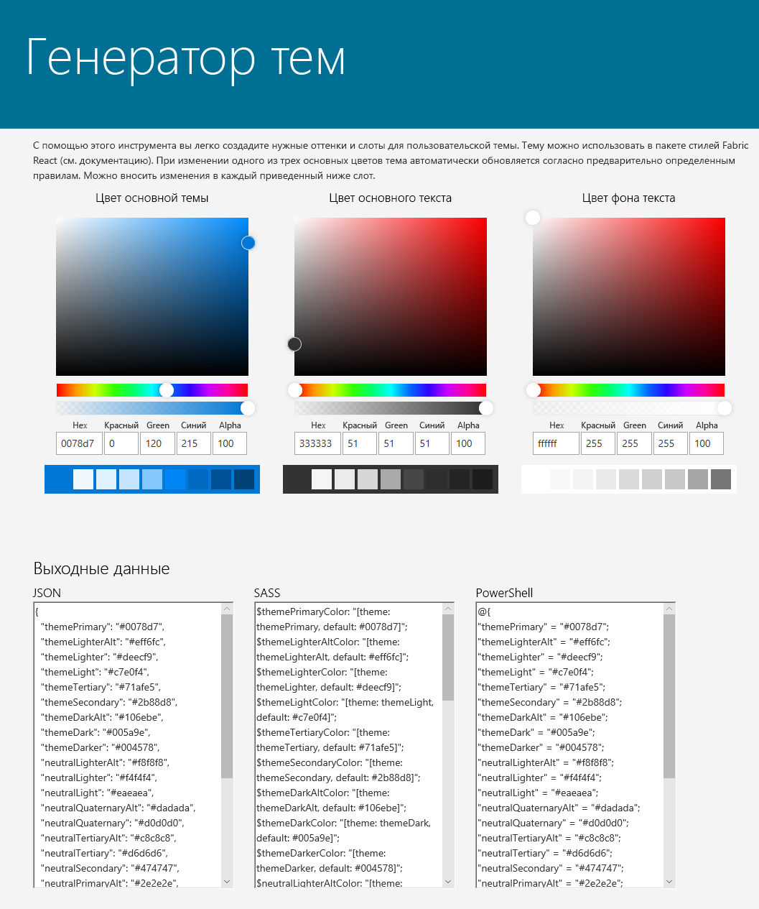

# <a name="sharepoint-site-theming-json-schema"></a><span data-ttu-id="4a66a-101">Настройка тем для сайтов SharePoint: схема JSON</span><span class="sxs-lookup"><span data-stu-id="4a66a-101">SharePoint site theming: JSON schema</span></span>

<span data-ttu-id="4a66a-102">В случае новых функций, позволяющих [настроить темы сайтов SharePoint](sharepoint-site-theming-overview.md), используется схема JSON для хранения параметров цветов и других сведений о каждой теме.</span><span class="sxs-lookup"><span data-stu-id="4a66a-102">The new [SharePoint site theming](sharepoint-site-theming-overview.md) features use a JSON schema to store color settings and other information about each theme.</span></span> <span data-ttu-id="4a66a-103">Параметры темы хранятся в объекте JSON, содержащем перечисленные ниже ключи.</span><span class="sxs-lookup"><span data-stu-id="4a66a-103">Theme settings are stored in a JSON object that contains the following keys:</span></span>

* <span data-ttu-id="4a66a-104">__name__ &mdash; имя темы, которое отображается в пользовательском интерфейсе для выбора тем, а также используется администраторами и разработчиками для обращения к теме в командлетах PowerShell или при вызовах REST API для SharePoint.</span><span class="sxs-lookup"><span data-stu-id="4a66a-104">__name__ &mdash; The name of the theme, which appears in the theme picker UI and is also used by administrators and developers to refer to the theme in PowerShell cmdlets or calls to the SharePoint REST API.</span></span>
* <span data-ttu-id="4a66a-105">__isInverted__ &mdash; ключ, у которого должно быть значение false для светлых тем и значение true для темных. Указывает, какие цвета темы SharePoint будет использовать для отрисовки текста на цветном фоне (темные или светлые).</span><span class="sxs-lookup"><span data-stu-id="4a66a-105">__isInverted__ &mdash; This value should be false for light themes and true for dark themes; it controls whether SharePoint will use dark or light theme colors to render text on colored backgrounds.</span></span>
* <span data-ttu-id="4a66a-106">__backgroundImageUril__ &mdash; универсальный код ресурса (URI) необязательного фонового изображения темы (значение может быть пустым, если фоновое изображение отсутствует).</span><span class="sxs-lookup"><span data-stu-id="4a66a-106">__backgroundImageUril__ &mdash; The URI of an optional background image for the theme (value can be blank if no background image).</span></span>
* <span data-ttu-id="4a66a-107">__theme__ &mdash; параметры цветов темы в формате RGB, хранящиеся в виде вложенного объекта JSON со следующими ключами:</span><span class="sxs-lookup"><span data-stu-id="4a66a-107">__theme__ &mdash; The RGB color settings for the theme, stored as a nested JSON object with the following keys:</span></span>
    * <span data-ttu-id="4a66a-108">themePrimary</span><span class="sxs-lookup"><span data-stu-id="4a66a-108">themePrimary</span></span>
    * <span data-ttu-id="4a66a-109">themeLighterAlt</span><span class="sxs-lookup"><span data-stu-id="4a66a-109">themeLighterAlt</span></span>
    * <span data-ttu-id="4a66a-110">themeLighter</span><span class="sxs-lookup"><span data-stu-id="4a66a-110">themeLighter</span></span>
    * <span data-ttu-id="4a66a-111">themeLight</span><span class="sxs-lookup"><span data-stu-id="4a66a-111">themeLight</span></span>
    * <span data-ttu-id="4a66a-112">themeTertiary</span><span class="sxs-lookup"><span data-stu-id="4a66a-112">themeTertiary</span></span>
    * <span data-ttu-id="4a66a-113">themeSecondary</span><span class="sxs-lookup"><span data-stu-id="4a66a-113">themeSecondary</span></span>
    * <span data-ttu-id="4a66a-114">themeDarkAlt</span><span class="sxs-lookup"><span data-stu-id="4a66a-114">themeDarkAlt</span></span>
    * <span data-ttu-id="4a66a-115">themeDark</span><span class="sxs-lookup"><span data-stu-id="4a66a-115">themeDark</span></span>
    * <span data-ttu-id="4a66a-116">themeDarker</span><span class="sxs-lookup"><span data-stu-id="4a66a-116">themeDarker</span></span>
    * <span data-ttu-id="4a66a-117">neutralLighterAlt</span><span class="sxs-lookup"><span data-stu-id="4a66a-117">neutralLighterAlt</span></span>
    * <span data-ttu-id="4a66a-118">neutralLighter</span><span class="sxs-lookup"><span data-stu-id="4a66a-118">neutralLighter</span></span>
    * <span data-ttu-id="4a66a-119">neutralLight</span><span class="sxs-lookup"><span data-stu-id="4a66a-119">neutralLight</span></span>
    * <span data-ttu-id="4a66a-120">neutralQuaternaryAlt</span><span class="sxs-lookup"><span data-stu-id="4a66a-120">neutralQuaternaryAlt</span></span>
    * <span data-ttu-id="4a66a-121">neutralQuaternary</span><span class="sxs-lookup"><span data-stu-id="4a66a-121">neutralQuaternary</span></span>
    * <span data-ttu-id="4a66a-122">neutralTertiaryAlt</span><span class="sxs-lookup"><span data-stu-id="4a66a-122">neutralTertiaryAlt</span></span>
    * <span data-ttu-id="4a66a-123">neutralTertiary</span><span class="sxs-lookup"><span data-stu-id="4a66a-123">neutralTertiary</span></span>
    * <span data-ttu-id="4a66a-124">neutralSecondaryAlt</span><span class="sxs-lookup"><span data-stu-id="4a66a-124">neutralSecondaryAlt</span></span>
    * <span data-ttu-id="4a66a-125">neutralSecondary</span><span class="sxs-lookup"><span data-stu-id="4a66a-125">neutralSecondary</span></span>
    * <span data-ttu-id="4a66a-126">neutralPrimaryAlt</span><span class="sxs-lookup"><span data-stu-id="4a66a-126">neutralPrimaryAlt</span></span>
    * <span data-ttu-id="4a66a-127">neutralPrimary</span><span class="sxs-lookup"><span data-stu-id="4a66a-127">neutralPrimary</span></span>
    * <span data-ttu-id="4a66a-128">neutralDark</span><span class="sxs-lookup"><span data-stu-id="4a66a-128">neutralDark</span></span>
    * <span data-ttu-id="4a66a-129">black</span><span class="sxs-lookup"><span data-stu-id="4a66a-129">black</span></span>
    * <span data-ttu-id="4a66a-130">white</span><span class="sxs-lookup"><span data-stu-id="4a66a-130">white</span></span>
    * <span data-ttu-id="4a66a-131">primaryBackground</span><span class="sxs-lookup"><span data-stu-id="4a66a-131">primaryBackground</span></span>
    * <span data-ttu-id="4a66a-132">primaryText</span><span class="sxs-lookup"><span data-stu-id="4a66a-132">primaryText</span></span>
    * <span data-ttu-id="4a66a-133">error</span><span class="sxs-lookup"><span data-stu-id="4a66a-133">error</span></span>

<span data-ttu-id="4a66a-134">Цвета элемента _theme_ указываются в виде 6- или 3-значных шестнадцатеричных строковых значений RGB.</span><span class="sxs-lookup"><span data-stu-id="4a66a-134">The colors in the _theme_ element are specified as 6-digit or 3-digit hexadecimal RGB string values.</span></span>

<span data-ttu-id="4a66a-135">Ниже представлен пример объекта JSON, определяющего тему.</span><span class="sxs-lookup"><span data-stu-id="4a66a-135">The following is an example of a JSON object that defines a theme.</span></span>

```json
{ 
    name: 'Blue', 
    isInverted: true, 
    backgroundImageUri: '', 
    theme: { 
        themePrimary: "#00bcf2", 
        themeLighterAlt: "#00090c", 
        themeLighter: "#001318", 
        themeLight: "#002630", 
        themeTertiary: "#005066", 
        themeSecondary: "#00abda", 
        themeDarkAlt: "#0ecbff", 
        themeDark: "#44d6ff", 
        themeDarker: "#6cdfff", 
        neutralLighterAlt: "#2e3340", 
        neutralLighter: "#353a49", 
        neutralLight: "#404759", 
        neutralQuaternaryAlt: "#474e62", 
        neutralQuaternary: "#4c546a", 
        neutralTertiaryAlt: "#646e8a", 
        neutralTertiary: "#c8c8c8", 
        neutralSecondaryAlt: "#d0d0d0", 
        neutralSecondary: "#dadada", 
        neutralPrimaryAlt: "#eaeaea", 
        neutralPrimary: "#ffffff", 
        neutralDark: "#f4f4f4", 
        black: "#f8f8f8", 
        white: "#262a35", 
        primaryBackground: "#262a35", 
        primaryText: "#ffffff", 
        error: "#ff5f5f" 
    } 
} 
```

<br/>

<span data-ttu-id="4a66a-136">Платформа SharePoint Framework включает восемь встроенных тем: шесть со светлым фоном и две с темным.</span><span class="sxs-lookup"><span data-stu-id="4a66a-136">The SharePoint Framework includes eight built-in themes: six on light backgrounds, and two on dark backgrounds.</span></span> <span data-ttu-id="4a66a-137">Возможно, вам будет удобнее создать собственную тему, начав с одной из встроенных тем и настроив ее в соответствии со своими потребностями.</span><span class="sxs-lookup"><span data-stu-id="4a66a-137">You might find it useful to create a custom theme by starting from one of the built-in themes and adjusting it to suit your needs.</span></span>

<span data-ttu-id="4a66a-138">Кроме того, для создания пользовательской темы можно использовать [инструмент создания тем](https://developer.microsoft.com/ru-RU/fabric#/styles/themegenerator).</span><span class="sxs-lookup"><span data-stu-id="4a66a-138">Another option is to use the [Theme Generator tool](https://developer.microsoft.com/ru-RU/fabric#/styles/themegenerator) to build a custom theme.</span></span> <span data-ttu-id="4a66a-139">Вам потребуется выбрать цвета будущей темы с помощью интерактивного пользовательского интерфейса. Затем определения JSON, SASS и PowerShell для вашей темы будут созданы автоматически.</span><span class="sxs-lookup"><span data-stu-id="4a66a-139">It provides an interactive UI for selecting theme colors, and automatically generates the JSON, SASS, and PowerShell definitions for your custom theme:</span></span>



<span data-ttu-id="4a66a-141">Ниже представлена сводка встроенных тем, включая определения JSON для их цветов, которые можно использовать в качестве отправной точки для настройки.</span><span class="sxs-lookup"><span data-stu-id="4a66a-141">The following is a summary of the built-in themes, including JSON definitions for the theme colors that you can use as a starting point for customization.</span></span>

## <a name="red-theme"></a><span data-ttu-id="4a66a-142">Красная тема</span><span class="sxs-lookup"><span data-stu-id="4a66a-142">Red theme</span></span>

<span data-ttu-id="4a66a-143">В приведенной ниже таблице представлена цветовая палитра, используемая в красной теме.</span><span class="sxs-lookup"><span data-stu-id="4a66a-143">The following table shows the color palette used by the Red theme.</span></span>

<table>
<tr>
<td style="color:white; background-color:#751b1e"><span data-ttu-id="4a66a-144">themeDarker: #751b1e</span><span class="sxs-lookup"><span data-stu-id="4a66a-144">themeDarker: #751b1e</span></span></td>
<td style="color:white; background-color:#000000"><span data-ttu-id="4a66a-145">black: #000000</span><span class="sxs-lookup"><span data-stu-id="4a66a-145">black: #000000</span></span></td>
</tr>
<tr>
<td style="color:white; background-color:#952226"><span data-ttu-id="4a66a-146">themeDark: #952226</span><span class="sxs-lookup"><span data-stu-id="4a66a-146">themeDark: #952226</span></span></td>
<td style="color:white; background-color:#212121"><span data-ttu-id="4a66a-147">neutralDark: #212121</span><span class="sxs-lookup"><span data-stu-id="4a66a-147">neutralDark: #212121</span></span></td>
</tr>
<tr>
<td style="color:white; background-color:#c02b30"><span data-ttu-id="4a66a-148">themeDarkAlt: #c02b30</span><span class="sxs-lookup"><span data-stu-id="4a66a-148">themeDarkAlt: #c02b30</span></span></td>
<td style="color:white; background-color:#333"><span data-ttu-id="4a66a-149">neutralPrimary: #333</span><span class="sxs-lookup"><span data-stu-id="4a66a-149">neutralPrimary: #333</span></span></td>
</tr>
<tr>
<td rowspan="3" style="font-weight:bold; vertical-align:middle; color:white; background-color:#d13438"><span data-ttu-id="4a66a-150">themePrimary: #d13438</span><span class="sxs-lookup"><span data-stu-id="4a66a-150">themePrimary: #d13438</span></span></td>
<td style="color:white; background-color:#3c3c3c"><span data-ttu-id="4a66a-151">neutralPrimaryAlt: #3c3c3c</span><span class="sxs-lookup"><span data-stu-id="4a66a-151">neutralPrimaryAlt: #3c3c3c</span></span></td>
</tr>
<tr>
<td style="color:white; background-color:#666666"><span data-ttu-id="4a66a-152">neutralSecondary: #666666</span><span class="sxs-lookup"><span data-stu-id="4a66a-152">neutralSecondary: #666666</span></span></td>
</tr>
<tr>
<td style="color:black; background-color:#a6a6a6"><span data-ttu-id="4a66a-153">neutralTertiary: #a6a6a6</span><span class="sxs-lookup"><span data-stu-id="4a66a-153">neutralTertiary: #a6a6a6</span></span></td>
</tr>
<tr>
<td style="color:white; background-color:#d6494d"><span data-ttu-id="4a66a-154">themeSecondary: #d6494d</span><span class="sxs-lookup"><span data-stu-id="4a66a-154">themeSecondary: #d6494d</span></span></td>
<td style="color:black; background-color:#c8c8c8"><span data-ttu-id="4a66a-155">neutralTertiaryAlt: #c8c8c8</span><span class="sxs-lookup"><span data-stu-id="4a66a-155">neutralTertiaryAlt: #c8c8c8</span></span></td>
</tr>
<tr>
<td style="color:black; background-color:#ecaaac"><span data-ttu-id="4a66a-156">themeTertiary: #ecaaac</span><span class="sxs-lookup"><span data-stu-id="4a66a-156">themeTertiary: #ecaaac</span></span></td>
<td style="color:black; background-color:#eaeaea"><span data-ttu-id="4a66a-157">neutralLight: #eaeaea</span><span class="sxs-lookup"><span data-stu-id="4a66a-157">neutralLight: #eaeaea</span></span></td>
</tr>
<tr>
<td style="color:black; background-color:#f6d6d8"><span data-ttu-id="4a66a-158">themeLight: #f6d6d8</span><span class="sxs-lookup"><span data-stu-id="4a66a-158">themeLight: #f6d6d8</span></span></td>
<td style="color:black; background-color:#f4f4f4"><span data-ttu-id="4a66a-159">neutralLighter: #f4f4f4</span><span class="sxs-lookup"><span data-stu-id="4a66a-159">neutralLighter: #f4f4f4</span></span></td></tr>
<tr>
<td style="color:black; background-color:#faebeb"><span data-ttu-id="4a66a-160">themeLighter: #faebeb</span><span class="sxs-lookup"><span data-stu-id="4a66a-160">themeLighter: #faebeb</span></span></td>
<td style="color:black; background-color:#f8f8f8"><span data-ttu-id="4a66a-161">neutralLighterAlt: #f8f8f8</span><span class="sxs-lookup"><span data-stu-id="4a66a-161">neutralLighterAlt: #f8f8f8</span></span></td>
</tr>
<tr>
<td style="color:black; background-color:#fdf5f5"><span data-ttu-id="4a66a-162">themeLighterAlt: #fdf5f5</span><span class="sxs-lookup"><span data-stu-id="4a66a-162">themeLighterAlt: #fdf5f5</span></span></td>
<td style="color:black; background-color:#fff"><span data-ttu-id="4a66a-163">white: #fff</span><span class="sxs-lookup"><span data-stu-id="4a66a-163">white: #fff</span></span></td>
</tr>
</table>

<br/>

<span data-ttu-id="4a66a-164">Приведенный ниже код иллюстрирует определение словаря в PowerShell для цветовой палитры красной темы.</span><span class="sxs-lookup"><span data-stu-id="4a66a-164">The following code shows how to define a dictionary in PowerShell for the Red theme's color palette.</span></span>
```powershell
{ 
    themeDarker: '#751b1e', 
    themeDark: '#952226', 
    themeDarkAlt: '#c02b30', 
    themePrimary: '#d13438', 
    themeSecondary: '#d6494d', 
    themeTertiary: '#ecaaac', 
    themeLight: '#f6d6d8', 
    themeLighter: '#faebeb', 
    themeLighterAlt: '#fdf5f5', 
    black: '#000000', 
    neutralDark: '#212121', 
    neutralPrimary: '#333', 
    neutralPrimaryAlt: '#3c3c3c', 
    neutralSecondary: '#666666', 
    neutralTertiary: '#a6a6a6', 
    neutralTertiaryAlt: '#c8c8c8', 
    neutralLight: '#eaeaea', 
    neutralLighter: '#f4f4f4', 
    neutralLighterAlt: '#f8f8f8', 
    white: '#fff', 
    neutralQuaternaryAlt: '#dadada', 
    neutralQuaternary: '#d0d0d0', 
    neutralSecondaryAlt: '#767676', 
    primaryBackground: '#fff', 
    primaryText: '#333' 
}
```

<br/>

## <a name="orange-theme"></a><span data-ttu-id="4a66a-165">Оранжевая тема</span><span class="sxs-lookup"><span data-stu-id="4a66a-165">Orange theme</span></span>

<span data-ttu-id="4a66a-166">В приведенной ниже таблице представлена цветовая палитра, используемая в оранжевой теме.</span><span class="sxs-lookup"><span data-stu-id="4a66a-166">The following table shows the color palette used by the Orange theme.</span></span>

<table>
<tr>
<td style="color:white; background-color:#6f2d09"><span data-ttu-id="4a66a-167">themeDarker: #6f2d09</span><span class="sxs-lookup"><span data-stu-id="4a66a-167">themeDarker: #6f2d09</span></span></td>
<td style="color:white; background-color:#000000"><span data-ttu-id="4a66a-168">black: #000000</span><span class="sxs-lookup"><span data-stu-id="4a66a-168">black: #000000</span></span></td>
</tr>
<tr>
<td style="color:white; background-color:#8d390b"><span data-ttu-id="4a66a-169">themeDark: #8d390b</span><span class="sxs-lookup"><span data-stu-id="4a66a-169">themeDark: #8d390b</span></span></td>
<td style="color:white; background-color:#212121"><span data-ttu-id="4a66a-170">neutralDark: #212121</span><span class="sxs-lookup"><span data-stu-id="4a66a-170">neutralDark: #212121</span></span></td>
</tr>
<tr>
<td style="color:white; background-color:#b5490f"><span data-ttu-id="4a66a-171">themeDarkAlt: #b5490f</span><span class="sxs-lookup"><span data-stu-id="4a66a-171">themeDarkAlt: #b5490f</span></span></td>
<td style="color:white; background-color:#333"><span data-ttu-id="4a66a-172">neutralPrimary: #333</span><span class="sxs-lookup"><span data-stu-id="4a66a-172">neutralPrimary: #333</span></span></td>
</tr>
<tr>
<td rowspan="3" style="font-weight:bold; vertical-align:middle; color:white; background-color:#ca5010"><span data-ttu-id="4a66a-173">themePrimary: #ca5010</span><span class="sxs-lookup"><span data-stu-id="4a66a-173">themePrimary: #ca5010</span></span></td>
<td style="color:white; background-color:#3c3c3c"><span data-ttu-id="4a66a-174">neutralPrimaryAlt: #3c3c3c</span><span class="sxs-lookup"><span data-stu-id="4a66a-174">neutralPrimaryAlt: #3c3c3c</span></span></td>
</tr>
<tr>
<td style="color:white; background-color:#666666"><span data-ttu-id="4a66a-175">neutralSecondary: #666666</span><span class="sxs-lookup"><span data-stu-id="4a66a-175">neutralSecondary: #666666</span></span></td>
</tr>
<tr>
<td style="color:black; background-color:#a6a6a6"><span data-ttu-id="4a66a-176">neutralTertiary: #a6a6a6</span><span class="sxs-lookup"><span data-stu-id="4a66a-176">neutralTertiary: #a6a6a6</span></span></td>
</tr>
<tr>
<td style="color:white; background-color:#e55c12"><span data-ttu-id="4a66a-177">themeSecondary: #e55c12</span><span class="sxs-lookup"><span data-stu-id="4a66a-177">themeSecondary: #e55c12</span></span></td>
<td style="color:black; background-color:#c8c8c8"><span data-ttu-id="4a66a-178">neutralTertiaryAlt: #c8c8c8</span><span class="sxs-lookup"><span data-stu-id="4a66a-178">neutralTertiaryAlt: #c8c8c8</span></span></td>
</tr>
<tr>
<td style="color:black; background-color:#f6b28d"><span data-ttu-id="4a66a-179">themeTertiary: #f6b28d</span><span class="sxs-lookup"><span data-stu-id="4a66a-179">themeTertiary: #f6b28d</span></span></td>
<td style="color:black; background-color:#eaeaea"><span data-ttu-id="4a66a-180">neutralLight: #eaeaea</span><span class="sxs-lookup"><span data-stu-id="4a66a-180">neutralLight: #eaeaea</span></span></td>
</tr>
<tr>
<td style="color:black; background-color:#fbdac9"><span data-ttu-id="4a66a-181">themeLight: #fbdac9</span><span class="sxs-lookup"><span data-stu-id="4a66a-181">themeLight: #fbdac9</span></span></td>
<td style="color:black; background-color:#f4f4f4"><span data-ttu-id="4a66a-182">neutralLighter: #f4f4f4</span><span class="sxs-lookup"><span data-stu-id="4a66a-182">neutralLighter: #f4f4f4</span></span></td>
</tr>
<tr>
<td style="color:black; background-color:#fdede4"><span data-ttu-id="4a66a-183">themeLighter: #fdede4</span><span class="sxs-lookup"><span data-stu-id="4a66a-183">themeLighter: #fdede4</span></span></td>
<td style="color:black; background-color:#f8f8f8"><span data-ttu-id="4a66a-184">neutralLighterAlt: #f8f8f8</span><span class="sxs-lookup"><span data-stu-id="4a66a-184">neutralLighterAlt: #f8f8f8</span></span></td>
</tr>
<tr>
<td style="color:black; background-color:#fef6f1"><span data-ttu-id="4a66a-185">themeLighterAlt: #fef6f1</span><span class="sxs-lookup"><span data-stu-id="4a66a-185">themeLighterAlt: #fef6f1</span></span></td>
<td style="color:black; background-color:#fff"><span data-ttu-id="4a66a-186">white: #fff</span><span class="sxs-lookup"><span data-stu-id="4a66a-186">white: #fff</span></span></td>
</tr>
</table>

<br/>

<span data-ttu-id="4a66a-187">Приведенный ниже код иллюстрирует определение словаря в PowerShell для цветовой палитры оранжевой темы.</span><span class="sxs-lookup"><span data-stu-id="4a66a-187">The following code shows how to define a dictionary in PowerShell for the Orange theme's color palette.</span></span>

```powershell
{ 
    themeDarker: '#6f2d09', 
    themeDark: '#8d390b', 
    themeDarkAlt: '#b5490f', 
    themePrimary: '#ca5010', 
    themeSecondary: '#e55c12', 
    themeTertiary: '#f6b28d', 
    themeLight: '#fbdac9', 
    themeLighter: '#fdede4', 
    themeLighterAlt: '#fef6f1', 
    black: '#000000', 
    neutralDark: '#212121', 
    neutralPrimary: '#333', 
    neutralPrimaryAlt: '#3c3c3c', 
    neutralSecondary: '#666666', 
    neutralTertiary: '#a6a6a6', 
    neutralTertiaryAlt: '#c8c8c8', 
    neutralLight: '#eaeaea', 
    neutralLighter: '#f4f4f4', 
    neutralLighterAlt: '#f8f8f8', 
    white: '#fff', 
    neutralQuaternaryAlt: '#dadada', 
    neutralQuaternary: '#d0d0d0', 
    neutralSecondaryAlt: '#767676', 
    primaryBackground: '#fff', 
    primaryText: '#333' 
}
```

<br/>

## <a name="green-theme"></a><span data-ttu-id="4a66a-188">Зеленая тема</span><span class="sxs-lookup"><span data-stu-id="4a66a-188">Green theme</span></span>

<span data-ttu-id="4a66a-189">В приведенной ниже таблице представлена цветовая палитра, используемая в зеленой теме.</span><span class="sxs-lookup"><span data-stu-id="4a66a-189">The following table shows the color palette used by the Green theme.</span></span>

<table>
<tr>
<td style="color:white; background-color:#094c23"><span data-ttu-id="4a66a-190">themeDarker: #094c23</span><span class="sxs-lookup"><span data-stu-id="4a66a-190">themeDarker: #094c23</span></span></td>
<td style="color:white; background-color:#000000"><span data-ttu-id="4a66a-191">black: #000000</span><span class="sxs-lookup"><span data-stu-id="4a66a-191">black: #000000</span></span></td>
</tr>
<tr>
<td style="color:white; background-color:#0c602c"><span data-ttu-id="4a66a-192">themeDark: #0c602c</span><span class="sxs-lookup"><span data-stu-id="4a66a-192">themeDark: #0c602c</span></span></td>
<td style="color:white; background-color:#212121"><span data-ttu-id="4a66a-193">neutralDark: #212121</span><span class="sxs-lookup"><span data-stu-id="4a66a-193">neutralDark: #212121</span></span></td>
</tr>
<tr>
<td style="color:white; background-color:#0f7c39"><span data-ttu-id="4a66a-194">themeDarkAlt: #0f7c39</span><span class="sxs-lookup"><span data-stu-id="4a66a-194">themeDarkAlt: #0f7c39</span></span></td>
<td style="color:white; background-color:#333"><span data-ttu-id="4a66a-195">neutralPrimary: #333</span><span class="sxs-lookup"><span data-stu-id="4a66a-195">neutralPrimary: #333</span></span></td>
</tr>
<tr>
<td rowspan="3" style="font-weight:bold; vertical-align:middle; color:white; background-color:#10893e"><span data-ttu-id="4a66a-196">themePrimary: #10893e</span><span class="sxs-lookup"><span data-stu-id="4a66a-196">themePrimary: #10893e</span></span></td>
<td style="color:white; background-color:#3c3c3c"><span data-ttu-id="4a66a-197">neutralPrimaryAlt: #3c3c3c</span><span class="sxs-lookup"><span data-stu-id="4a66a-197">neutralPrimaryAlt: #3c3c3c</span></span></td>
</tr>
<tr>
<td style="color:white; background-color:#666666"><span data-ttu-id="4a66a-198">neutralSecondary: #666666</span><span class="sxs-lookup"><span data-stu-id="4a66a-198">neutralSecondary: #666666</span></span></td>
</tr>
<tr>
<td style="color:black; background-color:#a6a6a6"><span data-ttu-id="4a66a-199">neutralTertiary: #a6a6a6</span><span class="sxs-lookup"><span data-stu-id="4a66a-199">neutralTertiary: #a6a6a6</span></span></td>
</tr>
<tr>
<td style="color:white; background-color:#14a94e"><span data-ttu-id="4a66a-200">themeSecondary: #14a94e</span><span class="sxs-lookup"><span data-stu-id="4a66a-200">themeSecondary: #14a94e</span></span></td>
<td style="color:black; background-color:#c8c8c8"><span data-ttu-id="4a66a-201">neutralTertiaryAlt: #c8c8c8</span><span class="sxs-lookup"><span data-stu-id="4a66a-201">neutralTertiaryAlt: #c8c8c8</span></span></td>
</tr>
<tr>
<td style="color:black; background-color:#7aefa7"><span data-ttu-id="4a66a-202">themeTertiary: #7aefa7</span><span class="sxs-lookup"><span data-stu-id="4a66a-202">themeTertiary: #7aefa7</span></span></td>
<td style="color:black; background-color:#eaeaea"><span data-ttu-id="4a66a-203">neutralLight: #eaeaea</span><span class="sxs-lookup"><span data-stu-id="4a66a-203">neutralLight: #eaeaea</span></span></td>
</tr>
<tr>
<td style="color:black; background-color:#bff7d5"><span data-ttu-id="4a66a-204">themeLight: #bff7d5</span><span class="sxs-lookup"><span data-stu-id="4a66a-204">themeLight: #bff7d5</span></span></td>
<td style="color:black; background-color:#f4f4f4"><span data-ttu-id="4a66a-205">neutralLighter: #f4f4f4</span><span class="sxs-lookup"><span data-stu-id="4a66a-205">neutralLighter: #f4f4f4</span></span></td>
</tr>
<tr>
<td style="color:black; background-color:#dffbea"><span data-ttu-id="4a66a-206">themeLighter: #dffbea</span><span class="sxs-lookup"><span data-stu-id="4a66a-206">themeLighter: #dffbea</span></span></td>
<td style="color:black; background-color:#f8f8f8"><span data-ttu-id="4a66a-207">neutralLighterAlt: #f8f8f8</span><span class="sxs-lookup"><span data-stu-id="4a66a-207">neutralLighterAlt: #f8f8f8</span></span></td>
</tr>
<tr>
<td style="color:black; background-color:#effdf4"><span data-ttu-id="4a66a-208">themeLighterAlt: #effdf4</span><span class="sxs-lookup"><span data-stu-id="4a66a-208">themeLighterAlt: #effdf4</span></span></td>
<td style="color:black; background-color:#fff"><span data-ttu-id="4a66a-209">white: #fff</span><span class="sxs-lookup"><span data-stu-id="4a66a-209">white: #fff</span></span></td>
</tr>
</table>

<br/>

<span data-ttu-id="4a66a-210">Приведенный ниже код иллюстрирует определение словаря в PowerShell для цветовой палитры зеленой темы.</span><span class="sxs-lookup"><span data-stu-id="4a66a-210">The following code shows how to define a dictionary in PowerShell for the Green theme's color palette.</span></span>

```powershell
{ 
    themePrimary: '#10893e', 
    themeLighterAlt: '#effdf4', 
    themeLighter: '#dffbea', 
    themeLight: '#bff7d5', 
    themeTertiary: '#7aefa7', 
    themeSecondary: '#14a94e', 
    themeDarkAlt: '#0f7c39', 
    themeDark: '#0c602c', 
    themeDarker: '#094c23', 
    neutralLighterAlt: '#f8f8f8', 
    neutralLighter: '#f4f4f4', 
    neutralLight: '#eaeaea', 
    neutralQuaternaryAlt: '#dadada', 
    neutralQuaternary: '#d0d0d0', 
    neutralTertiaryAlt: '#c8c8c8', 
    neutralTertiary: '#a6a6a6', 
    neutralSecondaryAlt: '#767676', 
    neutralSecondary: '#666666', 
    neutralPrimary: '#333', 
    neutralPrimaryAlt: '#3c3c3c', 
    neutralDark: '#212121', 
    black: '#000000', 
    white: '#fff', 
    primaryBackground: '#fff', 
    primaryText: '#333' 
}
```

<br/>

## <a name="blue-theme"></a><span data-ttu-id="4a66a-211">Синяя тема</span><span class="sxs-lookup"><span data-stu-id="4a66a-211">Blue theme</span></span>

<span data-ttu-id="4a66a-212">В приведенной ниже таблице представлена цветовая палитра, используемая в синей теме.</span><span class="sxs-lookup"><span data-stu-id="4a66a-212">The following table shows the color palette used by the Blue theme.</span></span>

<table>
<tr>
<td style="color:white; background-color:#004578"><span data-ttu-id="4a66a-213">themeDarker: #004578</span><span class="sxs-lookup"><span data-stu-id="4a66a-213">themeDarker: #004578</span></span></td>
<td style="color:white; background-color:#000000"><span data-ttu-id="4a66a-214">black: #000000</span><span class="sxs-lookup"><span data-stu-id="4a66a-214">black: #000000</span></span></td>
</tr>
<tr>
<td style="color:white; background-color:#005a9e"><span data-ttu-id="4a66a-215">themeDark: #005a9e</span><span class="sxs-lookup"><span data-stu-id="4a66a-215">themeDark: #005a9e</span></span></td>
<td style="color:white; background-color:#212121"><span data-ttu-id="4a66a-216">neutralDark: #212121</span><span class="sxs-lookup"><span data-stu-id="4a66a-216">neutralDark: #212121</span></span></td>
</tr>
<tr>
<td style="color:white; background-color:#106ebe"><span data-ttu-id="4a66a-217">themeDarkAlt: #106ebe</span><span class="sxs-lookup"><span data-stu-id="4a66a-217">themeDarkAlt: #106ebe</span></span></td>
<td style="color:white; background-color:#333"><span data-ttu-id="4a66a-218">neutralPrimary: #333</span><span class="sxs-lookup"><span data-stu-id="4a66a-218">neutralPrimary: #333</span></span></td>
</tr>
<tr>
<td rowspan="3" style="font-weight:bold; vertical-align:middle; color:white; background-color:#0078d7"><span data-ttu-id="4a66a-219">themePrimary: #0078d7</span><span class="sxs-lookup"><span data-stu-id="4a66a-219">themePrimary: #0078d7</span></span></td>
<td style="color:white; background-color:#3c3c3c"><span data-ttu-id="4a66a-220">neutralPrimaryAlt: #3c3c3c</span><span class="sxs-lookup"><span data-stu-id="4a66a-220">neutralPrimaryAlt: #3c3c3c</span></span></td>
</tr>
<tr>
<td style="color:white; background-color:#666666"><span data-ttu-id="4a66a-221">neutralSecondary: #666666</span><span class="sxs-lookup"><span data-stu-id="4a66a-221">neutralSecondary: #666666</span></span></td>
</tr>
<tr>
<td style="color:black; background-color:#a6a6a6"><span data-ttu-id="4a66a-222">neutralTertiary: #a6a6a6</span><span class="sxs-lookup"><span data-stu-id="4a66a-222">neutralTertiary: #a6a6a6</span></span></td>
</tr>
<tr>
<td style="color:white; background-color:#2b88d8"><span data-ttu-id="4a66a-223">themeSecondary: #2b88d8</span><span class="sxs-lookup"><span data-stu-id="4a66a-223">themeSecondary: #2b88d8</span></span></td>
<td style="color:black; background-color:#c8c8c8"><span data-ttu-id="4a66a-224">neutralTertiaryAlt: #c8c8c8</span><span class="sxs-lookup"><span data-stu-id="4a66a-224">neutralTertiaryAlt: #c8c8c8</span></span></td>
</tr>
<tr>
<td style="color:black; background-color:#71afe5"><span data-ttu-id="4a66a-225">themeTertiary: #71afe5</span><span class="sxs-lookup"><span data-stu-id="4a66a-225">themeTertiary: #71afe5</span></span></td>
<td style="color:black; background-color:#eaeaea"><span data-ttu-id="4a66a-226">neutralLight: #eaeaea</span><span class="sxs-lookup"><span data-stu-id="4a66a-226">neutralLight: #eaeaea</span></span></td>
</tr>
<tr>
<td style="color:black; background-color:#c7e0f4"><span data-ttu-id="4a66a-227">themeLight: #c7e0f4</span><span class="sxs-lookup"><span data-stu-id="4a66a-227">themeLight: #c7e0f4</span></span></td>
<td style="color:black; background-color:#f4f4f4"><span data-ttu-id="4a66a-228">neutralLighter: #f4f4f4</span><span class="sxs-lookup"><span data-stu-id="4a66a-228">neutralLighter: #f4f4f4</span></span></td>
</tr>
<tr>
<td style="color:black; background-color:#deecf9"><span data-ttu-id="4a66a-229">themeLighter: #deecf9</span><span class="sxs-lookup"><span data-stu-id="4a66a-229">themeLighter: #deecf9</span></span></td>
<td style="color:black; background-color:#f8f8f8"><span data-ttu-id="4a66a-230">neutralLighterAlt: #f8f8f8</span><span class="sxs-lookup"><span data-stu-id="4a66a-230">neutralLighterAlt: #f8f8f8</span></span></td>
</tr>
<tr>
<td style="color:black; background-color:#eff6fc"><span data-ttu-id="4a66a-231">themeLighterAlt: #eff6fc</span><span class="sxs-lookup"><span data-stu-id="4a66a-231">themeLighterAlt: #eff6fc</span></span></td>
<td style="color:black; background-color:#fff"><span data-ttu-id="4a66a-232">white: #fff</span><span class="sxs-lookup"><span data-stu-id="4a66a-232">white: #fff</span></span></td>
</tr>
</table>

<br/>

<span data-ttu-id="4a66a-233">Приведенный ниже код иллюстрирует определение словаря в PowerShell для цветовой палитры синей темы.</span><span class="sxs-lookup"><span data-stu-id="4a66a-233">The following code shows how to define a dictionary in PowerShell for the Blue theme's color palette.</span></span>

```powershell
{ 
    themePrimary: '#0078d7', 
    themeLighterAlt: '#eff6fc', 
    themeLighter: '#deecf9', 
    themeLight: '#c7e0f4', 
    themeTertiary: '#71afe5', 
    themeSecondary: '#2b88d8', 
    themeDarkAlt: '#106ebe', 
    themeDark: '#005a9e', 
    themeDarker: '#004578', 
    neutralLighterAlt: '#f8f8f8', 
    neutralLighter: '#f4f4f4', 
    neutralLight: '#eaeaea', 
    neutralQuaternaryAlt: '#dadada', 
    neutralQuaternary: '#d0d0d0', 
    neutralTertiaryAlt: '#c8c8c8', 
    neutralTertiary: '#a6a6a6', 
    neutralSecondaryAlt: '#767676', 
    neutralSecondary: '#666666', 
    neutralPrimary: '#333', 
    neutralPrimaryAlt: '#3c3c3c', 
    neutralDark: '#212121', 
    black: '#000000', 
    white: '#fff', 
    primaryBackground: '#fff', 
    primaryText: '#333' 
}
```

<br/>

## <a name="purple-theme"></a><span data-ttu-id="4a66a-234">Сиреневая тема</span><span class="sxs-lookup"><span data-stu-id="4a66a-234">Purple theme</span></span>

<span data-ttu-id="4a66a-235">В приведенной ниже таблице представлена цветовая палитра, используемая в сиреневой теме.</span><span class="sxs-lookup"><span data-stu-id="4a66a-235">The following table shows the color palette used by the Purple theme.</span></span>

<table>
<tr>
<td style="color:white; background-color:#27268a"><span data-ttu-id="4a66a-236">themeDarker: #27268a</span><span class="sxs-lookup"><span data-stu-id="4a66a-236">themeDarker: #27268a</span></span></td>
<td style="color:white; background-color:#000000"><span data-ttu-id="4a66a-237">black: #000000</span><span class="sxs-lookup"><span data-stu-id="4a66a-237">black: #000000</span></span></td>
</tr>
<tr>
<td style="color:white; background-color:#3230b0"><span data-ttu-id="4a66a-238">themeDark: #3230b0</span><span class="sxs-lookup"><span data-stu-id="4a66a-238">themeDark: #3230b0</span></span></td>
<td style="color:white; background-color:#212121"><span data-ttu-id="4a66a-239">neutralDark: #212121</span><span class="sxs-lookup"><span data-stu-id="4a66a-239">neutralDark: #212121</span></span></td>
</tr>
<tr>
<td style="color:white; background-color:#5250cf"><span data-ttu-id="4a66a-240">themeDarkAlt: #5250cf</span><span class="sxs-lookup"><span data-stu-id="4a66a-240">themeDarkAlt: #5250cf</span></span></td>
<td style="color:white; background-color:#333"><span data-ttu-id="4a66a-241">neutralPrimary: #333</span><span class="sxs-lookup"><span data-stu-id="4a66a-241">neutralPrimary: #333</span></span></td>
</tr>
<tr>
<td rowspan="3" style="font-weight:bold; vertical-align:middle; color:white; background-color:#6b69d6"><span data-ttu-id="4a66a-242">themePrimary: #6b69d6</span><span class="sxs-lookup"><span data-stu-id="4a66a-242">themePrimary: #6b69d6</span></span></td>
<td style="color:white; background-color:#3c3c3c"><span data-ttu-id="4a66a-243">neutralPrimaryAlt: #3c3c3c</span><span class="sxs-lookup"><span data-stu-id="4a66a-243">neutralPrimaryAlt: #3c3c3c</span></span></td>
</tr>
<tr>
<td style="color:white; background-color:#666666"><span data-ttu-id="4a66a-244">neutralSecondary: #666666</span><span class="sxs-lookup"><span data-stu-id="4a66a-244">neutralSecondary: #666666</span></span></td>
</tr>
<tr>
<td style="color:black; background-color:#a6a6a6"><span data-ttu-id="4a66a-245">neutralTertiary: #a6a6a6</span><span class="sxs-lookup"><span data-stu-id="4a66a-245">neutralTertiary: #a6a6a6</span></span></td>
</tr>
<tr>
<td style="color:white; background-color:#7a78da"><span data-ttu-id="4a66a-246">themeSecondary: #7a78da</span><span class="sxs-lookup"><span data-stu-id="4a66a-246">themeSecondary: #7a78da</span></span></td>
<td style="color:black; background-color:#c8c8c8"><span data-ttu-id="4a66a-247">neutralTertiaryAlt: #c8c8c8</span><span class="sxs-lookup"><span data-stu-id="4a66a-247">neutralTertiaryAlt: #c8c8c8</span></span></td>
</tr>
<tr>
<td style="color:black; background-color:#c1c0ee"><span data-ttu-id="4a66a-248">themeTertiary: #c1c0ee</span><span class="sxs-lookup"><span data-stu-id="4a66a-248">themeTertiary: #c1c0ee</span></span></td>
<td style="color:black; background-color:#eaeaea"><span data-ttu-id="4a66a-249">neutralLight: #eaeaea</span><span class="sxs-lookup"><span data-stu-id="4a66a-249">neutralLight: #eaeaea</span></span></td>
</tr>
<tr>
<td style="color:black; background-color:#e1e1f7"><span data-ttu-id="4a66a-250">themeLight: #e1e1f7</span><span class="sxs-lookup"><span data-stu-id="4a66a-250">themeLight: #e1e1f7</span></span></td>
<td style="color:black; background-color:#f4f4f4"><span data-ttu-id="4a66a-251">neutralLighter: #f4f4f4</span><span class="sxs-lookup"><span data-stu-id="4a66a-251">neutralLighter: #f4f4f4</span></span></td>
</tr>
<tr>
<td style="color:black; background-color:#f0f0fb"><span data-ttu-id="4a66a-252">themeLighter: #f0f0fb</span><span class="sxs-lookup"><span data-stu-id="4a66a-252">themeLighter: #f0f0fb</span></span></td>
<td style="color:black; background-color:#f8f8f8"><span data-ttu-id="4a66a-253">neutralLighterAlt: #f8f8f8</span><span class="sxs-lookup"><span data-stu-id="4a66a-253">neutralLighterAlt: #f8f8f8</span></span></td>
</tr>
<tr>
<td style="color:black; background-color:#f8f7fd"><span data-ttu-id="4a66a-254">themeLighterAlt: #f8f7fd</span><span class="sxs-lookup"><span data-stu-id="4a66a-254">themeLighterAlt: #f8f7fd</span></span></td>
<td style="color:black; background-color:#fff"><span data-ttu-id="4a66a-255">white: #fff</span><span class="sxs-lookup"><span data-stu-id="4a66a-255">white: #fff</span></span></td>
</tr>
</table>

<br/>

<span data-ttu-id="4a66a-256">Приведенный ниже код иллюстрирует определение словаря в PowerShell для цветовой палитры сиреневой темы.</span><span class="sxs-lookup"><span data-stu-id="4a66a-256">The following code shows how to define a dictionary in PowerShell for the Purple theme's color palette.</span></span>

```powershell
{ 
    themePrimary: '#6b69d6', 
    themeLighterAlt: '#f8f7fd', 
    themeLighter: '#f0f0fb', 
    themeLight: '#e1e1f7', 
    themeTertiary: '#c1c0ee', 
    themeSecondary: '#7a78da', 
    themeDarkAlt: '#5250cf', 
    themeDark: '#3230b0', 
    themeDarker: '#27268a', 
    neutralLighterAlt: '#f8f8f8', 
    neutralLighter: '#f4f4f4', 
    neutralLight: '#eaeaea', 
    neutralQuaternaryAlt: '#dadada', 
    neutralQuaternary: '#d0d0d0', 
    neutralTertiaryAlt: '#c8c8c8', 
    neutralTertiary: '#a6a6a6', 
    neutralSecondaryAlt: '#767676', 
    neutralSecondary: '#666666', 
    neutralPrimary: '#333', 
    neutralPrimaryAlt: '#3c3c3c', 
    neutralDark: '#212121', 
    black: '#000000', 
    white: '#fff', 
    primaryBackground: '#fff', 
    primaryText: '#333' 
}
```

<br/>

## <a name="gray-theme"></a><span data-ttu-id="4a66a-257">Серая тема</span><span class="sxs-lookup"><span data-stu-id="4a66a-257">Gray theme</span></span>

<span data-ttu-id="4a66a-258">В приведенной ниже таблице представлена цветовая палитра, используемая в серой теме.</span><span class="sxs-lookup"><span data-stu-id="4a66a-258">The following table shows the color palette used by the Gray theme.</span></span>

<table>
<tr>
<td style="color:white; background-color:#323130"><span data-ttu-id="4a66a-259">themeDarker: #323130</span><span class="sxs-lookup"><span data-stu-id="4a66a-259">themeDarker: #323130</span></span></td>
<td style="color:white; background-color:#000000"><span data-ttu-id="4a66a-260">black: #000000</span><span class="sxs-lookup"><span data-stu-id="4a66a-260">black: #000000</span></span></td>
</tr>
<tr>
<td style="color:white; background-color:#403e3d"><span data-ttu-id="4a66a-261">themeDark: #403e3d</span><span class="sxs-lookup"><span data-stu-id="4a66a-261">themeDark: #403e3d</span></span></td>
<td style="color:white; background-color:#212121"><span data-ttu-id="4a66a-262">neutralDark: #212121</span><span class="sxs-lookup"><span data-stu-id="4a66a-262">neutralDark: #212121</span></span></td>
</tr>
<tr>
<td style="color:white; background-color:#53504e"><span data-ttu-id="4a66a-263">themeDarkAlt: #53504e</span><span class="sxs-lookup"><span data-stu-id="4a66a-263">themeDarkAlt: #53504e</span></span></td>
<td style="color:white; background-color:#333"><span data-ttu-id="4a66a-264">neutralPrimary: #333</span><span class="sxs-lookup"><span data-stu-id="4a66a-264">neutralPrimary: #333</span></span></td>
</tr>
<tr>
<td rowspan="3" style="font-weight:bold; vertical-align:middle; color:white; background-color:#5d5a58"><span data-ttu-id="4a66a-265">themePrimary: #5d5a58</span><span class="sxs-lookup"><span data-stu-id="4a66a-265">themePrimary: #5d5a58</span></span></td>
<td style="color:white; background-color:#3c3c3c"><span data-ttu-id="4a66a-266">neutralPrimaryAlt: #3c3c3c</span><span class="sxs-lookup"><span data-stu-id="4a66a-266">neutralPrimaryAlt: #3c3c3c</span></span></td>
</tr>
<tr>
<td style="color:white; background-color:#666666"><span data-ttu-id="4a66a-267">neutralSecondary: #666666</span><span class="sxs-lookup"><span data-stu-id="4a66a-267">neutralSecondary: #666666</span></span></td>
</tr>
<tr>
<td style="color:black; background-color:#a6a6a6"><span data-ttu-id="4a66a-268">neutralTertiary: #a6a6a6</span><span class="sxs-lookup"><span data-stu-id="4a66a-268">neutralTertiary: #a6a6a6</span></span></td>
</tr>
<tr>
<td style="color:white; background-color:#6d6a67"><span data-ttu-id="4a66a-269">themeSecondary: #6d6a67</span><span class="sxs-lookup"><span data-stu-id="4a66a-269">themeSecondary: #6d6a67</span></span></td>
<td style="color:black; background-color:#c8c8c8"><span data-ttu-id="4a66a-270">neutralTertiaryAlt: #c8c8c8</span><span class="sxs-lookup"><span data-stu-id="4a66a-270">neutralTertiaryAlt: #c8c8c8</span></span></td>
</tr>
<tr>
<td style="color:black; background-color:#bbb9b8"><span data-ttu-id="4a66a-271">themeTertiary: #bbb9b8</span><span class="sxs-lookup"><span data-stu-id="4a66a-271">themeTertiary: #bbb9b8</span></span></td>
<td style="color:black; background-color:#eaeaea"><span data-ttu-id="4a66a-272">neutralLight: #eaeaea</span><span class="sxs-lookup"><span data-stu-id="4a66a-272">neutralLight: #eaeaea</span></span></td>
</tr>
<tr>
<td style="color:black; background-color:#dfdedd"><span data-ttu-id="4a66a-273">themeLight: #dfdedd</span><span class="sxs-lookup"><span data-stu-id="4a66a-273">themeLight: #dfdedd</span></span></td>
<td style="color:black; background-color:#f4f4f4"><span data-ttu-id="4a66a-274">neutralLighter: #f4f4f4</span><span class="sxs-lookup"><span data-stu-id="4a66a-274">neutralLighter: #f4f4f4</span></span></td>
</tr>
<tr>
<td style="color:black; background-color:#efeeee"><span data-ttu-id="4a66a-275">themeLighter: #efeeee</span><span class="sxs-lookup"><span data-stu-id="4a66a-275">themeLighter: #efeeee</span></span></td>
<td style="color:black; background-color:#f8f8f8"><span data-ttu-id="4a66a-276">neutralLighterAlt: #f8f8f8</span><span class="sxs-lookup"><span data-stu-id="4a66a-276">neutralLighterAlt: #f8f8f8</span></span></td>
</tr>
<tr>
<td style="color:black; background-color:#f7f7f7"><span data-ttu-id="4a66a-277">themeLighterAlt: #f7f7f7</span><span class="sxs-lookup"><span data-stu-id="4a66a-277">themeLighterAlt: #f7f7f7</span></span></td>
<td style="color:black; background-color:#fff"><span data-ttu-id="4a66a-278">white: #fff</span><span class="sxs-lookup"><span data-stu-id="4a66a-278">white: #fff</span></span></td>
</tr>
</table>

<br/>

<span data-ttu-id="4a66a-279">Приведенный ниже код иллюстрирует определение словаря в PowerShell для цветовой палитры серой темы.</span><span class="sxs-lookup"><span data-stu-id="4a66a-279">The following code shows how to define a dictionary in PowerShell for the Gray theme's color palette.</span></span>

```powershell
{ 
    themePrimary: '#5d5a58', 
    themeLighterAlt: '#f7f7f7', 
    themeLighter: '#efeeee', 
    themeLight: '#dfdedd', 
    themeTertiary: '#bbb9b8', 
    themeSecondary: '#6d6a67', 
    themeDarkAlt: '#53504e', 
    themeDark: '#403e3d', 
    themeDarker: '#323130', 
    neutralLighterAlt: '#f8f8f8', 
    neutralLighter: '#f4f4f4', 
    neutralLight: '#eaeaea', 
    neutralQuaternaryAlt: '#dadada', 
    neutralQuaternary: '#d0d0d0', 
    neutralTertiaryAlt: '#c8c8c8', 
    neutralTertiary: '#a6a6a6', 
    neutralSecondaryAlt: '#767676', 
    neutralSecondary: '#666666', 
    neutralPrimary: '#333', 
    neutralPrimaryAlt: '#3c3c3c', 
    neutralDark: '#212121', 
    black: '#000000', 
    white: '#fff', 
    primaryBackground: '#fff', 
    primaryText: '#333' 
}
```

<br/>

## <a name="dark-yellow-theme"></a><span data-ttu-id="4a66a-280">Темно-желтая тема</span><span class="sxs-lookup"><span data-stu-id="4a66a-280">Dark Yellow theme</span></span>

<span data-ttu-id="4a66a-281">В приведенной ниже таблице представлена цветовая палитра, используемая в темно-желтой теме.</span><span class="sxs-lookup"><span data-stu-id="4a66a-281">The following table shows the color palette used by the Dark Yellow theme.</span></span>

<table>
<tr>
<td style="color:black; background-color:#fff171"><span data-ttu-id="4a66a-282">themeDarker: #fff171</span><span class="sxs-lookup"><span data-stu-id="4a66a-282">themeDarker: #fff171</span></span></td>
<td style="color:black; background-color:#f8f8f8"><span data-ttu-id="4a66a-283">black: #f8f8f8</span><span class="sxs-lookup"><span data-stu-id="4a66a-283">black: #f8f8f8</span></span></td>
</tr>
<tr>
<td style="color:black; background-color:#ffed4b"><span data-ttu-id="4a66a-284">themeDark: #ffed4b</span><span class="sxs-lookup"><span data-stu-id="4a66a-284">themeDark: #ffed4b</span></span></td>
<td style="color:black; background-color:#f4f4f4"><span data-ttu-id="4a66a-285">neutralDark: #f4f4f4</span><span class="sxs-lookup"><span data-stu-id="4a66a-285">neutralDark: #f4f4f4</span></span></td>
</tr>
<tr>
<td style="color:black; background-color:#ffe817"><span data-ttu-id="4a66a-286">themeDarkAlt: #ffe817</span><span class="sxs-lookup"><span data-stu-id="4a66a-286">themeDarkAlt: #ffe817</span></span></td>
<td style="color:black; background-color:#ffffff"><span data-ttu-id="4a66a-287">neutralPrimary: #ffffff</span><span class="sxs-lookup"><span data-stu-id="4a66a-287">neutralPrimary: #ffffff</span></span></td>
</tr>
<tr>
<td rowspan="3" style="font-weight:bold; vertical-align:middle; color:white; background-color:#fce100"><span data-ttu-id="4a66a-288">themePrimary: #fce100</span><span class="sxs-lookup"><span data-stu-id="4a66a-288">themePrimary: #fce100</span></span></td>
<td style="color:black; background-color:#eaeaea"><span data-ttu-id="4a66a-289">neutralPrimaryAlt: #eaeaea</span><span class="sxs-lookup"><span data-stu-id="4a66a-289">neutralPrimaryAlt: #eaeaea</span></span></td>
</tr>
<tr>
<td style="color:black; background-color:#dadada"><span data-ttu-id="4a66a-290">neutralSecondary: #dadada</span><span class="sxs-lookup"><span data-stu-id="4a66a-290">neutralSecondary: #dadada</span></span></td>
</tr>
<tr>
<td style="color:black; background-color:#c8c8c8"><span data-ttu-id="4a66a-291">neutralTertiary: #c8c8c8</span><span class="sxs-lookup"><span data-stu-id="4a66a-291">neutralTertiary: #c8c8c8</span></span></td>
</tr>
<tr>
<td style="color:white; background-color:#e3cc00"><span data-ttu-id="4a66a-292">themeSecondary: #e3cc00</span><span class="sxs-lookup"><span data-stu-id="4a66a-292">themeSecondary: #e3cc00</span></span></td>
<td style="color:white; background-color:#6d6d6d"><span data-ttu-id="4a66a-293">neutralTertiaryAlt: #6d6d6d</span><span class="sxs-lookup"><span data-stu-id="4a66a-293">neutralTertiaryAlt: #6d6d6d</span></span></td>
</tr>
<tr>
<td style="color:white; background-color:#6a5f00"><span data-ttu-id="4a66a-294">themeTertiary: #6a5f00</span><span class="sxs-lookup"><span data-stu-id="4a66a-294">themeTertiary: #6a5f00</span></span></td>
<td style="color:white; background-color:#3f3f3f"><span data-ttu-id="4a66a-295">neutralLight: #3f3f3f</span><span class="sxs-lookup"><span data-stu-id="4a66a-295">neutralLight: #3f3f3f</span></span></td>
</tr>
<tr>
<td style="color:white; background-color:#322d00"><span data-ttu-id="4a66a-296">themeLight: #322d00</span><span class="sxs-lookup"><span data-stu-id="4a66a-296">themeLight: #322d00</span></span></td>
<td style="color:white; background-color:#313131"><span data-ttu-id="4a66a-297">neutralLighter: #313131</span><span class="sxs-lookup"><span data-stu-id="4a66a-297">neutralLighter: #313131</span></span></td>
</tr>
<tr>
<td style="color:white; background-color:#191700"><span data-ttu-id="4a66a-298">themeLighter: #191700</span><span class="sxs-lookup"><span data-stu-id="4a66a-298">themeLighter: #191700</span></span></td>
<td style="color:white; background-color:#282828"><span data-ttu-id="4a66a-299">neutralLighterAlt: #282828</span><span class="sxs-lookup"><span data-stu-id="4a66a-299">neutralLighterAlt: #282828</span></span></td>
</tr>
<tr>
<td style="color:white; background-color:#0d0b00"><span data-ttu-id="4a66a-300">themeLighterAlt: #0d0b00</span><span class="sxs-lookup"><span data-stu-id="4a66a-300">themeLighterAlt: #0d0b00</span></span></td>
<td style="color:white; background-color:#1f1f1f"><span data-ttu-id="4a66a-301">white: #1f1f1f</span><span class="sxs-lookup"><span data-stu-id="4a66a-301">white: #1f1f1f</span></span></td>
</tr>
</table>

<br/>

<span data-ttu-id="4a66a-302">Приведенный ниже код иллюстрирует определение словаря в PowerShell для цветовой палитры темно-желтой темы.</span><span class="sxs-lookup"><span data-stu-id="4a66a-302">The following code shows how to define a dictionary in PowerShell for the Dark Yellow theme's color palette.</span></span>

```powershell
{ 
    themePrimary: '#fce100', 
    themeLighterAlt: '#0d0b00', 
    themeLighter: '#191700', 
    themeLight: '#322d00', 
    themeTertiary: '#6a5f00', 
    themeSecondary: '#e3cc00', 
    themeDarkAlt: '#ffe817', 
    themeDark: '#ffed4b', 
    themeDarker: '#fff171', 
    neutralLighterAlt: '#282828', 
    neutralLighter: '#313131', 
    neutralLight: '#3f3f3f', 
    neutralQuaternaryAlt: '#484848', 
    neutralQuaternary: '#4f4f4f', 
    neutralTertiaryAlt: '#6d6d6d', 
    neutralTertiary: '#c8c8c8', 
    neutralSecondaryAlt: '#d0d0d0', 
    neutralSecondary: '#dadada', 
    neutralPrimaryAlt: '#eaeaea', 
    neutralPrimary: '#ffffff', 
    neutralDark: '#f4f4f4', 
    black: '#f8f8f8', 
    white: '#1f1f1f', 
    primaryBackground: '#1f1f1f', 
    primaryText: '#ffffff', 
    error: '#ff5f5f' 
}
```

<br/>

## <a name="dark-blue-theme"></a><span data-ttu-id="4a66a-303">Темно-синяя тема</span><span class="sxs-lookup"><span data-stu-id="4a66a-303">Dark Blue theme</span></span>

<span data-ttu-id="4a66a-304">В приведенной ниже таблице представлена цветовая палитра, используемая в темно-синей теме.</span><span class="sxs-lookup"><span data-stu-id="4a66a-304">The following table shows the color palette used by the Dark Blue theme.</span></span>

<table>
<tr>
<td style="color:black; background-color:#6cdfff"><span data-ttu-id="4a66a-305">themeDarker: #6cdfff</span><span class="sxs-lookup"><span data-stu-id="4a66a-305">themeDarker: #6cdfff</span></span></td>
<td style="color:black; background-color:#f8f8f8"><span data-ttu-id="4a66a-306">black: #f8f8f8</span><span class="sxs-lookup"><span data-stu-id="4a66a-306">black: #f8f8f8</span></span></td>
</tr>
<tr>
<td style="color:black; background-color:#44d6ff"><span data-ttu-id="4a66a-307">themeDark: #44d6ff</span><span class="sxs-lookup"><span data-stu-id="4a66a-307">themeDark: #44d6ff</span></span></td>
<td style="color:black; background-color:#f4f4f4"><span data-ttu-id="4a66a-308">neutralDark: #f4f4f4</span><span class="sxs-lookup"><span data-stu-id="4a66a-308">neutralDark: #f4f4f4</span></span></td>
</tr>
<tr>
<td style="color:black; background-color:#0ecbff"><span data-ttu-id="4a66a-309">themeDarkAlt: #0ecbff</span><span class="sxs-lookup"><span data-stu-id="4a66a-309">themeDarkAlt: #0ecbff</span></span></td>
<td style="color:black; background-color:#ffffff"><span data-ttu-id="4a66a-310">neutralPrimary: #ffffff</span><span class="sxs-lookup"><span data-stu-id="4a66a-310">neutralPrimary: #ffffff</span></span></td>
</tr>
<tr>
<td rowspan="3" style="font-weight:bold; vertical-align:middle; color:white; background-color:#00bcf2"><span data-ttu-id="4a66a-311">themePrimary: #00bcf2</span><span class="sxs-lookup"><span data-stu-id="4a66a-311">themePrimary: #00bcf2</span></span></td>
<td style="color:black; background-color:#eaeaea"><span data-ttu-id="4a66a-312">neutralPrimaryAlt: #eaeaea</span><span class="sxs-lookup"><span data-stu-id="4a66a-312">neutralPrimaryAlt: #eaeaea</span></span></td>
</tr>
<tr>
<td style="color:black; background-color:#dadada"><span data-ttu-id="4a66a-313">neutralSecondary: #dadada</span><span class="sxs-lookup"><span data-stu-id="4a66a-313">neutralSecondary: #dadada</span></span></td>
</tr>
<tr>
<td style="color:black; background-color:#c8c8c8"><span data-ttu-id="4a66a-314">neutralTertiary: #c8c8c8</span><span class="sxs-lookup"><span data-stu-id="4a66a-314">neutralTertiary: #c8c8c8</span></span></td>
</tr>
<tr>
<td style="color:white; background-color:#00abda"><span data-ttu-id="4a66a-315">themeSecondary: #00abda</span><span class="sxs-lookup"><span data-stu-id="4a66a-315">themeSecondary: #00abda</span></span></td>
<td style="color:white; background-color:#646e8a"><span data-ttu-id="4a66a-316">neutralTertiaryAlt: #646e8a</span><span class="sxs-lookup"><span data-stu-id="4a66a-316">neutralTertiaryAlt: #646e8a</span></span></td>
</tr>
<tr>
<td style="color:white; background-color:#005066"><span data-ttu-id="4a66a-317">themeTertiary: #005066</span><span class="sxs-lookup"><span data-stu-id="4a66a-317">themeTertiary: #005066</span></span></td>
<td style="color:white; background-color:#404759"><span data-ttu-id="4a66a-318">neutralLight: #404759</span><span class="sxs-lookup"><span data-stu-id="4a66a-318">neutralLight: #404759</span></span></td>
</tr>
<tr>
<td style="color:white; background-color:#002630"><span data-ttu-id="4a66a-319">themeLight: #002630</span><span class="sxs-lookup"><span data-stu-id="4a66a-319">themeLight: #002630</span></span></td>
<td style="color:white; background-color:#353a49"><span data-ttu-id="4a66a-320">neutralLighter: #353a49</span><span class="sxs-lookup"><span data-stu-id="4a66a-320">neutralLighter: #353a49</span></span></td>
</tr>
<tr>
<td style="color:white; background-color:#001318"><span data-ttu-id="4a66a-321">themeLighter: #001318</span><span class="sxs-lookup"><span data-stu-id="4a66a-321">themeLighter: #001318</span></span></td>
<td style="color:white; background-color:#2e3340"><span data-ttu-id="4a66a-322">neutralLighterAlt: #2e3340</span><span class="sxs-lookup"><span data-stu-id="4a66a-322">neutralLighterAlt: #2e3340</span></span></td>
</tr>
<tr>
<td style="color:white; background-color:#00090c"><span data-ttu-id="4a66a-323">themeLighterAlt: #00090c</span><span class="sxs-lookup"><span data-stu-id="4a66a-323">themeLighterAlt: #00090c</span></span></td>
<td style="color:white; background-color:#262a35"><span data-ttu-id="4a66a-324">white: #262a35</span><span class="sxs-lookup"><span data-stu-id="4a66a-324">white: #262a35</span></span></td>
</tr>
</table>

<br/>

<span data-ttu-id="4a66a-325">Приведенный ниже код иллюстрирует определение словаря в PowerShell для цветовой палитры темно-синей темы.</span><span class="sxs-lookup"><span data-stu-id="4a66a-325">The following code shows how to define a dictionary in PowerShell for the Dark Blue theme's color palette.</span></span>

```powershell
{ 
    themePrimary: '#00bcf2', 
    themeLighterAlt: '#00090c', 
    themeLighter: '#001318', 
    themeLight: '#002630', 
    themeTertiary: '#005066', 
    themeSecondary: '#00abda', 
    themeDarkAlt: '#0ecbff', 
    themeDark: '#44d6ff', 
    themeDarker: '#6cdfff', 
    neutralLighterAlt: '#2e3340', 
    neutralLighter: '#353a49', 
    neutralLight: '#404759', 
    neutralQuaternaryAlt: '#474e62', 
    neutralQuaternary: '#4c546a', 
    neutralTertiaryAlt: '#646e8a', 
    neutralTertiary: '#c8c8c8', 
    neutralSecondaryAlt: '#d0d0d0', 
    neutralSecondary: '#dadada', 
    neutralPrimaryAlt: '#eaeaea', 
    neutralPrimary: '#ffffff', 
    neutralDark: '#f4f4f4', 
    black: '#f8f8f8', 
    white: '#262a35', 
    primaryBackground: '#262a35', 
    primaryText: '#ffffff', 
    error: '#ff5f5f' 
}
```

<br/>

## <a name="see-also"></a><span data-ttu-id="4a66a-326">См. также</span><span class="sxs-lookup"><span data-stu-id="4a66a-326">See also</span></span>

* [<span data-ttu-id="4a66a-327">Обзор настройки тем для сайтов SharePoint</span><span class="sxs-lookup"><span data-stu-id="4a66a-327">SharePoint site theming overview</span></span>](sharepoint-site-theming-overview.md)
* [<span data-ttu-id="4a66a-328">Настройка тем для сайтов SharePoint: командлеты PowerShell</span><span class="sxs-lookup"><span data-stu-id="4a66a-328">SharePoint site theming: PowerShell cmdlets</span></span>](sharepoint-site-theming-powershell.md)
* [<span data-ttu-id="4a66a-329">Настройка тем для сайтов SharePoint: CSOM</span><span class="sxs-lookup"><span data-stu-id="4a66a-329">SharePoint site theming: CSOM</span></span>](sharepoint-site-theming-csom.md)
* [<span data-ttu-id="4a66a-330">Настройка тем для сайтов SharePoint: REST API</span><span class="sxs-lookup"><span data-stu-id="4a66a-330">SharePoint site theming: REST API</span></span>](sharepoint-site-theming-rest-api.md)
