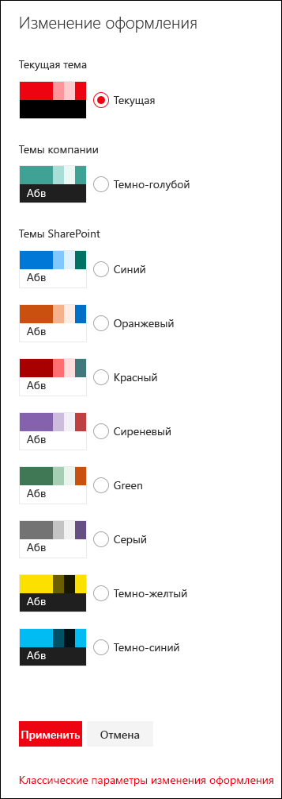

# Настройка тем SharePointSharePoint site theming

Владельцам сайтов SharePoint доступно несколько вариантов применения специальных стилей и цветов к сайтам, упрощающих определение тем и управление ими в разных семействах веб-сайтов.SharePoint site owners have new options for applying custom styles and colors to sites that make it easier to define and manage themes across site collections. В эти новые функции включено следующее:These new features include:

* Возможность определять специальные темы и делать их доступными владельцам сайтов.The ability to define custom themes and make them available to site owners. Темы определяются в [схеме JSON](sharepoint-site-theming-json-schema.md), в которой хранятся параметры цветов и соответствующие метаданные каждой темы.Themes are defined in a [JSON schema](sharepoint-site-theming-json-schema.md) that stores color settings and related metadata for each theme.
* [Веб-инструмент создания тем](https://developer.microsoft.com/ru-RU/fabric#/styles/themegenerator), с помощью которого можно определять новые специальные темы.An online [Theme Generator tool](https://developer.microsoft.com/ru-RU/fabric#/styles/themegenerator) that you can use to define new custom themes.
* Упрощенный набор стандартных тем, где в настоящее время доступны шесть светлых тем и две темные темы.A simplified set of default themes, with six light themes and two dark themes presently available.
* Обновленная цветовая палитра, включающая 12 светлых цветов и 6 темных, а также 16 дополнительных тем.An updated color palette, with 12 light colors and 6 dark colors, as well as 16 supplementary themes.
* Выбор тем, доступных для использования на страницах сайтов.Control over which themes are available for use on pages within your sites. Например, вы можете определить специальные темы с фирменной символикой или стилем вашей организации и сделать так, чтобы на ваших сайтах были доступны только эти темы.For example, you can define custom themes based on your organization's branding or identity, and make those the only available themes within your sites.

Эти возможности доступны администраторам посредством [командлетов PowerShell](sharepoint-site-theming-powershell.md), а разработчикам — посредством [клиентской объектной модели (CSOM)](sharepoint-site-theming-csom.md) SharePoint или [REST API](sharepoint-site-theming-rest-api.md) для SharePoint.These capabilities are available to administrators via [PowerShell cmdlets](sharepoint-site-theming-powershell.md), and to developers via the SharePoint [Client Side Object Model (CSOM)](sharepoint-site-theming-csom.md) or the SharePoint [REST API](sharepoint-site-theming-rest-api.md).

Общие сведения о работе с темами для настройки внешнего вида сайтов см. в статье [Изменение оформления сайта SharePoint](https://support.office.com/ru-RU/article/Change-the-look-of-your-SharePoint-site-06bbadc3-6b04-4a60-9d14-894f6a170818).For general information about working with themes to customize the look of your sites, see [Change the look of your SharePoint site](https://support.office.com/ru-RU/article/Change-the-look-of-your-SharePoint-site-06bbadc3-6b04-4a60-9d14-894f6a170818).

## Темы по умолчаниюDefault themes

По умолчанию доступны следующие заранее определенные темы:The following predefined themes are available by default:

* __синяя__;__Blue__
* __оранжевая__;__Orange__
* __красная__;__Red__
* __сиреневая__;__Purple__
* __зеленая__;__Green__
* __серая__;__Gray__
* __темно-желтая__ (инвертированная тема);__Dark Yellow__ (inverted theme)
* __темно-синяя__ (инвертированная тема).__Dark Blue__ (inverted theme)

Эти темы рассчитаны на удобочитаемость, поэтому они могут стать удобными отправными точками для создания специальных тем.These themes have been designed for readability, so you might find them to be useful starting points for creating custom themes. Дополнительные сведения о стандартных темах см. в статье [Настройка тем для сайтов SharePoint: схема JSON](sharepoint-site-theming-json-schema.md).For more information about default themes, see [SharePoint site theming: JSON schema](sharepoint-site-theming-json-schema.md).

Помимо стандартных тем, вы можете выбирать дополнительные.In addition to the default themes, you can select from supplementary themes. Доступны следующие варианты настройки:The following special folders are available:

* Светлые темы: "Золото", "Сине-зеленая", "Темно-синяя", "Индиго", "Сливовая", "Тепло-серая".Light themes: Gold, Teal, Dark Blue, Indigo, Plum, Warm Gray
* Темные темы: "Красная", "Зеленая", "Сиреневая", "Серая".Dark themes: Red, Green, Purple, Gray

## Выбор современной темыSelecting a modern theme

<!-- Verify that it's okay to use the concept of "modern" themes/pages here? -->

Чтобы выбрать одну из доступных тем для сайта SharePoint, нажмите __значок шестеренки (⚙️)__ в правом верхнем углу экрана и выберите пункт __Изменение оформления__.To select from the available themes for a SharePoint site, choose the __gear icon (⚙️)__ in the top right corner of the screen and then select __Change the look__. Появится список тем, который может включать стандартные и/или специальные темы в зависимости от того, как настроен сайт.You'll be presented with a list of themes to choose from, which might include default themes and/or custom themes depending on how your site has been configured.

На приведенном ниже изображении показано, как стандартные темы отображаются в диалоговом окне выбора темы.The following image shows how the default themes are presented in the theme picker dialog box.

При выборе темы из списка соответствующие параметры цветов мгновенно применяются к странице, чтобы вы могли увидеть, как будет выглядеть выбранная тема.When you choose a theme in the list, those color settings are instantly applied to the page so that you can see what the selected theme will look like.

Когда вы найдете подходящую тему, нажмите кнопку **Сохранить**, чтобы сохранить выбранные настройки, или **Отмена**, чтобы вернуться к текущей теме.After you've found a theme that you want to use, choose **Save** to save your selection, or choose **Cancel** to revert to your current theme.

## Работа с классическими темамиWorking with classic themes

Вы по-прежнему можете использовать классические темы. Для этого перейдите по ссылке _Классические параметры изменения оформления_ под списком современных тем в разделе _Изменение оформления_.You can still use the classic themes, by choosing the link to _Classic change the look options_ beneath the modern themes listed under _Change the look_. Однако современный пользовательский интерфейс SharePoint отличается от классического, поэтому при использовании классических тем на современных страницах действуют некоторые ограничения.Because the modern SharePoint UI differs from the classic UI, however, some limitations apply when you use classic themes with modern pages.

Когда вы выберете классическую тему, на основе ее параметров создается современная тема, включающая флаг isInverted, фоновое изображение и параметры цветов COntentAccent1, PageBackground и BackgroundOverlay.When you select a classic theme, a modern theme will be generated from the settings in the classic theme, including the isInverted flag, the background image, and the color settings for COntentAccent1, PageBackground, and BackgroundOverlay. Если для параметра isInverted задано значение True, нейтральные цвета, такие как NeutralDark и NeutralLight, будут инвертированы.If isInverted is set to True, neutral colors such as NeutralDark and NeutralLight will be reversed.

Для простоты рекомендуем использовать современные темы на современных страницах.For the simplest experience, we recommend that you use modern themes with modern pages. Если вам нужно использовать классические темы на современных страницах, тщательно протестируйте сайт, чтобы убедиться, что контент удобочитаемый и доступный.If you need to use classic themes with modern pages, test your site carefully to verify that your content is readable and accessible.

## См. такжеSee also

* [Изменение внешнего вида сайта SharePointChange the look of your SharePoint site](https://support.office.com/ru-RU/article/Change-the-look-of-your-SharePoint-site-06bbadc3-6b04-4a60-9d14-894f6a170818?ui=en-US&rs=en-US&ad=US#ID0EAACAAA=Online)
* [Инструмент создания темTheme Generator tool](https://developer.microsoft.com/ru-RU/fabric#/styles/themegenerator)
* [Настройка тем для сайтов SharePoint: схема JSONSharePoint site theming: JSON schema](sharepoint-site-theming-json-schema.md)
* [Настройка тем для сайтов SharePoint: командлеты PowerShellSharePoint site theming: PowerShell cmdlets](sharepoint-site-theming-powershell.md)
* [Настройка тем для сайтов SharePoint: CSOMSharePoint site theming: CSOM](sharepoint-site-theming-csom.md)
* [Настройка тем для сайтов SharePoint: REST APISharePoint site theming: REST API](sharepoint-site-theming-rest-api.md)
