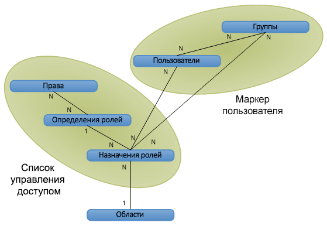

# Авторизация, пользователи, группы и объектные модели в SharePointAuthorization, users, groups, and the object model in SharePoint

В SharePoint управление доступом к веб-сайтам, спискам, папкам и элементам списков осуществляется с помощью основанной на ролях системы членства, с помощью которой пользователям назначаются роли, разрешающие доступ к объектам SharePoint.In SharePoint, access to websites, lists, folders, and list items is controlled through a role-based membership system by which users are assigned to roles that authorize their access to SharePoint objects.
  
    
    

Чтобы разрешить пользователю доступ к объекту, можно добавить его в группу, которая уже обладает разрешениями на доступ к объекту, или создать объект назначения роли, определить пользователя для назначения роли, при необходимости привязав назначение роли к соответствующему определению роли с базовыми разрешениями, а затем добавить назначение в коллекцию назначений ролей для элемента списка, папки, списка или веб-сайта. Если при назначении роли пользователю не привязать назначение роли к определению роли, разрешение пользователю предоставлено не будет. Ниже перечислены способы управления доступом к объектам в SharePoint:To give a user access to an object, you can add the user to a group that already has permissions to the object, or you can create a role assignment object, set the user for the role assignment, optionally bind the role assignment to the appropriate role definition with base permissions, and then add the assignment to the collection of role assignments for the list item, folder, list, or website. If you do not bind the role assignment to a role definition when assigning a user to a role, the user has no permission. Following are ways that SharePoint provides to control access to its objects:
  
    
    

- Объекты могут использовать те же разрешения, что и родительский веб-сайт, список или папка (наследуя роли и пользователей родительского объекта) или могут уникальные разрешения.Objects can use the same permissions as the parent website, list, or folder (inheriting both the roles and users available on the parent object), or they can use unique permissions. 
    
  
- Для веб-сайтов, списков, папок и элементов предоставляются отдельные коллекции назначений ролей, что позволяет гибко управлять доступом пользователей к объектам.Sites, lists, folders, and items each provide role assignment collections, enabling fine management of user access to objects.
    
  
- Группы состоят из пользователей, и им могут назначаться или не назначаться роли. В состав SharePoint по умолчанию входят следующие три группы:Groups consist of users and may or may not be assigned to roles. SharePoint includes the following three groups by default:
    
  - **owners** (администратор);**owners** (administrator)
    
  
  - **members** (корреспондент);**members** (contributor)
    
  
  - **visitors** (читатель).**visitors** (reader)
    
  

    При создании веб-сайта с уникальными разрешениями через пользовательский интерфейс выполняется переход на страницу, на которой пользователи помещаются в группы для контроля доступа к сайту.When you create a website with unique permissions through the user interface, you are directed to a page where you can assign users to these groups as part of provisioning the site.
    
  
- Анонимный доступ позволяет пользователям анонимно принимать участие в опросах и просматривать страницы. Кроме того, можно разрешить доступ "всем пользователям, прошедшим проверку", чтобы все члены домена могли обращаться к веб-сайту без необходимости включения анонимного доступа.Anonymous access allows users to contribute anonymously to lists and surveys, or to view pages anonymously. You can also grant access to "all authenticated users" to allow all members of your domain to access a website without having to enable anonymous access. 
    
  
- Права создания веб-сайта ( **CreateSSCSite** и **ManageSubwebs**) управляют правом пользователей на создание веб-сайтов верхнего уровня, дочерних сайтов или рабочих областей.Site creation rights ( **CreateSSCSite** and **ManageSubwebs**) control whether users can create top-level websites, subsites, or workspaces.
    
  
Пользователи могут стать членами объекта SharePoint неявно, через группу, которой назначена соответствующая роль, или напрямую с помощью назначения. Пользователи также могут быть членами группы домена Microsoft Windows NT, которая добавляется к группе или роли. Определение роли связывает пользователя или группу с правом или набором прав, соответствующих значениям перечисления  [Microsoft.SharePoint.SPBasePermissions](https://msdn.microsoft.com/library/Microsoft.SharePoint.SPBasePermissions.aspx) . Каждый пользователь или группа имеет уникальный идентификатор [ID](https://msdn.microsoft.com/library/Microsoft.SharePoint.SPMember.ID.aspx) .Возможности объектной модели для создания или изменения назначений и определений ролей отличаются от возможностей, предоставляемых файлами addrole.aspx и editrole.aspx. В отличие от этих страниц, представленных в пользовательском интерфейсе, объектная модель не вводит зависимость прав, поэтому возможно создание определения с любой их комбинацией. В то же время при использовании объектной модели для настройки определений ролей и разрешений следует тщательно продумывать план, так как плохо спланированное определение ролей и неправильно назначенные права могут привести к возникновению проблем при использовании.Дополнительные сведения о правах SharePoint см. в статье  [SPBasePermissions](https://msdn.microsoft.com/library/Microsoft.SharePoint.SPBasePermissions.aspx) .Users become members of a SharePoint object indirectly through a group that has a role assignment, or directly through a role assignment. Users also can be members of a Microsoft Windows NT Domain Group that is added to a group or to a role. A role definition associates a user or group with a single right or set of rights corresponding to values of the  [Microsoft.SharePoint.SPBasePermissions](https://msdn.microsoft.com/library/Microsoft.SharePoint.SPBasePermissions.aspx) enumeration. Each user or group has a unique member [ID](https://msdn.microsoft.com/library/Microsoft.SharePoint.SPMember.ID.aspx) .You can use the object model to create or modify role assignments and definitions differently than the way you can through the functionality of the addrole.aspx file and the editrole.aspx file. Unlike these pages, which are presented in the user interface, the object model does not enforce rights dependency, so you can create a role definition with an arbitrary combination of rights. But, plan carefully when using the object model to customize role definitions and permissions, because a poorly planned role definition and inappropriately assigned rights can lead to a bad user experience.For more information about SharePoint rights, see  [SPBasePermissions](https://msdn.microsoft.com/library/Microsoft.SharePoint.SPBasePermissions.aspx) .
## Политика безопасностиSecurity policy

Политика безопасности позволяет обеспечивать единый уровень безопасности для всех семейств сайтов внутри веб-приложения (виртуального сервера). Политика позволяет назначать роль (или коллекцию прав) отдельным пользователям SharePoint и группам домена, использующим проверку подлинности Windows или подключаемые системы проверки подлинности. Назначение ролей группам SharePoint через политику безопасности невозможно. Каждая запись политики указывает права для пользователя или группы пользователей в веб-приложении.A security policy provides a way to enforce uniform security throughout all site collections within a web application (virtual server). Through policy, you can assign a role, or collection of rights, to individual SharePoint users, and to domain groups using Windows authentication or pluggable authentication systems, but not to SharePoint groups. Each policy entry specifies rights for a user or group in the web application.
  
    
    
Политика настраивается на уровне логического веб-приложения или зоны. Например, пользователь может использовать различные политики для веб-сайтов  `http://Server` и `http://Server.extranet.microsoft.com`, даже если оба приложения предоставляют одинаковое содержимое.Policy is set at the logical web application level or at the zone level. A user can have, for example, different policies on  `http://Server` and `http://Server.extranet.microsoft.com`, even if the two web applications have the same content.
  
    
    
Политика позволяет предоставлять или отзывать права. Предоставление права дает пользователю или группе пользователей это право на все защищаемые объекты веб-приложения вне зависимости от локальных разрешений объекта. Отзыв права обладает большим приоритетом, чем предоставление права, блокируя соответствующее право для пользователей или группы пользователей на все защищаемые объекты веб-приложения. Отзыв всех прав для пользователя запрещает ему доступ ко всему контенту, даже если пользователь имеет явные разрешения на определенный контент: политика переопределяет разрешения уровня веб-сайта.Rights can be granted or denied through policy. Granting a right gives that right to the user or group on all secured objects within the web application, regardless of local permissions on the object. Denying a right is given a higher priority than granting the right, actively blocking that right for the user or group on all secured objects within the web application. Denying all for a user prevents that user from accessing any content, even if the user has explicit permissions on specific content: policy overrides site-level permissions.
  
    
    
В ролях политики пользователи и группы пользователей определяются по идентификатору безопасности (SID) и имени пользователя или имени входа. Процедура применения роли политики схожа с процедурой управления разрешениями для веб-сайта, списка, папки или документа. Добавленные пользователи или группы включаются в одно или несколько определений ролей. Каждое веб-приложение использует собственные роли политики. Другим отличием ролей политики от разрешений является то, что центральные администраторы могут отозвать у пользователя право на все веб-приложение.In policy roles, the users and groups are identified by both their security identifier (SID) and their login or user name. Applying a policy role is similar to managing permissions for a website, list, folder, or document: You add users or groups and assign them to one or more role definitions. Each web application has its own policy roles. Another difference between policy roles and managing permissions is that central administrators can deny a right to a user throughout a web application.
  
    
    

> [!NOTE]
> Роли политики центрального администрирования отличаются от определений ролей для семейства веб-сайтов.Central administration policy roles differ from the role definitions for a site collection. 
  
    
    

## Пользователи, группы и субъектыUsers, groups, and principals

Пользователь ( [SPUser](https://msdn.microsoft.com/library/Microsoft.SharePoint.SPUser.aspx) ) получает доступ к объекту SharePoint непосредственно через назначение роли или косвенно через членство в группе доменов или группе SharePoint ( [SPGroup](https://msdn.microsoft.com/library/Microsoft.SharePoint.SPGroup.aspx) ), которой назначена роль. При прямом назначении роли субъект  это пользователь ( [SPPrincipal](https://msdn.microsoft.com/library/Microsoft.SharePoint.SPPrincipal.aspx) ). При назначении роли в группе доменов или группе SharePoint субъект  это группа.An individual user ( [SPUser](https://msdn.microsoft.com/library/Microsoft.SharePoint.SPUser.aspx) ) gains access to a SharePoint object directly through an individual role assignment, or indirectly through membership in either a domain group or a SharePoint group ( [SPGroup](https://msdn.microsoft.com/library/Microsoft.SharePoint.SPGroup.aspx) ) that has a role assignment. In a direct role assignment, the user is the principal ( [SPPrincipal](https://msdn.microsoft.com/library/Microsoft.SharePoint.SPPrincipal.aspx) ). In a domain group or SharePoint group role assignment, the domain group or SharePoint group is the principal.
  
    
    
SharePoint Server поддерживает пользователей Windows (например,  _DOMAIN_\\ _User_Alias_) и внешних пользователей (с помощью модульной проверки подлинности). Удостоверение пользователя поддерживается системой управления удостоверениями (например, службой каталогов Active Directory). Область профиля пользователя (включающий отображаемое имя пользователя, адрес электронной почты и другую информацию) устанавливается на уровне семейства веб-сайтов. Изменение отображаемого имени повлияет на все семейство веб-сайтов.SharePoint Server supports Windows users (for example,  _DOMAIN_\\ _User_Alias_) and external users (through pluggable authentication). The user identity is maintained by the identity management system (for example, the Active Directory directory service). The user profile (which includes the user's display name, email address, and other information) is scoped to the site-collection level. Changing a display name affects the entire site collection.
  
    
    
Группа  это коллекция пользователей, с помощью которых SharePoint Server управляет безопасностью. Управлять на уровне пользователей просто на простых сайтах, но с ростом числа ресурсов с уникальной защитой становится сложнее. Например, пользователь может иметь роль **Contribute** для списка 1, роль **Read** для списка 2 и роль **Design** для списка 3. Эта модель будет плохо масштабироваться, если количество пользователей равно, допустим, 50 000, и в списках управления доступом (ACL) будет, соответственно, 50 000 элементов управления доступом (ACE) на каждом объекте с уникальной защитой.A group is a collection of users through which SharePoint Server manages security. User-based management is straightforward for simple sites, but becomes more complex as the number of uniquely secured resources grows. For example, a user may have the **Contribute** role for list 1, the **Read** role for list 2, and the **Design** role for list 3. This model does not scale well if there are, for example, 50,000 users—which would result in access control lists (ACLs) being 50,000 access control entries (ACEs) long on every uniquely secured object.
  
    
    
Управление на уровне групп позволяет решить проблемы управляемости и масштабирования, связанные с управлением разрешениями на уровне пользователей. Оно может быть более абстрактным или сложным для представления, но облегчает управление сложными веб-сайтами с большим количеством объектов с уникальной защитой. Например, при добавлении пользователя в группу, которой уже назначена определенная роль на различных объектах в системе. Проверка разрешений для групп лучше масштабируется, так как для необходимо хранить значительно меньше элементов управления доступом.Groups provide an answer to the manageability and scale problems of user-based permissions management. Group-based management may be more abstract or more difficult to conceptualize, but it enables easier management of complex sites with many uniquely secured objects. For example, when adding a user to a group that has already been granted the appropriate role on various objects in the system. The permissions checking for groups scales better because far fewer group ACEs need to be stored.
  
    
    
SharePoint Server поддерживает два вида групп: группы доменов и группы SharePoint. Группами доменов нельзя управлять в SharePoint Server; пользователи не могут использовать SharePoint Server, чтобы определять, просматривать или изменять членство группы доменов. Группы SharePoint можно использовать только в семействе веб-сайтов. Группы доменов можно использовать везде в области применения службы каталогов Active Directory.SharePoint Server supports two kinds of groups: domain groups and SharePoint groups. Domain groups remain outside SharePoint Server control; users cannot use SharePoint Server to define, browse, or modify domain group membership. SharePoint groups are scoped to the site-collection level, and they can be used only within the site collection. Domain groups can be used anywhere within the scope of the Active Directory directory service.
  
    
    
Субъект  это пользователь или группа, которая используется для управления безопасностью. Если добавить на веб-сайт пользователя, то субъектом будет пользователь, но если добавить группу, то субъектом будет группа. Главное в масштабировании безопасности в SharePoint Server  это разумное количество субъектов в области. Благодаря группам для предоставления прав большому количеству пользователей можно использовать небольшое количество субъектов.A principal is a user or group that is used to control security. If you add a user to a site, the user is the principal, but if you add a group to the site, the group is the principal. The key to scaling security in SharePoint Server is to keep the number of principals per scope reasonable. By using groups, a smaller number of principals can be used to grant access to a much larger number of users.
  
    
    

## Высокоуровневое представление связей объектов: области, пользователи, группы и ролиHigh-level view of object relations—scopes, users, groups, and roles

На рисунке 1 показано высокоуровневое представление системы управления безопасностью SharePoint Server в виде логической схемы базы данных. Каждая ячейка представляет объект безопасности в системе. Линии показывают отношения между объектами. Символы **1** и **N** обозначают тип отношения. На рисунке показано, как данные разрешений структурированы в маркере пользователя и ACL.Figure 1 shows a high-level view of the SharePoint Server security management system in a logical database diagram. Each box represents a security object in the system. The lines represent relationships between the objects. The **1** and **N** notation represents the type of relationship. The figure shows how permissions data is structured into a user token and an ACL.
  
    
    

**Рисунок 1. Отношения объектов авторизации****Figure 1. Authorization object relations**

  
    
    

  
    
    

  
    
    
Область представляет собой объект или набор объектов с уникальной защитой. Область можно установить на уровне веб-сайта, списка, папки или элемента.A scope represents a uniquely secured object or set of objects. You can scope to site, list, folder or item level.
  
    
    
Пользователи и группы имеют отношение "многие ко многим" (N к N). Каждый пользователь ( [SPUser](https://msdn.microsoft.com/library/Microsoft.SharePoint.SPUser.aspx) ) может быть членом нескольких групп, а каждая группа ( [SPGroup](https://msdn.microsoft.com/library/Microsoft.SharePoint.SPGroup.aspx) ) может содержать несколько пользователей.Users and groups have a many-to-many relationship (N to N). Each user ( [SPUser](https://msdn.microsoft.com/library/Microsoft.SharePoint.SPUser.aspx) ) can be a member of multiple groups, and each group ( [SPGroup](https://msdn.microsoft.com/library/Microsoft.SharePoint.SPGroup.aspx) ) can contain multiple users.
  
    
    
Права и определения ролей также имеют отношение "многие ко многим" (N к N). Каждое право ( [SPBasePermissions](https://msdn.microsoft.com/library/Microsoft.SharePoint.SPBasePermissions.aspx) ) может быть частью нескольких определений ролей. Например, право **Insert List Items** включено в определения ролей **Contributor**, **Designer** и **Administrator**. Каждое определение роли ( [SPRoleDefinition](https://msdn.microsoft.com/library/Microsoft.SharePoint.SPRoleDefinition.aspx) ) также может содержать несколько прав. Например, **Contributor** включает права на вставку, обновление и удаление элементов списка.Rights and role definitions also have a many-to-many relationship (N to N). Each right ( [SPBasePermissions](https://msdn.microsoft.com/library/Microsoft.SharePoint.SPBasePermissions.aspx) ) can be part of multiple role definitions. For example, the **Insert List Items** right is included in the **Contributor**, **Designer**, and **Administrator** role definitions. Each role definition ( [SPRoleDefinition](https://msdn.microsoft.com/library/Microsoft.SharePoint.SPRoleDefinition.aspx) ) can also contain multiple rights. For example, **Contributor** includes the rights for inserting, updating, and deleting list items.
  
    
    
Определения и назначения ролей ( [SPRoleAssignment](https://msdn.microsoft.com/library/Microsoft.SharePoint.SPRoleAssignment.aspx) ) имеют отношение "один ко многим" (1 к N). Каждое определение роли используется в нескольких назначениях ролей. В списке 1 и списке 2 могут быть разные читатели, но их роли могут иметь одно определение: **Reader**.Role definitions and role assignments ( [SPRoleAssignment](https://msdn.microsoft.com/library/Microsoft.SharePoint.SPRoleAssignment.aspx) ) have a one-to-many relationship (1 to N). Each role definition is used in multiple role assignments. The readers on list 1 and the readers on list 2 may be different, but their role assignments can share a single role definition: **Reader**.
  
    
    
Пользователи или группы и роли имеют отношение "многие ко многим" (N к N). Каждый пользователь или группа может иметь нескольких ролей для данного объекта. Например, пользователь может иметь роль **Designer** и роль **Administrator** для одного и того же объекта.Users or groups and role assignments have a many-to-many relationship (N to N). Each user or group can be a member of multiple role assignments on a given object. For example, a user may have both the **Designer** role and the **Administrator** role on the same object.
  
    
    
Области и роли имеют отношение "один ко многим" (1 к N). Каждая область имеет несколько ролей, однако каждая роль имеет только одну область. Например, один пользователь может быть читателем в списке событий, а другой  автором, но ни одна из этих ролей не применяется к списку объявлений. Два списка могут иметь одну роль, только унаследовав разрешения от родительского контейнера. В этом случае областью безопасности будет контейнер, а не два списка.Scopes and role assignments have a one-to-many relationship (1 to N). Each scope has multiple role assignments, but each role assignment has only one scope. For example, one user may be a reader on the Events list, and another user may be a contributor on the Events list, but neither of these role assignments applies to the Announcements list. The only way for two lists to share the same role assignment is by inheriting their permissions from the parent container, in which case the security scope is the container, not the two lists.
  
    
    

## Маркеры пользователей и списки управления доступомUser tokens and access control lists

Чтобы ускорить проверку разрешений, SharePoint Server добавляет в свою модель безопасности маркеры пользователей и ACL. Маркер пользователя определяет проверку подлинности по отношению к учетной записи. Пользователь Windows имеет сложный маркер: уникальная строка (ИД безопасности) и список всех групп доменов Windows для пользователя (например,  _DOMAIN_\\Department 15688). Учетная запись без проверки подлинности Windows может иметь очень простой маркер с уникальной строкой для имени пользователя или сложный маркер с членством в группе или роли, как при проверке подлинности Windows. Членство каждого пользователя в группе SharePoint выражается через маркер пользователя так, что при его чтении SharePoint Server определяет все группы для текущего пользователя.To make checking permissions faster, SharePoint Server implements user tokens and ACLs in its security model. The user token identifies the authentication process applied to a user. A Windows user has a complex token: a unique string for the user (SID) and a list of all the Windows domain groups for the user (for example,  _DOMAIN_\\Department 15688). A user who does not have Windows authentication may have a very simple token with a unique string for the user name, or a complex token with group/role membership just as expressed in Windows authentication. SharePoint group membership for each user is expressed through a user token so that, by reading the user token, SharePoint Server identifies all groups for the current user.
  
    
    
ACL  это двоичный объект, который определяет права пользователей и групп по отношению к данному объекту. ACL состоит из нескольких элементов ACE, каждый из которых представляет субъект безопасности (пользователя или группу). Права, определения ролей и роли структурированы в ACL для каждой области, поэтому SharePoint Server знает, какие разрешения пользователь или группа имеет в данной области.An ACL is a binary object that determines the rights that users and groups have on a given object. An ACL consists of multiple ACEs, each security principal (user or group) being one ACE in the ACL. Rights, role definitions, and role assignments are structured into an ACL for each scope, so that SharePoint Server knows what each user or group is allowed to do within the given scope.
  
    
    

## Изменения объектной модели: устаревшие объекты безопасности с обратной совместимостьюObject model changes: obsolete but backward-compatible security objects

В SharePoint принцип управления разрешениями  один для всех областей объектов. SharePoint управляет разрешениями с помощью определений ролей, которые одинаковые результаты на уровне списка, папки и элемента. Следующие объекты безопасности, используемые в Службы Windows SharePoint Services 2.0, устарели, но продолжают работать для обеспечения обратной совместимости:In SharePoint, all object scopes share the same basic permissions management experience. SharePoint manages permissions through role definitions, which enable a consistent experience at the list, folder, and item level. The following security objects used in Windows SharePoint Services 2.0 are obsolete, but continue to function for backward-compatibility:
  
    
    

-  [Microsoft.SharePoint.SPPermissionMicrosoft.SharePoint.SPPermission](https://msdn.microsoft.com/library/Microsoft.SharePoint.SPPermission.aspx)
    
  
-  [Microsoft.SharePoint.SPPermissionCollectionMicrosoft.SharePoint.SPPermissionCollection](https://msdn.microsoft.com/library/Microsoft.SharePoint.SPPermissionCollection.aspx)
    
  
-  [Microsoft.SharePoint.SPRightsMicrosoft.SharePoint.SPRights](https://msdn.microsoft.com/library/Microsoft.SharePoint.SPRights.aspx)
    
  
-  [Microsoft.SharePoint.SPRoleMicrosoft.SharePoint.SPRole](https://msdn.microsoft.com/library/Microsoft.SharePoint.SPRole.aspx)
    
  
-  [Microsoft.SharePoint.SPRoleCollectionMicrosoft.SharePoint.SPRoleCollection](https://msdn.microsoft.com/library/Microsoft.SharePoint.SPRoleCollection.aspx)
    
  
Чтобы назначить пользователей на роли, используйте члены классов  [Microsoft.SharePoint.SPRoleAssignment](https://msdn.microsoft.com/library/Microsoft.SharePoint.SPRoleAssignment.aspx) и [Microsoft.SharePoint.SPRoleAssignmentCollection](https://msdn.microsoft.com/library/Microsoft.SharePoint.SPRoleAssignmentCollection.aspx) . Перечисление [SPBasePermisssions](https://msdn.microsoft.com/ru-RU/library/office/microsoft.sharepoint.spbasepermissions.aspx) , которое заменило [SPRights](https://msdn.microsoft.com/library/Microsoft.SharePoint.SPRights.aspx) , включает дополнительные разрешения. Перечисление [SPBasePermisssions](https://msdn.microsoft.com/ru-RU/library/office/microsoft.sharepoint.spbasepermissions.aspx) также включает устаревшие разрешения, которые сопоставляются с теми же постоянными значениями, что и предыдущие разрешения в [SPRights](https://msdn.microsoft.com/library/Microsoft.SharePoint.SPRights.aspx) . Концепция группы SharePoint сопоставляется с существующими объектами [SPGroup](https://msdn.microsoft.com/library/Microsoft.SharePoint.SPGroup.aspx) и [SPGroupCollection](https://msdn.microsoft.com/library/Microsoft.SharePoint.SPGroupCollection.aspx) , которые представляют межсайтовые группы.To assign users to roles, use members of the  [Microsoft.SharePoint.SPRoleAssignment](https://msdn.microsoft.com/library/Microsoft.SharePoint.SPRoleAssignment.aspx) class and the [Microsoft.SharePoint.SPRoleAssignmentCollection](https://msdn.microsoft.com/library/Microsoft.SharePoint.SPRoleAssignmentCollection.aspx) class. The [SPBasePermisssions](https://msdn.microsoft.com/ru-RU/library/office/microsoft.sharepoint.spbasepermissions.aspx) enumeration, which replaced [SPRights](https://msdn.microsoft.com/library/Microsoft.SharePoint.SPRights.aspx) , includes additional permissions. The [SPBasePermisssions](https://msdn.microsoft.com/ru-RU/library/office/microsoft.sharepoint.spbasepermissions.aspx) enumeration also includes legacy permissions that map to the same constant values as previous permissions in [SPRights](https://msdn.microsoft.com/library/Microsoft.SharePoint.SPRights.aspx) . The SharePoint group concept maps to the existing [SPGroup](https://msdn.microsoft.com/library/Microsoft.SharePoint.SPGroup.aspx) object and [SPGroupCollection](https://msdn.microsoft.com/library/Microsoft.SharePoint.SPGroupCollection.aspx) object, which represent cross-site groups.
  
    
    

### Роли политик: создание или изменение политик безопасности для зон URL-адресовPolicy roles: create or modify security policies for URL zones

Чтобы создать или изменить политики безопасности для зон URL-адресов, используйте следующие классы и их члены:To create or modify security policies for URL zones, use the following classes and their members:
  
    
    

-  [Microsoft.SharePoint.Administration.SPPolicyMicrosoft.SharePoint.Administration.SPPolicy](https://msdn.microsoft.com/library/Microsoft.SharePoint.Administration.SPPolicy.aspx)
    
  
-  [Microsoft.SharePoint.Administration.SPPolicyCollectionMicrosoft.SharePoint.Administration.SPPolicyCollection](https://msdn.microsoft.com/library/Microsoft.SharePoint.Administration.SPPolicyCollection.aspx)
    
  
-  [Microsoft.SharePoint.Administration.SPPolicyRoleMicrosoft.SharePoint.Administration.SPPolicyRole](https://msdn.microsoft.com/library/Microsoft.SharePoint.Administration.SPPolicyRole.aspx)
    
  
-  [Microsoft.SharePoint.Administration.SPPolicyRoleCollectionMicrosoft.SharePoint.Administration.SPPolicyRoleCollection](https://msdn.microsoft.com/library/Microsoft.SharePoint.Administration.SPPolicyRoleCollection.aspx)
    
  
-  [Microsoft.SharePoint.Administration.SPPolicy.SPPolicyRoleBindingCollectionMicrosoft.SharePoint.Administration.SPPolicy.SPPolicyRoleBindingCollection](https://msdn.microsoft.com/library/Microsoft.SharePoint.Administration.SPPolicy.SPPolicyRoleBindingCollection.aspx)
    
  
-  [Microsoft.SharePoint.Administration.SPPolicyPermissionsMicrosoft.SharePoint.Administration.SPPolicyPermissions](https://msdn.microsoft.com/library/Microsoft.SharePoint.Administration.SPPolicyPermissions.aspx)
    
  

## Гостевые роли (ограниченный доступ) для размещения общих ресурсовGuest roles (Limited Access) to accommodate shared resources

Гостевая роль необходима для размещения общих ресурсов на платформе. Например, чтобы преобразовать страницу для просмотра списка, необходима тема и структура навигации веб-сайта. Позже в эту концепцию включены разрешения на уровне папки и списка.The concept of a guest role is to accommodate the shared resources in the platform. For example, the theme and navigation structure of the website must be used to render the page for a list view. This concept is extended to include folder-level permissions and list-level permissions.
  
    
    
В объектной модели SharePoint она по-прежнему называется ролью **Guest** для семантической совместимости с предыдущей объектной моделью, хотя в пользовательском интерфейсе эта роль теперь называется **Ограниченный доступ**.The SharePoint object model continues to call this the **Guest** role for semantic compatibility with the previous object model, although in the user interface the role is now called **Limited Access**. 
  
    
    

### Расширения папок и элементовFolder and item extensions

Когда пользователю предоставляются разрешения на папку, ему также предоставляется роль **Guest** в родительском списке этой папки и на родительском веб-сайте этого списка  в каждой области с уникальной защитой выше папки вплоть до первого уникального сайта-предка. То же самое касается элементов списка: если предоставить пользователю разрешения на элемент, ему также будет предоставлена роль **Guest** во всех родительских папках, списках и веб-сайтах вплоть до первого уникального сайта-предка.When a user is granted permissions on a folder, they are also granted the **Guest** role on the parent list of that folder and on the parent website of that list—on every uniquely secured scope above the folder, all the way to the first unique ancestor website. This is also true for list items: granting a user permissions on an item also grants that user the **Guest** role on all parent folders, lists, and websites up to the first unique ancestor website.
  
    
    

## Удаление пользователей из одной области или из всех областейRemoving users from a scope or from all scopes

Если удалить пользователя из области, он будет удален из всех областей с уникальной защитой ниже текущей области. Например, если удалить пользователя с веб-сайта, он будет удален из списков с уникальной защитой на этом сайте.Removing a user from a scope also removes that user from all uniquely secured scopes beneath the current scope. For example, removing a user from a website also removes that user from uniquely secured lists in the site.
  
    
    
Удалить пользователя из всех областей можно, только удалив его из семейства веб-сайтов, после чего пользователь будет удален из всех ролей во всех областях семейства веб-сайтов.The only way to remove a user from all scopes is to delete that user from the site collection, which removes the user from all roles in all scopes within the site collection.
  
    
    

## См. такжеSee also

-  [Проверка подлинности, авторизация и безопасность в SharePointAuthentication, authorization, and security in SharePoint](authentication-authorization-and-security-in-sharepoint.md)
    
  
-  [Роли, наследования, несанкционированное получение прав и изменения паролей в SharePointRole, inheritance, elevation of privilege, and password changes in SharePoint](role-inheritance-elevation-of-privilege-and-password-changes-in-sharepoint.md)
    
  
-  [Удостоверение, основанное на основе утверждений в SharePointClaims-based identity in SharePoint](claims-based-identity-in-sharepoint.md)
    
  
-  [Удостоверение, основанное на утверждениях и концепций в SharePointClaims-based identity and concepts in SharePoint](claims-based-identity-and-concepts-in-sharepoint.md)
    
  
-  [Настройки, администрирования и ресурсы в SharePointConfiguration, administration, and resources in SharePoint](configuration-administration-and-resources-in-sharepoint.md)
    
  

