# <a name="create-custom-sharepoint-workflow-forms-with-visual-studio-2012"></a><span data-ttu-id="5274c-102">Создание настраиваемых форм рабочих процессов SharePoint с помощью Visual Studio 2012</span><span class="sxs-lookup"><span data-stu-id="5274c-102">How to: Create Custom SharePoint Workflow Forms with Visual Studio 2012</span></span>

<span data-ttu-id="5274c-103">Представление форм рабочих процессов в SharePoint.</span><span class="sxs-lookup"><span data-stu-id="5274c-103">Presents workflow forms in SharePoint.</span></span> <span data-ttu-id="5274c-104">При написании этой статьи использовались Инструменты разработчика Office для Visual Studio 2012 и SharePoint с общедоступным обновлением за март 2013 г.</span><span class="sxs-lookup"><span data-stu-id="5274c-104">This article uses SharePoint with the March 2013 Public Update applied and Office Developer tools for Visual Studio 2012.</span></span> <span data-ttu-id="5274c-105">Все представленные в этой статье сведения применимы как к локальным развертываниям SharePoint, так и к Office 365.</span><span class="sxs-lookup"><span data-stu-id="5274c-105">Everything in this article applies to both SharePoint on-premises deployments as well as Office 365.</span></span>

<span data-ttu-id="5274c-106">**Автор:** [Эндрю Коннел (Andrew Connell)](http://social.msdn.microsoft.com/profile/andrew%20connell%20%5bmvp%5d/), [www.AndrewConnell.com](http://www.andrewconnell.com)</span><span class="sxs-lookup"><span data-stu-id="5274c-106">**Provided by:** [Andrew Connell](http://social.msdn.microsoft.com/profile/andrew%20connell%20%5bmvp%5d/),  [www.AndrewConnell.com](http://www.andrewconnell.com)</span></span>

<span data-ttu-id="5274c-p102">С момента выпуска Microsoft SharePoint 2007 платформа SharePoint поддерживает рабочие процессы для автоматизации бизнес-процессов. Платформа рабочих процессов SharePoint основана на Windows Workflow Foundation, части .NET Framework. Хотя Workflow Foundation предоставляет множество возможностей для создания настраиваемых рабочих процессов и управления автоматизированными бизнес-процессами, в SharePoint также добавлена возможность интеграции конечных пользователей, которая реализуется в виде двух частей:</span><span class="sxs-lookup"><span data-stu-id="5274c-p102">Since the release of Microsoft SharePoint 2007, the SharePoint platform has supported using workflows to automate business processes. The SharePoint workflow platform is built on the Windows Workflow Foundation, which is part of the .NET Framework. While the Workflow Foundation provides many capabilities for authoring custom workflows and managing automated business processes, SharePoint also adds end-user integration. This integration is implemented in two parts:</span></span> 
- <span data-ttu-id="5274c-111">**задачи**, назначаемые пользователям и группам, которых рабочие процессы могут создавать и отслеживать;</span><span class="sxs-lookup"><span data-stu-id="5274c-111">**Tasks** assigned to users and groups that can be created and monitored by the workflows.</span></span>

- <span data-ttu-id="5274c-112">**формы**, которые собирают данные от пользователей, если рабочие процессы связаны с типом контента (например, сайтом, списком или библиотекой) или если запускается рабочий процесс.</span><span class="sxs-lookup"><span data-stu-id="5274c-112">**Forms** that collect information from users when workflows are associated with a type of content (for example, a site, list, or library) or when a workflow is started.</span></span>
    
  

## <a name="workflow-forms-in-sharepoint-2007-and-sharepoint-2010"></a><span data-ttu-id="5274c-113">Формы рабочих процессов в SharePoint 2007 и SharePoint 2010</span><span class="sxs-lookup"><span data-stu-id="5274c-113">Workflow forms in SharePoint 2007 and SharePoint 2010</span></span>
<span data-ttu-id="5274c-114"><a name="sec1"> </a></span><span class="sxs-lookup"><span data-stu-id="5274c-114"><a name="sec1"> </a></span></span>

<span data-ttu-id="5274c-p103">В каждой версии SharePoint Server 2007 и SharePoint 2010 рабочие процессы совершенствовались. В частности, корпорация Майкрософт добавила в SharePoint 2010 такие возможности, как связывание рабочих процессов с сайтами. Также были улучшены средства создания рабочих процессов, SharePoint Designer 2010 и Visual Studio 2010, по сравнению с их предшественниками. Однако в SharePoint реализация задач и форм рабочих процессов осталась практически без изменений.</span><span class="sxs-lookup"><span data-stu-id="5274c-p103">The implementation of workflows in SharePoint 2007 and SharePoint 2010 provided steady improvements from version to version. In particular, Microsoft added new functionality in SharePoint 2010, such as the ability to associate workflows with sites. It also improved the workflow authoring tools, SharePoint Designer 2010 and Visual Studio 2010, over their predecessors. However, in SharePoint, the implementation of workflow tasks and workflow forms remained largely unchanged.</span></span>
  
    
    
<span data-ttu-id="5274c-119">До выпуска SharePoint разработчики могли создавать формы рабочих процессов двумя способами.</span><span class="sxs-lookup"><span data-stu-id="5274c-119">Prior to SharePoint, developers were presented with two options for creating workflow forms.</span></span> <span data-ttu-id="5274c-120">В SharePoint 2007 формы InfoPath и веб-формы ASP.NET были равноправными решениями.</span><span class="sxs-lookup"><span data-stu-id="5274c-120">In SharePoint 2007, InfoPath forms and ASP.NET Web Forms were both recommended equally.</span></span> <span data-ttu-id="5274c-121">У каждого из них были свои преимущества и недостатки.</span><span class="sxs-lookup"><span data-stu-id="5274c-121">Each had advantages and disadvantages.</span></span> <span data-ttu-id="5274c-122">В SharePoint 2010 разработчикам рекомендовалось использовать веб-формы ASP.NET, так как именно их создавали инструменты разработчика SharePoint в Visual Studio 2010 при использовании шаблонов элементов проекта, представляющих собой формы рабочих процессов сопоставления и запуска, но их реализация была практически такой же, как в SharePoint 2007.</span><span class="sxs-lookup"><span data-stu-id="5274c-122">In SharePoint 2010, developers were encouraged to use ASP.NET Web Forms as that is what the SharePoint developer tools in Visual Studio 2010 created using the association and initiation workflow form project item templates, but the implementation was very similar to that in SharePoint 2007.</span></span>
  
    
    

## <a name="changes-to-workflow-forms-in-sharepoint"></a><span data-ttu-id="5274c-123">Изменения форм рабочих процессов в SharePoint</span><span class="sxs-lookup"><span data-stu-id="5274c-123">Changes to workflow forms in SharePoint</span></span>
<span data-ttu-id="5274c-124"><a name="sec2"> </a></span><span class="sxs-lookup"><span data-stu-id="5274c-124"><a name="sec2"> </a></span></span>

<span data-ttu-id="5274c-125">В SharePoint появились новые архитектура и платформа рабочих процессов, отражающие некоторые фундаментальные перемены в том, как мы видим SharePoint.</span><span class="sxs-lookup"><span data-stu-id="5274c-125">SharePoint introduced a new workflow architecture and platform that reflects some fundamental shifts in the thinking about SharePoint.</span></span> <span data-ttu-id="5274c-126">Основное изменение заключается в том, что обработчик среды выполнения SharePoint больше не управляет рабочими процессами в SharePoint и не запускает их.</span><span class="sxs-lookup"><span data-stu-id="5274c-126">The primary change is that workflows in SharePoint are no longer managed and executed by the SharePoint runtime engine.</span></span> <span data-ttu-id="5274c-127">Вместо этого в SharePoint используется новый компонент под названием Workflow Manager, в котором размещаются среда выполнения Windows Workflow Foundation и необходимые службы для Workflow Foundation.</span><span class="sxs-lookup"><span data-stu-id="5274c-127">Instead, SharePoint utilizes a new component called Workflow Manager, which hosts the Windows Workflow Foundation runtime and necessary services required by Workflow Foundation.</span></span> <span data-ttu-id="5274c-128">Важно, что Workflow Manager работает за пределами SharePoint.</span><span class="sxs-lookup"><span data-stu-id="5274c-128">The important point is that Workflow Manager runs outside of SharePoint.</span></span> <span data-ttu-id="5274c-129">При публикации рабочего процесса или запуске нового экземпляра опубликованного рабочего процесса SharePoint сообщает об этом компоненту Workflow Manager, который затем обрабатывает эпизоды рабочего процесса.</span><span class="sxs-lookup"><span data-stu-id="5274c-129">When a workflow is published, or a new instance of a published workflow is started, SharePoint notifies Workflow Manager, which in turn processes the workflow episodes.</span></span> <span data-ttu-id="5274c-130">Если рабочему процессу необходим доступ к сведениям в SharePoint, таким как свойства элементов списков или пользователей, он выполняет проверку подлинности пользователя с помощью модели авторизации OAuth и использует для взаимодействия интерфейсы REST API, появившиеся с выпуском SharePoint.</span><span class="sxs-lookup"><span data-stu-id="5274c-130">When the workflow needs to access information in SharePoint, such as list item properties or user properties, it authenticates the user with the OAuth authorization model and communicates over the REST APIs that were introduced in the SharePoint release.</span></span>
  
    
    
<span data-ttu-id="5274c-131">В этом выпуске SharePoint также изменилось общее направление модификации платформы SharePoint, но на самом деле это изменение началось еще с SharePoint 2010 и изолированных решений.</span><span class="sxs-lookup"><span data-stu-id="5274c-131">The overall direction for doing customizations on the SharePoint platform also changed in the SharePoint release, although this change actually started with SharePoint 2010 and sandboxed solutions.</span></span> <span data-ttu-id="5274c-132">В SharePoint корпорация Майкрософт добавила функции, которые переместили модификации с сервера SharePoint Server в клиентский браузер или другие внешние ресурсы.</span><span class="sxs-lookup"><span data-stu-id="5274c-132">In SharePoint, Microsoft introduced features that moved customizations away from SharePoint server and moved them to the client browser or to other external resources.</span></span> <span data-ttu-id="5274c-133">Эти функции включают новую модель приложений SharePoint, поддержку назначения удостоверений приложениям, проверку подлинности с помощью модели авторизации OAuth, а также улучшения клиентской объектной модели (CSOM) и интерфейсов REST API.</span><span class="sxs-lookup"><span data-stu-id="5274c-133">These features include the new SharePoint App Model, support for assigning apps an identity, authentication using the OAuth authorization model, and improvements to the client-side object model (CSOM) and REST APIs.</span></span>
  
    
    
<span data-ttu-id="5274c-134">Как это влияет на формы рабочих процессов?</span><span class="sxs-lookup"><span data-stu-id="5274c-134">How does this affect workflow forms?</span></span> <span data-ttu-id="5274c-135">Помните, что с момента выпуска SharePoint 2010 корпорация Майкрософт рекомендует разработчикам использовать веб-формы ASP.NET при создании форм в рабочих процессах, разрабатываемых с помощью Visual Studio.</span><span class="sxs-lookup"><span data-stu-id="5274c-135">Recall that starting in SharePoint 2010 Microsoft began encouraging developers to use ASP.NET Web Forms when creating forms in workflows authored using Visual Studio.</span></span> <span data-ttu-id="5274c-136">Конечно, при использовании этого подхода требуется серверный код для обработки формы и обеспечения взаимодействия между формой и обработчиком рабочих процессов.</span><span class="sxs-lookup"><span data-stu-id="5274c-136">Of course, this approach requires server-side code to process the form and handled communication between the form and the workflow engine.</span></span> <span data-ttu-id="5274c-137">Однако в SharePoint это возможно только при разработке в стиле решений (то есть развертывании WSP-пакетов).</span><span class="sxs-lookup"><span data-stu-id="5274c-137">However, in SharePoint, this is only possible in the solution-style development (that is, deployment of *.WSP packages).</span></span> <span data-ttu-id="5274c-138">Новая модель приложений SharePoint не позволяет серверному коду выполняться в процессе SharePoint.</span><span class="sxs-lookup"><span data-stu-id="5274c-138">The new SharePoint App Model introduced in SharePoint does not allow server-side code to run in the SharePoint process.</span></span>
  
    
    
<span data-ttu-id="5274c-139">Чтобы устранить это ограничение, корпорация Майкрософт расширила модель CSOM, включив в нее API для взаимодействия с обработчиком рабочих процессов.</span><span class="sxs-lookup"><span data-stu-id="5274c-139">To alleviate this limitation, Microsoft extended CSOM to include an API for interacting with the workflow engine.</span></span> <span data-ttu-id="5274c-140">Чтобы подключить ферму SharePoint к ферме Workflow Manager, необходимо установить клиент Workflow Manager на серверах SharePoint.</span><span class="sxs-lookup"><span data-stu-id="5274c-140">To connect a SharePoint farm to the Workflow Manager farm, you must install the Workflow Manager Client on the SharePoint servers.</span></span> <span data-ttu-id="5274c-141">Этот компонент выступает в качестве прокси-сервера, через который SharePoint взаимодействует с фермой Workflow Manager.</span><span class="sxs-lookup"><span data-stu-id="5274c-141">This component serves as a proxy that SharePoint uses to communicate with the Workflow Manager farm.</span></span> <span data-ttu-id="5274c-142">По сути, API CSOM служб рабочих процессов — это клиентский компонент, используемый для взаимодействия с новым обработчиком рабочих процессов.</span><span class="sxs-lookup"><span data-stu-id="5274c-142">The Workflow Services CSOM API is effectively the client-side component that you use to interact with the new workflow engine.</span></span> <span data-ttu-id="5274c-143">Дополнительные сведения о модели CSOM для служб рабочих процессов SharePoint см. в статье [Работа с клиентской объектной моделью для служб рабочих процессов SharePoint](working-with-the-sharepoint-workflow-services-client-side-object-model.md).</span><span class="sxs-lookup"><span data-stu-id="5274c-143">For more information about SharePoint Workflow Services CSOM, see  [Working with the SharePoint Workflow Services Client Side Object Model](working-with-the-sharepoint-workflow-services-client-side-object-model.md).</span></span>
  
    
    
<span data-ttu-id="5274c-144">В чем же заключается польза для форм рабочих процессов SharePoint?</span><span class="sxs-lookup"><span data-stu-id="5274c-144">How, then, does this benefit SharePoint workflow forms?</span></span> <span data-ttu-id="5274c-145">При разработке рабочих процессов SharePoint с помощью Visual Studio 2012 для создания форм рабочих процессов используются веб-формы ASP.NET.</span><span class="sxs-lookup"><span data-stu-id="5274c-145">Well, when authoring SharePoint workflows using Visual Studio 2012, you create workflow forms using ASP.NET Web Forms.</span></span> <span data-ttu-id="5274c-146">Вы можете развернуть эти формы в качестве решения SharePoint или (это важно) внутри него.</span><span class="sxs-lookup"><span data-stu-id="5274c-146">You can deploy these forms as a SharePoint solution or (and this is the important part) within .</span></span> <span data-ttu-id="5274c-147">Так вы получите доступ ко всем серверным элементам управления, уже развернутым на нем, например веб-элементам управления ASP.NET и другим полезным (а иногда необходимым) элементам SharePoint.</span><span class="sxs-lookup"><span data-stu-id="5274c-147">This gives you access to all the server controls that are already deployed to the server, such as the ASP.NET Web Controls and other useful (and required at times) SharePoint controls.</span></span> <span data-ttu-id="5274c-148">Вы также можете использовать новую модель CSOM служб рабочих процессов для выполнения всех необходимых задач из форм сопоставления и запуска, включая следующие:</span><span class="sxs-lookup"><span data-stu-id="5274c-148">You can also use the new Workflow Services CSOM to perform all necessary tasks from association and initiation forms including, but not limited to, the following:</span></span>
  
    
    

- <span data-ttu-id="5274c-149">создание списков задач и журнала рабочих процессов;</span><span class="sxs-lookup"><span data-stu-id="5274c-149">Creating workflow task and history lists</span></span>
    
  
- <span data-ttu-id="5274c-150">создание сопоставлений рабочих процессов для сайта, списка или библиотеки документов;</span><span class="sxs-lookup"><span data-stu-id="5274c-150">Creating a new workflow association on a site, list, or document library</span></span>
    
  
- <span data-ttu-id="5274c-151">запуск нового экземпляра существующего сопоставления рабочего процесса.</span><span class="sxs-lookup"><span data-stu-id="5274c-151">Starting a new instance of an existing workflow association</span></span>
    
  
<span data-ttu-id="5274c-152">Модель CSOM служб рабочих процессов очень надежна и предоставляет много свободы для инноваций в рабочих процессах как из браузера, так и с удаленного компьютера.</span><span class="sxs-lookup"><span data-stu-id="5274c-152">The Workflow Services CSOM is very robust and gives you a lot of room for innovation in workflows—all from the browser or a remote machine.</span></span>
  
    
    

## <a name="workflow-forms-available-in-sharepoint-sever-2013"></a><span data-ttu-id="5274c-153">Формы рабочих процессов, доступные в SharePoint Server 2013</span><span class="sxs-lookup"><span data-stu-id="5274c-153">Workflow forms available in SharePoint Sever 2013</span></span>
<span data-ttu-id="5274c-154"><a name="sec3"> </a></span><span class="sxs-lookup"><span data-stu-id="5274c-154"><a name="sec3"> </a></span></span>

<span data-ttu-id="5274c-155">До выпуска SharePoint существовало три типа настраиваемых форм рабочих процессов, которые можно создавать: формы **запуска**, **сопоставления** и **редактирования задач**.</span><span class="sxs-lookup"><span data-stu-id="5274c-155">Prior the release of SharePoint, there were three types of custom workflow forms you could create: **Initiation**, **Association**, and **Task Edit** forms.</span></span> <span data-ttu-id="5274c-156">Формы редактирования задач больше не рассматриваются как решение для настраиваемых форм.</span><span class="sxs-lookup"><span data-stu-id="5274c-156">Of these three types of forms, task edit forms have been de-emphasized as a custom forms solution.</span></span> <span data-ttu-id="5274c-157">Уменьшение роли форм для редактирования задач началось с SharePoint 2010, так как в инструментах разработчика SharePoint для Visual Studio 2010 отсутствовал элемент проекта для форм задач. Вместо этого для отображения задач использовались формы отображения и редактирования списков.</span><span class="sxs-lookup"><span data-stu-id="5274c-157">The de-emphasis of Task Edit forms started with SharePoint 2010 because the Visual Studio 2010 SharePoint development tools lacked a project item for task forms, relying instead on the standard list display and edit forms to render tasks.</span></span>
  
    
    
<span data-ttu-id="5274c-158">В SharePoint усовершенствована работа с задачами рабочих процессов. Теперь вы можете создавать кнопки исходов для определенных сценариев.</span><span class="sxs-lookup"><span data-stu-id="5274c-158">SharePoint improves how you work with workflow tasks in that you can create custom outcome buttons for specific scenarios.</span></span> <span data-ttu-id="5274c-159">Вы также можете настраивать отображение и поведение определенных столбцов в элементах задач с помощью клиентской обработки (CSR), появившейся в SharePoint.</span><span class="sxs-lookup"><span data-stu-id="5274c-159">You can also customize the rendering and behavior of specific columns in task items using the new Client Side Rendering (CSR), which was introduced in SharePoint.</span></span> <span data-ttu-id="5274c-160">Обратите внимание, что для CSR используется код JavaScript, выполняемый в клиенте.</span><span class="sxs-lookup"><span data-stu-id="5274c-160">Note that CSR uses JavaScript executed in the client.</span></span> <span data-ttu-id="5274c-161">Эти темы рассматриваются в статье [Работа с задачами в рабочих процессах SharePoint с помощью Visual Studio 2012](working-with-tasks-in-sharepoint-workflows-using-visual-studio-2012.md).</span><span class="sxs-lookup"><span data-stu-id="5274c-161">These topics are covered in the article  [Working with Tasks in SharePoint Workflows using Visual Studio 2012](working-with-tasks-in-sharepoint-workflows-using-visual-studio-2012.md).</span></span> <span data-ttu-id="5274c-162">Вы также можете найти дополнительные сведения в статье [Настройка представления списка в надстройках для SharePoint с использованием способа отображения на стороне клиента](http://msdn.microsoft.com/library/8d5cabb2-70d0-46a0-bfe0-9e21f8d67d86%28Office.15%29.aspx).</span><span class="sxs-lookup"><span data-stu-id="5274c-162">You can also get more information in the article  [Customize a list view in SharePoint Add-ins using client-side rendering](http://msdn.microsoft.com/library/8d5cabb2-70d0-46a0-bfe0-9e21f8d67d86%28Office.15%29.aspx).</span></span>
  
    
    

### <a name="understanding-workflow-initiation-forms"></a><span data-ttu-id="5274c-163">Общие сведения о формах запуска рабочих процессов</span><span class="sxs-lookup"><span data-stu-id="5274c-163">Understanding workflow initiation forms</span></span>

<span data-ttu-id="5274c-p112">Форма запуска открывается, когда пользователь вручную запускает рабочий процесс, определение которого связано с формой. После запуска отображается форма запуска, и пользователя просят ввести данные, необходимые рабочему процессу. Например, пользователь может ввести обоснование утверждения новых деловых расходов.</span><span class="sxs-lookup"><span data-stu-id="5274c-p112">An initiation form is opened when a user manually launches a workflow whose workflow definition is associated with the form. When the workflow kicks off, the user is presented with the initiation form and is prompted to enter information that the workflow will need. For example, the user could enter a justification for a workflow initiating an approval for a new business expense.</span></span>
  
    
    
<span data-ttu-id="5274c-p113">Важно помнить, что формы запуска отображаются только при ручном запуске рабочего процесса. Рабочие процессы, настроенные для автоматического запуска, не открывают форму запуска при инициации. Это может вызывать сложности для рабочих процессов, которые ожидают передачи данных из формы. Следует помнить, что если рабочие процессы настроены для автоматического запуска и рабочий процесс требует ввода данных, следует использовать формы сопоставления, а не запуска.</span><span class="sxs-lookup"><span data-stu-id="5274c-p113">An important point about initiation forms is that they are only shown when a workflow is started manually. Workflows that are configured to start automatically will not launch the initiation form when they are started. This condition can create complications for workflows that expect data to be passed in from the form. You should remember, then, that if your workflows are configured to start automatically, and the workflow requires user inputs, you should use an association form, not an initiation form.</span></span>
  
    
    

### <a name="understanding-workflow-association-forms"></a><span data-ttu-id="5274c-171">Общие сведения о формах сопоставления рабочего процесса</span><span class="sxs-lookup"><span data-stu-id="5274c-171">Understanding workflow association forms</span></span>

<span data-ttu-id="5274c-p114">Формы сопоставления отображаются администраторам, когда они решают добавить (или сопоставить) рабочий процесс в определенный список или библиотеку документов. Формы сопоставления позволяют администратору указать параметры, значения по умолчанию и другие данные для рабочего процесса, который применяется к элементам списка или библиотеке.</span><span class="sxs-lookup"><span data-stu-id="5274c-p114">Association forms are displayed to administrators when they first decide to add—or associate—a workflow to a particular list or document library. Use the association forms to let an administrator specify parameters, default values, and other information for the workflow as it applies to items on the list or library.</span></span>
  
    
    
<span data-ttu-id="5274c-174">С помощью формы сопоставления по умолчанию администратор может выбрать определение рабочего процесса, ввести отображаемое имя сопоставления, указать списки, которые будут контейнерами для любых задач и элементов списка журналов, созданных рабочим процессом, выбранном в сопоставлении, а также указать условия, при которых рабочий процесс можно запуститься, например вручную или автоматически, при создании или обновлении элементов списка или библиотеки.</span><span class="sxs-lookup"><span data-stu-id="5274c-174">This default association form lets the administrator select the workflow definition, provide a display name for the association, specify the lists that will be the containers for any tasks and history list items created by the workflow selected in the association, and specify the conditions under which the workflow can start, such as manually or automatically, when list or library items are created or updated.</span></span>
  
    
    
<span data-ttu-id="5274c-p115">Вы также можете создавать настраиваемые формы. При наличии настраиваемой формы сопоставления в определении рабочего процесса SharePoint перенаправляет пользователя на настраиваемую форму после завершения обработки формы по умолчанию. Используйте настраиваемую форму для сбора сведений о конфигурации, которые могут потребоваться рабочему процессу, например для вызова внешней веб-службы, которой требуется проверить подлинность вызывающего или передать уникальный ключ API для доступа. Сведения подобного рода разработчики не хотят жестко кодировать в рабочем процессе. Такой сценарий возможен, если рабочий процесс входит в состав приложения, которое продается в магазине SharePoint. В этом случае каждому клиенту требуется собственная учетная запись в удаленной службе. Такие данные можно запросить у пользователя при создании сопоставления рабочего процесса.</span><span class="sxs-lookup"><span data-stu-id="5274c-p115">You can also create custom association forms. If you have a custom association form on a workflow definition, SharePoint redirects the user to the custom form once the default form is completed. Use the custom form to collect configuration information the workflow may need, such as calling an external web service that requires the caller to either authenticate with or pass in a unique API key for access. This is the sort of information that a developer will not want to hard-code into the workflow. You would see this scenario if a workflow is included in an app sold through the SharePoint Store. In this case, each customer needs their own account with the remote service. This is the sort of information you would collect from the user when they create the workflow association.</span></span>
  
    
    
<span data-ttu-id="5274c-p116">Другая распространенная ситуация  необходимость собирать сведения, которые обычно отправляет инициатор для рабочих процессов, запускающихся автоматически. Как объяснялось ранее, формы запуска отображаются, только если они активируются вручную. С другой стороны, если рабочие процессы настроены для автоматического запуска, а рабочий процесс ожидает ввода данных в некоторых полях формы, рекомендуется использовать настраиваемую форму сопоставления.</span><span class="sxs-lookup"><span data-stu-id="5274c-p116">Another common scenario is when you need to collect information that the initiator of the workflow would normally submit for workflows that are started automatically. As explained previously, initiation forms are presented only when workflows are started manually. When workflows are configured to start automatically, on the other hand, and if the workflow is expects data in some fields in the form, the preferred solution is using a custom association form.</span></span> 
  
    
    
<span data-ttu-id="5274c-p117">В форме запуска эти значения по умолчанию отображаются при запуске рабочего процесса вручную. При автоматическом запуске рабочий процесс может обнаружить, что данные не были переданы из формы запуска, и вернуться к значениям, указанным в форме сопоставления.</span><span class="sxs-lookup"><span data-stu-id="5274c-p117">Then, in the initiation form, these default values would be present when starting the workflow manually. When started automatically, the workflow could detect that no data was passed in from the initiation form and instead revert back to the values specified in the association form.</span></span>
  
    
    

## <a name="walkthrough-create-and-deploy-a-custom-association-form"></a><span data-ttu-id="5274c-187">Инструкции. Создание и развертывание настраиваемой формы сопоставления</span><span class="sxs-lookup"><span data-stu-id="5274c-187">Walkthrough: Create and deploy a custom association form</span></span>
<span data-ttu-id="5274c-188"><a name="sec4"> </a></span><span class="sxs-lookup"><span data-stu-id="5274c-188"><a name="sec4"> </a></span></span>

<span data-ttu-id="5274c-189">В этом пошаговом руководстве мы покажем, как создать настраиваемую форму сопоставления и использовать ее для сбора сведений, которые затем передаются в рабочий процесс.</span><span class="sxs-lookup"><span data-stu-id="5274c-189">In this walkthrough we demonstrate how to create a custom association form and use it to collect information that is then passed to the workflow.</span></span> <span data-ttu-id="5274c-190">Перед началом работы убедитесь, что у вас есть доступ к сайту разработчика SharePoint.</span><span class="sxs-lookup"><span data-stu-id="5274c-190">Before you begin, ensure that you have access to a SharePoint developer site.</span></span>
  
    
    

### <a name="create-the-custom-association-form"></a><span data-ttu-id="5274c-191">Создание настраиваемой формы сопоставления</span><span class="sxs-lookup"><span data-stu-id="5274c-191">Create the custom association form</span></span>


1. <span data-ttu-id="5274c-192">Создание настраиваемого рабочего процесса с помощью Visual Studio 2012.</span><span class="sxs-lookup"><span data-stu-id="5274c-192">Create a custom workflow using Visual Studio 2012.</span></span> 
    
  
2. <span data-ttu-id="5274c-193">В Visual Studio создайте проект приложения SharePoint и настройте для него размещение в SharePoint.</span><span class="sxs-lookup"><span data-stu-id="5274c-193">In Visual Studio, create a new SharePoint app project and configure it as a SharePoint-hosted app.</span></span>
    
  
3. <span data-ttu-id="5274c-p119">Добавьте в проект новый список **Announcement**. Он будет сопоставлен с рабочим процессом, а события в списке будет активировать рабочий процесс.</span><span class="sxs-lookup"><span data-stu-id="5274c-p119">Add a new **Announcement** list to the project. This list will be associated with the workflow and events on this list will trigger the workflow.</span></span>
    
  
4. <span data-ttu-id="5274c-p120">Добавьте элемент рабочего процесса в проекта, щелкнув правой кнопкой проект в **обозревателе решений** и последовательно выбрав **Добавить** и **Новый элемент**. В диалоговом окне **Добавление нового элемента** выберите элемент **Рабочий процесс** в категории **Office и SharePoint**. Введите "SampleWorkflow" в качестве имени и нажмите кнопку **Далее**. При появлении запроса в мастере настройки SharePoint настройте новый элемент как **Рабочий процесс списка**.</span><span class="sxs-lookup"><span data-stu-id="5274c-p120">Add a workflow item the project by right-clicking the project in the **Solution Explorer** and selecting **Add**, followed by **New Item**. In the **Add New Item** dialog box, select the **Workflow** project item from the **Office/SharePoint** category. Enter "SampleWorkflow" as the name and then click **Next**. When prompted by the SharePoint Customization Wizard, set the new item to be a **List Workflow**.</span></span>
    
  
5. <span data-ttu-id="5274c-p121">На следующей странице **мастера настройки SharePoint**, как показано на рис. 1., можно автоматически создать сопоставление рабочего процесса. Однако при создании настраиваемых форм сопоставления этот вариант **не** следует использовать. Снимите соответствующий флажок и нажмите кнопку **Готово**.</span><span class="sxs-lookup"><span data-stu-id="5274c-p121">The next page of the **SharePoint Customization Wizard**, shown in Figure 1., allows you to automatically create a workflow association. However, when you're creating a custom association forms, you do **not** want to exercise this option. Instead, deselect this check box and click **Finish**.</span></span>
    
   <span data-ttu-id="5274c-203">**Рис. 1. Снимите флажок для автоматического сопоставления рабочего процесса.**</span><span class="sxs-lookup"><span data-stu-id="5274c-203">**Figure 1. Deselect the option to automatically associate the workflow.**</span></span>

  

  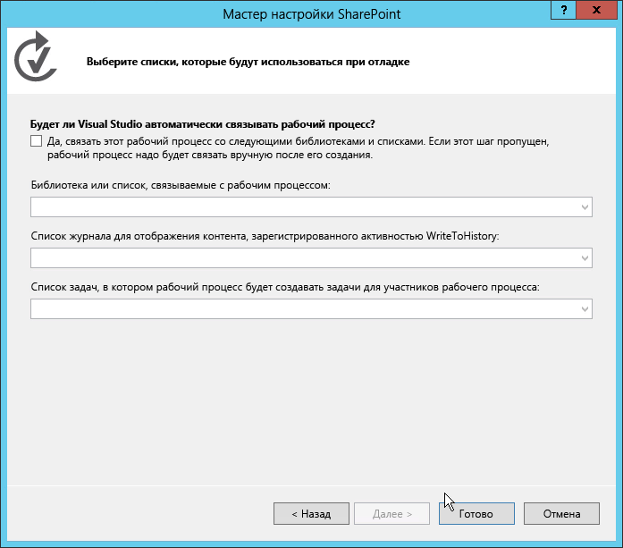
  

  

  
6. <span data-ttu-id="5274c-205">Добавьте в проект форму Visual Studio, щелкнув правой кнопкой мыши элемент рабочего процесса в **обозревателе решений** и последовательно выбрав **Добавить** и **Новый элемент**.</span><span class="sxs-lookup"><span data-stu-id="5274c-205">Next, add the form to the Visual Studio project by right-clicking the workflow item in **Solution Explorer**, then selecting **Add**, **New Item**.</span></span> 
    
    <span data-ttu-id="5274c-p122">Последний шаг важен, поскольку на нем вы указываете в диалоговом окне **Добавление нового элемента**, что контекст  это элемент рабочего процесса. Из-за этого в диалоговом окне **Добавление нового элемента** отображаются два шаблона элементов проекта форм (формы запуска и формы сопоставления), как показано на рис. 2.</span><span class="sxs-lookup"><span data-stu-id="5274c-p122">This last step is important because it tells the **Add New Item** dialog that the context is a workflow item. This then causes the **Add New Item** dialog to display the two form project item templates (Initiation form and Association form) as options, as shown in Figure 2.</span></span>
    

   <span data-ttu-id="5274c-208">**Рис. 2. Выбор шаблона формы сопоставления.**</span><span class="sxs-lookup"><span data-stu-id="5274c-208">**Figure 2. Selecting the Association Form template.**</span></span>

  

  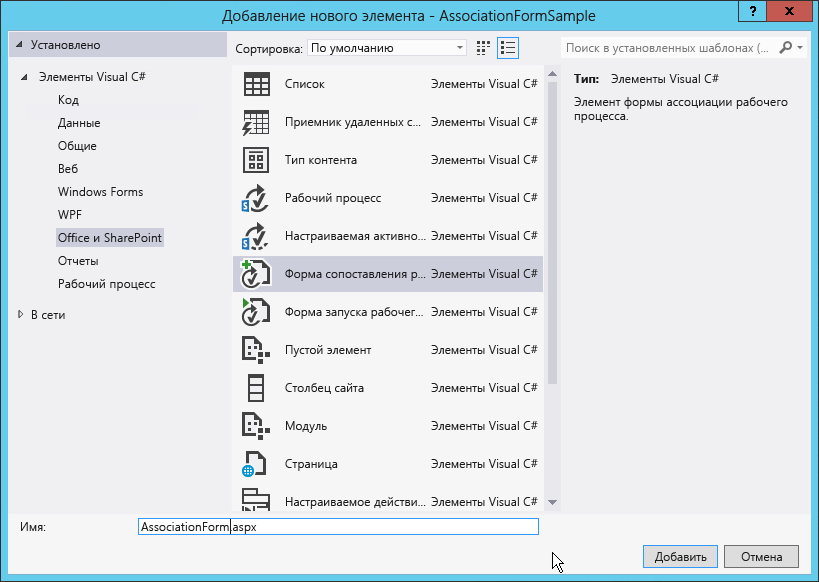
  

  

  
7. <span data-ttu-id="5274c-p123">Выберите элемент **Форма сопоставления рабочего процесса** и удалите "1" из имени поля. Нажмите кнопку "Добавить", чтобы завершить процесс.</span><span class="sxs-lookup"><span data-stu-id="5274c-p123">Select the **Workflow Association Form** item and remove the "1" from the field name. Click Add to complete the process.</span></span>
    
  

### <a name="update-html-and-javascript-in-the-default-association-form"></a><span data-ttu-id="5274c-212">Обновление HTML и JavaScript в форме сопоставления по умолчанию</span><span class="sxs-lookup"><span data-stu-id="5274c-212">Update HTML and JavaScript in the default association form</span></span>

<span data-ttu-id="5274c-p124">После добавления новой формы в проект Visual Studio автоматически открывает ее. На этом этапе вам потребуется выполнить два действия с формой, чтобы сделать ее совместимым с рабочим процессом:</span><span class="sxs-lookup"><span data-stu-id="5274c-p124">Once the new form is added to the project, Visual Studio automatically opens it. At this point, you only need to do two things to the form to make it compatible with your workflow:</span></span>
  
    
    

- <span data-ttu-id="5274c-215">Обновите HTML-форму для отображения элементов данных, которые необходимо запросить у пользователя, а также указать, как форма будет отрисовываться.</span><span class="sxs-lookup"><span data-stu-id="5274c-215">Update the HTML form to reflect the data elements that you need to collect from the user, as well as indicate how the form should be rendered.</span></span>
    
  
- <span data-ttu-id="5274c-216">Обновите JavaScript по умолчанию, чтобы получать значения из обновленной формы и сопоставить имена свойств с именами аргументов, которые вы создали в рабочем процессе.</span><span class="sxs-lookup"><span data-stu-id="5274c-216">Update the default JavaScript to pull the values from the updated form and match the property names to the names of the arguments that you created in the workflow.</span></span>
    
  

1. <span data-ttu-id="5274c-217">Откройте форму, чтобы просмотреть код.</span><span class="sxs-lookup"><span data-stu-id="5274c-217">Open the form to view the code.</span></span>
    
  
2. <span data-ttu-id="5274c-218">Найдите серверный элемент управления, показанный в следующем фрагменте кода:</span><span class="sxs-lookup"><span data-stu-id="5274c-218">Locate the server control shown in the following code snipped:</span></span>
    
```
  
<WorkflowServices:WorkflowAssociationFormContextControl ID="WorkflowAssociationFormContextControl1" runat="server" />
```


    This server control performs two important tasks. First, it adds the JavaScript libraries needed by the association form. Second, it takes the form values that were submitted by the preceding form and writes them to the page as hidden HTML input controls. The preceding page was the default SharePoint association form, the one where the user specified the workflow definition, association name, workflow task and history list, and the start options. This form used an HTTP POST to move to the custom association form that has been added to the workflow. Because it is an HTTP POST, the values are not accessible in the form, since all custom logic must be implemented without server-side code. Therefore SharePoint provides this server control to extract those values from the HTTP request pipeline and add them to this page.
    
  
3. <span data-ttu-id="5274c-219">Прокрутите исходный файл вниз, пока не найдете пример таблицы HTML, и замените его на следующий код:</span><span class="sxs-lookup"><span data-stu-id="5274c-219">Scroll down in the source file until you locate the sample HTML table and replace it with the following:</span></span>
    
```XML
  <table>
    <tr>
      <td colspan="2">
        String:<br /><textarea id="strInput" rows="1" columns="50"/>
      </td>
    </tr>
    <tr>
        <td><button id="Save" onclick="return runAssocWFTask()">Save</button></td>
        <td><button id="Cancel" onclick="location.href = cancelRedirectUrl; return false;">Cancel</button></td>
    </tr>
</table>

```


    This table displays a simple HTML textbox which is used to pass information into the workflow association. Note that the form has two buttons These buttons are used to save or cancel the workflow. When you click the **Save** button, the workflow calls the JavaScript function, **runAssocWfTask()**, which is located a few lines farther down in the source file. We need to modify that next.
    
  

### <a name="update-the-workflow-services-jsom-to-create-the-workflow-association"></a><span data-ttu-id="5274c-220">Обновление модели JSOM служб рабочих процессов для создания сопоставления рабочих процессов</span><span class="sxs-lookup"><span data-stu-id="5274c-220">Update the Workflow Services JSOM to create the workflow association</span></span>

<span data-ttu-id="5274c-221">Сразу после раздела форм HTML в исходном файле находится блок кода _ecmascriptshort_ длиной около 200 строк.</span><span class="sxs-lookup"><span data-stu-id="5274c-221">Immediately following the HTML form section in the source file there is a  _ecmascriptshort_ block of code that is about 200 lines long.</span></span> <span data-ttu-id="5274c-222">В этом блоке кода иллюстрируется реализация нового API клиентской объектной модели JavaScript (JSOM) для служб рабочих процессов в SharePoint.</span><span class="sxs-lookup"><span data-stu-id="5274c-222">This code block illustrates the new Workflow Services JavaScript Client Side Object Model (JSOM) API implementation in SharePoint.</span></span> <span data-ttu-id="5274c-223">В большинстве случаев этот код JavaScript следует оставлять без изменений, так как он выполняет некоторые важные задачи:</span><span class="sxs-lookup"><span data-stu-id="5274c-223">For the most part, this JavaScript code should be left unchanged because it does some important things:</span></span>
  
    
    

- <span data-ttu-id="5274c-224">определяет, следует ли создавать новый связанный список задач рабочего процесса и, если это так, создает его;</span><span class="sxs-lookup"><span data-stu-id="5274c-224">Determines whether a new associated workflow task list should be created and, if so, creates it.</span></span>
    
  
- <span data-ttu-id="5274c-225">определяет, следует ли создать список журнала сопоставленного рабочего процесса и, если это так, создает его;</span><span class="sxs-lookup"><span data-stu-id="5274c-225">Determines whether a new associated workflow history list should be created and, if so, creates it.</span></span>
    
  
- <span data-ttu-id="5274c-226">создает сопоставление рабочего процесса с указанным именем, определением рабочего процесса, параметрами запуска и связанными списками.</span><span class="sxs-lookup"><span data-stu-id="5274c-226">Creates a new workflow association with the specified name, workflow definition, startup options, and associated lists.</span></span>
    
  
<span data-ttu-id="5274c-p126">Особое внимание следует уделить при создании настраиваемых форм сопоставления, в которых значения собираются и передаются в новое сопоставление. Мы рассмотрим это в следующей процедуре.</span><span class="sxs-lookup"><span data-stu-id="5274c-p126">The critical part that you need to be concerned with when creating the custom association forms is where the values from the form are collected and passed into the new association. We cover this in the following procedure.</span></span>
  
    
    

1. <span data-ttu-id="5274c-229">В блоке скрипта JSOM сопоставления рабочего процесса найдите функцию JavaScript, **associateWF()**.</span><span class="sxs-lookup"><span data-stu-id="5274c-229">In the workflow association JSOM script block, locate the JavaScript function **associateWF()**.</span></span>
    
  
2. <span data-ttu-id="5274c-230">В блоке для этой функции найдите строку, которая определяет новый массив с именем **metadata**:</span><span class="sxs-lookup"><span data-stu-id="5274c-230">Inside the script block for this function, locate the line that defines a new array named **metadata**:</span></span> 
  
    
    
 `var metadata = new Object();`
    
  
3. <span data-ttu-id="5274c-p127">Добавьте коллекцию пар "имя-значение", представляющих поля формы, которые следует передать в SharePoint. Для настраиваемой формы в этом руководстве вам понадобится приведенный ниже код JavaScript, поэтому измените блок, который задает переменную **metadata**, как показано ниже:</span><span class="sxs-lookup"><span data-stu-id="5274c-p127">Next, add a collection of name-value pairs representing your form fields that you wish to pass into SharePoint. For the custom form in this walkthrough, all you need is the following JavaScript, so update the block that sets the **metadata** variable as follows:</span></span>
    
```XML
  
var strInputValue = document.getElementById("strInput").value;
if (strInputValue) {
  metadata['AssociationFormValue'] = strInputValue;
}
```

4. <span data-ttu-id="5274c-233">На этом этапе настраиваемая форма сопоставления завершена.</span><span class="sxs-lookup"><span data-stu-id="5274c-233">At this point the custom association form is complete.</span></span>
    
  

### <a name="consume-the-association-form-values-in-the-workflow"></a><span data-ttu-id="5274c-234">Использование значений формы сопоставления в рабочем процессе</span><span class="sxs-lookup"><span data-stu-id="5274c-234">Consume the association form values in the workflow</span></span>

<span data-ttu-id="5274c-p128">После завершения формы необходимо настроить рабочий процесс, чтобы использовать значения, переданные из формы сопоставления. Они передаются как значения конфигурации. Чтобы получить значение, используйте специальное действие для извлечения значения конфигурации из метаданных сопоставления рабочего процесса и сохраните его в переменной для дальнейшего использования.</span><span class="sxs-lookup"><span data-stu-id="5274c-p128">With the form complete, the next step is to configure the workflow to use the values being passed in from the association form. When a value is passed in from the association form, it is passed in as a configuration value. To obtain this, use a special activity to extract the configuration value from the workflow's association metadata and store it in a variable for later use.</span></span>
  
    
    

1. <span data-ttu-id="5274c-238">Откройте рабочий процесс в Visual Studio, перейдите на вкладку **Переменные** и создайте строковую переменную с именем **AssociationFormValue**, как показано на рисунке 3.</span><span class="sxs-lookup"><span data-stu-id="5274c-238">Open the workflow in Visual Studio, go to the **Variables** tab, and create a new string variable called **AssociationFormValue**, as shown in Figure 3.</span></span>
    
   <span data-ttu-id="5274c-239">**Рис. 3. Создание переменной AssociationFormValue.**</span><span class="sxs-lookup"><span data-stu-id="5274c-239">**Figure 3. Creating the AssociationFormValue variable.**</span></span>

  

  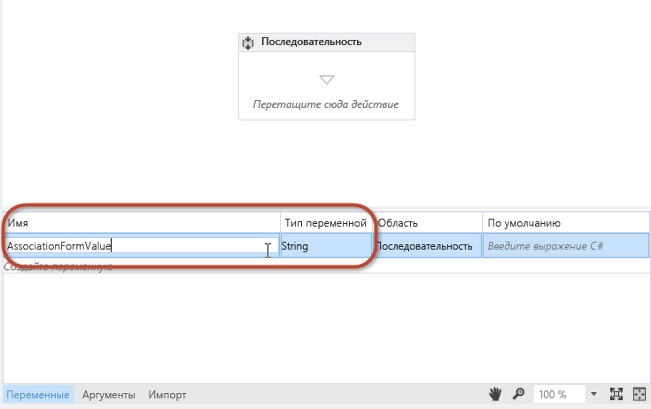
  

  

  
2. <span data-ttu-id="5274c-241">Перетащите действие **GetConfigurationValue** в область конструктора рабочих процессов и присвойте свойству **Name** имя свойства метаданных, которое используется в форме, как показано на рис. 4.</span><span class="sxs-lookup"><span data-stu-id="5274c-241">Drag and drop a **GetConfigurationValue** activity on the workflow designer surface and set the **Name** property to the name of the metadata property used in the form, as shown in Figure 4.</span></span>
    
   <span data-ttu-id="5274c-242">**Рис. 4.**</span><span class="sxs-lookup"><span data-stu-id="5274c-242">**Figure 4.**</span></span>

  

  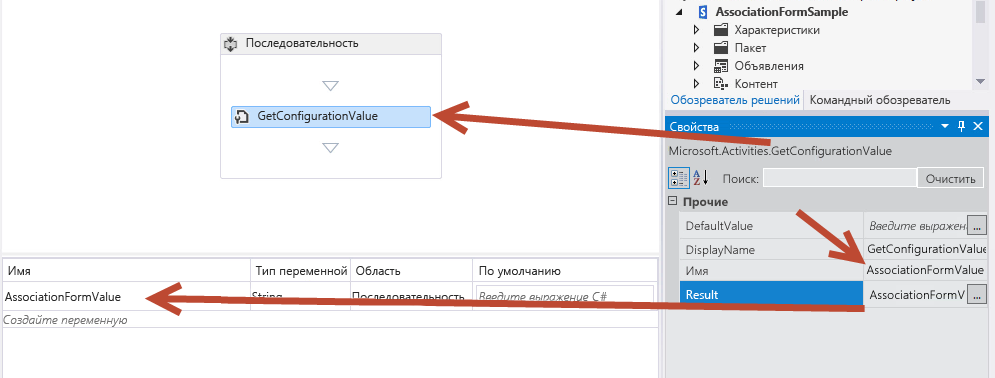
  

  

  
3. <span data-ttu-id="5274c-244">Присвойте свойству **Result** имя переменной, как показано на рис. 4.</span><span class="sxs-lookup"><span data-stu-id="5274c-244">Set the **Result** property to the name of the variable, as shown in Figure 4.</span></span>
    
    <span data-ttu-id="5274c-p129">Это действие извлекает значение свойства **AssociationFormValue** из метаданных рабочего процесса и сохраняет его в локальной переменной. Чтобы просмотреть содержимое переменной, добавьте действие **WriteToHistory** в действия рабочий процесс и задайте свойство **Message**, чтобы записать значение переменной в журнал.</span><span class="sxs-lookup"><span data-stu-id="5274c-p129">This activity pulls the **AssociationFormValue** property value out of the workflow's metadata and stores it in the local variable. To see the contents of the variable, add a **WriteToHistory** activity to the workflow and set its **Message** property to write the value of the variable to the history list.</span></span>
    
  
4. <span data-ttu-id="5274c-p130">Вы выполнили все действия, необходимые для связи значений формы с рабочим процессом. Сохраните изменения и проверьте форму.</span><span class="sxs-lookup"><span data-stu-id="5274c-p130">You have completed the steps necessary to associate the form values with the workflow. Save your work and test the form.</span></span>
    
  

### <a name="test-the-custom-association-form"></a><span data-ttu-id="5274c-249">Тестирование настраиваемой формы сопоставления</span><span class="sxs-lookup"><span data-stu-id="5274c-249">Test the custom association form</span></span>


1. <span data-ttu-id="5274c-250">Для тестирования рабочего процесса нажмите клавишу **F5** или кнопку **Начать** в Visual Studio.</span><span class="sxs-lookup"><span data-stu-id="5274c-250">To test the workflow, press **F5**, or click the **Start** button in Visual Studio.</span></span> <span data-ttu-id="5274c-251">В этом руководстве предполагается, что используется локальная установка SharePoint, поэтому Visual Studio запускает узел службы тестирования диспетчера рабочих процессов и развертывает рабочий процесс на сайте разработчика.</span><span class="sxs-lookup"><span data-stu-id="5274c-251">This walkthrough presumes an on-premises, local installation of SharePoint, so Visual Studio launches the Workflow Manager Test Service Host utility and deploys the workflow to the developer site.</span></span>
    
  
2. <span data-ttu-id="5274c-252">Чтобы создать сопоставление, перейдите к списку **Announcements**, затем на ленте откройте вкладку **Список** и нажмите кнопку **Параметры рабочих процессов**, а затем щелкните ссылку **Добавить рабочий процесс**.</span><span class="sxs-lookup"><span data-stu-id="5274c-252">Create the association by navigating to the **Announcements** list, then on the ribbon select the **List** tab and click the **Workflow Settings**, **Workflow Settings** button, then click the **Add a workflow** link.</span></span> <span data-ttu-id="5274c-253">После этого появится форма сопоставления SharePoint.</span><span class="sxs-lookup"><span data-stu-id="5274c-253">At this point you are presented with the SharePoint association form.</span></span>
    
  
3. <span data-ttu-id="5274c-254">В форме сопоставления выберите нужный рабочий процесс и присвойте ему имя.</span><span class="sxs-lookup"><span data-stu-id="5274c-254">In the association form, select the workflow you wish to test and give it a name.</span></span>
    
  
4. <span data-ttu-id="5274c-255">Выберите параметры для создания списков задач и журнала, запуска рабочего процесса вручную и нажмите кнопку **Далее**.</span><span class="sxs-lookup"><span data-stu-id="5274c-255">Opt to create new task and history lists, set the workflow to start manually, and then click **Next**.</span></span>
    
  
5. <span data-ttu-id="5274c-256">Поскольку вы указали настраиваемую форму сопоставления в определении рабочего процесса, откроется форма, показанная на рис. 5.</span><span class="sxs-lookup"><span data-stu-id="5274c-256">Because you have specified a custom association form in the workflow definition, the custom association form shown in Figure 5 opens.</span></span>
    
   <span data-ttu-id="5274c-257">**Рис. 5. Настраиваемая форма сопоставления рабочего процесса.**</span><span class="sxs-lookup"><span data-stu-id="5274c-257">**Figure 5. The custom workflow association form.**</span></span>

  

  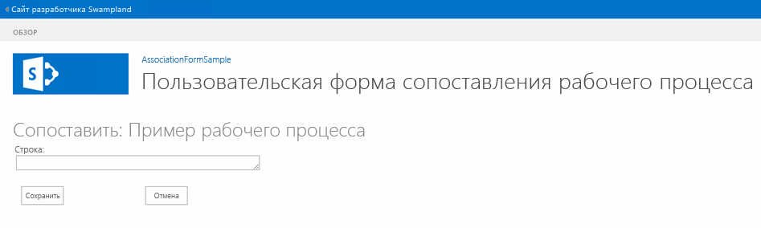
  

  

  
6. <span data-ttu-id="5274c-p134">Введите значение в поле формы и нажмите кнопку **Save**. После этого будет создано сопоставление, а пользовательское значение будет сохранено в метаданных сопоставления рабочего процесса.</span><span class="sxs-lookup"><span data-stu-id="5274c-p134">Enter a value in the form field and click **Save**. This creates the association and stores the custom value in the metadata for the workflow association.</span></span>
    
  
7. <span data-ttu-id="5274c-p135">Чтобы проверить, может ли рабочий процесс извлечь значение из параметров конфигурации, вернитесь к списку **Announcements** и создайте элемент. Затем запустите рабочий процесс вручную. Перейдите на страницу состояния экземпляра рабочего процесса элемента и убедитесь, что значение записано в журнал, как показано на рис. 6.</span><span class="sxs-lookup"><span data-stu-id="5274c-p135">To verify the workflow can extract the value from the configuration settings, navigate back to the **Announcements** list and create a new item. After creating the item, start the custom workflow manually. Once the workflow has started, navigate to the item's workflow instance status page and confirm that the value that has been written to the history list, as illustrated in Figure 6.</span></span>
    
   <span data-ttu-id="5274c-265">**Рис. 6. Страница состояния рабочего процесса.**</span><span class="sxs-lookup"><span data-stu-id="5274c-265">**Figure 6. Workflow status page.**</span></span>

  

  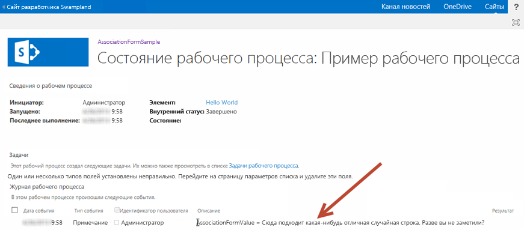
  

  

  

## <a name="walkthrough-creating-a-custom-initiation-form"></a><span data-ttu-id="5274c-268">Инструкции. Создание настраиваемой формы запуска</span><span class="sxs-lookup"><span data-stu-id="5274c-268">Walkthrough: Creating a custom initiation form</span></span>
<span data-ttu-id="5274c-269"><a name="sec4"> </a></span><span class="sxs-lookup"><span data-stu-id="5274c-269"><a name="sec4"> </a></span></span>

<span data-ttu-id="5274c-270">В этом руководстве показано, как создать настраиваемую форму сопоставления и с ее помощью получить сведения от пользователя, когда рабочий процесс запускается вручную.</span><span class="sxs-lookup"><span data-stu-id="5274c-270">This walkthrough demonstrates creating a custom association form and using it to collect information from the user when the workflow is started manually.</span></span>
  
    
    

### <a name="create-a-new-workflow-project"></a><span data-ttu-id="5274c-271">Создание проекта рабочего процесса</span><span class="sxs-lookup"><span data-stu-id="5274c-271">Create a new workflow project</span></span>


1. <span data-ttu-id="5274c-272">Начните с создания настраиваемого рабочего процесса с помощью Visual Studio 2012, убедившись, что у вас есть доступ к сайту разработчика SharePoint.</span><span class="sxs-lookup"><span data-stu-id="5274c-272">Start by creating a custom workflow using Visual Studio 2012, ensuring you have access to a SharePoint developer site.</span></span>
    
  
2. <span data-ttu-id="5274c-273">Создайте проект SharePoint, настроенный как размещаемое в SharePoint приложение.</span><span class="sxs-lookup"><span data-stu-id="5274c-273">Create a new SharePoint project that is configured as a SharePoint-hosted app.</span></span>
    
  
3. <span data-ttu-id="5274c-p137">Добавьте в проект новый список **Announcement**. Мы будем использовать этот список как контейнер для элементов, которые мы используем для запуска рабочего процесса.</span><span class="sxs-lookup"><span data-stu-id="5274c-p137">Add a new **Announcement** list to the project. We'll use this list as the container for items that we use to trigger the workflow.</span></span>
    
  
4. <span data-ttu-id="5274c-p138">Затем добавьте элемент рабочего процесса в проект, щелкнув правой кнопкой мыши значок проекта в **обозревателе решений** и последовательно выбрав **Добавить** и **Новый элемент**. Затем в диалоговом окне **Добавление нового элемента** выберите элемент **Рабочий процесс**.</span><span class="sxs-lookup"><span data-stu-id="5274c-p138">Next, add a workflow item to the project by right-clicking on the project icon in **Solution Explorer** and selecting **Add**, **New Item**, and then, in the **Add New Item** dialog box, selecting the **Workflow** project item. and</span></span>
    
  
5. <span data-ttu-id="5274c-278">Введите для нового рабочего процесса имя "SampleInitFormWorkflow", а затем нажмите кнопку **Далее**.</span><span class="sxs-lookup"><span data-stu-id="5274c-278">Name the new workflow "SampleInitFormWorkflow", then click **Next**.</span></span>
    
  
6. <span data-ttu-id="5274c-p139">При появлении запроса сделайте новый элемент рабочего процесса **рабочим процессом списка**, сопоставленным со списком **Announcements**. Настройка рабочий процесс для запуска вручную. (Обратите внимание, что форма запуска не отображается, если рабочий процесс запускается автоматически.)</span><span class="sxs-lookup"><span data-stu-id="5274c-p139">When prompted, set the new workflow item to be a **List Workflow** associated with the **Announcements** list; set the workflow to start manually. (Note that the initiation form will not be displayed if the workflow starts automatically.)</span></span>
    
  
7. <span data-ttu-id="5274c-p140">На данном этапе проект отображается в **обозревателе решений**, как показано на рис. 7. Обратите внимание, что некоторые элементы, такие как **WorkflowHistoryList** и **WorkflowTaskList**, были добавлены автоматически при создании сопоставления.</span><span class="sxs-lookup"><span data-stu-id="5274c-p140">At this point, the project appears in **Solution Explorer** as shown in Figure 7. Note that some elements, like the **WorkflowHistoryList** and **WorkflowTaskList**, were added automatically when the association was created.</span></span>
    
   <span data-ttu-id="5274c-283">**Рис. 7. Внешний вид проекта в обозревателе решений.**</span><span class="sxs-lookup"><span data-stu-id="5274c-283">**Figure 7. Appearance of the project in Solution Explorer.**</span></span>

  

  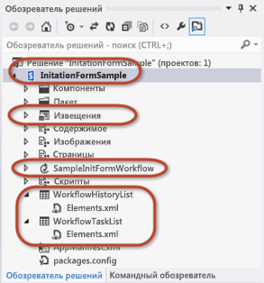
  

  

  

### <a name="add-arguments-to-collect-initiation-form-values"></a><span data-ttu-id="5274c-286">Добавление аргументов для сбора значений формы запуска</span><span class="sxs-lookup"><span data-stu-id="5274c-286">Add arguments to collect initiation form values</span></span>

<span data-ttu-id="5274c-p142">Форма запуска рабочего процесса запрашивает у пользователям два типа данных, необходимых для запуска рабочего процесса: случайную строку, а также пользователя, который выбирается с помощью средства выбора людей. Для этого необходимо настроить два аргумента, значения которых API CSOM служб рабочих процессов возьмет из формы после ее отправки.</span><span class="sxs-lookup"><span data-stu-id="5274c-p142">The workflow initiation form prompts users for two pieces of information that it needs for the workflow to start: a random string, plus a user that is selected using the people picker control. To enable this, you configure two arguments whose values the Workflow Services CSOM API will take from the form when it is submitted.</span></span>
  
    
    

1. <span data-ttu-id="5274c-p143">В конструкторе рабочих процессов откройте вкладку **Аргументы** в нижней части экрана и создайте два аргумента, как показано на рис. 8. Назовите их **UserLoginName** и **SomeRandomString**.</span><span class="sxs-lookup"><span data-stu-id="5274c-p143">In the workflow designer, click the **Arguments** tab at the bottom of the screen and create two arguments, as shown in Figure 8. Name them **UserLoginName** and **SomeRandomString**.</span></span> 
    
   <span data-ttu-id="5274c-291">**Рис. 8. Настройка аргументов формы запуска.**</span><span class="sxs-lookup"><span data-stu-id="5274c-291">**Figure 8. Configuring the initiation form arguments.**</span></span>

  

  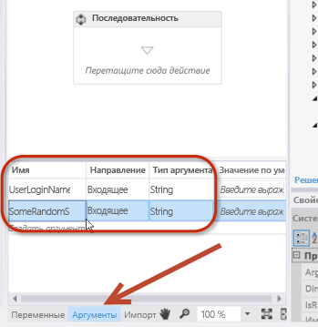
  

  

  
2. <span data-ttu-id="5274c-294">Для обоих аргументов задайте **Тип аргумента** как **String** и **Направление** как **In**, как показано на рис. 8.</span><span class="sxs-lookup"><span data-stu-id="5274c-294">Set the **Argument type** to **String** for both; also for both, set the **Direction** to **In**, as shown in Figure 8.</span></span>
    
    <span data-ttu-id="5274c-p145">Свойство **Direction** можно представить как свойство класса .NET. Если в качестве направления задано **In**, у свойства будет открытый метод **Set**, но закрытый метод **Get**. Если направление задано как **Out**, у свойства будет открытый метод **Get**, но закрытый метод **Set**. Наконец, если установлено значение **In/Out**, оба метода **Get** и **Set** будут открытыми.</span><span class="sxs-lookup"><span data-stu-id="5274c-p145">You can think of the **Direction** property as if it were a property on a .NET class. When the direction is set to **In**, the property would have a public **Set** method, but a private **Get** method. When the direction is set to **Out**, the property would have a public **Get** but a private **Set**. Finally, when set to **In/Out**, both the **Get** and **Set** methods would be public.</span></span>
    
  
3. <span data-ttu-id="5274c-299">Чтобы просмотреть содержимое этих двух аргументов, добавьте пару действий **WriteToHistory** в рабочий процесс и настройте каждое из них для записи содержимого аргументов в список журнала.</span><span class="sxs-lookup"><span data-stu-id="5274c-299">To view the contents of these two arguments, add a pair of **WriteToHistory** activities to the workflow and configure each one to write the contents of the arguments to the history list.</span></span>
    
    <span data-ttu-id="5274c-p146">Эти аргументы можно использовать так же, как и переменные, но следует помнить, что при установке значения параметра **Направление** вы определяете возможность их чтения и записи. На рис. 9 показано, как одно из этих действий может выглядеть после настройки:</span><span class="sxs-lookup"><span data-stu-id="5274c-p146">You can use these arguments the same way you use variables, but keep in mind when setting **Direction** that you are dictating their read/write capability. Figure 9 shows what one of these activities might look like when configured:</span></span>
    

   <span data-ttu-id="5274c-302">**Рис. 9. Настройка действий WriteToHistory для тестирования аргументов**</span><span class="sxs-lookup"><span data-stu-id="5274c-302">**Figure 9. Configuring a WriteToHistory activity to test arguments**</span></span>

  

  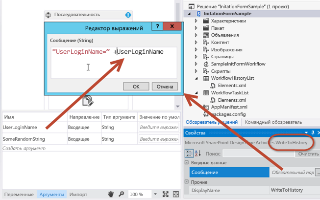
  

  

  

### <a name="add-the-initiation-form-project-item"></a><span data-ttu-id="5274c-305">Добавление элемента проекта формы запуска</span><span class="sxs-lookup"><span data-stu-id="5274c-305">Add the initiation form project item</span></span>

<span data-ttu-id="5274c-306">После настройки рабочего процесса для приема двух входных аргументов из формы следующий шаг  добавление формы в проект.</span><span class="sxs-lookup"><span data-stu-id="5274c-306">With the workflow configured to accept two input arguments from the form, the next step is to add the form to the project.</span></span>
  
    
    

1. <span data-ttu-id="5274c-307">Щелкните правой кнопкой мыши элемент рабочего процесса в **обозревателе решений** и последовательно выберите **Добавить** и **Новый элемент**.</span><span class="sxs-lookup"><span data-stu-id="5274c-307">Right-click the workflow item in **Solution Explorer** and select **Add**, then select **New Item**.</span></span>
    
  
2. <span data-ttu-id="5274c-p148">Выберите элемент проекта **Форма запуска рабочего процесса** и удалите число "1" из имени формы, чтобы имя приняло вид "InitForm.aspx", а затем нажмите кнопку **Добавить**. После этого Visual Studio добавит новую ASPX-страницу в модуль **Страницы**, который уже присутствует в дереве проекта. Это гарантирует, что форма будет размещена во вложенной папке **Страницы** в приложении. Visual Studio также изменит свойства элемента рабочего процесса.</span><span class="sxs-lookup"><span data-stu-id="5274c-p148">Select the **Workflow Initiation Form** project item and remove the number "1" from the name so the form is called "InitForm.aspx", then click **Add**. This causes Visual Studio to add the new ASPX page to the **Pages** module that is already present in the project tree. This ensures that the form will be provisioned to the **Pages** subfolder in the app. Visual Studio also modified properties on the workflow item.</span></span>
    
  
3. <span data-ttu-id="5274c-p149">Выберите элемент рабочего процесса **SimpleInitFormWorkflow** в **обозревателе решений** и в таблице **Свойства** обратите внимание на то, какие свойства в форме запуска были установлены. Одно из них указывает на относительный путь сайта формы, добавленной в модуль **Страницы**.</span><span class="sxs-lookup"><span data-stu-id="5274c-p149">Select the workflow item **SimpleInitFormWorkflow** in **Solution Explorer** and in the **Properties** grid, notice which properties on the initiation form have been set. One of them is actually pointing to the site relative path of the form that was just added to the **Pages** module.</span></span>
    
  

### <a name="review-and-update-the-default-initiation-form"></a><span data-ttu-id="5274c-314">Просмотр и обновление формы запуска по умолчанию</span><span class="sxs-lookup"><span data-stu-id="5274c-314">Review and update the default initiation form</span></span>

<span data-ttu-id="5274c-p150">После добавления новой формы запуска в проект Visual Studio 2012 открывается автоматически. Как и для формы сопоставления, эта новая форма запуска должна выполнить две задачи:</span><span class="sxs-lookup"><span data-stu-id="5274c-p150">When you added the new initiation form to the project, Visual Studio 2012 automatically. As was the case with the association form, this new initiation form needs two tasks performed:</span></span>
  
    
    

- <span data-ttu-id="5274c-317">обновить HTML-форму для указания элементов данных, которые необходимо получить у пользователя, а также указать, как форма будет отображаться;</span><span class="sxs-lookup"><span data-stu-id="5274c-317">Update the HTML form to specify data elements that should be collected from the user, as well as specifying how the form should be presented.</span></span>
    
  
- <span data-ttu-id="5274c-318">Обновите блок JavaScript по умолчанию, чтобы получать значения, введенные пользователем, из обновленной формы и сопоставить имена свойств с именами аргументов, которые мы создали в рабочем процессе.</span><span class="sxs-lookup"><span data-stu-id="5274c-318">Update the default JavaScript block to pull the user-input values from the form and match the property names to the names of the arguments that we created in the workflow.</span></span>
    
  

> <span data-ttu-id="5274c-319">**Примечание.** Обратите внимание, что в исходном файле первый заполнитель содержимого ASP.NET, **PlaceHolderAdditionalPageHead**, содержит ссылки на библиотеку CSOM служб рабочих процессов (**sp.workflowservices.js**) и основные библиотеки CSOM SharePoint (**sp.js** и **sp.runtime.js**).</span><span class="sxs-lookup"><span data-stu-id="5274c-319">**Note:** In the source file, note that first ASP.NET content placeholder, **PlaceHolderAdditionalPageHead**, contains references to the Workflow Services CSOM library ( **sp.workflowservices.js** ) and the core SharePoint CSOM libraries ( **sp.js** and **sp.runtime.js** ).</span></span> <span data-ttu-id="5274c-320">Сразу после этого раздела кода находится серверный комментарий с закомментированным примечанием.</span><span class="sxs-lookup"><span data-stu-id="5274c-320">Immediately following this section of code, there is a server-side comment that contains a commented note.</span></span> <span data-ttu-id="5274c-321">Помните, что это примечание, показанное на рис. 10, не имеет для нас значения, и его следует игнорировать.</span><span class="sxs-lookup"><span data-stu-id="5274c-321">Be mindful that this note, shown in Figure 10, is irrelevant and should be ignored.</span></span>
  
    
    


<span data-ttu-id="5274c-322">**Рис. 10. Игнорируемый комментарий к коду.**</span><span class="sxs-lookup"><span data-stu-id="5274c-322">**Figure 10. Code comment to disregard.**</span></span>

  
    
    

  
    
    

  
    
    

### <a name="update-the-html-form"></a><span data-ttu-id="5274c-325">Обновление HTML-формы</span><span class="sxs-lookup"><span data-stu-id="5274c-325">Update the HTML form</span></span>


1. <span data-ttu-id="5274c-p153">Прокрутите файл кода формы вниз, пока не дойдете до заполнителя контента ASP.NET с именем  `PlaceHolderMain`. Обратите внимание, что первая часть этого раздела содержит HTML-таблицу с тремя полями формы. Нам понадобятся только два.</span><span class="sxs-lookup"><span data-stu-id="5274c-p153">Scroll down in the form's code file until you reach the ASP.NET content placeholder named  `PlaceHolderMain`. Notice that the first part of this section contains an HTML table that contains three form fields. We only need two.</span></span>
    
  
2. <span data-ttu-id="5274c-329">Обновите эту таблицу HTML, заменив ее на следующий код:</span><span class="sxs-lookup"><span data-stu-id="5274c-329">Update this HTML table by replacing it with the following:</span></span>
    
```
  
<table>
  <tr>
    <td>
      String:<br />
      <input type="text" id="strInput" />
    </td>
  </tr>
  <tr>
    <td>
      User Picker:<br />
      <SharePoint:PeopleEditor AllowEmpty="false" ValidatorEnabled="true" MultiSelect="false" ID="peoplePicker" runat="server" />
    </td>
  </tr>
  <tr>
    <td>
      <input type="button" name="startWorkflowButton" value="Start" onclick="StartWorkflow()" />
      <input type="button" name="cancelButton" value="Cancel" onclick="RedirFromInitForm()" />
      <br />
    </td>
  </tr>
</table>

```

<span data-ttu-id="5274c-330">Теперь таблица содержит два элемента управления для ввода.</span><span class="sxs-lookup"><span data-stu-id="5274c-330">The table now contains two input controls.</span></span> <span data-ttu-id="5274c-331">Первый из них представляет собой стандартное текстовое поле HTML с идентификатором **strInput**.</span><span class="sxs-lookup"><span data-stu-id="5274c-331">The first is a standard HTML text box whose ID is **strInput**.</span></span> <span data-ttu-id="5274c-332">Второй — средство выбора людей SharePoint с идентификатором **peoplePicker**.</span><span class="sxs-lookup"><span data-stu-id="5274c-332">The second is a SharePoint people picker control whose ID is **peoplePicker**.</span></span> <span data-ttu-id="5274c-333">Последний является серверным элементом управления. Однако его разрешается размещать на странице, так как он был развернут на каждом компьютере с SharePoint.</span><span class="sxs-lookup"><span data-stu-id="5274c-333">This latter is a server-side control; however, it is allowed on the page because it has been deployed to every SharePoint computer.</span></span> <span data-ttu-id="5274c-334">Более того, в верхней части формы запуска есть ссылка на этот элемент управления.</span><span class="sxs-lookup"><span data-stu-id="5274c-334">Further, the control is referenced at the top of the initiation form.</span></span>
  
    
    
<span data-ttu-id="5274c-p155">Обратите внимание на две кнопки на форме, **Начать** (startWorkflowButton) и **Отмена** (cancelButton). Если нажать кнопку "Начать", будет вызвана функция **StartWorkflow()**JavaScript. Она расположена в блоке скрипта далее в форме, ее мы изменим следующей.</span><span class="sxs-lookup"><span data-stu-id="5274c-p155">Now notice the two buttons on the form, **Start** ("startWorkflowButton") and **Cancel** ("cancelButton"). Clicking the Start button calls the **StartWorkflow()**JavaScript function. The function itself is located in a script block farther down in the form file and is the subject of the next change that we need to make.</span></span>
  
    
    

### <a name="update-the-jsom-code-block-to-start-the-workflow"></a><span data-ttu-id="5274c-338">Обновление блока кода JSOM для запуска рабочего процесса</span><span class="sxs-lookup"><span data-stu-id="5274c-338">Update the JSOM code block to start the workflow</span></span>


1. <span data-ttu-id="5274c-p156">Найдите блок кода JavaScript, который следует сразу же после модифицированной нами HTML-таблицы. В основном, мы оставим код в этом блоке без изменений.</span><span class="sxs-lookup"><span data-stu-id="5274c-p156">Locate the JavaScript code block that immediately follows the HTML table that we just modified. We'll leave the code in the script block largely unchanged.</span></span>
    
    <span data-ttu-id="5274c-341">Этот код демонстрирует огромные возможности и гибкость, предоставляемые интерфейсом API JSOM служб рабочих процессов, который был реализован в SharePoint.</span><span class="sxs-lookup"><span data-stu-id="5274c-341">This code demonstrates enormous power and flexibility available in the Workflow Services JavaScript Client Side Object Model (JSOM) API that has been implemented in SharePoint.</span></span> <span data-ttu-id="5274c-342">На высоком уровне код выполняет указанные ниже действия.</span><span class="sxs-lookup"><span data-stu-id="5274c-342">From a high level, the code performs the following steps.</span></span>
    
  
2. <span data-ttu-id="5274c-343">Найдите следующую строку кода: `var wfParams = new Object();`</span><span class="sxs-lookup"><span data-stu-id="5274c-343">Locate the following line of code:  `var wfParams = new Object();`</span></span>
    
  
3. <span data-ttu-id="5274c-p158">Сразу после нее замените существующий код на собственный, чтобы извлечь значения из двух полей HTML-формы, которые мы создали несколько секунд назад: **strInput** и **peoplePicker**. Для этого добавьте следующую ссылку на библиотеку jQuery в элемент **PlaceHolderAdditionalPageHead** в HTML-разметке. Это упростит извлечение значений из формы.</span><span class="sxs-lookup"><span data-stu-id="5274c-p158">Immediately following this line, replace the existing code with your own code to pull values from the two HTML form fields that we created a few moments ago: **strInput** and **peoplePicker**. To do this, add the following reference to the jQuery library to the **PlaceHolderAdditionalPageHead** element in the HTML markup. This makes it easier to grab values from the form.</span></span>
    
```
  
<script type="text/javascript" src="../Scripts/jquery-1.8.2.min.js"></script>
```

4. <span data-ttu-id="5274c-p159">Теперь вернитесь к части блока JSOM, в которой параметры извлекаются из формы. Замените существующий код JavaScript на следующий:</span><span class="sxs-lookup"><span data-stu-id="5274c-p159">Now, return to the portion of the JSOM script block where the parameters are collected from the form. Replace the existing JavaScript with the following code:</span></span>
    
```
  var wfParams = new Object();
// get people picker value
var html = $("ctl00_PlaceHolderMain_peoplePicker_upLevelDiv");
wfParams['UserLoginName'] = $("#divEntityData", html).attr("key");

// get string input
var strInputValue = $("strInput").value;
wfParams['SomeRandomString'] = strInputValue

```

5. <span data-ttu-id="5274c-349">Сохраните изменения.</span><span class="sxs-lookup"><span data-stu-id="5274c-349">Save your changes.</span></span>
    
  
<span data-ttu-id="5274c-350">Код, который мы изменили в предыдущей процедуре, выполняет большой объем работы.</span><span class="sxs-lookup"><span data-stu-id="5274c-350">The code that we've modified in the preceding procedure does a large amount of work:</span></span>
  
    
    

- <span data-ttu-id="5274c-351">Код получает следующие три параметра из строки запроса URL-адрес:</span><span class="sxs-lookup"><span data-stu-id="5274c-351">Obtains these three parameters from the query string in the URL:</span></span>
    
  - <span data-ttu-id="5274c-352">идентификатор элемента, с которым будет сопоставлен новый экземпляр рабочего процесса, сохраненный в переменной JavaScript, **[itemId]**;</span><span class="sxs-lookup"><span data-stu-id="5274c-352">The item ID that the new workflow instance will be associated with, saved in the JavaScript variable **[itemId]**.</span></span>
    
  
  - <span data-ttu-id="5274c-353">идентификатор сопоставления рабочего процесса для текущего сайта, списка или библиотеки документов, сохраненный в переменной JavaScript, **[subscriptionId]**;</span><span class="sxs-lookup"><span data-stu-id="5274c-353">The ID of the workflow association on the current site, list, or document library, saved in the JavaScript variable **[subscriptionId]**.</span></span>
    
  
  - <span data-ttu-id="5274c-p160">URL-адрес, с которого перешел пользователь, сохраненный в переменной JavaScript, **[redirectUrl]**. По этому адресу пользователь будет перенаправлен после заполнения формы и запуска рабочего процесса.</span><span class="sxs-lookup"><span data-stu-id="5274c-p160">The URL that the user came from, saved in the JavaScript **[redirectUrl]** variable. This is where the user will be taken to when they complete the form and the workflow has been started.</span></span>
    
  
- <span data-ttu-id="5274c-p161">Код создает массив свойств, отправляемых рабочему процессу, который хранится в переменной JavaScript, **[wfParams]**. Эти значения требуется получить из формы. Это второе обязательное действие, необходимое для изменения настраиваемой формы запуска.</span><span class="sxs-lookup"><span data-stu-id="5274c-p161">Creates an array of properties to be sent to the workflow, saved in the JavaScript variable **[wfParams]**. These are the values that you will need to collect from the form and the second of the two minimal steps required for editing the custom initiation form.</span></span>
    
  
- <span data-ttu-id="5274c-358">Код получает ссылки на контекст клиента SharePoint CSOM, а также необходимые службы рабочих процессов.</span><span class="sxs-lookup"><span data-stu-id="5274c-358">Obtains references to a SharePoint CSOM client context as well as the necessary workflow services.</span></span>
    
  
- <span data-ttu-id="5274c-359">После подключения скрипта к службе подписок служб рабочих процессов (ссылка указана в переменной **[subscriptionService]** ), он выполняет одно из следующих действий:</span><span class="sxs-lookup"><span data-stu-id="5274c-359">Once the script is connected to the Workflow Services Subscription Service (referenced in the variable **[subscriptionService]** ), it performs one of the following tasks:</span></span>
    
  
- 
  - <span data-ttu-id="5274c-360">если скрипт получил идентификатор элемента из строки запроса на первом шаге, запускается новый экземпляр рабочего процесса для указанного элемента списка с помощью вызова функции **[startWorkflowOnListItem()]** из экземпляра служб рабочих процессов;</span><span class="sxs-lookup"><span data-stu-id="5274c-360">If the script obtained an item ID from the query string in the first step, then it starts a new instance of the workflow on the specified list item by calling the function **[startWorkflowOnListItem()]** from the Workflow Services instance service.</span></span>
    
  
  - <span data-ttu-id="5274c-361">если идентификатор не найден, новый экземпляр рабочего процесса запускается на текущем сайте путем вызова функции **[startWorkflow()]** из экземпляра служб рабочих процессов.</span><span class="sxs-lookup"><span data-stu-id="5274c-361">If no ID was found, it starts a new instance of the workflow on the current site by calling the function **[startWorkflow()]** from the Workflow Services instance service.</span></span>
    
  

### <a name="test-the-custom-initiation-form"></a><span data-ttu-id="5274c-362">Тестирование настраиваемой формы запуска</span><span class="sxs-lookup"><span data-stu-id="5274c-362">Test the custom initiation form</span></span>

<span data-ttu-id="5274c-363">Для тестирования рабочего процесса нажмите клавишу F5 или кнопку **Начать** в Visual Studio 2012.</span><span class="sxs-lookup"><span data-stu-id="5274c-363">Test the workflow by pressing F5 or by clicking the **Start** button in Visual Studio 2012.</span></span> <span data-ttu-id="5274c-364">Если тестирование выполняется в локальной установке SharePoint, Visual Studio 2012 запускает узел службы тестирования диспетчера рабочих процессов и развертывает рабочий процесс на сайте разработчика.</span><span class="sxs-lookup"><span data-stu-id="5274c-364">If you are testing in an on-premises local installation of SharePoint, Visual Studio 2012 will start the Workflow Manager Test Service Host utility and deploy the workflow to the developer site.</span></span> <span data-ttu-id="5274c-365">Через некоторое время откроется сайт разработчика.</span><span class="sxs-lookup"><span data-stu-id="5274c-365">After a moment, the developer site will open.</span></span>
  
    
    
<span data-ttu-id="5274c-p163">Перейдите к списку **Announcements** и создайте элемент. После этого запустите настраиваемый рабочий процесс.</span><span class="sxs-lookup"><span data-stu-id="5274c-p163">Navigate to the **Announcements** list and create a new item. After creating the item, start the custom workflow.</span></span>
  
    
    
<span data-ttu-id="5274c-p164">Поскольку определение рабочего процесса содержит ссылку на форму запуска, пользователь сначала переходит на эту форму. Заполните запрашиваемые значения, а затем нажмите кнопку **Начать**. Это активирует код JavaScript на странице, который запустит экземпляр рабочего процесса, как показано на рис. 11.</span><span class="sxs-lookup"><span data-stu-id="5274c-p164">Because the workflow definition contains a reference to an initiation form, the user is taken to that form first. Fill in the requested values, then click the **Start** button. This triggers the JavaScript on the page, which starts the workflow instance, as shown in Figure 11.</span></span>
  
    
    

<span data-ttu-id="5274c-371">**Рис. 11. Запуск рабочего процесса.**</span><span class="sxs-lookup"><span data-stu-id="5274c-371">**Figure 11. Triggering the workflow.**</span></span>

  
    
    

  
    
    
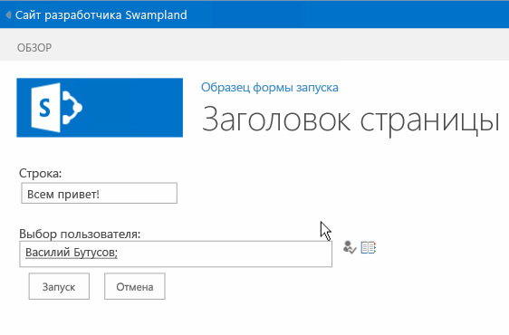
  
    
    
<span data-ttu-id="5274c-p165">После запуска рабочего процесса пользователь перенаправляется на исходную странице. Дайте рабочему процессу немного времени для запуска, а затем вернитесь к элементу и просмотрите страницу состояния экземпляра рабочего процесса. Обратите внимание на то, что список журнала содержит значения, введенные на форме и переданные в SharePoint, когда экземпляр рабочего процесса был создан с помощью JSOM служб рабочих процессов.</span><span class="sxs-lookup"><span data-stu-id="5274c-p165">After starting the workflow, the page redirects the user back to the originating page. Give the workflow a few moments to start, then go back to the item and view the workflow instance's status page. Notice that the history list contains the values that were submitted in the form and then sent to SharePoint once the workflow instance was created using the Workflow Services JSOM.</span></span>
  
    
    

<span data-ttu-id="5274c-376">**Рис. 12. После завершения рабочего процесса.**</span><span class="sxs-lookup"><span data-stu-id="5274c-376">**Figure 12. On completing the workflow.**</span></span>

  
    
    

  
    
    
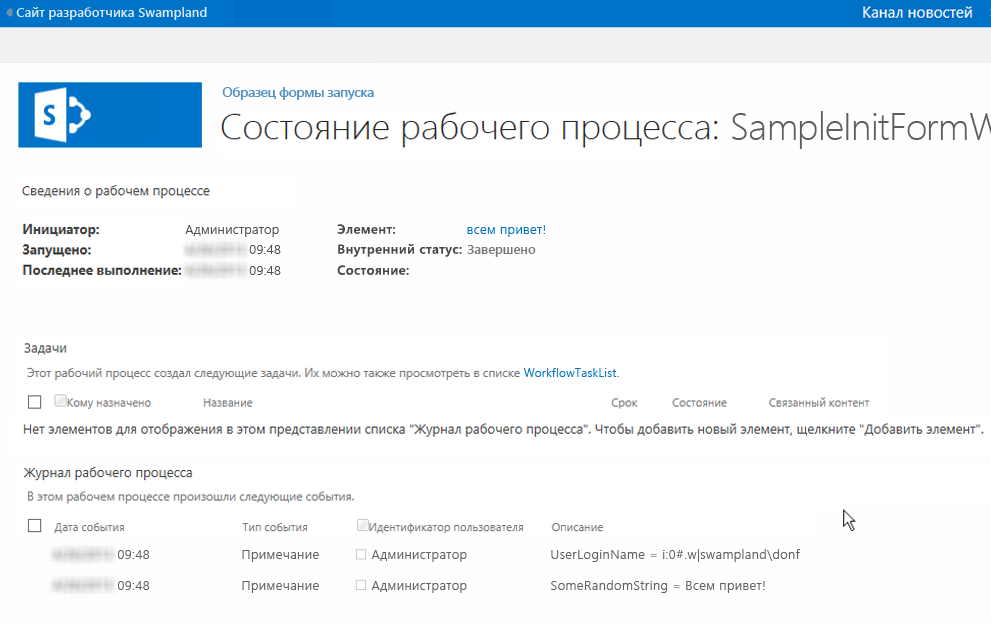
  
    
    

  
    
    

  
    
    

## <a name="conclusion"></a><span data-ttu-id="5274c-378">Заключение</span><span class="sxs-lookup"><span data-stu-id="5274c-378">Conclusion</span></span>
<span data-ttu-id="5274c-379"><a name="sec6"> </a></span><span class="sxs-lookup"><span data-stu-id="5274c-379"><a name="sec6"> </a></span></span>

<span data-ttu-id="5274c-380">В SharePoint появилась несколько улучшений рабочих процессов.</span><span class="sxs-lookup"><span data-stu-id="5274c-380">SharePoint introduced several improvements to workflows.</span></span> <span data-ttu-id="5274c-381">В этой статье подробно описываются изменения, связанные с формами рабочих процессов и вызванные изменениями архитектуры рабочих процессов в SharePoint.</span><span class="sxs-lookup"><span data-stu-id="5274c-381">This article detailed the changes related to workflow forms that were driven from changes to the workflow architecture in SharePoint.</span></span> <span data-ttu-id="5274c-382">В этой статье также показано, как создавать настраиваемые формы сопоставления и запуска, позволяющие обеспечить соответствие строгим требованиям к автоматизации современных бизнес-процессов с помощью Visual Studio 2012.</span><span class="sxs-lookup"><span data-stu-id="5274c-382">This article also demonstrated how to create both custom association forms and initiation forms that can be used to meet the demanding requirements in automating today's business process using Visual Studio 2012.</span></span>
  
    
    

## <a name="additional-resources"></a><span data-ttu-id="5274c-383">Дополнительные ресурсы</span><span class="sxs-lookup"><span data-stu-id="5274c-383">Additional Resources</span></span>
<span data-ttu-id="5274c-384"><a name="sec7"> </a></span><span class="sxs-lookup"><span data-stu-id="5274c-384"><a name="sec7"> </a></span></span>


-  [<span data-ttu-id="5274c-385">Формы сопоставления и запуска рабочих процессов (SharePoint Foundation)</span><span class="sxs-lookup"><span data-stu-id="5274c-385">Workflow Association and Initiation Forms (SharePoint Foundation)</span></span>](http://msdn.microsoft.com/ru-RU/library/office/ms481192%28v=office.14%29.aspx)
    
  
-  [<span data-ttu-id="5274c-386">Работа с клиентской объектной моделью служб рабочих процессов в SharePoint</span><span class="sxs-lookup"><span data-stu-id="5274c-386">Working with the SharePoint Workflow Services Client Side Object Model</span></span>](working-with-the-sharepoint-workflow-services-client-side-object-model.md)
    
  
-  [<span data-ttu-id="5274c-387">Настройка представления списка в надстройках для SharePoint с использованием способа отображения на стороне клиента</span><span class="sxs-lookup"><span data-stu-id="5274c-387">Customize a list view in SharePoint Add-ins using client-side rendering</span></span>](http://msdn.microsoft.com/library/8d5cabb2-70d0-46a0-bfe0-9e21f8d67d86%28Office.15%29.aspx)
    
  

