# Обзор модели страниц в SharePointOverview of the SharePoint page model
Информация о пересмотренной модели страницы (включая эталонные страницы и макеты страниц), модернизированной для SharePoint.Learn about the revised page model—including master pages and page layouts—redesigned for SharePoint.
## Общие сведения о модели страницыIntroduction to the page model

Прежде чем приступить к разработке или созданию фирменной символики сайта SharePoint, необходимо иметь базовое представление о частях сайта SharePoint и компоновке страниц SharePoint. В этой статье представлены наглядные схемы этих фрагментов, чтобы учитывать их при планировании оформления веб-сайта. Данная статья применима главным образом к веб-сайтам публикации в SharePoint.Before you design or brand a SharePoint site, you need a basic understanding of the parts of a SharePoint site and how a SharePoint page is put together. This article gives you a visual overview of the pieces to think about as you plan how to brand your site. This article applies specifically to publishing sites in SharePoint.
  
    
    

## Эталонные страницы, макеты страниц и страницыMaster pages, page layouts, and pages

SharePoint использует макеты, чтобы определить и отрисовать страницы, которые отображаются на веб-сайте. Структура страницы SharePoint включает три основных элемента:SharePoint uses templates to define and render the pages that a site displays. The structure of a SharePoint page includes three main elements:
  
    
    

- Эталонная страница определяет общие элементы фрейма (хром) для всех страниц на вашем сайте.Master pages define the shared framing elements—the chrome—for all pages in your site.
    
  
- Макеты страниц определяют макет для определенного класса страниц.Page layouts define the layout for a specific class of pages.
    
  
- Страницы создаются на основе макета страницы авторами, добавляющими содержимое в поля страницы.Pages are created from a page layout by authors who add content to page fields.
    
  

**Рис. 1. Эталонная страница, макет страницы и страница****Figure 1. Master page, page layout, and page**

  
    
    

  
    
    
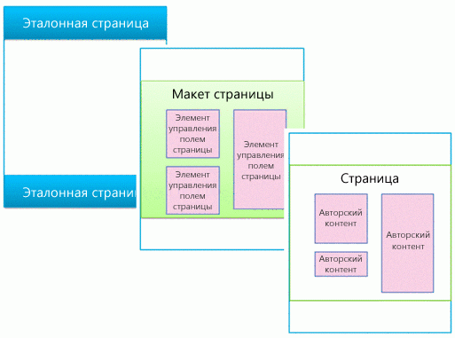
  
    
    

### Главные страницыMaster pages

Эталонная страница определяет хром (общие элементы фрейма) вашего сайта. Эти элементы могут включать верхний и нижний колонтитулы, верхнюю панель навигации, "хлебные крошки", поле поиска, эмблему сайта и другие элементы фирменной символики. При перемещении посетителей по сайту эталонная страница остается неизменной.A master page defines the chrome (the shared framing elements) of your site. These elements may include the header and footer, top navigation, breadcrumbs, search box, site logo, and other branding elements. The master page remains consistent as visitors navigate through your site.
  
    
    

**Рисунок 2. Эталонная страница****Figure 2. Master page**

  
    
    

  
    
    

  
    
    
Кроме того, эталонная страница определяет области, называемые заполнителями контента, которые наполняются контентом из соответствующих областей на макетах страниц. Чаще всего основная часть эталонной страницы содержит единственный заполнитель (который называется **PlaceHolderMain** и создается автоматически), и весь контент из макета страницы появляется внутри него (заполнитель контента **PlaceHolderMain** выделен красным цветом на рис. 3).A master page also defines regions called content placeholders that are filled in by content from matching regions on page layouts. Most commonly, the body of a master page contains just a single content placeholder (named **PlaceHolderMain**, which is created automatically), and all of the content from a page layout appears inside this one content placeholder (the **PlaceHolderMain** content placeholder is outlined in red in Figure 3).
  
    
    

**Рисунок 3. Эталонная страница с выделенным макетом страницы****Figure 3. Master page with page layout outlined**

  
    
    

  
    
    
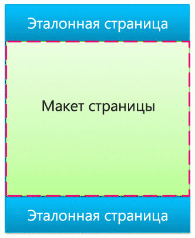
  
    
    
При просмотре эталонной страницы в Дизайнере вы увидите представленное ниже сообщение. Этот тег **
** находится внутри заполнителя основного содержимого. Проще говоря, эталонная страница определяет хром страницы, а макет страницы определяет текст, содержащийся в заполнителе основного содержимого.When you preview a master page in Design Manager, you see the following message. This **
** resides inside the main content placeholder. Put simply, the master page defines the chrome of a page, and the page layout defines the body contained in the main content placeholder.
  
    
    

**Рисунок 4. Сообщение при предварительном просмотре эталонной страницы****Figure 4. Master page preview message**

  
    
    

  
    
    
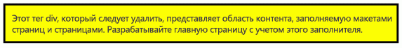
  
    
    

  
    
    

  
    
    

### Макеты страницPage layouts

Макет страницы  это шаблон для определенного типа страницы на вашем сайте, например страницы статьи или страницы сведений о продукте. Как следует из названия, можно представить макет страницы как определение макета или структуры для основной части страницы.A page layout is a template for a specific type of page in your site, such as an article page or a product details page. Just like its name implies, you can think of a page layout as defining the layout or structure for the body of a page.
  
    
    

**Рисунок 5. Макет страницы****Figure 5. Page layout**

  
    
    

  
    
    

  
    
    
Макеты страниц определяют области или области содержимого, которые сопоставляются заполнителям контента на эталонной странице (выделены красным цветом на рис. 6). И снова наиболее распространенный сценарий  это когда макет страницы определяет единственную область содержимого, которая сопоставлена единственному заполнителю контента, автоматически созданному на эталонной странице.Page layouts define regions or content areas that map to content placeholders on the master page (outlined in red in Figure 6). Again, the most common scenario is that a page layout defines a single content region that maps to the single content placeholder that is created automatically on a master page.
  
    
    

**Рисунок 6. Область содержимого и заполнитель контента****Figure 6. Content region and content placeholder**

  
    
    

  
    
    

  
    
    

  
    
    

  
    
    

### Элементы управления полями страницыPage field controls

Основное назначение макета страницы  упорядочить поля страницы. При создании макета страницы вы вставляете, определяете положение и стиль элементов, называемых элементы управления полями страницы. В конечном итоге, когда автор создаст страницы на основе данного макета страницы, в этих элементах управления будет содержаться контент. В дополнение к полям страницы макеты страниц могут содержать зоны веб-частей, в которые авторы контента могут добавлять веб-части. (Эталонные страницы не могут содержать зоны веб-частей.)The primary purpose of a page layout is to arrange page fields. When you design a page layout, you insert, position, and style elements called page field controls. These controls will eventually contain content when an author creates a page based on that page layout. In addition to page fields, page layouts can also contain Web Part zones, to which content authors can add Web Parts. (Master pages can't contain Web Part zones.)
  
    
    
С помощью элемента управления полями страницы вы можете определить стили контента. Авторы могут добавлять контент на страницу, однако отображение контента целиком определяет проектировщик с помощью таблицы CSS, которая применяется к этим элементам управления.With a page field control, you can define the styles used by the content. Authors can add content to a page, but the designer has ultimate control over how that content is rendered through CSS applied to those controls.
  
    
    

**Рисунок 7. Макет страницы с элементами управления полями страницы****Figure 7. Page layout with page field controls**

  
    
    

  
    
    
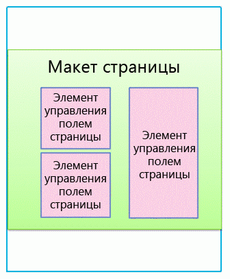
  
    
    
Каждый макет страницы связан с типом контента в библиотеке страниц сайта. Тип контента  это схема столбцов и типов данных. Для любого макета страницы поля страницы, доступные для данного макета, напрямую соответствуют столбцам, определенным для типа контента этого макета страницы.Every page layout is associated with a content type in the Pages library of a site. A content type is a schema of columns and data types. For any page layout, the page fields that are available for that layout correspond directly to the columns defined for that page layout's content type.
  
    
    

### Отношение эталонных страниц и макетов страницRelationship of master pages and page layouts

Эталонная страница и макет страницы вместе создают страницу содержимого.Together, a master page and a page layout create a content page.
  
    
    

**Рисунок 8. Эталонная страница с макетом страницы****Figure 8. Master page with page layout**

  
    
    

  
    
    

  
    
    
Эталонная страница определяет хром для всех страниц на сайте, поскольку в большинстве случаев многие макеты страниц (и поэтому многие страницы создаются из этих макетов страницы) связаны с одной эталонной страницей.The master page defines the chrome for all pages in the site so, often many page layouts (and therefore many pages created from those page layouts) are associated with one master page.
  
    
    

**Рисунок 9. Одна эталонная страницы связана с тремя макетами страниц****Figure 9. One master page tied to three page layouts**

  
    
    

  
    
    

  
    
    
Однако ваш сайт, скорее всего, использует несколько эталонных страниц. Например, кроме эталонной страницы по умолчанию, у вас могут быть одна или несколько эталонных страниц, которые предназначены для определенных устройств, например смартфонов или планшетов. В этом случае один макет страницы используется несколькими эталонными страницами (более подробную информацию можно узнать в разделе о каналах устройств).But, your site will likely use multiple master pages. For example, in addition to the default master page, you may have one or more master pages that target specific devices such as smart phones or tablets. In this case, one page layout is used by many master pages (see the section about device channels).
  
    
    
Вы можете использовать одну эталонную страницу на каждый канал по каждому сайту SharePoint.You can use one master page per channel per SharePoint site.
  
    
    

### СтраницыPages

Авторы могут создавать страницы, добавлять содержимое на поля страниц и добавлять веб-части в любую зону веб-частей или редакторы форматированного текста. Структура страниц выполнена таким образом, что авторы страниц не смогут внести изменения за пределы полей страницы.Authors can create pages and add content to the page fields, and they can add Web Parts to any Web Part zones or Rich Text Editors. Pages are structured so that content authors cannot make changes outside of page fields.
  
    
    

**Рисунок 10. Страница с авторским содержимым****Figure 10. Page with authored content**

  
    
    

  
    
    
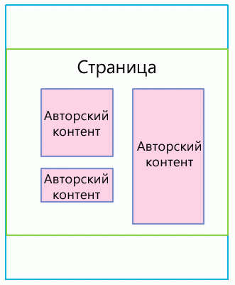
  
    
    
Отображаемая страница  это то, что посетители видят на сайте. Когда браузер запрашивает страницу, эталонная страница объединяется с макетом, чтобы создать страницу содержимого, и содержимое для данной страницы объединяется с полями из данной страницы в библиотеке страниц.The rendered page is what site visitors see. When a page is requested by the browser, the master page is merged with a page layout to create a content page, and the content for that page is merged into the page fields from that page in the Pages library.
  
    
    

**Рисунок 11. Отображаемая страница в браузере****Figure 11. Rendered page in browser**

  
    
    

  
    
    
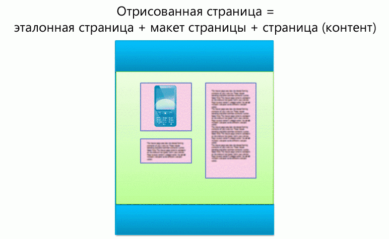
  
    
    

**Рисунок 12. Эталонная страница, макет страницы и страница****Figure 12. Master page, page layout, and page**

  
    
    

  
    
    
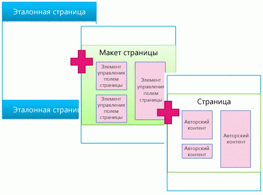
  
    
    

  
    
    

  
    
    

## Веб-части на основе поиска и шаблоны для отображенияSearch-driven Web Parts and display templates

В предыдущем разделе была рассмотрена модель страниц SharePoint с точки зрения эталонных страниц, макетов страниц (с полями страниц) и страниц. Эти элементы наиболее распространены на сайте публикации, на котором авторы регулярно создают и публикуют новый контент. Когда дело доходит до отображения этого контента на вашем сайте, в игру вступают еще пара элементов. Хотите вы подключиться к внешнему каталогу или просто отобразить определенный набор результатов поиска, для выполнения этих действий вам понадобятся веб-части на основе поиска.The previous section explains the SharePoint page model in terms of master pages, page layouts (with page fields), and pages. These elements are the most common in a publishing site in which authors regularly create and publish new content. When it comes to surfacing that content on your site, though, a couple more elements come into play. Whether you have connected to an external catalog or simply want to show a particular set of search results, search-driven Web Parts can help you achieve your goal.
  
    
    
В сценарии со страницами на основе поиска страница SharePoint содержит три основных элемента:In the search-driven pages scenario, a SharePoint page contains these main elements:
  
    
    

- Главные страницыMaster pages
    
  
- Макеты страниц:Page layouts:
    
  - обычные макеты страниц, которые создаются вами для определенных типов контента, как это описано в данной статье выше;Regular page layouts that you created for specific content types, as described previously in this article
    
  
  - макеты страниц со сведениями о категории или элементе, которые создаются с помощью публикации каталога на нескольких сайтах.Category and item details page layouts that are created through cross-site publishing of a catalog
    
  
- СтраницыPages
    
  
- Веб-части на основе поиска, например веб-часть поиска контента.Search-driven Web Parts, such as the Content Search Web Part
    
  
- Шаблоны для отображения, чтобы контролировать появление управляемых свойств в результатах поиска веб-части поиска контента и управлять стилем и поведением данных результатов поиска:Display templates to control which managed properties appear in the search results of a search-driven Web Part, and control the styling and behavior of those search results:
    
  - шаблоны отображения элементов управления, которые управляют макетом результатов поиска и любыми элементами, общими для всех результатов, например разбиение по страницам, сортировка и другие ссылки;Control display templates, which control the layout of search results and any elements common to all results such as paging, sorting, and other links
    
  
  - шаблоны отображения элемента, которые управляют отображением и повторением каждого результата поиска.Item display templates, which control how each search result is displayed and repeated for each result
    
  

**Рисунок 13. Эталонная страница, макет страницы и страница с веб-частью****Figure 13. Master page, page layout, and page with Web Part**

  
    
    

  
    
    

  
    
    

### Веб-части на основе поискаSearch-driven Web Parts

С помощью веб-частей на основе поиска вы можете динамически представлять хранимую в индексе поиска информацию. Представление данных в веб-части поиска контента управляется с помощью шаблонов для отображения, которые находятся в коллекции эталонных страниц вместе с эталонными страницами и макетами страниц.With search-driven Web Parts, you can dynamically present information stored in the search index. The presentation of data in the Content Search Web Part is controlled by display templates, which reside in the Master Page Gallery alongside master pages and page layouts.
  
    
    
В SharePoint есть несколько готовых шаблонов отображения, например списки и слайд-шоу для веб-частей поиска контента.SharePoint includes several ready-to-use display templates such as lists and slideshows for your Content Search Web Parts. Шаблоны отображения можно выбрать во время настройки веб-части поиска контента в браузере.When you configure a Content Search Web Part in the browser, you choose which display templates to use.
  
    
    

**Рис. 14. Область инструментов веб-части поиска контента****Figure 14. Tool pane of Content Search Web Part**

  
    
    

  
    
    
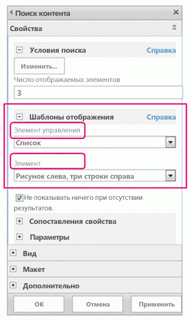
  
    
    
Веб-части поиска контента используют два типа шаблонов для отображения  шаблон отображения элемента управления и шаблон отображения элемента. В рамках разработки или создания фирменной символики своего сайта вы можете создать пользовательский шаблон для отображения, который использует определенные вами макеты, стили и поведение.Content Search Web Parts use two types of display templates, control and item. As part of the design or branding of your site, you can create custom display templates that use layouts, styles, and behaviors that you define.
  
    
    

**Рисунок 15. Две схемы веб-частей поиска контента****Figure 15. Two diagrams of Content Search Web Parts**

  
    
    

  
    
    
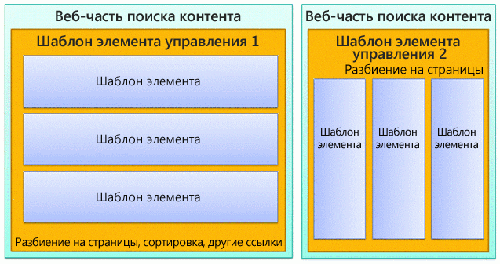
  
    
    

  
    
    

  
    
    

### Шаблон отображения элемента управленияControl display template

Шаблон элемента управления определяет всю структуру и макет представления результатов поиска, например список с разбиением по страницам или слайд-шоу. Каждая веб-часть поиска контента использует один шаблон элемента управления.The control template determines the overall structure and layout of how you want to present the search results, such as a list with paging or a slideshow. Each Content Search Web Part uses one control template.
  
    
    
Кроме того, этот шаблон включает функциональные возможности, общие для всех результатов поиска, включая разбиение по страницам, сортировку, параметры просмотра и разделители.The control template also includes functionality common to all the search results, including paging, sorting, view options, and separators.
  
    
    

**Рисунок 16. Шаблон элемента управления, выделенный в веб-части и на веб-странице****Figure 16. Control template outlined on Web Part and webpage**

  
    
    

  
    
    
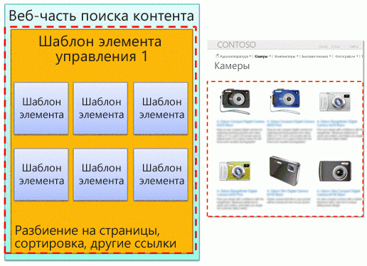
  
    
    

  
    
    

  
    
    

### Шаблон отображения элементаItem display template

Шаблон элемента определяет способ отображения каждого результата в наборе; этот шаблон повторяется для каждого результата. Шаблон элемента может отображать изображение, изображение с текстом, видео и другой контент.The item template determines how each result in the set is displayed, and the template is repeated for each result. An item template can display an image, an image with text, a video, and other content.
  
    
    
Кроме того, он определяет, какие управляемые свойства и значения отображаются за счет веб-части поиска контента. В данном примере шаблон элемента отображает три управляемых свойства: небольшое изображение, название продукта в виде гиперссылки и краткое текстовое описание.The item display template also determines which managed properties and values are displayed by the Content Search Web Part. In this example, the item template displays three managed properties: a small-sized image, a product name as a hyperlink, and a brief text description.
  
    
    

**Рисунок 17. Шаблоны элементов, выделенные в веб-части и на веб-странице****Figure 17. Item templates outlined on Web Part and webpage**

  
    
    

  
    
    

  
    
    

  
    
    

  
    
    

## Каналы устройств и панели канала устройствDevice channels and device channel panels

В SharePoint вы можете использовать каналы устройств, чтобы отображать один веб-сайт несколькими способами с использованием различных макетов, предназначенных для различных устройств. Вы создаете один сайт и авторский контент только один раз. Затем этот сайт и контент можно сопоставить, чтобы использовать различные эталонные страницы и таблицы стилей, предназначенные определенным устройствам или группам устройств.In SharePoint, you can use device channels to render a single publishing site in multiple ways by using different designs that target different devices. You create a single site and author the content in it a single time. Then, that site and content can be mapped to use different master pages and style sheets to target a specific device or group of devices.
  
    
    
При разработке сайта для более одного устройства учтите следующие элементы:When you design for more than one device, consider these elements:
  
    
    

- Каналы устройств:Device channels:
    
  - Используя различные эталонные страницы и таблицы CSS для каждого канала, одинаковое содержимое страницы для определенных устройств (например, Windows Phone) или групп устройств (все смартфоны) можно представить различными способами.By using different master pages and CSS per channel, identical page content can be presented in different ways for specific devices (for example, Windows Phone) or groups of devices (all smart phones).
    
  
- Макеты страниц:Page layouts:
    
  - Если контент не меняется, вы можете использовать для всех каналов устройств одинаковые макеты страниц несмотря на то, что они могут иметь разные стили, основанные на CSS другой эталонной страницы, для каждого канала.If the content does not change, you use the same page layouts for all device channels, though they can be styled differently based on the CSS of the different master page for each channel.
    
  
  - Если вы хотите включить контент только для определенных устройств, используйте панели канала устройств.If you want to include content only for specific devices, use device channel panels.
    
  
- СтраницыPages
    
  

### Каналы устройствDevice channels

Когда вы создаете канал устройства, вы указываете подстроки агента пользователя для целевых устройств канала. Это позволяет хорошо управлять устройством (или браузером), которое было захвачено через канал. Затем вы назначаете этому каналу эталонную страницу; каждая эталонная страница в свою очередь ссылается на собственную таблицу стилей, в которой макет и стили оптимизированы для данного типа устройства.When you create a device channel, you specify the user agent substrings for the devices that you want the channel to target. This gives you fine-tuned control over what devices (or browsers) are captured by each channel. Then you assign a master page to that channel; in turn, each master page links to its own style sheet where the layout and styles are optimized for that type of device.
  
    
    

**Рисунок 18. Два канала устройства с отдельными эталонными страницами****Figure 18. Two device channels with separate master pages**

  
    
    

  
    
    
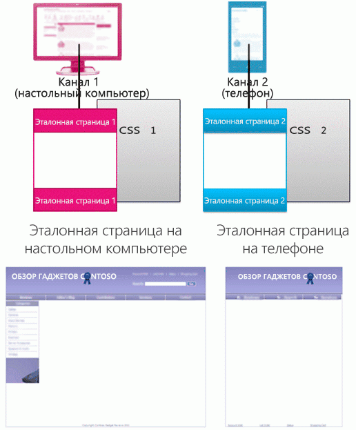
  
    
    
Вы можете многое реализовать, используя только CSS. Это возможно для эталонных страниц для двух различных каналов (например, компьютер и телефон), которые идентичны за исключением ссылки на разные таблицы стилей. Файлы CSS просто используют различные стили для одних и тех же элементов страницы.You can accomplish a great deal using only CSS. It is possible for the master pages for two different channels (for example, desktop and phone) to be identical except that they link to different style sheets. The CSS files simply use different styles for the same page elements.
  
    
    

### Отношение эталонных страниц и макетов страницRelationship of master pages and page layouts

В отличие от эталонных страниц вы не указываете различным каналам устройств различные макеты страниц. Все макеты работают со всеми созданными вами каналами. Соответственно, один макет страницы применяется ко многим каналам устройств и эталонным страницам.Unlike master pages, you do not specify different page layouts for different device channels. All page layouts work with all channels that you create. Thus, one page layout applies to many device channels and master pages.
  
    
    
Это основное преимущество каналов устройств  изменяется структура (эталонной страницы или файла CSS), а контент остается тем же (макеты страниц и страницы). Однако вы можете изменять отображаемый по различным каналам контент из макета страницы с помощью панелей канала устройств (см. следующий раздел).This is one of the primary benefits of device channels: the design changes (the master page and CSS), but the content stays the same (page layouts and pages). But, you can vary what content from a page layout is displayed across different channels by using device channel panels (see the next section).
  
    
    

**Рисунок 19. Один макет страницы, работающий с двумя макетами страниц****Figure 19. One page layout working with two master pages**

  
    
    

  
    
    
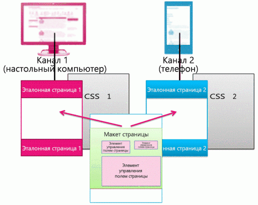
  
    
    

  
    
    

  
    
    

### Панели каналов устройствDevice channel panels

Панель канала устройства  это элемент управления, который можно добавить на эталонную страницу, макет страницы или шаблон для отображения, чтобы управлять отображаемым на каждом канале контентом. Панель каналов, по сути, является контейнером, который определяет один или несколько каналов; если один или более этих каналов активны при отображении страницы, то отображается также и контент панели каналов. Панель каналов может включать любой тип контента, включая ссылку на CSS- или JS-файл, и это простой способ включить определенный контент для определенных каналов.A device channel panel is a control that you can add to a master page, page layout, or display template to control what content is rendered in each channel. A channel panel is basically a container that specifies one or more channels; if one or more of those channels are active when the page is rendered, all of the contents of the channel panel are also rendered. A channel panel can include any type of content, including a link to a CSS file or a .js file, and is an easy way to include specific content for specific channels.
  
    
    
Пожалуй, наиболее распространенным сценарием использования панелей каналов является выборочное включение частей макета страницы для определенных каналов. Например, у вас есть макет страницы с отдельными текстовыми полями для длинного и короткого приветствий. Поместив поля страницы внутри панелей каналов, вы можете отображать только короткое приветствие для телефонов и только длинное  для компьютеров. Контент панели каналов устройств не отображается для каналов, в которые он не включен, и контент внутри этой панели каналов устройств не отображается вообще, что запрещает передачу данных по кабельной сети.Perhaps the most common scenario for using channel panels is to selectively include parts of a page layout for specific channels. For example, you may have a page layout with separate text fields for a long greeting and a short greeting. By placing the page fields inside channel panels, you can display the short greeting only to phones and the long greeting only to desktops. The content of a device channel panel is not displayed to channels that it doesn't include—and the content inside that device channel panel is not rendered at all, which prevents bytes from going across the wire.
  
    
    

**Рисунок 20. Макет страницы с панелями каналов****Figure 20. Page layout with channel panels**

  
    
    

  
    
    
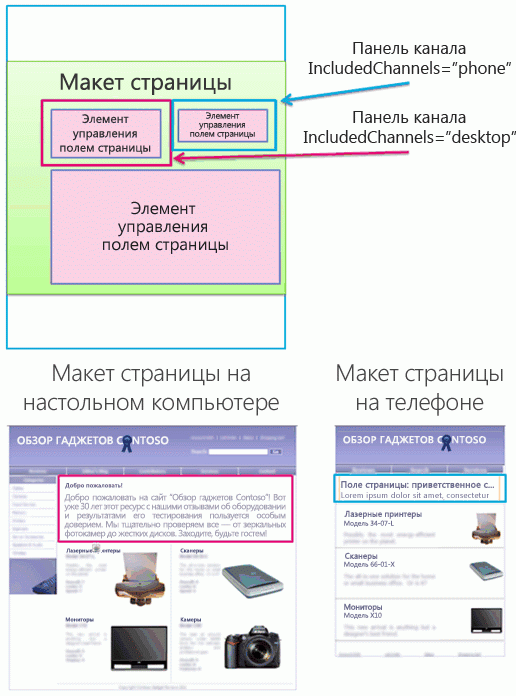
  
    
    
Кроме того, вы можете использовать панели каналов на эталонных страницах. Например, если у вас есть эталонная страница, которую можно приспособить для двух различных устройств (или двух различных браузеров) с минимальными изменениями, вы можете использовать панели каналов, чтобы хранить контент на эталонной странице, которая уникальна для каждого из этих устройств.You can also use channel panels on master pages. For example, if you have a master page that can accommodate two different devices (or two different browsers) with only minimal changes, you can use channel panels to hold the content on the master page that is specific to each of those devices.
  
    
    
Или вы можете использовать панель каналов внутри шаблона отображения элемента для веб-части поиска контента, чтобы отображать дополнительные управляемые свойства для этого элемента только из каталога для компьютеров, но не для телефонов.Or, you can use a channel panel inside the item display template of a Content Search Web Part, to display additional managed properties for that item from the catalog only for desktops and not for phones.
  
    
    

**Рисунок 21. Макет страницы и шаблоны элементов с панелями каналов****Figure 21. Page layout and item templates with channel panels**

  
    
    

  
    
    
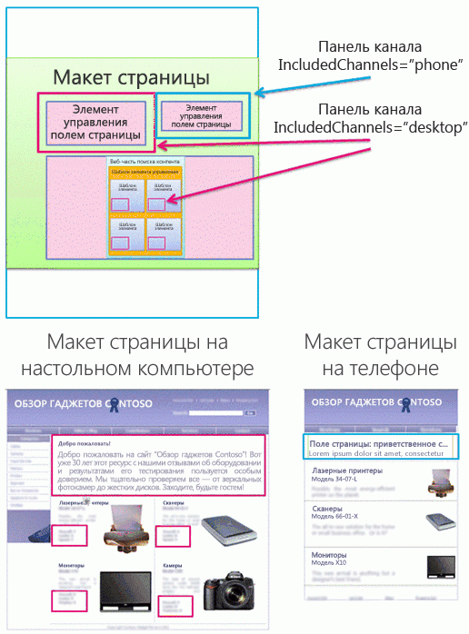
  
    
    

  
    
    

  
    
    

## См. такжеSee also

-  [Обзор Дизайнера в SharePointOverview of Design Manager in SharePoint](overview-of-design-manager-in-sharepoint.md)
    
  
-  [Создание сайтов для SharePointBuild sites for SharePoint](build-sites-for-sharepoint.md)
    
  
-  [Шаблоны отображения Дизайнера SharePointSharePoint Design Manager display templates](sharepoint-design-manager-display-templates.md)
    
  
-  [Каналы устройств в компоненте "Дизайнер" SharePointSharePoint Design Manager device channels](sharepoint-design-manager-device-channels.md)
    
  

