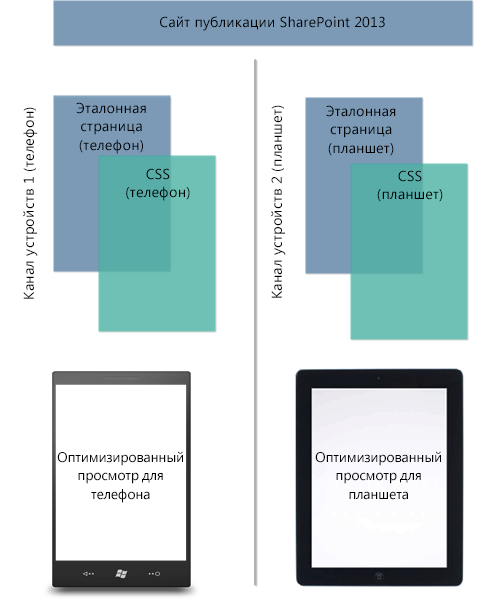
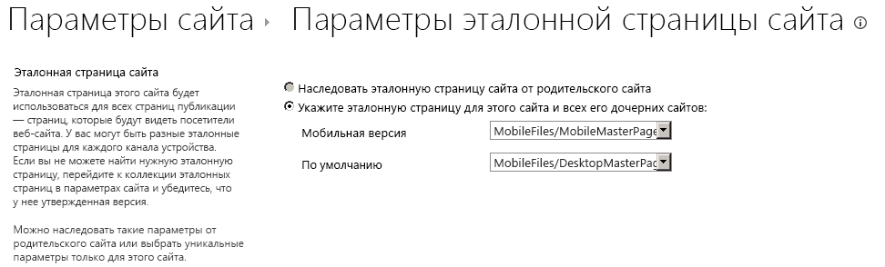

# <a name="sharepoint-design-manager-device-channels"></a><span data-ttu-id="3d644-102">Каналы устройств в компоненте "Дизайнер" SharePoint</span><span class="sxs-lookup"><span data-stu-id="3d644-102">SharePoint Design Manager device channels</span></span>
<span data-ttu-id="3d644-103">Сведения о настройке и планировании использования каналов устройств на сайте SharePoint.</span><span class="sxs-lookup"><span data-stu-id="3d644-103">Learn about, plan and configure a device channels experience on a SharePoint site.</span></span>
## <a name="introduction-to-device-channels"></a><span data-ttu-id="3d644-104">Общие сведения о каналах устройств</span><span class="sxs-lookup"><span data-stu-id="3d644-104">Introduction to device channels</span></span>
<span data-ttu-id="3d644-105"><a name="Int"> </a></span><span class="sxs-lookup"><span data-stu-id="3d644-105"></span></span>

<span data-ttu-id="3d644-p101">Для просмотра веб-страниц все чаще используются мобильные устройства, поэтому сайт SharePoint нужно оптимизировать для смартфонов и прочих мобильных устройств, например планшетов. С помощью каналов устройств в SharePoint можно сделать так, что один сайт публикации будет отображаться по-разному в зависимости от устройства. Эта статья поможет вам спланировать использование каналов устройств в SharePoint. В ней приведены подробные сведения о самой возможности, а также необходимая информация о создании канала устройств. Кроме того, после прочтения этой статьи вы узнаете, какие каналы устройств вам нужны и как их реализовать.</span><span class="sxs-lookup"><span data-stu-id="3d644-p101">Browsing the web on a mobile device is now so common that a SharePoint site must be optimized for readability and ease of use on smartphones and other mobile devices such as tablets. With device channels in SharePoint, you can render a single publishing site in multiple ways by using different designs that target different devices. This article can help you plan for using the device channels feature in SharePoint. It provides a detailed overview of the feature itself, and provides the necessary information for creating a device channel. Also, after reading this article, you'll know what device channels you need to implement, and how to implement those channels.</span></span>
  
    
    
<span data-ttu-id="3d644-p102">Каналы устройств доступны только для сайтов публикации SharePoint. Прежде чем реализовывать каналы устройств, необходимо получить общее представление о функции "Дизайнер", о том, из чего состоит сайт SharePoint и как создать страницу SharePoint. Дополнительные сведения о модели страницы SharePoint, а также об эталонных страницах и макетах страниц см. в статье  [Обзор модели страниц в SharePoint](overview-of-the-sharepoint-page-model.md). Дополнительные сведения о компоненте "Дизайнер" см. в статье  [Обзор Дизайнера в SharePoint](overview-of-design-manager-in-sharepoint.md).</span><span class="sxs-lookup"><span data-stu-id="3d644-p102">Device channels are available only for SharePoint publishing sites. Before you implement device channels, you should already have a general understanding of the parts of a SharePoint site, how a SharePoint page is put together, and a general understanding of design manager. For more information about the SharePoint page model, including master page and page layouts, see  [Overview of the SharePoint page model](overview-of-the-sharepoint-page-model.md). For more information about design manager, see  [Overview of Design Manager in SharePoint](overview-of-design-manager-in-sharepoint.md).</span></span>
  
    
    

## <a name="what-is-a-device-channel"></a><span data-ttu-id="3d644-115">Что такое канал устройств?</span><span class="sxs-lookup"><span data-stu-id="3d644-115">What is a device channel?</span></span>
<span data-ttu-id="3d644-116"><a name="WhatDev"> </a></span><span class="sxs-lookup"><span data-stu-id="3d644-116"></span></span>

<span data-ttu-id="3d644-p103">Канал устройств  часть инфраструктуры публикации SharePoint, которая позволяет отображать определенный контент сайта, стилизовать контент и даже изменять изображения, используя при этом один и тот же URL-адрес для пула разных устройств. Если сравнивать классическую и мобильную версии сайта SharePoint, то последняя должна предусматривать отображение более узких страниц, меньшего объема информации, увеличенных элементов навигации (для прикосновений), чтобы сайт был удобным. Можно разработать один сайт, создав и отредактировав контент сразу для всех мобильных устройств. Когда пользователь просматривает сайт SharePoint с мобильного устройства, например смартфона или планшета, браузер мобильного устройства отправляет на сайт запрос HTTP GET, включающий строку агента пользователя. Эта строка содержит сведения о типе устройства, которое пытается получить доступ к сайту. В зависимости от того, какая подстрока используется, браузер может перенаправить пользователя к определенному представлению эталонной страницы. Если, например, у вас есть коллекция устройств с Windows Phone и устройств iPad, можно назначить каждому пулу уникальное отображение сайта публикации SharePoint с помощью каналов устройств. Каждому каналу устройств можно назначить отдельную эталонную страницу и CSV-файл, чтобы обеспечить оптимальное отображение. На рисунке 1 показано использование двух каналов устройств для обеспечения двух вариантов отображения сайта (для телефона и планшета).</span><span class="sxs-lookup"><span data-stu-id="3d644-p103">A device channel is part of the SharePoint publishing infrastructure that enables you to render certain site content, style your content, and even change images—while maintaining the same URL across a pool of different devices. Compared to the desktop version of the SharePoint site, a mobile rendering can be formatted with a smaller width, have better navigation with wider touch targets, and show a reduced amount of information for better usability. You can create a single site, and author and edit the content a single time for all your different mobile devices. When a user browses a SharePoint site from a mobile device such as a smartphone or tablet, the mobile browser submits to the site an HTTP GET request that includes a user agent string. This string contains information about the type of device that is trying to access the site. Based on that device substring, the device browser can be redirected to a specific master page view. For example, if you have a collection of Windows Phone and iPad devices, you can provide each pool with a unique rendering of the SharePoint publishing site by using device channels. These device channels can each be given a different master page and thus CSS file to give users a more optimal viewing experience. Figure 1 shows the use of two device channels to provide two unique site renderings for a phone and tablet device.</span></span>
  
    
    
<span data-ttu-id="3d644-p104">Рис. 1. Использование каналов устройств на различных платформах устройств</span><span class="sxs-lookup"><span data-stu-id="3d644-p104">Figure 1. Using device channels across different device platforms</span></span>
  
    
    

  
    
    

  
    
    
<span data-ttu-id="3d644-p105">Можно создать и настроить канал устройств через меню **Параметры сайта** в разделе **Внешний вид и функции**, а также с помощью параметра **Дизайнер** в том же разделе. При создании элемента канала устройств понадобится заполнить пять полей (как обязательных, так и необязательных). В таблице 1 перечислены эти поля и описаны сведения, которые необходимо предоставить.</span><span class="sxs-lookup"><span data-stu-id="3d644-p105">You can create and configure a device channel from the **Site Settings** menu under the **Look and Feel** section, or alternatively through the **Design Manager** option in the same section. When you create a device channel item, there are five required and optional fields to supply for the process. Table 1 lists these fields and describes what type of information must be provided.</span></span>
  
    
    

<span data-ttu-id="3d644-132">**Таблица 1. Обязательные и необязательные поля для создания канала устройств**</span><span class="sxs-lookup"><span data-stu-id="3d644-132">**Table 1. Required and optional fields for creating a device channel**</span></span>


|<span data-ttu-id="3d644-133">**Поле**</span><span class="sxs-lookup"><span data-stu-id="3d644-133">**Field**</span></span>|<span data-ttu-id="3d644-134">**Обязательное значение**</span><span class="sxs-lookup"><span data-stu-id="3d644-134">**Required Value**</span></span>|<span data-ttu-id="3d644-135">**Значение**</span><span class="sxs-lookup"><span data-stu-id="3d644-135">**Value**</span></span>|
|:-----|:-----|:-----|
|<span data-ttu-id="3d644-136">Имя</span><span class="sxs-lookup"><span data-stu-id="3d644-136">Name</span></span>  <br/> |<span data-ttu-id="3d644-137">Да</span><span class="sxs-lookup"><span data-stu-id="3d644-137">Yes</span></span>  <br/> |<span data-ttu-id="3d644-p106">Это имя вашего канала устройств. Можно использовать понятное имя, чтобы легко распознавать канал.</span><span class="sxs-lookup"><span data-stu-id="3d644-p106">This is the name of your design channel. It can be a friendly name to identify the channel.</span></span>  <br/> |
|<span data-ttu-id="3d644-140">Псевдоним</span><span class="sxs-lookup"><span data-stu-id="3d644-140">Alias</span></span>  <br/> |<span data-ttu-id="3d644-141">Да</span><span class="sxs-lookup"><span data-stu-id="3d644-141">Yes</span></span>  <br/> |<span data-ttu-id="3d644-142">Псевдоним дает возможность определять канал устройств в коде, на панелях канала устройств (подробнее описаны ниже в статье), при предварительном просмотре и в другом контексте.</span><span class="sxs-lookup"><span data-stu-id="3d644-142">The alias name enables you to identify your device channel in code, device channel panels (discussed later in this article), previews, and other contexts.</span></span>  <br/> <span data-ttu-id="3d644-143">**Важно!** Если вы позже измените псевдоним канала, необходимо будет вручную обновить сопоставления эталонной страницы, панели каналов устройств, а также пользовательский код или разметку.</span><span class="sxs-lookup"><span data-stu-id="3d644-143">If you later change the channel alias, you'll have to manually update master page mappings, device channel panels, and any custom code or markup.</span></span>           |
|<span data-ttu-id="3d644-144">Описание</span><span class="sxs-lookup"><span data-stu-id="3d644-144">Description</span></span>  <br/> |<span data-ttu-id="3d644-145">Нет</span><span class="sxs-lookup"><span data-stu-id="3d644-145">No</span></span>  <br/> |<span data-ttu-id="3d644-146">Поле для указания общего описания канала устройств.</span><span class="sxs-lookup"><span data-stu-id="3d644-146">A field for supplying a general description for the device channel.</span></span>  <br/> |
|<span data-ttu-id="3d644-147">Правила включения устройств</span><span class="sxs-lookup"><span data-stu-id="3d644-147">Device Inclusion Rules</span></span>  <br/> |<span data-ttu-id="3d644-148">Да</span><span class="sxs-lookup"><span data-stu-id="3d644-148">Yes</span></span>  <br/> |<span data-ttu-id="3d644-p107">Поле для указания подстроки агента пользователя, например Windows Phone OS. От значения, введенного в это поле, зависит перенаправление устройств на определенную эталонную страницу. Дополнительные сведения о том, какие значения вводить в это поле, см. в разделе  [Подстроки агента пользователя и ранжирование каналов устройств](#PlanDeviceChannels_UserAgentSubstrings) этой статьи.</span><span class="sxs-lookup"><span data-stu-id="3d644-p107">A field for supplying the user agent substring such as Windows Phone OS. Device redirection to a specific master page depends on what is entered for this value. For more information about what values to supply in this field, see the section  [User agent substrings and device channel rankings](#PlanDeviceChannels_UserAgentSubstrings) in this article. </span></span><br/> |
|<span data-ttu-id="3d644-152">Активные</span><span class="sxs-lookup"><span data-stu-id="3d644-152">Active</span></span>  <br/> |<span data-ttu-id="3d644-153">Нет</span><span class="sxs-lookup"><span data-stu-id="3d644-153">No</span></span>  <br/> |<span data-ttu-id="3d644-p108">Установка этого флажка активирует канал устройств. Если вы работаете над действующим сайтом, лучше не активировать канал до завершения его разработки. Чтобы протестировать работу сайта с помощью предварительного просмотра сайта при использовании определенного канала, можно использовать строку запроса  `?DeviceChannel=alias` в браузере.</span><span class="sxs-lookup"><span data-stu-id="3d644-p108">Selecting this check box activates your device channel. If you are working on a live site, you should not activate the channel before you have finished designing it. For testing, you can use the query string  `?DeviceChannel=alias` within a browser to preview your site for a specific channel. </span></span><br/> |
   

  
    
    

    
> <span data-ttu-id="3d644-157">**Примечание.** Дополнительные сведения и инструкции по созданию канала устройств см. в разделе [Создание канала устройств](sharepoint-design-manager-device-channels.md#create) этой статьи.</span><span class="sxs-lookup"><span data-stu-id="3d644-157">**Note** For more information and steps for creating a device channel, see the  [Create a device channel](sharepoint-design-manager-device-channels.md#create) section of this article.</span></span>
  
    
    

<span data-ttu-id="3d644-p109">После создания и активации канала устройств станет возможным перенаправление на определенную эталонную страницу, например на мобильную версию. Далее необходимо указать, какая именно эталонная страница должна отображаться для мобильных устройств на уровне сайта. Это можно сделать через **Параметры главной страницы сайта** или с помощью параметра **Публикация и применение** в компоненте "Дизайнер".</span><span class="sxs-lookup"><span data-stu-id="3d644-p109">After a device channel is created and activated, device redirection to a specific master page, for example a mobile version, is possible. The next step is to specify what master page should be displayed for mobile devices at the site level, through either the **Site Master Page Settings** or by using the **Publish and Apply** option in Design Manager.</span></span>
  
    
    

<span data-ttu-id="3d644-160">**Рис. 2. Настройка эталонных страниц для просмотра на мобильных устройствах и просмотра по умолчанию на компьютерах**</span><span class="sxs-lookup"><span data-stu-id="3d644-160">**Figure 2. Setting master pages for mobile device viewing and default desktop viewing**</span></span>

  
    
    

  
    
    

  
    
    
<span data-ttu-id="3d644-p110">Как показано на рисунке 2, можно назначить определенную эталонную страницу для обычного просмотра сайта на компьютере и эталонную страницу для перенаправления мобильных устройств. От настроенного и активного канала устройств зависит, какая именно эталонная страница будет отображаться: мобильная или по умолчанию. В частности, это зависит от подстроки правила включения устройств, заполняемой при создании канала устройств.</span><span class="sxs-lookup"><span data-stu-id="3d644-p110">As seen in Figure 2, you can assign a specific master page for regular desktop viewing of the site, and a mobile master page for device redirection. Whether the mobile or default master pages are rendered depends on the configured, active device channel. Specifically, it depends on the device inclusion rule substring that is supplied in the device channel creation process.</span></span>
  
    
    

### <a name="user-agent-substrings-and-device-channel-rankings"></a><span data-ttu-id="3d644-165">Подстроки агента пользователя и ранжирование каналов устройств</span><span class="sxs-lookup"><span data-stu-id="3d644-165">User agent substrings and device channel rankings</span></span>
<span data-ttu-id="3d644-166"><a name="PlanDeviceChannels_UserAgentSubstrings"> </a></span><span class="sxs-lookup"><span data-stu-id="3d644-166"></span></span>

<span data-ttu-id="3d644-p111">При создании канала устройств вам будет предложено указать подстроку агента пользователя, которая отвечает за перенаправление устройств на указанную эталонную страницу. Если не указать это значение в поле **Правила включения устройств**, перенаправление устройств не будет работать и канал невозможно будет создать. В таблице 2 приведены примеры значений подстроки агента пользователя, которые можно использовать при создании канала устройств.</span><span class="sxs-lookup"><span data-stu-id="3d644-p111">When creating a device channel, you are asked to supply a user agent substring that is responsible for device redirection to a specified master page. If you do not provide this value in the **Device Inclusion Rules** field, device redirection is not possible and the channel cannot be created. Table 2 provides some sample user agent substring values that can be used when you are creating a device channel.</span></span>
  
    
    

<span data-ttu-id="3d644-170">**Таблица 2. Примеры значений подстроки агента пользователя**</span><span class="sxs-lookup"><span data-stu-id="3d644-170">**Table 2. Sample user agent substring values**</span></span>


|<span data-ttu-id="3d644-171">**Устройство**</span><span class="sxs-lookup"><span data-stu-id="3d644-171">**Device**</span></span>|<span data-ttu-id="3d644-172">**Подстрока агента пользователя**</span><span class="sxs-lookup"><span data-stu-id="3d644-172">**User agent substring(s)**</span></span>|
|:-----|:-----|
|<span data-ttu-id="3d644-173">Windows Phone</span><span class="sxs-lookup"><span data-stu-id="3d644-173">Windows Phone</span></span>  <br/> | <span data-ttu-id="3d644-174">Windows Phone OS 7.5 (только для телефонов с Windows Phone 7.5)</span><span class="sxs-lookup"><span data-stu-id="3d644-174">Windows Phone OS 7.5 (Specific to Windows Phone 7.5 phone.)</span></span> <br/>  <span data-ttu-id="3d644-175">Windows Phone OS (универсальная подстрока для всех версий Windows Phone)</span><span class="sxs-lookup"><span data-stu-id="3d644-175">Windows Phone OS (Generic substring for all Windows Phone versions.)</span></span> <br/> |
|<span data-ttu-id="3d644-176">iPhone</span><span class="sxs-lookup"><span data-stu-id="3d644-176">iPhone channel</span></span>  <br/> |<span data-ttu-id="3d644-177">iPhone</span><span class="sxs-lookup"><span data-stu-id="3d644-177">iPhone channel</span></span>  <br/> |
|<span data-ttu-id="3d644-178">iPad</span><span class="sxs-lookup"><span data-stu-id="3d644-178">iPad channel</span></span>  <br/> |<span data-ttu-id="3d644-179">iPad</span><span class="sxs-lookup"><span data-stu-id="3d644-179">iPad channel</span></span>  <br/> |
|<span data-ttu-id="3d644-180">Android</span><span class="sxs-lookup"><span data-stu-id="3d644-180">Android</span></span>  <br/> |<span data-ttu-id="3d644-181">Android</span><span class="sxs-lookup"><span data-stu-id="3d644-181">Android</span></span>  <br/> |
   
<span data-ttu-id="3d644-182">В поле **Правила включения устройств** указываются значения подстроки, соответствующие нужным устройствам.</span><span class="sxs-lookup"><span data-stu-id="3d644-182">In the **Device Inclusion Rules** field, you add just the substring value or values for the devices that you want to include.</span></span>
  
    
    

> <span data-ttu-id="3d644-183">**Важно!** Значения подстроки "агент пользователя" отличаются в зависимости от производителя устройства, но также могут отличаться для устройств под одним брендом, как в приведенном выше случае с Windows Phone.</span><span class="sxs-lookup"><span data-stu-id="3d644-183">**Important:** User agent substring values differ from device manufacturer to device manufacturer, and possibly throughout a set of similarly branded devices, as seen above with Windows Phone.</span></span> <span data-ttu-id="3d644-184">Для успешного перенаправления трафика в конкретный пул в качестве агента пользователя нужно указать уникальный идентификатор.</span><span class="sxs-lookup"><span data-stu-id="3d644-184">To achieve successful traffic redirection to a specific pool, you must provide a unique identifier for the user agent substring.</span></span> <span data-ttu-id="3d644-185">Дополнительные сведения о том, как изолировать подстроку на различных устройствах, см. в разделе [Планирование использования каналов устройств](sharepoint-design-manager-device-channels.md#plan) этой статьи.</span><span class="sxs-lookup"><span data-stu-id="3d644-185">For more information about how to isolate a substring across different devices, see the  [Planning your device channels experience](sharepoint-design-manager-device-channels.md#plan) section of this article.</span></span>
  
    
    

<span data-ttu-id="3d644-p113">После создания каналов устройств они упорядочиваются и хранятся в списке. SharePoint поддерживает до 10 каналов устройств для одного сайта, поэтому для корректной маршрутизации трафика может понадобиться ранжировать каналы. Следует поставить наиболее уникальные правила в верхнюю часть списка, чтобы указать их более высокую важность. Это нужно сделать, если, например, в организации есть устройства с разными версиями Windows Phone, а вы хотите, чтобы на устройствах с Windows Phone 7.5 отображалась уникальная эталонная страница. На всех остальных устройствах с Windows Phone будет отображаться другая мобильная эталонная страница. В таблице 3 показаны три схемы упорядочивания, которыми можно воспользоваться, и описано их влияние на маршрутизацию.</span><span class="sxs-lookup"><span data-stu-id="3d644-p113">After they are created, device channels are ordered and stored in a list. It is possible to support up to 10 device channels per site in SharePoint, so it may be necessary to rank your channels for proper traffic routing. You should order the most specific rules at the top for higher priority. For example, you may have multiple OS versions for Windows Phone devices in your organization, and want a unique master page rendering for Windows Phone 7.5 devices. All other Windows Phone devices would receive another mobile master page view. Table 3 shows two ordering schemes that could be applied, and the effects on the routing decision.</span></span>
  
    
    

> <span data-ttu-id="3d644-192">**Примечание.** Дополнительные сведения об изменении порядка каналов устройств см. в разделе [Создание канала устройств](sharepoint-design-manager-device-channels.md#create) этой статьи.</span><span class="sxs-lookup"><span data-stu-id="3d644-192">**Note** For more information about how to reorder device channels see the  [Create a device channel](sharepoint-design-manager-device-channels.md#create) section of this article.</span></span>
  
    
    


<span data-ttu-id="3d644-193">**Таблица 3. Пример расположения каналов устройств**</span><span class="sxs-lookup"><span data-stu-id="3d644-193">**Table 3. Sample ordering of device channels**</span></span>


|<span data-ttu-id="3d644-194">**Порядок 1 (каналы устройств)**</span><span class="sxs-lookup"><span data-stu-id="3d644-194">**Order 1 (Device Channels)**</span></span>|<span data-ttu-id="3d644-195">**Порядок 2 (каналы устройств)**</span><span class="sxs-lookup"><span data-stu-id="3d644-195">**Order 2 (Device Channels)**</span></span>|
|:-----|:-----|
|<span data-ttu-id="3d644-196">Канал устройств 1: Windows Phone OS 7.5</span><span class="sxs-lookup"><span data-stu-id="3d644-196">device channel 1—Windows Phone OS 7.5</span></span>  <br/> |<span data-ttu-id="3d644-197">Канал устройств 1: Windows Phone OS</span><span class="sxs-lookup"><span data-stu-id="3d644-197">device channel 1—Windows Phone OS</span></span>  <br/> |
|<span data-ttu-id="3d644-198">Канал устройств 2: Windows Phone OS</span><span class="sxs-lookup"><span data-stu-id="3d644-198">device channel 2—Windows Phone OS</span></span>  <br/> |<span data-ttu-id="3d644-199">Канал устройств 2: Windows Phone OS 7.5</span><span class="sxs-lookup"><span data-stu-id="3d644-199">device channel 2—Windows Phone OS 7.5</span></span>  <br/> |
|<span data-ttu-id="3d644-200">Канал устройств 3: Default</span><span class="sxs-lookup"><span data-stu-id="3d644-200">device channel 3—Default</span></span>  <br/> |<span data-ttu-id="3d644-201">Канал устройств 3: Default</span><span class="sxs-lookup"><span data-stu-id="3d644-201">device channel 3—Default</span></span>  <br/> |
   
<span data-ttu-id="3d644-p114">При выборе порядка 1, в котором подстроке правила включения устройств присвоено значение **Windows Phone OS 7.5**, пользователь с устройством с Windows Phone 7.5 будет перенаправлен на канал устройств 1 при переходе на сайт. Пользователь с любой другой версией Windows Phone будет перенаправлен на канал устройств 2, а пользователь, не использующий Windows Phone, перейдет на канал 3. Но при выборе порядка 2, в котором высший приоритет присвоен универсальной подстроке Windows Phone OS, весь трафик Windows Phone будет направляться на канал устройств 1. Устройства с Windows Phone 7.5 не будут перенаправлены на канал устройств 2 из-за того, что приоритет назначен каналу устройств 1, относящемуся к Windows Phone в общем. При создании нескольких каналов устройств очень важно понимать, как порядок и ранжирование влияют на перенаправление трафика для пулов устройств.</span><span class="sxs-lookup"><span data-stu-id="3d644-p114">If you choose Order 1, where the device inclusion rule substring is set to **Windows Phone OS 7.5**, a user browsing to your site with a Windows Phone 7.5 device is directed to device channel 1. A user with any other Windows Phone version is directed to device channel 2, and any non-Windows Phone user receives channel 3. But, if you choose Order 2, which prioritizes the generic Windows Phone OS substring, all Windows Phone traffic is directed to device channel 1. Device channel 2 isn't invoked for Windows Phone 7.5 devices because of the prioritization and generic nature of device channel 1. If you create multiple device channels, it is important to understand how order and ranking affect traffic redirection for your device pools.</span></span>
  
    
    

> <span data-ttu-id="3d644-207">**Примечание.** Дополнительные сведения и инструкции по расположению каналов устройств см. в разделе [Изменение порядка каналов устройств](sharepoint-design-manager-device-channels.md#reorder) этой статьи.</span><span class="sxs-lookup"><span data-stu-id="3d644-207">**Note** For more information and steps for ordering device channels, see the  [Change the order of device channels](sharepoint-design-manager-device-channels.md#reorder) section of this article.</span></span>
  
    
    


### <a name="device-channel-panels"></a><span data-ttu-id="3d644-208">Панели каналов устройств</span><span class="sxs-lookup"><span data-stu-id="3d644-208">Device channel panels</span></span>
<span data-ttu-id="3d644-209"><a name="PlanDeviceChannels_UserAgentSubstrings"> </a></span><span class="sxs-lookup"><span data-stu-id="3d644-209"></span></span>

<span data-ttu-id="3d644-p115">Панель каналов устройств  это контейнер, который можно использовать на эталонной странице или на макете страницы для отображения особого контента в зависимости от псевдонима данного канала устройств или набора каналов. Это может быть, например, веб-часть или элемент управления, который должен отображаться только при просмотре сайта с компьютера, но не с мобильного устройства. С помощью панели каналов устройств можно инкапсулировать эту веб-часть в код и разрешить ее отображение только через заданный канал устройств. Основное преимущество, связанное с использованием панелей каналов устройств, заключается в том, что контент на панели каналов устройств вообще не отображается для неуказанных каналов. Такая возможность отсутствует при использовании  `Display:None` в классе CSS. Кроме того, с помощью панелей каналов устройств можно уменьшить отображаемую страницу для устройств, устранив крупный контент. Это позволит повысить скорость реагирования сайта на устройствах с ограниченной пропускной способностью.</span><span class="sxs-lookup"><span data-stu-id="3d644-p115">A device channel panel is a container that can be used on a master page or page layout when you want specific content to render based on the alias of a given device channel, or set of channels. For example, you may have a web part or control that you want revealed only on the desktop view of the site, and not on any mobile device. The device channel panel can enable you to encapsulate this web part in code, and enable you to render it only through a designated device channel. A major benefit of device channel panels over using  `Display:None` in a CSS class is that the content inside a device channel panel is not rendered at all on the non-specified channels. Also, device channel panels can be used to reduce the rendered size of a page for devices by eliminating bulky content. This provides a way to increase site responsiveness on bandwidth-constrained devices.</span></span>
  
    
    
<span data-ttu-id="3d644-p116">Фрагмент панели каналов устройств можно создать с помощью коллекции фрагментов кода при просмотре эталонной страницы или макета страницы. В приведенном ниже примере HTML показано, как создать панель каналов устройств. В этом сценарии есть абзац со вставленным текстом, который отображается только для определенного канала устройств. Псевдоним настроенного канала устройств нужно указывать в атрибуте **IncludedChannels**. Опять же, псевдоним  это имя, которое назначается при создании канала устройств и может указываться в коде.</span><span class="sxs-lookup"><span data-stu-id="3d644-p116">A device channel panel snippet can be produced from the snippet gallery when you are previewing a master page or page layout. The following HTML example shows how to create a device channel panel. In this scenario, there is a paragraph of inserted text that is rendered only for a specific device channel. The attribute **IncludedChannels** is where you specify the alias of your configured device channel. Again, an alias is a name that is assigned during the device channel creation process and can be referenced in your code.</span></span>
  
    
    

  
    
    


```HTML

<div data-name="DeviceChannelPanel">
 <!--CS: Start device channel panel snippet.-->
<!--SPM:<%@Register Tagprefix="Publishing" Namespace="Microsoft.SharePoint.Publishing.WebControls" Assembly="Microsoft.SharePoint.Publishing, Version=15.0.0.0, Culture=neutral, PublicKeyToken=62TDCXXXXXXXXXX
<!--MS:<Publishing:MobilePanel runat="server" IncludedChannels="DEFAULT">-->
<p>
This paragraph of content shows up only in the default channel, which means that you can use the same page layout for all your different devices. You can put HTML content, page fields, web parts, or CSS/JavaScript links within a device channel panel so that the content loads only on your specified channels.
</p>
<!--ME:</Publishing:MobilePanel>-->
<!--CE: End Device Channel Panel Snippet-->
</div>
```

<span data-ttu-id="3d644-p117">Если нужно, чтобы контент отображался для нескольких каналов, псевдонимы следует заключить в кавычки, разделив запятыми:  `IncludedChannels="alias1, alias2"`. Дополнительные сведения о панели каналов устройств см. в статье  [Обзор модели страниц в SharePoint](overview-of-the-sharepoint-page-model.md). Дополнительные сведения о фрагментах кода в компоненте "Дизайнер" см. в статье  [Фрагменты кода дизайнер SharePoint](sharepoint-design-manager-snippets.md).</span><span class="sxs-lookup"><span data-stu-id="3d644-p117">If you want the content to be displayed on more than one channel, the aliases should be separated by commas within the quotation marks:  `IncludedChannels="alias1, alias2"` For more information about the device channel panel container, see [Overview of the SharePoint page model](overview-of-the-sharepoint-page-model.md). For more information about using Design Manager snippets, see  [SharePoint Design Manager snippets](sharepoint-design-manager-snippets.md).</span></span>
  
    
    

## <a name="planning-your-device-channels-experience"></a><span data-ttu-id="3d644-223">Планирование использования каналов устройств</span><span class="sxs-lookup"><span data-stu-id="3d644-223">Planning your device channels experience</span></span>
<span data-ttu-id="3d644-224"><a name="plan"> </a></span><span class="sxs-lookup"><span data-stu-id="3d644-224"></span></span>

<span data-ttu-id="3d644-p118">Существует некоторые вопросы, на которые нужно ответить, и сведения, с которыми нужно ознакомиться, прежде чем использовать каналы устройств в организации. Этот раздел поможет с планированием использования каналов устройств. Здесь заданы соответствующие вопросы о вашем устройстве и нужных функциях, а также предоставлены подходящие инструкции. На указанные в этом разделе вопросы следует отвечать строго по порядку.</span><span class="sxs-lookup"><span data-stu-id="3d644-p118">There are several questions and pieces of information that have to be answered and collected before you implement device channels in your organization. This section helps you plan for using device channels by asking relevant questions about your device and usability needs, and offering guidance on your approach for the feature. The questions in this section are intended to be read in order and not individually.</span></span>
  
    
    

### <a name="what-site-experience-am-i-trying-to-achieve-across-the-desktop-and-my-devices"></a><span data-ttu-id="3d644-228">Как сайт в результате должен отображаться на компьютере и других устройствах?</span><span class="sxs-lookup"><span data-stu-id="3d644-228">What site experience am I trying to achieve across the desktop and my devices?</span></span>

<span data-ttu-id="3d644-p119">Как правило, каждая организация определяет уникальные требования к работе сайта в зависимости от своих потребностей. В идеале сайт должен соответствовать этим требованиям при отображении на любом устройстве, а не только на компьютере. Но несмотря на такое широкое обобщение, это по-прежнему сложный процесс, особенно при работе с различными разрешениями и меньшими областями для сенсорного ввода на экране. Кроме того, возможно, некоторым из имеющихся телефонов нужны уникальные настройки пользовательского интерфейса, которые другим не подходят или не нужны. В этих случаях разработка веб-страниц усложняется, особенно если вы не можете назначить одну эталонную страницу устройствам с различными торговыми марками.</span><span class="sxs-lookup"><span data-stu-id="3d644-p119">Like most organizations, there will be unique usability requirements based on your organization's needs. The ideal goal is to make sure that this experience is translated optimally to any type of form factor, whether a desktop or device. But, despite that broad generalization, it is still a complex process, especially when you deal with varying resolutions and less screen area for touch interaction. Also, perhaps some phones in your inventory require unique UI customization that others cannot or should not have. Web development can be difficult in these scenarios, and more so if you do not have the luxury of assigning a single master page across several device brands.</span></span>
  
    
    
<span data-ttu-id="3d644-p120">Первая ваша задача  записать, что нужно реализовать, чтобы создать удобный пользовательский интерфейс для различных устройств. Каких возможностей целевая аудитория пользователей ждет от сайта публикации SharePoint на компьютере, телефоне, планшете? Можно обнаружить различные проблемы, включая возможные ограничения и особенности, связанные с отдельными устройствами, которые необходимо учитывать. Запишите всю эту информацию в любом формате. Это поможет вам понять конкретные цели, которых нужно достичь с помощью каналов устройств, и ответить на последовательные вопросы, перечисленные ниже (например, какие устройства должны поддерживаться и сколько нужно каналов устройств).</span><span class="sxs-lookup"><span data-stu-id="3d644-p120">One first task should be to write down what has to be achieved functionally to create a successful user experience across devices. What does the user base expect to be able to do with your SharePoint publishing site on their desktop, phone, tablet? You may discover various issues including possible limitations, and individual device considerations that have to be considered. Record all of this information in any format; it will help you understand your specific objectives with the device channel feature, and help you answer successive questions listed below, like what devices you are willing to support and how many device channels you should implement.</span></span>
  
    
    
<span data-ttu-id="3d644-p121">Кроме того, важно помнить о некоторых ключевых возможностях каналов устройств, с помощью которых можно решить различные проблемы планирования. Один из примеров  это поддержка нескольких каналов устройств для уникального сопоставления эталонных страниц с несколькими устройствами. Другой  использование панелей каналов устройств для выборочного отображения различных элементов контента для разных пулов устройств.</span><span class="sxs-lookup"><span data-stu-id="3d644-p121">Also, it is important to remember some key functions the device channels feature provides that can solve various planning issues. Examples include the support of several device channels for unique master page mappings to multiple devices. Also, the use of device channel panels to selectively display various content elements across different device pools.</span></span>
  
    
    

### <a name="how-many-device-channels-do-you-need"></a><span data-ttu-id="3d644-241">Сколько каналов устройств нужно?</span><span class="sxs-lookup"><span data-stu-id="3d644-241">How many device channels do you need?</span></span>

<span data-ttu-id="3d644-p122">Вы можете создать до 10 каналов устройств, включая заданный по умолчанию на определенном сайте для локальной среды и один или два канала устройств для SharePoint Online. Возможно, для вашей организации достаточно будет создать один канал устройств и применить несколько правил включения устройств, которые относятся ко всем устройствам и перенаправляют их на заданную эталонную страницу. Чем меньше каналов устройств, тем лучше. Но из-за различий между устройствами или уникальных настроек HTML и CSS могут понадобиться дополнительные каналы устройств.</span><span class="sxs-lookup"><span data-stu-id="3d644-p122">You can have a maximum of 10 device channels including the default configured on a specific site for an on-premises installation, and a total of two device channels when using SharePoint Online. For your organization, it might be as simple as creating a single device channel, applying several device inclusion rules representing all the devices, and redirecting to a specific master page. Ideally, it is optimal to have as few device channels as possible. However, based on device differentiation or unique HTML/CSS customization, having only one channel might not an option, and you might require additional device channels.</span></span>
  
    
    
<span data-ttu-id="3d644-p123">Чтобы определить необходимое количество каналов устройств, следует обратиться к собранным ранее сведениям насчет поддерживаемых устройств, целей в отношении этого сайта для различных устройств и необходимого уровня настройки. С помощь этой информации создайте список нужных каналов. Может ли одна мобильная эталонная страница, привязанная к одному каналу устройств, удовлетворить все требования? Или же нужна отдельная эталонная страница для планшетов, и, соответственно, несколько каналов? На этом этапе следует также назвать каналы и придумать для них подходящие псевдонимы, чтобы их можно было указывать в коде. Если псевдоним канала изменить позже, придется вручную изменить также и все ссылки на него.</span><span class="sxs-lookup"><span data-stu-id="3d644-p123">To determine the number of device channels, you should reference the information collected about your site goals across devices, devices that you plan to support, and the level of required customization from the previous questions. Using this information, create a list of the channels you want to implement. Can one mobile master page attached to one device channel address all requirements? Or do you need a separate master page association for tablets, and so multiple channels? This is also an appropriate time to name your channels, and think of a suitable alias name for each channel so that it can be referenced in code. If you change the channel alias later, you will have to update all references to it.</span></span>
  
    
    

### <a name="where-is-a-list-of-all-of-the-device-substrings-i-can-use"></a><span data-ttu-id="3d644-252">Где найти список всех возможных подстрок устройств?</span><span class="sxs-lookup"><span data-stu-id="3d644-252">Where is a list of all of the device substrings I can use?</span></span>

<span data-ttu-id="3d644-p124">Существуют некоторые универсальные подстроки агента пользователя, указывающие производителя, которые можно использовать для перенаправления устройств. Это, например, Windows Phone OS или iPhone, как видно из таблицы 2. Подстрока, которую нужно ввести в поле **Правила включения устройств**, обычно является подмножеством гораздо большей строки агента пользователя, предоставляемой при подключении устройства к сайту. Рекомендуем искать строки, соответствующие конкретным устройствам, на веб-сайте производителя или поставщика программного обеспечения, а также с помощью обычного веб-поиска. Иногда подстроку, относящуюся к конкретной версии операционной системы, может быть трудно выделить из-за схожести построения строк агента пользователя. В таблице 4 приведены два примера строк агента пользователя: для компьютера с Windows 8 и для планшета.</span><span class="sxs-lookup"><span data-stu-id="3d644-p124">There are some generic manufacturer user agent substrings that you can use for device redirection such as Windows Phone OS or iPhone, as shown in Table 2. The substring needed in the **Device Inclusion Rules** field is usually a subset of the much larger user agent string provided when the device connects to the site. It is recommended that you find a device-specific string by locating it on the manufacturer or software provider website, or through a general web-based search. Sometimes a specific, versioned substring might be difficult to isolate given similarities in user agent string construction. Table 4 provides two sample user agent strings, for Windows 8 desktop and for a tablet device.</span></span>
  
    
    

> <span data-ttu-id="3d644-258">**Примечание.** Ниже приведены примеры, а не настоящие строки для указанных устройств с Windows.</span><span class="sxs-lookup"><span data-stu-id="3d644-258">**Note** The below strings are examples, and not genuine strings for the covered Windows devices. They are provided to illustrate the point of isolating a substring if needed.</span></span> <span data-ttu-id="3d644-259">Они предназначены для иллюстрации того, как выделить подстроку.</span><span class="sxs-lookup"><span data-stu-id="3d644-259">The below strings are examples, and not genuine strings for the covered Windows devices. They are provided to illustrate the point of isolating a substring if needed.</span></span> 
  
    
    


<span data-ttu-id="3d644-260">**Таблица 4. Использование разных строк для разных агентов пользователя**</span><span class="sxs-lookup"><span data-stu-id="3d644-260">**Table 4. Differentiating between user agent strings**</span></span>


|<span data-ttu-id="3d644-261">**Устройство**</span><span class="sxs-lookup"><span data-stu-id="3d644-261">**Device**</span></span>|<span data-ttu-id="3d644-262">**Строка агента пользователя**</span><span class="sxs-lookup"><span data-stu-id="3d644-262">**User Agent String**</span></span>|
|:-----|:-----|
|<span data-ttu-id="3d644-263">Компьютер с Windows 8</span><span class="sxs-lookup"><span data-stu-id="3d644-263">Windows 8 desktop</span></span>  <br/> |<span data-ttu-id="3d644-264">(compatible; MSIE 10.0; Windows NT 6.2; WOW64; Trident/6.0)</span><span class="sxs-lookup"><span data-stu-id="3d644-264">(compatible; MSIE 10.0; Windows NT 6.2; WOW64; Trident/6.0)</span></span>  <br/> |
|<span data-ttu-id="3d644-265">Планшет с Windows 8 (пример)</span><span class="sxs-lookup"><span data-stu-id="3d644-265">Windows 8 tablet (example)</span></span>  <br/> |<span data-ttu-id="3d644-266">(compatible; MSIE 10.0; Windows NT 6.2; WOW64; Trident/6.0; touch)</span><span class="sxs-lookup"><span data-stu-id="3d644-266">(compatible; MSIE 10.0; Windows NT 6.2; WOW64; Trident/6.0; touch)</span></span>  <br/> |
   
<span data-ttu-id="3d644-p126">Формат этих строк во многом схож. Единственное отличие  присутствие  `touch` в примере строки для планшета с Windows 8. В этом конкретном случае, если нужно, чтобы на планшете отображалась конкретная эталонная страница, следует ввести `touch` в качестве подстроки при создании правила включения устройств. В подобных ситуациях главное  найти отличие между похожими строками. Если вам нужно было бы создать канал устройств с правилом включения устройств с общим значением, таким как **MSIE 10.0**, отличить компьютер от планшета было бы невозможно.</span><span class="sxs-lookup"><span data-stu-id="3d644-p126">These strings are very similar in format; the only difference is the inclusion of  `touch` for the Windows 8 tablet example. For this particular scenario, if you wanted a specific master page rendering for the tablet device, you would supply `touch` as your substring when you are creating a device inclusion rule. The key, when you deal with situations such as this, is to find a point of differentiation between similar strings. If you were to create a device channel with a device inclusion rule using a common value such as **MSIE 10.0**, there would be no way to differentiate between the desktop and the tablet.</span></span>
  
    
    

### <a name="do-i-need-to-use-device-channel-panels"></a><span data-ttu-id="3d644-271">Нужно ли использовать панели каналов устройств?</span><span class="sxs-lookup"><span data-stu-id="3d644-271">Do I need to use device channel panels?</span></span>

<span data-ttu-id="3d644-p127">Нет. Панели каналов устройств удобны, если нужно разрешить, настроить или запретить отображение некоторых элементов пользовательского интерфейса для разных устройств. К примеру, на сайте может быть текст или элемент управления, который должен отображаться на iPhone, но не на устройстве с Android. Причиной этого может быть, например, то, что у форм-фактора меньший размер экрана, что влияет на удобство использования. Для псевдонима созданного канала устройств можно назначить панели каналов устройств вне зависимости от условий и обеспечить гибкость, необходимую для этого уровня отличения. Хороший вопрос: почему бы не применить одну эталонную страницу к группе разных устройств в организации? В этом случае панель каналов устройств может быть лучшим вариантом для получения более тщательно проработанного результата, соответствующего требованиям конкретных устройств. Кроме того, панели каналов устройств можно использовать для добавления в макеты страниц CSS-кода, относящегося к конкретным каналам.</span><span class="sxs-lookup"><span data-stu-id="3d644-p127">No. Device channel panels are helpful when you want to allow, adjust, or prevent the rendering of some UI-based element across different device experiences. For example, you may have text or a control that you want to appear on iPhone that you wouldn't want to appear on an Android device. A reason could be that the form factor has a smaller screen size and usability would be affected. Regardless of the condition, device channel panels can be assigned to an alias of a created device channel and provide the flexibility needed for this level of differentiation. A good question to ask is would there be a reason for not applying a single master page to a group of different devices in my organization? If so, a device channel panel may be the best option to get a more granular development experience that caters to specific device needs. Also, you can use device channel panels to add channel-specific CSS to page layouts.</span></span>
  
    
    

### <a name="can-i-use-cookies-to-select-a-device-channel"></a><span data-ttu-id="3d644-280">Можно ли использовать файлы cookie для выбора канала устройств?</span><span class="sxs-lookup"><span data-stu-id="3d644-280">Can I use cookies to select a device channel?</span></span>

<span data-ttu-id="3d644-p128">Да, можно принудительно выполнить или отменить выбор каналов устройств с помощью файлов cookie. Для этого нужно создать файл cookie с названием deviceChannel для браузера и внести в него псевдоним указанного канала устройств. Кроме того, каналам устройств можно задать переменную JavaScript под названием **effectiveDeviceChannel**, которая содержит псевдоним текущего канала. Эту переменную можно использовать, чтобы показать, какой канал используется в текущий момент. Чтобы ваш сайт выводил переменную JavaScript, добавьте свойство, приведенное ниже, в контейнер свойств корневого веб-сайта.</span><span class="sxs-lookup"><span data-stu-id="3d644-p128">Yes, you can force or override device channel selection through the use of cookies. To do so, you have to create a browser cookie named deviceChannel, and provide it with the alias of your specified device channel. Also, device channels can set a JavaScript variable called **effectiveDeviceChannel** that contains the current channel alias. This variable can be used to show which channel is currently being used. To make your site emit the JavaScript variable, add this property to the root web property bag:</span></span>
  
    
    

```

key = PublishingInformationControlIncludeEffectiveDeviceChannel, value = true
```

<span data-ttu-id="3d644-286">Эту переменную также можно использовать, чтобы повлиять на отображение контента и веб-частей на странице.</span><span class="sxs-lookup"><span data-stu-id="3d644-286">This variable can also be used to affect the rendering of content, and web parts, on a page.</span></span>
  
    
    

## <a name="create-a-device-channel"></a><span data-ttu-id="3d644-287">Создание канала устройств</span><span class="sxs-lookup"><span data-stu-id="3d644-287">Create a device channel</span></span>
<span data-ttu-id="3d644-288"><a name="create"> </a></span><span class="sxs-lookup"><span data-stu-id="3d644-288"></span></span>

<span data-ttu-id="3d644-289">Эта процедура используется для создания нового канала устройств.</span><span class="sxs-lookup"><span data-stu-id="3d644-289">Use this procedure to create a new device channel.</span></span>
  
    
    

### <a name="to-create-a-device-channel"></a><span data-ttu-id="3d644-290">Чтобы создать канал устройств:</span><span class="sxs-lookup"><span data-stu-id="3d644-290">To create a device channel</span></span>


1. <span data-ttu-id="3d644-p129">Запустите "Дизайнер". (Например, выберите **Дизайнер** в меню **Параметры**.)</span><span class="sxs-lookup"><span data-stu-id="3d644-p129">Start Design Manager. (For example, on the **Settings** menu, choose **Design Manager**.)</span></span>
    
  
2. <span data-ttu-id="3d644-293">Выберите **Управление каналами устройств** в нумерованном списке.</span><span class="sxs-lookup"><span data-stu-id="3d644-293">In the numbered list, select **Manage Device Channels**.</span></span>
    
  
3. <span data-ttu-id="3d644-294">На странице компонента "Дизайнер" "Управление каналами устройств" выберите **Создать канал**.</span><span class="sxs-lookup"><span data-stu-id="3d644-294">On the Design Manager: Manage Device Channels page, choose **Create a channel**.</span></span>
    
  
4. <span data-ttu-id="3d644-295">На странице "Каналы устройств: новый элемент" введите имя канала устройств в текстовом поле **Имя**.</span><span class="sxs-lookup"><span data-stu-id="3d644-295">On the Device Channels - New Item page, in the **Name** text box, enter a name for the device channel.</span></span>
    
  
5. <span data-ttu-id="3d644-p130">Введите псевдоним канала устройств в текстовом поле **Псевдоним**. Псевдоним должен состоять только из букв и цифр и не должен содержать пробелов. Он будет использоваться для ссылок на канал устройств в коде и другом контексте.</span><span class="sxs-lookup"><span data-stu-id="3d644-p130">In the **Alias** text box, enter an alias for the device channel. The alias must be alphanumeric characters and may not contain spaces. You will use the alias to refer to the device channel in code and in other contexts.</span></span>
    
  
6. <span data-ttu-id="3d644-299">В текстовом поле **Описание** введите краткое описание устройств или браузеров, которые будет охватывать канал.</span><span class="sxs-lookup"><span data-stu-id="3d644-299">In the **Description** text box, enter a brief description of the devices or browsers that the channel will capture.</span></span>
    
  
7. <span data-ttu-id="3d644-p131">В текстовом поле **Правила включения устройств** введите подстроки агента пользователя для канала. Этот канал будет использован при запросе веб-страницы, если одна из введенных вами строк совпадет со строкой агента пользователя запроса.</span><span class="sxs-lookup"><span data-stu-id="3d644-p131">In the **Device Inclusion Rules** text box, enter the user agent substrings for the channel. A request for a webpage will use this channel if any of the strings that you provide match the user agent string of the request.</span></span>
    
  
8. <span data-ttu-id="3d644-302">Если вы готовы позволить каналу обрабатывать страницы, установите флажок **Активировать**.</span><span class="sxs-lookup"><span data-stu-id="3d644-302">If you are ready to make the channel available to render pages, select the **Active** check box.</span></span>
    
  
9. <span data-ttu-id="3d644-303">Нажмите кнопку **Сохранить**.</span><span class="sxs-lookup"><span data-stu-id="3d644-303">Choose **Save**.</span></span>
    
  

## <a name="change-a-device-channel"></a><span data-ttu-id="3d644-304">Изменение канала устройств</span><span class="sxs-lookup"><span data-stu-id="3d644-304">Change a device channel</span></span>
<span data-ttu-id="3d644-305"><a name="modify"> </a></span><span class="sxs-lookup"><span data-stu-id="3d644-305"></span></span>

<span data-ttu-id="3d644-306">Выполните указанные ниже действия, чтобы изменить существующий канал устройств.</span><span class="sxs-lookup"><span data-stu-id="3d644-306">Use this procedure to change an existing device channel.</span></span>
  
    
    

> <span data-ttu-id="3d644-307">**Примечание.** Канал по умолчанию нельзя изменить.</span><span class="sxs-lookup"><span data-stu-id="3d644-307">**Note** You cannot modify the Default channel.</span></span> 
  
    
    


### <a name="to-change-a-device-channel"></a><span data-ttu-id="3d644-308">Чтобы изменить канал устройств:</span><span class="sxs-lookup"><span data-stu-id="3d644-308">To change a device channel</span></span>


1. <span data-ttu-id="3d644-p132">Запустите "Дизайнер". (Например, выберите **Дизайнер** в меню **Параметры**.)</span><span class="sxs-lookup"><span data-stu-id="3d644-p132">Start Design Manager. (For example, on the **Settings** menu, choose **Design Manager**.)</span></span>
    
  
2. <span data-ttu-id="3d644-311">Выберите **Управление каналами устройств** в нумерованном списке.</span><span class="sxs-lookup"><span data-stu-id="3d644-311">In the numbered list, select **Manage Device Channels**.</span></span>
    
  
3. <span data-ttu-id="3d644-312">На странице компонента "Дизайнер" "Управление каналами устройств" выберите **Редактирование существующих каналов или изменение их порядка**.</span><span class="sxs-lookup"><span data-stu-id="3d644-312">On the Design Manager: Manage Device Channels page, choose **Edit or reorder existing channels**.</span></span>
    
  
4. <span data-ttu-id="3d644-313">В списке **Каналы устройств** выберите канал устройств, который требуется изменить, а затем откройте вкладку **Элементы** и выберите пункт **Изменить элемент**.</span><span class="sxs-lookup"><span data-stu-id="3d644-313">In the **Device Channels** list, select the device channel that you want to change, and then, on the **ITEMS** tab, choose **Edit Item**.</span></span>
    
  
5. <span data-ttu-id="3d644-314">Чтобы изменить имя канала устройств, введите новое имя в текстовом поле **Имя**.</span><span class="sxs-lookup"><span data-stu-id="3d644-314">To change the name of the device channel, enter a new name in the **Name** text box.</span></span>
    
  
6. <span data-ttu-id="3d644-315">Чтобы изменить псевдоним канала устройств, введите новый псевдоним в поле **Псевдоним**.</span><span class="sxs-lookup"><span data-stu-id="3d644-315">To change the alias of the device channel, enter a new alias in the **Alias** text box.</span></span>
    
    > <span data-ttu-id="3d644-316">**Примечание.** Если вы измените псевдоним канала устройств, его нужно будет вручную изменить в других местах, где он используется,</span><span class="sxs-lookup"><span data-stu-id="3d644-316">**Note** If you change a device channel's alias, you must manually change the alias in other places where you use it. For example, you must manually change the alias in custom code or markup, and you must manually change the mappings between the device channel and master pages.</span></span> <span data-ttu-id="3d644-317">например в пользовательском коде или разметке. Также нужно будет изменить сопоставления между каналом устройств и эталонными страницами.</span><span class="sxs-lookup"><span data-stu-id="3d644-317">If you change a device channel's alias, you must manually change the alias in other places where you use it. For example, you must manually change the alias in custom code or markup, and you must manually change the mappings between the device channel and master pages.</span></span> 
7. <span data-ttu-id="3d644-318">Чтобы изменить описание канала устройств, введите новое описание в поле **Описание**.</span><span class="sxs-lookup"><span data-stu-id="3d644-318">To change the description of the device channel, enter a new description in the **Description** text box.</span></span>
    
  
8. <span data-ttu-id="3d644-319">Чтобы изменить правила включения устройств, измените строки в текстовом поле **Правила включения устройств**.</span><span class="sxs-lookup"><span data-stu-id="3d644-319">To change the device inclusion rules, edit the strings in the **Device Inclusion Rules** text box.</span></span>
    
  
9. <span data-ttu-id="3d644-p134">Чтобы активировать канал устройств, установите флажок **Активировать**. Чтобы сделать канал устройств неактивным, снимите флажок **Активировать**.</span><span class="sxs-lookup"><span data-stu-id="3d644-p134">To make the device channel active, select the **Active** check box. To make the channel inactive, clear the **Active** check box.</span></span>
    
  
10. <span data-ttu-id="3d644-322">Нажмите кнопку **Сохранить**.</span><span class="sxs-lookup"><span data-stu-id="3d644-322">Choose **Save**.</span></span>
    
  

## <a name="delete-a-device-channel"></a><span data-ttu-id="3d644-323">Удаление канала устройств</span><span class="sxs-lookup"><span data-stu-id="3d644-323">Delete a device channel</span></span>
<span data-ttu-id="3d644-324"><a name="delete"> </a></span><span class="sxs-lookup"><span data-stu-id="3d644-324"></span></span>

<span data-ttu-id="3d644-325">Выполните указанные ниже действия, чтобы удалить существующий канал устройств.</span><span class="sxs-lookup"><span data-stu-id="3d644-325">Use this procedure to delete an existing device channel.</span></span>
  
    
    

> <span data-ttu-id="3d644-326">**Примечание.** Канал по умолчанию нельзя удалить.</span><span class="sxs-lookup"><span data-stu-id="3d644-326">**Note** You cannot delete the Default channel.</span></span> 
  
    
    


### <a name="to-delete-a-device-channel"></a><span data-ttu-id="3d644-327">Чтобы удалить канал устройств:</span><span class="sxs-lookup"><span data-stu-id="3d644-327">To delete a device channel</span></span>


1. <span data-ttu-id="3d644-p135">Запустите "Дизайнер". (Например, выберите **Дизайнер** в меню **Параметры**.)</span><span class="sxs-lookup"><span data-stu-id="3d644-p135">Start Design Manager. (For example, on the **Settings** menu, choose **Design Manager**.)</span></span>
    
  
2. <span data-ttu-id="3d644-330">Выберите **Управление каналами устройств** в нумерованном списке.</span><span class="sxs-lookup"><span data-stu-id="3d644-330">In the numbered list, select **Manage Device Channels**.</span></span>
    
  
3. <span data-ttu-id="3d644-331">На странице компонента "Дизайнер" "Управление каналами устройств" выберите **Редактирование существующих каналов или изменение их порядка**.</span><span class="sxs-lookup"><span data-stu-id="3d644-331">On the Design Manager: Manage Device Channels page, choose **Edit or reorder existing channels**.</span></span>
    
  
4. <span data-ttu-id="3d644-332">В списке **Каналы устройств** выберите канал, который нужно удалить.</span><span class="sxs-lookup"><span data-stu-id="3d644-332">In the **Device Channels** list, select the device channel that you want to delete.</span></span>
    
  
5. <span data-ttu-id="3d644-333">Откройте вкладку **Элементы** и выберите пункт **Удалить элемент**.</span><span class="sxs-lookup"><span data-stu-id="3d644-333">On the **ITEMS** tab, choose **Delete Item**.</span></span>
    
  
6. <span data-ttu-id="3d644-334">Нажмите кнопку **OK**.</span><span class="sxs-lookup"><span data-stu-id="3d644-334">Choose **OK**.</span></span>
    
  

## <a name="change-the-order-of-device-channels"></a><span data-ttu-id="3d644-335">Изменение порядка каналов устройств</span><span class="sxs-lookup"><span data-stu-id="3d644-335">Change the order of device channels</span></span>
<span data-ttu-id="3d644-336"><a name="reorder"> </a></span><span class="sxs-lookup"><span data-stu-id="3d644-336"></span></span>

<span data-ttu-id="3d644-337">Чтобы изменить порядок каналов устройств, следуйте этой процедуре.</span><span class="sxs-lookup"><span data-stu-id="3d644-337">Use this procedure to change the order of device channels.</span></span>
  
    
    

### <a name="to-reorder-device-channels"></a><span data-ttu-id="3d644-338">Чтобы изменить порядок каналов устройств:</span><span class="sxs-lookup"><span data-stu-id="3d644-338">To reorder device channels</span></span>


1. <span data-ttu-id="3d644-p136">Запустите "Дизайнер". (Например, выберите **Дизайнер** в меню **Параметры**.)</span><span class="sxs-lookup"><span data-stu-id="3d644-p136">Start Design Manager. (For example, on the **Settings** menu, choose **Design Manager**.)</span></span>
    
  
2. <span data-ttu-id="3d644-341">Выберите **Управление каналами устройств** в нумерованном списке.</span><span class="sxs-lookup"><span data-stu-id="3d644-341">In the numbered list, select **Manage Device Channels**.</span></span>
    
  
3. <span data-ttu-id="3d644-342">На странице компонента "Дизайнер" "Управление каналами устройств" выберите **Редактирование существующих каналов или изменение их порядка**.</span><span class="sxs-lookup"><span data-stu-id="3d644-342">On the Design Manager: Manage Device Channels page, choose **Edit or reorder existing channels**.</span></span>
    
  
4. <span data-ttu-id="3d644-343">Откройте вкладку **Элементы** и выберите пункт **Изменить порядок каналов**.</span><span class="sxs-lookup"><span data-stu-id="3d644-343">On the **ITEMS** tab, choose **Reorder Channels**.</span></span>
    
  
5. <span data-ttu-id="3d644-344">На странице "Изменение порядка каналов" выберите канал, положение которого нужно изменить, и щелкните **Вверх** или **Вниз**.</span><span class="sxs-lookup"><span data-stu-id="3d644-344">On the Device Channel Reordering page, choose the channel whose order you want to change, and then select **Move Up** or **Move Down**.</span></span>
    
  
6. <span data-ttu-id="3d644-345">Упорядочив каналы, нажмите кнопку **ОК**.</span><span class="sxs-lookup"><span data-stu-id="3d644-345">After the channels are ordered the way that you want them, choose **OK**.</span></span>
    
  

## <a name="additional-resources"></a><span data-ttu-id="3d644-346">Дополнительные ресурсы</span><span class="sxs-lookup"><span data-stu-id="3d644-346">Additional resources</span></span>
<span data-ttu-id="3d644-347"><a name="PlanDeviceChannels_addresources"> </a></span><span class="sxs-lookup"><span data-stu-id="3d644-347"></span></span>


-  [<span data-ttu-id="3d644-348">Разработка макета сайта в SharePoint</span><span class="sxs-lookup"><span data-stu-id="3d644-348">Develop the site design in SharePoint</span></span>](develop-the-site-design-in-sharepoint.md)
    
  
-  [<span data-ttu-id="3d644-349">Обзор модели страниц в SharePoint</span><span class="sxs-lookup"><span data-stu-id="3d644-349">Overview of the SharePoint page model</span></span>](overview-of-the-sharepoint-page-model.md)
    
  
-  [<span data-ttu-id="3d644-350">Обзор Дизайнера в SharePoint</span><span class="sxs-lookup"><span data-stu-id="3d644-350">Overview of Design Manager in SharePoint</span></span>](overview-of-design-manager-in-sharepoint.md)
    
  
