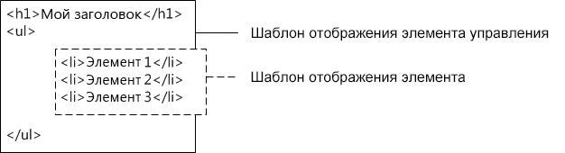

# <a name="sharepoint-design-manager-display-templates"></a><span data-ttu-id="c3232-102">Шаблоны отображения для компонента "Дизайнер" SharePoint</span><span class="sxs-lookup"><span data-stu-id="c3232-102">SharePoint Design Manager display templates</span></span>
<span data-ttu-id="c3232-103">В этой статье описываются шаблоны отображения, в том числе их связь с веб-частями поиска, принципы структурирования шаблонов, способы сопоставления свойств, использования переменных и jQuery, а также создание пользовательских шаблонов отображения в SharePoint.</span><span class="sxs-lookup"><span data-stu-id="c3232-103">Learn about display templates, including: how they relate to Search Web Parts, how the templates are structured, how to map properties and use variables and jQuery, and how to create a custom display template in SharePoint.</span></span>
## <a name="introduction-to-display-templates"></a><span data-ttu-id="c3232-104">Общие сведения о шаблонах отображения</span><span class="sxs-lookup"><span data-stu-id="c3232-104">Introduction to display templates</span></span>
<span data-ttu-id="c3232-105"><a name="bk_introduction"> </a></span><span class="sxs-lookup"><span data-stu-id="c3232-105"><a name="bk_introduction"> </a></span></span>

<span data-ttu-id="c3232-106">Шаблоны отображения в SharePoint — это шаблоны, используемые в веб-частях, использующих технологию поиска (в этой статье они называются веб-частями поиска), для отображения результатов запроса, полученных из индекса поиска.</span><span class="sxs-lookup"><span data-stu-id="c3232-106">Display templates in SharePoint are templates used in Web Parts that use search technology (referred to in this article as Search Web Parts) to show the results of a query made to the search index.</span></span> <span data-ttu-id="c3232-107">Шаблоны отображения указывают, какие управляемые свойства отображаются в результатах поиска и как они выглядят в веб-части.</span><span class="sxs-lookup"><span data-stu-id="c3232-107">Display templates control which managed properties are shown in the search results, and how they appear in the Web Part.</span></span> <span data-ttu-id="c3232-108">Каждый шаблон отображения состоит из двух файлов: версии в формате HTML, которую можно изменить в редакторе HTML, и JS-файла, используемого средой SharePoint.</span><span class="sxs-lookup"><span data-stu-id="c3232-108">Each display template is made of two files: an HTML version of the display template that you can edit in your HTML editor, and a .js file that SharePoint uses.</span></span>
  
> [!NOTE]
> <span data-ttu-id="c3232-p102">Только веб-части поиска могут использовать шаблоны отображения. Веб-часть запрашивания контента не ориентирована на поиск, поэтому не использует шаблоны отображения.</span><span class="sxs-lookup"><span data-stu-id="c3232-p102">Only Search Web Parts can use display templates. The Content Query Web Part is not search-driven, and so does not use display templates.</span></span> 
  
    
    

<span data-ttu-id="c3232-p103">Вы можете просмотреть существующие шаблоны отображения в Дизайнере, но они не создаются в Дизайнере так, как главные страницы и макеты страниц. Для их создания выполните следующие действия.</span><span class="sxs-lookup"><span data-stu-id="c3232-p103">You can view existing display templates in Design Manager, but you don't create them in Design Manager the way that you create master pages and page layouts. Instead, you:</span></span>
  
    
    

- <span data-ttu-id="c3232-113">Откройте  [сопоставленный сетевой диск в коллекции главных страниц](how-to-map-a-network-drive-to-the-sharepoint-master-page-gallery.md).</span><span class="sxs-lookup"><span data-stu-id="c3232-113">Open your  [mapped network drive to the Master Page Gallery](how-to-map-a-network-drive-to-the-sharepoint-master-page-gallery.md).</span></span>
    
  
- <span data-ttu-id="c3232-114">Откройте одну из четырех папок, вложенных в папку **Шаблоны отображения**.</span><span class="sxs-lookup"><span data-stu-id="c3232-114">Open one of the four folders in the **Display Templates** folder.</span></span>
    
    > [!NOTE]
    > <span data-ttu-id="c3232-115">Выбор папки зависит от типа нужного шаблона отображения.</span><span class="sxs-lookup"><span data-stu-id="c3232-115">Note: The folder you choose depends on the type of display template you want to use.</span></span> <span data-ttu-id="c3232-116">Например, если используется публикация на нескольких сайтах, скопируйте шаблон отображения из папки **Веб-части контента**.</span><span class="sxs-lookup"><span data-stu-id="c3232-116">For example, if your site uses cross-site publishing, copy a display template from the **Content Web Parts** folder.</span></span> <span data-ttu-id="c3232-117">Дополнительные сведения см. в статье [Справочник по шаблонам отображения в SharePoint](http://technet.microsoft.com/ru-RU/library/jj944947.aspx).</span><span class="sxs-lookup"><span data-stu-id="c3232-117">For more information, see [Display template reference in SharePoint](http://technet.microsoft.com/ru-RU/library/jj944947.aspx).</span></span> 

- <span data-ttu-id="c3232-p105">Скопируйте HTML-файл для существующего шаблона отображения, который похож на то, что нужно вам. Неважно, куда вы скопируете файл, главное, чтобы целевая папка находилась в **коллекции главных страниц**.</span><span class="sxs-lookup"><span data-stu-id="c3232-p105">Copy the HTML file for an existing display template that's similar to what you want. The exact location that you copy the file to does not matter, as long as it is in the **Master Page Gallery**.</span></span>
    
  
- <span data-ttu-id="c3232-120">Откройте и измените свою копию в HTML-редакторе.</span><span class="sxs-lookup"><span data-stu-id="c3232-120">Open and modify your copy in an HTML editor.</span></span>
    
  
<span data-ttu-id="c3232-p106">Применяя существующий шаблон отображения в качестве отправной точки для нового шаблона, можно воспользоваться полезными сведениями о настройке в комментариях в шаблоне отображения по умолчанию. При этом у вас будет основа для базовых задач, например сопоставления полей ввода. Это также гарантирует, что ваши шаблоны будут использовать правильную структуру главной страницы.</span><span class="sxs-lookup"><span data-stu-id="c3232-p106">By using an existing display template as a starting point for a new display template, you can benefit from helpful information about the customization process in the comments of the default display templates, and you have a framework in place for basic tasks such as mapping input fields. It also guarantees that your templates use the correct basic page structure.</span></span>
  
    
    
<span data-ttu-id="c3232-123">Что происходит, когда вы создаете шаблон отображения, скопировав HTML-файл существующего шаблона в папку **Шаблоны для отображения** в **коллекцию главных страниц**:</span><span class="sxs-lookup"><span data-stu-id="c3232-123">When you create a display template by copying the HTML file for an existing display template in the **Display Templates** folder in the **Master Page Gallery**:</span></span>
  
    
    

- <span data-ttu-id="c3232-124">В том расположении, куда был скопирован HTML-файл, создается JS-файл с таким же именем.</span><span class="sxs-lookup"><span data-stu-id="c3232-124">A .js file that has the same name is created in the location where you copied the HTML file.</span></span>
    
  
- <span data-ttu-id="c3232-125">Вся разметка, необходимая среде SharePoint, добавляется в JS-файл, чтобы шаблон отображения был показан правильно.</span><span class="sxs-lookup"><span data-stu-id="c3232-125">All markup required by SharePoint is added to the .js file so that the display template displays correctly.</span></span>
    
  
- <span data-ttu-id="c3232-126">HTML-файл и JS-файла связываются, чтобы последующие правки HTML-файла синхронизировались с JS-файлом после сохранения HTML-файла.</span><span class="sxs-lookup"><span data-stu-id="c3232-126">The HTML file and the .js file are associated, so that any later edits to the HTML file are synched to the .js file when the HTML file is saved.</span></span>
    
> [!NOTE]
> <span data-ttu-id="c3232-p107">Синхронизация осуществляется только в одном направлении. Изменения HTML шаблона отображения будут синхронизированы со связанным JS-файлом. В отличие от главных страниц и макетов страниц при использовании шаблонов отображения невозможно работать только с JS-файлом, разорвав связь между файлами. Весь HTML- и JavaScript-код необходимо ввести в HTML-файл.</span><span class="sxs-lookup"><span data-stu-id="c3232-p107">The syncing goes in one direction only. Changes to the HTML display template are synched to the associated .js file. Unlike master pages and page layouts, when working with display templates you can't choose to work only with the .js file by breaking the association between the files. You must enter all the HTML and JavaScript in the HTML file.</span></span> 
  
    
    


## <a name="understanding-the-relationship-between-display-templates-and-search-web-parts"></a><span data-ttu-id="c3232-131">Общие сведения об отношении между шаблонами отображения и веб-частями поиска</span><span class="sxs-lookup"><span data-stu-id="c3232-131">Understanding the relationship between display templates and Search Web Parts</span></span>
<span data-ttu-id="c3232-132"><a name="bk_DTandSWP"> </a></span><span class="sxs-lookup"><span data-stu-id="c3232-132"><a name="bk_DTandSWP"> </a></span></span>

<span data-ttu-id="c3232-133">Существует два основных типа шаблонов отображения:</span><span class="sxs-lookup"><span data-stu-id="c3232-133">There are two primary types of display templates:</span></span>
  
    
    

- <span data-ttu-id="c3232-p108">**Шаблоны элементов управления**, которые определяют общую структуру представления результатов. К ним относятся списки, списки с разбиением по страницам и слайд-шоу.</span><span class="sxs-lookup"><span data-stu-id="c3232-p108">**Control templates** determine the overall structure of how the results are presented. Includes lists, lists with paging, and slide shows.</span></span>
    
  
- <span data-ttu-id="c3232-p109">**Шаблоны элементов** определяют, как отображается каждый результат из набора. К ним относятся изображения, текст, видео и другие элементы.</span><span class="sxs-lookup"><span data-stu-id="c3232-p109">**Item templates** determine how each result in the set is displayed. Includes images, text, video, and other items.</span></span>
    
  
<span data-ttu-id="c3232-138">Дополнительные сведения об этих и других шаблонах отображения см. в статье [Справочник по шаблонам отображения в SharePoint](http://technet.microsoft.com/ru-RU/library/jj944947.aspx).</span><span class="sxs-lookup"><span data-stu-id="c3232-138">For more information about these and other display templates, see  [Display template reference in SharePoint](http://technet.microsoft.com/ru-RU/library/jj944947.aspx).</span></span>
  
    
    
<span data-ttu-id="c3232-139">После добавления веб-части поиска на страницу (например, веб-части "Поиск контента") для настройки веб-части необходимо выбрать шаблон отображения элемента управления и шаблон отображения элемента, как показано на рис. 1.</span><span class="sxs-lookup"><span data-stu-id="c3232-139">After you add a Search Web Part (such as the Content Search Web Part) to a page, to configure the Web Part, you select both a control display template and an item display template, as shown in Figure 1.</span></span>
  
    
    

<span data-ttu-id="c3232-140">**Рис. 1. Область инструментов веб-части поиска контента**</span><span class="sxs-lookup"><span data-stu-id="c3232-140">**Figure 1. Tool pane of Content Search Web Part**</span></span>

  
    
    

  
    
    

  
    
    
<span data-ttu-id="c3232-p110">Шаблон отображения элемента управления предоставляет HTML для структурирования общего макета, используемого для отображения результатов поиска. Например, шаблон отображения элемента управления может предоставить HTML для заголовка, а также начала и конца списка. Шаблон отображения элемента управления показывается в веб-части только один раз.</span><span class="sxs-lookup"><span data-stu-id="c3232-p110">The control display template provides HTML to structure the overall layout for how you want to present the search results. For example, the control display template might provide the HTML for a heading and the beginning and end of a list. The control display template is rendered only once in the Web Part.</span></span>
  
    
    
<span data-ttu-id="c3232-p111">Шаблон отображения элемента содержит HTML-код, который определяет способ отображения каждого элемента в результирующем наборе. Например, шаблон отображения элемента может предоставить HTML-код для элемента списка, содержащего рисунок и три строки текста, которые сопоставляются с различными управляемыми свойствами, связанными с элементом. Шаблон отображения элемента отображается один раз для каждого элемента в результирующем наборе. Если результирующий набор содержит 10 элементов, шаблон отображения элемента создает его HTML-раздел десять раз.</span><span class="sxs-lookup"><span data-stu-id="c3232-p111">The item display template provides HTML that determines how each item in the result set is displayed. For example, the item display template might provide the HTML for a list item that contains a picture, and three lines of text that are mapped to different managed properties associated with the item. The item display template is rendered one time for each item in the result set. So, if the result set contains ten items, the item display template creates its section of HTML ten times.</span></span>
  
    
    
<span data-ttu-id="c3232-149">При совместном использовании подобным образом шаблон отображения элемента управления и шаблон отображения элемента создают согласованный HTML-­блок, отображаемый в веб-части, как показано на рис. 2.</span><span class="sxs-lookup"><span data-stu-id="c3232-149">When used together in this way, the control display template and the item display template combine to create a cohesive block of HTML that is rendered in the Web Part, as shown in Figure 2.</span></span>
  
    
    

<span data-ttu-id="c3232-150">**Рис. 2. Комбинированный вывод шаблона отображения элемента и шаблона отображения элемента управления в формате HTML**</span><span class="sxs-lookup"><span data-stu-id="c3232-150">**Figure 2. Combined HTML output of a control display template and item display template**</span></span>

  
    
    

  
    
    

  
    
    
<span data-ttu-id="c3232-152">Дополнительные сведения о шаблонах отображения см. в разделе "Веб-части на основе поиска и шаблоны отображения" в статье  [Обзор модели страниц в SharePoint](overview-of-the-sharepoint-page-model.md).</span><span class="sxs-lookup"><span data-stu-id="c3232-152">For more information about display templates, see the "Search-driven Web Parts and display templates" section in  [Overview of the SharePoint page model](overview-of-the-sharepoint-page-model.md).</span></span>
  
    
    

## <a name="understanding-the-display-template-structure"></a><span data-ttu-id="c3232-153">Структура шаблона отображения</span><span class="sxs-lookup"><span data-stu-id="c3232-153">Understanding the display template structure</span></span>
<span data-ttu-id="c3232-154"><a name="bk_DTstructure"> </a></span><span class="sxs-lookup"><span data-stu-id="c3232-154"><a name="bk_DTstructure"> </a></span></span>

<span data-ttu-id="c3232-p112">HTML-файл, который используется для шаблона отображения  это полностью сформированный HTML-документ, но он не представляет полную веб-страницу HTML. SharePoint преобразует части HTML-файл шаблона отображения в JavaScript. В этом разделе описаны четыре основных раздела шаблона отображения.</span><span class="sxs-lookup"><span data-stu-id="c3232-p112">The HTML file that is used for a display template is a fully-formed HTML document, but it does not represent a full HTML webpage. SharePoint converts the pieces of the display template HTML file into JavaScript. This section describes the four major sections of a display template.</span></span>
  
    
    

### <a name="title-tag"></a><span data-ttu-id="c3232-158">Тег title</span><span class="sxs-lookup"><span data-stu-id="c3232-158">Title tag</span></span>

<span data-ttu-id="c3232-159">Текст в теге **\<title\>** в файле шаблона отображения используется в качестве отображаемого имени в разделе **Шаблоны отображения** области редактирования веб-части, если веб-часть поиска находится в режиме редактирования.</span><span class="sxs-lookup"><span data-stu-id="c3232-159">The text in the **\<title\>** tag in a display template file is used as the display name in the **Display Templates** section of the Web Part edit pane when the Search Web Part is in edit mode.</span></span> <span data-ttu-id="c3232-160">Приведенный ниже пример предназначен для шаблона отображения с именем Item_Picture3Lines.html:</span><span class="sxs-lookup"><span data-stu-id="c3232-160">The following example is for the item display template named Item_Picture3Lines.html:</span></span>
  
    

```HTML

<title>Picture on left, 3 lines on right</title>
```


### <a name="header-properties"></a><span data-ttu-id="c3232-161">Свойства заголовков</span><span class="sxs-lookup"><span data-stu-id="c3232-161">Header properties</span></span>

<span data-ttu-id="c3232-162">Сразу после тега **\<title\>** находится набор настраиваемых элементов, ограниченных следующей разметкой:</span><span class="sxs-lookup"><span data-stu-id="c3232-162">Immediately after the **\<title\>** tag, there is a set of custom elements bounded by the following markup:</span></span>
  
    
    

```HTML
<!--[if gte mso 9]><xml>
<mso:CustomDocumentProperties>
…
</mso:CustomDocumentProperties>
</xml><![endif]-->

```

<span data-ttu-id="c3232-p114">Эти элементы и их свойства предоставляют среде SharePoint важные сведения о шаблоне отображения. В таблице 1 описаны настраиваемые свойства, которые используются в шаблонах отображения.</span><span class="sxs-lookup"><span data-stu-id="c3232-p114">These elements and their properties provide important information to the SharePoint environment about the display template. Table 1 describes the custom properties that are used in display templates.</span></span>
  
> [!NOTE]
> <span data-ttu-id="c3232-p115">Не все настраиваемые свойства используются в каждом шаблоне отображения. Кроме того, некоторые свойства можно, изменив свойства файла шаблона отображения в Дизайнере.</span><span class="sxs-lookup"><span data-stu-id="c3232-p115">Not all custom properties are used in every display template. Also, some properties can be changed by editing the display template file properties in Design Manager.</span></span> 
  
    
    


<span data-ttu-id="c3232-167">**Таблица 1. Список записей CustomDocumentProperties**</span><span class="sxs-lookup"><span data-stu-id="c3232-167">**Table 1. List of CustomDocumentProperties entries**</span></span>


|<span data-ttu-id="c3232-168">**Свойство**</span><span class="sxs-lookup"><span data-stu-id="c3232-168">**Property**</span></span>|<span data-ttu-id="c3232-169">**Описание**</span><span class="sxs-lookup"><span data-stu-id="c3232-169">**Description**</span></span>|
|:-----|:-----|
|<span data-ttu-id="c3232-170">**TemplateHidden**</span><span class="sxs-lookup"><span data-stu-id="c3232-170">**TemplateHidden**</span></span> <br/> |<span data-ttu-id="c3232-p116">Логическое значение, указывающее, следует ли скрыть шаблон отображения из списка доступных шаблонов в веб-части. Это значение можно изменить в свойствах файла шаблона отображения.</span><span class="sxs-lookup"><span data-stu-id="c3232-p116">Boolean value that indicates whether to hide the display template from the list of available templates in the Web Part. This value can be changed in the display template file properties.</span></span>  <br/> |
|<span data-ttu-id="c3232-173">**ManagedPropertyMapping**</span><span class="sxs-lookup"><span data-stu-id="c3232-173">**ManagedPropertyMapping**</span></span> <br/> |<span data-ttu-id="c3232-p117">Сопоставляет поля, предоставляемые элементами результатов поиска в свойствах, доступных для JavaScript. Используется только в шаблонах элементов.</span><span class="sxs-lookup"><span data-stu-id="c3232-p117">Maps fields exposed by search result items into properties available for JavaScript. Used only in item templates.</span></span>  <br/> |
|<span data-ttu-id="c3232-176">**MasterPageDescription**</span><span class="sxs-lookup"><span data-stu-id="c3232-176">**MasterPageDescription**</span></span> <br/> |<span data-ttu-id="c3232-p118">Понятное описание шаблона отображения. Его пользователи увидят в среде редактирования SharePoint. Это значение можно изменить в свойствах файла шаблона отображения.</span><span class="sxs-lookup"><span data-stu-id="c3232-p118">Provides a friendly description of the display template. This is shown to users in the SharePoint editing environment. This value can be changed in the display template file properties.</span></span>  <br/> |
|<span data-ttu-id="c3232-180">**ContentTypeId**</span><span class="sxs-lookup"><span data-stu-id="c3232-180">**ContentTypeId**</span></span> <br/> |<span data-ttu-id="c3232-181">Идентификатор типа контента, связанного с шаблоном отображения.</span><span class="sxs-lookup"><span data-stu-id="c3232-181">The ID of the content type associated with the display template.</span></span>  <br/> |
|<span data-ttu-id="c3232-182">**TargetControlType**</span><span class="sxs-lookup"><span data-stu-id="c3232-182">**TargetControlType**</span></span> <br/> |<span data-ttu-id="c3232-p119">Указывает контекст, в котором используется шаблон отображения. Это значение можно изменить в свойствах файла шаблона отображения.</span><span class="sxs-lookup"><span data-stu-id="c3232-p119">Indicates the context in which the display template is used. This value can be changed in the display template file properties.</span></span>  <br/> |
|<span data-ttu-id="c3232-185">**HtmlDesignAssociated**</span><span class="sxs-lookup"><span data-stu-id="c3232-185">**HtmlDesignAssociated**</span></span> <br/> |<span data-ttu-id="c3232-186">Логическое значение, которое указывает, связан ли с HTML-файлом шаблона отображения JS-файл.</span><span class="sxs-lookup"><span data-stu-id="c3232-186">Boolean value that indicates whether a display template HTML file has a .js file associated with it.</span></span>  <br/> |
|<span data-ttu-id="c3232-187">**HtmlDesignConversionSucceeded**</span><span class="sxs-lookup"><span data-stu-id="c3232-187">**HtmlDesignConversionSucceeded**</span></span> <br/> |<span data-ttu-id="c3232-p120">Указывает, успешно ли выполнено преобразование. Это значение автоматически добавляется в файл SharePoint и используется только в настраиваемых шаблонах отображения.</span><span class="sxs-lookup"><span data-stu-id="c3232-p120">Indicates whether the conversion process was successful. This value is automatically added to the file by SharePoint, and is used only in custom display templates.</span></span>  <br/> |
|<span data-ttu-id="c3232-190">**HtmlDesignStatusAndPreview**</span><span class="sxs-lookup"><span data-stu-id="c3232-190">**HtmlDesignStatusAndPreview**</span></span> <br/> |<span data-ttu-id="c3232-p121">Содержит URL-адрес HTML-файла и текст для столбца **Состояние** ( **Преобразование выполнено успешно** или **Предупреждения и ошибки**). Это значение автоматически добавляется в файл SharePoint и используется только в настраиваемых шаблонах отображения.  </span><span class="sxs-lookup"><span data-stu-id="c3232-p121">Contains the URL to the HTML file and the text for the **Status** column (either **Conversion successful** or **Warnings and Errors**). This value is automatically added to the file by SharePoint, and is used only in custom display templates.  </span></span><br/> |
   

### <a name="script-block"></a><span data-ttu-id="c3232-193">Блок скрипта</span><span class="sxs-lookup"><span data-stu-id="c3232-193">Script block</span></span>
<span data-ttu-id="c3232-194"><a name="bk_scriptblock"> </a></span><span class="sxs-lookup"><span data-stu-id="c3232-194"><a name="bk_scriptblock"> </a></span></span>

<span data-ttu-id="c3232-195">В теге **\<body\>** есть следующий тег **\<script\>**:</span><span class="sxs-lookup"><span data-stu-id="c3232-195">Inside the **\<body\>** tag, you can see the following **\<script\>** tag:</span></span>
  
    
    

```HTML

<script>
     $includeLanguageScript(this.url, "~sitecollection/_catalogs/masterpage/Display Templates/Language Files/{Locale}/CustomStrings.js");
</script>
```

<span data-ttu-id="c3232-196">По умолчанию эта строка включается во все шаблоны отображения.</span><span class="sxs-lookup"><span data-stu-id="c3232-196">By default, this line is included in all display templates.</span></span> <span data-ttu-id="c3232-197">Вы можете добавить больше строк кода в теге **\<script\>**, чтобы ссылаться на CSS-файлы или другие файлы JavaScript за пределами HTML-файла основного шаблона отображения.</span><span class="sxs-lookup"><span data-stu-id="c3232-197">You can add more lines of code inside the **\<script\>** tag to reference CSS files or other JavaScript files outside your main display template HTML file.</span></span> <span data-ttu-id="c3232-198">В таблице 2 показаны примеры того, как включать другие ресурсы.</span><span class="sxs-lookup"><span data-stu-id="c3232-198">Table 2 shows examples for how to include other resources.</span></span>
  
    
    

<span data-ttu-id="c3232-199">**Таблица 2. Примеры включения внешних ресурсов в тег \<script\>**</span><span class="sxs-lookup"><span data-stu-id="c3232-199">**Table 2. Examples for including external resources in the \<script\> tag**</span></span>


|<span data-ttu-id="c3232-200">**Что требуется включить:**</span><span class="sxs-lookup"><span data-stu-id="c3232-200">**If you want to include the following:**</span></span>|<span data-ttu-id="c3232-201">**Используйте следующий код:**</span><span class="sxs-lookup"><span data-stu-id="c3232-201">**Use the following code:**</span></span>|
|:-----|:-----|
|<span data-ttu-id="c3232-202">Файл JavaScript, часть текущего семейства веб-сайтов</span><span class="sxs-lookup"><span data-stu-id="c3232-202">A JavaScript file that is part of the current site collection</span></span>  <br/> | `$includeScript(this.url, "~sitecollection/_catalogs/masterpage/Display Templates/Content Web Parts/MyScripts.js");` <br/> |
|<span data-ttu-id="c3232-203">Внешний файл JavaScript</span><span class="sxs-lookup"><span data-stu-id="c3232-203">An external JavaScript file</span></span>  <br/> | `$includeScript(this.url, "http://www.contoso.com/ExternalScript.js");` <br/> |
|<span data-ttu-id="c3232-204">CSS-файл, часть текущего семейства веб-сайтов</span><span class="sxs-lookup"><span data-stu-id="c3232-204">A CSS file that is part of the current site collection</span></span>  <br/> | `$includeCSS(this.url, "~sitecollection/_catalogs/masterpage/Display Templates/Content Web Parts/MyCSS.css");` <br/> |
|<span data-ttu-id="c3232-205">CSS-файл в расположении, относящемся к текущему шаблону отображения</span><span class="sxs-lookup"><span data-stu-id="c3232-205">A CSS file that is in a location relative to the current display template</span></span>  <br/> | `$includeCSS(this.url,"../../MyStyles/MyCSS.css");` <br/> |
   
> [!NOTE]
> <span data-ttu-id="c3232-206">Если для элементов в коллекции эталонных страниц требуется **утверждение контента**, все файлы ресурсов (включая CSS- и JS-файлы) должны быть опубликованы, прежде чем они станут доступными эталонным страницам и макетам страниц.</span><span class="sxs-lookup"><span data-stu-id="c3232-206">Note: If **Content Approval** is required for items in the Master Page Gallery, all resource files (including CSS and .js files) must be published before they are available to master pages and page layouts.</span></span> <span data-ttu-id="c3232-207">Дополнительные сведения см. в статье [Обязательное утверждение элементов в библиотеке или списке сайта](http://office.microsoft.com/en-us/sharepoint-help/require-approval-of-items-in-a-site-list-or-library-HA102853936.aspx?CTT=1).</span><span class="sxs-lookup"><span data-stu-id="c3232-207">For more information, see [Require approval of items in a site list or library](http://office.microsoft.com/en-us/sharepoint-help/require-approval-of-items-in-a-site-list-or-library-HA102853936.aspx?CTT=1).</span></span> 
  
    
    


### <a name="div-block"></a><span data-ttu-id="c3232-208">Блок DIV</span><span class="sxs-lookup"><span data-stu-id="c3232-208">DIV block</span></span>
<span data-ttu-id="c3232-209"><a name="bk_scriptblock"> </a></span><span class="sxs-lookup"><span data-stu-id="c3232-209"><a name="bk_scriptblock"> </a></span></span>

<span data-ttu-id="c3232-210">После тега **\<script\>** находится тег **\<div\>** с идентификатором.</span><span class="sxs-lookup"><span data-stu-id="c3232-210">Following the **\<script\>** tag is a **\<div\>** tag with an ID.</span></span> <span data-ttu-id="c3232-211">По умолчанию идентификатор этого тега **\<div\>** совпадает с именем HTML-файла.</span><span class="sxs-lookup"><span data-stu-id="c3232-211">By default, the ID for this **\<div\>** tag matches the name of the HTML file.</span></span> <span data-ttu-id="c3232-212">Любое содержимое HTML или код, которые должен предоставлять шаблон отображения, должны быть включены в этот тег **\<div\>**.</span><span class="sxs-lookup"><span data-stu-id="c3232-212">Any HTML or code that you want the display template to provide must be included inside this **\<div\>** tag.</span></span> <span data-ttu-id="c3232-213">Однако сам тег не включается в разметку, отображаемую на веб-странице во время выполнения.</span><span class="sxs-lookup"><span data-stu-id="c3232-213">But, the tag itself is not included in the markup that is rendered on the webpage at run time.</span></span>
  
> [!NOTE]
> <span data-ttu-id="c3232-214">Если вам нужно назначить стиль CSS или идентификатор блоку HTML, отображаемому на странице во время выполнения, можете добавить новый тег в первый тег **\<div\>**.</span><span class="sxs-lookup"><span data-stu-id="c3232-214">Note: If you want to assign a CSS style or an ID to the block of HTML that is rendered on the page at run time, you can add a new tag inside the first **\<div\>** tag.</span></span> <span data-ttu-id="c3232-215">Вы также можете назначить стиль CSS или идентификатор коду HTML вокруг переменной `_#= ctx.RenderGroups(ctx) =#_` в шаблоне элемента управления.</span><span class="sxs-lookup"><span data-stu-id="c3232-215">You can also assign a CSS style or an ID to the HTML that surrounds the variable `_#= ctx.RenderGroups(ctx) =#_` in the control template.</span></span> <span data-ttu-id="c3232-216">Переменная `_#= ctx.RenderGroups(ctx) =#_` используется для отображения содержимого HTML вокруг результатов запроса, отображаемых шаблоном элемента.</span><span class="sxs-lookup"><span data-stu-id="c3232-216">The variable `_#= ctx.RenderGroups(ctx) =#_` is used to render the HTML that surrounds the query results that are rendered by the item template.</span></span>
  
    
    

<span data-ttu-id="c3232-217">В первом теге **\<div\>** вы увидите код внутри блоков комментариев, начинающихся с тега **\<!--#\_** и заканчивающихся тегом **\_#--\>**.</span><span class="sxs-lookup"><span data-stu-id="c3232-217">In the first **\<div\>** tag you'll see code inside comment blocks that begin with **\<!--#\_** and end with **\_#--\>**.</span></span> <span data-ttu-id="c3232-218">Код JavaScript используется внутри этих блоков, а HTML — за их пределами.</span><span class="sxs-lookup"><span data-stu-id="c3232-218">You use JavaScript code inside these blocks, and HTML outside the blocks.</span></span> <span data-ttu-id="c3232-219">С помощью этих блоков также можно управлять содержимым HTML, используя условные операторы.</span><span class="sxs-lookup"><span data-stu-id="c3232-219">You can also use these blocks to control the HTML with conditional statements.</span></span> <span data-ttu-id="c3232-220">Для этого добавьте блок комментариев с условным оператором и открывающей скобкой, за которой следует код HTML, а затем еще один блок комментариев с закрывающей скобкой.</span><span class="sxs-lookup"><span data-stu-id="c3232-220">To do this, use a comment block with the conditional statement and opening bracket, followed by HTML, followed by another comment block with the closing bracket.</span></span> <span data-ttu-id="c3232-221">В приведенном ниже примере тег привязки отображается на странице, только если значение объекта **linkURL** не является пустым.</span><span class="sxs-lookup"><span data-stu-id="c3232-221">In the following example, the anchor tag is rendered on the page only if the value for the **linkURL** object is not empty.</span></span>
  
    
    


```HTML

<!--#_
if(!linkURL.isEmpty)
{
_#-->
     <a class="cbs-pictureImgLink" href="_#= linkURL =#_" title="_#= $htmlEncode(line1.defaultValueRenderer(line1)) =#_" id="_#= pictureLinkId =#_">
<!--#_
}
_#-->

```


## <a name="mapping-input-properties-and-getting-their-values"></a><span data-ttu-id="c3232-222">Сопоставление входных свойств и получение их значений</span><span class="sxs-lookup"><span data-stu-id="c3232-222">Mapping input properties and getting their values</span></span>
<span data-ttu-id="c3232-223"><a name="bk_mapproperties"> </a></span><span class="sxs-lookup"><span data-stu-id="c3232-223"><a name="bk_mapproperties"> </a></span></span>

<span data-ttu-id="c3232-224">Раздел заголовка в шаблоне отображения элемента содержит настраиваемое свойство документа с именем **ManagedPropertyMapping**.</span><span class="sxs-lookup"><span data-stu-id="c3232-224">The header section of an item display template has a custom document property named **ManagedPropertyMapping**.</span></span> <span data-ttu-id="c3232-225">Это свойство принимает управляемые свойства, используемые для поиска, и сопоставляет их со значениями, которые может использовать шаблон отображения.</span><span class="sxs-lookup"><span data-stu-id="c3232-225">This property takes the managed properties that are used by search and maps them to values that can be used by the display template.</span></span> <span data-ttu-id="c3232-226">Свойство — это разделенный запятыми список значений в следующем формате: ' _отображаемое имя свойства_'{ _имя свойства_}:' _управляемое свойство_'.</span><span class="sxs-lookup"><span data-stu-id="c3232-226">The property is a comma-delimited list of values that uses the following format: ' _property display name_'{ _property name_}:' _managed property_'.</span></span> <span data-ttu-id="c3232-227">Пример: `'Picture URL'{Picture URL}:'PublishingImage;PictureURL;PictureThumbnailURL'`.</span><span class="sxs-lookup"><span data-stu-id="c3232-227">For example,  `'Picture URL'{Picture URL}:'PublishingImage;PictureURL;PictureThumbnailURL'`.</span></span>
  
    
    
<span data-ttu-id="c3232-228">Рассмотрим этот формат подробнее:</span><span class="sxs-lookup"><span data-stu-id="c3232-228">Let's look at the format in more detail:</span></span>
  
    
    

-  <span data-ttu-id="c3232-229">_Отображаемое имя свойства_ — это имя свойства, которое отображается в области редактирования веб-части при выборе шаблона отображения.</span><span class="sxs-lookup"><span data-stu-id="c3232-229">_property display name_ is the property name that shows in the Web Part editing pane when the display template is selected.</span></span>
    
  
-  <span data-ttu-id="c3232-p128">_Имя свойства_ — это идентификатор, который использует локализованные строковые ресурсов, чтобы найти имя управляемого свойства. Это также значение, отображаемое в разделе **Сопоставления свойств** меню "Параметры веб-части". Вы можете ввести другое значение в параметрах веб-части, чтобы изменить управляемое свойство, связанное с полем, которое отображается в веб-части.</span><span class="sxs-lookup"><span data-stu-id="c3232-p128">_property name_ is an identifier that uses localized string resources to look up the name of the managed property. It is also the value that appears in the **Property Mappings** section of the Web Part settings menu. When you edit the settings for a Web Part, you can change this value to change what managed property is associated with the field that appears in the Web Part.</span></span>
    
  
-  <span data-ttu-id="c3232-p129">_Управляемое свойство_ — это строка из одного или нескольких управляемых свойств, разделенных точкой с запятой. Во время выполнения этот список вычисляется слева направо, а первое значение, соответствующее имени управляемого свойства текущего элемента поиска, будет сопоставлено с этим сегментов. Это позволяет создать шаблон отображения, который может работать с несколькими типами элементов и использовать унифицированный способ визуализации при наличии совместимых свойств.</span><span class="sxs-lookup"><span data-stu-id="c3232-p129">_managed property_ is a string of one or more managed properties, separated by semicolons. At run time, the list is evaluated from left to right, and the first value that matches the name of a managed property of the current search item will have its value mapped to this slot. This enables you to write a display template that can work with multiple item types and that can use consistent rendering if compatible properties are present.</span></span>
    
  
<span data-ttu-id="c3232-236">После сопоставления свойства его значение можно получить в скрипте, используя следующий код:  `var pictureURL = $getItemValue(ctx, "Picture URL");`</span><span class="sxs-lookup"><span data-stu-id="c3232-236">After you map a property, you can get its value in script by using the following code:  `var pictureURL = $getItemValue(ctx, "Picture URL");`</span></span>
  
    
    
<span data-ttu-id="c3232-p130">Второй параметр, который передается **$getItemValue()**, должен соответствовать отображаемому имени свойства в одинарных кавычках, которое используется в элементе **ManagedPropertyMapping**. В этом примере **Picture URL**  это имя свойства, которое передается **$getItemValue()**.</span><span class="sxs-lookup"><span data-stu-id="c3232-p130">The second parameter that is passed to **$getItemValue()** must match the property display name in single quotes used in the **ManagedPropertyMapping** element. In this example, **Picture URL** is the property name that is passed to **$getItemValue()**.</span></span>
  
    
    
<span data-ttu-id="c3232-p131">Этот код возвращает объект сведений о значении ( **valueInfoObj**). Он содержит необработанное представление входного значения, а также значение, к которому применена кодировка по умолчанию.</span><span class="sxs-lookup"><span data-stu-id="c3232-p131">This code returns a value information object ( **valueInfoObj**). This object contains a raw representation of the input value, together with the value with a default encoding applied to it.</span></span>
  
    
    
<span data-ttu-id="c3232-p132">Переменные в разделах JavaScript можно использовать, как и обычно, для обработки переменных и создания HTML-строк, которые будут отображаться на странице во время выполнения. Но чтобы ссылаться на переменные, объявленные в скрипте непосредственно в HTML-коде, необходимо использовать следующий формат: _#=  _variableName_ =#_. Например, чтобы использовать переменную **pictureURL** как значение изображения, воспользуйтесь следующим HTML-кодом: ``</span><span class="sxs-lookup"><span data-stu-id="c3232-p132">You can use variables within the sections of JavaScript as you typically would, to manipulate variables and create HTML strings to be rendered on the page at run time. But, to reference variables declared in the script directly in the HTML, you must use the following format: _#=  _variableName_ =#_. For example, to use the variable **pictureURL** as the value for an image, you use the following HTML: ``</span></span>
  
    
    

## <a name="using-jquery-with-display-templates"></a><span data-ttu-id="c3232-244">Использование jQuery с шаблонами отображения</span><span class="sxs-lookup"><span data-stu-id="c3232-244">Using jQuery with display templates</span></span>
<span data-ttu-id="c3232-245"><a name="bk_jQuery"> </a></span><span class="sxs-lookup"><span data-stu-id="c3232-245"><a name="bk_jQuery"> </a></span></span>

<span data-ttu-id="c3232-p133">jQuery можно использовать с шаблонами отображения, но при этом необходимо учитывать два важных фактора:</span><span class="sxs-lookup"><span data-stu-id="c3232-p133">You can use jQuery with your display templates. But, be aware of two important factors:</span></span>
  
    
    

- <span data-ttu-id="c3232-248">для включения библиотеки jQuery в шаблон отображения следуйте инструкциям, описанным в разделе  [Блок скрипта](#bk_scriptblock) выше;</span><span class="sxs-lookup"><span data-stu-id="c3232-248">To include the jQuery libraries in your display template, follow the directions described in the  [Script block](#bk_scriptblock) section, earlier in this article.</span></span>
    
  
- <span data-ttu-id="c3232-249">при использовании селекторов идентификатора в jQuery воспользуйтесь следующим кодом для создания переменной для идентификатора:  `var containerQueryId = '#' + '_#= containerId =#_';`.</span><span class="sxs-lookup"><span data-stu-id="c3232-249">If you use ID selectors in jQuery, use the following code to create a variable for the ID:  `var containerQueryId = '#' + '_#= containerId =#_';`</span></span>
    
    <span data-ttu-id="c3232-250">Для ссылки на селектор в jQuery используйте следующий код:  `$('_#= containerQueryId =#_')`</span><span class="sxs-lookup"><span data-stu-id="c3232-250">Use the following code to reference the selector in jQuery:  `$('_#= containerQueryId =#_')`</span></span>
    
  

## <a name="create-a-display-template"></a><span data-ttu-id="c3232-251">Создание шаблона отображения</span><span class="sxs-lookup"><span data-stu-id="c3232-251">Create a display template</span></span>
<span data-ttu-id="c3232-252"><a name="bk_createDT"> </a></span><span class="sxs-lookup"><span data-stu-id="c3232-252"><a name="bk_createDT"> </a></span></span>

<span data-ttu-id="c3232-p134">Перед созданием шаблона отображения с помощью следующей процедуры необходимо создать сопоставленный сетевой диск, который указывает на **коллекцию главных страниц**. Дополнительные сведения см. в разделе  [Как: сопоставление сетевого диска коллекции главных страниц SharePoint](how-to-map-a-network-drive-to-the-sharepoint-master-page-gallery.md).</span><span class="sxs-lookup"><span data-stu-id="c3232-p134">Before you can create a display template by using the following procedure, you must have a mapped network drive that points to the **Master Page Gallery**. For more information, see  [How to: Map a network drive to the SharePoint Master Page Gallery](how-to-map-a-network-drive-to-the-sharepoint-master-page-gallery.md).</span></span>
  
    
    

### <a name="to-create-a-display-template"></a><span data-ttu-id="c3232-255">Создание шаблона отображения</span><span class="sxs-lookup"><span data-stu-id="c3232-255">To create a display template</span></span>


1. <span data-ttu-id="c3232-256">С помощью проводника Windows откройте сетевой диск, сопоставленный с **коллекцией главных страниц**.</span><span class="sxs-lookup"><span data-stu-id="c3232-256">Using Windows Explorer, open the mapped network drive to the **Master Page Gallery**.</span></span>
    
  
2. <span data-ttu-id="c3232-257">Откройте папку **Шаблоны отображения**, а затем — папку **Веб-части контента**.</span><span class="sxs-lookup"><span data-stu-id="c3232-257">Open the **Display Templates** folder, and then open the **Content Web Parts** folder.</span></span>
    
  
3. <span data-ttu-id="c3232-258">Скопируйте HTML-файл шаблона отображения, подобный тому, который требуется создать.</span><span class="sxs-lookup"><span data-stu-id="c3232-258">Copy the HTML file for a display template that is similar to what you want to create.</span></span> <span data-ttu-id="c3232-259">Список стандартных шаблонов отображения и их описания см. в статье [Справочник по шаблонам отображения в SharePoint](http://technet.microsoft.com/ru-RU/library/jj944947.aspx).</span><span class="sxs-lookup"><span data-stu-id="c3232-259">For a list of the default display templates and their descriptions, see  [Display template reference in SharePoint](http://technet.microsoft.com/ru-RU/library/jj944947.aspx).</span></span>
    
    <span data-ttu-id="c3232-260">На этом этапе SharePoint копирует HTML-файл в JS-файл с таким же именем.</span><span class="sxs-lookup"><span data-stu-id="c3232-260">At this point, SharePoint copies the HTML file into a .js file that has the same name.</span></span> <span data-ttu-id="c3232-261">Например, если имя скопированного HTML-файла — Item_Picture3Line_copy.html, то также создается соответствующий JS-файл с именем Item_Picture3Lines_copy.js.</span><span class="sxs-lookup"><span data-stu-id="c3232-261">For example, if the copied HTML file is named Item_Picture3Line_copy.html, a corresponding .js file named Item_Picture3Lines_copy.js is also created.</span></span> <span data-ttu-id="c3232-262">Если переименовать файл, соответствующий JS-файл также меняется.</span><span class="sxs-lookup"><span data-stu-id="c3232-262">If you choose to rename the file, the corresponding .js file name also changes.</span></span>
    
  
4. <span data-ttu-id="c3232-p137">Чтобы настроить шаблон отображения, измените HTML-файл, который находится на сервере. Для этого откройте и измените HTML-файл на сопоставленном диске с помощью HTML-редактора. Каждый раз при сохранении HTML-файл все изменения синхронизируются со связанным JS-файлом.</span><span class="sxs-lookup"><span data-stu-id="c3232-p137">To customize the display template, edit the HTML file that resides on the server by using an HTML editor to open and edit the HTML file in the mapped drive. Each time that you save the HTML file, any changes are synched to the associated .js file.</span></span>
    
  
5. <span data-ttu-id="c3232-265">Перейдите на сайт публикации.</span><span class="sxs-lookup"><span data-stu-id="c3232-265">Browse to your publishing site.</span></span>
    
  
6. <span data-ttu-id="c3232-266">В правом верхнем углу страницы выберите пункт **Параметры**, а затем выберите **Дизайнер**.</span><span class="sxs-lookup"><span data-stu-id="c3232-266">In the upper-right corner of the page, choose **Settings**, and then choose **Design Manager**.</span></span>
    
  
7. <span data-ttu-id="c3232-p138">В левой области навигации Дизайнера щелкните **Изменить шаблоны отображения**. Появится HTML-файл со столбцом **Состояние**, в котором отображается одно из двух состояний:</span><span class="sxs-lookup"><span data-stu-id="c3232-p138">In Design Manager, in the left navigation pane, choose **Edit Display Templates**. Your HTML file now appears with a **Status** column that shows one of two statuses:</span></span>
    
  - <span data-ttu-id="c3232-269">**Предупреждения и ошибки**;</span><span class="sxs-lookup"><span data-stu-id="c3232-269">**Warnings and Errors**</span></span>
    
  
  - <span data-ttu-id="c3232-270">**Преобразование выполнено успешно**.</span><span class="sxs-lookup"><span data-stu-id="c3232-270">**Conversion successful**</span></span>

    > [!NOTE]
    > <span data-ttu-id="c3232-p139">В отличие от главных страниц и макетов страниц вы не можете использовать страницу предварительного просмотра для динамического изучения шаблона отображения на сервере. Для предварительного просмотра шаблона необходимо добавить веб-часть поиска контента на страницу и применить шаблон в области редактирования веб-части поиска контента. Если шаблон отображения содержит ошибки, в веб-части поиска контента появится сообщение об ошибке. Исправьте ошибки, чтобы шаблон отображался правильно.</span><span class="sxs-lookup"><span data-stu-id="c3232-p139">Unlike master pages and page layouts, you can't use the preview page to see a live server-side preview of your display template. To preview the display template, you must add a Content Search Web Part to a page, and then apply the display template in the Content Search Web Part edit pane. If there are any errors in the display template, the Content Search Web Part displays an error message. Errors must be fixed before the display template can display correctly.</span></span> 

8. <span data-ttu-id="c3232-p140">Чтобы исправить ошибки, отредактируйте HTML-файл, который находится на сервере, в HTML-редакторе, чтобы открыть и изменить HTML-файл на сопоставленном диске. Сохраните шаблон отображения и перезагрузите страницу, содержащую веб-часть поиска контента, которая использует шаблон отображения.</span><span class="sxs-lookup"><span data-stu-id="c3232-p140">To fix any errors, edit the HTML file that resides on the server by using an HTML editor to open and edit the HTML file on the mapped drive. Save the display template, and then reload the page that contains the Content Search Web Part that uses the display template.</span></span>
    
  

## <a name="see-also"></a><span data-ttu-id="c3232-277">См. также</span><span class="sxs-lookup"><span data-stu-id="c3232-277">See also</span></span>
<span data-ttu-id="c3232-278"><a name="bk_addresources"> </a></span><span class="sxs-lookup"><span data-stu-id="c3232-278"><a name="bk_addresources"> </a></span></span>

-  [<span data-ttu-id="c3232-279">Обзор Дизайнера в SharePoint</span><span class="sxs-lookup"><span data-stu-id="c3232-279">Overview of Design Manager in SharePoint</span></span>](overview-of-design-manager-in-sharepoint.md)
-  [<span data-ttu-id="c3232-280">Разработка макета сайта в SharePoint</span><span class="sxs-lookup"><span data-stu-id="c3232-280">Develop the site design in SharePoint</span></span>](develop-the-site-design-in-sharepoint.md)
-  [<span data-ttu-id="c3232-281">Инструкции. Преобразование HTML-файла в эталонную страницу SharePoint</span><span class="sxs-lookup"><span data-stu-id="c3232-281">How to: Convert an HTML file into a master page in SharePoint</span></span>](how-to-convert-an-html-file-into-a-master-page-in-sharepoint.md)
-  [<span data-ttu-id="c3232-282">Инструкции. Создание макета страницы в SharePoint</span><span class="sxs-lookup"><span data-stu-id="c3232-282">How to: Create a page layout in SharePoint</span></span>](how-to-create-a-page-layout-in-sharepoint.md)
-  [<span data-ttu-id="c3232-283">Фирменная символика и конструкция возможности дизайнер SharePoint</span><span class="sxs-lookup"><span data-stu-id="c3232-283">SharePoint Design Manager branding and design capabilities</span></span>](sharepoint-design-manager-branding-and-design-capabilities.md)
    
  

