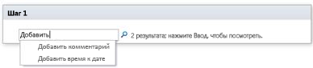

# Краткий справочник по действиям рабочего процесса (платформа рабочих процессов SharePoint 2010)Workflow actions quick reference (SharePoint 2010 Workflow platform)
Сведения о действиях рабочих процессов, доступных на платформе рабочих процессов SharePoint 2010 в Microsoft SharePoint Designer 2013. Используйте эту статью, *только* если вы работаете в SharePoint Designer 2013, но хотите и далее использовать платформу рабочих процессов SharePoint 2010. Если вы хотите использовать платформу рабочих процессов SharePoint, см. статью [Краткий справочник по действиям рабочего процесса (платформа рабочих процессов SharePoint)](workflow-actions-quick-reference-sharepoint-workflow-platform.md), а также другие статьи о новых функциях этой платформы, указанные в разделе "Дополнительные ресурсы". Чтобы приступить к созданию рабочего процесса с помощью платформы рабочих процессов SharePoint 2010, выберите элемент **Рабочий процесс SharePoint 2010** в поле **Тип платформы** диалогового окна **Создание рабочего процесса**.Learn about the workflow actions that are available in the SharePoint 2010 Workflow Platform in Microsoft SharePoint Designer 2013.Use this article  *only*  if you are working in SharePoint Designer 2013, but want to continue to use the SharePoint 2010 Workflow Platform.If instead you want to use the SharePoint Workflow Platform, see  [Workflow actions quick reference (SharePoint Workflow platform)](workflow-actions-quick-reference-sharepoint-workflow-platform.md), along with other articles (mentioned in the "Additional resources" section.md) about new features that are available in the newer platform.To begin creating a workflow by using the 2010 Workflow Platform, select **SharePoint 2010 Workflow** in the **Platform Type** box in the **Create Workflow** dialog box.
## Где найти действия рабочих процессовWhere to find the workflow actions

Открыть меню доступных действий рабочих процессов можно двумя способами.There are two ways to access the menu of available workflow actions.
  
    
    
При редактировании в шаге рабочего процесса выполните одно из следующих действий:While you are editing inside a workflow step, do one of the following:
  
    
    

- На вкладке **Рабочий процесс** нажмите в группе **Вставка** кнопку **Действия**.On the **Workflow** tab, in the **Insert** group, click **Actions**.
    
  
- Дважды щелкните в области шага рабочего процесса. В появившемся поле поиска введите текст, который присутствует в нужном имени действия (например, "добавить") и нажмите клавишу ВВОД. Под текстовым полем появятся действия и условия, которые содержат введенный текст.Double-click inside the workflow step. In the search box that appears, type text that appears in the name of the action that you want (such as "add"), and then press Enter. Actions and conditions that contain the text that you typed appear below the text box.
    
  
  

  

  
Действия, доступные при создании рабочего процесса, зависят от текущего контекста. Например, действия **Начать процесс утверждения** и **Начать процесс сбора отзывов** недоступны для сайтов, созданных в Microsoft SharePoint Foundation 2013. Некоторые действия со списками доступны только в шаге олицетворения, а другие  только если рабочий процесс связан с библиотекой документов или типом содержимого документов. Действия со списками, работающие с текущим элементом, например **Изменить состояние утверждения контента** и **Задать поле в текущем элементе**, недоступны в рабочем процессе сайта.The actions available to you during workflow creation depend on the current context. For example, the **Start Approval Process** and **Start Feedback Process** actions are not available for sites that are based on Microsoft SharePoint Foundation 2013. Some list actions are available only inside an impersonation step, and others are available only when your workflow is associated with a document library or document content type. List actions that work on the current item, such as **Set Content Approval Status** and **Set Field in Current Item**, are not available in a site workflow.
  
    
    
Действия делятся на категории в зависимости от области их применения в рабочем процессе. Например, действия, влияющие на поведение элемента, входят в категорию **Действия со списками**, действия, связанные с наборами документов,  в категорию **Действия с наборами документов**, а пользовательские действия рабочих процессов  в категорию **Настраиваемые действия**. Действия делятся на следующие категории:Actions are organized into categories based on their area of application in a workflow. For example, actions that affect an item's behavior are listed under **List Actions**, actions pertinent to Document Sets under **Document Set Actions**, and custom workflow actions under **Custom Actions**. The categories for actions are:
  
    
    

- "Основные действия".Core Actions
    
  
- "Действия с наборами документов" (отображается, только если рабочий процесс связан с библиотекой документов или типом содержимого документов).Document Set Actions (appear only when your workflow is associated with a document library or a document content type)
    
  
- "Действия со списками".List Actions
    
  
-  "Действия с отношениями" (отображается, только если сайт работает под управлением SharePoint).Relational Actions (appear only when your SharePoint site is running SharePoint)
    
  
- "Действия с задачами" (отображается, только если сайт работает под управлением SharePoint).Task Actions (appear only when your SharePoint site is running SharePoint)
    
  
- "Действия управления задачами" (отображается только при настройке задач во встроенных действиях рабочих процессов, например **Начать процесс утверждения** и **Начать процесс сбора отзывов**).Task Behavior Actions (appear only when you are customizing tasks in pre-built workflow actions, such as **Start Approval Process** and **Start Feedback Process**)
    
  
- "Вспомогательные действия".Utility Actions
    
  
- "Настраиваемые действия".Custom Actions
    
  

## "Общие действия".General actions

"Общие действия" — это действия, которые отображаются в списке "Действия" во всех контекстах рабочих процессов.General actions are actions that display in the Actions list in all workflow contexts.
  
    
    

|**Действие****Action**|**Описание****Description**|
|:-----|:-----|
|<u>**Основные действия**</u><u>**Core Actions**</u>   |Действия из этой категории чаще всего используются в рабочих процессах.Actions in this category are the ones most commonly used in workflows.    |
|Добавить комментарийAdd a comment    | Это действие изначально отображается в шаге рабочего процесса как **Примечание: текст примечания**. С помощью этого действия можно оставлять в конструкторе рабочих процессов информативные примечания для справки. Это особенно полезно, если над рабочим процессом совместно работает несколько пользователей. Например, если переменная в текущем рабочем процессе имеет непонятное имя, то с помощью этого действия вы можете добавить примечание, обозначающее роль переменной в рабочем процессе.This action is initially displayed in a workflow step as **Comment: comment text**. Use this action to leave informative comments in the workflow designer for reference purposes. This is especially helpful when there are other users co-authoring the workflow. For example, if a variable in the current workflow doesn't have a user-friendly name, you can use this action to add a comment to indicate what the variable does in the workflow.     Ниже представлен пример того, как может выглядеть действие на этапе рабочего процесса.Following is an example of what the action might look like in a workflow step:   – Примечание: эта переменная указывает отдел инициатора рабочих процессов.- Comment: This variable provides the department of the workflows initiator.   **Примечание.** Любой пользователь, который редактирует рабочий процесс в Microsoft Visio 2013, также сможет просматривать примечания.**Note:** Anyone editing the workflow in Microsoft Visio 2013 will also be able to view the comments.          |
|Добавить время к датеAdd Time to Date    | Это действие изначально отображается в шаге рабочего процесса как **Добавить 0 минут к дате (вывод в переменную: дата)**. С помощью этого действия можно добавить указанное число минут, часов, дней, месяцев или лет к значению даты и сохранить возвращаемое значение в переменной. Значение даты, к которому добавляется время, может быть текущей датой или результатом поиска.This action is initially displayed in a workflow step as **Add 0 minutes to date (Output to Variable: date)**. Use this action to add a specified number of minutes, hours, days, months, or years to a date value and to store the output value in a variable. The date value to which the time is added can be the current date, a specified date, or the result of a lookup.     Ниже представлен пример того, как может выглядеть действие на этапе рабочего процесса.Following is an example of what the action might look like in a workflow step:   – Добавить <u>7дней</u> к <u>Текущий элемент:Изменен</u> (с выводом в <u>Переменная: Неделя после изменения</u>)- Add <u>7 days</u> to <u>Current Item:Modified</u> (Output to: <u>Variable: A week from Modified</u>)    |
|ВычислитьDo Calculation    | Изначально это действие отображается в шаге рабочего процесса как **Вычислить значение плюс значение (вывод в переменную: выч)**. С помощью этого действия можно выполнить вычисление с использованием двух значение и сохранить результат в переменной. Доступные операции включают сложение, вычитание, умножение и деление.This action is initially displayed in a workflow step as **Calculate value plus value (output to Variable: calc)**. Use this action to perform a calculation using two values and to store the output value in a variable. Possible calculations include addition, subtraction, multiplication, and division.     Ниже представлены примеры того, как это действие может выглядеть на этапе рабочего процесса.Following are examples of what the action might look like in a workflow step:   – Вычислить <u>36 разделить на 9</u> (с выводом в <u>Переменная:Количество мини-приложений<u>)- Calculate <u>36divided by9</u> (Output to <u>Variable:Number of Widgets<u>/)    – Вычислить [fx :: Курсы*, Заполненные места] плюс 1 (с выводом в Переменная: Новые заполненные места)- Calculate [fx :: Courses*, Filled Seats] plus 1 (Output to Variable: New Filled Seats)   |
|Записать в журналLog to History List    | Изначально это действие отображается в шаге рабочего процесса как **Записать это сообщение в журнал рабочего процесса**. С помощью этого действия можно записать в журнал рабочего процесса сообщение о его действиях или ходе выполнения. Сообщение может содержать сводку события рабочего процесса или другие необходимые сведения о текущем выполнении рабочего процесса. Такие сообщения могут быть полезны устранении неполадок рабочих процессов. Например, вы можете записать сообщение о таком событии, как **Скопировано в список A** или **Сообщение отправлено подписчикам**. После успешного завершения рабочего процесса вы можете перейти к списку **Журнал рабочего процесса** и просмотреть сообщения в столбце **Описание**.  This action is initially displayed in a workflow step as **Log this message to the workflow history list**. Use this action to log a message in the workflow's history list about the workflow's actions or progress. The message can be a summary of a workflow event, or anything else that you want to capture about the current run of the workflow. Such messages can be helpful in troubleshooting workflow issues. For example, you can log a message that records an event like **Copied to list A** or **Sent email to reviewers**. After the workflow completes successfully, you can go to the **Workflow History** list and see the messages displayed in the **Description** column.    Ниже представлен пример того, как может выглядеть действие на этапе рабочего процесса.Following is an example of what the action might look like in a workflow step:   – Записать <u>набор переменных Неделя после изменения</u> в журнал рабочего процесса- Log <u>A week from Modified variable set</u> to the workflow history list   **Примечание.** Если вам нужно остановить рабочий процесс, а затем записать сообщение в журнал, используйте действие **Остановить рабочий процесс**.**Note:**  If you want an action that stops the workflow and then logs a message to the history list, use the **Stop Workflow** action instead.          |
|Сделать паузу в течение интервала времениPause for Duration    |Изначально это действие отображается в шаге рабочего процесса как **Сделать паузу в течение 0 дней, 0 часов, 5 минут**. С помощью этого действия можно приостановить рабочий процесс на время, указанное в днях, часах и минутах.This action is initially displayed in a workflow step as **Pause for 0 days, 0 hours, 5 minutes**. Use this action to pause the workflow for a duration specified as a number of days, hours, and minutes.    **Примечание.** Отображаемое изначально время задержки отражает интервал задания таймера, который по умолчанию составляет пять минут.**Note:** The delay time that is initially displayed reflects the timer job interval, which has a default value of five minutes.           |
|Сделать паузу до датыPause until Date    | Изначально это действие отображается в шаге рабочего процесса как **Сделать паузу до этого времени**. С помощью этого действия можно приостановить рабочий процесс до определенной даты. Вы можете использовать текущую дату, указанную дату или результат поиска.This action is initially displayed in a workflow step as **Pause until this time**. Use this action to pause the workflow until a particular date. You can use the current date, a specified date, or the result of a lookup.     Ниже представлены примеры того, как это действие может выглядеть на этапе рабочего процесса.Following are examples of what the action might look like in a workflow step:   – Сделать паузу до <u>1.1.2010 12:00:00</u>- Pause until <u>1/1/2010 12:00:00 AM</u>   – Сделать паузу до <u>Переменная: Неделя после изменения</u>- Pause until <u>Variable: A week from Modified</u>   |
|Отправить сообщение электронной почтыSend an Email    | Изначально это действие отображается в шаге рабочего процесса как **Отправить сообщение электронной почты этим пользователям**. С помощью этого действия можно отправить сообщение электронной почты пользователю или группе. Оно часто используется для отправки сообщения с подтверждением участникам рабочего процесса. Получателем сообщения может быть пользователь или группа в семействе веб-сайтов либо любой пользователь в организации. Теперь вы можете указать в теме динамическое значение, например поиск строки.This action is initially displayed in a workflow step as **Email these users**. Use this action to send an email message to a user or a group. It is commonly used to send a confirmation message to workflow participants. Email recipients can be a user or a group within the site collection, or anyone inside your organization. You can now specify a dynamic value, such as a lookup or a string, in your subject.    **Важно!** Исходящую электронную почту необходимо настроить в Центре администрирования SharePoint.**Important:**  Outgoing e-mail must be configured in SharePoint Central Administration.           Ниже представлен пример того, как может выглядеть действие на этапе рабочего процесса.Following is an example of what the action might look like in a workflow step:   – Отправить сообщение электронной почты <u>Переменная: утверждающие</u>- Email <u>Variable: approvers</u>   |
|Задать время для поля даты и времениSet Time Portion of Date/Time Field    | Изначально это действие отображается в шаге рабочего процесса как **Задать время 00:00 для даты (вывод в переменную: дата1)**. С помощью этого действия можно создать временную метку и сохранить значение вывода в переменную. Вы можете задать время в часах и минутах, а также прибавить текущую дату, указанную дату или результат поиска. Допустим, вам нужно добавлять временную метку к каждому новому заказу, добавленному в список. Вместо того чтобы использовать во временной метке текущее время получения заказа, нужно добавить определенное время, чтобы рабочий процесс мог выполнять любую операцию (например, отправлять заказы на склад) со всеми новыми элементами с такой же временной меткой. Другой пример: допустим, у вас запланирована презентация на 9 часов утра в определенный день, и вы хотите получить напоминание по электронной почте. С помощью этого действия вы можете прибавить время к дате, приостановить рабочий процесс до момента, когда до презентации останутся сутки, а затем отправить себе напоминание с его помощью.This action is initially displayed in a workflow step as **Set time as 00:00 for date (Output to Variable: date1)**. Use this action to create a timestamp and to store the output value in a variable. You can set the time in hours and minutes and add the current date, a specified date, or the result of a lookup. For example, suppose you want to add a timestamp to any new customer order that is added to an orders list. Instead of using the current time when the order was actually received in the timestamp, you want to add a specific time so that you can have your workflow perform any operation (such as routing orders to the warehouse) on all new items that have the same timestamp. Another example: Suppose that you have a presentation scheduled for 9 a.m. on a particular day, and you want to receive an email reminder. You can use this action to add the time to the date, pause the workflow till the day before the presentation, and then have the workflow send you the reminder.     Ниже представлен пример того, как может выглядеть действие на этапе рабочего процесса.Following is an example of what the action might look like in a workflow step:   – Задать время <u>00</u>: <u>00</u> для <u>Текущий элемент:Изменен</u> (с выводом в <u>Переменная времени изменения, установленная на полночь</u>)- Set time as <u>00</u>: <u>00</u> for <u>Current Item:Modified</u> (Output to <u>Modified time variable set to midnight</u>)    |
|Изменить состояние рабочего процессаSet Workflow Status    | Изначально это действие отображается в шаге рабочего процесса как **Задать состояние рабочего процесса Отменен**. С помощью этого действия можно задать состояние рабочего процесса. По умолчанию доступны варианты "Отменен", "Утвержден" и "Отклонен".This action is initially displayed in a workflow step as **Set workflow status to Canceled**. Use this action to set the status of the workflow. The default options are Canceled, Approved, and Rejected.       Если ввести новое значение состояния в раскрывающемся поле действия, это состояние будет автоматически добавлено в раскрывающийся список для использования в будущем. Например, вы можете добавить более понятное и информативное состояние, чем **Завершен** или **Отменен**, например **Финансовый отчет утвержден**.  If you type a new status value in the dropdown list in the action, your new status is automatically added to the dropdown list for subsequent use. For example, you can add a custom status that is more user-friendly and informative than **Completed** or **Canceled**, such as **Expense Report Approved**.    **Примечания:****Note:**   – после создания пользовательского значения состояния его невозможно переименовать или удалить.- You cannot rename or delete a custom status value once it has been created. Однако вам не обязательно его использовать;However, you do not ever have to use it.   – пользовательское состояние применимо только к текущему рабочему процессу, и его невозможно использовать в другом рабочем процессе;- A custom status is applicable to the current workflow only, and cannot be used in another workflow.  – рабочий процесс не может использовать пользовательские значения состояния, которые определены в действии, если оно используется на этапе олицетворения.- A workflow cannot use custom status values that you define in the action if the action is used inside an impersonation step.  Если действие **Задать состояние рабочего процесса** является последним шагом рабочего процесса, в котором также используется пользовательское значение, вы можете увидеть свое пользовательское значение в столбце **Состояние** в списке, когда рабочий процесс приостанавливается или завершается.If the **Set Workflow Status** action is the last step in a workflow where you have also used a custom value, you can see your custom value in the **Status** column in the list when the workflow pauses or completes.    Ниже представлен пример того, как может выглядеть действие на этапе рабочего процесса.Following is an example of what the action might look like in a workflow step:   – Задать состояние рабочего процесса <u>Состояние спецификации: Готова к оценке проекта</u>- Set workflow status to <u>Specification status: Ready for Design Review</u>   |
|Задать переменную рабочего процессаSet Workflow Variable    | Изначально это действие отображается в шаге рабочего процесса как **Задать для переменной рабочего процесса значение**. С помощью этого действия рабочий процесс может присвоить значение переменной.This action is initially displayed in a workflow step as **Set workflow variable to value**. Use this action to direct the workflow to assign value data to a workflow variable.     Ниже представлен пример того, как может выглядеть действие на этапе рабочего процесса.Following is an example of what the action might look like in a workflow step:   – Задать для <u>Переменная: Итог финансового отчета</u> значение <u>Текущий элемент:Итого</u>- Set <u>Variable: Expense report total</u> to  <u>Current Item:Total</u>   |
|<u>**Действия со списками**</u><u>**List Actions**</u>   |Действия из этой категории выполняют операции с элементами списков.Actions in this category perform operations on list items.    **Примечание.** Некоторые действия из этой категории отображаются в одних контекстах, но недоступны в других.**Note:** Some actions in this category appear in some but not all workflow contexts. Например, некоторые действия со списками отображаются только при нажатии этапа олицетворения в рабочем процессе, а некоторые доступны, только если рабочий процесс присоединен к библиотеке документов и или типу содержимого документа.For example, some list actions only appear when you click inside an impersonation step in your workflow, while some appear only when your workflow is attached to a document library or document content type. Дополнительные сведения см. в разделах [Действия, доступные только на этапе олицетворения](workflow-actions-quick-reference-sharepoint-2010-workflow-platform.md#section7a) и [Действия, которые доступны, если рабочий процесс связан с типом содержимого документов](workflow-actions-quick-reference-sharepoint-2010-workflow-platform.md#section6) далее в этой статье.For more information, see  [Actions available only within an impersonation step](workflow-actions-quick-reference-sharepoint-2010-workflow-platform.md#section7a) and [Actions available when the workflow is associated to a document library or document content type](workflow-actions-quick-reference-sharepoint-2010-workflow-platform.md#section6) later in this article.          |
|Вернуть элементCheck In Item    | Изначально это действие отображается в шаге рабочего процесса как **Вернуть элемент этого списка в примечанием: примечание**. Это действие позволяет вернуть извлеченный элемент.This action is initially displayed in a workflow step as **Check in item in this list with comment: comment**. Use this action to check in an item that is currently checked out.     Ниже представлен пример того, как может выглядеть действие на этапе рабочего процесса.Following is an example of what the action might look like in a workflow step:   – Вернуть элемент списка <u>Финансовые отчеты</u> с примечанием: <u>Финансовый отчет утвержден</u>- Check in item in <u>Expense Reports</u> with comment: <u>Expense report approved</u>   **Примечание.** Возвращать элементы можно только в библиотеках документов.**Note:**  You can check in items only in document libraries.          |
|Извлечь элементCheck Out Item    | Изначально это действие отображается в шаге рабочего процесса как **Извлечь элемент этого списка**. Это действие позволяет извлечь элемент, который еще не извлечен.This action is initially displayed in a workflow step as **Check out item in this list**. Use this action to check out an item that is currently checked in.     Ниже представлен пример того, как может выглядеть действие на этапе рабочего процесса.Following is an example of what the action might look like in a workflow step:    – Извлечь элемент списка <u>Текущий элемент</u>- Check out item in <u>Current Item</u>   **Примечания:****Note:**   – извлекать элементы можно только из библиотеки на сайте;- You can check out items only from a library in your site.  – прежде чем извлекать элемент, рабочий процесс сначала проверяет, возвращен ли он.- Before checking the item out, the workflow first verifies that the item is currently checked in.          |
|Скопировать элемент спискаCopy List Item    | Изначально это действие отображается в шаге рабочего процесса как **Копировать элемент этого списка в этот список**. Это действие позволяет копировать элемент списка в другой список (если элемент списка содержит документ, то рабочий процесс также копирует этот документ в целевой список).This action is initially displayed in a workflow step as **Copy item in this list to this list**. Use this action to copy a list item to another list. (If there is a document in the list item, the workflow also copies the document to the destination list.)     Ниже представлен пример того, как может выглядеть действие на этапе рабочего процесса.Following is an example of what the action might look like in a workflow step:   – Скопировать элемент списка <u>Текущий элемент</u> в список <u>Запросы к архиву</u>- Copy item in <u>Current Item</u> to <u>Archive Requests</u>   **Важно!** В исходном и целевом списках должен быть хотя бы один аналогичный столбец.**Important:**  There must be at least one column similar in both the source list and the destination list.          |
|Создать элемент в спискеCreate List Item    | Изначально это действие отображается в шаге рабочего процесса как **Создать элемент в этом списке (вывод в переменную: create)**. Это действие используется для создания нового элемента в указанном списке. Вы можете указать поля и значения в новом элементе.This action is initially displayed in a workflow step as **Create item in this list (Output to Variable: create)**. Use this action to create a new list item in the list that you specify. You can supply the fields and values in the new item.     Вы можете использовать это действие, когда нужно создать новый элемент, содержащий указанные сведения. Например, вы можете создавать объявление каждый раз, когда утверждается важный документ, связанный с компанией (например, договор), или архивировать документы. You can use this action whenever you want a new item to be created containing specified information. For example, create an announcement whenever an important company-related document (such as a contract) is approved, or archive documents.   **Примечания:****Note:**   – возвращаемая переменная — это идентификатор нового элемента, созданного в списке.- The output variable is the ID of the new item created in the list.           Ниже представлен пример того, как может выглядеть действие на этапе рабочего процесса.Following is an example of what the action might look like in a workflow step:   – Создать элемент в списке <u>Заказы</u> (с выводом в Переменная: ИД нового заказа)- Create item in <u>Orders</u> (Output to Variable: New Order ID)   |
|Удалить элементDelete Item    | Изначально это действие отображается в шаге рабочего процесса как **Удалить элемент этого списка**. Это действие используется для удаления элемента из списка.This action is initially displayed in a workflow step as **Delete item in this list**. Use this action to delete an item from a list.     Ниже представлен пример того, как может выглядеть действие на этапе рабочего процесса.Following is an example of what the action might look like in a workflow step:   – Удалить элемент списка <u>Документы</u>- Delete item in <u>Documents</u>   |
|Отменить извлечение элементаDiscard Check Out Item    | Изначально это действие отображается в шаге рабочего процесса как **Отменить извлечение элемента этого списка**. Это действие позволяет вернуть элемент, не сохраняя изменения, сделанные в нем с момента последнего извлечения.This action is initially displayed in a workflow step as **Discard check out of item in this list**. Use this action to check an item back in without retaining any changes that have been made to it since it was last checked out.     Ниже представлен пример того, как может выглядеть действие на этапе рабочего процесса.Following is an example of what the action might look like in a workflow step:   – Отменить извлечение элемента списка <u>Документы</u>- Discard check out of item in <u>Documents</u>   |
|Изменить состояние утверждения контентаSet Content Approval Status    | Изначально это действие отображается в шаге рабочего процесса как **Изменить состояние утверждения контента на это состояние с примечаниями**. Это действие позволяет задать для поля состояния утверждения контента значение **Утвержден**, **Отклонен** или **Ожидание** (вы также можете ввести пользовательское состояние). This action is initially displayed in a workflow step as **Set content approval status to this status with comments**. Use this action to set the content approval status field to a value such as **Approved**, **Rejected**, or **Pending**. (You can also type a custom status in the action.)     Ниже представлен пример того, как может выглядеть действие на этапе рабочего процесса.Following is an example of what the action might look like in a workflow step:   – Задать состояние утверждения контента <u>Утвержден</u> с <u>Годится</u>- Set content approval status to <u>Approved</u> with <u>Looks good</u>   **Примечание.** Для работы этого действия в списке должно быть включено утверждение контента.**Note:**  Content approval must be enabled in the list for this action to function.           Это действие работает с элементом, который обрабатывается рабочим процессом в данный момент, поэтому оно недоступно в рабочем процессе сайта.This action works on the item that the workflow is currently acting upon, and therefore is not available in a site workflow.   |
|Задать поле в текущем элементеSet Field in Current Item    | Изначально это действие отображается в шаге рабочего процесса как **Задать для поля значение**. С помощью этого действия можно задать значение поля в текущем элементе.This action is initially displayed in a workflow step as **Set field to value**. Use this action to set a field in the current item to a value.     Ниже представлен пример того, как может выглядеть действие на этапе рабочего процесса.Following is an example of what the action might look like in a workflow step:    – Задать для поля <u>ИД типа контента</u> значение <u>Спецификация</u>- Set <u>Content Type ID</u> to <u>Specification</u>   **Примечания:****Note:**   – если требуется приостановить рабочий процесс, пока не изменится значение поля, используйте действие **Ждать изменения поля в текущем элементе**;- If you want to pause the workflow until the value of a field changes use the **Wait for Field Change in Current Item** action instead.  – действие **Задать поле в текущем элементе** недоступно в рабочем процессе сайта.- The **Set Field in Current Item** action is not available when you are working in a site workflow.          |
|Обновление элемента спискаUpdate List Item    | Изначально это действие отображается в шаге рабочего процесса как **Обновить элемент в этом списке**. Это действие позволяет обновить элемент списка. Вы можете указать поля и новые значения в этих полях.This action is initially displayed in a workflow step as **Update item in this list**. Use this action to update a list item. You can specify the fields and the new values in those fields.     Ниже представлен пример того, как может выглядеть действие на этапе рабочего процесса.Following is an example of what the action might look like in a workflow step:   – Обновить элемент в списке <u>Документы</u>- Update item in <u>Documents</u>   |
|Ждать изменения поля в текущем элементеWait for Field Change in Current Item    | Изначально это действие отображается в шаге рабочего процесса как **Ждать изменения поля на значение**. Это действие позволяет приостановить рабочий процесс, пока указанное поле в текущем элементе не изменится на указанное значение.This action is initially displayed in a workflow step as **Wait for field to equal value**. Use this action to pause the workflow until the specified field in the current item has changed to a specified value.     Ниже представлен пример того, как может выглядеть действие на этапе рабочего процесса.Following is an example of what the action might look like in a workflow step:   – Ждать изменения <u>Состояние утверждения на значение 1;#Отклонен</u>- Wait for <u>Approval Statusto equal1;#Rejected</u>   **Примечание.** Если рабочий процесс должен изменить значение поля, а не ожидать его изменения, используйте действие **Задать поле в текущем элементе**.**Note:**  If you want the workflow to change the value of the field, rather than having the workflow wait for the field to change, use the **Set Field in Current Item** action instead.          |
|<u>**Действия с задачами**</u><u>**Task Actions**</u>   |Действия в этой категории относятся к элементам задач.Actions in this category pertain to task items.    |
|Назначить форму группеAssign a Form to a Group    | Изначально это действие отображается в шаге рабочего процесса как **Назначить пользовательскую форму этим пользователям**. Это действие позволяет создать пользовательскую форму задачи и назначить эту форму одному или нескольким участникам либо группам. Участники указывают свои ответы в полях формы, а затем нажимают кнопку **Завершить задачу** в форме. This action is initially displayed in a workflow step as **Assign a custom form to these users**. Use this action to create a custom task form and to assign the form to one or more participants or groups. Participants provide their responses in the fields of the form and, when they are done, click **Complete Task** on the form.    Ниже представлен пример того, как может выглядеть действие на этапе рабочего процесса.Following is an example of what the action might look like in a workflow step:   – Назначить <u>Отчеты по активам</u> группе <u>Маркетинг</u>- Assign <u>Asset Reporting</u> to <u>Marketing</u>   **Примечание.** Возвращаемое значение, определяющее данные задачи, отсутствует.**Note:**  There is not a return value that identifies the task data.          |
|Назначить заданиеAssign a To-do Item    | Изначально это действие отображается в шаге рабочего процесса как **Назначить элемент списка дел этим пользователям**. Это действие позволяет назначить задачу одному или нескольким участникам или группам, поручая им выполнить свои задачи, а затем нажать кнопку **Завершить задачу** на форме задачи. This action is initially displayed in a workflow step as **Assign a to-do item to these users**. Use this action to assign a to-do task to one or more participants or groups, prompting them to perform their tasks and then, when they are done, to click the **Complete Task** button on their task form.    Ниже представлен пример того, как может выглядеть действие на этапе рабочего процесса.Following is an example of what the action might look like in a workflow step:   – Назначить <u>Отправить финансовый отчет</u> группе <u>Маркетинг</u>- Assign <u>Submit expense report</u> to <u>Marketing</u>   |
|Получить данные от пользователяCollect Data from a User    | Изначально это действие отображается в шаге рабочего процесса как **Получить данные от этого пользователя (вывод в переменную: получить)**. Это действие позволяет назначить задачу участнику, поручая ему указать необходимые сведения в пользовательской форме задачи, а затем нажать кнопку **Завершить задачу** на форме. This action is initially displayed in a workflow step as **Collect data from this user (Output to Variable: collect)**. Use this action to assign a task to the participant, prompting them to provide the needed information in a custom task form, and then to click the **Complete Task** button on the task form.    У этого действия есть выходное предложение ???, то есть в рабочем процессе хранятся сведения, возвращаемые значением соответствующей переменной.This action has an output clause???that is, the workflow stores the information returned by the action in a corresponding variable. Идентификатор элемента списка для завершенной задачи из действия хранится в переменной **collect**.The list-item ID of the completed task item from the action is stored in the **collect** variable.    Ниже представлен пример того, как может выглядеть действие на этапе рабочего процесса.Following is an example of what the action might look like in a workflow step:   – Получить <u>Финансовый отчет</u> от <u>Маркетинг</u> (с выводом в <u>Переменная: Финансовый отчет маркетингового отдела</u>)- Collect <u>Expense report</u> from <u>Marketing</u> (Output to <u>Variable: Marketing Expense Report</u>)    |
|<u>**Вспомогательные действия**</u><u>**Utility Actions**</u>   |Большинство действий в этой категории можно использовать для извлечения сведений из текстовых строк.Most actions in this category can be used to extract information from text strings.    Вы можете разделить текстовую строку и использовать ее в нескольких различных сценариях в рабочем процессе. Допустим, вашей компании нужно штамповать все входящие документы с использованием определенного формата, например дата_отдел (пример: 07142009_продажи.docx), а вам нужно выполнять рабочие процессы, которые назначают задачи рецензенту согласно дате в штампе этого файла. Вы можете получить первые 8 символов имени документа (07142009) с помощью вспомогательного действия и преобразовать их в дату с помощью приведений поиска, чтобы можно было назначать задачи с этой датой завершения.You can cut up a text string and use it in several different scenarios in a workflow. For example, suppose that your company wants to stamp all incoming documents by using a specific name format such as date_department (for example: 07142009_sales.docx), and you want to run workflows that assign tasks to a reviewer based on the date in the stamp on that file. You could use a utility action to get the first 8 characters of the document name (07142009) and convert them into a date by using lookup coercions, so that you can assign tasks that have that due date.    Дополнительные сведения о приведениях поиска см. в разделе "См. также".For more information on lookup coercions, see the See Also section.    |
|Извлечь подстроку с конца строкиExtract Substring from End of String    | Изначально это действие отображается в шаге рабочего процесса как **Копировать 0 символов из конца строки (вывод в переменную: подстрока)**. С помощью этого действия можно копировать указанное количество символов из конца строки и сохранить возвращаемое значение в переменной. Вы указываете количество символов, которые рабочий процесс копирует из строки.This action is initially displayed in a workflow step as **Copy 0 characters from end of string (Output to Variable: substring)**. Use this action to copy a specified number of characters from the end of a string and to store the output value in a variable. You specify the number of characters that the workflow copies from the string.     Ниже представлен пример того, как может выглядеть действие на этапе рабочего процесса.Following is an example of what the action might look like in a workflow step:   – Копировать <u>15</u> знаков от конца <u>Текущий элемент:Имя</u> (с выводом в Переменная: <u>Copy15CharFromEndOfName</u>)- Copy <u>15</u> characters from end of <u>Current Item:Name</u> (Output to Variable: <u>Copy15CharFromEndOfName</u>)    |
|Извлечь подстроку, начиная с определенного символа строкиExtract Substring from Index of String    | Изначально это действие отображается в шаге рабочего процесса как **Копировать из строки, начиная с 0 (вывод в переменную: подстрока**. Это действие позволяет копировать все символы, начиная с указанного символа, из строки и сохранить вывод в переменной.This action is initially displayed in a workflow step as **Copy from string, starting at 0 (Output to Variable: substring**. Use this action to copy all characters starting from a specified character in a string and to store the output in a variable.     Ниже представлен пример того, как может выглядеть действие на этапе рабочего процесса.Following is an example of what the action might look like in a workflow step:   – Копировать из <u>Текущий элемент:Имя</u>, начиная с <u>4</u> (с выводом в Переменная: <u>CopyStringFromChar4</u>)- Copy from <u>Current Item:Name</u>, starting at <u>4</u> (Output to Variable: <u>CopyStringFromChar4</u>)    |
|Извлечь подстроку из начала строкиExtract Substring from Start of String    | Изначально это действие отображается в шаге рабочего процесса как **Копировать 0 символов из начала строки (вывод в переменную: подстрока)**. Это действие позволяет копировать указанное количество символов из начала строки и сохранить результат в переменной. Вы указываете количество символов, которые рабочий процесс копирует из строки.This action is initially displayed in a workflow step as **Copy 0 characters from start of string (Output to Variable: substring)**. Use this action to copy a specified number of characters from the start of a string and to store the output in a variable. You specify the number of characters that the workflow copies from the string.     Ниже представлен пример того, как может выглядеть действие на этапе рабочего процесса.Following is an example of what the action might look like in a workflow step:   – Копировать <u>15</u> знаков от начала <u>Текущий элемент:Имя</u> (с выводом в Переменная: <u>Copy15CharFromStartOfName</u>)- Copy <u>15</u> characters from start of <u>Current Item:Name</u> (Output to Variable: <u>Copy15CharFromStartOfName</u>)    |
|Извлечь подстроку указанной длины, начиная с определенного символа строкиExtract Substring of String from Index with Length    | Изначально это действие отображается в шаге рабочего процесса как **Копировать из строки, начиная с 0, 0 символов (вывод в переменную: подстрока)**. Это действие позволяет копировать указанное количество символов, начиная с определенного символа, из строки и сохранить результат в переменной. Вы указываете количество символов, которые рабочий процесс копирует из строки.This action is initially displayed in a workflow step as **Copy from string, starting at 0 for 0 characters (Output to Variable: substring)**. Use this action to copy a specified number of characters starting from a particular character in a string and to store the output in a variable. You specify the number of characters that the workflow copies from the string.     Ниже представлен пример того, как может выглядеть действие на этапе рабочего процесса.Following is an example of what the action might look like in a workflow step:    - Копировать из <u>Текущий элемент:Имя</u>, начиная с <u>4</u>, <u>15</u> знаков (с выводом в Переменная: <u>CopyfromChar4for15CharOfName</u>)Copy from <u>Current Item:Name</u>, starting at <u>4</u> for <u>15</u> characters (Output to Variable: <u>CopyfromChar4for15CharOfName</u>)    |
|Найти интервал между датамиFind Interval Between Dates    | Изначально это действие отображается в шаге рабочего процесса как **Найти минуты между датой и датой (вывод в переменную: время)**. Это действие позволяет вычислить разницу во времени в минутах, часах или днях между двумя датами и сохранить результат в переменной.This action is initially displayed in a workflow step as **Find minutes between date and date (Output to Variable: time)**. Use this action to calculate the time difference, in terms of minutes, hours, or days, between two dates and to store the output in a variable.     Ниже представлен пример того, как может выглядеть действие на этапе рабочего процесса.Following is an example of what the action might look like in a workflow step:   – Найти <u>минуты</u> между <u>ТекущийЭлемент:Изменен</u> и <u>Сегодня</u> (с выводом в <u>Переменная: Время последнего изменения в минутах</u>)- Find <u>minutes</u> between <u>CurrentItem:Modified</u> and <u>Today</u> (Output to <u>Variable: Last Modified In Minutes</u>)    |
   

## Действия, которые доступны, если сайт работает под управлением SharePointActions available when your SharePoint site is running SharePoint

Такие действия, как **Начать процесс утверждения**, **Объявить запись** и **Найти руководителя для пользователя**, доступны только в том случае, если сайт работает под управлением SharePoint.Actions such as **Start Approval Process**, **Declare Record**, and **Lookup Manager of a User** are available only when your SharePoint site is running SharePoint.
  
    
    

|**Действие****Action**|**Описание****Description**|
|:-----|:-----|
|<u>**Действия с наборами документов**</u><u>**Document Set Actions**</u>   |Действия в этой категории относятся к наборам документов. Набор документов — это папка, в которой хранятся документы. В рабочем процессе набор документов рассматривается как один элемент.  Actions in this category pertain to a Document Set. A Document Set is a folder in which documents are stored. In a workflow, a Document Set is treated as a single item.    **Примечание.** Чтобы иметь возможность использовать наборы документов в библиотеке, необходимо добавить тип контента "Набор документов" со страницы "Параметры библиотеки" на сайт SharePoint.**Note:** To be able to use Document Sets in your library, you must add the Document Set content type from your Library Settings page in your SharePoint site.           |
|Начать процесс утверждения набора документовStart Document Set Approval Process    | Изначально это действие отображается в шаге рабочего процесса как **Начать процесс утверждения содержимого этого набора документов с пользователями, указанными в этом столбце**. Это действие позволяет запустить действие утверждения для набора документов и всех включенных в него документов.This action is initially displayed in workflow steps as **Start Approval process for the contents of this Document Set with the users specified by this column**. Use this action to start an approval action on a Document Set and all of the documents that it contains.     При использовании этого действия изменяются состояния как самого набора, так и всех входящих в него документов (например, на состояние "Утвержден" или "Отклонен").When you use this action, both the status of the Document Set and the status of all of the documents that it contains it are changed (for example, to Approved or to Rejected).    Если же вы используете действие **Начать процесс утверждения** на наборе документов, меняется только состояние самого набора, а состояния документов остаются прежними.If, on the other hand, you use the **Start Approval Process** action on the Document Set, only the status of the Document Set itself is changed, and not the statuses of the individual documents that it contains.    Ниже представлен пример того, как может выглядеть действие на этапе рабочего процесса.Following is an example of what the action might look like in a workflow step:   – Запуск процесса <u>Утверждение списка материалов</u> для содержимого данного набора документов с пользователями, указанными в столбце <u>Переменная: Утверждающие список материалов</u>- Start <u>Bill of material approval</u> process for the contents of this Document Set with the users specified by <u>Variable: Bill of Materials Approvers</u>   |
|Запись версии набора документовCapture a version of the Document Set    | Изначально это действие отображается в шаге рабочего процесса как **Записать версию этого набора документов, который включает версии типов содержимого с примечанием: примечание**. Это действие позволяет заблокировать версию набора документов, который содержит указанную в действии версию документов (основную или дополнительную).This action is initially displayed in workflow steps as **Capture a version of this Document Set that includes the type versions of the contents with comment: comment**. Use this action to lock the version of the Document Set that contains the version of documents, major or minor, that you specify in the action.     Ниже представлен пример того, как может выглядеть действие на этапе рабочего процесса.Following is an example of what the action might look like in a workflow step:   – Запись версии этого набора документов, который включает <u>последние основные</u> версии содержания, со следующим примечанием: <u>Последняя основная версия списка материалов</u>- Capture a version of this Document Set that includes the <u>last major</u> versions of the contents with comment: <u>Last major version of the Bill of Material</u>   |
|Отправить набор документов в репозиторийSend Document Set to Repository    | Изначально это действие отображается в шаге рабочего процесса как **Отправить набор документов с помощью этого действия в целевой организатор контента с этим объяснением (вывод в переменную: результат отправки файла)**. Это действие позволяет переместить или копировать набор документов в репозиторий документов. Репозиторием может быть библиотека на сайте SharePoint или весь сайт (например, центр документов), который направляет записи по определенному назначению с помощью заданных вами правил.This action is initially displayed in workflow steps as **Submit Document Set using this action to this destination content organizer with this explanation (Output to Variable: submit file result)**. Use this action to move or copy a Document Set to a document repository. A document repository can be a library in your SharePoint site, or an entire site (like the Document Center), that routes records to a specific destination by using rules that you define.     Ниже представлен пример того, как может выглядеть действие на этапе рабочего процесса.Following is an example of what the action might look like in a workflow step:   – Отправить набор документов, используя <u>Копировать</u> в <u>Репозиторий документов:GUID</u> с <u>Копирование окончательного списка в репозиторий</u> (с выводом в <u>Переменная: Копирование набора документов в репозиторий</u>)- Submit Document Set using <u>Copy</u> to <u>DocumentRepository:GUID</u> with <u>Copy final bill of Material to repository</u> (Output to <u>Variable: Copy Document Set to repository</u>)    **Примечание.** Прежде чем определять правила и отправлять документы, необходимо включить функцию сайта **Организатор контента** на сайте SharePoint.**Note:**  Before you can define rules and route documents, you must enable the **Content Organizer** site feature in your SharePoint site. Дополнительные сведения см. в разделе "См. также" статьи "Настройка организатора контента для маршрутизации записей".For more information, see the Configure the content organizer to route records topic in the See Also section.          |
|Задать состояние утверждения контента для набора документовSet Content Approval Status of the Document Set    | Изначально это действие отображается в шаге рабочего процесса как **Задать состояние утверждения контента для содержимого этого набора документов с примечаниями**. Это действие позволяет задать для набора документов состояние утверждения контента **Утвержден**, **Отклонен** или **Ожидание**.  This action is initially displayed in workflow steps as **Set content approval status for the contents of this Document Set to this status with comments**. Use this action to set content approval of a Document Set to **Approved**, **Rejected**, or **Pending**.     Ниже представлен пример того, как может выглядеть действие на этапе рабочего процесса.Following is an example of what the action might look like in a workflow step:   – Задайте для состояния утверждения контента для содержания данного набора документов значение <u>Утвержден</u> с "Список материалов утвержден"- Set content approval status for the contents of this Document Set to <u>Approved</u> with The bill of materials is approved   **Примечание.** Для использования этого действия в списке должно быть включено утверждение контента.**Note:**  Content approval must be enabled in the list before you can use this action.          |
|<u>**Действия с задачами**</u><u>**Task Actions**</u>   |Действия из этой категории используются при утверждении. Эта категория включает два встроенных действия рабочих процессов: **Начать процесс утверждение** и **Начать процесс сбора отзывов**. Встроенные действия подобны дочерним рабочим процессам, то есть логика рабочий процессов уже определена в действиях. Вам достаточно указать подходящие сведения.  Actions in this category are used in approval scenarios. There are two pre-built workflow actions in this category: **Start Approval Process** and **Start Feedback Process**. Pre-built actions work sort of like sub-workflows, meaning that the workflow logic is already defined in the actions. All you need to do is supply the appropriate information.    Эти действия используются в поддерживающих глобальное повторное использование рабочих процессах **Approval-SharePoint** и **Collect Feedback-SharePoint**, включенных в SharePoint.These actions are used in the globally reusable workflows **Approval-SharePoint** and **Collect Feedback-SharePoint** that are included with SharePoint. Сведения о том, в каких случаях следует использовать эти рабочие процессы и действия, см. в разделе [Когда следует использовать действия утверждения и обратной связи?](workflow-actions-quick-reference-sharepoint-2010-workflow-platform.md#section5) этой статьи.For information about when to use these workflows and when to use the actions, see the [When should you use the approval and feedback actions?](workflow-actions-quick-reference-sharepoint-2010-workflow-platform.md#section5) section of this article.   Кроме того, доступно действие **Начать настраиваемый рабочий процесс**, которое также содержит встроенную логику, но (в отличие от предыдущих двух действий) не содержит встроенных инструкций для каждого этапа.Also available is the **Start Custom Task Process**, which also has built-in logic, but which (unlike the previous two actions.md) does not come pre-built with what the workflow should be doing at each phase.     Категория действий под названием **Действия управления задачами** отображается в списке "Действия" только во время настройки поведением действия утверждения, например **Назначить элемент для утверждения** или **Назначить элемент для отзывов**. Дополнительные сведения о **действиях управления задачами** см. в разделе [Действия, доступные в действиях с задачами](workflow-actions-quick-reference-sharepoint-2010-workflow-platform.md#section4) этой статьи. A category of actions called **Task Behavior Actions** appear in the Actions list only when you customize the behavior of an approval action such as **Assign Item for Approval** or **Assign Item for Feedback**. For more information on **Task Behavior Actions**, see the  [Actions available within task actions](workflow-actions-quick-reference-sharepoint-2010-workflow-platform.md#section4) section of this article.   |
|Начать процесс утвержденияStart Approval Process    | Изначально это действие отображается в шаге рабочего процесса как **Начать процесс утверждения для текущего элемента с этими пользователями**. Это действие позволяет отправлять документы на утверждение. Ответственные лица могут утвердить или отклонить документ, перепоручить задачу утверждения или запросить изменение документа.This action is initially displayed in a workflow step as **Start Approval process on Current Item with these users**. Use this action to route a document for approval. Approvers can approve or reject the document, reassign the approval task, or request changes to the document.     Действие **Начать процесс утверждения** работает как готовый рабочий процесс. Логика уже определена в действии.The **Start Approval Process** action behaves like a pre-built workflow: the logic is already defined in the action. Это действие состоит из отдельных встроенных этапов, определяющих поведение задач и их процессов, запись в журнал, отправляемые по электронной почте уведомления и условия завершения.The action has distinct phases built in to define task behaviors, task process behaviors, logging to the History Log, e-mail notifications, and completion conditions. Действие уже содержит встроенную логику, но ему по-прежнему необходимы сведения от вас, например имена рецензентов, способ назначения задач утверждения — по одной ("последовательно", способ по умолчанию) или одновременно ("параллельно"), — а также даты выполнения или разрешенные продолжительности для задач.Although the action comes with this pre-built logic, it still needs information from you???such as who the reviewers are, whether the approval tasks are assigned one at a time ("in serial", the default) or all at once ("in parallel"), and the due dates or permitted durations for task completion.    Вы можете назначать задачи как внутренним, так и внешним участникам. Внешний участник может быть как сотрудником организации, который не является пользователем семейства веб-сайтов, или любым лицом за пределами организации. You can assign tasks to both internal and external participants. An external participant can be either an employee in your organization who isn't a user in the site collection or anyone outside of your organization.    Ниже представлен пример того, как может выглядеть действие на этапе рабочего процесса.Following is an example of what the action might look like in a workflow step:    – Начать процесс <u>Утверждение спецификации</u> для <u>Текущий элемент</u> с набором пользователей <u>Переменная: Утверждающие</u>-Start <u>Specification Approval</u> process on <u>Current Item</u> with <u>Variable: Approvers</u>   |
|Начать процесс сбора отзывовStart Feedback Process    | Изначально это действие отображается в шаге рабочего процесса как **Начать процесс сбора отзывов для текущего элемента с этими пользователями**. Это действие позволяет отправить документ для сбора отзывов. Рецензенты могут отправлять отзывы или переназначать задачу их сбора.This action is initially displayed in a workflow step as **Start Feedback process on Current Item with these users**. Use this action to route a document for feedback. Reviewers can submit feedback or reassign the feedback task.     Действие **Начать процесс сбора отзывов** работает как готовый рабочий процесс. Логика уже определена в действии.The **Start Feedback Process** action behaves like a pre-built workflow: the logic is already defined in the action. Это действие состоит из отдельных встроенных этапов, определяющих поведение задач и их процессов, запись в журнал, отправляемые по электронной почте уведомления и условия завершения.The action has distinct phases built in to define task behaviors, task process behaviors, logging to the History Log, e-mail notifications, and completion conditions. Действие утверждения уже содержит встроенную логику, но ему по-прежнему необходимы сведения с вашей стороны, например имена рецензентов, способ назначения задач утверждения — по одной ("последовательно", способ по умолчанию) или одновременно ("параллельно"), — а также даты выполнения или разрешенные продолжительности для задач.Although the approval action comes with this pre-built logic, it still needs information from your end???such as who the reviewers are, whether the approval tasks are assigned one at a time ("in serial", the default) or all at once ("in parallel"), and the due dates or permitted durations for task completion.    Вы можете назначать задачи как внутренним, так и внешним участникам. Внешний участник может быть как сотрудником организации, который не является пользователем семейства веб-сайтов, или любым лицом за пределами организации. You can assign tasks to both internal and external participants. An external participant can be either an employee in your organization who isn't a user in the site collection, or anyone outside of your organization.    Ниже представлен пример того, как может выглядеть действие на этапе рабочего процесса.Following is an example of what the action might look like in a workflow step:   – Начать процесс <u>Сбор отзывов о спецификации</u> для <u>Текущий элемент</u> с набором пользователей <u>Переменная: Рецензенты</u>- Start <u>Specification Feedback</u> process on <u>Current Item</u> with <u>Variable: Reviewers</u>   |
|Начать настраиваемый рабочий процессStart Custom Task Process    | Изначально это действие отображается в шаге рабочего процесса как **Начать рабочий процесс для текущего элемента с этими пользователями**. Используйте действие **Начать настраиваемый рабочий процесс** (шаблон процесс утверждения), если ни одно из двух предыдущих действий утверждения не соответствует вашим потребностям. В действие **Начать настраиваемый рабочий процесс** также можно добавлять логику, но в отличие от остальных двух действий утверждения, в него не встроены все действия, необходимые на каждом из этапов. Вы можете указать собственные действия и условия в поведении задач или условиях завершения. This action is initially displayed in a workflow step as **Start Task process on Current Item with these users**. Use the **Start Custom Task Process** action (an approval process template) if neither of the two preceding approval actions meets your needs. The **Start Custom Task Process** also allows logic to be built inside of it; but unlike the other two approval actions, it does not come pre-built with every action that the workflow needs in each of its phases. You can specify your own actions and conditions in task behaviors or completion conditions.    Ниже представлен пример того, как может выглядеть действие на этапе рабочего процесса.Following is an example of what the action might look like in a workflow step:   – Начать процесс <u>Утверждение видеоурока</u> для <u>Текущий элемент</u> с набором пользователей <u>Переменная: Утверждающие</u>- Start <u>Video Lesson Approval</u> process on <u>Current Item</u> with <u>Variable: Approvers</u>   |
|<u>**Действия со списками**</u><u>**List Actions**</u>   |Действия из этой категории выполняют операции с элементами списков.Actions in this category perform operations on list items.    |
|Объявить записьDeclare Record    |Это действие отображается в шаге рабочего процесса как **Объявить этот элемент как запись**. Это действие позволяет определить документ как запись и применить параметры ограничения записей, которые могли быть заданы на странице **Параметры объявления записей** сайта SharePoint. This action displays in a workflow step as **Declare this item as a record**. Use this action to identify a document as a record and to apply the record restrictions settings you may have defined in the **Record Declaration Settings** page on your SharePoint site.   Для этого действия не требуется задавать переменные.There are no variables to set for this action.    Вы можете задать параметры объявления записей на сайте верхнего уровня в семействе. Параметры объявления записей управляют обработкой записей, например возможностью их редактирования или удаления, применяемыми к ним метаданными и политикой хранения записей. Эти параметры задают ограничения, которые следует применять после объявления элемента записью, а также роли пользователей, которым разрешено объявлять записи, и то, доступно ли объявление записей всем пользователям сайта.  You can define record declaration settings at the top-level site in your site collection. Record declaration settings govern how records are treated, such as whether they can be edited or deleted, what metadata is applied to them, and what the record-retention policy is. Record declaration settings specify restrictions that should be applied after an item is declared as a record, as well as which user roles are allowed to declare records and whether record declaration is available to all site users.    |
|Отменить объявление записиUndeclare Record    |Это действие отображается в шаге рабочего процесса как **Отменить объявление элемента записью**. Это действие позволяет отменить примененные к записи параметры объявления.This action displays in a workflow step as **Undeclare the item as a record**. Use this action to undo any record declaration settings that are applied to a record.    Для этого действия не требуется задавать переменные.There are no variables to set for this action.    Вы можете задать параметры объявления записей на сайте верхнего уровня в семействе. Параметры объявления записей управляют обработкой записей, например возможностью их редактирования или удаления, применяемыми к записи метаданными и политикой хранения записей. Эти параметры задают ограничения, которые должны применяться после объявления элемента записью, а также роли пользователей, которым разрешено объявлять записи, и то, доступно ли объявление записей всем пользователям сайта.You can define record declaration settings at the top-level site in your site collection. Record declaration settings govern how records are treated, such as whether they can be edited or deleted, what metadata is applied to the record, and what a record's retention policy is. Record declaration settings specify restrictions that should apply after an item is declared as a record, user roles allowed to declare records, and if record declaration is available to all site users.    |
|<u>**Действия с отношениями**</u><u>**Relational Actions**</u>   |С помощью действия из этой категории можно найти руководителя пользователя и сохранить возвращаемое значение в переменной.The action in this category enables you to look up a user's manager and to store that output value in a variable.    |
|Найти руководителя для пользователяLookup Manager of a User    | Изначально это действие отображается в шаге рабочего процесса как **Найти руководителя для этого пользователя (вывод в переменную: руководитель)**. Это действие позволяет найти руководителя для пользователя и сохранить результат в переменной.This action is initially displayed in workflow steps as **Find Manager of this user (output to Variable: manager)**. Use this action to look up a user's manager and to store that output value in a variable.     Ниже представлен пример того, как может выглядеть действие на этапе рабочего процесса.Following is an example of what the action might look like in a workflow step:   – Найти руководителя для <u>Контекст рабочего процесса:Инициатор</u> (с выводом в <u>Переменная: руководитель</u>)- Find Manager of <u>Workflow Context:Initiator</u> (output to <u>Variable: manager</u>)    |
   

## Действия, доступные в действиях с задачамиActions available within task actions

Такие действия, как **Начать процесс утверждения** и **Начать процесс сбора отзывов** можно использовать в рабочих процессах для отправки элементов списка на утверждение или сбор отзывов. Хотя эти действия являются встроенными (то есть большая часть логики рабочего процесса уже определена в действии), вы указываете дополнительные сведения, необходимые действию (например, утверждающих или рецензентов, которым назначаются задачи).Actions such as **Start Approval Process** and **Start Feedback Process** can be used in workflows to assign list items for approval or feedback. While these actions are pre-built (that is, much of the workflow logic is already defined in the action), you will supply additional information required by the action (for example, by identifying the approvers or reviewers to whom tasks are to be assigned).
  
    
    

> **Примечание.** Если эти действия не полностью отвечают вашим потребностям, вы можете настраивать их в браузере, в SharePoint Designer 2013 и в средах разработки, совместимых с SharePoint, включая Visual Studio.**Note:** If these actions do not fully meet your needs, you can customize them in the browser, in SharePoint Designer 2013, and in development environments that are compatible with SharePoint, including Visual Studio. С помощью этих средств вы также можете настраивать действие **Начать настраиваемый рабочий процесс**.You can also customize the **Start Custom Task Process** action by using the same tools. Это действие представляет собой шаблон, с помощью которого можно определить новый процесс задачи для организации.This action is a template that you can use to define a new task process for your organization.
  
    
    

При настройке внутренних действий управления задачами, например **Начать процесс утверждения** и **Начать процесс сбора отзывов**, становится доступна новая категория действий, **Действия управления задачами**.When you customize task behavior inside actions such as **Start Approval Process** and **Start Feedback Process**, a new category of actions, titled **Task Behavior Actions**, are available.
  
    
    

> **Примечание.** Доступные в этой категории действия зависят от выбранной части рабочего процесса.**Note:** Which actions in this category are available varies depending on where in the workflow you are currently working. 
  
    
    

|**Действие****Action**|**Описание****Description**|
|:-----|:-----|
|Завершить рабочий процессEnd Task Process|Изначально это действие отображается в шаге рабочего процесса как **Завершить рабочий процесс**. Это действие завершает рабочий процесс. Затем основной рабочий процесс переходит к следующему действию.This action is initially displayed in a workflow step as **End Task Process**. Use this action to end the task process. The main workflow then continues to the next action.|
|Изменить состояние утверждения контента (как автор)Set Content Approval Status (as author)|Изначально это действие отображается в шаге рабочего процесса как **Изменить состояние утверждения контента для элемента, на котором выполняется рабочий процесс, на это состояние (запустить от имени автора рабочего процесса)**. Оно позволяет задать для элемента списка состояние утверждения **Утвержден**, **Отклонен** или **Ожидание** с помощью разрешений автора рабочего процесса, а не пользователя, который его запустил. Это действие часто используется, когда у пользователя, запускающего процесс утверждения, могут отсутствовать разрешения, необходимые для утверждения документа. Элемент списка, указанный в действии,  это элемент, для которого в данный момент выполняется действие. Он может не совпадать с элементом, для которого выполняется рабочий процесс в целом.This action is initially displayed in a workflow step as **Set content approval of item that the task process is running on to this status (run as the workflow author)**. It allows you to set the approval status of the list item to **Approved**, **Rejected**, or **Pending** by using the permissions of the workflow author instead of those of person who starts the workflow. This action is commonly used if the person who starts an approval workflow might not have the neeecessary permissions to approve a document.The list item specified in the action is the item that the action is currently running on. This may or may not be the same item that the workflow overall is running on.   **Примечание.** Для работы этого действия в списке должно быть включено утверждение контента.**Note:** Content approval must be enabled in the list for this action to function.           |
|Ожидать изменения элемента рабочего процессаWait for Change in Task Process Item|Это действие отображается в шаге рабочего процесса как **Ожидать изменения элемента, для которого выполняется рабочий процесс**. Это действие позволяет приостановить рабочий процесс, пока не изменится элемент, для которого он выполняется.This action displays in a workflow step as **Wait for change in item that the task process is running on**. Use this action to pause the task process until a value in the item on which the approval process is running changes.|
|Ожидать удаления элемента рабочего процессаWait for Deletion in Task Process Item|Это действие отображается в шаге рабочего процесса как **Ожидать удаления элемента, для которого выполняется рабочий процесс**. Это действие позволяет приостановить рабочий процесс, пока не будет удален элемент, для которого он выполняется.This action displays in a workflow step as **Wait for deletion of item that the task process is running on**. Use this action to pause the task process until a value in the item on which the approval process is running is deleted.|
||Следующее действие отображается только в том случае, если при настройке действия **Начать процесс утверждения** выбрать команду **Изменение поведения одной задачи**, а затем щелкнуть в шаге **Перед назначением задачи**.The following action appears only when, customizing the **Start Approval Process** action, you click **changing the behavior of a single task**, and then click inside the **Before a Task is Assigned** step.|
|Задать поле задачиSet Task Field|Изначально это действие отображается в шаге рабочего процесса как **Задать для поля задачи значение**. Это действие позволяет задать значение определенного поля текущей задачи. Его можно применять к еще не созданным задачам.This action is initially displayed in a workflow step as **Set Task field to value**. Use this action to set a specific field in the current task item to a specified value. This action can be used on a task that has not yet been created.|
||Следующие действия отображаются только в том случае, если при настройке действия **Начать процесс утверждения** выбрать команду **Изменение поведения одной задачи**, а затем щелкнуть в шаге **При откладывании задачи или При истечении времени выполнения задачи**.The following actions appear only when, customizing the **Start Approval Process** action, you click **changing the behavior of a single task**, and then click inside the **When a Task is Pending or When a Task Expires** step.|
|Отменить задачуRescind Task|Это действие отображается в шаге рабочего процесса как **то Отменить эту задачу**. Это действие позволяет завершить задачу без результата.This action is displayed in a workflow step as **then Rescind this task**. Use this action to complete the task without an outcome.|
|Добавить задачуAppend Task|Это действие отображается в шаге рабочего процесса как **затем добавить новую задачу и назначить этому пользователю**. Это действие позволяет назначить новую задачу указанному пользователю в конце текущего этапа действия утверждения. Если текущий этап  "Виктория;Мария;Андрей", то при добавлении действия Марии оно изменится на "Виктория;Мария;Андрей;Мария".This action is displayed in a workflow step as **then Append a new task and assign to this user**. Use this action to assign a new task to the specified user at the end of the current stage in the approval action. If the current stage was Molly;Diane;Oliver, then appending a task to Diane would change the stage to Molly;Diane;Oliver;Diane.|
|Делегировать задачуDelegate Task|Изначально это действие отображается в шаге рабочего процесса как **то Делегировать эту задачу этому пользователю**. Это действие позволяет отменить назначение задачи текущему пользователю и назначить ее другому. Если действие назначается группе, то задача будет назначена всей группе, а не каждому ее участнику. Чтобы назначить по одной задаче каждому участнику группы, используйте действие **Переадресовать задачу**.This action is initially displayed in a workflow step as **then Delegate this task to this user**. Use this action to rescind a task assignment to a current user and then assign the same task to a different user. If the new assignment is to a group, only a single task will be assigned to the group as a whole and not one task to each group member. To assign one task to each group member, use the **Forward Task** action instead.|
|Передать задачу руководителюEscalate Task|Изначально это действие отображается в шаге рабочего процесса как **то Передать эту задачу руководителю текущего пользователя**. Это действие позволяет назначить задачу руководителю пользователя, которому в данный момент назначено действие. Для этого действия не требуется задавать никаких переменных.This action is initially displayed in a workflow step as **then Escalate this task to the current assignee's manager**. Use this action to assign the task to the manager of the user to whom the task is currently assigned. There are no variables to set for this action.|
|Переадресовать задачуForward Task|Изначально это действие отображается в шаге рабочего процесса как **то Переадресовать эту задачу этому пользователю**. Это действие позволяет отменить назначение задачи текущему пользователю и назначить ее другому. Если задача назначается группе, то каждому ее участнику будет назначено по одной задаче. Чтобы назначить одну задачу всей группе, используйте действие **Делегировать задачу**.This action is initially displayed in a workflow step as **then Forward this task to this user**. Use this action to rescind a task assignment to a current user and assign the same task to a different user. If the new assignment is to a group, one task will be assigned to each member of the group and not only a single task to the group as a whole. To assign a single task to the group as a whole, use the **Delegate Task** action instead.|
|Вставить задачуInsert Task|Изначально это действие отображается в шаге рабочего процесса как **то Вставить задачу, назначенную этому пользователю**. Это действие можно использовать в рабочем процессе, чтобы вставить после текущего этапа новый этап, единственным участником которого является текущий пользователь.This action is initially displayed in a workflow step as **then Insert a task assigned to this user**. Use this action in the approval process to insert, following the current stage, a new stage in which the specified user is the only participant.|
|Переназначить задачуReassign Task|Изначально это действие отображается в шаге рабочего процесса как **то Переназначить эту задачу этому пользователю**. Это действие позволяет переназначить задачу другому пользователю.This action is initially displayed in a workflow step as **then Reassign this task to this user**. Use this action to reassign a task to another user.|
|Запросить изменениеRequest a Change|Изначально это действие отображается в шаге рабочего процесса как **то Запросить изменение этого пользователя**. Это действие позволяет запросить изменение от другого пользователя, а затем, после завершения запрошенного изменения, назначить текущему пользователю новую задачу.This action is initially displayed in a workflow step as **then Request a change of this user**. Use this action to request a change from a different user and then, when the requested change is completed, to have a new task assigned to the current user.|
|Отправить сообщение электронной почты о задачеSend Task Email|Изначально это действие отображается в шаге рабочего процесса как **то Отправить сообщение электронной почты этим пользователям**. Это действие позволяет добавить кнопку **Изменить задачу** в уведомление о задаче, которое отправляется указанным пользователям.This action is initially displayed in a workflow step as **then Email these users**. Use this action to include the **Edit Task** button in the email task notification that is sent to the specified users.|
   

## Когда следует использовать действия утверждения и обратной связи?When should you use the approval and feedback actions?

В Microsoft Office SharePoint Designer 2007 для сценариев утверждения использовались действия с задачами.In Microsoft Office SharePoint Designer 2007, you used task actions in approval scenarios. Узнав о наличии встроенных рабочих процессов SharePoint, поддерживающих повторное использование, например **Утверждение — SharePoint** и **Сбор отзывов — SharePoint**, вы могли задуматься, чем они отличаются от действий **Начать процесс утверждения** и **Начать процесс сборы отзывов**.With pre-built reusable workflows in SharePoint, such as **Approval - SharePoint** and **Collect Feedback - SharePoint**, you are probably wondering how they differ from the task actions **Start Approval Process** and **Start Feedback Process**. Как действия задач, так и встроенные рабочие процессы можно использовать для сбора отзывов и утверждения, но встроенные рабочие процессы представляют собой более сложное и полноценное решение.Although both the task actions and the pre-built workflows can be used in both collecting feedback and collecting approval scenarios, the pre-built workflows provide a more sophisticated and complete solution.
  
    
    
Если встроенные повторно используемые рабочие процессы не соответствуют вашим требованиям, их можно настроить с помощью SharePoint Designer 2013. Если настраивать встроенный процесс в соответствии с требованиями сложнее, чем создавать новый, то вы можете использовать действия **Начать процесс утверждения** и **Начать процесс сбора отзывов** в новом рабочем процессе. Если вам нужна структура, предоставляемая этими действиями, но не нужны все их встроенные функции, вы можете использовать действие **Начать настраиваемый рабочий процесс**.If the pre-built reusable workflows do not meet your needs, you customize them by using SharePoint Designer 2013. If customizing a pre-built workflow to meet your needs will be more work that creating a new workflow, you can leverage the **Start Approval Process** and **Start Feedback Process** actions in your new workflow. If you want the structure that these actions provide, but not the all of their preconfigured functionality, you can use the **Start Custom Task Process** action.
  
    
    
Обратите внимание, что различные действия с задачами можно использовать в сценариях, которые не в полной мере являются процессами утверждения или сбора отзывов. Например, вы можете использовать действие с задачей, чтобы отправлять сообщения электронной почты, напоминающие сотрудникам о необходимости заполнить свои расписания.Note that the various task actions can be used in scenarios that are not strictly approval or feedback processes. For example, you can use a task action to send email messages that remind employees to complete their timesheets.
  
    
    
В следующей таблице представлено сравнение трех действий с задачами и встроенных повторно используемых рабочих процессов:The following table presents a comparison between the three task actions on the one hand and the pre-built reusable workflows on the other:
  
    
    

|**Функция****Feature**|**Действия с задачами****Task actions**|**Встроенные повторно используемые рабочие процессы****Pre-build reusable workflows**|
|:-----|:-----|:-----|
|Количество пользователей, участвующих в процессеNumber of users involved in the process    |Один пользователь или группа на действие с задачей.A single user or group per task action.    |Во встроенных рабочих процессах можно указать несколько пользователей и групп на нескольких этапах задания. Каждый этап задания позволяет указать два параметра: серийное или параллельное назначение задач и пользователей, группы и других участников, которым назначаются задачи.In the pre-built workflows, multiple users and groups can be specified in multiple assignment stages. Each assignment stage enables you to make two specifications: whether the tasks are assigned in serial or in parallel, and to which users, groups, and other participants the tasks are assigned.    |
|Предварительно загруженная логика рабочих процессовPre-loaded workflow logic    |Три действия с задачами не содержат встроенной логики. Для создания механизма утверждения или сбора отзывов необходимо использовать другие действия и условия.The three task actions do not have built-in logic. You must use other actions and conditions to build out an approval or feedback mechanism.    |Встроенные рабочие процессы уже оснащены всей встроенной логикой, обеспечивающей утверждение или сбор отзывов от начала до конца. Вы можете использовать логику по умолчанию или настроить их в соответствии с вашими требованиями.The pre-built workflows are already equipped with all of the built-in logic to provide a start-to-finish approval or feedback collection experience. You can use their default logic, or customize them to meet your needs.    |
|Порядок назначения задачOrder in which tasks are assigned    |В трех действиях с задачами их можно назначать только параллельно, как для отдельных пользователей, так и для каждого участника группы. То есть все задачи назначаются действием одновременно на одном этапе распределения.In the three task actions, tasks can only be assigned in parallel, both for individual users and for each member of a group. That is: all tasks assigned by a task action are assigned at the same time, in a single distribution stage.    |Во встроенных рабочих процессах задачи можно назначать как на одном этапе распределения, так и на нескольких, а на каждом этапе можно назначать задачи как серийно, так и параллельно.In the pre-built workflows, tasks can be assigned either in a single distribution stage or in multiple stages; and within each stage, tasks can be assigned either in serial or in parallel.    |
|Привязка данных к сведениям о задачахData binding against task information    |Три действия с задачами не включают готовый к использованию поиск.The three task actions do not come equipped with ready-to-use lookups.    **Получить данные от пользователя**  это действие с возвращаемым выражением: данные, созданные при выполнении рабочего процесса, сохраняются в переменной возвращаемого выражения. Чтобы самостоятельно создать сценарий утверждения или сбора отзывов, необходимо передать эту переменную в несколько разных действий в рабочем процессе.**Collect data from a user** is an action that has an output clause: the data generated at a workflow's run time is stored in the variable in the output clause. To build an approval or feedback scenario on your own, you must then supply this variable in several different actions in the workflow   |Встроенные рабочие процессе используют источники данных (включая текущий элемент, предопределенные переменные и параметры рабочего процесса, контекст текущего рабочего процесса и результаты задач), что упрощает настройку рабочего процесса в соответствии с вашими потребностями.The pre-built workflows take advantage of data sources (including Current Item, pre-defined Workflow Variables and Parameters, the context of the current workflow, and Task Results), making it easier to customize the workflow to meet your needs.    Например, чтобы отправить сообщение электронной почты пользователю, которому назначена текущая задача, можно использовать действие **Отправить сообщение электронной почты** и выбрать для отправки сообщения действие **Текущая задача: Кому назначено**.For example, to send e-mail to the person to whom the current task is assigned, you can use the **Send an Email** action and configure the action to send email to **Current Task: Assigned To**.    |
|Специальные функции для участников задачSpecial features for task participants    |Три действия с задачами не предоставляют специальные функции (например, переназначение задач и изменение параметров запросов) для участников задач.The three task actions do not provide special features (such as task reassignment and change request options) for task participants.    |Во встроенных рабочих процессах действия утверждения могут позволять участнику переназначать задачу другому пользователю или запросить изменение у владельца рабочего процесса одним щелчком.In the pre-built workflows, approval actions can allow a task participant to reassign the task to another user or to request a change from the task process owner with just a single click.    |
|Завершение задачTask completion    |В трех действия с задачами единственная доступная кнопка, обозначающая завершение задач, называется **Завершить задачу**.In the three task actions, the only button available to indicate task completion is always labeled **Complete Task**.    |Во встроенных рабочих процессах можно добавлять более наглядные кнопки, например **Утвердить** и **Отклонить**, обозначающие исход задачи в форме ее завершения.In the pre-built workflows, you can add more meaningful buttons, such as **Approve** and **Reject** to indicate task outcome in the task completion form.   |
   

## Действия, которые доступны, если рабочий процесс связан с типом содержимого документовActions available when the workflow is associated to a document library or document content type

Некоторые действия рабочих процессов (например, **Общие документы**), доступны только в том случае, если рабочий процесс связан с библиотекой документов или типом содержимого **Документ** либо его дочерним типом.Some workflow actions (such as **Shared Documents**) are available only when the workflow is associated to a document library, or to the **Document** content type or a child of that content type..
  
    
    

|**Действие****Action**|**Описание****Description**|
|:-----|:-----|
|<u>**Основные действия**</u><u>**Core Actions**</u>   ||
|Отправить документ в репозиторийSend Document to Repository    | Изначально это действие отображается в шаге рабочего процесса как **Отправить файл с помощью этого действия на этот целевой маршрутизатор с этим объяснением (вывод в переменную: результат отправки файла)**. Это действие позволяет переместить или копировать документ, связанный с элементом списка, в репозиторий документов. Репозиторием может быть библиотека на сайте SharePoint или весь сайт (например, центр документов), который направляет записи по определенному назначению с помощью заданных вами правил.This action is initially displayed in a workflow step as **Submit File using this action to this destination router with this explanation (Output to Variable: submit file result)**. Use this action to move or copy the document associated to the list item to a document repository. A document repository can be a library in your SharePoint site, or an entire site (like the Document Center), that routes records to a specific destination by using rules that you define.     Ниже представлен пример того, как может выглядеть действие на этапе рабочего процесса.Following is an example of what the action might look like in a workflow step:   – Отправить файл, используя <u>Переместить</u>, в <u>Архив:Значение DocumentID</u> с <u>Файл готов к архивированию</u> (с выводом в <u>Переменная: Отправка файла на архивирование</u>)- Submit File using <u>Move</u> to <u>Archive:DocumentID Value</u> with <u>The file is ready for archival</u> (Output to <u>Variable: Submit file for archival</u>)    |
|<u>**Действия с наборами документов**</u><u>**Document Set Actions**</u>   |Действия в этой категории относятся к наборам документов. Набор документов — это папка, в которой хранятся документы. В рабочем процессе набор документов и все входящие в него документы рассматриваются как один элемент.  Actions in this category pertain to a Document Set. A Document Set is a folder in which documents are stored. In a workflow, a Document Set and all of the documents that it contains are treated as a single item.    **Примечания:****Note:**  – чтобы иметь возможность использовать наборы документов в библиотеке, необходимо добавить тип контента "Набор документов" со страницы "Параметры библиотеки" на сайт SharePoint;- To be able to use Document Sets in your library, you must add the Document Set content type from your Library Settings page in your SharePoint site.  – наборы документов — это функция SharePoint.- Document Sets are a feature of SharePoint.  Дополнительные сведения о действиях с наборами документов см. в разделе [Действия, которые доступны, если сайт работает под управлением SharePoint](workflow-actions-quick-reference-sharepoint-2010-workflow-platform.md#section3) этой статьи.For more information about Document Sets Actions, see the  [Actions available when your SharePoint site is running SharePoint](workflow-actions-quick-reference-sharepoint-2010-workflow-platform.md#section3) section of this article.   |
|<u>**Действия со списками**</u><u>**List Actions**</u>   |Действия из этой категории выполняют операции с элементами списков.This category of actions performs operations on list items.    |
|Удалить черновикиDelete Drafts    |Это действие отображается в шаге рабочего процесса как **Удалить все черновики (дополнительные версии) элемента**. Это действие позволяет удалить все имеющиеся черновики или дополнительные версии текущего элемента. Для этого действия не требуется задавать никаких переменных.This action is displayed in a workflow step as **Delete all drafts (minor versions) of the item**. Use this action to delete all existing draft or minor versions of the current item. There are no variables to set for this action.    **Примечание.** Для работы этого действия в списке SharePoint должно быть включено управление дополнительными версиями.**Note:** Versioning with minor versions must be enabled on the SharePoint list for this action to function.           |
|Удалить предыдущие версииDelete Previous Versions    |Это действие отображается в шаге рабочего процесса как **Удалить все предыдущие версии элемента**. Это действие позволяет удалить все имеющиеся предыдущие версии текущего элемента. Для этого действия не требуется задавать никаких переменных.This action is displayed in a workflow step as **Delete all previous versions of the item**. Use this action to delete all existing previous versions of the current item. There are no variables to set for this action.    **Примечание.** Для работы этого действия в списке SharePoint должно быть включено управление версиями.**Note:** Versioning must be enabled on the SharePoint list for this action to function.           |
   

## Действия, доступные только на этапе олицетворенияActions available only within an impersonation step

Некоторые действия со списками доступны только в шаге олицетворения. Шаги олицетворения заставляют рабочий процесс выполнять действия от имени его автора, а не инициатора. Шаги олицетворения полезны в таких сценариях, как утверждение публикация (например, в рабочем процессе, который автоматически назначает разрешения пользователям).Some list actions are available only inside an impersonation step in. Impersonation steps direct the workflow to perform actions by impersonating the workflow author instead of the workflow initiator. Impersonation steps are useful in scenarios such as approval and publishing, in which people submitting content for approval may not have the same permissions that the people approving the content have. Impersonation steps are also helpful in automating site administrator tasks (for example, in a workflow that automatically assigns permissions to users).
  
    
    

> **Примечание.** "Автор рабочего процессе" — это последний пользователь, который опубликовал рабочий процесс. Этап олицетворения невозможно вложить в другой этап какого-либо типа.**Note:** The "workflow author" is the person who last published the workflow.>  An impersonation step cannot be nested inside of another step of any kind.
  
    
    

|**Действие****Action**|**Описание****Description**|
|:-----|:-----|
|Добавить разрешения для элемента спискаAdd List Item Permissions    | Изначально это действие отображается в шаге рабочего процесса как **Добавить эти разрешения к элементу в списке**. Это действие позволяет предоставить указанным пользователям определенные уровни разрешений для указанного элемента.This action is initially displayed in a workflow step as **Add these permissions to item in list**. Use this action to grant the specified permission levels for the specified item to the specified user or users.     Ниже представлен пример того, как может выглядеть действие на этапе рабочего процесса.Following is an example of what the action might look like in a workflow step:   – Добавить <u>Участие, Чтение</u> к элементу в <u>Изображения</u>- Add <u>Contribute, Read</u> to item in <u>Images</u>   |
|Наследование родительских разрешений для элемента спискаInherit List Item Parent Permissions    | Изначально это действие отображается в шаге рабочего процесса как **Наследовать родительские разрешения от элемента в этом списке**. Это действие позволяет элементу списка с уникальными разрешениями унаследовать родительские разрешения списка.This action is initially displayed in a workflow step as **Inherit parent permissions from item in this list**. Use this action to force a list item that has unique permissions to inherit the parent permissions from its list.     Ниже представлен пример того, как может выглядеть действие на этапе рабочего процесса.Following is an example of what the action might look like in a workflow step:   – Наследовать родительские разрешения для элемента <u>Изображения</u>- Inherit parent permissions from item in <u>Images</u>   |
|Удаление разрешений для элементов спискаRemove List Item Permissions    | Изначально это действие отображается в шаге рабочего процесса как **Удалить эти разрешения для элемента в списке**. Это действие позволяет удалить указанные уровни разрешений для указанного элемента у указанных пользователей.This action is initially displayed in a workflow step as **Remove these permissions from item in list**. Use this action to remove specified permission levels for a specified item from a specified user or users.     Ниже представлен пример того, как может выглядеть действие на этапе рабочего процесса.Following is an example of what the action might look like in a workflow step:   – Удалить <u>Участие</u> из элемента <u>Изображения</u>- Remove <u>Contribute</u> from item in <u>Images</u>   |
|Изменение разрешений для элементов спискаReplace List Item Permissions    | Изначально это действие отображается в шаге рабочего процесса как **Заменить эти разрешения для элемента в списке**. Это действие позволяет заменить текущий уровень разрешений указанных пользователей для определенного элемента указанным уровнем разрешений.This action is initially displayed in a workflow step as **Replace these permissions of item in list**. Use this action to replace, for a specified user or users, their current permission level for a specified item with a specified new permission level.     Ниже представлен пример того, как может выглядеть действие на этапе рабочего процесса.Following is an example of what the action might look like in a workflow step:   – Заменить <u>Чтение</u> элемента <u>Изображение</u>- Replace <u>Read</u> of item in <u>Images</u>   |
   

## Действия в рабочем процессе сайтаActions within a site workflow

Рабочий процесс выполняется на уровне сайта и не связан с каким-либо конкретным объектом (например, отдельным элементом или типом контента). При работе в рамках рабочего процесса недоступны действия с текущим элементом, например **Изменить состояние утверждения контента** и **Задать поле в текущем элементе**. Дополнительные сведения об этих действиях см. в разделе  ["Общие действия".](workflow-actions-quick-reference-sharepoint-2010-workflow-platform.md#section2) этой статьи.A site workflow operates at a site-level and is not attached to any more specific object (such as an individual item or content type). When you are working inside a site workflow, actions that work on a current item, such as **Set Content Approval Status** and **Set Field in Current Item**, are not available to you. For more information about these actions, see the  [General actions](workflow-actions-quick-reference-sharepoint-2010-workflow-platform.md#section2) section of this article.
  
    
    

## См. такжеSee also

-  [Краткий справочник по действиям рабочего процесса (платформа рабочих процессов в SharePoint)Workflow actions quick reference (SharePoint Workflow platform)](workflow-actions-quick-reference-sharepoint-workflow-platform.md)
    
  
-  [Что нового в рабочих процессах для SharePointWhat's new in workflows for SharePoint](what-s-new-in-workflows-for-sharepoint.md)
    
  
-  [Общие сведения о рабочих процессах в SharePointGet started with workflows in SharePoint](get-started-with-workflows-in-sharepoint.md)
    
  
-  [Разработка рабочих процессов в SharePoint Designer и VisioWorkflow development in SharePoint Designer and Visio](workflow-development-in-sharepoint-designer-and-visio.md)
    
  

  
    
    
