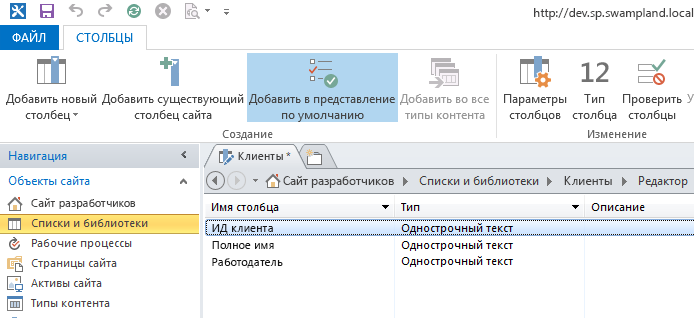
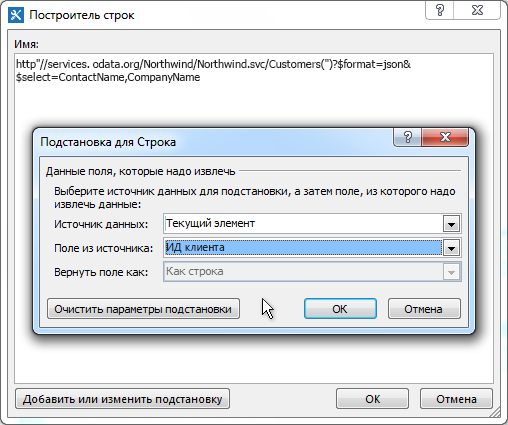
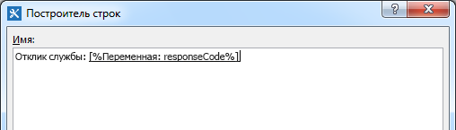
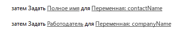

# Работа с веб-службами в рабочих процессах SharePoint с помощью SharePoint Designer 2013Working with Web Services in SharePoint Workflows using SharePoint Designer 2013
Узнайте, как использовать веб-службы в рабочих процессах SharePoint Designer 2013. **Материалы предоставил** [Andrew Connell](http://social.msdn.microsoft.com/profile/andrew%20connell%20%5bmvp%5d/) ([www.AndrewConnell.com](http://www.andrewconnell.com)).Demonstrates how to use web services in SharePoint Designer 2013 workflows. **Provided by:** [Andrew Connell](http://social.msdn.microsoft.com/profile/andrew%20connell%20%5bmvp%5d/),  [www.AndrewConnell.com](http://www.andrewconnell.com)
  
    
    

Корпорация Майкрософт применила новый подход к рабочим процессам в SharePoint.Microsoft has taken a fresh approach to workflows in SharePoint. Команда разработчиков рабочих процессов в сотрудничестве с командой разработчиков Microsoft Azure создала новый продукт под названием Workflow Manager.The workflow team worked with the Microsoft Azure team to create a new product called Workflow Manager. В службе Workflow Manager размещается последняя версия среды выполнения Windows Workflow Foundation. Эта служба обеспечивает доступ ко всем необходимым службам и возможность использовать служебную шину Microsoft Azure для улучшения производительности и масштабируемости.Workflow Manager serves as the host for the latest version of the Windows Workflow Foundation runtime and provides all of the necessary services as well as leveraging the Microsoft Azure Service Bus to enhance performance and scalability. Workflow Manager работает одинаково в локальном и облачном развертываниях.Once deployed, it runs the same whether in an on-premises deployment or deployed to the cloud. Обратите внимание на то, что SharePoint передает выполнение всех рабочих процессов и сопутствующих задач в ферму Workflow Manager, которая является внешней относительно SharePoint.Importantly, SharePoint hands off all workflow execution and related tasks to the Workflow Manager farm, which is external to SharePoint.
К наиболее значительным изменениям в архитектуре рабочих процессов относится то, что теперь все рабочие процессы, включая созданные с помощью Visual Studio 2012, в рабочей области конструирования становятся декларативными.One of the more significant changes to the workflow architecture is that now all workflows are authored in a declaratively, on a designer surface, including those built using Visual Studio 2012. В предыдущих версиях SharePoint рабочие процессы, созданные при помощи Visual Studio 2012, не были только декларативными.In previous versions of SharePoint, workflows developed with Visual Studio 2012 were not exclusively declarative. Они представляли собой сочетание декларативного кода XAML и скомпилированной сборки, которая содержала бизнес-логику рабочего процесса.Instead, they were a mix of declarative XAML and a compiled assembly that contained the workflow business logic.
  
    
    

Для пользователей, создававших рабочие процессы с помощью SharePoint Designer ранее, ничего нового нет. Рабочие процессы в SharePoint Designer всегда были полностью декларативными. Это изменение не даст преимуществ пользователям, создававшим рабочие процессы в SharePoint Designer 2013, потому что теперь рабочие процессы SharePoint Designer 2013 поддерживают вызов и использование веб-служб.For those customers who have created workflows using SharePoint Designer in the past, this is nothing new. Workflows authored using SharePoint Designer have always been fully declarative. This change does benefit customers who create workflows using SharePoint Designer 2013, however, because SharePoint Designer 2013 workflows now support calling and consuming web services.
## Важность веб-служб для рабочих процессов SharePointWhy are web services important for SharePoint workflows

Начнем со сценариев, в которых использование веб-служб имеет смысл. Во времена SharePoint 2007 или SharePoint 2010 часто требовалось написание настраиваемого кода при создании рабочих процессов с помощью Visual Studio, потому что это был лучший метод для вычислений или реализации настраиваемой бизнес-логики. Если же возникала ситуация, когда встроенных действий было недостаточно для ваших потребностей, вы обращались к настраиваемому коду в управляемой сборке.Let's start by understanding scenarios in which using web services makes sense. In the days of SharePoint 2007 or SharePoint 2010, writing custom code was common when using Visual Studio to author workflows because that was the best way to perform calculations or implement custom business logic. Any time you encountered a situation in which the out-of-box actions and activities didn't meet your needs, you could fall back on custom code in a managed assembly.
  
    
    
С другой стороны, для пользователей SharePoint Designer 2013, не занимающихся разработкой, это было не так просто. В ситуациях, когда существующих действий рабочего процесса не хватало, приходилось призывать на помощь разработчика для написания настраиваемого действия. Зачастую это было сложно, так как можно было создать код только для песочницы (в размещенной среде) или можно было использовать только решения с полным доверием (в локальном развертывании). В других случаях рабочий процесс приходилось полностью отдавать в руки разработчика для создания решения с полным доверием, так как необходимые задачи было невозможно выполнить в SharePoint Designer.For the non-developer users of SharePoint Designer 2013, on the other hand, this was not so easy. When you ran into a use cases that you couldn't handle with existing workflow actions, you had to call in a developer to write a custom action. Often, this was difficult because they could only create code for the sandbox (when in a hosted environment), or could only use fully-trusted solutions if in an on-premises deployment. In other cases, the workflow had to be completely handed over to a developer to build as a fully-trusted solution because what was needed could not be achieved in SharePoint Designer.
  
    
    
Теперь хорошая новость: в мире SharePoint, когда в SharePoint Designer 2013 отсутствует требуемое действие, вам необходимо создать пользовательскую веб-службу. А этом гораздо проще, чем создать настраиваемое действие. Кроме того, настраиваемое действие может использоваться только рабочим процессом, в котором оно установлена (или, в лучшем случае, только рабочим процессом SharePoint), пользовательскую веб-службу можно переносить и использоваться для любого количества задач.Now comes the good news: In the world of SharePoint, when SharePoint Designer 2013 lacks an action that you need, all you need is to create a custom web service. And creating a custom web service is much easier than creating a custom action. Not only that, but whereas a custom action could only be used by the workflow in which it's installed (or, at best, by only a SharePoint workflow), a custom web service is portable and can be used by any number of consumers.
  
    
    
Возможно, самое главное преимущество состоит в следующем: если вам необходим доступ к существующей веб-службе, общедоступной или частной, размещенной в вашей компании, SharePoint Designer 2013 теперь предоставляет действие для вызова веб-службы. Больше не нужно обращаться к разработчику для вызова существующей веб-службы.Perhaps best of all, in cases where there is an existing web service that you need to access - either a public one, or perhaps a private web service that is hosted by your company - SharePoint Designer 2013 now provides an action that you can use to call the web service. There is no longer any need to rely on a developer when you need to call an existing web service.
  
    
    
Хотя SharePoint может использовать любой тип веб-службы, самый простой (и рекомендуемый способ)  использование веб-служб, которые принимают и возвращают данные в стандартных форматах  [OData](http://www.odata.org/) протоколов [Atom](http://msdn.microsoft.com/ru-RU/library/ff478141.aspx) или [JSON](http://json.org/) (JavaScript Object Notation).While SharePoint can consume any type of web service, it is easiest (and recommended) that you use web services that accept and return data using the standard  [OData](http://www.odata.org/) formats of [Atom](http://msdn.microsoft.com/ru-RU/library/ff478141.aspx) or [JSON](http://json.org/) (JavaScript Object Notation).
  
    
    
Эта рекомендация основана на том, что они поддерживают эти форматы OData в средствах создания рабочих процессов SharePoint (SharePoint Designer 2013 и Visual Studio 2012). Оба средства поддерживают создание полезной нагрузки для передачи службе и обработки ответов от веб-служб. Кроме того, форматы OData поддерживают взаимодействие с анонимными веб-службами, а также службами, защищенными различными типами проверки подлинности. Проще говоря, вы получаете полный контроль на запросом и ответом каждого вызова службы. Это позволяет использовать последовательность действий в рабочем процессе сначала для проверки подлинности с помощью одной службы и получения маркера OAuth, а затем для добавления этого маркера в будущие запросы к службам, защищенным с помощью протокола  [OAuth 2.0](http://oauth.net/2/).This recommendation is based on their being support for these OData formats in SharePoint workflow authoring tools (both SharePoint Designer 2013 and Visual Studio 2012). Both tools support building payloads to submit to the service and for handling the responses returned by the web services. Additionally, the OData formats support communication with anonymous web services as well as with those protected by various types of authentication. In short, you have full control over the request and response for each service call. This allows you to use a series of activities within a workflow to first authenticate using one service and obtain an OAuth token, and then include that token in future requests to services secured using the  [OAuth 2.0](http://oauth.net/2/) protocol.
  
    
    

## Использование веб-служб в рабочих процессах SharePointLeveraging web services in SharePoint workflows

Вызов веб-служб из рабочих процессов с помощью SharePoint состоит из двух этапов: вызов веб-службы и обмен данными с ней.Invoking web services from workflows using SharePoint takes place in two stages: first is calling the web service, then is exchanging data with the web service.
  
    
    
В рабочих процессах SharePoint вы вызываете веб-службу, используя новое действие, представленное в SharePoint  **Call HTTP Web Service**. Это гибкое действие, легко позволяющее выполнять простые вызовы к веб-службе. При необходимости вы можете создавать более сложные вызовы, используя HTTP-команды и добавляя заголовки HTTP. На рис. 1 показано действие **Call HTTP Web Service** в области SharePoint Designer 2013.In SharePoint workflows, you call a web service using a new action introduced in SharePoint named **Call HTTP Web Service**. This action is flexible and allow you to make simple calls to a web service easily, or, if needed, you can create more complex calls using HTTP verbs as well as allowing you to add HTTP headers. Figure 1 shows you the **Call HTTP Web Service** action on the SharePoint Designer 2013 surface.
  
    
    

**Рис. 1. Этап SharePoint Designer 2013 с изображением действия "Вызов веб-службы HTTP"****Figure 1. SharePoint Designer 2013 stage showing the Call HTTP Web Service action**

  
    
    

  
    
    

  
    
    
Действие **Call HTTP Web Service** позволяет указать любой из нескольких методов запроса, в том числе **GET**, **PUT**, **POST** и **DELETE**. Так вы сможете сообщить веб-службам, в частности, службам  [с поддержкой REST](http://msdn.microsoft.com/ru-RU/library/office/jj164022.aspx), что делать со службой, указанной в свойстве URI действия.The **Call HTTP Web Service** action lets you specify any of several request methods, including **GET**, **PUT**, **POST**, and **DELETE**. This lets you tell the web services, specifically  [RESTful](http://msdn.microsoft.com/ru-RU/library/office/jj164022.aspx) services, what to do on the service that you've specified with the URI property on the activity.
  
    
    
Например, чтобы получить все свойства определенного элемента, URL-адрес службы должен содержать уникальный адрес элементы, а в качестве метода необходимо выбрать **GET**. Чтобы удалить элемент, используется тот же процесс, только выбирается метод **DELETE**. Аналогично элемент и обновляется с помощью метода **POST**. При создании элемента присвойте URL-адресу уникальный адрес коллекции, где будет создан элемент, а затем выберите метод **POST**. При создании или обновлении элементов службам обычно нужны данные, которые передаются как содержимое запроса, поэтому укажите свойство **request** в действии **Call HTTP Web Service**.For instance, to get all the properties of a specific item, the service URL would contain the unique address of the item, and you would set the method to **GET**. To delete the item, the process is the same, except you set the method to **DELETE**. The same is true for updating an item, except for setting the method to **POST**. When you create an item, set the URL to the unique address of the collection where the item is to be created, and then set the method to **POST**. When creating or updating items, services generally require the data to use, which you pass along as content in the request, then indicate using the **request** property on the **Call HTTP Web Service** action.
  
    
    
Второй этап работы с веб-службами связан с передачей данных веб-службе и получением данных от нее, для чего используется свойство **request** или **response** действия **Call HTTP Web Service**. Но обратите внимание, что подобно потоку данные передаются как сложная структура с помощью объекта  [DynamicValue](http://msdn.microsoft.com/ru-RU/library/windowsazure/microsoft.activities.dynamicvalue%28v=azure.10%29.aspx). (Дополнительные сведения о динамических значениях см. в статье  [Общие сведения о динамических значениях](http://msdn.microsoft.com/ru-RU/library/windowsazure/jj193505%28v=azure.10%29.aspx).)The second stage of working with web services involves submitting data to, and receiving data from, a web service, which you do by using either the **request** or **response** properties on the **Call HTTP Web Service** action. Note, however, that rather than as a stream, data is passed as a complex structure using the [Dynamic Value](http://msdn.microsoft.com/ru-RU/library/windowsazure/microsoft.activities.dynamicvalue%28v=azure.10%29.aspx) object. (For more information about dynamic values, see [Understanding Dynamic Value](http://msdn.microsoft.com/ru-RU/library/windowsazure/jj193505%28v=azure.10%29.aspx).)
  
    
    
Структуры данных динамических значений форматируются как строки Нотация объектов JavaScript (JSON). Однако вместо того чтобы просить разработчика создавать и обрабатывать строки вручную в рабочем процессе, корпорация Майкрософт предоставила тип объекта **DynamicValue**, который можно использовать для хранения иерархических данных и ответа для вызова веб-службы.Dynamic value data structures are formatted as JavaScript Object Notation (JSON) strings. However, instead of having a developer create and manipulate strings manually within the workflow, Microsoft has provided the object type **DynamicValue** that can be used to store both hierarchal data as well as the response to a web service call.
  
    
    
С типом **DynamicValue** связан ряд действий, с помощью которых можно подсчитывать число элементов в ответе, извлекать значения из ответа или создавать новую структуру для обновления и создания элементов. Обратите внимание, что SharePoint Designer 2013 не поддерживает работу напрямую с типом **DynamicValue**, поэтому авторам рабочих процессов необходимо использовать **Dictionary**.There is a series of activities associated with the **DynamicValue** type that can be used to count the number of items in the response, extract values from the response, or build up a new structure for updating or creating items. Note that SharePoint Designer 2013 does not support working directly with the **DynamicValue** type and instead, workflow authors will use the **Dictionary** type.
  
    
    

## Создание веб-служб для рабочих процессов SharePointCreating web services for SharePoint workflows

Итак, мы узнали, что SharePoint Designer 2013 поддерживает вызов веб-служб, но  *не*  поддерживает вызов настраиваемого кода из рабочих процессов. Поэтому вам потребуется узнать, как создать веб-службу, чтобы расширить возможности рабочих процессов.So we've learned that SharePoint Designer 2013 supports calling web services, but that it  *doesn't*  support invoking custom code from workflows. Consequently, you will need to know how to create a web service if you wish to extend the functionality of your workflows beyond the default actions.
  
    
    
К счастью, существует множество вариантов для создания настраиваемых веб-служб, используемых в рабочих процессах SharePoint. В частности, действие **HttpSend** и тип данных **DynamicValue** идеально подходят для создания веб-служб с поддержкой REST, которые соответствуют протоколу OData.Fortunately, there are plenty of options for creating custom web services for use in SharePoint workflows. Specifically, the **HttpSend** activity, along with the **DynamicValue** data type, are ideally suited for creating RESTful web services that conform to the OData protocol.
  
    
    
 OData  это протокол для создания и использования данных на основе принципов служб REST. Он был разработано для стандартизации обмена данными с использованием проверенных и надежных протоколов HTTP. После завершения спецификации OData различные организации реализовали этот протокол в собственных стеках технологий. Корпорация Майкрософт реализовала собственную версию OData под названием [WCF Data Services](http://msdn.microsoft.com/ru-RU/library/hh487257%28v=vs.103%29.aspx).OData is a protocol for creating and consuming data based on the principles of REST services. It was developed to standardize exchanging data using mature, reliable, and robust HTTP protocols. Once the OData specification was complete, different organizations implemented the protocol on their own technology stacks. Microsoft implemented its own version of OData, which it branded [WCF Data Services](http://msdn.microsoft.com/ru-RU/library/hh487257%28v=vs.103%29.aspx).
  
    
    
Ниже описываются два типичных сценария, в которых веб-службы с поддержкой REST будут полезны для разработчиков рабочих процессов:Following are discussions of two common scenarios in which RESTful web services are useful to workflow developers:
  
    
    

- реализация операций CRUD-Q службы OData;Implementing OData service CRUD-Q operations
    
  
- Реализация операций службы ODataImplementing OData service operations
    
  

### Реализация операций CRUD-Q службы ODataImplementing OData service CRUD-Q operations

Веб-службы часто используются для выполнения простых операций создания, чтения, обновления, удаления и запрос (CRUD-Q) с данными в базе данных. Создать веб-службу OData для рабочего процесса SharePoint с помощью WCF Data Services довольно просто. Вы можете изучить пошаговые руководства и примеры создания веб-служб на сайтах  [WCF Data Services](http://msdn.microsoft.com/ru-RU/library/cc668792.aspx),  [www.OData.org](http://www.odata.org) и других.A common use for web services is performing simple create, read, update, delete, and query (CRUD-Q) operations on data in a database. It is relatively easy to create an OData web service for a SharePoint workflow WCF data service an OData service to be used by a workflow by using WCF Data services. You can review the walkthroughs and samples on creating web services at sites like  [WCF Data Services](http://msdn.microsoft.com/ru-RU/library/cc668792.aspx),  [www.OData.org](http://www.odata.org), and others. 
  
    
    
Предположим, что у вас уже есть база данных, с которой можно работать. Тогда необходимо выполнить четыре простых действия.Assuming that you already have database that you can operate against, there are four short steps:
  
    
    

1. Создайте модель базы данных, используя Microsoft  [Entity Framework](http://msdn.microsoft.com/ru-RU/data/aa937723). Код для этого не требуется, поскольку используется мастер в Visual Studio. Дополнительные сведения см. в статье, посвященной  [Entity Framework 4.0 и WCF Data Services 4.0 в Visual Studio 2010](http://msdn.microsoft.com/ru-RU/magazine/ee336128.aspx), и статье, посвященной  [поддержке Entity Framework Designer в Visual Studio 2012](http://msdn.microsoft.com/ru-RU/magazine/jj721589.aspx).Create a model of the database using the Microsoft  [Entity Framework](http://msdn.microsoft.com/ru-RU/data/aa937723). There is no code required as this is a wizard-based creation in Visual Studio. For additional information, see  [Entity Framework 4.0 and WCF Data Services 4.0 in Visual Studio 2010](http://msdn.microsoft.com/ru-RU/magazine/ee336128.aspx) and [Entity Framework Designer Gets Some Love in Visual Studio 2012](http://msdn.microsoft.com/ru-RU/magazine/jj721589.aspx).
    
  
2. Создайте службу WCF Data Services. Опять же, код не требуется, поскольку используется мастер Visual Studio. Дополнительные сведения см. в пошаговом руководстве  [Создание службы данных WCF и доступ к ней в Visual Studio](http://msdn.microsoft.com/ru-RU/library/vstudio/cc668184.aspx).Create a new WCF Data Service. Again, no code is required in this Visual Studio wizard. For more information, see Walkthrough:  [Creating and Accessing a WCF Data Service in Visual Studio](http://msdn.microsoft.com/ru-RU/library/vstudio/cc668184.aspx).
    
  
3. В файле кода службы задайте имя модели объекта, созданной на шаге 1, как источник службы. Затем настройте параметры доступа и разрешения для объектов в модели (оба шага реализуются двумя строками кода).In the service code file, set the name of the entity model that you created in step one to the source of the service; then, set the accessibility and permission for the entities in the model (both steps implemented in as little as two lines of code).
    
  
4. Опубликуйте службу в расположении, доступном Workflow Manager.Publish the service to a location that Workflow Manager can access.
    
  

### Реализация операций службы ODataImplementing OData service operations

Довольно высока вероятность того, что вашему рабочему процессу потребуется выполнить определенную бизнес-логику в ограниченной модели CRUD-Q. Например, может существовать служба OData, поддерживающая операции CRUD-Q при создании нового банковского займа. Эта служба также может запрашивать кредитный рейтинг для получения текущей процентной ставки. Для такой задачи недостаточно простых операций CRUD-Q, поскольку она вызывает метод, передает в целое число и получает ответ.There's a pretty good chance that your workflow wants to run some business logic that doesn't fit into limited the CRUD-Q model. For example, there may be an OData service that supports CRUD-Q operations when it creates a new bank loan. This service might also ask for consumers to call the service and provide a credit score so it can then retrieve the current interest rate. Such a task exceeds the capability of simple CRUD-Q operations, since it calls a method, passes in an integer, and receives a response.
  
    
    
Однако этот сценарий можно поддерживать с помощью OData и служб WCF Data Services, используя которых можно реализовать  [операции службы](http://msdn.microsoft.com/ru-RU/library/cc668788.aspx). Операции службы довольно распространены и используются даже в службах SharePoint. Например, когда SharePoint извлекает определенный список, используя адрес в формате  `http://[..]/_api/web/lists/GetByTitle('ListTitle')`, функция **GetByTitle()** в адресе фактически представляет оператор службы, созданный группой SharePoint. Как правило, разработчики создают свои пользовательские операции в веб-службах с помощью WCF Data Services.However, you can support this scenario by using OData and WCF Data Services, through which you can implement  [Service Operations](http://msdn.microsoft.com/ru-RU/library/cc668788.aspx). Service operations are common, and are even used in the SharePoint services. For example, when SharePoint retrieves a specific list using the address format  `http://[..]/_api/web/lists/GetByTitle('ListTitle')`, the **GetByTitle()** function in the address is actually a service operator that was created by the SharePoint team. Typically, developers create their custom service operations in web services they create using WCF Data Services.
  
    
    

## Создание рабочего процесса в SharePoint Designer 2013Create a workflow with SharePoint Designer 2013

В следующем примере показано, как создать настраиваемый рабочий процесс, вызывающий веб-службу OData базы данных Northwind, которая размещена в открытом доступе на сайте  [www.odata.org](http://www.odata.org). В этом примере пользователь вводит идентификатор клиента и затем запускает рабочий процесс, который принимает идентификатор клиента и использует его для отправки запроса к веб-службе, чтобы собрать дополнительные сведения о клиенте, в частности, полное имя и работодателя. Рабочий процесс получает эти сведения и обновляет элемент списка, добавляя имя клиента и работодателя.The following walkthrough demonstrates how to create a custom workflow that calls the OData web service of the Northwind database, which you can find publically hosted at the  [www.odata.org](http://www.odata.org) site. In this sample, the user enters a customer ID and then starts the workflow, which takes the customer ID and uses it to query the web service to collect additional information about the customer - specifically, the user's full name and employer. The workflow then takes this information and updates the list item by adding the user's customer name and employer.
  
    
    

### Создание списка клиентовCreate a customer list

1. Создайте настраиваемый список в SharePoint Designer 2013 и назовите его "Клиенты".In SharePoint Designer 2013, create a custom list and name it "Customers".
    
  
2. Переименуйте поле **Заголовок** в **Идентификатор клиента**.Rename the **Title** field **to Customer Id**.
    
  
3. Добавьте два новых поля типа **String** и назовите их **Полное имя** и **Работодатель**, как показано на рис. 2.Add two new fields of type **String** and name them **Full Name** and **Employer**, as shown in Figure 2.
    
   **Рис. 2. Создание списка клиентов в SharePoint Designer 2013****Figure 2. Creating the Customers list in SharePoint Designer 2013**

  

  
  

  

  

### Создание рабочего процессаCreate the workflow

1. В области навигации SharePoint Designer 2013 выберите параметр **Рабочие процессы**.In the SharePoint Designer 2013 navigation pane, select the **Workflows** option.
    
  
2. На ленте нажмите кнопку **Рабочие процессы списка** и выберите **Клиенты** в раскрывающемся списке.On the ribbon, click the **List Workflows** button and select **Customers** from the resulting drop-down list.
    
  
3. Назовите рабочий процесс "Получение сведений о клиенте".Name the workflow "Get Customer Details".
    
  
4. Выберите для параметра **Тип платформы** значение **Рабочий процесс SharePoint**, как показано на рис. 3.Set the **Platform Type** to **SharePoint Workflow**, as shown in Figure 3.
    
   **Рис. 3. Создание рабочего процесса списка с помощью SharePoint Designer 2013****Figure 3. Creating a new List Workflow using SharePoint Designer 2013**

  

  
  

  

  

### Запрос сведений о клиенте у веб-службыQuery the web service for the customer details

После создания рабочего процесса нам необходимо включить его, чтобы вызвать веб-службу, для чего мы добавим действие **Вызов веб-службы HTTP** в стадию рабочего процесса по умолчанию.Now that we've created the workflow, we want to enable it to call a web service, which we do by adding a **Call HTTP Web Service** action to the workflow's default stage.
  
    
    

1. Щелкните ссылку с пометкой **Это**.Click on the link labled **this**.
    
  
2. Справа от текстового поля **Введите URL-адрес веб-службы HTTP** нажмите кнопку построителя (**???**), чтобы открыть диалоговое окно **Построитель строк**.To the right of the **Enter the HTTP web service URL** text box, click the builder button ( **…**) to open the **String Builder** dialog box.
    
  
3. В окне **Построитель строк** введите следующий URL-адрес: `http://services.odata.org/Northwind/Northwind.svc/Customers('CUSTOMERID')?$format=json&amp;$select=ContactName,CompanyName`. Обратите внимание, что часть " `$select`" этого URL-адреса получает только поля, связанные с данным списком.In the **String Builder**, enter this URL:  `http://services.odata.org/Northwind/Northwind.svc/Customers('CUSTOMERID')?$format=json&amp;$select=ContactName,CompanyName`. Notice the " `$select`" portion of the URL is retrieving only the fields that are relevant to this list. 
    
  
4. Найдите сегмент  `CUSTOMERID` в URL-адресе и удалите его. Не трогайте круглые скобки и одинарные кавычки.In the URL, locate the URL segment  `CUSTOMERID` and remove it. Leave the parentheses and single quotes in place.
    
  
5. Чтобы затем динамически создать полный URL-адрес, нажмите кнопку **Добавить или изменить подстановку** в окне **Построитель строк**.To then dynamically create the full URL, click the **Add or Change Lookup** button in the **String Builder**.
    
  
6. В появившемся диалоговом окне **Поиск строки** задайте для параметра **Источник данных** значение **Текущий элемент**, а для параметра **Поле из источника**  значение **CustomerId**, как показано на рис. 4.In the resulting **Lookup for String** dialog box, set the **Data Source** to **Current Item** and set the **Field from Source** to **CustomerId**, as shown in Figure 4.
    
   **Рис. 4. Динамическое создание URL-адреса для запроса веб-службы****Figure 4. Dynamically creating the URL for the web service request**

  

  
  

  

  
7. Чтобы принять новый URL-адрес, нажмите кнопку **ОК**, затем еще раз нажмите кнопку **ОК**.Click **OK**, then **OK** again to accept the new URL.
    
    Мы реализовали получение результатов от веб-службы, Теперь нам нужно сохранить результаты в другой переменной.Now that we've set this up to receive results from the web service, next we need to store the results in another variable.
    
  
8. В действии **Вызов веб-службы HTTP** щелкните ссылку **ответ** и создайте переменную типа **Dictionary** с именем **nwServiceResponse**.In the **Call HTTP Web Service** action, click the **response** link in the action and create a new variable of type **Dictionary** and name it **nwServiceResponse**.
    
    Все действие **Вызов веб-службы HTTP**, скорее всего, не видно, так как оно слишком длинное. Прокрутите вправо, после чего вы увидите, что код состояния ответа хранится в переменной **responseCode**. Это довольно удобно, так как мы можем записать что-нибудь на страницу статистики экземпляра рабочего процесса, используя список журнала рабочего процесса.The entire **Call HTTP Web Service** action is not likely visible, since it is a long sentence in the designer. Scroll to the right and notice that the response status code is stored in a variable called **responseCode**. This is convenient, and something that can be written to the workflow instance's statistics page using the workflow history list.
    
  
9. Добавьте действие **Записать в журнал** после действия **Вызов веб-службы HTTP** и задайте его **сообщение**, чтобы записать код состояния ответа в журнал, как показано на рис. 5.Add a **Log to History List** action after the **Call HTTP Web Service** action and set its **message** to write the status code for the response to the log, as shown in Figure 5.
    
   **Рис. 5. Запись кода ответа веб-службы в список журнала****Figure 5. Writing the Web Service Response Code to the History List**

  

  
  

  

  

### Извлечение значений из ответаExtract values from response

Мы сохранили ответ веб-службы в переменной **nwServiceResponse**. Следующий шаг  извлечь эти значения и поместить их в локальных переменных.Now that we have the web service response stored in the **nwServiceResponse** variable, the next step is to extract these values and place them in local variables.
  
    
    
Для этого мы добавим два действия **Получить элемент из словаря** в рабочий процесс. Обратите внимание, что путь к элементу, из которого мы собираемся извлечь значение, должен соответствовать структуре ответа и должен быть в определенном формате. Чтобы выяснить это, можно ввести URL-адрес в браузере и просмотреть ответ. Обратите внимание, что результаты размещаются в объекте **d** во вложенном виде. Поэтому путем к полю **CompanyName** в ответе веб-службы будет `d/CompanyName`.To do this, we're going to add two **Get item from dictionary** actions to the workflow. Note that the path to the item from which we're going to extract a value has to match the structure of the response and be in a specific format. A good way to figure this out is to enter the URL into the browser to see the response that comes back. Notice that the results are nested within the object called **d**. Therefore the path to the field **CompanyName** in the web service response is `d/CompanyName`.
  
    
    

1. Добавьте два действия **Получить элемент из словаря** в рабочий процесс.Add two **Get item from dictionary** actions to the workflow.
    
  
2. В первом из новых действий установите для параметра **элемента по имени или пути** значение `d/ComopanyName`.On the first of these new actions, set **item by name or path** to `d/ComopanyName`.
    
  
3. Установите для ссылки **словарь** значение **nwServiceResponse**.Set the **dictionary** link to **nwServiceResponse**.
    
  
4. Присвойте ссылке **элемент** новую переменную типа **String** с именем **CompanyName**.Set the **item** link to a new **String** variable named **CompanyName**.
    
  
5. Повторите шаги 2, 3 и 4 со вторым действием **Получить элемент из словаря**, но теперь используйте **ContactName** вместо "CompanyName", как показано на рис. 6.Repeat steps 2, 3, and 4 on the second **Get item from dictionary** action, except to use **ContactName** instead of "CompanyName", as shown in Figure 6.
    
   **Рис. 6. Извлечение значений из ответа словаря веб-службы****Figure 6. Extracting Values from the Web Service Dictionary Response**

  

  
  

  

  

### Обновление элемента спискаUpdate the list item

Последний шаг  обновление элемента списка с помощью двух действий **Установка поля в текущем элементе**. Эти действия присваивают полям в элементе списка значения, хранящиеся в созданных нами переменных, как показано на рис. 7.The final step is to update the list item using two of the **Set field in current item** actions. These set the fields in the list item to the values stored in the variables we created, as shown in Figure 7.
  
    
    

**Рис. 7. Обновление элемента списка****Figure 7. Update the List Item**

  
    
    

  
    
    

  
    
    
И, наконец, мы завершаем раздел **Переход к стадии** рабочего процесса.And finally, we complete the **Transition to stage** section of the workflow stage.
  
    
    

1. Добавьте действие **Перейти к стадии**.Add a **Go To Stage** action.
    
  
2. Выберите **Конец рабочего процесса**.Select **End of workflow**.
    
  
3. Сохраните и опубликуйте рабочий процесс.Save and publish the workflow.
    
  

### Проверка рабочего процессаTest the workflow

1. Откройте браузер и перейдите к списку **Клиенты**.Open a browser and navigate to the **Customers** list.
    
  
2. Добавьте два идентификатора клиентов из службы Northwind в два новых элементы списка, **ALFKI** и **ANATR**.Add the two customer IDs that are in the Northwind service on two new list items, **ALFKI** and **ANATR**.
    
  
3. Вручную запустите рабочие процессы, выбрав каждый элемент, а затем нажав кнопку **Рабочие процессы** на ленте.Manually start the workflows by selecting each item, then clicking the **Workflows** button on the ribbon.
    
  
4. Выберите рабочий процесс **Получить сведения о клиенте**.Select the **Get Customer Details** workflow.
    
    На этом этапе рабочий процесс будет запущен и запросит данные у веб-службы.At this point the workflow will start and will query the web service.
    
  
5. Вернитесь к списку **Клиенты** и обновите страницу. Может потребоваться несколько обновлений для завершения рабочих процессов, но в итоге результаты должны выглядеть, как показано на рис. 8. Вы увидите элементы списка, в которые добавлены полное имя клиента и работодатель, полученные из веб-службы Northwind.Navigate back to the **Customers** list and refresh the page. It might take a few refreshes for the workflows to complete, but eventually it should look like the image in Figure 8. You should see both list items updated with the customer's full name and their employer, which came from the Northwind web service.
    
   **Рис. 8. Обновление элементов списка настраиваемым рабочим процессом****Figure 8. List Items Updated by Custom Workflow**

  

  
  

  

  

## ЗаключениеConclusion

В SharePoint представлена новая архитектура рабочих процессов на основе нового продукта, Workflow Manager 1.0. Чтобы все настраиваемые рабочие процессы работали независимо от типа развертывания SharePoint (локального или размещенного в Office 365), все рабочие процессы теперь на 100 % декларативные. Поддержка вызова веб-служб из рабочих процессов, созданных в SharePoint Designer 2013, дает более гибкие и мощные способы создания рабочих процессов, чем в предыдущих версиях.SharePointintroduced a new workflow architecture facilitated by a new product, Workflow Manager 1.0. To ensure that all custom workflows worked regardless of the SharePoint deployment choice, either on-premises or hosted in Office 365, all workflows are now 100 percent declarative. The added support for calling web services from SharePoint Designer 2013-authored workflows provides a more flexible and powerful workflow authoring process than in previous versions.
  
    
    
 Корпорация Майкрософт ввела поддержку вызова веб-служба в Workflow Manager с помощью нового действия **Call HTTP Web Service** в SharePoint Designer 2013. В Workflow Manager также представлена поддержка создания структур для передачи веб-службам, а также получения ответов с помощью типа переменной **Dictionary**. При создании рабочих процессов используйте тип **Dictionary** и связанные действия в рабочих процессах SharePoint, которые применяют внешние веб-службы.Microsoft introduced support for calling web services in Workflow Manager using the new **Call HTTP Web Service** action in SharePoint Designer 2013. Workflow Manager also introduced support for creating structures to submit to web services as well as consuming their responses using the **Dictionary** variable type. When creating workflows, use the **Dictionary** type and associated actions in SharePoint workflows that use external web services.
  
    
    

## Дополнительные ресурсыAdditional resources

-  [Рабочие процессы в SharePointWorkflows in SharePoint](workflows-in-sharepoint.md)
    
  
-  [ODataOData](http://www.odata.org/)
    
  
-  [Знакомство с JSONIntroducing JSON](http://json.org/)
    
  
-  [Начало работы со службой REST SharePointGet started with the SharePoint REST service](http://msdn.microsoft.com/ru-RU/library/office/fp142380.aspx)
    
  
-  [Entity Framework 4.0 и WCF Data Services 4.0 в Visual Studio 2010Entity Framework 4.0 and WCF Data Services 4.0 in Visual Studio 2010](http://msdn.microsoft.com/ru-RU/magazine/ee336128.aspx)
    
  

  
    
    

