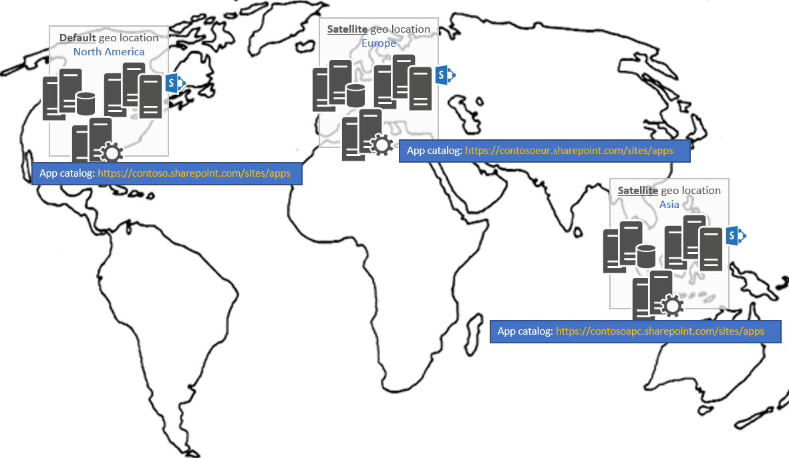

# Управление приложениями в SharePoint несколькими-географически клиентовManaging apps in a SharePoint Multi-Geo tenant

> **Важные:** OneDrive и SharePoint Online Multi-Geo в данный момент в предварительной версии и может быть изменен.**Important:** OneDrive and SharePoint Online Multi-Geo is currently in preview and is subject to change.

В географически нескольких клиентов вам придется каталога приложений одного географического расположения, что-то, выполняемых в учетной записи, если вы хотите развернуть ваших приложений в все географически подразделениях.In a Multi-Geo tenant, you'll have an app catalog per geo location which is something to take in account if you want to deploy your apps across all geo locations.

## Где необходимо развернуть Мои приложения в географически нескольких клиентов?Where do I need to deploy my apps in a Multi-Geo tenant?
Прежде чем речь идет о развертывании приложения давайте сначала определите, что подразумевается с приложениями в этой статье: все приложения, развертываемым с первого их добавление в каталог приложений вашего клиента находятся в области данное руководство так, включающий SharePoint надстройки (так .app-файлы), но также Приложения SharePoint Framework и расширения (.sppkg-файлы).Before talking about deploying apps let's first define what's meant with apps in this article: all apps that you deploy by first adding them to your tenant app catalog are in scope of this guidance, so that includes SharePoint Add-In's (so .app files) but also SharePoint Framework Apps and Extensions (the .sppkg files). Один сайт каталога приложений в географически нескольких клиентов придется одного географического расположения, как показано на следующем рисунке:In a Multi-Geo tenant you'll have one app catalog site per geo location as show below:

Вследствие данной архитектуры — это, что вам потребуется развернуть приложение в **все** каталоги приложений, если вы хотите, чтобы ваше приложение, чтобы оно было доступно для всех сайтов, независимо от расположения географически сайта, размещенной в.A consequence of this architecture is that you'll need to deploy your app in **all** app catalogs if you want your app to be available for all sites, regardless of the geo location the site is hosted in. Чтобы реализовать это у вас есть два варианта:To realize this you have 2 options:
- Развертывание приложения вручную на каждом из сайтов каталога приложенияDeploy your app manually in each of the app catalog sites
- Использование API управления жизненным циклом Приложений для автоматизации развертывания приложений: с помощью этих API можно написать код, постоянно развертывает и обновления приложений в все расположения географически несколькими географически клиента.Use the ALM API's to automate the deployment of your apps: using these API's you can write code that consistently deploys/upgrades your apps in all the geo locations of your Multi-Geo tenant.

## См. такжеSee also

- [Приложения SharePoint API управления жизненным циклом ПриложенийSharePoint Apps ALM API's]()
- [Развертывание и установка надстроек для SharePoint: методы и параметрыDeploying and installing SharePoint Add-ins: methods and options](https://docs.microsoft.com/en-us/sharepoint/dev/sp-add-ins/deploying-and-installing-sharepoint-add-ins-methods-and-options)
- [Размещение клиентских веб-части из сети CDN Office 365Hosting client-side web part from Office 365 CDN](https://docs.microsoft.com/en-us/sharepoint/dev/spfx/web-parts/get-started/hosting-webpart-from-office-365-cdn)
- [Расширение узла из сети CDN Office 365Host extension from Office 365 CDN](https://docs.microsoft.com/en-us/sharepoint/dev/spfx/extensions/get-started/hosting-extension-from-office365-cdn) 

