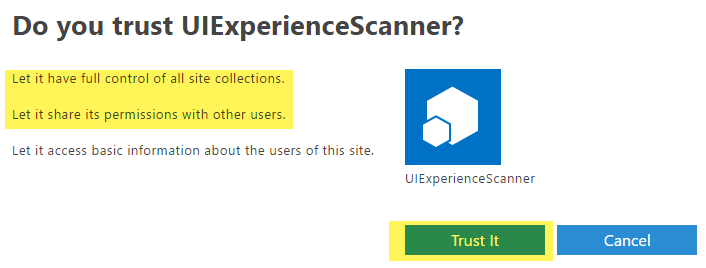

# <a name="granting-access-using-sharepoint-app-only"></a><span data-ttu-id="91913-101">Предоставление доступа с помощью SharePoint только для приложений</span><span class="sxs-lookup"><span data-stu-id="91913-101">Granting access using SharePoint App-Only</span></span>
<span data-ttu-id="91913-102">Только для приложений SharePoint — модель старых, но по-прежнему очень соответствующие настройки участников приложения.</span><span class="sxs-lookup"><span data-stu-id="91913-102">SharePoint App-Only is the older, but still very relevant, model of setting up app-principals.</span></span> <span data-ttu-id="91913-103">Эта модель работает для обоих SharePoint Online и локальной SharePoint 2013/2016 и идеально подходит для подготовки приложений для переноса из SharePoint в локальной в SharePoint online.</span><span class="sxs-lookup"><span data-stu-id="91913-103">This model works for both SharePoint Online and SharePoint 2013/2016 on-premises and is ideal to prepare your applications for migration from SharePoint on-premises to SharePoint online.</span></span> <span data-ttu-id="91913-104">Шаги, описанные ниже показано, как настройка субъект приложения с правами полного доступа клиентов, но очевидно, что может также предоставить разрешения на только что чтение этим способом.</span><span class="sxs-lookup"><span data-stu-id="91913-104">Below steps show how to setup an app principal with tenant full control permissions, but obviously you could also grant just read permissions using this approach.</span></span>

## <a name="setting-up-an-app-only-principal-with-tenant-permissions"></a><span data-ttu-id="91913-105">Настройка субъект только для приложений с разрешениями клиента</span><span class="sxs-lookup"><span data-stu-id="91913-105">Setting up an app-only principal with tenant permissions</span></span>
<span data-ttu-id="91913-106">Перейдите на сайт вашего клиента (например, https://contoso.sharepoint.com), а затем вызвать страницы appregnew.aspx (например, https://contoso.sharepoint.com/_layouts/15/appregnew.aspx).</span><span class="sxs-lookup"><span data-stu-id="91913-106">Navigate to a site in your tenant (e.g. https://contoso.sharepoint.com) and then call the appregnew.aspx page (e.g. https://contoso.sharepoint.com/_layouts/15/appregnew.aspx).</span></span> <span data-ttu-id="91913-107">В этой страницы нажмите кнопку на кнопку Создать, чтобы создать идентификатор клиента и секрет клиента и заполнить остальные сведения, как показано в-снимке экрана ниже.</span><span class="sxs-lookup"><span data-stu-id="91913-107">In this page click on the Generate button to generate a client id and client secret and fill the remaining information like shown in the screen-shot below.</span></span>


> [!IMPORTANT]
> <span data-ttu-id="91913-109">Хранятся полученные данные (идентификатор клиента и секрет клиента), так как это понадобится на следующем этапе!</span><span class="sxs-lookup"><span data-stu-id="91913-109">Store the retrieved information (client id and client secret) since you'll need this in the next step!</span></span>

<span data-ttu-id="91913-110">Следующим шагом предоставление разрешений для только что созданный субъекта.</span><span class="sxs-lookup"><span data-stu-id="91913-110">Next step is granting permissions to the newly created principal.</span></span> <span data-ttu-id="91913-111">Поскольку мы требуется предоставить разрешения клиентов с областью действия в этом предоставление может выполняться только через appinv.aspx страницу на сайте администрирования клиентов.</span><span class="sxs-lookup"><span data-stu-id="91913-111">Since we're granting tenant scoped permissions this granting can only be done via the appinv.aspx page on the tenant administration site.</span></span> <span data-ttu-id="91913-112">Можно получить доступ к этой сайта с помощью https://contoso-admin.sharepoint.com/_layouts/15/appinv.aspx.</span><span class="sxs-lookup"><span data-stu-id="91913-112">You can reach this site via https://contoso-admin.sharepoint.com/_layouts/15/appinv.aspx.</span></span> <span data-ttu-id="91913-113">После загрузки страницы добавьте идентификатором клиента и найти созданный участника:</span><span class="sxs-lookup"><span data-stu-id="91913-113">Once the page is loaded add your client id and look up the created principal:</span></span>


<span data-ttu-id="91913-115">Чтобы предоставить разрешения, необходимые для предоставления разрешения на XML, описывающий необходимые разрешения.</span><span class="sxs-lookup"><span data-stu-id="91913-115">To grant permissions, you'll need to provide the permission XML that describes the needed permissions.</span></span> <span data-ttu-id="91913-116">После этого приложения должна быть возможность доступа ко всем сайтам + также использует поиска с помощью только для приложений должен перечисленных ниже разрешений:</span><span class="sxs-lookup"><span data-stu-id="91913-116">Since this application needs to be able to access all sites + also uses search with app-only it needs below permissions:</span></span>

```
<AppPermissionRequests AllowAppOnlyPolicy="true">
  <AppPermissionRequest Scope="http://sharepoint/content/tenant" Right="FullControl" />
</AppPermissionRequests>
```

<span data-ttu-id="91913-117">При нажатии кнопки на создание появится диалоговое окно подтверждения разрешений.</span><span class="sxs-lookup"><span data-stu-id="91913-117">When you click on Create you'll be presented with a permission consent dialog.</span></span> <span data-ttu-id="91913-118">Клавиши, доверие для предоставления разрешений:</span><span class="sxs-lookup"><span data-stu-id="91913-118">Press Trust It to grant the permissions:</span></span>



> [!IMPORTANT]
> <span data-ttu-id="91913-120">Пожалуйста защищают комбинацию идентификатор и секрет созданный клиента как может быть учетная запись администратора.</span><span class="sxs-lookup"><span data-stu-id="91913-120">Please safeguard the created client id/secret combination as would it be your administrator account.</span></span> <span data-ttu-id="91913-121">С помощью этой идентификатор и секрет клиента один можно чтение/обновление всех данных в среде SharePoint Online!</span><span class="sxs-lookup"><span data-stu-id="91913-121">Using this client id/secret one can read/update all data in your SharePoint Online environment!</span></span>

<span data-ttu-id="91913-122">С помощью подготовительных обратитесь к разделу следующей главе, в котором показано, как можно использовать субъекта созданного приложения с помощью его идентификатор клиента и секрета сочетание.</span><span class="sxs-lookup"><span data-stu-id="91913-122">With the preparation work done let's continue to the next chapter showing how you can use the created app principal via its client id and secret combination.</span></span>

## <a name="using-this-principal-in-your-application-using-the-sharepoint-pnp-sites-core-library"></a><span data-ttu-id="91913-123">Использование участника в приложении с помощью библиотеки PnP основных сайтах SharePoint</span><span class="sxs-lookup"><span data-stu-id="91913-123">Using this principal in your application using the SharePoint PnP Sites Core library</span></span>
<span data-ttu-id="91913-124">На первом шаге, добавьте пакет nuget библиотеки PnP основных сайтов SharePoint: https://www.nuget.org/packages/SharePointPnPCoreOnline.</span><span class="sxs-lookup"><span data-stu-id="91913-124">In a first step, you add the SharePoint PnP Sites Core library nuget package: https://www.nuget.org/packages/SharePointPnPCoreOnline.</span></span> <span data-ttu-id="91913-125">После этого можно использовать ниже конструкцию кода:</span><span class="sxs-lookup"><span data-stu-id="91913-125">Once that’s done you can use below code construct:</span></span>

```C#
string siteUrl = "https://contoso.sharepoint.com/sites/demo";
using (var cc = new AuthenticationManager().GetAppOnlyAuthenticatedContext(siteUrl, "[Your Client ID]", "[Your Client Secret]"))
{
    cc.Load(cc.Web, p => p.Title);
    cc.ExecuteQuery();
    Console.WriteLine(cc.Web.Title);
};
```

## <a name="using-this-principal-in-your-application-without-using-the-pnp-sites-core-library"></a><span data-ttu-id="91913-126">Использование участника в приложении без использования библиотеки PnP основных узлов</span><span class="sxs-lookup"><span data-stu-id="91913-126">Using this principal in your application without using the PnP Sites Core library</span></span>
<span data-ttu-id="91913-127">После субъекта создается и согласие для запроса доступа можно использовать идентификатор и секрет участника.</span><span class="sxs-lookup"><span data-stu-id="91913-127">Once the principal is created and consented you can use the principal's id and secret to request an access.</span></span> <span data-ttu-id="91913-128">Класс TokenHelper.cs будет скопировать идентификатор и секрет из файла конфигурации приложения.</span><span class="sxs-lookup"><span data-stu-id="91913-128">The TokenHelper.cs class will grab the id and secret from the application's configuration file.</span></span>
<span data-ttu-id="91913-129">с помощью Microsoft.SharePoint.Client; Использование системы;</span><span class="sxs-lookup"><span data-stu-id="91913-129">using Microsoft.SharePoint.Client; using System;</span></span>

```C#
namespace AzureACSAuth
{
    class Program
    {
        static void Main(string[] args)
        {
            string siteUrl = "https://contoso.sharepoint.com/sites/demo";

            //Get the realm for the URL
            string realm = TokenHelper.GetRealmFromTargetUrl(new Uri(siteUrl));

            //Get the access token for the URL.  
            string accessToken = TokenHelper.GetAppOnlyAccessToken(TokenHelper.SharePointPrincipal, new Uri(siteUrl).Authority, realm).AccessToken;

            //Create a client context object based on the retrieved access token
            using (ClientContext cc = TokenHelper.GetClientContextWithAccessToken(siteUrl, accessToken))
            {
                cc.Load(cc.Web, p => p.Title);
                cc.ExecuteQuery();
                Console.WriteLine(cc.Web.Title);
            }
        }
    }
}
```

<span data-ttu-id="91913-130">Пример app.config выглядит следующим образом:</span><span class="sxs-lookup"><span data-stu-id="91913-130">A sample app.config looks like this:</span></span>

```XML
<?xml version="1.0" encoding="utf-8" ?>
<configuration>
  <appSettings>
    <!-- Use AppRegNew.aspx and AppInv.aspx to register client id with secret -->
    <add key="ClientId" value="[Your Client ID]" />
    <add key="ClientSecret" value="[Your Client Secret]" />
  </appSettings>
</configuration>
```

> [!NOTE]
> <span data-ttu-id="91913-131">Можно легко вставить класс TokenHelper.cs в вашем проекте, добавив пакет AppForSharePointOnlineWebToolkit nuget для решения.</span><span class="sxs-lookup"><span data-stu-id="91913-131">You can easily insert the TokenHelper.cs class in your project by adding the AppForSharePointOnlineWebToolkit nuget package to your solution.</span></span>

