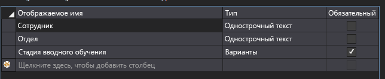
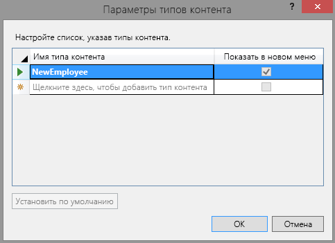
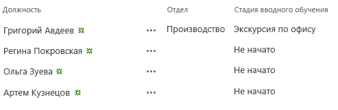

# <a name="add-a-custom-content-type-to-a-sharepoint-hosted-sharepoint-add-in"></a><span data-ttu-id="17028-103">Добавление настраиваемого типа контента в надстройку с размещением в SharePoint</span><span class="sxs-lookup"><span data-stu-id="17028-103">Add a custom content type to a SharePoint-hosted SharePoint Add-in</span></span>

<span data-ttu-id="17028-104">Это четвертая часть серии статей, посвященной основам разработки надстроек SharePoint с размещением в SharePoint. Для начала вам необходимо ознакомиться со статьей [Надстройки SharePoint](sharepoint-add-ins.md) и предыдущими статьями этой серии:</span><span class="sxs-lookup"><span data-stu-id="17028-104">This is the fourth in a series of articles about the basics of developing SharePoint-hosted SharePoint Add-ins. You should first be familiar with  [SharePoint Add-ins](sharepoint-add-ins.md) and the other articles in this series:</span></span>

-  [<span data-ttu-id="17028-105">Знакомство с созданием надстроек SharePoint с размещением в SharePoint</span><span class="sxs-lookup"><span data-stu-id="17028-105">Get started creating SharePoint-hosted SharePoint Add-ins</span></span>](get-started-creating-sharepoint-hosted-sharepoint-add-ins.md)   
-  [<span data-ttu-id="17028-106">Развертывание и установка надстроек SharePoint, размещаемых в SharePoint</span><span class="sxs-lookup"><span data-stu-id="17028-106">Deploy and install a SharePoint-hosted SharePoint Add-in</span></span>](deploy-and-install-a-sharepoint-hosted-sharepoint-add-in.md)
-  [<span data-ttu-id="17028-107">Добавление настраиваемых столбцов в надстройку SharePoint, размещаемую в SharePoint</span><span class="sxs-lookup"><span data-stu-id="17028-107">Add custom columns to a SharePoint-hosted SharePoint Add-in</span></span>](add-custom-columns-to-a-sharepoint-hosted-sharepoint-add-in.md)
    
> [!NOTE]
> <span data-ttu-id="17028-108">Если вы изучали предыдущие статьи этой серии о надстройках, размещаемых в SharePoint, то у вас уже есть решение для Visual Studio, которое можно использовать для работы с этой статьей.</span><span class="sxs-lookup"><span data-stu-id="17028-108">Note  If you have been working through this series about SharePoint-hosted add-ins, then you have a Visual Studio solution that you can use to continue with this topic. You can also download the repository at  SharePoint_SP-hosted_Add-Ins_Tutorials and open the BeforeClientRenderedControl.sln file.</span></span> <span data-ttu-id="17028-109">Вы можете также скачать репозиторий на веб-странице [SharePoint_SP-hosted_Add-Ins_Tutorials](https://github.com/OfficeDev/SharePoint_SP-hosted_Add-Ins_Tutorials) и открыть файл BeforeContentType.sln.</span><span class="sxs-lookup"><span data-stu-id="17028-109">You can also download the repository at [SharePoint_SP-hosted_Add-Ins_Tutorials](https://github.com/OfficeDev/SharePoint_SP-hosted_Add-Ins_Tutorials) and open the BeforeContentType.sln file.</span></span>

<span data-ttu-id="17028-110">В этой статье описано, как добавить настраиваемый тип контента в надстройку SharePoint Employee Orientation (Адаптация сотрудников).</span><span class="sxs-lookup"><span data-stu-id="17028-110">In this article you add a custom content type to the Employee Orientation SharePoint Add-in.</span></span>
 

## <a name="create-the-custom-content-type"></a><span data-ttu-id="17028-111">Создание настраиваемого типа контента</span><span class="sxs-lookup"><span data-stu-id="17028-111">Create the custom content type</span></span>

1. <span data-ttu-id="17028-112">В **обозревателе решений** щелкните проект правой кнопкой мыши и выберите пункты **Добавить** > **Новая папка**.</span><span class="sxs-lookup"><span data-stu-id="17028-112">In **Solution Explorer**, right-click the project and select **Add** > **New Folder**.</span></span> <span data-ttu-id="17028-113">Присвойте папке имя **Content Types** (Типы контента).</span><span class="sxs-lookup"><span data-stu-id="17028-113">Name the folder **Content Types**.</span></span>
     
2. <span data-ttu-id="17028-114">Щелкните новую папку правой кнопкой мыши и выберите пункты **Добавить** > **Новый элемент**.</span><span class="sxs-lookup"><span data-stu-id="17028-114">Right-click the new folder and select **Add** > **New Item**.</span></span> <span data-ttu-id="17028-115">В узле **Office/SharePoint** откроется диалоговое окно **Добавление нового элемента**.</span><span class="sxs-lookup"><span data-stu-id="17028-115">Right-click the new folder and choose  AddNew Item. The  **Add New Item** dialog box opens to the **Office/SharePoint** node..</span></span>
     
3. <span data-ttu-id="17028-116">Выберите **Тип контента** и присвойте ему имя **NewEmployee**, а затем нажмите кнопку **Добавить**.</span><span class="sxs-lookup"><span data-stu-id="17028-116">Select **Content Type** and give it the name **NewEmployee**, and then select **Add**.</span></span> <span data-ttu-id="17028-117">При запросе мастера выбрать базовый тип содержимого щелкните **Элемент**, и нажмите кнопку **Готово**.</span><span class="sxs-lookup"><span data-stu-id="17028-117">Choose  Content Type and give it the nameNewEmployee, and then choose  Add. When prompted by the wizard to select the base content type, choose  **Item**, and then choose  **Finish**.</span></span>   
 
4. <span data-ttu-id="17028-118">Если конструктор типов контента не открылся автоматически, откройте его самостоятельно, выбрав тип контента **NewEmployee** в **обозревателе решений**.</span><span class="sxs-lookup"><span data-stu-id="17028-118">If the content type designer does not automatically open, choose the  **NewEmployee** content type in **Solution Explorer** to open it.</span></span>
    
5. <span data-ttu-id="17028-119">В конструкторе откройте вкладку **Тип контента** и заполните текстовые поля так:</span><span class="sxs-lookup"><span data-stu-id="17028-119">Open the  **Content Type** tab in the designer and fill the text boxes as follows:</span></span>
    
   -  <span data-ttu-id="17028-120">**Имя типа контента**: NewEmployee</span><span class="sxs-lookup"><span data-stu-id="17028-120">**Content Type Name**: NewEmployee</span></span>
   -  <span data-ttu-id="17028-121">**Описание**: "Представляет нового сотрудника"</span><span class="sxs-lookup"><span data-stu-id="17028-121">**Description**: Represents a new employee.</span></span>
   -  <span data-ttu-id="17028-122">**Имя группы**: "Адаптация сотрудников"</span><span class="sxs-lookup"><span data-stu-id="17028-122">**Group Name**: Employee Orientation</span></span>
 
6. <span data-ttu-id="17028-123">Убедитесь, что на вкладке не установлен *ни один* флажок.</span><span class="sxs-lookup"><span data-stu-id="17028-123">Verify that *none* of the check boxes on the tab are selected.</span></span> <span data-ttu-id="17028-124">Флажок **Наследует столбцы родительского типа содержимого** может быть установлен по умолчанию.</span><span class="sxs-lookup"><span data-stu-id="17028-124">Verify that  none  of the check boxes on the tab are selected. The check box for **Inherits the columns from the parent Content Type** may be selected by default. Be sure to clear it.</span></span> <span data-ttu-id="17028-125">*Обязательно снимите его.*</span><span class="sxs-lookup"><span data-stu-id="17028-125">*Be sure to clear it.*</span></span>  <span data-ttu-id="17028-126">Теперь вкладка должна выглядеть так:</span><span class="sxs-lookup"><span data-stu-id="17028-126">The method should now look like the following.</span></span>
    
    <span data-ttu-id="17028-127">*Рис. 1. Вкладка "Тип контента"*</span><span class="sxs-lookup"><span data-stu-id="17028-127">*Figure 1. Content Type Tab*</span></span>

    
 
7. <span data-ttu-id="17028-129">Откройте вкладку конструктора **Столбцы**.</span><span class="sxs-lookup"><span data-stu-id="17028-129">Open the **Columns** tab in the designer.</span></span>
     
8. <span data-ttu-id="17028-130">В таблице выберите **Щелкните здесь, чтобы добавить столбец** и добавьте столбец **Подразделение**.</span><span class="sxs-lookup"><span data-stu-id="17028-130">In the grid, select **Click here to add a column** to open a drop-down list of columns, and add the **Division** column.</span></span> <span data-ttu-id="17028-131">Для этого выберите пункт **Подразделение** в раскрывающемся списке.</span><span class="sxs-lookup"><span data-stu-id="17028-131">It is listed in the drop-down list by its display name **Division**.</span></span> <span data-ttu-id="17028-132">Так же добавьте столбец **Этап адаптации**.</span><span class="sxs-lookup"><span data-stu-id="17028-132">Do the same for the **Orientation Stage** column.</span></span> <span data-ttu-id="17028-133">(Если этих пунктов нет в списке, это значит, что вы используете неправильное решение Visual Studio.</span><span class="sxs-lookup"><span data-stu-id="17028-133">(If they are not listed, you may not have started with the correct Visual Studio solution.</span></span> <span data-ttu-id="17028-134">Начните с файла BeforeContentType.sln.) По завершении таблица должна выглядеть так:</span><span class="sxs-lookup"><span data-stu-id="17028-134">Start with BeforeContentType.sln.) When you are finished, the grid should look like the following:</span></span>
    
    <span data-ttu-id="17028-135">*Рис. 2. Вкладка "Столбцы"*</span><span class="sxs-lookup"><span data-stu-id="17028-135">*Figure 2. Columns Tab*</span></span>

    

9. <span data-ttu-id="17028-137">Сохраните файл и закройте конструктор.</span><span class="sxs-lookup"><span data-stu-id="17028-137">Save the file and close the designer.</span></span>

### <a name="modify-the-elementsxml-file"></a><span data-ttu-id="17028-138">Изменение файла elements.xml</span><span class="sxs-lookup"><span data-stu-id="17028-138">Modify the elements.xml file</span></span>

1. <span data-ttu-id="17028-139">На следующем этапе вам потребуется работать непосредственно с необработанным кодом XML типа контента, поэтому в **обозревателе решений** необходимо выбрать дочерний файл elements.xml типа контента **NewEmployee**.</span><span class="sxs-lookup"><span data-stu-id="17028-139">The next step requires that you work directly in the raw XML for the content type, so in  **Solution Explorer**, choose the elements.xml file child of the  **NewEmployee** content type.</span></span>
    
2. <span data-ttu-id="17028-140">В файле двух добавленных вами столбцов уже есть элементы **FieldRef**.</span><span class="sxs-lookup"><span data-stu-id="17028-140">There are already **FieldRef** elements in the file for the two columns that you added.</span></span> <span data-ttu-id="17028-141">Добавьте элементы **FieldRef** для двух встроенных столбцов SharePoint, которые будут равнозначны двум уже имеющимся.</span><span class="sxs-lookup"><span data-stu-id="17028-141">Add **FieldRef** elements for two built-in SharePoint columns as peers of the two that are already there.</span></span> <span data-ttu-id="17028-142">Ниже приведена разметка для элементов.</span><span class="sxs-lookup"><span data-stu-id="17028-142">The following is the markup for the elements.</span></span> <span data-ttu-id="17028-143">*Необходимо использовать эти же идентификаторы GUID для атрибута ID, так как это встроенные типы полей с фиксированными ID.*</span><span class="sxs-lookup"><span data-stu-id="17028-143">*You must use these same GUIDs for the ID attribute because these are built-in field types with fixed IDs.*</span></span> <span data-ttu-id="17028-144">Добавьте их *над* двумя элементами **FieldRef** настраиваемых столбцов сайта.</span><span class="sxs-lookup"><span data-stu-id="17028-144">Add these *above* the two **FieldRef** elements for the custom site columns.</span></span> <span data-ttu-id="17028-145">Обратите внимание, что этим полям присвоено отображаемое имя **Сотрудник**.</span><span class="sxs-lookup"><span data-stu-id="17028-145">Note that we have given these fields the custom display name **Employee**.</span></span>
    
    ```
      <FieldRef Name="LinkTitle" ID="{82642ec8-ef9b-478f-acf9-31f7d45fbc31}" DisplayName="Employee" />
      <FieldRef Name="Title" ID="{fa564e0f-0c70-4ab9-b863-0177e6ddd247}" DisplayName="Employee" />
    ```
 
3. <span data-ttu-id="17028-146">Сохраните и закройте файл.</span><span class="sxs-lookup"><span data-stu-id="17028-146">Save and close the file.</span></span>
 
###  <a name="modify-content-type-settings"></a><span data-ttu-id="17028-147">Изменение параметров типа контента</span><span class="sxs-lookup"><span data-stu-id="17028-147">Modify Content Type settings</span></span>

1. <span data-ttu-id="17028-148">Разверните узел **Lists** (Списки) в **обозревателе решений** и выберите список **NewEmployeeOrientation**, чтобы открыть конструктор типов списка.</span><span class="sxs-lookup"><span data-stu-id="17028-148">Expand the  **Lists** node in **Solution Explorer** and choose **NewEmployeeOrientation** to open the list type designer.</span></span>
    
2. <span data-ttu-id="17028-149">Откройте вкладку **Столбцы** конструктора и нажмите кнопку **Типы контента**.</span><span class="sxs-lookup"><span data-stu-id="17028-149">Open the  **Columns** tab in the designer, and then choose the **Content Types** button.</span></span>
    
3. <span data-ttu-id="17028-150">В диалоговом окне **Параметры типа контента** добавьте тип контента **NewEmployee**.</span><span class="sxs-lookup"><span data-stu-id="17028-150">In the  **Content Type Settings** dialog box, add the **NewEmployee** content type.</span></span>
    
4. <span data-ttu-id="17028-151">Выберите тип контента **NewEmployee** в списке типов контента, а затем нажмите кнопку **По умолчанию**.</span><span class="sxs-lookup"><span data-stu-id="17028-151">Choose the  **NewEmployee** content type in the list of types, and choose the **Set as Default** button.</span></span>
 
5. <span data-ttu-id="17028-152">Выберите тип контента **Item**, щелкните правой кнопкой мыши маленькую стрелку слева от имени типа контента и выберите пункт **Удалить**.</span><span class="sxs-lookup"><span data-stu-id="17028-152">Choose the  **Item** content type, right-click the small arrowhead that appears to the left of the content type name, and then choose **Delete**.</span></span>
    
6. <span data-ttu-id="17028-153">Повторите предыдущий этап для типа контента **Folder**, чтобы в списке остался только тип контента **NewEmployee**.</span><span class="sxs-lookup"><span data-stu-id="17028-153">Repeat the preceding step for the  **Folder** content type, so **NewEmployee** is the only content type listed. The dialog box should now look like the following:</span></span> <span data-ttu-id="17028-154">Диалоговое окно должно выглядеть так:</span><span class="sxs-lookup"><span data-stu-id="17028-154">The method should now look like the following.</span></span>
    
    <span data-ttu-id="17028-155">*Рис. 3. Диалоговое окно "Параметры типа контента"*</span><span class="sxs-lookup"><span data-stu-id="17028-155">*Content Type Settings dialog box*</span></span>

    
 
7.  <span data-ttu-id="17028-157">Нажмите кнопку **ОК**, чтобы закрыть диалоговое окно, а затем сохраните и закройте файл.</span><span class="sxs-lookup"><span data-stu-id="17028-157">Choose **OK** to close the dialog box, and then save and close the file.</span></span>

### <a name="modify-the-schemaxml-file-and-elementxml-file"></a><span data-ttu-id="17028-158">Изменение файлов schema.xml и element.xml</span><span class="sxs-lookup"><span data-stu-id="17028-158">Modify the schema.xml file and element.xml file</span></span>

1. <span data-ttu-id="17028-159">Откройте файл schema.xml.</span><span class="sxs-lookup"><span data-stu-id="17028-159">Open the schema.xml file.</span></span>
    
2. <span data-ttu-id="17028-160">Найдите элемент **Fields**.</span><span class="sxs-lookup"><span data-stu-id="17028-160">Find the **Fields** element.</span></span> <span data-ttu-id="17028-161">В нем должны быть три элемента **Field**: **Title**, **Division** и **OrientationStage**.</span><span class="sxs-lookup"><span data-stu-id="17028-161">It should have three **Field** elements: **Title**, **Division**, and **OrientationStage**.</span></span> <span data-ttu-id="17028-162">(В созданном файле эти элементы могут быть в одной строке.</span><span class="sxs-lookup"><span data-stu-id="17028-162">(These elements may be on a single line in this generated file.</span></span> <span data-ttu-id="17028-163">Если это так, разделите их с помощью разрывов строк.)</span><span class="sxs-lookup"><span data-stu-id="17028-163">If so, separate them with line breaks.)</span></span>
 
3. <span data-ttu-id="17028-164">Не закрывайте файл, а затем в **обозревателе решений** разверните папку **Site Columns** (Столбцы сайта) и узел **Division**, а затем откройте файл elements.xml узла **Division**.</span><span class="sxs-lookup"><span data-stu-id="17028-164">Leave the file open, and in **Solution Explorer**, expand the **Site Columns** folder and the **Division** node, and then open the elements.xml file for **Division**.</span></span> <span data-ttu-id="17028-165">Элемент **Field** узла **Division** в файле schema.xml должен точно дублировать элемент **Field** узла **Division** в файле elements.xml.</span><span class="sxs-lookup"><span data-stu-id="17028-165">The **Field** element for **Division** in schema.xml should exactly duplicate the **Field** element in the **Division** elements.xml.</span></span> <span data-ttu-id="17028-166">Если совпадение не точное, скопируйте элемент **Field** из файла elements.xml в столбце сайта и вставьте его вместо элемента **Field** в файле schema.xml.</span><span class="sxs-lookup"><span data-stu-id="17028-166">If there is not an exact match, copy the **Field** element from the site column elements.xml file and paste it in place of the mismatched **Field** element in the schema.xml file.</span></span> <span data-ttu-id="17028-167">Закройте файл element.xml.</span><span class="sxs-lookup"><span data-stu-id="17028-167">Close the element.xml file.</span></span>
    
4. <span data-ttu-id="17028-168">Откройте файл elements.xml элемента **OrientationStage**.</span><span class="sxs-lookup"><span data-stu-id="17028-168">Open the elements.xml file for **OrientationStage**.</span></span> <span data-ttu-id="17028-169">При этом также должно быть точное совпадение элементов **Field** в двух файлах элемента **OrientationStage**, включая все дочерние элементы, например **CHOICES** (ВАРИАНТЫ) и **MAPPINGS** (СОПОСТАВЛЕНИЯ).</span><span class="sxs-lookup"><span data-stu-id="17028-169">Here, too, there must be an exact match of the  **Field** elements in the two files for **OrientationStage**, including all child elements, such as the **CHOICES** and **MAPPINGS** elements.</span></span> <span data-ttu-id="17028-170">Если совпадение не точное, скопируйте элемент **Field** из файла elements.xml в столбце сайта и вставьте его вместо элемента **Field** в файле schema.xml.</span><span class="sxs-lookup"><span data-stu-id="17028-170">If there isn't, copy the **Field** in the elements.xml file and paste it in place of the mismatched **Field** element in the schema.xml file.</span></span> <span data-ttu-id="17028-171">Закройте файл element.xml.</span><span class="sxs-lookup"><span data-stu-id="17028-171">Close the element.xml file.</span></span>
 
5. <span data-ttu-id="17028-172">Не закрывая файл schema.xml, в элементе **View**, значение **BaseViewID** которого равно "1", найдите дочерний элемент **ViewFields**, а затем добавьте два приведенных ниже элемента **FieldRef** в качестве его дочерних объектов.</span><span class="sxs-lookup"><span data-stu-id="17028-172">Still in the schema.xml file, in the  **View** element whose **BaseViewID** value is "1", find the child **ViewFields** element and then add the following two **FieldRef** elements as children of it. They may already be there, but missing an ID attribute. If so, add the ID attribute.</span></span> <span data-ttu-id="17028-173">Возможно, они уже существуют, но не содержат атрибута **ID**.</span><span class="sxs-lookup"><span data-stu-id="17028-173">They may already be there but missing an **ID** attribute.</span></span> <span data-ttu-id="17028-174">В таком случае добавьте атрибут ID.</span><span class="sxs-lookup"><span data-stu-id="17028-174">If so, add the ID attribute.</span></span>
    
    ```
      <FieldRef Name="Division" ID="{GUID from the Field element}" />
      <FieldRef Name="OrientationStage" ID="{GUID from the Field element}" />

    ```

6. <span data-ttu-id="17028-175">Замените заполнители значений двух атрибутов **ID** на идентификаторы GUID из соответствующих элементов **Field** в элементе **ContentType** для типа **NewEmployee**, расположенном выше в файле schema.xml.</span><span class="sxs-lookup"><span data-stu-id="17028-175">Replace the two placeholder  **ID** attribute values with the GUIDs from the corresponding **Field** elements in the **ContentType** element for **NewEmployee** that is earlier in the schema.xml file. Don't forget the framing braces "{}".</span></span> <span data-ttu-id="17028-176">Не забудьте добавить фигурные скобки: {}.</span><span class="sxs-lookup"><span data-stu-id="17028-176">Don't forget the framing braces "{}".</span></span> <span data-ttu-id="17028-177">Ниже показано, как должен выглядеть элемент **ViewFields** для элемента **View** с идентификатором "1" (у вас могут быть другие идентификаторы GUID).</span><span class="sxs-lookup"><span data-stu-id="17028-177">The  **ViewFields** for the "1" **View** should look like this. (Your GUIDs may be different.)</span></span>

    ```
      <ViewFields>
        <FieldRef Name="LinkTitle" ID="{82642ec8-ef9b-478f-acf9-31f7d45fbc31}" DisplayName="Employee" />
        <FieldRef Name="Division" ID="{509d2d67-9a96-4596-9b3b-58449cdcc6ff}" />
        <FieldRef Name="OrientationStage" ID="{38a3b54c-acf3-4ddf-b748-55c7c28d4cc2}" />        
      </ViewFields>
    ```

7. <span data-ttu-id="17028-178">Не закрывая файл schema.xml, найдите элемент **View**, значение **BaseViewID** которого равно "0".</span><span class="sxs-lookup"><span data-stu-id="17028-178">Still in the schema.xml file, find the  **View** element whose **BaseViewID** value is "0". find the ViewFields element with in it.</span></span> <span data-ttu-id="17028-179">Найдите в нем элемент **ViewFields**.</span><span class="sxs-lookup"><span data-stu-id="17028-179">Find the **ViewFields** element within it.</span></span>

8. <span data-ttu-id="17028-180">Скопируйте весь раздел **ViewFields** элемента View "1" и вставьте его вместо раздела **ViewFields** элемента View "0".</span><span class="sxs-lookup"><span data-stu-id="17028-180">Copy the whole of the  **ViewFields** section from View "1" over the **ViewFields** section of View "0". The two views should now have identical ViewFields sections.</span></span> <span data-ttu-id="17028-181">Два представления теперь должны иметь одинаковые разделы **ViewFields**.</span><span class="sxs-lookup"><span data-stu-id="17028-181">The two views should now have identical **ViewFields** sections.</span></span>
    
9. <span data-ttu-id="17028-182">Сохраните и закройте файл schema.xml.</span><span class="sxs-lookup"><span data-stu-id="17028-182">Save and close the schema.xml file.</span></span>

10. <span data-ttu-id="17028-183">В папке **Lists** (Списки) разверните узел **NewEmployeeOrientation** и его дочерний экземпляр списка **NewEmployeesInSeattle**.</span><span class="sxs-lookup"><span data-stu-id="17028-183">In the **Lists** folder, expand both the **NewEmployeeOrientation** node and its child list instance **NewEmployeesInSeattle**.</span></span> <span data-ttu-id="17028-184">Вы должны отличить файл elements.xml шаблона от файла elements.xml экземпляра.</span><span class="sxs-lookup"><span data-stu-id="17028-184">In the  Lists folder, expand both the NewEmployeeOrientation node and its child list instance NewEmployeesInSeattle. You should be able to clearly see and distinguish the elements.xml for the template from the elements.xml for the instance. Open the one for the instance.</span></span> <span data-ttu-id="17028-185">Откройте файл elements.xml экземпляра.</span><span class="sxs-lookup"><span data-stu-id="17028-185">Open the one for the instance.</span></span> 
    
11. <span data-ttu-id="17028-186">Добавьте два элемента **Field** в первый элемент **Row**, чтобы элемент **Row** выглядел, как показано ниже.</span><span class="sxs-lookup"><span data-stu-id="17028-186">Add two  **Field** elements to the first **Row** element, so that the **Row** element looks like the following.</span></span>
    
    ``` 
    <Row>
      <Field Name="Title">Tom Higginbotham</Field>
      <Field Name="Division">Manufacturing</Field>
      <Field Name="OrientationStage">Tour of building</Field>
    </Row>
    ```

12. <span data-ttu-id="17028-187">Сохраните и закройте файл.</span><span class="sxs-lookup"><span data-stu-id="17028-187">Save and close the file.</span></span>
    

## <a name="run-and-test-the-add-in"></a><span data-ttu-id="17028-188">Запуск и тестирование надстройки</span><span class="sxs-lookup"><span data-stu-id="17028-188">Run and test the add-in</span></span>

1. <span data-ttu-id="17028-p117">Нажмите клавишу F5, чтобы развернуть и запустить надстройку. Visual Studio выполнит временную установку надстройки на тестовом сайте SharePoint и сразу же запустит ее.</span><span class="sxs-lookup"><span data-stu-id="17028-p117">Use the F5 key to deploy and run your add-in. Visual Studio makes a temporary installation of the add-in on your test SharePoint site and immediately runs the add-in.</span></span> 
     
2. <span data-ttu-id="17028-191">Когда откроется страница надстройки по умолчанию, щелкните ссылку **New Employees in Seattle** (Новые сотрудники в Сиэтле), чтобы открыть экземпляр настраиваемого списка.</span><span class="sxs-lookup"><span data-stu-id="17028-191">When the add-in's default page opens, choose the  **New Employees in Seattle** link to open the custom list instance.</span></span>
 
3. <span data-ttu-id="17028-192">Откроется список со столбцами **Division** и **OrientationStage**.</span><span class="sxs-lookup"><span data-stu-id="17028-192">The list page opens and the **Division** and **OrientationStage** columns are on it.</span></span> <span data-ttu-id="17028-193">Пользователю не обязательно добавлять их вручную, так как они являются частью типа контента списка.</span><span class="sxs-lookup"><span data-stu-id="17028-193">The list page opens and the Division andOrientationStage columns are on it. It is not necessary for a user to add them manually because they are part of the list's content type. The top item has the data you added.</span></span> <span data-ttu-id="17028-194">Верхний элемент содержит добавленные вами данные.</span><span class="sxs-lookup"><span data-stu-id="17028-194">The top item has the data you added.</span></span>
    
    <span data-ttu-id="17028-195">*Рис. 4. Список "Новые сотрудники в Сиэтле"*</span><span class="sxs-lookup"><span data-stu-id="17028-195">*New Employees in Seattle list*</span></span>

     
 
4. <span data-ttu-id="17028-197">Попробуйте добавлять к списку новые элементы и редактировать существующие.</span><span class="sxs-lookup"><span data-stu-id="17028-197">Try adding new items to the list and editing existing items.</span></span>
    
5. <span data-ttu-id="17028-198">Чтобы завершить сеанс отладки, закройте окно браузера или остановите отладку в Visual Studio.</span><span class="sxs-lookup"><span data-stu-id="17028-198">To end the debugging session, close the browser window or stop debugging in Visual Studio. Each time that you press F5, Visual Studio will retract the previous version of the add-in and install the latest one.</span></span> <span data-ttu-id="17028-199">При каждом нажатии клавиши F5 Visual Studio будет отзывать предыдущую версию надстройки и устанавливать последнюю.</span><span class="sxs-lookup"><span data-stu-id="17028-199">To end the debugging session, close the browser window or stop debugging in Visual Studio. Each time that you press F5, Visual Studio will retract the previous version of the add-in and install the latest one.</span></span>
    
6. <span data-ttu-id="17028-200">Вы будете работать с этой надстройкой и решением Visual Studio при изучении других статей, поэтому при перерывах в работе рекомендуется отзывать надстройку.</span><span class="sxs-lookup"><span data-stu-id="17028-200">You will work with this add-in and Visual Studio solution in other articles, and it's a good practice to retract the add-in one last time when you are done working with it for a while. Right-click the project in  Solution Explorer and choose Retract.</span></span> <span data-ttu-id="17028-201">В **обозревателе решений** щелкните проект правой кнопкой мыши и выберите пункт **Отозвать**.</span><span class="sxs-lookup"><span data-stu-id="17028-201">Right-click the project in  **Solution Explorer** and choose **Retract**.</span></span>

## <a name="next-steps"></a><span data-ttu-id="17028-202">Дальнейшие действия</span><span class="sxs-lookup"><span data-stu-id="17028-202">Next steps</span></span>
<span data-ttu-id="17028-203"><a name="Nextsteps"> </a></span><span class="sxs-lookup"><span data-stu-id="17028-203"></span></span>

<span data-ttu-id="17028-204">В следующей статье этой серии описано, как [добавить веб-часть на страницу в надстройке SharePoint, размещаемой в SharePoint](add-a-web-part-to-a-page-in-a-sharepoint-hosted-sharepoint-add-in.md).</span><span class="sxs-lookup"><span data-stu-id="17028-204">In the next article in this series, you'll add a list view Web Part to the default page of the SharePoint Add-in:  [Add a Web Part to a page in a SharePoint-hosted SharePoint Add-in](add-a-web-part-to-a-page-in-a-sharepoint-hosted-sharepoint-add-in.md).</span></span>
