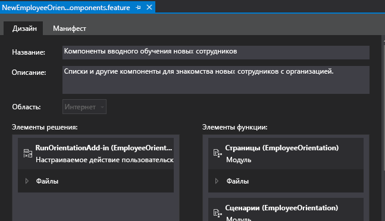

# Создание настраиваемой кнопки ленты на хост-сайте надстройки SharePointCreate a custom ribbon button in the host web of a SharePoint Add-in
В этой статье рассказывается, как добавить команды для настраиваемых кнопок ленты на хост-сайте надстройки SharePoint.Add custom ribbon button commands to the host web of a SharePoint Add-in.
 

 **Примечание.** В настоящее время идет процесс замены названия "приложения для SharePoint" названием "надстройки SharePoint". Во время этого процесса в документации и пользовательском интерфейсе некоторых продуктов SharePoint и средств Visual Studio может по-прежнему использоваться термин "приложения для SharePoint". Дополнительные сведения см. в статье [Новое название приложений для Office и SharePoint](new-name-for-apps-for-sharepoint.md#bk_newname).**Note**  The name "apps for SharePoint" is changing to "SharePoint Add-ins". During the transition, the documentation and the UI of some SharePoint products and Visual Studio tools might still use the term "apps for SharePoint". For details, see  [New name for apps for Office and SharePoint](new-name-for-apps-for-sharepoint.md#bk_newname).
 

Это девятая часть серии статей, посвященной основам разработки надстроек, размещаемых в SharePoint. Для начала вам следует ознакомиться со статьей [Надстройки SharePoint](sharepoint-add-ins.md) и предыдущими статьями из этой серии.This is the ninth in a series of articles about the basics of developing SharePoint-hosted SharePoint Add-ins. You should first be familiar with  [SharePoint Add-ins](sharepoint-add-ins.md) and the previous articles in this series:
 

-  [Знакомство с созданием надстроек SharePoint с размещением в SharePointGet started creating SharePoint-hosted SharePoint Add-ins](get-started-creating-sharepoint-hosted-sharepoint-add-ins.md)
    
 
-  [Развертывание и установка надстроек SharePoint, размещаемых в SharePointDeploy and install a SharePoint-hosted SharePoint Add-in](deploy-and-install-a-sharepoint-hosted-sharepoint-add-in.md)
    
 
-  [Добавление настраиваемых столбцов в надстройки, размещаемые в SharePointAdd custom columns to a SharePoint-hostedSharePoint Add-in](add-custom-columns-to-a-sharepoint-hostedsharepoint-add-in.md)
    
 
-  [Добавление настраиваемого типа контента в надстройки, размещаемые в SharePointAdd a custom content type to a SharePoint-hostedSharePoint Add-in](add-a-custom-content-type-to-a-sharepoint-hostedsharepoint-add-in.md)
    
 
-  [Добавление веб-части на страницу в надстройку для SharePoint с размещением в SharePointAdd a Web Part to a page in a SharePoint-hosted SharePoint Add-in](add-a-web-part-to-a-page-in-a-sharepoint-hosted-sharepoint-add-in.md)
    
 
-  [Добавление рабочего процесса в надстройку для SharePoint с размещением в SharePointAdd a workflow to a SharePoint-hosted SharePoint Add-in](add-a-workflow-to-a-sharepoint-hosted-sharepoint-add-in.md)
    
 
-  [Добавление настраиваемой страницы и стиля для надстройки с размещением в SharePointAdd a custom page and style to a SharePoint-hosted SharePoint Add-in](add-a-custom-page-and-style-to-a-sharepoint-hosted-sharepoint-add-in.md)
    
 
-  [Добавление настраиваемой клиентской обработки в надстройку SharePoint, размещаемую в SharePointAdd custom client-side rendering to a SharePoint-hosted SharePoint Add-in](add-custom-client-side-rendering-to-a-sharepoint-hosted-sharepoint-add-in.md)
    
 

 **Примечание.** Если вы изучали предыдущие статьи этой серии о надстройках, размещаемых в SharePoint, то у вас уже есть решение Visual Studio, которое можно использовать для работы с данной статьей. Кроме того, вы можете скачать репозиторий [SharePoint_SP-hosted_Add-Ins_Tutorials](https://github.com/OfficeDev/SharePoint_SP-hosted_Add-Ins_Tutorials) и открыть файл BeforeRibbon.sln.**Note**  If you have been working through this series about SharePoint-hosted add-ins, then you have a Visual Studio solution that you can use to continue with this topic. You can also download the repository at  [SharePoint_SP-hosted_Add-Ins_Tutorials](https://github.com/OfficeDev/SharePoint_SP-hosted_Add-Ins_Tutorials) and open the BeforeRibbon.sln file.
 

Любую надстройку SharePoint можно запустить на странице **Содержимое сайта** хост-сайта. Для этого достаточно щелкнуть плитку необходимой надстройки. Кроме того, функциональность надстройки SharePoint можно сделать доступной на хост-сайте с помощью дополнительных действий, которые представляют собой настраиваемые кнопки ленты или настраиваемые элементы меню. В процессе изучения этой статьи вы добавите кнопку на ленту хост-сайта.All SharePoint Add-ins can be run from the  **Site Contents** page of the host web by clicking the add-in's tile. The functionality of a SharePoint Add-in can also be exposed on the host web through custom actions, which are custom ribbon buttons or custom menu items. In this article you add a button to the ribbon on a host web.
 

## Подготовка хост-сайтаPrepare the host web

Ниже показано, как добавить кнопку на ленту календаря на хост-сайте. В пользовательском интерфейсе сайта разработчика SharePoint выполните указанные ниже действия.You will add the button to the ribbon of a calendar on the host web. Take the following steps in the UI of your SharePoint developer site.
 

 

1. На домашней странице сайта выберите пункты **Содержимое сайта** > **добавить надстройку** > **Календарь**.From the home page of the site, choose  **Site Contents** > **add and add-in** > **Calendar**.
    
 
2. В диалоговом окне **Добавление календаря** в поле **Имя** введите Employee Orientation Schedule (Расписание вводного обучения для сотрудников), а затем нажмите кнопку **Создать**.On the  **Adding Calendar** dialog, typeEmployee Orientation Schedule for the **Name**, and then choose  **Create**.
    
 
3. Когда откроется календарь, наведите указатель на любую дату, чтобы на ней появилась ссылка **Add** (Добавить), и перейдите по этой ссылке.When the calendar opens, put the cursor on any date until the  **Add** link appears on the date, and then click **Add**. 
    
 
4. В диалоговом окне **Employee Orientation Schedule - New Item** (Расписание вводного обучения для сотрудников: новый элемент) введите "Orient Cassi Hicks" (Вводное обучение Cassi Hicks) в поле **Title** (Название). В остальных полях оставьте значения, заданные по умолчанию, а затем нажмите кнопку **Save** (Сохранить).On the  **Employee Orientation Schedule - New Item** dialog, typeOrient Cassi Hicks for the **Title**. Leave the other fields at their defaults and click  **Save**.
    
    Календарь должен выглядеть примерно так:The calendar should look similar to the following:
    

    **Настраиваемый календарь****Custom calendar**

 

  
 

 

 

 

 

 **Важно!** Для выполнения следующей процедуры необходимо, чтобы календарь отображался в пользовательском интерфейсе Visual Studio. Но его не будет видно, если в момент создания календаря Visual Studio будет открыт. Прежде чем продолжить, закройте Visual Studio, окна браузера и консоли PowerShell, с помощью которых вы входили на сайт разработчика.**Important**  The next procedure requires that the calendar be visible in the UI of Visual Studio, but it won't be if If Visual Studio was open when you created the calendar. Before you continue, close Visual Studio and also log out of any browser windows and PowerShell consoles where you are logged into your developer site.
 

## Добавление дополнительного действия на лентеAdd a ribbon custom action

1. В **обозревателе решений** щелкните правой кнопкой мыши проект **EmployeeOrientation** (Вводное обучение для сотрудников) и выберите **Добавить** > **Новый элемент** > **Office/SharePoint** > **Настраиваемое действие ленты**. Присвойте новому элементу имя RunOrientationAdd-in и нажмите кнопку **Добавить**.In  **Solution Explorer**, right-click the  **EmployeeOrientation** project, and choose **Add** > **New Item** > **Office/SharePoint** > **Ribbon Custom Action**. Name it RunOrientationAdd-in, and then choose  **Add**.
    
 
2. **Мастер настраиваемого действия для ленты** задаст вам несколько вопросов. Ответьте на них, используя таблицу ниже.The  **Create Custom Action for Ribbon** wizard asks you a series of questions. Give the answers from the following table:
    

|**Вопрос для свойства****Property question**|**Ответ****Answer**|
|:-----|:-----|
|Где вы хотите разместить дополнительное действие?Where do you want to expose the custom action?|Выберите вариант **хост-сайт**.Choose  **Host Web**.|
|Какова область для дополнительного действия?Where is the custom action scoped to?|Выберите вариант **Экземпляр списка** (*не* "Шаблон списка").Choose  **List Instance** ( *not*  List Template).|
|К какому элементу относится дополнительное действие?Which particular item is the custom action scoped to?|Выберите вариант **Employee Orientation Schedule** (Расписание вводного обучения для сотрудников).Choose  **Employee Orientation Schedule**.|
|Где находится элемент управления?Where is the control located?|Не используйте варианты из раскрывающегося списка. Вместо этого введите **Ribbon.Calendar.Events.Actions.Controls._children**. (Третья часть, **Events**, идентифицирует вкладку на ленте, а четвертая часть, **Actions**, — группу кнопок.)Do not use the drop down selections. Instead, type  **Ribbon.Calendar.Events.Actions.Controls._children**. (The third part,  **Events**, identifies the tab of the ribbon, and the fourth part,  **Actions**, identifies the button group.)|
|Какой текст будет указан в элементе меню?What is the text on the menu item?|Введите **Employee Orientation** (Вводное обучение для сотрудников).Type  **Employee Orientation**.|
|Куда будет вести дополнительное действие?Where does the custom action navigate to?|Не используйте варианты из раскрывающегося списка. Вместо этого введите **~appWebUrl/Lists/NewEmployeesInSeattle**. Это страница представления списка, который находится на сайте надстройки, поэтому кнопка на ленте на хост-сайте открывает страницу на сайте надстройки.Do not use the drop down selections. Instead, type  **~appWebUrl/Lists/NewEmployeesInSeattle**. This is the list view page for the list, which is on the add-in web, so the ribbon button on the host web opens a page on the add-in web.|
3. Нажмите кнопку **Готово**.Choose  **Finish**. 
    
 

## Проверка компонента сайта надстройкиInspect the add-in web Feature

В **обозревателе решений** разверните узел **Компоненты** и выберите компонент **NewEmployeeOrientationComponents**. Откроется конструктор компонентов.In  **Solution Explorer**, expand the  **Features** folder and choose the **NewEmployeeOrientationComponents** feature. The Feature designer opens.
 

 
Обратите внимание, что созданное вами дополнительное действие **RunOrientationAdd-in** находится в списке **Элементы в решении**, а не в списке **Элементы в компоненте**. Это связано с тем, что компонент развернут на сайте надстройки, а ваше дополнительное действие — на хост-сайте. Когда вы создаете пакет надстройки в Visual Studio для развертывания в рабочей среде или нажимаете клавишу F5 в Visual Studio, пакет Инструменты разработчика Office для Visual Studio создает особый компонент хост-сайта, добавляет в него дополнительное действие и развертывает его на хост-сайте. Ни в коем случае не следует изменять компонент хост-сайта. Именно поэтому он не будет создан до момента формирования пакета.Notice that the custom action that you created,  **RunOrientationAdd-in**, is listed in  **Items in the solution**, but not in  **Items in the feature**. This is because the Feature is deployed to the add-in web, but your custom action is deployed to the host web. When you package the add-in in Visual Studio for deployment to production, or when you press F5 in Visual Studio, the Office Developer Tools for Visual Studio creates a special host web Feature, adds the custom action to it, and deploys it to the host web. You should never edit the host web Feature. That is why it is not created until packaging-time.
 

 

**Конструктор компонентов****Feature designer**

 

 

 

 

 

## Запуск и тестирование надстройкиRun and test the add-in

 

 

1. Нажмите клавишу F5, чтобы развернуть и запустить надстройку. Visual Studio выполнит временную установку надстройки на тестовом сайте SharePoint и сразу же запустит ее.Use the F5 key to deploy and run your add-in. Visual Studio makes a temporary installation of the add-in on your test SharePoint site and immediately runs the add-in. 
    
 
2. Откроется страница надстройки SharePoint, указанная по умолчанию. Перейдите на начальную страницу сайта разработчика (то есть хост-сайта). Ссылка на него расположена в левом верхнем углу страницы.The default page of the SharePoint Add-in opens. Navigate to the home page of your developer site (which is the host web). There is a breadcrumb link to it in the upper left of the page.
    
 
3. На домашней странице хост-сайта щелкните **Содержимое сайта**, а затем на странице **Содержимое сайта** щелкните календарь **Employee Orientation Schedule** (Расписание вводного обучения для сотрудников). Обратите внимание, что надстройку **Employee Orientation** (Вводное обучение для сотрудников) выбирать не надо.On the host web's home page, choose  **Site Contents**, and on the  **Site Contents** page, click the **Employee Orientation Schedule** calendar (not the **Employee Orientation** add-in).
    
 
4. Когда откроется календарь, щелкните событие **Orient Cassie Hicks** (Вводное обучение для пользователя Cassi Hicks). Если вкладка **События** на ленте не открылась автоматически, откройте ее. Она должна выглядеть примерно так, как показано ниже.When the calendar opens, click the event  **Orient Cassie Hicks**. If the  **Events** tab on the ribbon doesn't open automatically, open it. It should look similar to the following:
    
    **Вкладка ленты "События" с настраиваемой кнопкой****Events ribbon tab with custom button**

 

  
 

 

 
5. В группе **Действия** на ленте выберите элемент **Employee Orientation** (Вводное обучение для сотрудников). Откроется представление списка **New Employees in Seattle** (Новые сотрудники в Сиэтле).In the  **Actions** group on the ribbon, click **Employee Orientation**. The list view page for  **New Employees in Seattle** opens.
    
 
6. Чтобы завершить сеанс отладки, закройте окно браузера или остановите отладку в Visual Studio. При каждом нажатии клавиши F5 Visual Studio будет отзывать предыдущую версию надстройки и устанавливать ее последнюю версию.To end the debugging session, close the browser window or stop debugging in Visual Studio. Each time that you press F5, Visual Studio will retract the previous version of the add-in and install the latest one.
    
 
7. Эти надстройка и решение Visual Studio будут рассматриваться и в других статьях, поэтому при перерывах в работе рекомендуется отзывать надстройку. В **обозревателе решений** щелкните проект правой кнопкой мыши и выберите пункт **Отозвать**.You will work with this add-in and Visual Studio solution in other articles, and it's a good practice to retract the add-in one last time when you are done working with it for a while. Right-click the project in  **Solution Explorer** and choose **Retract**.
    
 

## 

Из следующей статьи этой серии вы узнаете, как добавить JavaScript в надстройку SharePoint и получить доступ к данным SharePoint с помощью объектной модели JavaScript для SharePoint. Название этой статьи:  [Использование API JavaScript для SharePoint для работы с данными SharePoint](use-the-sharepoint-javascript-apis-to-work-with-sharepoint-data.md).In the next article in this series, you'll add JavaScript to the SharePoint Add-in and access SharePoint data with SharePoint's JavaScript object model:  [Use the SharePoint JavaScript APIs to work with SharePoint data](use-the-sharepoint-javascript-apis-to-work-with-sharepoint-data.md).
 

 

