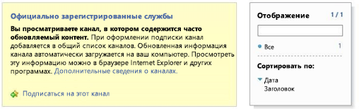

# Устранение неполадок и отладка удаленного приемника событий в надстройке для SharePointDebug and troubleshoot a remote event receiver in a SharePoint Add-in
Узнайте, как настроить среду разработки для отладки удаленных событий с помощью Visual Studio.Set up the your development environment to debug remote events in by using Visual Studio.
 

 **Примечание.** В настоящее время идет процесс замены названия "приложения для SharePoint" названием "надстройки SharePoint". Во время этого процесса в документации и пользовательском интерфейсе некоторых продуктов SharePoint и средств Visual Studio может по-прежнему использоваться термин "приложения для SharePoint". Дополнительные сведения см. в статье [Новое название приложений для Office и SharePoint](new-name-for-apps-for-sharepoint.md#bk_newname).**Note**  The name "apps for SharePoint" is changing to "SharePoint Add-ins". During the transition, the documentation and the UI of some SharePoint products and Visual Studio tools might still use the term "apps for SharePoint". For details, see  [New name for apps for Office and SharePoint](new-name-for-apps-for-sharepoint.md#bk_newname).
 

## Настройка отладки для удаленного тестового сайта SharePointConfigure debugging for a remote SharePoint test site

 **Примечание.** Описанные в этом разделе действия применимы, только если Visual Studio и тестовый сайт SharePoint развернуты на разных компьютерах, а также если в качестве тестового сайта используется сайт разработчика SharePoint Online. Если SharePoint и Visual Studio развернуты на одном компьютере, пропустите этот раздел.**Note**  The procedures in this section apply only when your test SharePoint site is on a different computer from Visual Studio or you are using an SharePoint Online Developer Site as your test site. If SharePoint and Visual Studio are on the same computer, skip this section.
 

Если проект Надстройка SharePoint в Visual Studio содержит приемник удаленных событий (RER) или приемник событий надстройки, то для отладки надстройки с помощью клавиши F5 нужно выполнить дополнительную быструю настройку свойств проекта. А для этого, в свою очередь, требуется настроить Azure. Не нужно повторно настраивать Azure для каждого подобного проекта. Если надстройка содержит обработчик событий AppInstalled, она не запустится ни с помощью клавиши F5, ни с помощью клавиш CTRL+F5 (запуск без отладки), пока не будут выполнены настройки, описанные в этом разделе.When a SharePoint Add-in project in Visual Studio includes a remote event receiver (RER) or an add-in event receiver, you have to do some additional quick configuration in the project properties before you can debug the add-in with (F5). This configuration, in turn, requires that you do some Azure configuration. You do not have to repeat the Azure configuration for every project that has an RER or add-in event. (If the add-in includes an AppInstalled event handler, the add-in won't even run with either F5 or Ctrl-F5 [run without debugging] unless you carry out the configuration in this section.)
 

 

### Настройка AzureTo configure Azure

1. Если у вас еще нет подписки Microsoft Azure, приобретите ее. Она входит в состав [подписки на MSDN](http://azure.microsoft.com/en-us/pricing/member-offers/msdn-benefits/).If you don't already have one, get an Microsoft Azure subscription. One is included as a benefit with an  [MSDN Subscription](http://azure.microsoft.com/en-us/pricing/member-offers/msdn-benefits/).
    
 
2. Выполните действия, описанные в статье [Создание или изменение пространства имен служебной шины](http://msdn.microsoft.com/library/fa561f70-007c-45aa-b34d-56317dbbfc87.aspx).Carry out the instructions in  [How To: Create or Modify a Service Bus Service Namespace](http://msdn.microsoft.com/library/fa561f70-007c-45aa-b34d-56317dbbfc87.aspx).
    
 

### Настройка проекта надстройки SharePoint в Visual StudioTo configure the SharePoint Add-in project in Visual Studio

1. Вам потребуется последняя версия Инструменты разработчика Office для Visual Studio 2013, поэтому  [запустите установщик веб-платформы, расположенный по ссылке ](http://aka.ms/OfficeDevToolsForVS2013), или  [установщик Инструментов разработчика Microsoft Office для Visual Studio 2015](http://aka.ms/OfficeDevToolsForVS2015).You should have the latest version of the Office Developer Tools for Visual Studio 2013, so  [run the WebPI installer here](http://aka.ms/OfficeDevToolsForVS2013), or  [installer for Office Developer Tools for Visual Studio 2015](http://aka.ms/OfficeDevToolsForVS2015).
    
 
2. Добавив приемник удаленных событий (RER) или обработчик событий надстройки в проект надстройки SharePoint в Visual Studio, щелкните правой кнопкой мыши проект в **обозревателе решений** и выберите пункт **Свойства**.After you add a RER or add-in event handler to a SharePoint Add-in project in Visual Studio, right-click the project in  **Solution Explorer** and select **Properties**.
    
 
3. В области свойств откройте вкладку **SharePoint** и прокрутите вниз.In the properties pane, open the  **SharePoint** tab and scroll to the bottom.
    
 
4. Установите флажок **Включить отладку через шину обслуживания Microsoft Azure**.Select the check box for  **Enable debugging via Microsoft Azure Service Bus**.
    
 
5. Укажите полную строку подключения в текстовом поле. Чтобы получить эту строку, выполните указанные ниже действия.Enter the complete connection string in the text box provided. You obtain the string with these steps.
    
      1. Войдите на портал Azure и откройте вкладку **Служебная шина**.Log in to the Azure portal and open the  **Service Bus** tab.
    
 
  2. Откройте пространство имен, созданное для отладки удаленного приемника событий (RER), и перейдите к строкам подключения. Пользовательский интерфейс портала Azure часто меняется. Если не удается найти строки подключения, см.  [справку по порталу Azure](https://msdn.microsoft.com/en-us/library/azure/dn578292.aspx).Open the namespace that you created for RER debugging and navigate to the connection strings. The Azure portal UI changes frequently. See  [Azure portal help](https://msdn.microsoft.com/en-us/library/azure/dn578292.aspx) if you can't find the connection strings.
    
 
  3. Скопируйте строку подключения **SAS**. Это строка, которую вы указываете в свойствах проекта Visual Studio.Copy the  **SAS** connection string. This is the string you enter in the Visual Studio project properties.
    
 
В дальнейшем при создании проектов Надстройка SharePoint в Visual Studio эти сведения будут заполнены заранее, поэтому не потребуется каждый раз открывать портал Azure.In the future, when you create SharePoint Add-in projects in Visual Studio, this information is prefilled, so you don't have to open the Azure portal each time.
 

## Тестирование конфигурацииTest the configuration

Чтобы убедиться, что вы можете выполнять отладку RER, выполните процедуры, описанные в этом разделе.Use the procedures in this section to verify that you can debug an RER.
 

 

### Создание проекта приемника удаленных событийTo create a remote event receiver project

1. В Visual Studio создайте надстройку SharePoint, размещаемую у поставщика.In Visual Studio, create a provider-hosted SharePoint Add-in.
    
    См. статью [Знакомство с созданием надстроек SharePoint с размещением у поставщика](get-started-creating-provider-hosted-sharepoint-add-ins.md).See  [Get started creating provider-hosted SharePoint Add-ins](get-started-creating-provider-hosted-sharepoint-add-ins.md).
    
 
2. Выберите узел проекта надстройки в **обозревателе решений**.In  **Solution Explorer**, choose the add-in project's node.
    
 
3. В строке меню выберите пункты **Проект** и **Добавить новый элемент**.On the menu bar, choose  **Project**,  **Add New Item**.
    
 
4. В области **Шаблоны** выберите шаблон **Список**, а затем нажмите кнопку **Добавить**.In the  **Templates** pane, choose the **List** template, and then choose the **Add** button.
    
 
5. Нажмите кнопку **Готово**, чтобы добавить настраиваемый список по умолчанию в проект надстройки.Choose the  **Finish** button to add a default custom list to the add-in project.
    
 
6. Добавьте еще один элемент в проект надстройки. Для этого в области **Шаблоны** выберите шаблон **Удаленный приемник событий**.Add another item to the add-in project by, in the  **Templates** pane, choosing the **Remote Event Receiver** template.
    
 
7. В поле **Имя** оставьте имя, заданное по умолчанию (RemoteEventReceiver1), и нажмите кнопку **Добавить**.In the  **Name** box, leave the default name (RemoteEventReceiver1), and then choose the  **Add** button.
    
 
8. В списке **Тип приемника событий:** выберите пункт **События элемента списка**.In the  **What type of event receiver do you want?** list, choose **List Item Events**. 
    
    В качестве источника события оставьте **List1** — список, который вы добавили на предыдущих этапах.Leave the event source as  **List1**, the list that you added in the previous steps.
    
 
9. В списке **Обработать следующие события:** выберите пункт **Добавляется элемент**, а затем нажмите кнопку **Готово**.In the  **Handle the following events** list, choose **An item is being added**, and then choose the  **Finish** button.
    
    Веб-сервис будет добавлен в веб-приложение для управления удаленным событием, которое вы указали. Приемник удаленных событий будет добавлен в Надстройка SharePoint. Он будет ссылаться на веб-службы и события элемента списка в файле Elements.xml приемника событий.A web service is added to the web application to handle the remote event that you specified. A remote event receiver is added to the SharePoint Add-in. The receiver references the web service and the list item event in the event receiver's Elements.xml file.
    
 
10. В проекте надстройки откройте файл AppManifest.xml.In the add-in project, open AppManifest.xml.
    
 
11. Сделайте начальной страницу списка: _AddInProjectName_/Lists/List1.Change the start page to the list's page:  _AddInProjectName_/Lists/List1.
    
    Замените  _AddInProjectName_ на имя проекта надстройки, например SharePointAddIn4/Lists/List1. В этом примере начальной страницей назначается страница списка. Но в типичной надстройке ссылка, скорее всего, будет вести к собственному пользовательскому интерфейсу на странице веб-проекта.Replace  _AddInProjectName_ with the name of your add-in project, such asSharePointAddIn4/Lists/List1. For this example, we're setting the start page to the list's page. However, in a typical add-in, you'd likely point to your own UI on the web project page.
    
 

### Запуск и тестирование отладки обработчика событийTo run and test event handler debugging

1. Если вы еще не сделали этого, выполните действия, описанные в разделе **Настройка проекта надстройки SharePoint в Visual Studio** этой статьи.If you haven't done so already, complete the  **To configure the SharePoint Add-in project in Visual Studio** procedure earlier in this article.
    
 
2. В веб-проекте откройте службу приемника удаленных событий (RemoteEventReceiver1.svc), а затем добавьте точку останова в любую строку кода внутри метода  `ProcessEvent()`.In the web project, open the remote event receiver service (RemoteEventReceiver1.svc), and then add a breakpoint to any line of code inside the  `ProcessEvent()` method.
    
 
3. Нажмите клавишу **F5** для запуска проекта.Choose the  **F5** key to run the project.
    
 
4. Нажмите кнопку **+ Новый элемент**, чтобы добавить элемент в список.Choose the  **+ New item** button to add an item to the list.
    
 
5. Укажите название элемента, а затем нажмите кнопку **Сохранить**.Provide a title for the item, and then choose the  **Save** button.
    
    Будет достигнута точка останова, добавленная к обработчику удаленных событий, указывая, что выполняется отладка обработчика удаленных событий.The breakpoint that you added to the remote event receiver is hit, verifying that you're debugging the remote event receiver.
    
 
6. Нажмите клавишу **F5**, чтобы продолжить выполнение проекта, а по завершении его работы остановите отладку.Choose the  **F5** key to continue to run the project, and then stop debugging when you're done.
    
 

## Включение и отключение уведомлений от Visual Studio о необходимости настроить отладку событийTurn on/off the notification from Visual Studio that event debugging needs to be configured

Если в проекте используется удаленное событие, а отладка удаленных событий еще не настроена, Visual Studio предлагает настроить такую отладку (см. рисунок 1). Чтобы это уведомление не отображалось, снимите флажок **Уведомлять меня, если отладка удаленных событий не настроена** на вкладке **SharePoint**.If you have a remote event in your project and have not configured remote event debugging, Visual Studio prompts you to configure remote event debugging (see Figure 1). You can change this behavior by clearing the  **Notify me if remote event debugging is not configured** check box on the **SharePoint** tab.
 

 

**Рис. 1. Уведомление об отладке удаленных событий****Figure 1. Remote event debugging notification**

 

 

 

 

 

## Проверка размещения службы в служебной шинеVerify that your service is hosted in the Service Bus

Нажав клавишу F5 и включив доверие для надстройки, перейдите в браузере к пространству имен служебной шины, например http://mynamespace.servicebus.windows.net, и вы увидите конечную точку в виде числа. На рисунке 2 показано, как выглядит страница, когда  *не*  указано пространство имен (то есть до нажатия клавиши F5).After you press F5 and trust the add-in, go to the Service Bus namespace in your browser; for example http://mynamespace.servicebus.windows.net, and you should see your endpoint listed as a number. Figure 2 shows what the page looks like when a namespace is  *not*  listed; that is, before you press F5.
 

 

**Рис. 2. Просмотр пространства имен служебной шины****Figure 2. Browsing to the Service Bus namespace**

 

 

 

 

 

## RER не достигает точки остановаRER does not hit the breakpoint

Удаленные события бывают синхронными и асинхронными. Если событие асинхронное, то для активации точки останова может потребоваться несколько секунд или больше времени.Depending on the event, the remote event may be synchronous or asynchronous. It might take a few seconds or more to hit your breakpoint if it is asynchronous.
 

 

## Ошибка: "Прослушивание не выполняла ни одна конечная точка"Error: "There was no endpoint listening"

При выполнении обработчика в рабочей среде возникает следующая ошибка:You get the following error when your handler runs in production:
 

 
"Ошибка вызова приемника удаленных событий. Сведения: прослушивание на https:// _{domain}_: _nnnnn_/ _{path}_/AppEventReceiver.svc не выполняла ни одна конечная точка, которая могла бы принять сообщение. Это могло быть вызвано неправильным адресом или действием SOAP." При этом  _nnnnn_ является портом."The remote event receiver callout failed. Details: There was no endpoint listening at https:// _{domain}_: _nnnnn_/ _{path}_/AppEventReceiver.svc that could accept the message. This is often caused by an incorrect address or SOAP action." where  _nnnnn_ is a port.
 

 
SharePoint требует отсутствия явного порта в URL-адресе обработчика в рабочей среде. Это означает, что вам необходимо использовать либо порт 443 для HTTPS, что мы и рекомендуем, либо порт 80 для HTTP.SharePoint requires that there be no explicit port in the URL of the handler in production. This means that you must use either port 443 for HTTPS, which we recommend, or port 80 for HTTP. 
 

 

## Ошибка: "Не удалось установить доверительные отношения для защищенного канала SSL/TLS с полномочиями"Error: "Could not establish trust relationship for the SSL/TLS secure channel with authority"

При выполнении обработчика в рабочей среде возникает следующая ошибка:You get the following error when your handler runs in production:
 

 
"Ошибка вызова приемника удаленных событий. Ошибка: "Не удалось установить доверительные отношения для защищенного канала SSL/TLS с полномочиями""The remote event receiver callout failed. Details: Could not establish trust relationship for the SSL/TLS secure channel with authority"
 

 
Когда надстройка находится в Microsoft SharePoint Online, но приемник удаленных событий расположен в локальной среде и использует HTTPS согласно нашим рекомендациям, сервер, на котором размещен приемник, не может использовать самозаверяющий сертификат в рабочей среде. Серверу необходим общепринятый сертификат от центра сертификации. Если надстройка является локальной фермой SharePoint, самозаверяющие сертификаты принимаются.When the add-in is in Microsoft SharePoint Online, but the remote event receiver service is on-premise, and is using HTTPS as we recommend, the server that is hosting the receiver cannot use a self-signed certificate in production. The server must have a publicly accepted certificate from a certificate authority. If the add-in is in an on-premise SharePoint farm, self-signed certificates are acceptable.
 

 

## Дополнительные ресурсыAdditional resources

-  [Обработка событий в надстройках SharePointHandle events in SharePoint Add-ins](handle-events-in-sharepoint-add-ins.md)
    
 
-  [Отладка удаленных событий SharePoint с помощью Visual Studio 2012Debugging SharePoint remote events using Visual Studio 2012](http://blogs.msdn.com/b/officeapps/archive/2013/03/21/update-to-debugging-sharepoint-remote-events-using-visual-studio-2012.aspx)
    
 

