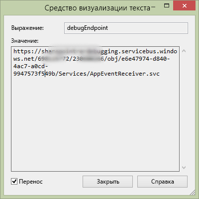

# <a name="handle-list-item-events-in-the-provider-hosted-add-in"></a><span data-ttu-id="572c6-103">Обработка событий элементов списков в надстройке с размещением у поставщика</span><span class="sxs-lookup"><span data-stu-id="572c6-103">Handle list item events in the provider-hosted add-in</span></span>

<span data-ttu-id="572c6-104">Это десятая часть серии статей, посвященной основам разработки надстроек, размещаемых у поставщика. Для начала вам следует ознакомиться со статьей [Надстройки SharePoint](sharepoint-add-ins.md) и предыдущими статьями из этой серии.</span><span class="sxs-lookup"><span data-stu-id="572c6-104">This is the tenth in a series of articles about the basics of developing provider-hosted SharePoint Add-ins. You should first be familiar with  [SharePoint Add-ins](sharepoint-add-ins.md) and the previous articles in this series:</span></span>

-  [<span data-ttu-id="572c6-105">Знакомство с созданием надстроек SharePoint с размещением у поставщика</span><span class="sxs-lookup"><span data-stu-id="572c6-105">Get started creating provider-hosted SharePoint Add-ins</span></span>](get-started-creating-provider-hosted-sharepoint-add-ins.md)
-  [<span data-ttu-id="572c6-106">Настройка внешнего вида надстройки SharePoint, размещенной у поставщика</span><span class="sxs-lookup"><span data-stu-id="572c6-106">Give your provider-hosted add-in the SharePoint look-and-feel</span></span>](give-your-provider-hosted-add-in-the-sharepoint-look-and-feel.md)
-  [<span data-ttu-id="572c6-107">Добавление настраиваемой кнопки в надстройку, размещенную у поставщика</span><span class="sxs-lookup"><span data-stu-id="572c6-107">Include a custom button in the provider-hosted add-in</span></span>](include-a-custom-button-in-the-provider-hosted-add-in.md)
-  [<span data-ttu-id="572c6-108">Краткий обзор объектной модели SharePoint</span><span class="sxs-lookup"><span data-stu-id="572c6-108">Get a quick overview of the SharePoint object model</span></span>](get-a-quick-overview-of-the-sharepoint-object-model.md)
-  [<span data-ttu-id="572c6-109">Добавление операций записи SharePoint в надстройку, размещенную у поставщика</span><span class="sxs-lookup"><span data-stu-id="572c6-109">Add SharePoint write operations to the provider-hosted add-in</span></span>](add-sharepoint-write-operations-to-the-provider-hosted-add-in.md)
-  [<span data-ttu-id="572c6-110">Добавление веб-части надстройки в надстройку, размещенную у поставщика</span><span class="sxs-lookup"><span data-stu-id="572c6-110">Include an add-in part in the provider-hosted add-in</span></span>](include-an-add-in-part-in-the-provider-hosted-add-in.md)
-  [<span data-ttu-id="572c6-111">Обработка событий надстройки, размещенной у поставщика</span><span class="sxs-lookup"><span data-stu-id="572c6-111">Handle add-in events in the provider-hosted add-in</span></span>](handle-add-in-events-in-the-provider-hosted-add-in.md)
-  [<span data-ttu-id="572c6-112">Добавление логики, выполняемой при первом запуске, в надстройку, размещаемую у поставщика</span><span class="sxs-lookup"><span data-stu-id="572c6-112">Add first-run logic to the provider-hosted add-in</span></span>](add-first-run-logic-to-the-provider-hosted-add-in.md)
-  [<span data-ttu-id="572c6-113">Программное развертывание настраиваемой кнопки в надстройке, размещаемой у поставщика</span><span class="sxs-lookup"><span data-stu-id="572c6-113">Programmatically deploy a custom button in the provider-hosted add-in</span></span>](programmatically-deploy-a-custom-button-in-the-provider-hosted-add-in.md)

> [!NOTE]
> <span data-ttu-id="572c6-114">Если вы изучали предыдущие статьи из этой серии о надстройках, размещаемых у поставщика, то у вас уже есть решение для Visual Studio, которое можно использовать для работы с этой статьей.</span><span class="sxs-lookup"><span data-stu-id="572c6-114">Note If you have been working through this series about provider-hosted add-ins, then you have a Visual Studio solution that you can use to continue with this topic. You can also download the repository at  SharePoint_Provider-hosted_Add-Ins_Tutorials and open the BeforeRER.sln file.</span></span> <span data-ttu-id="572c6-115">Кроме того, вы можете скачать репозиторий на веб-странице [SharePoint_Provider-hosted_Add-Ins_Tutorials](https://github.com/OfficeDev/SharePoint_Provider-hosted_Add-ins_Tutorials) и открыть файл BeforeRER.sln.</span><span class="sxs-lookup"><span data-stu-id="572c6-115">You can also download the repository at [SharePoint_Provider-hosted_Add-Ins_Tutorials](https://github.com/OfficeDev/SharePoint_Provider-hosted_Add-ins_Tutorials) and open the BeforeRER.sln file.</span></span>

<span data-ttu-id="572c6-116">В одной из предыдущих статей этой серии мы рассказывали, что при размещении заказа он добавляется в таблицу **Orders** (Заказы) в корпоративной базе данных, а соответствующий ему элемент автоматически добавляется в список **Expected Shipments** (Ожидаемые отгрузки).</span><span class="sxs-lookup"><span data-stu-id="572c6-116">You saw in an earlier article in this series that when an order is placed, it is added to the **Orders** table in the corporate database, and an item for it is automatically added to the **Expected Shipments** list.</span></span> <span data-ttu-id="572c6-117">Когда заказ прибывает в местный магазин, пользователь указывает в столбце **Arrived** (Прибыл) значение **Yes** (Да).</span><span class="sxs-lookup"><span data-stu-id="572c6-117">When it arrives at the local store, a user sets the **Arrived** column to **Yes**.</span></span> <span data-ttu-id="572c6-118">При изменении значения поля для элемента создается событие обновления элемента, для которого можно добавить настраиваемый обработчик.</span><span class="sxs-lookup"><span data-stu-id="572c6-118">Changing a field value for an item creates an item updated event for which you can add a custom handler.</span></span> 

<span data-ttu-id="572c6-119">Изучая эту статью, вы создадите обработчик данного события элемента списка, а затем программным способом развернете его в коде, выполняемом при первом запуске надстройки SharePoint.</span><span class="sxs-lookup"><span data-stu-id="572c6-119">In this article, you create a handler for this list item event and then programmatically deploy it in the first-run logic of the SharePoint Add-in.</span></span> <span data-ttu-id="572c6-120">Обработчик добавит элемент в таблицу **Inventory** (Запасы) корпоративной базы данных.</span><span class="sxs-lookup"><span data-stu-id="572c6-120">Your handler adds the item into the **Inventory** table in the corporate database.</span></span> <span data-ttu-id="572c6-121">Затем он задаст в столбце **Added to Inventory** (Добавлен в запасы) списка **Expected Shipments** (Ожидаемые отгрузки) значение **Yes** (Да).</span><span class="sxs-lookup"><span data-stu-id="572c6-121">It then sets the **Added to Inventory** column of the **Expected Shipments** list to **Yes**.</span></span> <span data-ttu-id="572c6-122">Вы также узнаете, как не допустить, чтобы это второе событие обновления элемента создало бесконечный ряд событий обновления элемента.</span><span class="sxs-lookup"><span data-stu-id="572c6-122">You also learn how to prevent this second item updated event from setting off an infinite series of item updated events.</span></span>

## <a name="programmatically-deploy-the-expected-shipments-list"></a><span data-ttu-id="572c6-123">Программное развертывание списка Expected Shipments (Ожидаемые отгрузки)</span><span class="sxs-lookup"><span data-stu-id="572c6-123">Programmatically deploy the Expected Shipments list</span></span>

> [!NOTE]
> <span data-ttu-id="572c6-124">Когда решение открывается повторно, для параметров раздела "Запускаемые проекты" в Visual Studio обычно возвращаются значения по умолчанию.</span><span class="sxs-lookup"><span data-stu-id="572c6-124">Note  The settings for Startup Projects in Visual Studio tend to revert to defaults whenever the solution is reopened. Always take these steps immediately after reopening the sample solution in this series of articles:</span></span> <span data-ttu-id="572c6-125">Сразу же после повторного открытия примера решения согласно инструкциям из этой серии статей всегда делайте вот что:</span><span class="sxs-lookup"><span data-stu-id="572c6-125">Note  The settings for Startup Projects in Visual Studio tend to revert to defaults whenever the solution is reopened. Always take these steps immediately after reopening the sample solution in this series of articles:</span></span> 
> 1. <span data-ttu-id="572c6-126">В верхней части **обозревателя решений** щелкните узел решения правой кнопкой мыши и выберите пункт **Назначить запускаемые проекты**.</span><span class="sxs-lookup"><span data-stu-id="572c6-126">Right-click the solution node at the top of  **Solution Explorer** and select **Set startup projects**.</span></span>  
> 2. <span data-ttu-id="572c6-127">Убедитесь, что в столбце **Действие** для всех трех проектов указано значение **Запуск**.</span><span class="sxs-lookup"><span data-stu-id="572c6-127">Make sure all three projects are set to  **Start** in the **Action** column.</span></span>

1. <span data-ttu-id="572c6-128">В **обозревателе решений** откройте файл Utilities\SharePointComponentDeployer.cs проекта **ChainStoreWeb**.</span><span class="sxs-lookup"><span data-stu-id="572c6-128">In **Solution Explorer**, open the Utilities\SharePointComponentDeployer.cs file in the **ChainStoreWeb** project.</span></span> <span data-ttu-id="572c6-129">Добавьте указанный ниже метод в класс `SharePointComponentDeployer`.</span><span class="sxs-lookup"><span data-stu-id="572c6-129">Add the following method to the  `SharePointComponentDeployer` class.</span></span> 

     ```C#
      private static void CreateExpectedShipmentsList()
     {
        using (var clientContext = sPContext.CreateUserClientContextForSPHost())
        {
        var query = from list in clientContext.Web.Lists
                where list.Title == "Expected Shipments"
                select list;
        IEnumerable<List> matchingLists = clientContext.LoadQuery(query);
        clientContext.ExecuteQuery();

        if (matchingLists.Count() == 0)
        {
            ListCreationInformation listInfo = new ListCreationInformation();
            listInfo.Title = "Expected Shipments";
            listInfo.TemplateType = (int)ListTemplateType.GenericList;
            listInfo.Url = "Lists/ExpectedShipments";
            List expectedShipmentsList = clientContext.Web.Lists.Add(listInfo);

            Field field = expectedShipmentsList.Fields.GetByInternalNameOrTitle("Title");
            field.Title = "Product";
            field.Update();

            expectedShipmentsList.Fields.AddFieldAsXml("<Field DisplayName='Supplier'" 
                                    + " Type='Text' />", 
                                    true,
                                    AddFieldOptions.DefaultValue);
            expectedShipmentsList.Fields.AddFieldAsXml("<Field DisplayName='Quantity'" 
                                    + " Type='Number'" 
                                    + " Required='TRUE' >" 
                                    + "<Default>1</Default></Field>",
                                    true, 
                                    AddFieldOptions.DefaultValue);
            expectedShipmentsList.Fields.AddFieldAsXml("<Field DisplayName='Arrived'" 
                                   + " Type='Boolean'"
                                   + " ShowInNewForm='FALSE'>"
                                   + "<Default>FALSE</Default></Field>",
                                    true, 
                                    AddFieldOptions.DefaultValue);
            expectedShipmentsList.Fields.AddFieldAsXml("<Field DisplayName='Added to Inventory'" 
                                    + " Type='Boolean'" 
                                    + " ShowInNewForm='FALSE'>"
                                    + "<Default>FALSE</Default></Field>", 
                                    true, 
                                    AddFieldOptions.DefaultValue);

            clientContext.ExecuteQuery();
        }
         }
     }
     ```

    <span data-ttu-id="572c6-130">В этом коде нет новой функциональности, которой не было в предыдущей статье этой серии, но следует обратить внимание на вот что:</span><span class="sxs-lookup"><span data-stu-id="572c6-130">In Solution Explorer, open the UtilitiesSharePointComponentDeployer.cs file in the ChainStoreWeb project. Add the following method to the  class. This code doesn't introduce any functionality that you haven't already seen in a previous article of this series, but note the following:</span></span>
   
    - <span data-ttu-id="572c6-p106">Код присваивает атрибуту **Required** поля **Quantity** (Количество) значение **TRUE**, поэтому это поле всегда должно иметь значение. Затем он задает число 1 в качестве значения, используемого по умолчанию.</span><span class="sxs-lookup"><span data-stu-id="572c6-p106">It sets the **Required** attribute of the **Quantity** field to **TRUE** so the field must always have a value. It then sets the default value to 1.</span></span>
   
    - <span data-ttu-id="572c6-133">В форме New Item (Новый элемент) поля **Arrived** (Прибыл) и **Added to Inventory** (Добавлен в запасы) скрыты.</span><span class="sxs-lookup"><span data-stu-id="572c6-133">The **Arrived** and **Added to Inventory** fields are hidden on the New Item form.</span></span>
   
    - <span data-ttu-id="572c6-134">В идеальном случае в форме Edit Item (Изменение элемента) поле **Added to Inventory** (Добавлен в запасы) тоже должно быть скрыто, так как его значение следует изменить на **Yes** (Да), только когда обработчик события обновления элемента в первый раз добавит элемент в корпоративную таблицу **Inventory** (Запасы).</span><span class="sxs-lookup"><span data-stu-id="572c6-134">Ideally, the **Added to Inventory** field would also be hidden on the Edit Item form, because it should only be changed to **Yes** when the item updated event handler has first added the item to the corporate **Inventory** table. For technical reasons that we'll explain in a later step, a field has to be visible in the Edit Item form, if we want to programmatically write to it in an item updated event handler.</span></span> <span data-ttu-id="572c6-135">По техническим причинам, о которых мы расскажем на одном из следующих этапов, это поле должно отображаться в форме Edit Item (Изменение элемента), чтобы программным способом записывать в него данные из обработчика события обновления элемента.</span><span class="sxs-lookup"><span data-stu-id="572c6-135">Ideally, the  Added to Inventory field would also be hidden on the Edit Item form, because it should only be changed to Yes when the item updated event handler has first added the item to the corporate Inventory table. For technical reasons that we'll explain in a later step, a field has to be visible in the Edit Item form, if we want to programmatically write to it in an item updated event handler.</span></span>


2. <span data-ttu-id="572c6-136">В методе **DeployChainStoreComponentsToHostWeb** добавьте указанную ниже строку перед строкой `RemoteTenantVersion = localTenantVersion`.</span><span class="sxs-lookup"><span data-stu-id="572c6-136">In the **DeployChainStoreComponentsToHostWeb** method, add the following line, just above the line RemoteTenantVersion = localTenantVersion`RemoteTenantVersion = localTenantVersion`.</span></span>
    
    ```C#
      CreateExpectedShipmentsList();
    ```

## <a name="create-the-list-item-event-receiver"></a><span data-ttu-id="572c6-137">Создание приемника событий элемента списка</span><span class="sxs-lookup"><span data-stu-id="572c6-137">Create the list item event receiver</span></span>

> [!NOTE]
> <span data-ttu-id="572c6-138">Если вы работали со статьями этой серии, то, скорее всего, уже настроили собственную среду разработки для отладки удаленных приемников событий.</span><span class="sxs-lookup"><span data-stu-id="572c6-138">If you have been working through this series of articles, then you have already configured your development environment for debugging remote event receivers. If you have not done that, see Configure the solution for event receiver debugging before you go any further in this topic.</span></span> <span data-ttu-id="572c6-139">Если вы еще не сделали этого, то прежде чем перейти к другим разделам этой статьи, прочитайте раздел [Настройка решения для отладки приемника событий](handle-add-in-events-in-the-provider-hosted-add-in.md#RERDebug).</span><span class="sxs-lookup"><span data-stu-id="572c6-139">Note  If you have been working through this series of articles, then you have already configured your development environment for debugging remote event receivers. If you have not done that, see  [Configure the solution for event receiver debugging](handle-add-in-events-in-the-provider-hosted-add-in.md#RERDebug) before you go any further in this topic.</span></span>

<span data-ttu-id="572c6-140">Пакет "Инструменты разработчика Office для Visual Studio" включает элемент **Удаленный приемник событий**, который можно добавить в надстройку SharePoint.</span><span class="sxs-lookup"><span data-stu-id="572c6-140">The Office Developer Tools for Visual Studio includes a **Remote Event Receiver** item that can be added to a SharePoint Add-in solution.</span></span> <span data-ttu-id="572c6-141">На момент написания данной статьи для этого элемента проекта предполагается, что список (для которого будет зарегистрирован приемник) находится на сайте надстройки и, соответственно, пакет инструментов создает сайт надстройки, а также ряд содержащихся в нем артефактов SharePoint.</span><span class="sxs-lookup"><span data-stu-id="572c6-141">However, at the time this article was written, this project item assumes that the list (with which the receiver will be registered) is on the add-in web, and consequently the tools create an add-in web and some SharePoint artifacts in it.</span></span> <span data-ttu-id="572c6-142">Кроме того, предполагается, что приемник для надстройки Chain Store будет зарегистрирован (на одном из следующих этапов) для списка **Expected Shipments** (Ожидаемые отгрузки) на хост-сайте, поэтому для надстройки не требуется сайт надстройки.</span><span class="sxs-lookup"><span data-stu-id="572c6-142">But the receiver for the Chain Store add-in is going to be registered (in a later step) with the **Expected Shipments** list on the host web, so the add-in does not need an add-in web.</span></span> <span data-ttu-id="572c6-143">(Сведения о различиях между сайтами надстроек и хост-сайтами см. в статье [Надстройки SharePoint](sharepoint-add-ins.md).)</span><span class="sxs-lookup"><span data-stu-id="572c6-143">(For a reminder of the distinction between add-in webs and host webs, see [SharePoint Add-ins](sharepoint-add-ins.md).)</span></span>
 
> [!NOTE]
> <span data-ttu-id="572c6-144">Приемники событий списка и элемента списка называются удаленными приемниками событий, так как их код является удаленным по отношению к SharePoint и размещен либо в облаке, либо на локальном сервере за пределами фермы SharePoint.</span><span class="sxs-lookup"><span data-stu-id="572c6-144">List and list item event receivers are called remote event receivers (RER) because their code is remote from SharePoint, either in the cloud or in an on-premises server outside the SharePoint farm. However, the events that trigger them are in SharePoint.</span></span> <span data-ttu-id="572c6-145">Тем не менее события, запускающие их, находятся в SharePoint.</span><span class="sxs-lookup"><span data-stu-id="572c6-145">However, the events that trigger them are in SharePoint.</span></span>

1. <span data-ttu-id="572c6-146">В **обозревателе решений** щелкните правой кнопкой мыши папку **Службы** в проекте **ChainStoreWeb** и выберите **Добавить** > **Служба WCF**.</span><span class="sxs-lookup"><span data-stu-id="572c6-146">In  Solution Explorer, right-click the  Services folder in the ChainStoreWeb project and select Add | WCF Service.</span></span>

2. <span data-ttu-id="572c6-147">Когда отобразится соответствующий запрос, укажите для службы имя **RemoteEventReceiver1**, а затем нажмите кнопку **OK**.</span><span class="sxs-lookup"><span data-stu-id="572c6-147">When prompted, name the service RemoteEventReceiver1, and then press  OK.</span></span> 

3. <span data-ttu-id="572c6-148">Пакет инструментов создаст файл интерфейса, файл \*.svc и файл кода программной части.</span><span class="sxs-lookup"><span data-stu-id="572c6-148">The tools create an interface file, an \*.svc file, and a code-behind file.</span></span> <span data-ttu-id="572c6-149">Нам не потребуется файл интерфейса IRemoteEventReceiver1.cs, поэтому удалите его.</span><span class="sxs-lookup"><span data-stu-id="572c6-149">We don't need the interface file IRemoteEventReceiver1.cs, so delete it.</span></span> <span data-ttu-id="572c6-150">(Возможно, пакет инструментов открыл его автоматически. В этом случае закройте файл, а затем удалите его.)</span><span class="sxs-lookup"><span data-stu-id="572c6-150">(The tools may have opened it automatically; if so, close and delete it.)</span></span>
    
   > [!NOTE]
   > <span data-ttu-id="572c6-151">Когда вы создавали приемники событий надстройки для событий установки и удаления в одной из предыдущих статей этой серии, пакет "Инструменты разработчика Office для Visual Studio" добавил их URL-адреса в файл манифеста приложения.</span><span class="sxs-lookup"><span data-stu-id="572c6-151">Note  When you created the add-in event receivers for the installed and uninstalling events in an earlier article in this series, the Office Developer Tools for Visual Studio added their URLs to the app manifest file. List and list item event receivers are not registered in the app manifest. Instead, they are registered (in a provider-hosted add-in) programmatically. You'll do that in a later step.</span></span> <span data-ttu-id="572c6-152">Приемники событий списка и элемента списка не зарегистрированы в манифесте приложения.</span><span class="sxs-lookup"><span data-stu-id="572c6-152">List and list item event receivers are not registered in the app manifest.</span></span> <span data-ttu-id="572c6-153">Их необходимо зарегистрировать программным способом (в надстройке, размещаемой у поставщика).</span><span class="sxs-lookup"><span data-stu-id="572c6-153">Instead, they are registered (in a provider-hosted add-in) programmatically.</span></span> <span data-ttu-id="572c6-154">Вы сделаете это на одном из следующих этапов.</span><span class="sxs-lookup"><span data-stu-id="572c6-154">You'll do that in a later step.</span></span>

4. <span data-ttu-id="572c6-155">Откройте файл кода программной части RemoteEventReceiver1.svc.cs.</span><span class="sxs-lookup"><span data-stu-id="572c6-155">Open the code-behind file RemoteEventReceiver1.svc.cs.</span></span> <span data-ttu-id="572c6-156">Замените все его содержимое указанным ниже кодом.</span><span class="sxs-lookup"><span data-stu-id="572c6-156">Replace the contents with the following code.</span></span> 

    ```C#
      using System;
    using System.Collections.Generic;
    using Microsoft.SharePoint.Client;
    using Microsoft.SharePoint.Client.EventReceivers;
    using System.Data.SqlClient;
    using System.Data;
    using ChainStoreWeb.Utilities;

    namespace ChainStoreWeb.Services
    {
        public class RemoteEventReceiver1 : IRemoteEventService
        {
        /// <summary>
        /// Handles events that occur before an action occurs, 
        /// such as when a user is adding or deleting a list item.
        /// </summary>
        /// <param name="properties">Holds information about the remote event.</param>
        /// <returns>Holds information returned from the remote event.</returns>
        public SPRemoteEventResult ProcessEvent(SPRemoteEventProperties properties)
        {
            throw new NotImplementedException();
        }

        /// <summary>
        /// Handles events that occur after an action occurs, 
        /// such as after a user adds an item to a list or deletes an item from a list.
        /// </summary>
        /// <param name="properties">Holds information about the remote event.</param>
        public void ProcessOneWayEvent(SPRemoteEventProperties properties)
        {

        }
        }
    }
    ```

   <span data-ttu-id="572c6-157">Обратите внимание на следующие особенности этого кода:</span><span class="sxs-lookup"><span data-stu-id="572c6-157">Note the following about this code:</span></span>
    
   - <span data-ttu-id="572c6-158">Интерфейс `IRemoteEventService` определен в пространстве имен **Microsoft.SharePoint.Client.EventReceivers**.</span><span class="sxs-lookup"><span data-stu-id="572c6-158">The interface  `IRemoteEventService` is defined in the **Microsoft.SharePoint.Client.EventReceivers** namespace.</span></span>
    
   - <span data-ttu-id="572c6-159">В надстройке Chain Store не будут обрабатываться никакие события, возникающие до выполнения какого-либо действия, но метод **ProcessEvent** является обязательным для интерфейса `IRemoteEventService`.</span><span class="sxs-lookup"><span data-stu-id="572c6-159">There won't be any "before" events handled in the Chain Store add-in, but the **ProcessEvent** method is required by the `IRemoteEventService` interface.</span></span>

5. <span data-ttu-id="572c6-160">Добавьте указанный ниже код в метод **ProcessOneWayEvent**.</span><span class="sxs-lookup"><span data-stu-id="572c6-160">Add the following code to the **ProcessOneWayEvent** method.</span></span> <span data-ttu-id="572c6-161">Обратите внимание, что **ItemUpdated** — единственное событие, которое будет обрабатываться в этом примере, поэтому вместо структуры **switch** можно использовать простую структуру **if**.</span><span class="sxs-lookup"><span data-stu-id="572c6-161">Add the following code to the   method. Note that the ItemUpdated event is the only one that this sample will handle, so we could have used a simple if structure instead of a switch. But event receivers typically handle multiple events, so we want you to see the pattern you'll most commonly be using in your event handlers as a SharePoint add-in developer.</span></span> <span data-ttu-id="572c6-162">Приемники событий обычно обрабатывают несколько событий, поэтому желательно, чтобы вы изучили шаблон, который вы (как разработчик надстроек SharePoint) чаще всего будете использовать в своих обработчиках событий.</span><span class="sxs-lookup"><span data-stu-id="572c6-162">Add the following code to the   method. Note that the ItemUpdated event is the only one that this sample will handle, so we could have used a simple if structure instead of a switch. But event receivers typically handle multiple events, so we want you to see the pattern you'll most commonly be using in your event handlers as a SharePoint add-in developer.</span></span>
    
    ```C#
      switch (properties.EventType)
    {
        case SPRemoteEventType.ItemUpdated:

        // TODO12: Handle the item updated event.

        break;
    }  
    ```

6. <span data-ttu-id="572c6-163">Замените `TODO12` указанным ниже кодом.</span><span class="sxs-lookup"><span data-stu-id="572c6-163">Replace  `TODO12` with the following code.</span></span> <span data-ttu-id="572c6-164">Здесь мы опять используем структуру **switch**, когда достаточно использовать простую структуру **if**, чтобы показать вам стандартный шаблон, используемый в приемниках событий SharePoint.</span><span class="sxs-lookup"><span data-stu-id="572c6-164">Replace   with the following code. Again, here, we are using a **switch** structure when a simple **if** structure would do, because we want you to see the common pattern in SharePoint event receivers.</span></span>
    
    ```C#
      switch (properties.ItemEventProperties.ListTitle)
    {
        case "Expected Shipments":

        // TODO13: Handle the arrival of a shipment.

        break;
    }
    ```

7. <span data-ttu-id="572c6-165">Код, который реагирует на прибытие отгруженного товара, должен выполнять два указанных ниже действия.</span><span class="sxs-lookup"><span data-stu-id="572c6-165">The code that responds to the arrival of a shipment should do two things:</span></span>
    
   - <span data-ttu-id="572c6-166">Добавьте элемент, который прибыл в магазин, в корпоративные запасы.</span><span class="sxs-lookup"><span data-stu-id="572c6-166">Add the item that has arrived at the store into the corporate inventory.</span></span>
    
   - <span data-ttu-id="572c6-p116">Задавать для поля **Added to Inventory** (Добавлен в запасы) в списке **Expected Shipments** (Ожидаемые отгрузки) значение **Yes** (Да). Но это должно происходить, только если элемент успешно добавлен в запасы.</span><span class="sxs-lookup"><span data-stu-id="572c6-p116">Set the **Added to Inventory** field on the **Expected Shipments** list to **Yes**. But this should only happen if the item was successfully added to the inventory.</span></span>
    
   <span data-ttu-id="572c6-169">Добавьте указанный ниже код вместо `TODO13`.</span><span class="sxs-lookup"><span data-stu-id="572c6-169">Add the following code in place of  `TODO13`. The two methods,   and  are created in later steps.</span></span> <span data-ttu-id="572c6-170">Два метода (`TryUpdateInventory` и `RecordInventoryUpdateLocally`) будут созданы на дальнейших этапах.</span><span class="sxs-lookup"><span data-stu-id="572c6-170">Add the following code in place of  . The two methods,  `TryUpdateInventory` and `RecordInventoryUpdateLocally` are created in later steps.</span></span>

    ```C#
      bool updateComplete = TryUpdateInventory(properties);
    if (updateComplete)
    {
        RecordInventoryUpdateLocally(properties);
    }
    ```


8. <span data-ttu-id="572c6-171">Теперь метод **ProcessOneWayEvent** должен выглядеть вот так:</span><span class="sxs-lookup"><span data-stu-id="572c6-171">The **ProcessOneWayEvent** method should now look like the following:</span></span>

    ```C#
      public void ProcessOneWayEvent(SPRemoteEventProperties properties)
    {
        switch (properties.EventType)
        {
        case SPRemoteEventType.ItemUpdated:

            switch (properties.ItemEventProperties.ListTitle)
            {
            case "Expected Shipments":
                bool updateComplete = UpdateInventory(properties);
                if (updateComplete)
                {
                RecordInventoryUpdateLocally(properties);
                }
                break;
            }
            break;
        }          
    }
    ```

9. <span data-ttu-id="572c6-172">Добавьте указанный ниже метод в класс `RemoteEventReceiver1`.</span><span class="sxs-lookup"><span data-stu-id="572c6-172">Add the following method to the  `RemoteEventReceiver1` class.</span></span>
    
    ```C#
      private bool TryUpdateInventory(SPRemoteEventProperties properties)
    {
        bool successFlag = false;

        // TODO14: Test whether the list item is changing because the product has arrived
        // or for some other reason. If the former, add it to the inventory and set the success flag
        // to true.     

        return successFlag;
    }
    ```

10. <span data-ttu-id="572c6-173">Список **Expected Shipments** (Ожидаемые отгрузки) включает пять столбцов, но нам не нужно, чтобы обработчик реагировал на большинство видов обновлений элемента.</span><span class="sxs-lookup"><span data-stu-id="572c6-173">There are five columns on the **Expected Shipments** list, but we don't want the handler to react to most kinds of updates to an item.</span></span> <span data-ttu-id="572c6-174">Например, если пользователь исправляет написание имени поставщика, запускается событие обновления элемента, но при этом обработчик не должен ничего делать.</span><span class="sxs-lookup"><span data-stu-id="572c6-174">For example, if a user corrects the spelling of a supplier's name, the item updated event is triggered, but our handler should do nothing.</span></span> <span data-ttu-id="572c6-175">Он должен действовать, только когда в поле **Arrived** (Прибыл) задано значение **Yes** (Да).</span><span class="sxs-lookup"><span data-stu-id="572c6-175">The handler should only act when the **Arrived** field has just been set to **Yes**.</span></span> 
    
    <span data-ttu-id="572c6-176">Необходимо проверить еще одно условие.</span><span class="sxs-lookup"><span data-stu-id="572c6-176">There's another condition that needs to be tested.</span></span> <span data-ttu-id="572c6-177">Предположим, что в поле **Arrived** (Прибыл) задано значение **Yes** (Да), а продукт в элементе добавлен в запасы (соответственно, поле **Added to Inventory** (Добавлен в запасы) имеет значение **Yes** (Да)).</span><span class="sxs-lookup"><span data-stu-id="572c6-177">Suppose **Arrived** is set to **Yes** and the product in the item is added to inventory (and **Added to Inventory** is set to **Yes**).</span></span> <span data-ttu-id="572c6-178">Но позже пользователь по ошибке изменяет значение поля **Arrived** (Прибыл) для отгрузки обратно на **No** (Нет), а затем исправляет свою ошибку, снова присвоив полю значение **Yes** (Да).</span><span class="sxs-lookup"><span data-stu-id="572c6-178">But later a user mistakenly changes the **Arrived** field of a shipment back to **No** and then fixes his mistake by setting it again to **Arrived**.</span></span> <span data-ttu-id="572c6-179">Ошибка и ее исправление создают событие обновления элемента.</span><span class="sxs-lookup"><span data-stu-id="572c6-179">Both the mistake and the fix trigger the item updated event.</span></span> <span data-ttu-id="572c6-180">Обработчик не будет реагировать на ошибку, так как он срабатывает только если полю **Arrived** (Прибыл) присваивается значение **Yes** (Да). Обработчик среагирует на исправление, при котором полю **Arrived** (Прибыл) снова будет присвоено значение **Yes** (Да), поэтому один продукт в одном и том же количестве будет еще раз добавлен в запасы.</span><span class="sxs-lookup"><span data-stu-id="572c6-180">The handler won't react to the mistake because it only acts when **Arrived** is **Yes**, but it would react to the fix that sets **Arrived** back to **Yes**, so the same product and quantity would get added into the inventory a second time.</span></span> <span data-ttu-id="572c6-181">По этой причине обработчик должен срабатывать, только когда поле **Added to Inventory** (Добавлен в запасы) имеет значение **No** (Нет).</span><span class="sxs-lookup"><span data-stu-id="572c6-181">For this reason, the handler should only act when the **Added to Inventory** value is **No**.</span></span> 
    
    <span data-ttu-id="572c6-182">Таким образом, обработчику необходимо "знать" значения этих полей, как только пользователь обновит элемент.</span><span class="sxs-lookup"><span data-stu-id="572c6-182">Therefore, the handler needs to know what the values of these fields are just after the user updates the item.</span></span> <span data-ttu-id="572c6-183">У объекта **SPRemoteEventProperties** есть свойство **ItemEventProperties**.</span><span class="sxs-lookup"><span data-stu-id="572c6-183">The **SPRemoteEventProperties** object has an **ItemEventProperties** property.</span></span> <span data-ttu-id="572c6-184">В свою очередь, у этого свойства имеется индексированное свойство **AfterProperties**, в котором хранятся значения полей обновленного элемента.</span><span class="sxs-lookup"><span data-stu-id="572c6-184">And, in turn, it has an indexed **AfterProperties** property that holds the values of the fields in the updated item.</span></span> <span data-ttu-id="572c6-185">В коде ниже эти свойства используются, чтобы проверить, необходимо ли срабатывать обработчику.</span><span class="sxs-lookup"><span data-stu-id="572c6-185">The following code uses these properties to test whether the handler should react.</span></span> <span data-ttu-id="572c6-186">Вставьте этот код вместо `TODO14`.</span><span class="sxs-lookup"><span data-stu-id="572c6-186">Put this in place of `TODO14`.</span></span>

     ```C#
      var arrived = Convert.ToBoolean(properties.ItemEventProperties.AfterProperties["Arrived"]);
    var addedToInventory = Convert.ToBoolean(properties.ItemEventProperties.AfterProperties["Added_x0020_to_x0020_Inventory"]);

    if (arrived &amp;&amp; !addedToInventory)
    {

        // TODO15: Add the item to inventory

        successFlag = true;
    }
     ```

11. <span data-ttu-id="572c6-187">Замените `TODO15` указанным ниже кодом.</span><span class="sxs-lookup"><span data-stu-id="572c6-187">Replace  `TODO15` with the following code.</span></span> 

     ```C#
      using (SqlConnection conn = SQLAzureUtilities.GetActiveSqlConnection())
    using (SqlCommand cmd = conn.CreateCommand())
    {
        conn.Open();
        cmd.CommandText = "UpdateInventory";
        cmd.CommandType = CommandType.StoredProcedure;
        SqlParameter tenant = cmd.Parameters.Add("@Tenant", SqlDbType.NVarChar);
        tenant.Value = properties.ItemEventProperties.WebUrl + "/";
        SqlParameter product = cmd.Parameters.Add("@ItemName", SqlDbType.NVarChar, 50);
        product.Value = properties.ItemEventProperties.AfterProperties["Title"]; // not "Product"
        SqlParameter quantity = cmd.Parameters.Add("@Quantity", SqlDbType.SmallInt);
        quantity.Value = Convert.ToUInt16(properties.ItemEventProperties.AfterProperties["Quantity"]);
        cmd.ExecuteNonQuery();
    }
     ```

    <span data-ttu-id="572c6-188">Здесь в основном используется программирование для SQL и ASP.NET, и мы не будем подробно рассматривать его, но при этом учтите вот что:</span><span class="sxs-lookup"><span data-stu-id="572c6-188">Replace   with the following code. This is mainly SQL and ASP.NET programming, so we don't discuss it in detail, but note:</span></span>
    
    - <span data-ttu-id="572c6-189">Мы используем свойство **ItemEventProperties.WebUrl** для получения имени клиента, представляющего собой URL-адрес хост-сайта.</span><span class="sxs-lookup"><span data-stu-id="572c6-189">We use the **ItemEventProperties.WebUrl** property to get the tenant name, which is the host web URL.</span></span>

    - <span data-ttu-id="572c6-190">Мы еще раз используем свойство **AfterProperties**, чтобы получить значения имени и количества продукта.</span><span class="sxs-lookup"><span data-stu-id="572c6-190">We use the **AfterProperties** again to get the values of the product name and quantity.</span></span>
    
    - <span data-ttu-id="572c6-191">Мы ссылаемся на поле имени продукта, используя имя Title (Название), даже несмотря на то, что в методе **CreateExpectedShipmentsList** отображаемое имя было изменено на Product (Продукт), так как для ссылки на поля всегда используются внутренние имена полей.</span><span class="sxs-lookup"><span data-stu-id="572c6-191">We refer to the product name field as "Title", even though the display name was changed to "Product" (in the **CreateExpectedShipmentsList** method) because fields are always referred to by their internal names.</span></span>
 

12. <span data-ttu-id="572c6-192">Мы еще не закончили работу с методом **TryUpdateInventory**, но сейчас он должен выглядеть вот так:</span><span class="sxs-lookup"><span data-stu-id="572c6-192">We are not finished with the **TryUpdateInventory** method yet, but at this point it should look like the following.</span></span>
    
     ```C#
      private bool TryUpdateInventory(SPRemoteEventProperties properties)
    {
        bool successFlag = false;

        var arrived = Convert.ToBoolean(properties.ItemEventProperties.AfterProperties["Arrived"]);
        var addedToInventory = Convert.ToBoolean(properties.ItemEventProperties.AfterProperties["Added_x0020_to_x0020_Inventory"]);

        if (arrived &amp;&amp; !addedToInventory)
        {
        using (SqlConnection conn = SQLAzureUtilities.GetActiveSqlConnection())
        using (SqlCommand cmd = conn.CreateCommand())
        {
            conn.Open();
            cmd.CommandText = "UpdateInventory";
            cmd.CommandType = CommandType.StoredProcedure;
            SqlParameter tenant = cmd.Parameters.Add("@Tenant", SqlDbType.NVarChar);
            tenant.Value = properties.ItemEventProperties.WebUrl + "/";
            SqlParameter product = cmd.Parameters.Add("@ItemName", SqlDbType.NVarChar, 50);
            product.Value = properties.ItemEventProperties.AfterProperties["Title"]; // not "Product"
            SqlParameter quantity = cmd.Parameters.Add("@Quantity", SqlDbType.SmallInt);
            quantity.Value = Convert.ToUInt16(properties.ItemEventProperties.AfterProperties["Quantity"]);
            cmd.ExecuteNonQuery();
        }            
        successFlag = true;
        }  
        return successFlag;
    }
     ```

13. <span data-ttu-id="572c6-193">Когда метод **TryUpdateInventory** возвращает значение **true**, наш обработчик вызывает (еще не написанный) метод, который обновляет тот же элемент в списке **Expected Shipments** (Ожидаемые отгрузки), задавая для поля **Added to Inventory** (Добавлен в запасы) значение **Yes** (Да).</span><span class="sxs-lookup"><span data-stu-id="572c6-193">When the **TryUpdateInventory** method returns **true**, our handler calls a method (not yet written) that updates the same item in the **Expected Shipments** list by setting the **Added to Inventory** field to **Yes**.</span></span> <span data-ttu-id="572c6-194">Он представляет собой событие обновления элемента, поэтому обработчик будет вызван еще раз.</span><span class="sxs-lookup"><span data-stu-id="572c6-194">This is itself an item update event, so the handler is called again.</span></span> <span data-ttu-id="572c6-195">(Так как теперь поле **Added to Inventory** (Добавлен в запасы) имеет значение **Yes** (Да), обработчик не будет еще раз добавлять одну и ту же отгрузку на склад, но при этом он по-прежнему будет вызван.)</span><span class="sxs-lookup"><span data-stu-id="572c6-195">(The fact that the **Added to Inventory** field is now **Yes** prevents the handler from adding the same shipment to inventory a second time, but the handler is still called.)</span></span> 
    
    <span data-ttu-id="572c6-196">Когда событие обновления элемента возникает вследствие обновления программным путем, SharePoint ведет себя немного по-другому: *он включает в свойство __AfterProperties__ только поля, которые изменились при обновлении.*</span><span class="sxs-lookup"><span data-stu-id="572c6-196">But SharePoint behaves a little differently when the item updated event is triggered by a programmatic update:  *it only includes, in the  __AfterProperties__, the fields that changed in the update.*  So, the Arrived field won't be present, since only the Added to Inventory field changed. The line --</span></span> <span data-ttu-id="572c6-197">Таким образом, поле **Arrived** (Прибыл) будет отсутствовать, так как изменено только поле **Added to Inventory** (Добавлен в запасы).</span><span class="sxs-lookup"><span data-stu-id="572c6-197">So the **Arrived** field won't be present because only the **Added to Inventory** field changed.</span></span> 
    
    <span data-ttu-id="572c6-198">При выполнении строки</span><span class="sxs-lookup"><span data-stu-id="572c6-198">The subject line.</span></span>
    
    `var arrived = Convert.ToBoolean(properties.ItemEventProperties.AfterProperties["Arrived"]);`
    
    <span data-ttu-id="572c6-199">возникнет исключение **KeyNotFoundException**.</span><span class="sxs-lookup"><span data-stu-id="572c6-199">...throws a **KeyNotFoundException**.</span></span> 
    
    <span data-ttu-id="572c6-p123">Существует несколько способов решения этой проблемы. В данном примере мы собираемся перехватить исключение и использовать блок **catch**, чтобы присвоить параметру  `successFlag` значение **false**. Благодаря этому элемент не будет обновлен в третий раз.</span><span class="sxs-lookup"><span data-stu-id="572c6-p123">There is more than one way to resolve this problem. In this sample we are going to catch the exception and use the **catch** block to ensure that the `successFlag` is set to **false**. Doing this ensures that the item isn't updated a third time.</span></span>
    
    <span data-ttu-id="572c6-203">Добавьте все в метод, который находится между первой строкой (`bool successFlag = false;`) и последней строкой (`return successFlag;`) в блоке **try**.</span><span class="sxs-lookup"><span data-stu-id="572c6-203">Put everything in the method that is between the first line,  `bool successFlag = false;`, and the last line,  `return successFlag;` , in a **try** block.</span></span>
    
14. <span data-ttu-id="572c6-204">Добавьте указанный ниже блок **catch** сразу после блока **try**.</span><span class="sxs-lookup"><span data-stu-id="572c6-204">Add the following  **catch** block just below the **try** block.</span></span>
    
     ```C#
      catch (KeyNotFoundException)
    {
        successFlag = false;
    }
     ```

    > [!NOTE]
    > <span data-ttu-id="572c6-205">Исключение **KeyNotFoundException** — это еще одна причина, по которой нам придется оставить поле **Added to Inventory** (Добавлен в запасы) видимым в форме Edit Item (Изменение элемента).</span><span class="sxs-lookup"><span data-stu-id="572c6-205">The **KeyNotFoundException** is also the reason why we have to leave the **Added to Inventory** field visible on the Edit Item form. SharePoint does not include fields that are hidden on the Edit Item form in AfterProperties.</span></span> <span data-ttu-id="572c6-206">SharePoint не включает в свойство **AfterProperties** скрытые поля формы Edit Item (Изменение элемента).</span><span class="sxs-lookup"><span data-stu-id="572c6-206">SharePoint does not include fields that are hidden on the Edit Item form in **AfterProperties**.</span></span>

15. <span data-ttu-id="572c6-207">Теперь весь метод должен выглядеть вот так:</span><span class="sxs-lookup"><span data-stu-id="572c6-207">The entire method should now look like the following.</span></span>

     ```C#
      private bool TryUpdateInventory(SPRemoteEventProperties properties)
    {
        bool successFlag = false;

        try 
        {
        var arrived = Convert.ToBoolean(properties.ItemEventProperties.AfterProperties["Arrived"]);
        var addedToInventory = Convert.ToBoolean(properties.ItemEventProperties.AfterProperties["Added_x0020_to_x0020_Inventory"]);

        if (arrived &amp;&amp; !addedToInventory)
        {
            using (SqlConnection conn = SQLAzureUtilities.GetActiveSqlConnection())
            using (SqlCommand cmd = conn.CreateCommand())
            {
            conn.Open();
            cmd.CommandText = "UpdateInventory";
            cmd.CommandType = CommandType.StoredProcedure;
            SqlParameter tenant = cmd.Parameters.Add("@Tenant", SqlDbType.NVarChar);
            tenant.Value = properties.ItemEventProperties.WebUrl + "/";
            SqlParameter product = cmd.Parameters.Add("@ItemName", SqlDbType.NVarChar, 50);
            product.Value = properties.ItemEventProperties.AfterProperties["Title"]; // not "Product"
            SqlParameter quantity = cmd.Parameters.Add("@Quantity", SqlDbType.SmallInt);
            quantity.Value = Convert.ToUInt16(properties.ItemEventProperties.AfterProperties["Quantity"]);
            cmd.ExecuteNonQuery();
            }            
            successFlag = true;
        }  
        }
        catch (KeyNotFoundException)
        {
        successFlag = false;
        }
        return successFlag;
    }
     ```

16. <span data-ttu-id="572c6-208">Добавьте указанный ниже метод в класс `RemoteEventReceiver1`.</span><span class="sxs-lookup"><span data-stu-id="572c6-208">Add the following method to the  `RemoteEventReceiver1` class.</span></span> 

     ```C#
      private void RecordInventoryUpdateLocally(SPRemoteEventProperties properties)
    {
        using (ClientContext clientContext = TokenHelper.CreateRemoteEventReceiverClientContext(properties))
        {
        List expectedShipmentslist = clientContext.Web.Lists.GetByTitle(properties.ItemEventProperties.ListTitle);
        ListItem arrivedItem = expectedShipmentslist.GetItemById(properties.ItemEventProperties.ListItemId);
        arrivedItem["Added_x0020_to_x0020_Inventory"] = true;
        arrivedItem.Update();
        clientContext.ExecuteQuery();
        }
    }
     ```

    <span data-ttu-id="572c6-209">Этот шаблон кода должен быть знаком вам по предыдущим статьям этой серии.</span><span class="sxs-lookup"><span data-stu-id="572c6-209">By now this pattern of code is familiar from earlier articles in this series.</span></span> <span data-ttu-id="572c6-210">Тем не менее есть одно отличие.</span><span class="sxs-lookup"><span data-stu-id="572c6-210">But note one difference:</span></span>
    
    - <span data-ttu-id="572c6-211">Код получает объект **ClientContext**, вызывая метод **TokenHelper.CreateRemoteEventReceiverClientContext**, а не метод **SharePointContext.CreateUserClientContextForSPHost**, который мы использовали в коде, который вызывался в SharePoint из страниц, например из страницы EmployeeAdder.</span><span class="sxs-lookup"><span data-stu-id="572c6-211">The code gets the **ClientContext** object by calling **TokenHelper.CreateRemoteEventReceiverClientContext** method instead of the **SharePointContext.CreateUserClientContextForSPHost** method as we used in code that called into SharePoint from pages, such as the EmployeeAdder page.</span></span> 
    
    - <span data-ttu-id="572c6-212">Основная причина использования разных методов для получения объекта **ClientContext** состоит в том, что SharePoint передает приемникам событий сведения, необходимые для создания таких объектов, по-другому, чем страницам.</span><span class="sxs-lookup"><span data-stu-id="572c6-212">The primary reason for having different methods to get a **ClientContext** object is that SharePoint passes the information needed to create such objects differently to event receivers from how it passes it to pages.</span></span> <span data-ttu-id="572c6-213">Что касается приемников событий, он передает объект **SPRemoteEventProperties**, а в случае страниц он передает специальное поле, называемое маркером контекста, в тексте запроса, запускающего страницу надстройки.</span><span class="sxs-lookup"><span data-stu-id="572c6-213">For event receivers, it passes an **SPRemoteEventProperties** object, but for pages it passes a special field, called a context token, in the body of the request that launches the add-in page.</span></span>

17. <span data-ttu-id="572c6-214">Сохраните и закройте файл кода приемника.</span><span class="sxs-lookup"><span data-stu-id="572c6-214">Save and close the receiver code file.</span></span>
    
## <a name="register-the-receiver"></a><span data-ttu-id="572c6-215">Регистрация приемника</span><span class="sxs-lookup"><span data-stu-id="572c6-215">Register the receiver</span></span>

<span data-ttu-id="572c6-216">Последняя задача, которую необходимо выполнить, это сообщить SharePoint, что у нас имеется пользовательский приемник и мы хотим, чтобы SharePoint вызывал его при обновлении элемента в списке **Expected Shipments** (Ожидаемые отгрузки).</span><span class="sxs-lookup"><span data-stu-id="572c6-216">The final task is to tell SharePoint that we have a custom receiver that we want SharePoint to call whenever an item on the **Expected Shipments** list is updated.</span></span>

1. <span data-ttu-id="572c6-217">Откройте файл SharePointContentDeployer.cs и добавьте указанную ниже строку в метод **DeployChainStoreComponentsToHostWeb** сразу же после строки, в которой создается список **Expected Shipments** (Ожидаемые отгрузки). Мы добавим этот метод на следующем этапе.</span><span class="sxs-lookup"><span data-stu-id="572c6-217">Open the SharePointContentDeployer.cs file and add the following line to the **DeployChainStoreComponentsToHostWeb** method just below the line that creates the **Expected Shipments** list. We'll add this method in the next step. Note that we are passing to the method the HttpRequest object that the add-in's start page passed to the DeployChainStoreComponentsToHostWebmethod.</span></span> <span data-ttu-id="572c6-218">Обратите внимание, что в метод мы передаем объект **HttpRequest**, который начальная страница надстройки передавала в метод **DeployChainStoreComponentsToHostWeb**.</span><span class="sxs-lookup"><span data-stu-id="572c6-218">Note that we are passing to the method the **HttpRequest** object that the add-in's start page passed to the **DeployChainStoreComponentsToHostWeb** method.</span></span>
    
    ```C#
      RegisterExpectedShipmentsEventHandler(request);
    ```

2. <span data-ttu-id="572c6-219">Добавьте указанный ниже метод в класс `SharePointComponentDeployer`.</span><span class="sxs-lookup"><span data-stu-id="572c6-219">Add the following method to the  `SharePointComponentDeployer` class.</span></span>
    
    ```C#
      private static void RegisterExpectedShipmentsEventHandler(HttpRequest request)
    {
        using (var clientContext = sPContext.CreateUserClientContextForSPHost())    
        {
        var query = from list in clientContext.Web.Lists
                where list.Title == "Expected Shipments"
                select list;
        IEnumerable<List> matchingLists = clientContext.LoadQuery(query);
        clientContext.ExecuteQuery();

        List expectedShipmentsList = matchingLists.Single();

        // TODO16: Add the event receiver to the list's collection of event receivers.       

        clientContext.ExecuteQuery();
        }
    }
    ```

3. <span data-ttu-id="572c6-220">Замените `TODO16` указанными ниже строками.</span><span class="sxs-lookup"><span data-stu-id="572c6-220">Replace the TODO2 with the following lines.</span></span> <span data-ttu-id="572c6-221">Обратите внимание, что для приемников событий существует "легковесный" класс **CreationInformation**, аналогичный тому, который используется для списков и элементов списков.</span><span class="sxs-lookup"><span data-stu-id="572c6-221">Replace   with the following lines. Note that there is a light weight ***CreationInformation** class for event receivers just as there is for lists and list items.</span></span>
    
    ```C#
    EventReceiverDefinitionCreationInformation receiver = new EventReceiverDefinitionCreationInformation();
    receiver.ReceiverName = "ExpectedShipmentsItemUpdated";
    receiver.EventType = EventReceiverType.ItemUpdated;

     // TODO17: Set the URL of the receiver.

    expectedShipmentsList.EventReceivers.Add(receiver);

    ```

4. <span data-ttu-id="572c6-222">Теперь вам необходимо сообщить SharePoint URL-адрес приемника событий.</span><span class="sxs-lookup"><span data-stu-id="572c6-222">Now you need to tell SharePoint the URL of the event receiver.</span></span> <span data-ttu-id="572c6-223">В рабочей среде это будет тот же домен, что и для удаленных страниц (с путем /Services/RemoteEventReceiver1.svc).</span><span class="sxs-lookup"><span data-stu-id="572c6-223">In production, it's going to be at the same domain as the remote pages, with the path of /Services/RemoteEventReceiver1.svc.</span></span> <span data-ttu-id="572c6-224">Так как обработчик зарегистрирован в коде, выполняемом при первом запуске и размещенном на начальной странице надстройки, то домен находится в заголовке узла объекта **HttpRequest** для запроса, вызвавшего эту страницу.</span><span class="sxs-lookup"><span data-stu-id="572c6-224">Because the handler is being registered in first-run logic from the add-in's start page, the domain is in the host header of the **HttpRequest** object for the request that called the page.</span></span> <span data-ttu-id="572c6-225">Наш код передал этот объект из страницы в метод **DeployChainStoreComponentsToHostWeb**, который затем передал его в метод **RegisterExpectedShipmentsEventHandler**.</span><span class="sxs-lookup"><span data-stu-id="572c6-225">Our code has passed that object from the page to the **DeployChainStoreComponentsToHostWeb** method, which itself passed it to the **RegisterExpectedShipmentsEventHandler** method.</span></span> <span data-ttu-id="572c6-226">Поэтому мы можем задать URL-адрес приемника с помощью указанного ниже кода.</span><span class="sxs-lookup"><span data-stu-id="572c6-226">So we can set the receiver's URL with the following code.</span></span>
    
    `receiver.ReceiverUrl = "https://" + request.Headers["Host"] + "/Services/RemoteEventReceiver1.svc";`
    
   <span data-ttu-id="572c6-227">К сожалению, этот способ не будет работать при отладке надстройки в Visual Studio.</span><span class="sxs-lookup"><span data-stu-id="572c6-227">Unfortunately, this won't work when you are debugging the add-in from Visual Studio.</span></span> <span data-ttu-id="572c6-228">Когда вы выполняете отладку, приемник размещен в служебной шине Azure, а не по URL-адресу localhost, по которому размещены удаленные страницы.</span><span class="sxs-lookup"><span data-stu-id="572c6-228">When you are debugging, the receiver is hosted in the Azure Service Bus, not in the localhost URL where the remote pages are hosted.</span></span> <span data-ttu-id="572c6-229">Нам необходимо использовать разные URL-адреса для приемника в зависимости от того, выполняем ли мы отладку, поэтому замените `TODO17` указанной ниже структурой, в которой используются директивы компилятора C#.</span><span class="sxs-lookup"><span data-stu-id="572c6-229">We need to set distinct URLs for the receiver depending on whether we are debugging or not, so replace `TODO17` with the following structure that uses C# compiler directives.</span></span> <span data-ttu-id="572c6-230">Обратите внимание, что в режиме отладки URL-адрес приемника считывается из параметра web.config (он будет создан на одном из следующих этапов).</span><span class="sxs-lookup"><span data-stu-id="572c6-230">Note that in debug mode the receiver's URL is read from a web.config setting (you will create this setting in a later step).</span></span> 

    ```C#
      #if DEBUG
                receiver.ReceiverUrl = WebConfigurationManager.AppSettings["RERdebuggingServiceBusUrl"].ToString();
    #else
                receiver.ReceiverUrl = "https://" + request.Headers["Host"] + "/Services/RemoteEventReceiver1.svc"; 
    #endif

    ```


5. <span data-ttu-id="572c6-231">Теперь весь метод **RegisterExpectedShipmentsEventHandler** должен выглядеть вот так:</span><span class="sxs-lookup"><span data-stu-id="572c6-231">The entire  **** should now look like the following.</span></span>
    
    ```C#
      private static void RegisterExpectedShipmentsEventHandler(HttpRequest request)
    {    
        using (var clientContext = sPContext.CreateUserClientContextForSPHost())
        {
        var query = from list in clientContext.Web.Lists
                    where list.Title == "Expected Shipments"
                    select list;
        IEnumerable<List> matchingLists = clientContext.LoadQuery(query);
        clientContext.ExecuteQuery();

        List expectedShipmentsList = matchingLists.Single();

        EventReceiverDefinitionCreationInformation receiver = new EventReceiverDefinitionCreationInformation();
        receiver.ReceiverName = "ExpectedShipmentsItemUpdated";
        receiver.EventType = EventReceiverType.ItemUpdated;

    #if DEBUG
        receiver.ReceiverUrl = WebConfigurationManager.AppSettings["RERdebuggingServiceBusUrl"].ToString();
    #else
        receiver.ReceiverUrl = "https://" + request.Headers["Host"] + "/Services/RemoteEventReceiver1.svc"; 
    #endif
        expectedShipmentsList.EventReceivers.Add(receiver);
        clientContext.ExecuteQuery();
        }
    }
    ```

6. <span data-ttu-id="572c6-232">Добавьте указанный ниже оператор **using** в начало файла.</span><span class="sxs-lookup"><span data-stu-id="572c6-232">Add the following **using** statement to the top of the file.</span></span>
    
    ```C#
      using System.Web.Configuration;
    ```

7. <span data-ttu-id="572c6-233">Чтобы убедиться, что параметр `DEBUG` имеет значение true (Истина) исключительно во время отладки надстройки, сделайте вот что:</span><span class="sxs-lookup"><span data-stu-id="572c6-233">To ensure that  `DEBUG` is true if, and only if, the add-in is being debugged, carry out the following subprocedure:</span></span>
    
   1. <span data-ttu-id="572c6-234">В **обозревателе решений** щелкните правой кнопкой мыши проект **ChainStoreWeb** и выберите пункт **Свойства**.</span><span class="sxs-lookup"><span data-stu-id="572c6-234">In  **Solution Explorer**, right click the  **ChainStoreWeb** project and select **Properties**.</span></span>
   
   2. <span data-ttu-id="572c6-235">Перейдите на вкладку **Сборка** в разделе **Свойства**, а затем выберите пункт **Отладка** вверху в раскрывающемся списке **Конфигурация**.</span><span class="sxs-lookup"><span data-stu-id="572c6-235">Open the  **Build** tab of the **Properties**, and then select  **Debug** from the **Configuration** drop down at the top.</span></span>
   
   3. <span data-ttu-id="572c6-236">Проверьте, установлен ли флажок **Определить константу DEBUG** (обычно он установлен по умолчанию).</span><span class="sxs-lookup"><span data-stu-id="572c6-236">Ensure that the **Define DEBUG constant** check box is selected (it usually is by default).</span></span> <span data-ttu-id="572c6-237">На снимке экрана ниже показаны правильные настройки.</span><span class="sxs-lookup"><span data-stu-id="572c6-237">The following screen shot shows the proper setting.</span></span>

      <span data-ttu-id="572c6-238">*Рис. 1. Вложенная вкладка "Сборка" на вкладке "Свойства" в Visual Studio*</span><span class="sxs-lookup"><span data-stu-id="572c6-238">*Figure 1. Build sub-tab of the Properties tab in Visual Studio*</span></span>

      

   4. <span data-ttu-id="572c6-242">В раскрывающемся списке **Конфигурация** выберите пункт **Выпуск**, а затем убедитесь, что флажок **Определить константу DEBUG** *не* установлен (обычно по умолчанию он не установлен).</span><span class="sxs-lookup"><span data-stu-id="572c6-242">Change the **Configuration** drop-down to **Release**, and then ensure that the **Define DEBUG constant** check box is *not* selected (it usually is not by default).</span></span> <span data-ttu-id="572c6-243">Правильные настройки показаны на снимке экрана ниже.</span><span class="sxs-lookup"><span data-stu-id="572c6-243">The following screenshot shows the proper setting.</span></span>
  
      <span data-ttu-id="572c6-244">*Рис. 2. Вложенная вкладка "Сборка" на вкладке "Свойства" со снятым флажком*</span><span class="sxs-lookup"><span data-stu-id="572c6-244">*Figure 2. Build sub-tab of the Properties tab with check box cleared*</span></span>

      

   5. <span data-ttu-id="572c6-247">Если вы внесли какие-либо изменения, сохраните их, а затем закройте вкладку **Свойства**.</span><span class="sxs-lookup"><span data-stu-id="572c6-247">If you made any changes, save and then close the **Properties** tab.</span></span>
    
 
8. <span data-ttu-id="572c6-248">Откройте файл web.config, а затем добавьте указанную ниже разметку в качестве дочерней разметки для элемента **appSettings**. Мы получим значение этого параметра в следующем разделе.</span><span class="sxs-lookup"><span data-stu-id="572c6-248">Open the web.config file, and add the following mark up as a child of the **appSettings** element. We get the value of the setting in the next section.</span></span>
    
    ```XML
      <add key="RERdebuggingServiceBusUrl" value="" />
    ```

## <a name="get-the-receiver-url-for-debugging"></a><span data-ttu-id="572c6-249">Получение URL-адреса приемника для отладки</span><span class="sxs-lookup"><span data-stu-id="572c6-249">Get the receiver URL for debugging</span></span>

<span data-ttu-id="572c6-250">Приемники событий надстройки и событий элементов списков представляют собой службы WCF. При этом каждая такая служба "знает" свою конечную точку и хранит ее в разных местах, включая объект **System.ServiceModel.OperationContext.Current.Channel.LocalAddress.Uri**.</span><span class="sxs-lookup"><span data-stu-id="572c6-250">The add-in event and list item event receivers are Windows Communication Service (WCF) services, and every WCF service knows its own endpoint and stores it in multiple places, including the **System.ServiceModel.OperationContext.Current.Channel.LocalAddress.Uri** object.</span></span> 

<span data-ttu-id="572c6-251">Когда вы выполняете отладку, приемник надстройки размещен в конечной точке служебной шины Azure, которая почти не отличается от конечной точки для приемника элемента списка.</span><span class="sxs-lookup"><span data-stu-id="572c6-251">When you are debugging, the add-in receiver is hosted at an Azure Service Bus endpoint that is almost the same as the endpoint for the list item receiver.</span></span> <span data-ttu-id="572c6-252">Разница состоит в том, что URL-адрес конечной точки надстройки имеет окончание AppEventReceiver.svc, а URL-адрес приемника элемента списка — RemoteEventReceiver1.svc.</span><span class="sxs-lookup"><span data-stu-id="572c6-252">The difference is that the URL of the add-in endpoint ends with "AppEventReceiver.svc", but the list item receiver's URL ends with "RemoteEventReceiver1.svc."</span></span> <span data-ttu-id="572c6-253">Таким образом, мы можем получить URL-адрес конечной точки в приемнике надстройки, немного изменить его окончание, а затем использовать его в качестве значения параметра **RERdebuggingServiceBusUrl** в файле web.config.</span><span class="sxs-lookup"><span data-stu-id="572c6-253">So we can get the URL of the endpoint in the add-in receiver, make a small change to the end of it, and then use it as the value of our web.config **RERdebuggingServiceBusUrl** setting.</span></span>

1. <span data-ttu-id="572c6-254">Откройте файл AppEventReceiver.svc.cs в папке **Services** (Службы) проекта **ChainStoreWeb**.</span><span class="sxs-lookup"><span data-stu-id="572c6-254">Open the AppEventReceiver.svc.cs file in the **Services** folder of the **ChainStoreWeb** project.</span></span>

2. <span data-ttu-id="572c6-255">Добавьте указанный ниже код в качестве самой первой строки в методе **ProcessEvent**.</span><span class="sxs-lookup"><span data-stu-id="572c6-255">Add the following as the very first line in the **ProcessEvent** method.</span></span>
    
    ```C#
      string debugEndpoint = System.ServiceModel.OperationContext.Current.Channel.LocalAddress.Uri.ToString(); 
    ```

3. <span data-ttu-id="572c6-256">Добавьте точку останова в указанную ниже строку метода.</span><span class="sxs-lookup"><span data-stu-id="572c6-256">Add a breakpoint to the very next line of the method.</span></span>

4. <span data-ttu-id="572c6-257">Нажмите клавишу F5 для отладки надстройки.</span><span class="sxs-lookup"><span data-stu-id="572c6-257">Press  F5 to debug the add-in.</span></span> <span data-ttu-id="572c6-258">Так как файл web.config открыт, а пакет "Инструменты разработчика Office для Visual Studio" изменяет параметр при каждом нажатии клавиши F5, вам будет предложено перезагрузить его.</span><span class="sxs-lookup"><span data-stu-id="572c6-258">Press F5 to debug the add-in. Because web.config is open and Office Developer Tools for Visual Studio changes a setting in it every time you press F5, you will be prompted to reload it. Select  Yes.</span></span> <span data-ttu-id="572c6-259">Выберите вариант **Да**.</span><span class="sxs-lookup"><span data-stu-id="572c6-259">Select **Yes**.</span></span> 

5. <span data-ttu-id="572c6-260">При достижении точки останова наведите курсор на переменную `debugEndpoint`.</span><span class="sxs-lookup"><span data-stu-id="572c6-260">When the breakpoint is hit, hover the cursor over the  `debugEndpoint` variable. When the Visual Studio Data Tip appears, click the down arrow and select Text Visualizer.</span></span> <span data-ttu-id="572c6-261">Когда появится подсказка по данным Visual Studio, щелкните стрелку вниз и выберите пункт **Средство визуализации текста**.</span><span class="sxs-lookup"><span data-stu-id="572c6-261">When the breakpoint is hit, hover the cursor over the   variable. When the Visual Studio Data Tip appears, click the down arrow and select **Text Visualizer**.</span></span>
  
   <span data-ttu-id="572c6-262">*Рис. 3. Средство визуализации текста в Visual Studio с URL-адресом служебной шины Azure*</span><span class="sxs-lookup"><span data-stu-id="572c6-262">*A Visual Studio text visualizer with an Azure Service Bus URL in it.*</span></span>

   

6. <span data-ttu-id="572c6-264">Скопируйте значение строки из средства визуализации и вставьте его куда-нибудь.</span><span class="sxs-lookup"><span data-stu-id="572c6-264">Copy the string value from the visualizer and paste it somewhere.</span></span>

7. <span data-ttu-id="572c6-265">Закройте средство визуализации, а затем остановите отладку в Visual Studio.</span><span class="sxs-lookup"><span data-stu-id="572c6-265">Close the visualizer, and then stop debugging in Visual Studio.</span></span>

8. <span data-ttu-id="572c6-266">Удалите или закомментируйте строку, которую вы добавили на втором этапе этой процедуры, а затем удалите точку останова.</span><span class="sxs-lookup"><span data-stu-id="572c6-266">Delete or comment out the line you added in the second step of this procedure, and then delete the breakpoint as well.</span></span>

9. <span data-ttu-id="572c6-267">В скопированной вами строке замените текст AppEventReceiver.svc в конце текстом RemoteEventReceiver1.svc.</span><span class="sxs-lookup"><span data-stu-id="572c6-267">In the string you copied, replace the "AppEventReceiver.svc" at the end with "RemoteEventReceiver1.svc".</span></span>

10. <span data-ttu-id="572c6-268">Скопируйте и вставьте измененный URL-адрес в качестве значения ключа **RERdebuggingServiceBusUrl** в файле web.config.</span><span class="sxs-lookup"><span data-stu-id="572c6-268">Copy and paste the modified URL as the value of the **RERdebuggingServiceBusUrl** key in the web.config file.</span></span>

> [!NOTE]
> <span data-ttu-id="572c6-269">Ручное копирование URL-адреса служебной шины и последующая вставка его измененной версии в файл web.config — это не единственный способ решить вопрос использования разных URL-адресов при отладке удаленного приемника событий, когда он работает в рабочей среде.</span><span class="sxs-lookup"><span data-stu-id="572c6-269">Note Manually copying the service bus URL and pasting (a modified version of) it into the web.config is not the only way of dealing with the need for a different URL when debugging a remote event receiver from when it is running in production.</span></span> <span data-ttu-id="572c6-270"> Мы можем программно сохранить значение **System.ServiceModel.OperationContext.Current.Channel.LocalAddress.Uri** в SharePoint или удаленной базе данных, а затем наш код, выполняемый при первом запуске, может прочитать и назначить его свойству `receiver.ReceiverUrl`. </span><span class="sxs-lookup"><span data-stu-id="572c6-270">We could programmatically store the value of **System.ServiceModel.OperationContext.Current.Channel.LocalAddress.Uri** somewhere in SharePoint or the remote database, and then have our first-run code read it and assign it to the `receiver.ReceiverUrl` property.</span></span> <span data-ttu-id="572c6-271">Мы можем зарегистрировать приемник событий элемента списка в качестве части установленного надстройкой обработчика событий.</span><span class="sxs-lookup"><span data-stu-id="572c6-271">We could register the list item event receiver as part of the add-in installed event handler.</span></span> <span data-ttu-id="572c6-272">Затем мы можем программно прочитать **System.ServiceModel.OperationContext.Current.Channel.LocalAddress.Uri**, изменить и назначить его `receiver.ReceiverUrl` без необходимости сохранения.</span><span class="sxs-lookup"><span data-stu-id="572c6-272">We could then programmatically read **System.ServiceModel.OperationContext.Current.Channel.LocalAddress.Uri**, modify it, and assign it to `receiver.ReceiverUrl` without having to store it anywhere.</span></span> 
>
> <span data-ttu-id="572c6-273">Для реализации этой стратегии также потребуется создать список **Expected Shipments** (Ожидаемые отгрузки) в установленном надстройкой обработчике событий, так как он должен существовать, прежде чем для него можно будет зарегистрировать обработчик.</span><span class="sxs-lookup"><span data-stu-id="572c6-273">This strategy requires that the **Expected Shipments** list also be created in the add-in installed event handler because it would have to exist before the handler could be registered with it.</span></span> 
>
> <span data-ttu-id="572c6-274">Кроме того, обратите внимание, что мы можем объединить наш приемник событий надстройки и приемник событий элемента списка в один приемник (то есть в одни и те же SVC- и SVC.CS-файлы).</span><span class="sxs-lookup"><span data-stu-id="572c6-274">Note also that we could combine our add-in event receiver and list item event receiver into a single receiver (that is, the same .svc and .svc.cs files).</span></span> <span data-ttu-id="572c6-275">В этом случае в URL-адрес не нужно вносить никаких изменений, прежде чем использовать его в качестве значения для `receiver.ReceiverUrl`.</span><span class="sxs-lookup"><span data-stu-id="572c6-275">In that case, no modification of the URL is necessary before using it as the value of `receiver.ReceiverUrl`.</span></span>

## <a name="run-the-add-in-and-test-the-list-item-receiver"></a><span data-ttu-id="572c6-276">Запуск надстройки и тестирование приемника элемента списка</span><span class="sxs-lookup"><span data-stu-id="572c6-276">Run the add-in and test the list item receiver</span></span>

1. <span data-ttu-id="572c6-277">Откройте страницу **Site Contents** (Содержание сайта) веб-сайта магазина в Гонконге и удалите список **Expected Shipments** (Ожидаемые отгрузки), если он там есть.</span><span class="sxs-lookup"><span data-stu-id="572c6-277">Open the  Site Contents page of the Hong Kong store's website and remove the  Expected Shipments list if there is one!</span></span> 

2. <span data-ttu-id="572c6-278">Нажмите клавишу F5, чтобы развернуть и запустить надстройку.</span><span class="sxs-lookup"><span data-stu-id="572c6-278">Use the F5 key to deploy and run your add-in.</span></span> <span data-ttu-id="572c6-279">Редактор Visual Studio размещает удаленное веб-приложение в IIS Express, а базу данных SQL — в SQL Express.</span><span class="sxs-lookup"><span data-stu-id="572c6-279">Visual Studio hosts the remote web application in IIS Express and hosts the SQL database in SQL Express.</span></span> <span data-ttu-id="572c6-280">Кроме того, он временно устанавливает надстройку на вашем тестовом сайте SharePoint и сразу же запускает ее.</span><span class="sxs-lookup"><span data-stu-id="572c6-280">Use the F5 key to deploy and run your add-in. Visual Studio makes a temporary installation of the add-in on your test SharePoint site and immediately runs the add-in.</span></span> <span data-ttu-id="572c6-281">Прежде чем откроется начальная страница надстройки, вам будет предложено предоставить надстройке необходимые разрешения.</span><span class="sxs-lookup"><span data-stu-id="572c6-281">You are prompted to grant permissions to the add-in before its start page opens.</span></span>

3. <span data-ttu-id="572c6-282">Когда откроется начальная страница надстройки, нажмите кнопку **Вернуться на сайт** на расположенном в верхней части элементе управления хрома.</span><span class="sxs-lookup"><span data-stu-id="572c6-282">When the add-in's start page opens, click the **Back to Site** button on the chrome control at the top.</span></span>

4. <span data-ttu-id="572c6-283">С начальной страницы магазина в Гонконге перейдите на страницу **Site Contents** (Содержание сайта) и откройте список **Expected Shipments** (Ожидаемые отгрузки).</span><span class="sxs-lookup"><span data-stu-id="572c6-283">From the home page of the Hong Kong store, navigate to the  **Site Contents** page and open the **Expected Shipments** list.</span></span>

5. <span data-ttu-id="572c6-284">Создайте элемент. Обратите внимание, что в форме нового элемента не отображаются поля **Arrived** (Прибыл) и **Added to Inventory** (Добавлен в запасы).</span><span class="sxs-lookup"><span data-stu-id="572c6-284">Create an item, and on the new item form. Notice that the  **Arrived** and **Added to Inventory** fields do not appear on form.</span></span>
 
6. <span data-ttu-id="572c6-285">После создания элемента повторно откройте его, чтобы внести изменения.</span><span class="sxs-lookup"><span data-stu-id="572c6-285">After the item is created, reopen it for editing. Change the value of  Arrived to Yes and save the item.</span></span> <span data-ttu-id="572c6-286">Установите флажок **Arrived** (Прибыл) и сохраните элемент.</span><span class="sxs-lookup"><span data-stu-id="572c6-286">Select the **Arrived** check box and save the item.</span></span> <span data-ttu-id="572c6-287">В результате этих действий будет создано событие обновления элемента.</span><span class="sxs-lookup"><span data-stu-id="572c6-287">This triggers the item updated event.</span></span> <span data-ttu-id="572c6-288">Элемент будет добавлен в запасы, а значение поля **Added to Inventory** (Добавлен в запасы) — заменено на **Yes** (Да). Чтобы отобразить изменения в поле **Added to Inventory** (Добавлен в запасы) вам, возможно, потребуется обновить страницу.</span><span class="sxs-lookup"><span data-stu-id="572c6-288">The item is added to inventory and the value of the **Added to Inventory** field changes to **Yes** (you may have to refresh the page to see the change to **Added to Inventory**).</span></span>

7. <span data-ttu-id="572c6-289">Нажимайте кнопку "Назад" в браузере, пока не вернетесь на начальную страницу надстройки Chain Store, а затем нажмите кнопку **Show Inventory** (Отобразить запасы).</span><span class="sxs-lookup"><span data-stu-id="572c6-289">Use the browser's back button until you are back at the start page for Chain Store add-in, and then press the  **Show Inventory** button. The item you marked as Arrived is now listed.</span></span> <span data-ttu-id="572c6-290">Теперь в списке появится элемент, для которого вы задали значение **Arrived** (Прибыл).</span><span class="sxs-lookup"><span data-stu-id="572c6-290">The item you marked as **Arrived** is now listed.</span></span>

8. <span data-ttu-id="572c6-291">Перейдите обратно к списку **Expected Shipments** (Ожидаемые отгрузки) и добавьте другой элемент *с точно такими же именем продукта и названием поставщика*, но с другим количеством.</span><span class="sxs-lookup"><span data-stu-id="572c6-291">Navigate back to the  **Expected Shipments** list and add another item *with exactly the same product name and supplier name*  , but a different quantity.</span></span>

9. <span data-ttu-id="572c6-p143">После создания элемента повторно откройте его, чтобы внести изменения. Измените значение поля **Arrived** (Прибыл) на **Yes** (Да) и сохраните элемент.</span><span class="sxs-lookup"><span data-stu-id="572c6-p143">After the item is created, reopen it for editing. Change the value of **Arrived** to **Yes** and save the item.</span></span>

10. <span data-ttu-id="572c6-294">Нажимайте кнопку "Назад" в браузере, пока не вернетесь на начальную страницу надстройки Chain Store, а затем нажмите кнопку **Show Inventory** (Отобразить запасы).</span><span class="sxs-lookup"><span data-stu-id="572c6-294">Use the browser's back button until you are back at the start page for Chain Store add-in, and then press the  **Show Inventory** button. The item you marked as Arrived is now listed.</span></span> <span data-ttu-id="572c6-295">Список по-прежнему будет включать один элемент с именем продукта и названием поставщика, но теперь его количество будет представлять собой сумму количеств двух элементов в списке **Expected Shipments** (Ожидаемые отгрузки).</span><span class="sxs-lookup"><span data-stu-id="572c6-295">Use the browser's back button until you are back at the start page for Chain Store add-in, and then press the  Show Inventory button. There is still just one item for the product name and supplier, but the quantity is now the total of the two items on the **Expected Shipments** list.</span></span>

11. <span data-ttu-id="572c6-296">Чтобы завершить сеанс отладки, закройте окно браузера или остановите отладку в Visual Studio.</span><span class="sxs-lookup"><span data-stu-id="572c6-296">To end the debugging session, close the browser window or stop debugging in Visual Studio. Each time that you press F5, Visual Studio will retract the previous version of the add-in and install the latest one.</span></span> <span data-ttu-id="572c6-297">При каждом нажатии клавиши F5 Visual Studio отзывает предыдущую версию надстройки и устанавливает ее последнюю версию.</span><span class="sxs-lookup"><span data-stu-id="572c6-297">Each time you select F5, Visual Studio retracts the previous version of the add-in and installs the latest one.</span></span>

12. <span data-ttu-id="572c6-298">Вы будете работать с этой надстройкой и решением Visual Studio при изучении других статей, поэтому при перерывах в работе рекомендуем отзывать надстройку.</span><span class="sxs-lookup"><span data-stu-id="572c6-298">You will work with this add-in and Visual Studio solution in other articles, and it's a good practice to retract the add-in one last time when you are done working with it for a while. Right-click the project in  Solution Explorer and choose Retract.</span></span> <span data-ttu-id="572c6-299">В **обозревателе решений** щелкните проект правой кнопкой мыши и выберите пункт **Отозвать**.</span><span class="sxs-lookup"><span data-stu-id="572c6-299">Right-click the project in  **Solution Explorer** and choose **Retract**.</span></span>

## <a name="next-steps"></a><span data-ttu-id="572c6-300">Дальнейшие действия</span><span class="sxs-lookup"><span data-stu-id="572c6-300">Next steps</span></span>
<span data-ttu-id="572c6-301"><a name="Nextsteps"> </a></span><span class="sxs-lookup"><span data-stu-id="572c6-301"></span></span>

<span data-ttu-id="572c6-302">Чтобы узнать, как опубликовать надстройку на сайте SharePoint, см. статью [Развертывание и установка надстроек SharePoint: методы и параметры](deploying-and-installing-sharepoint-add-ins-methods-and-options.md).</span><span class="sxs-lookup"><span data-stu-id="572c6-302">To learn how to publish your add-in to a SharePoint site, see [Deploying and installing SharePoint Add-ins: methods and options](deploying-and-installing-sharepoint-add-ins-methods-and-options.md).</span></span> <span data-ttu-id="572c6-303">Подробные сведения о разработке надстроек SharePoint см. на следующих страницах:</span><span class="sxs-lookup"><span data-stu-id="572c6-303">You can also pursue advanced work in SharePoint add-in development on the following pages:</span></span>

-  [<span data-ttu-id="572c6-304">Проектирование надстроек SharePoint</span><span class="sxs-lookup"><span data-stu-id="572c6-304">Design SharePoint Add-ins</span></span>](design-sharepoint-add-ins.md)
-  [<span data-ttu-id="572c6-305">Разработка надстроек SharePoint</span><span class="sxs-lookup"><span data-stu-id="572c6-305">Develop SharePoint Add-ins</span></span>](develop-sharepoint-add-ins.md)
-  [<span data-ttu-id="572c6-306">Публикация надстроек SharePoint</span><span class="sxs-lookup"><span data-stu-id="572c6-306">Publish SharePoint Add-ins</span></span>](publish-sharepoint-add-ins.md)
-  [<span data-ttu-id="572c6-307">Средства и среды для разработки надстроек SharePoint</span><span class="sxs-lookup"><span data-stu-id="572c6-307">Tools and environments for developing SharePoint Add-ins</span></span>](tools-and-environments-for-developing-sharepoint-add-ins.md)
    
 

