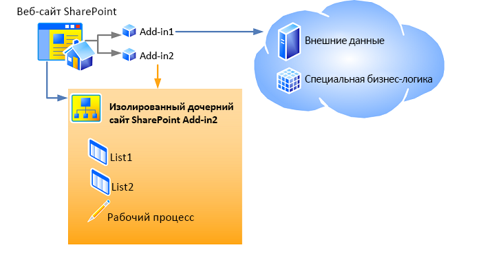

# <a name="host-webs-add-in-webs-and-sharepoint-components-in-sharepoint"></a><span data-ttu-id="ed186-102">Хост-сайты, сайты надстроек и компоненты SharePoint в SharePoint</span><span class="sxs-lookup"><span data-stu-id="ed186-102">Host webs, add-in webs, and SharePoint components in SharePoint</span></span>
<span data-ttu-id="ed186-p101">Изучите различия между сайтами надстроек и хост-сайтами. Узнайте также, какие компоненты SharePoint могут быть включены в Надстройка SharePoint, которые разворачиваются на хост-сайте, на сайте надстройки, и о порядке развертывания сайта надстройки в изолированном домене.</span><span class="sxs-lookup"><span data-stu-id="ed186-p101">Learn about the distinction between host webs and add-in webs. Also find out which SharePoint components can be included in a SharePoint Add-in, which are deployed to the host web, which are deployed to the add-in web, and how the add-in web is deployed in an isolated domain.</span></span>
 

 <span data-ttu-id="ed186-p102">**Примечание.** В настоящее время идет процесс замены названия "приложения для SharePoint" названием "надстройки SharePoint". Во время этого процесса в документации и пользовательском интерфейсе некоторых продуктов SharePoint и средств Visual Studio может по-прежнему использоваться термин "приложения для SharePoint". Дополнительные сведения см. в статье [Новое название приложений для Office и SharePoint](new-name-for-apps-for-sharepoint.md#bk_newname).</span><span class="sxs-lookup"><span data-stu-id="ed186-p102">**Note**  The name "apps for SharePoint" is changing to "SharePoint Add-ins". During the transition, the documentation and the UI of some SharePoint products and Visual Studio tools might still use the term "apps for SharePoint". For details, see  [New name for apps for Office and SharePoint](new-name-for-apps-for-sharepoint.md#bk_newname).</span></span>
 


## <a name="host-webs-add-in-webs-and-the-isolated-domain"></a><span data-ttu-id="ed186-108">Хост-сайты, сайты надстроек и изолированный домен</span><span class="sxs-lookup"><span data-stu-id="ed186-108">Host webs, add-in webs, and the isolated domain</span></span>
<span data-ttu-id="ed186-109"><a name="IsolatedDomain"> </a></span><span class="sxs-lookup"><span data-stu-id="ed186-109"><a name="IsolatedDomain"> </a></span></span>

<span data-ttu-id="ed186-p103">Когда надстройка, включающая компоненты SharePoint, устанавливается на веб-сайте, она включается в список на странице **содержания**, откуда его можно запустить. Этот список, являющийся точкой запуска надстройки, представляет единственное обязательное добавление на веб-сайт, хотя могут также быть добавлены и другие элементы, например, дополнительное действие или веб-часть надстройки. Сведения об этих возможностях см. в разделе [Доступ к надстройке из пользовательского интерфейса](important-aspects-of-the-sharepoint-add-in-architecture-and-development-landscap.md#AccessingApp). Компоненты Надстройка SharePoint, отличные от этих элементов пользовательского интерфейса, такие как списки, типы контента, рабочие процессы и страницы, разворачиваются на другом веб-сайте в специальном изолированном домене. Этот факт во многом скрыт от пользователя. Специальный сайт, на котором *разворачивается* надстройка, называется сайтом надстройки. Веб-сайт, на котором *устанавливается* надстройка, называется хост-сайтом. Хотя сайт надстройки имеет собственный изолированный домен, он находится в том же семействе сайтов, что и хост-сайт. (Единственным исключением из этого правила является установка надстройки с областью клиента. В этом случае сайт надстройки находится в семействе сайтов корпоративного каталога надстроек.)</span><span class="sxs-lookup"><span data-stu-id="ed186-p103">When an add-in that includes SharePoint components is installed on a website, it is listed on the  **Site Contents** page from which it can be launched. That listing, which is the launch point of the add-in, is the only required addition to the website, although certain other things can optionally be added, such as a custom action or an add-in part. For information about these options, see [Accessing the add-in from the UI](important-aspects-of-the-sharepoint-add-in-architecture-and-development-landscap.md#AccessingApp). Other than these UI elements, the SharePoint Add-in components and content, such as lists, content types, workflows, and pages, are deployed to a different website in a special isolated domain. This fact is largely hidden from the user. The special website to which the add-in is  *deployed*  is called anadd-in web. The website to which the add-in is  *installed*  is called thehost web. Although the add-in web has its own isolated domain, it is in the same site collection as the host web. (One exception to this rule is when the add-in is installed with tenant scope. In that scenario, the add-in web is in the site collection of the corporate add-in catalog.)</span></span> 
 

 
<span data-ttu-id="ed186-p104">На рисунке 1 показан хост-сайт с двумя установленными Надстройки SharePoint. В надстройке 1 имеются удаленные компоненты, но нет компонентов SharePoint, поэтому оно не имеет сайта надстройки. В надстройке 2 отсутствуют удаленные компоненты, но имеются два списка и рабочий процесс SharePoint. Они развернуты на изолированном дочернем сайте. (Надстройка SharePoint может иметь как удаленные компоненты, так и компоненты, размещенные в SharePoint, хотя ни одна показанная на этом рисунке надстройка не имеет сразу оба вида компонентов.)</span><span class="sxs-lookup"><span data-stu-id="ed186-p104">Figure 1 shows a host web with two SharePoint Add-ins installed. Add-in 1 has remote components, but no SharePoint components, so it has no add-in web. Add-in 2 has no remote components, but it has two SharePoint lists and a workflow. These have been deployed to an isolated subsite. (a SharePoint Add-in can have both remote and SharePoint-hosted components, although neither add-in in this diagram has both.)</span></span>
 

 

<span data-ttu-id="ed186-125">**Рис. 1. Хост-сайт с надстройкой, размещенной на ресурсах поставщика, и надстройкой с размещением в SharePoint**</span><span class="sxs-lookup"><span data-stu-id="ed186-125">**Figure 1: Host web with a provider-hosted add-in and a SharePoint-hosted add-in**</span></span>

 

 

 
<span data-ttu-id="ed186-127">Например, предположим, что надстройка с компонентами SharePoint, включающими не только элементы пользовательского интерфейса, которые могут быть развернуты на хост-сайте, устанавливается на хост-сайте со следующим URL-адресом:</span><span class="sxs-lookup"><span data-stu-id="ed186-127">For example, suppose that an add-in, with SharePoint components beyond just the UI elements that can be deployed to a host web, is installed on a host website at the following URL:</span></span>
 

 
 `https://www.fabrikam.com/sites/Marketing`
 

 
<span data-ttu-id="ed186-128">Надстройка SharePoint будет развертываться на заново созданном веб-сайте с URL-адресом, аналогичным следующему:</span><span class="sxs-lookup"><span data-stu-id="ed186-128">The SharePoint Add-in will be deployed to a newly created website with a URL like the following:</span></span>
 

 
 `http://add-in-bdf2016ea7dacb.fabrikamadd-ins.com/sites/Marketing/Scheduler`
 

 
<span data-ttu-id="ed186-129">Обратите внимание, что этот URL-адрес имеет следующую структуру:</span><span class="sxs-lookup"><span data-stu-id="ed186-129">Note that this URL has the following structure:</span></span>
 

 
 <span data-ttu-id="ed186-130">`https://` _Префикс_надстройки_ `-` _ИД_надстройки_ `.` _Базовый_домен_надстройки_ `/` _URL-адрес_хост-сайта_относительно_домена_ `/` _Имя_надстройки_</span><span class="sxs-lookup"><span data-stu-id="ed186-130">`https://` _Add-in_Prefix_ `-` _Add-in_ID_ `.` _Add-in_Base_Domain_ `/` _Domain_Relative_URL_of_Host_Web_ `/` _Add-in_Name_</span></span>
 

 
<span data-ttu-id="ed186-131">Данные заполнители имеют следующие значения:</span><span class="sxs-lookup"><span data-stu-id="ed186-131">The placeholders are defined as follows:</span></span>
 

 

 

-  <span data-ttu-id="ed186-p105">_Префикс_надстройки_ это любая строка, установленная администратором фермы в центре администрирования. Значение по умолчанию "default". В данном примере администратор изменил его на "add-in".</span><span class="sxs-lookup"><span data-stu-id="ed186-p105">_Add-in_Prefix_ is any string set by the farm administrator in Central Administration. The default is "default." In this example the administrator has changed this to "add-in."</span></span>
    
 
-  <span data-ttu-id="ed186-135">_ИД_надстройки_ — это шестнадцатеричное число, которое генерируется внутри надстройки после ее установки.</span><span class="sxs-lookup"><span data-stu-id="ed186-135">_Add-in_ID_ is a hexadecimal number generated internally when the add-in is installed.</span></span>
    
 
-  <span data-ttu-id="ed186-p106">_Базовый_домен_надстройки_ — это строка, установленная администратором фермы в Центре администрирования или с помощью командной консоли SharePoint. Его *не* следует устанавливать как поддомен веб-приложения SharePoint, иначе цель изоляции надстройки не будет выполнена. В этом примере администратор удалил префикс "www." и добавил "add-ins" к имени компании. Таким образом, `fabrikamadd-ins.com` — базовый домен приложения.</span><span class="sxs-lookup"><span data-stu-id="ed186-p106">_Add-in_Base_Domain_ is any string set by the farm administrator in Central Administration or with SharePoint Management Shell. This should *not*  be set to a subdomain of the SharePoint web application or the purpose of add-in isolation is largely defeated. In this example, the administrator has removed the "www." and added "add-ins" to the company name. So `fabrikamadd-ins.com` is the add-in base domain.</span></span>
    
 
-  <span data-ttu-id="ed186-141">_URL-адрес_хост-сайта_относительно_домена_ — это относительный URL-адрес родительского хост-сайта, в данном случае `sites/Marketing`.</span><span class="sxs-lookup"><span data-stu-id="ed186-141">_Domain_Relative_URL_of_Host_Web_ is the relative URL of the parent host web, in this case `sites/Marketing`.</span></span>
    
 
-  <span data-ttu-id="ed186-142">_Имя_надстройки_ — это значение для атрибута **Name** элемента **App** в файле appmanifest.xml.</span><span class="sxs-lookup"><span data-stu-id="ed186-142">_Add-in_Name_ is the value of the **Name** attribute of the **App** element in the appmanifest.xml file.</span></span>
    
 
<span data-ttu-id="ed186-p107">Существует две основные причины, по которым компоненты SharePoint развертываются на сайтах надстроек, а не на хост-сайта. Обе они связаны с безопасностью.</span><span class="sxs-lookup"><span data-stu-id="ed186-p107">There are two primary reasons why SharePoint components are deployed to add-in webs, rather than the host web. Both are related to security.</span></span>
 

 

 

-  <span data-ttu-id="ed186-p108">**Обеспечение выполнения разрешений надстройки.** В Модель для надстроек SharePoint надстройка имеет собственное удостоверение, а также разрешения, которые могут не совпадать с разрешениями пользователя, выполняющего надстройку. Эти разрешения надстройки запрашиваются при установке надстройки и предоставляются лицом, устанавливающим её, а также лицом, имеющим все разрешения, которые запрашивает надстройка. (Если пользователь, устанавливающий надстройку, не имеет все разрешения, запрашиваемые надстройкой, то он не может установить её.) Предоставляя каждой надстройке собственный домен, SharePoint может надежно идентифицировать запросы, которые делает надстройка, и проверять разрешения надстройки. Дополнительные сведения о разрешениях надстроек см. в разделе [Разрешения надстроек](important-aspects-of-the-sharepoint-add-in-architecture-and-development-landscap.md#AppPermissions).</span><span class="sxs-lookup"><span data-stu-id="ed186-p108">**Enforcement of add-in permissions:** In the model for SharePoint Add-ins, an add-in has its own identity and it has permissions that are not necessarily the same as the permissions of the user who is executing the add-in. These add-in permissions are requested when the add-in is installed and granted by the person who installs the add-in, as long as person has all the permissions that the add-in requests. (If the user who is installing the add-in does not have all the permissions that are requested by the add-in, the user cannot install the add-in.) By giving each add-in its own domain, SharePoint can reliably identify requests made by the add-in and verify the permissions of the add-in. For more information about add-in permissions, see [Add-in permissions](important-aspects-of-the-sharepoint-add-in-architecture-and-development-landscap.md#AppPermissions).</span></span>
    
 
-  <span data-ttu-id="ed186-p109">**Безопасность междоменных скриптов.** Современные браузеры поддерживают "политику единого домена" по отношению к вызовам методов JavaScript. При развертывании каждого Надстройка SharePoint в собственном домене, SharePoint использует преимущества политики единого домена браузера, чтобы JavaScript в Надстройка SharePoint не мог выполнять никакой JavaScript из другого домена, включая домен, в котором с точки зрения пользователя установлена надстройка.</span><span class="sxs-lookup"><span data-stu-id="ed186-p109">**Cross-domain scripting security:** Modern browsers support a "same origin policy" with regard to JavaScript method calls. By deploying each SharePoint Add-in to its own domain, SharePoint takes advantage of the browser's same origin policy to ensure that JavaScript in the SharePoint Add-in cannot execute any JavaScript from any other domain, including the domain in which, from the end-user's perspective, the add-in is installed.</span></span>
    
    <span data-ttu-id="ed186-p110">SharePoint также предоставляет средства безопасного преодоления ограничений политики. Помимо прочего, удаленным компонентам Надстройка SharePoint разрешается запрашивать данные с любого веб-сайта в рамках общей родительской принадлежности сайта надстройки и хост-сайта. Дополнительные сведения см. в статье  [Обращение к данным SharePoint из надстроек с помощью междоменной библиотеки](access-sharepoint-data-from-add-ins-using-the-cross-domain-library.md).</span><span class="sxs-lookup"><span data-stu-id="ed186-p110">SharePoint also provides a means of safely overcoming the limits of the policy. Among other things, this enables the remote components of a SharePoint Add-in to query data from any website in the common parent tenancy of the host and add-in webs. For more information, see  [Access SharePoint data from add-ins using the cross-domain library](access-sharepoint-data-from-add-ins-using-the-cross-domain-library.md).</span></span>
    
 

## <a name="types-of-sharepoint-components-that-can-be-in-a-sharepoint-add-in"></a><span data-ttu-id="ed186-154">Типы компонентов SharePoint, встречающиеся в надстройке SharePoint</span><span class="sxs-lookup"><span data-stu-id="ed186-154">Types of SharePoint components that can be in a SharePoint Add-in</span></span>
<span data-ttu-id="ed186-155"><a name="TypesOfSPComponentsInApps"> </a></span><span class="sxs-lookup"><span data-stu-id="ed186-155"><a name="TypesOfSPComponentsInApps"> </a></span></span>

<span data-ttu-id="ed186-p111">В целом надстройка SharePoint может содержать один или несколько компонентов из приведенного ниже списка. С некоторыми исключениями, эти компоненты должны разворачиваться в компонентах уровня **веб-сайта**, находящихся в файле пакета решения SharePoint (WSP-файле).</span><span class="sxs-lookup"><span data-stu-id="ed186-p111">In general, a SharePoint Add-in can contain one or more of the components in the following list. With certain exceptions, these components must be deployed in  **Web**-scoped Features that are inside a SharePoint solution package (.wsp) file:</span></span>
 

 

 <span data-ttu-id="ed186-158">**Примечание.** ***** Компоненты, помеченные звездочкой (*), более подробно рассматриваются в разделе [Предостережения для развертывания компонентов SharePoint](#SpecialCases) ниже в этой статье.</span><span class="sxs-lookup"><span data-stu-id="ed186-158">**Note**   ***** The components that are marked with an asterisk (*) are discussed in more detail in the section [Caveats for deploying SharePoint components](#SpecialCases) later in this article.</span></span>
 


- <span data-ttu-id="ed186-159">Компоненты (только уровня **веб-сайта**)</span><span class="sxs-lookup"><span data-stu-id="ed186-159">Features ( **Web**-scoped only)</span></span>
    
 
- <span data-ttu-id="ed186-160">Дополнительные действия (в том числе пункты контекстного меню и настройки ленты)*</span><span class="sxs-lookup"><span data-stu-id="ed186-160">Custom actions (including shortcut menu items and ribbon customizations)*</span></span>
    
 
- <span data-ttu-id="ed186-161">Удаленные приемники событий*</span><span class="sxs-lookup"><span data-stu-id="ed186-161">Remote event receivers*</span></span>
    
 
- <span data-ttu-id="ed186-162">Разметка, которая ссылается на веб-части, в том числе веб-части надстроек, которые включены в SharePoint (но не настраиваемые веб-части)*</span><span class="sxs-lookup"><span data-stu-id="ed186-162">Markup that references Web Parts, including add-in parts, that are included in SharePoint (but not custom Web Parts)*</span></span>
    
 
- <span data-ttu-id="ed186-163">Пользовательские файлы таблиц стилей (CSS) для использования страницами SharePoint</span><span class="sxs-lookup"><span data-stu-id="ed186-163">Custom cascading style sheets (CSS) files for use by SharePoint pages</span></span>
    
 
- <span data-ttu-id="ed186-164">Пользовательские файлы JavaScript для использования страницами SharePoint</span><span class="sxs-lookup"><span data-stu-id="ed186-164">Custom JavaScript files for use by SharePoint pages</span></span>
    
 
- <span data-ttu-id="ed186-165">Модули (наборы файлов)</span><span class="sxs-lookup"><span data-stu-id="ed186-165">Modules (sets of files)</span></span>
    
 
- <span data-ttu-id="ed186-166">Страницы</span><span class="sxs-lookup"><span data-stu-id="ed186-166">Pages</span></span>
    
 
- <span data-ttu-id="ed186-167">Шаблоны списка</span><span class="sxs-lookup"><span data-stu-id="ed186-167">List templates</span></span>
    
 
- <span data-ttu-id="ed186-168">Экземпляры списков и библиотек</span><span class="sxs-lookup"><span data-stu-id="ed186-168">List and library instances</span></span>
    
 
- <span data-ttu-id="ed186-169">Настраиваемые формы списков</span><span class="sxs-lookup"><span data-stu-id="ed186-169">Custom list forms</span></span>
    
 
- <span data-ttu-id="ed186-170">Настраиваемые представления списков</span><span class="sxs-lookup"><span data-stu-id="ed186-170">Custom list views</span></span>
    
 
- <span data-ttu-id="ed186-171">Настраиваемые типы контента</span><span class="sxs-lookup"><span data-stu-id="ed186-171">Custom content types</span></span>
    
 
- <span data-ttu-id="ed186-172">Поля (относящиеся к типам полей, встроенным в SharePoint)</span><span class="sxs-lookup"><span data-stu-id="ed186-172">Fields (of field types that are built into SharePoint)</span></span>
    
 
- <span data-ttu-id="ed186-173">Модели службы Microsoft Business Connectivity Services (только уровня **веб-сайта**), основанные на модели типы внешнего контента и внешние списки, использующие типы контента*</span><span class="sxs-lookup"><span data-stu-id="ed186-173">Microsoft Business Connectivity Services (BCS) models ( **Web**-scoped only), external content types based on the model, and external lists that use the content types*</span></span>
    
 
- <span data-ttu-id="ed186-174">Рабочие процессы*</span><span class="sxs-lookup"><span data-stu-id="ed186-174">Workflows*</span></span>
    
 
- <span data-ttu-id="ed186-175">Контейнеры свойств</span><span class="sxs-lookup"><span data-stu-id="ed186-175">Property bags</span></span>
    
 
- <span data-ttu-id="ed186-176">Шаблоны сайтов (но не определения сайтов)*</span><span class="sxs-lookup"><span data-stu-id="ed186-176">Web templates (but not site definitions)*</span></span>
    
 
<span data-ttu-id="ed186-p112">Никакие другие виды компонентов SharePoint не могут разворачиваться в Надстройка SharePoint. Дополнительные сведения об ограничениях того, что можно включать в Надстройка SharePoint, см. в статье  [Сравнение надстроек SharePoint с решениями SharePoint](http://msdn.microsoft.com/library/0e9efadb-aaf2-4c0d-afd5-d6cf25c4e7a8%28Office.15%29.aspx).</span><span class="sxs-lookup"><span data-stu-id="ed186-p112">No other kind of SharePoint component can be deployed in a SharePoint Add-in. For more information about restrictions on what can be included in a SharePoint Add-in, see  [SharePoint Add-ins compared with SharePoint solutions](http://msdn.microsoft.com/library/0e9efadb-aaf2-4c0d-afd5-d6cf25c4e7a8%28Office.15%29.aspx).</span></span>
 

 

## <a name="caveats-for-deploying-sharepoint-components"></a><span data-ttu-id="ed186-179">Условия для развертывания компонентов SharePoint</span><span class="sxs-lookup"><span data-stu-id="ed186-179">Caveats for deploying SharePoint components</span></span>
<span data-ttu-id="ed186-180"><a name="SpecialCases"> </a></span><span class="sxs-lookup"><span data-stu-id="ed186-180"><a name="SpecialCases"> </a></span></span>

<span data-ttu-id="ed186-181">Ознакомьтесь с условиями и подробными сведениями, касающимися развертывания определенных компонентов SharePoint в надстройке:</span><span class="sxs-lookup"><span data-stu-id="ed186-181">The following are some caveats and details concerning the deployment of certain kinds of SharePoint components in an add-in:</span></span> 
 

 

-  <span data-ttu-id="ed186-p113">**Дополнительные действия.** Дополнительные действия можно добавлять как на сайт надстройки, так и на хост-сайт. Чтобы добавить дополнительное действие на сайт надстройки, его следует включить в компонент уровня **веб-сайта**, находящийся в WSP-файле, как это делается с любым другим компонентом, который добавляется на сайт надстройки. Чтобы добавить дополнительное действие на хост-сайт, можно включить (даже в надстройке с внешним размещением) разметку **CustomAction** в компонент, который находится в пакете надстройки, но вне WSP-файла. Компоненты в таком "свободном" компоненте относятся к хост-сайту, а не к сайту надстройки, поэтому такой тип компонентов называется компонентом хост-сайта.</span><span class="sxs-lookup"><span data-stu-id="ed186-p113">**Custom actions:** In addition to adding custom actions to the add-in web, you can add them to the host web as well. To add the custom action to the add-in web, you include it in a **Web**-scoped Feature that is inside a .wsp file, just as you would include any other component you add to the add-in web. To add a custom action to the host web, you can include (even in an externally based add-in)  **CustomAction** markup in a Feature that is in the add-in package but outside any .wsp file. Components in such a "loose" Feature apply to the host web, not the add-in web, so this type of Feature is called ahost web Feature.</span></span> 
    
 
-  <span data-ttu-id="ed186-p114">**Веб-части.** Одну разновидность веб-частей, веб-часть надстройки, можно разворачивать в надстройке, и эта веб-часть может вести либо на сайт надстройки, либо на хост-сайт. На все остальные типы веб-частей можно ссылаться в надстройках, но они не могут разворачиваться в надстройках. Если веб-часть надстройки разворачивается на хост-сайте, ее необходимо включить в компонент хост-сайта.</span><span class="sxs-lookup"><span data-stu-id="ed186-p114">**Web Parts:** One kind of Web Part, an add-in part, can be deployed in an add-in, and an add-in part can go to either the add-in web or the host web. All other types of Web Parts can be referenced in add-ins, but not deployed by them. If an add-in part is deployed to the host web, it should be included in a host web Feature.</span></span>
    
 
-  <span data-ttu-id="ed186-p115">**Удаленные приемники событий.** Удаленные приемники событий появились в SharePoint. Они похожи на классические приемники событий SharePoint, за исключением того, что код выполняется в облаке. Эти приемники событий недоступны в надстройках, размещенных в SharePoint.</span><span class="sxs-lookup"><span data-stu-id="ed186-p115">**Remote event receivers:** These are new in SharePoint. They resemble classic SharePoint event receivers except that the code runs in the cloud. These are not available in a SharePoint-hosted add-in.</span></span>
    
 
-  <span data-ttu-id="ed186-p116">**Рабочие процессы.** Рабочие процессы в SharePoint используют среду выполнения workflow-процессов, размещенную в Microsoft Azure, которая появилась в SharePoint. Закодированные рабочие процессы, которые используют среду выполнения workflow-процессов, размещенную в SharePoint, не могут включаться в Надстройка SharePoint. Разрешены только декларативные рабочие процессы или рабочие процессы, использующие новейшую среду выполнения.</span><span class="sxs-lookup"><span data-stu-id="ed186-p116">**Workflows:** Workflows in SharePoint use the Microsoft Azure-hosted workflow runtime that is new in SharePoint. Coded workflows that use the SharePoint-hosted workflow runtime cannot be included in a SharePoint Add-in. Only declarative workflows or workflows that use the newer runtime are allowed.</span></span>
    
 
-  <span data-ttu-id="ed186-p117">**Модели службы Microsoft Business Connectivity Services (BCS), типы внешнего контента и внешние списки.** Модели службы подключения к бизнес-данным (BDC) обычно имеют область, которая шире, чем семейство сайтов. Однако когда модель службы подключения к бизнес-данным разворачивается в надстройке, ее область ограничивается областью сайта надстройки. Когда модель службы подключения к бизнес-данным включается в надстройку, она хранится не в хранилище общих служб BDC, а в виде файла на сайте надстройки.</span><span class="sxs-lookup"><span data-stu-id="ed186-p117">**Microsoft Business Connectivity Services (BCS) models, external content types, and external lists:**Business Data Connectivity (BDC) service models typically have a scope that is wider than a site collection. However, when a Business Data Connectivity (BDC) service model is deployed in an add-in, its scope is limited to the add-in web. When a Business Data Connectivity (BDC) service model is included in an add-in, it is not stored in the Business Data Connectivity (BDC) service shared service store. Instead, it is stored as a file in the add-in web.</span></span>
    
 
-  <span data-ttu-id="ed186-p118">**Шаблоны сайтов.** В большинстве случаев вам будет требоваться, чтобы сайт надстройки устанавливал новую встроенную конфигурацию определений сайта **APP#0**, оптимизированную для сайтов надстройки. (Дополнительные сведения об этом см. в разделе [Доступ к надстройке из пользовательского интерфейса](important-aspects-of-the-sharepoint-add-in-architecture-and-development-landscap.md#AccessingApp).) SharePoint автоматически использует **APP#0**, если пакет надстройки не включает элемент [WebTemplate](http://msdn.microsoft.com/library/ff4ba91a-cc5f-47ff-9101-a7651f452185%28Office.15%29.aspx).</span><span class="sxs-lookup"><span data-stu-id="ed186-p118">**Web Templates:** In most cases, you will want the add-in web to instantiate the new built-in site definition configuration **APP#0**, which is optimized for add-in webs. (For more information about it, see  [Accessing the add-in from the UI](important-aspects-of-the-sharepoint-add-in-architecture-and-development-landscap.md#AccessingApp).) SharePoint automatically uses  **APP#0** when the add-in package does not include a [WebTemplate](http://msdn.microsoft.com/library/ff4ba91a-cc5f-47ff-9101-a7651f452185%28Office.15%29.aspx) element.</span></span>
    
    <span data-ttu-id="ed186-p119">Кроме того, можно задать тип настраиваемого сайта для сайта надстройки. Для этого необходимо выполнить два основных действия:</span><span class="sxs-lookup"><span data-stu-id="ed186-p119">You can also define a custom site type for the add-in web. There are two major steps to doing this:</span></span>
    
      - <span data-ttu-id="ed186-p120">Включите настраиваемый  [Элемент WebTemplate (веб-шаблон)](http://msdn.microsoft.com/library/ff4ba91a-cc5f-47ff-9101-a7651f452185%28Office.15%29.aspx), файл onet.xml и возможно другие связанные файлы в компонент сайта надстройки для вашей надстройки. Разверните шаблон сайта в компоненте уровня сайта в WSP-файле в пакете надстройки обычным образом.</span><span class="sxs-lookup"><span data-stu-id="ed186-p120">Include a custom  [WebTemplate Element (Web Template)](http://msdn.microsoft.com/library/ff4ba91a-cc5f-47ff-9101-a7651f452185%28Office.15%29.aspx), an onet.xml file, and possibly other associated files, in the add-in web Feature for your add-in. Deploy the web template in the Web-scoped Feature in a .wsp file inside the add-in package as usual.</span></span>
    
 
  - <span data-ttu-id="ed186-p121">Добавьте  [Элемент WebTemplate (PropertiesDefinition complexType) (Manifest SharePoint Add-in)](http://msdn.microsoft.com/library/62302903-e97a-a9a3-a64e-13176a7c4e1e%28Office.15%29.aspx) в манифест надстройки в качестве потомка элемента **Properties** и установите для его атрибута **Id** значение GUID компонента сайта надстройки и значение **Name** атрибута [Элемент WebTemplate (веб-шаблон)](http://msdn.microsoft.com/library/ff4ba91a-cc5f-47ff-9101-a7651f452185%28Office.15%29.aspx). Обратите внимание, что GUID должен быть заключен в фигурные скобки и содержать дефисы, а также отделяться от имени шаблона символом "#". Вот пример такого значения:</span><span class="sxs-lookup"><span data-stu-id="ed186-p121">Add a  [WebTemplate element (PropertiesDefinition complexType) (SharePoint Add-in Manifest)](http://msdn.microsoft.com/library/62302903-e97a-a9a3-a64e-13176a7c4e1e%28Office.15%29.aspx) to the add-in manifest as a child of the **Properties** element and set its **Id** attribute to the GUID of the add-in web Feature and the value of the **Name** attribute of the [WebTemplate Element (Web Template)](http://msdn.microsoft.com/library/ff4ba91a-cc5f-47ff-9101-a7651f452185%28Office.15%29.aspx). Note that GUID must be hyphenated and wrapped in braces "{}", and the GUID and template name are separated by the "#" character. The following is an example:</span></span>
    
```XML
  <WebTemplate Id="{81dd4ae5-873b-4759-9838-4ad9c3dd2952}#NewSiteType" />
```


     **Note**  The new  [WebTemplate](http://msdn.microsoft.com/library/62302903-e97a-a9a3-a64e-13176a7c4e1e%28Office.15%29.aspx) element for add-in manifests is not the same markup as the [WebTemplate](http://msdn.microsoft.com/library/ff4ba91a-cc5f-47ff-9101-a7651f452185%28Office.15%29.aspx) element that can be included in Features. The **WebTemplate** element that can be included in Features defines a type of site, but the **WebTemplate** element for add-in manifests simply identifies what type of site to use. For more information about the add-in manifest of a SharePoint Add-in, see [Add-in package structure](important-aspects-of-the-sharepoint-add-in-architecture-and-development-landscap.md#SPAppModelArch_Package).

     **Caution**  Do not use the  **WebTemplate** element in the add-in manifest to designate any of the built-in SharePoint site definition configurations as the add-in web's site type. We do not support using any of the built-in site definition configurations, other than **APP#0**, for add-in webs. 

    For more information about site definition configurations and web templates, see  [Working with Site Templates and Definitions](http://msdn.microsoft.com/library/1edf6d4d-eddb-4cb5-9034-ed394e8a3e01%28Office.15%29.aspx).
    
 

## <a name="additional-resources"></a><span data-ttu-id="ed186-208">Дополнительные ресурсы</span><span class="sxs-lookup"><span data-stu-id="ed186-208">Additional resources</span></span>
<span data-ttu-id="ed186-209"><a name="SP15hostedwebs_bk_addlresources"> </a></span><span class="sxs-lookup"><span data-stu-id="ed186-209"><a name="SP15hostedwebs_bk_addlresources"> </a></span></span>


-  [<span data-ttu-id="ed186-210">Важные аспекты архитектуры и разработки надстроек SharePoint</span><span class="sxs-lookup"><span data-stu-id="ed186-210">Important aspects of the SharePoint Add-in architecture and development landscape</span></span>](important-aspects-of-the-sharepoint-add-in-architecture-and-development-landscap.md)
    
 
-  [<span data-ttu-id="ed186-211">Надстройки SharePoint в сравнении с решениями для SharePoint</span><span class="sxs-lookup"><span data-stu-id="ed186-211">SharePoint Add-ins compared with SharePoint solutions</span></span>](http://msdn.microsoft.com/library/0e9efadb-aaf2-4c0d-afd5-d6cf25c4e7a8%28Office.15%29.aspx)
    
 

 

 

