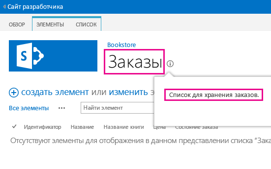

# <a name="localize-sharepoint-add-ins"></a><span data-ttu-id="f15c3-102">Локализация надстроек SharePoint</span><span class="sxs-lookup"><span data-stu-id="f15c3-102">Localize SharePoint Add-ins</span></span>
<span data-ttu-id="f15c3-103">Узнайте, как локализовать надстройку SharePoint с помощью файлов ресурсов (в том числе JavaScript) и других методов.</span><span class="sxs-lookup"><span data-stu-id="f15c3-103">Localize a SharePoint Add-in by using resource files, JavaScript resource files, and other techniques.</span></span>
 

 <span data-ttu-id="f15c3-p101">**Примечание.** В настоящее время идет процесс замены названия "приложения для SharePoint" названием "надстройки SharePoint". Во время этого процесса в документации и пользовательском интерфейсе некоторых продуктов SharePoint и средств Visual Studio может по-прежнему использоваться термин "приложения для SharePoint". Дополнительные сведения см. в статье [Новое название приложений для Office и SharePoint](new-name-for-apps-for-sharepoint.md#bk_newname).</span><span class="sxs-lookup"><span data-stu-id="f15c3-p101">**Note**  The name "apps for SharePoint" is changing to "SharePoint Add-ins". During the transition, the documentation and the UI of some SharePoint products and Visual Studio tools might still use the term "apps for SharePoint". For details, see  [New name for apps for Office and SharePoint](new-name-for-apps-for-sharepoint.md#bk_newname).</span></span>
 


 <span data-ttu-id="f15c3-107">**Примечание.** В этой статье предполагается, что вы знакомы с основами создания надстроек SharePoint, компонентами SharePoint, разницей между сайтами надстроек и хост-сайтами, [типами компонентов SharePoint, которые можно размещать в надстройке](host-webs-add-in-webs-and-sharepoint-components-in-sharepoint.md#TypesOfSPComponentsInApps), и основами локализации с помощью RESX-файлов.</span><span class="sxs-lookup"><span data-stu-id="f15c3-107">**Note**  This topic assumes that you are familiar with basic creation of SharePoint Add-ins; and with SharePoint Features, the distinction between add-in webs and host webs,  [what kind of SharePoint components can be in an add-in](host-webs-add-in-webs-and-sharepoint-components-in-sharepoint.md#TypesOfSPComponentsInApps), and the basics of localization with .resx files.</span></span>
 


## <a name="get-ready-to-localize-a-sharepoint-add-in"></a><span data-ttu-id="f15c3-108">Подготовка к локализации надстройки SharePoint</span><span class="sxs-lookup"><span data-stu-id="f15c3-108">Get ready to localize a SharePoint Add-in</span></span>
<span data-ttu-id="f15c3-109"><a name="Prerequisites"> </a></span><span class="sxs-lookup"><span data-stu-id="f15c3-109"><a name="Prerequisites"> </a></span></span>

<span data-ttu-id="f15c3-110">Прежде чем начать, определите следующее:</span><span class="sxs-lookup"><span data-stu-id="f15c3-110">Before you begin, identify the following:</span></span> 
 

 

- <span data-ttu-id="f15c3-p102">Языковые стандарты, которые должна поддерживать надстройка. SharePoint Online и локальная система SharePoint с установленными языковыми пакетами позволяют создавать веб-сайты на определенном языке. Определите, какие локализованные веб-сайты будут использовать ваши клиенты и для каких из них необходимо локализовать компоненты надстройки.</span><span class="sxs-lookup"><span data-stu-id="f15c3-p102">The locales that your add-in needs to support. SharePoint Online and SharePoint on premises with Language Packs installed enable users to create websites in a specific language and culture. Decide what localized websites your customers will be using and determine which of these you want to support with a localized version of your add-in's components.</span></span>
    
 
- <span data-ttu-id="f15c3-114">Компоненты, которые необходимо локализовать в надстройке.</span><span class="sxs-lookup"><span data-stu-id="f15c3-114">The components that you need to localize in your add-in.</span></span>
    
 
<span data-ttu-id="f15c3-115">Кроме того, обратите внимание на следующее:</span><span class="sxs-lookup"><span data-stu-id="f15c3-115">Also, be aware of the following:</span></span>
 

 

-  <span data-ttu-id="f15c3-116">В этой статье предполагается, что вы используете последнюю версию Инструментов разработчика Microsoft Office для [Visual Studio 2013](http://aka.ms/OfficeDevToolsForVS2013) или [Visual Studio 2015](http://aka.ms/OfficeDevToolsForVS2015).</span><span class="sxs-lookup"><span data-stu-id="f15c3-116">The procedures in this article assume that you are using the most recent version of [Office Developer Tools for Visual Studio 2013](http://aka.ms/OfficeDevToolsForVS2013), or  [Office Developer Tools for Visual Studio 2015](http://aka.ms/OfficeDevToolsForVS2015).</span></span>
    
     <span data-ttu-id="f15c3-p103">**Примечание.** Если тестовый веб-сайт SharePoint является локальной фермой SharePoint, а не сайтом разработчика Microsoft SharePoint Online, возможно, потребуется установить языковые пакеты для языков, на которые вы будете переводить надстройку SharePoint. Дополнительные сведения см. в статьях [Установка и удаление языковых пакетов для SharePoint](http://technet.microsoft.com/en-us/library/cc262108%28v=office.15%29.aspx) и [Языковые пакеты в SharePoint Server 2013](http://technet.microsoft.com/en-us/library/ff463597%28v=office.15%29.aspx), а также по ссылкам для загрузки в последней статье.</span><span class="sxs-lookup"><span data-stu-id="f15c3-p103">**Note**  If your test SharePoint website is an on premise SharePoint farm instead of a Microsoft SharePoint Online Developer Site, you may need to install the language packs for the languages in which you are translating your SharePoint Add-in. For more information, see  [Install or uninstall language packs for SharePoint](http://technet.microsoft.com/en-us/library/cc262108%28v=office.15%29.aspx) and [Language packs in SharePoint Server 2013](http://technet.microsoft.com/en-us/library/ff463597%28v=office.15%29.aspx), and the download links in the latter.</span></span>
- <span data-ttu-id="f15c3-p104">Снимки экранов и примеры кода в этой статье демонстрируют пример  [SharePoint-Add-in-Localization](https://github.com/OfficeDev/SharePoint-Add-in-Localization). Вы можете скачать пример, чтобы увидеть результаты описанных здесь процедур.</span><span class="sxs-lookup"><span data-stu-id="f15c3-p104">The screen shots and code examples in this article reflect the sample  [SharePoint-Add-in-Localization](https://github.com/OfficeDev/SharePoint-Add-in-Localization). You can download the sample to see the results of the procedures described in this article.</span></span>
    
 

## <a name="localize-the-add-in-web-components"></a><span data-ttu-id="f15c3-121">Локализация компонентов сайта надстройки</span><span class="sxs-lookup"><span data-stu-id="f15c3-121">Localize the add-in web components</span></span>
<span data-ttu-id="f15c3-122"><a name="LocalizingAppWeb"> </a></span><span class="sxs-lookup"><span data-stu-id="f15c3-122"><a name="LocalizingAppWeb"> </a></span></span>

<span data-ttu-id="f15c3-p105">Сайт надстройки может содержать определенные типы компонентов SharePoint. Дополнительные сведения см. в разделе  [Типы компонентов SharePoint, которые могут находиться в надстройке для SharePoint](host-webs-add-in-webs-and-sharepoint-components-in-sharepoint.md#TypesOfSPComponentsInApps). Чтобы локализовать компоненты, развернутые на сайте надстройки, добавьте RESX-файлы в модули в компоненте, который содержит компонент сайта надстройки. Добавьте ссылки на ресурсы в разметку компонента. Ниже описано, как это сделать. Однако дополнительные страницы сайта в надстройке SharePoint используют файлы строковых переменных JavaScript, а не RESX-файлы, как описано ниже.</span><span class="sxs-lookup"><span data-stu-id="f15c3-p105">An add-in web can contain specific kinds of SP components. For more information about the kinds of SharePoint components that can be in a SharePoint Add-in, see  [Types of SharePoint components that can be in a SharePoint Add-in](host-webs-add-in-webs-and-sharepoint-components-in-sharepoint.md#TypesOfSPComponentsInApps). To localize components that are deployed to an add-in web, you add .resx files in modules in the same Feature that contains the add-in web component. You reference the resources in the markup of the component. How you do this is explained later in this article. However, custom site pages in a SharePoint Add-in use JavaScript string variable files instead of .resx files, as described later in this section.</span></span>
 

 

 <span data-ttu-id="f15c3-p106">**Примечание.** Несколько компонентов сайтов надстройки не могут использовать одни и те же файлы ресурсов. Для каждого компонента в WSP-файле необходимо создать отдельный набор файлов ресурсов.</span><span class="sxs-lookup"><span data-stu-id="f15c3-p106">**Note**  Resource files cannot be shared by multiple add-in web Features. For each Feature in the .wsp file, you have to create separate sets of resource files.</span></span>
 


### <a name="to-create-the-add-in-web-resource-files"></a><span data-ttu-id="f15c3-131">Создание файлов ресурсов для сайта надстройки</span><span class="sxs-lookup"><span data-stu-id="f15c3-131">To create the add-in web resource files</span></span>


1. <span data-ttu-id="f15c3-p107">Откройте проект надстройки SharePoint в Visual Studio. Пример, из которого взяты снимки экрана в этом разделе, представляет из себя размещенную у поставщика надстройку с веб-формами ASP.NET в качестве удаленного веб-приложения, входящего в проект.</span><span class="sxs-lookup"><span data-stu-id="f15c3-p107">Open the SharePoint Add-in project in Visual Studio. (The sample from which the screenshots in this topic were taken is a provider-hosted add-in with ASP.NET Web Forms as the remote web application part of the project.)</span></span>
    
 
2. <span data-ttu-id="f15c3-134">В **обозревателе решений** откройте контекстное меню для имени компонента, а затем выберите пункт **Добавить ресурс компонента**.</span><span class="sxs-lookup"><span data-stu-id="f15c3-134">In  **Solution Explorer**, open the shortcut menu for the Feature name, and choose  **Add Feature Resource**.</span></span>
    
 
3. <span data-ttu-id="f15c3-p108">В диалоговом окне **Добавление ресурса** выберите **Инвариантный язык (Инвариантная страна)**, а затем нажмите кнопку **ОК**. Файл Resources.resx будет добавлен в папку компонента в **обозревателе решений** и откроется в **редакторе ресурсов** Visual Studio.</span><span class="sxs-lookup"><span data-stu-id="f15c3-p108">In the  **Add Resource** dialog box, choose **Invariant Language (Invariant Country)**, and then choose the  **OK** button. A Resources.resx file is added to the Feature's folder in **Solution Explorer**, and the file is opened in the Visual Studio  **Resource Editor**.</span></span> 
    
    <span data-ttu-id="f15c3-p109">При редактировании этот файл "инвариантного языка" содержит строки, используемые в коллекции **компонентов** на всех сайтах на тех языках, для которых вы *не* собираетесь предоставлять локализованные версии строк. Следовательно, для строк в этом файле следует использовать язык, наиболее подходящий в качестве второго языка для пользователей SharePoint. Традиционно в этих целях используется английский, но в некоторых случаях может лучше подходить другой язык. Например, в некоторых регионах наиболее распространенным вторым языком может быть французский, а не английский. В примере из этого раздела в качестве инвариантного языка используется английский.</span><span class="sxs-lookup"><span data-stu-id="f15c3-p109">When edited, this "invariant language" file contains the strings that are used in the  **Feature** gallery on all sites in languages for which you are *not*  going to be providing a localized version of strings. So the language used for the strings in this file should be the language that is most likely to be a second language of people using SharePoint. Traditionally, English is used for this purpose, but in some scenarios another language might be a better choice. For example, in some regions, French may be a more common second language of the users than English. The continuing example in this topic uses English as the invariant language.</span></span>
    
     <span data-ttu-id="f15c3-p110">**Примечание.** Надстройку SharePoint невозможно установить на веб-сайте, язык которого не указан в разделе **Поддерживаемые коды языков** манифеста надстройки. Помните, что даже если в этой статье рассматриваются языки, на которые вы *не* собираетесь локализовать надстройку, их все равно необходимо добавить в манифест надстройки. Дополнительные сведения о поддерживаемых языковых стандартах в манифесте надстройки см. в разделе **Создание файлов ресурсов для хост-сайта** этой статьи.</span><span class="sxs-lookup"><span data-stu-id="f15c3-p110">**Note**  a SharePoint Add-in cannot be installed on a website whose language is not listed in the  **Supported Locales** section of the add-in manifest. Keep in mind that when this article discusses languages for which you are *not*  going to be providing a localized add-in, you do still have to add such languages to the add-in manifest. See the procedure **To create resource files for the host web** in this article for more details about supported locales in the add-in manifest.</span></span>
4. <span data-ttu-id="f15c3-p111">В столбце **Имя** верхней строки **редактора ресурсов** введите описательное имя строки (или другого ресурса), например OrdersListInstance_Title или OrdersListInstance_Description. Эти имена локализуемых ресурсов сами не локализуются. Каждому ресурсу необходимо присвоить собственное имя.</span><span class="sxs-lookup"><span data-stu-id="f15c3-p111">In the  **Name** column of the top row in the **Resource Editor**, enter a descriptive name for the string (or other resource)—for example, OrdersListInstance_Title andOrdersListInstance_Description. These names of localizable resources are not themselves localized. Each resource must have its own name.</span></span> 
    
 
5. <span data-ttu-id="f15c3-148">В столбце **Значение** введите соответствующую строку (либо URL-адрес или другой ресурс) на инвариантном языке, например "Заказы" и "Список для хранения заказов".</span><span class="sxs-lookup"><span data-stu-id="f15c3-148">In the  **Value** column, enter an appropriate string (or URL or other resource) in the invariant language—for example,Orders, and A list to store the orders.</span></span>
    
 
6. <span data-ttu-id="f15c3-149">Добавьте дополнительные пары имен и значений для всех строк и ресурсов, которые требуется локализовать в каких-либо компонентах.</span><span class="sxs-lookup"><span data-stu-id="f15c3-149">Add additional name and value pairs for all strings and resources that should be localized for use in any components of your Feature.</span></span>
    
 
7. <span data-ttu-id="f15c3-150">Сохраните файл.</span><span class="sxs-lookup"><span data-stu-id="f15c3-150">Save the file.</span></span>
    
 
8. <span data-ttu-id="f15c3-p112">Добавьте в компонент еще один файл ресурсов, используя тот же способ, но выберите конкретный язык вместо значения **Инвариантный язык (Инвариантная страна)**. Например, можно выбрать **Испанский (Испания)**. Файл Resources.LL-CC.resx (где `LL` и `CC`[совместимы с IETF](http://tools.ietf.org/html/rfc1766)-кодами языка и региональных параметров) добавляется в папку компонента в **обозревателе решений** и открывается в **редакторе ресурсов** Visual Studio.</span><span class="sxs-lookup"><span data-stu-id="f15c3-p112">Add another resource file to the Feature as you did before, but select a particular language instead of  **Invariant Language (Invariant Country)**. For example, you can choose  **Spanish (Spain)**. A Resources.LL-CC.resx file (where  `LL` and `CC` are [Internet Engineering Task Force (IETF)-compliant](http://tools.ietf.org/html/rfc1766) language and culture codes) is added to the Feature's folder in **Solution Explorer**, and the file is opened in the Visual Studio  **Resource Editor**.</span></span> 
    
 
9. <span data-ttu-id="f15c3-p113">С помощью **редактора ресурсов** скопируйте все строки из файла Resource.resx и вставьте их в новый файл Resources.LL-CC.resx. Если команда **Копировать** не включена в контекстном меню редактора ресурсов, скопируйте строки в буфер обмена с помощью клавиш CTRL+C.</span><span class="sxs-lookup"><span data-stu-id="f15c3-p113">Using the  **Resource Editor**, copy all the rows from Resources.resx, and paste them into the new Resources.LL-CC.resx file. (If  **Copy** is not enabled on the context menu of the resource editor, use Ctrl-C to copy the rows into the clipboard.)</span></span>
    
 
10. <span data-ttu-id="f15c3-p114">В файле Resources.LL-CC.resx замените ячейки **Значение** на переведенные версии строковых значений. Для URL-адресов и других ресурсов, не являющихся строками, замените его на новое значение, соответствующее языку и региональным параметрам.</span><span class="sxs-lookup"><span data-stu-id="f15c3-p114">In the Resources.LL-CC.resx file, replace the  **Value** cells with translated versions of the string values. For URLs and other non-string resources, replace the value with a new value that is appropriate for the language and culture.</span></span>
    
 
11. <span data-ttu-id="f15c3-158">Сохраните новый файл.</span><span class="sxs-lookup"><span data-stu-id="f15c3-158">Save the new file.</span></span>
    
 
12. <span data-ttu-id="f15c3-159">Повторите последние четыре действия для каждого иностранного языка.</span><span class="sxs-lookup"><span data-stu-id="f15c3-159">Repeat the last four steps for each foreign language.</span></span> 
    
     <span data-ttu-id="f15c3-p115">**Примечание.** Рекомендуем добавить языковой файл для того языка, который используется в качестве инвариантного. В этом случае строки можно скопировать, не меняя их значения. Во многих ситуациях наличие файла для языка, который используется в файле ресурсов как инвариантный, не требуется, особенно когда единственными ресурсами в файлах являются строки. Но файлы ресурсов также могут содержать изображения, значки, файлы и другие ресурсы. Иногда необходимо, чтобы в файле ресурсов для инвариантного языка использовалось изображение или другой ресурс, который отличается от соответствующего ресурса в *каком-либо* из языковых файлов.</span><span class="sxs-lookup"><span data-stu-id="f15c3-p115">**Note**  Consider adding a language-specific file for the same language as your invariant language. If you do, you can copy the rows without changing the values of the strings. In many situations, it is not necessary to have a language-specific file for the same language that is used in the resource file for the invariant language, especially when the only resources in the files are strings. But resource files can contain images, icons, files, and other kinds of resources too. Sometimes, you need the invariant language resource file to use an image or other resource that is different from the corresponding resource in  *any*  of the language-specific files.</span></span>
13. <span data-ttu-id="f15c3-165">Убедитесь, что для свойства **Действие при сборке** каждого файла задано значение **Содержимое**.</span><span class="sxs-lookup"><span data-stu-id="f15c3-165">For each file, verify that the  **Build Action** property is set to **Content**.</span></span>
    
 

### <a name="to-call-the-localized-resources-in-custom-lists"></a><span data-ttu-id="f15c3-166">Вызов локализованных ресурсов в настраиваемых списках</span><span class="sxs-lookup"><span data-stu-id="f15c3-166">To call the localized resources in custom lists</span></span>


1. <span data-ttu-id="f15c3-p116">Чтобы локализовать свойства заголовка и описания в настраиваемом списке, откройте файл **Elements.xml** экземпляра списка. Например, в примере из этой статьи необходимо выбрать элементы **BookstoreApp** > **Order Status** > **OrderStatusInstance** > **Elements.xml** в **обозревателе решений**.</span><span class="sxs-lookup"><span data-stu-id="f15c3-p116">To localize the title and description properties of a custom list, open the  **Elements.xml** file of the instance of the list. For example, in the sample that accompanies this topic, you would navigate **BookstoreApp** > **Order Status** > **OrderStatusInstance** > **Elements.xml** in **Solution Explorer**.</span></span>
    
 
2. <span data-ttu-id="f15c3-p117">Для атрибута **Title** укажите значение $Resources: _StringName_, где _StringName_ — это имя (не значение), которое в предыдущей процедуре вы назначили строке, задающей название настраиваемого списка, например $Resources: OrdersListInstance_Title. Обратите внимание: в отличие от некоторых ситуаций, в которых используются RESX-файлы, указываемые данные *не* включают имя файла ресурсов.</span><span class="sxs-lookup"><span data-stu-id="f15c3-p117">In the  **Title** attribute, enter$Resources: _StringName_, where  _StringName_ is the name, not the value, you gave in the previous procedure to the string that names the custom list—for example,$Resources: OrdersListInstance_Title. Note that, unlike in some contexts where .resx files are used, the resource file name is  *not*  part of what you enter.</span></span>
    
 
3. <span data-ttu-id="f15c3-p118">С помощью атрибута **Description** вызовите таким же образом строковый ресурс описания списка, например $Resources:OrdersListInstance_Description. Ниже представлена часть кода с использованием локализованных строк из файла Elements.xml этого экземпляра списка.</span><span class="sxs-lookup"><span data-stu-id="f15c3-p118">Use the  **Description** attribute to call the string resource of the list description in the same way—for example,$Resources:OrdersListInstance_Description. The following is the markup that uses the localized strings in the Elements.xml file of the instance of a list.</span></span>
    
```XML
  <?xml version="1.0" encoding="utf-8"?>
<Elements xmlns="http://schemas.microsoft.com/sharepoint/">
  <ListInstance 
      Title="$Resources:OrdersListInstance_Title" 
      OnQuickLaunch="TRUE" 
      TemplateType="10000" 
      Url="Lists/Orders" 
      Description="$Resources:OrdersListInstance_Description">
  </ListInstance>
</Elements>
```


    The following image shows the localized custom list in English.
    

    **Localized custom list**

 

  
 

 

 

### <a name="to-localize-the-column-names-of-a-custom-list"></a><span data-ttu-id="f15c3-174">Локализация имен столбцов настраиваемого списка</span><span class="sxs-lookup"><span data-stu-id="f15c3-174">To localize the column names of a custom list</span></span>


1. <span data-ttu-id="f15c3-p119">Имена столбцов настраиваемого списка невозможно локализовать так же, как заголовок и описание. Чтобы локализовать имена столбцов, необходимо объявить поля списка в файле **Elements.xml**, а затем задать в качестве значения атрибута **DisplayName** ссылки в файлах ресурсов для сайта надстройки. Для начала откройте файл **Schema.xml** настраиваемого списка. Найдите узел **Fields** и скопируйте все его узлы **Field**.</span><span class="sxs-lookup"><span data-stu-id="f15c3-p119">You can't localize the column names of the custom list in the same way as you localize the title and description. To localize the column names, you have to declare the list fields in an  **Elements.xml** file and then set the **DisplayName** attribute value with references in the add-in web resource files. To begin, open the **Schema.xml** file of your custom list. Locate the **Fields** node and copy all its **Field** nodes.</span></span>
    
 
2. <span data-ttu-id="f15c3-p120">Откройте файл **Elements.xml** настраиваемого списка. Убедитесь, что открыт файл Elements.xml определения списка, а не его экземпляра. Вставьте узлы из предыдущего этапа в качестве дочерних в узел **Elements**.</span><span class="sxs-lookup"><span data-stu-id="f15c3-p120">Open the  **Elements.xml** file of your custom list. Make sure you open the Elements.xml file of the list definition, and not of the instance of the list. Paste the nodes from the previous step as children of the **Elements** node.</span></span>
    
 
3. <span data-ttu-id="f15c3-182">Для каждого узла **Field** укажите значение $Resources: _StringName_ в атрибуте **DisplayName**, где _StringName_ — это имя записи в файле ресурсов сайта надстройки.</span><span class="sxs-lookup"><span data-stu-id="f15c3-182">For every  **Field** node, enter a value of$Resources: _StringName_ in the **DisplayName** attribute where _StringName_ is the name of an entry in the add-in web resource file.</span></span>
    
 
4. <span data-ttu-id="f15c3-p121">В файле **Schema.xml** настраиваемого списка удалите атрибут **DisplayName** каждого ранее скопированного узла **Field**. Ниже приведен пример части кода с использованием локализованных строк в файле **Elements.xml** определения списка.</span><span class="sxs-lookup"><span data-stu-id="f15c3-p121">In the  **Schema.xml** file of your custom list, remove the **DisplayName** attribute of every **Field** node that you previously copied. The following is an example markup that uses the localized strings in the **Elements.xml** file of the list definition.</span></span>
    
```
  <?xml version="1.0" encoding="utf-8"?>
<Elements xmlns="http://schemas.microsoft.com/sharepoint/">
    <ListTemplate
        Name="Orders"
        Type="10000"
        BaseType="0"
        OnQuickLaunch="TRUE"
        SecurityBits="11"
        Sequence="410"
        DisplayName="Orders"
        Description="My List Definition"
        Image="/_layouts/15/images/itgen.png"/>
    <Field
        Name="Bookname"
        ID="{2ef60a05-29b6-41db-9611-c0cf7d8e73c5}"
        DisplayName="$Resources:OrdersListColumn_Bookname"
        Type="Text"
        Required="TRUE" />
    <Field
        Name="Price"
        ID="{7af42815-d69e-426a-a1c8-9da5610e362c}"
        DisplayName="$Resources:OrdersListColumn_Price"
        Type="Currency"
        Required="FALSE" />
    <Field
        Name="Orderstatus"
        ID="{687ee751-2e0a-4099-966e-d2c225d48234}"
        DisplayName="$Resources:OrdersListColumn_Orderstatus"
        Type="Lookup"
        Required="FALSE"
        List="Lists/Order status"
        ShowField="Title" />
</Elements>
```


### <a name="to-create-javascript-resource-files-for-custom-pages"></a><span data-ttu-id="f15c3-185">Создание файлов ресурсов JavaScript для настраиваемых страниц</span><span class="sxs-lookup"><span data-stu-id="f15c3-185">To create JavaScript resource files for custom pages</span></span>


1. <span data-ttu-id="f15c3-186">Настраиваемые страницы надстройки SharePoint используют файлы со строковыми переменными JavaScript вместо RESX-файлов.</span><span class="sxs-lookup"><span data-stu-id="f15c3-186">Custom site pages in a SharePoint Add-in use JavaScript string variable files instead of .resx files.</span></span> 
    
    <span data-ttu-id="f15c3-p122">Для начала в **обозревателе решений** добавьте папку Scripts в проект надстройки SharePoint (но не в проект веб-приложения), если такой папки еще нет. Щелкните папку **Scripts** правой кнопкой мыши и выберите **Добавить** > **Новый элемент** > **Интернет** > **Файл JavaScript**. Присвойте файлу имя Resources._LL_- _CC_.js (где _LL_ — это код языка, а _CC_ — код страны или региона либо региональных параметров). Пример: Resources.en-US.js.</span><span class="sxs-lookup"><span data-stu-id="f15c3-p122">To begin, in  **Solution Explorer**, add a folder name Scripts to the SharePoint add-in project (not the web application project) if there isn't one there already. Right-click the **Scripts** folder and add choose **Add** > **New Item** > **Web** > **JavaScript File**. Name the file Resources. _LL_- _CC_.js (where  _LL_ is a language code and _CC_ is a country/region or culture code); for example,Resources.en-US.js.</span></span>
    
 
2. <span data-ttu-id="f15c3-p123">Повторите это действие для каждого иностранного языка. У вас должны быть пустые файлы JavaScript для каждого языка.  *Не*  создавайте файл инвариантного языка с именем "Resources.js". Причина будет разъяснена в следующей процедуре.</span><span class="sxs-lookup"><span data-stu-id="f15c3-p123">Repeat the preceding step for each foreign language. You should now have blank JavaScript files for every language. Do  *not*  create an invariant language file named "Resources.js". The reason is explained in a later procedure.</span></span>
    
 
3. <span data-ttu-id="f15c3-195">Откройте первый из новых файлов JavaScript.</span><span class="sxs-lookup"><span data-stu-id="f15c3-195">Open the first of the new JavaScript files.</span></span>
    
 
4. <span data-ttu-id="f15c3-p124">Для каждой локализуемой строки на каждой из настраиваемых страниц объявите в файле переменную с именем, которое идентифицирует цель строки, и назначьте ей значение, соответствующее языку. Ниже приведено содержимое файла Resources.en-US.js.</span><span class="sxs-lookup"><span data-stu-id="f15c3-p124">For each localizable string in each of your custom pages, declare a variable in the file with a name that identifies the purpose of the string and assign it a value that is appropriate for the language. The following is the contents of the Resources.en-US.js file.</span></span>
    
```
  var instructionstitle = "Instructions:";
var step01 = "Go to any document library in the host web.";
var step02 = "Go to the Library tab.";
var step03 = "Click \"Request a book\" in the Settings group.";
var step04 = "Click the contextual menu in any document.";
var step05 = "Click \"Buy this book\" in the contextual menu.";
var step06 = "Go to any SharePoint page in the host web and add the" +
    " Bookstore orders add-in part.";
var step07 = "Review the localized <a href=\"../Lists/Orders\">Orders</a>" +
    " and <a href=\"../Lists/Order status\">Order status</a> custom lists.";

```

5. <span data-ttu-id="f15c3-198">Скопируйте содержимое этого файла во все остальные файлы JavaScript и сохраните их.</span><span class="sxs-lookup"><span data-stu-id="f15c3-198">Copy the contents of the file into each of the remaining JavaScript files, and then save all files.</span></span>
    
 
6. <span data-ttu-id="f15c3-p125">В каждом файле замените значение каждой переменной новым значением, соответствующим языку этого файла.  *Не изменяйте имена переменных.*</span><span class="sxs-lookup"><span data-stu-id="f15c3-p125">In each file, replace the value of each variable with a new value that is appropriate to the language of the file.  *Do not change the variable names.*</span></span> 
    
 

### <a name="to-call-the-localized-variables-in-custom-aspx-pages"></a><span data-ttu-id="f15c3-201">Вызов локализованных переменных в настраиваемых страницах ASPX</span><span class="sxs-lookup"><span data-stu-id="f15c3-201">To call the localized variables in custom ASPX pages</span></span>


1. <span data-ttu-id="f15c3-202">В **обозревателе решений** откройте файл настраиваемой страницы ASPX.</span><span class="sxs-lookup"><span data-stu-id="f15c3-202">In  **Solution Explorer**, open a custom ASPX page file.</span></span>
    
 
2. <span data-ttu-id="f15c3-p126">Убедитесь, что при загрузке страницы загружается только один из локализованных файлов JavaScript, соответствующий языку сайта надстройки SharePoint. Для этого добавьте приведенную ниже часть кода в элемент **asp:content** страницы, которая содержит свойство `ContentPlaceholderId` со значением `PlaceholderAdditionalPageHead`. *В этой части кода нет заполнителей. Вводите часть кода в точности, как указано здесь.*</span><span class="sxs-lookup"><span data-stu-id="f15c3-p126">Make sure that only one of the localized JavaScript files is loaded when your page loads, and it should be the one that is appropriate for the language of the SharePoint add-in web. To do this, add the following markup to the  **asp:content** element of the page that has a `ContentPlaceholderId` with the value `PlaceholderAdditionalPageHead`.  *There are no placeholders in the following markup. Enter the markup exactly as it appears here.*</span></span> 
    
```HTML
  <script type="text/javascript" src="../scripts/Resources.<SharePoint:EncodedLiteral runat='server' text='<%$Resources:wss,language_value%>' EncodeMethod='HtmlEncode' />.js"></script>
```


    This markup loads one of your JavaScript files. It determines which language file to load by reading the SharePoint resource named "language_value." This resource resolves to a language-culture name in the pattern  _LL_- _CC_ that was described in an earlier procedure. Specifically, it resolves to the language of the add-in web.
    
     **Note**  The SharePoint resource "language_value" is never null, so a file named "Resources.js" would never be called by this script. That is why you did not make one in the preceding procedure. When the value of "language_value" is a language for which there is no .js file, this script loads nothing. The next step explains how strings get an invariant language value in that situation.
3. <span data-ttu-id="f15c3-p127">Для каждого локализуемого элемента и значения атрибута на странице укажите значение по умолчанию на инвариантном языке, но затем назначьте его соответствующей переменной из файла Resources._LL_- _CC_.js с помощью JavaScript. Например, если название страницы содержится в элементе **h2**, добавьте к этому элементу атрибут **id**, а затем вставьте элемент **script** под локализованными элементами, чтобы назначить локализованные строки свойству **innerText** локализованных элементов. Этот код локализации должен запускаться, только если файл Resources._LL_- _CC_.js загружен и содержит объявления переменных. Поэтому вставьте его в условный блок, который скачала проверяет, определена ли одна из переменных. Если это не так, то скрипт ресурсов не загружен и значения по умолчанию (инвариантные) должны оставаться без изменений. Ниже приведен пример.</span><span class="sxs-lookup"><span data-stu-id="f15c3-p127">For each localizable element and attribute value on the page, give it a default value in the invariant language, but then use JavaScript to assign it the appropriate variable from the Resources. _LL_- _CC_.js file. For example, if the page has a title in an  **h2** element, give the element an **id** attribute and then insert a **script** element below the localized elements to assign localized strings to the **innerText** property of the localized elements. This localization code should only run if a Resources. _LL_- _CC_.js file loaded and declared the variables. So put it in a conditional block that first tests whether one of the variables is defined. If it is not, then no resource script loaded and the default (invariant) values should remain unchanged. The following is an example.</span></span> 
    
     <span data-ttu-id="f15c3-p128">**Совет.** В первую из инвариантных строк добавлено слово INVARIANT. В рабочей надстройке так не делают, но при тестировании это помогает быстро проверить, используются ли строки на инвариантном языке, а также загружен ли файл Resources._LL_- _CC_.js для инвариантного языка.</span><span class="sxs-lookup"><span data-stu-id="f15c3-p128">**Tip**  The word "INVARIANT" has been added to the first of the invariant strings. You would not do this in a production add-in, but while you are testing, it is a useful way of seeing at a glance whether invariant language strings are being used or whether the Resources. _LL_- _CC_.js file for the language that happens to be your invariant language was loaded.</span></span>

```HTML
  <h2 id="instructionsheading">INVARIANT Instructions</h2>
<ol>
    <li id="step01">Go to any document library in the host web.</li>
    <li id="step02">Go to the Library tab.</li>
    <li id="step03">Click "Request a book" in the Settings group.</li>
    <li id="step04">Click the contextual menu in any document.</li>
    <li id="step05">Click "Buy this book" in the contextual menu.</li>
    <li id="step06">Go to any SharePoint page in the host web and add the Bookstore orders add-in part.</li>
    <li id="step07">Review the localized <a href="../Lists/Orders">Orders</a> and <a href="../Lists/Order status">Order status</a> custom lists.</li>
</ol>

<!-- Use the localized strings in the resource JavaScript file -->
<script type="text/javascript">
    window.onload = function () {
        <!-- Test whether a Resources.LL-CC.js loaded.
             If none was, the invariant values remain unchanged. -->
        if (typeof instructionstitle != 'undefined')  
        {
            document.getElementById("instructionsheading").innerText = instructionstitle;
            document.getElementById("step01").innerText = step01;
            document.getElementById("step02").innerText = step02;
            document.getElementById("step03").innerText = step03;
            document.getElementById("step04").innerText = step04;
            document.getElementById("step05").innerText = step05;
            document.getElementById("step06").innerText = step06;
            document.getElementById("step07").innerHTML = step07;
        }
    }
</script>

```


    The following image gives a preview of how the English version of the page will look when the add-in is completed. 
    

    **Webpage using localized strings from a JavaScript resource file**

 

  
 

 

 

## <a name="localize-the-host-web-components"></a><span data-ttu-id="f15c3-218">Локализация компонентов хост-сайта</span><span class="sxs-lookup"><span data-stu-id="f15c3-218">Localize the host web components</span></span>
<span data-ttu-id="f15c3-219"><a name="LocalizingHostWeb"> </a></span><span class="sxs-lookup"><span data-stu-id="f15c3-219"><a name="LocalizingHostWeb"> </a></span></span>

<span data-ttu-id="f15c3-p129">Название надстройки, заданное в файле AppManifest.xml, можно локализовать. Это то, что видят пользователи на странице **Ваши надстройки**. Хост-сайт для надстройки SharePoint также может включать дополнительное действие и/или веб-часть приложения. Они развертываются в компоненте хост-сайта. Все эти компоненты могут содержать локализуемые строки.</span><span class="sxs-lookup"><span data-stu-id="f15c3-p129">You can localize the add-in title, which is specified in the AppManifest.xml file. This is what users see on the  **Your Add-ins** page. The host web for a SharePoint Add-in can also include a custom action, an add-in part, or both. These are deployed in a host web Feature. Both of these components can have localizable strings.</span></span>
 

 
<span data-ttu-id="f15c3-p130">Основной способ локализации компонентов хост-сайта такой же, что и для локализации компонентов сайта надстройки: локализованные ресурсы перечисляются в RESX-файле и вызываются из файлов разметки. Однако Visual Studio не имеет такого объема инструментальной поддержки этого процесса, который применяется для компонентов хост-сайта. Для этого использует выполняемый вручную процесс, который описан ниже в данном разделе.</span><span class="sxs-lookup"><span data-stu-id="f15c3-p130">The essential method for localizing host web components is the same as for localizing add-in web components: localized resources are itemized in a .resx file and are called from the markup files. However, Visual Studio does not have as much tooling support for the process as it applies to host web features. There is a manual process involved that is explained later in this section.</span></span>
 

 

### <a name="to-create-resource-files-for-the-host-web"></a><span data-ttu-id="f15c3-228">Создание файлов ресурсов для хост-сайта</span><span class="sxs-lookup"><span data-stu-id="f15c3-228">To create resource files for the host web</span></span>


1. <span data-ttu-id="f15c3-229">В **обозревателе решений** выберите файл AppManifest.xml, чтобы открыть конструктор манифеста надстройки.</span><span class="sxs-lookup"><span data-stu-id="f15c3-229">In  **Solution Explorer**, choose the AppManifest.xml file to open the add-in manifest designer tool.</span></span>
    
 
2. <span data-ttu-id="f15c3-230">Откройте вкладку **Поддерживаемые коды языков**.</span><span class="sxs-lookup"><span data-stu-id="f15c3-230">Open the  **Supported Locales** tab.</span></span>
    
 
3. <span data-ttu-id="f15c3-p131">В пустой верхней ячейке столбца **Языки** откройте раскрывающийся список и выберите первый языковой стандарт, поддержку которого требуется обеспечить. Создаются два файла, которые добавляются в проект надстройки SharePoint: Resources.resx (файл ресурсов на инвариантном языке) и Resources._LL_- _CC_.resx, который будет содержать локализованные ресурсы. *Не меняйте имена этих файлов.*</span><span class="sxs-lookup"><span data-stu-id="f15c3-p131">In the top blank cell of the  **Locales** column, open the drop-down list and choose the first locale that you want to support. Two files are created and added to the SharePoint Add-in project: Resources.resx, which is the invariant language resource file, and Resources. _LL_- _CC_.resx, which will contain the localized resources.  *Don't change the names of these files.*</span></span> 
    
 
4. <span data-ttu-id="f15c3-p132">Повторите предыдущее действие для каждого языкового стандарта, который требуется поддерживать с помощью локализованной версии надстройки. Дополнительный файл Resources. _LL_- _CC_.resx создается для каждого языкового стандарта.</span><span class="sxs-lookup"><span data-stu-id="f15c3-p132">Repeat the previous step for each locale you want to support with a localized version of the add-in. An additional Resources. _LL_- _CC_.resx file is created for each locale.</span></span>
    
     <span data-ttu-id="f15c3-p133">**Примечание.** Для свойства **Действие при сборке** каждого из этих файлов задано значение **Содержимое**, а не **Ресурс**. *Не меняйте этот параметр.*</span><span class="sxs-lookup"><span data-stu-id="f15c3-p133">**Note**  The  **Build Action** property of each of these files is set to **Content**, not  **Resource**.  *Don't change this setting.*</span></span> 
5. <span data-ttu-id="f15c3-p134">Кроме того, добавьте записи языковых стандартов для каждого языкового стандарта, с которым должна устанавливаться надстройка, но для которого используется инвариантный язык; то есть языковые стандарты, для которых  *не*  будет предоставляться локализованная версия надстройки. *Удалите RESX-файлы, созданные для этих языковых стандартов.*</span><span class="sxs-lookup"><span data-stu-id="f15c3-p134">Also add locale entries for every locale where you want your add-in to be installable, but where it should use the invariant language; that is, locales for which you will  *not*  be providing a localized version of the add-in. *Delete the .resx files that are created for these locales.*</span></span> 
    
 
6. <span data-ttu-id="f15c3-p135">Откройте файл Resources.resx и добавьте имена и значения ресурсов в файл, как это делалось в файлах ресурсов для сайта надстройки. Как минимум, необходим ресурс для названия надстройки. Компонент хост-сайта никак не отображается в интерфейсе пользователя SharePoint, поэтому вам не нужны локализованные строки для названия или описания этого компонента. Если компонент содержит дополнительное действие, то потребуется ресурс для атрибута **Title** элемента **CustomAction** и, возможно, других строк в части кода дополнительного действия. Если имеется веб-часть надстройки, то потребуются ресурсы для атрибутов **Title** и **Description** элемента **ClientWebPart**. Если веб-часть надстройки включает настраиваемые свойства, то у каждого элемента **Property** есть атрибуты, которые также необходимо локализовать. Для каждого из них потребуется строка в файле ресурсов.</span><span class="sxs-lookup"><span data-stu-id="f15c3-p135">Open the Resources.resx file and add resource names and values to the file just as you did for the add-in web resource files. At a minimum, you should have a resource for the add-in title. The host web Feature does not appear in the SharePoint UI anywhere, so you do not need localized strings for the host web Feature title or description. If the Feature has a custom action, you need a resource for the  **Title** attribute of the **CustomAction** element, and possibly other strings in the custom action markup. If there is an add-in part, you need resources for the **Title** and **Description** attributes of the **ClientWebPart** element. If the add-in part has custom properties, each **Property** has attributes that should be localized as well. For each of these, you need a row in the resources file.</span></span>
    
 
7. <span data-ttu-id="f15c3-p136">Скопируйте содержимое файла Resources.resx во все остальные файлы Resources._LL_- _CC_.resx.</span><span class="sxs-lookup"><span data-stu-id="f15c3-p136">Copy the contents of the Resources.resx file into each of the Resources. _LL_- _CC_.resx files.</span></span>
    
 
8. <span data-ttu-id="f15c3-p137">Локализуйте все ресурсы во всех файлах Resources._LL_- _CC_.resx, как это делалось для файлов ресурсов сайта надстройки.</span><span class="sxs-lookup"><span data-stu-id="f15c3-p137">Localize each resource in each Resources. _LL_- _CC_.resx file just as you did for the add-in web resource files.</span></span>
    
 

### <a name="to-call-the-localized-resources-in-the-add-in-manifest-and-other-xml-files"></a><span data-ttu-id="f15c3-253">Вызов локализованных ресурсов в манифесте надстройки и других XML-файлах</span><span class="sxs-lookup"><span data-stu-id="f15c3-253">To call the localized resources in the add-in manifest, and other XML files</span></span>


1. <span data-ttu-id="f15c3-p138">Откройте файл AppManifest.xml и замените значение элемента **Title** на вызов соответствующей строки ресурса. Например, если строка получила имя Addin_Title, то элемент **Title** должен выглядеть так:</span><span class="sxs-lookup"><span data-stu-id="f15c3-p138">Open the AppManifest.xml file and replace the  **Title** element value with a call to the appropriate resource string. For example, if you named the stringAddin_Title, the  **Title** element should look like the following:</span></span>
    
```XML
  <Title>$Resources:Addin_Title;</Title>
```


     **Caution**  The value of  **Title** can contain *only*  the call to the resource. There can be no other text, symbols, or white space.
2. <span data-ttu-id="f15c3-256">Чтобы вызвать локализованные ресурсы в других файлах XML, таких как Elements.xml для веб-частей надстроек и дополнительных действий, вы можете использовать тот же формат, который вы использовали в файле манифеста надстройки.</span><span class="sxs-lookup"><span data-stu-id="f15c3-256">To call localized resources in other XML files, such as Elements.xml for add-in parts and custom actions, you use the same format that you used in the add-in manifest file.</span></span>
    
 

## <a name="localize-remote-components-in-a-sharepoint-add-in"></a><span data-ttu-id="f15c3-257">Локализация удаленных компонентов в надстройке SharePoint</span><span class="sxs-lookup"><span data-stu-id="f15c3-257">Localize remote components in a SharePoint Add-in</span></span>
<span data-ttu-id="f15c3-258"><a name="LocalizingAutohosted"> </a></span><span class="sxs-lookup"><span data-stu-id="f15c3-258"><a name="LocalizingAutohosted"> </a></span></span>

<span data-ttu-id="f15c3-p139">Если удаленные компоненты используют формат PHP или другой формат, не являющийся форматом Майкрософт, см. инструкции по локализации для соответствующей платформы. Если удаленные компоненты представляют из себя ASP.NET, они локализуются точно так же, как компоненты любого другого приложения ASP.NET. Дополнительные сведения см. в статье  [ASP.NET Globalization and Localization](http://msdn.microsoft.com/library/8ef3838e-9d05-4236-9dd0-ceecff9df80d.aspx).</span><span class="sxs-lookup"><span data-stu-id="f15c3-p139">If the remote components are PHP or other non-Microsoft formats, see the localization guidance for the appropriate platform. When the remote componets are ASP.NET, you localize them just as you would any other ASP.NET application. For more information, see  [ASP.NET Globalization and Localization](http://msdn.microsoft.com/library/8ef3838e-9d05-4236-9dd0-ceecff9df80d.aspx).</span></span>
 

 
<span data-ttu-id="f15c3-p140">Переопределите языки страницы и потока, чтобы они соответствовали языку хост-сайта. Для этого необходимо переопределить унаследованный метод **InitializeCulture** в коде страниц ASP.NET. Чтобы определить язык хост-сайта, используйте параметр запроса **SPLanguage**, который SharePoint передает на удаленную страницу. В приведенном ниже коде показано, как сделать это в ASP.NET. В веб-приложении PHP или на другой платформе используются подобные действия.</span><span class="sxs-lookup"><span data-stu-id="f15c3-p140">Override the page language and the thread language to match the language of the host web. You do this by overriding the inherited  **InitializeCulture** method in the code-behind of your ASP.NET pages. To identify the host web's language, use the **SPLanguage** query parameter that SharePoint passes to the remote page. The following code shows how to do this in ASP.NET. You should do something parallel in a PHP web application or other platform.</span></span>
 

 


```C#
protected override void InitializeCulture()
{
    if (Request.QueryString["SPLanguage"] != null)
    {
        string selectedLanguage = Request.QueryString["SPLanguage"];
        
        // Override the page language.
        UICulture = selectedLanguage;
        Culture = selectedLanguage;

        // Reset the thread language.
        Thread.CurrentThread.CurrentCulture =
            CultureInfo.CreateSpecificCulture(selectedLanguage);
        Thread.CurrentThread.CurrentUICulture = new
            CultureInfo(selectedLanguage);
    }
    base.InitializeCulture();
}
```


## <a name="localize-remote-javascript-and-the-sharepoint-chrome-control"></a><span data-ttu-id="f15c3-267">Локализация удаленных ресурсов JavaScript и элемента управления хрома SharePoint</span><span class="sxs-lookup"><span data-stu-id="f15c3-267">Localize remote JavaScript and the SharePoint chrome control</span></span>
<span data-ttu-id="f15c3-268"><a name="JSandChrome"> </a></span><span class="sxs-lookup"><span data-stu-id="f15c3-268"><a name="JSandChrome"> </a></span></span>

<span data-ttu-id="f15c3-p141">Если в JavaScript вашего веб-приложения имеются локализуемые строковые значения, их можно локализовать с помощью файлов ресурсов JavaScript. Особенно важный пример локализуемого JavaScript  [элемент управления хрома SharePoint](use-the-client-chrome-control-in-sharepoint-add-ins.md), с помощью которого удаленные страницы можно оформить как страницы SharePoint. В этом разделе в качестве примера будет использована локализация элемента управления хрома.</span><span class="sxs-lookup"><span data-stu-id="f15c3-p141">If there are localizable string values in your web application's JavaScript, you can localize them using JavaScript resource files. An especially important example of localizable JavaScript is the  [SharePoint chrome control](use-the-client-chrome-control-in-sharepoint-add-ins.md), which can be used to give remote pages the appearance of SharePoint pages. We'll use the localization of the chrome control as an example in this section.</span></span>
 

 

 <span data-ttu-id="f15c3-p142">**Примечание.** В этом разделе рассматривается только локализация строк. Если требуется выполнить более сложные задачи локализации, например локализовать форматы дат или денежных единиц, вы можете воспользоваться библиотекой локализации или глобализации, например [надстройкой глобализации для jQuery](https://github.com/jquery/globalize).</span><span class="sxs-lookup"><span data-stu-id="f15c3-p142">**Note**  This section only discusses string localization. For more powerful localization needs, such as localization of date or currency formatting, consider using a localization or globalization library, such as the  [Globalize add-on for jQuery](https://github.com/jquery/globalize).</span></span>
 


### <a name="to-localize-the-chrome-control"></a><span data-ttu-id="f15c3-274">Локализация элемента управления хрома</span><span class="sxs-lookup"><span data-stu-id="f15c3-274">To localize the chrome control</span></span>


1. <span data-ttu-id="f15c3-275">После того как элемент управления хрома заработает, вернитесь к методу `renderChrome`, в котором заданы параметры этого элемента.</span><span class="sxs-lookup"><span data-stu-id="f15c3-275">After you have the chrome control working, return to the  `renderChrome` method where you set the chrome options.</span></span>
    
```
  function renderChrome() {
    var options = {
        "appIconUrl": "siteicon.png",
        "appTitle": "My SharePoint add-in", // Localizable string
        "appHelpPageUrl": "Help.html?"
            + document.URL.split("?")[1],
        "onCssLoaded": "chromeLoaded()",
        "settingsLinks": [
            {
                "linkUrl": "Account.html?"
                    + document.URL.split("?")[1],
                "displayName": "Account settings" // Localizable string
            },
            {
                "linkUrl": "Contact.html?"
                    + document.URL.split("?")[1],
                "displayName": "Contact us" // Localizable string
            }
        ]
    };

```

2. <span data-ttu-id="f15c3-p143">Как указывалось в примечаниях, имеется по крайней мере три локализуемых строки. Замените каждую из них именем переменной, которое будет объявлено позже.</span><span class="sxs-lookup"><span data-stu-id="f15c3-p143">As noted in the comments, there are at least three localizable strings. Replace each of these with a variable name that you declare in a later step.</span></span> 
    
```
  function renderChrome() {
    var options = {
        "appIconUrl": "siteicon.png",
        "appTitle": chromeAppTitle, // Localized value
        "appHelpPageUrl": "Help.html?"
            + document.URL.split("?")[1],
        "onCssLoaded": "chromeLoaded()",
        "settingsLinks": [
            {
                "linkUrl": "Account.html?"
                    + document.URL.split("?")[1],
                "displayName": chromeAccountLinkName // Localized value
            },
            {
                "linkUrl": "Contact.html?"
                    + document.URL.split("?")[1],
                "displayName": chromeContactUsLinkName // Localized value
            }
        ]
    };

```

3. <span data-ttu-id="f15c3-p144">Добавьте файл JavaScript с именем ChromeStrings.js в проект веб-приложения. В нем необходимо объявить переменные, использованные на предыдущем шаге, и назначить каждой из них значение на инвариантном языке.</span><span class="sxs-lookup"><span data-stu-id="f15c3-p144">Add a JavaScript file named ChromeStrings.js to the web application project. It should declare the variables you used in the preceding step and assign them each a value in the invariant language.</span></span> 
    
```
  var chromeAppTitle = "My SharePoint add-in";
var chromeAccountLinkName = "Account settings";
var chromeContactUsLinkName = "Contact us";

```

4. <span data-ttu-id="f15c3-p145">Для каждого языка, на который локализуется надстройка, добавьте еще один файл JavaScript с именем ChromeStrings. _LL-CC_.js, где  _LL-CC_ идентификатор языка. *Основа имени файла, в данном случае "ChromeStrings", должна совпадать с основой, использованной для файла инвариантного языка.*  Скопируйте содержимое файла инвариантного языка в каждый из локализованных файлов и замените значения на переведенные версии.</span><span class="sxs-lookup"><span data-stu-id="f15c3-p145">For each language for which you are localizing the add-in, add another JavaScript file with the name ChromeStrings. _LL-CC_.js, where  _LL-CC_ is the language ID. *The base of the file name, in this case "ChromeStrings," must be exactly the same as you used for the invariant language file.*  Copy the contents of the invariant language file into each of the localized files and replace the values with translated versions.</span></span>
    
```
  var chromeAppTitle = "Mi aplicación SharePoint";
var chromeAccountLinkName = "Preferencias";
var chromeContactUsLinkName = "Contacto";

```

5. <span data-ttu-id="f15c3-p146">В любом файле страницы, содержащем вызов скрипта SP.UI.controls.js, добавьте вызов файла ChromeStrings.js над этим скриптом. Например, если вызов скрипта SP.UI.controls.js загружается в промежуточный файл с именем ChromeLoader.js, разметка на странице на данном этапе должна выглядеть, как показано ниже.</span><span class="sxs-lookup"><span data-stu-id="f15c3-p146">In any page file where the script SP.UI.controls.js is called, add a call to the ChromeStrings.js above it. For example, if the call to SP.UI.controls.js is loaded in an intermediate file called ChromeLoader.js, the markup in the page at this point should look similar to the following.</span></span>
    
```
  <Scripts>
  <asp:ScriptReference Path="Scripts/ChromeStrings.js" />
  <asp:ScriptReference Path="Scripts/ChromeLoader.js" />
</Scripts>
```

6. <span data-ttu-id="f15c3-p147">Добавьте атрибут **ResourceUICultures** в элемент **ScriptReference**, вызывающий ваши строки. Его значение представляет собой разделенный запятыми список поддерживаемых языков.</span><span class="sxs-lookup"><span data-stu-id="f15c3-p147">Add a  **ResourceUICultures** attribute to the **ScriptReference** element that calls your strings. Its value is a comma-delimited list of the languages that you are supporting.</span></span>
    
```
  <Scripts>
  <asp:ScriptReference Path="Scripts/ChromeStrings.js" ResourceUICultures="en-US,es-ES" />
  <asp:ScriptReference Path="Scripts/ChromeLoader.js" />
</Scripts>
```


    The effect of the  **ResourceUICultures** attribute is that ASP.NET will look for a file with the name ChromeStrings. _LL-CC_.js, where  _LL-CC_ is the language of the page and load it. If it doesn't find such a file, it will load the ChromeStrings.js file.
    
 

## <a name="test-your-localized-sharepoint-add-in"></a><span data-ttu-id="f15c3-288">Тестирование локализованной надстройки SharePoint</span><span class="sxs-lookup"><span data-stu-id="f15c3-288">Test your localized SharePoint Add-in</span></span>
<span data-ttu-id="f15c3-289"><a name="TestingLocalizedApps"> </a></span><span class="sxs-lookup"><span data-stu-id="f15c3-289"><a name="TestingLocalizedApps"> </a></span></span>

<span data-ttu-id="f15c3-p148">Протестируйте надстройку перед тем, как развернуть ее на веб-сайте SharePoint, который подготовлен к работе на одном из языков, поддерживаемых надстройкой. Вы можете протестировать свою надстройку на веб-сайте SharePoint Online или локальном веб-сайте.</span><span class="sxs-lookup"><span data-stu-id="f15c3-p148">Test your add-in by deploying it to a SharePoint website that is provisioned in one of the languages your add-in supports. You can test your add-in on a SharePoint Online website or an on-premises website.</span></span>
 

 

### <a name="to-test-your-add-in-on-a-sharepoint-online-website"></a><span data-ttu-id="f15c3-292">Тестирование надстройки на веб-сайте SharePoint Online</span><span class="sxs-lookup"><span data-stu-id="f15c3-292">To test your add-in on a SharePoint Online website</span></span>


1. <span data-ttu-id="f15c3-293">Откройте Центр администрирования Office 365.</span><span class="sxs-lookup"><span data-stu-id="f15c3-293">Go to your Office 365 admin center.</span></span>
    
 
2. <span data-ttu-id="f15c3-294">В навигационном меню выберите пункт **Параметры службы**, а затем — **Сайты**.</span><span class="sxs-lookup"><span data-stu-id="f15c3-294">Choose  **service settings** on the navigation menu, and then choose **sites**.</span></span>
    
 
3. <span data-ttu-id="f15c3-295">В списке семейств веб-сайтов нажмите **Создать семейство веб-сайтов**.</span><span class="sxs-lookup"><span data-stu-id="f15c3-295">Under site collections, choose  **Create site collection**.</span></span>
    
 
4. <span data-ttu-id="f15c3-296">В области **выбора языка** выберите язык, на котором требуется протестировать надстройку.</span><span class="sxs-lookup"><span data-stu-id="f15c3-296">Under  **select a language**, select the language in which you want to test your add-in.</span></span>
    
 
5. <span data-ttu-id="f15c3-297">В области **выбора шаблона** выберите **Сайт разработчика**.</span><span class="sxs-lookup"><span data-stu-id="f15c3-297">Under  **select a template**, choose  **Developer Site**.</span></span>
    
 
6. <span data-ttu-id="f15c3-298">В проекте надстройки SharePoint обновите свойство **SiteUrl**, указав URL-адрес нового семейства веб-сайтов.</span><span class="sxs-lookup"><span data-stu-id="f15c3-298">In your SharePoint Add-in project, update the  **SiteUrl** property with the URL of the new site collection.</span></span>
    
 
7. <span data-ttu-id="f15c3-299">Нажмите клавишу F5, чтобы запустить надстройку.</span><span class="sxs-lookup"><span data-stu-id="f15c3-299">Press F5 to run the add-in.</span></span>
    
 

<span data-ttu-id="f15c3-300">**Страница создания семейства веб-сайтов**</span><span class="sxs-lookup"><span data-stu-id="f15c3-300">**Create site collection page**</span></span>

 

 

 

### <a name="to-test-your-add-in-an-on-premises-website"></a><span data-ttu-id="f15c3-302">Тестирование надстройки на локальном веб-сайте</span><span class="sxs-lookup"><span data-stu-id="f15c3-302">To test your add-in an on-premises website</span></span>


1. <span data-ttu-id="f15c3-p149">Установите языковой пакет, с которым требуется протестировать надстройку. Дополнительные сведения см. в статьях [Установка и удаление языковых пакетов для SharePoint](http://technet.microsoft.com/library/cc262108.aspx) и [Языковые пакеты в SharePoint Server 2013](http://technet.microsoft.com/en-us/library/ff463597%28v=office.15%29.aspx).</span><span class="sxs-lookup"><span data-stu-id="f15c3-p149">Install the language pack in which you want to test your add-in. For more information, see  [Install or uninstall language packs for SharePoint](http://technet.microsoft.com/library/cc262108.aspx) and [Language packs in SharePoint Server 2013](http://technet.microsoft.com/en-us/library/ff463597%28v=office.15%29.aspx).</span></span>
    
 
2. <span data-ttu-id="f15c3-305">Откройте центр администрирования для фермы.</span><span class="sxs-lookup"><span data-stu-id="f15c3-305">Open Central Administration for the farm.</span></span>
    
 
3. <span data-ttu-id="f15c3-306">В области **Управление приложениями** нажмите **Создать семейство веб-сайтов**.</span><span class="sxs-lookup"><span data-stu-id="f15c3-306">Under  **Application Management**, choose  **Create site collections**.</span></span>
    
 
4. <span data-ttu-id="f15c3-307">В области **выбора языка** выберите язык, на котором требуется протестировать надстройку.</span><span class="sxs-lookup"><span data-stu-id="f15c3-307">Under  **select a language**, select the language in which you want to test your add-in.</span></span>
    
 
5. <span data-ttu-id="f15c3-308">В области **выбора шаблона** выберите **Сайт разработчика**.</span><span class="sxs-lookup"><span data-stu-id="f15c3-308">Under  **select a template**, choose  **Developer Site**.</span></span>
    
 
6. <span data-ttu-id="f15c3-309">В проекте надстройки SharePoint обновите свойство **SiteUrl**, указав URL-адрес недавно созданного семейства веб-сайтов.</span><span class="sxs-lookup"><span data-stu-id="f15c3-309">In your SharePoint Add-in project, update the  **SiteUrl** to the URL of the recently created site collection.</span></span>
    
 
7. <span data-ttu-id="f15c3-310">Нажмите клавишу F5, чтобы запустить надстройку.</span><span class="sxs-lookup"><span data-stu-id="f15c3-310">Press F5 to run the add-in.</span></span>
    
 

## <a name="additional-resources"></a><span data-ttu-id="f15c3-311">Дополнительные ресурсы</span><span class="sxs-lookup"><span data-stu-id="f15c3-311">Additional resources</span></span>
<span data-ttu-id="f15c3-312"><a name="SP15Localizeapp_addlresources"> </a></span><span class="sxs-lookup"><span data-stu-id="f15c3-312"><a name="SP15Localizeapp_addlresources"> </a></span></span>

-  [<span data-ttu-id="f15c3-313">Разработка надстроек SharePoint</span><span class="sxs-lookup"><span data-stu-id="f15c3-313">Develop SharePoint Add-ins</span></span>](develop-sharepoint-add-ins.md)
-  [<span data-ttu-id="f15c3-314">Локализация надстроек Office</span><span class="sxs-lookup"><span data-stu-id="f15c3-314">Localization for Office Add-ins</span></span>](http://msdn.microsoft.com/library/5a1a1cd7-b716-4597-b51f-fa70357d0833%28Office.15%29.aspx)
-  [<span data-ttu-id="f15c3-315">Глобализация и локализация ASP.NET</span><span class="sxs-lookup"><span data-stu-id="f15c3-315">ASP.NET Globalization and Localization</span></span>](http://msdn.microsoft.com/library/8ef3838e-9d05-4236-9dd0-ceecff9df80d.aspx)
-  [<span data-ttu-id="f15c3-316">SharePoint-Add-in-Localization</span><span class="sxs-lookup"><span data-stu-id="f15c3-316">SharePoint-Add-in-Localization</span></span>](https://github.com/OfficeDev/SharePoint-Add-in-Localization)
    
 

