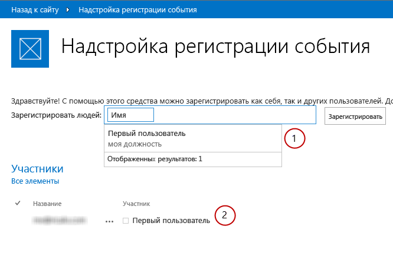

# Обзор экспериментальных мини-приложений Office для веб-страницOffice Web Widgets - Experimental overview
Сведения об экспериментальных мини-приложениях Office для веб-страниц, которые можно использовать в надстройках Office и SharePoint, а также на веб-сайтах.Learn about the Office Web Widgets - Experimental that you can use in Office Add-ins, SharePoint Add-ins, and websites.
 

 **Примечание.** В настоящее время идет процесс замены названия "приложения для SharePoint" названием "надстройки SharePoint". Во время этого процесса в документации и пользовательском интерфейсе некоторых продуктов SharePoint и средств Visual Studio может по-прежнему использоваться термин "приложения для SharePoint". Дополнительные сведения см. в статье [Новое название приложений для Office и SharePoint](new-name-for-apps-for-sharepoint.md#bk_newname).**Note**  The name "apps for SharePoint" is changing to "SharePoint Add-ins". During the transition, the documentation and the UI of some SharePoint products and Visual Studio tools might still use the term "apps for SharePoint". For details, see  [New name for apps for Office and SharePoint](new-name-for-apps-for-sharepoint.md#bk_newname).
 

 **Внимание!** Экспериментальные мини-приложения Office для веб-страниц предоставляются только в целях исследований и обратной связи. Не следует использовать их в производственных сценариях. Режим работы мини-приложений Office для веб-страниц может существенно измениться в будущих выпусках. Ознакомьтесь с [условиями лицензии на экспериментальные мини-приложения Office для веб-страниц](office-web-widgetsexperimental-license-terms.md).**Caution**  The Office Web Widgets - Experimental are only provided for research and feedback purposes. Do not use in production scenarios. The Office Web Widgets behavior may change significantly in future releases. Read and review the  [Office Web Widgets - Experimental License Terms](office-web-widgetsexperimental-license-terms.md).
 

Клиентские элементы управления, такие как экспериментальная версия веб-виджетов Office, могут значительно ускорить разработку надстроек, а также повысить их качество. Для этого мы должны быть уверены, что виджеты отвечают определенным критериям:Client controls, such as the Office Web Widgets - Experimental, can greatly reduce the amount of time required to build add-ins, and at the same time, increase the quality of the add-ins. For this to be true, we have to be sure the widgets meet certain criteria:
 

- предназначены для использования на любой веб-странице, даже если она не указана в SharePoint;Widgets must be designed to be used in any webpage, even if the page is not hosted on SharePoint.
    
 
- работают в среде выполнения элементов управления Office. Это позволяет нам предоставлять общий набор требований и согласованный синтаксис для использования виджетов;Widgets work within the Office controls runtime. This lets us to provide a common set of requirements and a consistent syntax to use the widgets.
    
 
- виджеты, которые обращаются к SharePoint, используют междоменную библиотеку. Виджеты не зависят от определенной платформы или технологии на стороне сервера. Вы можете использовать виджеты независимо от того, какая у вас серверная технология;Widgets that communicate back to SharePoint use the cross-domain library. The widgets don't have a dependency on a particular server-side platform or technology. You can use the widgets regardless of your choice of server technology.
    
 
- должны сосуществовать с другими элементами на странице. Добавление виджета на страницу не должно изменять другие ее элементы;Widgets must coexist with other elements in the page. The inclusion of the widget to a page should not modify other elements in it.
    
 
- должны хорошо работать со всеми существующими платформами. Мы хотим, чтобы вы по-прежнему могли использовать привычные инструменты и технологии.Play nice with existing frameworks. We want to be sure you can still use the tools and technologies that you are used to.
    
 

**Рис. 1. Надстройка, использующая экспериментальные мини-приложения Office для веб-страниц****Figure 1. An add-in using Office Web Widgets - Experimental**

 

 

 
Мини-приложения можно использовать, установив пакет NuGet **Экспериментальные мини-приложения Office для веб-страниц** из Visual Studio. Дополнительные сведения см. в статье [Управление пакетами NuGet с помощью диалогового окна](http://docs.nuget.org/docs/start-here/managing-nuget-packages-using-the-dialog). Кроме того, просмотрите [страницу коллекции NuGet](http://www.nuget.org/packages/Microsoft.Office.WebWidgets.Experimental/).You can use the widgets by installing the  **Office Web Widgets - Experimental** NuGet package from Visual Studio For more information, see [Managing NuGet Packages Using the Dialog](http://docs.nuget.org/docs/start-here/managing-nuget-packages-using-the-dialog). You can also browse the  [NuGet gallery page](http://www.nuget.org/packages/Microsoft.Office.WebWidgets.Experimental/).
 
Ваши отзывы и комментарии помогли нам решить, какие мини-приложения необходимы. Как показано на рисунке 1, вы уже можете испытать мини-приложения (1) "Выбор людей" и (2) "Представление списка на рабочем столе", а также поэкспериментировать с ними. Отправляйте свои отзывы на [сайт Office Developer Platform UserVoice](http://officespdev.uservoice.com/)Your feedback and comments helped us decide what widgets to provide. As you can see in Figure 1, the (1) People Picker and (2) Desktop List View widgets are ready for you to try and experiment. Please keep the feedback coming at the  [Office Developer Platform UserVoice site](http://officespdev.uservoice.com/)
 
Кроме того, можно ознакомиться с примером кода [экспериментальной демоверсии мини-приложений Office для веб-страниц](http://code.msdn.microsoft.com/SharePoint-Office-Web-6d44aa9e).You can also see the widgets in action in the  [Office Web Widgets - Experimental Demo](http://code.msdn.microsoft.com/SharePoint-Office-Web-6d44aa9e) code sample.
 

## Мини-приложение "Выбор людей"People Picker widget

Используя в надстройках экспериментальный виджет "Выбор людей", вы можете помочь пользователям находить и выбирать людей и группы в клиенте. Когда пользователь вводит текст в текстовом поле, виджет загружает контакты, чьи имена или адреса электронной почты соответствуют запросу.You can use the experimental People Picker widget in add-ins to help your users find and select people and groups in a tenant. Users can start typing in the text box and the widget retrieves the people whose name or e-mail matches the text.
 

 

**Рис. 2. Обработка запроса мини-приложением "Выбор людей"****Figure 2. People Picker widget solving a query**

 

 

 
Вы можете объявить мини-приложение в разметке HTML или программным путем, используя JavaScript. В любом случае необходимо использовать элемент **div** в качестве заполнителя для мини-приложения. Вы можете также установить для мини-приложения "Выбор людей" свойства и обработчики событий. В таблице ниже показаны свойства и события доступные в мини-приложении "Выбор людей".You can declare the widget in the HTML markup or programmatically using JavaScript. In either case, you use a  **div** element as a placeholder for the widget. You can also set properties and event handlers for the People Picker widget. The following table shows the available properties and events in the People Picker widget.
 

 

|**Свойство/Событие****Property/Event**|**Тип****Type**|**Описание****Description**|
|:-----|:-----|:-----|
|**objectType****objectType**|Объект JSON (список строк)JSON Object (list of strings)| Тип элементов, сопоставляемых мини-приложением. Параметры: только "Группа пользователя по умолчанию" и "Пользователь".Type of items the widget will resolve. Options: User Group Default to user only.|
|**allowMultipleSelections****allowMultipleSelections**|ЛогическийBoolean|Истина/Ложь. Если задано значение "Ложь", мини-приложение позволяет выбирать только один элемент за раз. По умолчанию выбрано значение "Ложь".True/False. If False, the widget should allow selecting only one item at the time.  Default=False.|
|**rootGroupName****rootGroupName**|Строкаstring|Если значение указано, мини-приложение будет выбирать элементы только из этой группы. В противном случае будут отправляться запросы объектам в рамках всего клиента.If provided, the widget will limit the selection to items in this group.  If not provided, the widget will query objects from the whole tenancy.|
|**selectedItems****selectedItems**|Массив JSONJSON array|Список выбранных элементов. Каждый элемент возвращает объект, представляющий пользователя или группу.List of items selected. Each item will return an object representing a user or group.|
|**onAdded****onAdded**|ФункцияFunction|Событие, которое запускается при добавлении объекта к выделенному фрагменту. Функция обработчика получает добавленный объект.Event that fires when a new object is added to the selection. The handler function received the object added.|
|**onRemoved****onRemoved**|ФункцияFunction|Событие, которое запускается при удалении объекта из выделенного фрагмента. Функция обработчика получает удаленный объект.Event that fires when a new object is removed from the selection. The handler function received the object removed.|
|**onChange****onChange**|ФункцияFunction|Это событие вызывается как при добавлении, так и при удалении объектов. В функцию обработчика параметры не передаются.Either adding or removing objects triggers this event. No parameters are passed to the handler function.|
|**validationErrors****validationErrors**|МассивArray| Массив возможных ошибок проверки: пустое значение unresolvedItem, tooManyItemsArray of possible validation errors: empty unresolvedItem tooManyItems|
|**autoShowValidationMessage****autoShowValidationMessage**|ЛогическийBoolean|Значение "Истина" указывает, что сообщение о проверке отображается, а значение "Ложь" — не отображаетсяTrue=Show False=Don't show|
|**hasErrors****hasErrors**|ЛогическийBoolean|Значение "Истина" указывает, что имеется одна или несколько ошибок проверки. Значение "Ложь" — ошибки проверки отсутствуютTrue= There are 1 or more validation errors False=There are no validation errors|
|**errors****errors**|МассивArray| Массив возможных ошибок проверки: пустое значение unresolvedItem, tooManyItemsArray of possible validation errors: empty unresolvedItem tooManyItems|
|**displayErrors****displayErrors**|ЛогическийBoolean|Значение "Истина" указывает, что ошибки отображаются, значение "Ложь" — ошибки не отображаютсяTrue=Display the errors False=Don't display the errors|
Классы CSS для мини-приложения "Выбор людей" определены в таблице стилей **Office.Controls.css**. Вы можете переопределить классы и настроить стиль мини-приложения для своей надстройки.The CSS classes for the People Picker widget are defined in the  **Office.Controls.css** style sheet. You can override the classes and style the widget for your add-in.
 

 
Дополнительные сведения см. в статье  [Использование экспериментального мини-приложения "Выбор людей" в надстройках для SharePoint](use-the-experimental-people-picker-widget-in-sharepoint-add-ins.md) и примере кода [Использование экспериментального виджета "Выбор людей" в надстройке](http://code.msdn.microsoft.com/SharePoint-Use-the-57859f85.md).For more information, see  [Use the experimental People Picker widget in SharePoint Add-ins](use-the-experimental-people-picker-widget-in-sharepoint-add-ins.md) and [Use the People Picker experimental widget in an add-in](http://code.msdn.microsoft.com/SharePoint-Use-the-57859f85.md) code sample.
 

 

## Мини-приложение "Представление списка на рабочем столе"Desktop List View widget

Пользователи получают все преимущества виджета "Представление списка" и могут представлять данные в списке, как в обычном виджете "Представление списка". Но вы можете использовать его в даже в тех надстройках, которые не размещены в SharePoint.Your users can benefit from the List View widget and display the data in a list just like the regular List View widget, but you can use it in your add-ins that are not necessarily hosted in SharePoint.
 

 

**Рис. 3. Мини-приложение "Представление списка на рабочем столе", отображающее данные в виде списка****Figure 3. Desktop List View widget displaying the data in a list**

 

 

 
Вы можете указать существующее представление в списке, мини-приложение обрабатывает поля в том порядке, в котором они отображаются в представлении.You can specify an existing view on the list, the widget renders the fields in the order that they appear in the view.
 

 

    
 **Примечание.** На данный момент мини-приложение "Представление списка на рабочем столе" отображает только данные. Оно не предлагает возможности редактирования.**Note**  At this moment, the Desktop List View widget only displays the data. It doesn't offer editing capabilities.
 

Вы можете вставить для мини-приложения заполнитель, используя элемент **div**. Мини-приложение можно использовать программно или декларативно.You can provide a placeholder for the widget using a  **div** element. You can programmatically or declaratively use the widget.
 

 
Вы также можете указать свойства или обработчики событий для виджета "Представление списка на рабочем столе". В следующей таблице показаны доступные свойства и события в виджете "Представление списка на рабочем столе".You also can set properties or event handlers for the Desktop List View widget. The following table shows the available properties and events in the Desktop List View widget.
 

 

|**Свойство/Событие****Property/Event**|**Тип****Type**|**Описание****Description**|
|:-----|:-----|:-----|
|**listUrl****listUrl**|URL-адресURL|URL-адрес списка, из которого необходимо получать элементы. Это может быть относительный URL-адрес (в таком случае он будет считаться расположенным на самом сайте надстройки) или абсолютный URL-адрес.URL of the list view to draw items from. It can be a relative URL in which case it will be assumed to be located on the add-in web itself or an absolute URL.|
|**viewName****viewName**|Строкаstring|Имя представления, которое необходимо отобразить. Это программное, а не отображаемое, имя представления.Name of the view to show. This is the programmatic name of the view (not its display name).|
|**onItemSelected****onItemSelected**|ФункцияFunction|Событие, возникающее при выборе элемента из списка.Event that fires when an item is selected on the list.|
|**onItemAdded****onItemAdded**|ФункцияFunction|Событие, возникающее при добавлении элемента в список.Event that fires when a new item is added to the list.|
|**onItemRemoved****onItemRemoved**|ФункцияFunction|Событие, возникающее при удалении элемента из списка.Event that fires when an item is removed from the list.|
|**selectedItems****selectedItems**|МассивArray|Список выбранных элементов в формате JSON.List of Selected items in JSON format.|
Для виджета требуется таблица стилей веб-сайта SharePoint. Вы можете непосредственно указать ссылку на таблицу стилей SharePoint или использовать виджет хрома. Подробнее о таблице стилей см. в статьях  [Использование таблицы стилей веб-сайта SharePoint в надстройках для SharePoint](use-a-sharepoint-website-s-style-sheet-in-sharepoint-add-ins.md) и [Использование клиентского элемента управления хрома в надстройках для SharePoint](use-the-client-chrome-control-in-sharepoint-add-ins.md).The widget requires the SharePoint website style sheet. You can reference the SharePoint style sheet directly or use the chrome widget. For more information about the style sheet, see  [Use a SharePoint website's style sheet in SharePoint Add-ins](use-a-sharepoint-website-s-style-sheet-in-sharepoint-add-ins.md) and [Use the client chrome control in SharePoint Add-ins](use-the-client-chrome-control-in-sharepoint-add-ins.md). 
 

 
Чтобы увидеть виджет "Представление списка" в действии, см. пример кода  [Использование экспериментального виджета "Представление списка на рабочем столе" в надстройке](http://code.msdn.microsoft.com/SharePoint-Use-the-c3edb076). См. также  [Использование экспериментального мини-приложения "Просмотр списка на рабочем столе" в надстройках для SharePoint](use-the-experimental-desktop-list-view-widget-in-sharepoint-add-ins.md).To see the List View widget in action, see the  [Use the Desktop List View experimental widget in an add-in](http://code.msdn.microsoft.com/SharePoint-Use-the-c3edb076) code sample. Also see [Use the experimental Desktop List View widget in SharePoint Add-ins](use-the-experimental-desktop-list-view-widget-in-sharepoint-add-ins.md).
 

 

## ЗаключениеConclusion

Виджеты могут помочь ускорить процесс разработки, а также сократить затраты на ваши надстройки и время их выхода на рынок. Вы можете использовать экспериментальные веб-виджеты Office в некоммерческих надстройках. Отправляйте свои отзывы и комментарии на  [сайт Office Developer Platform UserVoice](http://officespdev.uservoice.com/).Widgets can help to speed up the development process and reduce the cost and time-to-market of your add-ins. Office Web Widgets - Experimental provide widgets that you can use in your non-production add-ins. Your feedback and comments are welcome in the  [Office Developer Platform UserVoice site](http://officespdev.uservoice.com/).
 

 

## Дополнительные ресурсыAdditional resources

-  [Условия лицензии на экспериментальные мини-приложения Office для веб-страницOffice Web Widgets - Experimental License Terms](office-web-widgetsexperimental-license-terms.md)
    
 
-  [Страница коллекции NuGet "Экспериментальные мини-приложения Office для веб-страниц"Office Web Widgets - Experimental NuGet gallery page](http://www.nuget.org/packages/Microsoft.Office.WebWidgets.Experimental/)
    
 
-  [Использование экспериментального мини-приложения "Выбор людей" в надстройках SharePointUse the experimental People Picker widget in SharePoint Add-ins](use-the-experimental-people-picker-widget-in-sharepoint-add-ins.md)
    
 
-  [Пример кода. Мини-приложения Office для веб-страниц — экспериментальная демоверсияCode sample: Office Web Widgets - Experimental Demo](http://code.msdn.microsoft.com/SharePoint-Office-Web-6d44aa9e)
    
 
-  [Использование экспериментального мини-приложения "Представление списка на рабочем столе" в надстройках для SharePoint](use-the-experimental-desktop-list-view-widget-in-sharepoint-add-ins.md).[Use the experimental Desktop List View widget in SharePoint Add-ins](use-the-experimental-desktop-list-view-widget-in-sharepoint-add-ins.md)
    
 
-  [Пример кода. Использование экспериментального мини-приложения "Выбор людей" в надстройке](http://code.msdn.microsoft.com/SharePoint-Use-the-57859f85).[Code sample: Use the People Picker experimental widget in an add-in](http://code.msdn.microsoft.com/SharePoint-Use-the-57859f85)
    
 
-  [Пример кода. Использование экспериментального мини-приложения "Представление списка на рабочем столе"в надстройкеCode sample: Use the Desktop List View experimental widget in an add-in](http://code.msdn.microsoft.com/SharePoint-Use-the-c3edb076)
    
 
