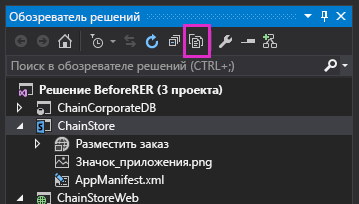

# <a name="programmatically-deploy-a-custom-button-in-the-provider-hosted-add-in"></a><span data-ttu-id="eb95e-103">Программное развертывание собственной кнопки в надстройке с размещением у поставщика</span><span class="sxs-lookup"><span data-stu-id="eb95e-103">Programmatically deploy a custom button in the provider-hosted add-in</span></span>

<span data-ttu-id="eb95e-104">Это девятая часть серии статей, посвященной основам разработки надстроек SharePoint, размещаемых у поставщика. Для начала вам следует ознакомиться со статьей [Надстройки SharePoint](sharepoint-add-ins.md) и предыдущими статьями из этой серии.</span><span class="sxs-lookup"><span data-stu-id="eb95e-104">This is the ninth in a series of articles about the basics of developing provider-hosted SharePoint Add-ins. You should first be familiar with  [SharePoint Add-ins](sharepoint-add-ins.md) and the previous articles in this series:</span></span>

-  [<span data-ttu-id="eb95e-105">Знакомство с созданием надстроек SharePoint с размещением у поставщика</span><span class="sxs-lookup"><span data-stu-id="eb95e-105">Get started creating provider-hosted SharePoint Add-ins</span></span>](get-started-creating-provider-hosted-sharepoint-add-ins.md)
-  [<span data-ttu-id="eb95e-106">Настройка внешнего вида надстройки SharePoint, размещенной у поставщика</span><span class="sxs-lookup"><span data-stu-id="eb95e-106">Give your provider-hosted add-in the SharePoint look-and-feel</span></span>](give-your-provider-hosted-add-in-the-sharepoint-look-and-feel.md)
-  [<span data-ttu-id="eb95e-107">Добавление настраиваемой кнопки в надстройку, размещенную у поставщика</span><span class="sxs-lookup"><span data-stu-id="eb95e-107">Include a custom button in the provider-hosted add-in</span></span>](include-a-custom-button-in-the-provider-hosted-add-in.md)
-  [<span data-ttu-id="eb95e-108">Краткий обзор объектной модели SharePoint</span><span class="sxs-lookup"><span data-stu-id="eb95e-108">Get a quick overview of the SharePoint object model</span></span>](get-a-quick-overview-of-the-sharepoint-object-model.md)
-  [<span data-ttu-id="eb95e-109">Добавление операций записи SharePoint в надстройку, размещенную у поставщика</span><span class="sxs-lookup"><span data-stu-id="eb95e-109">Add SharePoint write operations to the provider-hosted add-in</span></span>](add-sharepoint-write-operations-to-the-provider-hosted-add-in.md)
-  [<span data-ttu-id="eb95e-110">Добавление веб-части надстройки в надстройку, размещенную у поставщика</span><span class="sxs-lookup"><span data-stu-id="eb95e-110">Include an add-in part in the provider-hosted add-in</span></span>](include-an-add-in-part-in-the-provider-hosted-add-in.md)
-  [<span data-ttu-id="eb95e-111">Обработка событий надстройки, размещенной у поставщика</span><span class="sxs-lookup"><span data-stu-id="eb95e-111">Handle add-in events in the provider-hosted add-in</span></span>](handle-add-in-events-in-the-provider-hosted-add-in.md)
-  [<span data-ttu-id="eb95e-112">Добавление логики, выполняемой при первом запуске, в надстройку, размещаемую у поставщика</span><span class="sxs-lookup"><span data-stu-id="eb95e-112">Add first-run logic to the provider-hosted add-in</span></span>](add-first-run-logic-to-the-provider-hosted-add-in.md)

> [!NOTE]
> <span data-ttu-id="eb95e-113">Если вы изучали предыдущие статьи из этой серии о надстройках, размещаемых у поставщика, то у вас уже есть решение для Visual Studio, которое можно использовать для работы с этой статьей.</span><span class="sxs-lookup"><span data-stu-id="eb95e-113">Note  If you have been working through this series about provider-hosted add-ins, then you have a Visual Studio solution that you can use to continue with this topic. You can also download the repository at  SharePoint_Provider-hosted_Add-Ins_Tutorials and open the BeforeRibbonButton.sln file.</span></span> <span data-ttu-id="eb95e-114">Кроме того, вы можете скачать репозиторий [SharePoint_Provider-hosted_Add-Ins_Tutorials](https://github.com/OfficeDev/SharePoint_Provider-hosted_Add-ins_Tutorials) и открыть файл BeforeProgrammaticButton.sln.</span><span class="sxs-lookup"><span data-stu-id="eb95e-114">You can also download the repository at [SharePoint_Provider-hosted_Add-Ins_Tutorials](https://github.com/OfficeDev/SharePoint_Provider-hosted_Add-ins_Tutorials) and open the BeforeProgrammaticButton.sln file.</span></span>

<span data-ttu-id="eb95e-115">В этой статьи вы узнаете, как включать настраиваемую кнопку ленты в надстройку SharePoint, когда список, на ленте которого размещается кнопка, также развертывается программным способом в той же надстройке.</span><span class="sxs-lookup"><span data-stu-id="eb95e-115">In this article you will learn how to include a custom ribbon button in the a SharePoint Add-in when the list whose ribbon gets the button is itself being programmatically deployed in the very same add-in.</span></span>

## <a name="re-add-the-custom-button-to-the-project"></a><span data-ttu-id="eb95e-116">Повторное добавление настраиваемой кнопки в проект</span><span class="sxs-lookup"><span data-stu-id="eb95e-116">Re-add the custom button to the project</span></span>

> [!NOTE]
> <span data-ttu-id="eb95e-117">Когда решение открывается повторно, для параметров раздела "Запускаемые проекты" в Visual Studio обычно возвращаются значения по умолчанию.</span><span class="sxs-lookup"><span data-stu-id="eb95e-117">NOTE The settings for Startup Projects in Visual Studio tend to revert to defaults whenever the solution is reopened. Always take these steps immediately after reopening the sample solution in this series of articles:</span></span> <span data-ttu-id="eb95e-118">Сразу же после повторного открытия примера решения согласно инструкциям из этой серии статей всегда делайте вот что:</span><span class="sxs-lookup"><span data-stu-id="eb95e-118">Note  The settings for Startup Projects in Visual Studio tend to revert to defaults whenever the solution is reopened. Always take these steps immediately after reopening the sample solution in this series of articles:</span></span> 
> 1. <span data-ttu-id="eb95e-119">В верхней части **обозревателя решений** щелкните узел решения правой кнопкой мыши и выберите пункт **Назначить запускаемые проекты**.</span><span class="sxs-lookup"><span data-stu-id="eb95e-119">Right-click the solution node at the top of  **Solution Explorer** and select **Set startup projects**.</span></span>  
> 2. <span data-ttu-id="eb95e-120">Убедитесь, что в столбце **Действие** для всех трех проектов указано значение **Запуск**.</span><span class="sxs-lookup"><span data-stu-id="eb95e-120">Make sure all three projects are set to  **Start** in the **Action** column.</span></span>

<span data-ttu-id="eb95e-121">В предыдущей статье вы удалили настраиваемую кнопку ленты **AddEmployeeToCorpDB** из проекта.</span><span class="sxs-lookup"><span data-stu-id="eb95e-121">In the previous article you removed the custom  **AddEmployeeToCorpDB** ribbon button from the project. Add it back in with these steps below.</span></span> <span data-ttu-id="eb95e-122">Добавьте ее обратно, сделав вот что:</span><span class="sxs-lookup"><span data-stu-id="eb95e-122">Add it back in with the following steps.</span></span>

1. <span data-ttu-id="eb95e-123">В верхней части **обозревателя решений** на панели инструментов нажмите кнопку **Показать все файлы**.</span><span class="sxs-lookup"><span data-stu-id="eb95e-123">On the toolbar at the top of **Solution Explorer**, select the **Show All Files** button.</span></span>

   <span data-ttu-id="eb95e-124">*Рис. 1. Панель инструментов обозревателя решений*</span><span class="sxs-lookup"><span data-stu-id="eb95e-124">*Figure 1. Solution Explorer toolbar*</span></span>

   

2. <span data-ttu-id="eb95e-126">В проекте **ChainStore** щелкните правой кнопкой мыши элемент **AddEmployeeToCorpDB**, а затем выберите пункт **Включить в проект**.</span><span class="sxs-lookup"><span data-stu-id="eb95e-126">In the  **ChainStore** project, right-click **AddEmployeeToCorpDB** and select **Include in Project**.</span></span>

3. <span data-ttu-id="eb95e-127">Снова нажмите кнопку **Показать все файлы**.</span><span class="sxs-lookup"><span data-stu-id="eb95e-127">Press the  **Show All Files** button again.</span></span>

4. <span data-ttu-id="eb95e-128">В проекте **ChainStore** разверните узел **AddEmployeeToCorpDB**, а затем откройте файл elements.xml.</span><span class="sxs-lookup"><span data-stu-id="eb95e-128">In the  **ChainStore** project, expand **AddEmployeeToCorpDB** and then open the elements.xml file.</span></span>

## <a name="understand-a-dilemma-and-its-solution"></a><span data-ttu-id="eb95e-129">Описание проблемы и ее решение</span><span class="sxs-lookup"><span data-stu-id="eb95e-129">Understand a dilemma and its solution</span></span>

<span data-ttu-id="eb95e-p104">В файле elements.xml атрибут **RegistrationId** элемента **CustomAction** служит для идентификации списка, на ленту которого вы добавляете кнопку: `{$ListId:Lists/Local Employees;}`. Это отлично работало, когда список уже был добавлен на хост-сайт вручную. Но теперь при развертывании списка программным способом в коде, выполняемом при первом запуске, когда SharePoint устанавливает надстройку и пытается развернуть кнопку, списка еще не существует. В этом случае установка надстройки может привести к созданию исключения и завершиться со сбоем.</span><span class="sxs-lookup"><span data-stu-id="eb95e-p104">In the elements.xml file, the **RegistrationId** attribute of the **CustomAction** element identifies the list on whose ribbon the button is added: `{$ListId:Lists/Local Employees;}`. This worked fine when the list had already been added to the host web manually. But now that we are deploying the list programmatically in first-run logic, the list doesn't exist when SharePoint installs the add-in and tries to deploy the button. The installation of the add-in would throw an exception and fail.</span></span>

<span data-ttu-id="eb95e-134">Развертывание списка в обработчике событий установки, а не в коде, выполняемом при первом запуске, не решит эту проблему. Это связано с тем, что SharePoint развертывает описанные настраиваемые компоненты, например настраиваемую кнопку (и веб-часть надстройки **Place Order** (Размещение заказа)), *прежде чем* запустить настраиваемый обработчик, поэтому когда SharePoint пытается развернуть кнопку, списка еще не существует.</span><span class="sxs-lookup"><span data-stu-id="eb95e-134">Deploying the list in the installation event handler, instead of first-run logic, won't solve the dilemma because SharePoint deploys custom descriptively-defined components, such as the custom button (and the **Place Order** add-in part), *before*  it runs the custom handler, so the list won't exist when SharePoint tries to deploy the button.</span></span>

<span data-ttu-id="eb95e-135">Создание настраиваемой кнопки полностью программным способом непрактично по причинам, которые слишком сложны, чтобы обсуждать их здесь.</span><span class="sxs-lookup"><span data-stu-id="eb95e-135">Creating a custom button entirely programmatically is not practical for reasons that are too advanced to discuss here.</span></span> <span data-ttu-id="eb95e-136">К счастью, это не нужно.</span><span class="sxs-lookup"><span data-stu-id="eb95e-136">Fortunately, it is not necessary.</span></span> <span data-ttu-id="eb95e-137">Существует относительно безболезненный способ "полупрограммного" создания настраиваемой кнопки и назначения ее настраиваемому списку.</span><span class="sxs-lookup"><span data-stu-id="eb95e-137">There is a relatively painless way to semi-programmatically create a custom button and assign it to a custom list.</span></span> 

<span data-ttu-id="eb95e-138">Для этого нужно выполнить вот какие основные действия:</span><span class="sxs-lookup"><span data-stu-id="eb95e-138">The following are the steps to take.</span></span>

1. <span data-ttu-id="eb95e-139">Оставьте описательно определенную кнопку в проекте, но назначьте ее ленте какого-либо приложения, которое всегда имеется на сайтах SharePoint, а не ленте списка, который развертывается программным способом с помощью той же надстройки.</span><span class="sxs-lookup"><span data-stu-id="eb95e-139">Keep the descriptively defined button in the project, but assign it to the ribbon of something that always exists on SharePoint sites, instead of to a list that's programmatically deployed with the same add-in.</span></span> 

2. <span data-ttu-id="eb95e-140">В коде, выполняемом при первом запуске, после программного создания списка добавьте неопределенную кнопку на ленту списка.</span><span class="sxs-lookup"><span data-stu-id="eb95e-140">In the first-run logic, after the list is programmatically created, programmatically add an undefined button to the ribbon of the list.</span></span>

3. <span data-ttu-id="eb95e-141">Инициализируйте свойства новой кнопки, используя значения свойств исходной кнопки.</span><span class="sxs-lookup"><span data-stu-id="eb95e-141">Initialize the properties of the new button with the values of the original button.</span></span> <span data-ttu-id="eb95e-142">Сейчас у нас есть две идентичные кнопки.</span><span class="sxs-lookup"><span data-stu-id="eb95e-142">At this point there are two identical buttons.</span></span> <span data-ttu-id="eb95e-143">Вторая кнопка назначена ленте списка **Local Employees** (Местные сотрудники).</span><span class="sxs-lookup"><span data-stu-id="eb95e-143">The second is assigned to the ribbon of the **Local Employees** list.</span></span>

4. <span data-ttu-id="eb95e-144">Удалите исходную кнопку программным способом.</span><span class="sxs-lookup"><span data-stu-id="eb95e-144">Programmatically delete the original button.</span></span>

## <a name="programmatically-register-the-custom-button"></a><span data-ttu-id="eb95e-145">Регистрация настраиваемой кнопки программным способом</span><span class="sxs-lookup"><span data-stu-id="eb95e-145">Programmatically register the custom button</span></span>

<span data-ttu-id="eb95e-146">Ниже описывается реализация этой стратегии.</span><span class="sxs-lookup"><span data-stu-id="eb95e-146">The following procedure shows how to implement this strategy.</span></span>

1. <span data-ttu-id="eb95e-147">В проекте **ChainStore** разверните узел **AddEmployeeToCorpDB**, откройте файл elements.xml, а затем измените значение атрибута **RegistrationId** элемента **CustomAction** на число 100.</span><span class="sxs-lookup"><span data-stu-id="eb95e-147">In the **ChainStore** project, expand **AddEmployeeToCorpDB**, open the elements.xml file, and then change the value of the **RegistrationId** attribute of the **CustomAction** element to "100".</span></span> <span data-ttu-id="eb95e-148">Это идентификатор типа списка.</span><span class="sxs-lookup"><span data-stu-id="eb95e-148">This is the ID of a type of list.</span></span> <span data-ttu-id="eb95e-149">Даже если на веб-сайте нет экземпляров списка этого типа, *тип* списка есть на всех веб-сайтах SharePoint.</span><span class="sxs-lookup"><span data-stu-id="eb95e-149">Even if there are no instances of lists of this type on the website, the list *type* is on every SharePoint website.</span></span> <span data-ttu-id="eb95e-150">Теперь атрибут должен выглядеть так:</span><span class="sxs-lookup"><span data-stu-id="eb95e-150">The method should now look like the following.</span></span>
    
    ```XML
      RegistrationId="100"
    ```

2. <span data-ttu-id="eb95e-151">В файле SharePointComponentDeployer.cs добавьте указанную ниже строку в метод **DeployChainStoreComponentsToHostWeb** сразу же после строки, в которой вызывается метод `CreateLocalEmployeesList`. Вы создадите этот метод на следующем этапе.</span><span class="sxs-lookup"><span data-stu-id="eb95e-151">In the file SharePointComponentDeployer.cs, add the following line to the DeployChainStoreComponentsToHostWeb method, just below the line that calls CreateLocalEmployeesList. You will create this method in the next step.</span></span>
    
    ```C#
      ChangeCustomActionRegistration();
    ```

3. <span data-ttu-id="eb95e-152">Добавьте указанный ниже метод в класс `SharePointComponentDeployer`.</span><span class="sxs-lookup"><span data-stu-id="eb95e-152">Add the following method to the  `SharePointComponentDeployer` class.</span></span> 

    ```C#
      private static void ChangeCustomActionRegistration()
    {
        using (var clientContext = sPContext.CreateUserClientContextForSPHost())
        {
         var query = from action in clientContext.Web.UserCustomActions
                 where action.Name == "{button_GUID} .AddEmployeeToCorpDB"
                 select action;
          IEnumerable<UserCustomAction> matchingActions = clientContext.LoadQuery(query);          
             clientContext.ExecuteQuery();

          UserCustomAction webScopedEmployeeAction = matchingActions.Single();

         // TODO8: Get a reference to the (empty) collection of custom actions 
         // that are registered with the custom list.

         // TODO9: Add a blank custom action to the list's collection.

         // TODO10: Copy property values from the descriptively deployed
         // custom action to the new custom action

        // TODO11: Delete the original custom action.         

          clientContext.ExecuteQuery();
        }
    }
    ```

   <span data-ttu-id="eb95e-153">Обратите внимание на следующие особенности этого кода:</span><span class="sxs-lookup"><span data-stu-id="eb95e-153">Note the following about this code:</span></span>
    
   - <span data-ttu-id="eb95e-154">Так как дополнительное действие, то есть настраиваемая кнопка, зарегистрировано на ленте для *типа* списка, область его действия распространяется на весь веб-сайт и находится в коллекции дополнительных действий веб-сайта.</span><span class="sxs-lookup"><span data-stu-id="eb95e-154">Because the custom action; that is, the custom button; was registered with the ribbon of a list  *type*  , it is scoped to the entire website and is in the website's collection of custom actions. So the code retrieves it from that collection.</span></span> <span data-ttu-id="eb95e-155">Таким образом, код получает его из этой коллекции.</span><span class="sxs-lookup"><span data-stu-id="eb95e-155">So the code retrieves it from that collection.</span></span>
    
   - <span data-ttu-id="eb95e-156">Значение свойства `action.Name` поступает из атрибута **ID** элемента **CustomAction** в файле element.xml из узла **AddEmployeeToCorpDB**.</span><span class="sxs-lookup"><span data-stu-id="eb95e-156">The value of the  `action.Name` comes from the **ID** attribute of the **CustomAction** element in the element.xml file in **AddEmployeeToCorpDB**.</span></span>
    
   > [!IMPORTANT]
   > <span data-ttu-id="eb95e-157">**Вам необходимо изменить значение `action.Name` в коде, чтобы оно совпадало со значением в файле elements.xml.**</span><span class="sxs-lookup"><span data-stu-id="eb95e-157">**You must change the `action.Name` value in the code to match the value in your elements.xml file.**</span></span> <span data-ttu-id="eb95e-158">Часть GUID имени будет другой.</span><span class="sxs-lookup"><span data-stu-id="eb95e-158">The GUID part of the name will be different.</span></span> <span data-ttu-id="eb95e-159">Обратите внимание, что между GUID и остальной частью имени есть символ `"."`.</span><span class="sxs-lookup"><span data-stu-id="eb95e-159">Note that there is a `"."` character between the GUID and the rest of the name.</span></span> <span data-ttu-id="eb95e-160">Вот пример строки:</span><span class="sxs-lookup"><span data-stu-id="eb95e-160">The following is an example of the markup:</span></span> 
   > 
   > `where action.Name == "4a926a42-3577-4e02-9d06-fef78586b1bc.AddEmployeeToCorpDB"`

4. <span data-ttu-id="eb95e-161">Замените `TODO8` указанным ниже кодом.</span><span class="sxs-lookup"><span data-stu-id="eb95e-161">Replace  `TODO8` with the following code.</span></span> <span data-ttu-id="eb95e-162">Обратите внимание, что если вы отзовете надстройку, созданные ею компоненты не будут удалены.</span><span class="sxs-lookup"><span data-stu-id="eb95e-162">Note that when you retract an add-in, components created by the add-in are not removed.</span></span> <span data-ttu-id="eb95e-163">По завершении работы кода, выполняемого при первом запуске, в коллекции **UserCustomActions** списка появится дополнительное действие, которое не будет отозвано при следующем нажатии клавиши F5.</span><span class="sxs-lookup"><span data-stu-id="eb95e-163">Note that when you retract an add-in, components created by the add-in are not removed. After your first-run logic executes, there will be a custom action in the list's  **UserCustomActions** collection, and it will not be retracted the next time you press F5. To avoid confusion, the last line in this code  empties the collection.</span></span> <span data-ttu-id="eb95e-164">Чтобы избежать путаницы, в последней строке в этом коде метод `listActions.Clear();` очищает коллекцию.</span><span class="sxs-lookup"><span data-stu-id="eb95e-164">To avoid confusion, the last line in this code `listActions.Clear();` empties the collection.</span></span>

    ```C#
    var queryForList = from list in clientContext.Web.Lists
               where list.Title == "Local Employees"
               select list;
    IEnumerable<List> matchingLists = clientContext.LoadQuery(queryForList);
    clientContext.ExecuteQuery();

    List employeeList = matchingLists.First();
    var listActions = employeeList.UserCustomActions;
    clientContext.Load(listActions);
    listActions.Clear();
    ```

5. <span data-ttu-id="eb95e-165">Замените `TODO9` указанной ниже строкой, которая добавляет неопределенное дополнительное действие в список **Local Employees** (Местные сотрудники).</span><span class="sxs-lookup"><span data-stu-id="eb95e-165">Replace  `TODO9` with the following line, which adds an undefined custom action to the **Local Employees** list.</span></span>
    
    ```C#
      var listScopedEmployeeAction = listActions.Add();
    ```

6. <span data-ttu-id="eb95e-166">Замените `TODO10` указанным ниже кодом.</span><span class="sxs-lookup"><span data-stu-id="eb95e-166">Replace  `TODO10` with the following code.</span></span> 

    ```C#
    listScopedEmployeeAction.Title = webScopedEmployeeAction.Title;
    listScopedEmployeeAction.Location = webScopedEmployeeAction.Location;
    listScopedEmployeeAction.Sequence = webScopedEmployeeAction.Sequence;
    listScopedEmployeeAction.CommandUIExtension = webScopedEmployeeAction.CommandUIExtension;
    listScopedEmployeeAction.Update();
    ```

   <span data-ttu-id="eb95e-167">Обратите внимание на следующие особенности этого кода:</span><span class="sxs-lookup"><span data-stu-id="eb95e-167">Note the following about this code:</span></span>
    
   - <span data-ttu-id="eb95e-168">Он назначает значения свойств кнопки уровня веб-сайта (которая была развернута с помощью описательной разметки) соответствующим свойствам кнопки уровня списка, так что эти две кнопки становятся идентичными за исключением области их действия.</span><span class="sxs-lookup"><span data-stu-id="eb95e-168">It assigns the property values of the web-scoped button (that was deployed with descriptive markup) to the corresponding properties of the list-scoped button, so the two buttons are identical except in scope.</span></span>
    
   - <span data-ttu-id="eb95e-169">В свойстве **Sequence** указывается относительный порядок, в котором кнопка будет отображена в своей области на ленте.</span><span class="sxs-lookup"><span data-stu-id="eb95e-169">The **Sequence** property specifies the relative order that the button will appear in its area of the ribbon.</span></span> <span data-ttu-id="eb95e-170">В этом случае кнопка находится в разделе **Actions** (Действия) на вкладке **Items** (Элементы) ленты.</span><span class="sxs-lookup"><span data-stu-id="eb95e-170">In this case, the button is on the **Actions** section of the **Items** tab of the ribbon.</span></span> <span data-ttu-id="eb95e-171">В описательной разметке это значение было равно 10001. Это достаточно большое значение, чтобы кнопка отображалась после (т. е. справа от) всех встроенных кнопок, которые SharePoint самостоятельно помещает в раздел **Actions** (Действия) ленты.</span><span class="sxs-lookup"><span data-stu-id="eb95e-171">The  Sequence property specifies the relative order that the button will appear in its area of the ribbon. In this case, the button is on the Actions section of the Items tab of the ribbon. In the descriptive markup this value was set to 10001 which is high enough to ensure that it will appear after (that is, to the right of) any in-the-box buttons that SharePoint itself puts in the **Actions** section of the ribbon.</span></span>

7. <span data-ttu-id="eb95e-172">Замените `TODO11` указанной ниже строкой, в которой удаляется исходная кнопка, определенная описательным способом.</span><span class="sxs-lookup"><span data-stu-id="eb95e-172">Replace `TODO11` with the following line, which deletes the original descriptively-defined button.</span></span> <span data-ttu-id="eb95e-173">Если бы у нас не было этой строки, то каждый список на веб-сайте, для которого используется шаблон списка 100, включал бы настраиваемую кнопку.</span><span class="sxs-lookup"><span data-stu-id="eb95e-173">If we did not have this line, every list on the website that uses list template "100" would have the custom button on it.</span></span> <span data-ttu-id="eb95e-174">Так как функциональность кнопки тесно связана со списком **Local Employees** (Местные сотрудники), то нет никакого смысла размещать эту кнопку в других списках.</span><span class="sxs-lookup"><span data-stu-id="eb95e-174">Because the button's functionality is closely tied to the **Local Employees** list, it would make no sense to have the button on any other list.</span></span> <span data-ttu-id="eb95e-175">Кроме того, без этой строки кнопка будет *дважды* размещена в списке **Local Employees** (Местные сотрудники), так как для этого списка используется шаблон 100.</span><span class="sxs-lookup"><span data-stu-id="eb95e-175">Also, without this line, the button would appear *twice*  on the **Local Employees** list, because that list uses template "100".</span></span>
    
    ```C#
      webScopedEmployeeAction.DeleteObject();
    ```
    
8. <span data-ttu-id="eb95e-176">Теперь весь метод должен иметь указанный ниже вид (за исключением того, что заполнитель необходимо заменить на GUID).</span><span class="sxs-lookup"><span data-stu-id="eb95e-176">The entire method should now look like the following (except there should be a GUID in place of the placeholder).</span></span>
    
    ```C#
      private static void ChangeCustomActionRegistration()
    {
        using (var clientContext = SPContext.CreateUserClientContextForSPHost())
        {
         var query = from action in clientContext.Web.UserCustomActions
                 where action.Name == "{button_GUID} .AddEmployeeToCorpDB"
                 select action;
          IEnumerable<UserCustomAction> matchingActions = clientContext.LoadQuery(query);          
             clientContext.ExecuteQuery();

          UserCustomAction webScopedEmployeeAction = matchingActions.Single();

         var queryForList = from list in clientContext.Web.Lists
                    where list.Title == "Local Employees"
                    select list;
         IEnumerable<List> matchingLists = clientContext.LoadQuery(queryForList);
         clientContext.ExecuteQuery();

        List employeeList = matchingLists.First();
        var listActions = employeeList.UserCustomActions;
        clientContext.Load(listActions);
        listActions.Clear();

        var listScopedEmployeeAction = listActions.Add();

        listScopedEmployeeAction.Title = webScopedEmployeeAction.Title;
        listScopedEmployeeAction.Location = webScopedEmployeeAction.Location;
        listScopedEmployeeAction.Sequence = webScopedEmployeeAction.Sequence;
        listScopedEmployeeAction.CommandUIExtension = webScopedEmployeeAction.CommandUIExtension;
        listScopedEmployeeAction.Update();

        webScopedEmployeeAction.DeleteObject();         

        clientContext.ExecuteQuery();
        }
    }
    ```


## <a name="request-full-control-of-the-host-web"></a><span data-ttu-id="eb95e-177">Запрос полного контроля над хост-сайтом</span><span class="sxs-lookup"><span data-stu-id="eb95e-177">Request full control of the host web</span></span>

<span data-ttu-id="eb95e-178">Так как теперь надстройка добавляет и удаляет дополнительные действия уровня веб-сайта, необходимо расширить разрешения для нее с уровня "Управление" до уровня "Полный контроль". Для этого сделайте вот что:</span><span class="sxs-lookup"><span data-stu-id="eb95e-178">Since the add-in is now adding adding and deleting web-scoped custom actions, we need to escalate the permissions that the add-in requests from Manage to Full Control. Follow these steps.</span></span>

1. <span data-ttu-id="eb95e-179">В **обозревателе решений** в проекте **ChainStore** откройте файл AppManifest.xml.</span><span class="sxs-lookup"><span data-stu-id="eb95e-179">In **Solution Explorer**, open the AppManifest.xml file in the **ChainStore** project.</span></span>

2. <span data-ttu-id="eb95e-180">Откройте вкладку **Разрешения**. Для поля **Область** оставьте значение **Интернет**, а в поле **Разрешение** выберите из раскрывающегося списка пункт **Полный контроль**.</span><span class="sxs-lookup"><span data-stu-id="eb95e-180">Open the **Permissions** tab. Leave the **Scope** value at **Web**, but in the **Permission** field, select **Full Control** from the drop down.</span></span>

3. <span data-ttu-id="eb95e-181">Сохраните файл.</span><span class="sxs-lookup"><span data-stu-id="eb95e-181">Save the file.</span></span>

## <a name="run-the-add-in-and-test-the-button-deployment"></a><span data-ttu-id="eb95e-182">Запуск надстройки и тестирование развертывания кнопки</span><span class="sxs-lookup"><span data-stu-id="eb95e-182">Run the add-in and test the button deployment</span></span>

1. <span data-ttu-id="eb95e-183">Откройте страницу **Site Contents** (Содержание сайта) веб-сайта магазина в Гонконге и удалите список **Local Employees** (Местные сотрудники).</span><span class="sxs-lookup"><span data-stu-id="eb95e-183">Open the  Site Contents page of the Hong Kong store's website and remove the  Local Employees list!</span></span> 
    
   > [!NOTE]
   > <span data-ttu-id="eb95e-184">При отзыве надстройки в Visual Studio не будут удалены созданные ею списки, поэтому вам потребуется вручную удалять их каждый раз, когда вы тестируете создающий их код.</span><span class="sxs-lookup"><span data-stu-id="eb95e-184">Note  Retracting an add-in in Visual Studio, does not remove lists that are created by the add-in, so you need to manually delete it any time you are testing code that creates it.</span></span>

2. <span data-ttu-id="eb95e-185">Нажмите клавишу F5, чтобы развернуть и запустить надстройку.</span><span class="sxs-lookup"><span data-stu-id="eb95e-185">Use the F5 key to deploy and run your add-in.</span></span> <span data-ttu-id="eb95e-186">Редактор Visual Studio размещает удаленное веб-приложение в IIS Express, а базу данных SQL — в SQL Express.</span><span class="sxs-lookup"><span data-stu-id="eb95e-186">Visual Studio hosts the remote web application in IIS Express and hosts the SQL database in SQL Express.</span></span> <span data-ttu-id="eb95e-187">Кроме того, он временно устанавливает надстройку на вашем тестовом сайте SharePoint и сразу же запускает ее.</span><span class="sxs-lookup"><span data-stu-id="eb95e-187">Use the F5 key to deploy and run your add-in. Visual Studio makes a temporary installation of the add-in on your test SharePoint site and immediately runs the add-in.</span></span> <span data-ttu-id="eb95e-188">Прежде чем откроется начальная страница надстройки, вам будет предложено предоставить надстройке необходимые разрешения.</span><span class="sxs-lookup"><span data-stu-id="eb95e-188">You are prompted to grant permissions to the add-in before its start page opens.</span></span>

3. <span data-ttu-id="eb95e-189">Когда откроется начальная страница надстройки, щелкните ссылку **Back to Site** (Вернуться на сайт) на размещенном в верхней части элементе управления хрома.</span><span class="sxs-lookup"><span data-stu-id="eb95e-189">When the add-in's start page opens, select the **Back to Site** link on the chrome control at the top.</span></span>

4. <span data-ttu-id="eb95e-190">Перейдите на страницу **Site Contents** (Содержание сайта).</span><span class="sxs-lookup"><span data-stu-id="eb95e-190">Go to the **Site Contents** page.</span></span> <span data-ttu-id="eb95e-191">На ней будет список **Local Employees** (Список сотрудников), так как его добавил код, выполняемый при первом запуске.</span><span class="sxs-lookup"><span data-stu-id="eb95e-191">Navigate to the  Site Contents page. The **Local Employees** list is present because your first-run logic added it.</span></span>
    
   > [!NOTE]
   > <span data-ttu-id="eb95e-192">Если этого списка нет или у вас имеются другие свидетельства того, что код, выполняемый при первом запуске, не выполняется, возможно, при нажатии клавиши F5 таблица **Tenants** (Клиенты) не очищается.</span><span class="sxs-lookup"><span data-stu-id="eb95e-192">If the list is not there or you have other indications that the first-run code is not executing, it may be that the **Tenants** table is not being reverted to an empty state when you select F5.</span></span> <span data-ttu-id="eb95e-193">Самая распространенная причина этого заключается в том, что проект **ChainCorporateDB** больше не задан в качестве начального проекта в Visual Studio.</span><span class="sxs-lookup"><span data-stu-id="eb95e-193">The most common cause of this is that the **ChainCorporateDB** project is no longer set as a startup project in Visual Studio.</span></span> <span data-ttu-id="eb95e-194">См. [примечание в верхней части данной статьи](#re-add-the-custom-button-to-the-project) о том, как устранить эту проблему.</span><span class="sxs-lookup"><span data-stu-id="eb95e-194">See the [note near the top of this article](#re-add-the-custom-button-to-the-project) for how to fix this.</span></span> <span data-ttu-id="eb95e-195">Кроме того, убедитесь, что вы настроили базу данных так, чтобы она перестраивалась, как описано в разделе [Настройка Visual Studio для перестройки корпоративной базы данных при каждом сеансе отладки](give-your-provider-hosted-add-in-the-sharepoint-look-and-feel.md#Rebuild).</span><span class="sxs-lookup"><span data-stu-id="eb95e-195">Also be sure that you've configured the database to be rebuilt as described in [Configure Visual Studio to rebuild the corporate database with each debugging session](give-your-provider-hosted-add-in-the-sharepoint-look-and-feel.md#Rebuild).</span></span>

5. <span data-ttu-id="eb95e-196">Откройте список и добавьте элемент.</span><span class="sxs-lookup"><span data-stu-id="eb95e-196">Open the list and add an item.</span></span>

6. <span data-ttu-id="eb95e-197">В представлении списка выберите этот элемент и откройте вкладку **Item** (Элемент) на ленте.</span><span class="sxs-lookup"><span data-stu-id="eb95e-197">In the list view, select the item and open the  **Item** tab on the ribbon. The Add to Corporate DB button is on the ribbon.</span></span> 

7. <span data-ttu-id="eb95e-198">На вкладке **Item** (Элемент) нажмите кнопку **Add to Corporate DB** (Добавить в корпоративную базу данных).</span><span class="sxs-lookup"><span data-stu-id="eb95e-198">On the **Item** tab, select the **Add to Corporate DB** button.</span></span> <span data-ttu-id="eb95e-199">Сотрудник будет добавлен в корпоративную базу данных, а значение поля **Added to Corporate DB** (Добавлен в корпоративную базу данных) изменится на **Yes** (Да).</span><span class="sxs-lookup"><span data-stu-id="eb95e-199">Click the button and the employee is added to the corporate database and the  **Added to Corporate DB** field is changed to **Yes**.</span></span>

8. <span data-ttu-id="eb95e-200">Вернитесь на страницу **Site Contents** (Содержание сайта) и выберите **Add an add-in** (Добавить надстройку).</span><span class="sxs-lookup"><span data-stu-id="eb95e-200">Navigate back to the  **Site Contents** page and select **add an add-in**.</span></span>

9. <span data-ttu-id="eb95e-201">Добавьте новый **настраиваемый список**.</span><span class="sxs-lookup"><span data-stu-id="eb95e-201">Add a new **Custom List**.</span></span> <span data-ttu-id="eb95e-202">По умолчанию он будет иметь тип Generic, которому соответствует тип списка 100.</span><span class="sxs-lookup"><span data-stu-id="eb95e-202">By default it will be "Generic" type (Generic is list type 100).</span></span> <span data-ttu-id="eb95e-203">После создания списка откройте вкладку **Item** (Элемент) на ленте.</span><span class="sxs-lookup"><span data-stu-id="eb95e-203">After the list is created, open the **Item** tab on the ribbon.</span></span> <span data-ttu-id="eb95e-204">Обратите внимание, что кнопки **Add to Corporate DB** (Добавить в корпоративную базу данных) *нет* на ленте.</span><span class="sxs-lookup"><span data-stu-id="eb95e-204">Notice that the **Add to Corporate DB** button is *not*  on the ribbon.</span></span> <span data-ttu-id="eb95e-205">Это связано с тем, что ваш код удалил кнопку уровня веб-сайта.</span><span class="sxs-lookup"><span data-stu-id="eb95e-205">This is because your code deleted the web-scoped button.</span></span>

10. <span data-ttu-id="eb95e-206">Чтобы завершить сеанс отладки, закройте окно браузера или остановите отладку в Visual Studio.</span><span class="sxs-lookup"><span data-stu-id="eb95e-206">To end the debugging session, close the browser window or stop debugging in Visual Studio. Each time that you press F5, Visual Studio will retract the previous version of the add-in and install the latest one.</span></span> <span data-ttu-id="eb95e-207">При каждом нажатии клавиши F5 Visual Studio будет отзывать предыдущую версию надстройки и устанавливать ее последнюю версию.</span><span class="sxs-lookup"><span data-stu-id="eb95e-207">Each time that you select F5, Visual Studio retracts the previous version of the add-in and installs the latest one.</span></span>

11. <span data-ttu-id="eb95e-208">Вы будете работать с этой надстройкой и решением Visual Studio при изучении других статей, поэтому при перерывах в работе рекомендуем отзывать надстройку.</span><span class="sxs-lookup"><span data-stu-id="eb95e-208">You will work with this add-in and Visual Studio solution in other articles, and it's a good practice to retract the add-in one last time when you are done working with it for a while. Right-click the project in  Solution Explorer and choose Retract.</span></span> <span data-ttu-id="eb95e-209">В **обозревателе решений** щелкните проект правой кнопкой мыши и выберите пункт **Отозвать**.</span><span class="sxs-lookup"><span data-stu-id="eb95e-209">Right-click the project in  **Solution Explorer** and choose **Retract**.</span></span>

## <a name="next-steps"></a><span data-ttu-id="eb95e-210">Дальнейшие действия</span><span class="sxs-lookup"><span data-stu-id="eb95e-210">Next steps</span></span>
<span data-ttu-id="eb95e-211"><a name="Nextsteps"> </a></span><span class="sxs-lookup"><span data-stu-id="eb95e-211"></span></span>

<span data-ttu-id="eb95e-212">Для событий в списках и элементах списков также можно использовать настраиваемые обработчики в SharePoint.</span><span class="sxs-lookup"><span data-stu-id="eb95e-212">Events on lists and list items can also have custom handlers in SharePoint.</span></span> <span data-ttu-id="eb95e-213">Чтобы узнать, как создать такой обработчик и развернуть его в коде, выполняемом при первом запуске, см. статью [Обработка событий элемента списка в надстройке, размещаемой у поставщика](handle-list-item-events-in-the-provider-hosted-add-in.md).</span><span class="sxs-lookup"><span data-stu-id="eb95e-213">Events on lists and list items can also have custom handlers in SharePoint. You learn how to create one and deploy it in your first-run logic in the next article: [Handle list item events in the provider-hosted add-in](handle-list-item-events-in-the-provider-hosted-add-in.md)</span></span>
 

 

