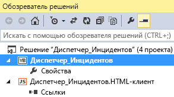

# Публикация облачной бизнес-надстройки в SharePointPublish a cloud business add-in to SharePoint
Вы можете опубликовать свою облачную бизнес-надстройку как надстройку для SharePoint с размещением у поставщика. Используя такой тип надстроек, вы сможете гибко развертывать свое веб-приложение и базу данных в локальном сайте SharePoint, Microsoft Azure или на стороннем сайте размещения. После того как вы опубликуете надстройку, другие люди смогут запускать ее из SharePoint на своих компьютерах и мобильных устройствах.You can publish your cloud business add-in as a provider-hosted SharePoint add-in. A provider-hosted add-in gives you the flexibility of deploying your web app and database to an on-premise SharePoint site, to Microsoft Azure, or to a third-party hosting site. After you publish your add-in, others can run it from SharePoint on their computers and mobile devices.
 
Вы можете опубликовать свою надстройку прямо на сайте, используя WebDeploy, или создать для нее пакет, который можно развертывать на многочисленных серверах.You can publish your add-in directly to a site using WebDeploy, or you can create a package for your add-in that can be deployed to multiple servers.
 

 **Примечание.** В настоящее время идет процесс замены названия "приложения для SharePoint" названием "надстройки SharePoint". Во время этого процесса в документации и пользовательском интерфейсе некоторых продуктов SharePoint и средств Visual Studio может по-прежнему использоваться термин "приложения для SharePoint". Дополнительные сведения см. в статье [Новое название приложений для Office и SharePoint](new-name-for-apps-for-sharepoint.md#bk_newname).**Note**  The name "apps for SharePoint" is changing to "SharePoint Add-ins". During the transition, the documentation and the UI of some SharePoint products and Visual Studio tools might still use the term "apps for SharePoint". For details, see  [New name for apps for Office and SharePoint](new-name-for-apps-for-sharepoint.md#bk_newname).
 

## Публикация надстройкиTo publish an add-in

1. В **обозревателе решений** откройте контекстное меню для узла приложения верхнего уровня, как показано на рисунке 1, а затем выберите пункт **Опубликовать**.In  **Solution Explorer**, open the shortcut menu for the top-level application node as shown in Figure 1, and then choose  **Publish**.
    
    **Рис. 1. Узел верхнего уровня****Figure 1. The top-level node**

 

  
 

 

 
2. На странице **Параметры SharePoint** мастера публикации приложений LightSwitch выберите переключатель **Размещение у поставщика**, а затем нажмите кнопку **Далее**.In the LightSwitch Publish Application Wizard, on the  **SharePoint Options** page, choose the **Provider-hosted** option button, and then choose **Next**.
    
 
3. На странице **Конфигурация сервера приложений** выберите переключатель **Сервер IIS** и нажмите кнопку **Далее**.On the  **Application Server Configuration** page, choose the **IIS Server** option button, and then choose **Next**.
    
     **Примечание.** Если у вас есть файл параметров публикации (PUBLISHSETTINGS или PUBXML), созданный для другой надстройки, то с его помощью вы можете предоставить остальные сведения, необходимые для публикации. В таком случае нажмите в мастере кнопку **Параметры импорта**.**Note**  If you have a publish settings (.publishsettings or .pubxml) file that was created for another add-in, you can use that file to provide the rest of the information that you need for publishing. If so, choose the  **Import Settings** button in the wizard.
4. На странице **Выходные данные публикации** выберите переключатель **Опубликовать непосредственно на сервере** и нажмите кнопку **Далее**.On the  **Publish Output** page, choose the **Publish directly to a server now** option button, and then choose **Next**.
    
 
5. На странице **Параметры публикации** в текстовом поле **URL-адрес службы** введите URL-адрес сервера, на котором вы хотите опубликовать свою надстройку.On the  **Publish Settings** page, in the **Service URL** text box, enter the URL for the server where you want to publish your add-in.
    
    При публикации у компании-поставщика услуг размещения, это значение должна предоставить компания. Оно может быть представлено в одном из следующих форматов:If you're publishing to a hosting company, the company provides this value. It can be in any of the following formats:
    
      -  _URL-адрес_поставщика_ (например, `contoso.com`);_HostingCompanyURL_ (for example, `contoso.com`)
    
 
  -  `https://` _URL-адрес_поставщика_ (например, `https://contoso.com`);`https://` _HostingCompanyURL_ (for example, `https://contoso.com`)
    
 
  -  `https://` _URL-адрес_поставщика_ `:8172/msdeploy.axd` (например, `https://contoso.com:8172/msdeploy.axd`).`https://` _HostingCompanyURL_ `:8172/msdeploy.axd` (for example, `https://contoso.com:8172/msdeploy.axd`)
    
 

    При публикации в службах IIS на собственном компьютере для тестирования укажите значение `localhost` или имя компьютера.If you're publishing to Internet Information Services (IIS) on your own computer for testing, enter  `localhost` or the name of your computer.
    
    При публикации на сервере в собственной сети укажите один из следующих URL-адресов:If you're publishing to a server on your own network, enter one of these URLs:
    
      -  `http://` _Имя_сервера_`http://` _ServerName_
    
 
  -  `http://` _Имя_сервера_ `/msdeployagentservice``http://` _ServerName_ `/msdeployagentservice`
    
 

     **Примечание.** В случае публикации через брандмауэр вам может потребоваться открыть порт 8172.**Note**  If you're publishing through a firewall, you might have to open port 8172.
6. В текстовом поле **Сайт или приложение** введите имена веб-сайта IIS и вашей надстройки.In the  **Site/application** text box, enter the names of the IIS website and your add-in.
    
    В случае публикации на сервере компании по размещению веб-сайтов она предоставит вам это значение. Обычно оно представляет собой доменное имя (например,  `contoso.com`) или доменное имя и имя надстройки (например,  `contoso.com/MyApp`).If you're publishing to a hosting company, the company provides this value. It's typically either a domain name (for example,  `contoso.com`) or a domain and add-in name (for example,  `contoso.com/MyApp`).
    
    В случае тестовой публикации в службы IIS на своем компьютере или публикации на сервере в своей внутренней сети введите имя сайта и надстройки, которые отображаются в диспетчере IIS. Например, если вы публикуете надстройку MyApp на веб-сайте по умолчанию в службах IIS, введите Веб-сайт по умолчанию/MyApp.If you're publishing to IIS on your own computer for testing, or you're publishing to a server on your internal network, enter the site and add-in name as they appear in IIS Manager. For example, if you're publishing the add-in MyApp to the default website in IIS, enter Default Web Site/MyApp.
    
     **Примечание.** Если вы публикуете приложение в существующей веб-папке и хотите удалить какое-либо имеющееся содержимое, установите флажок **Удалять дополнительные файлы в месте назначения**.**Note**  If you're publishing to an existing web folder and want to remove any existing content, select the  **Remove additional files at destination** check box.
7. В текстовых полях **Имя пользователя** и **Пароль** укажите данные учетной записи, имеющей достаточные полномочия для выполнения задач развертывания на целевом веб-сервере, а затем нажмите кнопку **Далее**.In the  **User Name** and **Password** text boxes, enter credentials for an account that has sufficient authority to perform deployment tasks on the destination web server, and then choose **Next**.
    
    При публикации у поставщика услуг размещения эти значения предоставляет поставщик.If you're publishing to a hosting company, the company provides these values.
    
 
8. На странице **Параметры безопасности** выберите переключатель **Да, пользователи должны подключаться по HTTPS** и нажмите кнопку **Далее**.On the  **Security Settings** page, choose the **Yes, users must connect using HTTPS** option button, and then choose **Next**.
    
 
9. На странице **Подключения данных** на вкладке **Подключения к базам данных** введите строки подключения администратора и пользователя для сервера базы данных, на котором вы хотите опубликовать базу данных своей надстройки.On the  **Data connections** page, on the **Database Connections** tab, enter the administrator and user connection strings for the database server where you want to publish your add-in's database.
    
     **Примечание.** База данных не обязательно должна находиться на сервере, на котором вы публикуете надстройку.**Note**  The database doesn't have to be located on the server where you are publishing the add-in.
10. На вкладке **Подключенные источники данных** по мере необходимости измените строки всех дополнительных подключений, а затем нажмите кнопку **Далее**.On the  **Attached Data Sources** tab, update the connection strings for any additional connections as needed, and then choose **Next**.
    
 
11. На странице **Размещение у поставщика** укажите полный URL-адрес своей надстройки в текстовом поле **Где размещается приложение LightSwitch**.On the  **Provider Hosting** page, in the **Where is your LightSwitch application hosted** text box, enter the full URL for your add-in.
    
    В большинстве случаев этот URL-адрес будет совпадать с указанными ранее значениями **URL-адрес службы** и **Сайт или приложение** (например, `https://contoso.com/MyApplication`).In most cases this URL will be the same as the  **Service URL** and **Site/application** values that you entered earlier (for example, `https://contoso.com/MyApplication`).
    
 
12. Укажите **идентификатор клиента** и **секрет клиента** для своей надстройки.Enter the  **Client ID** and **Client Secret** values for your add-in.
    
    Вы можете получить эти значения на странице **appregnew** сайта SharePoint или Панели мониторинга продаж. См. статью [Регистрация надстроек для SharePoint 2013](http://msdn.microsoft.com/en-us/library/office/jj687469%28v=office.15%29.aspx).You can get these values from the  **appregnew** page of your SharePoint site or from the Seller dashboard. See [Guidelines for registering SharePoint Add-ins 2013](http://msdn.microsoft.com/en-us/library/office/jj687469%28v=office.15%29.aspx).
    
 
13. Нажмите кнопку **Опубликовать**, чтобы опубликовать надстройку.Choose  **Publish** to publish your add-in.
    
    Когда надстройка будет опубликована, откроется **проводник** с каталогом **Publish** для проекта.When your add-in is published,  **File Explorer** opens and displays the **Publish** directory for your project.
    
 

## Упаковка надстройкиTo package an add-in

1. В **обозревателе решений** откройте контекстное меню для узла приложения верхнего уровня, как показано на рисунке 1, а затем выберите пункт **Опубликовать**.In  **Solution Explorer**, open the shortcut menu for the top-level application node as shown in Figure 1, and then choose  **Publish**.
    
    **Рис. 1. Узел верхнего уровня****Figure 1. The top-level node**

 

  
 

    
    
 
2. На странице **Параметры SharePoint** мастера публикации приложений LightSwitch выберите переключатель **Размещение у поставщика**, а затем нажмите кнопку **Далее**.In the LightSwitch Publish Application Wizard, on the  **SharePoint Options** page, choose the **Provider-hosted** option button, and then choose **Next**.
    
 
3. На странице **Конфигурация сервера приложений** выберите переключатель **Сервер IIS** и нажмите кнопку **Далее**.On the  **Application Server Configuration** page, choose the **IIS Server** option button, and then choose **Next**.
    
     **Примечание.** Если у вас есть файл параметров публикации (PUBLISHSETTINGS или PUBXML), созданный для другой надстройки, то с его помощью вы можете предоставить остальные сведения, необходимые для публикации. В таком случае нажмите в мастере кнопку **Параметры импорта**.**Note**  If you have a publish settings (.publishsettings or .pubxml) file that was created for another add-in, you can use that file to provide the rest of the information that you need for publishing. If so, choose the  **Import Settings** button in the wizard.
4. На странице **Выходные данные публикации** выберите переключатель **Создать пакет на диске** и нажмите кнопку **Далее**.On the  **Publish Output** page, choose the **Create a package on disk** option button, and then choose **Next**.
    
 
5. На странице **Параметры публикации** укажите имя сайта в текстовом поле **Как должен быть назван веб-сайт?**.On the  **Publish Settings** page, in the **What should the website be named?** text box, enter a name for the website.
    
    По умолчанию задано имя надстройки.The default name is the add-in name.
    
 
6. В текстовом поле **Где должен быть создан пакет?** введите путь к расположению, где требуется опубликовать выходные данные, а затем нажмите кнопку **Далее**.In the  **Where should the package be created?** text box, enter the path for the location where you want the output to be published, and then choose **Next**.
    
    По умолчанию используется подкаталог Publish каталога проекта.The default location is the Publish subdirectory under your project directory.
    
 
7. На странице **Параметры безопасности** выберите переключатель **Да, пользователи должны подключаться по HTTPS** и нажмите кнопку **Далее**.On the  **Security Settings** page, choose the **Yes, users must connect using HTTPS** option button, and then choose **Next**.
    
 
8. На странице **Конфигурация базы данных** выберите переключатель **Создать новую базу данных** и введите имя своей надстройки в качестве имени базы данных.On the  **Database Configuration** page, choose the **Generate a new database called** option button and enter your add-in's name as the database name.
    
 
9. Выберите вкладку **Подключенные источники данных** и по мере необходимости измените строки всех дополнительных подключений, а затем нажмите кнопку **Далее**.Choose the  **Attached Data Sources** tab and update the connection strings for any additional connections as needed, and then choose **Next**.
    
 
10. На странице **Размещение у поставщика** укажите полный URL-адрес своей надстройки в текстовом поле **Где размещается приложение LightSwitch**.On the  **Provider Hosting** page, in the **Where is your LightSwitch application hosted** text box, enter the full URL for your add-in.
    
    В большинстве случаев этот URL-адрес будет совпадать с указанными ранее значениями **URL-адрес службы** и **Сайт или приложение** (например, `https://contoso.com/MyApplication`).In most cases this URL will be the same as the  **Service URL** and **Site/application** values that you entered earlier (for example `https://contoso.com/MyApplication`).
    
 
11. Введите **идентификатор клиента** и **секрет клиента** для надстройки.Enter the  **Client ID** and **Client Secret** for your add-in.
    
    Вы можете получить эти значения на странице **appregnew** сайта SharePoint или Панели мониторинга продаж. См. статью [Регистрация надстроек для SharePoint 2013](http://msdn.microsoft.com/en-us/library/office/jj687469%28v=office.15%29.aspx).You can get these values from the  **appregnew** page of your SharePoint site or from the Seller dashboard. See [Guidelines for registering SharePoint Add-ins 2013](http://msdn.microsoft.com/en-us/library/office/jj687469%28v=office.15%29.aspx).
    
 
12. Нажмите кнопку **Опубликовать**, чтобы опубликовать надстройку.Choose  **Publish** to publish your add-in.
    
    Когда ваша надстройка будет опубликована, файл ZIP с пакетом помещается в каталог, который вы указали на этапе 4. После создания этого пакета администратор сервера сможет с помощью средства MSDeploy развернуть вашу надстройку на серверах, на которых запущены службы IIS и SQL Server.When your add-in is published, a .zip file that contains the package is placed in the directory that you specified in step 4. After this package has been created, a server administrator can use the MSDeploy tool to deploy your add-in to servers that are running IIS and SQL Server.
    
 

## Дополнительные ресурсыAdditional resources

-  [Регистрация надстроек SharePoint 2013Register SharePoint Add-ins 2013](register-sharepoint-add-ins.md)
    
 
-  [Публикация облачных бизнес-надстроекPublish cloud business add-ins](publish-cloud-business-add-ins.md)
    
 

