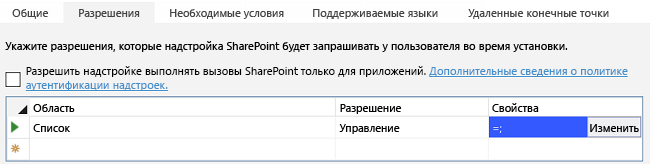
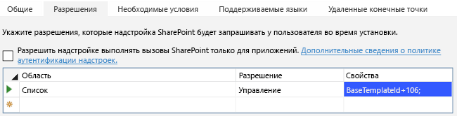
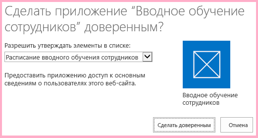
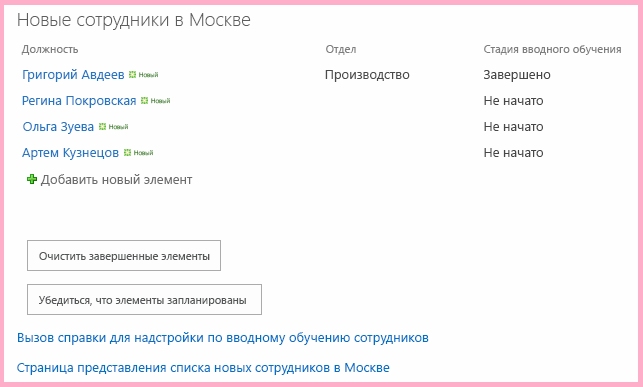
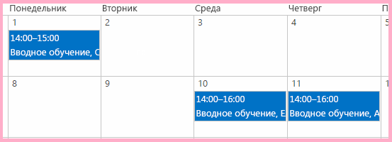

# <a name="work-with-host-web-data-from-javascript-in-the-add-in-web"></a><span data-ttu-id="d62c0-103">Работа с данными хост-сайта из кода JavaScript на сайте надстройки</span><span class="sxs-lookup"><span data-stu-id="d62c0-103">Work with host web data from JavaScript in the add-in web</span></span>

<span data-ttu-id="d62c0-104">Эта одиннадцатая часть серии статей, посвященной основам разработки надстроек SharePoint, размещаемых в SharePoint. Для начала ознакомьтесь со статьей [Надстройки SharePoint](sharepoint-add-ins.md) и предыдущими статьями из этой серии.</span><span class="sxs-lookup"><span data-stu-id="d62c0-104">This is the ninth in a series of articles about the basics of developing SharePoint-hosted SharePoint Add-ins. You should first be familiar with  [SharePoint Add-ins](sharepoint-add-ins.md) and the previous articles in this series:</span></span>

-  [<span data-ttu-id="d62c0-105">Знакомство с созданием надстроек SharePoint с размещением в SharePoint</span><span class="sxs-lookup"><span data-stu-id="d62c0-105">Get started creating SharePoint-hosted SharePoint Add-ins</span></span>](get-started-creating-sharepoint-hosted-sharepoint-add-ins.md)
-  [<span data-ttu-id="d62c0-106">Развертывание и установка надстроек SharePoint, размещаемых в SharePoint</span><span class="sxs-lookup"><span data-stu-id="d62c0-106">Deploy and install a SharePoint-hosted SharePoint Add-in</span></span>](deploy-and-install-a-sharepoint-hosted-sharepoint-add-in.md)
-  [<span data-ttu-id="d62c0-107">Добавление настраиваемых столбцов в надстройку SharePoint, размещаемую в SharePoint</span><span class="sxs-lookup"><span data-stu-id="d62c0-107">Add custom columns to a SharePoint-hosted SharePoint Add-in</span></span>](add-custom-columns-to-a-sharepoint-hosted-sharepoint-add-in.md)
-  [<span data-ttu-id="d62c0-108">Добавление пользовательского типа контента в надстройку SharePoint, размещаемую в SharePoint</span><span class="sxs-lookup"><span data-stu-id="d62c0-108">Add a custom content type to a SharePoint-hosted SharePoint Add-in</span></span>](add-a-custom-content-type-to-a-sharepoint-hosted-sharepoint-add-in.md)
-  [<span data-ttu-id="d62c0-109">Добавление веб-части на страницу в надстройке SharePoint, размещаемую в SharePoint</span><span class="sxs-lookup"><span data-stu-id="d62c0-109">Add a Web Part to a page in a SharePoint-hosted SharePoint Add-in</span></span>](add-a-web-part-to-a-page-in-a-sharepoint-hosted-sharepoint-add-in.md)
-  [<span data-ttu-id="d62c0-110">Добавление рабочего процесса в надстройку для SharePoint с размещением в SharePoint</span><span class="sxs-lookup"><span data-stu-id="d62c0-110">Add a workflow to a SharePoint-hosted SharePoint Add-in</span></span>](add-a-workflow-to-a-sharepoint-hosted-sharepoint-add-in.md)
-  [<span data-ttu-id="d62c0-111">Добавление настраиваемой страницы и стиля для надстройки с размещением в SharePoint</span><span class="sxs-lookup"><span data-stu-id="d62c0-111">Add a custom page and style to a SharePoint-hosted SharePoint Add-in</span></span>](add-a-custom-page-and-style-to-a-sharepoint-hosted-sharepoint-add-in.md)
-  [<span data-ttu-id="d62c0-112">Добавление настраиваемой функции отрисовки в клиенте в надстройку SharePoint, размещаемую в SharePoint</span><span class="sxs-lookup"><span data-stu-id="d62c0-112">Add custom client-side rendering to a SharePoint-hosted SharePoint Add-in</span></span>](add-custom-client-side-rendering-to-a-sharepoint-hosted-sharepoint-add-in.md)
-  [<span data-ttu-id="d62c0-113">Создание настраиваемой кнопки ленты на хост-сайте надстройки SharePoint</span><span class="sxs-lookup"><span data-stu-id="d62c0-113">Create a custom ribbon button in the host web of a SharePoint Add-in</span></span>](create-a-custom-ribbon-button-in-the-host-web-of-a-sharepoint-add-in.md)
-  [<span data-ttu-id="d62c0-114">Использование API JavaScript для SharePoint для работы с данными SharePoint</span><span class="sxs-lookup"><span data-stu-id="d62c0-114">Use the SharePoint JavaScript APIs to work with SharePoint data</span></span>](use-the-sharepoint-javascript-apis-to-work-with-sharepoint-data.md)
    
> [!NOTE]
> <span data-ttu-id="d62c0-115">Если вы изучали предыдущие статьи этой серии о надстройках, размещаемых в SharePoint, то у вас уже есть решение для Visual Studio, которое можно использовать для работы с этой статьей.</span><span class="sxs-lookup"><span data-stu-id="d62c0-115">Note  If you have been working through this series about SharePoint-hosted add-ins, then you have a Visual Studio solution that you can use to continue with this topic. You can also download the repository at  SharePoint_SP-hosted_Add-Ins_Tutorials and open the BeforeClientRenderedControl.sln file.</span></span> <span data-ttu-id="d62c0-116">Кроме того, вы можете скачать репозиторий на веб-странице [SharePoint_SP-hosted_Add-Ins_Tutorials](https://github.com/OfficeDev/SharePoint_SP-hosted_Add-Ins_Tutorials) и открыть файл BeforeHostWebData.sln.</span><span class="sxs-lookup"><span data-stu-id="d62c0-116">You can also download the repository at [SharePoint_SP-hosted_Add-Ins_Tutorials](https://github.com/OfficeDev/SharePoint_SP-hosted_Add-Ins_Tutorials) and open the BeforeHostWebData.sln file.</span></span>

<span data-ttu-id="d62c0-117">По умолчанию SharePoint запрещает коду JavaScript в надстройке доступ к данным на других веб-сайтах SharePoint в ферме.</span><span class="sxs-lookup"><span data-stu-id="d62c0-117">By default, SharePoint is designed to prevent JavaScript in an add-in from getting access to data in other SharePoint websites on the farm.</span></span> <span data-ttu-id="d62c0-118">Благодаря этому ограничению скрипту в мошеннической надстройке не удастся получить доступ к конфиденциальным данным.</span><span class="sxs-lookup"><span data-stu-id="d62c0-118">This prevents script in a rogue add-in from getting access to sensitive data.</span></span> <span data-ttu-id="d62c0-119">Тем не менее зачастую надстройке требуется доступ к хост-сайту или другим веб-сайтам, находящимся в том же семействе веб-сайтов, что и хост-сайт.</span><span class="sxs-lookup"><span data-stu-id="d62c0-119">But often an add-in needs to have access to the host web, or to other websites within the same site collection as the host web.</span></span> 

<span data-ttu-id="d62c0-120">Чтобы включить этот сценарий в вашей надстройке, используются два указанных ниже этапа.</span><span class="sxs-lookup"><span data-stu-id="d62c0-120">There are two parts to enabling this scenario in your add-in:</span></span>

- <span data-ttu-id="d62c0-121">Вы запрашиваете разрешение на доступ к хост-сайту в файле манифеста надстройки.</span><span class="sxs-lookup"><span data-stu-id="d62c0-121">You request permission to the host web in the add-in manifest file of your add-in.</span></span> <span data-ttu-id="d62c0-122">Пользователю, который устанавливает надстройку, будет предложено предоставить это разрешение. Если пользователь не предоставит это разрешение, то не удастся установить надстройку.</span><span class="sxs-lookup"><span data-stu-id="d62c0-122">You request permission to the host web in the add-in manifest file of your add-in. The user who installs the add-in is prompted to grant this permission, and the add-in cannot be installed if user does not.</span></span>

- <span data-ttu-id="d62c0-123">Для создания вызовов JSOM к хост-сайту, используйте объект **SP.AppContextSite** вместо объекта **SP.ClientContext**.</span><span class="sxs-lookup"><span data-stu-id="d62c0-123">Instead of using an **SP.ClientContext** object to make JSOM calls to the host web, you use an **SP.AppContextSite** object.</span></span> <span data-ttu-id="d62c0-124">Этот объект позволяет надстройке получать объект контекста для веб-сайтов, отличных от сайта надстройки, но только для тех веб-сайтов, которые находятся в одном и том же семействе веб-сайтов.</span><span class="sxs-lookup"><span data-stu-id="d62c0-124">This object enables the add-in to get a context object for websites other than the add-in web, but only for websites within the same site collection.</span></span> <span data-ttu-id="d62c0-125">(Кроме того, существует способ получения доступа к любому веб-сайту в подписке SharePoint Online или в локальном веб-приложении SharePoint, но это более сложная тема.)</span><span class="sxs-lookup"><span data-stu-id="d62c0-125">(There is also a way to get access to any website in the SharePoint Online subscription [or an on-premises SharePoint Web Application], but that is an advanced subject.)</span></span>

<span data-ttu-id="d62c0-126">В данной статье вы будете использовать JSOM для поиска еще не запущенных процессов вводного обучения и проверки того, что они запланированы в календаре на хост-сайте.</span><span class="sxs-lookup"><span data-stu-id="d62c0-126">In this article you use the JSOM to find the orientations that are not yet started and ensure that they are scheduled on a calendar in the host web.</span></span>

## <a name="prepare-the-host-web-calendar"></a><span data-ttu-id="d62c0-127">Подготовка календаря хост-сайта</span><span class="sxs-lookup"><span data-stu-id="d62c0-127">Prepare the host web calendar</span></span>

<span data-ttu-id="d62c0-128">Откройте хост-сайт (ваш тестовый веб-сайт разработчика) и убедитесь, что на нем есть календарь **Employee Orientation Schedule** (Расписание обучения сотрудников) с одним событием **Orient Cassie Hicks** (Обучение Cassie Hicks).</span><span class="sxs-lookup"><span data-stu-id="d62c0-128">Open the host web -- your developer test website -- and verify that there is a calendar on it named "Employee Orientation Schedule" and it has a single event on it: "Orient Cassie Hicks". If there isn't, take the following steps:</span></span> <span data-ttu-id="d62c0-129">Если его нет, выполните указанные ниже действия.</span><span class="sxs-lookup"><span data-stu-id="d62c0-129">If there isn't, take the following steps:</span></span>

1. <span data-ttu-id="d62c0-130">На домашней странице сайта выберите пункты **Содержимое сайта** > **Добавить надстройку** > **Календарь**.</span><span class="sxs-lookup"><span data-stu-id="d62c0-130">From the home page of the site, choose  **Site Contents** > **add an add-in** > **Calendar**.</span></span>    
 
2. <span data-ttu-id="d62c0-131">В диалоговом окне **Добавление календаря** введите **Employee Orientation Schedule** (Расписание обучения сотрудников) в поле **Имя**, а затем нажмите кнопку **Создать**.</span><span class="sxs-lookup"><span data-stu-id="d62c0-131">On the  **Adding Calendar** dialog, typeEmployee Orientation Schedule for the **Name**, and then choose  **Create**.</span></span>
    
3. <span data-ttu-id="d62c0-132">Когда откроется календарь, наведите курсор на любую дату, чтобы на ней появилась ссылка **Добавить**, и перейдите по ссылке **Добавить**.</span><span class="sxs-lookup"><span data-stu-id="d62c0-132">When the calendar opens, put the cursor on any date until the  **Add** link appears on the date, and then click **Add**.</span></span>   
 
4. <span data-ttu-id="d62c0-133">В диалоговом окне **Employee Orientation Schedule - New Item** (Расписание обучения сотрудников: новый элемент) в поле **Название** введите **Orient Cassi Hicks** (Обучение Cassie Hicks).</span><span class="sxs-lookup"><span data-stu-id="d62c0-133">On the **Employee Orientation Schedule - New Item** dialog, type **Orient Cassi Hicks** for the **Title**. Leave the other fields at their defaults and click Save.</span></span> <span data-ttu-id="d62c0-134">В остальных полях оставьте значения, используемые по умолчанию, и нажмите кнопку **Сохранить**.</span><span class="sxs-lookup"><span data-stu-id="d62c0-134">Leave the other fields at their defaults, and select **Save**.</span></span>
    
   <span data-ttu-id="d62c0-135">Календарь должен выглядеть примерно так:</span><span class="sxs-lookup"><span data-stu-id="d62c0-135">The calendar should look similar to the following:</span></span>
    
   <span data-ttu-id="d62c0-136">*Рис. 1. Настраиваемый календарь*</span><span class="sxs-lookup"><span data-stu-id="d62c0-136">*Figure 1. Custom calendar*</span></span>

   


## <a name="create-the-javascript-and-a-button-to-invoke-it"></a><span data-ttu-id="d62c0-138">Создание кода JavaScript и кнопки для его вызова</span><span class="sxs-lookup"><span data-stu-id="d62c0-138">Create the JavaScript and a button to invoke it</span></span>

1. <span data-ttu-id="d62c0-139">В **обозревателе решений** в узле **Скрипты** откройте файл Add-in.js.</span><span class="sxs-lookup"><span data-stu-id="d62c0-139">Open the Add-in.js file in the **Scripts** node in **Solution Explorer**.</span></span> 
    
2. <span data-ttu-id="d62c0-140">Добавьте указанные ниже объявления под объявлением `completedItems`.</span><span class="sxs-lookup"><span data-stu-id="d62c0-140">Add the following declarations below the declaration for  `completedItems`.</span></span> 
    
    ```
     var notStartedItems;
     var calendarList;
     var scheduledItems;
    ```
    
   - <span data-ttu-id="d62c0-141">Элемент `notStartedItems` ссылается на элементы в списке **New Employees in Seattle** (Новые сотрудники в Сиэтле), у которого параметр **Orientation Stage** (Этап обучения) имеет значение **Not Started** (Не начато).</span><span class="sxs-lookup"><span data-stu-id="d62c0-141">The  `notStartedItems` references the items on the **New Employees in Seattle** list whose **Orientation Stage** is **Not Started**.</span></span>
   - <span data-ttu-id="d62c0-142">Элемент `calendarList` ссылается на календарь, который вы создали на хост-сайте.</span><span class="sxs-lookup"><span data-stu-id="d62c0-142">The  `calendarList` references the calendar you created on the host web.</span></span>
   - <span data-ttu-id="d62c0-143">Элемент `scheduledItems` ссылается на коллекцию элементов календаря.</span><span class="sxs-lookup"><span data-stu-id="d62c0-143">The  `scheduledItems` references a collection of items on the calendar.</span></span>

3. <span data-ttu-id="d62c0-144">При запуске надстройки SharePoint вызывает ее начальную страницу и добавляет ряд параметров запроса в URL-адрес начальной страницы.</span><span class="sxs-lookup"><span data-stu-id="d62c0-144">When a SharePoint Add-in is run, SharePoint calls its start page and adds some query parameters to the start page URL.</span></span> <span data-ttu-id="d62c0-145">Один из таких параметров — `SPHostUrl`, который, конечно же, представляет собой URL-адрес хост-сайта.</span><span class="sxs-lookup"><span data-stu-id="d62c0-145">One of these is `SPHostUrl` which is, of course, the URL of the host web.</span></span> <span data-ttu-id="d62c0-146">Эта информация требуется надстройке, чтобы она могла совершать вызовы к данным хост-сайта, поэтому в верхней части файла Add-in.js сразу после объявления переменных для элемента `scheduledItems` добавьте указанную ниже строку.</span><span class="sxs-lookup"><span data-stu-id="d62c0-146">When a SharePoint Add-in is run, SharePoint calls its start page and adds some query parameters to the start page URL. One of these is   which is, of course, the URL of the host web. The add-in needs this information in order to make calls to host web data, so near the top of the Add-in.js file, just under the variable declaration for `scheduledItems`, add the following line. Note the following about this code:</span></span> 

    ```
      var hostWebURL = decodeURIComponent(getQueryStringParameter("SPHostUrl"));
    ```

   <span data-ttu-id="d62c0-147">Обратите внимание на указанные ниже особенности этого кода.</span><span class="sxs-lookup"><span data-stu-id="d62c0-147">Note the following about this code:</span></span>
    
   - <span data-ttu-id="d62c0-148">`getQueryStringParameter` — это служебная функция, которую вы создадите на следующем этапе.</span><span class="sxs-lookup"><span data-stu-id="d62c0-148">The  `getQueryStringParameter` is a utility function that you create in the next step.</span></span>
   - <span data-ttu-id="d62c0-149">`decodeUriComponent` — это стандартная функция JavaScript, выполняющая обратное преобразование кодировки универсального кода ресурса (URI), которое SharePoint совершает для параметров запроса. Например, код %2F для косой черты будет преобразован обратно в символ /.</span><span class="sxs-lookup"><span data-stu-id="d62c0-149">The  `decodeUriComponent` is a standard JavaScript function that reverses the URI-encoding that SharePoint does on the query parameters; for example, an encoded forward slash, "%2F", is changed back to a "/".</span></span>

4. <span data-ttu-id="d62c0-p108">Добавьте указанный ниже код в конец файла. С помощью этой функции можно считывать параметры запроса.</span><span class="sxs-lookup"><span data-stu-id="d62c0-p108">Add the following code to the bottom of the file. This function can be used to read the query parameters.</span></span> 
    
    ```
      // Utility functions

    function getQueryStringParameter(paramToRetrieve) {
         var params = document.URL.split("?")[1].split("&amp;");
         var strParams = "";
         for (var i = 0; i < params.length; i = i + 1) {
             var singleParam = params[i].split("=");
             if (singleParam[0] == paramToRetrieve) {
                 return singleParam[1];
            }
         }
     }
    ```

5. <span data-ttu-id="d62c0-152">Добавьте указанную ниже функцию в файл Add-in.js перед разделом с функциями обратного вызова для обработки ошибок.</span><span class="sxs-lookup"><span data-stu-id="d62c0-152">Add the following function to the Add-in.js file somewhere above the failure callbacks section. Note the following about this code:</span></span> 

    ```
      function ensureOrientationScheduling() {

        var camlQuery = new SP.CamlQuery();
        camlQuery.set_viewXml(
            '<View><Query><Where><Eq>' +
                '<FieldRef Name=\'OrientationStage\'/><Value Type=\'Choice\'>Not started</Value>' +
            '</Eq></Where></Query></View>');
        notStartedItems = employeeList.getItems(camlQuery);

        clientContext.load(notStartedItems);
        clientContext.executeQueryAsync(getScheduledOrientations, onGetNotStartedItemsFail);
        return false;
    }
    ```

   <span data-ttu-id="d62c0-153">Обратите внимание на указанные ниже особенности этого кода.</span><span class="sxs-lookup"><span data-stu-id="d62c0-153">Note the following about this code:</span></span>

   - <span data-ttu-id="d62c0-154">Он практически идентичен методу запроса списка, который получает элементы с состоянием **Completed** (Завершено), за исключением того, что он получает элементы с состоянием **Not Started** (Не начато), а не **Completed** (Завершено).</span><span class="sxs-lookup"><span data-stu-id="d62c0-154">This is nearly identical to the list query method that gets the  **Completed** items, except that it gets items that are **Not Started** instead of those that are **Completed**. We are interested in only the  Not Started items because the script makes the simplifying assumption that if an orientation is past the Not Started stage, then it must already be scheduled.</span></span> <span data-ttu-id="d62c0-155">Нас интересуют только элементы с состоянием **Not Started** (Не начато), так как в скрипте для простоты предполагается, что если обучение прошло этап **Not Started** (Не начато), то оно уже должно быть в расписании.</span><span class="sxs-lookup"><span data-stu-id="d62c0-155">This is nearly identical to the list query method that gets the  Completed items, except that it gets items that are Not Started instead of those that are Completed. We are interested in only the  **Not Started** items because the script makes the simplifying assumption that if an orientation is past the **Not Started** stage, then it must already be scheduled.</span></span>
   - <span data-ttu-id="d62c0-156">На последующих этапах вы создадите два метода обратного вызова в вызове **executeQueryAsync**.</span><span class="sxs-lookup"><span data-stu-id="d62c0-156">You create the two callback methods in the **executeQueryAsync** call in later steps.</span></span>

6. <span data-ttu-id="d62c0-157">Добавьте указанную ниже функцию в файл Add-in.js сразу под предыдущей функцией.</span><span class="sxs-lookup"><span data-stu-id="d62c0-157">Add the following function to the Add-in.js file just below the preceding function. Notice that it uses the   object to identify the list that is queried.</span></span> <span data-ttu-id="d62c0-158">Обратите внимание, что в этой функции для идентификации запрашиваемого списка используется объект **hostWebContext**.</span><span class="sxs-lookup"><span data-stu-id="d62c0-158">Add the following function to the Add-in.js file just below the preceding function. Notice that it uses the **hostWebContext** object to identify the list that is queried.</span></span>

    ```
      function getScheduledOrientations() {

        var hostWebContext = new SP.AppContextSite(clientContext, hostWebURL);
        calendarList = hostWebContext.get_web().get_lists().getByTitle('Employee Orientation Schedule');

        var camlQuery = new SP.CamlQuery();
        scheduledItems = calendarList.getItems(camlQuery);

        clientContext.load(scheduledItems);
        clientContext.executeQueryAsync(scheduleAsNeeded, onGetScheduledItemsFail);
    }
    ```

   > [!NOTE]
   > <span data-ttu-id="d62c0-159">Обратите внимание, что в запрос CAML не добавляется никакой разметки запроса.</span><span class="sxs-lookup"><span data-stu-id="d62c0-159">Notice that no query markup is added to the CAML query.</span></span> <span data-ttu-id="d62c0-160">Отсутствие фактического запроса в объекте запроса гарантирует, что будут получены *все* элементы списка.</span><span class="sxs-lookup"><span data-stu-id="d62c0-160">The effect of having no actual query in the query object is to ensure that *all* of the list items will be retrieved.</span></span> <span data-ttu-id="d62c0-161">Если бы список был очень большим, это могло привести к тому, что запрос к серверу выполнялся бы неприемлемо долго.</span><span class="sxs-lookup"><span data-stu-id="d62c0-161">If the list was very large, this might cause the request to the server to be unacceptably long-running.</span></span> <span data-ttu-id="d62c0-162">В этом случае нам, возможно, потребовалось бы найти другой способ достижения нашей цели.</span><span class="sxs-lookup"><span data-stu-id="d62c0-162">In that case, we'd want to find some other way of accomplishing our goal.</span></span> <span data-ttu-id="d62c0-163">В нашем же примере используется очень маленький список (списки календаря почти всегда маленькие), и получение всего списка (чтобы можно было выполнить итерации в нем в клиенте) позволит нам свести к минимуму количество вызовов к серверу, то есть вызовов метода **executeQueryAsync**.</span><span class="sxs-lookup"><span data-stu-id="d62c0-163">Note  Notice that no query markup is added to the CAML query. The effect of having no actual query in the query object is to ensure that  all  of the list times will be retrieved. If the list was very large this might cause the request to the server to be unacceptably long-running. In that case, we'd want to find some other way of accomplishing our goal. But in this sample situation with a very small list (and calendar lists are almost always small), getting the whole list, so that we can iterate through it on the client will actually help us minimize the number of calls to the server; that is, calls of **executeQueryAsync**.</span></span>

7. <span data-ttu-id="d62c0-164">Добавьте указанную ниже функцию в файл.</span><span class="sxs-lookup"><span data-stu-id="d62c0-164">Add the following function to the file just below the  function.</span></span> 

    ```
      function scheduleAsNeeded() {

        var unscheduledItems = false;
        var dayOfMonth = '10';

        var listItemEnumerator = notStartedItems.getEnumerator();

        while (listItemEnumerator.moveNext()) {
            var alreadyScheduled = false;
            var notStartedItem = listItemEnumerator.get_current();

            var calendarEventEnumerator = scheduledItems.getEnumerator();
            while (calendarEventEnumerator.moveNext()) {
                var scheduledEvent = calendarEventEnumerator.get_current();

                 // The SP.ListItem.get_item('field_name ') method gets the value of the specified field.
                if (scheduledEvent.get_item('Title').indexOf(notStartedItem.get_item('Title')) > -1) {
                    alreadyScheduled = true;
                    break;
                }
            }
            if (alreadyScheduled === false) {

                 // SP.ListItemCreationInformation holds the information the SharePoint server needs to
                 // create a list item
                var calendarItem = new SP.ListItemCreationInformation();

                 // The some_list .additem method tells the server which list to add 
                 // the item to.
                var itemToCreate = calendarList.addItem(calendarItem);

                 // The some_item .set_item method sets the value of the specified field.
                itemToCreate.set_item('Title', 'Orient ' + notStartedItem.get_item('Title'));

                 // The EventDate and EndDate are the start and stop times of an event.
                itemToCreate.set_item('EventDate', '2015-06-' + dayOfMonth + 'T21:00:00Z');
                itemToCreate.set_item('EndDate', '2015-06-' + dayOfMonth + 'T23:00:00Z');
                dayOfMonth++;

                 // The update method tells the server to commit the changes to the SharePoint database.
                itemToCreate.update();
                unscheduledItems = true;
            }
        }
        if (unscheduledItems) {
            calendarList.update();
            clientContext.executeQueryAsync(onScheduleItemsSuccess, onScheduleItemsFail);
        }
    }
    ```

   <span data-ttu-id="d62c0-165">Обратите внимание на указанные ниже особенности этого кода.</span><span class="sxs-lookup"><span data-stu-id="d62c0-165">Note the following about this code:</span></span>

   - <span data-ttu-id="d62c0-166">Этот метод проверяет, содержится ли название элемента с состоянием **Not Started** (Не начато) в списке **New Employees In Seattle** (Новые сотрудники в Сиэтле), представляющее собой имя сотрудника, в названии события из календаря **Employee Orientation Schedule** (Расписание обучения сотрудников).</span><span class="sxs-lookup"><span data-stu-id="d62c0-166">The method checks to see if the title of a  **Not Started** item in the **New Employees In Seattle** list, which is the name of an employee, is contained in the title of an event in the **Employee Orientation Schedule** calendar. So there is a simplifying assumption that all entries in the calendar are created with the full employee name in the event title.</span></span> <span data-ttu-id="d62c0-167">При этом для простоты предполагается, что при создании всех записей в календаре в названиях событий используются полные имена сотрудников.</span><span class="sxs-lookup"><span data-stu-id="d62c0-167">There is a simplifying assumption that all entries in the calendar are created with the full employee name in the event title.</span></span>

   - <span data-ttu-id="d62c0-168">Если ни одно из уже имеющихся в календаре событий не совпадает с элементом с состоянием **Not Started** (Не начат), то сценарий создает элемент календаря для элемента с состоянием **Not Started** (Не начат).</span><span class="sxs-lookup"><span data-stu-id="d62c0-168">If none of the events that are already on the calendar matches a **Not Started** item, the script creates a calendar item for the **Not Started** item.</span></span>

   - <span data-ttu-id="d62c0-169">Объект JSOM использует простой объект **ListItemCreationInformation** вместо объекта **SPListItem**. Это позволяет свести к минимуму объем полезных данных, отправляемых на сервер SharePoint.</span><span class="sxs-lookup"><span data-stu-id="d62c0-169">JSOM uses a light weight **ListItemCreationInformation** object instead of a **SPListItem** object to minimize the size of the payload that is sent to the SharePoint server.</span></span>

   - <span data-ttu-id="d62c0-170">Двум полям типа **DateTime** нового события календаря присвоены даты месяца, в котором была написана эта статья: `2015-06`.</span><span class="sxs-lookup"><span data-stu-id="d62c0-170">The two DateTime fields of the new calendar event are set to days in the month when this article was written:  ****.  `2015-06`</span></span> <span data-ttu-id="d62c0-171">*Измените эти даты на даты с текущим месяцем и годом, чтобы вам не пришлось прокручивать календарь в поисках необходимых элементов.*</span><span class="sxs-lookup"><span data-stu-id="d62c0-171">The two DateTime fields of the new calendar event are set to days in the month when this article was written:  .  *Change these dates to a day in the current month and year, so you don't have to scroll back in your calendar to find the items.*</span></span> 

   - <span data-ttu-id="d62c0-p114">Если будет обнаружено, что каких-либо элементов с состоянием **Not Started** (Не начат) нет в расписании, то первый элемент будет внесен в расписание на 10-е число месяца. Каждый дополнительный элемент, которого нет в расписании, будет вноситься в расписание со сдвигом на один день. В примере используется упрощающее допущение, подразумевающее, что элементов не так много и они не будут запланированы на несуществующие дни месяца, например, на 32-е число.</span><span class="sxs-lookup"><span data-stu-id="d62c0-p114">If any **Not Started** items are found to be unscheduled, the first one will be scheduled for the 10th of the month. Each additional unscheduled item will be scheduled for a day later. The simplifying assumption is that there won't be so many that some are scheduled for impossible days of the month, such as "32".</span></span>

   - <span data-ttu-id="d62c0-p115">Большая часть этого кода представляет собой стандартный JavaScript. Строки с использованием модели JSOM SharePoint прокомментированы.</span><span class="sxs-lookup"><span data-stu-id="d62c0-p115">Most of this code is standard JavaScript. There are comments for the lines that use SharePoint JSOM.</span></span>

8. <span data-ttu-id="d62c0-177">Добавьте указанный ниже обработчик успешного выполнения, который вызывается при добавлении элементов, которых ранее не было в расписании, в календарь.</span><span class="sxs-lookup"><span data-stu-id="d62c0-177">Add the following success handler that is called when the previously unscheduled items are added to the calendar.</span></span>
    
    ```
      function onScheduleItemsSuccess() {
        alert('There was one or more unscheduled orientations and they have been added to the '
                  + 'Employee Orientation Schedule calendar.');
    }
    ```

9. <span data-ttu-id="d62c0-178">Добавьте приведенные ниже функции в раздел файла с функциями обратного вызова для обработки неудачного выполнения.</span><span class="sxs-lookup"><span data-stu-id="d62c0-178">Add the following failure functions to the Failure callbacks section of the file.</span></span>
    
    ```
      function onGetNotStartedItemsFail(sender, args) {
        alert('Unable to get the not-started items. Error:' 
            + args.get_message() + '\n' + args.get_stackTrace());
    }

    function onGetScheduledItemsFail(sender, args) {
        alert('Unable to get scheduled items from host web. Error:' 
            + args.get_message() + '\n' + args.get_stackTrace());
    }

    function onScheduleItemsFail(sender, args) {
        alert('Unable to schedule items on host web calendar. Error:' 
            + args.get_message() + '\n' + args.get_stackTrace());
    }
    ```

10. <span data-ttu-id="d62c0-179">Откройте файл default.aspx и найдите элемент **asp:Content** с идентификатором **PlaceHolderMain**.</span><span class="sxs-lookup"><span data-stu-id="d62c0-179">Open the default.aspx file and find the **asp:Content** element with the ID **PlaceHolderMain**.</span></span>

11. <span data-ttu-id="d62c0-180">Добавьте указанную ниже разметку непосредственно под кнопкой `purgeCompletedItems`.</span><span class="sxs-lookup"><span data-stu-id="d62c0-180">Add the following markup just below the  `purgeCompletedItems` button.</span></span>
    
    ```HTML
      <p><asp:Button runat="server" OnClientClick="return ensureOrientationScheduling()" 
      ID="ensureorientationschedulingbutton" Text="Ensure all items are on the Calendar" /></p>
    ```

12. <span data-ttu-id="d62c0-181">Выполните перестройку проекта в Visual Studio.</span><span class="sxs-lookup"><span data-stu-id="d62c0-181">Rebuild the project in Visual Studio.</span></span>

13. <span data-ttu-id="d62c0-182">Чтобы при тестировании надстройки вам не приходилось вручную задавать значение **Not Started** (Не начато) для поля **Orientation Stage** (Этап обучения) элементов списка, откройте файл elements.xml для экземпляра списка **NewEmployeesInSeattle** (но не файл elements.xml для шаблона списка **NewEmployeeOrientation**) и убедитесь, что поле **Orientation Stage** (Этап обучения) для по крайней мере трех элементов **Row** (Строка), *включая строку для Cassie Hicks*, имеет значение **Not Started** (Не начато).</span><span class="sxs-lookup"><span data-stu-id="d62c0-182">To minimize the need to manually set the Orientation Stage of list items to Not Started while testing the add-in, open the elements.xml file for the list instance NewEmployeesInSeattle (not the elements.xml for the list template NewEmployeeOrientation) and ensure that the Orientation Stage value for at least three of the Row elements, including the row for Cassie Hicks will have the value Not Started. Since that is the default value, the simplest way to do this is to ensure that there is no Field element for OrientationStage for the three (or more) rows.</span></span> <span data-ttu-id="d62c0-183">Так как это значение используется по умолчанию, самый простой способ сделать это — проверить, что элемент **Field** (Поле) для поля `OrientationStage` отсутствует для трех или более строк.</span><span class="sxs-lookup"><span data-stu-id="d62c0-183">Because that is the default value, the simplest way to do this is to ensure that there is no **Field** element for `OrientationStage` for the three (or more) rows.</span></span>
    
   <span data-ttu-id="d62c0-184">В примере ниже показано, как должен выглядеть элемент **Rows** (Строки).</span><span class="sxs-lookup"><span data-stu-id="d62c0-184">The following is an example of how the **Rows** element should look.</span></span>
 
    ```
      <Rows>
        <Row>
          <Field Name="Title">Tom Higginbotham</Field>
          <Field Name="Division">Manufacturing</Field>
          <Field Name="OrientationStage">Completed</Field>
        </Row>
        <Row>
          <Field Name="Title">Satomi Hayakawa</Field>
        </Row>
        <Row>
          <Field Name="Title">Cassi Hicks</Field>
        </Row>
        <Row>
          <Field Name="Title">Lertchai Treetawatchaiwong</Field>
        </Row>
      </Rows>
    ```


## <a name="specify-the-permissions-to-the-host-web-that-the-add-in-needs"></a><span data-ttu-id="d62c0-185">Установка необходимых надстройке разрешений для хост-сайта</span><span class="sxs-lookup"><span data-stu-id="d62c0-185">Specify the permissions to the host web that the add-in needs</span></span>

<span data-ttu-id="d62c0-p117">Ваша надстройка автоматически получает разрешение на полный контроль над ее сайтом, поэтому до сих пор вам не нужно было указывать, какие разрешения необходимы для надстройки. Для взаимодействия с данными на хост-сайте вам потребуется отдельно запросить разрешения на доступ к хост-сайту. Надстройке Employee Orientation необходимо разрешение для добавления элементов в календарь на хост-сайте.</span><span class="sxs-lookup"><span data-stu-id="d62c0-p117">Your add-in automatically has full control permission to its own add-in web, so until now you have not needed to specify what permissions it needs. But you must specifically request permissions to the host web to interact with its data. The Employee Orientation add-in needs permission to add items to the calendar in the host web.</span></span> 

1. <span data-ttu-id="d62c0-189">В **обозревателе решений** откройте файл appmanifest.xml.</span><span class="sxs-lookup"><span data-stu-id="d62c0-189">From **Solution Explorer**, open the appmanifest.xml file.</span></span> 

2. <span data-ttu-id="d62c0-190">В конструкторе манифеста перейдите на вкладку **Разрешения**.</span><span class="sxs-lookup"><span data-stu-id="d62c0-190">In the manifest designer, open the **Permissions** tab.</span></span>

3. <span data-ttu-id="d62c0-191">В раскрывающемся списке в верхней строке столбца **Область** выберите пункт **Список**.</span><span class="sxs-lookup"><span data-stu-id="d62c0-191">In the top row of the **Scope** column, choose **List** from the drop down.</span></span>

4. <span data-ttu-id="d62c0-192">В столбце **Разрешение** выберите **Управление**.</span><span class="sxs-lookup"><span data-stu-id="d62c0-192">In the  **Permission** column, choose **Manage**.</span></span>

5. <span data-ttu-id="d62c0-193">Если оставить столбец **Свойства** пустым, надстройка будет запрашивать разрешение на запись в каждый список на хост-сайте.</span><span class="sxs-lookup"><span data-stu-id="d62c0-193">If the **Properties** column is left blank, the add-in is asking for write permission to every list on the host web.</span></span> <span data-ttu-id="d62c0-194">Рекомендуется задать для надстройки только те разрешения, которые ей действительно нужны.</span><span class="sxs-lookup"><span data-stu-id="d62c0-194">It is a good practice to limit add-ins to only the permissions that they need.</span></span> <span data-ttu-id="d62c0-195">Не существует способа, которым в манифесте надстройки можно ограничить разрешения определенным экземпляром списка, но можно ограничить разрешения надстройки только экземплярами списков, созданными на основе определенного базового шаблона списка.</span><span class="sxs-lookup"><span data-stu-id="d62c0-195">If the  Properties column is left blank, then the add-in is asking for write permission to every list on the host web. It is a good practice to limit add-ins to only the permissions that they need. There isn't any way, in the add-in manifest, to limit permissions to a specific list instance, but it is possible to limit the add-in to only list instances that are built on a specific base list template. The base list template of a calendar is Events whose numeric ID is 106.</span></span> <span data-ttu-id="d62c0-196">Базовый шаблон списка календаря — **Events** (События) с числовым идентификатором 106.</span><span class="sxs-lookup"><span data-stu-id="d62c0-196">The base list template of a calendar is **Events** whose numeric ID is 106.</span></span>
    
   <span data-ttu-id="d62c0-197">Выберите ячейку **Свойства** в той же строке, чтобы в ячейке появилась кнопка **Изменить**.</span><span class="sxs-lookup"><span data-stu-id="d62c0-197">Click the  **Properties** cell of the same row to make the **Edit** button appear in the cell. The permissions list should now look similar to the following:</span></span> <span data-ttu-id="d62c0-198">Теперь список разрешений должен выглядеть приблизительно так, как показано ниже.</span><span class="sxs-lookup"><span data-stu-id="d62c0-198">Choose  OK. The  Permissions tab should now look similar to the following:</span></span>

   <span data-ttu-id="d62c0-199">*Рис. 2. Список разрешений с отображенной кнопкой "Изменить"*</span><span class="sxs-lookup"><span data-stu-id="d62c0-199">*Permission list with Edit button visible*</span></span>

   

6. <span data-ttu-id="d62c0-201">Нажмите кнопку **Изменить**. Откроется диалоговое окно **Свойства**.</span><span class="sxs-lookup"><span data-stu-id="d62c0-201">Choose  **Edit** to open the **Properties** dialog.</span></span>

7. <span data-ttu-id="d62c0-202">Присвойте параметру **Name** (Имя) значение **BaseTemplateId**, а параметру **Value** (Значение) — значение **106**.</span><span class="sxs-lookup"><span data-stu-id="d62c0-202">Set **Name** to **BaseTemplateId**, and set **Value** to **106**.</span></span> <span data-ttu-id="d62c0-203">Диалоговое окно должно выглядеть так, как показано ниже.</span><span class="sxs-lookup"><span data-stu-id="d62c0-203">The method should now look like the following.</span></span>
    
   <span data-ttu-id="d62c0-204">*Рис. 3. Диалоговое окно свойств разрешений списка*</span><span class="sxs-lookup"><span data-stu-id="d62c0-204">*Figure 3. List permission properties dialog*</span></span>

   

8. <span data-ttu-id="d62c0-206">Нажмите кнопку **ОК**.</span><span class="sxs-lookup"><span data-stu-id="d62c0-206">Select **OK**.</span></span> <span data-ttu-id="d62c0-207">Теперь вкладка **Разрешения** должна выглядеть приблизительно так, как показано ниже.</span><span class="sxs-lookup"><span data-stu-id="d62c0-207">Choose  OK. The  **Permissions** tab should now look similar to the following:</span></span>

   <span data-ttu-id="d62c0-208">*Рис. 4. Вкладка "Разрешения" в конструкторе манифестов надстроек в Visual Studio*</span><span class="sxs-lookup"><span data-stu-id="d62c0-208">*Permissions tab of add-in manifest designer in Visual Studio*</span></span>

   

## <a name="run-and-test-the-add-in"></a><span data-ttu-id="d62c0-210">Запуск и тестирование надстройки</span><span class="sxs-lookup"><span data-stu-id="d62c0-210">Run and test the add-in</span></span>

1. <span data-ttu-id="d62c0-211">Подготовьте календарь хост-сайта, как описано выше в этой статье.</span><span class="sxs-lookup"><span data-stu-id="d62c0-211">Be sure the host web calendar is prepared as described earlier in this article. It should have a single event, named "Orient Cassi Hicks".</span></span> <span data-ttu-id="d62c0-212">В нем должно быть одно событие с именем **Orient Cassi Hicks** (Обучение Cassi Hicks).</span><span class="sxs-lookup"><span data-stu-id="d62c0-212">It should have a single event, named **Orient Cassi Hicks**.</span></span>

2. <span data-ttu-id="d62c0-213">Включите всплывающие окна в браузере, который Visual Studio использует при отладке.</span><span class="sxs-lookup"><span data-stu-id="d62c0-213">Enable popups on the browser that Visual Studio uses when you debug.</span></span>

3. <span data-ttu-id="d62c0-p123">Нажмите клавишу F5, чтобы развернуть и запустить надстройку. Visual Studio выполнит временную установку надстройки на тестовом сайте SharePoint и сразу же запустит ее.</span><span class="sxs-lookup"><span data-stu-id="d62c0-p123">Use the F5 key to deploy and run your add-in. Visual Studio makes a temporary installation of the add-in on your test SharePoint site and immediately runs the add-in.</span></span> 

4. <span data-ttu-id="d62c0-216">Откроется форма согласия на предоставления разрешений, в которой вы можете предоставить необходимые разрешения для надстройки.</span><span class="sxs-lookup"><span data-stu-id="d62c0-216">The permission consent form opens where you can grant the add-in the permission it seeks.</span></span> <span data-ttu-id="d62c0-217">На странице имеется раскрывающийся список всех календарей на хост-сайте, в котором вы можете выбрать необходимый календарь.</span><span class="sxs-lookup"><span data-stu-id="d62c0-217">There is a drop-down list on the page where you can choose from among all the calendars on the host web.</span></span> <span data-ttu-id="d62c0-218">Выберите календарь **Employee Orientation Schedule** (Обучение сотрудников) и щелкните **Доверять**.</span><span class="sxs-lookup"><span data-stu-id="d62c0-218">Select **Employee Orientation Schedule**, and then select **Trust It**.</span></span>
    
   <span data-ttu-id="d62c0-219">*Рис. 5. Запрос согласия для надстройки SharePoint*</span><span class="sxs-lookup"><span data-stu-id="d62c0-219">*Figure 5. SharePoint Add-in consent prompt*</span></span>

   

5. <span data-ttu-id="d62c0-221">После полной загрузки начальной страницы надстройки нажмите кнопку **Ensure Items are Scheduled** (Добавить элементы в расписание).</span><span class="sxs-lookup"><span data-stu-id="d62c0-221">When the add-in's start page has completely loaded, choose the  **Ensure Items are Scheduled** button.</span></span>
    
   <span data-ttu-id="d62c0-222">*Рис. 6. Домашняя страница надстройки Employee Orientation (Обучение сотрудников) с новой кнопкой*</span><span class="sxs-lookup"><span data-stu-id="d62c0-222">*Employee Orientation home page with new button*</span></span>

   

6. <span data-ttu-id="d62c0-224">Если запущена какая-либо функция обратного вызова при ошибке, отобразится сообщение с предупреждением об ошибке, созданное этой функцией.</span><span class="sxs-lookup"><span data-stu-id="d62c0-224">If any of the failure callback functions is run, you will see the error message alert that your callback functions create.</span></span> <span data-ttu-id="d62c0-225">В противном случае отобразится сообщение об успешном выполнении, созданное последней успешно выполненной функцией обратного вызова: *There was one or more unscheduled orientations and they have been added to the Employee Orientation Schedule calendar* (Обнаружена одна или несколько незапланированных задач обучения, и они были добавлены в календарь с расписанием вводного обучения для сотрудников).</span><span class="sxs-lookup"><span data-stu-id="d62c0-225">If any of the failure callback functions is run, you will see the error message alert that your callback functions create. Otherwise, you will see the success message created by the final success callback:  *There was one or more unscheduled orientations and they have been added to the Employee Orientation Schedule calendar.*.</span></span>

7. <span data-ttu-id="d62c0-226">Перейдите в календарь **Employee Orientation Schedule** (Расписание обучения сотрудников) на хост-сайте.</span><span class="sxs-lookup"><span data-stu-id="d62c0-226">Go to the **Employee Orientation Schedule** calendar on the host web.</span></span> <span data-ttu-id="d62c0-227">Например, перейдите по иерархической ссылке на домашнюю страницу вашего сайта разработчика и щелкните **Содержимое сайта**.</span><span class="sxs-lookup"><span data-stu-id="d62c0-227">For example, select the breadcrumb link to your developer site's home page and select **Site Contents**.</span></span> <span data-ttu-id="d62c0-228">Щелкните плитку **Employee Orientation Schedule** (Расписание обучения сотрудников) (но не плитку **Employee Orientation** [Обучение сотрудников]).</span><span class="sxs-lookup"><span data-stu-id="d62c0-228">Select the **Employee Orientation Schedule** tile (not the **Employee Orientation** tile).</span></span>

   <span data-ttu-id="d62c0-p127">Календарь должен выглядеть примерно так, как показано ниже. В ходе выполнения сценария было обнаружено, что уже имеется событие для сотрудника Cassi Hicks, поэтому еще одно событие для этого сотрудника не создавалось. Вместо этого были созданы события для двух других сотрудников, для процесса вводного обучения которых было установлено состояние **Not Started** (Не начат). Кроме того, не было создано событие для сотрудника, чей процесс вводного обучения уже прошел этап **Not Started** (Не начат).</span><span class="sxs-lookup"><span data-stu-id="d62c0-p127">The calendar should look similar to the following. The script detected that there was already an event for Cassi Hicks, so it did not create a second one for her. It created events for the other two employees whose orientation was in the **Not Started** state. It also did not create an event for the employee whose orientation was past the **Not Started** state.</span></span>

   <span data-ttu-id="d62c0-233">*Рис. 7. Календарь после добавления двух новых событий*</span><span class="sxs-lookup"><span data-stu-id="d62c0-233">*Calendar after two new events added*</span></span>

   

8. <span data-ttu-id="d62c0-235">Прежде чем еще раз нажать кнопку **Ensure Items are Scheduled** (Добавить элементы в расписание), обязательно удалите два новых события из календаря.</span><span class="sxs-lookup"><span data-stu-id="d62c0-235">Be sure you delete the two new events from the calendar before you press the  **Ensure Items are Scheduled** again.</span></span>

9. <span data-ttu-id="d62c0-236">Чтобы завершить сеанс отладки, закройте окно браузера или остановите отладку в Visual Studio.</span><span class="sxs-lookup"><span data-stu-id="d62c0-236">To end the debugging session, close the browser window or stop debugging in Visual Studio. Each time that you press F5, Visual Studio will retract the previous version of the add-in and install the latest one.</span></span> <span data-ttu-id="d62c0-237">При каждом нажатии клавиши F5 Visual Studio будет отзывать предыдущую версию надстройки и устанавливать ее последнюю версию.</span><span class="sxs-lookup"><span data-stu-id="d62c0-237">Each time that you select F5, Visual Studio retracts the previous version of the add-in and installs the latest one.</span></span>

10. <span data-ttu-id="d62c0-238">Вы будете работать с этой надстройкой и решением Visual Studio при изучении других статей, поэтому при перерывах в работе рекомендуется отзывать надстройку.</span><span class="sxs-lookup"><span data-stu-id="d62c0-238">You will work with this add-in and Visual Studio solution in other articles, and it's a good practice to retract the add-in one last time when you are done working with it for a while. Right-click the project in  Solution Explorer and choose Retract.</span></span> <span data-ttu-id="d62c0-239">В **обозревателе решений** щелкните проект правой кнопкой мыши и выберите пункт **Отозвать**.</span><span class="sxs-lookup"><span data-stu-id="d62c0-239">Right-click the project in  **Solution Explorer** and choose **Retract**.</span></span>

## <a name="next-steps"></a><span data-ttu-id="d62c0-240">Дальнейшие действия</span><span class="sxs-lookup"><span data-stu-id="d62c0-240">Next steps</span></span>
<span data-ttu-id="d62c0-241"><a name="Nextsteps"> </a></span><span class="sxs-lookup"><span data-stu-id="d62c0-241"></span></span>

<span data-ttu-id="d62c0-242">Теперь вы можете перейти к более сложным задачам, связанным с надстройками SharePoint, размещаемыми в SharePoint:</span><span class="sxs-lookup"><span data-stu-id="d62c0-242">Go on to advanced work in SharePoint-hosted SharePoint Add-ins:</span></span> 

-  [<span data-ttu-id="d62c0-243">Проектирование надстроек SharePoint</span><span class="sxs-lookup"><span data-stu-id="d62c0-243">Design SharePoint Add-ins</span></span>](design-sharepoint-add-ins.md)
-  [<span data-ttu-id="d62c0-244">Разработка надстроек SharePoint</span><span class="sxs-lookup"><span data-stu-id="d62c0-244">Develop SharePoint Add-ins</span></span>](develop-sharepoint-add-ins.md)
-  [<span data-ttu-id="d62c0-245">Публикация надстроек SharePoint</span><span class="sxs-lookup"><span data-stu-id="d62c0-245">Publish SharePoint Add-ins</span></span>](publish-sharepoint-add-ins.md)
-  [<span data-ttu-id="d62c0-246">Средства и среды для разработки надстроек SharePoint</span><span class="sxs-lookup"><span data-stu-id="d62c0-246">Tools and environments for developing SharePoint Add-ins</span></span>](tools-and-environments-for-developing-sharepoint-add-ins.md)
    
 

