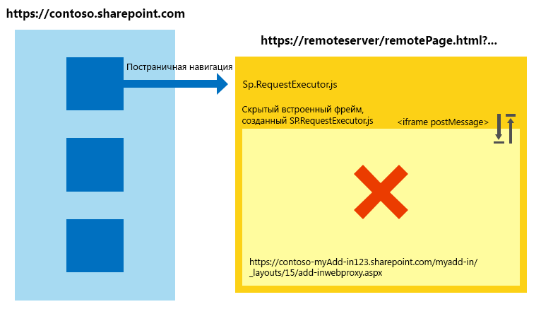
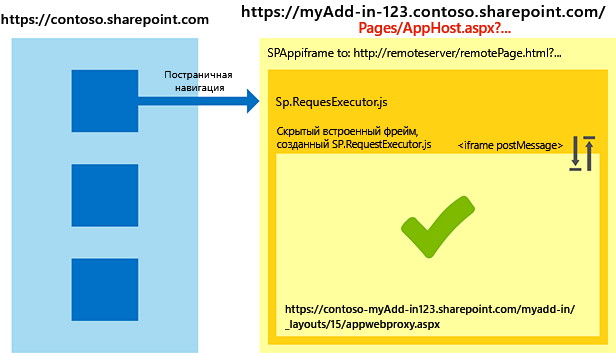

# <a name="work-with-the-cross-domain-library-across-different-internet-explorer-security-zones-in-sharepoint-add-ins"></a><span data-ttu-id="1531d-102">Работа с междоменной библиотекой в различных зонах безопасности Internet Explorer в надстройках SharePoint</span><span class="sxs-lookup"><span data-stu-id="1531d-102">Work with the cross-domain library across different Internet Explorer security zones in SharePoint Add-ins</span></span>
<span data-ttu-id="1531d-103">Узнайте, как использовать междоменную библиотеку в SharePoint, если страницы хост-сайта и надстройки находятся в разных зонах безопасности в Windows Internet Explorer.</span><span class="sxs-lookup"><span data-stu-id="1531d-103">Learn how to use the cross-domain library in SharePoint when the host web and add-in pages are in different security zones in Windows Internet Explorer.</span></span>
 

 <span data-ttu-id="1531d-p101">**Примечание.** В настоящее время идет процесс замены названия "приложения для SharePoint" названием "надстройки SharePoint". Во время этого процесса в документации и пользовательском интерфейсе некоторых продуктов SharePoint и средств Visual Studio может по-прежнему использоваться термин "приложения для SharePoint". Дополнительные сведения см. в статье [Новое название приложений для Office и SharePoint](new-name-for-apps-for-sharepoint.md#bk_newname).</span><span class="sxs-lookup"><span data-stu-id="1531d-p101">**Note**  The name "apps for SharePoint" is changing to "SharePoint Add-ins". During the transition, the documentation and the UI of some SharePoint products and Visual Studio tools might still use the term "apps for SharePoint". For details, see  [New name for apps for Office and SharePoint](new-name-for-apps-for-sharepoint.md#bk_newname).</span></span>
 

<span data-ttu-id="1531d-p102">Если вы используете междоменную библиотеку SharePoint для своих надстроек, вы должны иметь представление о том, как работают зоны безопасности в Internet Explorer. Если веб-сайт SharePoint и надстройка находятся в разных зонах, то могут возникнуть проблемы со связью между ними. В этой статье объясняется, что происходит при использовании междоменной библиотеки в разных зонах безопасности Internet Explorer.</span><span class="sxs-lookup"><span data-stu-id="1531d-p102">If you are using the SharePoint cross-domain library for your add-ins, you should be aware of how security zones work in Internet Explorer. Your add-in may encounter some communication issues if the SharePoint website and the add-in are in different zones. This article explains what happens when you use the cross-domain library in different Internet Explorer security zones.</span></span>
 

## <a name="cross-zone-scenarios-in-internet-explorer-using-the-sharepoint-cross-domain-library"></a><span data-ttu-id="1531d-110">Сценарии работы в нескольких зонах в Internet Explorer с помощью междоменной библиотеки SharePoint</span><span class="sxs-lookup"><span data-stu-id="1531d-110">Cross-zone scenarios in Internet Explorer using the SharePoint cross-domain library</span></span>
<span data-ttu-id="1531d-111"><a name="bk_crosszonescenarios"> </a></span><span class="sxs-lookup"><span data-stu-id="1531d-111"><a name="bk_crosszonescenarios"> </a></span></span>

<span data-ttu-id="1531d-p103">В целях обеспечения безопасности браузер Internet Explorer запрещает обмениваться файлами cookie страницам с разными уровнями целостности (также называемыми зонами безопасности), так как каждый уровень целостности имеет собственное хранилище файлов cookie. Уровень целостности определяется страницей верхнего уровня. Каждый фрейм на ней будет иметь один и тот же уровень целостности. Подробнее см. в записи блога  [Проблемы, связанные с обменом файлами cookie между разными зонами](http://blogs.msdn.com/b/ieinternals/archive/2011/03/10/internet-explorer-beware-cookie-sharing-in-cross-zone-scenarios.aspx).</span><span class="sxs-lookup"><span data-stu-id="1531d-p103">For security reasons, Internet Explorer prevents pages that are on different integrity levels (also known as security zones) to share cookies because each integrity level has its own cookie store. The integrity level of a page is determined by its top-most page, and any frame within that page will share the same integrity level. For more information, see  [Beware Cookie Sharing in Cross-Zone Scenarios](http://blogs.msdn.com/b/ieinternals/archive/2011/03/10/internet-explorer-beware-cookie-sharing-in-cross-zone-scenarios.aspx).</span></span>
 

 
<span data-ttu-id="1531d-p104">Междоменная библиотека SharePoint использует скрытый элемент **IFrame** и клиентскую прокси-страницу, размещенную в SharePoint, для обеспечения взаимодействия на стороне клиента с помощью JavaScript. Чтобы получить доступ к междоменной библиотеке, нужно сослаться на странице на файл sp.requestexecutor.js. Дополнительные сведения см. в статье [Доступ к данным SharePoint из надстроек с помощью междоменной библиотеки](access-sharepoint-data-from-add-ins-using-the-cross-domain-library.md).</span><span class="sxs-lookup"><span data-stu-id="1531d-p104">The SharePoint cross-domain library uses a hidden  **IFrame** and a client-side proxy page hosted on SharePoint to enable client-side communication using JavaScript. The cross-domain library is available when you reference the sp.requestexecutor.js file in your pages. For more information, see [Access SharePoint data from add-ins using the cross-domain library](access-sharepoint-data-from-add-ins-using-the-cross-domain-library.md).</span></span>
 

 
<span data-ttu-id="1531d-p105">Если страница удаленной надстройки и веб-сайт SharePoint находятся в разных зонах безопасности, отправка файлов cookie для авторизации невозможна. Если эти файлы отсутствуют, а элемент **IFrame** пытается загрузить прокси-страницу, то он перенаправляется на страницу входа SharePoint. Из соображений безопасности страница входа SharePoint не может содержаться в элементе **IFrame**. В такой ситуации библиотека не может загрузить прокси-страницу, а связь с SharePoint становится невозможна.</span><span class="sxs-lookup"><span data-stu-id="1531d-p105">When the remote add-in page and SharePoint website are in different security zones, the authorization cookies cannot be sent. If there are no authorization cookies, and the  **IFrame** tries to load the proxy page, it will be redirected to the SharePoint sign-in page. The SharePoint sign-in page cannot be contained in an **IFrame** for security reasons. In these scenarios, the library cannot load the proxy page, and communication with SharePoint is not possible.</span></span>
 

 
<span data-ttu-id="1531d-p106">На следующей схеме показан сценарий с разными зонами, в котором загрузка прокси-страницы невозможна. Страница верхнего уровня помещает фрейм в ту же зону безопасности, что и страницу  `http://remoteserver/remotepage.html`. Прокси-страница не загружается.</span><span class="sxs-lookup"><span data-stu-id="1531d-p106">The following diagram shows a cross-zone scenario in which the proxy page cannot be loaded. The top page puts the frame in the same security zone as  `http://remoteserver/remotepage.html`. The proxy page does not load.</span></span>
 

 

<span data-ttu-id="1531d-125">**Рис. 1. Сценарий с использованием несколько зон, в котором не удается загрузить прокси-страницу**</span><span class="sxs-lookup"><span data-stu-id="1531d-125">**Figure 1. Cross-zone scenario where the proxy page cannot be loaded**</span></span>

 

 

 
<span data-ttu-id="1531d-127">Ниже приведены некоторые примеры ситуаций, в которых междоменной библиотеке может не удасться загрузить прокси-страницу.</span><span class="sxs-lookup"><span data-stu-id="1531d-127">The following are some examples in which the cross-domain library may not be able to load the proxy page:</span></span>
 

 

 

- <span data-ttu-id="1531d-p107">Ваши клиенты используют SharePoint Online, а страница вашей удаленной надстройки размещена на сервере в интрасети. В такой ситуации с большой долей вероятности будут возникать проблемы с загрузкой прокси-страницы, так как URL-адрес SharePoint Online обычно не находится в зоне местной интрасети. Это весьма распространенный сценарий при начальной разработке надстройки, так как вы можете использовать IIS Express или другой локальный сервер для размещения страницы без реального интернет-домена.</span><span class="sxs-lookup"><span data-stu-id="1531d-p107">Your customers are using SharePoint Online, and your remote add-in page is hosted on an intranet server. This scenario is prone to the proxy page loading issue because the SharePoint Online URL is not usually in the Local intranet zone. This is a very common scenario during initial development of an add-in because you may be using IIS Express or another local server to host your page without a fully qualified internet domain.</span></span>
    
 
- <span data-ttu-id="1531d-131">Ваши клиенты используют локальное развертывание SharePoint с проверкой подлинности на основе форм, а ваша удаленная страница размещена в облачной службе (например, Microsoft Azure).</span><span class="sxs-lookup"><span data-stu-id="1531d-131">Your customers are using SharePoint on-premises with forms-based authentication, and your remote page is hosted on a cloud service (for example, Microsoft Azure).</span></span>
    
 

## <a name="handling-cross-zone-scenarios-in-sharepoint-add-ins"></a><span data-ttu-id="1531d-132">Обработка сценариев с использованием нескольких зон в надстройках SharePoint</span><span class="sxs-lookup"><span data-stu-id="1531d-132">Handling cross-zone scenarios in SharePoint Add-ins</span></span>
<span data-ttu-id="1531d-133"><a name="bk_handlingcrosszone"> </a></span><span class="sxs-lookup"><span data-stu-id="1531d-133"><a name="bk_handlingcrosszone"> </a></span></span>

<span data-ttu-id="1531d-134">Существует два способа устранить эту проблему: во время разработки (настоятельно рекомендуется) и во время выполнения надстройки.</span><span class="sxs-lookup"><span data-stu-id="1531d-134">There are a couple of ways to solve this problem during both add-in development (strongly recommended) and add-in run time.</span></span>
 

 

### <a name="best-practice-use-the-apphost-pattern"></a><span data-ttu-id="1531d-135">Рекомендация: использование шаблона apphost</span><span class="sxs-lookup"><span data-stu-id="1531d-135">Best practice: Use the apphost pattern</span></span>

<span data-ttu-id="1531d-p108">Чтобы устранить проблемы, связанные с взаимодействием между разными зонами, рекомендуем вам использовать страницу apphost в SharePoint. Страница apphost — это страница SharePoint, содержащая удаленную страницу в элементе **IFrame**. Все содержимое элемента **IFrame** на странице apphost находится в той же зоне безопасности, что и сайт надстройки. Междоменная библиотека на удаленной странице может получать файлы cookie для авторизации и успешно загружает прокси-страницу.</span><span class="sxs-lookup"><span data-stu-id="1531d-p108">To handle a cross-zone scenario, we recommend that you have an apphost page in SharePoint. The apphost page is a SharePoint page that contains the remote page in an **IFrame**. Everything inside the  **IFrame** in the apphost page exists in the same security zone as the add-in web. The cross-domain library in the remote page can receive the authorization cookies and loads the proxy page successfully.</span></span>
 

 
<span data-ttu-id="1531d-140">На приведенной ниже схеме показано взаимодействие между разными зонами, реализованное с помощью шаблона страницы apphost.</span><span class="sxs-lookup"><span data-stu-id="1531d-140">The following diagram shows a cross-zone scenario being handled by using the apphost page pattern.</span></span> 
 

 

<span data-ttu-id="1531d-141">**Рис. 2. Реализация взаимодействия между зонами с помощью шаблона страницы apphost**</span><span class="sxs-lookup"><span data-stu-id="1531d-141">**Figure 2. Cross-zone scenario handling by using the apphost page pattern**</span></span>

 

 

 
<span data-ttu-id="1531d-p109">Код, требуемый для страницы apphost, прост. Основной ее частью является элемент **SPAppIFrame**. Вам нужно сделать элемент **IFrame** невидимым с помощью CSS, чтобы он не мешал работе надстройки.</span><span class="sxs-lookup"><span data-stu-id="1531d-p109">The code required for the apphost page is simple. The main portion of the apphost page is an  **SPAppIFrame** element. You must use CSS to make the **IFrame** invisible so that it doesn't interfere with your add-in.</span></span>
 

 
<span data-ttu-id="1531d-p110">Приведенная ниже разметка представляет собой пример простой страницы apphost. В ней выполняются следующие задачи:</span><span class="sxs-lookup"><span data-stu-id="1531d-p110">The following markup is an example of a simple apphost page. The markup performs the following tasks:</span></span>
 

 

 

- <span data-ttu-id="1531d-148">объявляются директивы, необходимые при использовании компонентов SharePoint;</span><span class="sxs-lookup"><span data-stu-id="1531d-148">Declares directives needed when using SharePoint components.</span></span>
    
 
- <span data-ttu-id="1531d-149">объявляются стили, чтобы сделать элемент **IFrame** невидимы;</span><span class="sxs-lookup"><span data-stu-id="1531d-149">Declares styles to make the  **IFrame** invisible.</span></span>
    
 
- <span data-ttu-id="1531d-150">объявляется элемент **SPAppIFrame**, который связывается с начальной страницей надстройки;</span><span class="sxs-lookup"><span data-stu-id="1531d-150">Declares the  **SPAppIFrame** and sets the target to the add-in start page.</span></span>
    
 


```HTML
<%@ Page 
    Inherits="Microsoft.SharePoint.WebPartPages.WebPartPage, Microsoft.SharePoint, Version=15.0.0.0, Culture=neutral, PublicKeyToken=71e9bce111e9429c" 
    language="C#" %>
<%@ Register 
    Tagprefix="SharePoint" 
    Namespace="Microsoft.SharePoint.WebControls" 
    Assembly="Microsoft.SharePoint, Version=15.0.0.0, Culture=neutral, PublicKeyToken=71e9bce111e9429c" %>
<%@ Register 
    Tagprefix="Utilities" 
    Namespace="Microsoft.SharePoint.Utilities" 
    Assembly="Microsoft.SharePoint, Version=15.0.0.0, Culture=neutral, PublicKeyToken=71e9bce111e9429c" %>
<%@ Register 
    Tagprefix="WebPartPages" 
    Namespace="Microsoft.SharePoint.WebPartPages" 
    Assembly="Microsoft.SharePoint, Version=15.0.0.0, Culture=neutral, PublicKeyToken=71e9bce111e9429c" %>

<html>
<head>
    <title>Your add-in page title</title>
    <style type="text/css">
        html, body
        {
            overflow:hidden;
        }
        
        body
        {
            margin:0px;
            padding:0px;
        }
         
        iframe 
        {
            border:0px;
            height:100%;
            width:100%;
        }
    </style>
</head>

<body>
    <SharePoint:SPAppIFrame 
        runat="server" 
        src="~remoteAppUrl/StartPage.html?{StandardTokens}" 
        frameborder="0">
    </SharePoint:SPAppIFrame>
</body>
</html>
```

<span data-ttu-id="1531d-p111">Если вы хотите, чтобы пользователи могли переходить по прямым ссылкам к частям надстройки, этого можно добиться, реализовав взаимодействие между страницей apphost и содержимым элемента **IFrame**. Одним из вариантов является использование метода postMessage элемента **IFrame** и отдельных URL-адресов для каждой страницы удаленной надстройки. Чтобы реализовать отдельные URL-адреса для каждой страницы, вы можете создать отдельные страницы на сайте надстройки или использовать строковые параметры запроса на одной странице.</span><span class="sxs-lookup"><span data-stu-id="1531d-p111">If you want your users to deep link into portions of your add-in, your apphost page and the contents of the  **IFrame** can collaborate to make that possible. One alternative is to use **IFrame** post-message communication and individual URLs per page in the remote add-in. To have individual URLs per page, you can create individual pages in the add-in web or use query string parameters on one page.</span></span>
 

 

### <a name="alternative-approach-add-the-sites-to-the-same-security-zone-in-internet-explorer"></a><span data-ttu-id="1531d-154">Альтернативный подход: добавление сайтов в ту же зону безопасности в Internet Explorer</span><span class="sxs-lookup"><span data-stu-id="1531d-154">Alternative approach: Add the sites to the same security zone in Internet Explorer</span></span>

<span data-ttu-id="1531d-155">Если при разработке надстройки шаблон apphost не использовался, вы все же можете обеспечить его работу, добавив следующие домены в одну зону безопасности:</span><span class="sxs-lookup"><span data-stu-id="1531d-155">If an add-in was not designed following the apphost pattern, you can still allow it to work by adding the following domains into the same security zone:</span></span> 
 

 

- <span data-ttu-id="1531d-156">домен сайта SharePoint (например, `https://contoso.sharepoint.com`);</span><span class="sxs-lookup"><span data-stu-id="1531d-156">The domain of your SharePoint site (for example,  `https://contoso.sharepoint.com`).</span></span>
    
 
- <span data-ttu-id="1531d-157">домен надстройки, размещенной в облаке (`http://remoteserver`);</span><span class="sxs-lookup"><span data-stu-id="1531d-157">The domain of the cloud-hosted add-in ( `http://remoteserver`).</span></span>
    
 
- <span data-ttu-id="1531d-158">домен служб и страниц входа, размещенных в корпорации Майкрософт (`*.microsoftonline.com`).</span><span class="sxs-lookup"><span data-stu-id="1531d-158">The domain of Microsoft-hosted sign-in pages and services ( `*.microsoftonline.com`).</span></span>
    
 
<span data-ttu-id="1531d-159">С помощью политик Active Directory администраторы могут передавать изменения на все компьютеры в организации.</span><span class="sxs-lookup"><span data-stu-id="1531d-159">Administrators can use Active Directory policies to push changes to all computers in the organization.</span></span>
 

 

## <a name="security-implications-of-using-the-apphost-pattern"></a><span data-ttu-id="1531d-160">Влияние шаблона apphost на безопасность</span><span class="sxs-lookup"><span data-stu-id="1531d-160">Security implications of using the apphost pattern</span></span>
<span data-ttu-id="1531d-161"><a name="bk_securityimplications"> </a></span><span class="sxs-lookup"><span data-stu-id="1531d-161"><a name="bk_securityimplications"> </a></span></span>

<span data-ttu-id="1531d-p112">Важно заметить, что при использовании шаблона apphost удаленная страница, по сути, помещается в ту же зону безопасности, что и сайт надстройки. Вы должны понимать, какое влияние оказывает добавление сайта в зону на безопасность. Дополнительные сведения см. в статье  [Использование зон безопасности в Internet Explorer](http://support.microsoft.com/kb/174360).</span><span class="sxs-lookup"><span data-stu-id="1531d-p112">It is important to point out that the apphost pattern effectively puts your remote page in the same security zone as the add-in web. Make you sure you understand the implications of adding a site to a security zone. For more information, see  [How to use security zones in Internet Explorer](http://support.microsoft.com/kb/174360).</span></span>
 

 

## <a name="working-in-other-browsers-chrome-firefox-and-safari"></a><span data-ttu-id="1531d-165">Работа в других браузерах: Chrome, Firefox и Safari</span><span class="sxs-lookup"><span data-stu-id="1531d-165">Working in other browsers: Chrome, Firefox, and Safari</span></span>
<span data-ttu-id="1531d-166"><a name="bk_otherbrowsers"> </a></span><span class="sxs-lookup"><span data-stu-id="1531d-166"><a name="bk_otherbrowsers"> </a></span></span>

<span data-ttu-id="1531d-p113">В других браузерах, таких как Google Chrome, Mozilla Firefox и Apple Safari, зоны безопасности не реализованы. Если браузер не помещает файлы cookie в изолированные хранилища, возможно, при его использовании не будут возникать трудности, описанные в этой статье. Мы рекомендуем вам использовать шаблон apphost в своих надстройках, чтобы гарантировать их правильную работу как в Internet Explorer, так и в других названных браузерах вне зависимости от зоны безопасности, в которой находится SharePoint.</span><span class="sxs-lookup"><span data-stu-id="1531d-p113">Other browsers, such as Google Chrome, Mozilla Firefox, and Apple Safari, do not implement the concept of security zone. If a browser does not isolate the cookies in separated storage, it probably will not encounter the difficulties described in this article. We recommend that you follow the apphost pattern in your add-ins. Using the apphost pattern ensures that your add-in works in the mentioned browsers and Internet Explorer, regardless of which security zone SharePoint is in.</span></span>
 

 

## <a name="additional-resources"></a><span data-ttu-id="1531d-170">Дополнительные ресурсы</span><span class="sxs-lookup"><span data-stu-id="1531d-170">Additional resources</span></span>
<span data-ttu-id="1531d-171"><a name="bk_addresources"> </a></span><span class="sxs-lookup"><span data-stu-id="1531d-171"><a name="bk_addresources"> </a></span></span>


-  [<span data-ttu-id="1531d-172">Безопасный доступ к данным и клиентские объектные модели для надстроек SharePoint</span><span class="sxs-lookup"><span data-stu-id="1531d-172">Secure data access and client object models for SharePoint Add-ins</span></span>](secure-data-access-and-client-object-models-for-sharepoint-add-ins.md)
    
 
-  [<span data-ttu-id="1531d-173">Доступ к данным SharePoint из надстроек с помощью междоменной библиотеки</span><span class="sxs-lookup"><span data-stu-id="1531d-173">Access SharePoint data from add-ins using the cross-domain library</span></span>](access-sharepoint-data-from-add-ins-using-the-cross-domain-library.md)
    
 
-  [<span data-ttu-id="1531d-174">Надстройки SharePoint</span><span class="sxs-lookup"><span data-stu-id="1531d-174">SharePoint Add-ins</span></span>](sharepoint-add-ins.md)
    
 
-  [<span data-ttu-id="1531d-175">Авторизация и проверка подлинности для надстроек в SharePoint</span><span class="sxs-lookup"><span data-stu-id="1531d-175">Authorization and authentication of SharePoint Add-ins</span></span>](authorization-and-authentication-of-sharepoint-add-ins.md)
    
 
-  [<span data-ttu-id="1531d-176">Что следует рассмотреть, прежде чем приступать к разработке надстроек SharePoint</span><span class="sxs-lookup"><span data-stu-id="1531d-176">Three ways to think about design options for SharePoint Add-ins</span></span>](three-ways-to-think-about-design-options-for-sharepoint-add-ins.md)
    
 
-  [<span data-ttu-id="1531d-177">Важные аспекты разработки и архитектуры для надстроек SharePoint</span><span class="sxs-lookup"><span data-stu-id="1531d-177">Important aspects of the SharePoint Add-in architecture and development landscape</span></span>](important-aspects-of-the-sharepoint-add-in-architecture-and-development-landscap.md)
    
 
-  [<span data-ttu-id="1531d-178">Хост-сайты, сайты надстроек и компоненты SharePoint в SharePoint</span><span class="sxs-lookup"><span data-stu-id="1531d-178">Host webs, add-in webs, and SharePoint components in SharePoint</span></span>](host-webs-add-in-webs-and-sharepoint-components-in-sharepoint.md)
    
 
-  [<span data-ttu-id="1531d-179">Хранение данных в надстройках SharePoint</span><span class="sxs-lookup"><span data-stu-id="1531d-179">Data storage in SharePoint Add-ins</span></span>](important-aspects-of-the-sharepoint-add-in-architecture-and-development-landscap.md#Data)
    
 
-  [<span data-ttu-id="1531d-180">Создание настраиваемой страницы прокси для междоменной библиотеки в SharePoint</span><span class="sxs-lookup"><span data-stu-id="1531d-180">Create a custom proxy page for the cross-domain library in SharePoint</span></span>](create-a-custom-proxy-page-for-the-cross-domain-library-in-sharepoint.md)
    
 
-  [<span data-ttu-id="1531d-181">Междоменная безопасность на стороне клиента</span><span class="sxs-lookup"><span data-stu-id="1531d-181">Client-side Cross-domain Security</span></span>](http://msdn.microsoft.com/en-us/library/cc709423%28v=vs.85%29.aspx)
    
 

