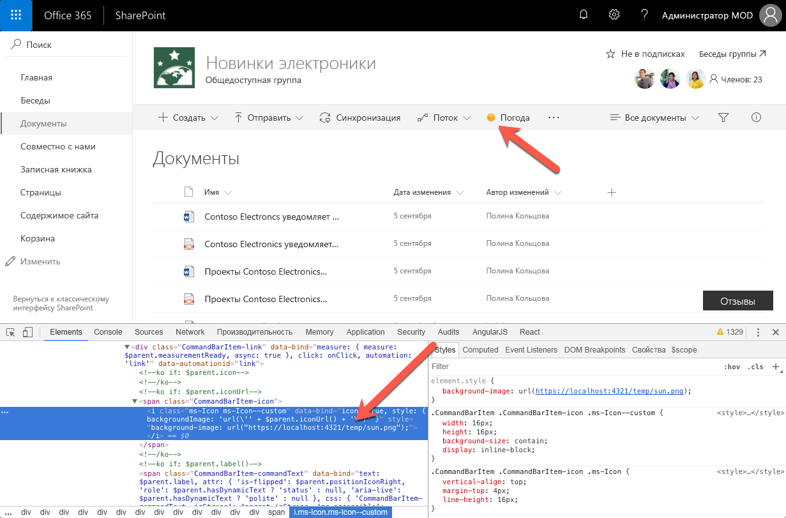
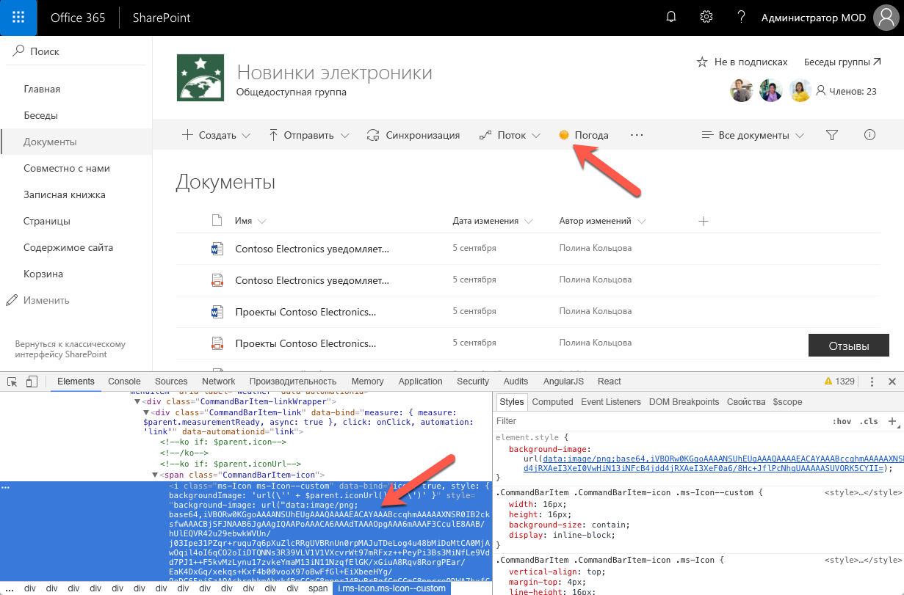

# <a name="configure-extension-icon"></a><span data-ttu-id="00f89-102">Настройка значка расширения</span><span class="sxs-lookup"><span data-stu-id="00f89-102">Configure extension icon</span></span>

<span data-ttu-id="00f89-103">Значок, иллюстрирующий назначение вашей пользовательской команды, поможет пользователям найти ее среди других вариантов на панели инструментов или в контекстном меню.</span><span class="sxs-lookup"><span data-stu-id="00f89-103">Selecting an icon that illustrates the purpose of your custom command, makes it easier for users to find your command among other options visible in the toolbar or in the context menu.</span></span> <span data-ttu-id="00f89-104">В этой статье описываются различные способы, которыми вы можете настраивать значки для своих команд.</span><span class="sxs-lookup"><span data-stu-id="00f89-104">This article explains the different options available to you to configure the icon for your commands.</span></span>

## <a name="extension-types-that-support-icons"></a><span data-ttu-id="00f89-105">Типы расширений, поддерживающие значки</span><span class="sxs-lookup"><span data-stu-id="00f89-105">Extension types that support icons</span></span>

<span data-ttu-id="00f89-106">SharePoint Framework поддерживает создание расширений следующих типов:</span><span class="sxs-lookup"><span data-stu-id="00f89-106">SharePoint Framework supports building the following types of extensions:</span></span>

- <span data-ttu-id="00f89-107">настройщик приложений;</span><span class="sxs-lookup"><span data-stu-id="00f89-107">Application customizer</span></span>
- <span data-ttu-id="00f89-108">настройщик полей;</span><span class="sxs-lookup"><span data-stu-id="00f89-108">Field Customizer</span></span>
- <span data-ttu-id="00f89-109">набор команд.</span><span class="sxs-lookup"><span data-stu-id="00f89-109">Command set</span></span>

<span data-ttu-id="00f89-110">Набор команд — единственный тип расширения SharePoint Framework, для которого можно настраивать значки.</span><span class="sxs-lookup"><span data-stu-id="00f89-110">Command set is the only type of SharePoint Framework extension for which you can configure icons.</span></span>

## <a name="defining-command-set-locations"></a><span data-ttu-id="00f89-111">Определение расположений наборов команд</span><span class="sxs-lookup"><span data-stu-id="00f89-111">Defining Command set locations</span></span>

<span data-ttu-id="00f89-112">При развертывании наборов команд можно выбрать, должны ли соответствующие команды отображаться на панели команд (`location: ClientSideExtension.ListViewCommandSet.CommandBar`), в контекстном меню (`location: ClientSideExtension.ListViewCommandSet.ContextMenu`) или в обоих местах (`location: ClientSideExtension.ListViewCommandSet`).</span><span class="sxs-lookup"><span data-stu-id="00f89-112">When deploying command sets, you can choose whether their commands should be visible on the command bar (`location: ClientSideExtension.ListViewCommandSet.CommandBar`), in the context menu (`location: ClientSideExtension.ListViewCommandSet.ContextMenu`) or both (`location: ClientSideExtension.ListViewCommandSet`).</span></span> <span data-ttu-id="00f89-113">Значки, определенные для разных команд, будут отображаться только на панели команд.</span><span class="sxs-lookup"><span data-stu-id="00f89-113">Icons defined for the different commands will be displayed only for commands displayed in the command bar.</span></span>

## <a name="configuring-command-set-icons"></a><span data-ttu-id="00f89-114">Настройка значков набора команд</span><span class="sxs-lookup"><span data-stu-id="00f89-114">Configuring command set icons</span></span>

<span data-ttu-id="00f89-115">В SharePoint Framework доступно два способа определения значков для расширений.</span><span class="sxs-lookup"><span data-stu-id="00f89-115">SharePoint Framework offers you two ways to define the icon for your extension.</span></span>

### <a name="using-an-external-icon-image"></a><span data-ttu-id="00f89-116">Использование внешнего изображения для значка</span><span class="sxs-lookup"><span data-stu-id="00f89-116">Using an external icon image</span></span>

<span data-ttu-id="00f89-117">При создании наборов команд SharePoint Framework вы можете задать значок для каждой команды, указав абсолютный URL-адрес, указывающий на изображение в манифесте расширения, с помощью свойства **iconImageUrl**.</span><span class="sxs-lookup"><span data-stu-id="00f89-117">When building SharePoint Framework command sets, you can specify an icon for each command by providing an absolute URL pointing to the icon image in the extension manifest, in the **iconImageUrl** property.</span></span>

```json
{
  "$schema": "https://dev.office.com/json-schemas/spfx/command-set-extension-manifest.schema.json",

  "id": "6cdfbff6-714f-4c26-a60c-0b18afe60837",
  "alias": "WeatherCommandSet",
  "componentType": "Extension",
  "extensionType": "ListViewCommandSet",

  // The "*" signifies that the version should be taken from the package.json
  "version": "*",
  "manifestVersion": 2,

  // If true, the component can only be installed on sites where Custom Script is allowed.
  // Components that allow authors to embed arbitrary script code should set this to true.
  // https://support.office.com/en-us/article/Turn-scripting-capabilities-on-or-off-1f2c515f-5d7e-448a-9fd7-835da935584f
  "requiresCustomScript": false,

  "items": {
    "WEATHER": {
      "title": { "default": "Weather" },
      "iconImageUrl": "https://localhost:4321/temp/sun.png",
      "type": "command"
    }
  }
}
```

<span data-ttu-id="00f89-118">Размер значка команды, отображаемого на панели команд, составляет 16x16 пикселей.</span><span class="sxs-lookup"><span data-stu-id="00f89-118">The command icon displayed in the command bar is 16x16px.</span></span> <span data-ttu-id="00f89-119">Если указано изображение большего размера, оно будет уменьшено до этого размера с сохранением пропорций.</span><span class="sxs-lookup"><span data-stu-id="00f89-119">If your image is bigger, it will be sized proportionally to match these dimensions.</span></span>



<span data-ttu-id="00f89-121">Использование пользовательских изображений обеспечивает широкие возможности выбора значка для команды, но при этом их требуется развертывать вместе с другими ресурсами расширения.</span><span class="sxs-lookup"><span data-stu-id="00f89-121">While using custom images gives you flexibility to choose an icon for your command, it requires you to deploy them along with your other extension assets.</span></span> <span data-ttu-id="00f89-122">Кроме того, качество изображения может снизиться при использовании высокого разрешения или некоторых специальных возможностей.</span><span class="sxs-lookup"><span data-stu-id="00f89-122">Additionally, your image might lose quality when displayed in higher DPI or specific accessibility settings.</span></span> <span data-ttu-id="00f89-123">Во избежание снижения качества можно использовать векторные изображения в формате SVG, которые также поддерживаются на платформе SharePoint Framework.</span><span class="sxs-lookup"><span data-stu-id="00f89-123">To avoid quality loss, you can use vector-based SVG images which are also supported by the SharePoint Framework.</span></span>

### <a name="using-a-base64-encoded-image"></a><span data-ttu-id="00f89-124">Использование изображения в кодировке base64</span><span class="sxs-lookup"><span data-stu-id="00f89-124">Using a base64 encoded image</span></span>

<span data-ttu-id="00f89-125">При использовании пользовательского изображения можно не указывать абсолютный URL-адрес файла изображения, размещенного вместе с другими ресурсами расширения, а закодировать изображение в формате base64 и использовать строку base64 вместо URL-адреса.</span><span class="sxs-lookup"><span data-stu-id="00f89-125">When using a custom image, rather than specifying an absolute URL to the image file hosted together with other extension assets, you can have your image base64 encoded and use the base64 string instead of the URL.</span></span>

> <span data-ttu-id="00f89-126">В Интернете доступен ряд служб, с помощью которых можно закодировать изображение в формате base64, например [https://www.base64-image.de](https://www.base64-image.de).</span><span class="sxs-lookup"><span data-stu-id="00f89-126">There are a number of services available on the Internet that you can use to base64 encode your image, such as [https://www.base64-image.de](https://www.base64-image.de).</span></span>

<span data-ttu-id="00f89-127">После кодирования изображения скопируйте строку base64 и используйте ее в качестве значения свойства **iconImageUrl** в манифесте веб-части.</span><span class="sxs-lookup"><span data-stu-id="00f89-127">After encoding the image, copy the base64 string and use it as the value for the **iconImageUrl** property in the web part manifest.</span></span>

```json
{
  "$schema": "https://dev.office.com/json-schemas/spfx/command-set-extension-manifest.schema.json",

  "id": "6cdfbff6-714f-4c26-a60c-0b18afe60837",
  "alias": "WeatherCommandSet",
  "componentType": "Extension",
  "extensionType": "ListViewCommandSet",

  // The "*" signifies that the version should be taken from the package.json
  "version": "*",
  "manifestVersion": 2,

  // If true, the component can only be installed on sites where Custom Script is allowed.
  // Components that allow authors to embed arbitrary script code should set this to true.
  // https://support.office.com/en-us/article/Turn-scripting-capabilities-on-or-off-1f2c515f-5d7e-448a-9fd7-835da935584f
  "requiresCustomScript": false,

  "items": {
    "WEATHER": {
      "title": { "default": "Weather" },
      "iconImageUrl": "data:image/png;base64,iVBORw0KGgoAAAANSUhEUgAAAQAAAAEACAYAAABccqhmAAAAAXNSR0IB2cksfwAAACBjSFJNAAB6JgAAgIQAAPoAAACA6AAAdTAAAOpgAAA6mAAAF3CculE8AAB/hUlEQVR42u29ebwkWVUn/j03Ipe31PZqr+ruqu7q6pXuZlcRRgUVBRnUn0rpMAJuTDeLog4u48bMiDoMtCA0MjAwOqil4oI6qCO2oIiDTQ...",
      "type": "command"
    }
  }
}
```



<span data-ttu-id="00f89-129">Кодировка base64 подходит как для растровых изображений (например, PNG-файлов), так и для векторных изображений в формате SVG.</span><span class="sxs-lookup"><span data-stu-id="00f89-129">Base64 encoding works both for bitmap images such as PNG as well as vector SVG images.</span></span> <span data-ttu-id="00f89-130">Значительное преимущество использования изображений в кодировке base64 заключается в том, что изображение значка веб-части необходимо развернуть отдельно.</span><span class="sxs-lookup"><span data-stu-id="00f89-130">The big benefit of using base64 encoded images is, that you don't need to deploy the web part icon image separately.</span></span>

## <a name="additional-considerations"></a><span data-ttu-id="00f89-131">Дополнительные сведения</span><span class="sxs-lookup"><span data-stu-id="00f89-131">Additional considerations</span></span>

<span data-ttu-id="00f89-132">Указывать значок для команды необязательно.</span><span class="sxs-lookup"><span data-stu-id="00f89-132">Specifying an icon for a command is optional.</span></span> <span data-ttu-id="00f89-133">Если значок не задан, на панели команд будет отображаться только заголовок команды.</span><span class="sxs-lookup"><span data-stu-id="00f89-133">If you don't specify an icon, then only the command title will be displayed in the command bar.</span></span>