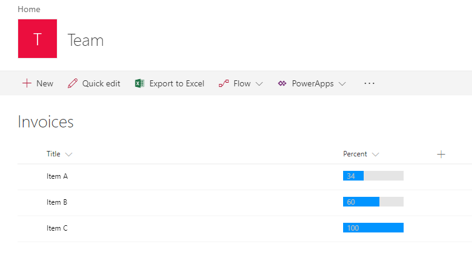

# <a name="build-your-first-field-customizer-extension"></a><span data-ttu-id="50470-101">Создание первого расширения для настройки полей</span><span class="sxs-lookup"><span data-stu-id="50470-101">Build your first Field Customizer extension</span></span>

<span data-ttu-id="50470-102">Расширения — это клиентские компоненты, которые запускаются в контексте страницы SharePoint.</span><span class="sxs-lookup"><span data-stu-id="50470-102">Extensions are client-side components that run inside the context of a SharePoint page.</span></span> <span data-ttu-id="50470-103">Расширения можно развертывать в SharePoint Online, а для их создания также можно использовать современные инструменты и библиотеки JavaScript.</span><span class="sxs-lookup"><span data-stu-id="50470-103">Extensions are client-side components that run inside the context of a SharePoint page. Extensions can be deployed to SharePoint Online and you can use modern JavaScript tools and libraries to build them.</span></span>

<span data-ttu-id="50470-104">В этой статье описано, как создать свое первое расширение для настройки полей.</span><span class="sxs-lookup"><span data-stu-id="50470-104">This article describes how to create your first Hello World SharePoint Framework Extension.</span></span> <span data-ttu-id="50470-105">Эти действия также показаны в видео на [канале SharePoint PnP в YouTube](https://www.youtube.com/watch?v=fijOzUmlXrY&list=PLR9nK3mnD-OXtWO5AIIr7nCR3sWutACpV).</span><span class="sxs-lookup"><span data-stu-id="50470-105">You can also follow these steps by watching the video on the [SharePoint PnP YouTube Channel](https://www.youtube.com/watch?v=fijOzUmlXrY&list=PLR9nK3mnD-OXtWO5AIIr7nCR3sWutACpV).</span></span> 

<a href="https://www.youtube.com/watch?v=4wgZy5tm4yo">

</a>

## <a name="create-an-extension-project"></a><span data-ttu-id="50470-106">Создание проекта расширения</span><span class="sxs-lookup"><span data-stu-id="50470-106">Create an extension project</span></span>

1. <span data-ttu-id="50470-107">Создайте каталог проекта в любом расположении.</span><span class="sxs-lookup"><span data-stu-id="50470-107">Create a new project directory in your favorite location.</span></span>
    
    ```
    md field-extension
    ```
    
2. <span data-ttu-id="50470-108">Перейдите к каталогу проекта.</span><span class="sxs-lookup"><span data-stu-id="50470-108">Go to the project directory.</span></span>
    
    ```
    cd field-extension
    ```
    
3. <span data-ttu-id="50470-109">Создайте расширение HelloWorld, запустив генератор Yeoman для SharePoint.</span><span class="sxs-lookup"><span data-stu-id="50470-109">Create a new HelloWorld extension by running the Yeoman SharePoint Generator.</span></span>
    
    ```
    yo @microsoft/sharepoint
    ```
    
4. <span data-ttu-id="50470-110">Когда появится запрос, выполните следующие действия:</span><span class="sxs-lookup"><span data-stu-id="50470-110">When prompted:</span></span>
    
    * <span data-ttu-id="50470-111">Оставьте значение по умолчанию **field-extension** для имени решения и нажмите клавишу ВВОД.</span><span class="sxs-lookup"><span data-stu-id="50470-111">Accept the default value of field-extension as your solution name and press Enter.</span></span>
    * <span data-ttu-id="50470-112">Выберите **Только SharePoint Online (новая версия)** и нажмите клавишу ВВОД.</span><span class="sxs-lookup"><span data-stu-id="50470-112">Select **SharePoint Online only (latest)**, and select Enter.</span></span>
    * <span data-ttu-id="50470-113">Выберите **Использовать текущую папку** и нажмите клавишу ВВОД.</span><span class="sxs-lookup"><span data-stu-id="50470-113">Choose Use the current folder and press Enter</span></span>
    * <span data-ttu-id="50470-114">Выберите **N**, чтобы сделать установку расширения обязательной на каждом сайте при его использовании.</span><span class="sxs-lookup"><span data-stu-id="50470-114">Choose **N** to require the extension to be installed on each site explicitly when it's being used.</span></span>
    * <span data-ttu-id="50470-115">Выберите **Расширение** в качестве типа создаваемого клиентского компонента.</span><span class="sxs-lookup"><span data-stu-id="50470-115">Choose **Extension (Preview)** as the client-side component type to be created.</span></span> 
    * <span data-ttu-id="50470-116">Выберите для создаваемого расширения тип **Настройщик полей**.</span><span class="sxs-lookup"><span data-stu-id="50470-116">Choose **Field Customizer (Preview)** as the extension type to be created.</span></span>
    
5. <span data-ttu-id="50470-117">Далее вам потребуется указать определенные сведения о расширении:</span><span class="sxs-lookup"><span data-stu-id="50470-117">The next set of prompts will ask for specific information about your extension:</span></span>
     
    * <span data-ttu-id="50470-118">Оставьте значение по умолчанию **HelloWorld** для имени решения и нажмите клавишу ВВОД.</span><span class="sxs-lookup"><span data-stu-id="50470-118">Accept the default value of HelloWorld as your extension name and press Enter.</span></span>
    * <span data-ttu-id="50470-119">Оставьте значение по умолчанию **Описание HelloWorld** для описания решения и нажмите клавишу ВВОД.</span><span class="sxs-lookup"><span data-stu-id="50470-119">Accept the default value of HelloWorld description as your extension description and press Enter.</span></span>
    * <span data-ttu-id="50470-120">Оставьте платформу по умолчанию **Не использовать платформу веб-решений на базе JavaScript** и нажмите клавишу ВВОД.</span><span class="sxs-lookup"><span data-stu-id="50470-120">Accept the default No JavaScript Framework as the framework selection and press Enter</span></span> 
    
    <br/>
    
    
    
    <span data-ttu-id="50470-122">После этого Yeoman установит необходимые зависимости и выполнит скаффолдинг файлов решения, а также расширения **HelloWorld**.</span><span class="sxs-lookup"><span data-stu-id="50470-122">At this point, Yeoman will install the required dependencies and scaffold the solution files along with the **HelloWorld** extension. This might take a few minutes.</span></span> <span data-ttu-id="50470-123">Это может занять несколько минут.</span><span class="sxs-lookup"><span data-stu-id="50470-123">This might take a few minutes.</span></span> 
    
    <span data-ttu-id="50470-124">Когда скаффолдинг успешно закончится, появится следующее сообщение:</span><span class="sxs-lookup"><span data-stu-id="50470-124">When the scaffold is complete, you should see the following message indicating a successful scaffold:</span></span>
    
    
    
    <span data-ttu-id="50470-126">Сведения об устранении неполадок см. в статье [Известные проблемы](../../known-issues-and-common-questions.md).</span><span class="sxs-lookup"><span data-stu-id="50470-126">For information about troubleshooting any errors, see [Known issues](../../known-issues-and-common-questions.md).</span></span>

6. <span data-ttu-id="50470-127">После завершения скаффолдинга заблокируйте версию зависимостей проекта, выполнив следующую команду:</span><span class="sxs-lookup"><span data-stu-id="50470-127">After the scaffolding completes, lock down the version of the project dependencies by running the following command:</span></span>

    ```sh
    npm shrinkwrap
    ```
    
7. <span data-ttu-id="50470-128">Введите в консоли приведенную ниже команду, чтобы запустить Visual Studio Code.</span><span class="sxs-lookup"><span data-stu-id="50470-128">Once solution scaffolding is completed, type the following into the console to start Visual Studio Code.</span></span>
    
    ```
    code .
    ```
    
    > <span data-ttu-id="50470-129">**Примечание.** Клиентское решение SharePoint создано с помощью HTML и TypeScript, поэтому для разработки расширения можно использовать любой редактор кода, который поддерживает клиентское программирование.</span><span class="sxs-lookup"><span data-stu-id="50470-129">**Note:** Because the SharePoint client-side solution is HTML/TypeScript based, you can use any code editor that supports client-side development to build your extension.</span></span>

    <span data-ttu-id="50470-130">Обратите внимание на то, что структура решения выглядит как структура решения клиентских веб-частей структуры.</span><span class="sxs-lookup"><span data-stu-id="50470-130">Note how the default solution structure looks like the solution structure of client-side web parts.</span></span> <span data-ttu-id="50470-131">Это основная структура решения среды SharePoint, ее параметры конфигурации схожи для всех типов решений.</span><span class="sxs-lookup"><span data-stu-id="50470-131">Notice how the default solution structure looks like the solution structure for client-side web parts. This is the basic SharePoint Framework solution structure, with similar configuration options across all solution types.</span></span>

    

8. <span data-ttu-id="50470-133">Откройте файл **HelloWorldFieldCustomizer.manifest.json** в папке **src\extensions\helloWorld**.</span><span class="sxs-lookup"><span data-stu-id="50470-133">Open **HelloWorldFieldCustomizer.manifest.json** at the **src\extensions\helloWorld** folder.</span></span>

    <span data-ttu-id="50470-134">Этот файл определяет тип расширения и уникальный идентификатор `id` для расширения.</span><span class="sxs-lookup"><span data-stu-id="50470-134">This file defines your extension type and a unique identifier for your extension. You’ll need this ID later when you debug and deploy your extension to SharePoint.</span></span> <span data-ttu-id="50470-135">Этот идентификатор пригодится позже при отладке и развертывании расширения в SharePoint.</span><span class="sxs-lookup"><span data-stu-id="50470-135">This file defines your extension type and a unique identifier “id” for your extension. You’ll need this unique identifier later when debugging and deploying your extension to SharePoint.</span></span>

    

## <a name="code-your-field-customizer"></a><span data-ttu-id="50470-137">Написание кода настройщика полей</span><span class="sxs-lookup"><span data-stu-id="50470-137">Coding your Field Customizer</span></span> 

<span data-ttu-id="50470-138">Откройте файл **HelloWorldFieldCustomizer.ts** в папке **src\extensions\helloWorld**.</span><span class="sxs-lookup"><span data-stu-id="50470-138">Open the **HelloWorldFieldCustomizer.ts** file in the **src\extensions\helloWorld** folder.</span></span>

<span data-ttu-id="50470-139">Обратите внимание, что базовый класс для настройщика полей импортируется из пакета **sp-listview-extensibility**, который содержит код платформы SharePoint Framework, необходимый для настройщика полей.</span><span class="sxs-lookup"><span data-stu-id="50470-139">Notice that the base class for the Field Customizer is imported from the **sp-application-base** package, which contains SharePoint framework code required by the Field Customizer.</span></span>

```ts
import { Log } from '@microsoft/sp-core-library';
import { override } from '@microsoft/decorators';
import {
  BaseFieldCustomizer,
  IFieldCustomizerCellEventParameters
} from '@microsoft/sp-listview-extensibility';
```

<span data-ttu-id="50470-140">Логика настройщика полей содержится в методах **OnInit()**, **onRenderCell()** и **onDisposeCell()**.</span><span class="sxs-lookup"><span data-stu-id="50470-140">The logic for your Field Customizer is contained in the **OnInit()**, **onRenderCell()**, and **onDisposeCell()** methods.</span></span>

* <span data-ttu-id="50470-p106">В методе **onInit()** выполняется вся настройка, необходимая для расширения. Это событие происходит после назначения `this.context` и `this.properties`, но до того, как модель DOM будет готова. Как и в случае с веб-частями, `onInit()` возвращает обещание, с помощью которого можно выполнять асинхронные операции. `onRenderCell()` не будет вызываться, пока обещание не будет разрешено. Если вам это не нужно, просто верните `Promise.resolve<void>();`.</span><span class="sxs-lookup"><span data-stu-id="50470-p106">**onInit()** is where you should perform any setup needed for your extension. This event occurs after `this.context` and `this.properties` are assigned, but before the page DOM is ready. As with web parts, `onInit()` returns a promise that you can use to perform asynchronous operations; `onRenderCell()` will not be called until your promise has resolved. If you don’t need that, simply return `Promise.resolve<void>();`.</span></span>
* <span data-ttu-id="50470-145">**onRenderCell()** происходит при отображении каждой ячейки.</span><span class="sxs-lookup"><span data-stu-id="50470-145">**onRenderCell()** occurs when each cell is rendered.</span></span> <span data-ttu-id="50470-146">Он предоставляет `event.domElement` HTML-элемент, где код может записать его содержимое.</span><span class="sxs-lookup"><span data-stu-id="50470-146">onRenderCell():  This event occurs when each cell is rendered. It provides an `event.domElement` HTML element where your code can write its content.</span></span>
* <span data-ttu-id="50470-147">**onDisposeCell()** происходит непосредственно удалением `event.cellDiv`.</span><span class="sxs-lookup"><span data-stu-id="50470-147">**onDisposeCell()** occurs immediately before the `event.cellDiv` is deleted.</span></span> <span data-ttu-id="50470-148">Его можно использовать для освобождения ресурсов, которые были выделены во время отображения поля.</span><span class="sxs-lookup"><span data-stu-id="50470-148">It can be used to free any resources that were allocated during field rendering.</span></span> <span data-ttu-id="50470-149">Например, если подключить `onRenderCell()` к элементу Reach, для его освобождения необходимо использовать `onDisposeCell()`, в противном случае произойдет утечка ресурсов.</span><span class="sxs-lookup"><span data-stu-id="50470-149">onDisposeCell(): This event occurs immediately before the  is deleted. It can be used to free any resources that were allocated during field rendering. For example, if `onRenderCell()` mounted a React element, `onDisposeCell()` must be used to free it, otherwise a resource leak would occur.</span></span> 

<span data-ttu-id="50470-150">Ниже представлено содержимое методов **onRenderCell()** и **onDisposeCell()** в решении по умолчанию.</span><span class="sxs-lookup"><span data-stu-id="50470-150">Below are the contents of **onRenderCell()** and **onDisposeCell()** in the default solution:</span></span>

```ts
@override
  public onRenderCell(event: IFieldCustomizerCellEventParameters): void {
    // Use this method to perform your custom cell rendering.
    const text: string = `${this.properties.sampleText}: ${event.fieldValue}`;

    event.domElement.innerText = text;

    event.domElement.classList.add(styles.cell);
  }

  @override
  public onDisposeCell(event: IFieldCustomizerCellEventParameters): void {
    // This method should be used to free any resources that were allocated during rendering.
    // For example, if your onRenderCell() called ReactDOM.render(), then you should
    // call ReactDOM.unmountComponentAtNode() here.
    super.onDisposeCell(event);
  }
```

## <a name="debug-your-field-customizer-using-gulp-serve-and-query-string-parameters"></a><span data-ttu-id="50470-151">Отладка настройщика полей с помощью gulp serve и параметров строки запроса</span><span class="sxs-lookup"><span data-stu-id="50470-151">Debug your Application Customizer using gulp serve and query string parameters</span></span>
<span data-ttu-id="50470-152">В настоящее время использование локального рабочего места для проверки расширений SharePoint Framework невозможно.</span><span class="sxs-lookup"><span data-stu-id="50470-152">You cannot current use the local workbench to test SharePoint Framework Extensions.</span></span> <span data-ttu-id="50470-153">Их необходимо проверить и разрабатывать с помощью действующего сайта SharePoint Online.</span><span class="sxs-lookup"><span data-stu-id="50470-153">You'll need to test them  against a live SharePoint Online site.</span></span> <span data-ttu-id="50470-154">Для этого вам не нужно развертывать модификацию каталога приложений, что делает процесс отладки простым и эффективным.</span><span class="sxs-lookup"><span data-stu-id="50470-154">You don't have to deploy your customization to the app catalog to do this, which makes the debugging experience simple and efficient.</span></span>

1. <span data-ttu-id="50470-155">Для начала скомпилируйте код и разместите скомпилированные файлы с локального компьютера, выполнив следующую команду:</span><span class="sxs-lookup"><span data-stu-id="50470-155">First, compile your code and host the compiled files from the local machine by running this command:</span></span>
    
    ```
    gulp serve --nobrowser
    ```
    
    <span data-ttu-id="50470-156">Так как запускать локальное рабочее место не требуется (в настоящее время невозможно выполнять отладку расширений локально), используется параметр `--nobrowser`.</span><span class="sxs-lookup"><span data-stu-id="50470-156">You use the `--nobrowser` option because you don't need to launch the local workbench, since you can't debug extensions locally.</span></span>

    <span data-ttu-id="50470-157">Когда компиляция кода завершится без ошибок, полученный манифест будет доступен по адресу http://localhost:4321.</span><span class="sxs-lookup"><span data-stu-id="50470-157">When the code compiles without errors, it will serve the resulting manifest from http://localhost:4321.</span></span>

    

2. <span data-ttu-id="50470-159">Для тестирования расширения перейдите к сайту в клиенте SharePoint Online.</span><span class="sxs-lookup"><span data-stu-id="50470-159">To test your extension, go to a site in your SharePoint Online developer tenant.</span></span>

3. <span data-ttu-id="50470-160">Откройте страницу **Содержимое сайта**.</span><span class="sxs-lookup"><span data-stu-id="50470-160">Move to the **Site Contents** page.</span></span>

4. <span data-ttu-id="50470-161">На панели инструментов выберите **Создать**, а затем выберите **Список**.</span><span class="sxs-lookup"><span data-stu-id="50470-161">On the toolbar, select **New**, and then select **List**.</span></span>
    
    
    
5. <span data-ttu-id="50470-163">Создайте список под названием **Заказы** и нажмите кнопку **Создать**.</span><span class="sxs-lookup"><span data-stu-id="50470-163">Create a new list named **Orders** and click **Create**:</span></span>
    
    
    
6. <span data-ttu-id="50470-165">Нажмите значок **плюс** и выберите **Число**, чтобы создать числовое поле для списка.</span><span class="sxs-lookup"><span data-stu-id="50470-165">Click the **plus** sign and choose **Number** to create a new Number field for the list:</span></span>
    
    
    
7. <span data-ttu-id="50470-167">Для имени поля выберите **Процент**, а затем выберите **Сохранить**.</span><span class="sxs-lookup"><span data-stu-id="50470-167">Set name of the field to **Percent** and click **Save**:</span></span>
    
    
    
8. <span data-ttu-id="50470-p110">Добавьте несколько элементов с различными числами в процентное поле. Позже мы изменим отрисовку, чтобы разные числа отображались по-разному в соответствии с вашей реализацией.</span><span class="sxs-lookup"><span data-stu-id="50470-p110">Add a few items with different numbers in the percent field. We'll modify the rendering later in this tutorial, so the different numbers will be presented differently based on your custom implementation.</span></span>

    

    <span data-ttu-id="50470-172">Так как настройщик полей размещается в localhost и запущен, доступны определенные параметры запроса отладки для выполнения кода в новом списке.</span><span class="sxs-lookup"><span data-stu-id="50470-172">Since our Field Customizer is still hosted in localhost and is running, we can use specific debug query parameters to execute the code in the newly created list.</span></span>

9. <span data-ttu-id="50470-173">Добавьте в URL-адрес приведенные ниже параметры строки запроса.</span><span class="sxs-lookup"><span data-stu-id="50470-173">Choose the CustomActionTarget page. Append the following query string parameters to the URL:</span></span> <span data-ttu-id="50470-174">Обратите внимание, что вам потребуется обновить идентификатор в соответствии с идентификатором расширения, указанным в файле **HelloWorldFieldCustomizer.manifest.json**.</span><span class="sxs-lookup"><span data-stu-id="50470-174">Append the following query string parameters to the URL. Notice that you will need to update the id to match your own extension identifier available from the **HelloWorldFieldCustomizer.manifest.json** file:</span></span> <span data-ttu-id="50470-175">Дополнительные сведения см. в статье [подробные сведения о URL-адрес запроса параметров](#more-details-about-the-url-query-parameters).</span><span class="sxs-lookup"><span data-stu-id="50470-175">For more information, see [More details about the URL query parameters](#more-details-about-the-url-query-parameters).</span></span> 

    ```
    ?loadSPFX=true&debugManifestsFile=https://localhost:4321/temp/manifests.js&fieldCustomizers={"Percent":{"id":"45a1d299-990d-4917-ba62-7cb67158be16","properties":{"sampleText":"Hello!"}}}
    ```
    
    <br/>

    <span data-ttu-id="50470-176">Полный URL-адрес должен выглядеть примерно так, как показано ниже, но соответствовать URL-адресу и расположению нового списка:</span><span class="sxs-lookup"><span data-stu-id="50470-176">The full URL should look similar to the following, depending on your tenant URL and the location of the newly created list:</span></span>
    
    <br/>
    
    ```
    contoso.sharepoint.com/Lists/Orders/AllItems.aspx?loadSPFX=true&debugManifestsFile=https://localhost:4321/temp/manifests.js&fieldCustomizers={"Percent":{"id":"45a1d299-990d-4917-ba62-7cb67158be16","properties":{"sampleText":"Hello!"}}}
    ```
    
10. <span data-ttu-id="50470-177">Согласитесь на загрузку манифестов отладки, нажав кнопку **Загрузить скрипты отладки** при появлении соответствующего запроса.</span><span class="sxs-lookup"><span data-stu-id="50470-177">Accept the loading of Debug Manifests, by clicking **Load debug scripts** when prompted:</span></span>

    

    <span data-ttu-id="50470-179">Обратите внимание, что значения процентов теперь отображаются с дополнительной строкой префикса как `Hello!: `, которая указана как свойство для настройщика полей.</span><span class="sxs-lookup"><span data-stu-id="50470-179">Notice how the Percent values are now presented with an additional prefix string as `Hello!: `, which is provided as a property for the Field Customizer.</span></span>

    


### <a name="more-details-about-the-url-query-parameters"></a><span data-ttu-id="50470-181">Подробнее о параметрах запроса URL</span><span class="sxs-lookup"><span data-stu-id="50470-181">More detail about the URL query parameters:</span></span>

- <span data-ttu-id="50470-182">**loadSPFX=true** гарантирует загрузку SharePoint Framework на странице.</span><span class="sxs-lookup"><span data-stu-id="50470-182">**loadSPFX=true** ensures that the SharePoint Framework is loaded on the page.</span></span> <span data-ttu-id="50470-183">Из соображений производительности платформа обычно загружается, только если зарегистрировано хотя бы одно расширение.</span><span class="sxs-lookup"><span data-stu-id="50470-183">For performance reasons, the framework is not normally loaded unless at least one extension is registered.</span></span> <span data-ttu-id="50470-184">Так как компоненты еще не зарегистрированы, платформу нужно загрузить напрямую.</span><span class="sxs-lookup"><span data-stu-id="50470-184">Because no components are registered yet, we must explicitly load the framework.</span></span>
- <span data-ttu-id="50470-185">**debugManifestsFile** указывает, что нужно загрузить компоненты SPFx, предоставляемые локально.</span><span class="sxs-lookup"><span data-stu-id="50470-185">**debugManifestsFile** specifies that you want to load SPFx components that are locally served.</span></span> <span data-ttu-id="50470-186">Загрузчик ищет компоненты только в каталоге приложений (для развернутого решения) и на сервере манифестов SharePoint (для системных библиотек).</span><span class="sxs-lookup"><span data-stu-id="50470-186">debugManifestsFile - Specifies that you want to load SPFx components that are locally served. The loader only looks for components in the App Catalog (for your deployed solution) and the SharePoint manifest server (for the system libraries).</span></span>
- <span data-ttu-id="50470-187">**fieldCustomizers** указывает поля в списке, отображение которых управляется настройщиком полей.</span><span class="sxs-lookup"><span data-stu-id="50470-187">**fieldCustomizers** indicates which fields in your list should have their rendering controlled by the Field Customizer.</span></span> <span data-ttu-id="50470-188">Параметр ID задает GUID расширения, который будет использоваться для управления отображением поля.</span><span class="sxs-lookup"><span data-stu-id="50470-188">The ID parameter specifies the GUID of the extension that should be used to control the rendering of the field.</span></span> <span data-ttu-id="50470-189">Параметр properties — это необязательным текстовая строка, содержащая объект JSON, который будет десериализован в `this.properties` для расширения.</span><span class="sxs-lookup"><span data-stu-id="50470-189">The properties parameter is an optional text string containing a JSON object that will be deserialized into `this.properties` for your extension.</span></span>
    - <span data-ttu-id="50470-190">**Key:** в качестве ключа используйте внутреннее имя поля.</span><span class="sxs-lookup"><span data-stu-id="50470-190">**Key:** use the internal name of the field as the key</span></span>
    - <span data-ttu-id="50470-191">**Id:** GUID расширения для настройки полей, связанный с этим полем.</span><span class="sxs-lookup"><span data-stu-id="50470-191">**Id:** the guid of the field customizer extension associated with this field</span></span>
    - <span data-ttu-id="50470-192">**Properties:** значения свойств, определенные в расширении.</span><span class="sxs-lookup"><span data-stu-id="50470-192">**Properties**: The property values defined in the extension.</span></span> <span data-ttu-id="50470-193">В этом примере `sampleText` является свойством, определенным с помощью расширения.</span><span class="sxs-lookup"><span data-stu-id="50470-193">Properties: property values defined in the extension. In this example, ‘sampleText’`sampleText` is a property defined by the extension</span></span>

<br/>

## <a name="enhance-the-field-customizer-rendering"></a><span data-ttu-id="50470-194">Улучшение отображения настройщика полей</span><span class="sxs-lookup"><span data-stu-id="50470-194">Enhancing the Field Customizer rendering</span></span>
<span data-ttu-id="50470-195">Теперь, когда мы успешно протестировали встроенную отправную точку для создания настройщика полей, пришло время немного изменить логику для более аккуратной отрисовки значения поля.</span><span class="sxs-lookup"><span data-stu-id="50470-195">Now that we have successfully tested the out of the box starting point of the Field Customizer, let's modify the logic slightly to have a more polished rendering of the field value.</span></span> 

1. <span data-ttu-id="50470-196">Откройте файл **HelloWorld.module.scss** в папке **src\extensions\helloWorld** и измените определение стиля, как показано ниже.</span><span class="sxs-lookup"><span data-stu-id="50470-196">Open the **HelloWorld.module.scss** file in the **src\extensions\helloWorld** folder and update the styling definition as follows.</span></span>

    ```
    .HelloWorld {
      .cell {
        display: 'inline-block';
      }
      .full {
        background-color: '#e5e5e5';
        width: '100px';
      }
    }

    ```
    
2. <span data-ttu-id="50470-197">Откройте файл **HelloWorldFieldCustomizer.ts** в папке **src\extensions\helloWorld** и измените метод **onRednerCell**, как показано ниже.</span><span class="sxs-lookup"><span data-stu-id="50470-197">Open the **HelloWorldFieldCustomizer.ts** file in the **src\extensions\helloWorld** folder and update the **onRednerCell** method as follows.</span></span>

    ```ts
        @override
        public onRenderCell(event: IFieldCustomizerCellEventParameters): void {

            event.domElement.classList.add(styles.cell);
            event.domElement.innerHTML = `
                    <div class='${styles.HelloWorld}'>
                        <div class='${styles.full}'>
                        <div style='width: ${event.fieldValue}px; background:#0094ff; color:#c0c0c0'>
                            &nbsp; ${event.fieldValue}
                        </div>
                        </div>
                    </div>`;
        }
    ```

3. <span data-ttu-id="50470-198">В окне консоли не должно быть исключений.</span><span class="sxs-lookup"><span data-stu-id="50470-198">In your console window, ensure that you do not have any exceptions.</span></span> <span data-ttu-id="50470-199">Если в *localhost* нет запущенного решения, выполните следующую команду:</span><span class="sxs-lookup"><span data-stu-id="50470-199">Switch back to your console window and ensure that you do not have any exceptions. If you do not have the solution running in *localhost*, execute the following command:</span></span>

    ```
    gulp serve --nobrowser
    ```

4. <span data-ttu-id="50470-200">Вернитесь к созданному ранее списку и используйте тот же параметр запроса, что и раньше, с полем `Percent` и `ID`, замененным на идентификатор расширения, который указан в файле **HelloWorldFieldCustomizer.manifest.json**.</span><span class="sxs-lookup"><span data-stu-id="50470-200">Move back to your previously created list and use the same query parameter as used previously with the Field being 'Percent' and the Id being updated to your extension identifier available from the HelloWorldFieldCustomizer.manifest.json file.</span></span>

5. <span data-ttu-id="50470-201">Согласитесь на загрузку манифестов отладки, нажав кнопку **Загрузить скрипты отладки** при появлении соответствующего запроса.</span><span class="sxs-lookup"><span data-stu-id="50470-201">Accept the loading of Debug Manifests, by clicking **Load debug scripts** when prompted.</span></span>

    

    <span data-ttu-id="50470-203">Обратите внимание на то, как мы изменили стиль отображения поля, полностью.</span><span class="sxs-lookup"><span data-stu-id="50470-203">Note how we changed the field rendering style completely.</span></span> <span data-ttu-id="50470-204">Значение поля обозначается с помощью графического представления значения.</span><span class="sxs-lookup"><span data-stu-id="50470-204">Notice how we have changed the field rendering style completely. The field value is indicated using a graphical representation of the value.</span></span>

    

## <a name="add-the-field-definition-to-the-solution-package-for-deployment"></a><span data-ttu-id="50470-206">Добавление определения поля в пакет решения для развертывания</span><span class="sxs-lookup"><span data-stu-id="50470-206">Add the field definition to the solution package for deployment</span></span>
<span data-ttu-id="50470-207">Надлежащим образом протестировав решение в режиме отладки, можно упаковать его для автоматического развертывания в составе пакета решения, развертываемого на сайтах.</span><span class="sxs-lookup"><span data-stu-id="50470-207">Now that we have tested our solution properly in debug mode, we can package this to be deployed automatically as part of the solution package deployed to the sites. There are few things to take care of here.</span></span> 

1. <span data-ttu-id="50470-208">Установите пакет решения на нужном сайте, чтобы манифест расширения попал в список разрешенных для запуска.</span><span class="sxs-lookup"><span data-stu-id="50470-208">Install the solution package to the site where it should be installed, so that the extension manifest is being white listed for execution</span></span>

2. <span data-ttu-id="50470-209">Связывание настройщика поля с существующим поле на сайте.</span><span class="sxs-lookup"><span data-stu-id="50470-209">Associate the Field Customizer to an existing field in the site.</span></span> <span data-ttu-id="50470-210">Это можно сделать путем программирования (CSOM/REST) или с помощью функции платформы внутри пакета решения SharePoint Framework.</span><span class="sxs-lookup"><span data-stu-id="50470-210">You can do this programmatically (CSOM/REST) or by using the feature framework inside of the SharePoint Framework solution package.</span></span> <span data-ttu-id="50470-211">Вам нужно связать следующие свойства в объекте `SPField` на уровне сайта или списка.</span><span class="sxs-lookup"><span data-stu-id="50470-211">You'll need to associate the following properties in the `SPField` object at the site or list level.</span></span>
    - <span data-ttu-id="50470-212">**ClientSiteComponentId:** идентификатор (GUID) настройщика приложений, установленный в каталоге приложений.</span><span class="sxs-lookup"><span data-stu-id="50470-212">**ClientSiteComponentId:** This is the identifier (GUID) of the Field Customizer, which has been installed in the app catalog.</span></span>
    - <span data-ttu-id="50470-213">**ClientSideComponentProperties:** необязательный параметр, с помощью которого можно предоставлять свойства для экземпляра настройщика полей.</span><span class="sxs-lookup"><span data-stu-id="50470-213">**ClientSideComponentProperties:** This is an optional parameter, which can be used to provide properties for the Field Customizer instance.</span></span>

    <span data-ttu-id="50470-214">Обратите внимание, что вы можете задать требования для добавления на сайт решения, содержащего расширение, с помощью параметра `skipFeatureDeployment` в **package-solution.json**.</span><span class="sxs-lookup"><span data-stu-id="50470-214">Note that you can control the requirement to add a solution containing your extension to the site by using the `skipFeatureDeployment` setting in **package-solution.json**.</span></span> <span data-ttu-id="50470-215">Хотя вы можете и не требовать установки решения на сайте, необходимо связать **ClientSideComponentId** с отдельными объектами, чтобы расширение было видимым.</span><span class="sxs-lookup"><span data-stu-id="50470-215">Notice, you can control the requirement to add a solution containing your extension to the site by using  setting in package-solution.json. Event though you would not require solution to be installed on the site, you'd need to associate **ClientSideComponentId** to specific objects for the extension to be visible.</span></span>

    <span data-ttu-id="50470-216">На следующих этапах мы просмотрим автоматически созданное определение поля по умолчанию, которое будет использоваться при автоматическом развертывании необходимых конфигураций при установке пакета решения на сайте.</span><span class="sxs-lookup"><span data-stu-id="50470-216">In the following steps, we'll review the default field definition, which was automatically created and will then be used to automatically deploy needed configurations when the solution package is installed on a site.</span></span>

3. <span data-ttu-id="50470-217">Вернитесь к решению в Visual Studio Code (или другом редакторе, который вы используете).</span><span class="sxs-lookup"><span data-stu-id="50470-217">Return to your solution in Visual Studio Code (or to your preferred editor).</span></span>

4. <span data-ttu-id="50470-218">Разверните папку **sharepoint** и вложенную папку **assets** в корне решения для просмотра существующего файла **elements.xml**.</span><span class="sxs-lookup"><span data-stu-id="50470-218">Extend the **sharepoint** folder and **assets** subfolder in the root of the solution to see the existing **elements.xml** file.</span></span> 
    
    

<br/>

### <a name="review-the-elementsxml-file"></a><span data-ttu-id="50470-220">Просмотр файла elements.xml</span><span class="sxs-lookup"><span data-stu-id="50470-220">Review the elements.xml file</span></span> 

<span data-ttu-id="50470-221">Откройте файл **elements.xml** в папке **sharepoint\assets**.</span><span class="sxs-lookup"><span data-stu-id="50470-221">Open the **elements.xml** file inside the **sharepoint\assets** folder.</span></span>

<span data-ttu-id="50470-222">Запишите следующую структуру XML в файл **elements.xml**:</span><span class="sxs-lookup"><span data-stu-id="50470-222">Note the following XML structure in **elements.xml**.</span></span>  <span data-ttu-id="50470-223">Свойство **ClientSideComponentId** автоматически изменено в соответствии с уникальным идентификатором вашего настройщика полей в файле **HelloWorldFieldCustomizer.manifest.json** папки **src\extensions\helloWorld**.</span><span class="sxs-lookup"><span data-stu-id="50470-223">The **ClientSideComponentId** property has been automatically updated to the unique ID of your Field Customizer available in the **HelloWorldFieldCustomizer.manifest.json** file in the **src\extensions\helloWorld** folder.</span></span>

```xml
<?xml version="1.0" encoding="utf-8"?>
<Elements xmlns="http://schemas.microsoft.com/sharepoint/">

    <Field ID="{060E50AC-E9C1-3D3C-B1F9-DE0BCAC200F6}"
            Name="SPFxPercentage"
            DisplayName="Percentage"
            Type="Number"
            Min="0"
            Required="FALSE"
            Group="SPFx Columns"
            ClientSideComponentId="7e7a4262-d02b-49bf-bfcb-e6ef1716aaef">
    </Field>

</Elements>
```

<br/>

### <a name="ensure-that-definitions-are-taken-into-account-within-the-build-pipeline"></a><span data-ttu-id="50470-224">Проверка учета определений в конвейере сборки</span><span class="sxs-lookup"><span data-stu-id="50470-224">Ensure that definitions are taken into account within the build pipeline</span></span>

<span data-ttu-id="50470-p121">Откройте файл **package-solution.json** из папки **config**. В файле **package-solution.json** определяются метаданные пакета, как показано в следующем фрагменте кода:</span><span class="sxs-lookup"><span data-stu-id="50470-p121">Open **package-solution.json** from the **config** folder. The **package-solution.json** file defines the package metadata as shown in the following code:</span></span>

```json
{
  "solution": {
    "name": "field-extension-client-side-solution",
    "id": "11cd343e-1ce6-462c-8acb-929804d0c3b2",
    "version": "1.0.0.0",
    "skipFeatureDeployment": false,
    "features": [{
      "title": "Field Extension - Deployment of custom field.",
      "description": "Deploys a custom field with ClientSideComponentId association",
      "id": "123fe847-ced2-3036-b564-8dad5c6c6e83",
      "version": "1.0.0.0",
      "assets": {        
        "elementManifests": [
          "elements.xml"
        ]
      }
    }]
  },
  "paths": {
    "zippedPackage": "solution/field-extension.sppkg"
  }
}

```

<span data-ttu-id="50470-227">Чтобы убедиться, что файл **element.xml** учитывается при упаковке решения, требуется скаффолдинг по умолчанию для конфигурации, чтобы определить платформу функции для пакета решения.</span><span class="sxs-lookup"><span data-stu-id="50470-227">To ensure that the **element.xml** file is taken into account while the solution is being packaged, default scaffolding added needed configuration to define a feature framework feature definition for the solution package.</span></span>


## <a name="deploy-the-field-to-sharepoint-online-and-host-javascript-from-local-host"></a><span data-ttu-id="50470-228">Развертывание поля в SharePoint Online и размещение кода JavaScript с локального узла</span><span class="sxs-lookup"><span data-stu-id="50470-228">Deploy the field to SharePoint Online and host JavaScript from local host</span></span>

<span data-ttu-id="50470-229">Теперь все готово для развертывания решения на сайте SharePoint и автоматического добавления связывания в поле.</span><span class="sxs-lookup"><span data-stu-id="50470-229">Now you are ready to deploy the solution to a SharePoint site and to get the field association automatically included in a field.</span></span> 

1. <span data-ttu-id="50470-230">Чтобы упаковать клиентское решение, содержащее расширение, и получить базовую структуру, готовую к упаковке, введите в окне консоли приведенную ниже команду.</span><span class="sxs-lookup"><span data-stu-id="50470-230">In the console window, enter the following command to package your client-side solution that contains the extension, so that we get the basic structure ready for packaging:</span></span>

    ```
    gulp bundle
    ```

2. <span data-ttu-id="50470-231">Затем выполните следующую команду, чтобы создать пакет решения:</span><span class="sxs-lookup"><span data-stu-id="50470-231">Next, execute the following command so that the solution package is created:</span></span>

    ```
    gulp package-solution
    ```

    <span data-ttu-id="50470-232">Эта команда создаст пакет в папке **sharepoint/solution**:</span><span class="sxs-lookup"><span data-stu-id="50470-232">The command will create the package in the **sharepoint/solution** folder:</span></span>

    ```
    field-extension.sppkg
    ```

3. <span data-ttu-id="50470-233">Далее вам потребуется развернуть созданный пакет в каталоге приложений.</span><span class="sxs-lookup"><span data-stu-id="50470-233">Next you need to deploy the package that was generated to the App Catalog.</span></span> <span data-ttu-id="50470-234">Для этого перейдите к **каталогу приложений** вашего клиента и откройте библиотеку **Приложения для SharePoint**.</span><span class="sxs-lookup"><span data-stu-id="50470-234">Go to your tenant's **App Catalog** and open the **Apps for SharePoint** library.</span></span>

4. <span data-ttu-id="50470-235">Отправьте или перетащите файл `field-extension.sppkg` из папки **sharepoint/solution** в каталог приложений.</span><span class="sxs-lookup"><span data-stu-id="50470-235">Upload or drag-and-drop the `field-extension.sppkg` located in the **sharepoint/solution** folder to the App Catalog.</span></span> <span data-ttu-id="50470-236">В SharePoint откроется диалоговое окно с запросом доверия клиентскому решению.</span><span class="sxs-lookup"><span data-stu-id="50470-236">SharePoint displays a dialog and asks you to trust the client-side solution.</span></span>

    <span data-ttu-id="50470-237">Обратите внимание, что мы не обновляли URL-адреса для размещения решения в этом развертывании, поэтому URL-адрес по-прежнему указывает на https://localhost:4321.</span><span class="sxs-lookup"><span data-stu-id="50470-237">Notice that we did not update the URLs for hosting the solution for this deployment, so the URL is still pointing to https://localhost:4321. Click the Deploy button.</span></span> 
    
5. <span data-ttu-id="50470-238">Нажмите кнопку **Развернуть**.</span><span class="sxs-lookup"><span data-stu-id="50470-238">Select the **Deploy** button.</span></span>

    

6. <span data-ttu-id="50470-p124">Перейдите на тот сайт, где требуется проверить подготовку ресурсов SharePoint. Это может быть любое семейство веб-сайтов в клиенте, где развернут пакет решения.</span><span class="sxs-lookup"><span data-stu-id="50470-p124">Go to the site where you want to test SharePoint asset provisioning. This could be any site collection in the tenant where you deployed this solution package.</span></span>

7. <span data-ttu-id="50470-242">Нажмите значок шестеренки на верхней панели навигации справа и выберите команду **Добавить приложение**, чтобы перейти к странице "Приложения".</span><span class="sxs-lookup"><span data-stu-id="50470-242">Choose the gears icon on the top navigation bar on the right and choose **Add an app** to go to your Apps page.</span></span>

8. <span data-ttu-id="50470-243">В поле **Поиск** введите **field** и нажмите клавишу ВВОД, чтобы отфильтровать приложения.</span><span class="sxs-lookup"><span data-stu-id="50470-243">In the Search box, enter 'field' and press Enter to filter your apps.</span></span>

    

9. <span data-ttu-id="50470-245">Выберите приложение **field-extension-client-side-solution**, чтобы установить решение на сайте.</span><span class="sxs-lookup"><span data-stu-id="50470-245">Select the **field-extension-client-side-solution** app to install the solution on the site.</span></span> <span data-ttu-id="50470-246">По завершении установки обновите страницу, нажав клавишу **F5**.</span><span class="sxs-lookup"><span data-stu-id="50470-246">After the installation is complete, refresh the page by selecting **F5**.</span></span>

10. <span data-ttu-id="50470-247">После установки решения нажмите кнопку **Создать** на панели инструментов страницы **Содержимое сайта** и выберите **Список**.</span><span class="sxs-lookup"><span data-stu-id="50470-247">When the application has been successfully installed, Click **New** from the toolbar on the **Site Contents** page and choose **List**</span></span>

    

11. <span data-ttu-id="50470-249">Создайте список под названием **Счета**.</span><span class="sxs-lookup"><span data-stu-id="50470-249">Create a list named **Invoices**:</span></span>

12. <span data-ttu-id="50470-250">Создав список, на странице **одержимое сайта** выберите **Параметры** из меню нового списка.</span><span class="sxs-lookup"><span data-stu-id="50470-250">When the new list has been created, move back to the **Site Contents** page and choose **Settings** from the context menu of the just created list:</span></span>

    

13. <span data-ttu-id="50470-252">В разделе **Столбцы** выберите **Добавить из существующих столбцов сайта**.</span><span class="sxs-lookup"><span data-stu-id="50470-252">Under **Columns**, select **Add from existing site columns**.</span></span>

14. <span data-ttu-id="50470-253">В группе **Столбцы SPFx** выберите поле **Процент**, подготовленное с помощью пакета решения, и нажмите кнопку **ОК**.</span><span class="sxs-lookup"><span data-stu-id="50470-253">Under the **SPFx Columns** group, select the **Percentage** field that was provisioned from the solution package, and then select **OK**.</span></span>

    

15. <span data-ttu-id="50470-255">На консоли убедитесь, что решение запущено.</span><span class="sxs-lookup"><span data-stu-id="50470-255">On your console, ensure that the solution is running.</span></span> <span data-ttu-id="50470-256">Если оно не работает, выполните следующую команду в папке решения:</span><span class="sxs-lookup"><span data-stu-id="50470-256">Move back to your console and ensure that the solution is running. If it's not running, execute the following command in the solution folder:</span></span>

    ```
    gulp serve --nobrowser
    ```

16. <span data-ttu-id="50470-257">Выберите только что созданный список **Счета**.</span><span class="sxs-lookup"><span data-stu-id="50470-257">Go to the newly created **Invoices** list.</span></span> <span data-ttu-id="50470-258">Добавьте в столбец "Процент" несколько новых элементов с разными значениями, чтобы увидеть, как поле отрисовывается без параметров запроса отладки.</span><span class="sxs-lookup"><span data-stu-id="50470-258">Navigate to the newly created Invoices list and add a few new items to the list with different values in the Percentage column to see how the field is being rendered without the Debug query parameters.</span></span>



<span data-ttu-id="50470-260">В этом случае код JavaScript по-прежнему размещается в localhost, но вы также можете переместить ресурсы в любую сеть CDN и обновить URL-адрес, чтобы ресурсы JavaScript можно было загружать не только из localhost.</span><span class="sxs-lookup"><span data-stu-id="50470-260">In this case, we continued to host the JavaScript from the localhost, but you could just as well relocate the assets to any CDN and update the URL to enable the loading of the JavaScript assets outside of the localhost as well.</span></span>

<span data-ttu-id="50470-261">Публикация приложения не зависит от типа расширения.</span><span class="sxs-lookup"><span data-stu-id="50470-261">The process for publishing your app is identical among the different extension types. You can follow the following publishing steps to update the assets to be hosted from a CDN.</span></span> <span data-ttu-id="50470-262">Чтобы обновить материалы для размещения в сети доставки содержимого, можно использовать эти этапы публикации: [Размещение расширения в сети доставки содержимого Office 365](./hosting-extension-from-office365-cdn.md).</span><span class="sxs-lookup"><span data-stu-id="50470-262">You can use the following publishing steps to update the assets to be hosted from a CDN: [Host extension from Office 365 CDN](./hosting-extension-from-office365-cdn.md).</span></span>
