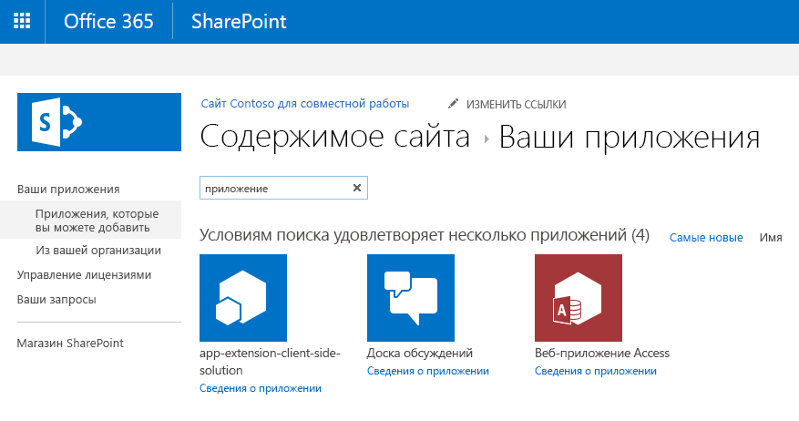

# <a name="deploy-your-extension-to-sharepoint-hello-world-part-3"></a><span data-ttu-id="37ab1-101">Развертывание расширения в SharePoint (Hello World, часть 3)</span><span class="sxs-lookup"><span data-stu-id="37ab1-101">Deploy your extension to SharePoint (Hello world part 3)</span></span>

<span data-ttu-id="37ab1-102">В этой статье рассказывается, как развернуть настройщик приложений для SharePoint Framework в SharePoint и проверить, работает ли он, на современных страницах SharePoint.</span><span class="sxs-lookup"><span data-stu-id="37ab1-102">This article describes how to deploy your SharePoint Framework Application Customizer to SharePoint and see it working on modern SharePoint pages.</span></span> <span data-ttu-id="37ab1-103">В этой статье мы продолжим работу с расширением Hello World, которое мы создали в предыдущей статье [Использование заполнителей страниц из настройщика приложений (Hello World, часть 2)](./using-page-placeholder-with-extensions.md).</span><span class="sxs-lookup"><span data-stu-id="37ab1-103">This article continues with the Hello World extension built in the previous article [Use page placeholders from Application Customizer (Hello World part 2)](./using-page-placeholder-with-extensions.md).</span></span>

<span data-ttu-id="37ab1-104">Перед началом работы выполните процедуры, которые описаны в указанных ниже статьях.</span><span class="sxs-lookup"><span data-stu-id="37ab1-104">Be sure you have completed the procedures in the following articles before you begin:</span></span>

* [<span data-ttu-id="37ab1-105">Создание первого расширения SharePoint Framework (Hello World, часть 1)</span><span class="sxs-lookup"><span data-stu-id="37ab1-105">Build your first SharePoint Framework Extension (Hello World part 1)</span></span>](./build-a-hello-world-extension.md)
* [<span data-ttu-id="37ab1-106">Использование заполнителей страниц из настройщика приложений (Hello World, часть 2)</span><span class="sxs-lookup"><span data-stu-id="37ab1-106">Use page placeholders from Application Customizer (Hello World part 2)</span></span>](./using-page-placeholder-with-extensions.md)

<span data-ttu-id="37ab1-107">Эти действия также показаны в видео на [канале SharePoint PnP на YouTube](https://www.youtube.com/watch?v=P_yWI0WVQIg&list=PLR9nK3mnD-OXtWO5AIIr7nCR3sWutACpV).</span><span class="sxs-lookup"><span data-stu-id="37ab1-107">You can also follow these steps by watching the video on the [SharePoint PnP YouTube Channel](https://www.youtube.com/watch?v=P_yWI0WVQIg&list=PLR9nK3mnD-OXtWO5AIIr7nCR3sWutACpV).</span></span> 

<a href="https://www.youtube.com/watch?v=DzHdVxLA3Pc">

</a>

## <a name="package-the-hello-world-application-customizer"></a><span data-ttu-id="37ab1-108">Упаковка настройщика приложений Hello World</span><span class="sxs-lookup"><span data-stu-id="37ab1-108">Package the Hello World Application Customizer</span></span>
<span data-ttu-id="37ab1-109">В окне консоли перейдите в каталог проекта расширения, созданного при работе со статьей [Создание первого расширения SharePoint Framework (Hello World, часть 1)](./build-a-hello-world-extension.md).</span><span class="sxs-lookup"><span data-stu-id="37ab1-109">In the console window, go to the extension project directory created in [Build your first SharePoint Framework Extension (Hello World part 1)](./build-a-hello-world-extension.md)</span></span>

```
cd app-extension
```
<span data-ttu-id="37ab1-110">Если команда gulp serve все еще выполняется, остановите ее, нажав клавиши CTRL+C.</span><span class="sxs-lookup"><span data-stu-id="37ab1-110">If gulp serve is still running, stop it from running by pressing .</span></span>

<span data-ttu-id="37ab1-111">В отличие от работы в режиме **отладки**, чтобы использовать расширение на современных серверных страницах SharePoint, вам потребуется развернуть и зарегистрировать расширение в SharePoint в области `Site collection`, `Site` или `List`.</span><span class="sxs-lookup"><span data-stu-id="37ab1-111">Unlike in **Debug** mode, in order to use an extension on modern SharePoint server-side pages, you need to deploy and register the extension with SharePoint in either `Site collection`, `Site`, or `List` scope. The scope defines where and how the Application Customizer will be active. In this particular scenario, we'll register the Application Customizer using the  scope.</span></span> <span data-ttu-id="37ab1-112">То, где и как будет активен настройщик, определяется областью.</span><span class="sxs-lookup"><span data-stu-id="37ab1-112">The scope defines where and how the Application Customizer will be active.</span></span> <span data-ttu-id="37ab1-113">В данном сценарии мы зарегистрируем настройщик приложений, используя область `Site collection`.</span><span class="sxs-lookup"><span data-stu-id="37ab1-113">In this particular scenario, we'll register the Application Customizer by using the `Site collection` scope.</span></span> 

<span data-ttu-id="37ab1-114">Прежде чем упаковать решение, нам необходимо включить код для автоматизации активации решения при установке его на сайте.</span><span class="sxs-lookup"><span data-stu-id="37ab1-114">Before we package our solution, we want to include the code needed to automate the extension activation within the site whenever the solution is installed on the site.</span></span> <span data-ttu-id="37ab1-115">В данном случае мы воспользуемся элементами платформы компонентов, чтобы выполнить эти действия непосредственно в пакете решения, но вы, например, можете сопоставить настройщик приложений с сайтом SharePoint, используя REST или CSOM при подготовке сайта к работе.</span><span class="sxs-lookup"><span data-stu-id="37ab1-115">Before we package our solution, we want to include the code needed to automate the extension activation within the site, whenever the solution is installed on the site. In this case, we'll use feature framework elements to perform these actions directly in the solution package, but you could also associate the application customizer to a SharePoint site using REST or CSOM as part of the site provisioning, for example.</span></span>

1. <span data-ttu-id="37ab1-116">Установите пакет решения на нужном сайте, чтобы манифест расширения попал в список разрешенных для запуска.</span><span class="sxs-lookup"><span data-stu-id="37ab1-116">Install the solution package to the site where it should be installed, so that the extension manifest is being white listed for execution</span></span>

2. <span data-ttu-id="37ab1-117">Сопоставление настройщика приложений с запланированной областью.</span><span class="sxs-lookup"><span data-stu-id="37ab1-117">Associate the Application Customizer to the planned scope.</span></span> <span data-ttu-id="37ab1-118">Это можно выполнить программным путем (CSOM/REST) либо с помощью платформы компонента в пакете решения SharePoint Framework.</span><span class="sxs-lookup"><span data-stu-id="37ab1-118">Associate the Application Customizer to the planned scope. This can be performed programmatically (CSOM/REST) or by using the feature framework inside of the SharePoint Framework solution package. You'll need to associate the following properties in the  object at the site collection, site or list level.</span></span> <span data-ttu-id="37ab1-119">Вам потребуется сопоставить указанные ниже свойства в объекте `UserCustomAction` на уровне семейства веб-сайтов, сайта или списка.</span><span class="sxs-lookup"><span data-stu-id="37ab1-119">You'll need to associate the following properties in the `UserCustomAction` object at the site collection, site, or list level.</span></span>
    * <span data-ttu-id="37ab1-120">**ClientSiteComponentId:** это идентификатор (GUID) настройщика полей, установленного в каталоге приложений.</span><span class="sxs-lookup"><span data-stu-id="37ab1-120">**ClientSideComponentId:** This is the identifier (GUID) of the Field Customizer, which has been installed in the app catalog.</span></span> 
    * <span data-ttu-id="37ab1-121">**ClientSideComponentProperties:** это необязательный параметр, с помощью которого можно предоставлять свойства для экземпляра настройщика полей.</span><span class="sxs-lookup"><span data-stu-id="37ab1-121">**ClientSideComponentProperties:** This is an optional parameter, which can be used to provide properties for the Field Customizer instance.</span></span>
   
   <span data-ttu-id="37ab1-122">Обратите внимание, что вы можете задавать требования для добавления на сайт решения, содержащего ваше расширение, с помощью параметра `skipFeatureDeployment` в файле **package-solution.json**.</span><span class="sxs-lookup"><span data-stu-id="37ab1-122">Note that you can control the requirement to add a solution containing your extension to the site by using the `skipFeatureDeployment` setting in **package-solution.json**.</span></span> <span data-ttu-id="37ab1-123">Хотя вы можете и не требовать установки решения на сайте, необходимо сопоставить идентификатор **ClientSideComponentId** с конкретными объектами, чтобы расширение было видимым.</span><span class="sxs-lookup"><span data-stu-id="37ab1-123">Notice, you can control the requirement to add a solution containing your extension to the site by using  setting in package-solution.json. Event though you would not require solution to be installed on the site, you'd need to associate **ClientSideComponentId** to specific objects for the extension to be visible.</span></span> 
   
<span data-ttu-id="37ab1-124">На следующих этапах мы рассмотрим определение `CustomAction`, которое было автоматически создано для решения при формировании шаблонов для включения решения при его установке на сайте.</span><span class="sxs-lookup"><span data-stu-id="37ab1-124">In the following steps, we'll review the `CustomAction` definition, which was automatically created for the solution as part of the scaffolding for enabling the solution on a site when it's being installed.</span></span> 
   
1. <span data-ttu-id="37ab1-125">Вернитесь к пакету решения в Visual Studio Code (или другом редакторе, который вы используете).</span><span class="sxs-lookup"><span data-stu-id="37ab1-125">Return to your solution package in Visual Studio Code (or to your preferred editor).</span></span>

2. <span data-ttu-id="37ab1-126">Разверните папку **sharepoint** и вложенную папку **assets** в корневой папке решения. Отобразится существующий файл **elements.xml**.</span><span class="sxs-lookup"><span data-stu-id="37ab1-126">Extend the **sharepoint** folder and **assets** subfolder in the root of the solution to see the existing **elements.xml** file.</span></span> 

   

<br/>

### <a name="review-the-existing-elementsxml-file-for-sharepoint-definitions"></a><span data-ttu-id="37ab1-128">Проверка наличия определений SharePoint в существующем файле elements.xml</span><span class="sxs-lookup"><span data-stu-id="37ab1-128">Review the existing elements.xml file for SharePoint definitions</span></span>

<span data-ttu-id="37ab1-129">Проверьте существующую XML-структуру в файле **elements.xml**.</span><span class="sxs-lookup"><span data-stu-id="37ab1-129">Review the existing xml structure in the **elements.xml** file.</span></span> <span data-ttu-id="37ab1-130">Обратите внимание, что свойство **ClientSideComponentId** было автоматически обновлено на основании уникального идентификатора вашего настройщика приложений, доступного в файле **HelloWorldApplicationCustomizer.manifest.json** в папке **src\extensions\helloWorld**.</span><span class="sxs-lookup"><span data-stu-id="37ab1-130">Note that the **ClientSideComponentId** property has been automatically updated based on the unique ID of your Application Customizer available in the **HelloWorldApplicationCustomizer.manifest.json** file in the **src\extensions\helloWorld** folder.</span></span>

<span data-ttu-id="37ab1-131">Кроме того, для параметра **ClientSideComponentProperties** этого экземпляра расширения были автоматически заданы структура, используемая по умолчанию, и свойства JSON.</span><span class="sxs-lookup"><span data-stu-id="37ab1-131">**ClientSideComponentProperties** has also been automatically set with the default structure and JSON properties for this extension instance.</span></span> <span data-ttu-id="37ab1-132">Запомните, как выполняется выход из объекта JSON, чтобы мы могли правильно настроить его в XML-атрибуте.</span><span class="sxs-lookup"><span data-stu-id="37ab1-132">We also set the ClientSideComponentProperties and pass JSON properties for this extension instance. Notice how the JSON is escaped so that we can set it properly within an XML attribute.</span></span> 

<span data-ttu-id="37ab1-133">Для определения настройщика приложений в конфигурации используется конкретное расположение объекта `ClientSideExtension.ApplicationCustomizer`.</span><span class="sxs-lookup"><span data-stu-id="37ab1-133">The configuration uses the specific location of `ClientSideExtension.ApplicationCustomizer` to define that this is an Application Customizer.</span></span> <span data-ttu-id="37ab1-134">Так как по умолчанию этот файл **elements.xml** сопоставлен с компонентом с областью *Интернет*, это действие `CustomAction` будет автоматически добавлено в коллекцию `Web.UserCustomAction` на сайте, на котором устанавливается решение.</span><span class="sxs-lookup"><span data-stu-id="37ab1-134">Notice also that we use the specific location of  to define that this is an Application Customizer. Since by default this elements.xml will be associated to a Web scoped feature, this  will be automatically added to the  collection in the site where the solution is being installed.</span></span>

<span data-ttu-id="37ab1-135">Чтобы обеспечить соответствие конфигурации обновлениям, выполняемым в настройщике приложений, измените параметр **ClientSideComponentProperties**, как показано в XML-структуре ниже.</span><span class="sxs-lookup"><span data-stu-id="37ab1-135">To ensure that the configuration matches updates performed in the Application Customizer, update the **ClientSideComponentProperties** as in the following xml structure.</span></span> <span data-ttu-id="37ab1-136">Учтите, что вам не следует копировать всю структуру, так как это приведет к несоответствию с идентификатором **ClientSideComponentId**.</span><span class="sxs-lookup"><span data-stu-id="37ab1-136">Note that you should not copy the whole structure because it would cause a mismatch with your **ClientSideComponentId**.</span></span>


```xml
<?xml version="1.0" encoding="utf-8"?>
<Elements xmlns="http://schemas.microsoft.com/sharepoint/">

    <CustomAction 
        Title="SPFxApplicationCustomizer"
        Location="ClientSideExtension.ApplicationCustomizer"
        ClientSideComponentId="46606aa6-5dd8-4792-b017-1555ec0a43a4"
        ClientSideComponentProperties="{&quot;Top&quot;:&quot;Top area of the page&quot;,&quot;Bottom&quot;:&quot;Bottom area in the page&quot;}">

    </CustomAction>

</Elements>
```

<br/>

### <a name="ensure-that-definitions-are-taken-into-account-within-the-build-pipeline"></a><span data-ttu-id="37ab1-137">Проверка того, учтены ли определения в конвейере сборки</span><span class="sxs-lookup"><span data-stu-id="37ab1-137">Ensure that definitions are taken into account within the build pipeline</span></span>

<span data-ttu-id="37ab1-p110">Откройте файл **package-solution.json** в папке **config**. В файле **package-solution.json** определены метаданные пакета, как показано в следующем фрагменте кода:</span><span class="sxs-lookup"><span data-stu-id="37ab1-p110">Open **package-solution.json** from the **config** folder. The **package-solution.json** file defines the package metadata as shown in the following code:</span></span>

```json

{
  "$schema": "https://dev.office.com/json-schemas/spfx-build/package-solution.schema.json",
  "solution": {
    "name": "app-extension-client-side-solution",
    "id": "98a9fe4f-175c-48c1-adee-63fb927faa70",
    "version": "1.0.0.0",
    "features": [
      {
        "title": "Application Extension - Deployment of custom action.",
        "description": "Deploys a custom action with ClientSideComponentId association",
        "id": "4678966b-de68-445f-a74e-e553a7b937ab",
        "version": "1.0.0.0",
        "assets": {
          "elementManifests": [
            "elements.xml"
          ]
        }
      }
    ]
  },
  "paths": {
    "zippedPackage": "solution/app-extension.sppkg"
  }
}


```

<br/>

<span data-ttu-id="37ab1-140">Чтобы при упаковке решения учитывался файл **element.xml**, функция формирования шаблонов, используемая по умолчанию, добавляет необходимую конфигурацию, чтобы создать определение компонента платформы компонентов для пакета решения.</span><span class="sxs-lookup"><span data-stu-id="37ab1-140">To ensure that the **element.xml** file is taken into account while the solution is being packaged, default scaffolding adds needed configuration to define a feature framework feature definition for the solution package.</span></span>

## <a name="deploy-the-extension-to-sharepoint-online-and-host-javascript-from-local-host"></a><span data-ttu-id="37ab1-141">Развертывание расширения в SharePoint Online и размещение кода JavaScript в локальном узле</span><span class="sxs-lookup"><span data-stu-id="37ab1-141">Deploy the extension to SharePoint Online and host JavaScript from local host</span></span>

<span data-ttu-id="37ab1-142">Теперь мы готовы развернуть решение на сайте SharePoint и автоматически сопоставить действие `CustomAction` на уровне сайта.</span><span class="sxs-lookup"><span data-stu-id="37ab1-142">Now you are ready to deploy the solution to a SharePoint site and to have the `CustomAction` automatically associated on the site level.</span></span>

1. <span data-ttu-id="37ab1-143">Чтобы упаковать клиентское решение, содержащее расширение, и получить базовую структуру, готовую к упаковке, в окне консоли введите указанную ниже команду.</span><span class="sxs-lookup"><span data-stu-id="37ab1-143">In the console window, enter the following command to package your client-side solution that contains the extension, so that we get the basic structure ready for packaging:</span></span>

   ```
   gulp bundle
   ```

2. <span data-ttu-id="37ab1-144">Выполните следующую команду, чтобы создать пакет решения:</span><span class="sxs-lookup"><span data-stu-id="37ab1-144">Next, execute the following command so that the solution package is created:</span></span>

   ```
   gulp package-solution
   ```

   <span data-ttu-id="37ab1-145">Эта команда создаст пакет в папке **sharepoint/solution**:</span><span class="sxs-lookup"><span data-stu-id="37ab1-145">The command will create the package in the **sharepoint/solution** folder:</span></span>

   ```
   app-extension.sppkg
   ```

3. <span data-ttu-id="37ab1-146">Теперь вам необходимо развернуть созданный пакет в каталоге приложений.</span><span class="sxs-lookup"><span data-stu-id="37ab1-146">Next you need to deploy the package that was generated to the App Catalog.</span></span> <span data-ttu-id="37ab1-147">Для этого перейдите в **каталог приложений** клиента и откройте библиотеку **Приложения для SharePoint**.</span><span class="sxs-lookup"><span data-stu-id="37ab1-147">Go to your tenant's **App Catalog** and open the **Apps for SharePoint** library.</span></span>

4. <span data-ttu-id="37ab1-148">Отправьте или перетащите файл `app-extension.sppkg` из папки **sharepoint/solution** в каталог приложений.</span><span class="sxs-lookup"><span data-stu-id="37ab1-148">Upload or drag and drop the `app-extension.sppkg` located in the **sharepoint/solution** folder to the App Catalog. SharePoint will display a dialog and ask you to trust the client-side solution.</span></span> <span data-ttu-id="37ab1-149">В SharePoint откроется диалоговое окно с запросом на подтверждение доверия клиентскому решению.</span><span class="sxs-lookup"><span data-stu-id="37ab1-149">SharePoint displays a dialog and asks you to trust the client-side solution.</span></span>

   <span data-ttu-id="37ab1-150">Обратите внимание, что мы не изменяли URL-адреса для размещения решения в этом развертывании, поэтому по-прежнему используется URL-адрес `https://localhost:4321`.</span><span class="sxs-lookup"><span data-stu-id="37ab1-150">Notice that we did not update the URLs for hosting the solution for this deployment, so the URL is still pointing to `https://localhost:4321`. Click the Deploy button.</span></span> 
   
5. <span data-ttu-id="37ab1-151">Нажмите кнопку **Развернуть**.</span><span class="sxs-lookup"><span data-stu-id="37ab1-151">Select the **Deploy** button.</span></span>

   

6. <span data-ttu-id="37ab1-p113">Вернитесь к консоли и убедитесь, что решение запущено. Если это не так, выполните в папке решения следующую команду:</span><span class="sxs-lookup"><span data-stu-id="37ab1-p113">Move back to your console and ensure that the solution is running. If it's not running, execute the following command in the solution folder:</span></span>
   
   ```
   gulp serve --nobrowser
   ```
   
7. <span data-ttu-id="37ab1-p114">Перейдите на тот сайт, где требуется проверить подготовку ресурсов SharePoint. Это может быть любое семейство веб-сайтов в клиенте, где развернут пакет решения.</span><span class="sxs-lookup"><span data-stu-id="37ab1-p114">Go to the site where you want to test SharePoint asset provisioning. This could be any site collection in the tenant where you deployed this solution package.</span></span>

8. <span data-ttu-id="37ab1-157">Щелкните значок с изображением шестеренки на верхней панели навигации справа и выберите команду **Добавить приложение**. Откроется страница "Приложения".</span><span class="sxs-lookup"><span data-stu-id="37ab1-157">Chose the gear icon on the top navigation bar on the right and choose **Add an app** to go to your Apps page.</span></span>

9. <span data-ttu-id="37ab1-158">В поле **Поиск** введите **app**, а затем нажмите клавишу ВВОД, чтобы выполнить фильтрацию для ваших приложений.</span><span class="sxs-lookup"><span data-stu-id="37ab1-158">In the Search box, enter 'app' and press Enter to filter your apps.</span></span>

   

10. <span data-ttu-id="37ab1-160">Выберите приложение **app-extension-client-side-solution**, чтобы установить решение на сайте.</span><span class="sxs-lookup"><span data-stu-id="37ab1-160">Select the **app-extension-client-side-solution** app to install the solution on the site.</span></span> <span data-ttu-id="37ab1-161">По завершении установки обновите страницу, нажав клавишу **F5**.</span><span class="sxs-lookup"><span data-stu-id="37ab1-161">When the installation is completed, refresh the page by selecting **F5**.</span></span>

<span data-ttu-id="37ab1-162">После успешной установки приложения верхний и нижний колонтитулы будут отрисовываться так же, как и при использовании параметров запроса отладки.</span><span class="sxs-lookup"><span data-stu-id="37ab1-162">When the application has been successfully installed, you can see the header and footer being rendered just like with the debug query parameters.</span></span>


## <a name="next-steps"></a><span data-ttu-id="37ab1-164">Дальнейшие действия</span><span class="sxs-lookup"><span data-stu-id="37ab1-164">Next steps</span></span>

<span data-ttu-id="37ab1-165">Поздравляем, вы развернули расширение на современной странице SharePoint из каталога приложений!</span><span class="sxs-lookup"><span data-stu-id="37ab1-165">Congratulations, you have deployed an extension to a modern SharePoint page from the app catalog!</span></span> <span data-ttu-id="37ab1-166">Вы можете продолжить создавать расширение Hello World в следующей статье [Размещение расширения из сети доставки содержимого Office 365 (Hello World, часть 4)](./hosting-extension-from-office365-cdn.md). Работая с этой статьей, вы научитесь развертывать ресурсы расширения в сети CDN, а не в localhost, и загружать их из нее.</span><span class="sxs-lookup"><span data-stu-id="37ab1-166">Congratulations, you have deployed an extension to a modern SharePoint page from the app catalog! You can continue building out your Hello World extension in the next topic, [Hosting extension from Office 365 CDN (Hello world part 4)](./hosting-extension-from-office365-cdn.md), where you will learn how to deploy and load the extension assets from a CDN instead of localhost.</span></span>
