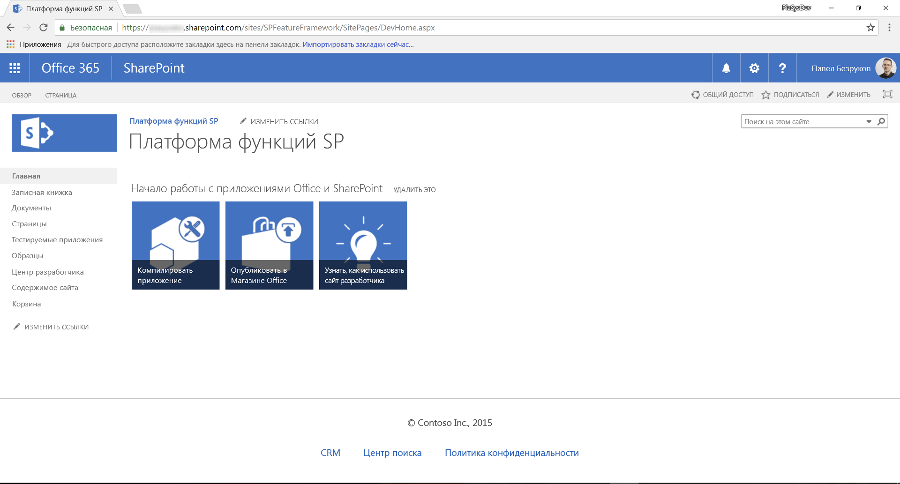
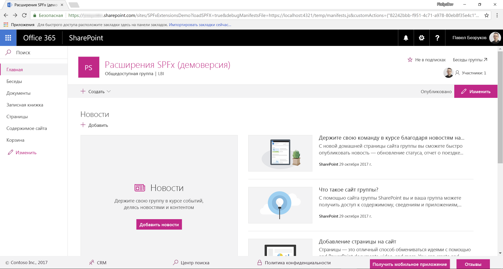
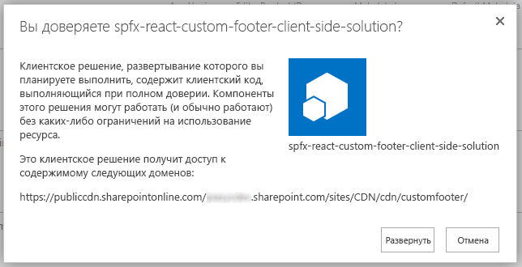
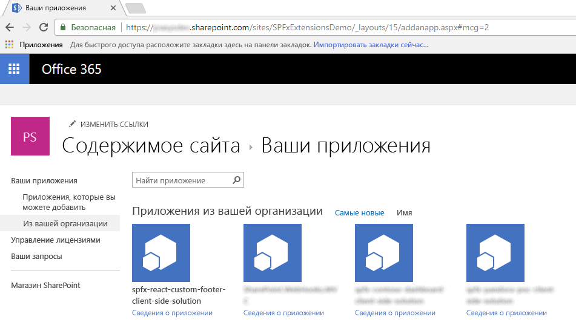

# <a name="migrating-from-usercustomaction-to-sharepoint-framework-extensions"></a><span data-ttu-id="e5fec-102">Переход с UserCustomAction на расширения SharePoint Framework</span><span class="sxs-lookup"><span data-stu-id="e5fec-102">Migrating from UserCustomAction to SharePoint Framework Extensions</span></span>

<span data-ttu-id="e5fec-103">За последние несколько лет в большинстве корпоративных решений на основе Office 365 и SharePoint Online для расширения пользовательского интерфейса страниц использовалась возможность _CustomAction_ для сайтов на платформе функций SharePoint.</span><span class="sxs-lookup"><span data-stu-id="e5fec-103">During the last few years, most of the enterprise solutions built on top of Office 365 and SharePoint Online leveraged the site _CustomAction_ capability of the SharePoint Feature Framework to extend the UI of pages.</span></span> <span data-ttu-id="e5fec-104">Однако на данный момент, с появлением "современного" пользовательского интерфейса SharePoint Online, большинство таких модификаций недоступно.</span><span class="sxs-lookup"><span data-stu-id="e5fec-104">However nowdays, within the new "modern" UI of SharePoint Online, most of those customizations are no more available.</span></span> <span data-ttu-id="e5fec-105">К счастью, с помощью новых расширений SharePoint Framework вы можете реализовать практически идентичные функции в "современном" пользовательском интерфейсе.</span><span class="sxs-lookup"><span data-stu-id="e5fec-105">Luckily, with the new SharePoint Framework Extensions you can now provide almost the same functionality in the "modern" UI.</span></span> <span data-ttu-id="e5fec-106">Из данного руководства вы узнаете, как перейти от старых ("классических") модификаций к новой модели, основанной на расширениях SharePoint Framework.</span><span class="sxs-lookup"><span data-stu-id="e5fec-106">In this tutorial you will learn how to migrate from old "classic" customizations to the new model based on SharePoint Framework Extensions.</span></span>

## <a name="understanding-sharepoint-framework-extensions"></a><span data-ttu-id="e5fec-107">Общие сведения о расширениях SharePoint Framework</span><span class="sxs-lookup"><span data-stu-id="e5fec-107">Understanding SharePoint Framework Extensions</span></span>

<span data-ttu-id="e5fec-108">Для начала рассмотрим доступные разработчикам варианты расширений SharePoint Framework:</span><span class="sxs-lookup"><span data-stu-id="e5fec-108">First of all, let's introduce the available options when developing SharePoint Framework Extensions:</span></span>

* <span data-ttu-id="e5fec-109">**Настройщик приложений**. Расширьте встроенный "современный" пользовательский интерфейс SharePoint Online, добавив пользовательские элементы HTML и клиентский код в заранее определенные заполнители на "современных" страницах.</span><span class="sxs-lookup"><span data-stu-id="e5fec-109">**Application Customizer**: extend the native "modern" UI of SharePoint Online by adding custom HTML elements and client-side code to pre-defined placeholders of "modern" pages.</span></span> <span data-ttu-id="e5fec-110">На момент написания этой статьи заполнители доступны в верхнем и нижнем колонтитулах каждой "современной" страницы.</span><span class="sxs-lookup"><span data-stu-id="e5fec-110">At the time of this writing, the available placeholders are the header and the footer of every "modern" page.</span></span>
* <span data-ttu-id="e5fec-111">**Набор команд**. Позволяет добавлять пользовательские пункты меню ECB и настраиваемые кнопки на панель команд или в представление списка или библиотеки.</span><span class="sxs-lookup"><span data-stu-id="e5fec-111">**Command Set**: allow to add custom ECB menu items or custom buttons to the command bar of a list view for a list or a library.</span></span> <span data-ttu-id="e5fec-112">С этими командами можно связать любое действие JavaScript (TypeScript).</span><span class="sxs-lookup"><span data-stu-id="e5fec-112">You can associate any JavaScript (TypeScript) action to these commands.</span></span>
* <span data-ttu-id="e5fec-113">**Настройщик полей**. Настройте отображение поля в представлении списка, используя настраиваемые элементы HTML и клиентский код.</span><span class="sxs-lookup"><span data-stu-id="e5fec-113">**Field Customizer**: customize the rendering of a field in a list view using custom HTML elements and client-side code.</span></span>

<span data-ttu-id="e5fec-114">Как вы могли понять из приведенных выше описаний, в нашем случае наиболее удобным вариантом будет расширение "Настройщик приложений".</span><span class="sxs-lookup"><span data-stu-id="e5fec-114">As you can argue from the above descriptions, the most useful one in our context is the "Application Customizer" extension.</span></span>

> [!NOTE]
> <span data-ttu-id="e5fec-115">Дополнительные сведения о расширениях SharePoint Framework см. в статье ["Обзор расширений SharePoint Framework"]((https://docs.microsoft.com/ru-RU/sharepoint/dev/spfx/extensions/overview-extensions)).</span><span class="sxs-lookup"><span data-stu-id="e5fec-115">For further details about how to build SharePoint Framework Extensions you can read the article ["Overview of SharePoint Framework Extensions"]((https://docs.microsoft.com/ru-RU/sharepoint/dev/spfx/extensions/overview-extensions)).</span></span>

## <a name="migrating-a-usercustomaction-to-an-spfx-application-customizer"></a><span data-ttu-id="e5fec-116">Перенос элемента UserCustomAction в настройщик приложений SPFx</span><span class="sxs-lookup"><span data-stu-id="e5fec-116">Migrating a UserCustomAction to an SPFx Application Customizer</span></span>

<span data-ttu-id="e5fec-117">Предположим, у вас есть элемент _CustomAction_ в SharePoint Online, необходимый для создания настраиваемого нижнего колонтитула на всех страницах сайта.</span><span class="sxs-lookup"><span data-stu-id="e5fec-117">Assume that you have a _CustomAction_ in SharePoint Online, in order to have a custom footer in all of the site's pages.</span></span>
<span data-ttu-id="e5fec-118">Ниже представлен фрагмент кода XML, в котором определяется этот элемент _CustomAction_ на платформе функций SharePoint.</span><span class="sxs-lookup"><span data-stu-id="e5fec-118">In the following code snippet you can see the XML code defining that _CustomAction_ using the SharePoint Feature Framework.</span></span>

```XML
<?xml version="1.0" encoding="utf-8"?>
<Elements xmlns="http://schemas.microsoft.com/sharepoint/">
  <CustomAction Id="jQueryCDN"
                Title="jQueryCDN"
                Description="Loads jQuery from the public CDN"
                ScriptSrc="https://code.jquery.com/jquery-3.2.1.slim.min.js"
                Location="ScriptLink"
                Sequence="100" />
  <CustomAction Id="spoCustomBar"
                Title="spoCustomBar"
                Description="Loads a script to rendere a custom footer"
                Location="ScriptLink"
                ScriptSrc="SiteAssets/SPOCustomUI.js"
                Sequence="200" />
</Elements>
```

<span data-ttu-id="e5fec-119">Как видите, в файле элементов функции определяется пара элементов типа _CustomAction_, чтобы включить в страницы целевого сайта как код jQuery, загружаемый через общедоступную сеть CDN, так и пользовательский файл JavaScript, который отображает настраиваемый нижний колонтитул.</span><span class="sxs-lookup"><span data-stu-id="e5fec-119">As you can see, the feature elements file defines a couple of elements of type _CustomAction_ to include in the pages of the target site both jQuery, loaded through the public CDN, and a custom JavaScript file that renders the custom footer.</span></span>

<span data-ttu-id="e5fec-120">Кроме того, для полноты здесь представлен код JavaScript, который отображает настраиваемый нижний колонтитул, где для простоты пункты меню заранее определены в коде.</span><span class="sxs-lookup"><span data-stu-id="e5fec-120">Moreover and for the sake of completeness, here you can see the JavaScript code that renders a custom footer, whose menu items are pre-defined in code for the sake of simplicity.</span></span>

```JavaScript
var SPOCustomUI = SPOCustomUI || {};

SPOCustomUI.setUpCustomFooter = function () {
    if ($("#SPOCustomFooter").length)
        return;

    var footerContainer = $("<div>");
    footerContainer.attr("id", "SPOCustomFooter");

    footerContainer.append("<ul>");

    $("#s4-workspace").append(footerContainer);
}

SPOCustomUI.addCustomFooterText = function (id, text) {
    if ($("#" + id).length)
        return;

    var customElement = $("<div>");
    customElement.attr("id", id);
    customElement.html(text);

    $("#SPOCustomFooter > ul").before(customElement);

    return customElement;
}

SPOCustomUI.addCustomFooterLink = function (id, text, url) {
    if ($("#" + id).length)
        return;

    var customElement = $("<a>");
    customElement.attr("id", id);
    customElement.attr("href", url);
    customElement.html(text);

    $("#SPOCustomFooter > ul").append($("<li>").append(customElement));

    return customElement;
}

SPOCustomUI.loadCSS = function (url) {
    var head = document.getElementsByTagName('head')[0];
    var style = document.createElement('link');
    style.type = 'text/css';
    style.rel = 'stylesheet';
    style.href = url;
    head.appendChild(style);
}

SPOCustomUI.init = function (whenReadyDoFunc) {
    // avoid executing inside iframes (used by Sharepoint for dialogs)
    if (self !== top) return;

    if (!window.jQuery) {
        // jQuery is needed for Custom Bar to run
        setTimeout(function () { SPOCustomUI.init(whenReadyDoFunc); }, 50);
    } else {
        $(function () {
            SPOCustomUI.setUpCustomFooter();
            whenReadyDoFunc();
        });
    }
}

// The following initializes the custom footer with some fake links
SPOCustomUI.init(function () {

    var currentScriptUrl;

    var currentScript = document.querySelectorAll("script[src*='SPOCustomUI']");
    if (currentScript.length > 0) {
        currentScriptUrl = currentScript[0].src;
    }
    if (currentScriptUrl != undefined) {
        var currentScriptBaseUrl = currentScriptUrl.substring(0, currentScriptUrl.lastIndexOf('/') + 1);
        SPOCustomUI.loadCSS(currentScriptBaseUrl + 'SPOCustomUI.css');
    }

    SPOCustomUI.addCustomFooterText('SPOFooterCopyright', '&copy; 2017, Contoso Inc.');
    SPOCustomUI.addCustomFooterLink('SPOFooterCRMLink', 'CRM', 'CRM.aspx');
    SPOCustomUI.addCustomFooterLink('SPOFooterSearchLink', 'Search Center', 'SearchCenter.aspx');
    SPOCustomUI.addCustomFooterLink('SPOFooterPrivacyLink', 'Privacy Policy', 'Privacy.aspx');
});
```

<span data-ttu-id="e5fec-121">На приведенном ниже рисунке представлены выходные данные вышеописанного дополнительного действия на домашней странице классического сайта.</span><span class="sxs-lookup"><span data-stu-id="e5fec-121">In the following figure you can see the output of the previous custom action, within the home page of a classic site.</span></span>



<span data-ttu-id="e5fec-123">Чтобы перенести представленное выше решение в "современный" пользовательский интерфейс, необходимо выполнить указанные ниже действия.</span><span class="sxs-lookup"><span data-stu-id="e5fec-123">In order to migrate the above solution to the "modern" UI, you will have to accomplish the following steps.</span></span>

### <a name="create-a-new-sharepoint-framework-solution"></a><span data-ttu-id="e5fec-124">Создание решения SharePoint Framework</span><span class="sxs-lookup"><span data-stu-id="e5fec-124">Create a new SharePoint Framework solution</span></span>

<span data-ttu-id="e5fec-125"> Подготовив среду разработки к созданию решений SharePoint Framework, вы можете приступить к созданию расширения SharePoint Framework, выполнив действия, описанные в статье ["Как настроить среду разработки клиентских веб-частей SharePoint"]((https://docs.microsoft.com/ru-RU/sharepoint/dev/spfx/set-up-your-development-environment)).</span><span class="sxs-lookup"><span data-stu-id="e5fec-125">Once you have prepared you development environment to develop SharePoint Framework solutions, by following the instructions provided in the document ["Set up your SharePoint client-side web part development environment"]((https://docs.microsoft.com/ru-RU/sharepoint/dev/spfx/set-up-your-development-environment)), you can start creating a SharePoint Framework extension.</span></span>

1. <span data-ttu-id="e5fec-126">Откройте любое средство командной строки (PowerShell, CMD.EXE, Cmder и т. д.), создайте папку для решения (назовите ее _spfx-react-custom-footer_) и создайте решение SharePoint Framework, запустив генератор Yeoman с помощью следующей команды:</span><span class="sxs-lookup"><span data-stu-id="e5fec-126">Open the command line tool of your choice (PowerShell, CMD.EXE, Cmder, etc.), create a new folder for the solution (call it _spfx-react-custom-footer_), and create a new SharePoint Framework solution by running the Yeoman generator with the following command:</span></span>

```
yo @microsoft/sharepoint
```

<span data-ttu-id="e5fec-127">При появлении соответствующих запросов укажите следующие параметры:</span><span class="sxs-lookup"><span data-stu-id="e5fec-127">When prompted by the tool, provide the following answers:</span></span>
* <span data-ttu-id="e5fec-128">Оставьте имя решения по умолчанию (_spfx-react-custom-footer_) и нажмите клавишу ВВОД.</span><span class="sxs-lookup"><span data-stu-id="e5fec-128">Accept the default name (_spfx-react-custom-footer_) for your solution, and press Enter.</span></span>
* <span data-ttu-id="e5fec-129">Выберите SharePoint Online only (latest) (Только SharePoint Online, последняя версия) и нажмите клавишу ВВОД.</span><span class="sxs-lookup"><span data-stu-id="e5fec-129">Choose SharePoint Online only (latest), and press Enter.</span></span>
* <span data-ttu-id="e5fec-130">Выберите Use the current folder (Использовать текущую папку) и нажмите клавишу ВВОД.</span><span class="sxs-lookup"><span data-stu-id="e5fec-130">Choose Use the current folder, and press Enter.</span></span>
* <span data-ttu-id="e5fec-131">Выберите N, чтобы сделать установку расширения обязательной на каждом сайте при его использовании.</span><span class="sxs-lookup"><span data-stu-id="e5fec-131">Choose N to require the extension to be installed on each site explicitly when it's being used.</span></span>
* <span data-ttu-id="e5fec-132">Выберите Extension (Расширение) в качестве типа создаваемого клиентского компонента.</span><span class="sxs-lookup"><span data-stu-id="e5fec-132">Choose Extension as the client-side component type to be created.</span></span>
* <span data-ttu-id="e5fec-133">Выберите для создаваемого расширения тип "Настройщик приложений".</span><span class="sxs-lookup"><span data-stu-id="e5fec-133">Choose Application Customizer as the extension type to be created.</span></span>
* <span data-ttu-id="e5fec-134">Укажите для настройщика приложений имя CustomFooter.</span><span class="sxs-lookup"><span data-stu-id="e5fec-134">Provide "CustomFooter" as the name for your Application Customizer.</span></span>


<span data-ttu-id="e5fec-136">На этом этапе Yeoman установит необходимые зависимости и сформирует шаблон файлов и папок решения вместе с расширением _CustomFooter_.</span><span class="sxs-lookup"><span data-stu-id="e5fec-136">At this point, Yeoman will install the required dependencies and scaffold the solution files and folders along with the _CustomFooter_ extension.</span></span> <span data-ttu-id="e5fec-137">Это может занять несколько минут.</span><span class="sxs-lookup"><span data-stu-id="e5fec-137">This might take a few minutes.</span></span>

<span data-ttu-id="e5fec-138">После успешного формирования шаблона должно появиться следующее сообщение:</span><span class="sxs-lookup"><span data-stu-id="e5fec-138">When the scaffold is complete, you should see the following message indicating a successful scaffold:</span></span>


2. <span data-ttu-id="e5fec-140">Чтобы заблокировать версию зависимостей проекта, выполните следующую команду:</span><span class="sxs-lookup"><span data-stu-id="e5fec-140">To lock down the version of the project dependencies, run the following command:</span></span>

```
npm shrinkwrap
```

3. <span data-ttu-id="e5fec-141">Теперь запустите Visual Studio Code (или другой редактор кода) и начните разработку решения.</span><span class="sxs-lookup"><span data-stu-id="e5fec-141">Now start Visual Studio Code (or whatever else is the code editor of your choice) and start developing the solution.</span></span> <span data-ttu-id="e5fec-142">Чтобы запустить Visual Studio Code, можно выполнить приведенный ниже оператор.</span><span class="sxs-lookup"><span data-stu-id="e5fec-142">To start Visual Studio Code, you can execute the following statement.</span></span>

```
code .
```

### <a name="define-the-new-ui-elements"></a><span data-ttu-id="e5fec-143">Определение новых элементов пользовательского интерфейса</span><span class="sxs-lookup"><span data-stu-id="e5fec-143">Define the new UI elements</span></span>

<span data-ttu-id="e5fec-144">Элементы пользовательского интерфейса в нижнем колонтитуле будут отрисовываться с помощью React и пользовательского компонента React.</span><span class="sxs-lookup"><span data-stu-id="e5fec-144">The UI elements of the custom footer will be rendered using React and a custom React component.</span></span> <span data-ttu-id="e5fec-145">Конечно, вы можете создать элементы пользовательского интерфейса в нижнем колонтитуле с помощью любой технологии.</span><span class="sxs-lookup"><span data-stu-id="e5fec-145">Of course, you can create the UI elements of the sample footer with whatever technology you like.</span></span> <span data-ttu-id="e5fec-146">В этом руководстве мы используем React, чтобы получить доступ к компонентам Office UI Fabric для React.</span><span class="sxs-lookup"><span data-stu-id="e5fec-146">In this tutorial, we use React in order to leverage the Office UI Fabric components for React.</span></span>

> [!NOTE]
> <span data-ttu-id="e5fec-147">Дополнительные сведения о разработке решений с помощью React см. в [этом руководстве по React]((https://reactjs.org/tutorial/tutorial.html)).</span><span class="sxs-lookup"><span data-stu-id="e5fec-147">For further details about developing solutions with React, you can read the following tutorial: [Tutorial: Intro to React]((https://reactjs.org/tutorial/tutorial.html)).</span></span>

1. <span data-ttu-id="e5fec-148">Для начала откройте файл _CustomFooterApplicationCustomizer.manifest.json_ в папке _src/extensions/customFooter_.</span><span class="sxs-lookup"><span data-stu-id="e5fec-148">First of all, open the file _CustomFooterApplicationCustomizer.manifest.json_ under the _src/extensions/customFooter_ folder.</span></span> <span data-ttu-id="e5fec-149">Скопируйте значение свойства _id_ и сохраните его в надежном месте, так как оно потребуется позже.</span><span class="sxs-lookup"><span data-stu-id="e5fec-149">Copy the value of the _id_ property and store it in a safe place, because you will need it later.</span></span>

2. <span data-ttu-id="e5fec-150">Теперь откройте файл _CustomFooterApplicationCustomizer.ts_ в той же папке и импортируйте типы _PlaceholderContent_ и _PlaceholderName_ из пакета _@microsoft/sp-application-base_.</span><span class="sxs-lookup"><span data-stu-id="e5fec-150">Now, open the _CustomFooterApplicationCustomizer.ts_ file, still under the same folder as before and import the types _PlaceholderContent_ and _PlaceholderName_ from the package _'@microsoft/sp-application-base'_.</span></span>
<span data-ttu-id="e5fec-151">Кроме того, в самом начале файла добавьте директивы импорта для React.</span><span class="sxs-lookup"><span data-stu-id="e5fec-151">Moreover, at the very beginning of the file, add the import directives for React.</span></span>

<span data-ttu-id="e5fec-152">В приведенном ниже фрагменте кода показан раздел импорта в файле _CustomFooterApplicationCustomizer.ts_.</span><span class="sxs-lookup"><span data-stu-id="e5fec-152">In the following code excerpt you can see the imports section of the _CustomFooterApplicationCustomizer.ts_ file.</span></span>

``` TypeScript
import * as React from 'react';
import * as ReactDom from 'react-dom';

import { override } from '@microsoft/decorators';
import { Log } from '@microsoft/sp-core-library';
import {
  BaseApplicationCustomizer,
  PlaceholderContent,
  PlaceholderName
} from '@microsoft/sp-application-base';
import { Dialog } from '@microsoft/sp-dialog';

import * as strings from 'CustomFooterApplicationCustomizerStrings';
import CustomFooter from './components/CustomFooter';
```

3. <span data-ttu-id="e5fec-153">Найдите определение класса _CustomFooterApplicationCustomizer_ и объявите новый частный элемент __bottomPlaceholder_ типа _PlaceholderContent | undefined_.</span><span class="sxs-lookup"><span data-stu-id="e5fec-153">Locate the definition of the class _CustomFooterApplicationCustomizer_ and declare a new private member called __bottomPlaceholder_ of type _PlaceholderContent | undefined_.</span></span>
<span data-ttu-id="e5fec-154">Теперь в переопределении метода _onInit_ вызовите пользовательскую функцию __renderPlaceHolders_ и определите эту функцию.</span><span class="sxs-lookup"><span data-stu-id="e5fec-154">Now within the override of the _onInit_ method invoke a custom function called __renderPlaceHolders_, and define that function.</span></span>

<span data-ttu-id="e5fec-155">В приведенном ниже фрагменте кода показана реализация класса настройщика приложений в нижнем колонтитуле.</span><span class="sxs-lookup"><span data-stu-id="e5fec-155">In the following code excerpt you can see the implementation of the custom footer application customizer class.</span></span>

``` TypeScript
/** A Custom Action which can be run during execution of a Client Side Application */
export default class CustomFooterApplicationCustomizer
  extends BaseApplicationCustomizer<ICustomFooterApplicationCustomizerProperties> {

  // This private member holds a reference to the page's footer
  private _bottomPlaceholder: PlaceholderContent | undefined;

  @override
  public onInit(): Promise<void> {
    Log.info(LOG_SOURCE, `Initialized ${strings.Title}`);

    let message: string = this.properties.testMessage;
    if (!message) {
      message = '(No properties were provided.)';
    }

    // Call render method for rendering the needed html elements
    this._renderPlaceHolders();

    return Promise.resolve();
  }

  private _renderPlaceHolders(): void {

    // Handling the bottom placeholder
    if (!this._bottomPlaceholder) {
      this._bottomPlaceholder =
        this.context.placeholderProvider.tryCreateContent(
          PlaceholderName.Bottom);

      // The extension should not assume that the expected placeholder is available.
      if (!this._bottomPlaceholder) {
        console.error('The expected placeholder (Bottom) was not found.');
        return;
      }

      const element: React.ReactElement<{}> = React.createElement(CustomFooter);
    
      ReactDom.render(element, this._bottomPlaceholder.domElement);
    }
  }
}
```

<span data-ttu-id="e5fec-156">Для начала метод __renderPlaceHolders_ ищет заполнитель типа _Bottom_ и (если он найден) отображает его содержимое.</span><span class="sxs-lookup"><span data-stu-id="e5fec-156">First of all, the  __renderPlaceHolders_ method searches for the placeholder of type _Bottom_ and if any it renders its content.</span></span>
<span data-ttu-id="e5fec-157">На самом деле в самом конце метода __renderPlaceHolders_ код создает экземпляр компонента React _CustomFooter_ и отображает его в заполнителе в нижней части страницы (т. е. на месте нижнего колонтитула).</span><span class="sxs-lookup"><span data-stu-id="e5fec-157">In fact, at the very end of the __renderPlaceHolders_ method the code creates a new instance of a _CustomFooter_ React component, and renders it within the placeholder of the pages' bottom (i.e. where the footer should be rendered).</span></span>

> [!NOTE]
> <span data-ttu-id="e5fec-158">В "современной" модели компонент React заменит файл JavaScript из "классической" модели.</span><span class="sxs-lookup"><span data-stu-id="e5fec-158">The React component will be the replacement, in the "modern" UI for the JavaScript file in the "classic" model.</span></span> <span data-ttu-id="e5fec-159">Конечно, вы можете по-прежнему отображать весь нижний колонтитул с помощью чистого кода JavaScript и использовать большую часть имеющегося кода.</span><span class="sxs-lookup"><span data-stu-id="e5fec-159">Of course, you can render the entire footer still using pure JavaScript code and reusing most of the code that you already have.</span></span> <span data-ttu-id="e5fec-160">Тем не менее обновление реализации обосновано не только с точки зрения технологий, но и с точки зрения кода.</span><span class="sxs-lookup"><span data-stu-id="e5fec-160">However, it is better to consider to upgrade the implementation not only from a technology perspective, but also from a code perspective.</span></span>

4. <span data-ttu-id="e5fec-161">Добавьте новую папку с именем components в папку _src/extensions/customFooter_.</span><span class="sxs-lookup"><span data-stu-id="e5fec-161">Add a new folder called components within the _src/extensions/customFooter_ folder.</span></span> <span data-ttu-id="e5fec-162">Создайте в новой папке файл и назовите его _CustomFooter.tsx_.</span><span class="sxs-lookup"><span data-stu-id="e5fec-162">Create a new file within the new folder, call it _CustomFooter.tsx_.</span></span>
<span data-ttu-id="e5fec-163">В приведенном ниже фрагменте кода показан файл исходного кода компонента.</span><span class="sxs-lookup"><span data-stu-id="e5fec-163">In the following code excerpt you can see the component source file.</span></span>

```TypeScript
import * as React from 'react';

import { CommandButton } from 'office-ui-fabric-react/lib/Button';

export default class CustomFooter extends React.Component<{}, {}> {

  public render(): React.ReactElement<{}> {

    return (
      <div className={`ms-bgColor-neutralLighter ms-fontColor-white`}>
        <div className={`ms-bgColor-neutralLighter ms-fontColor-white`}>
            <div className={`ms-Grid`}>
                <div className="ms-Grid-row">
                    <div className="ms-Grid-col ms-sm2 ms-md2 ms-lg2">
                        <CommandButton 
                            data-automation="CopyRight"
                            href={`CRM.aspx`}>&copy; 2017, Contoso Inc.</CommandButton>
                    </div>
                    <div className="ms-Grid-col ms-sm2 ms-md2 ms-lg2">
                    <CommandButton 
                            data-automation="CRM"
                            iconProps={ { iconName: 'People' } }
                            href={`CRM.aspx`}>CRM</CommandButton>
                    </div>
                    <div className="ms-Grid-col ms-sm2 ms-md2 ms-lg2">
                    <CommandButton 
                            data-automation="SearchCenter"
                            iconProps={ { iconName: 'Search' } }
                            href={`SearchCenter.aspx`}>Search Center</CommandButton>
                    </div>
                    <div className="ms-Grid-col ms-sm2 ms-md2 ms-lg2">
                        <CommandButton 
                            data-automation="Privacy"
                            iconProps={ { iconName: 'Lock' } }
                            href={`Privacy.aspx`}>Privacy Policy</CommandButton>
                    </div>
                    <div className="ms-Grid-col ms-sm4 ms-md4 ms-lg4">
                    </div>
                </div>
            </div>
        </div>
      </div>
    );
  }
}
```

<span data-ttu-id="e5fec-164">В данном документе не рассматривается создание компонента React.</span><span class="sxs-lookup"><span data-stu-id="e5fec-164">Teaching you how to write a React component is out of scope for this document.</span></span> <span data-ttu-id="e5fec-165">В любом случае обратите внимание на операторы _import_ в начале файла, где компонент импортирует React, и на компонент React _CommandButton_ из библиотеки компонентов Office UI Fabric.</span><span class="sxs-lookup"><span data-stu-id="e5fec-165">Nevertheless, notice the _import_ statements at the beginning, where the component imports React, and the _CommandButton_ React component from the Office UI Fabric components library.</span></span>
<span data-ttu-id="e5fec-166">Кроме того, в методе _render_ для компонента определяются выходные данные элемента _CustomFooter_ с несколькими экземплярами компонента _CommandButton_ для ссылок в нижнем колонтитуле.</span><span class="sxs-lookup"><span data-stu-id="e5fec-166">Moreover, in the _render_ method of the component, it is defined the output of the _CustomFooter_ with few instances of the _CommandButton_ component for the links in the footer.</span></span>
<span data-ttu-id="e5fec-167">Все выходные данные HTML заключены в макет сетки из Office UI Fabric.</span><span class="sxs-lookup"><span data-stu-id="e5fec-167">All the HTML output is wrapped within a Grid layout of Office UI Fabric.</span></span>
> [!NOTE]
> <span data-ttu-id="e5fec-168">Дополнительные сведения о макете сетки Office UI Fabric см. в документе [Адаптивная разметка](https://developer.microsoft.com/en-us/fabric#/styles/layout).</span><span class="sxs-lookup"><span data-stu-id="e5fec-168">For further details about the grid layout of Office UI Fabric, you can read the document [Responsive Layout](https://developer.microsoft.com/en-us/fabric#/styles/layout).</span></span>

<span data-ttu-id="e5fec-169">На приведенном ниже рисунке показаны выходные данные.</span><span class="sxs-lookup"><span data-stu-id="e5fec-169">In the following figure you can see the resulting output.</span></span>



### <a name="test-the-solution-in-debug-mode"></a><span data-ttu-id="e5fec-171">Тестирование решения в режиме отладки</span><span class="sxs-lookup"><span data-stu-id="e5fec-171">Test the solution in debug mode</span></span>

<span data-ttu-id="e5fec-172">Теперь все готово к тестированию решения в режиме отладки.</span><span class="sxs-lookup"><span data-stu-id="e5fec-172">You are now ready to test your solution in debug mode.</span></span> 

1. <span data-ttu-id="e5fec-173">Вернитесь к окну консоли и выполните следующую команду:</span><span class="sxs-lookup"><span data-stu-id="e5fec-173">Go back to the console window and run the following command:</span></span>

```
gulp serve --nobrowser
```

<span data-ttu-id="e5fec-174">Приведенная выше команда выполняет сборку решения и запускает локальный сервер Node.js для его размещения.</span><span class="sxs-lookup"><span data-stu-id="e5fec-174">The above command will build the solution and run the local Node.js server to host it.</span></span>

2. <span data-ttu-id="e5fec-175">Теперь откройте любой браузер и перейдите к "современной" странице на любом "современном" сайте группы.</span><span class="sxs-lookup"><span data-stu-id="e5fec-175">Now open your favorite browser and go to a "modern" page of any "modern" team site.</span></span> <span data-ttu-id="e5fec-176">Затем добавьте приведенные ниже параметры строки запроса к URL-адресу страницы.</span><span class="sxs-lookup"><span data-stu-id="e5fec-176">Now, append the following querystring parameters to the page's URL.</span></span>

```
?loadSPFX=true&debugManifestsFile=https://localhost:4321/temp/manifests.js&customActions={"82242bbb-f951-4c71-a978-80eb8f35e4c1":{"location":"ClientSideExtension.ApplicationCustomizer"}}
```

<span data-ttu-id="e5fec-177">В приведенной выше строке запроса необходимо заменить GUID на сохраненное ранее значение _id_ из файла _CustomFooterApplicationCustomizer.manifest.json_.</span><span class="sxs-lookup"><span data-stu-id="e5fec-177">In the above querystring, you will have to replace the GUID with the _id_ value you saved from the _CustomFooterApplicationCustomizer.manifest.json_ file.</span></span> <span data-ttu-id="e5fec-178">Обратите внимание, что при выполнении запроса страницы появится окно с предупреждающим сообщением "Разрешить скрипты отладки?", где из соображений безопасности спрашивается ваше согласие на запуск кода с localhost.</span><span class="sxs-lookup"><span data-stu-id="e5fec-178">Notice that, when executing the page request, you will be prompted with a warning message box with title "Allow debug scripts?", which asks your consent to run code from localhost, for security reasons.</span></span> <span data-ttu-id="e5fec-179">Конечно, если вы хотите отладить и протестировать решение локально, потребуется разрешить загрузку скриптов отладки.</span><span class="sxs-lookup"><span data-stu-id="e5fec-179">Of course, if you want to locally debug and test the solution, you will have to allow to "Load debug scripts".</span></span>

### <a name="package-and-host-the-solution"></a><span data-ttu-id="e5fec-180">Упаковка и размещение решения</span><span class="sxs-lookup"><span data-stu-id="e5fec-180">Package and host the solution</span></span>

<span data-ttu-id="e5fec-181">Если вы довольны результатом, теперь можно упаковать решение и разместить его в настоящей инфраструктуре.</span><span class="sxs-lookup"><span data-stu-id="e5fec-181">If you are happy with the result, you are now ready to package the solution and host it in a real hosting infrastructure.</span></span>
<span data-ttu-id="e5fec-182">Прежде чем собирать пакет, необходимо объявить XML-файл платформы функций для подготовки расширения.</span><span class="sxs-lookup"><span data-stu-id="e5fec-182">Before building the bundle and the package, you need to declare an XML feature framework file to provision the extension.</span></span>

#### <a name="review-feature-framework-elements"></a><span data-ttu-id="e5fec-183">Обзор элементов платформы функций</span><span class="sxs-lookup"><span data-stu-id="e5fec-183">Review feature framework elements</span></span>

<span data-ttu-id="e5fec-184">В редакторе кода откройте вложенную папку _/sharepoint/assets_ в папке решения и измените файл _elements.xml_.</span><span class="sxs-lookup"><span data-stu-id="e5fec-184">Within the code editor, open the _/sharepoint/assets_ sub-folder of the solution folder and edit the _elements.xml_ file.</span></span>
<span data-ttu-id="e5fec-185">В приведенном ниже фрагменте кода показано, как должен выглядеть файл.</span><span class="sxs-lookup"><span data-stu-id="e5fec-185">In the following code excerpt you can see how the file should look like.</span></span>

```XML
<?xml version="1.0" encoding="utf-8"?>
<Elements xmlns="http://schemas.microsoft.com/sharepoint/">
    <CustomAction
        Title="CustomFooter"
        Location="ClientSideExtension.ApplicationCustomizer"
        ClientSideComponentId="82242bbb-f951-4c71-a978-80eb8f35e4c1">
    </CustomAction>
</Elements>
```

<span data-ttu-id="e5fec-186">Как видите, он напоминает файл платформы функций SharePoint из "классической" модели, но использует атрибут _ClientSideComponentId_, чтобы ссылаться на свойство _id_ настраиваемого расширения.</span><span class="sxs-lookup"><span data-stu-id="e5fec-186">As you can see, it reminds the SharePoint Feature Framework file that we saw in the "classic" model, but it uses the _ClientSideComponentId_ attribute to reference the _id_ of the custom extension.</span></span> <span data-ttu-id="e5fec-187">Вы также можете добавить атрибут _ClientSideComponentProperties_, если нужно предоставить расширению пользовательские параметры (в данном руководстве это не требуется).</span><span class="sxs-lookup"><span data-stu-id="e5fec-187">You can also add a _ClientSideComponentProperties_ attribute, if you need to provide custom settings to the extension, which is not the case in this tutorial.</span></span>

<span data-ttu-id="e5fec-188">Теперь откройте файл _package-solution.json_ в папке _/config_ решения.</span><span class="sxs-lookup"><span data-stu-id="e5fec-188">Now, open the _package-solution.json_ file under the _/config_ folder of the solution.</span></span> <span data-ttu-id="e5fec-189">В файле вы увидите ссылку на файл _elements.xml_ в разделе _assets_.</span><span class="sxs-lookup"><span data-stu-id="e5fec-189">Within the file you can see that there is a reference to the _elements.xml_ file, within the _assets_ section.</span></span>

```JSON
{
  "$schema": "https://dev.office.com/json-schemas/spfx-build/package-solution.schema.json",
  "solution": {
    "name": "spfx-react-custom-footer-client-side-solution",
    "id": "911728a5-7bde-4453-97b2-2eba59277ed3",
    "version": "1.0.0.0",
    "features": [
      {
        "title": "Application Extension - Deployment of custom action.",
        "description": "Deploys a custom action with ClientSideComponentId association",
        "id": "f16a2612-3163-46ad-9664-3d3daac68cff",
        "version": "1.0.0.0",
        "assets": {
          "elementManifests": [
            "elements.xml"
          ]
        }
      }
    ]
  },
  "paths": {
    "zippedPackage": "solution/spfx-react-custom-footer.sppkg"
  }
}
```

#### <a name="enable-the-cdn-in-your-office-365-tenant"></a><span data-ttu-id="e5fec-190">Включение сети доставки содержимого (CDN) в клиенте Office 365</span><span class="sxs-lookup"><span data-stu-id="e5fec-190">Enable the CDN in your Office 365 tenant</span></span>
<span data-ttu-id="e5fec-191">Теперь необходимо разместить расширение в среде внешнего размещения.</span><span class="sxs-lookup"><span data-stu-id="e5fec-191">Now you need to host the extension in a hosting environment.</span></span> <span data-ttu-id="e5fec-192">Сеть доставки содержимого Office 365 — самый простой способ размещать решения SharePoint непосредственно из их клиента, пользуясь при этом преимуществами службы сетей доставки содержимого (CDN) для сокращения времени загрузки ресурсов.</span><span class="sxs-lookup"><span data-stu-id="e5fec-192">Office 365 CDN is the easiest way to host SharePoint Framework solutions directly from your tenant while still taking advantage of the Content Delivery Network (CDN) service for faster load times of your assets.</span></span>

1. <span data-ttu-id="e5fec-193">Скачайте [командную консоль SharePoint Online](https://www.microsoft.com/en-us/download/details.aspx?id=35588), чтобы убедиться, что у вас установлена последняя версия.</span><span class="sxs-lookup"><span data-stu-id="e5fec-193">Download the [SharePoint Online Management Shell](https://www.microsoft.com/en-us/download/details.aspx?id=35588) to ensure that you have the latest version.</span></span>

2. <span data-ttu-id="e5fec-194">Подключитесь к клиенту SharePoint Online с помощью PowerShell:</span><span class="sxs-lookup"><span data-stu-id="e5fec-194">Connect to your SharePoint Online tenant by using PowerShell:</span></span>
    
    ```
    Connect-SPOService -Url https://[tenant]-admin.sharepoint.com
    ```
    
3. <span data-ttu-id="e5fec-195">Чтобы узнать текущее состояние настроек общедоступной сети CDN для клиента, поочередно выполните указанные ниже команды.</span><span class="sxs-lookup"><span data-stu-id="e5fec-195">Get the current status of public CDN settings from the tenant level by executing the following commands one-by-one:</span></span> 
    
    ```
    Get-SPOTenantCdnEnabled -CdnType Public
    Get-SPOTenantCdnOrigins -CdnType Public
    Get-SPOTenantCdnPolicies -CdnType Public
    ```
    
4. <span data-ttu-id="e5fec-196">Включите общедоступную сеть доставки содержимого в клиенте:</span><span class="sxs-lookup"><span data-stu-id="e5fec-196">Enable public CDN in the tenant:</span></span>
    
    ```
    Set-SPOTenantCdnEnabled -CdnType Public
    ```
    
    <span data-ttu-id="e5fec-197">Теперь в клиенте включена общедоступная сеть доставки содержимого с использованием разрешенной конфигурации типов файлов по умолчанию.</span><span class="sxs-lookup"><span data-stu-id="e5fec-197">Public CDN has now been enabled in the tenant by using the default file type configuration allowed.</span></span> <span data-ttu-id="e5fec-198">Это означает, что поддерживаются такие расширения: CSS, EOT, CSS, EOT, GIF, ICO, JPEG, JPG, JS, MAP, PNG, SVG, TTF и WOFF.</span><span class="sxs-lookup"><span data-stu-id="e5fec-198">This means that the following file type extensions are supported: CSS, EOT, GIF, ICO, JPEG, JPG, JS, MAP, PNG, SVG, TTF, and WOFF.</span></span>

5. <span data-ttu-id="e5fec-p123">Откройте браузер и перейдите к семейству веб-сайтов, в котором вы хотите разместить свою библиотеку CDN. Это может быть любое семейство веб-сайтов в клиенте. Это руководство описывает создание библиотеки CDN, но вы также можете использовать отдельную папку в любой существующей библиотеке документов как конечную точку CDN.</span><span class="sxs-lookup"><span data-stu-id="e5fec-p123">Open up a browser and move to a site collection where you'd like to host your CDN library. This could be any site collection in your tenant. In this tutorial, we will create a specific library to act as your CDN library, but you can also use a specific folder in any existing document library as the CDN endpoint.</span></span>

6. <span data-ttu-id="e5fec-202">В семействе веб-сайтов создайте библиотеку документов _CDN_ и добавьте в нее папку _customfooter_.</span><span class="sxs-lookup"><span data-stu-id="e5fec-202">Create a new document library on your site collection called _CDN_ and add a folder named _customfooter_ to it.</span></span>
    
7. <span data-ttu-id="e5fec-203">В консоли PowerShell добавьте новый источник сети доставки содержимого.</span><span class="sxs-lookup"><span data-stu-id="e5fec-203">In the PowerShell console, add a new CDN origin.</span></span> <span data-ttu-id="e5fec-204">В этом случае мы задаем источник `*/cdn`, то есть в качестве источника сети доставки содержимого (CDN) будет выступать любая относительная папка с именем _cdn_.</span><span class="sxs-lookup"><span data-stu-id="e5fec-204">In this case, we are setting the origin as `*/cdn`, which means that any relative folder with the name of _cdn_ acts as a CDN origin.</span></span>
    
    ```
    Add-SPOTenantCdnOrigin -CdnType Public -OriginUrl */cdn
    ```
    
8. <span data-ttu-id="e5fec-205">Выполните указанную ниже команду, чтобы получить список источников сети доставки содержимого клиента:</span><span class="sxs-lookup"><span data-stu-id="e5fec-205">Execute the following command to get the list of CDN origins from your tenant:</span></span>
    
    ```
    Get-SPOTenantCdnOrigins -CdnType Public
    ```
    
<span data-ttu-id="e5fec-206">Обратите внимание, что новый источник указан как допустимый источник сети доставки содержимого.</span><span class="sxs-lookup"><span data-stu-id="e5fec-206">Note that your newly added origin is listed as a valid CDN origin.</span></span> <span data-ttu-id="e5fec-207">Настройка источника займет некоторое время (приблизительно 15 минут), поэтому мы пока можем подготовить к работе расширение, которое будет размещено в источнике по завершении развертывания.</span><span class="sxs-lookup"><span data-stu-id="e5fec-207">Final configuration of the origin takes approximately 15 minutes, so we can continue provisioning the extension, which will be hosted from the origin after deployment is completed.</span></span> 


<span data-ttu-id="e5fec-209">Если рядом с названием источника нет уведомления `(configuration pending)`, он готов к использованию в клиенте.</span><span class="sxs-lookup"><span data-stu-id="e5fec-209">When the origin is listed without the `(configuration pending)` text, it is ready to be used in your tenant.</span></span> <span data-ttu-id="e5fec-210">Это указывает на выполняющуюся настройку SharePoint Online и системы CDN.</span><span class="sxs-lookup"><span data-stu-id="e5fec-210">This indicates an on-going configuration between SharePoint Online and the CDN system.</span></span> 

#### <a name="update-the-solution-settings-and-publish-it-on-the-cdn"></a><span data-ttu-id="e5fec-211">Обновление параметров решения и его публикация в сети доставки содержимого</span><span class="sxs-lookup"><span data-stu-id="e5fec-211">Update the solution settings and publish it on the CDN</span></span>

<span data-ttu-id="e5fec-212">Теперь необходимо обновить решение для использования только что созданной сети CDN в качестве среды внешнего размещения и опубликовать в ней пакет решения.</span><span class="sxs-lookup"><span data-stu-id="e5fec-212">Now, you need to update the solution in order to use the just created CDN as the hosting enviroment and you will need to publish the solution bundle to the CDN.</span></span> <span data-ttu-id="e5fec-213">Чтобы выполнить эту задачу, выполните указанные ниже действия.</span><span class="sxs-lookup"><span data-stu-id="e5fec-213">To accomplish this task, just follow the upcoming steps.</span></span>

1. <span data-ttu-id="e5fec-214">Вернитесь к ранее созданному решению, чтобы внести необходимые изменения в URL-адреса.</span><span class="sxs-lookup"><span data-stu-id="e5fec-214">Return to the previously created solution to perform the needed URL updates.</span></span>
    
2. <span data-ttu-id="e5fec-215">Обновите файл _write-manifestests.json_ (в папке _config_), как показано ниже, чтобы он указывал на конечную точку CDN.</span><span class="sxs-lookup"><span data-stu-id="e5fec-215">Update the _write-manifests.json_ file (under the _config_ folder) as follows to point to your CDN endpoint.</span></span> <span data-ttu-id="e5fec-216">Используйте `publiccdn.sharepointonline.com` в качестве префикса, а затем дополните URL-адрес фактическим путем к вашему клиенту.</span><span class="sxs-lookup"><span data-stu-id="e5fec-216">Use `publiccdn.sharepointonline.com` as the prefix, and then extend the URL with the actual path of your tenant.</span></span> <span data-ttu-id="e5fec-217">Формат URL-адреса для сети доставки содержимого:</span><span class="sxs-lookup"><span data-stu-id="e5fec-217">The format of the CDN URL is as follows:</span></span>
    
    ```
    https://publiccdn.sharepointonline.com/[tenant host name]/sites/[site]/[library]/[folder]
    ```
    
    

3. <span data-ttu-id="e5fec-219">Сохраните изменения.</span><span class="sxs-lookup"><span data-stu-id="e5fec-219">Save your changes.</span></span>

4. <span data-ttu-id="e5fec-220">Выполните описанную ниже задачу для упаковки решения.</span><span class="sxs-lookup"><span data-stu-id="e5fec-220">Execute the following task to bundle your solution.</span></span> <span data-ttu-id="e5fec-221">При этом будет выполнена сборка конечной версии проекта с использованием URL-адреса CDN, указанного в файле _writer-manifest.json_.</span><span class="sxs-lookup"><span data-stu-id="e5fec-221">This executes a release build of your project using the CDN URL specified in the _write-manifests.json_ file.</span></span> <span data-ttu-id="e5fec-222">Результат будет помещен в папку _./temp/deploy_.</span><span class="sxs-lookup"><span data-stu-id="e5fec-222">The output of this command is located in the _./temp/deploy_ folder.</span></span> <span data-ttu-id="e5fec-223">Эти файлы вам нужно будет добавить в папку SharePoint, представляющую собой конечную точку CDN.</span><span class="sxs-lookup"><span data-stu-id="e5fec-223">These are the files that you need to upload to the SharePoint folder acting as your CDN endpoint.</span></span> 
    
    ```
    gulp bundle --ship
    ```
    
5. <span data-ttu-id="e5fec-224">Выполните приведенную ниже задачу, чтобы упаковать решение.</span><span class="sxs-lookup"><span data-stu-id="e5fec-224">Execute the following task to package your solution.</span></span> <span data-ttu-id="e5fec-225">Эта команда создаст пакет _spfx-react-custom-footer.sppkg_ в папке _sharepoint/solution_, а также подготовит ресурсы в папке _temp/deploy_ к развертыванию в CDN.</span><span class="sxs-lookup"><span data-stu-id="e5fec-225">This command creates an _spfx-react-custom-footer.sppkg_ package in the _sharepoint/solution_ folder and also prepares the assets in the _temp/deploy_ folder to be deployed to the CDN.</span></span>
    
    ```
    gulp package-solution --ship
    ```
    
6. <span data-ttu-id="e5fec-226">Добавьте или перетащите новый пакет клиентского решения в каталог приложений в клиенте, а затем нажмите кнопку _Развернуть_.</span><span class="sxs-lookup"><span data-stu-id="e5fec-226">Upload or drag-and-drop the newly created client-side solution package to the app catalog in your tenant, and then select the _Deploy_ button.</span></span>

    

7. <span data-ttu-id="e5fec-228">Отправьте или перетащите файлы из папки _temp/deploy_ в созданную ранее папку _CDN/customfooter_.</span><span class="sxs-lookup"><span data-stu-id="e5fec-228">Upload or drag-and-drop the files in the _temp/deploy_ folder to the _CDN/customfooter_ folder created earlier.</span></span>

### <a name="install-and-run-the-solution"></a><span data-ttu-id="e5fec-229">Установка и запуск решения</span><span class="sxs-lookup"><span data-stu-id="e5fec-229">Install and run the solution</span></span>

<span data-ttu-id="e5fec-230">Теперь вы можете установить решения на любом целевом "современном" сайте.</span><span class="sxs-lookup"><span data-stu-id="e5fec-230">You can now install the solution on any target "modern" site.</span></span>

1. <span data-ttu-id="e5fec-231">Откройте браузер и перейдите на любой "современный" сайт.</span><span class="sxs-lookup"><span data-stu-id="e5fec-231">Open the browser and navigate to any target "modern" site.</span></span>

2. <span data-ttu-id="e5fec-232">Перейдите на страницу _Контент сайта_ и добавьте новое _приложение_.</span><span class="sxs-lookup"><span data-stu-id="e5fec-232">Go to the _"Site Contents"_ page and select to add a new _App_.</span></span>

3. <span data-ttu-id="e5fec-233">Установите новое приложение _из вашей организации_, чтобы просмотреть решения, доступные в _каталоге приложений_.</span><span class="sxs-lookup"><span data-stu-id="e5fec-233">Select to install a new app _"From Your Organization"_ to browse the solutions available in the _AppCatalog_.</span></span>

4. <span data-ttu-id="e5fec-234">Выберите решение _spfx-react-custom-footer-client-side-solution_ и установите его на целевом сайте.</span><span class="sxs-lookup"><span data-stu-id="e5fec-234">Select the solution called _"spfx-react-custom-footer-client-side-solution"_ and istall it on the target site.</span></span>

    

5. <span data-ttu-id="e5fec-236">По завершении установки приложения обновите страницу или перейдите на домашнюю страницу сайта.</span><span class="sxs-lookup"><span data-stu-id="e5fec-236">Once the application installation will be completed, refresh the page or go to the home page of the site.</span></span> <span data-ttu-id="e5fec-237">Вы сможете увидеть пользовательский нижний колонтитул в действии.</span><span class="sxs-lookup"><span data-stu-id="e5fec-237">You should be able to see the custom footer in action.</span></span>

<span data-ttu-id="e5fec-238">Поздравляем! Вы создали пользовательский нижний колонтитул с помощью расширений SharePoint Framework.</span><span class="sxs-lookup"><span data-stu-id="e5fec-238">Enjoy your new custom footer built using the SharePoint Framework extensions!</span></span>
