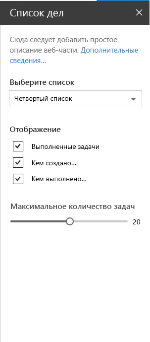

# <a name="make-your-sharepoint-client-side-web-part-configurable"></a><span data-ttu-id="b0053-102">Сделайте клиентскую веб-часть SharePoint настраиваемой</span><span class="sxs-lookup"><span data-stu-id="b0053-102">Make your SharePoint client-side web part configurable</span></span>

<span data-ttu-id="b0053-p101">С помощью области свойств пользователи могут настраивать различные свойства веб-части. В статье [Создание первой веб-части](../get-started/build-a-hello-world-web-part.md) рассказывается, как определить область свойств в классе **HelloWorldWebPart**. Свойства для области свойств определяются в параметре **propertyPaneSettings**.</span><span class="sxs-lookup"><span data-stu-id="b0053-p101">The property pane allows end users to configure the web part with a bunch of properties. The article [Build your first web part](../get-started/build-a-hello-world-web-part.md) describes how the property pane is defined in the **HelloWorldWebPart** class. The property pane properties are defined in  **propertyPaneSettings**.</span></span>

<span data-ttu-id="b0053-106">На представленном ниже рисунке показан пример области свойств в SharePoint.</span><span class="sxs-lookup"><span data-stu-id="b0053-106">The following figure shows an example of a property pane in SharePoint.</span></span>



<span data-ttu-id="b0053-108">Область свойств содержит метаданные трех основных типов:</span><span class="sxs-lookup"><span data-stu-id="b0053-108">The property pane has three key metadata:</span></span>

* <span data-ttu-id="b0053-109">Страницы</span><span class="sxs-lookup"><span data-stu-id="b0053-109">Pages</span></span>
* <span data-ttu-id="b0053-110">Заголовок</span><span class="sxs-lookup"><span data-stu-id="b0053-110">Header</span></span>
* <span data-ttu-id="b0053-111">Группы</span><span class="sxs-lookup"><span data-stu-id="b0053-111">Groups</span></span>

<span data-ttu-id="b0053-p102">Вы можете разделять сложные взаимодействия на страницы. Страницы содержат заголовки и группы.</span><span class="sxs-lookup"><span data-stu-id="b0053-p102">Pages provide you the flexibility to separate complex interactions and put them into one or more pages. Pages then contain Header and Groups.</span></span>

<span data-ttu-id="b0053-114">С помощью заголовка можно определить название области свойств, а с помощью групп — различные разделы области свойств для группирования наборов полей.</span><span class="sxs-lookup"><span data-stu-id="b0053-114">Header allows you to define the title of the property pane and Groups let you define the various sections for the property pane through which you want to group your field sets.</span></span> 

<span data-ttu-id="b0053-115">Область свойств должна содержать страницу, необязательный заголовок и как минимум одну группу.</span><span class="sxs-lookup"><span data-stu-id="b0053-115">A property pane should contain a page, an optional header, and at least one group.</span></span>

<span data-ttu-id="b0053-116">Затем поля свойств определяются в группе.</span><span class="sxs-lookup"><span data-stu-id="b0053-116">Property fields are then defined inside a group.</span></span> 

## <a name="using-the-property-pane"></a><span data-ttu-id="b0053-117">Использование области свойств</span><span class="sxs-lookup"><span data-stu-id="b0053-117">Using the property pane</span></span>

<span data-ttu-id="b0053-p103">В приведенном ниже примере кода инициализируется и настраивается область свойств для веб-части. Переопределяется метод **getPropertyPaneConfiguration** и возвращается коллекция страниц области свойств.</span><span class="sxs-lookup"><span data-stu-id="b0053-p103">The following code example initializes and configures the property pane in your web part. You override the **getPropertyPaneConfiguration** method and return a collection of property pane page(s).</span></span>

```ts
protected getPropertyPaneConfiguration(): IPropertyPaneConfiguration {
  return {
    pages: [
      {
        header: {
          description: strings.PropertyPaneDescription
        },
        groups: [
          {
            groupName: strings.BasicGroupName,
            groupFields: [
              PropertyPaneTextField('description', {
                label: strings.DescriptionFieldLabel
              })
            ]
          }
        ]
      }
    ]
  };
}
```

### <a name="property-pane-fields"></a><span data-ttu-id="b0053-120">Поля области свойств</span><span class="sxs-lookup"><span data-stu-id="b0053-120">Property pane fields</span></span>

<span data-ttu-id="b0053-121">Поддерживаемые типы полей представлены ниже.</span><span class="sxs-lookup"><span data-stu-id="b0053-121">The following field types are supported:</span></span>

* <span data-ttu-id="b0053-122">Кнопка</span><span class="sxs-lookup"><span data-stu-id="b0053-122">Button</span></span>
* <span data-ttu-id="b0053-123">Флажок</span><span class="sxs-lookup"><span data-stu-id="b0053-123">Checkbox</span></span>
* <span data-ttu-id="b0053-124">Группа выбора</span><span class="sxs-lookup"><span data-stu-id="b0053-124">Choice group</span></span>
* <span data-ttu-id="b0053-125">Раскрывающийся список</span><span class="sxs-lookup"><span data-stu-id="b0053-125">Dropdown</span></span>
* <span data-ttu-id="b0053-126">Горизонтальная линейка</span><span class="sxs-lookup"><span data-stu-id="b0053-126">Horizontal rule</span></span>
* <span data-ttu-id="b0053-127">Метка</span><span class="sxs-lookup"><span data-stu-id="b0053-127">Label</span></span>
* <span data-ttu-id="b0053-128">Ссылка</span><span class="sxs-lookup"><span data-stu-id="b0053-128">Link</span></span>
* <span data-ttu-id="b0053-129">Ползунок</span><span class="sxs-lookup"><span data-stu-id="b0053-129">Slider</span></span>
* <span data-ttu-id="b0053-130">Текстовое поле</span><span class="sxs-lookup"><span data-stu-id="b0053-130">Textbox</span></span>
* <span data-ttu-id="b0053-131">Многострочное текстовое поле</span><span class="sxs-lookup"><span data-stu-id="b0053-131">Multi-line Textbox</span></span>
* <span data-ttu-id="b0053-132">Переключатель</span><span class="sxs-lookup"><span data-stu-id="b0053-132">Toggle</span></span>
* <span data-ttu-id="b0053-133">Пользовательский сервер</span><span class="sxs-lookup"><span data-stu-id="b0053-133">Custom</span></span>

<span data-ttu-id="b0053-p104">Типы полей доступны в виде модулей в **sp-client-platform**. Прежде чем использовать их в коде, их необходимо импортировать.</span><span class="sxs-lookup"><span data-stu-id="b0053-p104">The field types are available as modules in **sp-client-platform**. They require an import before you can use them in your code:</span></span>

```ts
import {
  PropertyPaneTextField,
  PropertyPaneCheckbox,
  PropertyPaneLabel,
  PropertyPaneLink,
  PropertyPaneSlider,
  PropertyPaneToggle,
  PropertyPaneDropdown
} from '@microsoft/sp-client-preview';
```

<span data-ttu-id="b0053-136">Метод определения каждого типа поля приведен ниже (для примера используется тип **PropertyPaneTextField**).</span><span class="sxs-lookup"><span data-stu-id="b0053-136">Every field type method is defined as follows, taking **PropertyPaneTextField** as an example:</span></span>

```ts
PropertyPaneTextField('targetProperty',{
  //field properties are defined here
})
```

<span data-ttu-id="b0053-137">**targetProperty** определяет объект, связанный с этим типом поля, а также определяется в интерфейсе свойств веб-части.</span><span class="sxs-lookup"><span data-stu-id="b0053-137">**targetProperty** defines the associated object for that field type and is also defined in the props interface in your web part.</span></span>

<span data-ttu-id="b0053-138">Чтобы назначить типы этим свойствам, определите в классе веб-части интерфейс, включающий одно или несколько целевых свойств.</span><span class="sxs-lookup"><span data-stu-id="b0053-138">To assign types to these properties, define an interface in your web part class that includes one or more target properties.</span></span>

```ts
export interface IHelloWorldWebPartProps {
    targetProperty: string
}
```

<span data-ttu-id="b0053-139">В веб-части можно получить к нему доступ с помощью свойства **this.properties.targetProperty**.</span><span class="sxs-lookup"><span data-stu-id="b0053-139">This is then available in your web part using **this.properties.targetProperty**.</span></span>

```ts
<p class="ms-font-l ms-fontColor-white">${this.properties.description}</p>
```

<span data-ttu-id="b0053-p105">Если свойства определены, к ним можно обращаться из веб-части с помощью переменной **this.properties.[property-name]**. Дополнительные сведения см. в описании метода [**render** веб-части **HelloWorldWebPart**](../get-started/build-a-hello-world-web-part.md#web-part-render-method).</span><span class="sxs-lookup"><span data-stu-id="b0053-p105">When the properties are defined, you can access them in your web part using the **this.properties.[property-name]**. For details, see [**render** method of the **HelloWorldWebPart**](../get-started/build-a-hello-world-web-part.md#web-part-render-method).</span></span>

## <a name="handling-field-changes"></a><span data-ttu-id="b0053-142">Обработка изменений полей</span><span class="sxs-lookup"><span data-stu-id="b0053-142">Handling field changes</span></span>

<span data-ttu-id="b0053-143">У области свойств есть два режима взаимодействия:</span><span class="sxs-lookup"><span data-stu-id="b0053-143">The property pane has two interaction modes:</span></span>

* <span data-ttu-id="b0053-144">Реактивный</span><span class="sxs-lookup"><span data-stu-id="b0053-144">Reactive</span></span>
* <span data-ttu-id="b0053-145">Нереактивный</span><span class="sxs-lookup"><span data-stu-id="b0053-145">Non-reactive</span></span>

<span data-ttu-id="b0053-p106">В реактивном режиме при каждом изменении вызывается соответствующее событие. В этом режиме веб-часть автоматически обновляется с использованием новых значений.</span><span class="sxs-lookup"><span data-stu-id="b0053-p106">In reactive mode, on every change, a change event is triggered. Reactive behavior automatically updates the web part with the new values.</span></span>

<span data-ttu-id="b0053-p107">Хотя реактивного режима достаточно для многих сценариев, иногда требуется нереактивное поведение. В нереактивном режиме веб-часть не обновляется автоматически, если пользователь не подтвердит изменения. Чтобы включить нереактивный режим, добавьте следующий код в веб-часть:</span><span class="sxs-lookup"><span data-stu-id="b0053-p107">While reactive mode is sufficient for many scenarios, at times you will need non-reactive behavior. Non-reactive does not update the web part automatically unless the user confirms the changes. To turn on the non-reactive mode, add the following code in your web part:</span></span>

```ts 
protected get disableReactivePropertyChanges(): boolean { 
  return true; 
}
```

## <a name="custom-property-pane-controls"></a><span data-ttu-id="b0053-151">Пользовательский элемент управления области свойств</span><span class="sxs-lookup"><span data-stu-id="b0053-151">Custom property pane controls</span></span>

<span data-ttu-id="b0053-p108">Платформа SharePoint Framework содержит набор стандартных элементов управления для области свойств, но иногда нужны дополнительные функции. SharePoint Framework дает возможность создавать пользовательские элементы управления для обеспечения требуемой функциональности. Дополнительные сведения см. в руководстве [Создание пользовательских элементов управления для панели свойств](../guidance/build-custom-property-pane-controls.md).</span><span class="sxs-lookup"><span data-stu-id="b0053-p108">SharePoint Framework contains a set of standard controls for the property pane. But sometimes you need additional functionality beyond the basic controls. SharePoint Framework allows you to build custom controls to deliver the require functionality. To learn more, read the [Build custom controls for the property pane](../guidance/build-custom-property-pane-controls.md) guide.</span></span>
