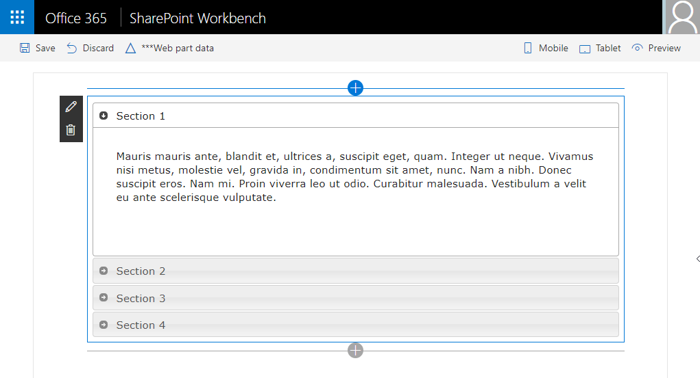

# <a name="add-jqueryui-accordion-to-your-sharepoint-client-side-web-part"></a><span data-ttu-id="ea41c-102">Добавление элемента Accordion jQueryUI в клиентскую веб-часть SharePoint</span><span class="sxs-lookup"><span data-stu-id="ea41c-102">Add jQueryUI Accordion to your SharePoint client-side web part</span></span>

<span data-ttu-id="ea41c-p101">В этой статье описано, как добавить элемент Accordion jQueryUI в проект веб-части. Для этого нужно создать новую веб-часть, как показано на приведенном ниже изображении.</span><span class="sxs-lookup"><span data-stu-id="ea41c-p101">This article describes how to add the jQueryUI Accordion to your web part project. This involves creating a new web part, as shown in the following image.</span></span> 



<span data-ttu-id="ea41c-106">Эти действия также показаны в видео на [канале SharePoint PnP в YouTube](https://www.youtube.com/watch?v=7UOxTbMMPrQ&index=6&list=PLR9nK3mnD-OXvSWvS2zglCzz4iplhVrKq).</span><span class="sxs-lookup"><span data-stu-id="ea41c-106">You can also follow these steps by watching the video on the [SharePoint PnP YouTube Channel](https://www.youtube.com/watch?v=7UOxTbMMPrQ&index=6&list=PLR9nK3mnD-OXvSWvS2zglCzz4iplhVrKq).</span></span> 

<a href="https://www.youtube.com/watch?v=7UOxTbMMPrQ&index=6&list=PLR9nK3mnD-OXvSWvS2zglCzz4iplhVrKq">

</a>

## <a name="prerequisites"></a><span data-ttu-id="ea41c-107">Обязательные условия</span><span class="sxs-lookup"><span data-stu-id="ea41c-107">Prerequisites</span></span>
<span data-ttu-id="ea41c-108">Прежде чем начать, выполните следующие действия:</span><span class="sxs-lookup"><span data-stu-id="ea41c-108">Complete the following steps before you start:</span></span>

* <span data-ttu-id="ea41c-109">[Создайте свою первую веб-часть](build-a-hello-world-web-part.md).</span><span class="sxs-lookup"><span data-stu-id="ea41c-109">[Build your first web part](build-a-hello-world-web-part.md)</span></span>
* <span data-ttu-id="ea41c-110">[Подключитесь к SharePoint](connect-to-sharepoint.md).</span><span class="sxs-lookup"><span data-stu-id="ea41c-110">[Connect to SharePoint](connect-to-sharepoint.md)</span></span>

<span data-ttu-id="ea41c-p102">Цепочка инструментов разработчика для добавления веб-частей в пакет использует Webpack, SystemJS и CommonJS. При этом загружаются возможные внешние зависимости, такие как jQuery и jQueryUI. Для загрузки внешних зависимостей на более высоком уровне:</span><span class="sxs-lookup"><span data-stu-id="ea41c-p102">The developer toolchain uses Webpack, SystemJS and CommonJS to bundle your web parts. This includes loading any external dependencies such as jQuery or jQueryUI. To load external dependencies, at a high level, you will need to:</span></span>

* <span data-ttu-id="ea41c-114">Получите внешнюю библиотеку с помощью npm или скачайте ее на сайте поставщика.</span><span class="sxs-lookup"><span data-stu-id="ea41c-114">Acquire the external library, either via npm or download from the vendor.</span></span>
* <span data-ttu-id="ea41c-115">Установите [определения типов TypeScript](http://definitelytyped.org/) для соответствующей платформы (при наличии).</span><span class="sxs-lookup"><span data-stu-id="ea41c-115">If available, install the respective framework's [TypeScript type definitions](http://definitelytyped.org/).</span></span>
* <span data-ttu-id="ea41c-116">При необходимости обновите конфигурацию решения, чтобы в пакет веб-части не добавлялась по умолчанию внешняя зависимость.</span><span class="sxs-lookup"><span data-stu-id="ea41c-116">If required, update your solution config to not include the external dependency in your web part bundle by default.</span></span>

## <a name="create-a-new-web-part-project"></a><span data-ttu-id="ea41c-117">Создание проекта веб-части</span><span class="sxs-lookup"><span data-stu-id="ea41c-117">Create a new web part project</span></span>

<span data-ttu-id="ea41c-118">Создайте каталог проекта в любом расположении:</span><span class="sxs-lookup"><span data-stu-id="ea41c-118">Create a new project directory in your favorite location:</span></span>

```
md jquery-webpart
```
    
> <span data-ttu-id="ea41c-119">**Предупреждение.** Создайте этот каталог в новой папке, а не в папке, вложенной в `helloworld-webpart`.</span><span class="sxs-lookup"><span data-stu-id="ea41c-119">**Warning:** Make sure to create this directory in a new folder, not as a subdirectory of `helloworld-webpart`.</span></span>

<span data-ttu-id="ea41c-120">Перейдите к каталогу проекта:</span><span class="sxs-lookup"><span data-stu-id="ea41c-120">Go to the project directory:</span></span>

```
cd jquery-webpart
```
    
<span data-ttu-id="ea41c-121">Создайте веб-часть jQuery, запустив генератор Yeoman для SharePoint:</span><span class="sxs-lookup"><span data-stu-id="ea41c-121">Create a new jQuery web part by running the Yeoman SharePoint Generator:</span></span>

```
yo @microsoft/sharepoint
```

<span data-ttu-id="ea41c-122">Когда появится запрос:</span><span class="sxs-lookup"><span data-stu-id="ea41c-122">When prompted:</span></span>

* <span data-ttu-id="ea41c-123">Оставьте имя по умолчанию **jquery-webpart** для своего решения и нажмите клавишу **ВВОД**.</span><span class="sxs-lookup"><span data-stu-id="ea41c-123">Accept the default **jquery-webpart** as your solution name and choose **Enter**.</span></span>
* <span data-ttu-id="ea41c-124">Выберите **Только SharePoint Online (новая версия)** и нажмите клавишу **ВВОД**.</span><span class="sxs-lookup"><span data-stu-id="ea41c-124">Choose **SharePoint Online only (latest)**, and press **Enter**.</span></span>
* <span data-ttu-id="ea41c-125">Выберите вариант **Использовать текущую папку** для размещения файлов.</span><span class="sxs-lookup"><span data-stu-id="ea41c-125">Select **Use the current folder** for where to place the files.</span></span>
* <span data-ttu-id="ea41c-126">Выберите **N**, чтобы сделать установку расширения обязательной на каждом сайте при его использовании.</span><span class="sxs-lookup"><span data-stu-id="ea41c-126">Choose **N** to require the extension to be installed on each site explicitly when it's being used.</span></span> 
* <span data-ttu-id="ea41c-127">Выберите **WebPart** в качестве типа создаваемого клиентского компонента.</span><span class="sxs-lookup"><span data-stu-id="ea41c-127">Choose **WebPart** as the client-side component type to be created.</span></span> 

<span data-ttu-id="ea41c-128">Далее потребуется указать определенные сведения о веб-части:</span><span class="sxs-lookup"><span data-stu-id="ea41c-128">The next set of prompts will ask for specific information about your web part:</span></span>

* <span data-ttu-id="ea41c-129">Введите имя **jQuery** для веб-части и нажмите клавишу **ВВОД**.</span><span class="sxs-lookup"><span data-stu-id="ea41c-129">Type **jQuery** for the web part name and choose **Enter**.</span></span>
* <span data-ttu-id="ea41c-130">Введите описание веб-части **jQuery Web Part** и нажмите клавишу **ВВОД**.</span><span class="sxs-lookup"><span data-stu-id="ea41c-130">Enter **jQuery Web Part** as the description of the web part and choose **Enter**.</span></span> 
* <span data-ttu-id="ea41c-131">Оставьте параметр **Не использовать платформу веб-решений на базе JavaScript** по умолчанию и нажмите клавишу **ВВОД**, чтобы продолжить.</span><span class="sxs-lookup"><span data-stu-id="ea41c-131">Accept the default **No JavaScript framework** option for the framework and choose **Enter** to continue.</span></span>

<span data-ttu-id="ea41c-p103">После этого Yeoman установит необходимые зависимости и выполнит скаффолдинг файлов решения. Это может занять несколько минут. При этом Yeoman также включит в проект веб-часть **jQueryWebPart**.</span><span class="sxs-lookup"><span data-stu-id="ea41c-p103">At this point, Yeoman will install the required dependencies and scaffold the solution files. This might take a few minutes. Yeoman will scaffold the project to include your **jQueryWebPart** web part as well.</span></span>

<span data-ttu-id="ea41c-135">После скаффолдинга заблокируйте версию зависимостей проекта, выполнив следующую команду:</span><span class="sxs-lookup"><span data-stu-id="ea41c-135">Once the scaffolding completes, lock down the version of the project dependencies by running the following command:</span></span>

```sh
npm shrinkwrap
```

<span data-ttu-id="ea41c-136">Далее введите следующий код, чтобы открыть проект веб-части в Visual Studio Code:</span><span class="sxs-lookup"><span data-stu-id="ea41c-136">Next, type the following to open the web part project in Visual Studio Code:</span></span>

```
code .
```

## <a name="install-jquery-and-jquery-ui-npm-packages"></a><span data-ttu-id="ea41c-137">Установка пакетов NPM jQuery и jQuery UI</span><span class="sxs-lookup"><span data-stu-id="ea41c-137">Install jQuery and jQuery UI NPM Packages</span></span>

<span data-ttu-id="ea41c-138">Введите в консоли следующий код, чтобы установить пакет npm jQuery:</span><span class="sxs-lookup"><span data-stu-id="ea41c-138">In the console, type the following to install jQuery npm package:</span></span>

```
npm install --save jquery@2
```

 <span data-ttu-id="ea41c-139">Теперь введите следующий код, чтобы установить пакет npm jQueryUI:</span><span class="sxs-lookup"><span data-stu-id="ea41c-139">Now type the following to install jQueryUI npm package:</span></span>

```
npm install --save jqueryui
```

<span data-ttu-id="ea41c-p104">Далее необходимо установить определения типов для проекта. Начиная с TypeScript 2.0 определения типов можно устанавливать с помощью npm.</span><span class="sxs-lookup"><span data-stu-id="ea41c-p104">Next we'll need to install the typings for our project. Starting from TypeScript 2.0, we can use npm to install needed typings.</span></span>

<span data-ttu-id="ea41c-142">Откройте консоль и установите необходимые типы:</span><span class="sxs-lookup"><span data-stu-id="ea41c-142">Open your console and install needed types:</span></span>

```
npm install --save @types/jquery@2
npm install --save @types/jqueryui
```

### <a name="unbundle-external-dependencies-from-web-part-bundle"></a><span data-ttu-id="ea41c-143">Извлечение внешних зависимостей из пакета веб-части</span><span class="sxs-lookup"><span data-stu-id="ea41c-143">Unbundle external dependencies from web part bundle</span></span>
<span data-ttu-id="ea41c-p105">По умолчанию все добавляемые зависимости включаются в пакет веб-части. Это не всегда удобно. Вы можете извлечь эти зависимости из пакета веб-части.</span><span class="sxs-lookup"><span data-stu-id="ea41c-p105">By default, any dependencies you add are bundled into the web part bundle. In some cases, this is not ideal. You can choose to unbundle these dependencies from the web part bundle.</span></span>

<span data-ttu-id="ea41c-147">В Visual Studio Code откройте файл **config\config.json**.</span><span class="sxs-lookup"><span data-stu-id="ea41c-147">In Visual Studio Code, open the file **config\config.json**.</span></span>

<span data-ttu-id="ea41c-148">Этот файл содержит сведения о пакетах и возможных внешних зависимостях.</span><span class="sxs-lookup"><span data-stu-id="ea41c-148">This file contains information about your bundle(s) and any external dependencies.</span></span> 

<span data-ttu-id="ea41c-p106">Область `bundles` содержит сведения о пакете по умолчанию (в данном случае — пакете веб-части jQuery). Каждой добавленной веб-части, добавленной в решение, соответствует одна запись.</span><span class="sxs-lookup"><span data-stu-id="ea41c-p106">The `bundles` region contains the default bundle information - in this case, the jQuery web part bundle. When you add more web parts to your solution, you will see one entry per web part.</span></span>

```json
  "bundles": {
    "j-query-web-part": {
      "components": [
        {
          "entrypoint": "./lib/webparts/jQuery/JQueryWebPart.js",
          "manifest": "./src/webparts/jQuery/JQueryWebPart.manifest.json"
        }
      ]
    }
  },
```

<span data-ttu-id="ea41c-151">Раздел `externals` содержит библиотеки, не включенные в пакет по умолчанию.</span><span class="sxs-lookup"><span data-stu-id="ea41c-151">You can use the `externals` section contains the libraries that are not bundled with the default bundle.</span></span> 

```json
  "externals": {},
```

<span data-ttu-id="ea41c-152">Чтобы исключить `jQuery` и `jQueryUI` из пакета по умолчанию, добавьте модули в раздел `externals`:</span><span class="sxs-lookup"><span data-stu-id="ea41c-152">To exclude `jQuery` and `jQueryUI` from the default bundle, add the modules to the `externals` section:</span></span>

```json
"jquery":"node_modules/jquery/dist/jquery.min.js",
"jqueryui":"node_modules/jqueryui/jquery-ui.min.js"
```

<span data-ttu-id="ea41c-153">Теперь при создании проекта `jQuery` и `jQueryUI` не будут добавляться в пакет веб-части по умолчанию.</span><span class="sxs-lookup"><span data-stu-id="ea41c-153">Now when you build your project, `jQuery` and `jQueryUI` will not be bundled into your default web part bundle.</span></span>

<span data-ttu-id="ea41c-154">Ниже приведено полное содержимое файла config.json на настоящий момент.</span><span class="sxs-lookup"><span data-stu-id="ea41c-154">Full content of the config.json file as currently as follows</span></span>

```json
{
  "$schema": "https://dev.office.com/json-schemas/spfx-build/config.2.0.schema.json",
  "version": "2.0",
  "bundles": {
    "j-query-web-part": {
      "components": [
        {
          "entrypoint": "./lib/webparts/jQuery/JQueryWebPart.js",
          "manifest": "./src/webparts/jQuery/JQueryWebPart.manifest.json"
        }
      ]
    }
  },
  "externals": {
    "jquery":"node_modules/jquery/dist/jquery.min.js",
    "jqueryui":"node_modules/jqueryui/jquery-ui.min.js"
  },
  "localizedResources": {
    "JQueryWebPartStrings": "lib/webparts/jQuery/loc/{locale}.js"
  }
}
```


## <a name="build-the-accordion"></a><span data-ttu-id="ea41c-155">Создание элемента Accordion</span><span class="sxs-lookup"><span data-stu-id="ea41c-155">Build the Accordion</span></span>

<span data-ttu-id="ea41c-156">Откройте папку проекта **jquery-webpart** в Visual Studio Code.</span><span class="sxs-lookup"><span data-stu-id="ea41c-156">Open the project folder **jquery-webpart** in Visual Studio Code.</span></span> <span data-ttu-id="ea41c-157">Проект должен содержать веб-часть jQuery, добавленную ранее в папку `/src/webparts/jQuery`.</span><span class="sxs-lookup"><span data-stu-id="ea41c-157">Your project should have the jQuery web part that you added earlier under the `/src/webparts/jQuery` folder.</span></span>

### <a name="add-accordion-html"></a><span data-ttu-id="ea41c-158">Добавление HTML-кода Accordion</span><span class="sxs-lookup"><span data-stu-id="ea41c-158">Add Accordion HTML</span></span>
<span data-ttu-id="ea41c-159">Добавьте в папку `src/webparts/jQuery` новый файл **MyAccordionTemplate.ts**.</span><span class="sxs-lookup"><span data-stu-id="ea41c-159">Add a new file in the `src/webparts/jQuery` folder called **MyAccordionTemplate.ts**.</span></span>

<span data-ttu-id="ea41c-160">Создайте и экспортируйте (как модуль) класс `MyAccordionTemplate`, содержащий HTML-код элемента Accordion.</span><span class="sxs-lookup"><span data-stu-id="ea41c-160">Create and export (as a module) a class `MyAccordionTemplate` that holds the HTML code for the accordion.</span></span>

```ts
export default class MyAccordionTemplate {
    public static templateHtml: string =  `
      <div class="accordion">
        <h3>Section 1</h3>
        <div>
            <p>
            Mauris mauris ante, blandit et, ultrices a, suscipit eget, quam. Integer
            ut neque. Vivamus nisi metus, molestie vel, gravida in, condimentum sit
            amet, nunc. Nam a nibh. Donec suscipit eros. Nam mi. Proin viverra leo ut
            odio. Curabitur malesuada. Vestibulum a velit eu ante scelerisque vulputate.
            </p>
        </div>
        <h3>Section 2</h3>
        <div>
            <p>
            Sed non urna. Donec et ante. Phasellus eu ligula. Vestibulum sit amet
            purus. Vivamus hendrerit, dolor at aliquet laoreet, mauris turpis porttitor
            velit, faucibus interdum tellus libero ac justo. Vivamus non quam. In
            suscipit faucibus urna.
            </p>
        </div>
        <h3>Section 3</h3>
        <div>
            <p>
            Nam enim risus, molestie et, porta ac, aliquam ac, risus. Quisque lobortis.
            Phasellus pellentesque purus in massa. Aenean in pede. Phasellus ac libero
            ac tellus pellentesque semper. Sed ac felis. Sed commodo, magna quis
            lacinia ornare, quam ante aliquam nisi, eu iaculis leo purus venenatis dui.
            </p>
            <ul>
            <li>List item one</li>
            <li>List item two</li>
            <li>List item three</li>
            </ul>
        </div>
        <h3>Section 4</h3>
        <div>
            <p>
            Cras dictum. Pellentesque habitant morbi tristique senectus et netus
            et malesuada fames ac turpis egestas. Vestibulum ante ipsum primis in
            faucibus orci luctus et ultrices posuere cubilia Curae; Aenean lacinia
            mauris vel est.
            </p>
            <p>
            Suspendisse eu nisl. Nullam ut libero. Integer dignissim consequat lectus.
            Class aptent taciti sociosqu ad litora torquent per conubia nostra, per
            inceptos himenaeos.
            </p>
        </div>
     </div>`;
}
```

<span data-ttu-id="ea41c-161">Сохраните файл.</span><span class="sxs-lookup"><span data-stu-id="ea41c-161">Save the file.</span></span>

### <a name="import-accordion-html"></a><span data-ttu-id="ea41c-162">Импорт HTML-кода Accordion</span><span class="sxs-lookup"><span data-stu-id="ea41c-162">Import Accordion HTML</span></span>

<span data-ttu-id="ea41c-163">В Visual Studio Code откройте **src\webparts\jQuery\JQueryWebPart.ts**.</span><span class="sxs-lookup"><span data-stu-id="ea41c-163">In Visual Studio Code, open **src\webparts\jQuery\JQueryWebPart.ts**.</span></span>

<span data-ttu-id="ea41c-164">В верхней части файла, где указаны другие операции импорта, добавьте следующий код:</span><span class="sxs-lookup"><span data-stu-id="ea41c-164">At the top of the file, where you can find other imports, add the following import:</span></span>

```ts
import MyAccordionTemplate from './MyAccordionTemplate';
```

### <a name="import-jquery-and-jqueryui"></a><span data-ttu-id="ea41c-165">Импорт jQuery и jQueryUI</span><span class="sxs-lookup"><span data-stu-id="ea41c-165">Import jQuery and jQueryUI</span></span>
<span data-ttu-id="ea41c-166">Вы можете импортировать jQuery в свою веб-часть так же, как импортировали MyAccordionTemplate.</span><span class="sxs-lookup"><span data-stu-id="ea41c-166">You can import jQuery your web part in the same way that you imported MyAccordionTemplate.</span></span>

<span data-ttu-id="ea41c-167">В верхней части файла, где указаны другие операции импорта, добавьте следующий код:</span><span class="sxs-lookup"><span data-stu-id="ea41c-167">At the top of the file, where you can find other imports, add the following imports:</span></span>

```ts
import * as jQuery from 'jquery';
import 'jqueryui';
```

<span data-ttu-id="ea41c-p108">После этого необходимо загрузить внешние CSS-файлы. Для этого используйте загрузчик модулей. Добавьте следующую операцию импорта:</span><span class="sxs-lookup"><span data-stu-id="ea41c-p108">Next, you'll load some external css files. To do that, use the module loader. Add the following import:</span></span>

```ts
import { SPComponentLoader } from '@microsoft/sp-loader';
```

<span data-ttu-id="ea41c-p109">Чтобы загрузить стили jQueryUI, в классе `JQueryWebPart` веб-части необходимо добавить конструктор и использовать импортированный ранее SPComponentLoader. Добавьте представленный ниже конструктор в веб-часть.</span><span class="sxs-lookup"><span data-stu-id="ea41c-p109">To load the jQueryUI styles, in the `JQueryWebPart` web part class, you'll need to add a constructor and use the newly imported SPComponentLoader. Add following constructor to your web part.</span></span> 

```ts
  public constructor() {
    super();

    SPComponentLoader.loadCss('//code.jquery.com/ui/1.11.4/themes/smoothness/jquery-ui.css');
  }
```

<span data-ttu-id="ea41c-173">Этот код выполняет следующие действия:</span><span class="sxs-lookup"><span data-stu-id="ea41c-173">This code does the following:</span></span>

* <span data-ttu-id="ea41c-174">Вызывает родительский конструктор с контекстом для инициализации веб-части.</span><span class="sxs-lookup"><span data-stu-id="ea41c-174">Calls the parent constructor with the context to initialize the web part.</span></span>
* <span data-ttu-id="ea41c-175">Асинхронно загружает стили accordion из CDN.</span><span class="sxs-lookup"><span data-stu-id="ea41c-175">Loads the accordion styles from a CDN asynchronously.</span></span>

### <a name="render-accordion"></a><span data-ttu-id="ea41c-176">Отрисовка Accordion</span><span class="sxs-lookup"><span data-stu-id="ea41c-176">Render Accordion</span></span>

<span data-ttu-id="ea41c-177">В `jQueryWebPart.ts` перейдите к методу `render`.</span><span class="sxs-lookup"><span data-stu-id="ea41c-177">In the `jQueryWebPart.ts`, go to the `render` method.</span></span>

<span data-ttu-id="ea41c-178">Укажите отрисовку HTML-кода accordion во внутреннем HTML-коде веб-части:</span><span class="sxs-lookup"><span data-stu-id="ea41c-178">Set the web part's inner HTML to render the accordion HTML:</span></span>

```ts
this.domElement.innerHTML = MyAccordionTemplate.templateHtml;
```

<span data-ttu-id="ea41c-p110">Настроить элемент Accordion jQueryUI можно несколькими способами. Задайте несколько параметров для элемента accordion прямо под строкой `this.domElement.innerHTML = MyAccordionTemplate.templateHtml;`:</span><span class="sxs-lookup"><span data-stu-id="ea41c-p110">jQueryUI Accordion has few options that you can set to customize the accordion. Define a few options for your accordion just below `this.domElement.innerHTML = MyAccordionTemplate.templateHtml;`:</span></span>

```ts
const accordionOptions: JQueryUI.AccordionOptions = {
  animate: true,
  collapsible: false,
  icons: {
    header: 'ui-icon-circle-arrow-e',
    activeHeader: 'ui-icon-circle-arrow-s'
  }
};
```

<span data-ttu-id="ea41c-181">Как видите, типизированное определение jQueryUI позволяет создать типизированную переменную `JQueryUI.AccordionOptions` и указать поддерживаемые свойства.</span><span class="sxs-lookup"><span data-stu-id="ea41c-181">As you can see, jQueryUI typed definition allows you to create a typed variable called `JQueryUI.AccordionOptions` and specify the supported properties.</span></span> 

<span data-ttu-id="ea41c-182">Поэкспериментировав с IntelliSense, вы заметите, что поддерживаются все доступные методы в `JQueryUI.`, а также параметры методов.</span><span class="sxs-lookup"><span data-stu-id="ea41c-182">If you play around with the IntelliSense, you will notice you will get full support for available methods under `JQueryUI.` as well as the method parameters.</span></span>

<span data-ttu-id="ea41c-183">Инициализируйте элемент accordion:</span><span class="sxs-lookup"><span data-stu-id="ea41c-183">Finally, initialize the accordion:</span></span>

```ts
jQuery('.accordion', this.domElement).accordion(accordionOptions);
```

<span data-ttu-id="ea41c-p111">Как видите, применяется переменная `jQuery`, которую вы использовали для импорта модуля `jquery`. Затем инициализируется элемент Accordion.</span><span class="sxs-lookup"><span data-stu-id="ea41c-p111">As you can see, you use the variable `jQuery` that you used to import the `jquery` module. You then initialize the accordion.</span></span>

<span data-ttu-id="ea41c-186">Метод `render` полностью выглядит так:</span><span class="sxs-lookup"><span data-stu-id="ea41c-186">The complete `render` method looks like this:</span></span>

```ts
public render(): void {
  this.domElement.innerHTML = MyAccordionTemplate.templateHtml;

  const accordionOptions: JQueryUI.AccordionOptions = {
    animate: true,
    collapsible: false,
    icons: {
      header: 'ui-icon-circle-arrow-e',
      activeHeader: 'ui-icon-circle-arrow-s'
    }
  };

  jQuery('.accordion', this.domElement).accordion(accordionOptions);
}
```

<span data-ttu-id="ea41c-187">Сохраните файл.</span><span class="sxs-lookup"><span data-stu-id="ea41c-187">Save the file.</span></span>

## <a name="preview-the-web-part"></a><span data-ttu-id="ea41c-188">Просмотр веб-части</span><span class="sxs-lookup"><span data-stu-id="ea41c-188">Preview the web part</span></span>

<span data-ttu-id="ea41c-189">В консоли откройте папку jquery-webpart и введите следующую строку для сборки и просмотра веб-части:</span><span class="sxs-lookup"><span data-stu-id="ea41c-189">In your console, make sure you are still in the jquery-webpart folder and type the following to build and preview your web part:</span></span>

```
gulp serve
```

> [!NOTE]
> <span data-ttu-id="ea41c-190">Visual Studio Code поддерживает Gulp и другие средства запуска задач.</span><span class="sxs-lookup"><span data-stu-id="ea41c-190">Visual Studio Code provides built-in support for gulp and other task runners.</span></span> <span data-ttu-id="ea41c-191">Нажмите клавиши **CTRL+SHIFT+B** в Windows или **CMD+SHIFT+B** в macOS для отладки и просмотра веб-части.</span><span class="sxs-lookup"><span data-stu-id="ea41c-191">You can choose **Ctrl+Shift+B** in Windows or **Cmd+Shift+B** on a Mac to debug and preview your web part.</span></span>

<span data-ttu-id="ea41c-192">Gulp выполнит задачи и откроет локальную рабочую область веб-частей SharePoint.</span><span class="sxs-lookup"><span data-stu-id="ea41c-192">Gulp will execute the tasks and open the local SharePoint web part workbench.</span></span>

<span data-ttu-id="ea41c-p113">Выберите значок **+** на холсте страницы, чтобы отобразить список веб-частей, и добавьте веб-часть jQuery. Теперь должен появиться элемент Accordion jQueryUI!</span><span class="sxs-lookup"><span data-stu-id="ea41c-p113">In the page canvas, choose the **+** (plus sign) to show the list of web parts, and add the jQuery web part. You should now see the jQueryUI Accordion!</span></span>


<span data-ttu-id="ea41c-196">В консоли, в которой запущена команда `gulp serve`, нажмите клавиши **CTRL+C**, чтобы завершить задачу.</span><span class="sxs-lookup"><span data-stu-id="ea41c-196">In the console where you have `gulp serve` running, choose **Ctrl+C** to terminate the task.</span></span>

> [!NOTE]
> <span data-ttu-id="ea41c-197">Если вы обнаружили ошибку в документации или SharePoint Framework, сообщите о ней разработчикам SharePoint в [репозитории sp-dev-docs](https://github.com/SharePoint/sp-dev-docs/issues).</span><span class="sxs-lookup"><span data-stu-id="ea41c-197">If you find an issue in the documentation or in the SharePoint Framework, please report that to SharePoint engineering using the [issue list at sp-dev-docs repository](https://github.com/SharePoint/sp-dev-docs/issues).</span></span> <span data-ttu-id="ea41c-198">Заранее благодарим за ваш вклад.</span><span class="sxs-lookup"><span data-stu-id="ea41c-198">Thanks for your input advance.</span></span>