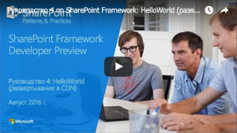
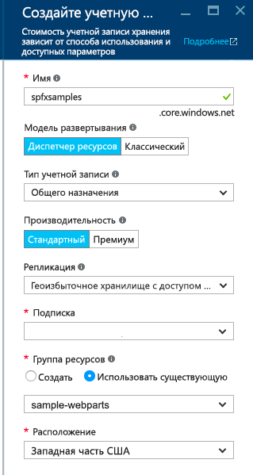
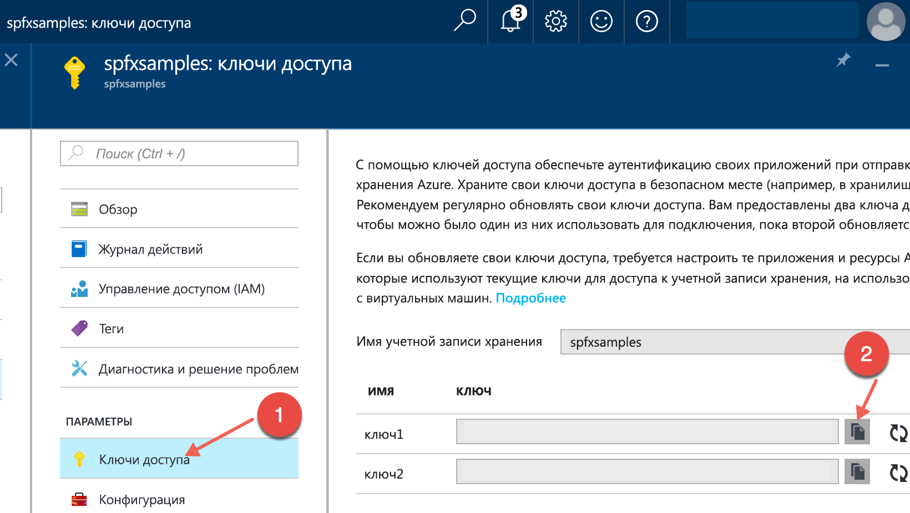
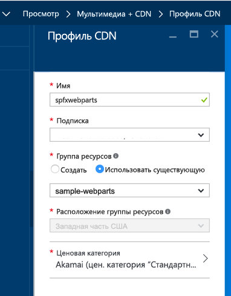
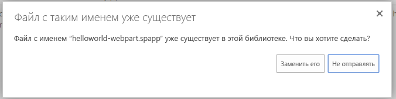

# <a name="deploy-your-sharepoint-client-side-web-part-to-a-cdn"></a><span data-ttu-id="bc568-102">Развертывание клиентской веб-части SharePoint в CDN</span><span class="sxs-lookup"><span data-stu-id="bc568-102">Deploy your SharePoint client-side web part to a CDN</span></span>

<span data-ttu-id="bc568-103">В этой статье описывается развертывание активов **HelloWorld** в удаленной сети доставки содержимого, а не в локальной среде.</span><span class="sxs-lookup"><span data-stu-id="bc568-103">In this article, you will deploy the **HelloWorld** assets to a remote CDN instead of using the local environment.</span></span> <span data-ttu-id="bc568-104">Для развертывания активов мы будем использовать учетную запись службы хранилища Azure, интегрированную с CDN.</span><span class="sxs-lookup"><span data-stu-id="bc568-104">You'll use an Azure Storage account integrated with a CDN to deploy your assets.</span></span> <span data-ttu-id="bc568-105">Инструменты сборки SharePoint Framework по умолчанию поддерживают развертывание в учетной записи службы хранилища Azure. Однако вы также можете вручную отправить файлы предпочитаемому поставщику CDN или в SharePoint.</span><span class="sxs-lookup"><span data-stu-id="bc568-105">In this article, you will deploy the HelloWorld assets to a remote CDN instead of using the local environment. You'll use an Azure Storage account integrated with a CDN to deploy your assets. SharePoint Framework build tools provide out-of-the-box support for deploying to an Azure Storage account; however, you can also manually upload the files to your favorite CDN provider or to SharePoint.</span></span>

<span data-ttu-id="bc568-106">Эти действия также показаны в видео на [канале SharePoint PnP в YouTube](https://www.youtube.com/watch?v=FDGatKnjNeM&list=PLR9nK3mnD-OXvSWvS2zglCzz4iplhVrKq).</span><span class="sxs-lookup"><span data-stu-id="bc568-106">You can also follow these steps by watching the video on the [SharePoint PnP YouTube Channel](https://www.youtube.com/watch?v=FDGatKnjNeM&list=PLR9nK3mnD-OXvSWvS2zglCzz4iplhVrKq).</span></span> 

<a href="https://www.youtube.com/watch?v=FDGatKnjNeM&list=PLR9nK3mnD-OXvSWvS2zglCzz4iplhVrKq">

</a>

> [!NOTE]
> <span data-ttu-id="bc568-107">Существует несколько вариантов разместить активы веб-части.</span><span class="sxs-lookup"><span data-stu-id="bc568-107">There are multiple different hosting options for your web part assets.</span></span> <span data-ttu-id="bc568-108">Этот учебник описывает CDN Azure, но можно также использовать [сеть доставки содержимого Office 365](./hosting-webpart-from-office-365-cdn.md) или просто разместить активы в библиотеке SharePoint со своего клиента.</span><span class="sxs-lookup"><span data-stu-id="bc568-108">This tutorial concentrates on showing the Azure CDN option, but you could also use the [Office 365 CDN](./hosting-webpart-from-office-365-cdn.md) or simply host your assets from SharePoint library from your tenant.</span></span> <span data-ttu-id="bc568-109">Последний вариант тоже рабочий, но уступает в производительности сети доставки содержимого.</span><span class="sxs-lookup"><span data-stu-id="bc568-109">In the latter case, you would not benefit from the CDN performance improvements, but that would also work from the functionality perspective.</span></span> <span data-ttu-id="bc568-110">Активы можно разместить для конечных пользователей в любом расположении, доступном по протоколу HTTP.</span><span class="sxs-lookup"><span data-stu-id="bc568-110">Any location which end users can access using HTTP would be technically suitable for hosting the assets for end users.</span></span>

## <a name="prerequisites"></a><span data-ttu-id="bc568-111">Предварительные условия</span><span class="sxs-lookup"><span data-stu-id="bc568-111">Prerequisites</span></span>

<span data-ttu-id="bc568-112">Прежде чем приступать к работе, убедитесь, что выполнены следующие задачи:</span><span class="sxs-lookup"><span data-stu-id="bc568-112">Make sure that you have completed the following tasks before you begin:</span></span>

* [<span data-ttu-id="bc568-113">Создание первой клиентской веб-части</span><span class="sxs-lookup"><span data-stu-id="bc568-113">Build your first client-side web part</span></span>](./build-a-hello-world-web-part.md)
* [<span data-ttu-id="bc568-114">Подключение клиентской веб-части к SharePoint</span><span class="sxs-lookup"><span data-stu-id="bc568-114">Connect your client-side web part to SharePoint</span></span>](./connect-to-sharepoint.md)
* [<span data-ttu-id="bc568-115">Развертывание клиентской веб-части на классической странице SharePoint</span><span class="sxs-lookup"><span data-stu-id="bc568-115">Deploy your client-side web part to a classic SharePoint page</span></span>](./serve-your-web-part-in-a-sharepoint-page.md)

## <a name="configure-azure-storage-account"></a><span data-ttu-id="bc568-116">Настройка учетной записи хранения Azure</span><span class="sxs-lookup"><span data-stu-id="bc568-116">Configure Azure storage account</span></span>

<span data-ttu-id="bc568-117">Настройте учетную запись хранения Azure и интегрируйте ее с CDN.</span><span class="sxs-lookup"><span data-stu-id="bc568-117">Configure an Azure storage account and integrate it with the CDN.</span></span>

<span data-ttu-id="bc568-118">Вы можете выполнить действия, описанные в статье [Интеграция учетной записи хранения с CDN](https://azure.microsoft.com/ru-RU/documentation/articles/cdn-create-a-storage-account-with-cdn/), а также подробные указания из этой статьи, чтобы создать учетную запись хранения Azure и интегрировать ее с CDN.</span><span class="sxs-lookup"><span data-stu-id="bc568-118">You can follow the instructions in the article [Integrate a Storage Account with CDN](https://azure.microsoft.com/ru-RU/documentation/articles/cdn-create-a-storage-account-with-cdn/) along with the detailed steps in this article to create an Azure storage account and integrate it with the CDN. You will need the following information.</span></span> <span data-ttu-id="bc568-119">Вам потребуются следующие сведения:</span><span class="sxs-lookup"><span data-stu-id="bc568-119">You will need the following information.</span></span>

### <a name="storage-account-name"></a><span data-ttu-id="bc568-120">Имя учетной записи хранения</span><span class="sxs-lookup"><span data-stu-id="bc568-120">Storage account name</span></span>

<span data-ttu-id="bc568-121">Это имя, используемое для создания учетной записи хранения, как описано в разделе [Шаг 1. Создание учетной записи хранения](https://azure.microsoft.com/ru-RU/documentation/articles/cdn-create-a-storage-account-with-cdn/#step-1-create-a-storage-account).</span><span class="sxs-lookup"><span data-stu-id="bc568-121">This is the name you used to create your storage account, as described in [Step 1: Create a storage account](https://azure.microsoft.com/ru-RU/documentation/articles/cdn-create-a-storage-account-with-cdn/#step-1-create-a-storage-account).</span></span>

<span data-ttu-id="bc568-122">Например, на приведенном ниже снимке экрана **spfxsamples** — это имя учетной записи хранения.</span><span class="sxs-lookup"><span data-stu-id="bc568-122">For example, in the following screenshot, **spfxsamples** is the storage account name.</span></span>



<span data-ttu-id="bc568-124">При этом будет создана конечная точка **spfxsamples.blob.core.windows.net** для учетной записи хранения.</span><span class="sxs-lookup"><span data-stu-id="bc568-124">This will create a new storage account endpoint **spfxsamples.blob.core.windows.net**.</span></span> 

> [!NOTE]
> <span data-ttu-id="bc568-125">Потребуется указать уникальное имя учетной записи хранения для проекта SharePoint Framework.</span><span class="sxs-lookup"><span data-stu-id="bc568-125">Note: You will need to create a unique storage name for your SharePoint Framework project.</span></span>


### <a name="blob-container-name"></a><span data-ttu-id="bc568-126">Имя контейнера BLOB-объектов</span><span class="sxs-lookup"><span data-stu-id="bc568-126">BLOB container name</span></span>

<span data-ttu-id="bc568-p104">Создайте контейнер службы BLOB-объектов. Он будет доступен на панели мониторинга вашей учетной записи хранения.</span><span class="sxs-lookup"><span data-stu-id="bc568-p104">Create a new Blob service container. This will be available in your storage account dashboard.</span></span>

<span data-ttu-id="bc568-129">Нажмите **+ Контейнер** и создайте контейнер со следующими параметрами:</span><span class="sxs-lookup"><span data-stu-id="bc568-129">Select the **+ Container** and create a new container with the following:</span></span>

* <span data-ttu-id="bc568-130">Имя: **helloworld-webpart**</span><span class="sxs-lookup"><span data-stu-id="bc568-130">Name: **helloworld-webpart**</span></span>
* <span data-ttu-id="bc568-131">Тип доступа: Контейнер</span><span class="sxs-lookup"><span data-stu-id="bc568-131">Access type: Container</span></span>


### <a name="storage-account-access-key"></a><span data-ttu-id="bc568-133">Ключ доступа к учетной записи хранения</span><span class="sxs-lookup"><span data-stu-id="bc568-133">Storage account access key</span></span>

<span data-ttu-id="bc568-134">На панели мониторинга учетной записи хранения нажмите **Ключ доступа** и скопируйте один из ключей доступа.</span><span class="sxs-lookup"><span data-stu-id="bc568-134">In the storage account dashboard, choose **Access Key** in the dashboard and copy one of the access keys.</span></span>



### <a name="cdn-profile-and-endpoint"></a><span data-ttu-id="bc568-136">Профиль и конечная точка CDN</span><span class="sxs-lookup"><span data-stu-id="bc568-136">CDN profile and endpoint</span></span>

<span data-ttu-id="bc568-137">Создайте профиль CDN и свяжите конечную точку CDN с этим контейнером BLOB-объектов.</span><span class="sxs-lookup"><span data-stu-id="bc568-137">Create a new CDN profile and associate the CDN endpoint with this BLOB container.</span></span>

<span data-ttu-id="bc568-138">Создание профиля CDN описывается в разделе [Шаг 2. Создание нового профиля сети CDN](https://azure.microsoft.com/ru-RU/documentation/articles/cdn-create-a-storage-account-with-cdn/#step-2-create-a-new-cdn-profile).</span><span class="sxs-lookup"><span data-stu-id="bc568-138">Create a new CDN profile as described in [Step 2: Create a new CDN profile](https://azure.microsoft.com/ru-RU/documentation/articles/cdn-create-a-storage-account-with-cdn/#step-2-create-a-new-cdn-profile).</span></span>

<span data-ttu-id="bc568-139">Например, на следующем снимке экрана **spfxwebparts** — это имя профиля CDN.</span><span class="sxs-lookup"><span data-stu-id="bc568-139">For example, in the following screenshot, **spfxwebparts** is the CDN profile name.</span></span>



<span data-ttu-id="bc568-141">Создание конечной точки CDN описывается в разделе [Шаг 3. Создание новой конечной точки сети CDN](https://azure.microsoft.com/ru-RU/documentation/articles/cdn-create-a-storage-account-with-cdn/#step-3-create-a-new-cdn-endpoint).</span><span class="sxs-lookup"><span data-stu-id="bc568-141">Create a CDN endpoint as described in [Step 3: Create a new CDN endpoint](https://azure.microsoft.com/ru-RU/documentation/articles/cdn-create-a-storage-account-with-cdn/#step-3-create-a-new-cdn-endpoint).</span></span>

<span data-ttu-id="bc568-142">Например, на следующем снимке экрана **spfxsamples** — это имя конечной точки, **Storage** — это тип источника, а **spfxsamples.blob.core.windows.net** — это учетная запись хранения.</span><span class="sxs-lookup"><span data-stu-id="bc568-142">For example, in the following screenshot, **spfxsamples** is the endpoint name, **Storage** is the origin type, and **spfxsamples.blob.core.windows.net** is the storage account.</span></span>


<span data-ttu-id="bc568-144">Конечная точка CDN будет создана со следующим URL-адресом: http://spfxsamples.azureedge.net</span><span class="sxs-lookup"><span data-stu-id="bc568-144">The CDN endpoint will be created with the following URL: http://spfxsamples.azureedge.net</span></span>

<span data-ttu-id="bc568-145">Так как конечная точка CDN связана с учетной записью хранения, вы также можете получить доступ к контейнеру BLOB-объектов по следующему URL-адресу: http://spfxsamples.azureedge.net/helloworld-webpart/</span><span class="sxs-lookup"><span data-stu-id="bc568-145">Because you associated the CDN endpoint with your storage account, you can also access the BLOB container at the following URL:http://spfxsamples.azureedge.net/helloworld-webpart/</span></span>

<span data-ttu-id="bc568-146">Однако обратите внимание, что вы еще не развернули файлы.</span><span class="sxs-lookup"><span data-stu-id="bc568-146">Note, however that you have not yet deployed the files.</span></span>

## <a name="project-directory"></a><span data-ttu-id="bc568-147">Каталог проекта</span><span class="sxs-lookup"><span data-stu-id="bc568-147">Project directory</span></span>

<span data-ttu-id="bc568-148">Переключитесь на консоль и убедитесь, что по-прежнему выбран каталог проекта, который использовался для настройки проекта веб-части.</span><span class="sxs-lookup"><span data-stu-id="bc568-148">Switch to console and make sure you are still in the project directory you used to set up your web part project.</span></span>

<span data-ttu-id="bc568-149">Завершите задачу **gulp serve** с помощью клавиш **CTRL+C** и перейдите к каталогу проекта:</span><span class="sxs-lookup"><span data-stu-id="bc568-149">End the **gulp serve** task by choosing **Ctrl+C** and go to your project directory:</span></span>

```
cd helloworld-webpart
```

## <a name="configure-azure-storage-account-details"></a><span data-ttu-id="bc568-150">Настройка сведений об учетной записи хранения Azure</span><span class="sxs-lookup"><span data-stu-id="bc568-150">Configure Azure Storage account details</span></span>

<span data-ttu-id="bc568-151">Переключитесь на Visual Studio Code и выберите проект веб-части **HelloWorld**.</span><span class="sxs-lookup"><span data-stu-id="bc568-151">Switch to Visual Studio Code and go to your **HelloWorld** web part project.</span></span>

<span data-ttu-id="bc568-152">Откройте файл **deploy-azure-storage.json** в папке **config**.</span><span class="sxs-lookup"><span data-stu-id="bc568-152">Open **deploy-azure-storage.json** in the **config** folder.</span></span>

<span data-ttu-id="bc568-153">Этот файл содержит сведения об учетной записи службы хранилища Azure.</span><span class="sxs-lookup"><span data-stu-id="bc568-153">This is the file that contains your Azure Storage account details.</span></span>

```json
{
  "workingDir": "./temp/deploy/",
  "account": "<!-- STORAGE ACCOUNT NAME -->",
  "container": "helloworld-webpart",
  "accessKey": "<!-- ACCESS KEY -->"
}
```

<span data-ttu-id="bc568-154">Замените значения **account**, **container** и **accessKey** именем учетной записи хранения, именем контейнера BLOB-объектов и ключом доступа к учетной записи хранения соответственно.</span><span class="sxs-lookup"><span data-stu-id="bc568-154">Replace the **account**, **container**, **accessKey** with your storage account name, BLOB container and storage account access key respectively.</span></span>

<span data-ttu-id="bc568-155">**workingDir** — это каталог, в котором располагаются активы веб-части.</span><span class="sxs-lookup"><span data-stu-id="bc568-155">**workingDir** is the directory where the web part assets will be located.</span></span>

<span data-ttu-id="bc568-156">В нашем примере для созданной ранее учетной записи хранения этот файл будет выглядеть следующим образом:</span><span class="sxs-lookup"><span data-stu-id="bc568-156">In this example, with the storage account created earlier, this file will look like:</span></span>

```json
{
  "workingDir": "./temp/deploy/",
  "account": "spfxsamples",
  "container": "helloworld-webpart",
  "accessKey": "q1UsGWocj+CnlLuv9ZpriOCj46ikgBvDBCaQ0FfE8+qKVbDTVSbRGj41avlG73rynbvKizZpIKK9XpnpA=="
}
```

<span data-ttu-id="bc568-157">Сохраните файл.</span><span class="sxs-lookup"><span data-stu-id="bc568-157">Save the file.</span></span>

## <a name="configuring-web-part-to-load-from-cdn"></a><span data-ttu-id="bc568-158">Настройка веб-части для загрузки из сети CDN</span><span class="sxs-lookup"><span data-stu-id="bc568-158">Configuring web part to load from CDN</span></span>

<span data-ttu-id="bc568-159">Чтобы веб-часть загружалась из сети CDN, необходимо сообщить ей путь к этой сети.</span><span class="sxs-lookup"><span data-stu-id="bc568-159">In order for the web part to load from your CDN, you will need to tell it your CDN path.</span></span>

<span data-ttu-id="bc568-160">Переключитесь на Visual Studio Code и откройте файл **write-manifests.json** в папке **config**.</span><span class="sxs-lookup"><span data-stu-id="bc568-160">Switch to Visual Studio Code and open the **write-manifests.json** from the **config** folder.</span></span>

<span data-ttu-id="bc568-161">Введите базовый путь к сети CDN в свойстве **cdnBasePath**.</span><span class="sxs-lookup"><span data-stu-id="bc568-161">Enter your CDN base path for the **cdnBasePath** property.</span></span>

```json
{
  "cdnBasePath": "<!-- PATH TO CDN -->"
}
```

<span data-ttu-id="bc568-162">В нашем примере для созданного ранее профиля CDN этот файл будет выглядеть следующим образом:</span><span class="sxs-lookup"><span data-stu-id="bc568-162">In this example, with the CDN profile created earlier, this file will look like:</span></span>

```json
{
  "cdnBasePath": "https://spfxsamples.azureedge.net/helloworld-webpart/"
}
```

> [!NOTE]
> <span data-ttu-id="bc568-163">Базовый путь к сети CDN — это конечная точка CDN с контейнером BLOB-объектов.</span><span class="sxs-lookup"><span data-stu-id="bc568-163">Note: The CDN base path is the CDN endpoint with the BLOB container.</span></span>

<span data-ttu-id="bc568-164">Сохраните файл.</span><span class="sxs-lookup"><span data-stu-id="bc568-164">Save the file.</span></span>


## <a name="prepare-web-part-assets-to-deploy"></a><span data-ttu-id="bc568-165">Подготовка активов веб-части к развертыванию</span><span class="sxs-lookup"><span data-stu-id="bc568-165">Prepare web part assets to deploy</span></span>

<span data-ttu-id="bc568-166">Прежде чем отправлять активы в сеть CDN, их необходимо собрать.</span><span class="sxs-lookup"><span data-stu-id="bc568-166">Before uploading the assets to CDN, you need to build them.</span></span>

<span data-ttu-id="bc568-167">Переключитесь на консоль и выполните следующую задачу `gulp`:</span><span class="sxs-lookup"><span data-stu-id="bc568-167">Switch to the console and execute the following `gulp` task:</span></span>

```
gulp --ship
```

<span data-ttu-id="bc568-168">При этом будут созданы сжатые активы, необходимые для отправки поставщику CDN.</span><span class="sxs-lookup"><span data-stu-id="bc568-168">This will build the minified assets required to upload to the CDN provider.</span></span> <span data-ttu-id="bc568-169">Параметр `--ship` указывает инструменту сборки, что выполняется сборка для распространения.</span><span class="sxs-lookup"><span data-stu-id="bc568-169">The `--ship` indicates the build tool to build for distribution.</span></span> <span data-ttu-id="bc568-170">Вы также можете заметить, что в выходных данных инструментов сборки указан целевой объект сборки SHIP.</span><span class="sxs-lookup"><span data-stu-id="bc568-170">This will build the minified assets required to upload to the CDN provider. The  indicates the build tool to build for distribution. You should also notice the output of the build tools indicate the Build Target is SHIP.</span></span>

```
Build target: SHIP
[21:23:01] Using gulpfile ~/apps/helloworld-webpart/gulpfile.js
[21:23:01] Starting gulp
[21:23:01] Starting 'default'...
```

<span data-ttu-id="bc568-171">Сжатые активы хранятся в каталоге `temp\deploy`.</span><span class="sxs-lookup"><span data-stu-id="bc568-171">The minified assets can be found under the `temp\deploy` directory.</span></span>

## <a name="deploy-assets-to-azure-storage"></a><span data-ttu-id="bc568-172">Развертывание активов в службе хранилища Azure</span><span class="sxs-lookup"><span data-stu-id="bc568-172">Deploy assets to Azure Storage</span></span>

<span data-ttu-id="bc568-173">Переключитесь на консоль для каталога проекта **HelloWorld**.</span><span class="sxs-lookup"><span data-stu-id="bc568-173">Switch to the console of the **HelloWorld** project directory.</span></span>

<span data-ttu-id="bc568-174">Введите задачу gulp для развертывания активов в учетной записи хранения:</span><span class="sxs-lookup"><span data-stu-id="bc568-174">Enter the gulp task to deploy the assets to your storage account:</span></span>

```
gulp deploy-azure-storage
```

<span data-ttu-id="bc568-175">При этом пакет веб-части и другие ресурсы, например файлы JavaScript и CSS, будут развернуты в сети CDN.</span><span class="sxs-lookup"><span data-stu-id="bc568-175">This will deploy the web part bundle along with other assets like JavaScript and CSS files to the CDN.</span></span>

## <a name="deploy-the-updated-package"></a><span data-ttu-id="bc568-176">Развертывание обновленного пакета</span><span class="sxs-lookup"><span data-stu-id="bc568-176">Deploy the updated package</span></span>

### <a name="package-the-solution"></a><span data-ttu-id="bc568-177">Упаковка решения</span><span class="sxs-lookup"><span data-stu-id="bc568-177">Package the solution</span></span>

<span data-ttu-id="bc568-178">Так как вы изменили пакет веб-части, его потребуется заново развернуть к каталоге приложений.</span><span class="sxs-lookup"><span data-stu-id="bc568-178">Because you changed the web part bundle, you will need to re-deploy the package to the App Catalog. You used --ship to generate minified assets for distribution.</span></span> <span data-ttu-id="bc568-179">Вы использовали параметры **--ship**, чтобы создать сжатые активы для распространения.</span><span class="sxs-lookup"><span data-stu-id="bc568-179">You used **--ship** to generate minified assets for distribution.</span></span>

<span data-ttu-id="bc568-180">Переключитесь на консоль для каталога проекта **HelloWorld**.</span><span class="sxs-lookup"><span data-stu-id="bc568-180">Switch to the console of the **HelloWorld** project directory.</span></span>

<span data-ttu-id="bc568-181">Введите задачу gulp для упаковки клиентского решения, на этот раз с флагом `--ship`.</span><span class="sxs-lookup"><span data-stu-id="bc568-181">Enter the gulp task to package the client-side solution, this time with the `--ship` flag set. This forces the task to pick up the CDN base path configured in the previous step:</span></span> <span data-ttu-id="bc568-182">При этом задача использует базовый путь к сети CDN, настроенный на предыдущем шаге:</span><span class="sxs-lookup"><span data-stu-id="bc568-182">Enter the gulp task to package the client-side solution, this time with the  flag set. This forces the task to pick up the CDN base path configured in the previous step:</span></span>

```
gulp package-solution --ship
```

<span data-ttu-id="bc568-183">При этом будет создан обновленный пакет клиентского решения в папке **sharepoint\solution**.</span><span class="sxs-lookup"><span data-stu-id="bc568-183">This will create the updated client-side solution package in the **sharepoint\solution** folder.</span></span>

### <a name="upload-to-your-app-catalog"></a><span data-ttu-id="bc568-184">Отправка в каталог приложений</span><span class="sxs-lookup"><span data-stu-id="bc568-184">Upload to your App Catalog</span></span>

<span data-ttu-id="bc568-185">Отправьте или перетащите пакет клиентского решения в каталог приложений.</span><span class="sxs-lookup"><span data-stu-id="bc568-185">Upload or drag & drop the client-side solution package to the App Catalog.</span></span>

<span data-ttu-id="bc568-186">Так как вы уже развернули пакет, вам будет предложено заменить существующий пакет.</span><span class="sxs-lookup"><span data-stu-id="bc568-186">Because you already  deployed the package, you will be prompted as to whether to replace the existing package.</span></span>



<span data-ttu-id="bc568-188">Нажмите **Заменить**.</span><span class="sxs-lookup"><span data-stu-id="bc568-188">Choose **Replace It**.</span></span>

<span data-ttu-id="bc568-189">Теперь в каталоге приложений хранится пакет клиентского решения, в который был загружен пакет веб-части из сети CDN.</span><span class="sxs-lookup"><span data-stu-id="bc568-189">The App Catalog will now have the latest client-side solution package where the web part bundle is loaded from the CDN.</span></span>

<span data-ttu-id="bc568-190">При этом все экземпляры веб-части **HelloWorld** в SharePoint начнут получать ресурсы из сети CDN.</span><span class="sxs-lookup"><span data-stu-id="bc568-190">This will update all the instances of your **HelloWorld** web part in SharePoint to now fetch the resources from CDN.</span></span>

## <a name="test-the-helloworld-web-part"></a><span data-ttu-id="bc568-191">Тестирование веб-части HelloWorld</span><span class="sxs-lookup"><span data-stu-id="bc568-191">Test the HelloWorld web part</span></span>

### <a name="classic-sharepoint-page"></a><span data-ttu-id="bc568-192">Классическая страница SharePoint</span><span class="sxs-lookup"><span data-stu-id="bc568-192">Classic SharePoint Page</span></span>

<span data-ttu-id="bc568-193">Перейдите на созданную вами страницу веб-части **HelloWorld**.</span><span class="sxs-lookup"><span data-stu-id="bc568-193">Go to the **HelloWorld** web part page you created.</span></span> <span data-ttu-id="bc568-194">Теперь веб-часть **HelloWorld** загружает пакет веб-части и другие активы из сети CDN.</span><span class="sxs-lookup"><span data-stu-id="bc568-194">Go to the HelloWorld web part page you created. Your **HelloWorld** web part will now load the web part bundle and other assets from CDN.</span></span>

<span data-ttu-id="bc568-195">Обратите внимание, что задача **gulp serve** больше не выполняется, поэтому ничего не обслуживается из **localhost**.</span><span class="sxs-lookup"><span data-stu-id="bc568-195">Notice that you are no longer running **gulp serve**, and therefore nothing is served from **localhost**.</span></span>

## <a name="deploying-to-other-cdns"></a><span data-ttu-id="bc568-196">Развертывание в других сетях CDN</span><span class="sxs-lookup"><span data-stu-id="bc568-196">Deploying to other CDNs</span></span>

<span data-ttu-id="bc568-197">Чтобы развернуть ресурсы у предпочитаемого поставщика CDN, вы можете скопировать файлы из папки **temp\deploy**.</span><span class="sxs-lookup"><span data-stu-id="bc568-197">In order to deploy the assets to your favorite CDN provider, you can copy the files from **temp\deploy** folder. To generate assets for distribution you will run the following gulp command as we did before with the --ship parameter:</span></span> <span data-ttu-id="bc568-198">Чтобы создать ресурсы для распространения, выполните команду gulp так же, как и ранее, указав параметр **--ship**:</span><span class="sxs-lookup"><span data-stu-id="bc568-198">In order to deploy the assets to your favorite CDN provider, you can copy the files from temp\deploy folder. To generate assets for distribution you will run the following gulp command as we did before with the **--ship** parameter:</span></span>

```
gulp --ship
```

<span data-ttu-id="bc568-199">Если вы обновляете **cdnBasePath** соответствующим образом, файлы загружаются правильно.</span><span class="sxs-lookup"><span data-stu-id="bc568-199">As long as you are updating the **cdnBasePath** accordingly, your files are being properly loaded.</span></span>

## <a name="next-steps"></a><span data-ttu-id="bc568-200">Дальнейшие действия</span><span class="sxs-lookup"><span data-stu-id="bc568-200">Next steps</span></span>

<span data-ttu-id="bc568-201">Вы можете загрузить jQuery и jQuery UI, а затем собрать веб-часть jQuery Accordion.</span><span class="sxs-lookup"><span data-stu-id="bc568-201">You can load jQuery, jQuery UI and build a jQuery Accordion web part. To continue, see Add jQueryUI Accordion to your client-side web part.</span></span> <span data-ttu-id="bc568-202">Дальнейшие указания см. в статье [Добавление jQueryUI Accordion в клиентскую веб-часть](./add-jqueryui-accordion-to-web-part.md).</span><span class="sxs-lookup"><span data-stu-id="bc568-202">You can load jQuery, jQuery UI and build a jQuery Accordion web part. To continue, see [Add jQueryUI Accordion to your client-side web part](./add-jqueryui-accordion-to-web-part.md).</span></span>
