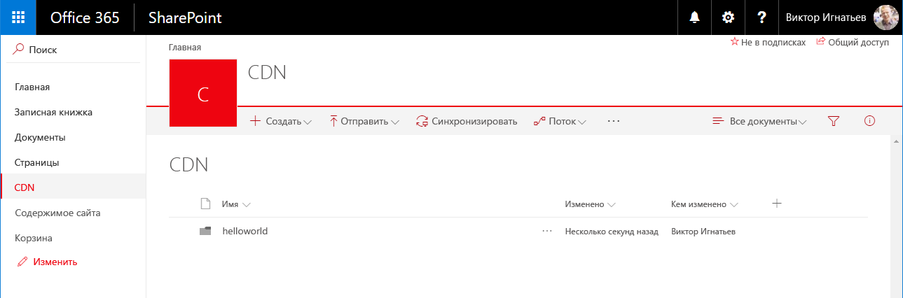
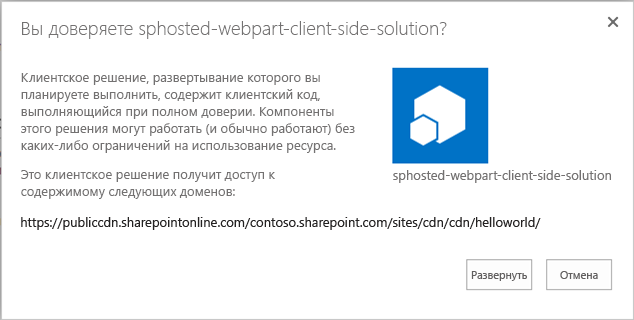
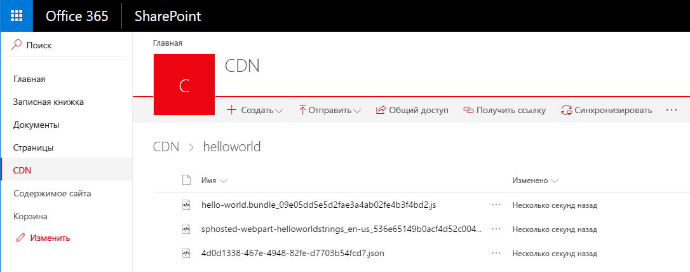
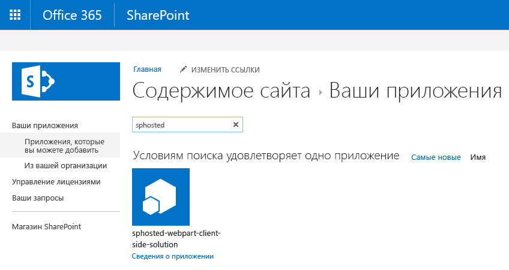
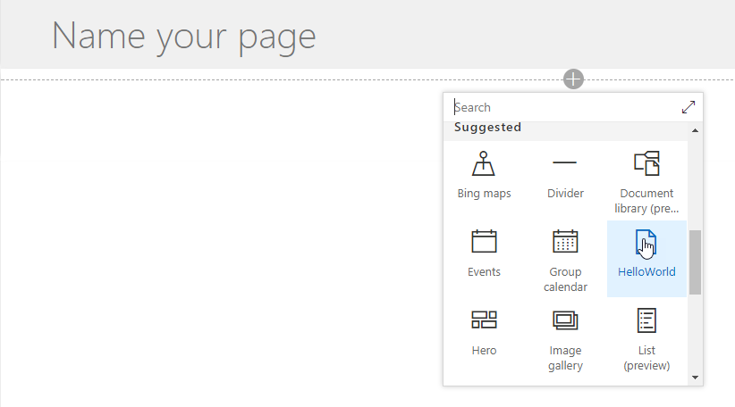
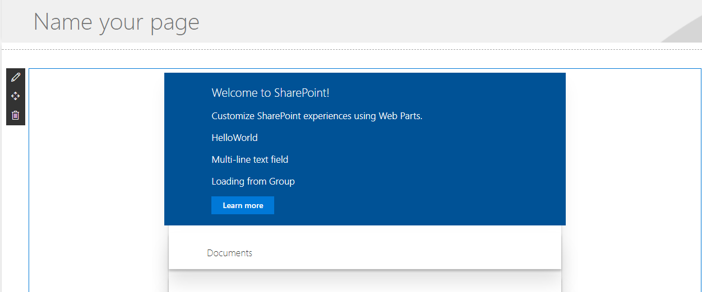
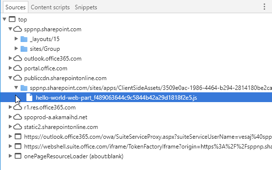

# <a name="hosting-client-side-web-part-from-office-365-cdn"></a><span data-ttu-id="0d257-102">Размещение клиентской веб-части в сети доставки содержимого Office 365</span><span class="sxs-lookup"><span data-stu-id="0d257-102">Hosting client-side web part from Office 365 CDN</span></span>

<span data-ttu-id="0d257-p101">В этой статье описано, как разместить клиентскую веб-часть в сети доставки содержимого Office 365. Сеть доставки содержимого Office 365 позволяет разместить ресурсы прямо в клиенте Office 365. В нем можно разместить любые статические ресурсы, используемые в SharePoint Online. Дополнительные сведения о CDN Office 365 вы найдете в указанной ниже записи блога.</span><span class="sxs-lookup"><span data-stu-id="0d257-p101">This article describes how to host your client-side web part from Office 365 CDN. Office 365 CDN provide you easy solution to host your assets directly from your own Office 365 tenant. It can be used for hosting any static assets, which are used in SharePoint Online. You can find more details around the Office 365 CDN capability from following blog post.</span></span>

* [<span data-ttu-id="0d257-107">Общедоступность сети доставки содержимого Office 365</span><span class="sxs-lookup"><span data-stu-id="0d257-107">General availability of Office 365 CDN</span></span>](https://dev.office.com/blogs/general-availability-of-office-365-cdn)

## <a name="enable-cdn-in-your-office-365-tenant"></a><span data-ttu-id="0d257-108">Включение сети доставки содержимого в клиенте Office 365</span><span class="sxs-lookup"><span data-stu-id="0d257-108">Enable CDN in your Office 365 tenant</span></span>
<span data-ttu-id="0d257-109">Скачайте последнюю версию командной консоли SharePoint Online на [сайте загрузки Майкрософт](https://www.microsoft.com/en-us/download/details.aspx?id=35588).</span><span class="sxs-lookup"><span data-stu-id="0d257-109">Ensure that you have latest version of the SharePoint Online Management Shell by downloading it from [Microsoft Download site](https://www.microsoft.com/en-us/download/details.aspx?id=35588).</span></span>

<span data-ttu-id="0d257-110">Подключитесь к клиенту SharePoint Online с помощью PowerShell.</span><span class="sxs-lookup"><span data-stu-id="0d257-110">Connect to your SharePoint Online tenant with PowerShell session.</span></span>
```
Connect-SPOService -Url https://contoso-admin.sharepoint.com
```

<span data-ttu-id="0d257-111">Чтобы узнать текущее состояние настроек общедоступной CDN для клиента, поочередно выполните указанные ниже команды.</span><span class="sxs-lookup"><span data-stu-id="0d257-111">Get current status of public CDN settings from tenant level by executing following commands one-by-one.</span></span> 
```
Get-SPOTenantCdnEnabled -CdnType Public
Get-SPOTenantCdnOrigins -CdnType Public
Get-SPOTenantCdnPolicies -CdnType Public
```
<span data-ttu-id="0d257-112">Включите общедоступную сеть доставки содержимого в клиенте.</span><span class="sxs-lookup"><span data-stu-id="0d257-112">Enable public CDN in the tenant</span></span>
```
Set-SPOTenantCdnEnabled -CdnType Public
```
<span data-ttu-id="0d257-p102">Теперь в клиенте включена общедоступная CDN с использованием разрешенной конфигурации типов файлов по умолчанию. Это означает, что поддерживаются следующие типы файлов: CSS, EOT, GIF, ICO, JPEG, JPG, JS, MAP, PNG, SVG, TTF, WOFF.</span><span class="sxs-lookup"><span data-stu-id="0d257-p102">Now public CDN has been enabled in the tenant using the default file type configuration allowed. This means that the following file type extensions are supported: "CSS,EOT,GIF,ICO,JPEG,JPG,JS,MAP,PNG,SVG,TTF,WOFF".</span></span>

<span data-ttu-id="0d257-p103">Откройте браузер и перейдите к семейству веб-сайтов, в котором вы хотите разместить свою библиотеку CDN. Это может быть любое семейство веб-сайтов в клиенте. Это руководство описывает создание библиотеки CDN, но вы также можете использовать отдельную папку в любой существующей библиотеке документов как конечную точку CDN.</span><span class="sxs-lookup"><span data-stu-id="0d257-p103">Open up a browser and move to a site collection where you'd like to host your CDN library. This could be any site collection in your tenant. In this tutorial, we create a specific library to act as your CDN library, but you can also use a specific folder in any existing document library as the CDN endpoint.</span></span>

<span data-ttu-id="0d257-118">В семействе веб-сайтов создайте библиотеку документов **CDN** и добавьте в нее папку **helloworld**.</span><span class="sxs-lookup"><span data-stu-id="0d257-118">Create a new document library on your site collection called **CDN** and add a folder called **helloworld** to it.</span></span>

 

<span data-ttu-id="0d257-p104">Вернитесь к консоли PowerShell и добавьте новый источник CDN. Обновите указанный ниже URL-адрес в соответствии с собственной средой.</span><span class="sxs-lookup"><span data-stu-id="0d257-p104">Move back to your PowerShell console and add a new CDN origin. Update the provided URL below to match your own environment.</span></span> 
```
Add-SPOTenantCdnOrigin -CdnType Public -OriginUrl sites/cdn/cdn
```
<span data-ttu-id="0d257-122">Выполните указанную ниже команду, чтобы получить список источников CDN клиента.</span><span class="sxs-lookup"><span data-stu-id="0d257-122">Execute the following command to get the list of CDN origins from your tenant</span></span>
```
Get-SPOTenantCdnOrigins -CdnType Public
```
<span data-ttu-id="0d257-p105">Обратите внимание, что новый источник указан как допустимый источник CDN. Настройка источника займет некоторое время (приблизительно 15 минут), поэтому мы пока можем создать тестовую веб-часть, которая будет размещена в источнике, когда развертывание будет завершено.</span><span class="sxs-lookup"><span data-stu-id="0d257-p105">Notice that your newly added origin is listed as a valid CDN origin. Final configuration of the origin will take a while (approximately 15 minutes), so we can continue by creating your test web part, which will be hosted from the origin, when the deployment is completed.</span></span> 


> <span data-ttu-id="0d257-126">Если рядом с названием источника нет уведомления о *настройке в состоянии ожидания*, он готов к использованию в клиенте.</span><span class="sxs-lookup"><span data-stu-id="0d257-126">When origin is listed without the *(configuration pending)* text, it is ready to be used in your tenant. This is indicating on-going configuration between SharePoint Online and CDN system.</span></span> <span data-ttu-id="0d257-127">Это указывает на выполняющуюся настройку SharePoint Online и системы CDN.</span><span class="sxs-lookup"><span data-stu-id="0d257-127">When origin is listed without the (configuration pending) text, it is ready to be used in your tenant. This is the indication of an on-going configuration between SharePoint Online and CDN system.</span></span> 

## <a name="creating-a-new-web-part-project"></a><span data-ttu-id="0d257-128">Создание проекта веб-части</span><span class="sxs-lookup"><span data-stu-id="0d257-128">Creating a new Web Part project</span></span>

<span data-ttu-id="0d257-129">Создайте каталог проекта в удобном для вас расположении:</span><span class="sxs-lookup"><span data-stu-id="0d257-129">Create a new project directory in your preferred location:</span></span>

```
md sphosted-webpart
```
    
<span data-ttu-id="0d257-130">Перейдите к каталогу проекта:</span><span class="sxs-lookup"><span data-stu-id="0d257-130">Go to the project directory:</span></span>

```
cd sphosted-webpart
```

<span data-ttu-id="0d257-131">Создайте решение SharePoint Framework, запустив генератор Yeoman для SharePoint:</span><span class="sxs-lookup"><span data-stu-id="0d257-131">Create a new SharePoint Framework solution by running Yeoman SharePoint Generator:</span></span>

```
yo @microsoft/sharepoint
```
    
<span data-ttu-id="0d257-132">Когда появится запрос:</span><span class="sxs-lookup"><span data-stu-id="0d257-132">When prompted:</span></span>

* <span data-ttu-id="0d257-133">Оставьте имя по умолчанию **sphosted-webpart** для своего решения и нажмите клавишу **ВВОД**.</span><span class="sxs-lookup"><span data-stu-id="0d257-133">Accept the default **sphosted-webpart** as your solution name and choose **Enter**.</span></span>
* <span data-ttu-id="0d257-134">Выберите **Только SharePoint Online (новая версия)** и нажмите клавишу **ВВОД**.</span><span class="sxs-lookup"><span data-stu-id="0d257-134">Choose **SharePoint Online only (latest)**, and press **Enter**.</span></span>
* <span data-ttu-id="0d257-135">Выберите вариант **Использовать текущую папку** для размещения файлов.</span><span class="sxs-lookup"><span data-stu-id="0d257-135">Select **Use the current folder** for where to place the files.</span></span>
* <span data-ttu-id="0d257-136">Выберите **N**, чтобы сделать установку расширения обязательной на каждом сайте при его использовании.</span><span class="sxs-lookup"><span data-stu-id="0d257-136">Choose **N** to require the extension to be installed on each site explicitly when it's being used.</span></span> 
* <span data-ttu-id="0d257-137">Выберите **Webpart** в качестве типа создаваемого клиентского компонента.</span><span class="sxs-lookup"><span data-stu-id="0d257-137">Choose **Webpart** as the client-side component type to be created.</span></span> 
* <span data-ttu-id="0d257-138">Оставьте имя по умолчанию **HelloWorld** для своей веб-части и нажмите клавишу **ВВОД**.</span><span class="sxs-lookup"><span data-stu-id="0d257-138">Accept the default **HelloWorld** as your web part name and choose **Enter**.</span></span>
* <span data-ttu-id="0d257-139">Оставьте **описание HelloWorld** по умолчанию для своей веб-части и нажмите клавишу **ВВОД**.</span><span class="sxs-lookup"><span data-stu-id="0d257-139">Accept the default **HelloWorld description** as your web part description and choose **Enter**.</span></span>
* <span data-ttu-id="0d257-140">Оставьте параметр по умолчанию **Не использовать платформу веб-решений на базе JavaScript** и нажмите клавишу **ВВОД**.</span><span class="sxs-lookup"><span data-stu-id="0d257-140">Accept the default **No javascript web framework** as the framework you would like to use and choose **Enter**.</span></span>


<span data-ttu-id="0d257-p107">После этого Yeoman выполнит скаффолдинг файлов решения и установит требуемые зависимости. Это может занять несколько минут. При этом Yeoman также включит в проект вашу веб-часть.</span><span class="sxs-lookup"><span data-stu-id="0d257-p107">At this point, Yeoman will scaffold the solution files and install the required dependencies. This might take a few minutes. Yeoman will scaffold the project to include your custom web part as well.</span></span>

<span data-ttu-id="0d257-145">После скаффолдинга заблокируйте версию зависимостей проекта, выполнив следующую команду:</span><span class="sxs-lookup"><span data-stu-id="0d257-145">Once the scaffolding completes, lock down the version of the project dependencies by running the following command:</span></span>

```sh
npm shrinkwrap
```

<span data-ttu-id="0d257-146">Далее введите следующий код, чтобы открыть проект веб-части в Visual Studio Code:</span><span class="sxs-lookup"><span data-stu-id="0d257-146">In the console, type the following to open the web part project in Visual Studio Code:</span></span>

```
code .
```
<span data-ttu-id="0d257-147">Обновите файл *write-manifestests.json* в папке *config* указанным ниже способом, чтобы указать на конечную точку CDN.</span><span class="sxs-lookup"><span data-stu-id="0d257-147">Update the *write-manifests.json* file (under *config* folder) as follow to point to your CDN endpoint.</span></span> 
- <span data-ttu-id="0d257-148">Укажите префикс publiccdn.sharepointonline.com и добавьте к URL-адресу путь в клиенте.</span><span class="sxs-lookup"><span data-stu-id="0d257-148">You will need to use the publiccdn.sharepointonline.com as the prefix and then extend the URL with the actual path in your tenant</span></span>
* <span data-ttu-id="0d257-149">Формат URL-адреса для сети доставки содержимого:</span><span class="sxs-lookup"><span data-stu-id="0d257-149">Format of the CDN URL is as follows</span></span>
```
https://publiccdn.sharepointonline.com/<tenant host name>/sites/site/library/folder
```


<span data-ttu-id="0d257-151">Сохраните изменения.</span><span class="sxs-lookup"><span data-stu-id="0d257-151">Save your changes.</span></span>

<span data-ttu-id="0d257-152">Выполните приведенные ниже задачи для упаковки решения.</span><span class="sxs-lookup"><span data-stu-id="0d257-152">Execute the following tasks to bundle your solution</span></span>
* <span data-ttu-id="0d257-153">При этом будет собрана конечная версия проекта с использованием URL-адреса CDN, указанного в файле **writer-manifest.json**.</span><span class="sxs-lookup"><span data-stu-id="0d257-153">This will execute a release build of your project using CDN URL specified in the **writer-manifest.json** file.</span></span> <span data-ttu-id="0d257-154">Результат будет помещен в папку **./temp/deploy**.</span><span class="sxs-lookup"><span data-stu-id="0d257-154">Output of the execution will be located in the **./temp/deploy** folder.</span></span> <span data-ttu-id="0d257-155">Эти файлы нужно будет добавить в папку SharePoint, представляющую собой конечную точку CDN.</span><span class="sxs-lookup"><span data-stu-id="0d257-155">These are the files which you will need to upload to the SharePoint folder acting as your CDN endpoint.</span></span> 

```
gulp bundle --ship
```

<span data-ttu-id="0d257-156">Выполните указанную ниже задачу, чтобы упаковать свое решение.</span><span class="sxs-lookup"><span data-stu-id="0d257-156">Execute the following task to package your solution</span></span>

```
gulp package-solution --ship
```

<span data-ttu-id="0d257-157">Эта команда создаст пакет **sphosted-webpart.sppkg** в папке **sharepoint/solution**, а также подготовит ресурсы в папке **temp/deploy** к развертыванию в CDN.</span><span class="sxs-lookup"><span data-stu-id="0d257-157">This command will create a **sphosted-webpart.sppkg** package on the **sharepoint/solution** folder and also prepare the assets on the **temp/deploy folder** to be deployed to the CDN.</span></span>

<span data-ttu-id="0d257-158">Добавьте или перетащите новый пакет клиентского решения в каталог приложений в клиенте.</span><span class="sxs-lookup"><span data-stu-id="0d257-158">Upload or drag & drop the newly created client-side solution package to the app catalog in your tenant.</span></span> 



<span data-ttu-id="0d257-160">Выберите элемент **Развернуть**.</span><span class="sxs-lookup"><span data-stu-id="0d257-160">Choose **Deploy**</span></span>

<span data-ttu-id="0d257-161">Перейдите к семейству веб-сайтов, в котором вы создали библиотеку **CDN** согласно вышеприведенным инструкциям этого руководства.</span><span class="sxs-lookup"><span data-stu-id="0d257-161">Move to the site collection where the **CDN** library was created earlier in this tutorial.</span></span>

<span data-ttu-id="0d257-162">Отправьте все файлы из папки **temp/deploy** в папку **CDN/helloworld** семейства веб-сайтов.</span><span class="sxs-lookup"><span data-stu-id="0d257-162">Upload all files from **temp/deploy** folder to the **CDN/helloworld** folder in your site collection.</span></span> 



<span data-ttu-id="0d257-164">Веб-часть готова к использованию на странице.</span><span class="sxs-lookup"><span data-stu-id="0d257-164">At this point the web part is ready to be used on a page</span></span>

<span data-ttu-id="0d257-165">Откройте сайт, на котором вы хотите протестировать веб-часть, и перейдите к его странице **Содержимое сайта**.</span><span class="sxs-lookup"><span data-stu-id="0d257-165">Open a site where you want to test the web part and go the **Site contents** page of the site.</span></span>

<span data-ttu-id="0d257-166">Выберите элементы **"Создать" и "Приложение"** на панели инструментов, затем выберите приложение **sphosted-webpart-client-side-solution** для установки на сайте.</span><span class="sxs-lookup"><span data-stu-id="0d257-166">Choose **Add – App** from the toolbar and choose the **sphosted-webpart-client-side-solution** app to be installed on the site</span></span>



<span data-ttu-id="0d257-168">Когда решение будет установлено, в меню *шестеренки* выберите пункт **Добавление страницы**, затем в окне выбора веб-частей для современной страницы укажите **HelloWorld**.</span><span class="sxs-lookup"><span data-stu-id="0d257-168">After the solution has been installed, chose **Add a page** from the *gear* menu and pick **HelloWorld** from the modern page web part picker</span></span>



<span data-ttu-id="0d257-170">Обратите внимание: веб-часть отображается, несмотря на то что служба node.js не запущена локально.</span><span class="sxs-lookup"><span data-stu-id="0d257-170">Notice how the web part is rendered even though you are not running the node.js service locally.</span></span> 



<span data-ttu-id="0d257-172">Сохраните изменения на странице с веб-частью.</span><span class="sxs-lookup"><span data-stu-id="0d257-172">Save changes on the page with web part on it.</span></span>

<span data-ttu-id="0d257-173">Нажмите клавишу **F12**, чтобы открыть инструменты разработчика.</span><span class="sxs-lookup"><span data-stu-id="0d257-173">Press **F12** to open up developer tools.</span></span>

<span data-ttu-id="0d257-174">Разверните узел **publiccdn.sharepointonline.com** на вкладке "Sources" (Источники) и обратите внимание на то, что файл **hello-world.bundle** загружен из конечной точки CDN, определение которой описано ранее в этом руководстве.</span><span class="sxs-lookup"><span data-stu-id="0d257-174">Extend **publiccdn.sharepointonline.com** under the source and notice how the **hello-world.bundle** file is loaded from the CDN endpoint which we defined earlier in this tutorial.</span></span>



<span data-ttu-id="0d257-176">Поздравляем! Вы развернули свою веб-часть в SharePoint Online, разместив ее в сети доставки содержимого Office 365.</span><span class="sxs-lookup"><span data-stu-id="0d257-176">Now you have deployed your custom web part to SharePoint Online and it's being hosted from the Office 365 CDN.</span></span> 

## <a name="additional-resources"></a><span data-ttu-id="0d257-177">Дополнительные ресурсы</span><span class="sxs-lookup"><span data-stu-id="0d257-177">Additional resources</span></span>

- [<span data-ttu-id="0d257-178">Общедоступность сети доставки содержимого Office 365</span><span class="sxs-lookup"><span data-stu-id="0d257-178">General availability of Office 365 CDN</span></span>](https://dev.office.com/blogs/general-availability-of-office-365-cdn)
- [<span data-ttu-id="0d257-179">Как автоматизировать публикацию скриптов SharePoint Framework в общедоступной сети доставки содержимого Office 365</span><span class="sxs-lookup"><span data-stu-id="0d257-179">Automate publishing of your SharePoint Framework scripts to Office 365 public CDN</span></span>](https://www.eliostruyf.com/automate-publishing-of-your-sharepoint-framework-scripts-to-office-365-public-cdn)