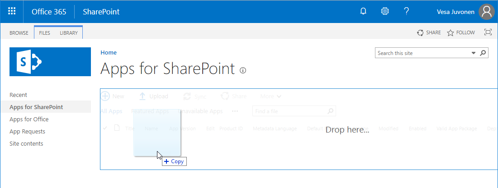
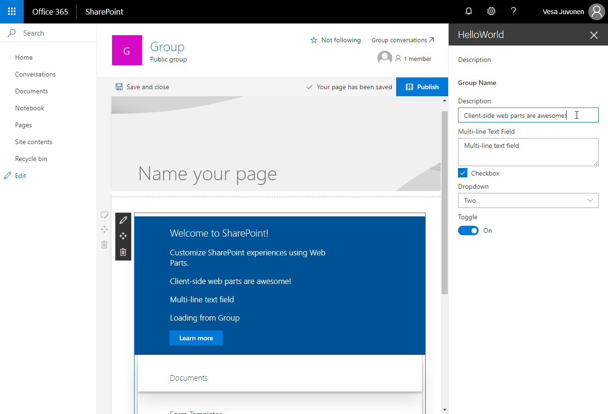

# <a name="deploy-your-client-side-web-part-to-a-sharepoint-page-hello-world-part-3"></a><span data-ttu-id="1b84f-102">Развертывание клиентской веб-части на странице SharePoint (Hello World, часть 3)</span><span class="sxs-lookup"><span data-stu-id="1b84f-102">Deploy your client-side web part to a SharePoint page (Hello world part 3)</span></span>

<span data-ttu-id="1b84f-103">Из этой статьи вы узнаете, как развернуть клиентскую веб-часть в SharePoint и проверить ее работу на современной серверной странице SharePoint.</span><span class="sxs-lookup"><span data-stu-id="1b84f-103">In this article you will learn how to deploy your client-side web part to SharePoint and see it working on a modern SharePoint server-side page. This article continues with the hello world web part built in the previous article Connect your client-side web part to SharePoint.</span></span> <span data-ttu-id="1b84f-104">В этой статье рассматривается веб-часть Hello World, создание которой описано в предыдущей статье [Подключение клиентской веб-части к SharePoint](./connect-to-sharepoint.md).</span><span class="sxs-lookup"><span data-stu-id="1b84f-104">In this article you will learn how to deploy your client-side web part to SharePoint and see it working on a modern SharePoint server-side page. This article continues with the hello world web part built in the previous article [Connect your client-side web part to SharePoint](./connect-to-sharepoint.md).</span></span>

<span data-ttu-id="1b84f-105">Перед началом работы убедитесь, что вы выполнили процедуры, описанные в предыдущих статьях:</span><span class="sxs-lookup"><span data-stu-id="1b84f-105">Be sure you have completed the procedures in the following articles before you start:</span></span>

* [<span data-ttu-id="1b84f-106">Создание первой клиентской веб-части SharePoint</span><span class="sxs-lookup"><span data-stu-id="1b84f-106">Build your first SharePoint client-side web part</span></span>](./build-a-hello-world-web-part.md)
* [<span data-ttu-id="1b84f-107">Подключение клиентской веб-части к SharePoint</span><span class="sxs-lookup"><span data-stu-id="1b84f-107">Connect your client-side web part to SharePoint</span></span>](./connect-to-sharepoint.md)

<span data-ttu-id="1b84f-108">Эти инструкции также изложены в видео на [канале SharePoint PnP в YouTube](https://www.youtube.com/watch?v=asmQIfgaKSw&list=PLR9nK3mnD-OXvSWvS2zglCzz4iplhVrKq).</span><span class="sxs-lookup"><span data-stu-id="1b84f-108">You can also follow these steps by watching the video on the [SharePoint PnP YouTube Channel](https://www.youtube.com/watch?v=asmQIfgaKSw&list=PLR9nK3mnD-OXvSWvS2zglCzz4iplhVrKq).</span></span> 

<a href="https://www.youtube.com/watch?v=asmQIfgaKSw&list=PLR9nK3mnD-OXvSWvS2zglCzz4iplhVrKq">

</a>


## <a name="package-the-helloworld-web-part"></a><span data-ttu-id="1b84f-109">Упаковка веб-части HelloWorld</span><span class="sxs-lookup"><span data-stu-id="1b84f-109">Package the HelloWorld web part</span></span>

<span data-ttu-id="1b84f-110">В окне консоли перейдите к каталогу проекта веб-части, создание которого описывается в статье [Создание первой клиентской веб-части SharePoint](./build-a-hello-world-web-part.md).</span><span class="sxs-lookup"><span data-stu-id="1b84f-110">In the console window, go to the web part project directory created in [Build your first SharePoint client-side web part](./build-a-hello-world-web-part.md).</span></span>

```
cd helloworld-webpart
```

<span data-ttu-id="1b84f-111">Если команда `gulp serve` все еще выполняется, остановите ее с помощью клавиш `Ctrl+C`.</span><span class="sxs-lookup"><span data-stu-id="1b84f-111">If `gulp serve` is still running, stop it from running by choosing `Ctrl+C`</span></span>

<span data-ttu-id="1b84f-p102">В отличие от среды разработки, для использования клиентской веб-части на современных серверных страницах SharePoint ее необходимо развернуть и зарегистрировать в SharePoint. Для начала необходимо упаковать веб-часть.</span><span class="sxs-lookup"><span data-stu-id="1b84f-p102">Unlike in the workbench, in order to use client-side web parts on modern SharePoint server-side pages, you need to deploy and register the web part with SharePoint. First you need to package the web part.</span></span>

<span data-ttu-id="1b84f-114">Откройте проект веб-части **HelloWorldWebPart** в Visual Studio Code или другой предпочитаемой IDE.</span><span class="sxs-lookup"><span data-stu-id="1b84f-114">Open the **HelloWorldWebPart** web part project in Visual Studio Code, or your preferred IDE.</span></span>

<span data-ttu-id="1b84f-115">Откройте файл **package-solution.json** в папке **config**.</span><span class="sxs-lookup"><span data-stu-id="1b84f-115">Open **package-solution.json** from the **config** folder.</span></span>

<span data-ttu-id="1b84f-116">В файле **package-solution.json** определяются метаданные пакета, как показано в следующем фрагменте кода:</span><span class="sxs-lookup"><span data-stu-id="1b84f-116">The **package-solution.json** file defines the package metadata as shown in the following code:</span></span>

```json
{
  "$schema": "https://dev.office.com/json-schemas/spfx-build/package-solution.schema.json",
  "solution": {
    "name": "helloworld-webpart-client-side-solution",
    "id": "4432f33b-5845-4ca0-827e-a8ae68c7b945",
    "version": "1.0.0.0"
  },
  "paths": {
    "zippedPackage": "solution/helloworld-webpart.sppkg"
  }
}

```

<span data-ttu-id="1b84f-117">Чтобы упаковать клиентское решение, содержащее веб-часть, введите в окне консоли следующую команду:</span><span class="sxs-lookup"><span data-stu-id="1b84f-117">In the console window, enter the following command to package your client-side solution that contains the web part:</span></span>

```
gulp package-solution
```

<span data-ttu-id="1b84f-118">Эта команда создаст пакет в папке `sharepoint/solution`:</span><span class="sxs-lookup"><span data-stu-id="1b84f-118">The command will create the package in the `sharepoint/solution` folder:</span></span>

```
helloworld-webpart.sppkg
```

### <a name="package-contents"></a><span data-ttu-id="1b84f-119">Содержимое пакета</span><span class="sxs-lookup"><span data-stu-id="1b84f-119">Package contents</span></span>

<span data-ttu-id="1b84f-p103">Чтобы упаковать веб-часть, пакет использует компонент SharePoint. По умолчанию задача gulp создает следующие элементы:</span><span class="sxs-lookup"><span data-stu-id="1b84f-p103">The package uses SharePoint Feature to package your web part. By default, the gulp task creates the following:</span></span>

* <span data-ttu-id="1b84f-122">Компонент веб-части.</span><span class="sxs-lookup"><span data-stu-id="1b84f-122">A feature for your web part.</span></span>

<span data-ttu-id="1b84f-123">Вы можете просмотреть необработанное содержимое пакета в папке **sharepoint/debug**.</span><span class="sxs-lookup"><span data-stu-id="1b84f-123">You can view the raw package contents in the **sharepoint/debug** folder.</span></span> 

<span data-ttu-id="1b84f-124">Затем содержимое упаковывается в **SPPKG**-файл.</span><span class="sxs-lookup"><span data-stu-id="1b84f-124">The contents are then packaged into an **.sppkg** file.</span></span> <span data-ttu-id="1b84f-125">Формат пакета во многом аналогичен пакетам надстроек SharePoint. Для упаковки решения используются Microsoft Open Packaging Conventions.</span><span class="sxs-lookup"><span data-stu-id="1b84f-125">The contents are then packaged into an .sppkg file. The package format is very similar to a SharePoint add-ins package and uses Microsoft Open Packaging Conventions to package your solution.</span></span> 

<span data-ttu-id="1b84f-p105">Файлы JavaScript, CSS и другие активы не упаковываются. Их потребуется развернуть во внешнем расположении, например в сети CDN. Для тестирования веб-части во время разработки можно загрузить все активы с локального компьютера.</span><span class="sxs-lookup"><span data-stu-id="1b84f-p105">The JavaScript files, CSS and other assets are not packaged and you will have to deploy them to an external location such as a CDN. In order to test the web part during development, you can load all the assets from your local computer.</span></span> 

## <a name="deploy-the-helloworld-package-to-app-catalog"></a><span data-ttu-id="1b84f-128">Развертывание пакета HelloWorld в каталоге приложений</span><span class="sxs-lookup"><span data-stu-id="1b84f-128">Deploy the HelloWorld package to app catalog</span></span>

<span data-ttu-id="1b84f-129">Далее вам потребуется развернуть созданный пакет в каталоге приложений.</span><span class="sxs-lookup"><span data-stu-id="1b84f-129">Next you need to deploy the package that was generated to the App Catalog.</span></span>

<span data-ttu-id="1b84f-130">Перейдите к каталогу приложений вашего сайта.</span><span class="sxs-lookup"><span data-stu-id="1b84f-130">Go to your site's App Catalog.</span></span>

<span data-ttu-id="1b84f-131">Отправьте или перетащите файл **helloworld-webpart.sppkg** в каталог приложений.</span><span class="sxs-lookup"><span data-stu-id="1b84f-131">Upload or drag and drop the **helloworld-webpart.sppkg** to the App Catalog.</span></span>

 

<span data-ttu-id="1b84f-p106">При этом будет развернут пакет клиентского решения. Так как это клиентское решение с полным доверием, в SharePoint появится диалоговое окно с предложением разрешить развертывание клиентского решения.</span><span class="sxs-lookup"><span data-stu-id="1b84f-p106">This will deploy the client-side solution package. Since this is a full trust client-side solution, SharePoint will display a dialog and ask you to trust the client-side solution to deploy.</span></span>

 
    
<span data-ttu-id="1b84f-136">Нажмите кнопку **Развернуть**</span><span class="sxs-lookup"><span data-stu-id="1b84f-136">Choose **Deploy**</span></span>

## <a name="install-the-client-side-solution-on-your-site"></a><span data-ttu-id="1b84f-137">Установка клиентского решения на сайте</span><span class="sxs-lookup"><span data-stu-id="1b84f-137">Install the client-side solution on your site</span></span>

<span data-ttu-id="1b84f-138">Перейдите к семейству сайтов разработчиков.</span><span class="sxs-lookup"><span data-stu-id="1b84f-138">Go to your developer site collection.</span></span>

<span data-ttu-id="1b84f-139">Нажмите значок шестеренки на верхней панели навигации справа и выберите команду **Добавить приложение**, чтобы перейти к странице "Приложения".</span><span class="sxs-lookup"><span data-stu-id="1b84f-139">Choose the gears icon on the top nav bar on the right and choose **Add an app** to go to your Apps page.</span></span>

<span data-ttu-id="1b84f-140">В **поле поиска** введите **helloworld** и нажмите клавишу **ВВОД**, чтобы отфильтровать приложения.</span><span class="sxs-lookup"><span data-stu-id="1b84f-140">In the **Search** box, enter **helloworld** and choose **Enter** to filter your apps.</span></span>
    

    
<span data-ttu-id="1b84f-142">Выберите приложение **helloworld-webpart-client-side-solution**, чтобы установить его на сайте.</span><span class="sxs-lookup"><span data-stu-id="1b84f-142">Choose the **helloworld-webpart-client-side-solution** app to install the app on the site.</span></span>
    
 

<span data-ttu-id="1b84f-144">Теперь клиентское решение и веб-часть установлены на сайте разработчика.</span><span class="sxs-lookup"><span data-stu-id="1b84f-144">The client-side solution and the web part are installed on your developer site.</span></span>

<span data-ttu-id="1b84f-145">На странице **Содержимое сайта** отображается состояние установки клиентского решения.</span><span class="sxs-lookup"><span data-stu-id="1b84f-145">The **Site Contents** page will show you the installation status of your client-side solution. Make sure the installation is complete before going to the next step.</span></span> <span data-ttu-id="1b84f-146">Прежде чем переходить к следующему шагу, убедитесь, что установка завершена.</span><span class="sxs-lookup"><span data-stu-id="1b84f-146">The Site Contents page will show you the installation status of your client-side solution. Make sure the installation is complete before going to the next step.</span></span>

## <a name="preview-the-web-part-in-a-sharepoint-page"></a><span data-ttu-id="1b84f-147">Предварительный просмотр веб-части на странице SharePoint</span><span class="sxs-lookup"><span data-stu-id="1b84f-147">Preview the web part in a SharePoint page</span></span>

<span data-ttu-id="1b84f-p108">Теперь, когда вы развернули и установили клиентское решение, добавьте веб-части на страницу SharePoint. Помните, что такие ресурсы, как файлы JavaScript и CSS, доступны с локального компьютера.</span><span class="sxs-lookup"><span data-stu-id="1b84f-p108">Now that you have deployed and installed the client-side solution, add the web part to a SharePoint page. Remember that resources such as JavaScripts, and CSS, are available from the local computer.</span></span>

<span data-ttu-id="1b84f-150">Откройте файл **<GUID_веб-части>.manifest.json** в папке **\dist**.</span><span class="sxs-lookup"><span data-stu-id="1b84f-150">Open the **<your-webpart-guid>.manifest.json** from the **\dist** folder.</span></span>
    
<span data-ttu-id="1b84f-151">Обратите внимание, что свойство **internalModuleBaseUrls** в разделе **loaderConfig** по-прежнему указывает на локальный компьютер:</span><span class="sxs-lookup"><span data-stu-id="1b84f-151">Notice that the **internalModuleBaseUrls** property in the **loaderConfig** entry still refers to your local computer:</span></span>

```json
"internalModuleBaseUrls": [
    "https://`your-local-machine-name`:4321/"
]
```

<span data-ttu-id="1b84f-152">Прежде чем добавлять веб-часть на серверную страницу SharePoint, запустите локальный сервер.</span><span class="sxs-lookup"><span data-stu-id="1b84f-152">Before adding the web part to a SharePoint server-side page, run the local server.</span></span>
    
<span data-ttu-id="1b84f-153">В окне консоли с каталогом проекта **helloworld-webpart** выполните задачу gulp, чтобы начать обслуживание с localhost:</span><span class="sxs-lookup"><span data-stu-id="1b84f-153">In the console window that has the **helloworld-webpart** project directory, run the gulp task to start serving from localhost:</span></span>
    
```
gulp serve --nobrowser
```

> [!NOTE]
> <span data-ttu-id="1b84f-154">SharePoint Workbench не запускается автоматически при использовании `--nobrowser`.</span><span class="sxs-lookup"><span data-stu-id="1b84f-154">Note:`--nobrowser` will not automatically launch the SharePoint Workbench.</span></span>

## <a name="add-the-helloworld-web-part-to-modern-page"></a><span data-ttu-id="1b84f-155">Добавление веб-части HelloWorld на современную страницу</span><span class="sxs-lookup"><span data-stu-id="1b84f-155">Add the HelloWorld web part to modern page</span></span>

<span data-ttu-id="1b84f-156">Перейдите к семейству веб-сайтов в браузере.</span><span class="sxs-lookup"><span data-stu-id="1b84f-156">In your browser go to your site collection.</span></span>
    
<span data-ttu-id="1b84f-157">Нажмите значок шестеренки на верхней панели навигации справа и выберите **Добавить страницу**.</span><span class="sxs-lookup"><span data-stu-id="1b84f-157">Choose the gears icon in the top nav bar on the right and choose **Add a page**.</span></span>
    
<span data-ttu-id="1b84f-158">Откройте средство выбора веб-частей и выберите веб-часть **HelloWorld**.</span><span class="sxs-lookup"><span data-stu-id="1b84f-158">Open web part picker and chose your **HelloWorld** web part.</span></span>
        
<span data-ttu-id="1b84f-p109">Активы веб-части будут загружены из локальной среды. Чтобы загрузить сценарии, размещенные на локальном компьютере, необходимо разрешить в браузере выполнение небезопасных сценариев. Убедитесь, что в вашем браузере включено выполнение небезопасных сценариев для данного сеанса.</span><span class="sxs-lookup"><span data-stu-id="1b84f-p109">The web part assets will be loaded from the local environment. In order to load the scripts hosted on your local computer, you need to enable the browser to load unsafe scripts. Depending on the browser you are using, make sure you enable loading unsafe scripts for this session.</span></span>
    
<span data-ttu-id="1b84f-162">Должна появиться веб-часть **HelloWorld**, создание которой описано в предыдущей статье, получающая списки с текущего сайта.</span><span class="sxs-lookup"><span data-stu-id="1b84f-162">You should see the **HelloWorld** web part you built in the previous article that retrieves lists from the current site.</span></span> 


## <a name="edit-web-part-properties"></a><span data-ttu-id="1b84f-164">Изменение свойств веб-части</span><span class="sxs-lookup"><span data-stu-id="1b84f-164">Edit web part properties</span></span>

<span data-ttu-id="1b84f-165">Нажмите значок **Настроить элемент** (перо) в веб-части, чтобы открыть область свойств.</span><span class="sxs-lookup"><span data-stu-id="1b84f-165">Click the **Configure element** icon (pen) in the web part to open the property pane for the web part.</span></span>


<span data-ttu-id="1b84f-167">Это та же область свойств, которую вы создали и проверили в среде разработки проектов.</span><span class="sxs-lookup"><span data-stu-id="1b84f-167">This is the same property pane you built and previewed in the workbench.</span></span>
    
<span data-ttu-id="1b84f-168">Измените свойство **Description** (Описание), указав текст **Client-side web parts are awesome!** (Клиентские веб-части — это круто).</span><span class="sxs-lookup"><span data-stu-id="1b84f-168">Edit the **Description** property and enter **Client-side web parts are awesome!**</span></span>
    


<span data-ttu-id="1b84f-170">Обратите внимание, что веб-часть обновляется по мере ввода текста, как и на реактивной панели.</span><span class="sxs-lookup"><span data-stu-id="1b84f-170">Notice that you still have the same behaviors such as a reactive pane where the web part is updated as you type.</span></span>
    
<span data-ttu-id="1b84f-171">Нажмите значок **x**, чтобы закрыть клиентскую область свойств.</span><span class="sxs-lookup"><span data-stu-id="1b84f-171">Choose the **x** icon to close the client-side property pane.</span></span>
        
<span data-ttu-id="1b84f-172">На панели инструментов выберите **Сохранить и закрыть**, чтобы сохранить страницу.</span><span class="sxs-lookup"><span data-stu-id="1b84f-172">In the toolbar, choose **Save and close** to save the page.</span></span>

## <a name="next-steps"></a><span data-ttu-id="1b84f-173">Дальнейшие действия</span><span class="sxs-lookup"><span data-stu-id="1b84f-173">Next steps</span></span>

<span data-ttu-id="1b84f-174">Поздравляем!</span><span class="sxs-lookup"><span data-stu-id="1b84f-174">Congratulations</span></span> <span data-ttu-id="1b84f-175">Вы развернули клиентскую веб-часть на современной странице SharePoint.</span><span class="sxs-lookup"><span data-stu-id="1b84f-175">You have deployed a client-side web part to a modern SharePoint page.</span></span> <span data-ttu-id="1b84f-176">Вы можете продолжить разработку веб-части Hello World, прочитав следующую статью — [Развертывание источника клиентской веб-части в CDN](./deploy-web-part-to-cdn.md). Из нее вы узнаете, как развернуть и загрузить ресурсы веб-части из сети CDN, а не из localhost.</span><span class="sxs-lookup"><span data-stu-id="1b84f-176">Congratulations! You have deployed a client-side web part to a modern SharePoint page. You can continue building out your Hello World web part in the next topic, [Deploy your client-side web part source to a CDN](./deploy-web-part-to-cdn.md), where you will learn how to deploy and load the web part assets from a CDN instead of localhost.</span></span>
