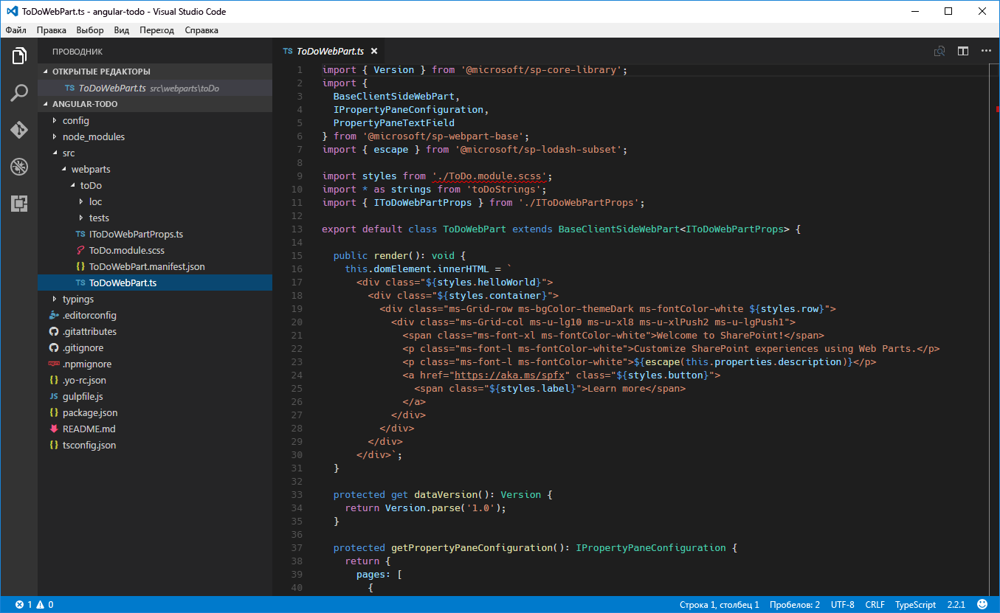
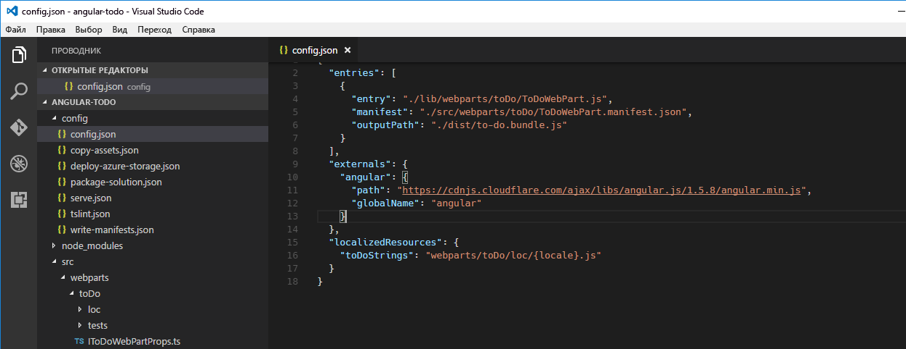

# <a name="build-sharepoint-framework-client-side-web-parts-with-angularjs"></a><span data-ttu-id="ce40a-102">Создание клиентских веб-частей SharePoint Framework с помощью AngularJS</span><span class="sxs-lookup"><span data-stu-id="ce40a-102">Build SharePoint Framework client-side web parts with AngularJS</span></span>

<span data-ttu-id="ce40a-103">Популярную платформу AngularJS также можно использовать для создания клиентских веб-частей.</span><span class="sxs-lookup"><span data-stu-id="ce40a-103">If you are familiar with AngularJS, you can also use this extremely popular framework to build client-side web parts.</span></span> <span data-ttu-id="ce40a-104">Благодаря модульности с ее помощью можно создавать что-угодно — от сложных одностраничных приложений с различными представлениями до небольших компонентов, таких как веб-части.</span><span class="sxs-lookup"><span data-stu-id="ce40a-104">Thanks to its modularity, it can be used for anything ranging from complex multi-view Single Page Applications to smaller components such as web parts.</span></span> <span data-ttu-id="ce40a-105">Раньше во многих организациях решения для SharePoint создавались с помощью AngularJS.</span><span class="sxs-lookup"><span data-stu-id="ce40a-105">Many organizations have been using AngularJS for building SharePoint solutions in the past.</span></span> <span data-ttu-id="ce40a-106">В этой статье описано, как с помощью AngularJS создать клиентскую веб-часть SharePoint Framework, а также выбрать для нее стиль, используя [Office UI Fabric](http://dev.office.com/fabric).</span><span class="sxs-lookup"><span data-stu-id="ce40a-106">This article shows how to use AngularJS to build a SharePoint Framework client-side web part and have it styled using [Office UI Fabric](http://dev.office.com/fabric).</span></span> <span data-ttu-id="ce40a-107">Работая с этим руководством, вы создадите простую веб-часть, которая управляет элементами списка дел.</span><span class="sxs-lookup"><span data-stu-id="ce40a-107">During this tutorial you will build a simple web part that manages to do items.</span></span>


<span data-ttu-id="ce40a-109">Исходный код рабочей веб-части доступен на сайте GitHub по адресу [https://github.com/SharePoint/sp-dev-fx-webparts/tree/master/samples/angular-todo](https://github.com/SharePoint/sp-dev-fx-webparts/tree/master/samples/angular-todo).</span><span class="sxs-lookup"><span data-stu-id="ce40a-109">The source of the working web part is available on GitHub at [https://github.com/SharePoint/sp-dev-fx-webparts/tree/master/samples/angular-todo](https://github.com/SharePoint/sp-dev-fx-webparts/tree/master/samples/angular-todo).</span></span>

> [!NOTE] 
> <span data-ttu-id="ce40a-110">Прежде чем выполнять действия, описанные в этой статье, [настройте среду разработки](../../set-up-your-development-environment.md) для создания решений на платформе SharePoint Framework.</span><span class="sxs-lookup"><span data-stu-id="ce40a-110">[Note:](../../set-up-your-development-environment.md) Before following the steps in this article, be sure to set up your development environment for building SharePoint Framework solutions.</span></span>

## <a name="create-new-project"></a><span data-ttu-id="ce40a-111">Создание проекта</span><span class="sxs-lookup"><span data-stu-id="ce40a-111">Create new project</span></span>

<span data-ttu-id="ce40a-112">Для начала создайте папку проекта.</span><span class="sxs-lookup"><span data-stu-id="ce40a-112">Start by creating a new folder for your project</span></span>

```sh
md angular-todo
```

<span data-ttu-id="ce40a-113">Перейдите в папку проекта:</span><span class="sxs-lookup"><span data-stu-id="ce40a-113">Navigate to the project folder:</span></span>

```sh
cd angular-todo
```

<span data-ttu-id="ce40a-114">В папке проекта запустите генератор Yeoman для SharePoint Framework, чтобы сформировать шаблон проекта на платформе SharePoint Framework:</span><span class="sxs-lookup"><span data-stu-id="ce40a-114">In the project folder run the SharePoint Framework Yeoman generator to scaffold a new SharePoint Framework project:</span></span>

```sh
yo @microsoft/sharepoint
```

<span data-ttu-id="ce40a-115">Определите значения следующим образом:</span><span class="sxs-lookup"><span data-stu-id="ce40a-115">When prompted, define values as follows:</span></span>
- <span data-ttu-id="ce40a-116">**angular-todo** как имя решения</span><span class="sxs-lookup"><span data-stu-id="ce40a-116">**angular-todo** as your solution name</span></span>
- <span data-ttu-id="ce40a-117">**Use the current folder** (Использовать текущую папку) как расположение файлов</span><span class="sxs-lookup"><span data-stu-id="ce40a-117">**Use the current folder** for the location to place the files</span></span>
- <span data-ttu-id="ce40a-118">**No JavaScript web framework** (Без веб-платформы JavaScript) как отправная точка создания веб-части</span><span class="sxs-lookup"><span data-stu-id="ce40a-118">**No JavaScript web framework** as the starting point to build the web part</span></span>
- <span data-ttu-id="ce40a-119">**To do** (Текущие дела) как имя веб-части</span><span class="sxs-lookup"><span data-stu-id="ce40a-119">**To do** as your web part name</span></span>
- <span data-ttu-id="ce40a-120">**Simple management of to do tasks** (Простое управление задачами) как описание веб-части</span><span class="sxs-lookup"><span data-stu-id="ce40a-120">**Simple management of to do tasks** as your web part description</span></span>


<span data-ttu-id="ce40a-122">После завершения скаффолдинга блокируйте версию зависимостей проекта, выполнив следующую команду:</span><span class="sxs-lookup"><span data-stu-id="ce40a-122">Once the scaffolding completes, lock down the version of the project dependencies by running the following command:</span></span>

```sh
npm shrinkwrap
```

<span data-ttu-id="ce40a-123">Далее откройте папку проекта в редакторе кода.</span><span class="sxs-lookup"><span data-stu-id="ce40a-123">Next, open your project folder in your code editor.</span></span> <span data-ttu-id="ce40a-124">В этом руководстве используется Visual Studio Code.</span><span class="sxs-lookup"><span data-stu-id="ce40a-124">In this tutorial, you will use Visual Studio Code.</span></span>



## <a name="add-angularjs"></a><span data-ttu-id="ce40a-126">Добавление AngularJS</span><span class="sxs-lookup"><span data-stu-id="ce40a-126">Add AngularJS</span></span>

<span data-ttu-id="ce40a-127">В этом руководстве показано, как загрузить AngularJS из сети CDN.</span><span class="sxs-lookup"><span data-stu-id="ce40a-127">In this tutorial you will load AngularJS from CDN.</span></span> <span data-ttu-id="ce40a-128">Для этого откройте в редакторе кода файл **config/config.json** и добавьте следующие строки в свойстве **externals**:</span><span class="sxs-lookup"><span data-stu-id="ce40a-128">To do that, in the code editor, open the **config/config.json** file and in the **externals** property add the following lines:</span></span>

```json
"angular": {
  "path": "https://cdnjs.cloudflare.com/ajax/libs/angular.js/1.6.6/angular.min.js",
  "globalName": "angular"
}
```



## <a name="add-angularjs-typings-for-typescript"></a><span data-ttu-id="ce40a-130">Добавление определений типа AngularJS для TypeScript</span><span class="sxs-lookup"><span data-stu-id="ce40a-130">Add AngularJS typings for TypeScript</span></span>

<span data-ttu-id="ce40a-131">Так как в коде веб-части вы будете ссылаться на AngularJS, вам также потребуются определения типов AngularJS для TypeScript.</span><span class="sxs-lookup"><span data-stu-id="ce40a-131">Because you will be referencing AngularJS in your web part's code, you also need AngularJS typings for TypeScript.</span></span> <span data-ttu-id="ce40a-132">Чтобы установить их, выполните в командной строке следующую команду:</span><span class="sxs-lookup"><span data-stu-id="ce40a-132">To install them run in the command line:</span></span>

```sh
npm install @types/angular --save-dev
```

## <a name="implement-angularjs-application"></a><span data-ttu-id="ce40a-133">Реализация приложения AngularJS</span><span class="sxs-lookup"><span data-stu-id="ce40a-133">Implement AngularJS application</span></span>

<span data-ttu-id="ce40a-134">Когда все необходимые компоненты будут установлены, можете начинать реализацию примера приложения AngularJS.</span><span class="sxs-lookup"><span data-stu-id="ce40a-134">With all prerequisites in place you can start implementing the sample AngularJS application.</span></span> <span data-ttu-id="ce40a-135">Так как этот пример будет состоять из нескольких файлов, создайте для него отдельную папку **app**.</span><span class="sxs-lookup"><span data-stu-id="ce40a-135">Because it will consist of a few files, create a separate folder for it called **app**.</span></span>


### <a name="implement-to-do-data-service"></a><span data-ttu-id="ce40a-137">Реализация службы данных о задачах</span><span class="sxs-lookup"><span data-stu-id="ce40a-137">Implement to do data service</span></span>

<span data-ttu-id="ce40a-138">Создайте файл **DataService.ts** в папке **app**.</span><span class="sxs-lookup"><span data-stu-id="ce40a-138">In the newly created **app** folder, create a new file called **DataService.ts**.</span></span> <span data-ttu-id="ce40a-139">В файле вставьте следующий код:</span><span class="sxs-lookup"><span data-stu-id="ce40a-139">In the file paste the following code:</span></span>

```ts
export interface ITodo {
  id: number;
  title: string;
  done: boolean;
}

export interface IDataService {
  getTodos(hideFinishedTasks: boolean): angular.IPromise<ITodo[]>;
  addTodo(todo: string): angular.IPromise<{}>;
  deleteTodo(todo: ITodo): angular.IPromise<{}>;
  setTodoStatus(todo: ITodo, done: boolean): angular.IPromise<{}>;
}

export default class DataService implements IDataService {
  public static $inject: string[] = ['$q'];

  private items: ITodo[] = [
    {
      id: 1,
      title: 'Prepare demo Web Part',
      done: true
    },
    {
      id: 2,
      title: 'Show demo',
      done: false
    },
    {
      id: 3,
      title: 'Share code',
      done: false
    }
  ];
  private nextId: number = 4;

  constructor(private $q: angular.IQService) {
  }

  public getTodos(hideFinishedTasks: boolean): angular.IPromise<ITodo[]> {
    const deferred: angular.IDeferred<ITodo[]> = this.$q.defer();

    const todos: ITodo[] = [];
    for (let i: number = 0; i < this.items.length; i++) {
      if (hideFinishedTasks && this.items[i].done) {
        continue;
      }

      todos.push(this.items[i]);
    }

    deferred.resolve(todos);

    return deferred.promise;
  }

  public addTodo(todo: string): angular.IPromise<{}> {
    const deferred: angular.IDeferred<{}> = this.$q.defer();

    this.items.push({
      id: this.nextId++,
      title: todo,
      done: false
    });

    deferred.resolve();

    return deferred.promise;
  }

  public deleteTodo(todo: ITodo): angular.IPromise<{}> {
    const deferred: angular.IDeferred<{}> = this.$q.defer();

    let pos: number = -1;
    for (let i: number = 0; i < this.items.length; i++) {
      if (this.items[i].id === todo.id) {
        pos = i;
        break;
      }
    }

    if (pos > -1) {
      this.items.splice(pos, 1);
      deferred.resolve();
    }
    else {
      deferred.reject();
    }

    return deferred.promise;
  }

  public setTodoStatus(todo: ITodo, done: boolean): angular.IPromise<{}> {
    const deferred: angular.IDeferred<{}> = this.$q.defer();

    for (let i: number = 0; i < this.items.length; i++) {
      if (this.items[i].id === todo.id) {
        this.items[i].done = done;
      }
    }

    deferred.resolve();

    return deferred.promise;
  }
}
```


<span data-ttu-id="ce40a-141">В предыдущем фрагменте кода реализуются три типа: интерфейс **ITodo**, который представляет элемент списка дел в приложении, интерфейс **IDataService**, который определяет подпись из службы данных, и класс**DataService**, который отвечает за получение элементов списка дел и управление ими.</span><span class="sxs-lookup"><span data-stu-id="ce40a-141">In the previous code snippet you implement three types: the **ITodo** interface which represents a to do item in your application, the **IDataService** interface which defines the signature of the data service and the **DataService** class which is responsible for retrieving and manipulating to do items.</span></span> <span data-ttu-id="ce40a-142">Служба данных реализует простые методы добавления и изменения элементов списка дел.</span><span class="sxs-lookup"><span data-stu-id="ce40a-142">The data service implements simple methods for adding and modifying to do items.</span></span> <span data-ttu-id="ce40a-143">Несмотря на то что операции происходят мгновенно, для единообразия каждая функция CRUD возвращает обещание.</span><span class="sxs-lookup"><span data-stu-id="ce40a-143">Even though the operations are instantaneous, for consistency each CRUD function returns a promise.</span></span>

<span data-ttu-id="ce40a-p108">В этом руководстве элементы списка дел хранятся в памяти. Но вы можете дополнить решение, чтобы хранить элементы в списке SharePoint, и использовать службу данных для взаимодействия с SharePoint при помощи REST API.</span><span class="sxs-lookup"><span data-stu-id="ce40a-p108">In this tutorial to do items are stored in memory. You could however easily extend the solution to store items in a SharePoint List and use the data service to communicate with SharePoint using its REST API.</span></span>

### <a name="implement-the-controller"></a><span data-ttu-id="ce40a-146">Реализация контроллера</span><span class="sxs-lookup"><span data-stu-id="ce40a-146">Implement the controller</span></span>

<span data-ttu-id="ce40a-147">Далее реализуйте контроллер, который упростит взаимодействие между представлением и службой данных.</span><span class="sxs-lookup"><span data-stu-id="ce40a-147">Next, implement the controller that will facilitate communication between the view and the data service.</span></span> <span data-ttu-id="ce40a-148">В папке **app** создайте файл **HomeController.ts** и вставьте следующий код:</span><span class="sxs-lookup"><span data-stu-id="ce40a-148">In the **app** folder create a new file named **HomeController.ts** and paste the following code:</span></span>

```ts
import { IDataService, ITodo } from './DataService';

export default class HomeController {
  public isLoading: boolean = false;
  public newItem: string = null;
  public newToDoActive: boolean = false;
  public todoCollection: any[] = [];
  private hideFinishedTasks: boolean = false;

  public static $inject: string[] = ['DataService', '$window', '$rootScope'];

  constructor(private dataService: IDataService, private $window: angular.IWindowService, private $rootScope: angular.IRootScopeService) {
    const vm: HomeController = this;
    this.init();
  }

  private init(hideFinishedTasks?: boolean): void {
    this.hideFinishedTasks = hideFinishedTasks;
    this.loadTodos();
  }

  private loadTodos(): void {
    const vm: HomeController = this;
    this.isLoading = true;
    this.dataService.getTodos(vm.hideFinishedTasks)
      .then((todos: ITodo[]): void => {
        vm.todoCollection = todos;
      })
      .finally((): void => {
        vm.isLoading = false;
      });
  }

  public todoKeyDown($event: any): void {
    if ($event.keyCode === 13 && this.newItem.length > 0) {
      $event.preventDefault();

      this.todoCollection.unshift({ id: -1, title: this.newItem, done: false });
      const vm: HomeController = this;

      this.dataService.addTodo(this.newItem)
        .then((): void => {
          this.newItem = null;
          this.dataService.getTodos(vm.hideFinishedTasks)
            .then((todos: any[]): void => {
              this.todoCollection = todos;
            });
        });
    }
  }

  public deleteTodo(todo: ITodo): void {
    if (this.$window.confirm('Are you sure you want to delete this todo item?')) {
      let index: number = -1;
      for (let i: number = 0; i < this.todoCollection.length; i++) {
        if (this.todoCollection[i].id === todo.id) {
          index = i;
          break;
        }
      }

      if (index > -1) {
        this.todoCollection.splice(index, 1);
      }

      const vm: HomeController = this;

      this.dataService.deleteTodo(todo)
        .then((): void => {
          this.dataService.getTodos(vm.hideFinishedTasks)
            .then((todos: any[]): void => {
              this.todoCollection = todos;
            });
        });
    }
  }

  public completeTodo(todo: ITodo): void {
    todo.done = true;

    const vm: HomeController = this;

    this.dataService.setTodoStatus(todo, true)
      .then((): void => {
        this.dataService.getTodos(vm.hideFinishedTasks)
          .then((todos: any[]): void => {
            this.todoCollection = todos;
          });
      });
  }

  public undoTodo(todo: ITodo): void {
    todo.done = false;

    const vm: HomeController = this;

    this.dataService.setTodoStatus(todo, false)
      .then((): void => {
        this.dataService.getTodos(vm.hideFinishedTasks)
          .then((todos: any[]): void => {
            this.todoCollection = todos;
          });
      });
  }
}
```


<span data-ttu-id="ce40a-150">Для начала загрузите реализованную ранее службу данных.</span><span class="sxs-lookup"><span data-stu-id="ce40a-150">You start by loading the previously implemented data service.</span></span> <span data-ttu-id="ce40a-151">Она нужна контроллеру для получения списка элементов и их изменения по запросу пользователя.</span><span class="sxs-lookup"><span data-stu-id="ce40a-151">The controller needs it in order to get the list of items and modify items as requested by the user.</span></span> <span data-ttu-id="ce40a-152">С помощью системы внедрения зависимостей AngularJS служба внедряется в контроллер.</span><span class="sxs-lookup"><span data-stu-id="ce40a-152">Using AngularJS's dependency injection the service is injected into the controller.</span></span> <span data-ttu-id="ce40a-153">Контроллер реализует ряд функций, доступных для модели представления, которые будут вызываться из шаблона.</span><span class="sxs-lookup"><span data-stu-id="ce40a-153">The controller implements a number of functions that are exposed to the view model and will be called from the template.</span></span> <span data-ttu-id="ce40a-154">С помощью этих функций пользователи смогут добавлять и удалять задачи, а также помечать их как завершенные и незавершенные.</span><span class="sxs-lookup"><span data-stu-id="ce40a-154">Using these functions users will be able to add new items, mark items as finished, to do, or delete items.</span></span>

### <a name="implement-the-main-module"></a><span data-ttu-id="ce40a-155">Реализация основного модуля</span><span class="sxs-lookup"><span data-stu-id="ce40a-155">Implement the main module</span></span>

<span data-ttu-id="ce40a-156">Далее определите основной модуль приложения и зарегистрируйте в нем службу данных и контроллер.</span><span class="sxs-lookup"><span data-stu-id="ce40a-156">With the data service and the controller ready, define the main module of your application and register the data service and controller with it.</span></span> <span data-ttu-id="ce40a-157">В папке **app** создайте файл **app-module.ts** и вставьте следующий код:</span><span class="sxs-lookup"><span data-stu-id="ce40a-157">In the **app** folder create a new file called **app-module.ts** and paste the following contents:</span></span>

```ts
import * as angular from 'angular';
import HomeController from './HomeController';
import DataService from './DataService';

const todoapp: angular.IModule = angular.module('todoapp', []);

todoapp
  .controller('HomeController', HomeController)
  .service('DataService', DataService);
```


<span data-ttu-id="ce40a-159">Для начала добавьте ссылки на AngularJS и загрузите реализованные ранее контроллер и службу данных.</span><span class="sxs-lookup"><span data-stu-id="ce40a-159">You start by referencing AngularJS and by loading previously implemented controller and data service.</span></span> <span data-ttu-id="ce40a-160">Далее определите модуль для приложения.</span><span class="sxs-lookup"><span data-stu-id="ce40a-160">Next, you define the module for your application.</span></span> <span data-ttu-id="ce40a-161">Наконец, зарегистрируйте в приложении контроллер и службу данных.</span><span class="sxs-lookup"><span data-stu-id="ce40a-161">Finally, you register the controller and data service with your application.</span></span>

<span data-ttu-id="ce40a-162">Вы создали приложение AngularJS для веб-части.</span><span class="sxs-lookup"><span data-stu-id="ce40a-162">Now you've built an AngularJS application for your web part.</span></span> <span data-ttu-id="ce40a-163">Далее необходимо зарегистрировать приложение AngularJS в веб-части и сделать его настраиваемым с помощью свойств веб-части.</span><span class="sxs-lookup"><span data-stu-id="ce40a-163">In the following steps you will register the AngularJS application with the web part and make it configurable using web part properties.</span></span>

## <a name="register-angularjs-application-with-web-part"></a><span data-ttu-id="ce40a-164">Регистрация приложения AngularJS в веб-части</span><span class="sxs-lookup"><span data-stu-id="ce40a-164">Register AngularJS application with web part</span></span>

<span data-ttu-id="ce40a-165">Следующий шаг — добавление приложения AngularJS в веб-часть.</span><span class="sxs-lookup"><span data-stu-id="ce40a-165">Next step is to add AngularJS application to the web part.</span></span> <span data-ttu-id="ce40a-166">В редакторе кода откройте файл **ToDoWebPart.ts**.</span><span class="sxs-lookup"><span data-stu-id="ce40a-166">In the code editor open the **ToDoWebPart.ts** file.</span></span>

<span data-ttu-id="ce40a-167">Перед определением класса добавьте следующие строки:</span><span class="sxs-lookup"><span data-stu-id="ce40a-167">Just before the class declaration, add the following lines:</span></span>

```ts
import * as angular from 'angular';
import './app/app-module';
```


<span data-ttu-id="ce40a-169">Это позволяет загрузить ссылку на AngularJS и приложение, которые нужны для запуска приложения AngularJS.</span><span class="sxs-lookup"><span data-stu-id="ce40a-169">This allows us to load a reference to AngularJS and your application, both of which you need to bootstrap your AngularJS application.</span></span>

<span data-ttu-id="ce40a-170">Измените функцию **render** веб-части, как показано ниже.</span><span class="sxs-lookup"><span data-stu-id="ce40a-170">Change the web part's **render** function to:</span></span>

```ts
public render(): void {
  if (this.renderedOnce === false) {
    this.domElement.innerHTML = `
<div class="${styles.toDo}">
  <div data-ng-controller="HomeController as vm">
    <div class="${styles.loading}" ng-show="vm.isLoading">
      <div class="${styles.spinner}">
        <div class="${styles.spinnerCircle} ${styles.spinnerLarge}"></div>
        <div class="${styles.spinnerLabel}">Loading...</div>
      </div>
    </div>
    <div ng-show="vm.isLoading === false">
      <div class="${styles.textField} ${styles.underlined}" ng-class="{'${styles.isActive}': vm.newToDoActive}">
        <label for="newToDo" class="${styles.label}">New to do:</label>
        <input type="text" label="New to do:" id="newToDo" value="" class="${styles.field}" aria-invalid="false" ng-model="vm.newItem" ng-keydown="vm.todoKeyDown($event)" ng-focus="vm.newToDoActive = true" ng-blur="vm.newToDoActive = false">
      </div>
    </div>
    <div class="list" ng-show="vm.isLoading === false">
      <div class="listSurface">
        <div class="listPage">
          <div class="listCell" ng-repeat="todo in vm.todoCollection" uif-item="todo" ng-class="{'${styles.done}': todo.done}">
            <div class="${styles.listItem}">
              <span class="${styles.listItemPrimaryText}">{{todo.title}}</span>
              <div class="${styles.listItemActions}">
                <div class="${styles.listItemAction}" ng-click="vm.completeTodo(todo)" ng-show="todo.done === false">
                  <i class="${styles.icon} ${styles.iconCheckMark}"></i>
                </div>
                <div class="${styles.listItemAction}" ng-click="vm.undoTodo(todo)" ng-show="todo.done">
                  <i class="${styles.icon} ${styles.iconUndo}"></i>
                </div>
                <div class="${styles.listItemAction}" ng-click="vm.deleteTodo(todo)">
                  <i class="${styles.icon} ${styles.iconRecycleBin}"></i>
                </div>
              </div>
            </div>
          </div>
        </div>
      </div>
    </div>
  </div>
</div>`;

    angular.bootstrap(this.domElement, ['todoapp']);
  }
}
```


<span data-ttu-id="ce40a-172">Код сначала присваивает шаблон приложения непосредственно элементу DOM веб-части.</span><span class="sxs-lookup"><span data-stu-id="ce40a-172">The code first assigns the template of your application directly to the web part's DOM element.</span></span> <span data-ttu-id="ce40a-173">В корневом элементе укажите имя контроллера, который будет обрабатывать события и привязку данных в шаблоне.</span><span class="sxs-lookup"><span data-stu-id="ce40a-173">On the root element you specify the name of the controller that will handle events and data binding in the template.</span></span> <span data-ttu-id="ce40a-174">Затем запустите приложение, указав имя **todoapp**, которое вы использовали при определении основного модуля.</span><span class="sxs-lookup"><span data-stu-id="ce40a-174">Then, you bootstrap your application using the **todoapp** name you used previously when declaring the main module.</span></span> <span data-ttu-id="ce40a-175">Свойство веб-части **renderedOnce** необходимо, чтобы запуск приложения AngularJS выполнялся только один раз.</span><span class="sxs-lookup"><span data-stu-id="ce40a-175">Using the **renderedOnce** web part property you ensure that your AngularJS application is bootstrapped only once.</span></span> <span data-ttu-id="ce40a-176">Без него при изменении одного из свойств веб-части функция **render** снова запустит приложение AngularJS, что приведет к ошибке.</span><span class="sxs-lookup"><span data-stu-id="ce40a-176">Without it, if you changed one of the web part's properties, the **render** function would be invoked again bootstrapping the AngularJS application again, which would lead to an error.</span></span>

<span data-ttu-id="ce40a-177">Кроме того, необходимо реализовать стили CSS, которые вы используете с шаблоном.</span><span class="sxs-lookup"><span data-stu-id="ce40a-177">You also need to implement CSS styles that you are using the template.</span></span> <span data-ttu-id="ce40a-178">В редакторе кода откройте файл **ToDo.module.scss** и замените его содержимое на следующие строки:</span><span class="sxs-lookup"><span data-stu-id="ce40a-178">In the code editor open the **ToDo.module.scss** file and replace its contents with:</span></span>

```css
.toDo {
  .loading {
    margin: 0 auto;
    width: 6em;

    .spinner {
      display: inline-block;
      margin: 10px 0;

      @-webkit-keyframes spinnerSpin {
        0% {
          -webkit-transform:rotate(0);
          transform:rotate(0);
        }
        100% {
          -webkit-transform:rotate(360deg);
          transform:rotate(360deg);
        }
      }
      @keyframes spinnerSpin {
        0% {
          -webkit-transform:rotate(0);
          transform:rotate(0);
        }
        100% {
          -webkit-transform:rotate(360deg);
          transform:rotate(360deg);
        }
      }

      .spinnerCircle {
        margin: auto;
        box-sizing: border-box;
        border-radius: 50%;
        width: 100%;
        height: 100%;
        border: 1.5px solid #c7e0f4;
        border-top-color: #0078d7;
        -webkit-animation: spinnerSpin 1.3s infinite cubic-bezier(.53, .21, .29, .67);
        animation: spinnerSpin 1.3s infinite cubic-bezier(.53, .21, .29, .67);

        &.spinnerLarge {
          width: 28px;
          height: 28px;
        }
      }

      .spinnerLabel {
        color: #0078d7;
        margin-top: 10px;
        text-align: center;
      }
    }
  }

  .label {
    font-family: "Segoe UI WestEuropean", "Segoe UI", -apple-system, BlinkMacSystemFont, Roboto, "Helvetica Neue", sans-serif;
    -webkit-font-smoothing: antialiased;
    font-size: 14px;
    font-weight: 400;
    box-sizing: border-box;
    margin: 0;
    padding: 0;
    box-shadow: none;
    color: #333333;
    box-sizing: border-box;
    display: block;
    padding: 5px 0
  }

  .textField {
    font-family: "Segoe UI WestEuropean", "Segoe UI", -apple-system, BlinkMacSystemFont, Roboto, "Helvetica Neue", sans-serif;
    -webkit-font-smoothing: antialiased;
    box-sizing: border-box;
    margin: 0;
    padding: 0;
    box-shadow: none;
    color: #333333;
    font-size: 14px;
    font-weight: 400;
    margin-bottom: 8px;

    &.underlined {
      border-bottom: 1px solid #c8c8c8;
      display: table;
      width: 100%;

      &:hover {
        border-color: #767676;
      }

      &.isActive, &:active {
        border-color: #0078d7;
      }

      .field {
        border: 0;
        display: table-cell;
        padding-top: 8px;
        padding-bottom: 3px
      }
    }

    .label {
      padding-right: 0;
      padding-left: 12px;
      margin-right: 8px;
      font-size: 14px;
      display: table-cell;
      vertical-align: top;
      padding-top: 9px;
      height: 32px;
      width: 1%;
      white-space: nowrap;
      font-weight: 400;
    }

    .field {
      text-align: left;
      float: left;
      box-sizing: border-box;
      margin: 0;
      padding: 0;
      box-shadow: none;
      font-family: "Segoe UI WestEuropean", "Segoe UI", -apple-system, BlinkMacSystemFont, Roboto, "Helvetica Neue", sans-serif;
      -webkit-font-smoothing: antialiased;
      border: 1px solid #c8c8c8;
      border-radius: 0;
      font-weight: 400;
      font-size: 14px;
      color: #333333;
      height: 32px;
      padding: 0 12px 0 12px;
      width: 100%;
      outline: 0;
      text-overflow: ellipsis;
    }

    .field:hover {
      border-color: #767676;
    }
  }

  .listItem {
    font-family: "Segoe UI WestEuropean", "Segoe UI", -apple-system, BlinkMacSystemFont, Roboto, "Helvetica Neue", sans-serif;
    -webkit-font-smoothing: antialiased;
    font-size: 14px;
    font-weight: 400;
    box-sizing: border-box;
    margin: 0;
    padding: 0;
    box-shadow: none;
    padding: 9px 28px 3px;
    position: relative;
    display: block;

    &::before {
      display: table;
      content: "";
      line-height: 0;
    }

    &::after {
      display: table;
      content: "";
      line-height: 0;
      clear: both;
    }

    .listItemPrimaryText {
      font-family: "Segoe UI WestEuropean", "Segoe UI", -apple-system, BlinkMacSystemFont, Roboto, "Helvetica Neue", sans-serif;
      -webkit-font-smoothing: antialiased;
      font-size: 21px;
      font-weight: 100;
      padding-right: 80px;
      position: relative;
      top: -4px;
      overflow: hidden;
      text-overflow: ellipsis;
      white-space: nowrap;
      display: block;
    }

    .listItemActions {
      max-width: 80px;
      position: absolute;
      right: 30px;
      text-align: right;
      top: 10px;

      .listItemAction {
        color: #a6a6a6;
        display: inline-block;
        font-size: 15px;
        position: relative;
        text-align: center;
        top: 3px;
        cursor: pointer;
        height: 16px;
        width: 16px;

        &:hover {
          color: #666666;
          outline: 1px solid transparent;
        }

        .icon {
          vertical-align: top;
        }
      }
    }
  }

  .done {
    text-decoration: line-through;
  }

  .icon {
    -moz-osx-font-smoothing: grayscale;
    -webkit-font-smoothing: antialiased;
    display: inline-block;
    font-family: FabricMDL2Icons;
    font-style: normal;
    font-weight: 400;
    speak: none;

    &.iconCheckMark::before {
      content: "\E73E";
    }

    &.iconUndo::before {
      content: "\E7A7";
    }

    &.iconRecycleBin::before {
      content: "\EF87";
    }
  }
}
```


<span data-ttu-id="ce40a-180">Выполните следующую команду, чтобы убедиться, что все работает правильно:</span><span class="sxs-lookup"><span data-stu-id="ce40a-180">Run the following command to confirm that everything is working as expected:</span></span>

```sh
gulp serve
```

<span data-ttu-id="ce40a-181">В браузере должна появиться ваша веб-часть с элементами списка дел.</span><span class="sxs-lookup"><span data-stu-id="ce40a-181">In the browser you should see your To do web part showing to do items.</span></span>


## <a name="make-web-part-configurable"></a><span data-ttu-id="ce40a-183">Как сделать веб-часть настраиваемой</span><span class="sxs-lookup"><span data-stu-id="ce40a-183">Make web part configurable</span></span>

<span data-ttu-id="ce40a-p117">Сейчас в веб-части отображается неизменяемый список дел. Далее мы дополним ее, чтобы пользователи могли решать, показывать ли задачи, помеченные как завершенные.</span><span class="sxs-lookup"><span data-stu-id="ce40a-p117">At this point the To do web part shows a fixed list of to do items. Next, you will extend it with a configuration option to allow users to choose whether they want to see items that are marked as done or not.</span></span>

### <a name="add-property-in-the-web-part-manifest"></a><span data-ttu-id="ce40a-186">Добавление свойства в манифест веб-части</span><span class="sxs-lookup"><span data-stu-id="ce40a-186">Add property in the web part manifest</span></span>

<span data-ttu-id="ce40a-187">Для начала добавьте свойство настройки в манифест веб-части.</span><span class="sxs-lookup"><span data-stu-id="ce40a-187">Start by adding configuration property in the web part manifest.</span></span> <span data-ttu-id="ce40a-188">В редакторе кода откройте файл **ToDoWebPart.manifest.json**.</span><span class="sxs-lookup"><span data-stu-id="ce40a-188">In the code editor open the **ToDoWebPart.manifest.json** file.</span></span> <span data-ttu-id="ce40a-189">В разделе **preconfiguredEntries** перейдите к массиву **properties** и замените свойство **description** следующей строкой:</span><span class="sxs-lookup"><span data-stu-id="ce40a-189">In the **preconfiguredEntries** section, navigate to the **properties** array and replace the existing **description** property with the following line:</span></span>

```json
"hideFinishedTasks": false
```


### <a name="update-the-signature-of-the-web-part-properties-interface"></a><span data-ttu-id="ce40a-191">Обновление подписи интерфейса свойств веб-части</span><span class="sxs-lookup"><span data-stu-id="ce40a-191">Update the signature of the web part properties interface</span></span>

<span data-ttu-id="ce40a-192">Далее обновите подпись интерфейса свойств веб-части.</span><span class="sxs-lookup"><span data-stu-id="ce40a-192">Next, update the signature of the web part properties interface.</span></span>

<span data-ttu-id="ce40a-193">В редакторе кода откройте файл **ToDoWebPart.ts** и обновите интерфейс `IToDoWebPartProps`, добавив следующее:</span><span class="sxs-lookup"><span data-stu-id="ce40a-193">In the code editor open the **ToDoWebPart.ts** file and update the `IToDoWebPartProps` interface to the following:</span></span>

```ts
export interface IToDoWebPartProps {
  hideFinishedTasks: boolean;
}
```


### <a name="add-the-property-to-the-web-part-property-pane"></a><span data-ttu-id="ce40a-195">Добавление свойства в панель свойств веб-части</span><span class="sxs-lookup"><span data-stu-id="ce40a-195">Add the property to the web part property pane</span></span>

<span data-ttu-id="ce40a-196">Чтобы пользователи могли настраивать значение нового свойства, оно должно быть доступно на панели свойств веб-части.</span><span class="sxs-lookup"><span data-stu-id="ce40a-196">To allow users to configure the value of your newly added property, you have to expose it through the web part property pane.</span></span>

<span data-ttu-id="ce40a-197">В редакторе кода откройте файл **ToDoWebPart.ts**.</span><span class="sxs-lookup"><span data-stu-id="ce40a-197">In the code editor open the **ToDoWebPart.ts** file.</span></span> <span data-ttu-id="ce40a-198">В первом операторе `import` замените строку `PropertyPaneTextField` на строку `PropertyPaneToggle`:</span><span class="sxs-lookup"><span data-stu-id="ce40a-198">In the first `import` statement replace  `PropertyPaneTextField` with `PropertyPaneToggle`:</span></span>

```ts
import {
  BaseClientSideWebPart,
  IPropertyPaneConfiguration,
  PropertyPaneToggle
} from '@microsoft/sp-webpart-base';
```


<span data-ttu-id="ce40a-200">Измените функцию `propertyPaneSettings`, как показано ниже:</span><span class="sxs-lookup"><span data-stu-id="ce40a-200">Change the implementation of the `propertyPaneSettings` function to:</span></span>

```ts
protected getPropertyPaneConfiguration(): IPropertyPaneConfiguration {
  return {
    pages: [
      {
        header: {
          description: strings.PropertyPaneDescription
        },
        groups: [
          {
            groupName: strings.ViewGroupName,
            groupFields: [
              PropertyPaneToggle('hideFinishedTasks', {
                label: strings.HideFinishedTasksFieldLabel
              })
            ]
          }
        ]
      }
    ]
  };
}
```

<span data-ttu-id="ce40a-201">Чтобы исправить ссылки на отсутствующие строки, сначала нужно изменить подпись строк.</span><span class="sxs-lookup"><span data-stu-id="ce40a-201">To fix the missing string references you first need to change the signature of your strings.</span></span> <span data-ttu-id="ce40a-202">В редакторе кода откройте файл **loc/mystrings.d.ts** и замените его содержимое на следующие строки:</span><span class="sxs-lookup"><span data-stu-id="ce40a-202">In the code editor open the **loc/mystrings.d.ts** file and change its contents to:</span></span>

```ts
declare interface IToDoWebPartStrings {
  PropertyPaneDescription: string;
  BasicGroupName: string;
  HideFinishedTasksFieldLabel: string;
}

declare module 'ToDoWebPartStrings' {
  const strings: IToDoWebPartStrings;
  export = strings;
}
```


<span data-ttu-id="ce40a-204">Далее нужно указать действительные значения для новых строк.</span><span class="sxs-lookup"><span data-stu-id="ce40a-204">Next, you need to provide the actual values for the newly defined strings.</span></span> <span data-ttu-id="ce40a-205">В редакторе кода откройте файл **loc/en-us.js** и замените его содержимое на следующие строки:</span><span class="sxs-lookup"><span data-stu-id="ce40a-205">In the code editor open the **loc/en-us.js** file and change its contents to:</span></span>

```js
define([], function() {
  return {
    "PropertyPaneDescription": "Manage configuration of the To do web part",
    "ViewGroupName": "View",
    "HideFinishedTasksFieldLabel": "Hide finished tasks"
  }
});
```


<span data-ttu-id="ce40a-207">Выполните следующую команду, чтобы убедиться, что всё работает правильно:</span><span class="sxs-lookup"><span data-stu-id="ce40a-207">Run the following command to confirm that everything is working as expected:</span></span>

```sh
gulp serve
```

<span data-ttu-id="ce40a-208">На панели свойств веб-части должен появиться выключатель для нового свойства.</span><span class="sxs-lookup"><span data-stu-id="ce40a-208">In the web part property pane you should see a toggle button for your newly defined property.</span></span>


<span data-ttu-id="ce40a-210">Сейчас выключатель не работает, так как он еще не подключен к AngularJS.</span><span class="sxs-lookup"><span data-stu-id="ce40a-210">At this point clicking the toggle button doesn't have any effect on your web part as it hasn't been connected to AngularJS.</span></span> <span data-ttu-id="ce40a-211">Это следующий шаг.</span><span class="sxs-lookup"><span data-stu-id="ce40a-211">You will do that in the next step.</span></span>

### <a name="make-the-angularjs-application-configurable-using-web-part-properties"></a><span data-ttu-id="ce40a-212">Как сделать приложение AngularJS настраиваемым с помощью свойств веб-части</span><span class="sxs-lookup"><span data-stu-id="ce40a-212">Make the AngularJS application configurable using web part properties</span></span>

<span data-ttu-id="ce40a-213">Выполняя предыдущий шаг, вы определили свойство веб-части, которое позволяет пользователям решать, нужно ли показывать завершенные задачи.</span><span class="sxs-lookup"><span data-stu-id="ce40a-213">In the previous step you defined a web part property that allows users to choose whether to show completed tasks or not.</span></span> <span data-ttu-id="ce40a-214">Далее нужно передать выбранное пользователем значение в приложение AngularJS, чтобы оно могло загрузить соответствующие элементы.</span><span class="sxs-lookup"><span data-stu-id="ce40a-214">Next you will pass the value selected by the user into the AngularJS application so that it can load items accordingly.</span></span>

#### <a name="broadcast-angularjs-event-on-web-part-property-change"></a><span data-ttu-id="ce40a-215">Трансляция события AngularJS при изменении свойства веб-части</span><span class="sxs-lookup"><span data-stu-id="ce40a-215">Broadcast AngularJS event on web part property change</span></span>

<span data-ttu-id="ce40a-216">В редакторе кода откройте файл **ToDoWebPart.ts**.</span><span class="sxs-lookup"><span data-stu-id="ce40a-216">In the code editor open the **ToDoWebPart.ts** file.</span></span> <span data-ttu-id="ce40a-217">Добавьте следующую строку перед конструктором веб-части:</span><span class="sxs-lookup"><span data-stu-id="ce40a-217">Right before web part's constructor add the following line:</span></span>

```ts
private $injector: angular.auto.IInjectorService;
```


<span data-ttu-id="ce40a-219">Далее измените функцию **render** веб-части, как показано ниже.</span><span class="sxs-lookup"><span data-stu-id="ce40a-219">Next, change the web part's **render** function to the following:</span></span>

```ts
public render(): void {
  if (this.renderedOnce === false) {
    this.domElement.innerHTML = `
<div class="${styles.toDo}">
  <div data-ng-controller="HomeController as vm">
    <div class="${styles.loading}" ng-show="vm.isLoading">
      <div class="${styles.spinner}">
        <div class="${styles.spinnerCircle} ${styles.spinnerLarge}"></div>
        <div class="${styles.spinnerLabel}">Loading...</div>
      </div>
    </div>
    <div ng-show="vm.isLoading === false">
      <div class="${styles.textField} ${styles.underlined}" ng-class="{'${styles.isActive}': vm.newToDoActive}">
        <label for="newToDo" class="${styles.label}">New to do:</label>
        <input type="text" label="New to do:" id="newToDo" value="" class="${styles.field}" aria-invalid="false" ng-model="vm.newItem" ng-keydown="vm.todoKeyDown($event)" ng-focus="vm.newToDoActive = true" ng-blur="vm.newToDoActive = false">
      </div>
    </div>
    <div class="list" ng-show="vm.isLoading === false">
      <div class="listSurface">
        <div class="listPage">
          <div class="listCell" ng-repeat="todo in vm.todoCollection" uif-item="todo" ng-class="{'${styles.done}': todo.done}">
            <div class="${styles.listItem}">
              <span class="${styles.listItemPrimaryText}">{{todo.title}}</span>
              <div class="${styles.listItemActions}">
                <div class="${styles.listItemAction}" ng-click="vm.completeTodo(todo)" ng-show="todo.done === false">
                  <i class="${styles.icon} ${styles.iconCheckMark}"></i>
                </div>
                <div class="${styles.listItemAction}" ng-click="vm.undoTodo(todo)" ng-show="todo.done">
                  <i class="${styles.icon} ${styles.iconUndo}"></i>
                </div>
                <div class="${styles.listItemAction}" ng-click="vm.deleteTodo(todo)">
                  <i class="${styles.icon} ${styles.iconRecycleBin}"></i>
                </div>
              </div>
            </div>
          </div>
        </div>
      </div>
    </div>
  </div>
</div>`;

    this.$injector = angular.bootstrap(this.domElement, ['todoapp']);
  }

  this.$injector.get('$rootScope').$broadcast('configurationChanged', {
    hideFinishedTasks: this.properties.hideFinishedTasks
  });
}
```

<span data-ttu-id="ce40a-220">Приведенный выше пример кода при каждом изменении свойства веб-части будет транслировать событие AngularJS, на которое приложение AngularJS его подпишет.</span><span class="sxs-lookup"><span data-stu-id="ce40a-220">In the above code sample, every time the web part property is changed, it will broadcast an AngularJS event to which the AngularJS application will subscribe it.</span></span> <span data-ttu-id="ce40a-221">Когда приложение AngularJS получит событие, оно обработает его соответствующим образом.</span><span class="sxs-lookup"><span data-stu-id="ce40a-221">When event is received by the AngularJS application, it will then handle that accordingly.</span></span>

#### <a name="subscribe-to-web-part-property-change-event-in-angularjs"></a><span data-ttu-id="ce40a-222">Подписка на событие изменения свойства веб-части в AngularJS</span><span class="sxs-lookup"><span data-stu-id="ce40a-222">Subscribe to web part property change event in AngularJS</span></span>

<span data-ttu-id="ce40a-223">В редакторе кода откройте файл **app/HomeController.ts**.</span><span class="sxs-lookup"><span data-stu-id="ce40a-223">In the code editor open the **app/HomeController.ts** file.</span></span> <span data-ttu-id="ce40a-224">Дополните конструктор следующим образом:</span><span class="sxs-lookup"><span data-stu-id="ce40a-224">Extend the constructor as follows:</span></span>

```ts
constructor(private dataService: IDataService, private $window: angular.IWindowService, private $rootScope: angular.IRootScopeService) {
  const vm: HomeController = this;
  this.init();

  $rootScope.$on('configurationChanged', (event: angular.IAngularEvent, args: { hideFinishedTasks: boolean }): void => {
    vm.init(args.hideFinishedTasks);
  });
}
```


<span data-ttu-id="ce40a-226">Чтобы убедиться, что приложение AngularJS работает без ошибок и правильно отвечает на изменение свойства, в командной строке выполните следующую команду:</span><span class="sxs-lookup"><span data-stu-id="ce40a-226">To verify that the AngularJS application is working as expected and correctly responds to property changed, in the command line run:</span></span>

```sh
gulp serve
```

<span data-ttu-id="ce40a-227">Когда вы переместите переключатель **Hide finished tasks** (Скрыть завершенные задачи), веб-часть должна показать или скрыть завершенные задачи.</span><span class="sxs-lookup"><span data-stu-id="ce40a-227">If you toggle the value of the **Hide finished tasks** property, web part should show or hide finished tasks accordingly.</span></span>


