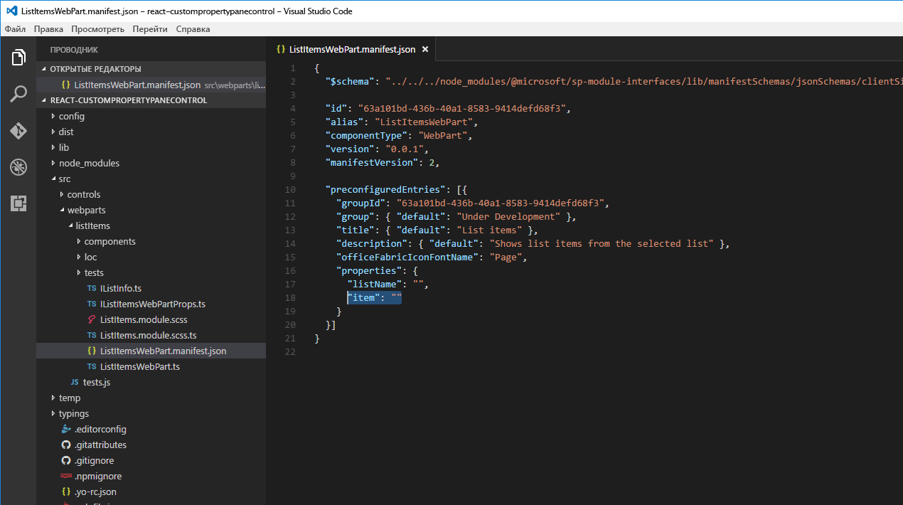

# <a name="build-custom-controls-for-the-property-pane"></a><span data-ttu-id="dee9c-102">Создание пользовательских элементов управления для области свойств</span><span class="sxs-lookup"><span data-stu-id="dee9c-102">Build custom controls for the property pane</span></span>

<span data-ttu-id="dee9c-p101">Платформа SharePoint Framework содержит набор стандартных элементов управления для области свойств, но иногда нужны дополнительные функции. Вам может понадобиться асинхронное обновление данных в элементе управления или определенный пользовательский интерфейс. Создайте пользовательский элемент управления для области свойств, чтобы получить необходимые функции.</span><span class="sxs-lookup"><span data-stu-id="dee9c-p101">The SharePoint Framework contains a set of standard controls for the property pane. But sometimes you need additional functionality beyond the basic controls. You might need asynchronous updates to the data on a control, or a specific user interface. Build a custom control for the property pane to get the functionality you need.</span></span>

<span data-ttu-id="dee9c-p102">В этой статье описано, как создать пользовательский элемент управления для области свойств. Вы создадите пользовательское раскрывающееся меню, которое асинхронно загружает данные из внешней службы, не блокируя пользовательский интерфейс веб-части.</span><span class="sxs-lookup"><span data-stu-id="dee9c-p102">In this article you will learn how to build a custom control for the property pane. You will build a custom dropdown control that loads its data asynchronously from an external service without blocking the user interface of the web part.</span></span>


<span data-ttu-id="dee9c-110">Исходный код рабочей веб-части доступен на сайте GitHub по адресу [https://github.com/SharePoint/sp-dev-fx-webparts/tree/master/samples/react-custompropertypanecontrols](https://github.com/SharePoint/sp-dev-fx-webparts/tree/master/samples/react-custompropertypanecontrols).</span><span class="sxs-lookup"><span data-stu-id="dee9c-110">The source of the working web part is available on GitHub at [https://github.com/SharePoint/sp-dev-fx-webparts/tree/master/samples/react-custompropertypanecontrols](https://github.com/SharePoint/sp-dev-fx-webparts/tree/master/samples/react-custompropertypanecontrols).</span></span>

> [!NOTE] 
> <span data-ttu-id="dee9c-111">Прежде чем выполнять действия, описанные в этой статье, [настройте среду разработки](../../set-up-your-development-environment.md) для создания решений на платформе SharePoint Framework.</span><span class="sxs-lookup"><span data-stu-id="dee9c-111">[Note:](../../set-up-your-development-environment.md) Before following the steps in this article, be sure to set up your development environment for building SharePoint Framework solutions.</span></span>

## <a name="create-new-project"></a><span data-ttu-id="dee9c-112">Создание проекта</span><span class="sxs-lookup"><span data-stu-id="dee9c-112">Create new project</span></span>

<span data-ttu-id="dee9c-113">Для начала создайте папку проекта.</span><span class="sxs-lookup"><span data-stu-id="dee9c-113">Start by creating a new folder for your project.</span></span>

```sh
md react-custompropertypanecontrol
```

<span data-ttu-id="dee9c-114">Перейдите в папку проекта.</span><span class="sxs-lookup"><span data-stu-id="dee9c-114">Go to the project folder.</span></span>

```sh
cd react-custompropertypanecontrol
```

<span data-ttu-id="dee9c-115">В папке проекта запустите генератор Yeoman для SharePoint Framework, чтобы сформировать шаблон проекта на платформе SharePoint Framework.</span><span class="sxs-lookup"><span data-stu-id="dee9c-115">In the project folder run the SharePoint Framework Yeoman generator to scaffold a new SharePoint Framework project.</span></span>

```sh
yo @microsoft/sharepoint
```

<span data-ttu-id="dee9c-116">Введите следующие значения:</span><span class="sxs-lookup"><span data-stu-id="dee9c-116">When prompted, enter the following values:</span></span>

- <span data-ttu-id="dee9c-117">имя решения — **react-custompropertypanecontrol**</span><span class="sxs-lookup"><span data-stu-id="dee9c-117">**react-custompropertypanecontrol** as your solution name</span></span>
- <span data-ttu-id="dee9c-118">расположение файлов — **Use the current folder** (Использовать текущую папку)</span><span class="sxs-lookup"><span data-stu-id="dee9c-118">**Use the current folder** for the location to place the files</span></span>
- <span data-ttu-id="dee9c-119">имя веб-части **List items** (Элементы списка)</span><span class="sxs-lookup"><span data-stu-id="dee9c-119">**List items** as your web part name</span></span>
- <span data-ttu-id="dee9c-120">описание веб-части — **Shows list items from the selected list** (Показывает элементы списка из выбранного списка)</span><span class="sxs-lookup"><span data-stu-id="dee9c-120">**Shows list items from the selected list** as your web part description</span></span>
- <span data-ttu-id="dee9c-121">отправная точка создания веб-части — **React**</span><span class="sxs-lookup"><span data-stu-id="dee9c-121">**React** as the starting point to build the web part</span></span>


<span data-ttu-id="dee9c-123">После завершения скаффолдинга блокируйте версию зависимостей проекта, выполнив следующую команду:</span><span class="sxs-lookup"><span data-stu-id="dee9c-123">Once the scaffolding completes, lock down the version of the project dependencies by running the following command:</span></span>

```sh
npm shrinkwrap
```

<span data-ttu-id="dee9c-124">Далее откройте папку проекта в редакторе кода.</span><span class="sxs-lookup"><span data-stu-id="dee9c-124">Next, open your project folder in your code editor.</span></span> <span data-ttu-id="dee9c-125">В этой статье инструкции и снимки экрана основаны на Visual Studio Code, но вы можете использовать любой редактор.</span><span class="sxs-lookup"><span data-stu-id="dee9c-125">This article uses Visual Studio Code in the steps and screenshots but you can use any editor you prefer.</span></span>


## <a name="define-web-part-property-for-storing-the-selected-list"></a><span data-ttu-id="dee9c-127">Определение свойства веб-части для хранения выбранного списка</span><span class="sxs-lookup"><span data-stu-id="dee9c-127">Define web part property for storing the selected list</span></span>

<span data-ttu-id="dee9c-p104">В веб-части, которую вы создаете, появятся элементы из выбранного списка SharePoint. Пользователи смогут выбрать список в свойствах веб-части. Для хранения выбранного списка создайте свойство веб-части с именем **listName**.</span><span class="sxs-lookup"><span data-stu-id="dee9c-p104">The Web part you are building will show list items from the selected SharePoint list. Users will be able to select a list in the web part properties. To store the selected list create a new web part property named **listName**.</span></span>

<span data-ttu-id="dee9c-p105">В редакторе кода откройте файл **src/webparts/listItems/ListItemsWebPartManifest.json**. Замените свойство по умолчанию **description** на новое свойство `listName`.</span><span class="sxs-lookup"><span data-stu-id="dee9c-p105">In the code editor open the **src/webparts/listItems/ListItemsWebPartManifest.json** file. Replace the default **description** property with a new property named `listName`.</span></span>


<span data-ttu-id="dee9c-134">Далее откройте файл **src/webparts/listItems/IListItemsWebPartProps.ts** и замените его содержимое на следующее:</span><span class="sxs-lookup"><span data-stu-id="dee9c-134">Next, open the **src/webparts/listItems/IListItemsWebPartProps.ts** file and replace its contents with:</span></span>

```ts
export interface IListItemsWebPartProps {
  listName: string;
}
```

<span data-ttu-id="dee9c-135">В файле **src/webparts/listItems/ListItemsWebPart.ts** измените метод **render** следующим образом:</span><span class="sxs-lookup"><span data-stu-id="dee9c-135">In the **src/webparts/listItems/ListItemsWebPart.ts** file, change the **render** method to:</span></span>

```ts
export default class ListItemsWebPart extends BaseClientSideWebPart<IListItemsWebPartProps> {
  // ...
  public render(): void {
    const element: React.ReactElement<IListItemsProps> = React.createElement(ListItems, {
      listName: this.properties.listName
    });

    ReactDom.render(element, this.domElement);
  }
  // ...
}
```

<span data-ttu-id="dee9c-136">Обновите метод **getPropertyPaneConfiguration** следующим образом:</span><span class="sxs-lookup"><span data-stu-id="dee9c-136">Update the **getPropertyPaneConfiguration** method to:</span></span>

```ts
export default class ListItemsWebPart extends BaseClientSideWebPart<IListItemsWebPartProps> {
  // ...
  protected getPropertyPaneConfiguration(): IPropertyPaneConfiguration {
    return {
      pages: [
        {
          header: {
            description: strings.PropertyPaneDescription
          },
          groups: [
            {
              groupName: strings.BasicGroupName,
              groupFields: [
                PropertyPaneTextField('listName', {
                  label: strings.ListFieldLabel
                })
              ]
            }
          ]
        }
      ]
    };
  }
  // ...
}
```

<span data-ttu-id="dee9c-137">В файле **src/webparts/listItems/loc/mystrings.d.ts** измените интерфейс **IListItemsWebPartStrings** следующим образом:</span><span class="sxs-lookup"><span data-stu-id="dee9c-137">In the **src/webparts/listItems/loc/mystrings.d.ts** file change the **IListItemsWebPartStrings** interface to:</span></span>

```ts
declare interface IListItemsWebPartStrings {
  PropertyPaneDescription: string;
  BasicGroupName: string;
  ListFieldLabel: string;
}
```

<span data-ttu-id="dee9c-138">В файле **src/webparts/listItems/loc/en-us.js** добавьте отсутствующее определение для строки **ListFieldLabel**.</span><span class="sxs-lookup"><span data-stu-id="dee9c-138">In the **src/webparts/listItems/loc/en-us.js** file add the missing definition for the **ListFieldLabel** string.</span></span>

```js
define([], function() {
  return {
    "PropertyPaneDescription": "Description",
    "BasicGroupName": "Group Name",
    "ListFieldLabel": "List"
  }
});
```

<span data-ttu-id="dee9c-139">В файле **src/webparts/listItems/components/ListItems.tsx** измените содержимое метода **render** следующим образом:</span><span class="sxs-lookup"><span data-stu-id="dee9c-139">In the **src/webparts/listItems/components/ListItems.tsx** file change the contents of the **render** method to:</span></span>

```tsx
export default class ListItems extends React.Component<IListItemsProps, {}> {
  public render(): React.ReactElement<IListItemsProps> {
    return (
      <div className={styles.listItems}>
        <div className={styles.container}>
          <div className={`ms-Grid-row ms-bgColor-themeDark ms-fontColor-white ${styles.row}`}>
            <div className="ms-Grid-col ms-lg10 ms-xl8 ms-xlPush2 ms-lgPush1">
              <span className="ms-font-xl ms-fontColor-white">Welcome to SharePoint!</span>
              <p className="ms-font-l ms-fontColor-white">Customize SharePoint experiences using Web Parts.</p>
              <p className="ms-font-l ms-fontColor-white">{escape(this.props.listName)}</p>
              <a href="https://aka.ms/spfx" className={styles.button}>
                <span className={styles.label}>Learn more</span>
              </a>
            </div>
          </div>
        </div>
      </div>
    );
  }
}
```

<span data-ttu-id="dee9c-140">После этого откройте файл **src/webparts/listItems/components/IListItemsProps.ts** и замените его содержимое следующим кодом:</span><span class="sxs-lookup"><span data-stu-id="dee9c-140">Next, open the **src/webparts/listItems/components/IListItemsProps.ts** file and replace its contents with:</span></span>

```ts
export interface IListItemsProps {
  listName: string;
}
```

<span data-ttu-id="dee9c-141">Чтобы убедиться, что проект работает, выполните следующую команду:</span><span class="sxs-lookup"><span data-stu-id="dee9c-141">Run the following command to verify that the project is running:</span></span>

```sh
gulp serve
```

<span data-ttu-id="dee9c-p106">В веб-браузере добавьте веб-часть **List items** на полотно и откройте ее свойства. Убедитесь, что значение свойства **List** отображается в теле веб-части.</span><span class="sxs-lookup"><span data-stu-id="dee9c-p106">In the web browser, add the **List items** web part to the canvas and open its properties. Verify that the value set for the **List** property is displayed in the web part body.</span></span>


## <a name="create-asynchronous-dropdown-property-pane-control"></a><span data-ttu-id="dee9c-145">Создание асинхронного раскрывающегося меню области свойств</span><span class="sxs-lookup"><span data-stu-id="dee9c-145">Create asynchronous dropdown property pane control</span></span>

<span data-ttu-id="dee9c-p107">В SharePoint Framework представлено стандартное раскрывающееся меню, которое позволяет пользователям выбирать определенные значения. Все его значения должны быть известны заранее. Если вы хотите загружать значения динамически или загружаете значения асинхронно из внешней службы и не хотите блокировать веб-часть, создайте пользовательское раскрывающееся меню.</span><span class="sxs-lookup"><span data-stu-id="dee9c-p107">The SharePoint Framework offers you a standard dropdown control that allows users to select a specific value. The dropdown control is built in a way that requires all its values to be known upfront. If you want to load the values dynamically or you're loading values asynchronously from an external service and you don't want to block the whole web part, building a custom dropdown control is a viable option.</span></span>

<span data-ttu-id="dee9c-149">Оно состоит из класса, который регистрирует элемент управления в веб-части, и компонента React в SharePoint Framework, который отрисовывает раскрывающееся меню и управляет его данными.</span><span class="sxs-lookup"><span data-stu-id="dee9c-149">When creating a custom property pane control that uses React in the SharePoint Framework, the control consists of a class that registers the control with the web part, and a React component that renders the dropdown and manages its data.</span></span>

> [!NOTE] 
> <span data-ttu-id="dee9c-p108">В выпуске 6 SharePoint Framework присутствует ошибка в компоненте Office UI Fabric React Dropdown, из-за которой элемент управления, создаваемый в этой статье, работает неправильно. Для временного решения проблемы измените строку **12027** в файле **node_modules/@microsoft/office-ui-fabric-react-bundle/dist/office-ui-fabric-react.bundle.js** с:</span><span class="sxs-lookup"><span data-stu-id="dee9c-p108">**Note:** In drop 6 of the SharePoint Framework there is a bug in the Office UI Fabric React Dropdown component that causes the control built in this article to work incorrectly. A temporary workaround is to edit the **node_modules/@microsoft/office-ui-fabric-react-bundle/dist/office-ui-fabric-react.bundle.js** file and change line 12027 from:</span></span>
> 
> ```js
> isDisabled: this.props.isDisabled !== undefined ? this.props.isDisabled : this.props.disabled
> ```
>
> <span data-ttu-id="dee9c-152">на значение:</span><span class="sxs-lookup"><span data-stu-id="dee9c-152">to:</span></span>
> 
> ```js
> isDisabled: newProps.isDisabled !== undefined ? newProps.isDisabled : newProps.disabled
> ```

### <a name="add-asynchronous-dropdown-property-pane-control-react-component"></a><span data-ttu-id="dee9c-153">Добавление компонента React асинхронного раскрывающегося меню области свойств</span><span class="sxs-lookup"><span data-stu-id="dee9c-153">Add asynchronous dropdown property pane control React component</span></span>

#### <a name="create-components-folder"></a><span data-ttu-id="dee9c-154">Создание папки компонентов</span><span class="sxs-lookup"><span data-stu-id="dee9c-154">Create components folder</span></span>

<span data-ttu-id="dee9c-155">В папке проекта **src** создайте иерархию из трех новых папок, чтобы получилась следующая структура: **src/controls/PropertyPaneAsyncDropdown/components**.</span><span class="sxs-lookup"><span data-stu-id="dee9c-155">In the project **src** folder, create a hierarchy of three new folders so that your folder structure appears as **src/controls/PropertyPaneAsyncDropdown/components**.</span></span>


#### <a name="define-asynchronous-dropdown-react-component-properties"></a><span data-ttu-id="dee9c-157">Определение свойств компонента React асинхронного раскрывающегося меню</span><span class="sxs-lookup"><span data-stu-id="dee9c-157">Define asynchronous dropdown React component properties</span></span>

<span data-ttu-id="dee9c-158">В папке **src/controls/PropertyPaneAsyncDropdown/components** создайте файл **IAsyncDropdownProps.ts** и введите следующий код:</span><span class="sxs-lookup"><span data-stu-id="dee9c-158">In the **src/controls/PropertyPaneAsyncDropdown/components** folder create a new file named **IAsyncDropdownProps.ts** and enter the following code:</span></span>

```ts
import { IDropdownOption } from 'office-ui-fabric-react/lib/components/Dropdown';

export interface IAsyncDropdownProps {
  label: string;
  loadOptions: () => Promise<IDropdownOption[]>;
  onChanged: (option: IDropdownOption, index?: number) => void;
  selectedKey: string | number;
  disabled: boolean;
  stateKey: string;
}
```

<span data-ttu-id="dee9c-p109">Класс **IAsyncDropdownProps** определяет свойства, которые можно настроить в компоненте React, используемом пользовательским элементом управления области свойства. Свойство **label** указывает подпись для раскрывающегося меню. Для загрузки доступных параметров элемент управления вызывает функцию, связанную с делегатом **loadOptions**. После выбора параметра в раскрывающемся меню вызывается функция, связанная с делегатом **onChanged**. Свойство **selectedKey** указывает выбранное значение, которое может быть строкой или числом. Свойство **disabled** указывает, отключено ли раскрывающееся меню. Свойство **stateKey** используется для принудительной повторной отрисовки.</span><span class="sxs-lookup"><span data-stu-id="dee9c-p109">The **IAsyncDropdownProps** class defines properties that can be set on the React component used by the custom property pane control. The **label** property specifies the label for the dropdown control. The function associated with the **loadOptions** delegate is called by the control to load the available options. The function associated with the **onChanged** delegate is called after the user selected an option in the dropdown. The **selectedKey** property specifies the selected value which can be a string or a number. The **disabled** property specifies if the dropdown control is disabled or not. The **stateKey** property is used to force the React component to re-render.</span></span>

#### <a name="define-asynchronous-dropdown-react-component-interface"></a><span data-ttu-id="dee9c-166">Определение интерфейса компонента React "асинхронное раскрывающееся меню"</span><span class="sxs-lookup"><span data-stu-id="dee9c-166">Define asynchronous dropdown React component interface</span></span>

<span data-ttu-id="dee9c-167">В папке **src/controls/PropertyPaneAsyncDropdown/components** создайте файл **IAsyncDropdownState.ts** и введите следующий код:</span><span class="sxs-lookup"><span data-stu-id="dee9c-167">In the **src/controls/PropertyPaneAsyncDropdown/components** folder create new file named **IAsyncDropdownState.ts** and enter the following code:</span></span>

```ts
import { IDropdownOption } from 'office-ui-fabric-react/lib/components/Dropdown';

export interface IAsyncDropdownState {
  loading: boolean;
  options: IDropdownOption[];
  error: string;
}
```

<span data-ttu-id="dee9c-p110">Интерфейс **IAsyncDropdownState** описывает состояние компонента React. Свойство **loading** определяет, загружает ли компонент параметры в данный момент. Свойство **options** содержит все доступные параметры. Если произойдет ошибка, она будет назначена свойству **error**, из которого она будет передана пользователю.</span><span class="sxs-lookup"><span data-stu-id="dee9c-p110">The **IAsyncDropdownState** interface describes the state of the React component. The **loading** property determines if the component is loading its options at the given moment. The **options** property contains all available options. If an error occurred it will be assigned to the **error** property from where it will be communicated to the user.</span></span>

#### <a name="define-the-asynchronous-dropdown-react-component"></a><span data-ttu-id="dee9c-172">Определение компонента React асинхронного раскрывающегося меню</span><span class="sxs-lookup"><span data-stu-id="dee9c-172">Define the asynchronous dropdown React component</span></span>

<span data-ttu-id="dee9c-173">В папке **src/controls/PropertyPaneAsyncDropdown/components** создайте файл **AsyncDropdown.tsx** и введите следующий код:</span><span class="sxs-lookup"><span data-stu-id="dee9c-173">In the **src/controls/PropertyPaneAsyncDropdown/components** folder create a new file named **AsyncDropdown.tsx** and enter the following code:</span></span>

```tsx
import * as React from 'react';
import { Dropdown, IDropdownOption } from 'office-ui-fabric-react/lib/components/Dropdown';
import { Spinner } from 'office-ui-fabric-react/lib/components/Spinner';
import { IAsyncDropdownProps } from './IAsyncDropdownProps';
import { IAsyncDropdownState } from './IAsyncDropdownState';

export default class AsyncDropdown extends React.Component<IAsyncDropdownProps, IAsyncDropdownState> {
  private selectedKey: React.ReactText;

  constructor(props: IAsyncDropdownProps, state: IAsyncDropdownState) {
    super(props);
    this.selectedKey = props.selectedKey;

    this.state = {
      loading: false,
      options: undefined,
      error: undefined
    };
  }

  public componentDidMount(): void {
    this.loadOptions();
  }

  public componentDidUpdate(prevProps: IAsyncDropdownProps, prevState: IAsyncDropdownState): void {
    if (this.props.disabled !== prevProps.disabled ||
      this.props.stateKey !== prevProps.stateKey) {
      this.loadOptions();
    }
  }

  private loadOptions(): void {
    this.setState({
      loading: true,
      error: undefined,
      options: undefined
    });

    this.props.loadOptions()
      .then((options: IDropdownOption[]): void => {
        this.setState({
          loading: false,
          error: undefined,
          options: options
        });
      }, (error: any): void => {
        this.setState((prevState: IAsyncDropdownState, props: IAsyncDropdownProps): IAsyncDropdownState => {
          prevState.loading = false;
          prevState.error = error;
          return prevState;
        });
      });
  }

  public render(): JSX.Element {
    const loading: JSX.Element = this.state.loading ? <div><Spinner label={'Loading options...'} /></div> : <div />;
    const error: JSX.Element = this.state.error !== undefined ? <div className={'ms-TextField-errorMessage ms-u-slideDownIn20'}>Error while loading items: {this.state.error}</div> : <div />;

    return (
      <div>
        <Dropdown label={this.props.label}
          disabled={this.props.disabled || this.state.loading || this.state.error !== undefined}
          onChanged={this.onChanged.bind(this)}
          selectedKey={this.selectedKey}
          options={this.state.options} />
        {loading}
        {error}
      </div>
    );
  }

  private onChanged(option: IDropdownOption, index?: number): void {
    this.selectedKey = option.key;
    // reset previously selected options
    const options: IDropdownOption[] = this.state.options;
    options.forEach((o: IDropdownOption): void => {
      if (o.key !== option.key) {
        o.selected = false;
      }
    });
    this.setState((prevState: IAsyncDropdownState, props: IAsyncDropdownProps): IAsyncDropdownState => {
      prevState.options = options;
      return prevState;
    });
    if (this.props.onChanged) {
      this.props.onChanged(option, index);
    }
  }
}
```

<span data-ttu-id="dee9c-p111">Класс **AsyncDropdown** представляет компонент React, используемый для отрисовки асинхронного раскрывающегося меню области свойств. При первой загрузке компонента изменится метод **componentDidMount** или его свойство **disabled** или **stateKey**, и он загрузит доступные параметры, вызвав метод **loadOptions**, переданный через свойства. После загрузки параметров компонент показывает доступные параметры. Раскрывающееся меню отрисовывается с помощью [компонента Office UI Fabric React Dropdown](http://dev.office.com/fabric#/components/dropdown). Когда компонент загружает доступные параметры, он показывает индикатор, используя [компонент индикатора работы Office UI Fabric React](http://dev.office.com/fabric#/components/spinner).</span><span class="sxs-lookup"><span data-stu-id="dee9c-p111">The **AsyncDropdown** class represents the React component used to render the asynchronous dropdown property pane control. When the component first loads, the **componentDidMount** method, or its **disabled** or **stateKey** properties will change, and it will load the available options by calling the **loadOptions** method passed through the properties. Once the options are loaded the component updates its state showing the available options. The dropdown itself is rendered using the [Office UI Fabric React dropdown component](http://dev.office.com/fabric#/components/dropdown). When the component is loading the available options it displays a spinner using the [Office UI Fabric React spinner component](http://dev.office.com/fabric#/components/spinner).</span></span>

### <a name="add-asynchronous-dropdown-property-pane-control"></a><span data-ttu-id="dee9c-179">Добавление асинхронного раскрывающегося меню области свойств</span><span class="sxs-lookup"><span data-stu-id="dee9c-179">Add asynchronous dropdown property pane control</span></span>

<span data-ttu-id="dee9c-p112">Далее необходимо определить пользовательский элемент управления области свойств. Этот элемент управления используется в веб-части при определении свойств в области свойств и отрисовывается с помощью заданного компонента React.</span><span class="sxs-lookup"><span data-stu-id="dee9c-p112">The next step is to define the custom property pane control. This control is used inside the web part when defining properties in the property pane and renders using the previously defined React component.</span></span>

#### <a name="define-asynchronous-dropdown-property-pane-control-properties"></a><span data-ttu-id="dee9c-182">Определение свойств асинхронного раскрывающегося меню области свойств</span><span class="sxs-lookup"><span data-stu-id="dee9c-182">Define asynchronous dropdown property pane control properties</span></span>

<span data-ttu-id="dee9c-p113">У пользовательского элемента управления области свойств есть два набора свойств. Первый из них доступен для всех и используется для определения свойства веб-части. К этим свойства компонента относятся подпись, которая отображается рядом с элементом управления, минимальное и максимальное значения для индикатора и доступные параметры раскрывающегося меню. При определении пользовательского элемента управления области свойств тип, описывающий эти свойства, необходимо передавать как тип **TProperties** при реализации интерфейса **IPropertyPaneField<TProperties>**.</span><span class="sxs-lookup"><span data-stu-id="dee9c-p113">A custom property pane control has two sets of properties. The first set of properties are exposed publicly and are used to define the web part property inside the web part. These properties are component-specific properties, such as the label displayed next to the control, minimum and maximum values for a spinner, or available options for a dropdown. When defining a custom property pane control, the type describing these properties must be passed as the **TProperties** type when implementing the **IPropertyPaneField<TProperties>** interface.</span></span>

<span data-ttu-id="dee9c-p114">Второй набор состоит из личных свойств, которые используются в пользовательском элементе управления области свойств. Для правильной отрисовки пользовательского элемента управления эти свойства должны соответствовать требованиям API SharePoint Framework. Эти свойства должны использовать интерфейс **IPropertyPaneCustomFieldProps** из пакета **@microsoft/sp-webpart-base**.</span><span class="sxs-lookup"><span data-stu-id="dee9c-p114">The second set of properties are private properties used internally inside the custom property pane control. These properties have to adhere to the SharePoint Framework APIs for the custom control to render correctly. These properties must implement the **IPropertyPaneCustomFieldProps** interface from the **@microsoft/sp-webpart-base** package.</span></span>

##### <a name="define-the-public-properties-for-the-asynchronous-dropdown-property-pane-control"></a><span data-ttu-id="dee9c-190">Определение общедоступных свойств для асинхронного раскрывающегося меню области свойств</span><span class="sxs-lookup"><span data-stu-id="dee9c-190">Define the public properties for the asynchronous dropdown property pane control</span></span>

<span data-ttu-id="dee9c-191">В папке **src/controls/PropertyPaneAsyncDropdown** создайте файл **IPropertyPaneAsyncDropdownProps.ts** и введите следующий код:</span><span class="sxs-lookup"><span data-stu-id="dee9c-191">In the **src/controls/PropertyPaneAsyncDropdown** folder create a new file named **IPropertyPaneAsyncDropdownProps.ts** and enter the following code:</span></span>

```ts
import { IDropdownOption } from 'office-ui-fabric-react/lib/components/Dropdown';

export interface IPropertyPaneAsyncDropdownProps {
  label: string;
  loadOptions: () => Promise<IDropdownOption[]>;
  onPropertyChange: (propertyPath: string, newValue: any) => void;
  selectedKey: string | number;
  disabled?: boolean;
}
```

<span data-ttu-id="dee9c-p115">Свойство **label** определяет подпись, которая отображается рядом с раскрывающимся списком. Делегат **loadOptions** определяет метод, который вызывается для загрузки доступных параметров раскрывающегося меню. Делегат **onPropertyChange** определяет метод, который вызывается, когда пользователь выбирает значение в раскрывающемся меню. Свойство **selectedKey** возвращает выбранное значение раскрывающегося меню. Свойство **disabled** указывает, отключен ли элемент управления.</span><span class="sxs-lookup"><span data-stu-id="dee9c-p115">The **label** property defines the label displayed next to the dropdown. The **loadOptions** delegate defines the method that is called to load the available dropdown options. The **onPropertyChange** delegate defines a method that is called when the user selects a value in the dropdown. The **selectedKey** property returns the selected dropdown value. The **disabled** property specifies whether the control is disabled or not.</span></span>

##### <a name="define-the-internal-properties-for-the-asynchronous-dropdown-property-pane-control"></a><span data-ttu-id="dee9c-197">Определение внутренних свойств для асинхронного раскрывающегося меню области свойств</span><span class="sxs-lookup"><span data-stu-id="dee9c-197">Define the internal properties for the asynchronous dropdown property pane control</span></span>

<span data-ttu-id="dee9c-198">В папке **src/controls/PropertyPaneAsyncDropdown** создайте файл **IPropertyPaneAsyncDropdownInternalProps.ts** и введите следующий код:</span><span class="sxs-lookup"><span data-stu-id="dee9c-198">In the **src/controls/PropertyPaneAsyncDropdown** folder create a new file named **IPropertyPaneAsyncDropdownInternalProps.ts** and enter the following code:</span></span>

```ts
import { IPropertyPaneCustomFieldProps } from '@microsoft/sp-webpart-base';
import { IPropertyPaneAsyncDropdownProps } from './IPropertyPaneAsyncDropdownProps';

export interface IPropertyPaneAsyncDropdownInternalProps extends IPropertyPaneAsyncDropdownProps, IPropertyPaneCustomFieldProps {
}
```

<span data-ttu-id="dee9c-199">Интерфейс **IPropertyPaneAsyncDropdownInternalProps** не определяет новые свойства, но он объединяет свойства из заданного интерфейса **IPropertyPaneAsyncDropdownProps** и стандартного интерфейса SharePoint Framework **IPropertyPaneCustomFieldProps**, что необходимо для правильной работы пользовательского элемента управления.</span><span class="sxs-lookup"><span data-stu-id="dee9c-199">While the **IPropertyPaneAsyncDropdownInternalProps** interface doesn't define any new properties, it combines the properties from the previously defined **IPropertyPaneAsyncDropdownProps** interface and the standard SharePoint Framework **IPropertyPaneCustomFieldProps** interface which is required for a custom control to run correctly.</span></span>

#### <a name="define-the-asynchronous-dropdown-property-pane-control"></a><span data-ttu-id="dee9c-200">Определение асинхронного раскрывающегося меню области свойств</span><span class="sxs-lookup"><span data-stu-id="dee9c-200">Define the asynchronous dropdown property pane control</span></span>

<span data-ttu-id="dee9c-201">В папке **src/controls/PropertyPaneAsyncDropdown** создайте файл **PropertyPaneAsyncDropdown.ts** и введите следующий код:</span><span class="sxs-lookup"><span data-stu-id="dee9c-201">In the **src/controls/PropertyPaneAsyncDropdown** folder create a new file named **PropertyPaneAsyncDropdown.ts** and enter the following code:</span></span>

```ts
import * as React from 'react';
import * as ReactDom from 'react-dom';
import {
  IPropertyPaneField,
  PropertyPaneFieldType
} from '@microsoft/sp-webpart-base';
import { IDropdownOption } from 'office-ui-fabric-react/lib/components/Dropdown';
import { IPropertyPaneAsyncDropdownProps } from './IPropertyPaneAsyncDropdownProps';
import { IPropertyPaneAsyncDropdownInternalProps } from './IPropertyPaneAsyncDropdownInternalProps';
import AsyncDropdown from './components/AsyncDropdown';
import { IAsyncDropdownProps } from './components/IAsyncDropdownProps';

export class PropertyPaneAsyncDropdown implements IPropertyPaneField<IPropertyPaneAsyncDropdownProps> {
  public type: PropertyPaneFieldType = PropertyPaneFieldType.Custom;
  public targetProperty: string;
  public properties: IPropertyPaneAsyncDropdownInternalProps;
  private elem: HTMLElement;

  constructor(targetProperty: string, properties: IPropertyPaneAsyncDropdownProps) {
    this.targetProperty = targetProperty;
    this.properties = {
      key: properties.label,
      label: properties.label,
      loadOptions: properties.loadOptions,
      onPropertyChange: properties.onPropertyChange,
      selectedKey: properties.selectedKey,
      disabled: properties.disabled,
      onRender: this.onRender.bind(this)
    };
  }

  public render(): void {
    if (!this.elem) {
      return;
    }

    this.onRender(this.elem);
  }

  private onRender(elem: HTMLElement): void {
    if (!this.elem) {
      this.elem = elem;
    }

    const element: React.ReactElement<IAsyncDropdownProps> = React.createElement(AsyncDropdown, {
      label: this.properties.label,
      loadOptions: this.properties.loadOptions,
      onChanged: this.onChanged.bind(this),
      selectedKey: this.properties.selectedKey,
      disabled: this.properties.disabled,
      // required to allow the component to be re-rendered by calling this.render() externally
      stateKey: new Date().toString()
    });
    ReactDom.render(element, elem);
  }

  private onChanged(option: IDropdownOption, index?: number): void {
    this.properties.onPropertyChange(this.targetProperty, option.key);
  }
}
```

<span data-ttu-id="dee9c-p116">Класс **PropertyPaneAsyncDropdown** реализует стандартный интерфейс SharePoint Framework **IPropertyPaneField**, используя интерфейс **IPropertyPaneAsyncDropdownProps** как контракт для общедоступных свойств, которые можно настроить в веб-части. Класс содержит следующие три общедоступные свойства, определяемые интерфейсом **IPropertyPaneField**:</span><span class="sxs-lookup"><span data-stu-id="dee9c-p116">The **PropertyPaneAsyncDropdown** class implements the standard SharePoint Framework **IPropertyPaneField** interface using the **IPropertyPaneAsyncDropdownProps** interface as a contract for its public properties that can be set from inside the web part. The class contains the following three public properties defined by the **IPropertyPaneField** interface:</span></span>

- <span data-ttu-id="dee9c-204">**type**: для пользовательского элемента управления области свойств необходимо использовать значение **PropertyPaneFieldType.Custom**.</span><span class="sxs-lookup"><span data-stu-id="dee9c-204">**type**: Must be set to **PropertyPaneFieldType.Custom** for a custom property pane control.</span></span>
- <span data-ttu-id="dee9c-205">**targetProperty**: позволяет указать имя свойства веб-части, которое необходимо использовать с элементом управления.</span><span class="sxs-lookup"><span data-stu-id="dee9c-205">**targetProperty**: Used to specify the name of the web part property to be used with the control.</span></span>
- <span data-ttu-id="dee9c-206">**properties**: позволяет определить свойства элемента управления.</span><span class="sxs-lookup"><span data-stu-id="dee9c-206">**properties**: Used to define control-specific properties.</span></span>

<span data-ttu-id="dee9c-p117">Обратите внимание, что свойство **properties** относится к внутреннему типу **IPropertyPaneAsyncDropdownInternalProps**, а не к общедоступному интерфейсу **IPropertyPaneAsyncDropdownProps**, реализованному классом. Это сделано для того, чтобы свойство **properties** могло определять метод **onRender**, необходимый для SharePoint Framework. Если бы метод **onRender** был частью общедоступного интерфейса **IPropertyPaneAsyncDropdownProps**, при использовании асинхронного раскрывающегося меню в веб-части, вам потребовалось бы назначить ему значение в веб-части, что нежелательно.</span><span class="sxs-lookup"><span data-stu-id="dee9c-p117">Notice how the **properties** property is of the internal **IPropertyPaneAsyncDropdownInternalProps** type rather than the public **IPropertyPaneAsyncDropdownProps** interface implemented by the class. This is on purpose so that the **properties** property can define the **onRender** method required by the SharePoint Framework. If the **onRender** method was a part of the public **IPropertyPaneAsyncDropdownProps** interface then, when using the asynchronous dropdown control in the web part, you would be required to assign a value to it inside the web part, which isn't desirable.</span></span>

<span data-ttu-id="dee9c-p118">Класс **PropertyPaneAsyncDropdown** определяет общедоступный метод **render**, который можно использовать для обновления элемента управления. Это удобно при наличии каскадных раскрывающихся меню, когда значение, выбранное в одном, определяет параметры, доступные в другом. Вызов метода **render** после выбора элемента позволяет зависимому раскрывающемуся меню загрузить доступные параметры. Чтобы это работало, компонент React должен обнаружить, что элемент управления изменен. Для этого установите текущую дату для свойства **stateKey**. В результате при каждом вызове метода **onRender** компонент будет не только заново отрисовываться, но и обновлять доступные параметры.</span><span class="sxs-lookup"><span data-stu-id="dee9c-p118">The **PropertyPaneAsyncDropdown** class defines a public **render** method which can be used to repaint the control. This is useful in situations such as when you have cascading dropdowns where the value set in one determines the options available in another. By calling the **render** method after selecting an item, you can have the dependent dropdown load available options. For this to work you have to make React detect that the control has changed. This is done by setting the value of the **stateKey** to the current date. Using this trick, every time the **onRender** method is called, the component will not only be re-rendered but it will also update its available options.</span></span>

## <a name="use-the-asynchronous-dropdown-property-pane-control-in-the-web-part"></a><span data-ttu-id="dee9c-216">Использование асинхронного раскрывающегося меню в веб-части</span><span class="sxs-lookup"><span data-stu-id="dee9c-216">Use the asynchronous dropdown property pane control in the web part</span></span>

<span data-ttu-id="dee9c-217">Теперь, когда асинхронный элемент управления области свойств готов, необходимо использовать его в веб-части, чтобы пользователи могли выбрать список.</span><span class="sxs-lookup"><span data-stu-id="dee9c-217">With the asynchronous dropdown property pane control ready, the next step is to use it inside the web part allowing users to select a list.</span></span>

### <a name="add-list-info-interface"></a><span data-ttu-id="dee9c-218">Добавление интерфейса сведений о списке</span><span class="sxs-lookup"><span data-stu-id="dee9c-218">Add list info interface</span></span>

<span data-ttu-id="dee9c-p119">Чтобы передавать сведения о доступных списках, определите интерфейс, который будет представлять сведения о списке. В папке **src/webparts/listItems** создайте файл **IListInfo.ts** и введите следующий код:</span><span class="sxs-lookup"><span data-stu-id="dee9c-p119">To pass information about available lists around in a consistent manner, define an interface that will represent information about a list. In the **src/webparts/listItems** folder create a new file named **IListInfo.ts** and enter the following code:</span></span>

```ts
export interface IListInfo {
  Id: string;
  Title: string;
}
```

### <a name="use-the-asynchronous-dropdown-property-pane-control-to-render-the-listname-web-part-property"></a><span data-ttu-id="dee9c-221">Использование асинхронного раскрывающегося меню для отрисовки свойства веб-части listName</span><span class="sxs-lookup"><span data-stu-id="dee9c-221">Use the asynchronous dropdown property pane control to render the listName web part property</span></span>

#### <a name="reference-required-types"></a><span data-ttu-id="dee9c-222">Обязательные типы для ссылки</span><span class="sxs-lookup"><span data-stu-id="dee9c-222">Reference required types</span></span>

<span data-ttu-id="dee9c-223">В верхней части файла **src/webparts/listItems/ListItemsWebPart.ts** импортируйте созданный класс **PropertyPaneAsyncDropdown**, добавив:</span><span class="sxs-lookup"><span data-stu-id="dee9c-223">In the top section of the **src/webparts/listItems/ListItemsWebPart.ts** file import the previously created **PropertyPaneAsyncDropdown** class by adding:</span></span>

```ts
import { PropertyPaneAsyncDropdown } from '../../controls/PropertyPaneAsyncDropdown/PropertyPaneAsyncDropdown';
```

<span data-ttu-id="dee9c-224">После этого кода добавьте ссылку на интерфейс **IDropdownOption** и две вспомогательные функции, необходимые для работы со свойствами веб-части.</span><span class="sxs-lookup"><span data-stu-id="dee9c-224">Then after that code, add a reference to the **IDropdownOption** interface and two helpers functions required to work with web part properties.</span></span>

```ts
import { IDropdownOption } from 'office-ui-fabric-react/lib/components/Dropdown';
import { update, get } from '@microsoft/sp-lodash-subset';
```


#### <a name="add-method-to-load-available-lists"></a><span data-ttu-id="dee9c-226">Добавление метода для загрузки доступных списков</span><span class="sxs-lookup"><span data-stu-id="dee9c-226">Add method to load available lists</span></span>

<span data-ttu-id="dee9c-p120">В классе **ListItemsWebPart** добавьте метод для загрузки доступных списков. В этой статье используются фиктивные данные, но вы также можете вызвать REST API SharePoint, чтобы извлечь список доступных списков из текущего веб-сайта. Для имитации загрузки параметров из внешней службы метод использует двухсекундную задержку.</span><span class="sxs-lookup"><span data-stu-id="dee9c-p120">In the **ListItemsWebPart** class add a method to load available lists. In this article you will use mock data but you could also call the SharePoint REST API to retrieve the list of available lists from the current web. To simulate loading options from an external service the method uses a two second delay.</span></span>

```ts
export default class ListItemsWebPart extends BaseClientSideWebPart<IListItemsWebPartProps> {
  // ...
  private loadLists(): Promise<IDropdownOption[]> {
    return new Promise<IDropdownOption[]>((resolve: (options: IDropdownOption[]) => void, reject: (error: any) => void) => {
      setTimeout(() => {
        resolve([{
          key: 'sharedDocuments',
          text: 'Shared Documents'
        },
          {
            key: 'myDocuments',
            text: 'My Documents'
          }]);
      }, 2000);
    });
  }
}
```

#### <a name="add-method-to-handle-the-change-of-the-value-in-the-dropdown"></a><span data-ttu-id="dee9c-230">Добавление метода для обработки изменения значения в раскрывающемся меню</span><span class="sxs-lookup"><span data-stu-id="dee9c-230">Add method to handle the change of the value in the dropdown</span></span>

<span data-ttu-id="dee9c-231">В классе **ListItemsWebPart** добавьте метод **onListChange**.</span><span class="sxs-lookup"><span data-stu-id="dee9c-231">In the **ListItemsWebPart** class add a new method named **onListChange**.</span></span>

```ts
export default class ListItemsWebPart extends BaseClientSideWebPart<IListItemsWebPartProps> {
  // ...
  private onListChange(propertyPath: string, newValue: any): void {
    const oldValue: any = get(this.properties, propertyPath);
    // store new value in web part properties
    update(this.properties, propertyPath, (): any => { return newValue; });
    // refresh web part
    this.render();
  }
}
```

<span data-ttu-id="dee9c-232">После выбора списка в раскрывающемся меню выбранное значение следует сохранять в свойствах веб-части, а веб-часть обновлять с учетом выбранного свойства.</span><span class="sxs-lookup"><span data-stu-id="dee9c-232">After selecting a list in the list dropdown, the selected value should be persisted in web part properties and the web part should be re-rendered to reflect the selected property.</span></span>

#### <a name="render-the-list-web-part-property-using-the-asynchronous-dropdown-property-pane-control"></a><span data-ttu-id="dee9c-233">Отрисовка свойства веб-части list с помощью асинхронного раскрывающегося меню области свойств</span><span class="sxs-lookup"><span data-stu-id="dee9c-233">Render the list web part property using the asynchronous dropdown property pane control</span></span>

<span data-ttu-id="dee9c-234">В классе **ListItemsWebPart** измените метод **getPropertyPaneConfiguration** так, чтобы он использовал асинхронное раскрывающееся меню области свойств для отрисовки свойства веб-части **listName**.</span><span class="sxs-lookup"><span data-stu-id="dee9c-234">In the **ListItemsWebPart** class change the **getPropertyPaneConfiguration** method to use the asynchronous dropdown property pane control to render the **listName** web part property.</span></span>

```ts
export default class ListItemsWebPart extends BaseClientSideWebPart<IListItemsWebPartProps> {
  // ...
  protected getPropertyPaneConfiguration(): IPropertyPaneConfiguration {
    return {
      pages: [
        {
          header: {
            description: strings.PropertyPaneDescription
          },
          groups: [
            {
              groupName: strings.BasicGroupName,
              groupFields: [
                new PropertyPaneAsyncDropdown('listName', {
                  label: strings.ListFieldLabel,
                  loadOptions: this.loadLists.bind(this),
                  onPropertyChange: this.onListChange.bind(this),
                  selectedKey: this.properties.listName
                })
              ]
            }
          ]
        }
      ]
    };
  }
  // ...
}
```

<span data-ttu-id="dee9c-p121">Теперь вы сможете выбрать список, используя новое асинхронное раскрывающееся меню области свойств. Чтобы убедиться, что элемент управления работает должным образом, откройте командную строку и выполните следующую команду:</span><span class="sxs-lookup"><span data-stu-id="dee9c-p121">At this point you should be able to select a list using the newly created asynchronous dropdown property pane control. To verify that the control is working as expected, open the command-line and run:</span></span>

```sh
gulp serve
```


## <a name="implement-cascading-dropdowns-using-the-asynchronous-dropdown-property-pane-control"></a><span data-ttu-id="dee9c-239">Реализация каскадных раскрывающихся списков с помощью элемента управления области свойств</span><span class="sxs-lookup"><span data-stu-id="dee9c-239">Implement cascading dropdowns using the asynchronous dropdown property pane control</span></span>

<span data-ttu-id="dee9c-p122">При создании веб-частей SharePoint Framework может понадобиться реализовать сценарий, при котором доступные параметры зависят от другого параметра, выбранного ранее. Например, сделать так, чтобы сначала пользователи выбирали список, а затем элемент из этого списка. Список доступных элементов будет зависеть от выбранного списка. Ниже описано, как реализовать такой сценарий с помощью асинхронного раскрывающегося меню, реализованного на предыдущих шагах.</span><span class="sxs-lookup"><span data-stu-id="dee9c-p122">When building SharePoint Framework web parts you might need to implement a configuration where the available options depend on another option chosen previously. A common example is to first let users choose a list and from that list select a list item. The list of available items would depend on the selected list. Here is how to implement such scenario using the asynchronous dropdown property pane control implemented in previous steps.</span></span>

### <a name="add-item-web-part-property"></a><span data-ttu-id="dee9c-244">Добавление свойства веб-части item</span><span class="sxs-lookup"><span data-stu-id="dee9c-244">Add item web part property</span></span>

<span data-ttu-id="dee9c-p123">В редакторе кода откройте файл **src/webparts/listItems/ListItemsWebPart.manifest.json**. В разделе **properties** добавьте свойство **item**, чтобы оно выглядело следующим образом:</span><span class="sxs-lookup"><span data-stu-id="dee9c-p123">In the code editor open the **src/webparts/listItems/ListItemsWebPart.manifest.json** file. To the **properties** section add a new property named **item** so that it appears as follows:</span></span>

```ts
// ...
"properties": {
   "listName": "",
   "item": ""
}
// ...
```



<span data-ttu-id="dee9c-248">Измените код в файле **src/webparts/listItems/IListItemsWebPartProps.ts** следующим образом:</span><span class="sxs-lookup"><span data-stu-id="dee9c-248">Change the code in the **src/webparts/listItems/IListItemsWebPartProps.ts** file to:</span></span>

```ts
export interface IListItemsWebPartProps {
  listName: string;
  item: string;
}
```

<span data-ttu-id="dee9c-249">Измените содержимое файла **src/webparts/listItems/components/IListItemsProps.ts** следующим образом:</span><span class="sxs-lookup"><span data-stu-id="dee9c-249">Change the contents of the **src/webparts/listItems/components/IListItemsProps.ts** file to:</span></span>

```ts
export interface IListItemsProps {
  listName: string;
  item: string;
}
```

<span data-ttu-id="dee9c-250">В файле **src/webparts/listItems/ListItemsWebPart.ts** измените код метода **render** следующим образом:</span><span class="sxs-lookup"><span data-stu-id="dee9c-250">In the **src/webparts/listItems/ListItemsWebPart.ts** file, change the code of the **render** method to:</span></span>

```ts
export default class ListItemsWebPart extends BaseClientSideWebPart<IListItemsWebPartProps> {
  // ...
  public render(): void {
    const element: React.ReactElement<IListItemsProps> = React.createElement(ListItems, {
      listName: this.properties.listName,
      item: this.properties.item
    });

    ReactDom.render(element, this.domElement);
  }
  // ...
}
```

<span data-ttu-id="dee9c-251">В файле **src/webparts/listItems/loc/mystrings.d.ts** измените интерфейс **IListItemsWebPartStrings** следующим образом:</span><span class="sxs-lookup"><span data-stu-id="dee9c-251">In the **src/webparts/listItems/loc/mystrings.d.ts** file change the **IListItemsWebPartStrings** interface to</span></span>

```ts
declare interface IListItemsWebPartStrings {
  PropertyPaneDescription: string;
  BasicGroupName: string;
  ListFieldLabel: string;
  ItemFieldLabel: string;
}
```

<span data-ttu-id="dee9c-252">В файле **src/webparts/listItems/loc/en-us.js** добавьте отсутствующее определение для строки **ItemFieldLabel**.</span><span class="sxs-lookup"><span data-stu-id="dee9c-252">In the **src/webparts/listItems/loc/en-us.js** file add the missing definition for the **ItemFieldLabel** string.</span></span>

```js
define([], function() {
  return {
    "PropertyPaneDescription": "Description",
    "BasicGroupName": "Group Name",
    "ListFieldLabel": "List",
    "ItemFieldLabel": "Item"
  }
});
```

### <a name="render-the-value-of-the-item-web-part-property"></a><span data-ttu-id="dee9c-253">Отрисовка значения свойства веб-части item</span><span class="sxs-lookup"><span data-stu-id="dee9c-253">Render the value of the item web part property</span></span>

<span data-ttu-id="dee9c-254">В файле **src/webparts/listItems/components/ListItems.tsx** измените метод **render** на следующий:</span><span class="sxs-lookup"><span data-stu-id="dee9c-254">In the **src/webparts/listItems/components/ListItems.tsx** file change the **render** method to:</span></span>

```tsx
export default class ListItems extends React.Component<IListItemsProps, {}> {
  public render(): React.ReactElement<IListItemsProps> {
    return (
      <div className={styles.listItems}>
        <div className={styles.container}>
          <div className={`ms-Grid-row ms-bgColor-themeDark ms-fontColor-white ${styles.row}`}>
            <div className="ms-Grid-col ms-lg10 ms-xl8 ms-xlPush2 ms-lgPush1">
              <span className="ms-font-xl ms-fontColor-white">Welcome to SharePoint!</span>
              <p className="ms-font-l ms-fontColor-white">Customize SharePoint experiences using Web Parts.</p>
              <p className="ms-font-l ms-fontColor-white">{escape(this.props.listName)}</p>
              <p className="ms-font-l ms-fontColor-white">{escape(this.props.item)}</p>
              <a href="https://aka.ms/spfx" className={styles.button}>
                <span className={styles.label}>Learn more</span>
              </a>
            </div>
          </div>
        </div>
      </div>
    );
  }
}
```

### <a name="add-method-to-load-list-items"></a><span data-ttu-id="dee9c-255">Добавление метода для загрузки элементов списка</span><span class="sxs-lookup"><span data-stu-id="dee9c-255">Add method to load list items</span></span>

<span data-ttu-id="dee9c-p124">В файле **src/webparts/listItems/ListItemsWebPart.ts** в классе **ListItemsWebPart** добавьте метод для загрузки доступных элементов из выбранного списка. Как и для загрузки доступных списков, здесь используются фиктивные данные.</span><span class="sxs-lookup"><span data-stu-id="dee9c-p124">In the **src/webparts/listItems/ListItemsWebPart.ts** file, in the **ListItemsWebPart** class add a new method to load available list items from the selected list. Like the method for loading available lists, you will use mock data.</span></span>

```ts
export default class ListItemsWebPart extends BaseClientSideWebPart<IListItemsWebPartProps> {
  // ...
  private loadItems(): Promise<IDropdownOption[]> {
    if (!this.properties.listName) {
      // resolve to empty options since no list has been selected
      return Promise.resolve();
    }

    const wp: ListItemsWebPart = this;

    return new Promise<IDropdownOption[]>((resolve: (options: IDropdownOption[]) => void, reject: (error: any) => void) => {
      setTimeout(() => {
        const items = {
          sharedDocuments: [
            {
              key: 'spfx_presentation.pptx',
              text: 'SPFx for the masses'
            },
            {
              key: 'hello-world.spapp',
              text: 'hello-world.spapp'
            }
          ],
          myDocuments: [
            {
              key: 'isaiah_cv.docx',
              text: 'Isaiah CV'
            },
            {
              key: 'isaiah_expenses.xlsx',
              text: 'Isaiah Expenses'
            }
          ]
        };
        resolve(items[wp.properties.listName]);
      }, 2000);
    });
  }
}
```

<span data-ttu-id="dee9c-p125">В зависимости от выбранного ранее списка метод **loadItems** возвращает фиктивные элементы списка. Если список не выбран, метод разрешает обещание без данных.</span><span class="sxs-lookup"><span data-stu-id="dee9c-p125">Depending on the previously selected list, the **loadItems** method returns mock list items. When no list has been selected, the method resolves the promise without any data.</span></span>

### <a name="add-method-to-handle-the-selection-of-an-item"></a><span data-ttu-id="dee9c-260">Добавление метода для обработки выбора элемента</span><span class="sxs-lookup"><span data-stu-id="dee9c-260">Add method to handle the selection of an item</span></span>

<span data-ttu-id="dee9c-261">В классе **ListItemsWebPart** добавьте метод **onListItemChange**.</span><span class="sxs-lookup"><span data-stu-id="dee9c-261">In the **ListItemsWebPart** class add a new method named **onListItemChange**.</span></span>

```ts
export default class ListItemsWebPart extends BaseClientSideWebPart<IListItemsWebPartProps> {
  // ...
  private onListItemChange(propertyPath: string, newValue: any): void {
    const oldValue: any = get(this.properties, propertyPath);
    // store new value in web part properties
    update(this.properties, propertyPath, (): any => { return newValue; });
    // refresh web part
    this.render();
  }
}
```

<span data-ttu-id="dee9c-262">После выбора элемента в раскрывающемся меню веб-часть должна сохранить новое значение в свойствах и обновиться с учетом изменений в пользовательском интерфейсе.</span><span class="sxs-lookup"><span data-stu-id="dee9c-262">After selecting an item in the items dropdown, the web part should store the new value in web part properties and re-render the web part to reflect the changes in the user interface.</span></span>

### <a name="render-the-item-web-part-property-in-the-property-pane"></a><span data-ttu-id="dee9c-263">Отрисовка свойства веб-части item в области свойств</span><span class="sxs-lookup"><span data-stu-id="dee9c-263">Render the item web part property in the property pane</span></span>

<span data-ttu-id="dee9c-264">В классе **ListItemsWebPart** добавьте свойство класса **itemsDropdown**.</span><span class="sxs-lookup"><span data-stu-id="dee9c-264">In the **ListItemsWebPart** class, add a new class property named **itemsDropdown**.</span></span>

```ts
export default class ListItemsWebPart extends BaseClientSideWebPart<IListItemsWebPartProps> {
  private itemsDropDown: PropertyPaneAsyncDropdown;
  // ...
}
```

<span data-ttu-id="dee9c-265">После этого измените код метода **getPropertyPaneConfiguration** следующим образом:</span><span class="sxs-lookup"><span data-stu-id="dee9c-265">Next change the code of the **getPropertyPaneConfiguration** method to:</span></span>

```ts
export default class ListItemsWebPart extends BaseClientSideWebPart<IListItemsWebPartProps> {
  // ...
  protected getPropertyPaneConfiguration(): IPropertyPaneConfiguration {
    // reference to item dropdown needed later after selecting a list
    this.itemsDropDown = new PropertyPaneAsyncDropdown('item', {
      label: strings.ItemFieldLabel,
      loadOptions: this.loadItems.bind(this),
      onPropertyChange: this.onListItemChange.bind(this),
      selectedKey: this.properties.item,
      // should be disabled if no list has been selected
      disabled: !this.properties.listName
    });

    return {
      pages: [
        {
          header: {
            description: strings.PropertyPaneDescription
          },
          groups: [
            {
              groupName: strings.BasicGroupName,
              groupFields: [
                new PropertyPaneAsyncDropdown('listName', {
                  label: strings.ListFieldLabel,
                  loadOptions: this.loadLists.bind(this),
                  onPropertyChange: this.onListChange.bind(this),
                  selectedKey: this.properties.listName
                }),
                this.itemsDropDown
              ]
            }
          ]
        }
      ]
    };
  }
  // ...
}
```

<span data-ttu-id="dee9c-p126">Раскрывающееся меню для свойства item инициализируется так же, как раскрывающееся меню для свойства listName. Единственное отличие состоит в том, что после выбора списка раскрывающееся меню элементов должно обновиться, экземпляр элемента управления должен быть назначен переменной класса.</span><span class="sxs-lookup"><span data-stu-id="dee9c-p126">The dropdown for the item property is initialized similarly to the dropdown for the listName property. The only difference is that because after selecting a list the items dropdown has to be refreshed, an instance of the control has to be assigned to the class variable.</span></span>

### <a name="load-items-for-the-selected-list"></a><span data-ttu-id="dee9c-268">Загрузка элементов выбранного списка</span><span class="sxs-lookup"><span data-stu-id="dee9c-268">Load items for the selected list</span></span>

<span data-ttu-id="dee9c-p127">Раскрывающееся меню элементов становится доступным после выбора списка. После этого он также загружает элементы списка. Чтобы реализовать эту логику, дополните ранее заданный метод **onListChange**:</span><span class="sxs-lookup"><span data-stu-id="dee9c-p127">Initially when no list is selected, the items dropdown is disabled and becomes enabled after the user selects a list. After selecting a list the items dropdown also loads list items from that list. To implement this logic extend the previously defined **onListChange** method to:</span></span>

```ts
export default class ListItemsWebPart extends BaseClientSideWebPart<IListItemsWebPartProps> {
  // ...
  private onListChange(propertyPath: string, newValue: any): void {
    const oldValue: any = get(this.properties, propertyPath);
    // store new value in web part properties
    update(this.properties, propertyPath, (): any => { return newValue; });
    // reset selected item
    this.properties.item = undefined;
    // store new value in web part properties
    update(this.properties, 'item', (): any => { return this.properties.item; });
    // refresh web part
    this.render();
    // reset selected values in item dropdown
    this.itemsDropDown.properties.selectedKey = this.properties.item;
    // allow to load items
    this.itemsDropDown.properties.disabled = false;
    // load items and re-render items dropdown
    this.itemsDropDown.render();
  }
  // ...
}
```

<span data-ttu-id="dee9c-p128">После выбора списка выбранный элемент сбрасывается, сохраняется в свойствах веб-части и сбрасывается в раскрывающемся меню элементов. Раскрывающееся меню для выбора элемента становится доступным и обновляется для загрузки параметров.</span><span class="sxs-lookup"><span data-stu-id="dee9c-p128">After selecting a list, the selected item is reset, persisted in web part properties, and reset in the items dropdown. The dropdown for selecting an item becomes enabled, and the dropdown is refreshed in order to load its options.</span></span>

<span data-ttu-id="dee9c-274">Чтобы убедиться, что все работает должным образом, в командной строке выполните следующую команду:</span><span class="sxs-lookup"><span data-stu-id="dee9c-274">To verify that everything is working as expected in the command-line run:</span></span>

```sh
gulp serve
```

<span data-ttu-id="dee9c-275">После первого добавления веб-части на страницу и открытия ее области свойств вы увидите, что оба раскрывающихся меню отключены и загружают параметры.</span><span class="sxs-lookup"><span data-stu-id="dee9c-275">After adding the web part to the page for the first time and opening its property pane, you should see both dropdowns disabled and loading their options.</span></span>


<span data-ttu-id="dee9c-p129">После загрузки параметров становится доступным раскрывающееся меню списков. Так как список еще не выбран, раскрывающееся меню элементов остается отключенным.</span><span class="sxs-lookup"><span data-stu-id="dee9c-p129">After the options have been loaded, the list dropdown becomes enabled. Because no list has been selected yet, the item dropdown remains disabled.</span></span>


<span data-ttu-id="dee9c-281">После выбора списка раскрывающееся меню элементов загрузит элементы, доступные в этом списке.</span><span class="sxs-lookup"><span data-stu-id="dee9c-281">After selecting a list in the list dropdown the item dropdown will load items available in that list.</span></span>


<span data-ttu-id="dee9c-283">После загрузки доступных элементов станет доступным раскрывающееся меню элементов.</span><span class="sxs-lookup"><span data-stu-id="dee9c-283">After the available items have been loaded, the item dropdown becomes enabled.</span></span>


<span data-ttu-id="dee9c-285">После выбора элемента в раскрывающемся меню элементов веб-часть обновляется для отображения выбранного элемента.</span><span class="sxs-lookup"><span data-stu-id="dee9c-285">After selecting an item in the item dropdown the web part is refreshed showing the selected item in its body.</span></span>


