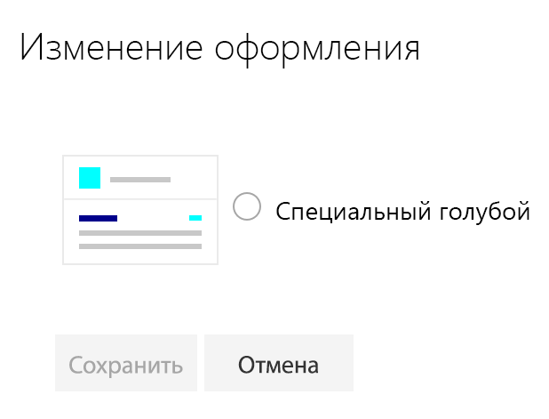

# <a name="sharepoint-site-theming-powershell-cmdlets"></a><span data-ttu-id="3d4dc-101">Настройка тем для сайтов SharePoint: командлеты PowerShell</span><span class="sxs-lookup"><span data-stu-id="3d4dc-101">SharePoint site theming: PowerShell cmdlets</span></span>

<span data-ttu-id="3d4dc-102">Администраторы клиента SharePoint могут с помощью командлетов PowerShell создавать, получать и удалять темы сайтов.</span><span class="sxs-lookup"><span data-stu-id="3d4dc-102">SharePoint tenant administrators can use PowerShell cmdlets to create, retrieve, and remove site themes.</span></span> <span data-ttu-id="3d4dc-103">Разработчики могут также использовать [REST API](sharepoint-site-theming-rest-api.md) SharePoint для задач управления темами.</span><span class="sxs-lookup"><span data-stu-id="3d4dc-103">Developers can also use the SharePoint [REST API](sharepoint-site-theming-rest-api.md) to handle theme management tasks.</span></span>

<span data-ttu-id="3d4dc-104">Чтобы узнать, как определяются и сохраняются темы, см. статью [Справочник по схеме JSON](sharepoint-site-theming-json-schema.md).</span><span class="sxs-lookup"><span data-stu-id="3d4dc-104">For information about how themes are defined and stored, see [JSON schema reference](sharepoint-site-theming-json-schema.md).</span></span>

## <a name="getting-started"></a><span data-ttu-id="3d4dc-105">Начало работы</span><span class="sxs-lookup"><span data-stu-id="3d4dc-105">Getting started</span></span>

<span data-ttu-id="3d4dc-106">Вот что надо сделать, чтобы запустить командлеты PowerShell для управления темами:</span><span class="sxs-lookup"><span data-stu-id="3d4dc-106">To run the PowerShell cmdlets for theme management, you'll need to do the following:</span></span>

1. <span data-ttu-id="3d4dc-107">Скачайте и установите [командную консоль SharePoint Online](https://www.microsoft.com/en-us/download/details.aspx?id=35588).</span><span class="sxs-lookup"><span data-stu-id="3d4dc-107">Download and install the [SharePoint Online Management Shell](https://www.microsoft.com/en-us/download/details.aspx?id=35588).</span></span> <span data-ttu-id="3d4dc-108">Если у вас уже установлена консоль предыдущей версии, сначала удалите ее, а затем установите последнюю версию.</span><span class="sxs-lookup"><span data-stu-id="3d4dc-108">If you already have a previous version of the shell installed, uninstall it first and then install the latest version.</span></span>
2. <span data-ttu-id="3d4dc-109">Подключитесь к клиенту SharePoint, следуя инструкциям в статье [Подключение к PowerShell в SharePoint Online](https://technet.microsoft.com/ru-RU/library/fp161372.aspx).</span><span class="sxs-lookup"><span data-stu-id="3d4dc-109">Follow the instructions at [Connect to SharePoint Online PowerShell](https://technet.microsoft.com/ru-RU/library/fp161372.aspx) to connect to your SharePoint tenant.</span></span>

<span data-ttu-id="3d4dc-110">Чтобы проверить настройки, попробуйте считать параметр HideDefaultThemes с помощью командлета **Get-HideDefaultThemes**.</span><span class="sxs-lookup"><span data-stu-id="3d4dc-110">To verify your setup, try using the **Get-HideDefaultThemes** cmdlet to read the HideDefaultThemes setting.</span></span> <span data-ttu-id="3d4dc-111">Вы можете продолжить, если командлет после выполнения возвращает значение False без ошибок, как показано в примере ниже.</span><span class="sxs-lookup"><span data-stu-id="3d4dc-111">If the cmdlet runs and returns False with no errors, as shown in the following example, you're ready to proceed.</span></span>

```powershell
c:\> Get-HideDefaultThemes
False
```
## <a name="site-theme-cmdlets"></a><span data-ttu-id="3d4dc-112">Командлеты для управления темами сайтов</span><span class="sxs-lookup"><span data-stu-id="3d4dc-112">Site theme cmdlets</span></span>

<span data-ttu-id="3d4dc-113">Для управления темами сайтов с помощью PowerShell доступны следующие командлеты:</span><span class="sxs-lookup"><span data-stu-id="3d4dc-113">The following cmdlets are available for managing site themes from PowerShell:</span></span>

* <span data-ttu-id="3d4dc-114">**Add-SPOTheme**, который создает настраиваемую или перезаписывает существующую тему, чтобы изменить ее параметры;</span><span class="sxs-lookup"><span data-stu-id="3d4dc-114">**Add-SPOTheme** &mdash; Creates a new custom theme, or overwrites an existing theme to modify its settings.</span></span>
* <span data-ttu-id="3d4dc-115">**Get-SPOTheme**, который получает параметры для существующей темы;</span><span class="sxs-lookup"><span data-stu-id="3d4dc-115">**Get-SPOTheme** &mdash; Retrieves settings for an existing theme.</span></span>
* <span data-ttu-id="3d4dc-116">**Remove-SPOTheme**, который удаляет тему из коллекции тем;</span><span class="sxs-lookup"><span data-stu-id="3d4dc-116">**Remove-SPOTheme** &mdash; Removes a theme from the theme gallery.</span></span>
* <span data-ttu-id="3d4dc-117">**Set-HideDefaultThemes**, который указывает, следует ли предоставлять доступ к стандартным темам;</span><span class="sxs-lookup"><span data-stu-id="3d4dc-117">**Set-HideDefaultThemes** &mdash; Specifies whether the default themes should be available.</span></span>
* <span data-ttu-id="3d4dc-118">**Get-HideDefaultThemes**, который запрашивает текущий параметр HideDefaultThemes.</span><span class="sxs-lookup"><span data-stu-id="3d4dc-118">**Get-HideDefaultThemes** &mdash; Queries the current HideDefaultThemes setting.</span></span>

## <a name="add-spotheme"></a><span data-ttu-id="3d4dc-119">Add-SPOTheme</span><span class="sxs-lookup"><span data-stu-id="3d4dc-119">Add-SPOTheme</span></span>

<span data-ttu-id="3d4dc-120">Командлет **Add-SPOTheme** создает новую или обновляет существующую тему.</span><span class="sxs-lookup"><span data-stu-id="3d4dc-120">The **Add-SPOTheme** cmdlet creates a new theme or updates an existing theme.</span></span> <span data-ttu-id="3d4dc-121">Параметры цветовой палитры передаются в качестве словаря.</span><span class="sxs-lookup"><span data-stu-id="3d4dc-121">The color pallette settings are passed as a dictionary.</span></span>

<span data-ttu-id="3d4dc-122">Приведенный ниже пример кода создает тему Custom Cyan, в которой цветовая палитра включает различные оттенки голубого цвета.</span><span class="sxs-lookup"><span data-stu-id="3d4dc-122">In the following example, a new theme named "Custom Cyan" is created, with color pallette settings that are various shades of cyan.</span></span> <span data-ttu-id="3d4dc-123">Обратите внимание, что в этом примере функция ```HashToDictionary``` используется для преобразования в словарь хэш-таблицы, созданной с помощью нотации ```@{}```, как того требует командлет **Add-SPOTheme**.</span><span class="sxs-lookup"><span data-stu-id="3d4dc-123">Note that this example uses a ```HashToDictionary``` function to convert a hash table created with the ```@{}``` notation into a dictionary, as required by **Add-SPOTheme**.</span></span>

```powershell
function HashToDictionary {
  Param ([Hashtable]$ht)
  $dictionary = New-Object "System.Collections.Generic.Dictionary``2[System.String,System.String]"
  foreach ($entry in $ht.GetEnumerator()) {
    $dictionary.Add($entry.Name, $entry.Value)
  }
  return $dictionary
}

$themepallette = HashToDictionary(
 @{
  "themePrimary" = "#00ffff";
  "themeLighterAlt" = "#f3fcfc";
  "themeLighter" = "#daffff";
  "themeLight" = "#affefe";
  "themeTertiary" = "#76ffff";
  "themeSecondary" = "#39ffff";
  "themeDarkAlt" = "#00c4c4";
  "themeDark" = "#009090";
  "themeDarker" = "#005252";
  "neutralLighterAlt" = "#f8f8f8";
  "neutralLighter" = "#f4f4f4";
  "neutralLight" = "#eaeaea";
  "neutralQuaternaryAlt" = "#dadada";
  "neutralQuaternary" = "#d0d0d0";
  "neutralTertiaryAlt" = "#c8c8c8";
  "neutralTertiary" = "#a6a6a6";
  "neutralSecondaryAlt" = "#767676";
  "neutralSecondary" = "#666666";
  "neutralPrimary" = "#333";
  "neutralPrimaryAlt" = "#3c3c3c";
  "neutralDark" = "#212121";
  "black" = "#000000";
  "white" = "#fff";
  "primaryBackground" = "#fff";
  "primaryText" = "#333"
 }
)

Add-SPOTheme -Name "Custom Cyan" -Palette $themepallette -IsInverted $false
```
<span data-ttu-id="3d4dc-124">Если вы хотите обновить существующую тему (например, чтобы изменить некоторые параметры цвета), используйте тот же синтаксис, что и ранее, но добавьте флажок *-Overwrite* в командлет **Add-SPOTheme**.</span><span class="sxs-lookup"><span data-stu-id="3d4dc-124">If you want to update an existing theme (to modify some of its color settings, for example), use the same syntax as shown previously but add the *-Overwrite* flag to the **Add-SPOTheme** cmdlet.</span></span>

```powershell
Add-SPOTheme -Name "Custom Cyan" -Palette $themepallette -IsInverted $false -Overwrite
```
<span data-ttu-id="3d4dc-125">При добавлении тема не применяется к каким-либо сайтам.</span><span class="sxs-lookup"><span data-stu-id="3d4dc-125">Adding a theme does not apply the theme to any sites.</span></span> <span data-ttu-id="3d4dc-126">Она добавляется в хранилище клиента, а затем вносится в список тем в разделе **Изменение оформления** для современных страниц.</span><span class="sxs-lookup"><span data-stu-id="3d4dc-126">It adds the theme to your tenant store, and then the theme will be available in the list of themes under the **Change the look** option for modern pages.</span></span>

## <a name="get-spotheme"></a><span data-ttu-id="3d4dc-127">Get-SPOTheme</span><span class="sxs-lookup"><span data-stu-id="3d4dc-127">Get-SPOTheme</span></span>

<span data-ttu-id="3d4dc-128">Командлет **Get-SPOTheme** возвращает параметры существующей темы.</span><span class="sxs-lookup"><span data-stu-id="3d4dc-128">The **Get-SPOTheme** cmdlet returns the settings for an existing theme.</span></span> <span data-ttu-id="3d4dc-129">Например, вот как использовать командлет **Get-SPOTheme**, чтобы вернуть параметры темы Custom Cyan, созданной предыдущим примером кода.</span><span class="sxs-lookup"><span data-stu-id="3d4dc-129">For example, here's how to use the **Get-SPOTheme** cmdlet to return the settings for the "Custom Cyan" theme created in the previous example.</span></span>

```powershell
C:\> Get-SPOTheme -Name "Custom Cyan" | ConvertTo-Json
```
```json
{
    "Name":  "Custom Cyan",
    "Palette":  {
                    "themeLight":  "#affefe",
                    "themeTertiary":  "#76ffff",
                    "black":  "#000000",
                    "neutralSecondary":  "#666666",
                    "neutralTertiaryAlt":  "#c8c8c8",
                    "themeSecondary":  "#39ffff",
                    "themeDarker":  "#005252",
                    "primaryBackground":  "#fff",
                    "neutralQuaternary":  "#d0d0d0",
                    "neutralPrimaryAlt":  "#3c3c3c",
                    "neutralPrimary":  "#333",
                    "themeDark":  "#009090",
                    "themeLighter":  "#daffff",
                    "neutralTertiary":  "#a6a6a6",
                    "neutralQuaternaryAlt":  "#dadada",
                    "themeLighterAlt":  "#f3fcfc",
                    "white":  "#fff",
                    "neutralSecondaryAlt":  "#767676",
                    "neutralLighter":  "#f4f4f4",
                    "neutralLight":  "#eaeaea",
                    "neutralDark":  "#212121",
                    "themeDarkAlt":  "#00c4c4",
                    "neutralLighterAlt":  "#f8f8f8",
                    "primaryText":  "#333",
                    "themePrimary":  "#00ffff"
                },
    "IsInverted":  false
}
```
<span data-ttu-id="3d4dc-130">Обратите внимание, что в этом примере для отображения темы в формате JSON используется фильтр PowerShell _ConvertTo-Json_.</span><span class="sxs-lookup"><span data-stu-id="3d4dc-130">Note that this example uses the PowerShell _ConvertTo-Json_ filter to display the theme in JSON format.</span></span>

## <a name="remove-spotheme"></a><span data-ttu-id="3d4dc-131">Remove-SPOTheme</span><span class="sxs-lookup"><span data-stu-id="3d4dc-131">Remove-SPOTheme</span></span>

<span data-ttu-id="3d4dc-132">Командлет **Remove-SPOTheme** удаляет тему из хранилища клиента.</span><span class="sxs-lookup"><span data-stu-id="3d4dc-132">The **Remove-SPOTheme** cmdlet removes a theme from your tenant store.</span></span> <span data-ttu-id="3d4dc-133">Например, он может удалить тему Custom Cyan, которая использовалась в предыдущих примерах.</span><span class="sxs-lookup"><span data-stu-id="3d4dc-133">For example, this cmdlet removes the "Custom Cyan" theme that was used in the previous examples.</span></span>

```powershell
c:\> Remove-SPOTheme -Name "Custom Cyan"
```
## <a name="set-hidedefaultthemes"></a><span data-ttu-id="3d4dc-134">Set-HideDefaultThemes</span><span class="sxs-lookup"><span data-stu-id="3d4dc-134">Set-HideDefaultThemes</span></span>

<span data-ttu-id="3d4dc-135">_ПРИМЕЧАНИЕ. Этот командлет будет называться ```Set-SPOHideDefaultThemes``` в следующем выпуске в соответствии с другими командлетами PowerShell в SharePoint._</span><span class="sxs-lookup"><span data-stu-id="3d4dc-135">_NOTE: this cmdlet will be renamed to ```Set-SPOHideDefaultThemes``` in a future release, for consistency with other SharePoint PowerShell cmdlet._</span></span>

<span data-ttu-id="3d4dc-136">Командлет **Set-HideDefaultThemes** позволяет указать, следует ли включить в список выбора тем стандартные темы SharePoint.</span><span class="sxs-lookup"><span data-stu-id="3d4dc-136">The **Set-HideDefaultThemes** cmdlet is used to specify whether the default themes that come with SharePoint should be included in the theme picker list.</span></span> <span data-ttu-id="3d4dc-137">Например, вам может потребоваться создать специальные темы для своих сайтов, а затем удалить стандартные темы, чтобы использовать на всех страницах только специальные темы.</span><span class="sxs-lookup"><span data-stu-id="3d4dc-137">For example, you might want to create custom themes for your sites and then remove the default themes, to ensure that all pages will use your custom themes.</span></span>

<span data-ttu-id="3d4dc-138">Задайте для этого параметра значение _$true_, чтобы скрыть стандартные темы, или значение _$false_ (используется по умолчанию), чтобы разрешить использовать стандартные темы.</span><span class="sxs-lookup"><span data-stu-id="3d4dc-138">Specify the setting as either _$true_ to hide the default themes, or _$false_ (the default setting) to allow use of the default themes.</span></span> <span data-ttu-id="3d4dc-139">Например, этот командлет скрывает стандартные темы.</span><span class="sxs-lookup"><span data-stu-id="3d4dc-139">For example, this cmdlet hides the default themes.</span></span>

```powershell
Set-HideDefaultThemes $true
```
<span data-ttu-id="3d4dc-140">Если после создания темы Custom Cyan скрыть стандартные темы, в списке тем в разделе **Изменение оформления** останется только одна специальная тема.</span><span class="sxs-lookup"><span data-stu-id="3d4dc-140">After creating the "Custom Cyan" theme, hiding the default themes will leave only the one custom theme in the themes list under **Change the look**.</span></span>



<span data-ttu-id="3d4dc-142">Чтобы восстановить стандартные темы в списке выбора тем, используйте следующий командлет:</span><span class="sxs-lookup"><span data-stu-id="3d4dc-142">To restore the default themes to the theme picker list, use the following cmdlet.</span></span>
```powershell
Set-HideDefaultThemes $false
```

## <a name="get-hidedefaultthemes"></a><span data-ttu-id="3d4dc-143">Get-HideDefaultThemes</span><span class="sxs-lookup"><span data-stu-id="3d4dc-143">Get-HideDefaultThemes</span></span>

<span data-ttu-id="3d4dc-144">_ПРИМЕЧАНИЕ. Этот командлет будет называться ```Get-SPOHideDefaultThemes``` в следующем выпуске в соответствии с другими командлетами PowerShell для SharePoint._</span><span class="sxs-lookup"><span data-stu-id="3d4dc-144">_NOTE: this cmdlet will be renamed to ```Get-SPOHideDefaultThemes``` in a future release, for consistency with other SharePoint PowerShell cmdlets._</span></span>

<span data-ttu-id="3d4dc-145">Командлет **Get-HideDefaultThemes** получает текущее значение параметра **Set-HideDefaultThemes**.</span><span class="sxs-lookup"><span data-stu-id="3d4dc-145">The **Get-HideDefaultThemes** cmdlet retrieves the currrent **Set-HideDefaultThemes** setting.</span></span> <span data-ttu-id="3d4dc-146">Этот командлет можно использовать в скрипте PowerShell, чтобы обеспечить считывание параметра и последующее выполнение различных действий с учетом того, скрыты ли стандартные темы.</span><span class="sxs-lookup"><span data-stu-id="3d4dc-146">You might want to use this cmdlet in a PowerShell script to read the setting and then take different actions based on whether the default themes are hidden.</span></span> <span data-ttu-id="3d4dc-147">Этот командлет не имеет параметров.</span><span class="sxs-lookup"><span data-stu-id="3d4dc-147">This cmdlet does not have any parameters.</span></span>

```powershell
c:\> Get-HideDefaultThemes
False
```

## <a name="see-also"></a><span data-ttu-id="3d4dc-148">См. также</span><span class="sxs-lookup"><span data-stu-id="3d4dc-148">See also</span></span>

* [<span data-ttu-id="3d4dc-149">Обзор настройки тем для сайтов SharePoint</span><span class="sxs-lookup"><span data-stu-id="3d4dc-149">SharePoint site theming overview</span></span>](sharepoint-site-theming-overview.md)
* [<span data-ttu-id="3d4dc-150">Настройка тем для сайтов SharePoint: схема JSON</span><span class="sxs-lookup"><span data-stu-id="3d4dc-150">SharePoint site theming: JSON schema</span></span>](sharepoint-site-theming-json-schema.md)
* [<span data-ttu-id="3d4dc-151">Настройка тем для сайтов SharePoint: CSOM</span><span class="sxs-lookup"><span data-stu-id="3d4dc-151">SharePoint site theming: CSOM</span></span>](sharepoint-site-theming-csom.md)
* [<span data-ttu-id="3d4dc-152">Настройка тем для сайтов SharePoint: REST API</span><span class="sxs-lookup"><span data-stu-id="3d4dc-152">SharePoint site theming: REST API</span></span>](sharepoint-site-theming-rest-api.md)
* [<span data-ttu-id="3d4dc-153">Командная консоль SharePoint Online</span><span class="sxs-lookup"><span data-stu-id="3d4dc-153">SharePoint Online Management Shell</span></span>](https://www.microsoft.com/en-us/download/details.aspx?id=35588)
* [<span data-ttu-id="3d4dc-154">Подключение к PowerShell в SharePoint Online</span><span class="sxs-lookup"><span data-stu-id="3d4dc-154">Connect to your SharePoint Online tenant through PowerShell:</span></span>](https://technet.microsoft.com/ru-RU/library/fp161372.aspx)
