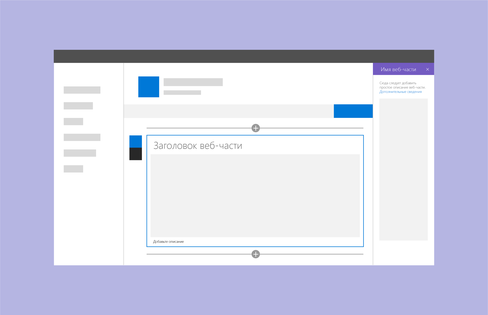
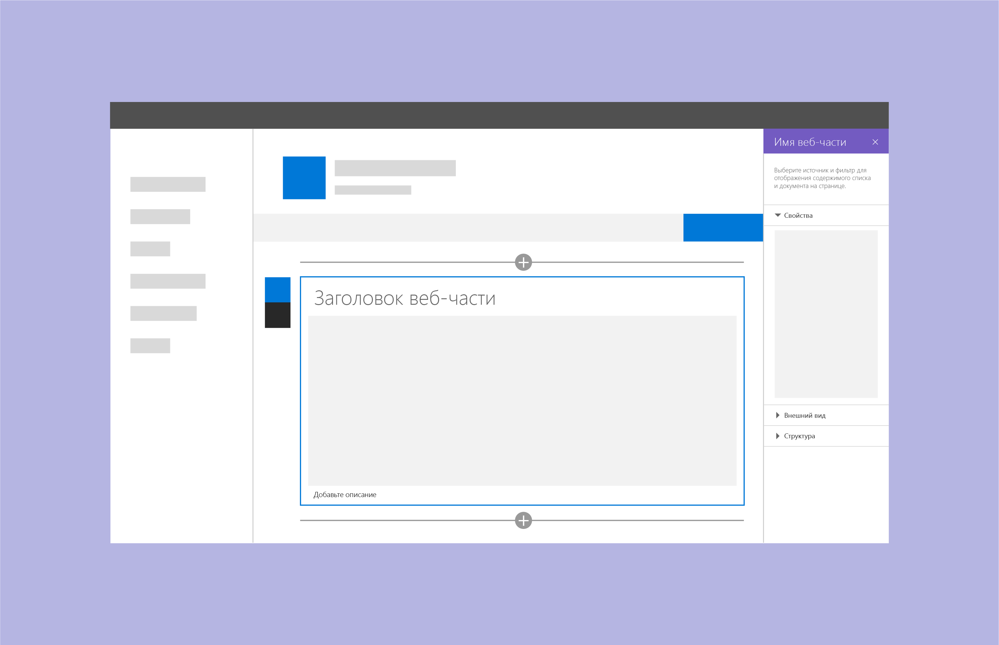
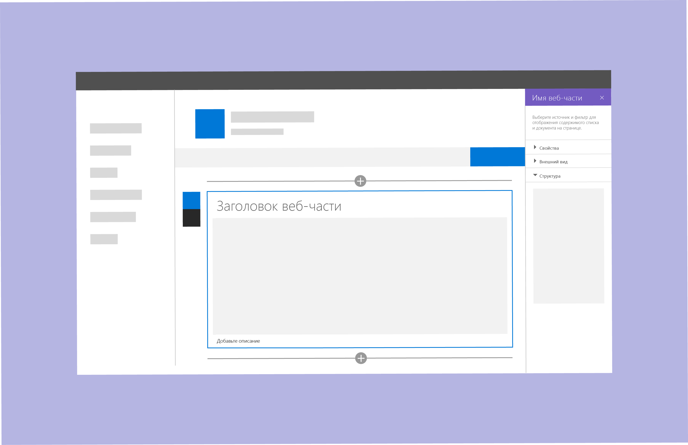

# Разработка веб-части SharePointDesigning a SharePoint web part

Перед разработкой веб-части SharePoint следует знать, как [создавать страницы на сайте SharePoint](authoring-pages.md).Before you design a SharePoint web part, you should understand how to [author pages in a SharePoint site](authoring-pages.md). Если вы еще не сделали этого, создайте страницу и добавьте на нее веб-части нескольких типов.If you haven't already, take some time to create a page and add multiple types of web parts. Важно понимать, как упростить и ускорить подготовку новой веб-части к работе с помощью компонентов и стилей Office Fabric.It is important know how to leverage Office Fabric components and styles to make it easier and quicker to get your new web part up and running.

При разработке веб-частей важно владеть понятиями, описанными в следующих статьях:When you design web parts, it's important to be familiar with the following concepts:

- [Типы областей свойств и их применение](#property-pane-types);[Property pane types and when to use each type](#property-pane-types)
- [Реактивные и нереактивные веб-части](reactive-and-nonreactive-web-parts.md);[Reactive and nonreactive web parts](reactive-and-nonreactive-web-parts.md)
- [Названия и описания](web-part-titles-and-descriptions.md);[Titles and descriptions](web-part-titles-and-descriptions.md)
- [Резервные варианты и заполнители](placeholders-and-fallbacks.md).[Fallbacks and placeholders](placeholders-and-fallbacks.md)

## Типы областей свойствProperty pane types

Вы можете использовать области свойств трех типов для оформления и разработки веб-частей, соответствующих потребностям вашего бизнеса и клиентов.There are three types of property panes to enable you to design and develop web parts that fit your business or customer needs.

Чтобы открыть область для настройки параметров веб-части, нажмите **Изменить**.To open a pane to configure settings for a web part, choose **Edit**. С помощью этой области можно включать и отключать функции, выбирать источник и макет, а также задавать параметры.Use the pane to enable and disable features, select a source, choose a layout, and set options. Редактируйте содержимое веб-части в самой веб-части, а не в области свойств.Edit web part content within the web part rather than in the property pane.

Ширина области свойств составляет 320 пикселей. При ее открытии выполняется автоматическое расплавление страницы.The property pane is 320px and when opened, the page will responsively reflow.

### Одиночная областьSingle pane
Одиночная область используется для простых веб-частей с небольшим количеством настраиваемых свойств.A single pane is used for simple web parts that only have a small number of properties to configure.

### Область с элементом "аккордеон"Accordion pane
Область-гармошка используется для размещения групп свойств с большим количеством вариантов, образующих длинный прокручивающийся список.Use an accordion pane to contain a group or groups of properties with many options, and where the groups result in a long scrolling list of options. Например, у вас может быть три группы с названиями "Свойства", "Внешний вид" и "Макет", по десять компонентов в каждой.For example, you might have three groups named Properties, Appearance, and Layout, each with ten components.

Используйте области с элементами "аккордеон", если требуется добавить классификацию в сложную веб-часть.Use accordion panes when you need to apply categorization for a complex web part.

**Пример групп элементов "аккордеон", где открыта последняя область****Accordian groups example with last pane open**

**Пример групп элементов "аккордеон", где открыты две группы****Accordion groups example with two groups open**

### Область с пошаговым представлениемSteps pane

Область с пошаговым представлением используется для группирования свойств на нескольких этапах или страницах, если веб-часть требуется настраивать в линейном порядке, а также если параметры, выбранные на первом этапе, влияют на то, какие параметры отображаются на втором или третьем.A steps pane is used for grouping properties in multiple steps or pages when you need the web part to be configured in a linear order or when choices made on the first step affect options that display on the second step. 

**Этап 1 в области с пошаговым представлением****Step 1 of the steps pane**

На этапе 1 кнопка "Назад" отключена, а кнопка "Далее" включена.In step 1, the back button is disabled and the next button is enabled.

**Этап 2 в области с пошаговым представлением****Step 2 of the steps pane** 

На этапе 2 кнопки "Назад" и "Далее" включены.In step 2, the back and next buttons are enabled.

**Этап 3 в области с пошаговым представлением****Step 3 of the steps pane** 

На этапе 3 кнопка "Далее" отключена, а кнопка "Назад" включена.In step 3, the next button is disabled and the back button is enabled.

