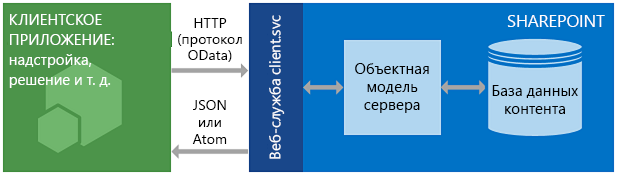

# <a name="get-to-know-the-sharepoint-rest-service"></a><span data-ttu-id="1cc18-102">Знакомство со службой REST в SharePoint</span><span class="sxs-lookup"><span data-stu-id="1cc18-102">Get to know the SharePoint REST service</span></span>
<span data-ttu-id="1cc18-103">Основы использования службы REST в SharePoint для чтения и изменения данных в SharePoint по веб-протоколам REST и OData.</span><span class="sxs-lookup"><span data-stu-id="1cc18-103">Get the basics of using the SharePoint REST service to access and update SharePoint data, using the REST and OData web protocol standards.</span></span>

<span data-ttu-id="1cc18-104">В SharePoint 2013 появилась служба REST (Representational State Transfer), сравнимая с имеющимися в SharePoint [клиентскими объектными моделями](http://msdn.microsoft.com/library/88e5e1b9-eab2-4f3b-a3f2-75c96b86f1f4%28Office.15%29.aspx).</span><span class="sxs-lookup"><span data-stu-id="1cc18-104">SharePoint 2013 introduced a Representational State Transfer (REST) service that is comparable to the existing SharePoint  [client object models](http://msdn.microsoft.com/library/88e5e1b9-eab2-4f3b-a3f2-75c96b86f1f4%28Office.15%29.aspx).</span></span> <span data-ttu-id="1cc18-105">Теперь разработчики могут удаленно работать с данными SharePoint при помощи любой технологии, поддерживающей веб-запросы REST.</span><span class="sxs-lookup"><span data-stu-id="1cc18-105">Now, developers can interact remotely with SharePoint data by using any technology that supports REST web requests.</span></span> <span data-ttu-id="1cc18-106">Это означает, что разработчики могут выполнять операции **создания**, **чтения**, **обновления** и **удаления** (CRUD) из надстроек, решений и клиентских приложений для SharePoint, используя веб-технологии REST и стандартный синтаксис протокола OData (Open Data Protocol).</span><span class="sxs-lookup"><span data-stu-id="1cc18-106">SharePoint introduces a Representational State Transfer (REST) service that is comparable to the existing SharePoint  client object models. Now, developers can interact remotely with SharePoint data by using any technology that supports REST web requests. This means that developers can perform  Create,  Read,  Update, and  Delete (CRUD) operations from their SharePoint Add-ins, solutions, and client applications, using REST web technologies and standard Open Data Protocol (OData) syntax.</span></span>
 
## <a name="prerequisites"></a><span data-ttu-id="1cc18-107">Предварительные условия</span><span class="sxs-lookup"><span data-stu-id="1cc18-107">Prerequisites</span></span>
<span data-ttu-id="1cc18-108">В этой статье предполагается, что у вас есть базовое представление о службе REST и создании запросов REST.</span><span class="sxs-lookup"><span data-stu-id="1cc18-108">This topic assumes you have a basic familiarity with REST and how to construct REST requests.</span></span>

## <a name="how-the-sharepoint-rest-service-works"></a><span data-ttu-id="1cc18-109">Принцип работы службы REST в SharePoint</span><span class="sxs-lookup"><span data-stu-id="1cc18-109">How the SharePoint REST service works</span></span>
<span data-ttu-id="1cc18-110"><a name="bk_how"> </a> В SharePoint 2013 появилась возможность удаленной работы с сайтами SharePoint с помощью REST.</span><span class="sxs-lookup"><span data-stu-id="1cc18-110"><a name="bk_how"> </a> SharePoint 2013 added the ability for you to remotely interact with SharePoint sites by using REST. Now, you can interact directly with SharePoint objects by using any technology that supports standard REST capabilities.</span></span> <span data-ttu-id="1cc18-111">Теперь вы можете работать с объектами SharePoint напрямую, используя любую технологию, поддерживающую стандартные возможности REST.</span><span class="sxs-lookup"><span data-stu-id="1cc18-111">SharePoint adds the ability for you to remotely interact with SharePoint sites by using REST. Now, you can interact directly with SharePoint objects by using any technology that supports standard REST capabilities.</span></span>
  
<span data-ttu-id="1cc18-p103">Для доступа к ресурсам SharePoint с помощью REST необходимо создать HTTP-запрос RESTful, используя стандарт Open Data Protocol (OData), который соответствует необходимому API клиентской объектной модели. Пример:</span><span class="sxs-lookup"><span data-stu-id="1cc18-p103">To access SharePoint resources using REST, construct a RESTful HTTP request, using the Open Data Protocol (OData) standard, which corresponds to the desired client object model API. For example:</span></span>
 
 <span data-ttu-id="1cc18-114">*Метод клиентской объектной модели:*</span><span class="sxs-lookup"><span data-stu-id="1cc18-114">*Client object model method:*</span></span> 

```
List.GetByTitle(listname) 
``` 

 <span data-ttu-id="1cc18-115">*Конечная точка REST:*</span><span class="sxs-lookup"><span data-stu-id="1cc18-115">*REST endpoint:*</span></span> 
 
 ```
 http://server/site/_api/lists/getbytitle('listname')
 ```

<span data-ttu-id="1cc18-p104">Веб-служба client.svc в SharePoint обрабатывает HTTP-запрос и предоставляет соответствующий ответ в формате Atom или JSON (JavaScript Object Notation). Затем его должно проанализировать ваше клиентское приложение. На следующем рисунке показано высокоуровневое представление архитектуры SharePoint REST.</span><span class="sxs-lookup"><span data-stu-id="1cc18-p104">The client.svc web service in SharePoint handles the HTTP request, and serves the appropriate response in either Atom or JSON (JavaScript Object Notation) format. Your client application must then parse that response. The figure below shows a high-level view of the SharePoint REST architecture.</span></span>
 
<span data-ttu-id="1cc18-119">**Архитектура службы REST в SharePoint**</span><span class="sxs-lookup"><span data-stu-id="1cc18-119">**SharePoint REST service architecture**</span></span>


 
<span data-ttu-id="1cc18-121">Благодаря функциональности и простоте использования этих клиентских объектных моделей разработчики чаще всего применяют их для обмена данными с сайтами SharePoint, используя управляемый код для .NET Framework, Silverlight или JavaScript.</span><span class="sxs-lookup"><span data-stu-id="1cc18-121">Because of the functionality and ease of use that client object models provide, they remain the primary development option for communicating with SharePoint sites by using .NET Framework managed code, Silverlight, or JavaScript.</span></span>
 
### <a name="use-http-commands-with-the-sharepoint-rest-service"></a><span data-ttu-id="1cc18-122">Использование команд HTTP со службой REST в SharePoint</span><span class="sxs-lookup"><span data-stu-id="1cc18-122">Use HTTP commands with the SharePoint REST service</span></span>
<span data-ttu-id="1cc18-123"><a name="bk_usingHTTP"> </a> Чтоб использовать возможности REST, встроенные в SharePoint, необходимо создать HTTP-запрос RESTful, используя стандарт OData, соответствующий нужному API клиентской объектной модели.</span><span class="sxs-lookup"><span data-stu-id="1cc18-123"><a name="bk_usingHTTP"> </a> To use the REST capabilities that are built into SharePoint, you construct a RESTful HTTP request, using the OData standard, which corresponds to the client object model API you want to use. The client.svc web service handles the HTTP request and serves the appropriate response in either Atom or JavaScript Object Notation (JSON) format. The client application must then parse that response.</span></span> <span data-ttu-id="1cc18-124">Веб-служба client.svc обрабатывает HTTP-запрос и возвращает подходящий отклик в формате Atom или нотации объектов JavaScript (JSON).</span><span class="sxs-lookup"><span data-stu-id="1cc18-124">The client.svc web service handles the HTTP request and serves the appropriate response in either Atom or JavaScript Object Notation (JSON) format.</span></span> <span data-ttu-id="1cc18-125">Затем клиентское приложение должно проанализировать этот отклик.</span><span class="sxs-lookup"><span data-stu-id="1cc18-125">The client application must then parse that response.</span></span>
 
<span data-ttu-id="1cc18-p106">Конечные точки в службе REST SharePoint соответствуют типам и элементам клиентских объектных моделей SharePoint. С помощью HTTP-запросов вы можете использовать эти конечные точки REST для выполнения типичных операций CRUD с сущностями SharePoint, такими как списки и сайты.</span><span class="sxs-lookup"><span data-stu-id="1cc18-p106">The endpoints in the SharePoint REST service correspond to the types and members in the SharePoint client object models. By using HTTP requests, you can use these REST endpoints to perform typical CRUD operations against SharePoint entities, such as lists and sites.</span></span> 
 
<span data-ttu-id="1cc18-128">Ниже приводится краткое описание этих операций.</span><span class="sxs-lookup"><span data-stu-id="1cc18-128">In general:</span></span>

|<span data-ttu-id="1cc18-129">**Задача**</span><span class="sxs-lookup"><span data-stu-id="1cc18-129">**If you want to do this to an endpoint**</span></span>|<span data-ttu-id="1cc18-130">**HTTP-запрос**</span><span class="sxs-lookup"><span data-stu-id="1cc18-130">**Use this HTTP request**</span></span>|<span data-ttu-id="1cc18-131">**Примечания**</span><span class="sxs-lookup"><span data-stu-id="1cc18-131">**Keep in mind**</span></span>|
|:-----|:-----|:-----|
|<span data-ttu-id="1cc18-132">Чтение ресурса</span><span class="sxs-lookup"><span data-stu-id="1cc18-132">Read a resource</span></span>|<span data-ttu-id="1cc18-133">**GET**</span><span class="sxs-lookup"><span data-stu-id="1cc18-133">**GET**</span></span>||
|<span data-ttu-id="1cc18-134">Создание или обновление ресурса</span><span class="sxs-lookup"><span data-stu-id="1cc18-134">Create or update a resource</span></span>|<span data-ttu-id="1cc18-135">**POST**</span><span class="sxs-lookup"><span data-stu-id="1cc18-135">**POST**</span></span>|<span data-ttu-id="1cc18-p107">С помощью запроса **POST** можно создавать сущности, например списки и сайты. Служба REST в SharePoint поддерживает отправку команд **POST**, включающих определения объектов, конечным точкам, представляющим коллекции. В операциях **POST** для всех необязательных свойств задаются значения по умолчанию. При попытке задать доступное только для чтения свойство в рамках операции **POST** служба возвращает исключение.</span><span class="sxs-lookup"><span data-stu-id="1cc18-p107">Use  **POST** to create entities such as lists and sites. The SharePoint REST service supports sending **POST** commands that include object definitions to endpoints that represent collections.For  **POST** operations, any properties that are not required are set to their default values. If you attempt to set a read-only property as part of a **POST** operation, the service returns an exception.</span></span>|
|<span data-ttu-id="1cc18-139">Обновление или вставка ресурса</span><span class="sxs-lookup"><span data-stu-id="1cc18-139">Update or insert a resource</span></span> |<span data-ttu-id="1cc18-140">**PUT**</span><span class="sxs-lookup"><span data-stu-id="1cc18-140">**PUT**</span></span>| <span data-ttu-id="1cc18-p108">С помощью операций **PUT** и **MERGE** можно обновлять существующие объекты SharePoint. Любая конечная точка службы, представляющая операцию **set** для свойств объектов, поддерживает как запросы **PUT**, так и запросы **MERGE**. В запросах **MERGE** задавать свойства необязательно. Все свойства, не заданные в явном виде, сохраняют свои текущие значения. В запросах **PUT**, если не указать все обязательные свойства в обновлениях объекта, служба REST возвращает исключение. Кроме того, всем необязательным свойствам, не заданным в явном виде, присваиваются значения по умолчанию.</span><span class="sxs-lookup"><span data-stu-id="1cc18-p108">Use **PUT** and **MERGE** operations to update existing SharePoint objects. Any service endpoint that represents an object property **set** operation supports both **PUT** requests and **MERGE** requests. For **MERGE** requests, setting properties is optional; any properties that you do not explicitly set retain their current property. For **PUT** requests, if you do not specify all required properties in object updates, the REST service returns an exception. In addition, any optional properties you do not explicitly set are set to their default properties.</span></span>|
|<span data-ttu-id="1cc18-146">Удаление ресурса</span><span class="sxs-lookup"><span data-stu-id="1cc18-146">Delete a resource</span></span>|<span data-ttu-id="1cc18-147">**DELETE**</span><span class="sxs-lookup"><span data-stu-id="1cc18-147">**DELETE**</span></span>|<span data-ttu-id="1cc18-148">Используйте команду HTTP **DELETE** для URL-адреса определенной конечной точки, чтобы удалить объект SharePoint, представленный этой конечной точкой. Для повторно обрабатываемых объектов (например, списков, файлов и элементов списков) это приведет к выполнению операции **Recycle**.</span><span class="sxs-lookup"><span data-stu-id="1cc18-148">Use the HTTP  **DELETE** command against the specific endpoint URL to delete the SharePoint object represented by that endpoint.In the case of recyclable objects, such as lists, files, and list items, this results in a  **Recycle** operation.</span></span>|

### <a name="construct-rest-urls-to-access-sharepoint-resources"></a><span data-ttu-id="1cc18-149">Создание URL-адресов REST для доступа к ресурсам SharePoint</span><span class="sxs-lookup"><span data-stu-id="1cc18-149">Construct REST URLs to access SharePoint resources</span></span>
<span data-ttu-id="1cc18-150"><a name="bk_constructURLs"> </a> URI для этих конечных точек REST, насколько это возможно, совпадает с подписью API ресурса в клиентской объектной модели SharePoint.</span><span class="sxs-lookup"><span data-stu-id="1cc18-150"><a name="bk_constructURLs"> </a>Whenever possible, the URI for these REST endpoints closely mimics the API signature of the resource in the SharePoint client object model. The main entry points for the REST service represent the site collection and site of the specified context.</span></span> <span data-ttu-id="1cc18-151">Основные точки входа для службы REST представляют семейство веб-сайтов и сайт указанного контекста.</span><span class="sxs-lookup"><span data-stu-id="1cc18-151">The main entry points for the REST service represent the site collection and site of the specified context. In this way, these entry points correspond to the  ClientContext.Site property and ClientContext.Web property in the client object models.</span></span> 
  
<span data-ttu-id="1cc18-152">Для доступа к определенному семейству веб-сайтов используйте следующую конструкцию:</span><span class="sxs-lookup"><span data-stu-id="1cc18-152">To access a specific site collection, use the following construction:</span></span>
 
 `http://server/site/_api/site`
 
<span data-ttu-id="1cc18-153">Для доступа к определенному сайту используйте следующую конструкцию:</span><span class="sxs-lookup"><span data-stu-id="1cc18-153">To access a specific site, use the following construction:</span></span>
 
 `http://server/site/_api/web`
 
<span data-ttu-id="1cc18-154">В обоих случаях *server* представляет имя сервера, а *site* — имя определенного сайта или путь к нему.</span><span class="sxs-lookup"><span data-stu-id="1cc18-154">In each case,  *server*  represents the name of the server, and *site*  represents the name of, or path to, the specific site.</span></span>
 
<span data-ttu-id="1cc18-155">С этой начальной точки вы можете создать более конкретные URI REST, ''обходя" объектную модель, с использованием имен API клиентской объектной модели, разделенных знаком косой черты (/).</span><span class="sxs-lookup"><span data-stu-id="1cc18-155">From this starting point, you can then construct more specific REST URIs by ''walking" the object model, using the names of the APIs from the client object model separated by a forward slash (/).</span></span>
 
<span data-ttu-id="1cc18-p110">Этот синтаксис неприменим к REST API SocialFeedManager и SocialFollowingManager. Дополнительные сведения см. в [справочнике по REST API каналов социальных медиа для SharePoint 2013](http://msdn.microsoft.com/library/f1cb914f-1e91-4e23-bf53-d2ab323eac13%28Office.15%29.aspx) и [справочнике по REST API отслеживания пользователей и контента для SharePoint 2013](http://msdn.microsoft.com/library/c05755df-846d-4a39-941d-950d066cc6d4%28Office.15%29.aspx).</span><span class="sxs-lookup"><span data-stu-id="1cc18-p110">This syntax doesn't apply to the SocialFeedManager or SocialFollowingManager REST APIs. See  [Social feed REST API reference for SharePoint 2013](http://msdn.microsoft.com/library/f1cb914f-1e91-4e23-bf53-d2ab323eac13%28Office.15%29.aspx) and [Following people and content REST API reference for SharePoint 2013](http://msdn.microsoft.com/library/c05755df-846d-4a39-941d-950d066cc6d4%28Office.15%29.aspx) for more information.</span></span>
 
<span data-ttu-id="1cc18-158">В статье [Как определить URI конечных точек службы REST в SharePoint](determine-sharepoint-rest-service-endpoint-uris.md) представлены дополнительные указания, позволяющие определить URI для конечных точек службы REST в SharePoint, используя подписи соответствующих API клиентской объектной модели.</span><span class="sxs-lookup"><span data-stu-id="1cc18-158">See  [Determine SharePoint REST service endpoint URIs](determine-sharepoint-rest-service-endpoint-uris.md) for more guidelines for determining SharePoint REST endpoint URIs from the signature of the corresponding client object model APIs.</span></span>
 
## <a name="sharepoint-rest-endpoint-examples"></a><span data-ttu-id="1cc18-159">Примеры конечных точек REST в SharePoint</span><span class="sxs-lookup"><span data-stu-id="1cc18-159">SharePoint REST endpoint examples</span></span>
<span data-ttu-id="1cc18-160"><a name="bk_URLexamples"> </a></span><span class="sxs-lookup"><span data-stu-id="1cc18-160"></span></span>

<span data-ttu-id="1cc18-p111">В приведенной ниже таблице представлены типичные примеры URL-адресов для конечных точек REST, которые помогут вам приступить к работе с данными SharePoint. Чтобы составить полный URL-адрес REST, добавьте строку `http://server/site/_api/` в начале фрагментов URL-адресов, показанных в таблице. При необходимости для команд **POST** в таблице приводятся примеры данных, которые необходимо передать в тексте HTTP-запроса для создания указанного элемента SharePoint. Элементы, выделенные курсивом, представляют переменные, вместо которых необходимо подставить свои значения.</span><span class="sxs-lookup"><span data-stu-id="1cc18-p111">The following table contains typical REST endpoint URL examples to get you started working with SharePoint data. Prepend  `http://server/site/_api/` to the URL fragments shown in the table to construct a fully qualified REST URL. Where necessary for **POST** commands, the table contains sample data you must pass in the HTTP request body to create the specified SharePoint item. Items in italics represent variables that you must replace with your values.</span></span>

|<span data-ttu-id="1cc18-165">**Описание**</span><span class="sxs-lookup"><span data-stu-id="1cc18-165">**Description**</span></span>|<span data-ttu-id="1cc18-166">**Конечная точка URL-адреса**</span><span class="sxs-lookup"><span data-stu-id="1cc18-166">**URL endpoint**</span></span>|<span data-ttu-id="1cc18-167">**Метод HTTP**</span><span class="sxs-lookup"><span data-stu-id="1cc18-167">**HTTP method**</span></span>|<span data-ttu-id="1cc18-168">**Основное содержимое**</span><span class="sxs-lookup"><span data-stu-id="1cc18-168">**Body content**</span></span>|
|:-----|:-----|:-----|:-----|
|<span data-ttu-id="1cc18-169">Получает заголовок сайта</span><span class="sxs-lookup"><span data-stu-id="1cc18-169">Retrieves the title of a site</span></span>| `web/title`|<span data-ttu-id="1cc18-170">GET</span><span class="sxs-lookup"><span data-stu-id="1cc18-170">GET</span></span>|<span data-ttu-id="1cc18-171">Не применимо</span><span class="sxs-lookup"><span data-stu-id="1cc18-171">Not applicable</span></span>|
|<span data-ttu-id="1cc18-172">Получает все списки на сайте</span><span class="sxs-lookup"><span data-stu-id="1cc18-172">Retrieves all lists on a site</span></span>| `lists`|<span data-ttu-id="1cc18-173">GET</span><span class="sxs-lookup"><span data-stu-id="1cc18-173">GET</span></span>|<span data-ttu-id="1cc18-174">Не применимо</span><span class="sxs-lookup"><span data-stu-id="1cc18-174">Not applicable</span></span>|
|<span data-ttu-id="1cc18-175">Получает метаданные одного списка</span><span class="sxs-lookup"><span data-stu-id="1cc18-175">Retrieves a single 'list's metadata</span></span>| `lists/getbytitle('listname')`|<span data-ttu-id="1cc18-176">GET</span><span class="sxs-lookup"><span data-stu-id="1cc18-176">GET</span></span>|<span data-ttu-id="1cc18-177">Не применимо</span><span class="sxs-lookup"><span data-stu-id="1cc18-177">Not applicable</span></span>|
|<span data-ttu-id="1cc18-178">Получает элементы списка</span><span class="sxs-lookup"><span data-stu-id="1cc18-178">Retrieves items within a list</span></span>| `lists/getbytitle('listname')/items`|<span data-ttu-id="1cc18-179">GET</span><span class="sxs-lookup"><span data-stu-id="1cc18-179">GET</span></span>|<span data-ttu-id="1cc18-180">Неприменимо</span><span class="sxs-lookup"><span data-stu-id="1cc18-180">Not applicable</span></span>|
|<span data-ttu-id="1cc18-p112">Получает определенное свойство документа (в данном случае это заголовок документа)</span><span class="sxs-lookup"><span data-stu-id="1cc18-p112">Retrieves a specific property of a document. (In this case, the document title.)</span></span>| `lists/getbytitle('listname')?select=Title`|<span data-ttu-id="1cc18-183">GET</span><span class="sxs-lookup"><span data-stu-id="1cc18-183">GET</span></span>|<span data-ttu-id="1cc18-184">Не применимо</span><span class="sxs-lookup"><span data-stu-id="1cc18-184">Not applicable</span></span>|
|<span data-ttu-id="1cc18-185">Создает список</span><span class="sxs-lookup"><span data-stu-id="1cc18-185">Creates a list</span></span>| `lists`|<span data-ttu-id="1cc18-186">POST</span><span class="sxs-lookup"><span data-stu-id="1cc18-186">POST</span></span>|
```
{
  '_metadata':{'type':SP.List},
  'AllowContentTypes': true,
  'BaseTemplate': 104 ,
  'ContentTypesEnabled': true,
  'Description': 'My list description ',
  'Title': 'RestTest '
}
```

<span data-ttu-id="1cc18-187">| |Добавляет элемент в список| `lists/getbytitle('listname')/items`|POST|</span><span class="sxs-lookup"><span data-stu-id="1cc18-187">|Adds an item to a list| `lists/getbytitle('listname')/items`|POST|</span></span>
```
{
  '_metadata':{'type':SP.listname ListItem},
  'Title': 'MyItem'
}

```

|

## <a name="batch-job-support"></a><span data-ttu-id="1cc18-188">Поддержка пакетных заданий</span><span class="sxs-lookup"><span data-stu-id="1cc18-188">Batch job support</span></span>
<span data-ttu-id="1cc18-189"><a name="batch"> </a></span><span class="sxs-lookup"><span data-stu-id="1cc18-189"></span></span>

<span data-ttu-id="1cc18-p113">Служба REST в SharePoint Online (а также локальной среде SharePoint 2016 или более поздней версии) поддерживает объединение нескольких запросов в один при вызове службы с помощью параметра запроса OData `$batch`. Подробные сведения и ссылки на примеры кода см. в статье [Выполнение пакетных запросов с помощью REST API](make-batch-requests-with-the-rest-apis.md).</span><span class="sxs-lookup"><span data-stu-id="1cc18-p113">The SharePoint Online (and on-premise SharePoint 2016 or later) REST service supports combining multiple requests into a single call to the service by using the OData  `$batch` query option. For details and links to code samples, see [Make batch requests with the REST APIs](make-batch-requests-with-the-rest-apis.md). .</span></span>
 
## <a name="additional-resources"></a><span data-ttu-id="1cc18-193">Дополнительные ресурсы</span><span class="sxs-lookup"><span data-stu-id="1cc18-193">Additional Resources</span></span>
<span data-ttu-id="1cc18-194"><a name="bk_learnmore"> </a> В перечисленных ниже статьях вы найдете дополнительные сведения об использовании службы REST в SharePoint.</span><span class="sxs-lookup"><span data-stu-id="1cc18-194"><a name="bk_learnmore"> </a>Use the resources listed below to learn more about using the SharePoint REST service.</span></span>
 
|||
|:-----|:-----|
| [<span data-ttu-id="1cc18-195">Выполнение базовых операций с использованием конечных точек REST в SharePoint</span><span class="sxs-lookup"><span data-stu-id="1cc18-195">Complete basic operations using SharePoint REST endpoints</span></span>](complete-basic-operations-using-sharepoint-rest-endpoints.md)|<span data-ttu-id="1cc18-196">Узнайте, как выполнять операции CRUD (создание, чтение, обновление, удаление) с помощью интерфейса REST SharePoint.</span><span class="sxs-lookup"><span data-stu-id="1cc18-196">Learn how to perform basic create, read, update, and delete (CRUD) operations with the SharePoint REST interface.</span></span>|
| [<span data-ttu-id="1cc18-197">Работа со списками и элементами списков в службе REST</span><span class="sxs-lookup"><span data-stu-id="1cc18-197">Working with lists and list items with REST</span></span>](working-with-lists-and-list-items-with-rest.md)|<span data-ttu-id="1cc18-198">Узнайте, как выполнять основные операции по созданию, чтению, обновлению и удалению списков и элементов списков с помощью интерфейса REST SharePoint.</span><span class="sxs-lookup"><span data-stu-id="1cc18-198">Learn how to perform basic create, read, update, and delete (CRUD) operations on lists and list items with the SharePoint REST interface.</span></span>|
| [<span data-ttu-id="1cc18-199">Работа с папками и файлами в службе REST</span><span class="sxs-lookup"><span data-stu-id="1cc18-199">Working with folders and files with REST</span></span>](working-with-folders-and-files-with-rest.md)|<span data-ttu-id="1cc18-200">Узнайте, как выполнять основные операции по созданию, чтению, обновлению и удалению папок и файлов с помощью интерфейса REST SharePoint.</span><span class="sxs-lookup"><span data-stu-id="1cc18-200">Learn how to perform basic create, read, update, and delete (CRUD) operations on folders and files with the SharePoint REST interface.</span></span>|
| [<span data-ttu-id="1cc18-201">Навигация по структуре данных SharePoint, представленной в службе REST</span><span class="sxs-lookup"><span data-stu-id="1cc18-201">Navigate the SharePoint data structure represented in the REST service</span></span>](navigate-the-sharepoint-data-structure-represented-in-the-rest-service.md)|<span data-ttu-id="1cc18-202">Узнайте, как с помощью конечной точки REST в элементе SharePoint получить доступ к связанным элементам, например родительским сайтам или структуре библиотеки, в которой находится этот элемент.</span><span class="sxs-lookup"><span data-stu-id="1cc18-202">Learn how to start from a REST endpoint for a given SharePoint item, and navigate to and access related items, such as parent sites or the library structure where that item resides.</span></span>|
| [<span data-ttu-id="1cc18-203">Как определить URI конечных точек службы REST в SharePoint</span><span class="sxs-lookup"><span data-stu-id="1cc18-203">Determine SharePoint REST service endpoint URIs</span></span>](determine-sharepoint-rest-service-endpoint-uris.md)|<span data-ttu-id="1cc18-204">В этой статье представлены общие инструкции, позволяющие определить URI конечных точек REST в SharePoint, используя подписи соответствующих API клиентской объектной модели.</span><span class="sxs-lookup"><span data-stu-id="1cc18-204">Learn general guidelines for determining SharePoint REST endpoint URIs from the signature of the corresponding client object model APIs.</span></span>|
| [<span data-ttu-id="1cc18-205">Использование операций запросов OData в запросах REST SharePoint</span><span class="sxs-lookup"><span data-stu-id="1cc18-205">Use OData query operations in SharePoint REST requests</span></span>](use-odata-query-operations-in-sharepoint-rest-requests.md)|<span data-ttu-id="1cc18-206">Узнайте, как использовать широкий спектр операторов строки запроса OData для выбора, фильтрации и упорядочивания данных, запрашиваемых у службы REST SharePoint.</span><span class="sxs-lookup"><span data-stu-id="1cc18-206">Learn how to use a wide range of OData query string operators to select, filter, and order the data you request from the SharePoint REST service.</span></span>|
| [<span data-ttu-id="1cc18-207">Справочные материалы и примеры по REST API</span><span class="sxs-lookup"><span data-stu-id="1cc18-207">REST API reference and samples</span></span>](http://msdn.microsoft.com/library/02128c70-9d27-4388-9374-a11bce68fdb8%28Office.15%29.aspx)|<span data-ttu-id="1cc18-208">На этой странице представлены ссылки на все ресурсы REST, доступные разработчикам SharePoint 2013 на сайте MSDN.</span><span class="sxs-lookup"><span data-stu-id="1cc18-208">This page contains links to all of the REST resources that are available for SharePoint 2013 developers on MSDN.</span></span>|
| [<span data-ttu-id="1cc18-209">Общие сведения о REST API для службы поиска SharePoint</span><span class="sxs-lookup"><span data-stu-id="1cc18-209">SharePoint Search REST API overview</span></span>](http://msdn.microsoft.com/library/8a4f7863-e4c1-4099-9189-a1894db36930%28Office.15%29.aspx)|<span data-ttu-id="1cc18-210">Узнайте, как добавлять функции поиска в клиентские и мобильные приложения с помощью службы REST поиска в SharePoint Server 2013 и любой технологии, поддерживающей веб-запросы REST.</span><span class="sxs-lookup"><span data-stu-id="1cc18-210">Add search functionality to client and mobile applications using the Search REST service in SharePoint Server 2013 and any technology that supports REST web requests.</span></span>|
| [<span data-ttu-id="1cc18-211">Справочник по REST API каналов социальных медиа для SharePoint 2013</span><span class="sxs-lookup"><span data-stu-id="1cc18-211">Social feed REST API reference for SharePoint 2013</span></span>](http://msdn.microsoft.com/library/f1cb914f-1e91-4e23-bf53-d2ab323eac13%28Office.15%29.aspx)|<span data-ttu-id="1cc18-212">Сведения о конечных точках REST в SharePoint 2013 для выполнения задач, связанных с каналами.</span><span class="sxs-lookup"><span data-stu-id="1cc18-212">Learn about SharePoint 2013 REST endpoints for feed-related tasks.</span></span>|
| [<span data-ttu-id="1cc18-213">Справочник по REST API отслеживания пользователей и контента для SharePoint 2013</span><span class="sxs-lookup"><span data-stu-id="1cc18-213">Following people and content REST API reference for SharePoint 2013</span></span>](http://msdn.microsoft.com/library/c05755df-846d-4a39-941d-950d066cc6d4%28Office.15%29.aspx)|<span data-ttu-id="1cc18-214">Сведения о конечных точках REST в SharePoint 2013 для отслеживания пользователей и контента.</span><span class="sxs-lookup"><span data-stu-id="1cc18-214">Learn about SharePoint 2013 REST endpoints for following people and content.</span></span>|
| [<span data-ttu-id="1cc18-215">Отправка пакетных запросов с помощью интерфейсов REST API</span><span class="sxs-lookup"><span data-stu-id="1cc18-215">Make batch requests with the REST APIs</span></span>](make-batch-requests-with-the-rest-apis.md)|<span data-ttu-id="1cc18-216">Узнайте, как объединить несколько запросов в один пот вызове службы REST.</span><span class="sxs-lookup"><span data-stu-id="1cc18-216">Learn how to combine multiple requests into a single call to the REST service.</span></span>|
| [<span data-ttu-id="1cc18-217">Синхронизация элементов SharePoint с помощью службы REST</span><span class="sxs-lookup"><span data-stu-id="1cc18-217">Synchronize SharePoint items using the REST service</span></span>](synchronize-sharepoint-items-using-the-rest-service.md)|<span data-ttu-id="1cc18-218">Узнайте, как синхронизировать элементы между SharePoint и надстройками или службами с помощью ресурса **GetListItemChangesSinceToken**, входящего в состав службы REST в SharePoint.</span><span class="sxs-lookup"><span data-stu-id="1cc18-218">Learn how to synchronize items between SharePoint and your add-ins or services by using the  **GetListItemChangesSinceToken** resource, part of the SharePoint REST service.</span></span>|
| [<span data-ttu-id="1cc18-219">Получение версий списков документов с помощью значений ETag в службе REST</span><span class="sxs-lookup"><span data-stu-id="1cc18-219">Use ETag values through the REST service to get document list item versioning</span></span>](http://msdn.microsoft.com/library/use-etag-values-through-the-rest-service-to-get-document-list-item-versioning%28Office.15%29.aspx)|<span data-ttu-id="1cc18-220">Узнайте, как использовать теги HTML ETag в службе REST SharePoint для управления параллелизмом списков SharePoint и их элементов.</span><span class="sxs-lookup"><span data-stu-id="1cc18-220">Learn how to use HTML ETags with the SharePoint REST service for concurrency control of SharePoint lists and list items.</span></span>|

## <a name="odata-resources"></a><span data-ttu-id="1cc18-221">Материалы по OData</span><span class="sxs-lookup"><span data-stu-id="1cc18-221">OData resources</span></span>
<span data-ttu-id="1cc18-222"><a name="SP15startREST_bk_addlresources"> </a></span><span class="sxs-lookup"><span data-stu-id="1cc18-222"></span></span>

-  [<span data-ttu-id="1cc18-223">Знакомство с OData</span><span class="sxs-lookup"><span data-stu-id="1cc18-223">Introducing OData</span></span>](http://msdn.microsoft.com/en-us/data/hh237663) 
-  <span data-ttu-id="1cc18-224">
  [Примеры для протокола Open Data Protocol](http://msdn.microsoft.com/en-us/library/ff478141.aspx)</span><span class="sxs-lookup"><span data-stu-id="1cc18-224">[Open Data Protocol by Example](http://msdn.microsoft.com/en-us/library/ff478141.aspx)</span></span>
-  [<span data-ttu-id="1cc18-225">Open Data Protocol</span><span class="sxs-lookup"><span data-stu-id="1cc18-225">Open Data Protocol</span></span>](http://www.odata.org/)
-  [<span data-ttu-id="1cc18-226">Соглашения об URI для протокола OData</span><span class="sxs-lookup"><span data-stu-id="1cc18-226">OData Protocol URI Conventions</span></span>](http://www.odata.org/documentation/odata-version-2-0/uri-conventions/)
-  [<span data-ttu-id="1cc18-227">Адресация для операций службы</span><span class="sxs-lookup"><span data-stu-id="1cc18-227">Addressing Service Operations</span></span>](http://www.odata.org/documentation/odata-version-2-0/uri-conventions#AddressingServiceOperations)
-  [<span data-ttu-id="1cc18-228">Операции протокола OData</span><span class="sxs-lookup"><span data-stu-id="1cc18-228">OData Protocol Operations</span></span>](http://www.odata.org/documentation/odata-version-2-0/operations/)
-  [<span data-ttu-id="1cc18-229">Условия ошибок</span><span class="sxs-lookup"><span data-stu-id="1cc18-229">Error Conditions</span></span>](http://www.odata.org/documentation/odata-version-2-0/operations#ErrorConditions)
    
 

