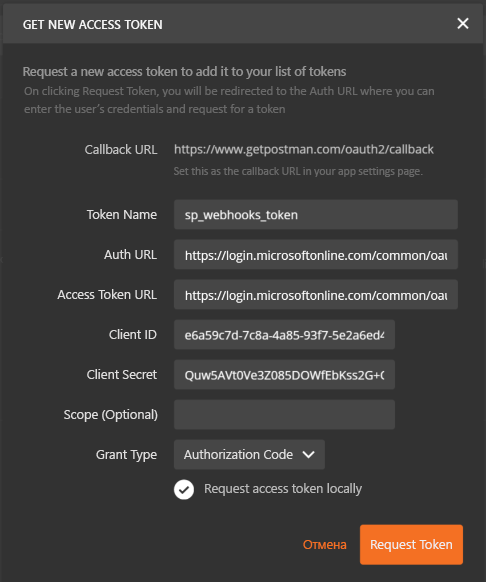
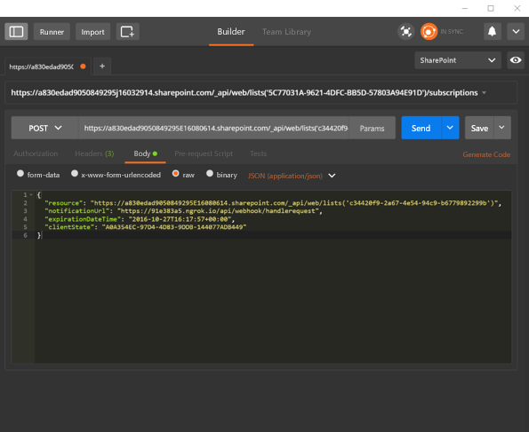

# <a name="get-started-with-sharepoint-webhooks"></a>Начало работы с веб-перехватчиками SharePoint

В этой статье описано, как создать приложение, которое добавляет и обрабатывает запросы веб-перехватчиков SharePoint. Вы научитесь быстро составлять и выполнять запросы веб-перехватчиков SharePoint с помощью [клиента Postman](https://www.getpostman.com/), используя простой веб-API ASP.NET в качестве приемника веб-перехватчиков.

В этой статье используются простые HTTP-запросы, с помощью которых легко понять принцип работы веб-перехватчиков.  

## <a name="prerequisites"></a>Необходимые компоненты

Чтобы выполнить представленные в этой статье пошаговые инструкции, скачайте и установите следующие средства:

* [Браузер Google Chrome](http://google.com/chrome)
* [Postman](https://www.getpostman.com/)
* [Visual Studio Community Edition](https://go.microsoft.com/fwlink/?LinkId=691978&clcid=0x409)
* [ngrok](https://ngrok.com/) (указания по установке см. на странице [загрузки и установки](https://ngrok.com/download)).
* Подписка на Office 365 с SharePoint Online. Если вы впервые используете Office 365, вы также можете [зарегистрировать учетную запись разработчика Office 365](http://dev.office.com/devprogram).

## <a name="step-1-register-a-microsoft-azure-active-directory-ad-application-for-postman-client"></a>Шаг 1. Регистрация приложения Microsoft Azure Active Directory (AD) для клиента Postman

Чтобы клиент Postman мог взаимодействовать с SharePoint, необходимо зарегистрировать приложение Azure AD в клиенте Azure AD, связанном с клиентом Office 365. 

Зарегистрируйте приложение как "Веб-приложение".

Для доступа к SharePoint Online важно предоставить приложению Azure AD разрешения на доступ к приложению **Office 365 SharePoint Online** и выбрать разрешение **Чтение и запись элементов и списков во всех семействах веб-сайтов**.

> Дополнительные сведения о добавлении приложения Azure AD и предоставлении разрешений приложениям см. в разделе [Добавление приложения](https://azure.microsoft.com/en-us/documentation/articles/active-directory-integrating-applications/#adding-an-application). 

Введите указанную ниже конечную точку в качестве URL-адреса ответа (перенаправления) для приложения. Это конечная точка, на которую Azure AD будет отправлять ответ на запрос аутентификации, в том числе маркер доступа при успешной аутентификации.

```html
https://www.getpostman.com/oauth2/callback
```

Также создайте "Ключ", который будет секретом клиента.

Указанные ниже свойства пригодятся вам позже, поэтому скопируйте их в безопасное место.

* Идентификатор клиента
* Client Secret 

## <a name="step-2-build-a-webhook-receiver"></a>Шаг 2. Создание приемника веб-перехватчиков

Чтобы создать для этого проекта приемник веб-перехватчиков, используйте проект веб-API Visual Studio.

### <a name="create-a-new-aspnet-web-api-project"></a>Создание проекта веб-API ASP.NET

* Откройте Visual Studio.
* Выберите команду **Файл > Создать > Проект**.
* В области **Шаблоны** выберите **Установленные шаблоны** и разверните узел **Visual C#**. 
* В разделе **Visual C#** выберите **Интернет**. В списке шаблонов проектов выберите **Веб-приложение ASP.NET**. 
* Назовите проект **SPWebhooksReceiver** и нажмите кнопку **ОК**.
* В диалоговом окне **Новый проект ASP.NET** выберите шаблон **Веб-API** в группе **ASP.NET 4.5.\***. 
* Нажмите кнопку **Изменить способ проверки подлинности** и выберите **Без проверки подлинности**.
* Нажмите кнопку **ОК**, чтобы создать проект веб-API.

> **Примечание.** Вы можете снять флажок **Разместить в облаке**, так как этот проект не будет развертываться в облаке.

Visual Studio создаст ваш проект.

### <a name="webhook-receiver"></a>Приемник веб-перехватчиков

#### <a name="install-nuget-packages"></a>Установка пакетов Nuget

Для ведения журнала запросов, поступающих от SharePoint, используется трассировка веб-API ASP.NET. Чтобы установить пакет трассировки, сделайте следующее:

* Откройте **обозреватель решений** в Visual Studio.
* Откройте контекстное меню проекта и выберите пункт **Управление пакетами NuGet…**.
* В поле поиска введите **Microsoft.AspNet.WebApi.Tracing**. 
* В результатах поиска выберите пакет **Microsoft.AspNet.WebApi.Tracing** и нажмите кнопку **Установить**, чтобы установить пакет.

#### <a name="spwebhooknotification-model"></a>Модель SPWebhookNotification

Каждое уведомление, созданное службой, сериализуется в экземпляр **webhookNotifiation**. Вам нужно создать простую модель, которая представляет экземпляр уведомления.

* Откройте **обозреватель решений** в Visual Studio.
* Откройте контекстное меню папки **Модели** и выберите пункты **Добавить > Класс**.
* Введите имя класса **SPWebhookNotification** и нажмите кнопку **Добавить**, чтобы добавить класс в проект.
* Добавьте следующий код в текст класса **SPWebhookNotification**:

    ```cs
    public string SubscriptionId { get; set; }

    public string ClientState { get; set; }

    public string ExpirationDateTime { get; set; }

    public string Resource { get; set; }

    public string TenantId { get; set; }

    public string SiteUrl { get; set; }

    public string WebId { get; set; }
    ```

#### <a name="spwebhookcontent-model"></a>Модель SPWebhookContent

Так как в одном запросе приемнику веб-перехватчиков могут отправляться несколько уведомлений, они объединяются в объект со значением единого массива. Создайте простую модель, представляющую массив.

* Откройте **обозреватель решений** в Visual Studio.
* Откройте контекстное меню папки **Модели** и выберите пункты **Добавить > Класс**.
* Введите имя класса **SPWebhookContent** и нажмите кнопку **Добавить**, чтобы добавить класс в проект.
* Добавьте следующий код в текст класса **SPWebhookContent**:

    ```cs
     public List<SPWebhookNotification> Value { get; set; }
    ```

#### <a name="sharepoint-webhook-client-state"></a>Состояние клиента веб-перехватчиков SharePoint

Веб-перехватчики позволяют использовать необязательное строковое значение, возвращаемое в уведомлении для подписки. С его помощью можно проверить, действительно ли запрос поступает из доверенного источника (в данном случае — SharePoint). 

Добавьте значение состояния клиента, с помощью которого приложение может проверять входящие запросы.

* Откройте **обозреватель решений** в Visual Studio.
* Откройте файл **web.config** и добавьте следующий ключ состояния клиента в раздел `<appSettings>`:

    ```xml
    <add key="webhookclientstate" value="A0A354EC-97D4-4D83-9DDB-144077ADB449"/>
    ```

#### <a name="enable-tracing"></a>Включение трассировки

Включите трассировку в файле **web.config**, добавив следующий код в элемент `<system.web>` в разделе `<configuration>`:

```xml
<trace enabled="true"/>
```

Вам потребуется средство записи трассировки, поэтому его следует добавить в конфигурацию контроллера (в данном случае используйте конфигурацию из **System.Diagnostics**).

* Откройте **обозреватель решений** в Visual Studio.
* Откройте файл **WebApiConfig.cs** в папке **App_Start**.
* Добавьте следующую строку в метод **Register**:

    ```cs
    config.EnableSystemDiagnosticsTracing();
    ```

#### <a name="sharepoint-webhook-controller"></a>Контроллер веб-перехватчиков SharePoint

Теперь создайте контроллер приемника веб-перехватчиков, который будет обрабатывать входящие запросы из SharePoint.

* Откройте **обозреватель решений** в Visual Studio.
* Откройте контекстное меню папки **Контроллеры** и выберите пункты **Добавить > Контроллер**.
* В диалоговом окне **Добавление шаблона** выберите **Контроллер Web API 2 — пустой**.
* Нажмите кнопку **Добавить**.
* Назовите контроллер **SPWebhookController** и нажмите кнопку **Добавить**, чтобы добавить контроллер API к проекту.
* Замените операторы `using` следующим кодом:

    ```cs
    using Newtonsoft.Json;
    using SPWebhooksReceiver.Models;
    using System.Collections.Generic;
    using System.Configuration;
    using System.Linq;
    using System.Net;
    using System.Net.Http;
    using System.Threading.Tasks;
    using System.Web;
    using System.Web.Http;
    using System.Web.Http.Tracing;
    ```

* Замените код класса **SPWebhookController** следующим кодом:

    ```cs
    [HttpPost]
    public HttpResponseMessage HandleRequest()
    {
        HttpResponseMessage httpResponse = new HttpResponseMessage(HttpStatusCode.BadRequest);
        var traceWriter = Configuration.Services.GetTraceWriter();
        string validationToken = string.Empty;
        IEnumerable<string> clientStateHeader = new List<string>();
        string webhookClientState = ConfigurationManager.AppSettings["webhookclientstate"].ToString();

        if (Request.Headers.TryGetValues("ClientState", out clientStateHeader))
        {
            string clientStateHeaderValue = clientStateHeader.FirstOrDefault() ?? string.Empty;

            if (!string.IsNullOrEmpty(clientStateHeaderValue) && clientStateHeaderValue.Equals(webhookClientState))
            {
                traceWriter.Trace(Request, "SPWebhooks", 
                    TraceLevel.Info, 
                    string.Format("Received client state: {0}", clientStateHeaderValue));

                var queryStringParams = HttpUtility.ParseQueryString(Request.RequestUri.Query);

                if (queryStringParams.AllKeys.Contains("validationtoken"))
                {
                    httpResponse = new HttpResponseMessage(HttpStatusCode.OK);
                    validationToken = queryStringParams.GetValues("validationtoken")[0].ToString();
                    httpResponse.Content = new StringContent(validationToken);

                    traceWriter.Trace(Request, "SPWebhooks", 
                        TraceLevel.Info, 
                        string.Format("Received validation token: {0}", validationToken));                        
                    return httpResponse;
                }
                else
                {
                    var requestContent = Request.Content.ReadAsStringAsync().Result;

                    if (!string.IsNullOrEmpty(requestContent))
                    {
                        SPWebhookNotification notification = null;

                        try
                        {
                            var objNotification = JsonConvert.DeserializeObject<SPWebhookContent>(requestContent);
                            notification = objNotification.Value[0];
                        }
                        catch (JsonException ex)
                        {
                            traceWriter.Trace(Request, "SPWebhooks", 
                                TraceLevel.Error, 
                                string.Format("JSON deserialization error: {0}", ex.InnerException));
                            return httpResponse;
                        }

                        if (notification != null)
                        {
                            Task.Factory.StartNew(() =>
                            {
                                 //handle the notification here
                                 //you can send this to an Azure queue to be processed later
                                //for this sample, we just log to the trace

                                traceWriter.Trace(Request, "SPWebhook Notification", 
                                    TraceLevel.Info, string.Format("Resource: {0}", notification.Resource));
                                traceWriter.Trace(Request, "SPWebhook Notification", 
                                    TraceLevel.Info, string.Format("SubscriptionId: {0}", notification.SubscriptionId));
                                traceWriter.Trace(Request, "SPWebhook Notification", 
                                    TraceLevel.Info, string.Format("TenantId: {0}", notification.TenantId));
                                traceWriter.Trace(Request, "SPWebhook Notification", 
                                    TraceLevel.Info, string.Format("SiteUrl: {0}", notification.SiteUrl));
                                traceWriter.Trace(Request, "SPWebhook Notification", 
                                    TraceLevel.Info, string.Format("WebId: {0}", notification.WebId));
                                traceWriter.Trace(Request, "SPWebhook Notification", 
                                    TraceLevel.Info, string.Format("ExpirationDateTime: {0}", notification.ExpirationDateTime));

                            });

                            httpResponse = new HttpResponseMessage(HttpStatusCode.OK);
                        }
                    }
                }
            }
            else
            {
                httpResponse = new HttpResponseMessage(HttpStatusCode.Forbidden);
            }
        }

        return httpResponse;
    }
    ```

* Сохраните файл.

## <a name="step-3-debug-the-webhook-receiver"></a>Шаг 3. Отладка приемника веб-перехватчиков

* Нажмите клавишу **F5**, чтобы отладить приемник веб-перехватчиков.
* Скопируйте номер порта из адресной строки браузера. Пример: **http://localhost:<_номер_порта_>**.

## <a name="step-4-run-ngrok-proxy"></a>Шаг 4. Запуск прокси-сервера ngrok

* Откройте терминал консоли.
* Перейдите к папке, в которую вы распаковали ngrok.
* Чтобы запустить ngrok, введите следующую команду с номером порта, скопированным на предыдущем шаге:

    ```
    ./ngrok http port-number --host-header=localhost:port-number
    ```

* Должен запуститься ngrok.
* Скопируйте HTTPS-адрес **переадресации**. Это адрес будет использоваться в качестве прокси службы для отправки запросов из SharePoint. 

## <a name="step-5-add-webhook-subscription-using-postman"></a>Шаг 5. Добавление подписки на веб-перехватчик с помощью Postman

### <a name="get-new-access-token"></a>Получение нового маркера доступа

Postman значительно упрощает работу с API. Для начала настройте аутентификацию Postman с помощью Azure AD, чтобы отправлять запросы API в SharePoint. Вы будете использовать приложение Azure AD, зарегистрированное на шаге 1.

* Откройте Postman.
* Вы увидите **боковую панель** и **редактор запросов**.
* Выберите вкладку **Authorization** (Авторизация) в **редакторе запросов**.
* Выберите **OAuth 2.0** в раскрывающемся списке **Type** (Тип).
* Нажмите кнопку **Get New Access Token** (Получить новый маркер доступа).
* В диалоговом окне введите следующее: 
    * Auth URL: 
       * **https://login.microsoftonline.com/common/oauth2/authorize?resource=https%3A%2F%2F<_your-sharepoint-tenant-url-without-https_>**
       * Замените _your-sharepoint-tenant-url-without-https_ на URL-адрес клиента без префикса **https**.
    * Access Token URL:
        * **https://login.microsoftonline.com/common/oauth2/token**
    * Client Id: 
        * Идентификатор клиента для приложения, зарегистрированного на шаге 1.
    * Client Secret: 
        * Секрет клиента для приложения, зарегистрированного на шаге 1.
    * Token name:
        * sp_webhooks_token
    * Grant type:
        * Authorization Code
* Нажмите **Request Token** (Запросить маркер), чтобы войти, согласиться и получить маркер для сеанса.
* После успешного получения маркера на вкладке **Authorization** (Авторизация) должна появиться переменная **access\_token**.
* Нажмите **Add token to header** (Добавить маркер к заголовку).
* Дважды щелкните переменную **access\_token**, чтобы добавить маркер к заголовку запроса.



### <a name="get-documents-list-id"></a>Получение идентификатора списка документов

Вам необходимо управлять веб-перехватчиками для стандартной библиотеки документов **Документы**, подготовленной в семействе веб-сайтов по умолчанию. Чтобы получить идентификатор этого списка, отправьте запрос **GET**:

* Введите следующий URL-адрес запроса:

    ```
    https://site-collection/_api/web/lists/getbytitle('Documents')?$select=Title,Id
    ```

> Замените _site-collection_ на имя вашего семейства веб-сайтов.
    
Если запрос будет выполнен, вы увидите результат.

Скопируйте значение **Id** из результатов. Это значение **Id** потребуется позже для отправки запросов к веб-перехватчикам.   

### <a name="add-webhook-subscription"></a>Добавление подписки на веб-перехватчик

Теперь, когда у вас есть необходимые сведения, составьте запрос на добавление подписки на веб-перехватчик. С помощью редактора запросов сделайте следующее:

* Замените запрос **GET** на запрос **POST**.
* Введите следующий URL-адрес запроса:

    ```
    https://site-collection/_api/web/lists('list-id')/subscriptions
    ```

> Замените _site-collection_ на имя вашего семейства веб-сайтов.

* Перейдите на вкладку **Headers** (Запросы).
* Убедитесь, что у вас по-прежнему есть заголовок **Authorization**. В противном случае потребуется запросить новый маркер доступа.
* Добавьте следующие пары **ключ -> значение** для заголовка:
    * Accept -> application/json;odata=nometadata
    * Content-Type -> application/json

* Перейдите на вкладку **Body** (Текст) и выберите формат **raw**.
* Вставьте в качестве текста следующий код JSON:

    ```json
    {
      "resource": "https://site-collection/_api/web/lists('list-id')",
      "notificationUrl": "https://ngrok-forwarding-address/api/spwebhook/handlerequest",
      "expirationDateTime": "2016-10-27T16:17:57+00:00",
      "clientState": "A0A354EC-97D4-4D83-9DDB-144077ADB449"
    }
    ```

    

> Убедитесь, что значение **expirationDateTime** превышает текущую дату не более чем на 6 месяцев. 

* Убедитесь, что отладка веб-перехватчика выполняется так же, как на шаге 4.
* Нажмите кнопку **Send** (Отправить), чтобы выполнить запрос.
* Если запрос будет выполнен, появится ответ от SharePoint со сведениями о подписке. В следующем примере показан ответ для новой подписки:

    ```json
    {
      "clientState": "A0A354EC-97D4-4D83-9DDB-144077ADB449",
      "expirationDateTime": "2016-10-27T16:17:57Z",
      "id": "32b95d9-4d20-4a17-bfa3-2957cb38ead8",
      "notificationUrl": "https://85557d4b.ngrok.io/api/spwebhook/handlerequest",
      "resource": "c34420f9-2ad7-4e54-94c9-b67798d2299b"
    }
    ```

* Скопируйте значение **id** подписки. Оно потребуется для следующего набора запросов.
* Перейдите к проекту приемника веб-перехватчиков в Visual Studio и просмотрите окно **Выходные данные**. В нем (наряду с другими сообщениями) должны отображаться журналы трассировки, подобные следующему:

    ```
    iisexpress.exe Information: 0 : Message='Received client state: A0A354EC-97D4-4D83-9DDB-144077ADB449'
    iisexpress.exe Information: 0 : Message='Received validation token: daf2803c-43cf-44c7-8dff-7066eaa40f13'
    ```

Трассировка указывает, что веб-перехватчик получил запрос на проверку. Изучив этот код, вы заметите, что он сразу возвращает маркер проверки, чтобы SharePoint мог проверить запрос:

```cs
if (queryStringParams.AllKeys.Contains("validationtoken"))
{
    httpResponse = new HttpResponseMessage(HttpStatusCode.OK);
    validationToken = queryStringParams.GetValues("validationtoken")[0].ToString();
    httpResponse.Content = new StringContent(validationToken);

    traceWriter.Trace(Request, "SPWebhooks", 
        TraceLevel.Info, 
        string.Format("Received validation token: {0}", validationToken));                        
    return httpResponse;
}
```

## <a name="step-6-get-subscription-details"></a>Шаг 6. Получение сведений о подписке

Теперь мы выполним запросы на получение сведений о подписке в Postman.

* Откройте клиент Postman.
* Замените запрос **POST** на запрос **GET**.
* Введите следующий запрос:

    ```
    https://site-collection/_api/web/lists('list-id')/subscriptions
    ```

> Замените _site-collection_ на имя вашего семейства веб-сайтов.

* Нажмите кнопку **Send** (Отправить), чтобы выполнить запрос.

Если запрос будет выполнен, SharePoint вернет подписки для этого ресурса списка. Так как мы только что добавили подписку, должна появиться хотя бы одна подписка. В следующем примере показан ответ с одной подпиской:

    ```json
    {
      "value": [
        {
          "clientState": "A0A354EC-97D4-4D83-9DDB-144077ADB449",
          "expirationDateTime": "2016-10-27T16:17:57Z",
          "id": "32b95add-4d20-4a17-bfa3-2957cb38ead8",
          "notificationUrl": "https://85557d4b.ngrok.io/api/spwebhook/handlerequest",
          "resource": "c34420f9-2a67-4e54-94c9-b67798229f9b"
        }
      ]
    }
    ```

Вы можете выполнить следующий запрос, чтобы получить сведения о подписке:

    ```
    https://site-collection/_api/web/lists('list-id')/subscriptions('subscription-id')
    ```

> Замените subscription-id на идентификатор вашей подписки. 

## <a name="step-7-test-webhook-notification"></a>Шаг 7. Тестирование уведомления веб-перехватчика

Теперь добавьте файл в библиотеку документов и проверьте, приходит ли уведомление из SharePoint в приемник веб-перехватчиков.

* Откройте Visual Studio.
* В элементе **SPWebhookController** добавьте точку останова на следующей строке кода:

    ```cs
    var requestContent = Request.Content.ReadAsStringAsync().Result;
    ```

* Перейдите к библиотеке **Документы**. В семействе веб-сайтов по умолчанию она будет называться **Общие документы**.
* Добавьте новый файл.
* Откройте Visual Studio и подождите, пока не будет достигнута точка останова.
   * Это может занять от нескольких секунд до пяти минут. Когда будет достигнута точка останова, это означает, что приемник веб-перехватчиков только что получил уведомление от SharePoint.
* Нажмите клавишу **F5**, чтобы продолжить.
* Чтобы увидеть данные уведомления, найдите следующие записи в окне **Выходные данные**, так как вы добавили данные уведомления в журнал трассировки:

    ```
    iisexpress.exe Information: 0 : Message='Resource: c34420f9-2a67-4e54-94c9-b6770892299b'
    iisexpress.exe Information: 0 : Message='SubscriptionId: 32b95ad9-4d20-4a17-bfa3-2957cb38ead8'
    iisexpress.exe Information: 0 : Message='TenantId: 7a17cb7d-6898-423f-8839-45f363076f06'
    iisexpress.exe Information: 0 : Message='SiteUrl: /'
    iisexpress.exe Information: 0 : Message='WebId: 62b80e0b-f889-4974-a519-cc138413be40'
    iisexpress.exe Information: 0 : Message='ExpirationDateTime: 2016-10-27T16:17:57.0000000Z'
    ```

Этот проект просто записывает сведения в журнал трассировки. Однако в вашем приемнике эти сведения будут отправляться в таблицу или очередь, которая может обрабатывать полученные данные для получения сведений из SharePoint. 

С помощью этих данных вы можете составить URL-адрес и использовать API [GetChanges](https://msdn.microsoft.com/EN-US/library/office/dn531433.aspx#bk_ListGetChanges) для просмотра последних изменений.

## <a name="next-steps"></a>Дальнейшие действия

В этой статье мы использовали клиент Postman и простой веб-API для создания подписки и получения уведомлений веб-перехватчиков из SharePoint.

Теперь ознакомьтесь с [базовой реализацией веб-перехватчиков SharePoint](./webhooks-reference-implementation), в которой для обработки сведений, получения изменений из SharePoint и их обратной передачи в список SharePoint используются Очереди хранилища Azure.
