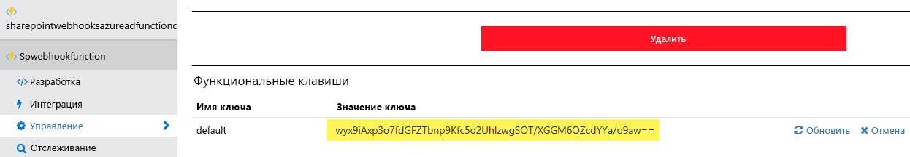

Во избежание несанкционированного использования функции Azure при ее вызове необходимо указывать код. Этот код можно получить на экране **Управление**:To avoid unathorized usage of your Azure Function the caller will need to specify a code when calling your function. This code can be retreived via the **Manage** screen:](../../../images/webhook-azure-function8.png)

Во избежание несанкционированного использования функции Azure при ее вызове необходимо указывать код. Этот код можно получить на экране **Управление**:

Поэтому в нашем случае будет использоваться следующий URL-адрес веб-перехватчика: `https://pnp-functions.azurewebsites.net/api/spwebhookfunction?code=wyx9iAxp3o7fdGFZTbnp9Kfc5o2UhlzwgSOT/XGGM6QZcdYYa/o9aw==`So in our case the webhook URL to use is the following: `https://pnp-functions.azurewebsites.net/api/spwebhookfunction?code=wyx9iAxp3o7fdGFZTbnp9Kfc5o2UhlzwgSOT/XGGM6QZcdYYa/o9aw==`

