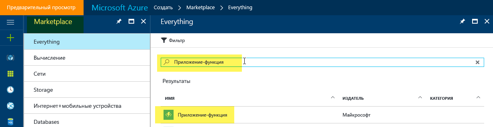
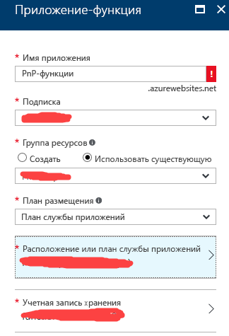
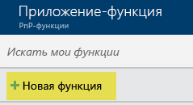
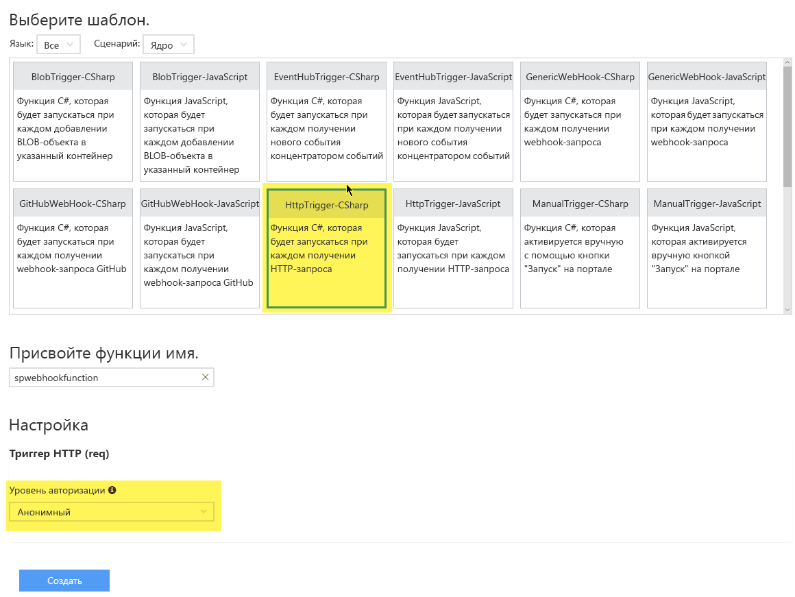
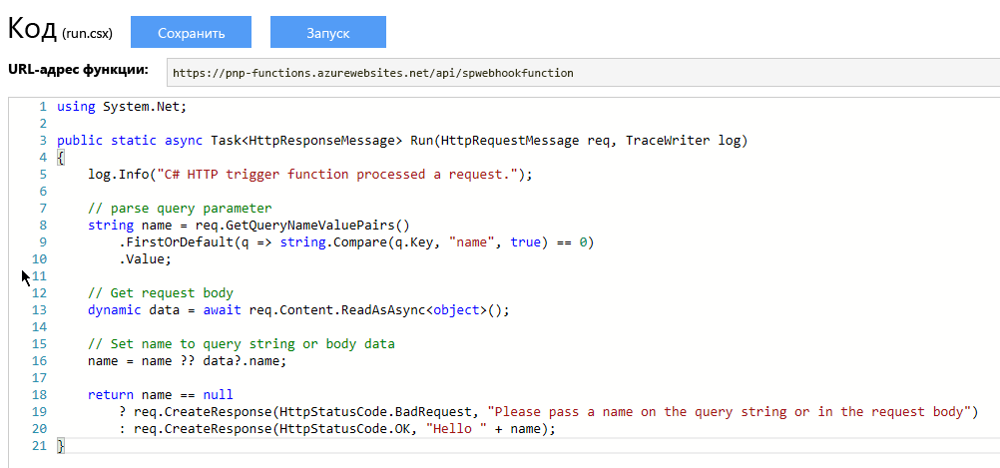
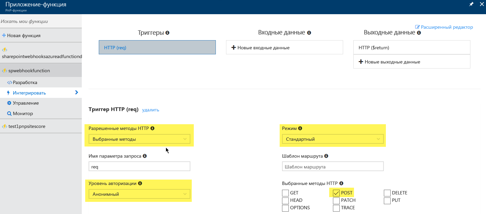
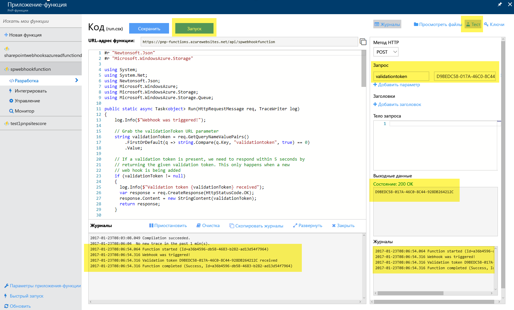
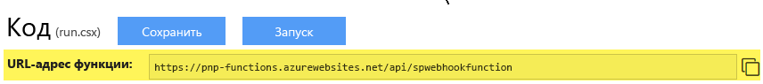

# <a name="using-azure-functions-with-sharepoint-webhooks"></a>Использование решения "Функции Azure" с веб-перехватчиками SharePoint
Благодаря решению [Функции Azure](https://docs.microsoft.com/ru-RU/azure/azure-functions/functions-overview) доступен удобный способ размещать веб-перехватчики SharePoint. Достаточно добавить код веб-перехватчика на языке C# или JavaScript через браузер, и Azure займется размещением и масштабированием функции. В этом руководстве показано, как настроить и использовать функции Azure для веб-перехватчиков.

## <a name="create-a-an-azure-function-app"></a>Создание приложения-функции Azure
Для начала необходимо создать приложение-функцию Azure — специальный вид веб-приложений Azure, предназначенный для размещения функций в Azure. Перейдите на сайт [https://portal.azure.com](https://portal.azure.com), нажмите "Создать" и найдите элемент "Приложение-функция".



Выберите элемент "Приложение-функция" и укажите сведения, необходимые для приложения-функции.



## <a name="create-an-azure-function"></a>Создание функции Azure
Теперь, когда мы подготовили приложение для размещения функций, вы можете создать первую функцию Azure с помощью ссылки "Новая функция".



Вам будет предложено создать функцию на основе шаблона. В случае веб-перехватчиков SharePoint нам потребуется функция, активируемая с помощью HTTP. В нашем примере мы будем писать код на C#, поэтому воспользуемся шаблоном функции **HttpTrigger-CSharp**. Учитывая, что службы веб-перехватчиков SharePoint должны поддерживать анонимный вызов, важно изменить значение параметра **Уровень авторизации** на **Анонимный**.



> [!NOTE]
> - В настоящее время шаблон **GenericWebHook** не работает с веб-перехватчиками SharePoint, но команда разработчиков SharePoint знает об этой проблеме и исправит ее.
> - Если при использовании веб-перехватчика на основе функции Azure возникают ошибки "Не удалось проверить URL-адрес уведомления", установите уровень авторизации **Функция** и настройте анонимный доступ для функции.

В результате получится "стандартная" функция Azure на C#. 

В нашем случае эта функция Azure должна работать как служба веб-перехватчиков SharePoint, поэтому нам потребуется реализовать на C# следующие операции:
- 1. Возвращение параметра validationtoken, если он указан в качестве параметра URL-адреса в вызове. Необходимость этого описана [здесь](./lists/create-subscription.md), а SharePoint ожидает ответ в течение 5 секунд. 
- 2. Обработка уведомления веб-перехватчика JSON. В приведенном ниже примере мы решили сохранять код JSON в очереди хранилища, чтобы веб-задание Azure могло обрабатывать его асинхронно. В зависимости от ваших потребностей вы также можете обеспечить обработку уведомления непосредственно в службе веб-перехватчиков, но помните, что все вызовы службы веб-перехватчиков должны завершаться в течение 5 секунд, поэтому рекомендуем использовать асинхронную модель.

Вы можете добиться этого, заменив код по умолчанию следующим кодом (укажите свою строку подключения для учетной записи хранения и измените имя очереди, если вы используете другую):

```
#r "Newtonsoft.Json"
#r "Microsoft.WindowsAzure.Storage"

using System;
using System.Net;
using Newtonsoft.Json;
using Microsoft.WindowsAzure;
using Microsoft.WindowsAzure.Storage;
using Microsoft.WindowsAzure.Storage.Queue;

public static async Task<object> Run(HttpRequestMessage req, TraceWriter log)
{
    log.Info($"Webhook was triggered!");

    // Grab the validationToken URL parameter
    string validationToken = req.GetQueryNameValuePairs()
        .FirstOrDefault(q => string.Compare(q.Key, "validationtoken", true) == 0)
        .Value;
    
    // If a validation token is present, we need to respond within 5 seconds by  
    // returning the given validation token. This only happens when a new 
    // web hook is being added
    if (validationToken != null)
    {
      log.Info($"Validation token {validationToken} received");
      var response = req.CreateResponse(HttpStatusCode.OK);
      response.Content = new StringContent(validationToken);
      return response;
    }

    log.Info($"SharePoint triggered our webhook...great :-)");
    var content = await req.Content.ReadAsStringAsync();
    log.Info($"Received following payload: {content}");

    var notifications = JsonConvert.DeserializeObject<ResponseModel<NotificationModel>>(content).Value;
    log.Info($"Found {notifications.Count} notifications");

    if (notifications.Count > 0)
    {
        log.Info($"Processing notifications...");
        foreach(var notification in notifications)
        {
            CloudStorageAccount storageAccount = CloudStorageAccount.Parse("<YOUR STORAGE ACCOUNT>");
            // Get queue... create if does not exist.
            CloudQueueClient queueClient = storageAccount.CreateCloudQueueClient();
            CloudQueue queue = queueClient.GetQueueReference("sharepointlistwebhookeventazuread");
            queue.CreateIfNotExists();

            // add message to the queue
            string message = JsonConvert.SerializeObject(notification);
            log.Info($"Before adding a message to the queue. Message content: {message}");
            queue.AddMessage(new CloudQueueMessage(message));
            log.Info($"Message added :-)");
        }
    }

    // if we get here we assume the request was well received
    return new HttpResponseMessage(HttpStatusCode.OK);
}


// supporting classes
public class ResponseModel<T>
{
    [JsonProperty(PropertyName = "value")]
    public List<T> Value { get; set; }
}

public class NotificationModel
{
    [JsonProperty(PropertyName = "subscriptionId")]
    public string SubscriptionId { get; set; }

    [JsonProperty(PropertyName = "clientState")]
    public string ClientState { get; set; }

    [JsonProperty(PropertyName = "expirationDateTime")]
    public DateTime ExpirationDateTime { get; set; }

    [JsonProperty(PropertyName = "resource")]
    public string Resource { get; set; }

    [JsonProperty(PropertyName = "tenantId")]
    public string TenantId { get; set; }

    [JsonProperty(PropertyName = "siteUrl")]
    public string SiteUrl { get; set; }

    [JsonProperty(PropertyName = "webId")]
    public string WebId { get; set; }
}

public class SubscriptionModel
{
    [JsonProperty(NullValueHandling = NullValueHandling.Ignore)]
    public string Id { get; set; }

    [JsonProperty(PropertyName = "clientState", NullValueHandling = NullValueHandling.Ignore)]
    public string ClientState { get; set; }

    [JsonProperty(PropertyName = "expirationDateTime")]
    public DateTime ExpirationDateTime { get; set; }

    [JsonProperty(PropertyName = "notificationUrl")]
    public string NotificationUrl {get;set;}

    [JsonProperty(PropertyName = "resource", NullValueHandling = NullValueHandling.Ignore)]
    public string Resource { get; set; }
}
```

## <a name="configure-your-azure-function"></a>Настройка функции Azure
Так как мы выбрали правильный шаблон, наша конфигурация почти готова. Остается только изменить значение параметра **Разрешенные методы HTTP** на **Выбранные методы**, а затем разрешить только метод HTTP **POST**. Кроме того, убедитесь, что для параметра **Режим** задано значение **Стандартный**, а для параметра **Уровень авторизации** — **Анонимный**.



## <a name="test-your-azure-function"></a>Тестирование функции Azure
Все готово к тестированию вашей первой функции Azure. Откройте экран **Разработка**. Нажмите значок **Тестирование**, чтобы открыть панель тестирования в правой части экрана, и добавьте параметр URL-адреса validationtoken со случайной строкой в качестве значения. Так мы имитируем то, как SharePoint вызывает службу веб-перехватчиков при проверке добавления веб-перехватчика. Нажмите **Запустить**, чтобы начать тестирование. Если все пройдет без проблем, вы увидите в разделе журналов, что служба была вызвана и вернула переданное значение с ответом HTTP 200:



## <a name="grab-the-webhook-url-to-use-in-your-implementation"></a>Выбор URL-адреса веб-перехватчика
Теперь нам необходимо сообщить SharePoint, какой URL-адрес веб-перехватчика мы используем. Для начала скопируем URL-адрес функции Azure:



Во избежание несанкционированного использования функции Azure при ее вызове необходимо указывать код. Этот код можно получить на экране **Управление**:


Поэтому в нашем случае будет использоваться следующий URL-адрес веб-перехватчика: `https://pnp-functions.azurewebsites.net/api/spwebhookfunction?code=wyx9iAxp3o7fdGFZTbnp9Kfc5o2UhlzwgSOT/XGGM6QZcdYYa/o9aw==`


