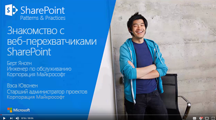
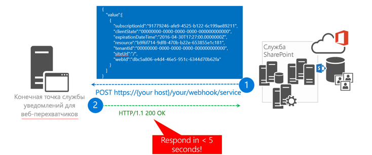
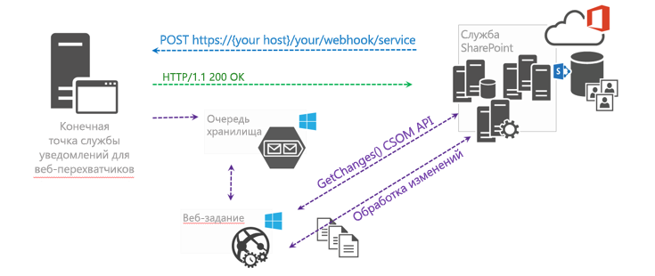
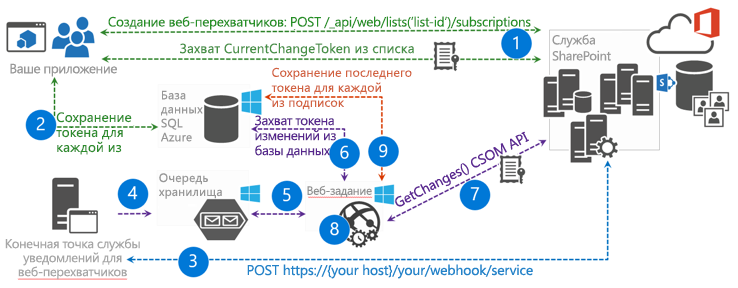

# <a name="sharepoint-webhooks-sample-reference-implementation"></a><span data-ttu-id="98707-103">Пример реализации веб-перехватчиков SharePoint</span><span class="sxs-lookup"><span data-stu-id="98707-103">SharePoint webhooks sample reference implementation</span></span>

<span data-ttu-id="98707-p101">Эталонная реализация PnP SharePoint демонстрирует способы использования веб-перехватчиков SharePoint в приложении. Веб-перехватчики реализованы так, что могут использоваться на предприятиях совместно с различными компонентами Microsoft Azure, такими как веб-задания Azure, SQL Server для Azure и очереди службы хранилища Azure для асинхронной обработки уведомлений о веб-заданиях.</span><span class="sxs-lookup"><span data-stu-id="98707-p101">The SharePoint Patterns and Practices (PnP) reference implementation shows how you can use SharePoint webhooks in your application. The webhooks are implemented in an enterprise ready manner using various Microsoft Azure components such as Azure Web Jobs, Azure SQL Server, and Azure Storage Queues for asynchronous web job notification handling.</span></span>

<span data-ttu-id="98707-106">Эталонная реализация работает только с [веб-перехватчиками для списков SharePoint](./lists/overview-sharepoint-list-webhooks.md).</span><span class="sxs-lookup"><span data-stu-id="98707-106">The reference implementation only works with [SharePoint list webhooks](./lists/overview-sharepoint-list-webhooks.md).</span></span> 

<span data-ttu-id="98707-107">Вы также можете выполнить эти действия, посмотрев видео, добавленные в [канал SharePoint PnP на сайте YouTube](https://www.youtube.com/watch?v=j3hWCAI9R20).</span><span class="sxs-lookup"><span data-stu-id="98707-107">You can also follow these steps by watching the video on the [SharePoint PnP YouTube Channel](https://www.youtube.com/watch?v=j3hWCAI9R20).</span></span>

<a href="https://www.youtube.com/watch?v=j3hWCAI9R20">

</a>

<span data-ttu-id="98707-108">**Относится к:** мультитенантная среда Office 365.</span><span class="sxs-lookup"><span data-stu-id="98707-108">Office 365 Multi Tenant (MT).</span></span>

<span data-ttu-id="98707-109">Microsoft Azure используется для размещения различных компонентов, необходимых для реализации веб-перехватчиков Azure.</span><span class="sxs-lookup"><span data-stu-id="98707-109">Microsoft Azure is used to host the various components needed to implement Azure webhooks.</span></span>

<span data-ttu-id="98707-110">Исходный код и другие материалы для данной эталонной реализации доступны в двух вариантах:</span><span class="sxs-lookup"><span data-stu-id="98707-110">Source code and other materials for the reference implementation are available in the SharePoint developer samples GitHub repository.</span></span> 
- <span data-ttu-id="98707-111">Версия приложения SharePoint с размещением у поставщика</span><span class="sxs-lookup"><span data-stu-id="98707-111">A SharePoint provider-hosted application version</span></span>
- <span data-ttu-id="98707-112">Приложение Azure AD для Office 365, которое представлено в [репозитории примеров для разработчиков SharePoint на сайте GitHub](https://aka.ms/sp-webhooks-sample-reference).</span><span class="sxs-lookup"><span data-stu-id="98707-112">An Office 365 Azure AD application, which can be found in the [SharePoint developer samples GitHub repository](https://aka.ms/sp-webhooks-sample-reference).</span></span> 

## <a name="deploy-the-reference-implementation"></a><span data-ttu-id="98707-113">Развертывание эталонной реализации</span><span class="sxs-lookup"><span data-stu-id="98707-113">Deploying the reference implementation</span></span>

<span data-ttu-id="98707-114">Это приложение показывает, как управлять веб-перехватчиками для списка SharePoint.</span><span class="sxs-lookup"><span data-stu-id="98707-114">The application shows you how to manage webhooks, specifically for a SharePoint list.</span></span> <span data-ttu-id="98707-115">Оно также содержит эталонную реализацию конечной точки службы веб-перехватчиков, которую вы можете использовать в своих проектах.</span><span class="sxs-lookup"><span data-stu-id="98707-115">The application will show you how to manage webhooks, specifically for a SharePoint list. It also contains a reference implementation of a webhook service endpoint which you can reuse in your webhook projects.</span></span> 


### <a name="deployment-guides"></a><span data-ttu-id="98707-117">Руководства по развертыванию</span><span class="sxs-lookup"><span data-stu-id="98707-117">Deployment guides</span></span>

- <span data-ttu-id="98707-118">[Руководстве по развертыванию эталонной реализации веб-перехватчиков в SharePoint](https://github.com/SharePoint/sp-dev-samples/blob/master/Samples/WebHooks.List/Deployment%20guide.md) содержит инструкции по развертыванию эталонной реализации с размещением у поставщика.</span><span class="sxs-lookup"><span data-stu-id="98707-118">The [SharePoint web hooks reference implementation - Deployment guide](https://github.com/SharePoint/sp-dev-samples/blob/master/Samples/WebHooks.List/Deployment%20guide.md) lists the deployment steps used to deploy the SharePoint Provider hosted reference implementation.</span></span> 

- <span data-ttu-id="98707-119">Чтобы развернуть приложение Azure AD для Office 365, выполните действия, описанные в [руководстве по развертыванию эталонной реализации веб-перехватчиков SharePoint в Azure AD](https://github.com/SharePoint/sp-dev-samples/blob/master/Samples/WebHooks.List.AzureAD/Deployment%20guide.md), где показано, как использовать функцию веб-API в качестве службы веб-перехватчиков.</span><span class="sxs-lookup"><span data-stu-id="98707-119">To deploy the Office 365 Azure AD application, use the steps described at [SharePoint web hooks Azure AD reference implementation deployment guide](https://github.com/SharePoint/sp-dev-samples/blob/master/Samples/WebHooks.List.AzureAD/Deployment%20guide.md), which shows you how to use a Web API function as webhook service.</span></span> 

- <span data-ttu-id="98707-120">Если вас больше интересует использование функций Azure, см. [руководство по функциям Azure](https://github.com/SharePoint/sp-dev-samples/blob/master/Samples/WebHooks.List.AzureAD/azure%20functions%20guide.md), где вы найдете дополнительные сведения о том, как использовать их в этой эталонной реализации.</span><span class="sxs-lookup"><span data-stu-id="98707-120">If you're more interested in using Azure Functions, see the [Azure Functions guide](https://github.com/SharePoint/sp-dev-samples/blob/master/Samples/WebHooks.List.AzureAD/azure%20functions%20guide.md) for more details on how to use Azure Functions in this reference implementation.</span></span>

### <a name="introduction-to-webhooks"></a><span data-ttu-id="98707-121">Общие сведения о веб-перехватчиках</span><span class="sxs-lookup"><span data-stu-id="98707-121">Introduction to webhooks</span></span>

<span data-ttu-id="98707-122">Веб-перехватчики используются для оповещения приложения об изменениях в SharePoint, которые оно должно отслеживать.</span><span class="sxs-lookup"><span data-stu-id="98707-122">Webhooks notify your application about changes in SharePoint that the application needs to monitor.</span></span> <span data-ttu-id="98707-123">Таким образом, приложению не нужно регулярно запрашивать сведения об изменениях.</span><span class="sxs-lookup"><span data-stu-id="98707-123">There's no need for your application to regularly poll for changes anymore.</span></span> <span data-ttu-id="98707-124">Веб-перехватчики оповещают приложение (модель **push**) о наличии каких-либо изменений.</span><span class="sxs-lookup"><span data-stu-id="98707-124">With webhooks your application is notified (**push** model) whenever there's a change.</span></span> <span data-ttu-id="98707-125">Веб-перехватчики используются не только в решениях корпорации Майкрософт.</span><span class="sxs-lookup"><span data-stu-id="98707-125">Webhooks are not specific to Microsoft.</span></span> <span data-ttu-id="98707-126">Это универсальный веб-стандарт, который используют и другие поставщики (например, WordPress, GitHub, MailChimp и другие).</span><span class="sxs-lookup"><span data-stu-id="98707-126">They are a universal web standard that's also being adopted by other vendors (e.g., WordPress, GitHub, MailChimp, and others).</span></span>

## <a name="add-a-webhook-to-your-sharepoint-list"></a><span data-ttu-id="98707-127">Добавление веб-перехватчика в список SharePoint</span><span class="sxs-lookup"><span data-stu-id="98707-127">Adding a webhook to your SharePoint list</span></span>

<span data-ttu-id="98707-128">Эталонная реализация работает со списком SharePoint.</span><span class="sxs-lookup"><span data-stu-id="98707-128">The reference implementation works with a SharePoint list.</span></span> <span data-ttu-id="98707-129">Чтобы добавить веб-перехватчик в список SharePoint, приложение сначала создает подписку на веб-перехватчик, отправив запрос [`POST /_api/web/lists('list-id')/subscriptions`](./lists/create-subscription.md).</span><span class="sxs-lookup"><span data-stu-id="98707-129">To add a webhook to a SharePoint list, your application first creates a webhook subscription by sending a [`POST /_api/web/lists('list-id')/subscriptions`](./lists/create-subscription.md) request.</span></span> <span data-ttu-id="98707-130">Запрос включает перечисленные ниже данные.</span><span class="sxs-lookup"><span data-stu-id="98707-130">The request includes the following items:</span></span>

* <span data-ttu-id="98707-131">Полезные данные, определяющие список, для которого вы добавляете веб-перехватчик.</span><span class="sxs-lookup"><span data-stu-id="98707-131">A payload that identifies the list which you're adding the webhook for.</span></span>
* <span data-ttu-id="98707-132">URL-адрес службы веб-перехватчиков для отправки уведомлений.</span><span class="sxs-lookup"><span data-stu-id="98707-132">The location of your webhook service URL to send the notifications.</span></span>
* <span data-ttu-id="98707-133">Дата окончания срока действия веб-перехватчика.</span><span class="sxs-lookup"><span data-stu-id="98707-133">The expiration date of the webhook.</span></span> 

<span data-ttu-id="98707-134">Когда вы отправите среде SharePoint запрос на добавление веб-перехватчика, SharePoint проверит, существует ли конечная точка службы веб-перехватчиков,</span><span class="sxs-lookup"><span data-stu-id="98707-134">After you've requested SharePoint to add your webhook, SharePoint validates that your webhook service endpoint exists.</span></span> <span data-ttu-id="98707-135">а затем отправит строку проверки в конечную точку службы.</span><span class="sxs-lookup"><span data-stu-id="98707-135">It sends a validation string to your service endpoint.</span></span> <span data-ttu-id="98707-136">Предполагается, что конечная точка службы вернет строку проверки в течение 5 секунд.</span><span class="sxs-lookup"><span data-stu-id="98707-136">SharePoint expects that your service endpoint returns the validation string within 5 seconds.</span></span> <span data-ttu-id="98707-137">Если произойдет ошибка, создание веб-перехватчика будет отменено.</span><span class="sxs-lookup"><span data-stu-id="98707-137">If this process fails, the webhook creation is canceled.</span></span> <span data-ttu-id="98707-138">Если служба развернута, то операция успешно выполняется, а SharePoint возвращает сообщение HTTP 201 в ответ на первоначальный запрос POST от приложения.</span><span class="sxs-lookup"><span data-stu-id="98707-138">If you've deployed your service, this works and SharePoint returns an HTTP 201 message on the POST request that the application initially sent.</span></span> <span data-ttu-id="98707-139">Полученные полезные данные содержат идентификатор новой подписки на веб-перехватчик.</span><span class="sxs-lookup"><span data-stu-id="98707-139">The payload in the response contains the ID of the new webhook subscription.</span></span>


<span data-ttu-id="98707-141">Ознакомившись с эталонной реализацией, вы увидите, что все операции CRUD веб-перехватчиков объединяются в класс [WebHookManager](https://github.com/SharePoint/sp-dev-samples/blob/master/Samples/WebHooks.List/SharePoint.WebHooks.Common/WebHookManager.cs) проекта **SharePoint.WebHooks.Common**.</span><span class="sxs-lookup"><span data-stu-id="98707-141">Take a look at the reference implementation, and you'll see that all webhook CRUD operations are consolidated in the [WebHookManager](https://github.com/SharePoint/sp-dev-samples/blob/master/Samples/WebHooks.List/SharePoint.WebHooks.Common/WebHookManager.cs) class of the **SharePoint.WebHooks.Common** project.</span></span> <span data-ttu-id="98707-142">Для добавления веб-перехватчика используется метод **AddListWebHookAsync**:</span><span class="sxs-lookup"><span data-stu-id="98707-142">Adding a webhook is done using the **AddListWebHookAsync** method:</span></span>

```cs
/// <summary>
/// This method adds a webhook to a SharePoint list. Note that you need your webhook endpoint being passed into this method to be up and running and reachable from the internet
/// </summary>
/// <param name="siteUrl">Url of the site holding the list</param>
/// <param name="listId">Id of the list</param>
/// <param name="webHookEndPoint">Url of the webhook service endpoint (the one that will be called during an event)</param>
/// <param name="accessToken">Access token to authenticate against SharePoint</param>
/// <param name="validityInMonths">Optional webhook validity in months, defaults to 3 months, max is 6 months</param>
/// <returns>subscription ID of the new webhook</returns>
public async Task<SubscriptionModel> AddListWebHookAsync(string siteUrl, string listId, string webHookEndPoint, string accessToken, int validityInMonths = 3)
{
    // webhook add code...
}
```

<br/>

<span data-ttu-id="98707-143">Вызывая SharePoint, необходимо указать данные для проверки подлинности. В этом случае используются заголовок **Bearer** и **маркер доступа**.</span><span class="sxs-lookup"><span data-stu-id="98707-143">When making a call to SharePoint, you need to provide authentication information and in this case you're using a **Bearer** authentication header with an **access token**.</span></span> <span data-ttu-id="98707-144">Чтобы получить маркер доступа, перехватите его с помощью обработчика событий **ExecutingWebRequest**:</span><span class="sxs-lookup"><span data-stu-id="98707-144">To obtain the access token, intercept the token via an **ExecutingWebRequest** event handler:</span></span>

```cs
ClientContext cc = null;

// Create SharePoint ClientContext object...

// Add ExecutingWebRequest event handler
cc.ExecutingWebRequest += Cc_ExecutingWebRequest;

// Capture the OAuth access token since we want to reuse that one in our REST requests
private void Cc_ExecutingWebRequest(object sender, WebRequestEventArgs e)
{
    this.accessToken = e.WebRequestExecutor.RequestHeaders.Get("Authorization").Replace("Bearer ", "");
}
```

## <a name="sharepoint-calls-out-to-your-webhook-service"></a><span data-ttu-id="98707-145">SharePoint вызывает службу веб-перехватчиков</span><span class="sxs-lookup"><span data-stu-id="98707-145">SharePoint calls out to your webhook service</span></span>

<span data-ttu-id="98707-146">Когда SharePoint обнаруживает изменение в списке, для которого вы создали подписку на веб-перехватчик, SharePoint вызывает конечную точку службы.</span><span class="sxs-lookup"><span data-stu-id="98707-146">When SharePoint detects a change in a list for which you've created a webhook subscription, your service endpoint will be called by SharePoint. When you look at the payload from SharePoint, notice that the following properties are important:</span></span> <span data-ttu-id="98707-147">При просмотре полезных данных из SharePoint обратите внимание на следующие важные свойства:</span><span class="sxs-lookup"><span data-stu-id="98707-147">When you look at the payload from SharePoint, notice that the following properties are important:</span></span>

<span data-ttu-id="98707-148">Свойство</span><span class="sxs-lookup"><span data-stu-id="98707-148">Property</span></span>|<span data-ttu-id="98707-149">Описание</span><span class="sxs-lookup"><span data-stu-id="98707-149">Description</span></span>
--------|-----------
<span data-ttu-id="98707-150">**subscriptionId**</span><span class="sxs-lookup"><span data-stu-id="98707-150">**subscriptionId**</span></span>|<span data-ttu-id="98707-151">Идентификатор подписки на веб-перехватчик.</span><span class="sxs-lookup"><span data-stu-id="98707-151">The ID of the webhook subscription.</span></span> <span data-ttu-id="98707-152">Этот идентификатор нужен, чтобы обновить подписку на веб-перехватчик (например, в случае продления срока действия веб-перехватчика).</span><span class="sxs-lookup"><span data-stu-id="98707-152">The ID of the webhook subscription. If you want to update the webhook subscription, for example you prolong the webhook expiration, then you need this ID.</span></span>
<span data-ttu-id="98707-153">**resource**</span><span class="sxs-lookup"><span data-stu-id="98707-153">**resource**</span></span>|<span data-ttu-id="98707-154">Идентификатор списка, в отношении которого произошло изменение.</span><span class="sxs-lookup"><span data-stu-id="98707-154">The ID of the list for which the change happened.</span></span>
<span data-ttu-id="98707-155">**siteUrl**</span><span class="sxs-lookup"><span data-stu-id="98707-155">**siteUrl**</span></span>|<span data-ttu-id="98707-156">Относительный URL-адрес сервера сайта с ресурсом, в отношении которого произошло изменение.</span><span class="sxs-lookup"><span data-stu-id="98707-156">The server relative URL of the site holding the resource for which the change happened.</span></span>

> [!NOTE]
> <span data-ttu-id="98707-157">SharePoint отправляет уведомления только о том, что произошло изменение, не указывая при этом суть изменения.</span><span class="sxs-lookup"><span data-stu-id="98707-157">SharePoint only sends a notification that a change happened, but the notification does not include what actually changed.</span></span> <span data-ttu-id="98707-158">Так как вы получаете сведения о веб-сайте и списке, которые были изменены, это означает, что эту же конечную точку службы можно использовать для обработки событий веб-перехватчика, касающихся нескольких сайтов и списков.</span><span class="sxs-lookup"><span data-stu-id="98707-158">Because you get information about the web and list that were changed, this means that you can use the same service endpoint to handle webhook events from multiple sites and lists.</span></span>

<span data-ttu-id="98707-159">При вызове службы важно, чтобы в течение 5 секунд в ответ вернулось сообщение HTTP 200.</span><span class="sxs-lookup"><span data-stu-id="98707-159">When your service is called, it's important that your service replies with an HTTP 200 message in under 5 seconds.</span></span> <span data-ttu-id="98707-160">Далее в этой статье приведены дополнительные сведения о времени ответа, но фактически для этого необходима **асинхронная** обработка уведомлений.</span><span class="sxs-lookup"><span data-stu-id="98707-160">Later in this article you'll learn more about the response time, but essentially this requires that you **asynchronously** handle the notifications.</span></span> <span data-ttu-id="98707-161">В данной эталонной реализации она обеспечивается при помощи веб-заданий Azure и очередей службы хранилища Azure.</span><span class="sxs-lookup"><span data-stu-id="98707-161">In this reference implementation you'll do this by using Azure Web Jobs and Azure Storage Queues.</span></span>



## <a name="grab-the-changes-your-service-needs-to-act-upon"></a><span data-ttu-id="98707-163">Захват изменений, на которые должна реагировать служба</span><span class="sxs-lookup"><span data-stu-id="98707-163">Grab the changes your service needs to act upon</span></span>

<span data-ttu-id="98707-164">На предыдущем шаге была вызвана конечная точка службы, но среда SharePoint предоставила сведения только о том, где произошло изменение, а не о том, что было изменено.</span><span class="sxs-lookup"><span data-stu-id="98707-164">In the previous step your service endpoint was called but SharePoint only provided information about where the change happened, not what was actually changed.</span></span> <span data-ttu-id="98707-165">Чтобы понять, что было изменено, необходимо использовать API SharePoint `GetChanges()`, как показано ниже.</span><span class="sxs-lookup"><span data-stu-id="98707-165">To understand what was changed, you'll need to use the SharePoint `GetChanges()` API, as shown in the following image.</span></span>



<span data-ttu-id="98707-167">Дополнительные сведения о реализации `GetChanges()` в методе **ProcessNotification** вы найдете, открыв описание класса [ChangeManager](https://github.com/SharePoint/sp-dev-samples/blob/master/Samples/WebHooks.List/SharePoint.WebHooks.Common/ChangeManager.cs) в проекте **SharePoint.WebHooks.Common**.</span><span class="sxs-lookup"><span data-stu-id="98707-167">You can learn more about the `GetChanges()` implementation in the **ProcessNotification** method in the [ChangeManager](https://github.com/SharePoint/sp-dev-samples/blob/master/Samples/WebHooks.List/SharePoint.WebHooks.Common/ChangeManager.cs) class of the **SharePoint.WebHooks.Common** project.</span></span> 

<span data-ttu-id="98707-168">Чтобы не получать уведомления об одних и тех же изменениях несколько раз, необходимо сообщить SharePoint, из какой точки вы хотите узнавать об изменениях.</span><span class="sxs-lookup"><span data-stu-id="98707-168">To avoid getting the same change repeatedly, it's important that you inform SharePoint from which point you want the changes.</span></span> <span data-ttu-id="98707-169">Это можно сделать путем передачи маркера **changeToken**, применение которого предполагает, что конечная точка службы должна хранить последний **changeToken**, чтобы его можно было использовать при следующем вызове этой конечной точки.</span><span class="sxs-lookup"><span data-stu-id="98707-169">This is done by passing a **changeToken**, which also implies that your service endpoint needs to persist the last used **changeToken** so that it can be used the next time the service endpoint is called.</span></span>

<span data-ttu-id="98707-170">Ниже приведены некоторые ключевые сведения об изменениях.</span><span class="sxs-lookup"><span data-stu-id="98707-170">The following are some key things to note about changes:</span></span>

- <span data-ttu-id="98707-171">SharePoint не вызывает службу в режиме реального времени. При изменении списка, для которого предусмотрен веб-перехватчик, SharePoint поставит в очередь вызов веб-перехватчика.</span><span class="sxs-lookup"><span data-stu-id="98707-171">SharePoint does not call your service in real-time: when a change happens on a list that has a webhook, SharePoint will queue a webhook call out. Once each minute this queue will be read and the appropriate service endpoints are called.</span></span> <span data-ttu-id="98707-172">Один раз в минуту эта очередь считывается и вызываются соответствующие конечные точки службы.</span><span class="sxs-lookup"><span data-stu-id="98707-172">Once each minute, this queue is read and the appropriate service endpoints are called.</span></span> <span data-ttu-id="98707-173">Такая пакетная обработка запросов важна.</span><span class="sxs-lookup"><span data-stu-id="98707-173">This batching of requests is important.</span></span> <span data-ttu-id="98707-174">Например, если одновременно отправляется 1000 записей, то пакетная обработка не допустит, чтобы среда SharePoint вызывала конечную точку 1000 раз.</span><span class="sxs-lookup"><span data-stu-id="98707-174">For example, if a bulk upload of 1000 records occurred at once, batching prevents SharePoint from calling your endpoint 1000 times.</span></span> <span data-ttu-id="98707-175">Таким образом, конечная точка вызывается только один раз, но при вызове метода `GetChanges()` вы получаете 1000 событий изменения, которые необходимо обработать.</span><span class="sxs-lookup"><span data-stu-id="98707-175">So your endpoint is only called once but when you call the `GetChanges()` method you'll get 1000 change events that you need to process.</span></span>

- <span data-ttu-id="98707-176">Для обеспечения немедленного ответа важно, чтобы рабочая нагрузка конечной точки службы выполнялась асинхронно независимо от количества изменений.</span><span class="sxs-lookup"><span data-stu-id="98707-176">To guarantee an immediate response, regardless of the number of changes there, it's important that the workload of your service endpoint runs asynchronously.</span></span> <span data-ttu-id="98707-177">В данной эталонной реализации мы использовали возможности Azure: служба сериализует входящие полезные данные и хранит их в очереди службы хранилища Azure, а веб-задание Azure непрерывно проверяет наличие сообщений в очереди.</span><span class="sxs-lookup"><span data-stu-id="98707-177">To guarantee an immediate response, regardless of the number of changes there, it's important that the workload of your service endpoint runs asynchronously. In the reference implementation we leveraged the power of Azure: the service will serialize the incoming payload and store it in an Azure Storage queue while there's an Azure web job that runs continuously and checks for messages in the queue. When there are messages in the queue the web job will process them and also execute your logic asynchronously.</span></span> <span data-ttu-id="98707-178">Если в очереди есть сообщения, веб-задание обрабатывает их и асинхронно выполняет логику.</span><span class="sxs-lookup"><span data-stu-id="98707-178">When there are messages in the queue, the web job processes them and also executes your logic asynchronously.</span></span>

## <a name="complete-end-to-end-flow"></a><span data-ttu-id="98707-179">Полный поток</span><span class="sxs-lookup"><span data-stu-id="98707-179">Complete end-to-end flow</span></span>

<span data-ttu-id="98707-180">Ниже показан поток реализации веб-перехватчиков от начала до конца.</span><span class="sxs-lookup"><span data-stu-id="98707-180">The following diagram describes the complete end-to-end webhook flow:</span></span>



1. <span data-ttu-id="98707-182">Приложение создает подписку на веб-перехватчик.</span><span class="sxs-lookup"><span data-stu-id="98707-182">Your application creates a webhook subscription.</span></span> <span data-ttu-id="98707-183">После этого оно получает текущий маркер **changeToken** из списка, для которого был создан веб-перехватчик.</span><span class="sxs-lookup"><span data-stu-id="98707-183">When it does it gets the current **changeToken** from the list it created the webhook for.</span></span>
2. <span data-ttu-id="98707-184">Приложение сохраняет **changeToken** в постоянном хранилище (в данном случае — SQL Azure).</span><span class="sxs-lookup"><span data-stu-id="98707-184">Your application persists the **changeToken** in a persistent storage, such as SQL Azure in this case.</span></span>
3. <span data-ttu-id="98707-185">В SharePoint происходит изменение, и SharePoint вызывает конечную точку службы.</span><span class="sxs-lookup"><span data-stu-id="98707-185">A change in SharePoint occurs and SharePoint calls your service endpoint.</span></span>
4. <span data-ttu-id="98707-186">Конечная точка службы сериализует запрос уведомления и помещает его в очередь хранилища.</span><span class="sxs-lookup"><span data-stu-id="98707-186">Your service endpoint serializes the notification request and stores it in a storage queue.</span></span>
5. <span data-ttu-id="98707-187">Веб-задание видит сообщение в очереди и начинает выполнять логику его обработки.</span><span class="sxs-lookup"><span data-stu-id="98707-187">Your web job sees the message in the queue and starts your message processing logic.</span></span>
6. <span data-ttu-id="98707-188">Логика обработки сообщений получает маркер изменений, который использовался в последний раз, из постоянного хранилища.</span><span class="sxs-lookup"><span data-stu-id="98707-188">Your message processing logic retrieves the last used change token from the persistent storage.</span></span>
7. <span data-ttu-id="98707-189">Логика обработки сообщений использует API `GetChanges()`, чтобы определить суть изменения.</span><span class="sxs-lookup"><span data-stu-id="98707-189">Your message processing logic uses the `GetChanges()`API to determine what changed.</span></span>
8. <span data-ttu-id="98707-190">Возвращенные изменения обрабатываются, и приложение выполняет необходимые действия.</span><span class="sxs-lookup"><span data-stu-id="98707-190">The returned changes are processed and now your application performs what it needs to do based on the changes.</span></span>
9. <span data-ttu-id="98707-191">Наконец, приложение сохраняет последний полученный маркер **changeToken**, чтобы в дальнейшем не получать сведения об уже обработанных изменениях.</span><span class="sxs-lookup"><span data-stu-id="98707-191">Finally the application persists the last retrieved **changeToken** so that next time it does not receive changes that were already processed.</span></span>

## <a name="work-with-webhook-renewal"></a><span data-ttu-id="98707-192">Работа с обновлением веб-перехватчиков</span><span class="sxs-lookup"><span data-stu-id="98707-192">Work with webhook renewal</span></span>

<span data-ttu-id="98707-193">Срок действия подписок на веб-перехватчики по умолчанию истекает через 6 месяцев или в день, указанный во время их создания.</span><span class="sxs-lookup"><span data-stu-id="98707-193">Webhook subscriptions are set to expire 6 months by default or at the specified date when they are created.</span></span> <span data-ttu-id="98707-194">Часто требуется, чтобы веб-перехватчик был доступен на протяжении большего периода времени.</span><span class="sxs-lookup"><span data-stu-id="98707-194">Often you need the webhook to be available for a longer time.</span></span> <span data-ttu-id="98707-195">Модели, описанные в следующих разделах, подходят для продления срока действия подписки на веб-перехватчик.</span><span class="sxs-lookup"><span data-stu-id="98707-195">The patterns described in the following sections are good for increasing the lifetime of a webhook subscription.</span></span> <span data-ttu-id="98707-196">Первая модель довольно простая, вторая же немного сложнее и требует размещения дополнительного веб-задания.</span><span class="sxs-lookup"><span data-stu-id="98707-196">The first pattern is lightweight and the second one is slightly more complex and requires an additional web job to be hosted.</span></span>

### <a name="basic-model"></a><span data-ttu-id="98707-197">Базовая модель</span><span class="sxs-lookup"><span data-stu-id="98707-197">Basic model</span></span>

<span data-ttu-id="98707-198">Вместе с уведомлением служба также получает сведения о сроке действия подписки.</span><span class="sxs-lookup"><span data-stu-id="98707-198">When your service receives a notification, it also gets information about the subscription lifetime.</span></span> <span data-ttu-id="98707-199">Если он скоро истечет, вы просто продлеваете его в логике обработки уведомлений.</span><span class="sxs-lookup"><span data-stu-id="98707-199">If the subscription is about to expire,  inside your notification processing logic you simply extend the lifetime of the subscription.</span></span> <span data-ttu-id="98707-200">Эта модель предусмотрена в данной эталонной реализации и подходит в большинстве случаев.</span><span class="sxs-lookup"><span data-stu-id="98707-200">This model is implemented in this reference implementation and works fine for most cases.</span></span> <span data-ttu-id="98707-201">Но если в списке, для которого мы создали подписку на веб-перехватчик, не происходит изменений на протяжении 6 месяцев, эта подписка не продлевается и впоследствии удаляется.</span><span class="sxs-lookup"><span data-stu-id="98707-201">However, in a case where there's no change for 6 months on the list that you've created a webhook subscription for, the webhook subscription is never prolonged and is deleted.</span></span>

### <a name="reliable-but-more-complex-model"></a><span data-ttu-id="98707-202">Надежная, но более сложная модель</span><span class="sxs-lookup"><span data-stu-id="98707-202">Reliable but more complex model</span></span>

<span data-ttu-id="98707-p119">Создайте веб-задание, которое еженедельно будет считывать все ИД подписки из постоянного хранилища. Каждый раз поочередно расширяйте найденные подписки.</span><span class="sxs-lookup"><span data-stu-id="98707-p119">Create a web job that on a weekly basis reads all the subscription IDs from the persistent storage. One-by-one extend the found subscriptions each time.</span></span> 

> [!NOTE]
> <span data-ttu-id="98707-205">Это веб-задание не входит в данную эталонную реализацию.</span><span class="sxs-lookup"><span data-stu-id="98707-205">This web job is not part of this reference implementation.</span></span>

<span data-ttu-id="98707-206">Обновление веб-перехватчика для списка SharePoint можно выполнить с помощью вызова REST [`PATCH /_api/web/lists('list-id')/subscriptions(‘subscriptionID’)`](./lists/update-subscription.md).</span><span class="sxs-lookup"><span data-stu-id="98707-206">The actual renewal of a SharePoint list webhook can be done using a [`PATCH /_api/web/lists('list-id')/subscriptions(‘subscriptionID’)`](./lists/update-subscription.md) REST call.</span></span> 

<span data-ttu-id="98707-207">В эталонной реализации обновление веб-перехватчиков реализуется в классе [WebHookManager](https://github.com/SharePoint/sp-dev-samples/blob/master/Samples/WebHooks.List/SharePoint.WebHooks.Common/WebHookManager.cs) проекта **SharePoint.WebHooks.Common**.</span><span class="sxs-lookup"><span data-stu-id="98707-207">In the reference implementation, updating of webhooks is implemented in the [WebHookManager](https://github.com/SharePoint/sp-dev-samples/blob/master/Samples/WebHooks.List/SharePoint.WebHooks.Common/WebHookManager.cs) class of the **SharePoint.WebHooks.Common** project.</span></span> 

<span data-ttu-id="98707-208">Для обновления веб-перехватчика используется метод **UpdateListWebHookAsync**:</span><span class="sxs-lookup"><span data-stu-id="98707-208">Updating a webhook is done using the **UpdateListWebHookAsync** method:</span></span>

```csharp
/// <summary>
/// Updates the expiration datetime (and notification URL) of an existing SharePoint list webhook
/// </summary>
/// <param name="siteUrl">Url of the site holding the list</param>
/// <param name="listId">Id of the list</param>
/// <param name="subscriptionId">Id of the webhook subscription that we need to update</param>
/// <param name="webHookEndPoint">Url of the webhook service endpoint (the one that will be called during an event)</param>
/// <param name="expirationDateTime">New webhook expiration date</param>
/// <param name="accessToken">Access token to authenticate against SharePoint</param>
/// <returns>true if successful, exception in case something went wrong</returns>
public async Task<bool> UpdateListWebHookAsync(string siteUrl, string listId, string subscriptionId, string webHookEndPoint, DateTime expirationDateTime, string accessToken)
{
    // webhook update code...
}
```

## <a name="debugging-webhooks"></a><span data-ttu-id="98707-209">Отладка веб-перехватчиков</span><span class="sxs-lookup"><span data-stu-id="98707-209">Debugging webhooks</span></span>

<span data-ttu-id="98707-p120">Так как SharePoint вызывает конечную точку службы веб-перехватчиков, эта точка должна быть доступна для SharePoint, что немного усложняет разработку и отладку. Ниже приведены некоторые стратегии, которые можно использовать для упрощения работы.</span><span class="sxs-lookup"><span data-stu-id="98707-p120">Because SharePoint is calling out to your webhook service endpoint, your endpoint needs to be reachable by SharePoint. This makes development and debugging slightly more complex. The following are some strategies that you can use to make your life easier:</span></span>

* <span data-ttu-id="98707-213">Во время первоначальной разработки вы предоставляете сериализованные полезные данные логике обработки службы.</span><span class="sxs-lookup"><span data-stu-id="98707-213">During initial development, you provide your own serialized payload to your service processing logic.</span></span> <span data-ttu-id="98707-214">Это позволяет полностью проверить логику обработки без развертывания конечной точки службы (и даже без настройки веб-перехватчика).</span><span class="sxs-lookup"><span data-stu-id="98707-214">During initial development, you provide your own serialized payload to your service processing logic. This will make it possible to completely test your processing logic without deploying the service endpoint (and even without configuring a webhook).</span></span>

* <span data-ttu-id="98707-215">Если у вас есть доступ к ресурсам Azure, можно развернуть конечную точку в Azure с помощью отладочной сборки, а также настроить службу приложений Azure для отладки.</span><span class="sxs-lookup"><span data-stu-id="98707-215">If you have access to Azure resources, you can deploy your endpoint to Azure using a debug build and configure the Azure App Service for debugging. This will then allow you to set a remote breakpoint and do remote debugging using Visual Studio.</span></span> <span data-ttu-id="98707-216">Это позволяет задать удаленную точку останова и выполнить удаленную отладку с помощью Visual Studio.</span><span class="sxs-lookup"><span data-stu-id="98707-216">This allows you to set a remote breakpoint and do remote debugging using Visual Studio.</span></span>

- <span data-ttu-id="98707-217">Если вы не хотите развертывать службу во время разработки, необходимо использовать защищенный туннель.</span><span class="sxs-lookup"><span data-stu-id="98707-217">If you do not want to deploy your service during development time, you'll need to use a secure tunnel for your service.</span></span> <span data-ttu-id="98707-218">Идея заключается в том, что вы сообщаете SharePoint, что служба уведомлений находится в общедоступной конечной точке.</span><span class="sxs-lookup"><span data-stu-id="98707-218">The idea is that you tell SharePoint that the notification service is located on a shared public endpoint.</span></span> <span data-ttu-id="98707-219">Установите в клиенте компонент, который подключается к этой общедоступной службе. При каждом вызове общедоступной конечной точки этот клиентский компонент получает уведомление, после чего он передает полезные данные службе, запущенной на localhost.</span><span class="sxs-lookup"><span data-stu-id="98707-219">In the client, you install a component that connects to that shared public service and whenever a call is made to the public endpoint, the client component is notified and it pushes the payload to your service running on localhost.</span></span> <span data-ttu-id="98707-220">[ngrok](https://ngrok.com/) — реализация инструмента защищенного туннеля, который можно использовать для локальной отладки службы веб-перехватчиков.</span><span class="sxs-lookup"><span data-stu-id="98707-220">[ngrok](https://ngrok.com/) is an implementation of such a secure tunnel tool that you can use to debug your webhook service locally.</span></span>

## <a name="see-also"></a><span data-ttu-id="98707-221">См. также</span><span class="sxs-lookup"><span data-stu-id="98707-221">See also</span></span>

- [<span data-ttu-id="98707-222">Обзор веб-перехватчиков SharePoint</span><span class="sxs-lookup"><span data-stu-id="98707-222">Overview of SharePoint webhooks</span></span>](overview-sharepoint-webhooks.md)