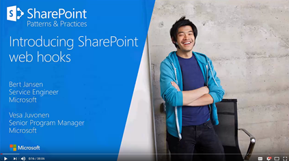
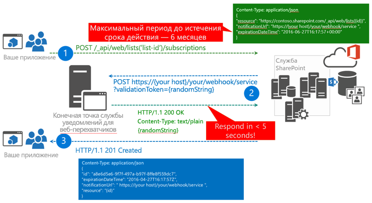

# <a name="sharepoint-webhooks-sample-reference-implementation"></a><span data-ttu-id="5bd7e-102">Пример реализации веб-перехватчиков SharePoint</span><span class="sxs-lookup"><span data-stu-id="5bd7e-102">SharePoint webhooks sample reference implementation</span></span>

<span data-ttu-id="5bd7e-103">**Участник**: Берт Янсен (корпорация Майкрософт), рабочая группа SharePoint PnP Core.</span><span class="sxs-lookup"><span data-stu-id="5bd7e-103">**Contributor(s)**: Bert Jansen (Microsoft), SharePoint PnP Core Team</span></span>

<span data-ttu-id="5bd7e-p101">Эталонная реализация PnP SharePoint демонстрирует способы использования веб-перехватчиков SharePoint в приложении. Веб-перехватчики реализованы так, что могут использоваться на предприятиях совместно с различными компонентами Microsoft Azure, такими как веб-задания Azure, SQL Server для Azure и очереди службы хранилища Azure для асинхронной обработки уведомлений о веб-заданиях.</span><span class="sxs-lookup"><span data-stu-id="5bd7e-p101">The SharePoint Patterns and Practices (PnP) reference implementation shows how you can use SharePoint webhooks in your application. The webhooks are implemented in an enterprise ready manner using various Microsoft Azure components such as Azure Web Jobs, Azure SQL Server, and Azure Storage Queues for asynchronous web job notification handling.</span></span>

<span data-ttu-id="5bd7e-106">Эталонная реализация работает только с [веб-перехватчиками для списков SharePoint](./lists/overview-sharepoint-list-webhooks.md).</span><span class="sxs-lookup"><span data-stu-id="5bd7e-106">The reference implementation only works with [SharePoint list webhooks](./lists/overview-sharepoint-list-webhooks.md).</span></span> 

<span data-ttu-id="5bd7e-107">Вы также можете выполнить эти действия, посмотрев видео, добавленные в [канал SharePoint PnP на сайте YouTube](https://www.youtube.com/watch?v=j3hWCAI9R20).</span><span class="sxs-lookup"><span data-stu-id="5bd7e-107">You can also follow these steps by watching the video on the [SharePoint PnP YouTube Channel](https://www.youtube.com/watch?v=j3hWCAI9R20).</span></span>

<a href="https://www.youtube.com/watch?v=j3hWCAI9R20">

</a>

## <a name="applies-to"></a><span data-ttu-id="5bd7e-108">Область применения</span><span class="sxs-lookup"><span data-stu-id="5bd7e-108">Applies to</span></span>

-  <span data-ttu-id="5bd7e-109">Office 365 Multi Tenant (MT).</span><span class="sxs-lookup"><span data-stu-id="5bd7e-109">Office 365 Multi Tenant (MT).</span></span>

## <a name="prerequisites"></a><span data-ttu-id="5bd7e-110">Необходимые компоненты</span><span class="sxs-lookup"><span data-stu-id="5bd7e-110">Prerequisites</span></span>

<span data-ttu-id="5bd7e-111">Microsoft Azure используется для размещения различных компонентов, необходимых для реализации веб-перехватчиков Azure.</span><span class="sxs-lookup"><span data-stu-id="5bd7e-111">Microsoft Azure is used to host the various components needed to implement Azure webhooks.</span></span>

## <a name="source-code-for-this-reference-implementation"></a><span data-ttu-id="5bd7e-112">Исходный код для данной эталонной реализации</span><span class="sxs-lookup"><span data-stu-id="5bd7e-112">Source code for this reference implementation</span></span>

<span data-ttu-id="5bd7e-113">Исходный код и другие материалы для эталонной реализации доступны двух видов: у нас есть версия приложения с размещением у поставщика SharePoint и приложение Azure AD для Office 365, которые можно найти в [репозитории GitHub с примерами решений для SharePoint](https://aka.ms/sp-webhooks-sample-reference).</span><span class="sxs-lookup"><span data-stu-id="5bd7e-113">Source code and other materials for the reference implementation are available in two flavors: we do have a SharePoint provider hosted application version and an Office 365 Azure AD application which can be found in the [SharePoint developer samples GitHub repository](https://aka.ms/sp-webhooks-sample-reference).</span></span> 

## <a name="deploying-the-reference-implementation"></a><span data-ttu-id="5bd7e-114">Развертывание эталонной реализации</span><span class="sxs-lookup"><span data-stu-id="5bd7e-114">Deploying the reference implementation</span></span>

<span data-ttu-id="5bd7e-p102">В приложении будет показано, как управлять веб-перехватчиками для списка SharePoint. Это приложение также содержит эталонную реализацию конечной точки службы веб-перехватчиков, которую можно повторно использовать в проектах веб-перехватчиков.</span><span class="sxs-lookup"><span data-stu-id="5bd7e-p102">The application will show you how to manage webhooks, specifically for a SharePoint list. It also contains a reference implementation of a webhook service endpoint which you can reuse in your webhook projects.</span></span> 


<span data-ttu-id="5bd7e-118">В [руководстве по развертыванию эталонной реализации веб-перехватчиков в SharePoint](https://github.com/SharePoint/sp-dev-samples/blob/master/Samples/WebHooks.List/Deployment%20guide.md) перечислены этапы развертывания эталонной реализации с размещением у поставщика SharePoint.</span><span class="sxs-lookup"><span data-stu-id="5bd7e-118">The [SharePoint web hooks reference implementation - Deployment guide](https://github.com/SharePoint/sp-dev-samples/blob/master/Samples/WebHooks.List/Deployment%20guide.md) lists the deployment steps used to deploy the SharePoint Provider hosted reference implementation.</span></span> <span data-ttu-id="5bd7e-119">Чтобы развернуть приложение Azure AD для Office 365, воспользуйтесь [этими инструкциями](https://github.com/SharePoint/sp-dev-samples/blob/master/Samples/WebHooks.List.AzureAD/Deployment%20guide.md).</span><span class="sxs-lookup"><span data-stu-id="5bd7e-119">To deploy the Office 365 Azure AD application use the steps described [here](https://github.com/SharePoint/sp-dev-samples/blob/master/Samples/WebHooks.List.AzureAD/Deployment%20guide.md).</span></span> <span data-ttu-id="5bd7e-120">В руководстве по развертыванию описано, как использовать функцию веб-API в качестве службы веб-перехвата. Дополнительные сведения об использовании функций Azure в этой эталонной реализации можно найти в [руководстве по функциям Azure](https://github.com/SharePoint/sp-dev-samples/blob/master/Samples/WebHooks.List.AzureAD/azure%20functions%20guide.md).</span><span class="sxs-lookup"><span data-stu-id="5bd7e-120">The deployment guide shows you how to use a Web API function as webhook service, but if you're more interested in use Azure functions then checkout the [Azure Functions guide](https://github.com/SharePoint/sp-dev-samples/blob/master/Samples/WebHooks.List.AzureAD/azure%20functions%20guide.md) for more details on how to use Azure Functions in this reference implementation.</span></span>

## <a name="introduction-to-webhooks"></a><span data-ttu-id="5bd7e-121">Общие сведения о веб-перехватчиках</span><span class="sxs-lookup"><span data-stu-id="5bd7e-121">Introduction to webhooks</span></span>

<span data-ttu-id="5bd7e-122">Веб-перехватчики используются для оповещения приложения об изменениях в SharePoint, которые оно должно отслеживать.</span><span class="sxs-lookup"><span data-stu-id="5bd7e-122">Webhooks notify your application about changes in SharePoint that the application needs to monitor.</span></span> <span data-ttu-id="5bd7e-123">Таким образом, приложению не нужно регулярно запрашивать информацию об изменениях.</span><span class="sxs-lookup"><span data-stu-id="5bd7e-123">There's no need for your application to regularly poll for changes anymore.</span></span> <span data-ttu-id="5bd7e-124">Веб-перехватчики оповещают приложение (**модель с активным источником данных**) о наличии каких-либо изменений.</span><span class="sxs-lookup"><span data-stu-id="5bd7e-124">With webhooks your application is notified (**push** model) whenever there's a change.</span></span> <span data-ttu-id="5bd7e-125">Веб-перехватчики не используются только в решениях корпорации Майкрософт.</span><span class="sxs-lookup"><span data-stu-id="5bd7e-125">Webhooks are not specific to Microsoft.</span></span> <span data-ttu-id="5bd7e-126">Это универсальный веб-стандарт, который используют и другие поставщики (например, WordPress, GitHub, MailChimp и другие).</span><span class="sxs-lookup"><span data-stu-id="5bd7e-126">They are a universal web standard that's also being adopted by other vendors (e.g., WordPress, GitHub, MailChimp, and others).</span></span>

### <a name="adding-a-webhook-to-your-sharepoint-list"></a><span data-ttu-id="5bd7e-127">Добавление веб-перехватчика в список SharePoint</span><span class="sxs-lookup"><span data-stu-id="5bd7e-127">Adding a webhook to your SharePoint list</span></span>

<span data-ttu-id="5bd7e-128">Эталонная реализация работает со списком SharePoint.</span><span class="sxs-lookup"><span data-stu-id="5bd7e-128">The reference implementation works with a SharePoint list.</span></span> <span data-ttu-id="5bd7e-129">Чтобы добавить веб-перехватчик в список SharePoint, приложение сначала создает подписку на веб-перехватчик, отправив запрос [`POST /_api/web/lists('list-id')/subscriptions`](./lists/create-subscription.md).</span><span class="sxs-lookup"><span data-stu-id="5bd7e-129">To add a webhook to a SharePoint list, your application first creates a webhook subscription by sending a [`POST /_api/web/lists('list-id')/subscriptions`](./lists/create-subscription.md) request.</span></span> <span data-ttu-id="5bd7e-130">Запрос включает перечисленные ниже данные.</span><span class="sxs-lookup"><span data-stu-id="5bd7e-130">The request includes the following items:</span></span>

* <span data-ttu-id="5bd7e-131">Полезные данные, определяющие список, для которого вы добавляете веб-перехватчик.</span><span class="sxs-lookup"><span data-stu-id="5bd7e-131">A payload that identifies the list which you're adding the webhook for.</span></span>
* <span data-ttu-id="5bd7e-132">Расположение URL-адреса службы веб-перехватчиков для отправки уведомлений.</span><span class="sxs-lookup"><span data-stu-id="5bd7e-132">The location of your webhook service URL to send the notifications.</span></span>
* <span data-ttu-id="5bd7e-133">Дата окончания срока действия веб-перехватчика.</span><span class="sxs-lookup"><span data-stu-id="5bd7e-133">The expiration date of the webhook.</span></span> 

<span data-ttu-id="5bd7e-p106">Когда вы отправите SharePoint запрос на добавление веб-перехватчика, SharePoint проверит, существует ли конечная точка службы веб-перехватчиков, а затем отправит строку проверки в конечную точку службы. Предполагается, что конечная точка службы вернет строку проверки в течение 5 секунд. Если произойдет ошибка, создание веб-перехватчика будет отменено. Если выполнено развертывание службы, SharePoint возвратит сообщение HTTP 201 в ответ на запрос POST, который был изначально отправлен приложением. Полученные полезные данные содержат ИД новой подписки на веб-перехватчик.</span><span class="sxs-lookup"><span data-stu-id="5bd7e-p106">After you've requested SharePoint to add your webhook, SharePoint will validate that your webhook service endpoint exists. It sends a validation string to your service endpoint. SharePoint expects that your service endpoint returns the validation string within 5 seconds. If this process fails then the webhook creation is canceled. If you've deployed your service then this will work and SharePoint returns an HTTP 201 message on the POST request the application initially sent. The payload in the response contains the ID of the new webhook subscription.</span></span>



<span data-ttu-id="5bd7e-141">Ознакомившись с эталонной реализацией, вы увидите, что все операции CRUD веб-перехватчиков объединяются в класс [WebHookManager](https://github.com/SharePoint/sp-dev-samples/blob/master/Samples/WebHooks.List/SharePoint.WebHooks.Common/WebHookManager.cs) проекта **SharePoint.WebHooks.Common**.</span><span class="sxs-lookup"><span data-stu-id="5bd7e-141">Take a look at the reference implementation, and you'll see that all webhook CRUD operations are consolidated in the [WebHookManager](https://github.com/SharePoint/sp-dev-samples/blob/master/Samples/WebHooks.List/SharePoint.WebHooks.Common/WebHookManager.cs) class of the **SharePoint.WebHooks.Common** project.</span></span> <span data-ttu-id="5bd7e-142">Добавление веб-перехватчика выполняется с помощью метода **AddListWebHookAsync**:</span><span class="sxs-lookup"><span data-stu-id="5bd7e-142">Adding a webhook is done using the **AddListWebHookAsync** method:</span></span>

```cs
/// <summary>
/// This method adds a webhook to a SharePoint list. Note that you need your webhook endpoint being passed into this method to be up and running and reachable from the internet
/// </summary>
/// <param name="siteUrl">Url of the site holding the list</param>
/// <param name="listId">Id of the list</param>
/// <param name="webHookEndPoint">Url of the webhook service endpoint (the one that will be called during an event)</param>
/// <param name="accessToken">Access token to authenticate against SharePoint</param>
/// <param name="validityInMonths">Optional webhook validity in months, defaults to 3 months, max is 6 months</param>
/// <returns>subscription ID of the new webhook</returns>
public async Task<SubscriptionModel> AddListWebHookAsync(string siteUrl, string listId, string webHookEndPoint, string accessToken, int validityInMonths = 3)
{
    // webhook add code...
}
```

<span data-ttu-id="5bd7e-143">При вызове SharePoint необходимо указать данные для проверки подлинности. В этом случае используется заголовок **Bearer** для проверки подлинности и **маркер доступа**.</span><span class="sxs-lookup"><span data-stu-id="5bd7e-143">When making a call to SharePoint, you need to provide authentication information and in this case you're using a **Bearer** authentication header with an **access token**.</span></span> <span data-ttu-id="5bd7e-144">Чтобы получить маркер доступа, перехватите его с помощью обработчика событий **ExecutingWebRequest**:</span><span class="sxs-lookup"><span data-stu-id="5bd7e-144">To obtain the access token, intercept the token via an **ExecutingWebRequest** event handler:</span></span>

```cs
ClientContext cc = null;

// Create SharePoint ClientContext object...

// Add ExecutingWebRequest event handler
cc.ExecutingWebRequest += Cc_ExecutingWebRequest;

// Capture the OAuth access token since we want to reuse that one in our REST requests
private void Cc_ExecutingWebRequest(object sender, WebRequestEventArgs e)
{
    this.accessToken = e.WebRequestExecutor.RequestHeaders.Get("Authorization").Replace("Bearer ", "");
}
```

### <a name="sharepoint-calls-out-to-your-webhook-service"></a><span data-ttu-id="5bd7e-145">SharePoint вызывает службу веб-перехватчиков</span><span class="sxs-lookup"><span data-stu-id="5bd7e-145">SharePoint calls out to your webhook service</span></span>

<span data-ttu-id="5bd7e-p109">Когда SharePoint обнаруживает изменение в списке, для которого вы создали подписку на веб-перехватчик, SharePoint вызывает конечную точку службы. При просмотре полезных данных из SharePoint обратите внимание на важные свойства, приведенные ниже.</span><span class="sxs-lookup"><span data-stu-id="5bd7e-p109">When SharePoint detects a change in a list for which you've created a webhook subscription, your service endpoint will be called by SharePoint. When you look at the payload from SharePoint, notice that the following properties are important:</span></span>

<span data-ttu-id="5bd7e-148">Свойство</span><span class="sxs-lookup"><span data-stu-id="5bd7e-148">Property</span></span>|<span data-ttu-id="5bd7e-149">Описание</span><span class="sxs-lookup"><span data-stu-id="5bd7e-149">Description</span></span>
--------|-----------
<span data-ttu-id="5bd7e-150">**subscriptionId**</span><span class="sxs-lookup"><span data-stu-id="5bd7e-150">**subscriptionId**</span></span>|<span data-ttu-id="5bd7e-p110">ИД подписки на веб-перехватчик. Этот идентификатор нужен, чтобы обновить подписку на веб-перехватчик (например, в случае продления срока действия веб-перехватчика).</span><span class="sxs-lookup"><span data-stu-id="5bd7e-p110">The ID of the webhook subscription. If you want to update the webhook subscription, for example you prolong the webhook expiration, then you need this ID.</span></span>
<span data-ttu-id="5bd7e-153">**resource**</span><span class="sxs-lookup"><span data-stu-id="5bd7e-153">**resource**</span></span>|<span data-ttu-id="5bd7e-154">Идентификатор списка, в отношении которого произошло изменение.</span><span class="sxs-lookup"><span data-stu-id="5bd7e-154">The ID of the list for which the change happened.</span></span>
<span data-ttu-id="5bd7e-155">**siteUrl**</span><span class="sxs-lookup"><span data-stu-id="5bd7e-155">**siteUrl**</span></span>|<span data-ttu-id="5bd7e-156">Относительный URL-адрес сервера сайта с ресурсом, в отношении которого произошло изменение.</span><span class="sxs-lookup"><span data-stu-id="5bd7e-156">The server relative URL of the site holding the resource for which the change happened.</span></span>

> [!NOTE]
> <span data-ttu-id="5bd7e-157">SharePoint отправляет уведомления только о том, что произошло изменение, не указывая при этом суть изменения.</span><span class="sxs-lookup"><span data-stu-id="5bd7e-157">Note: SharePoint only sends a notification that a change happened, but the notification does not include what actually changed.</span></span> <span data-ttu-id="5bd7e-158">Так как вы получаете сведения о веб-сайте и списке, которые были изменены, это означает, что эту же конечную точку службы можно использовать для обработки событий веб-перехватчика, касающихся нескольких сайтов и списков.</span><span class="sxs-lookup"><span data-stu-id="5bd7e-158">Because you get information about the web and list that were changed, this means that you can use the same service endpoint to handle webhook events from multiple sites and lists.</span></span>

<span data-ttu-id="5bd7e-159">При вызове службы важно, чтобы в течение 5 секунд в ответ вернулось сообщение HTTP 200.</span><span class="sxs-lookup"><span data-stu-id="5bd7e-159">When your service is called, it's important that your service replies with an HTTP 200 message in under 5 seconds.</span></span> <span data-ttu-id="5bd7e-160">Далее в этой статье приведены дополнительные сведения о времени отклика, но фактически для этого необходима **асинхронная** обработка уведомлений.</span><span class="sxs-lookup"><span data-stu-id="5bd7e-160">Later in this article you'll learn more about the response time, but essentially this requires that you **asynchronously** handle the notifications.</span></span> <span data-ttu-id="5bd7e-161">В данной эталонной реализации она обеспечивается использованием веб-заданий Azure и очередей службы хранилища Azure.</span><span class="sxs-lookup"><span data-stu-id="5bd7e-161">In this reference implementation you'll do this by using Azure Web Jobs and Azure Storage Queues.</span></span>


### <a name="grab-the-changes-your-service-needs-to-act-upon"></a><span data-ttu-id="5bd7e-163">Захватите изменения, на которые должна воздействовать служба</span><span class="sxs-lookup"><span data-stu-id="5bd7e-163">Grab the changes your service needs to act upon</span></span>

<span data-ttu-id="5bd7e-164">На предыдущем этапе была вызвана конечная точка службы, но продукт SharePoint предоставил сведения только о том, где произошло изменение, а не о том, что было изменено.</span><span class="sxs-lookup"><span data-stu-id="5bd7e-164">In the previous step your service endpoint was called but SharePoint only provided information about where the change happened, not what was actually changed.</span></span> <span data-ttu-id="5bd7e-165">Чтобы понять, что было изменено, необходимо использовать API SharePoint `GetChanges()`, как показано на приведенном ниже изображении.</span><span class="sxs-lookup"><span data-stu-id="5bd7e-165">To understand what was changed, you'll need to use the SharePoint `GetChanges()` API, as shown in the following image.</span></span>


<span data-ttu-id="5bd7e-167">Дополнительные сведения о реализации `GetChanges()` в методе **ProcessNotification** вы найдете, открыв описание класса [ChangeManager](https://github.com/SharePoint/sp-dev-samples/blob/master/Samples/WebHooks.List/SharePoint.WebHooks.Common/ChangeManager.cs) в проекте **SharePoint.WebHooks.Common**.</span><span class="sxs-lookup"><span data-stu-id="5bd7e-167">You can learn more about the `GetChanges()` implementation in the **ProcessNotification** method in the [ChangeManager](https://github.com/SharePoint/sp-dev-samples/blob/master/Samples/WebHooks.List/SharePoint.WebHooks.Common/ChangeManager.cs) class of the **SharePoint.WebHooks.Common** project.</span></span> 

<span data-ttu-id="5bd7e-168">Чтобы не получать уведомления об одних и тех же изменениях несколько раз, необходимо сообщить SharePoint, из какой точки вы хотите узнавать об изменениях.</span><span class="sxs-lookup"><span data-stu-id="5bd7e-168">To avoid getting the same change repeatedly, it's important that you inform SharePoint from which point you want the changes.</span></span> <span data-ttu-id="5bd7e-169">Это можно сделать путем передачи маркера **changeToken**, применение которого предполагает, что конечная точка службы должна хранить последний **changeToken**, чтобы его можно было использовать при следующем вызове этой конечной точки.</span><span class="sxs-lookup"><span data-stu-id="5bd7e-169">This is done by passing a **changeToken**, which also implies that your service endpoint needs to persist the last used **changeToken** so that it can be used the next time the service endpoint is called.</span></span>

<span data-ttu-id="5bd7e-170">Ниже приведены некоторые ключевые сведения об изменениях.</span><span class="sxs-lookup"><span data-stu-id="5bd7e-170">The following are some key things to note about changes:</span></span>

- <span data-ttu-id="5bd7e-171">SharePoint не вызывает службу в режиме реального времени. В случае изменения в списке, для которого предусмотрен веб-перехватчик, SharePoint поставит в очередь вызов веб-перехватчика. Один раз в минуту эта очередь читается и вызываются соответствующие конечные точки службы.</span><span class="sxs-lookup"><span data-stu-id="5bd7e-171">SharePoint does not call your service in real-time: when a change happens on a list that has a webhook, SharePoint will queue a webhook call out. Once each minute this queue will be read and the appropriate service endpoints are called.</span></span> <span data-ttu-id="5bd7e-172">Такая пакетная обработка запросов важна.</span><span class="sxs-lookup"><span data-stu-id="5bd7e-172">This batching of requests is important.</span></span> <span data-ttu-id="5bd7e-173">Например, если произойдет одновременная отправка 1000 записей, пакетная обработка не допустит выполнение 1000 вызовов конечной точки со стороны SharePoint.</span><span class="sxs-lookup"><span data-stu-id="5bd7e-173">For example, if a bulk upload of 1000 records occurred at once, batching prevents SharePoint from calling your endpoint 1000 times.</span></span> <span data-ttu-id="5bd7e-174">Таким образом, вызов конечной точки происходит только один раз, но при вызове метода `GetChanges()` вы получаете 1000 событий изменения, которые необходимо обработать.</span><span class="sxs-lookup"><span data-stu-id="5bd7e-174">So your endpoint is only called once but when you call the `GetChanges()` method you'll get 1000 change events that you need to process.</span></span>
- <span data-ttu-id="5bd7e-p116">Для обеспечения немедленного отклика важно, чтобы рабочая нагрузка конечной точки службы выполнялась асинхронно независимо от количества изменений. В данной эталонной реализации мы использовали возможности Azure: служба будет сериализовать входящие полезные данные и хранить их в очереди службы хранилища Azure, а веб-задание Azure будет непрерывно работать и проверять наличие сообщений в очереди. Когда в очереди будут находиться сообщения, веб-задание будет обрабатывать их и асинхронно выполнять логику.</span><span class="sxs-lookup"><span data-stu-id="5bd7e-p116">To guarantee an immediate response, regardless of the number of changes there, it's important that the workload of your service endpoint runs asynchronously. In the reference implementation we leveraged the power of Azure: the service will serialize the incoming payload and store it in an Azure Storage queue while there's an Azure web job that runs continuously and checks for messages in the queue. When there are messages in the queue the web job will process them and also execute your logic asynchronously.</span></span>

### <a name="complete-end-to-end-flow"></a><span data-ttu-id="5bd7e-178">Полный непрерывный поток</span><span class="sxs-lookup"><span data-stu-id="5bd7e-178">Complete end-to-end flow</span></span>

<span data-ttu-id="5bd7e-179">Приведенная ниже схема описывает полный непрерывный поток веб-перехватчика.</span><span class="sxs-lookup"><span data-stu-id="5bd7e-179">The following diagram describes the complete end-to-end webhook flow:</span></span>


1. <span data-ttu-id="5bd7e-181">Приложение создает подписку на веб-перехватчик.</span><span class="sxs-lookup"><span data-stu-id="5bd7e-181">Your application creates a webhook subscription.</span></span> <span data-ttu-id="5bd7e-182">После этого оно получает текущий маркер **changeToken** из списка, для которого был создан веб-перехватчик.</span><span class="sxs-lookup"><span data-stu-id="5bd7e-182">When it does it gets the current **changeToken** from the list it created the webhook for.</span></span>
2. <span data-ttu-id="5bd7e-183">Приложение сохраняет **changeToken** в постоянном хранилище (в данном случае — SQL Azure).</span><span class="sxs-lookup"><span data-stu-id="5bd7e-183">Your application persists the **changeToken** in a persistent storage, such as SQL Azure in this case.</span></span>
3. <span data-ttu-id="5bd7e-184">В SharePoint происходит изменение, и SharePoint вызывает конечную точку службы.</span><span class="sxs-lookup"><span data-stu-id="5bd7e-184">A change in SharePoint occurs and SharePoint calls your service endpoint.</span></span>
4. <span data-ttu-id="5bd7e-185">Конечная точка службы сериализует запрос уведомления и ставит его в очередь хранилища.</span><span class="sxs-lookup"><span data-stu-id="5bd7e-185">Your service endpoint serializes the notification request and stores it in a storage queue.</span></span>
5. <span data-ttu-id="5bd7e-186">Веб-задание видит сообщение в очереди и начинает выполнять логику его обработки.</span><span class="sxs-lookup"><span data-stu-id="5bd7e-186">Your web job sees the message in the queue and starts your message processing logic.</span></span>
6. <span data-ttu-id="5bd7e-187">Логика обработки сообщений получает маркер изменений, который использовался в последний раз, из постоянного хранилища.</span><span class="sxs-lookup"><span data-stu-id="5bd7e-187">Your message processing logic retrieves the last used change token from the persistent storage.</span></span>
7. <span data-ttu-id="5bd7e-188">Логика обработки сообщений использует API `GetChanges()`, чтобы определить суть изменения.</span><span class="sxs-lookup"><span data-stu-id="5bd7e-188">Your message processing logic uses the `GetChanges()`API to determine what changed.</span></span>
8. <span data-ttu-id="5bd7e-189">Возвращенные изменения обрабатываются, после чего приложение выполняет необходимые действия в соответствии с этими изменениями.</span><span class="sxs-lookup"><span data-stu-id="5bd7e-189">The returned changes are processed and now your application performs what it needs to do based on the changes.</span></span>
9. <span data-ttu-id="5bd7e-190">Наконец приложение сохраняет последний полученный маркер **changeToken**, чтобы в последующем не получать уже обработанных изменений.</span><span class="sxs-lookup"><span data-stu-id="5bd7e-190">Finally the application persists the last retrieved **changeToken** so that next time it does not receive changes that were already processed.</span></span>

## <a name="how-to-work-with-webhook-renewal"></a><span data-ttu-id="5bd7e-191">Как работать с обновлением веб-перехватчика</span><span class="sxs-lookup"><span data-stu-id="5bd7e-191">How to work with webhook renewal</span></span>

<span data-ttu-id="5bd7e-p118">Срок действия подписок на веб-перехватчик по умолчанию заканчивается через 6 месяцев или в день, указанный во время их создания. Часто требуется, чтобы веб-перехватчик был доступен на протяжении большего периода времени. Описанные ниже модели подходят для продления срока действия подписки на веб-перехватчик. Первая модель довольно простая, вторая же немного сложнее и требует размещения дополнительного веб-задания.</span><span class="sxs-lookup"><span data-stu-id="5bd7e-p118">Webhook subscriptions are set to expire 6 months by default or at the specified date when they are created. Often you need the webhook to be available for a longer time. The patterns described below are good for increasing the lifetime of a webhook subscription. The first pattern is lightweight and the second one is slightly more complex and requires an additional web job to be hosted.</span></span>

### <a name="basic-model"></a><span data-ttu-id="5bd7e-196">Базовая модель</span><span class="sxs-lookup"><span data-stu-id="5bd7e-196">Basic model</span></span>

<span data-ttu-id="5bd7e-p119">Вместе с уведомлением служба также получает сведения о сроке действия подписки. Если близится истечение срока ее действия, вы можете продлить его в логике обработки уведомлений. Эта модель предусмотрена в данной эталонной реализации и подходит в большинстве случаев. Но когда в списке, для которого вы создали подписку на веб-перехватчик, не происходит изменений на протяжении 6 месяцев, данную подписку невозможно будет продлить, и она будет удалена.</span><span class="sxs-lookup"><span data-stu-id="5bd7e-p119">When your service receives a notification it also gets information about the subscription lifetime. If the subscription is about to expire,  inside your notification processing logic you simply extend the lifetime of the subscription. This model is implemented in this reference implementation and works fine for most cases. However, in a case where there's no change for 6 months on the list you've created a webhook subscription for, the webhook subscription is never prolonged and will be deleted.</span></span>

### <a name="reliable-but-more-complex-model"></a><span data-ttu-id="5bd7e-201">Надежная, но более сложная модель</span><span class="sxs-lookup"><span data-stu-id="5bd7e-201">Reliable but more complex model</span></span>

<span data-ttu-id="5bd7e-p120">Создайте веб-задание, которое еженедельно будет считывать все ИД подписки из постоянного хранилища. Каждый раз поочередно расширяйте найденные подписки.</span><span class="sxs-lookup"><span data-stu-id="5bd7e-p120">Create a web job that on a weekly basis reads all the subscription IDs from the persistent storage. One-by-one extend the found subscriptions each time.</span></span> 

> [!NOTE]
> <span data-ttu-id="5bd7e-204">Это веб-задание не входит в данную эталонную реализацию.</span><span class="sxs-lookup"><span data-stu-id="5bd7e-204">Note: This web job is not part of this reference implementation.</span></span>

<span data-ttu-id="5bd7e-205">Фактическое обновление веб-перехватчика для списка SharePoint можно выполнить с помощью вызова REST ([`PATCH /_api/web/lists('list-id')/subscriptions(‘subscriptionID’)`](./lists/update-subscription.md)).</span><span class="sxs-lookup"><span data-stu-id="5bd7e-205">The actual renewal of a SharePoint list webhook can be done using a [`PATCH /_api/web/lists('list-id')/subscriptions(‘subscriptionID’)`](./lists/update-subscription.md) REST call.</span></span> <span data-ttu-id="5bd7e-206">В данной эталонной реализации обновление веб-перехватчиков реализуется в классе [WebHookManager](https://github.com/SharePoint/sp-dev-samples/blob/master/Samples/WebHooks.List/SharePoint.WebHooks.Common/WebHookManager.cs) проекта **SharePoint.WebHooks.Common**.</span><span class="sxs-lookup"><span data-stu-id="5bd7e-206">In the reference implementation, updating of webhooks is implemented in the [WebHookManager](https://github.com/SharePoint/sp-dev-samples/blob/master/Samples/WebHooks.List/SharePoint.WebHooks.Common/WebHookManager.cs) class of the **SharePoint.WebHooks.Common** project.</span></span> <span data-ttu-id="5bd7e-207">Обновление веб-перехватчика выполняется с помощью метода **UpdateListWebHookAsync**:</span><span class="sxs-lookup"><span data-stu-id="5bd7e-207">Updating a webhook is done using the **UpdateListWebHookAsync** method:</span></span>

```csharp
/// <summary>
/// Updates the expiration datetime (and notification URL) of an existing SharePoint list webhook
/// </summary>
/// <param name="siteUrl">Url of the site holding the list</param>
/// <param name="listId">Id of the list</param>
/// <param name="subscriptionId">Id of the webhook subscription that we need to update</param>
/// <param name="webHookEndPoint">Url of the webhook service endpoint (the one that will be called during an event)</param>
/// <param name="expirationDateTime">New webhook expiration date</param>
/// <param name="accessToken">Access token to authenticate against SharePoint</param>
/// <returns>true if successful, exception in case something went wrong</returns>
public async Task<bool> UpdateListWebHookAsync(string siteUrl, string listId, string subscriptionId, string webHookEndPoint, DateTime expirationDateTime, string accessToken)
{
    // webhook update code...
}
```

## <a name="debugging-webhooks"></a><span data-ttu-id="5bd7e-208">Отладка веб-перехватчиков</span><span class="sxs-lookup"><span data-stu-id="5bd7e-208">Debugging webhooks</span></span>

<span data-ttu-id="5bd7e-p122">Так как SharePoint вызывает конечную точку службы веб-перехватчиков, эта точка должна быть доступна для SharePoint, что немного усложняет разработку и отладку. Ниже приведены некоторые стратегии, которые можно использовать для упрощения работы.</span><span class="sxs-lookup"><span data-stu-id="5bd7e-p122">Because SharePoint is calling out to your webhook service endpoint, your endpoint needs to be reachable by SharePoint. This makes development and debugging slightly more complex. The following are some strategies that you can use to make your life easier:</span></span>

* <span data-ttu-id="5bd7e-p123">Во время первоначальной разработки предоставьте логике обработки службы собственные сериализованные полезные данные. Это позволит полностью проверить логику обработки без развертывания конечной точки службы (и даже без настройки веб-перехватчика).</span><span class="sxs-lookup"><span data-stu-id="5bd7e-p123">During initial development, you provide your own serialized payload to your service processing logic. This will make it possible to completely test your processing logic without deploying the service endpoint (and even without configuring a webhook).</span></span>
* <span data-ttu-id="5bd7e-p124">Если у вас есть доступ к ресурсам Azure, можно развернуть конечную точку в Azure с помощью отладочной сборки, а также настроить службу приложений Azure для отладки. Это позволит задать удаленную точку останова и выполнить удаленную отладку с помощью Visual Studio.</span><span class="sxs-lookup"><span data-stu-id="5bd7e-p124">If you have access to Azure resources, you can deploy your endpoint to Azure using a debug build and configure the Azure App Service for debugging. This will then allow you to set a remote breakpoint and do remote debugging using Visual Studio.</span></span>
- <span data-ttu-id="5bd7e-216">Если вы не хотите развертывать службу во время разработки, необходимо использовать защищенный тоннель.</span><span class="sxs-lookup"><span data-stu-id="5bd7e-216">If you do not want to deploy your service during development time, you'll need to use a secure tunnel for your service.</span></span> <span data-ttu-id="5bd7e-217">Идея заключается в том, что вы сообщаете SharePoint, что служба уведомлений находится в общедоступной конечной точке.</span><span class="sxs-lookup"><span data-stu-id="5bd7e-217">The idea is that you tell SharePoint that the notification service is located on a shared public endpoint.</span></span> <span data-ttu-id="5bd7e-218">В клиенте установите компонент, который подключается к упомянутой общедоступной службе. Каждый раз, когда выполняется вызов общедоступной конечной точки, уведомляется этот клиентский компонент, после чего он передает полезные данные службе, работающей на localhost.</span><span class="sxs-lookup"><span data-stu-id="5bd7e-218">In the client, you install a component that connects to that shared public service and whenever a call is made to the public endpoint, the client component is notified and it pushes the payload to your service running on localhost.</span></span> <span data-ttu-id="5bd7e-219">[ngrok](https://ngrok.com/) — реализация инструмента защищенного тоннеля, который можно использовать для локальной отладки службы веб-перехватчиков.</span><span class="sxs-lookup"><span data-stu-id="5bd7e-219">[ngrok](https://ngrok.com/) is an implementation of such a secure tunnel tool that you can use to debug your webhook service locally.</span></span>
