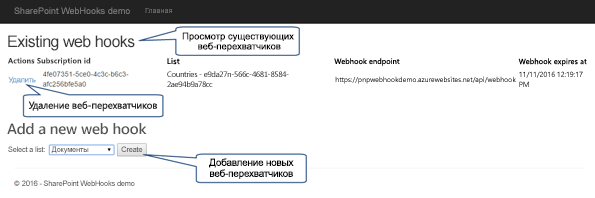

# <a name="sharepoint-webhooks-sample-reference-implementation"></a>Пример реализации веб-перехватчиков SharePoint

**Участник**: Берт Янсен (корпорация Майкрософт), рабочая группа SharePoint PnP Core.

Эталонная реализация PnP SharePoint демонстрирует способы использования веб-перехватчиков SharePoint в приложении. Веб-перехватчики реализованы так, что могут использоваться на предприятиях совместно с различными компонентами Microsoft Azure, такими как веб-задания Azure, SQL Server для Azure и очереди службы хранилища Azure для асинхронной обработки уведомлений о веб-заданиях.

Эталонная реализация работает только с [веб-перехватчиками для списков SharePoint](./lists/overview-sharepoint-list-webhooks.md). 

Вы также можете выполнить эти действия, посмотрев видео, добавленные в [канал SharePoint PnP на сайте YouTube](https://www.youtube.com/watch?v=j3hWCAI9R20).

<a href="https://www.youtube.com/watch?v=j3hWCAI9R20">

</a>

## <a name="applies-to"></a>Область применения

-  Office 365 Multi Tenant (MT).

## <a name="prerequisites"></a>Необходимые компоненты

Microsoft Azure используется для размещения различных компонентов, необходимых для реализации веб-перехватчиков Azure.

## <a name="source-code-for-this-reference-implementation"></a>Исходный код для данной эталонной реализации

Исходный код и другие материалы для эталонной реализации доступны двух видов: у нас есть версия приложения с размещением у поставщика SharePoint и приложение Azure AD для Office 365, которые можно найти в [репозитории GitHub с примерами решений для SharePoint](https://aka.ms/sp-webhooks-sample-reference). 

## <a name="deploying-the-reference-implementation"></a>Развертывание эталонной реализации

В приложении будет показано, как управлять веб-перехватчиками для списка SharePoint. Это приложение также содержит эталонную реализацию конечной точки службы веб-перехватчиков, которую можно повторно использовать в проектах веб-перехватчиков. 



В [руководстве по развертыванию эталонной реализации веб-перехватчиков в SharePoint](https://github.com/SharePoint/sp-dev-samples/blob/master/Samples/WebHooks.List/Deployment%20guide.md) перечислены этапы развертывания эталонной реализации с размещением у поставщика SharePoint. Чтобы развернуть приложение Azure AD для Office 365, воспользуйтесь [этими инструкциями](https://github.com/SharePoint/sp-dev-samples/blob/master/Samples/WebHooks.List.AzureAD/Deployment%20guide.md). В руководстве по развертыванию описано, как использовать функцию веб-API в качестве службы веб-перехвата. Дополнительные сведения об использовании функций Azure в этой эталонной реализации можно найти в [руководстве по функциям Azure](https://github.com/SharePoint/sp-dev-samples/blob/master/Samples/WebHooks.List.AzureAD/azure%20functions%20guide.md).

## <a name="introduction-to-webhooks"></a>Общие сведения о веб-перехватчиках

Веб-перехватчики используются для оповещения приложения об изменениях в SharePoint, которые оно должно отслеживать. Таким образом, приложению не нужно регулярно запрашивать информацию об изменениях. Веб-перехватчики оповещают приложение (**модель с активным источником данных**) о наличии каких-либо изменений. Веб-перехватчики не используются только в решениях корпорации Майкрософт. Это универсальный веб-стандарт, который используют и другие поставщики (например, WordPress, GitHub, MailChimp и другие).

### <a name="adding-a-webhook-to-your-sharepoint-list"></a>Добавление веб-перехватчика в список SharePoint

Эталонная реализация работает со списком SharePoint. Чтобы добавить веб-перехватчик в список SharePoint, приложение сначала создает подписку на веб-перехватчик, отправив запрос [`POST /_api/web/lists('list-id')/subscriptions`](./lists/create-subscription.md). Запрос включает перечисленные ниже данные.

* Полезные данные, определяющие список, для которого вы добавляете веб-перехватчик.
* Расположение URL-адреса службы веб-перехватчиков для отправки уведомлений.
* Дата окончания срока действия веб-перехватчика. 

Когда вы отправите SharePoint запрос на добавление веб-перехватчика, SharePoint проверит, существует ли конечная точка службы веб-перехватчиков, а затем отправит строку проверки в конечную точку службы. Предполагается, что конечная точка службы вернет строку проверки в течение 5 секунд. Если произойдет ошибка, создание веб-перехватчика будет отменено. Если выполнено развертывание службы, SharePoint возвратит сообщение HTTP 201 в ответ на запрос POST, который был изначально отправлен приложением. Полученные полезные данные содержат ИД новой подписки на веб-перехватчик.


Ознакомившись с эталонной реализацией, вы увидите, что все операции CRUD веб-перехватчиков объединяются в класс [WebHookManager](https://github.com/SharePoint/sp-dev-samples/blob/master/Samples/WebHooks.List/SharePoint.WebHooks.Common/WebHookManager.cs) проекта **SharePoint.WebHooks.Common**. Добавление веб-перехватчика выполняется с помощью метода **AddListWebHookAsync**:

```cs
/// <summary>
/// This method adds a webhook to a SharePoint list. Note that you need your webhook endpoint being passed into this method to be up and running and reachable from the internet
/// </summary>
/// <param name="siteUrl">Url of the site holding the list</param>
/// <param name="listId">Id of the list</param>
/// <param name="webHookEndPoint">Url of the webhook service endpoint (the one that will be called during an event)</param>
/// <param name="accessToken">Access token to authenticate against SharePoint</param>
/// <param name="validityInMonths">Optional webhook validity in months, defaults to 3 months, max is 6 months</param>
/// <returns>subscription ID of the new webhook</returns>
public async Task<SubscriptionModel> AddListWebHookAsync(string siteUrl, string listId, string webHookEndPoint, string accessToken, int validityInMonths = 3)
{
    // webhook add code...
}
```

При вызове SharePoint необходимо указать данные для проверки подлинности. В этом случае используется заголовок **Bearer** для проверки подлинности и **маркер доступа**. Чтобы получить маркер доступа, перехватите его с помощью обработчика событий **ExecutingWebRequest**:

```cs
ClientContext cc = null;

// Create SharePoint ClientContext object...

// Add ExecutingWebRequest event handler
cc.ExecutingWebRequest += Cc_ExecutingWebRequest;

// Capture the OAuth access token since we want to reuse that one in our REST requests
private void Cc_ExecutingWebRequest(object sender, WebRequestEventArgs e)
{
    this.accessToken = e.WebRequestExecutor.RequestHeaders.Get("Authorization").Replace("Bearer ", "");
}
```

### <a name="sharepoint-calls-out-to-your-webhook-service"></a>SharePoint вызывает службу веб-перехватчиков

Когда SharePoint обнаруживает изменение в списке, для которого вы создали подписку на веб-перехватчик, SharePoint вызывает конечную точку службы. При просмотре полезных данных из SharePoint обратите внимание на важные свойства, приведенные ниже.

Свойство|Описание
--------|-----------
**subscriptionId**|ИД подписки на веб-перехватчик. Этот идентификатор нужен, чтобы обновить подписку на веб-перехватчик (например, в случае продления срока действия веб-перехватчика).
**resource**|Идентификатор списка, в отношении которого произошло изменение.
**siteUrl**|Относительный URL-адрес сервера сайта с ресурсом, в отношении которого произошло изменение.

> [!NOTE]
> SharePoint отправляет уведомления только о том, что произошло изменение, не указывая при этом суть изменения. Так как вы получаете сведения о веб-сайте и списке, которые были изменены, это означает, что эту же конечную точку службы можно использовать для обработки событий веб-перехватчика, касающихся нескольких сайтов и списков.

При вызове службы важно, чтобы в течение 5 секунд в ответ вернулось сообщение HTTP 200. Далее в этой статье приведены дополнительные сведения о времени отклика, но фактически для этого необходима **асинхронная** обработка уведомлений. В данной эталонной реализации она обеспечивается использованием веб-заданий Azure и очередей службы хранилища Azure.


### <a name="grab-the-changes-your-service-needs-to-act-upon"></a>Захватите изменения, на которые должна воздействовать служба

На предыдущем этапе была вызвана конечная точка службы, но продукт SharePoint предоставил сведения только о том, где произошло изменение, а не о том, что было изменено. Чтобы понять, что было изменено, необходимо использовать API SharePoint `GetChanges()`, как показано на приведенном ниже изображении.


Дополнительные сведения о реализации `GetChanges()` в методе **ProcessNotification** вы найдете, открыв описание класса [ChangeManager](https://github.com/SharePoint/sp-dev-samples/blob/master/Samples/WebHooks.List/SharePoint.WebHooks.Common/ChangeManager.cs) в проекте **SharePoint.WebHooks.Common**. 

Чтобы не получать уведомления об одних и тех же изменениях несколько раз, необходимо сообщить SharePoint, из какой точки вы хотите узнавать об изменениях. Это можно сделать путем передачи маркера **changeToken**, применение которого предполагает, что конечная точка службы должна хранить последний **changeToken**, чтобы его можно было использовать при следующем вызове этой конечной точки.

Ниже приведены некоторые ключевые сведения об изменениях.

- SharePoint не вызывает службу в режиме реального времени. В случае изменения в списке, для которого предусмотрен веб-перехватчик, SharePoint поставит в очередь вызов веб-перехватчика. Один раз в минуту эта очередь читается и вызываются соответствующие конечные точки службы. Такая пакетная обработка запросов важна. Например, если произойдет одновременная отправка 1000 записей, пакетная обработка не допустит выполнение 1000 вызовов конечной точки со стороны SharePoint. Таким образом, вызов конечной точки происходит только один раз, но при вызове метода `GetChanges()` вы получаете 1000 событий изменения, которые необходимо обработать.
- Для обеспечения немедленного отклика важно, чтобы рабочая нагрузка конечной точки службы выполнялась асинхронно независимо от количества изменений. В данной эталонной реализации мы использовали возможности Azure: служба будет сериализовать входящие полезные данные и хранить их в очереди службы хранилища Azure, а веб-задание Azure будет непрерывно работать и проверять наличие сообщений в очереди. Когда в очереди будут находиться сообщения, веб-задание будет обрабатывать их и асинхронно выполнять логику.

### <a name="complete-end-to-end-flow"></a>Полный непрерывный поток

Приведенная ниже схема описывает полный непрерывный поток веб-перехватчика.


1. Приложение создает подписку на веб-перехватчик. После этого оно получает текущий маркер **changeToken** из списка, для которого был создан веб-перехватчик.
2. Приложение сохраняет **changeToken** в постоянном хранилище (в данном случае — SQL Azure).
3. В SharePoint происходит изменение, и SharePoint вызывает конечную точку службы.
4. Конечная точка службы сериализует запрос уведомления и ставит его в очередь хранилища.
5. Веб-задание видит сообщение в очереди и начинает выполнять логику его обработки.
6. Логика обработки сообщений получает маркер изменений, который использовался в последний раз, из постоянного хранилища.
7. Логика обработки сообщений использует API `GetChanges()`, чтобы определить суть изменения.
8. Возвращенные изменения обрабатываются, после чего приложение выполняет необходимые действия в соответствии с этими изменениями.
9. Наконец приложение сохраняет последний полученный маркер **changeToken**, чтобы в последующем не получать уже обработанных изменений.

## <a name="how-to-work-with-webhook-renewal"></a>Как работать с обновлением веб-перехватчика

Срок действия подписок на веб-перехватчик по умолчанию заканчивается через 6 месяцев или в день, указанный во время их создания. Часто требуется, чтобы веб-перехватчик был доступен на протяжении большего периода времени. Описанные ниже модели подходят для продления срока действия подписки на веб-перехватчик. Первая модель довольно простая, вторая же немного сложнее и требует размещения дополнительного веб-задания.

### <a name="basic-model"></a>Базовая модель

Вместе с уведомлением служба также получает сведения о сроке действия подписки. Если близится истечение срока ее действия, вы можете продлить его в логике обработки уведомлений. Эта модель предусмотрена в данной эталонной реализации и подходит в большинстве случаев. Но когда в списке, для которого вы создали подписку на веб-перехватчик, не происходит изменений на протяжении 6 месяцев, данную подписку невозможно будет продлить, и она будет удалена.

### <a name="reliable-but-more-complex-model"></a>Надежная, но более сложная модель

Создайте веб-задание, которое еженедельно будет считывать все ИД подписки из постоянного хранилища. Каждый раз поочередно расширяйте найденные подписки. 

> [!NOTE]
> Это веб-задание не входит в данную эталонную реализацию.

Фактическое обновление веб-перехватчика для списка SharePoint можно выполнить с помощью вызова REST ([`PATCH /_api/web/lists('list-id')/subscriptions(‘subscriptionID’)`](./lists/update-subscription.md)). В данной эталонной реализации обновление веб-перехватчиков реализуется в классе [WebHookManager](https://github.com/SharePoint/sp-dev-samples/blob/master/Samples/WebHooks.List/SharePoint.WebHooks.Common/WebHookManager.cs) проекта **SharePoint.WebHooks.Common**. Обновление веб-перехватчика выполняется с помощью метода **UpdateListWebHookAsync**:

```csharp
/// <summary>
/// Updates the expiration datetime (and notification URL) of an existing SharePoint list webhook
/// </summary>
/// <param name="siteUrl">Url of the site holding the list</param>
/// <param name="listId">Id of the list</param>
/// <param name="subscriptionId">Id of the webhook subscription that we need to update</param>
/// <param name="webHookEndPoint">Url of the webhook service endpoint (the one that will be called during an event)</param>
/// <param name="expirationDateTime">New webhook expiration date</param>
/// <param name="accessToken">Access token to authenticate against SharePoint</param>
/// <returns>true if successful, exception in case something went wrong</returns>
public async Task<bool> UpdateListWebHookAsync(string siteUrl, string listId, string subscriptionId, string webHookEndPoint, DateTime expirationDateTime, string accessToken)
{
    // webhook update code...
}
```

## <a name="debugging-webhooks"></a>Отладка веб-перехватчиков

Так как SharePoint вызывает конечную точку службы веб-перехватчиков, эта точка должна быть доступна для SharePoint, что немного усложняет разработку и отладку. Ниже приведены некоторые стратегии, которые можно использовать для упрощения работы.

* Во время первоначальной разработки предоставьте логике обработки службы собственные сериализованные полезные данные. Это позволит полностью проверить логику обработки без развертывания конечной точки службы (и даже без настройки веб-перехватчика).
* Если у вас есть доступ к ресурсам Azure, можно развернуть конечную точку в Azure с помощью отладочной сборки, а также настроить службу приложений Azure для отладки. Это позволит задать удаленную точку останова и выполнить удаленную отладку с помощью Visual Studio.
- Если вы не хотите развертывать службу во время разработки, необходимо использовать защищенный тоннель. Идея заключается в том, что вы сообщаете SharePoint, что служба уведомлений находится в общедоступной конечной точке. В клиенте установите компонент, который подключается к упомянутой общедоступной службе. Каждый раз, когда выполняется вызов общедоступной конечной точки, уведомляется этот клиентский компонент, после чего он передает полезные данные службе, работающей на localhost. [ngrok](https://ngrok.com/) — реализация инструмента защищенного тоннеля, который можно использовать для локальной отладки службы веб-перехватчиков.
