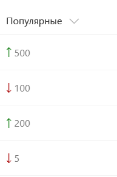
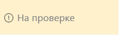

# <a name="use-column-formatting-to-customize-sharepoint"></a><span data-ttu-id="b565f-101">Форматирование столбцов в списках и библиотеках SharePoint</span><span class="sxs-lookup"><span data-stu-id="b565f-101">Use column formatting to customize SharePoint</span></span>

> [!IMPORTANT]
> <span data-ttu-id="b565f-102">Функция форматирования столбцов находится в разработке.</span><span class="sxs-lookup"><span data-stu-id="b565f-102">Column formatting is not yet in production.</span></span> <span data-ttu-id="b565f-103">Этот документ является предварительным и подлежит изменению.</span><span class="sxs-lookup"><span data-stu-id="b565f-103">This documentation is in preview and is subject to change.</span></span>

<span data-ttu-id="b565f-104">Форматирование столбцов позволяет настраивать поля в списках и библиотеках SharePoint.</span><span class="sxs-lookup"><span data-stu-id="b565f-104">You can use column formatting to customize how fields in SharePoint lists and libraries are displayed.</span></span> <span data-ttu-id="b565f-105">Для этого создается объект JSON, который описывает элементы, отображаемые при включении поля в список, и стили, применяемые к этим элементам.</span><span class="sxs-lookup"><span data-stu-id="b565f-105">To do this, you construct a JSON object that describes the elements that are displayed when a field is included in a list view, and the styles to be applied to those elements.</span></span> <span data-ttu-id="b565f-106">При форматировании столбцов данные в элементе списка или файле остаются неизменными. Изменяется только их внешний вид.</span><span class="sxs-lookup"><span data-stu-id="b565f-106">The column formatting does not change the data in the list item or file; it only changes how it’s displayed to users who browse the list.</span></span> <span data-ttu-id="b565f-107">Настраивать поля с помощью форматирования столбцов могут все, кто может создавать списки и управлять ими.</span><span class="sxs-lookup"><span data-stu-id="b565f-107">Anyone who can create and manage views in a list can use column formatting to configure how view fields are displayed.</span></span> 

<span data-ttu-id="b565f-108">Например, список с полями "Заголовок", "Трудозатраты", "Кому назначено" и "Состояние" без настройки может выглядеть так:</span><span class="sxs-lookup"><span data-stu-id="b565f-108">For example, a list with the fields Title, Effort, Assigned To, and Status with no customizations applied might look like this:</span></span> 


<span data-ttu-id="b565f-110">Список с полями "Трудозатраты", "Кому назначено" и "Состояние", настроенные с помощью форматирования столбцов, может выглядеть так:</span><span class="sxs-lookup"><span data-stu-id="b565f-110">A list with the appearance of the Effort, Assigned To, and Status fields customized via column formatting might look like this:</span></span>


## <a name="how-is-column-formatting-different-than-the-field-customizer"></a><span data-ttu-id="b565f-112">Чем форматирование столбцов отличается от настройщика полей?</span><span class="sxs-lookup"><span data-stu-id="b565f-112">How is column formatting different than the Field Customizer?</span></span>
<span data-ttu-id="b565f-113">Как форматирование столбцов, так и расширение [Настройщик полей SharePoint Framework](https://docs.microsoft.com/ru-RU/sharepoint/dev/spfx/extensions/get-started/building-simple-field-customizer) позволяют настраивать поля в списках SharePoint.</span><span class="sxs-lookup"><span data-stu-id="b565f-113">Both column formatting and the [SharePoint Framework Field Customizer](https://docs.microsoft.com/ru-RU/sharepoint/dev/spfx/extensions/get-started/building-simple-field-customizer) extension enable you to customize how fields in SharePoint lists are displayed.</span></span> <span data-ttu-id="b565f-114">Настройщик полей — универсальный инструмент, так как позволяет создавать любой код для управления отображением поля.</span><span class="sxs-lookup"><span data-stu-id="b565f-114">The Field Customizer is more powerful, because you can use it to write any code you want to control how a field is displayed.</span></span> <span data-ttu-id="b565f-115">Форматирование столбцов проще и доступнее,</span><span class="sxs-lookup"><span data-stu-id="b565f-115">Column formatting is more easily and broadly applied.</span></span> <span data-ttu-id="b565f-116">но не так универсально, так как не позволяет создавать пользовательский код и поддерживает только предопределенные элементы и атрибуты.</span><span class="sxs-lookup"><span data-stu-id="b565f-116">However, it is less flexible, because it does not allow for custom code; it only allows for certain predefined elements and attributes.</span></span> 

<span data-ttu-id="b565f-117">В таблице ниже сравниваются форматирование столбцов и настройщик полей.</span><span class="sxs-lookup"><span data-stu-id="b565f-117">The following table compares column formatting and the Field Customizer.</span></span>

| <span data-ttu-id="b565f-118">Тип поля</span><span class="sxs-lookup"><span data-stu-id="b565f-118">Field Type</span></span>        | <span data-ttu-id="b565f-119">Форматирование столбцов</span><span class="sxs-lookup"><span data-stu-id="b565f-119">Column formatting</span></span>          | <span data-ttu-id="b565f-120">Настройщик полей</span><span class="sxs-lookup"><span data-stu-id="b565f-120">Field Customizer changes</span></span>  |
| ------------- |:-------------| :-----|
| <span data-ttu-id="b565f-121">Условное форматирование на основе значений элементов и диапазонов значений</span><span class="sxs-lookup"><span data-stu-id="b565f-121">Conditional formatting based on item values and value ranges</span></span>      | <span data-ttu-id="b565f-122">Поддерживается</span><span class="sxs-lookup"><span data-stu-id="b565f-122">Supported</span></span> | <span data-ttu-id="b565f-123">Поддерживается</span><span class="sxs-lookup"><span data-stu-id="b565f-123">Supported</span></span> |
| <span data-ttu-id="b565f-124">Ссылки на действия</span><span class="sxs-lookup"><span data-stu-id="b565f-124">Action links</span></span>       | <span data-ttu-id="b565f-125">Поддержка статических гиперссылок, которые не запускают сценарии</span><span class="sxs-lookup"><span data-stu-id="b565f-125">Support for static hyperlinks that do not launch script</span></span>      |  <span data-ttu-id="b565f-126">Поддержка всех гиперссылок, в том числе запускающих пользовательские сценарии</span><span class="sxs-lookup"><span data-stu-id="b565f-126">Support for any hyperlink, including those that invoke custom script</span></span>   |
| <span data-ttu-id="b565f-127">Визуализация данных</span><span class="sxs-lookup"><span data-stu-id="b565f-127">Data visualizations</span></span> | <span data-ttu-id="b565f-128">Поддержка простой визуализации, которую можно выразить с помощью HTML и CSS</span><span class="sxs-lookup"><span data-stu-id="b565f-128">Support for simple visualizations that can be expressed using HTML and CSS</span></span>      |   <span data-ttu-id="b565f-129">Поддержка произвольной визуализации данных</span><span class="sxs-lookup"><span data-stu-id="b565f-129">Support for arbitrary data visualizations</span></span>  |

<span data-ttu-id="b565f-130">Обычно выполнить поставленную задачу проще и быстрее с помощью форматирования столбцов, чем с помощью настройщика полей.</span><span class="sxs-lookup"><span data-stu-id="b565f-130">If you can accomplish your scenario by using column formatting, it’s typically quicker and easier to do that than to use Field Customizer.</span></span> <span data-ttu-id="b565f-131">Создавать и публиковать настройки с помощью форматирования столбцов могут все, кто может создавать списки и управлять ими.</span><span class="sxs-lookup"><span data-stu-id="b565f-131">Anyone who can create and manage views in a list can use column formatting to create and publish customizations.</span></span> <span data-ttu-id="b565f-132">Используйте настройщик полей для более сложных задач, которые нельзя выполнить с помощью форматирования столбцов.</span><span class="sxs-lookup"><span data-stu-id="b565f-132">Use Field Customizer for more advanced scenarios that column formatting does not support.</span></span>

## <a name="get-started-with-column-formatting"></a><span data-ttu-id="b565f-133">Начало работы с форматированием столбцов</span><span class="sxs-lookup"><span data-stu-id="b565f-133">Get started with column formatting</span></span>
<span data-ttu-id="b565f-134">Чтобы открыть панель форматирования столбцов, откройте раскрывающееся меню под столбцом.</span><span class="sxs-lookup"><span data-stu-id="b565f-134">To open the column formatting pane, open the dropdown menu under a column.</span></span> <span data-ttu-id="b565f-135">В разделе **Параметры столбца** выберите **Форматировать этот столбец**.</span><span class="sxs-lookup"><span data-stu-id="b565f-135">Under **Column Settings**, choose **Format this column**.</span></span>

<span data-ttu-id="b565f-136">Если к выбранному столбцу еще не применялось форматирование, эта панель будет выглядеть вот так.</span><span class="sxs-lookup"><span data-stu-id="b565f-136">If no one has used column formatting on the column you selected, the pane will look like the following.</span></span>


<span data-ttu-id="b565f-138">Если форматирование не указано, поле будет отображаться как обычно.</span><span class="sxs-lookup"><span data-stu-id="b565f-138">A field with no formatting specified will use the default rendering.</span></span> <span data-ttu-id="b565f-139">Чтобы отформатировать столбец, введите в поле объект JSON.</span><span class="sxs-lookup"><span data-stu-id="b565f-139">To format a column, enter the column formatting JSON in the box.</span></span>

<span data-ttu-id="b565f-140">Чтобы просмотреть параметры форматирования, нажмите **Просмотреть**.</span><span class="sxs-lookup"><span data-stu-id="b565f-140">To preview the formatting, select **Preview**.</span></span> <span data-ttu-id="b565f-141">Чтобы сохранить изменения, нажмите **Сохранить**.</span><span class="sxs-lookup"><span data-stu-id="b565f-141">To commit your changes, select **Save**.</span></span> <span data-ttu-id="b565f-142">После сохранения изменений форматирование увидят все пользователи, просматривающие список.</span><span class="sxs-lookup"><span data-stu-id="b565f-142">When you save, anyone who views the list will see the customization that you applied.</span></span>

<span data-ttu-id="b565f-143">Самый простой способ отформатировать столбец — отредактировать пример и применить его к нужному полю.</span><span class="sxs-lookup"><span data-stu-id="b565f-143">The easiest way to use column formatting is to start from an example and edit it to apply to your specific field.</span></span> <span data-ttu-id="b565f-144">Следующие разделы содержат примеры, которые можно копировать, вставлять и редактировать.</span><span class="sxs-lookup"><span data-stu-id="b565f-144">The following sections contain examples that you can copy, paste, and edit for your scenarios.</span></span>

## <a name="display-field-values-basic"></a><span data-ttu-id="b565f-145">Отображение значений поля (базовые настройки)</span><span class="sxs-lookup"><span data-stu-id="b565f-145">Display field values (basic)</span></span>

<span data-ttu-id="b565f-146">Самый простой способ отформатировать столбец — вставить значение поля в элемент `<div />`.</span><span class="sxs-lookup"><span data-stu-id="b565f-146">The simplest column formatting is one that places the value of the field inside a `<div />` element.</span></span> <span data-ttu-id="b565f-147">Этот пример подходит для числовых и текстовых полей, а также полей выбора и даты.</span><span class="sxs-lookup"><span data-stu-id="b565f-147">This example works for number, text, choice, and date fields.</span></span>

```JSON
{
   "elmType": "div",
   "txtContent": "@currentField"
}
```
<span data-ttu-id="b565f-148">Извлечь значения полей некоторых типов немного сложнее.</span><span class="sxs-lookup"><span data-stu-id="b565f-148">Some field types require a bit of extra work to retrieve their values.</span></span> <span data-ttu-id="b565f-149">Поля пользователей представлены в системе в виде объектов, а отображаемое имя пользователя содержится в свойстве **Title**.</span><span class="sxs-lookup"><span data-stu-id="b565f-149">Person fields are represented in the system as objects, and a person’s display name is contained within that object’s **Title** property.</span></span> <span data-ttu-id="b565f-150">Это измененный пример, который подходит для поля пользователя.</span><span class="sxs-lookup"><span data-stu-id="b565f-150">This is the same example, modified to work with the person field.</span></span>

```JSON
{
   "elmType": "div",
   "txtContent": "@currentField.Title"
}
```
<span data-ttu-id="b565f-151">Поля подстановки также представлены в виде объектов. Отображаемый текст сохраняется в свойстве **lookupValue**.</span><span class="sxs-lookup"><span data-stu-id="b565f-151">Lookup fields are also represented as objects; the display text is stored in the **lookupValue** property.</span></span> <span data-ttu-id="b565f-152">Этот пример подходит для поля подстановки.</span><span class="sxs-lookup"><span data-stu-id="b565f-152">This example works with a lookup field.</span></span>

```JSON
{
   "elmType": "div",
   "txtContent": "@currentField.lookupValue"
}
```

## <a name="apply-conditional-formatting"></a><span data-ttu-id="b565f-153">Применение условного форматирования</span><span class="sxs-lookup"><span data-stu-id="b565f-153">Apply conditional formatting</span></span>
<span data-ttu-id="b565f-154">Форматирование столбцов позволяет применять стили, классы и значки к полям в зависимости от их значений.</span><span class="sxs-lookup"><span data-stu-id="b565f-154">You can use column formatting to apply styles, classes, and icons to fields, depending on the value inside those fields.</span></span>

### <a name="conditional-formatting-based-on-a-number-range-basic"></a><span data-ttu-id="b565f-155">Условное форматирование на основе диапазона чисел (базовые настройки)</span><span class="sxs-lookup"><span data-stu-id="b565f-155">Conditional formatting based on a number range (basic)</span></span>
<span data-ttu-id="b565f-156">Ниже показан пример условного форматирования, примененного к диапазону чисел.</span><span class="sxs-lookup"><span data-stu-id="b565f-156">The following image shows an example of conditional formatting applied to a number range.</span></span>


<span data-ttu-id="b565f-158">В этом примере условный оператор `?` используется для применения класса (`sp-field-severity--warning`) к родительскому элементу `<div />`, если значение в текущем поле меньше или равно 70.</span><span class="sxs-lookup"><span data-stu-id="b565f-158">This example uses the conditional operator `?` to apply a class (`sp-field-severity--warning`) to the parent `<div />` element when the  value in the current field is less than or equal to 70.</span></span>  <span data-ttu-id="b565f-159">В этом случае поле выделяется, если значение меньше или равно 70, и отображается как обычно, если оно больше 70.</span><span class="sxs-lookup"><span data-stu-id="b565f-159">This causes the field to be highlighted when the value is less than or equal to 70, and appear normally if it's greater than 70.</span></span>

```JSON
{
   "elmType": "div",
   "txtContent": "@currentField",
   "attributes": {
      "class": {
         "operator": "?",
         "operands": [
            {
               "operator": "<=",
               "operands": [
                  "@currentField",
                  70
               ]
            },
            "sp-field-severity--warning",
            ""
         ]
      }
   }
}
```

### <a name="conditional-formatting-based-on-the-value-in-a-text-or-choice-field-advanced"></a><span data-ttu-id="b565f-160">Условное форматирование на основе значения в текстовом поле или поле выбора (расширенные настройки)</span><span class="sxs-lookup"><span data-stu-id="b565f-160">Conditional formatting based on the value in a text or choice field (advanced)</span></span>

<span data-ttu-id="b565f-161">Ниже показан пример условного форматирования, примененного к полю текста или выбора.</span><span class="sxs-lookup"><span data-stu-id="b565f-161">The following image shows an example of conditional formatting applied to a text or choice field.</span></span>


<span data-ttu-id="b565f-163">Вы можете применить условное форматирование к полям текста или выбора, которые могут содержать фиксированный набор значений.</span><span class="sxs-lookup"><span data-stu-id="b565f-163">You can apply conditional formatting to text or choice fields that might contain a fixed set of values.</span></span> <span data-ttu-id="b565f-164">В примере ниже применяются различные классы в зависимости от того, какое значение имеет поле: "Готово", "Проверка", "Заблокировано" или другое.</span><span class="sxs-lookup"><span data-stu-id="b565f-164">The following example applies different classes depending on whether the value of the field is Done, In Review, Blocked, or another value.</span></span> <span data-ttu-id="b565f-165">В этом примере класс CSS (`sp-field-severity--low, sp-field-severity--good, sp-field-severity--warning, sp-field-severity--blocked`) применяется к элементу `<div />` на основе значения поля.</span><span class="sxs-lookup"><span data-stu-id="b565f-165">This example applies a CSS class (`sp-field-severity--low, sp-field-severity--good, sp-field-severity--warning, sp-field-severity--blocked`) to the  `<div />` based on the field's value.</span></span> <span data-ttu-id="b565f-166">Затем элемент `<span />` выводится с атрибутом `IconName`.</span><span class="sxs-lookup"><span data-stu-id="b565f-166">Then, it outputs a `<span />` element with an `IconName` attribute.</span></span> <span data-ttu-id="b565f-167">Этот атрибут применяет другой класс CSS к элементу `<span />`, внутри которого отображается значок [Office UI Fabric](https://dev.office.com/fabric#/).</span><span class="sxs-lookup"><span data-stu-id="b565f-167">This attribute applies another CSS class to that `<span />` that shows an [Office UI Fabric](https://dev.office.com/fabric#/) icon inside that element.</span></span> <span data-ttu-id="b565f-168">Наконец, выводится другой элемент `<span />`, содержащий значение в поле.</span><span class="sxs-lookup"><span data-stu-id="b565f-168">Finally, another `<span />` element is outputted that contains the value inside the field.</span></span>

<span data-ttu-id="b565f-169">Используйте этот шаблон, чтобы сопоставить разные значения с различными степенями срочности и серьезности.</span><span class="sxs-lookup"><span data-stu-id="b565f-169">This pattern is useful when you want different values to map to different levels of urgency or severity.</span></span> <span data-ttu-id="b565f-170">Вы можете отредактировать этот пример, чтобы указать собственные значения полей, а также стили и значки, которые необходимо сопоставить с этими значениями.</span><span class="sxs-lookup"><span data-stu-id="b565f-170">You can start from this example and edit it to specify your own field values and the styles and icons that should map to those values.</span></span>
<!-- The schema URL will need to be updated when it is changed from customformatter to columnformatting -->
```JSON
{
    "$schema": "http://columnformatting.sharepointpnp.com/columnFormattingSchema.json",
    "debugMode": true,
    "elmType": "div",
    "attributes": {
        "class": {
            "operator": "?",
            "operands": [
                {
                    "operator": "==",
                    "operands": [
                        {
                            "operator": "toString()",
                            "operands": [
                                "@currentField"
                            ]
                        },
                        "Done"
                    ]
                },
                "sp-field-severity--good",
                {
                    "operator": "?",
                    "operands": [
                        {
                            "operator": "==",
                            "operands": [
                                {
                                    "operator": "toString()",
                                    "operands": [
                                        "@currentField"
                                    ]
                                },
                                "In progress"
                            ]
                        },
                        "sp-field-severity--low",
                        {
                            "operator": "?",
                            "operands": [
                                {
                                    "operator": "==",
                                    "operands": [
                                        {
                                            "operator": "toString()",
                                            "operands": [
                                                "@currentField"
                                            ]
                                        },
                                        "In review"
                                    ]
                                },
                                "sp-field-severity--warning",
                                {
                                    "operator": "?",
                                    "operands": [
                                        {
                                            "operator": "==",
                                            "operands": [
                                                {
                                                    "operator": "toString()",
                                                    "operands": [
                                                        "@currentField"
                                                    ]
                                                },
                                                "Blocked"
                                            ]
                                        },
                                        "sp-field-severity--severeWarning",
                                        "sp-field-severity--blocked"
                                    ]
                                }
                            ]
                        }
                    ]
                }
            ]
        }
    },
    "children": [
        {
            "elmType": "span",
            "style": {
                "display": "inline-block",
                "padding": "0 4px"
            },
            "attributes": {
                "iconName": {
                    "operator": "?",
                    "operands": [
                        {
                            "operator": "==",
                            "operands": [
                                {
                                    "operator": "toString()",
                                    "operands": [
                                        "@currentField"
                                    ]
                                },
                                "Done"
                            ]
                        },
                        "CheckMark",
                        {
                            "operator": "?",
                            "operands": [
                                {
                                    "operator": "==",
                                    "operands": [
                                        {
                                            "operator": "toString()",
                                            "operands": [
                                                "@currentField"
                                            ]
                                        },
                                        "In progress"
                                    ]
                                },
                                "Forward",
                                {
                                    "operator": "?",
                                    "operands": [
                                        {
                                            "operator": "==",
                                            "operands": [
                                                {
                                                    "operator": "toString()",
                                                    "operands": [
                                                        "@currentField"
                                                    ]
                                                },
                                                "In review"
                                            ]
                                        },
                                        "Error",
                                        {
                                            "operator": "?",
                                            "operands": [
                                                {
                                                    "operator": "==",
                                                    "operands": [
                                                        {
                                                            "operator": "toString()",
                                                            "operands": [
                                                                "@currentField"
                                                            ]
                                                        },
                                                        "Has issues"
                                                    ]
                                                },
                                                "Warning",
                                                "ErrorBadge"
                                            ]
                                        }
                                    ]
                                }
                            ]
                        }
                    ]
                }
            }
        },
        {
            "elmType": "span",
            "txtContent": "@currentField"
        }
    ]
}

```

## <a name="apply-formatting-based-on-date-ranges"></a><span data-ttu-id="b565f-171">Применение форматирования на основе диапазонов дат</span><span class="sxs-lookup"><span data-stu-id="b565f-171">Apply formatting based on date ranges</span></span>
<span data-ttu-id="b565f-172">Так как даты часто используются для отслеживания крайних сроков и временных шкал ключевых проектов, форматирование часто применяется на основе значения в поле даты и времени.</span><span class="sxs-lookup"><span data-stu-id="b565f-172">Because dates are often used to track deadlines and key project timelines, a common scenario is to apply formatting based on the value in a date/time field.</span></span> <span data-ttu-id="b565f-173">Чтобы применить форматирование на основе значения этого поля, используйте приведенные ниже шаблоны.</span><span class="sxs-lookup"><span data-stu-id="b565f-173">To apply formatting based on the value in a date/time field, apply the following patterns.</span></span>

### <a name="formatting-an-item-when-a-date-column-is-before-or-after-todays-date-advanced"></a><span data-ttu-id="b565f-174">Форматирование элемента, если дата в столбце предшествует сегодняшней дате или наступает после нее (расширенные настройки)</span><span class="sxs-lookup"><span data-stu-id="b565f-174">Formatting an item when a date column is before or after today's date (advanced)</span></span>

<span data-ttu-id="b565f-175">На изображении ниже приведено поле, к которому применено условное форматирование даты.</span><span class="sxs-lookup"><span data-stu-id="b565f-175">The following image shows a field with conditional date formatting applied.</span></span>


<span data-ttu-id="b565f-177">В этом примере поле текущей даты окрашивается в красный цвет, если значение в поле "Дата выполнения" элемента предшествует текущим дате и времени.</span><span class="sxs-lookup"><span data-stu-id="b565f-177">This example colors the current field red when the value inside an item's DueDate is before the current date/time.</span></span> <span data-ttu-id="b565f-178">В отличие от некоторых предыдущих примеров, в этом примере форматирование применяется к одному полю на основе значения в другом поле.</span><span class="sxs-lookup"><span data-stu-id="b565f-178">Unlike some of the previous examples, this example applies formatting to one field by looking at the value inside another field.</span></span> <span data-ttu-id="b565f-179">Обратите внимание, что для ссылки на поле "Дата выполнения" используется синтаксис [$FieldName].</span><span class="sxs-lookup"><span data-stu-id="b565f-179">Note that DueDate is referenced using the [$FieldName] syntax.</span></span> <span data-ttu-id="b565f-180">FieldName — это внутреннее имя поля.</span><span class="sxs-lookup"><span data-stu-id="b565f-180">FieldName is assumed to be the internal name of the field.</span></span> <span data-ttu-id="b565f-181">В этом примере также используется специальное значение `@now`, которое можно использовать в полях даты и времени. Это значение сопоставляется с текущими датой и временем, которые определяются при загрузке списка.</span><span class="sxs-lookup"><span data-stu-id="b565f-181">This example also takes advantage of a special value that can be used in date/time fields - `@now`, which resolves to the current date/time, evaluated when the user loads the list view.</span></span>

```JSON
{

   "elmType": "div",
   "txtContent": "@currentField",
   "style": {
      "color": {
         "operator": "?",
         "operands": [
            {
               "operator": "<=",
               "operands": [
                  "[$DueDate]",
                  "@now"
               ]
            },
            "#ff0000",
            ""
         ]
      }
   }
}
```

### <a name="formatting-items-based-on-arbitrary-dates-advanced"></a><span data-ttu-id="b565f-182">Форматирование элементов на основе произвольных дат (расширенные настройки)</span><span class="sxs-lookup"><span data-stu-id="b565f-182">Formatting items based on arbitrary dates (advanced)</span></span>
<span data-ttu-id="b565f-183">Чтобы сравнить значение поля даты и времени с датой, отличной от `@now`, используйте шаблон, приведенный в примере ниже.</span><span class="sxs-lookup"><span data-stu-id="b565f-183">To compare the value of a date/time field against a date that's not `@now`, follow the pattern in the following example.</span></span> <span data-ttu-id="b565f-184">Здесь поле текущей даты окрашивается в красный цвет, если дата выполнения назначена на завтра или ранее.</span><span class="sxs-lookup"><span data-stu-id="b565f-184">The following example colors the current field red if the due date was <= tomorrow.</span></span> <span data-ttu-id="b565f-185">Для этого используются математические операции с датой.</span><span class="sxs-lookup"><span data-stu-id="b565f-185">This is accomplished using date math.</span></span> <span data-ttu-id="b565f-186">Вы можете добавить миллисекунды к любой дате, чтобы получить новую дату.</span><span class="sxs-lookup"><span data-stu-id="b565f-186">You can add milliseconds to any date, and the result will be a new date.</span></span> <span data-ttu-id="b565f-187">Например, чтобы добавить к дате один день, выполните уравнение (246 060*1000 = 86 400 000).</span><span class="sxs-lookup"><span data-stu-id="b565f-187">For example, to add a day to a date, you'd add (246060*1000 = 86,400,000).</span></span> 
```JSON
{
   "elmType": "div",
   "txtContent": "@currentField",
   "style": {
      "color": {
         "operator": "?",
         "operands": [
            {
               "operator": "<=",
               "operands": [
                  "[$DueDate]",
                  {
                     "operator": "+",
                     "operands": [
                        "@now",
                        86400000
                     ]
                  }
               ]
            },
            "#ff0000",
            ""
         ]
      }
   }
}
```
<span data-ttu-id="b565f-188">Чтобы сравнить значение поля даты и времени с другой константой даты, преобразуйте строку в дату с помощью метода **Date()**.</span><span class="sxs-lookup"><span data-stu-id="b565f-188">To compare a date/time field value against another date constant, use the **Date()** method to convert a string to a date.</span></span> <span data-ttu-id="b565f-189">В примере ниже поле текущей даты окрашивается в красный цвет, если значение в поле "Дата выполнения" предшествует 22.03.2017.</span><span class="sxs-lookup"><span data-stu-id="b565f-189">The following example colors the current field red if the value in the DueDate field is before 3/22/2017.</span></span>
```JSON
{
   "elmType": "div",
   "txtContent": "@currentField",
   "style": {
      "color": {
         "operator": "?",
         "operands": [
            {
               "operator": "<=",
               "operands": [
                  "[$DueDate]",
                  {
                     "operator": "Date()",
                     "operands": [
                        "3/22/2017"
                     ]
                  }
               ]
            },
            "#ff0000",
            ""
         ]
      }
   }
}
```

## <a name="create-clickable-actions"></a><span data-ttu-id="b565f-190">Создание интерактивных действий</span><span class="sxs-lookup"><span data-stu-id="b565f-190">Create clickable actions</span></span>
<span data-ttu-id="b565f-191">С помощью форматирования столбцов можно показывать гиперссылки для перехода на другие веб-страницы или запуска специальных функций.</span><span class="sxs-lookup"><span data-stu-id="b565f-191">You can use column formatting to provide hyperlinks that go to other web pages, or start custom functionality.</span></span> <span data-ttu-id="b565f-192">Можно показывать только статические ссылки `http://`, параметризуемые с помощью значений из полей в списке.</span><span class="sxs-lookup"><span data-stu-id="b565f-192">This functionality is limited to static `http://` links that can be paramaterized with values from fields in the list.</span></span> <span data-ttu-id="b565f-193">Форматирование столбцов невозможно использовать для вывода ссылок на протоколы, отличные от `http://`.</span><span class="sxs-lookup"><span data-stu-id="b565f-193">You can't use column formatting to output links to protocols other than `http://`.</span></span>

### <a name="turn-field-values-into-hyperlinks-basic"></a><span data-ttu-id="b565f-194">Преобразование значения полей в гиперссылки (базовые настройки)</span><span class="sxs-lookup"><span data-stu-id="b565f-194">Turn field values into hyperlinks (basic)</span></span>
<span data-ttu-id="b565f-195">В этом примере показано, как преобразовать текстовое поле с финансовыми символами в гиперссылку, которая позволяет перейти на страницу Yahoo Finance с актуальными котировками для соответствующих символов.</span><span class="sxs-lookup"><span data-stu-id="b565f-195">This example shows how to turn a text field that contains stock ticker symbols into a hyperlink that targets the Yahoo Finance real-time quotes page for that stock ticker.</span></span> <span data-ttu-id="b565f-196">В этом примере используется оператор `+`, позволяющий добавить значение текущего поля к статической гиперссылке <a>http://finance.yahoo.com/quote/</a>.</span><span class="sxs-lookup"><span data-stu-id="b565f-196">The example uses a `+` operator that appends the current field value to the static hyperlink <a>http://finance.yahoo.com/quote/</a>.</span></span> <span data-ttu-id="b565f-197">Этот шаблон также можно использовать, если вы хотите предоставить пользователям возможность просматривать контекстную информацию, связанную с элементом, или запустить бизнес-процесс для текущего элемента, если эта информация или процесс доступны по гиперссылке, параметризуемой с помощью значений из элемента списка.</span><span class="sxs-lookup"><span data-stu-id="b565f-197">You can extend this pattern to any scenario in which you want users to view contextual information related to an item, or you want to start a business process on the current item, as long as the information or process can be accessed via a hyperlink parameterized with values from the list item.</span></span>


```JSON
{
   "elmType": "a",
   "txtContent": "@currentField",
   "attributes": {
      "target": "_blank",
      "href": {
         "operator": "+",
         "operands": [
            "http://finance.yahoo.com/quote/",
            "@currentField"
         ]
      }
   }
}
```
### <a name="add-an-action-button-to-a-field-advanced"></a><span data-ttu-id="b565f-199">Добавление в поле кнопки действия (расширенные настройки)</span><span class="sxs-lookup"><span data-stu-id="b565f-199">Add an action button to a field (advanced)</span></span>
<span data-ttu-id="b565f-200">На рисунке ниже приведены кнопки действия, добавленные в поле.</span><span class="sxs-lookup"><span data-stu-id="b565f-200">The following image shows action buttons added to a field.</span></span>


<span data-ttu-id="b565f-202">С помощью форматирования столбцов можно отображать ссылки на быстрые действия рядом с полями.</span><span class="sxs-lookup"><span data-stu-id="b565f-202">You can use column formatting to render quick action links next to fields.</span></span> <span data-ttu-id="b565f-203">В этом примере, предназначенном для поля пользователя, отображаются два элемента в родительском элементе `<div />`:</span><span class="sxs-lookup"><span data-stu-id="b565f-203">The following example, intended for a person field, renders two elements inside the parent `<div />` element:</span></span>

- <span data-ttu-id="b565f-204">элемент `<span />`, содержащий отображаемое имя пользователя;</span><span class="sxs-lookup"><span data-stu-id="b565f-204">A `<span />` element that contains the person’s display name.</span></span>
- <span data-ttu-id="b565f-205">элемент `<a />`, открывающий ссылку mailto:, которую можно использовать для создания письма, тема и основной текст которого динамически заполняются с помощью метаданных элемента.</span><span class="sxs-lookup"><span data-stu-id="b565f-205">An `<a />` element that opens a mailto: link that creates an email with a subject and body populated dynamically via item metadata.</span></span> <span data-ttu-id="b565f-206">Для оформления элемента `<a />` используются классы [Fabric](https://developer.microsoft.com/ru-RU/fabric) `ms-Icon`, `ms-Icon—Mail` и `ms-QuickAction`, благодаря чему он похож на интерактивный значок электронной почты.</span><span class="sxs-lookup"><span data-stu-id="b565f-206">The `<a />` element is styled using the `ms-Icon`, `ms-Icon—Mail`, and `ms-QuickAction` [Fabric](https://developer.microsoft.com/ru-RU/fabric) classes to make it look like a clickable email icon.</span></span> 

```JSON
{
    "elmType": "div",
    "children": [
        {
            "elmType": "span",
            "style": {
                "padding-right": "8px"
            },
            "txtContent": "@currentField.title"
        },
        {
            "elmType": "a",
            "attributes": {
                "iconName": "Mail",
                "class": "sp-field-quickActions",
                "href": {
                    "operator": "+",
                    "operands": [
                        "mailto:",
                        "@currentField.email",
                        "?subject=Task status&body=Hey, how is your task coming along?.\r\n---\r\n",
                        "@currentField.title",
                        "\r\nClick this link for more info. http://contoso.sharepoint.com/sites/ConferencePrep/Tasks/Prep/DispForm.aspx?ID=",
                        "[$ID]"
                    ]
                }
            }
        }
    ]
}
```
## <a name="create-simple-data-visualizations"></a><span data-ttu-id="b565f-207">Создание простой визуализации данных</span><span class="sxs-lookup"><span data-stu-id="b565f-207">Create simple data visualizations</span></span>
<span data-ttu-id="b565f-208">Форматирование столбцов позволяет сочетать условные и арифметические операции для выполнения базовой визуализации данных.</span><span class="sxs-lookup"><span data-stu-id="b565f-208">Use column formatting to combine conditional and arithmetical operations to achieve basic data visualizations.</span></span>

### <a name="format-a-number-column-as-a-data-bar-advanced"></a><span data-ttu-id="b565f-209">Форматирование числового столбца в виде гистограммы (расширенные настройки)</span><span class="sxs-lookup"><span data-stu-id="b565f-209">Format a number column as a data bar (advanced)</span></span>
<span data-ttu-id="b565f-210">На рисунке ниже приведен числовой столбец, отформатированный в виде гистограммы.</span><span class="sxs-lookup"><span data-stu-id="b565f-210">The following image shows a number column formatted as a data bar.</span></span>


<span data-ttu-id="b565f-212">В этом примере для визуализации числового поля `@currentField` в виде гистограммы применяются стили `background-color` и `border-top`.</span><span class="sxs-lookup"><span data-stu-id="b565f-212">This example applies `background-color` and `border-top` styles to create a data bar visualization of `@currentField`, which is a number field.</span></span> <span data-ttu-id="b565f-213">Размер столбцов зависит от значения атрибута `width`: `100%`, если значение больше 20, и `(@currentField * 5)%`, если значение меньше 10.</span><span class="sxs-lookup"><span data-stu-id="b565f-213">The bars are sized differently for different values based on the way the `width` attribute is set - it's set to `100%` when the value is greater than 20, and `(@currentField * 5)%` when there value is less than 10.</span></span> <span data-ttu-id="b565f-214">Таким образом, ширина гистограммы для значений 1 составляет 5 %, для значений 2 — 10 % и т. д.</span><span class="sxs-lookup"><span data-stu-id="b565f-214">This achieves a width of 5% for the data bar for values of 1, 10% for values of 2, and so on.</span></span> <span data-ttu-id="b565f-215">Чтобы применить этот пример к своему числовому столбцу, вы можете настроить условие границы (`20`) в соответствии с максимальным предполагаемым значением в поле, а также множитель (`5`), чтобы указать, на сколько должен увеличиваться столбец в зависимости от значения в поле.</span><span class="sxs-lookup"><span data-stu-id="b565f-215">To fit this example to your number column, you can adjust the boundary condition (`20`) to match the maximum anticipated value inside the field, and the multiplier (`5`) to specify how much the bar should grow depending on the value inside the field.</span></span>
```JSON
{
  "debugMode": true,
  "elmType": "div",
  "txtContent": "@currentField",
  "attributes": {
   "class": "sp-field-dataBars"
  },
  "style": {
    "width": {
      "operator": "?",
      "operands": [
        {
          "operator": ">",
          "operands": [
            "@currentField",
            "20"
          ]
        },
        "100%",
        {
          "operator": "+",
          "operands": [
            {
              "operator": "toString()",
              "operands": [
                {
                  "operator": "*",
                  "operands": [
                    "@currentField",
                    5
                  ]
                }
              ]
            },
            "%"
          ]
        }
      ]
    }
  }
}
```

### <a name="show-trending-uptrending-down-icons-advanced"></a><span data-ttu-id="b565f-216">Отображение значков тенденций к увеличению и уменьшению (расширенные настройки)</span><span class="sxs-lookup"><span data-stu-id="b565f-216">Show trending up/trending down icons (advanced)</span></span>
<span data-ttu-id="b565f-217">Ниже показан список, к которому добавлены значки тенденций к увеличению и уменьшению.</span><span class="sxs-lookup"><span data-stu-id="b565f-217">The following image shows a list with trending up/trending down icons added.</span></span>



<span data-ttu-id="b565f-219">В этом примере используются два числовых поля `Before` и `After`, значения которых можно сравнить.</span><span class="sxs-lookup"><span data-stu-id="b565f-219">This example relies on two number fields, `Before` and `After`, for which the values can be compared.</span></span> <span data-ttu-id="b565f-220">Соответствующий значок тенденции отображается рядом с полем `After` в зависимости от значения этого поля по сравнению со значением в поле `Before`.</span><span class="sxs-lookup"><span data-stu-id="b565f-220">It shows the appropriate trending icon next to the `After` field, depending on that field's value compared to the value in `Before`.</span></span>  <span data-ttu-id="b565f-221">Если значение поля `After` выше, используется `sp-field-trending--up`, а если значение поля `After` ниже, используется `sp-field-trending--down`.</span><span class="sxs-lookup"><span data-stu-id="b565f-221">`sp-field-trending--up` is used when `After`'s value is higher; `sp-field-trending--down` is used when `After`'s value is lower.</span></span>

```JSON
{
    "debugMode": true,
    "elmType": "div",
    "children": [
        {
            "elmType": "span",
            "attributes": {
                "class": {
                    "operator": "?",
                    "operands": [
                        {
                            "operator": ">",
                            "operands": [
                                "[$After]",
                                "[$Before]"
                            ]
                        },
                        "sp-field-trending--up",
                        "sp-field-trending--down"
                    ]
                },
                "iconName": {
                    "operator": "?",
                    "operands": [
                        {
                            "operator": ">",
                            "operands": [
                                "[$After]",
                                "[$Before]"
                            ]
                        },
                        "SortUp",
                        {
                            "operator": "?",
                            "operands": [
                                {
                                    "operator": "<",
                                    "operands": [
                                        "[$After]",
                                        "[$Before]"
                                    ]
                                },
                                "SortDown",
                                ""
                            ]
                        }
                    ]
                }
            }
        },
        {
            "elmType": "span",
            "txtContent": "[$After]"
        }
    ]
}
```

## <a name="supported-column-types"></a><span data-ttu-id="b565f-222">Поддерживаемые типы столбцов</span><span class="sxs-lookup"><span data-stu-id="b565f-222">Supported Column Types</span></span>
<span data-ttu-id="b565f-223">Форматировать можно следующие типы столбцов:</span><span class="sxs-lookup"><span data-stu-id="b565f-223">The following column types support column formatting:</span></span>
* <span data-ttu-id="b565f-224">Однострочный текст</span><span class="sxs-lookup"><span data-stu-id="b565f-224">Single line of text</span></span> 
* <span data-ttu-id="b565f-225">Число</span><span class="sxs-lookup"><span data-stu-id="b565f-225">Number</span></span>
* <span data-ttu-id="b565f-226">Выбор</span><span class="sxs-lookup"><span data-stu-id="b565f-226">Choice</span></span>
* <span data-ttu-id="b565f-227">Пользователь или группа</span><span class="sxs-lookup"><span data-stu-id="b565f-227">Person or Group</span></span>
* <span data-ttu-id="b565f-228">Да/нет</span><span class="sxs-lookup"><span data-stu-id="b565f-228">Yes/No</span></span>
* <span data-ttu-id="b565f-229">Гиперссылка</span><span class="sxs-lookup"><span data-stu-id="b565f-229">Hyperlink</span></span> 
* <span data-ttu-id="b565f-230">Рисунок</span><span class="sxs-lookup"><span data-stu-id="b565f-230">Picture</span></span>
* <span data-ttu-id="b565f-231">Дата и время</span><span class="sxs-lookup"><span data-stu-id="b565f-231">Date/Time</span></span>
* <span data-ttu-id="b565f-232">Подстановка</span><span class="sxs-lookup"><span data-stu-id="b565f-232">Lookup</span></span>
* <span data-ttu-id="b565f-233">Заголовок (в списках)</span><span class="sxs-lookup"><span data-stu-id="b565f-233">Title (in Lists)</span></span>

<span data-ttu-id="b565f-234">Следующие типы столбцов не поддерживаются:</span><span class="sxs-lookup"><span data-stu-id="b565f-234">The following command capabilities are currently supported.</span></span>
* <span data-ttu-id="b565f-235">Управляемые метаданные</span><span class="sxs-lookup"><span data-stu-id="b565f-235">Managed metadata</span></span>
* <span data-ttu-id="b565f-236">Имя файла (в библиотеках документов)</span><span class="sxs-lookup"><span data-stu-id="b565f-236">Filename (in Document Libraries)</span></span>
* <span data-ttu-id="b565f-237">Вычисляемый</span><span class="sxs-lookup"><span data-stu-id="b565f-237">Calculated</span></span>
* <span data-ttu-id="b565f-238">Метка хранения</span><span class="sxs-lookup"><span data-stu-id="b565f-238">Retention Label</span></span>

## <a name="style-guidelines"></a><span data-ttu-id="b565f-239">Рекомендации по стилю</span><span class="sxs-lookup"><span data-stu-id="b565f-239">Style guidelines</span></span>

### <a name="predefined-classes"></a><span data-ttu-id="b565f-240">Предопределенные классы</span><span class="sxs-lookup"><span data-stu-id="b565f-240">Predefined classes</span></span>
<span data-ttu-id="b565f-241">Вы можете использовать указанные ниже предопределенные классы.</span><span class="sxs-lookup"><span data-stu-id="b565f-241">You can use the following predefined classes for several common scenarios.</span></span>

| <span data-ttu-id="b565f-242">Имя класса</span><span class="sxs-lookup"><span data-stu-id="b565f-242">Class name</span></span> | <span data-ttu-id="b565f-243">Снимок экрана</span><span class="sxs-lookup"><span data-stu-id="b565f-243">Screenshot</span></span> |
| ------------- |:-------------|
| <span data-ttu-id="b565f-244">sp-field-customFormatBackground</span><span class="sxs-lookup"><span data-stu-id="b565f-244">sp-field-customFormatBackground</span></span> |<span data-ttu-id="b565f-245">Указывает параметры заполнения и поля для всех классов, использующих фон.</span><span class="sxs-lookup"><span data-stu-id="b565f-245">Specifies the padding and margins for all classes that use backgrounds.</span></span> |
| <span data-ttu-id="b565f-246">sp-field-severity--good</span><span class="sxs-lookup"><span data-stu-id="b565f-246">sp-field-severity--good</span></span> | |
| <span data-ttu-id="b565f-248">sp-field-severity--low</span><span class="sxs-lookup"><span data-stu-id="b565f-248">sp-field-severity--low</span></span> | |
| <span data-ttu-id="b565f-250">sp-field-severity--warning</span><span class="sxs-lookup"><span data-stu-id="b565f-250">sp-field-severity--warning</span></span> |  |
| <span data-ttu-id="b565f-252">sp-field-severity--severeWarning</span><span class="sxs-lookup"><span data-stu-id="b565f-252">sp-field-severity--severeWarning</span></span> |  |
| <span data-ttu-id="b565f-254">sp-field-severity--blocked</span><span class="sxs-lookup"><span data-stu-id="b565f-254">sp-field-severity--blocked</span></span> |  |
| <span data-ttu-id="b565f-256">sp-field-dataBars</span><span class="sxs-lookup"><span data-stu-id="b565f-256">sp-field-dataBars</span></span> | |
| <span data-ttu-id="b565f-258">sp-field-trending--up</span><span class="sxs-lookup"><span data-stu-id="b565f-258">sp-field-trending--up</span></span> | |
| <span data-ttu-id="b565f-260">sp-field-trending--down</span><span class="sxs-lookup"><span data-stu-id="b565f-260">sp-field-trending--down</span></span> | |
| <span data-ttu-id="b565f-262">sp-field-quickAction</span><span class="sxs-lookup"><span data-stu-id="b565f-262">sp-field-quickAction</span></span> | |

## <a name="predefined-icons"></a><span data-ttu-id="b565f-264">Предопределенные значки</span><span class="sxs-lookup"><span data-stu-id="b565f-264">Predefined icons</span></span>

<span data-ttu-id="b565f-265">Вы можете использовать предопределенные значки из Office UI Fabric.</span><span class="sxs-lookup"><span data-stu-id="b565f-265">You can use predefined icons from Office UI Fabric.</span></span> <span data-ttu-id="b565f-266">Дополнительные сведения см. на [веб-сайте Fabric](https://dev.office.com/fabric#/styles/icons).</span><span class="sxs-lookup"><span data-stu-id="b565f-266">For details, see the [Fabric website](https://dev.office.com/fabric#/styles/icons).</span></span> 

## <a name="creating-custom-json"></a><span data-ttu-id="b565f-267">Создание собственной нотации JSON</span><span class="sxs-lookup"><span data-stu-id="b565f-267">Creating custom JSON</span></span>
<span data-ttu-id="b565f-268">Вы можете легко создать собственную нотацию JSON для форматирования столбцов, если понимаете схему.</span><span class="sxs-lookup"><span data-stu-id="b565f-268">Creating custom column formatting JSON from scratch is simple if you understand the schema.</span></span> <span data-ttu-id="b565f-269">Чтобы создать собственные параметры форматирования столбцов:</span><span class="sxs-lookup"><span data-stu-id="b565f-269">To create your own custom column formatting:</span></span>

1. <span data-ttu-id="b565f-270">[Скачайте Visual Studio Code](https://code.visualstudio.com/Download).</span><span class="sxs-lookup"><span data-stu-id="b565f-270">[Visual Studio Code](https://code.visualstudio.com/Download)</span></span> <span data-ttu-id="b565f-271">Это быстро и бесплатно.</span><span class="sxs-lookup"><span data-stu-id="b565f-271">It's free and fast to download.</span></span> 

2. <span data-ttu-id="b565f-272">В Visual Studio Code создайте пустой файл и сохраните его с расширением JSON.</span><span class="sxs-lookup"><span data-stu-id="b565f-272">In Visual Studio Code, create a new file, and save the empty with a .json file extension.</span></span>

3. <span data-ttu-id="b565f-273">Вставьте в свой пустой файл приведенные ниже строки кода.</span><span class="sxs-lookup"><span data-stu-id="b565f-273">Paste the following lines of code into your empty file.</span></span>

    ```JSON
    {
    "$schema": "http://columnformatting.sharepointpnp.com/columnFormattingSchema.json"
    }
    ```
    <span data-ttu-id="b565f-274">Теперь вы можете использовать функции проверки и автозаполнения при создании нотации JSON.</span><span class="sxs-lookup"><span data-stu-id="b565f-274">You now have validation and autocomplete to create your JSON.</span></span> <span data-ttu-id="b565f-275">Вы можете начать добавлять нотацию JSON после первой строки, определяющей расположение схемы.</span><span class="sxs-lookup"><span data-stu-id="b565f-275">You can start adding your JSON after the first line that defines the schema location.</span></span> 

>[!Tip]
><span data-ttu-id="b565f-276">В любой момент нажмите клавиши **CTRL** + **ПРОБЕЛ**, чтобы отобразить предложения свойств и значений.</span><span class="sxs-lookup"><span data-stu-id="b565f-276">At any point, select **Ctrl** + **Space** to have Visual Studio Code offer suggestions for properties and values.</span></span> <span data-ttu-id="b565f-277">Дополнительные сведения об изменении нотации JSON в Visual Studio Code см. на странице <a>https://code.visualstudio.com/Docs/languages/json</a>.</span><span class="sxs-lookup"><span data-stu-id="b565f-277">For more information about editing JSON in Visual Studio Code, see <a>https://code.visualstudio.com/Docs/languages/json</a></span></span>


## <a name="detailed-syntax-reference"></a><span data-ttu-id="b565f-278">Ссылка на подробный синтаксис</span><span class="sxs-lookup"><span data-stu-id="b565f-278">Detailed syntax reference</span></span>

### <a name="elmtype"></a><span data-ttu-id="b565f-279">elmType</span><span class="sxs-lookup"><span data-stu-id="b565f-279">elmType</span></span>

<span data-ttu-id="b565f-280">Указывает тип создаваемого элемента.</span><span class="sxs-lookup"><span data-stu-id="b565f-280">Specifies the type of the binding object to create. Required.</span></span> <span data-ttu-id="b565f-281">Допустимые элементы:</span><span class="sxs-lookup"><span data-stu-id="b565f-281">Valid elements include:</span></span>

- <span data-ttu-id="b565f-282">div</span><span class="sxs-lookup"><span data-stu-id="b565f-282">div</span></span>
- <span data-ttu-id="b565f-283">span</span><span class="sxs-lookup"><span data-stu-id="b565f-283">span</span></span>
- <span data-ttu-id="b565f-284">a</span><span class="sxs-lookup"><span data-stu-id="b565f-284">a</span></span>
- <span data-ttu-id="b565f-285">img</span><span class="sxs-lookup"><span data-stu-id="b565f-285">img</span></span>
- <span data-ttu-id="b565f-286">svg</span><span class="sxs-lookup"><span data-stu-id="b565f-286">svg</span></span>
- <span data-ttu-id="b565f-287">path</span><span class="sxs-lookup"><span data-stu-id="b565f-287">path</span></span>

<span data-ttu-id="b565f-288">Любое другое значение приведет к ошибке.</span><span class="sxs-lookup"><span data-stu-id="b565f-288">Any other value will result in an error.</span></span>

### <a name="txtcontent"></a><span data-ttu-id="b565f-289">txtContent</span><span class="sxs-lookup"><span data-stu-id="b565f-289">txtContent</span></span>

<span data-ttu-id="b565f-290">Необязательно свойство, которое задает текстовое содержимое элемента, указанного с помощью свойства `elmType`.</span><span class="sxs-lookup"><span data-stu-id="b565f-290">An optional property that specifies the text content of the element specified by `elmType`.</span></span> <span data-ttu-id="b565f-291">Значение этого свойства может представлять собой строку (в том числе специальную) или объект Expression.</span><span class="sxs-lookup"><span data-stu-id="b565f-291">The value of this property can either be a string (including special strings) or an Expression object.</span></span> 

### <a name="style"></a><span data-ttu-id="b565f-292">style</span><span class="sxs-lookup"><span data-stu-id="b565f-292">style</span></span>

<span data-ttu-id="b565f-293">Необязательно свойство, которое задает атрибуты стиля, применяемые к элементу, который указан с помощью свойства `elmType`.</span><span class="sxs-lookup"><span data-stu-id="b565f-293">An optional property that specifies style attributes to apply to the element specified by `elmType`.</span></span> <span data-ttu-id="b565f-294">Это объект с парами имя-значение, которые соответствуют именам и значениям CSS.</span><span class="sxs-lookup"><span data-stu-id="b565f-294">This is an object with name-value pairs that correspond to CSS names and values.</span></span> <span data-ttu-id="b565f-295">Значение каждого из свойств объекта style может представлять собой строку (в том числе специальную) или объект Expression.</span><span class="sxs-lookup"><span data-stu-id="b565f-295">The values of each property in the style object can either be a string (including special strings) or an Expression object.</span></span> <span data-ttu-id="b565f-296">Поддерживаются следующие атрибуты style:</span><span class="sxs-lookup"><span data-stu-id="b565f-296">The following style attributes are allowed.</span></span>

    'background-color'
    'fill'
    'background-image'
    'border'
    'border-bottom'
    'border-bottom-color'
    'border-bottom-style'
    'border-bottom-width'
    'border-color'
    'border-left'
    'border-left-color'
    'border-left-style'
    'border-left-width'
    'border-right'
    'border-right-color'
    'border-right-style'
    'border-right-width'
    'border-style'
    'border-top'
    'border-top-color'
    'border-top-style'
    'border-top-width'
    'border-width'
    'outline'
    'outline-color'
    'outline-style'
    'outline-width'
    'border-bottom-left-radius'
    'border-bottom-right-radius'
    'border-radius'
    'border-top-left-radius'
    'border-top-right-radius'
    'box-decoration-break'
    'box-shadow'
    'box-sizing'

    'overflow-x'
    'overflow-y'
    'overflow-style'
    'rotation'
    'rotation-point'

    'opacity'

    'height'
    'max-height'
    'max-width'
    'min-height'
    'min-width'
    'width'

    'align-items'
    'box-align'
    'box-direction'
    'box-flex'
    'box-flex-group'
    'box-lines'
    'box-ordinal-group'
    'box-orient'
    'box-pack'

    'font'
    'font-family'
    'font-size'
    'font-style'
    'font-variant'
    'font-weight'
    'font-size-adjust'
    'font-stretch'

    'grid-columns'
    'grid-rows'

    'margin'
    'margin-bottom'
    'margin-left'
    'margin-right'
    'margin-top'

    'column-count'
    'column-fill'
    'column-gap'
    'column-rule'
    'column-rule-color'
    'column-rule-style'
    'column-rule-width'
    'column-span'
    'column-width'
    'columns'

    'padding'
    'padding-bottom'
    'padding-left'
    'padding-right'
    'padding-top'

    'bottom'
    'clear'
    'clip'
    'display'
    'float'
    'left'
    'overflow'
    'position' 
    'right'
    'top'
    'visibility'
    'z-index'

    'border-collapse'
    'border-spacing'
    'caption-side'
    'empty-cells'
    'table-layout'

    'color'
    'direction'
    'letter-spacing'
    'line-height'
    'text-align'
    'text-decoration'
    'text-indent'
    'text-transform'
    'unicode-bidi'
    'vertical-align'
    'white-space'
    'word-spacing'
    'hanging-punctuation'
    'punctuation-trim'
    'text-align-last'
    'text-justify'
    'text-outline'
    'text-shadow'
    'text-wrap'
    'word-break'
    'word-wrap'

<span data-ttu-id="b565f-297">В приведенном ниже примере показано значение объекта style.</span><span class="sxs-lookup"><span data-stu-id="b565f-297">The following example shows the value of a style object.</span></span> <span data-ttu-id="b565f-298">В этом примере будут применены два свойства style (`padding` и `background-color`).</span><span class="sxs-lookup"><span data-stu-id="b565f-298">In this example, two style properties (`padding` and `background-color`) will be applied.</span></span> <span data-ttu-id="b565f-299">`padding` — это жестко заданное значение строки.</span><span class="sxs-lookup"><span data-stu-id="b565f-299">The `padding` value is a hard-coded string value.</span></span> <span data-ttu-id="b565f-300">Значение `background-color` — это объект Expression, который окрашивается в красный (#ff0000) или зеленый (#00ff00) цвет в зависимости от того, меньше ли значение текущего поля (на которое указывает @currentField) чем 40.</span><span class="sxs-lookup"><span data-stu-id="b565f-300">The `background-color` value is an Expression that is evaluated to either red (#ff0000) or green (#00ff00) depending on whether the value of the current field (specified by @currentField) is less than 40.</span></span> <span data-ttu-id="b565f-301">Дополнительную сведения см. в разделе "Объект Expression".</span><span class="sxs-lookup"><span data-stu-id="b565f-301">For more information, see the Expression object section.</span></span> 


```JSON
{
   "padding": "4px",
   "background-color": {
      "operator": "?",
      "operands": [
         {
            "operator": "<",
            "operands": [
               "@currentField",
               40
            ]
         },
         "#ff0000",
         "#00ff00"
      ]
   }
}
```

### <a name="attributes"></a><span data-ttu-id="b565f-302">attributes</span><span class="sxs-lookup"><span data-stu-id="b565f-302">Attributes</span></span>

<span data-ttu-id="b565f-303">Необязательно свойство, которое задает дополнительные атрибуты, добавляемые к элементу, который указан с помощью свойства `elmType`.</span><span class="sxs-lookup"><span data-stu-id="b565f-303">An optional property that specifies additional attributes to add to the element specified by `elmType`.</span></span> <span data-ttu-id="b565f-304">Это объект с парами имя-значение.</span><span class="sxs-lookup"><span data-stu-id="b565f-304">This is an object with name-value pairs.</span></span> <span data-ttu-id="b565f-305">Допустимые имена атрибутов:</span><span class="sxs-lookup"><span data-stu-id="b565f-305">The value must be one of the following:</span></span>

- <span data-ttu-id="b565f-306">href</span><span class="sxs-lookup"><span data-stu-id="b565f-306">href</span></span>
- <span data-ttu-id="b565f-307">rel</span><span class="sxs-lookup"><span data-stu-id="b565f-307">rel</span></span>
- <span data-ttu-id="b565f-308">src</span><span class="sxs-lookup"><span data-stu-id="b565f-308">src</span></span>
- <span data-ttu-id="b565f-309">class</span><span class="sxs-lookup"><span data-stu-id="b565f-309">class</span></span>
- <span data-ttu-id="b565f-310">target</span><span class="sxs-lookup"><span data-stu-id="b565f-310">target</span></span>
- <span data-ttu-id="b565f-311">title</span><span class="sxs-lookup"><span data-stu-id="b565f-311">title</span></span>
- <span data-ttu-id="b565f-312">role</span><span class="sxs-lookup"><span data-stu-id="b565f-312">role</span></span>
- <span data-ttu-id="b565f-313">iconName</span><span class="sxs-lookup"><span data-stu-id="b565f-313">iconName</span></span>
- <span data-ttu-id="b565f-314">d</span><span class="sxs-lookup"><span data-stu-id="b565f-314">d</span></span>
- <span data-ttu-id="b565f-315">aria</span><span class="sxs-lookup"><span data-stu-id="b565f-315">aria</span></span>

<span data-ttu-id="b565f-316">Любое другое имя атрибута приведет к ошибке.</span><span class="sxs-lookup"><span data-stu-id="b565f-316">Any other attribute name will result in an error.</span></span> <span data-ttu-id="b565f-317">Значения атрибутов могут представлять собой объекты Expression или строки.</span><span class="sxs-lookup"><span data-stu-id="b565f-317">Attribute values can either be Expression objects or strings.</span></span> <span data-ttu-id="b565f-318">В следующем примере к элементу, указанному с помощью свойства `elmType`, добавляются два атрибута (`target` и `href`).</span><span class="sxs-lookup"><span data-stu-id="b565f-318">The following example adds two attributes (`target` and `href`) to the element specified by `elmType`.</span></span> <span data-ttu-id="b565f-319">Атрибут `target` жестко задается в строке.</span><span class="sxs-lookup"><span data-stu-id="b565f-319">The `target` attribute is hard-coded to a string.</span></span> <span data-ttu-id="b565f-320">Атрибут `href` — это выражение, которое будет оценено во время выполнения по формуле (http://finance.yahoo.com/quote/ + значение текущего поля (@currentField)).</span><span class="sxs-lookup"><span data-stu-id="b565f-320">The `href` attribute is an expression that will be evaluated at runtime to (http://finance.yahoo.com/quote/ + the value of the current field(@currentField)).</span></span> 
```JSON
{
   "target": "_blank",
   "href": {
      "operator": "+",
      "operands": [
         "http://finance.yahoo.com/quote/",
         "@currentField"
      ]
   }
}
```

### <a name="children"></a><span data-ttu-id="b565f-321">children</span><span class="sxs-lookup"><span data-stu-id="b565f-321">children</span></span>

<span data-ttu-id="b565f-322">Необязательно свойство, которое задает дочерние элементы для элемента, указанного с помощью свойства `elmType`.</span><span class="sxs-lookup"><span data-stu-id="b565f-322">An optional property that specifies child elements of the element specified by `elmType`.</span></span> <span data-ttu-id="b565f-323">Это значение задается в качестве массива объектов `CustomFormatter`.</span><span class="sxs-lookup"><span data-stu-id="b565f-323">The value is specified as an array of `CustomFormatter` objects.</span></span> <span data-ttu-id="b565f-324">Возможен произвольный уровень вложения.</span><span class="sxs-lookup"><span data-stu-id="b565f-324">There can be an arbitrary level of nesting.</span></span> <span data-ttu-id="b565f-325">Если элемент содержит свойство `txtContent`, дочерние свойства игнорируются.</span><span class="sxs-lookup"><span data-stu-id="b565f-325">If an element has the `txtContent` property, the child properties are ignored.</span></span> 

<!-- Verify that CustomFormatter is the correct object name? -->

### <a name="debugmode"></a><span data-ttu-id="b565f-326">debugMode</span><span class="sxs-lookup"><span data-stu-id="b565f-326">debugMode</span></span>

<span data-ttu-id="b565f-327">Необязательно свойство, используемое для отладки.</span><span class="sxs-lookup"><span data-stu-id="b565f-327">An optional property that is meant for debugging.</span></span> <span data-ttu-id="b565f-328">Выводит сообщения об ошибках и записывает предупреждения в журнале консоли.</span><span class="sxs-lookup"><span data-stu-id="b565f-328">It outputs error messages and logs warnings to the console.</span></span> 

### <a name="expression-object"></a><span data-ttu-id="b565f-329">Объект Expression</span><span class="sxs-lookup"><span data-stu-id="b565f-329">Expression object</span></span>

<span data-ttu-id="b565f-330">Значения свойств `txtContent`, style и attribute можно представить в виде выражений для оценки во время выполнения на основе контекста текущего объекта (или строки).</span><span class="sxs-lookup"><span data-stu-id="b565f-330">Values for `txtContent`, style properties, and attribute properties can be expressed as expressions, so that they are evaluated at runtime based on the context of the current object (or row).</span></span> <span data-ttu-id="b565f-331">В объекты Expression можно вложить другие объекты Expression.</span><span class="sxs-lookup"><span data-stu-id="b565f-331">Expression objects can be nested to contain other Expression objects.</span></span> 

<span data-ttu-id="b565f-332">В этом примере показан объект Expression, который выполняет следующее выражение:</span><span class="sxs-lookup"><span data-stu-id="b565f-332">The following example shows an Expression object that performs the following expression:</span></span>

`(@currentField > 40) ? '100%' : (((@currentField * 2.5).toString() + '%')`

```JSON
{
   "operator": "?",
   "operands": [
      {
         "operator": ">",
         "operands": [
            "@currentField",
            "40"
         ]
      },
      "100%",
      {
         "operator": "+",
         "operands": [
            {
               "operator": "toString()",
               "operands": [
                  {
                     "operator": "*",
                     "operands": [
                        "@currentField",
                        2.5
                     ]
                  }
               ]
            },
            "%"
         ]
      }
   ]
}
```

### <a name="operators"></a><span data-ttu-id="b565f-333">Операторы</span><span class="sxs-lookup"><span data-stu-id="b565f-333">Operators</span></span>

<span data-ttu-id="b565f-334">Операторы задают тип выполняемой операции.</span><span class="sxs-lookup"><span data-stu-id="b565f-334">Operators specify the type of operation to perform.</span></span> <span data-ttu-id="b565f-335">Допустимы такие операторы:</span><span class="sxs-lookup"><span data-stu-id="b565f-335">The following are valid values:</span></span>

- \+
- \-
- /
- \*
- <
- \>
- ==
- <span data-ttu-id="b565f-336">!=</span><span class="sxs-lookup"><span data-stu-id="b565f-336">!=</span></span>
- <=
- \>=
- ||
- &&
- <span data-ttu-id="b565f-337">toString()</span><span class="sxs-lookup"><span data-stu-id="b565f-337">toString()</span></span>
- <span data-ttu-id="b565f-338">Number()</span><span class="sxs-lookup"><span data-stu-id="b565f-338">number</span></span>
- <span data-ttu-id="b565f-339">Date()</span><span class="sxs-lookup"><span data-stu-id="b565f-339">Date</span></span>
- <span data-ttu-id="b565f-340">cos</span><span class="sxs-lookup"><span data-stu-id="b565f-340">cos</span></span>
- <span data-ttu-id="b565f-341">sin</span><span class="sxs-lookup"><span data-stu-id="b565f-341">sin</span></span>
- <span data-ttu-id="b565f-342">?</span><span class="sxs-lookup"><span data-stu-id="b565f-342"></span></span> 

<span data-ttu-id="b565f-343">**Бинарные операторы.** Стандартные арифметические бинарные операторы, требующие два операнда:</span><span class="sxs-lookup"><span data-stu-id="b565f-343">**Binary operators** - The following are the standard arithmetic binary operators that expect two operands:</span></span> 

- \+
- \-
- /
- \*
- <
- \>
- <=
- \>= 

<span data-ttu-id="b565f-344">**Унарные операторы.** Стандартные унарные операторы, требующие только один операнд:</span><span class="sxs-lookup"><span data-stu-id="b565f-344">**Unary operators** - The following are standard unary operators that expect only one operand:</span></span> 

- <span data-ttu-id="b565f-345">toString()</span><span class="sxs-lookup"><span data-stu-id="b565f-345">toString()</span></span>
- <span data-ttu-id="b565f-346">Number()</span><span class="sxs-lookup"><span data-stu-id="b565f-346">number</span></span>
- <span data-ttu-id="b565f-347">Date()</span><span class="sxs-lookup"><span data-stu-id="b565f-347">Date</span></span>
- <span data-ttu-id="b565f-348">cos</span><span class="sxs-lookup"><span data-stu-id="b565f-348">cos</span></span>
- <span data-ttu-id="b565f-349">sin</span><span class="sxs-lookup"><span data-stu-id="b565f-349">sin</span></span>  

<span data-ttu-id="b565f-350">**Условный оператор**:</span><span class="sxs-lookup"><span data-stu-id="b565f-350">**Conditional operator** - The conditional operator is:</span></span>

- <span data-ttu-id="b565f-351">?</span><span class="sxs-lookup"><span data-stu-id="b565f-351"></span></span>

<span data-ttu-id="b565f-352">Он позволяет получить выражение, эквивалентное a ?</span><span class="sxs-lookup"><span data-stu-id="b565f-352">This is to achieve an expression equivalent to a ?</span></span> <span data-ttu-id="b565f-353">b : c. Если выражение a принимает значение true, результатом является b. В противном случае результат выражения — c.</span><span class="sxs-lookup"><span data-stu-id="b565f-353">b : c, where if the expression a evaluates to true, then the result is b, else the result is c.</span></span>

### <a name="operands"></a><span data-ttu-id="b565f-354">operands</span><span class="sxs-lookup"><span data-stu-id="b565f-354">operands</span></span>
<span data-ttu-id="b565f-355">Задает параметры, или операнды, для выражения.</span><span class="sxs-lookup"><span data-stu-id="b565f-355">Specifies the parameters, or operands for an expression.</span></span> <span data-ttu-id="b565f-356">Это массив объектов Expression или базовые значения.</span><span class="sxs-lookup"><span data-stu-id="b565f-356">This is an array of Expression objects or base values.</span></span>

### <a name="special-string-values"></a><span data-ttu-id="b565f-357">Значения специальных строк</span><span class="sxs-lookup"><span data-stu-id="b565f-357">Special string values</span></span>
<span data-ttu-id="b565f-358">Значения свойств `txtContent`, style и attribute могут представлять собой строки или объекты Expression.</span><span class="sxs-lookup"><span data-stu-id="b565f-358">The values for `txtContent`, styles, and attributes can be either strings or Expression objects.</span></span> <span data-ttu-id="b565f-359">Поддерживаются несколько шаблонов специальных строк для извлечения значений из полей в списке и контексте пользователя.</span><span class="sxs-lookup"><span data-stu-id="b565f-359">A few special string patterns for retrieving values from the fields in the list and the user's context are supported.</span></span>

#### <a name="currentfield"></a><span data-ttu-id="b565f-360">"@currentField"</span><span class="sxs-lookup"><span data-stu-id="b565f-360">"@currentField"</span></span>
<span data-ttu-id="b565f-361">Возвращает значение текущего поля.</span><span class="sxs-lookup"><span data-stu-id="b565f-361">Will evaluate to the value of the current field.</span></span> 

<span data-ttu-id="b565f-362">Поля некоторых типов представлены в виде объектов.</span><span class="sxs-lookup"><span data-stu-id="b565f-362">Some field types are represented as objects.</span></span> <span data-ttu-id="b565f-363">Чтобы вывести значение из объекта, сошлитесь на определенное свойство в этом объекте.</span><span class="sxs-lookup"><span data-stu-id="b565f-363">To output a value from an object, refer to a particular property inside that object.</span></span> <span data-ttu-id="b565f-364">Например, если текущее поле представляет собой поле пользователя или группы, укажите @currentField.title, чтобы получить имя пользователя, которое обычно отображается в списках.</span><span class="sxs-lookup"><span data-stu-id="b565f-364">For example, if the current field is a person/group field, specify @currentField.title to retrieve the person's name, which is normally displayed in list views.</span></span> <span data-ttu-id="b565f-365">Ниже приведены типы полей, которые представлены в виде объектов, со списком их свойств.</span><span class="sxs-lookup"><span data-stu-id="b565f-365">The following are the field types that are represented as objects with a list their properties.</span></span>

<span data-ttu-id="b565f-366">**Поля пользователей**</span><span class="sxs-lookup"><span data-stu-id="b565f-366">**People fields**</span></span>

<span data-ttu-id="b565f-367">Поле пользователя имеет указанные ниже свойства.</span><span class="sxs-lookup"><span data-stu-id="b565f-367">The response object has the following properties:</span></span>

```JSON
{
   "id": "122",
   "title": "Kalya Tucker",
   "email": "kaylat@contoso.com",
   "sip": "kaylat@contoso.com",
   "picture": "https://contoso.sharepoint.com/kaylat_contoso_com_MThumb.jpg?t=63576928822",
   "jobTitle": "",
   "department": ""
}
```

<span data-ttu-id="b565f-368">**Поля даты и времени**</span><span class="sxs-lookup"><span data-stu-id="b565f-368">**Date/Time fields**</span></span>

<span data-ttu-id="b565f-369">Значения полей даты и времени можно получить разными способами в зависимости от необходимого формата даты.</span><span class="sxs-lookup"><span data-stu-id="b565f-369">The value of Date/Time fields can be retrieved a few different ways, depending on the date format you'd like to display.</span></span> <span data-ttu-id="b565f-370">Поддерживаются следующие способы преобразования значений дат в определенные форматы:</span><span class="sxs-lookup"><span data-stu-id="b565f-370">The following methods for converting date values to specific formats are supported:</span></span> 

* <span data-ttu-id="b565f-371">```toLocaleString()``` — отображает дату и время;</span><span class="sxs-lookup"><span data-stu-id="b565f-371">```toLocaleString()``` - Displays a date type fully expanded with date and time.</span></span>
* <span data-ttu-id="b565f-372">```toLocaleDateString()``` — отображает только дату;</span><span class="sxs-lookup"><span data-stu-id="b565f-372">```toLocaleDateString()``` - Displays a date type with just the date.</span></span>
* <span data-ttu-id="b565f-373">```toLocaleTimeString()``` — отображает только время.</span><span class="sxs-lookup"><span data-stu-id="b565f-373">```toLocaleTimeString()``` - Displays a date type with just the time.</span></span>

<span data-ttu-id="b565f-374">Например, при использовании следующей нотации JSON текущее поле (если это поле даты) будет отображено в виде строки с датой и временем:</span><span class="sxs-lookup"><span data-stu-id="b565f-374">For example, the following JSON will display the current field (assuming it's a date field) as a date and time string.</span></span>

```JSON
{
   "elmType": "div",
   "txtContent": {
        "operator": "toLocaleString()",
        "operands" : ["@currentField"]
    }
}
```

<span data-ttu-id="b565f-375">**Поля подстановки**</span><span class="sxs-lookup"><span data-stu-id="b565f-375">**Lookup Fields**</span></span>

<span data-ttu-id="b565f-376">Поле подстановки имеет указанные ниже свойства.</span><span class="sxs-lookup"><span data-stu-id="b565f-376">The response object has the following properties:</span></span>

```JSON
{
   "lookupId": "100",
   "lookupValue": "North America",
}
```
<span data-ttu-id="b565f-377">В примере ниже показано, как применить поле подстановки к текущему полю.</span><span class="sxs-lookup"><span data-stu-id="b565f-377">The following example shows how a lookup field might be used on a current field.</span></span>
```JSON
{
   "elmType": "a",
   "txtContent": "@currentField.lookupValue",
   "attributes": {
      "href": {
         "operator": "+",
         "operands": [
            "https://contoso.sharepoint.com/teams/Discovery/Lists/Regions/DispForm.aspx?ID=",
            "@currentField.lookupId"
         ]
      },
      "target": "_blank"
   }
}
``` 

#### <a name="fieldname"></a><span data-ttu-id="b565f-378">"[$FieldName]"</span><span class="sxs-lookup"><span data-stu-id="b565f-378">"[$FieldName]"</span></span> 
<span data-ttu-id="b565f-379">Передаваемый контекст представляет собой всю строку.</span><span class="sxs-lookup"><span data-stu-id="b565f-379">The context that's passed in is the entire row.</span></span> <span data-ttu-id="b565f-380">Используйте его для ссылки на значения других полей.</span><span class="sxs-lookup"><span data-stu-id="b565f-380">Use this context to reference the values of other fields.</span></span> <span data-ttu-id="b565f-381">Например, чтобы получить значение поля MarchSales, используйте "[$MarchSales]".</span><span class="sxs-lookup"><span data-stu-id="b565f-381">For example, to get the value of a field named "MarchSales", use "[$MarchSales]".</span></span>

<span data-ttu-id="b565f-382">Если значение поля представляет собой объект, можно получить доступ к свойствам этого объекта.</span><span class="sxs-lookup"><span data-stu-id="b565f-382">If the value of a field is an object, the object's properties can be accessed.</span></span> <span data-ttu-id="b565f-383">Например, чтобы получить доступ к свойству Title поля MarchSales, используйте "[$MarchSales].Title".</span><span class="sxs-lookup"><span data-stu-id="b565f-383">For example, to access the "Title" property of a filed named "MarchSales", use "[$MarchSales].Title".</span></span>  

#### <a name="me"></a><span data-ttu-id="b565f-384">"@me"</span><span class="sxs-lookup"><span data-stu-id="b565f-384">Me</span></span>
<span data-ttu-id="b565f-385">Возвращает адрес электронной почты вошедшего в систему пользователя.</span><span class="sxs-lookup"><span data-stu-id="b565f-385">This will evaluate to the email address of the current logged in user.</span></span> 

#### <a name="now"></a><span data-ttu-id="b565f-386">"@now"</span><span class="sxs-lookup"><span data-stu-id="b565f-386"><Now></span></span>
<span data-ttu-id="b565f-387">Возвращает текущие дату и время.</span><span class="sxs-lookup"><span data-stu-id="b565f-387">This will evaluate to the current date and time.</span></span> 

## <a name="see-also"></a><span data-ttu-id="b565f-388">См. также</span><span class="sxs-lookup"><span data-stu-id="b565f-388">See also</span></span>

- [<span data-ttu-id="b565f-389">Форматирование столбцов</span><span class="sxs-lookup"><span data-stu-id="b565f-389">Column formatting</span></span>](https://support.office.com/en-us/article/Column-formatting-1f927342-2bed-4745-b727-ff8b7ff96b22?ui=en-US&rs=en-US&ad=US)
