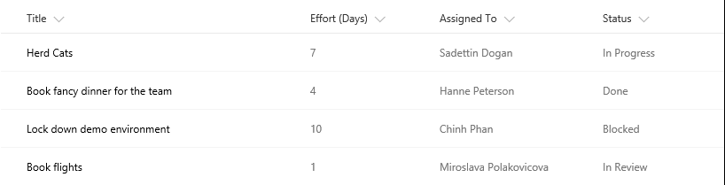
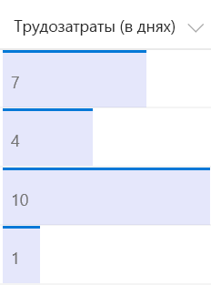

# <a name="use-column-formatting-to-customize-sharepoint"></a><span data-ttu-id="36ee8-101">Форматирование столбцов в списках и библиотеках SharePoint</span><span class="sxs-lookup"><span data-stu-id="36ee8-101">Use column formatting to customize SharePoint</span></span>

<span data-ttu-id="36ee8-102">Форматирование столбцов позволяет настраивать отображение полей в списках и библиотеках SharePoint.</span><span class="sxs-lookup"><span data-stu-id="36ee8-102">You can use column formatting to customize how fields in SharePoint lists and libraries are displayed.</span></span> <span data-ttu-id="36ee8-103">Для этого создается объект JSON, который описывает элементы, отображаемые при включении поля в список, и стили, применяемые к этим элементам.</span><span class="sxs-lookup"><span data-stu-id="36ee8-103">To do this, you construct a JSON object that describes the elements that are displayed when a field is included in a list view, and the styles to be applied to those elements.</span></span> <span data-ttu-id="36ee8-104">При форматировании столбцов данные в элементе списка или файле остаются неизменными. Изменяется только их внешний вид.</span><span class="sxs-lookup"><span data-stu-id="36ee8-104">The column formatting does not change the data in the list item or file; it only changes how it’s displayed to users who browse the list.</span></span> <span data-ttu-id="36ee8-105">Настраивать поля с помощью форматирования столбцов могут все, кто может создавать списки и управлять ими.</span><span class="sxs-lookup"><span data-stu-id="36ee8-105">Anyone who can create and manage views in a list can use column formatting to configure how view fields are displayed.</span></span> 

<span data-ttu-id="36ee8-106">Например, список с полями "Заголовок", "Трудозатраты", "Кому назначено" и "Состояние" без настройки может выглядеть так:</span><span class="sxs-lookup"><span data-stu-id="36ee8-106">For example, a list with the fields Title, Effort, Assigned To, and Status with no customizations applied might look like this:</span></span> 



<span data-ttu-id="36ee8-108">Список с полями "Трудозатраты", "Кому назначено" и "Состояние", настроенные с помощью форматирования столбцов, может выглядеть так:</span><span class="sxs-lookup"><span data-stu-id="36ee8-108">A list with the appearance of the Effort, Assigned To, and Status fields customized via column formatting might look like this:</span></span>


## <a name="how-is-column-formatting-different-than-the-field-customizer"></a><span data-ttu-id="36ee8-110">Чем форматирование столбцов отличается от применения расширения Field Customizer?</span><span class="sxs-lookup"><span data-stu-id="36ee8-110">How is column formatting different than the Field Customizer?</span></span>
<span data-ttu-id="36ee8-111">Применяя как форматирование столбцов, так и расширения типа [Field Customizer в SharePoint Framework](https://docs.microsoft.com/ru-RU/sharepoint/dev/spfx/extensions/get-started/building-simple-field-customizer), можно настраивать отображение полей в списках SharePoint.</span><span class="sxs-lookup"><span data-stu-id="36ee8-111">Both column formatting and the [SharePoint Framework Field Customizer](https://docs.microsoft.com/ru-RU/sharepoint/dev/spfx/extensions/get-started/building-simple-field-customizer) extension enable you to customize how fields in SharePoint lists are displayed.</span></span> <span data-ttu-id="36ee8-112">Настройщик полей — универсальный инструмент, так как позволяет создавать любой код для управления отображением поля.</span><span class="sxs-lookup"><span data-stu-id="36ee8-112">The Field Customizer is more powerful, because you can use it to write any code you want to control how a field is displayed.</span></span> <span data-ttu-id="36ee8-113">Форматирование столбцов проще и доступнее,</span><span class="sxs-lookup"><span data-stu-id="36ee8-113">Column formatting is more easily and broadly applied.</span></span> <span data-ttu-id="36ee8-114">но не так универсально, так как не позволяет создавать пользовательский код и поддерживает только предопределенные элементы и атрибуты.</span><span class="sxs-lookup"><span data-stu-id="36ee8-114">However, it is less flexible, because it does not allow for custom code; it only allows for certain predefined elements and attributes.</span></span> 

<span data-ttu-id="36ee8-115">В таблице ниже сравниваются форматирование столбцов и настройщик полей.</span><span class="sxs-lookup"><span data-stu-id="36ee8-115">The following table compares column formatting and the Field Customizer.</span></span>

| <span data-ttu-id="36ee8-116">Тип поля</span><span class="sxs-lookup"><span data-stu-id="36ee8-116">Field type</span></span>        | <span data-ttu-id="36ee8-117">Форматирование столбцов</span><span class="sxs-lookup"><span data-stu-id="36ee8-117">Column formatting</span></span>          | <span data-ttu-id="36ee8-118">Настройщик полей</span><span class="sxs-lookup"><span data-stu-id="36ee8-118">Field Customizer</span></span>  |
| ------------- |:-------------| :-----|
| <span data-ttu-id="36ee8-119">Условное форматирование на основе значений элементов и диапазонов значений</span><span class="sxs-lookup"><span data-stu-id="36ee8-119">Conditional formatting based on item values and value ranges</span></span>      | <span data-ttu-id="36ee8-120">Поддерживается</span><span class="sxs-lookup"><span data-stu-id="36ee8-120">Supported</span></span> | <span data-ttu-id="36ee8-121">Поддерживается</span><span class="sxs-lookup"><span data-stu-id="36ee8-121">Supported</span></span> |
| <span data-ttu-id="36ee8-122">Ссылки на действия</span><span class="sxs-lookup"><span data-stu-id="36ee8-122">Action links</span></span>       | <span data-ttu-id="36ee8-123">Поддержка статических гиперссылок, которые не запускают сценарии</span><span class="sxs-lookup"><span data-stu-id="36ee8-123">Support for static hyperlinks that do not launch script</span></span>      |  <span data-ttu-id="36ee8-124">Поддержка всех гиперссылок, в том числе запускающих пользовательские сценарии</span><span class="sxs-lookup"><span data-stu-id="36ee8-124">Support for any hyperlink, including those that invoke custom script</span></span>   |
| <span data-ttu-id="36ee8-125">Визуализация данных</span><span class="sxs-lookup"><span data-stu-id="36ee8-125">Data visualizations</span></span> | <span data-ttu-id="36ee8-126">Поддержка простой визуализации, которую можно выразить с помощью HTML и CSS</span><span class="sxs-lookup"><span data-stu-id="36ee8-126">Support for simple visualizations that can be expressed using HTML and CSS</span></span>      |   <span data-ttu-id="36ee8-127">Поддержка произвольной визуализации данных</span><span class="sxs-lookup"><span data-stu-id="36ee8-127">Support for arbitrary data visualizations</span></span>  |

<span data-ttu-id="36ee8-128">Обычно форматирование столбцов проще и быстрее, чем применение расширения Field Customizer, но оно подходит не для всех сценариев.</span><span class="sxs-lookup"><span data-stu-id="36ee8-128">If you can accomplish your scenario by using column formatting, it’s typically quicker and easier to do that than to use Field Customizer.</span></span> <span data-ttu-id="36ee8-129">Создавать и публиковать модификации с помощью форматирования столбцов могут все, кто может создавать представления в списках и управлять ими.</span><span class="sxs-lookup"><span data-stu-id="36ee8-129">Anyone who can create and manage views in a list can use column formatting to create and publish customizations.</span></span> <span data-ttu-id="36ee8-130">Используйте расширение типа Field Customizer для более сложных сценариев, которые невозможно обеспечить с помощью форматирования столбцов.</span><span class="sxs-lookup"><span data-stu-id="36ee8-130">Use Field Customizer for more advanced scenarios that column formatting does not support.</span></span>

## <a name="get-started-with-column-formatting"></a><span data-ttu-id="36ee8-131">Приступая к форматированию столбцов</span><span class="sxs-lookup"><span data-stu-id="36ee8-131">Get started with column formatting</span></span>
<span data-ttu-id="36ee8-132">Чтобы открыть панель форматирования столбцов, откройте раскрывающееся меню под столбцом.</span><span class="sxs-lookup"><span data-stu-id="36ee8-132">To open the column formatting pane, open the dropdown menu under a column.</span></span> <span data-ttu-id="36ee8-133">В разделе **Параметры столбца** выберите **Форматировать этот столбец**.</span><span class="sxs-lookup"><span data-stu-id="36ee8-133">Under **Column Settings**, choose **Format this column**.</span></span>

<span data-ttu-id="36ee8-134">Если к выбранному столбцу еще не применялось форматирование, эта панель будет выглядеть вот так.</span><span class="sxs-lookup"><span data-stu-id="36ee8-134">If no one has used column formatting on the column you selected, the pane will look like the following.</span></span>


<span data-ttu-id="36ee8-136">Если форматирование не указано, поле будет отображаться как обычно.</span><span class="sxs-lookup"><span data-stu-id="36ee8-136">A field with no formatting specified will use the default rendering.</span></span> <span data-ttu-id="36ee8-137">Чтобы отформатировать столбец, введите в поле объект JSON.</span><span class="sxs-lookup"><span data-stu-id="36ee8-137">To format a column, enter the column formatting JSON in the box.</span></span>

<span data-ttu-id="36ee8-138">Чтобы просмотреть параметры форматирования, нажмите **Просмотреть**.</span><span class="sxs-lookup"><span data-stu-id="36ee8-138">To preview the formatting, select **Preview**.</span></span> <span data-ttu-id="36ee8-139">Чтобы сохранить изменения, нажмите **Сохранить**.</span><span class="sxs-lookup"><span data-stu-id="36ee8-139">To commit your changes, select **Save**.</span></span> <span data-ttu-id="36ee8-140">После сохранения изменений форматирование увидят все пользователи, просматривающие список.</span><span class="sxs-lookup"><span data-stu-id="36ee8-140">When you save, anyone who views the list will see the customization that you applied.</span></span>

<span data-ttu-id="36ee8-141">Самый простой способ отформатировать столбец — отредактировать пример и применить его к нужному полю.</span><span class="sxs-lookup"><span data-stu-id="36ee8-141">The easiest way to use column formatting is to start from an example and edit it to apply to your specific field.</span></span> <span data-ttu-id="36ee8-142">Следующие разделы содержат примеры, которые можно копировать, вставлять и редактировать.</span><span class="sxs-lookup"><span data-stu-id="36ee8-142">The following sections contain examples that you can copy, paste, and edit for your scenarios.</span></span> <span data-ttu-id="36ee8-143">Кроме того, несколько примеров доступны в [репозитории SharePoint/sp-dev-column-formatting](https://github.com/SharePoint/sp-dev-column-formatting).</span><span class="sxs-lookup"><span data-stu-id="36ee8-143">There are also several samples available in the [SharePoint/sp-dev-column-formatting repository](https://github.com/SharePoint/sp-dev-column-formatting).</span></span>

## <a name="display-field-values-basic"></a><span data-ttu-id="36ee8-144">Отображение значений поля (базовые настройки)</span><span class="sxs-lookup"><span data-stu-id="36ee8-144">Display field values (basic)</span></span>

<span data-ttu-id="36ee8-145">Самый простой способ отформатировать столбец — вставить значение поля в элемент `<div />`.</span><span class="sxs-lookup"><span data-stu-id="36ee8-145">The simplest column formatting is one that places the value of the field inside a `<div />` element.</span></span> <span data-ttu-id="36ee8-146">Этот пример подходит для числовых и текстовых полей, а также полей выбора и даты:</span><span class="sxs-lookup"><span data-stu-id="36ee8-146">This example works for number, text, choice, and date fields.</span></span>

```JSON
{
   "elmType": "div",
   "txtContent": "@currentField"
}
```
<span data-ttu-id="36ee8-147">Извлечь значения полей некоторых типов немного сложнее.</span><span class="sxs-lookup"><span data-stu-id="36ee8-147">Some field types require a bit of extra work to retrieve their values.</span></span> <span data-ttu-id="36ee8-148">Поле пользователя представляется в системе как объект, а отображаемое имя пользователя указывается в свойстве **title** такого объекта.</span><span class="sxs-lookup"><span data-stu-id="36ee8-148">Person fields are represented in the system as objects, and a person’s display name is contained within that object’s **Title** property.</span></span> <span data-ttu-id="36ee8-149">Это тот же пример, но измененный так, чтобы он подходил для поля пользователя:</span><span class="sxs-lookup"><span data-stu-id="36ee8-149">This is the same example, modified to work with the person field.</span></span>

```JSON
{
   "elmType": "div",
   "txtContent": "@currentField.title"
}
```
<span data-ttu-id="36ee8-150">Поле подстановки также представляется как объект. Отображаемый текст сохраняется в свойстве **lookupValue**.</span><span class="sxs-lookup"><span data-stu-id="36ee8-150">Lookup fields are also represented as objects; the display text is stored in the **lookupValue** property.</span></span> <span data-ttu-id="36ee8-151">Этот пример подходит для поля подстановки:</span><span class="sxs-lookup"><span data-stu-id="36ee8-151">This example works with a lookup field.</span></span>

```JSON
{
   "elmType": "div",
   "txtContent": "@currentField.lookupValue"
}
```

## <a name="apply-conditional-formatting"></a><span data-ttu-id="36ee8-152">Применение условного форматирования</span><span class="sxs-lookup"><span data-stu-id="36ee8-152">Apply conditional formatting</span></span>
<span data-ttu-id="36ee8-153">Форматирование столбцов позволяет применять стили, классы и значки к полям в зависимости от их значений.</span><span class="sxs-lookup"><span data-stu-id="36ee8-153">You can use column formatting to apply styles, classes, and icons to fields, depending on the value inside those fields.</span></span>

### <a name="conditional-formatting-based-on-a-number-range-basic"></a><span data-ttu-id="36ee8-154">Условное форматирование на основе диапазона чисел (базовые настройки)</span><span class="sxs-lookup"><span data-stu-id="36ee8-154">Conditional formatting based on a number range (basic)</span></span>
<span data-ttu-id="36ee8-155">Ниже показан пример условного форматирования, примененного к диапазону чисел.</span><span class="sxs-lookup"><span data-stu-id="36ee8-155">The following image shows an example of conditional formatting applied to a number range.</span></span>


<span data-ttu-id="36ee8-157">В этом примере условный оператор `?` используется для применения класса (`sp-field-severity--warning`) к родительскому элементу `<div />`, если значение в текущем поле меньше или равно 70.</span><span class="sxs-lookup"><span data-stu-id="36ee8-157">This example uses the conditional operator `?` to apply a class (`sp-field-severity--warning`) to the parent `<div />` element when the  value in the current field is less than or equal to 70.</span></span> <span data-ttu-id="36ee8-158">В этом случае поле выделяется, если значение меньше или равно 70, и отображается как обычно, если оно больше 70.</span><span class="sxs-lookup"><span data-stu-id="36ee8-158">This causes the field to be highlighted when the value is less than or equal to 70, and appear normally if it's greater than 70.</span></span>

```JSON
{
    "$schema": "http://columnformatting.sharepointpnp.com/columnFormattingSchema.json",
    "debugMode": true,
    "elmType": "div",
    "attributes": {
       "class": {
          "operator": "?",
          "operands": [
             {
                "operator": "<=",
                "operands": [
                   "@currentField",
                   70
                ]
             },
             "sp-field-severity--warning",
             ""
          ]
       }
    },
    "children": [
        {
            "elmType": "span",
            "style": {
                "display": "inline-block",
                "padding": "0 4px"
            },
            "attributes": {
                "iconName": {
                    "operator": "?",
                    "operands": [
                        {
                            "operator": "<=",
                            "operands": [
                                "@currentField",                  
                                70
                            ]
                        },
                        "Error",
                        ""
                    ]
                }
            }
        },
        {
            "elmType": "span",
            "txtContent": "@currentField"
        }
    ]
}
```

### <a name="conditional-formatting-based-on-the-value-in-a-text-or-choice-field-advanced"></a><span data-ttu-id="36ee8-159">Условное форматирование с учетом значения в текстовом поле или поле выбора (расширенные настройки)</span><span class="sxs-lookup"><span data-stu-id="36ee8-159">Conditional formatting based on the value in a text or choice field (advanced)</span></span>

<span data-ttu-id="36ee8-160">Ниже показан пример условного форматирования, примененного к текстовому полю или полю выбора.</span><span class="sxs-lookup"><span data-stu-id="36ee8-160">The following image shows an example of conditional formatting applied to a text or choice field.</span></span>


<span data-ttu-id="36ee8-162">Вы можете применить условное форматирование к полям текста или выбора, которые могут содержать фиксированный набор значений.</span><span class="sxs-lookup"><span data-stu-id="36ee8-162">You can apply conditional formatting to text or choice fields that might contain a fixed set of values.</span></span> <span data-ttu-id="36ee8-163">В примере ниже применяются различные классы в зависимости от того, какое значение имеет поле: "Готово", "Проверка", "Заблокировано" или другое.</span><span class="sxs-lookup"><span data-stu-id="36ee8-163">The following example applies different classes depending on whether the value of the field is Done, In Review, Blocked, or another value.</span></span> <span data-ttu-id="36ee8-164">В этом примере класс CSS (`sp-field-severity--low, sp-field-severity--good, sp-field-severity--warning, sp-field-severity--blocked`) применяется к элементу `<div />` на основе значения поля.</span><span class="sxs-lookup"><span data-stu-id="36ee8-164">This example applies a CSS class (`sp-field-severity--low, sp-field-severity--good, sp-field-severity--warning, sp-field-severity--blocked`) to the  `<div />` based on the field's value.</span></span> <span data-ttu-id="36ee8-165">Затем элемент `<span />` выводится с атрибутом `IconName`.</span><span class="sxs-lookup"><span data-stu-id="36ee8-165">Then, it outputs a `<span />` element with an `IconName` attribute.</span></span> <span data-ttu-id="36ee8-166">Этот атрибут применяет другой класс CSS к элементу `<span />`, внутри которого отображается значок [Office UI Fabric](https://dev.office.com/fabric#/).</span><span class="sxs-lookup"><span data-stu-id="36ee8-166">This attribute applies another CSS class to that `<span />` that shows an [Office UI Fabric](https://dev.office.com/fabric#/) icon inside that element.</span></span> <span data-ttu-id="36ee8-167">Наконец, выводится другой элемент `<span />`, содержащий значение в поле.</span><span class="sxs-lookup"><span data-stu-id="36ee8-167">Finally, another `<span />` element is outputted that contains the value inside the field.</span></span>

<span data-ttu-id="36ee8-168">Используйте этот шаблон, чтобы сопоставить разные значения с различными степенями срочности и серьезности.</span><span class="sxs-lookup"><span data-stu-id="36ee8-168">This pattern is useful when you want different values to map to different levels of urgency or severity.</span></span> <span data-ttu-id="36ee8-169">Вы можете отредактировать этот пример, чтобы указать собственные значения полей, а также стили и значки, которые необходимо сопоставить с этими значениями.</span><span class="sxs-lookup"><span data-stu-id="36ee8-169">You can start from this example and edit it to specify your own field values and the styles and icons that should map to those values.</span></span>

```JSON
{
    "$schema": "http://columnformatting.sharepointpnp.com/columnFormattingSchema.json",
    "debugMode": true,
    "elmType": "div",
    "attributes": {
        "class": {
            "operator": "?",
            "operands": [
                {
                    "operator": "==",
                    "operands": [
                        {
                            "operator": "toString()",
                            "operands": [
                                "@currentField"
                            ]
                        },
                        "Done"
                    ]
                },
                "sp-field-severity--good",
                {
                    "operator": "?",
                    "operands": [
                        {
                            "operator": "==",
                            "operands": [
                                {
                                    "operator": "toString()",
                                    "operands": [
                                        "@currentField"
                                    ]
                                },
                                "In progress"
                            ]
                        },
                        "sp-field-severity--low",
                        {
                            "operator": "?",
                            "operands": [
                                {
                                    "operator": "==",
                                    "operands": [
                                        {
                                            "operator": "toString()",
                                            "operands": [
                                                "@currentField"
                                            ]
                                        },
                                        "In review"
                                    ]
                                },
                                "sp-field-severity--warning",
                                {
                                    "operator": "?",
                                    "operands": [
                                        {
                                            "operator": "==",
                                            "operands": [
                                                {
                                                    "operator": "toString()",
                                                    "operands": [
                                                        "@currentField"
                                                    ]
                                                },
                                                "Blocked"
                                            ]
                                        },
                                        "sp-field-severity--severeWarning",
                                        "sp-field-severity--blocked"
                                    ]
                                }
                            ]
                        }
                    ]
                }
            ]
        }
    },
    "children": [
        {
            "elmType": "span",
            "style": {
                "display": "inline-block",
                "padding": "0 4px"
            },
            "attributes": {
                "iconName": {
                    "operator": "?",
                    "operands": [
                        {
                            "operator": "==",
                            "operands": [
                                {
                                    "operator": "toString()",
                                    "operands": [
                                        "@currentField"
                                    ]
                                },
                                "Done"
                            ]
                        },
                        "CheckMark",
                        {
                            "operator": "?",
                            "operands": [
                                {
                                    "operator": "==",
                                    "operands": [
                                        {
                                            "operator": "toString()",
                                            "operands": [
                                                "@currentField"
                                            ]
                                        },
                                        "In progress"
                                    ]
                                },
                                "Forward",
                                {
                                    "operator": "?",
                                    "operands": [
                                        {
                                            "operator": "==",
                                            "operands": [
                                                {
                                                    "operator": "toString()",
                                                    "operands": [
                                                        "@currentField"
                                                    ]
                                                },
                                                "In review"
                                            ]
                                        },
                                        "Error",
                                        {
                                            "operator": "?",
                                            "operands": [
                                                {
                                                    "operator": "==",
                                                    "operands": [
                                                        {
                                                            "operator": "toString()",
                                                            "operands": [
                                                                "@currentField"
                                                            ]
                                                        },
                                                        "Has issues"
                                                    ]
                                                },
                                                "Warning",
                                                "ErrorBadge"
                                            ]
                                        }
                                    ]
                                }
                            ]
                        }
                    ]
                }
            }
        },
        {
            "elmType": "span",
            "txtContent": "@currentField"
        }
    ]
}

```

## <a name="apply-formatting-based-on-date-ranges"></a><span data-ttu-id="36ee8-170">Применение форматирования на основе диапазонов дат</span><span class="sxs-lookup"><span data-stu-id="36ee8-170">Apply formatting based on date ranges</span></span>
<span data-ttu-id="36ee8-171">Так как даты часто используются для отслеживания крайних сроков и временных шкал ключевых проектов, форматирование часто применяется на основе значения в поле даты и времени.</span><span class="sxs-lookup"><span data-stu-id="36ee8-171">Because dates are often used to track deadlines and key project timelines, a common scenario is to apply formatting based on the value in a date/time field.</span></span> <span data-ttu-id="36ee8-172">Чтобы применить форматирование на основе значения этого поля, используйте приведенные ниже шаблоны.</span><span class="sxs-lookup"><span data-stu-id="36ee8-172">To apply formatting based on the value in a date/time field, apply the following patterns.</span></span>

### <a name="formatting-an-item-when-a-date-column-is-before-or-after-todays-date-advanced"></a><span data-ttu-id="36ee8-173">Форматирование элемента, если дата в столбце предшествует сегодняшней дате или наступает после нее (расширенные настройки)</span><span class="sxs-lookup"><span data-stu-id="36ee8-173">Formatting an item when a date column is before or after today's date (advanced)</span></span>

<span data-ttu-id="36ee8-174">На приведенном ниже изображении показано поле, к которому применено условное форматирование даты.</span><span class="sxs-lookup"><span data-stu-id="36ee8-174">The following image shows a field with conditional date formatting applied.</span></span>


<span data-ttu-id="36ee8-176">В этом примере поле текущей даты окрашивается в красный цвет, если значение в поле "Дата выполнения" элемента предшествует текущим дате и времени.</span><span class="sxs-lookup"><span data-stu-id="36ee8-176">This example colors the current field red when the value inside an item's DueDate is before the current date/time.</span></span> <span data-ttu-id="36ee8-177">В отличие от некоторых предыдущих примеров, в этом примере форматирование применяется к одному полю с учетом значения в другом поле.</span><span class="sxs-lookup"><span data-stu-id="36ee8-177">Unlike some of the previous examples, this example applies formatting to one field by looking at the value inside another field.</span></span> <span data-ttu-id="36ee8-178">Обратите внимание на то, что для ссылки на поле "DueDate" (Дата выполнения) используется синтаксис `[$FieldName]`.</span><span class="sxs-lookup"><span data-stu-id="36ee8-178">Note that DueDate is referenced using the [$FieldName] syntax.</span></span> <span data-ttu-id="36ee8-179">FieldName — это внутреннее имя поля.</span><span class="sxs-lookup"><span data-stu-id="36ee8-179">FieldName is assumed to be the internal name of the field.</span></span> <span data-ttu-id="36ee8-180">В этом примере также используется специальное значение `@now`, которое можно использовать в полях даты и времени. Это значение сопоставляется с текущими датой и временем, которые определяются при загрузке списка.</span><span class="sxs-lookup"><span data-stu-id="36ee8-180">This example also takes advantage of a special value that can be used in date/time fields - `@now`, which resolves to the current date/time, evaluated when the user loads the list view.</span></span>

> [!NOTE]
> <span data-ttu-id="36ee8-181">Если в имени поля есть пробелы, они определяются как `_x0020_`.</span><span class="sxs-lookup"><span data-stu-id="36ee8-181">If you have spaces in the field name, those are defined as `_x0020_`.</span></span> <span data-ttu-id="36ee8-182">Например, имя поля "Due Date" (Дата выполнения) должно писаться так: `$Due_x0020_Date`.</span><span class="sxs-lookup"><span data-stu-id="36ee8-182">For example, a field named "Due Date" should be referenced as `$Due_x0020_Date`.</span></span>

```JSON
{

   "elmType": "div",
   "txtContent": "@currentField",
   "style": {
      "color": {
         "operator": "?",
         "operands": [
            {
               "operator": "<=",
               "operands": [
                  "[$DueDate]",
                  "@now"
               ]
            },
            "#ff0000",
            ""
         ]
      }
   }
}
```

### <a name="formatting-items-based-on-arbitrary-dates-advanced"></a><span data-ttu-id="36ee8-183">Форматирование элементов с учетом произвольных дат (расширенные настройки)</span><span class="sxs-lookup"><span data-stu-id="36ee8-183">Formatting items based on arbitrary dates (advanced)</span></span>
<span data-ttu-id="36ee8-184">Чтобы сравнить значение поля даты и времени с датой, отличной от `@now`, используйте шаблон, приведенный в примере ниже.</span><span class="sxs-lookup"><span data-stu-id="36ee8-184">To compare the value of a date/time field against a date that's not `@now`, follow the pattern in the following example.</span></span> <span data-ttu-id="36ee8-185">Здесь поле текущей даты окрашивается в красный цвет, если дата выполнения назначена на завтра или ранее.</span><span class="sxs-lookup"><span data-stu-id="36ee8-185">The following example colors the current field red if the due date was <= tomorrow.</span></span> <span data-ttu-id="36ee8-186">Для этого используются математические операции с датой.</span><span class="sxs-lookup"><span data-stu-id="36ee8-186">This is accomplished using date math.</span></span> <span data-ttu-id="36ee8-187">Вы можете добавить миллисекунды к любой дате, чтобы получить новую дату.</span><span class="sxs-lookup"><span data-stu-id="36ee8-187">You can add milliseconds to any date, and the result will be a new date.</span></span> <span data-ttu-id="36ee8-188">Например, чтобы добавить к дате один день, добавьте 24\*60\*60\*1000 (результатом будет 86 400 000).</span><span class="sxs-lookup"><span data-stu-id="36ee8-188">For example, to add a day to a date, you'd add (246060*1000 = 86,400,000).</span></span> 
```JSON
{
   "elmType": "div",
   "txtContent": "@currentField",
   "style": {
      "color": {
         "operator": "?",
         "operands": [
            {
               "operator": "<=",
               "operands": [
                  "[$DueDate]",
                  {
                     "operator": "+",
                     "operands": [
                        "@now",
                        86400000
                     ]
                  }
               ]
            },
            "#ff0000",
            ""
         ]
      }
   }
}
```
<span data-ttu-id="36ee8-189">Чтобы сравнить значение поля даты и времени с другой константой даты, преобразуйте строку в дату с помощью метода `Date()`.</span><span class="sxs-lookup"><span data-stu-id="36ee8-189">To compare a date/time field value against another date constant, use the `Date()` method to convert a string to a date.</span></span> <span data-ttu-id="36ee8-190">Приведенный ниже пример кода окрашивает текущее поле в красный цвет, если значение в поле "DueDate" (Дата выполнения) предшествует дате 22.03.2017.</span><span class="sxs-lookup"><span data-stu-id="36ee8-190">The following example colors the current field red if the value in the DueDate field is before 3/22/2017.</span></span>
```JSON
{
   "elmType": "div",
   "txtContent": "@currentField",
   "style": {
      "color": {
         "operator": "?",
         "operands": [
            {
               "operator": "<=",
               "operands": [
                  "[$DueDate]",
                  {
                     "operator": "Date()",
                     "operands": [
                        "3/22/2017"
                     ]
                  }
               ]
            },
            "#ff0000",
            ""
         ]
      }
   }
}
```

## <a name="create-clickable-actions"></a><span data-ttu-id="36ee8-191">Создание интерактивных действий</span><span class="sxs-lookup"><span data-stu-id="36ee8-191">Create clickable actions</span></span>

<span data-ttu-id="36ee8-192">Форматирование столбцов позволяет показывать гиперссылки для перехода на другие веб-страницы или запускать специальные функции.</span><span class="sxs-lookup"><span data-stu-id="36ee8-192">You can use column formatting to provide hyperlinks that go to other web pages, or start custom functionality.</span></span> <span data-ttu-id="36ee8-193">Можно показывать только статические ссылки, параметризируемые с использованием значений из полей в списке.</span><span class="sxs-lookup"><span data-stu-id="36ee8-193">This functionality is limited to static  links that can be paramaterized with values from fields in the list.</span></span> <span data-ttu-id="36ee8-194">Форматирование столбцов невозможно использовать для вывода ссылок на протоколы, отличные от `http://`, `https://` и `mailto:`.</span><span class="sxs-lookup"><span data-stu-id="36ee8-194">You can't use column formatting to output links to protocols other than `http://`.</span></span>

### <a name="turn-field-values-into-hyperlinks-basic"></a><span data-ttu-id="36ee8-195">Преобразование значений полей в гиперссылки (базовые настройки)</span><span class="sxs-lookup"><span data-stu-id="36ee8-195">Turn field values into hyperlinks (basic)</span></span>
<span data-ttu-id="36ee8-196">В этом примере показано, как преобразовать текстовое поле с финансовыми символами в гиперссылку, которая позволяет перейти на страницу Yahoo Finance с актуальными котировками для соответствующих символов.</span><span class="sxs-lookup"><span data-stu-id="36ee8-196">This example shows how to turn a text field that contains stock ticker symbols into a hyperlink that targets the Yahoo Finance real-time quotes page for that stock ticker.</span></span> <span data-ttu-id="36ee8-197">В этом примере используется оператор `+`, позволяющий добавить значение текущего поля к статической гиперссылке <a>http://finance.yahoo.com/quote/</a>.</span><span class="sxs-lookup"><span data-stu-id="36ee8-197">The example uses a `+` operator that appends the current field value to the static hyperlink <a>http://finance.yahoo.com/quote/</a>.</span></span> <span data-ttu-id="36ee8-198">Этот шаблон также можно использовать, если вы хотите предоставить пользователям возможность просматривать контекстную информацию, связанную с элементом, или запустить бизнес-процесс для текущего элемента, если эта информация или процесс доступны по гиперссылке, параметризуемой с помощью значений из элемента списка.</span><span class="sxs-lookup"><span data-stu-id="36ee8-198">You can extend this pattern to any scenario in which you want users to view contextual information related to an item, or you want to start a business process on the current item, as long as the information or process can be accessed via a hyperlink parameterized with values from the list item.</span></span>


```JSON
{
   "elmType": "a",
   "txtContent": "@currentField",
   "attributes": {
      "target": "_blank",
      "href": {
         "operator": "+",
         "operands": [
            "http://finance.yahoo.com/quote/",
            "@currentField"
         ]
      }
   }
}
```
### <a name="add-an-action-button-to-a-field-advanced"></a><span data-ttu-id="36ee8-200">Добавление в поле кнопки действия (расширенные настройки)</span><span class="sxs-lookup"><span data-stu-id="36ee8-200">Add an action button to a field (advanced)</span></span>
<span data-ttu-id="36ee8-201">На рисунке ниже приведены кнопки действия, добавленные в поле.</span><span class="sxs-lookup"><span data-stu-id="36ee8-201">The following image shows action buttons added to a field.</span></span>


<span data-ttu-id="36ee8-203">С помощью форматирования столбцов можно отображать ссылки на быстрые действия рядом с полями.</span><span class="sxs-lookup"><span data-stu-id="36ee8-203">You can use column formatting to render quick action links next to fields.</span></span> <span data-ttu-id="36ee8-204">В этом примере, предназначенном для поля пользователя, отображаются два элемента в родительском элементе `<div />`:</span><span class="sxs-lookup"><span data-stu-id="36ee8-204">The following example, intended for a person field, renders two elements inside the parent `<div />` element:</span></span>

- <span data-ttu-id="36ee8-205">элемент `<span />`, содержащий отображаемое имя пользователя;</span><span class="sxs-lookup"><span data-stu-id="36ee8-205">A `<span />` element that contains the person’s display name.</span></span>
- <span data-ttu-id="36ee8-206">элемент `<a />`, открывающий ссылку mailto:, которую можно использовать для создания письма, тема и основной текст которого динамически заполняются с помощью метаданных элемента.</span><span class="sxs-lookup"><span data-stu-id="36ee8-206">An `<a />` element that opens a mailto: link that creates an email with a subject and body populated dynamically via item metadata.</span></span> <span data-ttu-id="36ee8-207">Для оформления элемента `<a />` используются классы [Fabric](https://developer.microsoft.com/ru-RU/fabric) `ms-Icon`, `ms-Icon—Mail` и `ms-QuickAction`, благодаря чему он похож на интерактивный значок электронной почты.</span><span class="sxs-lookup"><span data-stu-id="36ee8-207">The `<a />` element is styled using the `ms-Icon`, `ms-Icon—Mail`, and `ms-QuickAction` [Fabric](https://developer.microsoft.com/ru-RU/fabric) classes to make it look like a clickable email icon.</span></span> 

```JSON
{
    "elmType": "div",
    "children": [
        {
            "elmType": "span",
            "style": {
                "padding-right": "8px"
            },
            "txtContent": "@currentField.title"
        },
        {
            "elmType": "a",
            "attributes": {
                "iconName": "Mail",
                "class": "sp-field-quickAction",
                "href": {
                    "operator": "+",
                    "operands": [
                        "mailto:",
                        "@currentField.email",
                        "?subject=Task status&body=Hey, how is your task coming along?.\r\n---\r\n",
                        "@currentField.title",
                        "\r\nClick this link for more info. http://contoso.sharepoint.com/sites/ConferencePrep/Tasks/Prep/DispForm.aspx?ID=",
                        "[$ID]"
                    ]
                }
            }
        }
    ]
}
```
## <a name="create-simple-data-visualizations"></a><span data-ttu-id="36ee8-208">Создание простой визуализации данных</span><span class="sxs-lookup"><span data-stu-id="36ee8-208">Create simple data visualizations</span></span>
<span data-ttu-id="36ee8-209">Форматирование столбцов позволяет сочетать условные и арифметические операции для выполнения базовой визуализации данных.</span><span class="sxs-lookup"><span data-stu-id="36ee8-209">Use column formatting to combine conditional and arithmetical operations to achieve basic data visualizations.</span></span>

### <a name="format-a-number-column-as-a-data-bar-advanced"></a><span data-ttu-id="36ee8-210">Форматирование столбца чисел для его отображения в виде гистограммы (расширенные настройки)</span><span class="sxs-lookup"><span data-stu-id="36ee8-210">Format a number column as a data bar (advanced)</span></span>
<span data-ttu-id="36ee8-211">На приведенном ниже изображении показан столбец чисел, отформатированный так, чтобы он представлял собой гистограмму.</span><span class="sxs-lookup"><span data-stu-id="36ee8-211">The following image shows a number column formatted as a data bar.</span></span>



<span data-ttu-id="36ee8-213">В этом примере для визуализации числового поля `@currentField` в виде гистограммы применяются стили `background-color` и `border-top`.</span><span class="sxs-lookup"><span data-stu-id="36ee8-213">This example applies `background-color` and `border-top` styles to create a data bar visualization of `@currentField`, which is a number field.</span></span> <span data-ttu-id="36ee8-214">Размер столбиков зависит от того, каков атрибут `width`. Ему присваивается `100%`, если значение больше 20, и `(@currentField * 5)%`, если значение меньше 10.</span><span class="sxs-lookup"><span data-stu-id="36ee8-214">The bars are sized differently for different values based on the way the `width` attribute is set - it's set to `100%` when the value is greater than 20, and `(@currentField * 5)%` when there value is less than 10.</span></span> <span data-ttu-id="36ee8-215">Таким образом, ширина гистограммы для значения 1 составляет 5 %, для значения 2 — 10 % и т. д.</span><span class="sxs-lookup"><span data-stu-id="36ee8-215">This achieves a width of 5% for the data bar for values of 1, 10% for values of 2, and so on.</span></span> <span data-ttu-id="36ee8-216">Чтобы применить этот пример к своему числовому столбцу, вы можете настроить условие границы (`20`) в соответствии с максимальным предполагаемым значением в поле, а также множитель (`5`), чтобы указать, на сколько должен увеличиваться столбец в зависимости от значения в поле.</span><span class="sxs-lookup"><span data-stu-id="36ee8-216">To fit this example to your number column, you can adjust the boundary condition (`20`) to match the maximum anticipated value inside the field, and the multiplier (`5`) to specify how much the bar should grow depending on the value inside the field.</span></span>
```JSON
{
  "debugMode": true,
  "elmType": "div",
  "txtContent": "@currentField",
  "attributes": {
   "class": "sp-field-dataBars"
  },
  "style": {
    "width": {
      "operator": "?",
      "operands": [
        {
          "operator": ">",
          "operands": [
            "@currentField",
            "20"
          ]
        },
        "100%",
        {
          "operator": "+",
          "operands": [
            {
              "operator": "toString()",
              "operands": [
                {
                  "operator": "*",
                  "operands": [
                    "@currentField",
                    5
                  ]
                }
              ]
            },
            "%"
          ]
        }
      ]
    }
  }
}
```

### <a name="show-trending-uptrending-down-icons-advanced"></a><span data-ttu-id="36ee8-217">Отображение значков тенденций к увеличению или уменьшению (расширенные настройки)</span><span class="sxs-lookup"><span data-stu-id="36ee8-217">Show trending up/trending down icons (advanced)</span></span>
<span data-ttu-id="36ee8-218">На приведенном ниже изображении показан список, к которому добавлены значки тенденций к увеличению или уменьшению.</span><span class="sxs-lookup"><span data-stu-id="36ee8-218">The following image shows a list with trending up/trending down icons added.</span></span>


<span data-ttu-id="36ee8-220">В этом примере используются два числовых поля `Before` и `After`, значения которых можно сравнить.</span><span class="sxs-lookup"><span data-stu-id="36ee8-220">This example relies on two number fields, `Before` and `After`, for which the values can be compared.</span></span> <span data-ttu-id="36ee8-221">Соответствующий значок тенденции отображается рядом с полем `After` в зависимости от значения этого поля по сравнению со значением в поле `Before`.</span><span class="sxs-lookup"><span data-stu-id="36ee8-221">It shows the appropriate trending icon next to the `After` field, depending on that field's value compared to the value in `Before`.</span></span>  <span data-ttu-id="36ee8-222">Если значение поля `After` выше, используется `sp-field-trending--up`, а если значение поля `After` ниже, используется `sp-field-trending--down`.</span><span class="sxs-lookup"><span data-stu-id="36ee8-222">`sp-field-trending--up` is used when `After`'s value is higher; `sp-field-trending--down` is used when `After`'s value is lower.</span></span>

```JSON
{
    "debugMode": true,
    "elmType": "div",
    "children": [
        {
            "elmType": "span",
            "attributes": {
                "class": {
                    "operator": "?",
                    "operands": [
                        {
                            "operator": ">",
                            "operands": [
                                "[$After]",
                                "[$Before]"
                            ]
                        },
                        "sp-field-trending--up",
                        "sp-field-trending--down"
                    ]
                },
                "iconName": {
                    "operator": "?",
                    "operands": [
                        {
                            "operator": ">",
                            "operands": [
                                "[$After]",
                                "[$Before]"
                            ]
                        },
                        "SortUp",
                        {
                            "operator": "?",
                            "operands": [
                                {
                                    "operator": "<",
                                    "operands": [
                                        "[$After]",
                                        "[$Before]"
                                    ]
                                },
                                "SortDown",
                                ""
                            ]
                        }
                    ]
                }
            }
        },
        {
            "elmType": "span",
            "txtContent": "[$After]"
        }
    ]
}
```

## <a name="supported-column-types"></a><span data-ttu-id="36ee8-223">Поддерживаемые типы столбцов</span><span class="sxs-lookup"><span data-stu-id="36ee8-223">Supported Column Types</span></span>
<span data-ttu-id="36ee8-224">Форматировать можно следующие типы столбцов:</span><span class="sxs-lookup"><span data-stu-id="36ee8-224">The following column types support column formatting:</span></span>
* <span data-ttu-id="36ee8-225">Однострочный текст</span><span class="sxs-lookup"><span data-stu-id="36ee8-225">Single line of text</span></span> 
* <span data-ttu-id="36ee8-226">Число</span><span class="sxs-lookup"><span data-stu-id="36ee8-226">Number</span></span>
* <span data-ttu-id="36ee8-227">Выбор</span><span class="sxs-lookup"><span data-stu-id="36ee8-227">Choice</span></span>
* <span data-ttu-id="36ee8-228">Пользователь или группа</span><span class="sxs-lookup"><span data-stu-id="36ee8-228">Person or Group</span></span>
* <span data-ttu-id="36ee8-229">Да/Нет</span><span class="sxs-lookup"><span data-stu-id="36ee8-229">Yes/No</span></span>
* <span data-ttu-id="36ee8-230">Гиперссылка</span><span class="sxs-lookup"><span data-stu-id="36ee8-230">Hyperlink</span></span> 
* <span data-ttu-id="36ee8-231">Рисунок</span><span class="sxs-lookup"><span data-stu-id="36ee8-231">Picture</span></span>
* <span data-ttu-id="36ee8-232">Дата, время</span><span class="sxs-lookup"><span data-stu-id="36ee8-232">Date/Time</span></span>
* <span data-ttu-id="36ee8-233">Подстановка</span><span class="sxs-lookup"><span data-stu-id="36ee8-233">Lookup</span></span>
* <span data-ttu-id="36ee8-234">Заголовок (в списках)</span><span class="sxs-lookup"><span data-stu-id="36ee8-234">Title (in Lists)</span></span>

<span data-ttu-id="36ee8-235">Следующие типы столбцов не поддерживаются:</span><span class="sxs-lookup"><span data-stu-id="36ee8-235">The following are not currently supported:</span></span>
* <span data-ttu-id="36ee8-236">Служба управляемых метаданных</span><span class="sxs-lookup"><span data-stu-id="36ee8-236">Managed Metadata</span></span>
* <span data-ttu-id="36ee8-237">Имя файла (в библиотеках документов)</span><span class="sxs-lookup"><span data-stu-id="36ee8-237">Filename (in Document Libraries)</span></span>
* <span data-ttu-id="36ee8-238">Вычисляемый</span><span class="sxs-lookup"><span data-stu-id="36ee8-238">Calculated</span></span>
* <span data-ttu-id="36ee8-239">Метка хранения</span><span class="sxs-lookup"><span data-stu-id="36ee8-239">Retention Label</span></span>

## <a name="style-guidelines"></a><span data-ttu-id="36ee8-240">Рекомендации по стилю</span><span class="sxs-lookup"><span data-stu-id="36ee8-240">Style guidelines</span></span>

### <a name="predefined-classes"></a><span data-ttu-id="36ee8-241">Предопределенные классы</span><span class="sxs-lookup"><span data-stu-id="36ee8-241">Predefined classes</span></span>
<span data-ttu-id="36ee8-242">Вы можете использовать указанные ниже предопределенные классы.</span><span class="sxs-lookup"><span data-stu-id="36ee8-242">You can use the following predefined classes for several common scenarios.</span></span>

| <span data-ttu-id="36ee8-243">Имя класса</span><span class="sxs-lookup"><span data-stu-id="36ee8-243">Class name</span></span> | <span data-ttu-id="36ee8-244">Снимок экрана</span><span class="sxs-lookup"><span data-stu-id="36ee8-244">Screenshot</span></span> |
| ------------- |:-------------|
| <span data-ttu-id="36ee8-245">sp-field-customFormatBackground</span><span class="sxs-lookup"><span data-stu-id="36ee8-245">sp-field-customFormatBackground</span></span> |<span data-ttu-id="36ee8-246">Указывает параметры заполнения и поля для всех классов, использующих фон.</span><span class="sxs-lookup"><span data-stu-id="36ee8-246">Specifies the padding and margins for all classes that use backgrounds.</span></span> |
| <span data-ttu-id="36ee8-247">sp-field-severity--good</span><span class="sxs-lookup"><span data-stu-id="36ee8-247">sp-field-severity--good</span></span> | |
| <span data-ttu-id="36ee8-249">sp-field-severity--low</span><span class="sxs-lookup"><span data-stu-id="36ee8-249">sp-field-severity--low</span></span> | |
| <span data-ttu-id="36ee8-251">sp-field-severity--warning</span><span class="sxs-lookup"><span data-stu-id="36ee8-251">sp-field-severity--warning</span></span> |  |
| <span data-ttu-id="36ee8-253">sp-field-severity--severeWarning</span><span class="sxs-lookup"><span data-stu-id="36ee8-253">sp-field-severity--severeWarning</span></span> |  |
| <span data-ttu-id="36ee8-255">sp-field-severity--blocked</span><span class="sxs-lookup"><span data-stu-id="36ee8-255">sp-field-severity--blocked</span></span> |  |
| <span data-ttu-id="36ee8-257">sp-field-dataBars</span><span class="sxs-lookup"><span data-stu-id="36ee8-257">sp-field-dataBars</span></span> | |
| <span data-ttu-id="36ee8-259">sp-field-trending--up</span><span class="sxs-lookup"><span data-stu-id="36ee8-259">sp-field-trending--up</span></span> | |
| <span data-ttu-id="36ee8-261">sp-field-trending--down</span><span class="sxs-lookup"><span data-stu-id="36ee8-261">sp-field-trending--down</span></span> | |
| <span data-ttu-id="36ee8-263">sp-field-quickAction</span><span class="sxs-lookup"><span data-stu-id="36ee8-263">sp-field-quickAction</span></span> | |

## <a name="predefined-icons"></a><span data-ttu-id="36ee8-265">Предопределенные значки</span><span class="sxs-lookup"><span data-stu-id="36ee8-265">Predefined icons</span></span>

<span data-ttu-id="36ee8-266">Вы можете использовать предопределенные значки из Office UI Fabric.</span><span class="sxs-lookup"><span data-stu-id="36ee8-266">You can use predefined icons from Office UI Fabric.</span></span> <span data-ttu-id="36ee8-267">Дополнительные сведения см. на [веб-сайте Fabric](https://dev.office.com/fabric#/styles/icons).</span><span class="sxs-lookup"><span data-stu-id="36ee8-267">For details, see the [Fabric website](https://dev.office.com/fabric#/styles/icons).</span></span> 

## <a name="creating-custom-json"></a><span data-ttu-id="36ee8-268">Создание собственной нотации JSON</span><span class="sxs-lookup"><span data-stu-id="36ee8-268">Creating custom JSON</span></span>
<span data-ttu-id="36ee8-269">Вы можете легко создать собственную нотацию JSON для форматирования столбцов, если понимаете схему.</span><span class="sxs-lookup"><span data-stu-id="36ee8-269">Creating custom column formatting JSON from scratch is simple if you understand the schema.</span></span> <span data-ttu-id="36ee8-270">Чтобы создать собственные параметры форматирования столбцов:</span><span class="sxs-lookup"><span data-stu-id="36ee8-270">To create your own custom column formatting:</span></span>

1. <span data-ttu-id="36ee8-271">[Скачайте Visual Studio Code](https://code.visualstudio.com/Download).</span><span class="sxs-lookup"><span data-stu-id="36ee8-271">[Download Visual Studio Code](https://code.visualstudio.com/Download).</span></span> <span data-ttu-id="36ee8-272">Это быстро и бесплатно.</span><span class="sxs-lookup"><span data-stu-id="36ee8-272">It's free and fast to download.</span></span> 

2. <span data-ttu-id="36ee8-273">В Visual Studio Code создайте пустой файл и сохраните его с расширением JSON.</span><span class="sxs-lookup"><span data-stu-id="36ee8-273">In Visual Studio Code, create a new file, and save the empty with a .json file extension.</span></span>

3. <span data-ttu-id="36ee8-274">Вставьте в свой пустой файл приведенные ниже строки кода.</span><span class="sxs-lookup"><span data-stu-id="36ee8-274">Paste the following lines of code into your empty file.</span></span>

    ```JSON
    {
    "$schema": "http://columnformatting.sharepointpnp.com/columnFormattingSchema.json"
    }
    ```
    <span data-ttu-id="36ee8-275">Теперь вы можете использовать функции проверки и автозаполнения при создании нотации JSON.</span><span class="sxs-lookup"><span data-stu-id="36ee8-275">You now have validation and autocomplete to create your JSON.</span></span> <span data-ttu-id="36ee8-276">Вы можете начать добавлять нотацию JSON после первой строки, определяющей расположение схемы.</span><span class="sxs-lookup"><span data-stu-id="36ee8-276">You can start adding your JSON after the first line that defines the schema location.</span></span> 

>[!Tip]
><span data-ttu-id="36ee8-277">В любой момент нажмите клавиши **CTRL** + **ПРОБЕЛ**, чтобы отобразить предложения свойств и значений.</span><span class="sxs-lookup"><span data-stu-id="36ee8-277">At any point, select **Ctrl** + **Space** to have Visual Studio Code offer suggestions for properties and values.</span></span> <span data-ttu-id="36ee8-278">Дополнительные сведения об изменении нотации JSON в Visual Studio Code см. на странице <a>https://code.visualstudio.com/Docs/languages/json</a>.</span><span class="sxs-lookup"><span data-stu-id="36ee8-278">For more information about editing JSON in Visual Studio Code, see <a>https://code.visualstudio.com/Docs/languages/json</a></span></span>


## <a name="detailed-syntax-reference"></a><span data-ttu-id="36ee8-279">Ссылка на подробный синтаксис</span><span class="sxs-lookup"><span data-stu-id="36ee8-279">Detailed syntax reference</span></span>

### <a name="elmtype"></a><span data-ttu-id="36ee8-280">elmType</span><span class="sxs-lookup"><span data-stu-id="36ee8-280">elmType</span></span>

<span data-ttu-id="36ee8-281">Указывает тип создаваемого элемента.</span><span class="sxs-lookup"><span data-stu-id="36ee8-281">Specifies the type of element to create.</span></span> <span data-ttu-id="36ee8-282">Допустимые элементы:</span><span class="sxs-lookup"><span data-stu-id="36ee8-282">Valid elements include:</span></span>

- <span data-ttu-id="36ee8-283">div</span><span class="sxs-lookup"><span data-stu-id="36ee8-283">div</span></span>
- <span data-ttu-id="36ee8-284">span</span><span class="sxs-lookup"><span data-stu-id="36ee8-284">span</span></span>
- <span data-ttu-id="36ee8-285">a</span><span class="sxs-lookup"><span data-stu-id="36ee8-285">a</span></span>
- <span data-ttu-id="36ee8-286">img</span><span class="sxs-lookup"><span data-stu-id="36ee8-286">img</span></span>
- <span data-ttu-id="36ee8-287">svg</span><span class="sxs-lookup"><span data-stu-id="36ee8-287">svg</span></span>
- <span data-ttu-id="36ee8-288">path</span><span class="sxs-lookup"><span data-stu-id="36ee8-288">path</span></span>

<span data-ttu-id="36ee8-289">Любое другое значение приведет к ошибке.</span><span class="sxs-lookup"><span data-stu-id="36ee8-289">Any other value will result in an error.</span></span>

### <a name="txtcontent"></a><span data-ttu-id="36ee8-290">txtContent</span><span class="sxs-lookup"><span data-stu-id="36ee8-290">txtContent</span></span>

<span data-ttu-id="36ee8-291">Необязательно свойство, которое задает текстовое содержимое элемента, указанного с помощью свойства `elmType`.</span><span class="sxs-lookup"><span data-stu-id="36ee8-291">An optional property that specifies the text content of the element specified by `elmType`.</span></span> <span data-ttu-id="36ee8-292">Значение этого свойства может представлять собой строку (в том числе специальную) или объект Expression.</span><span class="sxs-lookup"><span data-stu-id="36ee8-292">The value of this property can either be a string (including special strings) or an Expression object.</span></span> 

### <a name="style"></a><span data-ttu-id="36ee8-293">style</span><span class="sxs-lookup"><span data-stu-id="36ee8-293">style</span></span>

<span data-ttu-id="36ee8-294">Необязательно свойство, которое задает атрибуты стиля, применяемые к элементу, который указан с помощью свойства `elmType`.</span><span class="sxs-lookup"><span data-stu-id="36ee8-294">An optional property that specifies style attributes to apply to the element specified by `elmType`.</span></span> <span data-ttu-id="36ee8-295">Это объект с парами имя-значение, которые соответствуют именам и значениям CSS.</span><span class="sxs-lookup"><span data-stu-id="36ee8-295">This is an object with name-value pairs that correspond to CSS names and values.</span></span> <span data-ttu-id="36ee8-296">Значение каждого из свойств объекта style может представлять собой строку (в том числе специальную) или объект Expression.</span><span class="sxs-lookup"><span data-stu-id="36ee8-296">The values of each property in the style object can either be a string (including special strings) or an Expression object.</span></span> <span data-ttu-id="36ee8-297">Поддерживаются следующие атрибуты style:</span><span class="sxs-lookup"><span data-stu-id="36ee8-297">The following style attributes are allowed.</span></span>

    'background-color'
    'fill'
    'background-image'
    'border'
    'border-bottom'
    'border-bottom-color'
    'border-bottom-style'
    'border-bottom-width'
    'border-color'
    'border-left'
    'border-left-color'
    'border-left-style'
    'border-left-width'
    'border-right'
    'border-right-color'
    'border-right-style'
    'border-right-width'
    'border-style'
    'border-top'
    'border-top-color'
    'border-top-style'
    'border-top-width'
    'border-width'
    'outline'
    'outline-color'
    'outline-style'
    'outline-width'
    'border-bottom-left-radius'
    'border-bottom-right-radius'
    'border-radius'
    'border-top-left-radius'
    'border-top-right-radius'
    'box-decoration-break'
    'box-shadow'
    'box-sizing'

    'overflow-x'
    'overflow-y'
    'overflow-style'
    'rotation'
    'rotation-point'

    'opacity'

    'height'
    'max-height'
    'max-width'
    'min-height'
    'min-width'
    'width'

    'align-items'
    'box-align'
    'box-direction'
    'box-flex'
    'box-flex-group'
    'box-lines'
    'box-ordinal-group'
    'box-orient'
    'box-pack'

    'font'
    'font-family'
    'font-size'
    'font-style'
    'font-variant'
    'font-weight'
    'font-size-adjust'
    'font-stretch'

    'grid-columns'
    'grid-rows'

    'margin'
    'margin-bottom'
    'margin-left'
    'margin-right'
    'margin-top'

    'column-count'
    'column-fill'
    'column-gap'
    'column-rule'
    'column-rule-color'
    'column-rule-style'
    'column-rule-width'
    'column-span'
    'column-width'
    'columns'

    'padding'
    'padding-bottom'
    'padding-left'
    'padding-right'
    'padding-top'

    'bottom'
    'clear'
    'clip'
    'display'
    'float'
    'left'
    'overflow'
    'position' 
    'right'
    'top'
    'visibility'
    'z-index'

    'border-collapse'
    'border-spacing'
    'caption-side'
    'empty-cells'
    'table-layout'

    'color'
    'direction'
    'letter-spacing'
    'line-height'
    'text-align'
    'text-decoration'
    'text-indent'
    'text-transform'
    'unicode-bidi'
    'vertical-align'
    'white-space'
    'word-spacing'
    'hanging-punctuation'
    'punctuation-trim'
    'text-align-last'
    'text-justify'
    'text-outline'
    'text-shadow'
    'text-wrap'
    'word-break'
    'word-wrap'

<span data-ttu-id="36ee8-298">В приведенном ниже примере показано значение объекта style.</span><span class="sxs-lookup"><span data-stu-id="36ee8-298">The following example shows the value of a style object.</span></span> <span data-ttu-id="36ee8-299">В этом примере будут применены два свойства style (`padding` и `background-color`).</span><span class="sxs-lookup"><span data-stu-id="36ee8-299">In this example, two style properties (`padding` and `background-color`) will be applied.</span></span> <span data-ttu-id="36ee8-300">`padding` — это жестко заданное значение строки.</span><span class="sxs-lookup"><span data-stu-id="36ee8-300">The `padding` value is a hard-coded string value.</span></span> <span data-ttu-id="36ee8-301">Значение `background-color` — это объект Expression, который окрашивается в красный (`#ff0000`) или зеленый (`#00ff00`) цвет в зависимости от того, меньше ли 40 значение текущего поля (указывается `@currentField`).</span><span class="sxs-lookup"><span data-stu-id="36ee8-301">The  value is an Expression that is evaluated to either red (#ff0000) or green (#00ff00) depending on whether the value of the current field (specified by @currentField) is less than 40.</span></span> <span data-ttu-id="36ee8-302">Дополнительные сведения см. в разделе "Объект Expression".</span><span class="sxs-lookup"><span data-stu-id="36ee8-302">For more information, see the Expression object section.</span></span> 

```JSON
{
   "padding": "4px",
   "background-color": {
      "operator": "?",
      "operands": [
         {
            "operator": "<",
            "operands": [
               "@currentField",
               40
            ]
         },
         "#ff0000",
         "#00ff00"
      ]
   }
}
```

### <a name="attributes"></a><span data-ttu-id="36ee8-303">attributes</span><span class="sxs-lookup"><span data-stu-id="36ee8-303">attributes</span></span>

<span data-ttu-id="36ee8-304">Необязательно свойство, которое задает дополнительные атрибуты, добавляемые к элементу, который указан с помощью свойства `elmType`.</span><span class="sxs-lookup"><span data-stu-id="36ee8-304">An optional property that specifies additional attributes to add to the element specified by `elmType`.</span></span> <span data-ttu-id="36ee8-305">Это объект с парами имя-значение.</span><span class="sxs-lookup"><span data-stu-id="36ee8-305">This is an object with name-value pairs.</span></span> <span data-ttu-id="36ee8-306">Допустимые имена атрибутов:</span><span class="sxs-lookup"><span data-stu-id="36ee8-306">Attribute names must be one of the following:</span></span>

- <span data-ttu-id="36ee8-307">href</span><span class="sxs-lookup"><span data-stu-id="36ee8-307">href</span></span>
- <span data-ttu-id="36ee8-308">rel</span><span class="sxs-lookup"><span data-stu-id="36ee8-308">rel</span></span>
- <span data-ttu-id="36ee8-309">src</span><span class="sxs-lookup"><span data-stu-id="36ee8-309">src</span></span>
- <span data-ttu-id="36ee8-310">class</span><span class="sxs-lookup"><span data-stu-id="36ee8-310">class</span></span>
- <span data-ttu-id="36ee8-311">target</span><span class="sxs-lookup"><span data-stu-id="36ee8-311">target</span></span>
- <span data-ttu-id="36ee8-312">title</span><span class="sxs-lookup"><span data-stu-id="36ee8-312">title</span></span>
- <span data-ttu-id="36ee8-313">role</span><span class="sxs-lookup"><span data-stu-id="36ee8-313">role</span></span>
- <span data-ttu-id="36ee8-314">iconName</span><span class="sxs-lookup"><span data-stu-id="36ee8-314">iconName</span></span>
- <span data-ttu-id="36ee8-315">d</span><span class="sxs-lookup"><span data-stu-id="36ee8-315">d</span></span>
- <span data-ttu-id="36ee8-316">aria</span><span class="sxs-lookup"><span data-stu-id="36ee8-316">aria</span></span>

<span data-ttu-id="36ee8-317">Любое другое имя атрибута приведет к ошибке.</span><span class="sxs-lookup"><span data-stu-id="36ee8-317">Any other attribute name will result in an error.</span></span> <span data-ttu-id="36ee8-318">Значения атрибутов могут представлять собой объекты Expression или строки.</span><span class="sxs-lookup"><span data-stu-id="36ee8-318">Attribute values can either be Expression objects or strings.</span></span> <span data-ttu-id="36ee8-319">В следующем примере к элементу, указанному с помощью свойства `elmType`, добавляются два атрибута (`target` и `href`).</span><span class="sxs-lookup"><span data-stu-id="36ee8-319">The following example adds two attributes (`target` and `href`) to the element specified by `elmType`.</span></span> <span data-ttu-id="36ee8-320">Атрибут `target` жестко задается в строке.</span><span class="sxs-lookup"><span data-stu-id="36ee8-320">The `target` attribute is hard-coded to a string.</span></span> <span data-ttu-id="36ee8-321">Атрибут `href` — это выражение, которое будет вычислено в среде выполнения по формуле http://finance.yahoo.com/quote/ + значение текущего поля (`@currentField`).</span><span class="sxs-lookup"><span data-stu-id="36ee8-321">The `href` attribute is an expression that will be evaluated at runtime to (http://finance.yahoo.com/quote/ + the value of the current field(@currentField)).</span></span> 
```JSON
{
   "target": "_blank",
   "href": {
      "operator": "+",
      "operands": [
         "http://finance.yahoo.com/quote/",
         "@currentField"
      ]
   }
}
```

### <a name="children"></a><span data-ttu-id="36ee8-322">children</span><span class="sxs-lookup"><span data-stu-id="36ee8-322">children</span></span>

<span data-ttu-id="36ee8-323">Необязательно свойство, которое задает дочерние элементы для элемента, указанного с помощью свойства `elmType`.</span><span class="sxs-lookup"><span data-stu-id="36ee8-323">An optional property that specifies child elements of the element specified by `elmType`.</span></span> <span data-ttu-id="36ee8-324">Это значение задается в качестве массива объектов `elm`.</span><span class="sxs-lookup"><span data-stu-id="36ee8-324">The value is specified as an array of `elm` objects.</span></span> <span data-ttu-id="36ee8-325">Возможен произвольный уровень вложения.</span><span class="sxs-lookup"><span data-stu-id="36ee8-325">There can be an arbitrary level of nesting.</span></span> <span data-ttu-id="36ee8-326">Если элемент содержит свойство `txtContent`, дочерние свойства игнорируются.</span><span class="sxs-lookup"><span data-stu-id="36ee8-326">If an element has the `txtContent` property, the child properties are ignored.</span></span> 

### <a name="debugmode"></a><span data-ttu-id="36ee8-327">debugMode</span><span class="sxs-lookup"><span data-stu-id="36ee8-327">debugMode</span></span>

<span data-ttu-id="36ee8-328">Необязательно свойство, используемое для отладки.</span><span class="sxs-lookup"><span data-stu-id="36ee8-328">An optional property that is meant for debugging.</span></span> <span data-ttu-id="36ee8-329">Выводит сообщения об ошибках и записывает предупреждения в журнале консоли.</span><span class="sxs-lookup"><span data-stu-id="36ee8-329">It outputs error messages and logs warnings to the console.</span></span> 

### <a name="expression-object"></a><span data-ttu-id="36ee8-330">Объект Expression</span><span class="sxs-lookup"><span data-stu-id="36ee8-330">Expression object</span></span>

<span data-ttu-id="36ee8-331">Значения свойств `txtContent`, style и attribute можно представить в виде выражений для вычисления в среде выполнения с учетом контекста текущего поля (или строки).</span><span class="sxs-lookup"><span data-stu-id="36ee8-331">Values for `txtContent`, style properties, and attribute properties can be expressed as expressions, so that they are evaluated at runtime based on the context of the current object (or row).</span></span> <span data-ttu-id="36ee8-332">В объекты Expression можно вложить другие объекты Expression.</span><span class="sxs-lookup"><span data-stu-id="36ee8-332">Expression objects can be nested to contain other Expression objects.</span></span> 

<span data-ttu-id="36ee8-333">В этом примере показан объект Expression, который выполняет следующее выражение:</span><span class="sxs-lookup"><span data-stu-id="36ee8-333">The following example shows an Expression object that performs the following expression:</span></span>

`(@currentField > 40) ? '100%' : (((@currentField * 2.5).toString() + '%')`

```JSON
{
   "operator": "?",
   "operands": [
      {
         "operator": ">",
         "operands": [
            "@currentField",
            "40"
         ]
      },
      "100%",
      {
         "operator": "+",
         "operands": [
            {
               "operator": "toString()",
               "operands": [
                  {
                     "operator": "*",
                     "operands": [
                        "@currentField",
                        2.5
                     ]
                  }
               ]
            },
            "%"
         ]
      }
   ]
}
```

### <a name="operators"></a><span data-ttu-id="36ee8-334">Операторы</span><span class="sxs-lookup"><span data-stu-id="36ee8-334">Operators</span></span>

<span data-ttu-id="36ee8-335">Операторы задают тип выполняемой операции.</span><span class="sxs-lookup"><span data-stu-id="36ee8-335">Operators specify the type of operation to perform.</span></span> <span data-ttu-id="36ee8-336">Допустимы такие операторы:</span><span class="sxs-lookup"><span data-stu-id="36ee8-336">The following operators are valid values:</span></span>

- \+
- \-
- /
- \*
- <
- \>
- ==
- <span data-ttu-id="36ee8-337">!=</span><span class="sxs-lookup"><span data-stu-id="36ee8-337">!=</span></span>
- <=
- \>=
- ||
- &&
- <span data-ttu-id="36ee8-338">toString()</span><span class="sxs-lookup"><span data-stu-id="36ee8-338">toString()</span></span>
- <span data-ttu-id="36ee8-339">Number()</span><span class="sxs-lookup"><span data-stu-id="36ee8-339">Number()</span></span>
- <span data-ttu-id="36ee8-340">Date()</span><span class="sxs-lookup"><span data-stu-id="36ee8-340">Date()</span></span>
- <span data-ttu-id="36ee8-341">cos</span><span class="sxs-lookup"><span data-stu-id="36ee8-341">cos</span></span>
- <span data-ttu-id="36ee8-342">sin</span><span class="sxs-lookup"><span data-stu-id="36ee8-342">sin</span></span>
- <span data-ttu-id="36ee8-343">?</span><span class="sxs-lookup"><span data-stu-id="36ee8-343"></span></span> 
- <span data-ttu-id="36ee8-344">toLocaleString()</span><span class="sxs-lookup"><span data-stu-id="36ee8-344">toLocaleString()</span></span>
- <span data-ttu-id="36ee8-345">toLocaleDateString()</span><span class="sxs-lookup"><span data-stu-id="36ee8-345">toLocaleDateString()</span></span>
- <span data-ttu-id="36ee8-346">toLocaleTimeString()</span><span class="sxs-lookup"><span data-stu-id="36ee8-346">toLocaleTimeString()</span></span>

<span data-ttu-id="36ee8-347">**Бинарные операторы.** Стандартные арифметические бинарные операторы, предусматривающие два операнда:</span><span class="sxs-lookup"><span data-stu-id="36ee8-347">**Binary operators** - The following are the standard arithmetic binary operators that expect two operands:</span></span> 

- \+
- \-
- /
- \*
- <
- \>
- <=
- \>= 

<span data-ttu-id="36ee8-348">**Унарные операторы.** Стандартные унарные операторы, требующие только один операнд:</span><span class="sxs-lookup"><span data-stu-id="36ee8-348">**Unary operators** - The following are standard unary operators that expect only one operand:</span></span> 

- <span data-ttu-id="36ee8-349">toString()</span><span class="sxs-lookup"><span data-stu-id="36ee8-349">toString()</span></span>
- <span data-ttu-id="36ee8-350">Number()</span><span class="sxs-lookup"><span data-stu-id="36ee8-350">Number()</span></span>
- <span data-ttu-id="36ee8-351">Date()</span><span class="sxs-lookup"><span data-stu-id="36ee8-351">Date()</span></span>
- <span data-ttu-id="36ee8-352">cos</span><span class="sxs-lookup"><span data-stu-id="36ee8-352">cos</span></span>
- <span data-ttu-id="36ee8-353">sin</span><span class="sxs-lookup"><span data-stu-id="36ee8-353">sin</span></span>
- <span data-ttu-id="36ee8-354">toLocaleString()</span><span class="sxs-lookup"><span data-stu-id="36ee8-354">toLocaleString()</span></span>
- <span data-ttu-id="36ee8-355">toLocaleDateString()</span><span class="sxs-lookup"><span data-stu-id="36ee8-355">toLocaleDateString()</span></span>
- <span data-ttu-id="36ee8-356">toLocaleTimeString()</span><span class="sxs-lookup"><span data-stu-id="36ee8-356">toLocaleTimeString()</span></span>

<span data-ttu-id="36ee8-357">**Условный оператор**. Вот он:</span><span class="sxs-lookup"><span data-stu-id="36ee8-357">**Conditional operator** - The conditional operator is:</span></span>

- <span data-ttu-id="36ee8-358">?</span><span class="sxs-lookup"><span data-stu-id="36ee8-358"></span></span>

<span data-ttu-id="36ee8-359">Он позволяет получить выражение, эквивалентное a ?</span><span class="sxs-lookup"><span data-stu-id="36ee8-359">This is to achieve an expression equivalent to a ?</span></span> <span data-ttu-id="36ee8-360">b : c. Если выражение a принимает значение true, результатом является b. В противном случае результат выражения — c.</span><span class="sxs-lookup"><span data-stu-id="36ee8-360">b : c, where if the expression a evaluates to true, then the result is b, else the result is c.</span></span>

### <a name="operands"></a><span data-ttu-id="36ee8-361">operands</span><span class="sxs-lookup"><span data-stu-id="36ee8-361">operands</span></span>
<span data-ttu-id="36ee8-362">Задает параметры, или операнды, для выражения.</span><span class="sxs-lookup"><span data-stu-id="36ee8-362">Specifies the parameters, or operands for an expression.</span></span> <span data-ttu-id="36ee8-363">Это массив объектов Expression или базовые значения.</span><span class="sxs-lookup"><span data-stu-id="36ee8-363">This is an array of Expression objects or base values.</span></span>

### <a name="special-string-values"></a><span data-ttu-id="36ee8-364">Значения специальных строк</span><span class="sxs-lookup"><span data-stu-id="36ee8-364">Special string values</span></span>
<span data-ttu-id="36ee8-365">Значения свойств `txtContent`, style и attribute могут представлять собой строки или объекты Expression.</span><span class="sxs-lookup"><span data-stu-id="36ee8-365">The values for `txtContent`, styles, and attributes can be either strings or Expression objects.</span></span> <span data-ttu-id="36ee8-366">Поддерживаются несколько шаблонов специальных строк для извлечения значений из полей в списке и контексте пользователя.</span><span class="sxs-lookup"><span data-stu-id="36ee8-366">A few special string patterns for retrieving values from the fields in the list and the user's context are supported.</span></span>

#### <a name="currentfield"></a><span data-ttu-id="36ee8-367">"@currentField"</span><span class="sxs-lookup"><span data-stu-id="36ee8-367">"@currentField"</span></span>
<span data-ttu-id="36ee8-368">Возвращает значение текущего поля.</span><span class="sxs-lookup"><span data-stu-id="36ee8-368">Will evaluate to the value of the current field.</span></span> 

<span data-ttu-id="36ee8-369">Поля некоторых типов представлены в виде объектов.</span><span class="sxs-lookup"><span data-stu-id="36ee8-369">Some field types are represented as objects.</span></span> <span data-ttu-id="36ee8-370">Чтобы вывести значение из объекта, сошлитесь на определенное свойство в этом объекте.</span><span class="sxs-lookup"><span data-stu-id="36ee8-370">To output a value from an object, refer to a particular property inside that object.</span></span> <span data-ttu-id="36ee8-371">Например, если текущее поле представляет собой поле пользователя или группы, укажите `@currentField.title`, чтобы получить имя пользователя, которое обычно отображается в представлениях списка.</span><span class="sxs-lookup"><span data-stu-id="36ee8-371">For example, if the current field is a person/group field, specify @currentField.title to retrieve the person's name, which is normally displayed in list views.</span></span> <span data-ttu-id="36ee8-372">Ниже приведены типы полей, которые представлены в виде объектов со списком их свойств.</span><span class="sxs-lookup"><span data-stu-id="36ee8-372">The following are the field types that are represented as objects with a list their properties.</span></span>

> [!NOTE]
> <span data-ttu-id="36ee8-373">`@currentField.title` возвращает имя пользователя по умолчанию.</span><span class="sxs-lookup"><span data-stu-id="36ee8-373">The `@currentField.title` returns a person's name by default.</span></span> <span data-ttu-id="36ee8-374">Но если параметр "Show Field" (Показать поле) для поля пользователя был настроен, он может изменить значение свойства `title`.</span><span class="sxs-lookup"><span data-stu-id="36ee8-374">However, if the person field's Show Field has been adjusted, it may change the value of the `title` property.</span></span> <span data-ttu-id="36ee8-375">Например, если параметр "Show Field" (Показать поле) поля пользователя настроен как "Department" (Отдел), это поле будет содержать сведения об отделе пользователя для свойства `title`.</span><span class="sxs-lookup"><span data-stu-id="36ee8-375">For example, a person field with the Show Field configured as Department will have the person's department for the `title` property.</span></span>

<span data-ttu-id="36ee8-376">**Поля пользователей**</span><span class="sxs-lookup"><span data-stu-id="36ee8-376">**People fields**</span></span>

<span data-ttu-id="36ee8-377">Объект поля пользователя имеет указанные ниже свойства (приведены примеры значений).</span><span class="sxs-lookup"><span data-stu-id="36ee8-377">The people field object has the following properties.</span></span>

```JSON
{
   "id": "122",
   "title": "Kalya Tucker",
   "email": "kaylat@contoso.com",
   "sip": "kaylat@contoso.com",
   "picture": "https://contoso.sharepoint.com/kaylat_contoso_com_MThumb.jpg?t=63576928822"
}
```

<span data-ttu-id="36ee8-378">**Поля даты и времени**</span><span class="sxs-lookup"><span data-stu-id="36ee8-378">**Date/Time fields**</span></span>

<span data-ttu-id="36ee8-379">Значения полей даты и времени можно получить разными способами в зависимости от необходимого формата даты.</span><span class="sxs-lookup"><span data-stu-id="36ee8-379">The value of Date/Time fields can be retrieved a few different ways, depending on the date format you'd like to display.</span></span> <span data-ttu-id="36ee8-380">Поддерживаются следующие способы преобразования значений дат в определенные форматы:</span><span class="sxs-lookup"><span data-stu-id="36ee8-380">The following methods for converting date values to specific formats are supported:</span></span> 

* <span data-ttu-id="36ee8-381">`toLocaleString()` — отображает дату и время;</span><span class="sxs-lookup"><span data-stu-id="36ee8-381">`toLocaleString()` - Displays a date type fully expanded with date and time.</span></span>
* <span data-ttu-id="36ee8-382">`toLocaleDateString()` — отображает только дату;</span><span class="sxs-lookup"><span data-stu-id="36ee8-382">`toLocaleDateString()` - Displays a date type with just the date.</span></span>
* <span data-ttu-id="36ee8-383">`toLocaleTimeString()` — отображает только время.</span><span class="sxs-lookup"><span data-stu-id="36ee8-383">`toLocaleTimeString()` - Displays a date type with just the time.</span></span>

<span data-ttu-id="36ee8-384">Например, при использовании следующей нотации JSON текущее поле (если это поле даты) будет отображено в виде строки с датой и временем:</span><span class="sxs-lookup"><span data-stu-id="36ee8-384">For example, the following JSON will display the current field (assuming it's a date field) as a date and time string.</span></span>

```JSON
{
   "elmType": "div",
   "txtContent": {
        "operator": "toLocaleString()",
        "operands" : ["@currentField"]
    }
}
```

<span data-ttu-id="36ee8-385">**Поля подстановки**</span><span class="sxs-lookup"><span data-stu-id="36ee8-385">**Lookup fields**</span></span>

<span data-ttu-id="36ee8-386">Объект поля подстановки имеет указанные ниже свойства (приведены примеры значений).</span><span class="sxs-lookup"><span data-stu-id="36ee8-386">The lookup field object has the following properties.</span></span>

```JSON
{
   "lookupId": "100",
   "lookupValue": "North America",
}
```
<span data-ttu-id="36ee8-387">В приведенном ниже примере показано, как можно применить поле подстановки к текущему полю.</span><span class="sxs-lookup"><span data-stu-id="36ee8-387">The following example shows how a lookup field might be used on a current field.</span></span>
```JSON
{
   "elmType": "a",
   "txtContent": "@currentField.lookupValue",
   "attributes": {
      "href": {
         "operator": "+",
         "operands": [
            "https://contoso.sharepoint.com/teams/Discovery/Lists/Regions/DispForm.aspx?ID=",
            "@currentField.lookupId"
         ]
      },
      "target": "_blank"
   }
}
``` 

#### <a name="fieldname"></a><span data-ttu-id="36ee8-388">"[$FieldName]"</span><span class="sxs-lookup"><span data-stu-id="36ee8-388">"[$FieldName]"</span></span> 
<span data-ttu-id="36ee8-389">Столбец форматируется в контексте всей строки.</span><span class="sxs-lookup"><span data-stu-id="36ee8-389">The column is formatted within the context of the entire row.</span></span> <span data-ttu-id="36ee8-390">Этот контекст можно использовать, чтобы ссылаться на значения других полей в той же строке.</span><span class="sxs-lookup"><span data-stu-id="36ee8-390">You can use this context to reference the values of other fields within the same row.</span></span> <span data-ttu-id="36ee8-391">Например, чтобы получить значение поля "MarchSales" (Продажи за март), используйте `[$MarchSales]`.</span><span class="sxs-lookup"><span data-stu-id="36ee8-391">For example, to get the value of a field named "MarchSales", use "[$MarchSales]".</span></span>

<span data-ttu-id="36ee8-392">Если значение поля представляет собой объект, можно получить доступ к свойствам этого объекта.</span><span class="sxs-lookup"><span data-stu-id="36ee8-392">If the value of a field is an object, the object's properties can be accessed.</span></span> <span data-ttu-id="36ee8-393">Например, чтобы получить доступ к свойству "Title" (Название) поля пользователя "SalesLead" (Потенциальный клиент), укажите "[$SalesLead.title]".</span><span class="sxs-lookup"><span data-stu-id="36ee8-393">For example, to access the "Title" property of a person field named "SalesLead", use "[$SalesLead.title]".</span></span>

#### <a name="me"></a><span data-ttu-id="36ee8-394">"@me"</span><span class="sxs-lookup"><span data-stu-id="36ee8-394">"@me"</span></span>
<span data-ttu-id="36ee8-395">Вычисляет электронный адрес текущего пользователя, выполнившего вход.</span><span class="sxs-lookup"><span data-stu-id="36ee8-395">This will evaluate to the email address of the current logged in user.</span></span>

<span data-ttu-id="36ee8-396">Это поле может использоваться для отображения электронного адреса текущего пользователя, но, скорее всего, оно будет указано в условиях.</span><span class="sxs-lookup"><span data-stu-id="36ee8-396">This field can be used to display the current user's email address, but more likely it will be used within conditions.</span></span> <span data-ttu-id="36ee8-397">Приведенный ниже пример кода задает красный цвет для поля пользователя, если значение этого поля соответствует текущему вошедшему пользователю, и синий, если не соответствует.</span><span class="sxs-lookup"><span data-stu-id="36ee8-397">The following is an example of setting the color for a person field to red when it is equal to the current logged in user and blue otherwise:</span></span> 

```JSON
{
   "elmType": "div",
   "txtContent": "@currentField.title",
   "style": {
      "color": {
         "operator": "?",
         "operands": [
            {
               "operator": "==",
               "operands": [
                  "@me",
                  "@currentField.email"
               ]
            },
            "red",
            "blue"
         ]
      }
   }
}
```

#### <a name="now"></a><span data-ttu-id="36ee8-398">"@now"</span><span class="sxs-lookup"><span data-stu-id="36ee8-398">"@now"</span></span>
<span data-ttu-id="36ee8-399">Возвращает текущие дату и время.</span><span class="sxs-lookup"><span data-stu-id="36ee8-399">This will evaluate to the current date and time.</span></span> 

## <a name="see-also"></a><span data-ttu-id="36ee8-400">См. также</span><span class="sxs-lookup"><span data-stu-id="36ee8-400">See also</span></span>

- [<span data-ttu-id="36ee8-401">Форматирование столбцов</span><span class="sxs-lookup"><span data-stu-id="36ee8-401">Column formatting</span></span>](https://support.office.com/en-us/article/Column-formatting-1f927342-2bed-4745-b727-ff8b7ff96b22?ui=en-US&rs=en-US&ad=US)
