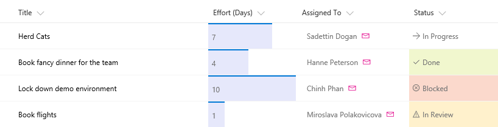

# <a name="use-column-formatting-to-customize-sharepoint"></a>Форматирование столбцов в списках и библиотеках SharePoint

> [!IMPORTANT]
> Функция форматирования столбцов находится в разработке. Этот документ является предварительным и подлежит изменению.

Форматирование столбцов позволяет настраивать поля в списках и библиотеках SharePoint. Для этого создается объект JSON, который описывает элементы, отображаемые при включении поля в список, и стили, применяемые к этим элементам. При форматировании столбцов данные в элементе списка или файле остаются неизменными. Изменяется только их внешний вид. Настраивать поля с помощью форматирования столбцов могут все, кто может создавать списки и управлять ими. 

Например, список с полями "Заголовок", "Трудозатраты", "Кому назначено" и "Состояние" без настройки может выглядеть так: 


Список с полями "Трудозатраты", "Кому назначено" и "Состояние", настроенные с помощью форматирования столбцов, может выглядеть так:



## <a name="how-is-column-formatting-different-than-the-field-customizer"></a>Чем форматирование столбцов отличается от настройщика полей?
Как форматирование столбцов, так и расширение [Настройщик полей SharePoint Framework](https://docs.microsoft.com/ru-RU/sharepoint/dev/spfx/extensions/get-started/building-simple-field-customizer) позволяют настраивать поля в списках SharePoint. Настройщик полей — универсальный инструмент, так как позволяет создавать любой код для управления отображением поля. Форматирование столбцов проще и доступнее, но не так универсально, так как не позволяет создавать пользовательский код и поддерживает только предопределенные элементы и атрибуты. 

В таблице ниже сравниваются форматирование столбцов и настройщик полей.

| Тип поля        | Форматирование столбцов          | Настройщик полей  |
| ------------- |:-------------| :-----|
| Условное форматирование на основе значений элементов и диапазонов значений      | Поддерживается | Поддерживается |
| Ссылки на действия       | Поддержка статических гиперссылок, которые не запускают сценарии      |  Поддержка всех гиперссылок, в том числе запускающих пользовательские сценарии   |
| Визуализация данных | Поддержка простой визуализации, которую можно выразить с помощью HTML и CSS      |   Поддержка произвольной визуализации данных  |

Обычно выполнить поставленную задачу проще и быстрее с помощью форматирования столбцов, чем с помощью настройщика полей. Создавать и публиковать настройки с помощью форматирования столбцов могут все, кто может создавать списки и управлять ими. Используйте настройщик полей для более сложных задач, которые нельзя выполнить с помощью форматирования столбцов.

## <a name="get-started-with-column-formatting"></a>Начало работы с форматированием столбцов
Чтобы открыть панель форматирования столбцов, откройте раскрывающееся меню под столбцом. В разделе **Параметры столбца** выберите **Форматировать этот столбец**.

Если к выбранному столбцу еще не применялось форматирование, эта панель будет выглядеть вот так.


Если форматирование не указано, поле будет отображаться как обычно. Чтобы отформатировать столбец, введите в поле объект JSON.

Чтобы просмотреть параметры форматирования, нажмите **Просмотреть**. Чтобы сохранить изменения, нажмите **Сохранить**. После сохранения изменений форматирование увидят все пользователи, просматривающие список.

Самый простой способ отформатировать столбец — отредактировать пример и применить его к нужному полю. Следующие разделы содержат примеры, которые можно копировать, вставлять и редактировать.

## <a name="display-field-values-basic"></a>Отображение значений поля (базовые настройки)

Самый простой способ отформатировать столбец — вставить значение поля в элемент `<div />`. Этот пример подходит для числовых и текстовых полей, а также полей выбора и даты.

```JSON
{
   "elmType": "div",
   "txtContent": "@currentField"
}
```
Извлечь значения полей некоторых типов немного сложнее. Поля пользователей представлены в системе в виде объектов, а отображаемое имя пользователя содержится в свойстве **Title**. Это измененный пример, который подходит для поля пользователя.

```JSON
{
   "elmType": "div",
   "txtContent": "@currentField.Title"
}
```
Поля подстановки также представлены в виде объектов. Отображаемый текст сохраняется в свойстве **lookupValue**. Этот пример подходит для поля подстановки.

```JSON
{
   "elmType": "div",
   "txtContent": "@currentField.lookupValue"
}
```

## <a name="apply-conditional-formatting"></a>Применение условного форматирования
Форматирование столбцов позволяет применять стили, классы и значки к полям в зависимости от их значений.

### <a name="conditional-formatting-based-on-a-number-range-basic"></a>Условное форматирование на основе диапазона чисел (базовые настройки)
Ниже показан пример условного форматирования, примененного к диапазону чисел.


В этом примере условный оператор `?` используется для применения класса (`sp-field-severity--warning`) к родительскому элементу `<div />`, если значение в текущем поле меньше или равно 70.  В этом случае поле выделяется, если значение меньше или равно 70, и отображается как обычно, если оно больше 70.

```JSON
{
   "elmType": "div",
   "txtContent": "@currentField",
   "attributes": {
      "class": {
         "operator": "?",
         "operands": [
            {
               "operator": "<=",
               "operands": [
                  "@currentField",
                  70
               ]
            },
            "sp-field-severity--warning",
            ""
         ]
      }
   }
}
```

### <a name="conditional-formatting-based-on-the-value-in-a-text-or-choice-field-advanced"></a>Условное форматирование на основе значения в текстовом поле или поле выбора (расширенные настройки)

Ниже показан пример условного форматирования, примененного к полю текста или выбора.


Вы можете применить условное форматирование к полям текста или выбора, которые могут содержать фиксированный набор значений. В примере ниже применяются различные классы в зависимости от того, какое значение имеет поле: "Готово", "Проверка", "Заблокировано" или другое. В этом примере класс CSS (`sp-field-severity--low, sp-field-severity--good, sp-field-severity--warning, sp-field-severity--blocked`) применяется к элементу `<div />` на основе значения поля. Затем элемент `<span />` выводится с атрибутом `IconName`. Этот атрибут применяет другой класс CSS к элементу `<span />`, внутри которого отображается значок [Office UI Fabric](https://dev.office.com/fabric#/). Наконец, выводится другой элемент `<span />`, содержащий значение в поле.

Используйте этот шаблон, чтобы сопоставить разные значения с различными степенями срочности и серьезности. Вы можете отредактировать этот пример, чтобы указать собственные значения полей, а также стили и значки, которые необходимо сопоставить с этими значениями.
<!-- The schema URL will need to be updated when it is changed from customformatter to columnformatting -->
```JSON
{
    "$schema": "http://columnformatting.sharepointpnp.com/columnFormattingSchema.json",
    "debugMode": true,
    "elmType": "div",
    "attributes": {
        "class": {
            "operator": "?",
            "operands": [
                {
                    "operator": "==",
                    "operands": [
                        {
                            "operator": "toString()",
                            "operands": [
                                "@currentField"
                            ]
                        },
                        "Done"
                    ]
                },
                "sp-field-severity--good",
                {
                    "operator": "?",
                    "operands": [
                        {
                            "operator": "==",
                            "operands": [
                                {
                                    "operator": "toString()",
                                    "operands": [
                                        "@currentField"
                                    ]
                                },
                                "In progress"
                            ]
                        },
                        "sp-field-severity--low",
                        {
                            "operator": "?",
                            "operands": [
                                {
                                    "operator": "==",
                                    "operands": [
                                        {
                                            "operator": "toString()",
                                            "operands": [
                                                "@currentField"
                                            ]
                                        },
                                        "In review"
                                    ]
                                },
                                "sp-field-severity--warning",
                                {
                                    "operator": "?",
                                    "operands": [
                                        {
                                            "operator": "==",
                                            "operands": [
                                                {
                                                    "operator": "toString()",
                                                    "operands": [
                                                        "@currentField"
                                                    ]
                                                },
                                                "Blocked"
                                            ]
                                        },
                                        "sp-field-severity--severeWarning",
                                        "sp-field-severity--blocked"
                                    ]
                                }
                            ]
                        }
                    ]
                }
            ]
        }
    },
    "children": [
        {
            "elmType": "span",
            "style": {
                "display": "inline-block",
                "padding": "0 4px"
            },
            "attributes": {
                "iconName": {
                    "operator": "?",
                    "operands": [
                        {
                            "operator": "==",
                            "operands": [
                                {
                                    "operator": "toString()",
                                    "operands": [
                                        "@currentField"
                                    ]
                                },
                                "Done"
                            ]
                        },
                        "CheckMark",
                        {
                            "operator": "?",
                            "operands": [
                                {
                                    "operator": "==",
                                    "operands": [
                                        {
                                            "operator": "toString()",
                                            "operands": [
                                                "@currentField"
                                            ]
                                        },
                                        "In progress"
                                    ]
                                },
                                "Forward",
                                {
                                    "operator": "?",
                                    "operands": [
                                        {
                                            "operator": "==",
                                            "operands": [
                                                {
                                                    "operator": "toString()",
                                                    "operands": [
                                                        "@currentField"
                                                    ]
                                                },
                                                "In review"
                                            ]
                                        },
                                        "Error",
                                        {
                                            "operator": "?",
                                            "operands": [
                                                {
                                                    "operator": "==",
                                                    "operands": [
                                                        {
                                                            "operator": "toString()",
                                                            "operands": [
                                                                "@currentField"
                                                            ]
                                                        },
                                                        "Has issues"
                                                    ]
                                                },
                                                "Warning",
                                                "ErrorBadge"
                                            ]
                                        }
                                    ]
                                }
                            ]
                        }
                    ]
                }
            }
        },
        {
            "elmType": "span",
            "txtContent": "@currentField"
        }
    ]
}

```

## <a name="apply-formatting-based-on-date-ranges"></a>Применение форматирования на основе диапазонов дат
Так как даты часто используются для отслеживания крайних сроков и временных шкал ключевых проектов, форматирование часто применяется на основе значения в поле даты и времени. Чтобы применить форматирование на основе значения этого поля, используйте приведенные ниже шаблоны.

### <a name="formatting-an-item-when-a-date-column-is-before-or-after-todays-date-advanced"></a>Форматирование элемента, если дата в столбце предшествует сегодняшней дате или наступает после нее (расширенные настройки)

На изображении ниже приведено поле, к которому применено условное форматирование даты.


В этом примере поле текущей даты окрашивается в красный цвет, если значение в поле "Дата выполнения" элемента предшествует текущим дате и времени. В отличие от некоторых предыдущих примеров, в этом примере форматирование применяется к одному полю на основе значения в другом поле. Обратите внимание, что для ссылки на поле "Дата выполнения" используется синтаксис [$FieldName]. FieldName — это внутреннее имя поля. В этом примере также используется специальное значение `@now`, которое можно использовать в полях даты и времени. Это значение сопоставляется с текущими датой и временем, которые определяются при загрузке списка.

```JSON
{

   "elmType": "div",
   "txtContent": "@currentField",
   "style": {
      "color": {
         "operator": "?",
         "operands": [
            {
               "operator": "<=",
               "operands": [
                  "[$DueDate]",
                  "@now"
               ]
            },
            "#ff0000",
            ""
         ]
      }
   }
}
```

### <a name="formatting-items-based-on-arbitrary-dates-advanced"></a>Форматирование элементов на основе произвольных дат (расширенные настройки)
Чтобы сравнить значение поля даты и времени с датой, отличной от `@now`, используйте шаблон, приведенный в примере ниже. Здесь поле текущей даты окрашивается в красный цвет, если дата выполнения назначена на завтра или ранее. Для этого используются математические операции с датой. Вы можете добавить миллисекунды к любой дате, чтобы получить новую дату. Например, чтобы добавить к дате один день, выполните уравнение (246 060*1000 = 86 400 000). 
```JSON
{
   "elmType": "div",
   "txtContent": "@currentField",
   "style": {
      "color": {
         "operator": "?",
         "operands": [
            {
               "operator": "<=",
               "operands": [
                  "[$DueDate]",
                  {
                     "operator": "+",
                     "operands": [
                        "@now",
                        86400000
                     ]
                  }
               ]
            },
            "#ff0000",
            ""
         ]
      }
   }
}
```
Чтобы сравнить значение поля даты и времени с другой константой даты, преобразуйте строку в дату с помощью метода **Date()**. В примере ниже поле текущей даты окрашивается в красный цвет, если значение в поле "Дата выполнения" предшествует 22.03.2017.
```JSON
{
   "elmType": "div",
   "txtContent": "@currentField",
   "style": {
      "color": {
         "operator": "?",
         "operands": [
            {
               "operator": "<=",
               "operands": [
                  "[$DueDate]",
                  {
                     "operator": "Date()",
                     "operands": [
                        "3/22/2017"
                     ]
                  }
               ]
            },
            "#ff0000",
            ""
         ]
      }
   }
}
```

## <a name="create-clickable-actions"></a>Создание интерактивных действий
С помощью форматирования столбцов можно показывать гиперссылки для перехода на другие веб-страницы или запуска специальных функций. Можно показывать только статические ссылки `http://`, параметризуемые с помощью значений из полей в списке. Форматирование столбцов невозможно использовать для вывода ссылок на протоколы, отличные от `http://`.

### <a name="turn-field-values-into-hyperlinks-basic"></a>Преобразование значения полей в гиперссылки (базовые настройки)
В этом примере показано, как преобразовать текстовое поле с финансовыми символами в гиперссылку, которая позволяет перейти на страницу Yahoo Finance с актуальными котировками для соответствующих символов. В этом примере используется оператор `+`, позволяющий добавить значение текущего поля к статической гиперссылке <a>http://finance.yahoo.com/quote/</a>. Этот шаблон также можно использовать, если вы хотите предоставить пользователям возможность просматривать контекстную информацию, связанную с элементом, или запустить бизнес-процесс для текущего элемента, если эта информация или процесс доступны по гиперссылке, параметризуемой с помощью значений из элемента списка.


```JSON
{
   "elmType": "a",
   "txtContent": "@currentField",
   "attributes": {
      "target": "_blank",
      "href": {
         "operator": "+",
         "operands": [
            "http://finance.yahoo.com/quote/",
            "@currentField"
         ]
      }
   }
}
```
### <a name="add-an-action-button-to-a-field-advanced"></a>Добавление в поле кнопки действия (расширенные настройки)
На рисунке ниже приведены кнопки действия, добавленные в поле.


С помощью форматирования столбцов можно отображать ссылки на быстрые действия рядом с полями. В этом примере, предназначенном для поля пользователя, отображаются два элемента в родительском элементе `<div />`:

- элемент `<span />`, содержащий отображаемое имя пользователя;
- элемент `<a />`, открывающий ссылку mailto:, которую можно использовать для создания письма, тема и основной текст которого динамически заполняются с помощью метаданных элемента. Для оформления элемента `<a />` используются классы [Fabric](https://developer.microsoft.com/ru-RU/fabric) `ms-Icon`, `ms-Icon—Mail` и `ms-QuickAction`, благодаря чему он похож на интерактивный значок электронной почты. 

```JSON
{
    "elmType": "div",
    "children": [
        {
            "elmType": "span",
            "style": {
                "padding-right": "8px"
            },
            "txtContent": "@currentField.title"
        },
        {
            "elmType": "a",
            "attributes": {
                "iconName": "Mail",
                "class": "sp-field-quickActions",
                "href": {
                    "operator": "+",
                    "operands": [
                        "mailto:",
                        "@currentField.email",
                        "?subject=Task status&body=Hey, how is your task coming along?.\r\n---\r\n",
                        "@currentField.title",
                        "\r\nClick this link for more info. http://contoso.sharepoint.com/sites/ConferencePrep/Tasks/Prep/DispForm.aspx?ID=",
                        "[$ID]"
                    ]
                }
            }
        }
    ]
}
```
## <a name="create-simple-data-visualizations"></a>Создание простой визуализации данных
Форматирование столбцов позволяет сочетать условные и арифметические операции для выполнения базовой визуализации данных.

### <a name="format-a-number-column-as-a-data-bar-advanced"></a>Форматирование числового столбца в виде гистограммы (расширенные настройки)
На рисунке ниже приведен числовой столбец, отформатированный в виде гистограммы.


В этом примере для визуализации числового поля `@currentField` в виде гистограммы применяются стили `background-color` и `border-top`. Размер столбцов зависит от значения атрибута `width`: `100%`, если значение больше 20, и `(@currentField * 5)%`, если значение меньше 10. Таким образом, ширина гистограммы для значений 1 составляет 5 %, для значений 2 — 10 % и т. д. Чтобы применить этот пример к своему числовому столбцу, вы можете настроить условие границы (`20`) в соответствии с максимальным предполагаемым значением в поле, а также множитель (`5`), чтобы указать, на сколько должен увеличиваться столбец в зависимости от значения в поле.
```JSON
{
  "debugMode": true,
  "elmType": "div",
  "txtContent": "@currentField",
  "attributes": {
   "class": "sp-field-dataBars"
  },
  "style": {
    "width": {
      "operator": "?",
      "operands": [
        {
          "operator": ">",
          "operands": [
            "@currentField",
            "20"
          ]
        },
        "100%",
        {
          "operator": "+",
          "operands": [
            {
              "operator": "toString()",
              "operands": [
                {
                  "operator": "*",
                  "operands": [
                    "@currentField",
                    5
                  ]
                }
              ]
            },
            "%"
          ]
        }
      ]
    }
  }
}
```

### <a name="show-trending-uptrending-down-icons-advanced"></a>Отображение значков тенденций к увеличению и уменьшению (расширенные настройки)
Ниже показан список, к которому добавлены значки тенденций к увеличению и уменьшению.


В этом примере используются два числовых поля `Before` и `After`, значения которых можно сравнить. Соответствующий значок тенденции отображается рядом с полем `After` в зависимости от значения этого поля по сравнению со значением в поле `Before`.  Если значение поля `After` выше, используется `sp-field-trending--up`, а если значение поля `After` ниже, используется `sp-field-trending--down`.

```JSON
{
    "debugMode": true,
    "elmType": "div",
    "children": [
        {
            "elmType": "span",
            "attributes": {
                "class": {
                    "operator": "?",
                    "operands": [
                        {
                            "operator": ">",
                            "operands": [
                                "[$After]",
                                "[$Before]"
                            ]
                        },
                        "sp-field-trending--up",
                        "sp-field-trending--down"
                    ]
                },
                "iconName": {
                    "operator": "?",
                    "operands": [
                        {
                            "operator": ">",
                            "operands": [
                                "[$After]",
                                "[$Before]"
                            ]
                        },
                        "SortUp",
                        {
                            "operator": "?",
                            "operands": [
                                {
                                    "operator": "<",
                                    "operands": [
                                        "[$After]",
                                        "[$Before]"
                                    ]
                                },
                                "SortDown",
                                ""
                            ]
                        }
                    ]
                }
            }
        },
        {
            "elmType": "span",
            "txtContent": "[$After]"
        }
    ]
}
```

## <a name="supported-column-types"></a>Поддерживаемые типы столбцов
Форматировать можно следующие типы столбцов:
* Однострочный текст 
* Число
* Выбор
* Пользователь или группа
* Да/нет
* Гиперссылка 
* Рисунок
* Дата и время
* Подстановка
* Заголовок (в списках)

Следующие типы столбцов не поддерживаются:
* Управляемые метаданные
* Имя файла (в библиотеках документов)
* Вычисляемый
* Метка хранения

## <a name="style-guidelines"></a>Рекомендации по стилю

### <a name="predefined-classes"></a>Предопределенные классы
Вы можете использовать указанные ниже предопределенные классы.

| Имя класса | Снимок экрана |
| ------------- |:-------------|
| sp-field-customFormatBackground |Указывает параметры заполнения и поля для всех классов, использующих фон. |
| sp-field-severity--good | |
| sp-field-severity--low | |
| sp-field-severity--warning |  |
| sp-field-severity--severeWarning |  |
| sp-field-severity--blocked |  |
| sp-field-dataBars | |
| sp-field-trending--up | |
| sp-field-trending--down | |
| sp-field-quickAction | |

## <a name="predefined-icons"></a>Предопределенные значки

Вы можете использовать предопределенные значки из Office UI Fabric. Дополнительные сведения см. на [веб-сайте Fabric](https://dev.office.com/fabric#/styles/icons). 

## <a name="creating-custom-json"></a>Создание собственной нотации JSON
Вы можете легко создать собственную нотацию JSON для форматирования столбцов, если понимаете схему. Чтобы создать собственные параметры форматирования столбцов:

1. [Скачайте Visual Studio Code](https://code.visualstudio.com/Download). Это быстро и бесплатно. 

2. В Visual Studio Code создайте пустой файл и сохраните его с расширением JSON.

3. Вставьте в свой пустой файл приведенные ниже строки кода.

    ```JSON
    {
    "$schema": "http://columnformatting.sharepointpnp.com/columnFormattingSchema.json"
    }
    ```
    Теперь вы можете использовать функции проверки и автозаполнения при создании нотации JSON. Вы можете начать добавлять нотацию JSON после первой строки, определяющей расположение схемы. 

>[!Tip]
>В любой момент нажмите клавиши **CTRL** + **ПРОБЕЛ**, чтобы отобразить предложения свойств и значений. Дополнительные сведения об изменении нотации JSON в Visual Studio Code см. на странице <a>https://code.visualstudio.com/Docs/languages/json</a>.


## <a name="detailed-syntax-reference"></a>Ссылка на подробный синтаксис

### <a name="elmtype"></a>elmType

Указывает тип создаваемого элемента. Допустимые элементы:

- div
- span
- a
- img
- svg
- path

Любое другое значение приведет к ошибке.

### <a name="txtcontent"></a>txtContent

Необязательно свойство, которое задает текстовое содержимое элемента, указанного с помощью свойства `elmType`. Значение этого свойства может представлять собой строку (в том числе специальную) или объект Expression. 

### <a name="style"></a>style

Необязательно свойство, которое задает атрибуты стиля, применяемые к элементу, который указан с помощью свойства `elmType`. Это объект с парами имя-значение, которые соответствуют именам и значениям CSS. Значение каждого из свойств объекта style может представлять собой строку (в том числе специальную) или объект Expression. Поддерживаются следующие атрибуты style:

    'background-color'
    'fill'
    'background-image'
    'border'
    'border-bottom'
    'border-bottom-color'
    'border-bottom-style'
    'border-bottom-width'
    'border-color'
    'border-left'
    'border-left-color'
    'border-left-style'
    'border-left-width'
    'border-right'
    'border-right-color'
    'border-right-style'
    'border-right-width'
    'border-style'
    'border-top'
    'border-top-color'
    'border-top-style'
    'border-top-width'
    'border-width'
    'outline'
    'outline-color'
    'outline-style'
    'outline-width'
    'border-bottom-left-radius'
    'border-bottom-right-radius'
    'border-radius'
    'border-top-left-radius'
    'border-top-right-radius'
    'box-decoration-break'
    'box-shadow'
    'box-sizing'

    'overflow-x'
    'overflow-y'
    'overflow-style'
    'rotation'
    'rotation-point'

    'opacity'

    'height'
    'max-height'
    'max-width'
    'min-height'
    'min-width'
    'width'

    'align-items'
    'box-align'
    'box-direction'
    'box-flex'
    'box-flex-group'
    'box-lines'
    'box-ordinal-group'
    'box-orient'
    'box-pack'

    'font'
    'font-family'
    'font-size'
    'font-style'
    'font-variant'
    'font-weight'
    'font-size-adjust'
    'font-stretch'

    'grid-columns'
    'grid-rows'

    'margin'
    'margin-bottom'
    'margin-left'
    'margin-right'
    'margin-top'

    'column-count'
    'column-fill'
    'column-gap'
    'column-rule'
    'column-rule-color'
    'column-rule-style'
    'column-rule-width'
    'column-span'
    'column-width'
    'columns'

    'padding'
    'padding-bottom'
    'padding-left'
    'padding-right'
    'padding-top'

    'bottom'
    'clear'
    'clip'
    'display'
    'float'
    'left'
    'overflow'
    'position' 
    'right'
    'top'
    'visibility'
    'z-index'

    'border-collapse'
    'border-spacing'
    'caption-side'
    'empty-cells'
    'table-layout'

    'color'
    'direction'
    'letter-spacing'
    'line-height'
    'text-align'
    'text-decoration'
    'text-indent'
    'text-transform'
    'unicode-bidi'
    'vertical-align'
    'white-space'
    'word-spacing'
    'hanging-punctuation'
    'punctuation-trim'
    'text-align-last'
    'text-justify'
    'text-outline'
    'text-shadow'
    'text-wrap'
    'word-break'
    'word-wrap'

В приведенном ниже примере показано значение объекта style. В этом примере будут применены два свойства style (`padding` и `background-color`). `padding` — это жестко заданное значение строки. Значение `background-color` — это объект Expression, который окрашивается в красный (#ff0000) или зеленый (#00ff00) цвет в зависимости от того, меньше ли значение текущего поля (на которое указывает @currentField) чем 40. Дополнительную сведения см. в разделе "Объект Expression". 


```JSON
{
   "padding": "4px",
   "background-color": {
      "operator": "?",
      "operands": [
         {
            "operator": "<",
            "operands": [
               "@currentField",
               40
            ]
         },
         "#ff0000",
         "#00ff00"
      ]
   }
}
```

### <a name="attributes"></a>attributes

Необязательно свойство, которое задает дополнительные атрибуты, добавляемые к элементу, который указан с помощью свойства `elmType`. Это объект с парами имя-значение. Допустимые имена атрибутов:

- href
- rel
- src
- class
- target
- title
- role
- iconName
- d
- aria

Любое другое имя атрибута приведет к ошибке. Значения атрибутов могут представлять собой объекты Expression или строки. В следующем примере к элементу, указанному с помощью свойства `elmType`, добавляются два атрибута (`target` и `href`). Атрибут `target` жестко задается в строке. Атрибут `href` — это выражение, которое будет оценено во время выполнения по формуле (http://finance.yahoo.com/quote/ + значение текущего поля (@currentField)). 
```JSON
{
   "target": "_blank",
   "href": {
      "operator": "+",
      "operands": [
         "http://finance.yahoo.com/quote/",
         "@currentField"
      ]
   }
}
```

### <a name="children"></a>children

Необязательно свойство, которое задает дочерние элементы для элемента, указанного с помощью свойства `elmType`. Это значение задается в качестве массива объектов `CustomFormatter`. Возможен произвольный уровень вложения. Если элемент содержит свойство `txtContent`, дочерние свойства игнорируются. 

<!-- Verify that CustomFormatter is the correct object name? -->

### <a name="debugmode"></a>debugMode

Необязательно свойство, используемое для отладки. Выводит сообщения об ошибках и записывает предупреждения в журнале консоли. 

### <a name="expression-object"></a>Объект Expression

Значения свойств `txtContent`, style и attribute можно представить в виде выражений для оценки во время выполнения на основе контекста текущего объекта (или строки). В объекты Expression можно вложить другие объекты Expression. 

В этом примере показан объект Expression, который выполняет следующее выражение:

`(@currentField > 40) ? '100%' : (((@currentField * 2.5).toString() + '%')`

```JSON
{
   "operator": "?",
   "operands": [
      {
         "operator": ">",
         "operands": [
            "@currentField",
            "40"
         ]
      },
      "100%",
      {
         "operator": "+",
         "operands": [
            {
               "operator": "toString()",
               "operands": [
                  {
                     "operator": "*",
                     "operands": [
                        "@currentField",
                        2.5
                     ]
                  }
               ]
            },
            "%"
         ]
      }
   ]
}
```

### <a name="operators"></a>Операторы

Операторы задают тип выполняемой операции. Допустимы такие операторы:

- \+
- \-
- /
- \*
- <
- \>
- ==
- !=
- <=
- \>=
- ||
- &&
- toString()
- Number()
- Date()
- cos
- sin
- ? 

**Бинарные операторы.** Стандартные арифметические бинарные операторы, требующие два операнда: 

- \+
- \-
- /
- \*
- <
- \>
- <=
- \>= 

**Унарные операторы.** Стандартные унарные операторы, требующие только один операнд: 

- toString()
- Number()
- Date()
- cos
- sin  

**Условный оператор**:

- ?

Он позволяет получить выражение, эквивалентное a ? b : c. Если выражение a принимает значение true, результатом является b. В противном случае результат выражения — c.

### <a name="operands"></a>operands
Задает параметры, или операнды, для выражения. Это массив объектов Expression или базовые значения.

### <a name="special-string-values"></a>Значения специальных строк
Значения свойств `txtContent`, style и attribute могут представлять собой строки или объекты Expression. Поддерживаются несколько шаблонов специальных строк для извлечения значений из полей в списке и контексте пользователя.

#### <a name="currentfield"></a>"@currentField"
Возвращает значение текущего поля. 

Поля некоторых типов представлены в виде объектов. Чтобы вывести значение из объекта, сошлитесь на определенное свойство в этом объекте. Например, если текущее поле представляет собой поле пользователя или группы, укажите @currentField.title, чтобы получить имя пользователя, которое обычно отображается в списках. Ниже приведены типы полей, которые представлены в виде объектов, со списком их свойств.

**Поля пользователей**

Поле пользователя имеет указанные ниже свойства.

```JSON
{
   "id": "122",
   "title": "Kalya Tucker",
   "email": "kaylat@contoso.com",
   "sip": "kaylat@contoso.com",
   "picture": "https://contoso.sharepoint.com/kaylat_contoso_com_MThumb.jpg?t=63576928822",
   "jobTitle": "",
   "department": ""
}
```

**Поля даты и времени**

Значения полей даты и времени можно получить разными способами в зависимости от необходимого формата даты. Поддерживаются следующие способы преобразования значений дат в определенные форматы: 

* ```toLocaleString()``` — отображает дату и время;
* ```toLocaleDateString()``` — отображает только дату;
* ```toLocaleTimeString()``` — отображает только время.

Например, при использовании следующей нотации JSON текущее поле (если это поле даты) будет отображено в виде строки с датой и временем:

```JSON
{
   "elmType": "div",
   "txtContent": {
        "operator": "toLocaleString()",
        "operands" : ["@currentField"]
    }
}
```

**Поля подстановки**

Поле подстановки имеет указанные ниже свойства.

```JSON
{
   "lookupId": "100",
   "lookupValue": "North America",
}
```
В примере ниже показано, как применить поле подстановки к текущему полю.
```JSON
{
   "elmType": "a",
   "txtContent": "@currentField.lookupValue",
   "attributes": {
      "href": {
         "operator": "+",
         "operands": [
            "https://contoso.sharepoint.com/teams/Discovery/Lists/Regions/DispForm.aspx?ID=",
            "@currentField.lookupId"
         ]
      },
      "target": "_blank"
   }
}
``` 

#### <a name="fieldname"></a>"[$FieldName]" 
Передаваемый контекст представляет собой всю строку. Используйте его для ссылки на значения других полей. Например, чтобы получить значение поля MarchSales, используйте "[$MarchSales]".

Если значение поля представляет собой объект, можно получить доступ к свойствам этого объекта. Например, чтобы получить доступ к свойству Title поля MarchSales, используйте "[$MarchSales].Title".  

#### <a name="me"></a>"@me"
Возвращает адрес электронной почты вошедшего в систему пользователя. 

#### <a name="now"></a>"@now"
Возвращает текущие дату и время. 

## <a name="see-also"></a>См. также

- [Форматирование столбцов](https://support.office.com/en-us/article/Column-formatting-1f927342-2bed-4745-b727-ff8b7ff96b22?ui=en-US&rs=en-US&ad=US)
