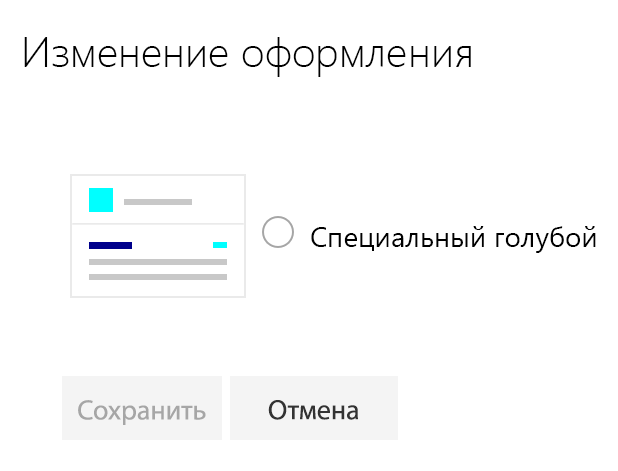

# <a name="sharepoint-site-theming-powershell-cmdlets"></a>Настройка тем для сайтов SharePoint: командлеты PowerShell

Администраторы клиента SharePoint могут с помощью командлетов PowerShell создавать, получать и удалять темы сайтов. Разработчики могут также использовать [REST API](sharepoint-site-theming-rest-api.md) SharePoint для задач управления темами.

Чтобы узнать, как определяются и сохраняются темы, см. статью [Справочник по схеме JSON](sharepoint-site-theming-json-schema.md).

## <a name="getting-started"></a>Начало работы

Вот что надо сделать, чтобы запустить командлеты PowerShell для управления темами:

1. Скачайте и установите [командную консоль SharePoint Online](https://www.microsoft.com/en-us/download/details.aspx?id=35588). Если у вас уже установлена консоль предыдущей версии, сначала удалите ее, а затем установите последнюю версию.
2. Подключитесь к клиенту SharePoint, следуя инструкциям в статье [Подключение к PowerShell в SharePoint Online](https://technet.microsoft.com/ru-RU/library/fp161372.aspx).

Чтобы проверить настройки, попробуйте считать параметр HideDefaultThemes с помощью командлета **Get-HideDefaultThemes**. Вы можете продолжить, если командлет после выполнения возвращает значение False без ошибок, как показано в примере ниже.

```powershell
c:\> Get-HideDefaultThemes
False
```
## <a name="site-theme-cmdlets"></a>Командлеты для управления темами сайтов

Для управления темами сайтов с помощью PowerShell доступны следующие командлеты:

* **Add-SPOTheme**, который создает настраиваемую или перезаписывает существующую тему, чтобы изменить ее параметры;
* **Get-SPOTheme**, который получает параметры для существующей темы;
* **Remove-SPOTheme**, который удаляет тему из коллекции тем;
* **Set-HideDefaultThemes**, который указывает, следует ли предоставлять доступ к стандартным темам;
* **Get-HideDefaultThemes**, который запрашивает текущий параметр HideDefaultThemes.

## <a name="add-spotheme"></a>Add-SPOTheme

Командлет **Add-SPOTheme** создает новую или обновляет существующую тему. Параметры цветовой палитры передаются в качестве словаря.

Приведенный ниже пример кода создает тему Custom Cyan, в которой цветовая палитра включает различные оттенки голубого цвета. Обратите внимание, что в этом примере функция ```HashToDictionary``` используется для преобразования в словарь хэш-таблицы, созданной с помощью нотации ```@{}```, как того требует командлет **Add-SPOTheme**.

```powershell
function HashToDictionary {
  Param ([Hashtable]$ht)
  $dictionary = New-Object "System.Collections.Generic.Dictionary``2[System.String,System.String]"
  foreach ($entry in $ht.GetEnumerator()) {
    $dictionary.Add($entry.Name, $entry.Value)
  }
  return $dictionary
}

$themepallette = HashToDictionary(
 @{
  "themePrimary" = "#00ffff";
  "themeLighterAlt" = "#f3fcfc";
  "themeLighter" = "#daffff";
  "themeLight" = "#affefe";
  "themeTertiary" = "#76ffff";
  "themeSecondary" = "#39ffff";
  "themeDarkAlt" = "#00c4c4";
  "themeDark" = "#009090";
  "themeDarker" = "#005252";
  "neutralLighterAlt" = "#f8f8f8";
  "neutralLighter" = "#f4f4f4";
  "neutralLight" = "#eaeaea";
  "neutralQuaternaryAlt" = "#dadada";
  "neutralQuaternary" = "#d0d0d0";
  "neutralTertiaryAlt" = "#c8c8c8";
  "neutralTertiary" = "#a6a6a6";
  "neutralSecondaryAlt" = "#767676";
  "neutralSecondary" = "#666666";
  "neutralPrimary" = "#333";
  "neutralPrimaryAlt" = "#3c3c3c";
  "neutralDark" = "#212121";
  "black" = "#000000";
  "white" = "#fff";
  "primaryBackground" = "#fff";
  "primaryText" = "#333"
 }
)

Add-SPOTheme -Name "Custom Cyan" -Palette $themepallette -IsInverted $false
```
Если вы хотите обновить существующую тему (например, чтобы изменить некоторые параметры цвета), используйте тот же синтаксис, что и ранее, но добавьте флажок *-Overwrite* в командлет **Add-SPOTheme**.

```powershell
Add-SPOTheme -Name "Custom Cyan" -Palette $themepallette -IsInverted $false -Overwrite
```
При добавлении тема не применяется к каким-либо сайтам. Она добавляется в хранилище клиента, а затем вносится в список тем в разделе **Изменение оформления** для современных страниц.

## <a name="get-spotheme"></a>Get-SPOTheme

Командлет **Get-SPOTheme** возвращает параметры существующей темы. Например, вот как использовать командлет **Get-SPOTheme**, чтобы вернуть параметры темы Custom Cyan, созданной предыдущим примером кода.

```powershell
C:\> Get-SPOTheme -Name "Custom Cyan" | ConvertTo-Json
```
```json
{
    "Name":  "Custom Cyan",
    "Palette":  {
                    "themeLight":  "#affefe",
                    "themeTertiary":  "#76ffff",
                    "black":  "#000000",
                    "neutralSecondary":  "#666666",
                    "neutralTertiaryAlt":  "#c8c8c8",
                    "themeSecondary":  "#39ffff",
                    "themeDarker":  "#005252",
                    "primaryBackground":  "#fff",
                    "neutralQuaternary":  "#d0d0d0",
                    "neutralPrimaryAlt":  "#3c3c3c",
                    "neutralPrimary":  "#333",
                    "themeDark":  "#009090",
                    "themeLighter":  "#daffff",
                    "neutralTertiary":  "#a6a6a6",
                    "neutralQuaternaryAlt":  "#dadada",
                    "themeLighterAlt":  "#f3fcfc",
                    "white":  "#fff",
                    "neutralSecondaryAlt":  "#767676",
                    "neutralLighter":  "#f4f4f4",
                    "neutralLight":  "#eaeaea",
                    "neutralDark":  "#212121",
                    "themeDarkAlt":  "#00c4c4",
                    "neutralLighterAlt":  "#f8f8f8",
                    "primaryText":  "#333",
                    "themePrimary":  "#00ffff"
                },
    "IsInverted":  false
}
```
Обратите внимание, что в этом примере для отображения темы в формате JSON используется фильтр PowerShell _ConvertTo-Json_.

## <a name="remove-spotheme"></a>Remove-SPOTheme

Командлет **Remove-SPOTheme** удаляет тему из хранилища клиента. Например, он может удалить тему Custom Cyan, которая использовалась в предыдущих примерах.

```powershell
c:\> Remove-SPOTheme -Name "Custom Cyan"
```
## <a name="set-hidedefaultthemes"></a>Set-HideDefaultThemes

_ПРИМЕЧАНИЕ. Этот командлет будет называться ```Set-SPOHideDefaultThemes``` в следующем выпуске в соответствии с другими командлетами PowerShell в SharePoint._

Командлет **Set-HideDefaultThemes** позволяет указать, следует ли включить в список выбора тем стандартные темы SharePoint. Например, вам может потребоваться создать специальные темы для своих сайтов, а затем удалить стандартные темы, чтобы использовать на всех страницах только специальные темы.

Задайте для этого параметра значение _$true_, чтобы скрыть стандартные темы, или значение _$false_ (используется по умолчанию), чтобы разрешить использовать стандартные темы. Например, этот командлет скрывает стандартные темы.

```powershell
Set-HideDefaultThemes $true
```
Если после создания темы Custom Cyan скрыть стандартные темы, в списке тем в разделе **Изменение оформления** останется только одна специальная тема.



Чтобы восстановить стандартные темы в списке выбора тем, используйте следующий командлет:
```powershell
Set-HideDefaultThemes $false
```

## <a name="get-hidedefaultthemes"></a>Get-HideDefaultThemes

_ПРИМЕЧАНИЕ. Этот командлет будет называться ```Get-SPOHideDefaultThemes``` в следующем выпуске в соответствии с другими командлетами PowerShell для SharePoint._

Командлет **Get-HideDefaultThemes** получает текущее значение параметра **Set-HideDefaultThemes**. Этот командлет можно использовать в скрипте PowerShell, чтобы обеспечить считывание параметра и последующее выполнение различных действий с учетом того, скрыты ли стандартные темы. Этот командлет не имеет параметров.

```powershell
c:\> Get-HideDefaultThemes
False
```

## <a name="see-also"></a>См. также

* [Обзор настройки тем для сайтов SharePoint](sharepoint-site-theming-overview.md)
* [Настройка тем для сайтов SharePoint: схема JSON](sharepoint-site-theming-json-schema.md)
* [Настройка тем для сайтов SharePoint: CSOM](sharepoint-site-theming-csom.md)
* [Настройка тем для сайтов SharePoint: REST API](sharepoint-site-theming-rest-api.md)
* [Командная консоль SharePoint Online](https://www.microsoft.com/en-us/download/details.aspx?id=35588)
* [Подключение к PowerShell в SharePoint Online](https://technet.microsoft.com/ru-RU/library/fp161372.aspx)
