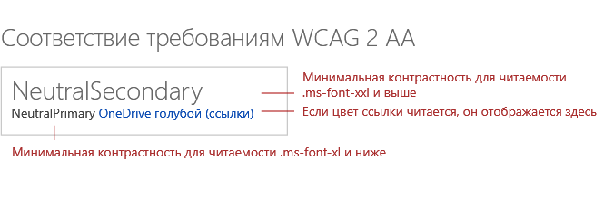
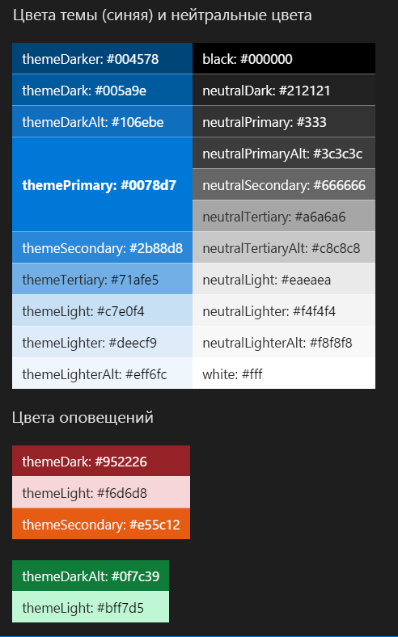

<!--Based on how rough this content is in its current state, i'm going to pull it from this initial release so we can edit and better prepare. -->

# Специальные возможности в макете веб-части SharePoint

При разработке веб-части SharePoint важно создать одинаковые возможности для всех пользователей, в том числе для пользователей с ограничениями зрения, слуха, подвижности, речи и способности к восприятию информации. Специальные возможности нужны не только людям с ограничениями, но и в тех ситуациях, когда использование устройства затруднено. Если они обеспечены, разработка выполнена качественно.

## Рекомендации по специальным возможностям

<!-- Make sure that this is an external resource that folks can access. Original link was to a OneNote file. -->
Все продукты Майкрософт должны соответствовать требованиям, приведенным в [стандартах Майкрософт, касающихся специальных возможностей](https://microsoft.sharepoint.com/teams/msenable/Pages/MASDetails.aspx
"Ссылка на стандарты Майкрософт, касающиеся специальных возможностей").  

<!-- Fabric components are not designed to be accessible already? And, shouldn't components that aren't based on Fabric also be accessible? -->

Если вы создаете диалоговое окно, средство выбора файлов или любой другой компонент [Office UI Fabric](https://developer.microsoft.com/ru-RU/fabric#/components), следуйте инструкциям из этой статьи для обеспечения специальных возможностей в отношении содержимого. 

<!-- Not sure why we have that link? It currently goes to the OneNote file. Where is the Common UI Controls content? Is that related to accessibility? [v-licapu] - I agree; we shouldn't be linking to this unless it's live to external audiences; even I can't access it. I moved it to within the comment: 
[Common UI Controls](https://microsoft.sharepoint.com/teams/STS/_layouts/OneNote.aspx?id=%2Fteams%2FSTS%2FShared%20Documents%2FSP%20Accessibility%2FAccessibility%20Guidance&wd=target%28Accessibility%20101.one%7C0005C142-938C-4411-B543-B9F4199E19B3%2FEverything%20you%20need%20to%20know%20about%20Accessibility%7CE099AFE3-8804-4E1F-BA50-99493AB8A3D0%2F%29 "Link to Common UI Controls") -->

## Проверка специальных возможностей

<!-- FYI, I added links. Can we assume that our target audience uses the Edge browser? -->

Сначала проверьте веб-часть, используя [экранный диктор](https://support.microsoft.com/ru-RU/help/22798/windows-10-narrator-get-started) и Microsoft Edge, затем — при помощи [JAWS](http://www.freedomscientific.com/Products/Blindness/JAWS).

Экранный диктор и Microsoft Edge соответствуют стандартам. Используя эту комбинацию инструментов, вы с большей вероятностью обнаружите проблемы. С ее помощью можно подтвердить, что сайт соответствует стандартам в отношении специальных возможностей. 

JAWS — лидер рынка среди средств чтения с экрана. JAWS включает компоненты, позволяющие улучшить специальные возможности некоторых веб-сайтов и недоступные в других средствах чтения с экрана. Поэтому тестирование при помощи JAWS не всегда гарантирует, что сайт соответствует всем требованиям к специальным возможностям. 
 
Вы также можете определить сочетание браузера и средства чтения с экрана, которое охватывает наибольшую долю рынка для вашего веб-сайта.

<!-- Delete? This doesn't seem like text that should be in externally published docs? 
When suppliers test with JAWS, we ask them to repro identified bugs with Narrator and Edge. In the case a bug does not repro with Narrator/Edge it is sent to Mary Smith who works with VFO for a Jaws specific fix. 
-->

## Навигация с помощью клавиатуры

<!-- Is this section telling people how to navigate via a keyboard, or how to design to optimize for keyboard navigation? If the former, . -->

Для некоторых пользователей навигация по сайту с помощью клавиатуры более доступна. Опытные пользователи тоже часто обращаются к этому способу навигации. Можно использовать сочетания клавиш (например, клавишу табуляции — для открытия элементов управления на странице, а клавиши со стрелками — для перехода между ними).

### Навигация между элементами управления

Каждому элементу управления соответствует позиция табуляции. В отношении элемента управления применяются приведенные ниже правила.

- Обычно первая позиция табуляции — это верхняя левая область элемента управления, а последняя позиция — его нижняя правая область.
- На модальных поверхностях последней позицией табуляции должны быть действия фиксации.
- В списках первая позиция табуляции должна быть первым элементом списка, далее идут команды, а затем — навигация, настройки и т. д.

<!-- We should make sure the content in the accessibility topic is accessibible. ;) Please describe the information that the image conveys; something like this (also consider making the image an actual screen shot, that might be more clear):

In the following image:
The first tab is the list item.
The second tab is the command.
The third tab is the navigation.
-->

 

### Навигация в элементе управления

Вы можете использовать клавиши со стрелками для перемещения между частями элемента управления (например, пунктами меню, командами на панели команд или элементами списка).

<!-- This image is not very clear. Do you need to have the "blank" list box on the left? -->

 

### Выбор текущего элемента

Используйте клавишу пробела, чтобы выбрать или отменить выбор элемента, который в настоящее время находится в фокусе в элементе управления.

 

### Запуск элемента управления

Нажмите клавишу ВВОД, чтобы запустить элемент управления.

 

### Выход из элемента управления

Нажмите клавишу **ESC**, чтобы выйти из элемента управления и вернуться к контейнеру.

 

### Переход к первому или последнему элементу

Нажмите клавишу **HOME** или **END**, чтобы перейти сразу к первому или последнему элементу списка, меню и т. д.

 

## Навигация при помощи средства чтения с экрана

Пользователи с нарушениями зрения полагаются на средства чтения с экрана для навигации по пользовательскому интерфейсу сайта. 

<!-- Narrator isn't a third-party product. This image needs more text/explanation; please also clarify the alt text. Is this section important, or can it be removed, given the previous mention of testing with Narrator and JAWS? Again, the intent/target audience for this information isn't clear - is it for the user, or the designer? Can you explain why this information is important from the designer's POV? -->

## Замещающий текст и текстовые записи

Замещающий текст позволяет добавлять описания изображений, которые могут быть использованы средствами чтения с экрана. Это удобно для людей с нарушениями зрения, которые не могут получать информацию визуально. Проследите, чтобы замещающий текст был описательным, так как некоторые устройства для чтения получают передаваемую изображением информацию, используя средство чтения с экрана. 

Не полагайтесь только на цвет, чтобы передать смысл. Полагайтесь и на цвет, и на форму.

Для полного соответствия стандартам в отношении специальных возможностей добавьте на сайт замещающий текст и полную текстовую запись аудио- и видеоконтента.

## Минимальная контрастность для читаемости

Минимальный уровень контрастности необходим, чтобы помочь пользователям с нарушениями зрения ознакомиться с содержимым страницы. Важно также улучшить читаемость в условиях низкой освещенности и бликов. 

<!--Original image -->

### Цвета темы (синяя) с нейтральными цветами и цвета оповещений

 

<table>
<tr>
<td style="color:white; background-color:#004578">themeDarker: #004578</td>
<td style="color:white; background-color:#000000">black: #000000</td>
</tr>
<tr>
<td style="color:white; background-color:#005a9e">themeDark: #005a9e</td>
<td style="color:white; background-color:#212121">neutralDark: #212121</td>
</tr>
<tr>
<td style="color:white; background-color:#106ebe">themeDarkAlt: #106ebe</td>
<td style="color:white; background-color:#333">neutralPrimary: #333</td>
</tr>
<tr>
<td rowspan="3" style="font-weight:bold; vertical-align:middle; color:white; background-color:#0078d7">themePrimary: #0078d7</td>
<td style="color:white; background-color:#3c3c3c">neutralPrimaryAlt: #3c3c3c</td>
</tr>
<tr>
<td style="color:white; background-color:#666666">neutralSecondary: #666666</td>
</tr>
<tr>
<td style="color:black; background-color:#a6a6a6">neutralTertiary: #a6a6a6</td>
</tr>
<tr>
<td style="color:white; background-color:#2b88d8">themeSecondary: #2b88d8</td>
<td style="color:black; background-color:#c8c8c8">neutralTertiaryAlt: #c8c8c8</td>
</tr>
<tr>
<td style="color:black; background-color:#71afe5">themeTertiary: #71afe5</td>
<td style="color:black; background-color:#eaeaea">neutralLight: #eaeaea</td>
</tr>
<tr>
<td style="color:black; background-color:#c7e0f4">themeLight: #c7e0f4</td>
<td style="color:black; background-color:#f4f4f4">neutralLighter: #f4f4f4</td>
</tr>
<tr>
<td style="color:black; background-color:#deecf9">themeLighter: #deecf9</td>
<td style="color:black; background-color:#f8f8f8">neutralLighterAlt: #f8f8f8</td>
</tr>
<tr>
<td style="color:black; background-color:#eff6fc">themeLighterAlt: #eff6fc</td>
<td style="color:black; background-color:#fff">white: #fff</td>
</tr>
</table>

 

<table>
<tr>
<td style="color:white; background-color:#952226">themeDark: #952226</td>
</tr>
<tr>
<td style="color:black; background-color:#f6d6d8">themeLight: #f6d6d8</td>
</tr>
<tr>
<td style="color:white; background-color:#e55c12">themeSecondary: #e55c12</td>
</tr>
</table>

 

<table>
<tr>
<td style="color:white; background-color:#0f7c39">themeDarkAlt: #0f7c39</td>
</tr>
<tr>
<td style="color:black; background-color:#bff7d5">themeLight: #bff7d5</td>
</tr>
</table>

## Высокая контрастность

При выборе цвета компонентов и состояний на сайте ориентируйтесь на высококонтрастные цвета. Компьютеры с Windows могут только определить, работает ли ПК с высокой контрастностью или с высокой контрастностью белого. По этой причине используйте по умолчанию высокую контрастность черного для высококонтрастной темы любого цвета, кроме белого.

<!-- In the left part of the image, I think the title should be "High Contrast Black". -->

 

## См. также

- [Темы и цвета SharePoint](themes-colors.md)
- [Принципы дизайна SharePoint](design-guidance-overview.md)

