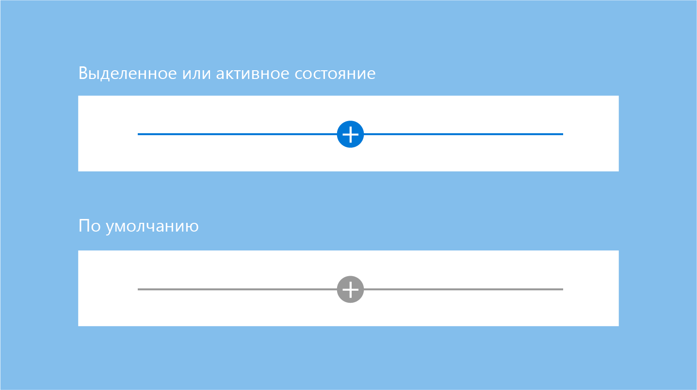
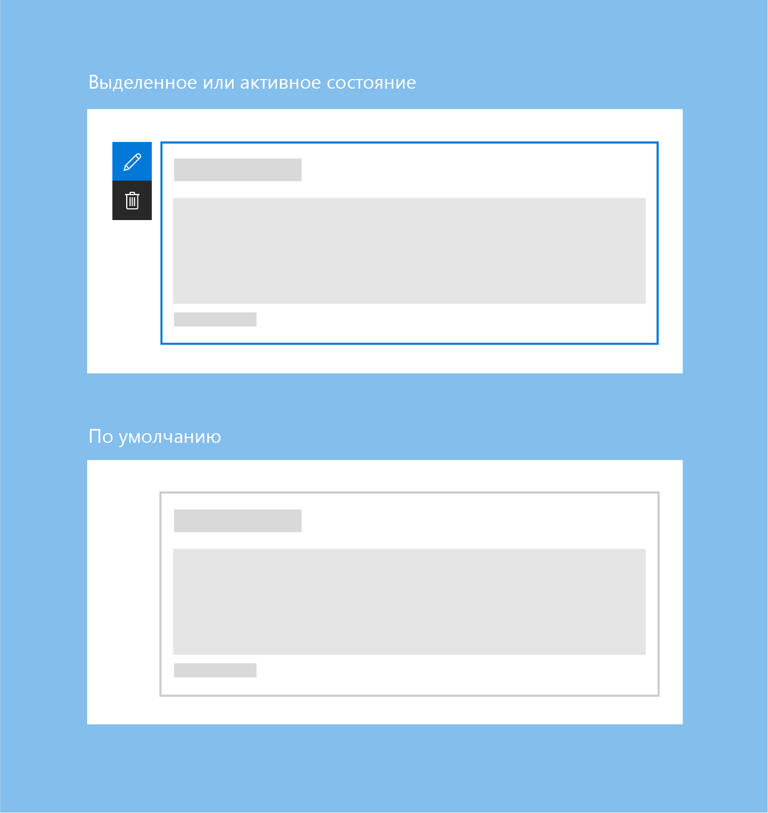
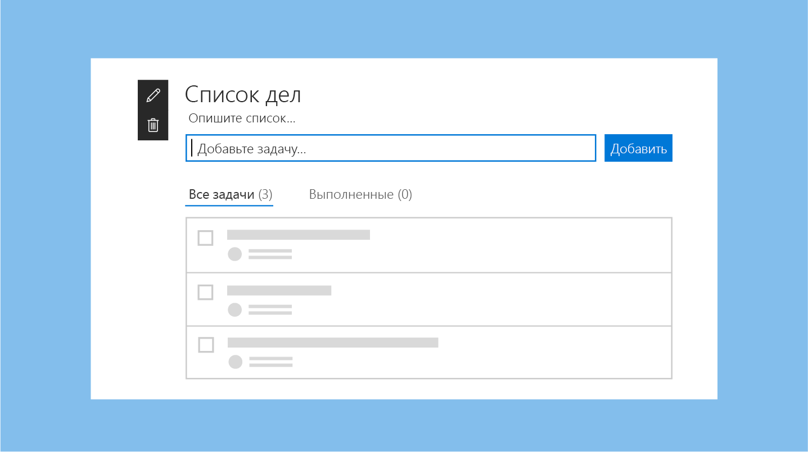
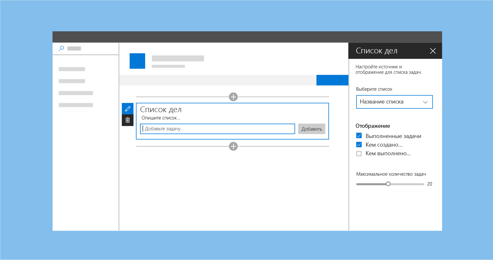
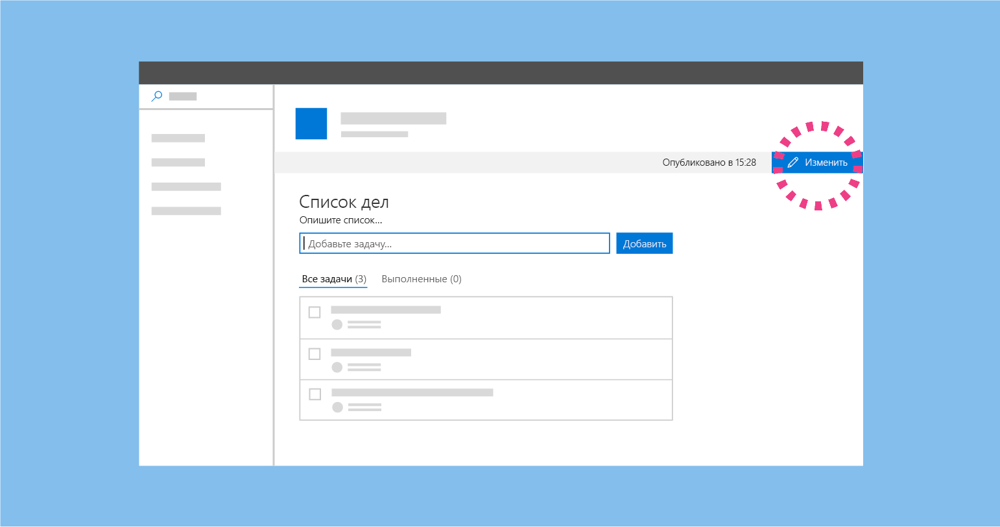
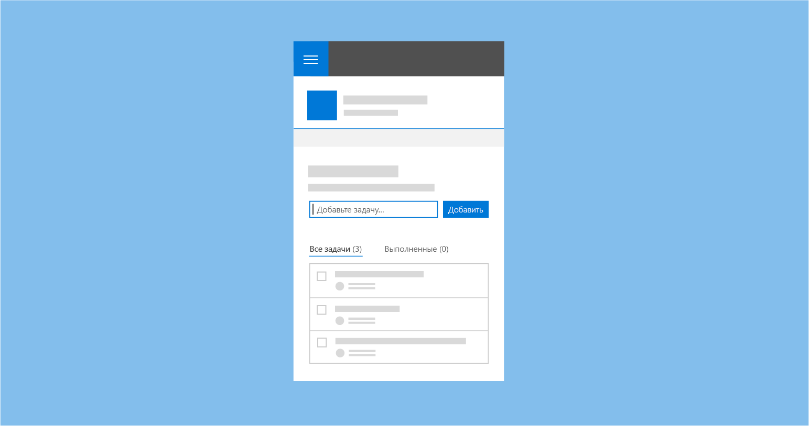

# Разработка страниц на сайте SharePoint

Разработка страниц в SharePoint — это простой процесс, тем не менее требующий знакомства со средой SharePoint, а также понимания того, для каких целей и для какой аудитории создается страница. Приступая к разработке, полезно следовать нескольким базовым принципам, например "начинайте с простого" и "развивайте то, что работает". Кроме того, полезно регулярно напоминать себе о своей аудитории и целях, которых вы пытаетесь помочь ей достичь.

<!-- Do we have content about the design principles that we can link to here? -->

У интерфейса создания страниц SharePoint есть два режима. 

- В режиме правки авторы страниц могут добавлять и настраивать веб-части, чтобы добавлять содержимое на страницу.
- В режиме публикации группа или аудитория может просматривать содержимое и работать с веб-частями. 

## Режим правки

При создании страницы пользователям доступен пользовательский интерфейс разработки для добавления и настройки содержимого страницы. 

### Подсказка о добавлении и панель элементов

Подсказка о добавлении — это горизонтальная линия со значком "плюс", которая отображается при выделении веб-части или наведении указателя мыши на нее и указывает на то, что авторы могут добавлять веб-части на свою страницу. Когда пользователь нажимает значок "плюс", открывается панель элементов. Панель элементов содержит все веб-части, которые можно добавить на страницу.

### Панель инструментов

Вертикальная панель инструментов и ограничивающий прямоугольник входят в состав платформы для каждой веб-части и предоставляются страницей. Для каждой веб-части на панели инструментов есть действия редактирования и удаления. 

### Активное и плавающее состояния

В активном и плавающем состояниях обычно отображаются линии подсказок синего цвета или основного цвета темы сайта.

По умолчанию веб-часть окружена серым ограничивающим прямоугольником, но при наведении указателя или выборе веб-части его цвет меняется на синий или основной цвет темы сайта.

### Контекстная правка

Создавайте для веб-частей интерфейс в режиме WYSIWYG, чтобы пользователи могли указывать сведения и добавлять содержимое, которое будет отображаться при публикации. Это содержимое следует добавлять на странице, чтобы пользователь понимал, как оно будет отображаться. Например, заголовки и описания следует вводить там, где будет отображаться текст, а новые задачи следует добавлять и редактировать в контексте страницы.

### Правка на уровне элементов

Пользовательский интерфейс веб-части может меняться. Например, текст может превращаться в текстовое поле, а при отображении интерфейса можно менять порядок элементов и отмечать задачи в веб-части. Вы можете включить интерактивные функции веб-частей в режиме правки, режиме чтения или в обоих режимах в зависимости от целей разработки.

### Области свойств

Области свойств вызываются с помощью значка **Правка** на панели инструментов. Области свойств в первую очередь должны содержать параметры конфигурации для включения и отключения компонентов, которые либо отображаются на странице, либо вызывают службу для отображения содержимого. 

## Режим публикации

После публикации страницы пользовательский интерфейс редактирования отключается для посетителей страницы. Чтобы продолжить ее редактировать, пользователь может нажать кнопку **Изменить** в правом верхнем углу панели команд.

## Мобильное представление

Все страницы SharePoint являются [адаптивными](grid-and-responsive-design.md), то есть их содержимое можно просматривать на мобильных устройствах. При разработке веб-части важно понимать, как новые страницы сайтов SharePoint отображаются на разных устройствах.

