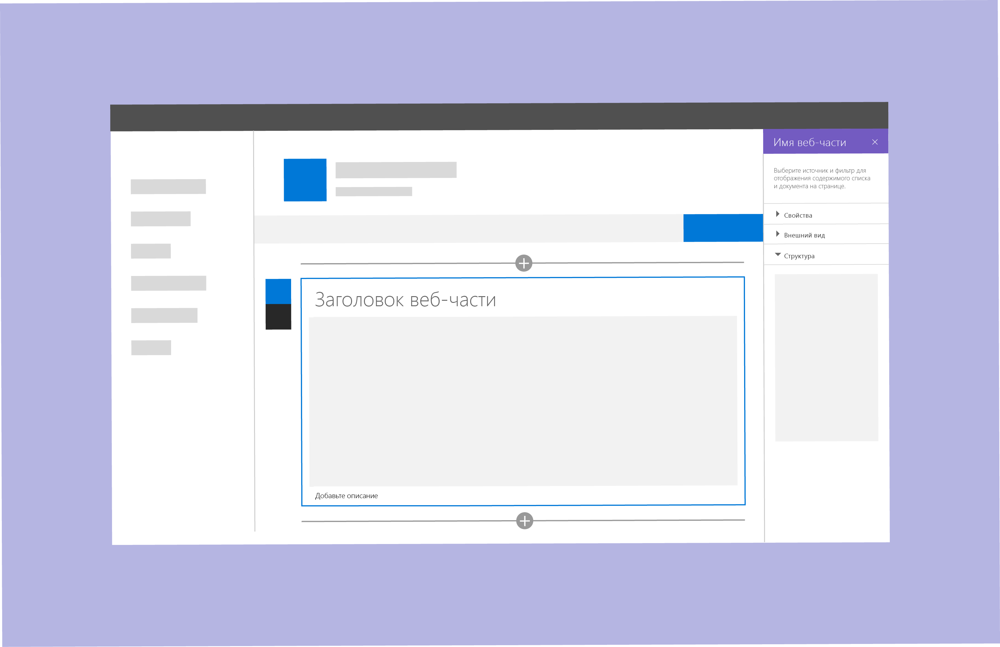

# Разработка веб-части SharePoint

Перед разработкой веб-части SharePoint следует знать, как [создавать страницы на сайте SharePoint](authoring-pages.md). Если вы еще не сделали этого, создайте страницу и добавьте на нее веб-части нескольких типов. Важно понимать, как упростить и ускорить подготовку новой веб-части к работе с помощью компонентов и стилей Office Fabric.

При разработке веб-частей важно владеть понятиями, описанными в следующих статьях:

- [Типы областей свойств и их применение](#property-pane-types);
- [Реактивные и нереактивные веб-части](reactive-and-nonreactive-web-parts.md);
- [Названия и описания](web-part-titles-and-descriptions.md);
- [Резервные варианты и заполнители](placeholders-and-fallbacks.md).

## Типы областей свойств

Вы можете использовать области свойств трех типов для оформления и разработки веб-частей, соответствующих потребностям вашего бизнеса и клиентов.

Чтобы открыть область для настройки параметров веб-части, нажмите **Изменить**. С помощью этой области можно включать и отключать функции, выбирать источник и макет, а также задавать параметры. Редактируйте содержимое веб-части в самой веб-части, а не в области свойств.

Ширина области свойств составляет 320 пикселей. При ее открытии выполняется автоматическое расплавление страницы.

### Одиночная область
Одиночная область используется для простых веб-частей с небольшим количеством настраиваемых свойств.

### Область с элементом "аккордеон"
Область-гармошка используется для размещения групп свойств с большим количеством вариантов, образующих длинный прокручивающийся список. Например, у вас может быть три группы с названиями "Свойства", "Внешний вид" и "Макет", по десять компонентов в каждой.

Используйте области с элементами "аккордеон", если требуется добавить классификацию в сложную веб-часть.

**Пример групп элементов "аккордеон", где открыта последняя область**

**Пример групп элементов "аккордеон", где открыты две группы**

### Область с пошаговым представлением

Область с пошаговым представлением используется для группирования свойств на нескольких этапах или страницах, если веб-часть требуется настраивать в линейном порядке, а также если параметры, выбранные на первом этапе, влияют на то, какие параметры отображаются на втором или третьем. 

**Этап 1 в области с пошаговым представлением**

На этапе 1 кнопка "Назад" отключена, а кнопка "Далее" включена.

**Этап 2 в области с пошаговым представлением** 

На этапе 2 кнопки "Назад" и "Далее" включены.

**Этап 3 в области с пошаговым представлением** 

На этапе 3 кнопка "Далее" отключена, а кнопка "Назад" включена.

